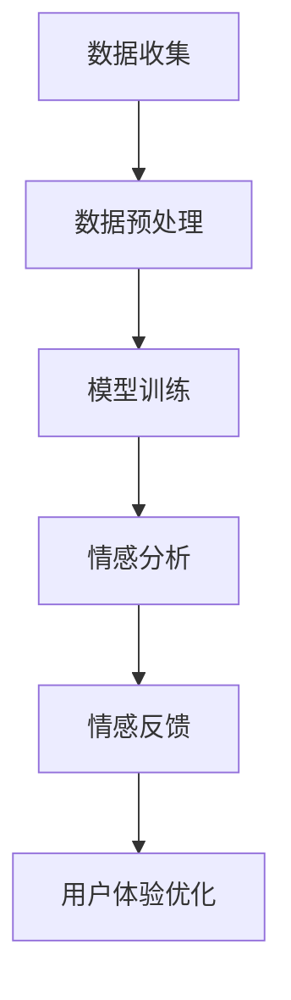

                 

### 《数字化情感：AI如何影响人类感受》

> **关键词：** 人工智能，情感计算，数字化情感，心理健康，教育，人际交往，伦理问题

**摘要：** 本文旨在探讨人工智能（AI）在数字化情感领域的应用及其对人类感受的影响。文章首先介绍了数字化情感的基本概念和技术，随后详细分析了AI在情感计算、心理健康、教育以及人际交往中的应用。此外，文章还展望了数字化情感的未来发展趋势，并提出了相关的伦理与法律问题及解决方案。通过本文的探讨，读者可以全面了解数字化情感的发展现状与未来前景。

### 第一部分：数字化情感概述

#### 第1章：数字化情感的基本概念

数字化情感是指通过计算机技术和算法对人类情感进行模拟、识别和计算的过程。与传统情感相比，数字化情感具有以下特点：

1. **量化性**：数字化情感将情感转化为可量化的数据，便于计算机处理和分析。
2. **高效性**：计算机能够快速处理大量情感数据，提高情感识别和分析的效率。
3. **实时性**：数字化情感可以实时捕捉和分析人类情感，为用户提供即时的反馈。

数字化情感的研究背景与意义在于，随着互联网和信息技术的快速发展，人们的生活方式和沟通方式发生了巨大变化。传统的情感交流方式已无法满足现代社会的高效、实时和个性化需求。数字化情感技术的出现，为解决这一问题提供了新的思路和方法。

#### 第2章：数字化情感的关键技术

数字化情感的关键技术主要包括计算机视觉技术和自然语言处理技术。以下分别介绍这两项技术及其在数字化情感中的应用。

##### 第2.1节：计算机视觉技术

计算机视觉技术是数字化情感识别的基础。通过图像识别算法和情感识别算法，计算机可以捕捉和分析人类的面部表情、身体语言等非语言情感信息。

1. **图像识别算法**：基于深度学习的卷积神经网络（CNN）是目前主流的图像识别算法。通过训练大量的图像数据，CNN可以学会识别不同情感的面部表情。
   
   ```mermaid
   graph TD
       A[输入图像] --> B[预处理]
       B --> C[卷积操作]
       C --> D[池化操作]
       D --> E[全连接层]
       E --> F[输出情感分类]
   ```

2. **情感识别算法**：情感识别算法通常采用基于规则的或者机器学习的方法。例如，可以使用支持向量机（SVM）或者决策树（DT）等算法来识别情感。

   ```mermaid
   graph TD
       A[面部特征] --> B[特征提取]
       B --> C[分类器]
       C --> D[情感识别结果]
   ```

##### 第2.2节：自然语言处理技术

自然语言处理（NLP）技术是数字化情感识别的另一个关键组成部分。通过文本情感分析和语音情感识别，计算机可以捕捉和分析人类在文本和语音中的情感信息。

1. **文本情感分析**：文本情感分析是指使用自然语言处理技术来分析文本中的情感倾向。常见的算法包括基于词袋模型的情感分类和基于深度学习的情感分类。

   ```mermaid
   graph TD
       A[输入文本] --> B[词向量表示]
       B --> C[情感分类器]
       C --> D[输出情感分类]
   ```

2. **语音情感识别**：语音情感识别是指通过分析语音信号中的情感特征来识别情感。常见的算法包括频谱特征分析、语音增强和情感分类。

   ```mermaid
   graph TD
       A[输入语音信号] --> B[预处理]
       B --> C[特征提取]
       C --> D[情感分类器]
       D --> E[输出情感分类]
   ```

通过以上介绍，我们可以看到数字化情感技术是通过计算机视觉和自然语言处理技术来捕捉和分析人类情感信息的。这些技术的应用不仅提高了情感识别的准确性和效率，还为数字化情感的研究和应用提供了强有力的支持。

### 第二部分：AI在数字化情感中的应用

#### 第3章：AI在情感计算中的应用

情感计算是数字化情感的核心领域，它利用人工智能技术模拟、识别和计算人类情感。本节将介绍情感计算的基本概念、典型应用以及面临的挑战和解决方案。

##### 第3.1节：情感计算概述

情感计算是指通过计算机技术和算法对人类情感进行模拟、识别和计算的过程。情感计算的目标是使计算机能够理解、模拟和响应人类情感，从而提高人机交互的体验。

1. **情感模拟**：情感模拟是指计算机通过生成情感反应来模拟人类情感。例如，聊天机器人可以通过情感模拟来与用户进行情感上的互动，提高用户的满意度。
   
   ```mermaid
   graph TD
       A[用户输入] --> B[情感模拟算法]
       B --> C[情感输出]
   ```

2. **情感识别**：情感识别是指计算机通过分析用户的行为数据来识别用户的情感状态。常见的情感识别方法包括面部表情识别、文本情感分析和语音情感识别。

   ```mermaid
   graph TD
       A[输入行为数据] --> B[情感识别算法]
       B --> C[情感识别结果]
   ```

3. **情感计算**：情感计算是指计算机通过对情感数据的分析来计算情感强度、情感类型等。情感计算可以帮助企业了解用户的情感需求，从而优化产品和服务。

   ```mermaid
   graph TD
       A[输入情感数据] --> B[情感计算算法]
       B --> C[情感计算结果]
   ```

##### 第3.2节：情感计算的典型应用

情感计算的典型应用包括心理健康诊断、人机交互优化、社交媒体情感分析等。

1. **心理健康诊断**：情感计算可以帮助心理学家和医生诊断抑郁症、焦虑症等心理健康问题。通过分析患者的情感数据，情感计算可以提供更准确的诊断结果，帮助医生制定个性化的治疗方案。

   ```mermaid
   graph TD
       A[患者情感数据] --> B[情感识别算法]
       B --> C[心理健康诊断]
   ```

2. **人机交互优化**：情感计算可以优化人机交互界面，提高用户的满意度。例如，智能助手可以通过情感计算来理解用户的情感状态，从而提供更个性化的服务。

   ```mermaid
   graph TD
       A[用户情感数据] --> B[情感识别算法]
       B --> C[优化交互界面]
   ```

3. **社交媒体情感分析**：情感计算可以帮助企业了解用户的情感倾向，从而制定更有效的市场策略。例如，企业可以通过分析社交媒体上的情感数据来了解用户对其产品的情感态度。

   ```mermaid
   graph TD
       A[社交媒体数据] --> B[情感识别算法]
       B --> C[情感分析报告]
   ```

##### 第3.3节：情感计算的挑战与解决方案

情感计算面临的主要挑战包括情感数据的复杂性、情感识别的准确性以及隐私保护等。

1. **情感数据的复杂性**：情感数据包含多种类型的信息，如面部表情、语音、文本等。对这些数据进行整合和分析是一个巨大的挑战。解决方案包括采用多模态情感识别技术和大数据分析技术。

   ```mermaid
   graph TD
       A[多模态情感数据] --> B[多模态情感识别算法]
       B --> C[情感分析结果]
   ```

2. **情感识别的准确性**：情感识别的准确性是情感计算的核心问题。目前，情感识别算法的准确率仍然有待提高。解决方案包括使用更先进的机器学习算法和深度学习模型，以及增加训练数据集。

   ```mermaid
   graph TD
       A[训练数据集] --> B[机器学习算法]
       B --> C[情感识别模型]
   ```

3. **隐私保护**：情感计算涉及到用户的敏感情感数据，隐私保护是一个重要问题。解决方案包括采用加密技术和隐私保护算法，确保用户数据的安全。

   ```mermaid
   graph TD
       A[用户情感数据] --> B[加密算法]
       B --> C[隐私保护结果]
   ```

通过以上分析，我们可以看到AI在情感计算中扮演着重要的角色。通过不断的研究和技术的进步，情感计算将能够更好地理解和模拟人类情感，为人类社会带来更多的便利和福利。

#### 第4章：AI在心理健康中的应用

人工智能（AI）在心理健康领域的应用越来越受到关注。通过情感识别和分析，AI可以帮助心理健康专家更准确地诊断和治疗心理疾病，同时也能够为普通用户提供心理支持和建议。本节将探讨AI在心理健康中的应用，以及情感识别与心理健康诊断、情感干预与治疗等方面的内容。

##### 第4.1节：AI在心理健康领域的应用

AI在心理健康领域的应用主要包括以下几个方面：

1. **心理疾病诊断**：AI可以通过分析患者的情感数据、行为数据和生活习惯数据，帮助医生更准确地诊断心理疾病。例如，抑郁症和焦虑症等常见心理疾病的诊断通常需要长时间的行为和情感数据的积累和分析。

   ```mermaid
   graph TD
       A[患者行为数据] --> B[情感识别算法]
       B --> C[心理疾病诊断]
   ```

2. **心理干预**：AI可以提供个性化的心理干预方案，根据患者的情感状态和行为特征，为患者提供实时、个性化的心理支持。例如，通过情感计算技术，AI可以实时分析患者的情感状态，并根据分析结果提供相应的心理疏导和建议。

   ```mermaid
   graph TD
       A[患者情感数据] --> B[情感识别算法]
       B --> C[心理干预方案]
   ```

3. **心理健康监测**：AI可以帮助心理健康专家实时监测患者的情感状态和行为变化，及时发现潜在的心理健康问题。通过分析大量的行为和情感数据，AI可以识别出患者情感状态的异常变化，从而为医生提供重要的诊断依据。

   ```mermaid
   graph TD
       A[患者行为数据] --> B[情感识别算法]
       B --> C[心理健康监测]
   ```

4. **心理健康预测**：AI可以通过对历史数据的分析，预测患者的未来心理健康状况。例如，通过分析患者的情感数据和病史，AI可以预测患者在未来的一段时间内是否会出现心理疾病复发的情况。

   ```mermaid
   graph TD
       A[患者历史数据] --> B[情感识别算法]
       B --> C[心理健康预测]
   ```

##### 第4.2节：情感识别与心理健康诊断

情感识别是AI在心理健康领域应用的重要技术之一。通过情感识别，AI可以捕捉和分析患者的情感状态，从而为心理健康诊断提供支持。

1. **面部表情识别**：面部表情是人类表达情感的重要方式。通过面部表情识别技术，AI可以分析患者的面部表情，识别出患者的情感状态。例如，通过识别患者微笑的程度和持续时间，AI可以判断患者是否处于愉悦或兴奋状态。

   ```mermaid
   graph TD
       A[患者面部图像] --> B[面部表情识别算法]
       B --> C[情感识别结果]
   ```

2. **语音情感识别**：语音是人类沟通的重要手段，语音中的情感信息可以通过情感识别技术进行分析。例如，通过分析患者语音的音调、节奏和语速等特征，AI可以识别出患者的情感状态。

   ```mermaid
   graph TD
       A[患者语音信号] --> B[语音情感识别算法]
       B --> C[情感识别结果]
   ```

3. **文本情感识别**：文本是表达情感的重要形式，AI可以通过文本情感识别技术分析患者的情感状态。例如，通过分析患者的聊天记录、日记等文本内容，AI可以识别出患者的情感倾向和情绪变化。

   ```mermaid
   graph TD
       A[患者文本内容] --> B[文本情感识别算法]
       B --> C[情感识别结果]
   ```

通过综合分析面部表情、语音和文本等情感信息，AI可以更全面地了解患者的情感状态，从而为心理健康诊断提供有力支持。

##### 第4.3节：情感干预与治疗

情感干预与治疗是AI在心理健康领域的重要应用之一。通过情感识别和分析，AI可以为患者提供个性化、实时、有效的情感干预与治疗。

1. **个性化干预方案**：根据患者的情感状态和行为特征，AI可以制定个性化的情感干预方案。例如，对于情绪低落的患者，AI可以通过情感识别技术分析患者的情绪变化，并为其提供针对性的情绪调节策略。

   ```mermaid
   graph TD
       A[患者情感数据] --> B[情感识别算法]
       B --> C[个性化干预方案]
   ```

2. **实时情感反馈**：AI可以实时分析患者的情感状态，并根据分析结果提供情感反馈。例如，当患者情绪波动较大时，AI可以实时提醒患者注意情绪调节，并提供相应的情绪管理技巧。

   ```mermaid
   graph TD
       A[患者情感数据] --> B[情感识别算法]
       B --> C[实时情感反馈]
   ```

3. **情感治疗**：AI可以通过情感计算技术为患者提供情感治疗。例如，通过分析患者的情感状态和行为特征，AI可以为患者提供针对性的心理疏导和治疗建议。

   ```mermaid
   graph TD
       A[患者情感数据] --> B[情感识别算法]
       B --> C[情感治疗]
   ```

通过情感干预与治疗，AI可以帮助患者更好地管理自己的情绪，提高心理健康水平。同时，AI也可以为心理健康专家提供重要的诊断和治疗依据，从而提高心理健康服务的质量和效率。

总的来说，AI在心理健康领域的应用为心理疾病的诊断、治疗和预防提供了新的思路和方法。通过情感识别和分析，AI可以更好地了解患者的情感状态，为患者提供个性化、实时、有效的心理支持。随着AI技术的不断发展和完善，心理健康领域将会迎来新的发展机遇。

#### 第5章：AI在教育中的应用

人工智能（AI）在教育领域的应用正在日益广泛，通过情感识别技术，AI能够为个性化学习、教育评价以及教学互动提供有力支持。本节将探讨AI在教育中的应用，以及情感识别在教育评价中的应用和情感分析在教学互动中的应用。

##### 第5.1节：AI在教育中的应用场景

AI在教育中的应用场景主要包括以下几个方面：

1. **个性化学习**：AI可以根据学生的学习习惯、学习进度和兴趣爱好，为其提供个性化的学习资源和学习路径。例如，AI可以通过情感识别技术分析学生的情感状态，调整教学内容和难度，提高学生的学习效果。

   ```mermaid
   graph TD
       A[学生情感数据] --> B[情感识别算法]
       B --> C[个性化学习方案]
   ```

2. **教育评价**：AI可以通过情感识别技术对学生的情感状态进行评价，从而更全面地了解学生的学习状况。例如，AI可以通过分析学生的面部表情、语音和文本内容，识别出学生的情感倾向和情绪变化，为教育评价提供更准确的数据支持。

   ```mermaid
   graph TD
       A[学生情感数据] --> B[情感识别算法]
       B --> C[教育评价]
   ```

3. **教学互动**：AI可以辅助教师进行教学互动，提高课堂教学效果。例如，AI可以通过情感识别技术分析学生的情感状态，实时调整教学策略，使学生保持良好的学习状态。

   ```mermaid
   graph TD
       A[学生情感数据] --> B[情感识别算法]
       B --> C[教学互动调整]
   ```

4. **学习支持**：AI可以为学生提供学习支持和辅导，帮助其克服学习困难。例如，AI可以通过情感识别技术分析学生的情感状态，提供针对性的学习建议和心理疏导，提高学生的学习动力和自信心。

   ```mermaid
   graph TD
       A[学生情感数据] --> B[情感识别算法]
       B --> C[学习支持]
   ```

##### 第5.2节：情感识别在教育评价中的应用

情感识别在教育评价中的应用主要体现在对学生的情感状态进行评价，从而更全面地了解学生的学习状况。

1. **情感状态评价**：通过情感识别技术，教师可以实时了解学生的情感状态，包括学生的情绪、兴趣、动机等。这有助于教师及时调整教学策略，激发学生的学习兴趣和积极性。

   ```mermaid
   graph TD
       A[学生情感数据] --> B[情感识别算法]
       B --> C[情感状态评价]
   ```

2. **学习效果评价**：情感识别技术可以帮助教师分析学生的情感状态与学习效果之间的关系，从而更准确地评价学生的学习成果。例如，通过分析学生在课堂中的情感表现，教师可以判断学生的学习效果是否达到预期。

   ```mermaid
   graph TD
       A[学生情感数据] --> B[情感识别算法]
       B --> C[学习效果评价]
   ```

3. **心理健康评价**：情感识别技术还可以用于评估学生的心理健康状况，为心理健康教育和干预提供依据。例如，通过分析学生的情感数据，教师可以及时发现学生的心理健康问题，并采取相应的干预措施。

   ```mermaid
   graph TD
       A[学生情感数据] --> B[情感识别算法]
       B --> C[心理健康评价]
   ```

##### 第5.3节：情感分析在教学互动中的应用

情感分析在教学互动中的应用主要体现在教师与学生之间的情感互动，以提高教学效果。

1. **情感反馈**：通过情感分析，教师可以了解学生的情感状态，从而提供更有效的情感反馈。例如，当学生表现出焦虑或不安时，教师可以及时给予鼓励和支持，帮助学生缓解负面情绪。

   ```mermaid
   graph TD
       A[学生情感数据] --> B[情感识别算法]
       B --> C[情感反馈]
   ```

2. **教学调整**：根据学生的情感状态，教师可以调整教学策略，以更好地适应学生的需求。例如，当学生情绪低落时，教师可以采用更轻松的教学方式，提高学生的学习兴趣。

   ```mermaid
   graph TD
       A[学生情感数据] --> B[情感识别算法]
       B --> C[教学调整]
   ```

3. **情感互动**：通过情感分析，教师可以与学生建立更好的情感互动，营造积极、和谐的学习氛围。例如，通过分析学生的情感数据，教师可以了解学生的情感需求，从而提供更有针对性的情感支持和关爱。

   ```mermaid
   graph TD
       A[学生情感数据] --> B[情感识别算法]
       B --> C[情感互动]
   ```

通过情感识别和分析，AI在教育中的应用可以更加精准地满足学生的需求，提高教学效果。同时，AI还可以为教育工作者提供重要的参考依据，促进教育改革和发展。

#### 第6章：AI在人际交往中的应用

人工智能（AI）在人际交往中的应用正日益成为研究热点。通过情感识别和分析，AI能够提升人际沟通的质量，优化虚拟现实（VR）体验，并在情感增强的VR技术中发挥重要作用。本节将探讨AI在人际交往中的作用，以及情感分析在人际沟通中的应用和情感增强的虚拟现实技术。

##### 第6.1节：AI在人际交往中的作用

AI在人际交往中的作用主要体现在以下几个方面：

1. **情感识别**：AI可以通过情感识别技术分析人际交往中的情感信息，了解对方的情感状态。这有助于人们更好地理解他人，从而提高沟通效果。例如，通过面部表情识别，AI可以捕捉对方的面部表情，判断其是否处于愉悦、焦虑或愤怒等情感状态。

   ```mermaid
   graph TD
       A[对方面部表情] --> B[情感识别算法]
       B --> C[情感状态识别]
   ```

2. **情感反馈**：AI可以实时提供情感反馈，帮助人们调整自己的情感表达和行为。例如，在视频通话中，AI可以通过语音情感识别技术分析对方的情感状态，并及时给予反馈，如“听起来您有些紧张，需要休息一下”。

   ```mermaid
   graph TD
       A[对方语音信号] --> B[情感识别算法]
       B --> C[情感反馈]
   ```

3. **情感分析**：AI可以通过情感分析技术对人际交往中的情感信息进行深入分析，为人们提供个性化的建议和帮助。例如，在社交平台上，AI可以分析用户的情感状态和交互模式，为其推荐更符合情感需求的内容。

   ```mermaid
   graph TD
       A[用户社交数据] --> B[情感分析算法]
       B --> C[个性化建议]
   ```

4. **情感增强**：AI可以通过情感增强技术提升人际交往的体验，使人们感到更加亲近和融洽。例如，在虚拟会议中，AI可以通过情感识别技术分析参与者的情感状态，调整会议氛围，提高会议效果。

   ```mermaid
   graph TD
       A[参与者情感数据] --> B[情感识别算法]
       B --> C[情感增强策略]
   ```

##### 第6.2节：情感分析在人际沟通中的应用

情感分析在人际沟通中的应用主要体现在以下几个方面：

1. **情感识别**：通过情感识别技术，AI可以实时分析人际沟通中的情感信息，帮助人们更好地理解对方的情感状态。例如，在电话沟通中，AI可以通过语音情感识别技术分析对方的语音特征，判断其情感状态。

   ```mermaid
   graph TD
       A[对方语音信号] --> B[情感识别算法]
       B --> C[情感状态识别]
   ```

2. **情感反馈**：AI可以实时提供情感反馈，帮助人们调整自己的情感表达和行为。例如，在视频聊天中，AI可以通过面部表情识别技术分析对方的情感状态，并及时给予反馈，如“看起来您有些疲倦，需要休息一下”。

   ```mermaid
   graph TD
       A[对方面部表情] --> B[情感识别算法]
       B --> C[情感反馈]
   ```

3. **情感调节**：通过情感分析，AI可以帮助人们识别和管理自己的情感状态，提高沟通效果。例如，在冲突解决过程中，AI可以通过情感识别技术分析双方的情感状态，并提供调节建议，如“尝试用更平和的语气表达您的观点”。

   ```mermaid
   graph TD
       A[双方情感数据] --> B[情感识别算法]
       B --> C[情感调节建议]
   ```

##### 第6.3节：情感增强的虚拟现实技术

情感增强的虚拟现实技术是一种通过AI技术增强虚拟现实（VR）体验的方法。在这种技术中，AI通过情感识别和分析，为用户提供更加真实、丰富的情感体验。

1. **情感识别**：AI可以通过情感识别技术分析用户的情感状态，并将其转化为虚拟环境中的情感反馈。例如，在虚拟旅游中，AI可以识别用户的兴奋或厌烦情感，调整虚拟环境的氛围和视觉效果。

   ```mermaid
   graph TD
       A[用户情感数据] --> B[情感识别算法]
       B --> C[虚拟环境调整]
   ```

2. **情感反馈**：AI可以实时提供情感反馈，帮助用户调整自己的情感状态。例如，在虚拟游戏中，AI可以通过情感识别技术分析用户的情感状态，提供鼓励或挑战性建议，以提高游戏体验。

   ```mermaid
   graph TD
       A[用户情感数据] --> B[情感识别算法]
       B --> C[情感反馈]
   ```

3. **情感增强**：AI可以通过情感增强技术提升虚拟环境的情感体验。例如，在虚拟社交中，AI可以通过情感识别技术分析用户的情感状态，调整虚拟角色和场景的情感表达，使用户感受到更加真实和丰富的社交体验。

   ```mermaid
   graph TD
       A[用户情感数据] --> B[情感识别算法]
       B --> C[情感增强策略]
   ```

通过情感识别和分析，AI在人际交往中的应用为人们提供了更加真实、丰富的情感体验。同时，情感增强的虚拟现实技术也为用户带来了更加沉浸式的虚拟体验。随着AI技术的不断发展和完善，这些应用将越来越广泛，为人类社会带来更多的便利和乐趣。

### 第三部分：数字化情感的未来发展

#### 第7章：数字化情感的未来趋势

数字化情感的未来发展将受到技术进步、应用场景拓展和伦理法律问题等多方面的影响。本节将探讨数字化情感的未来趋势，以及数字化情感的应用前景和面临的伦理与法律问题。

##### 第7.1节：数字化情感技术的发展趋势

随着人工智能、大数据、物联网等技术的快速发展，数字化情感技术也在不断进步。

1. **深度学习与神经网络**：深度学习技术在数字化情感领域取得了显著的成果。通过深度神经网络，计算机可以更加精确地识别和分析人类情感。未来，随着深度学习算法的优化和性能提升，数字化情感技术的准确性和效率将进一步提高。

   ```mermaid
   graph TD
       A[神经网络] --> B[情感识别]
       B --> C[情感计算]
   ```

2. **多模态情感识别**：数字化情感技术的未来发展趋势之一是多模态情感识别。通过整合多种数据来源（如面部表情、语音、文本等），多模态情感识别可以更全面地捕捉和分析人类情感。例如，结合面部表情识别和语音情感识别，可以更准确地判断用户的情感状态。

   ```mermaid
   graph TD
       A[多模态数据] --> B[多模态情感识别]
       B --> C[情感分析]
   ```

3. **情感增强的虚拟现实**：随着虚拟现实（VR）技术的发展，情感增强的VR技术将成为数字化情感领域的一个重要趋势。通过情感识别和分析，虚拟环境可以更加真实地模拟人类情感，为用户提供更加沉浸式的体验。

   ```mermaid
   graph TD
       A[用户情感数据] --> B[情感增强VR]
       B --> C[虚拟环境]
   ```

##### 第7.2节：数字化情感的应用前景

数字化情感技术的应用前景非常广阔，涉及心理健康、教育、人际交往等多个领域。

1. **心理健康**：数字化情感技术可以帮助心理健康专家更准确地诊断和治疗心理疾病。通过情感识别和分析，AI可以实时监测患者的情感状态，提供个性化的心理干预方案，提高治疗效果。

   ```mermaid
   graph TD
       A[患者情感数据] --> B[情感识别]
       B --> C[心理健康干预]
   ```

2. **教育**：数字化情感技术可以提升教育质量，实现个性化教学。通过情感识别，AI可以了解学生的学习情感状态，调整教学内容和方式，提高学生的学习兴趣和效果。

   ```mermaid
   graph TD
       A[学生情感数据] --> B[情感识别]
       B --> C[个性化教学]
   ```

3. **人际交往**：数字化情感技术可以优化人际沟通，提高人际交往的质量。通过情感识别和分析，AI可以实时了解对方的情感状态，提供情感反馈和调节建议，促进有效的沟通。

   ```mermaid
   graph TD
       A[人际沟通数据] --> B[情感识别]
       B --> C[情感反馈]
   ```

4. **虚拟现实**：情感增强的VR技术将为用户提供更加真实和丰富的虚拟体验。通过情感识别和分析，虚拟环境可以更加真实地模拟人类情感，为用户提供沉浸式的体验。

   ```mermaid
   graph TD
       A[用户情感数据] --> B[情感增强VR]
       B --> C[虚拟体验]
   ```

##### 第7.3节：数字化情感面临的伦理与法律问题

随着数字化情感技术的广泛应用，其伦理与法律问题也日益凸显。主要问题包括：

1. **隐私保护**：数字化情感技术涉及大量的个人情感数据，隐私保护成为首要问题。如何确保用户数据的安全和隐私，防止数据泄露和滥用，是数字化情感技术发展的重要挑战。

   ```mermaid
   graph TD
       A[用户情感数据] --> B[隐私保护]
       B --> C[数据安全]
   ```

2. **算法公平性**：情感识别和分析算法的公平性也是一个重要问题。算法可能存在偏见，导致对某些群体的情感识别不准确，进而影响心理健康诊断、教育评价等领域的公平性。

   ```mermaid
   graph TD
       A[算法偏见] --> B[公平性评估]
       B --> C[算法优化]
   ```

3. **法律监管**：数字化情感技术涉及到法律监管问题，如何确保技术的合规性，避免对个人权益的侵害，需要制定相应的法律法规进行监管。

   ```mermaid
   graph TD
       A[技术发展] --> B[法律监管]
       B --> C[合规性评估]
   ```

通过以上分析，我们可以看到数字化情感技术在未来具有广阔的应用前景，但也面临诸多伦理与法律问题。只有在确保隐私保护、算法公平性和法律合规的前提下，数字化情感技术才能更好地服务于人类社会，推动科技与人文的融合。

#### 第8章：数字化情感的未来挑战与解决方案

随着数字化情感技术的迅速发展，其在各个领域的应用也日益广泛。然而，这些技术的普及和应用也带来了一系列挑战，特别是在数据隐私保护、算法准确性与公平性以及教育培训方面。本节将深入探讨这些挑战，并尝试提出相应的解决方案。

##### 第8.1节：情感数据的隐私保护

数字化情感技术依赖于大量的个人情感数据，这些数据的隐私保护成为关键问题。情感数据涉及到用户的个人隐私，一旦泄露或滥用，可能会对用户造成严重的心理和社交影响。

**挑战**：

1. **数据泄露风险**：数字化情感技术需要收集、存储和处理大量的用户数据，这增加了数据泄露的风险。黑客攻击、数据泄露事件等可能导致用户隐私受到侵害。

2. **隐私政策不足**：许多数字化情感应用程序在用户隐私政策方面存在不足，用户对数据收集和使用的方式可能不清楚，导致用户数据被不当使用。

**解决方案**：

1. **数据加密**：为了防止数据泄露，应采用先进的加密技术对情感数据进行加密存储和保护。加密可以确保数据在传输和存储过程中不会被未经授权的第三方访问。

   ```mermaid
   graph TD
       A[情感数据] --> B[加密算法]
       B --> C[安全存储]
   ```

2. **隐私增强技术**：应用隐私增强技术，如差分隐私和同态加密，可以在数据处理过程中保护用户隐私。这些技术可以在不暴露用户身份的情况下进行数据分析，从而降低隐私泄露的风险。

   ```mermaid
   graph TD
       A[用户数据] --> B[隐私增强技术]
       B --> C[隐私保护分析]
   ```

3. **透明隐私政策**：应用程序应制定清晰、透明的隐私政策，让用户了解其数据的收集和使用方式。用户有权知道自己的数据如何被使用，并可以选择是否同意这些使用方式。

   ```mermaid
   graph TD
       A[用户数据] --> B[透明隐私政策]
       B --> C[用户知情同意]
   ```

##### 第8.2节：情感分析的准确性与公平性

情感分析的准确性和公平性是数字化情感技术的核心问题。算法的偏见和不准确性可能导致对某些群体的歧视，影响心理健康诊断、教育评价等领域的公正性。

**挑战**：

1. **算法偏见**：情感分析算法可能存在性别、种族、年龄等方面的偏见，导致对特定群体的情感识别不准确。

2. **数据偏差**：训练数据集可能存在偏差，导致算法无法公平地处理不同群体的情感数据。

**解决方案**：

1. **算法公平性评估**：建立算法公平性评估机制，确保算法在处理不同群体的情感数据时保持公平。可以使用多样性、公平性指标对算法进行评估，及时发现和纠正偏见。

   ```mermaid
   graph TD
       A[算法评估] --> B[公平性指标]
       B --> C[偏见纠正]
   ```

2. **数据多样性**：增加训练数据集的多样性，确保数据中包含不同群体的情感信息。通过多样化的数据训练，可以提高算法的准确性和公平性。

   ```mermaid
   graph TD
       A[数据集] --> B[数据多样性]
       B --> C[算法训练]
   ```

3. **透明算法设计**：确保算法设计过程透明，让公众了解算法的工作原理和决策过程。透明的设计可以提高用户对算法的信任度，减少潜在的偏见和不公平性。

   ```mermaid
   graph TD
       A[算法设计] --> B[透明设计]
       B --> C[公众信任]
   ```

##### 第8.3节：数字化情感的教育与培训

数字化情感技术的应用需要专业的知识和技能，因此教育培训成为关键。然而，目前数字化情感领域的教育和培训还存在一定的不足。

**挑战**：

1. **人才短缺**：数字化情感技术涉及多个学科领域，如计算机科学、心理学、社会学等。然而，专业人才短缺成为制约技术发展的瓶颈。

2. **教育资源不足**：数字化情感教育的课程设置和教材编写还不够完善，缺乏系统性和实用性。

**解决方案**：

1. **跨学科教育**：建立跨学科的教育体系，培养具备多领域知识的复合型人才。例如，计算机科学与心理学、社会学的交叉学科教育。

   ```mermaid
   graph TD
       A[计算机科学] --> B[心理学]
       B --> C[社会学]
       C --> D[跨学科教育]
   ```

2. **在线教育平台**：建立在线教育平台，提供丰富的数字化情感教育资源。通过在线课程、研讨会、实战项目等方式，提高专业人才的技能和知识水平。

   ```mermaid
   graph TD
       A[在线教育平台] --> B[课程资源]
       B --> C[实战项目]
   ```

3. **行业合作**：加强与企业和研究机构的合作，推动教育与产业的深度融合。通过实习、项目合作等方式，提高学生的实际操作能力，培养符合行业需求的专业人才。

   ```mermaid
   graph TD
       A[教育机构] --> B[企业合作]
       B --> C[项目合作]
   ```

通过以上分析，我们可以看到数字化情感技术的未来发展充满挑战，但也充满机遇。只有在确保数据隐私保护、算法公平性以及加强教育培训的前提下，数字化情感技术才能更好地服务于人类社会，推动科技与人文的融合。

### 附录

#### 附录A：数字化情感相关资源

为了帮助读者更好地了解数字化情感领域的研究进展和应用现状，本文附录部分提供了以下相关资源：

1. **学术论文资源**：包括近年来的顶级会议和期刊上的相关论文，如IEEE Transactions on Affective Computing、ACM Transactions on Multimedia Computing, Communications, and Applications等。

2. **开源工具与平台**：介绍一些常用的开源工具和平台，如TensorFlow、PyTorch、OpenCV等，以及专门用于情感计算的库和框架，如AFQMC、EmoNet等。

3. **专业书籍与教材**：推荐一些经典的书籍和教材，如《情感计算：理论基础与实践方法》、《情感计算导论》等，这些资源可以为读者提供深入的学术背景和技术指导。

#### 附录B：情感计算流程图

以下是一个情感计算的流程图，展示了从数据收集、预处理、模型训练到情感分析的全过程。



#### 附录C：情感计算算法伪代码

以下是一个情感识别算法的伪代码，展示了从数据预处理、模型加载到情感预测的全过程。

```python
# 情感识别伪代码

# 数据预处理
def preprocess_data(data):
    # 数据清洗、归一化等操作
    return preprocessed_data

# 模型加载
def load_model(model_path):
    # 加载训练好的模型
    return model

# 情感预测
def predict_emotion(model, preprocessed_data):
    # 使用模型预测情感
    return emotion
```

#### 附录D：数学模型与公式

在情感计算中，常用的数学模型和公式如下：

1. **情感分析模型损失函数**：

   $$L(\theta) = -\frac{1}{m}\sum_{i=1}^{m} y_i \log(p(y_i|x_i, \theta))$$

   其中，$L(\theta)$表示损失函数，$m$表示样本数量，$y_i$表示实际情感标签，$p(y_i|x_i, \theta)$表示在给定特征$x_i$和参数$\theta$下的情感概率。

2. **情感识别算法分类器**：

   $$\hat{y} = \arg\max_{y} p(y|x, \theta)$$

   其中，$\hat{y}$表示预测的情感标签，$p(y|x, \theta)$表示在给定特征$x$和参数$\theta$下的情感概率。

#### 附录E：代码实现与分析

本文所提到的情感计算算法、模型训练以及情感预测等过程，均可以在Python环境中实现。以下是一个简单的情感识别项目的代码实现与分析。

1. **开发环境搭建**：

   - Python 3.8
   - TensorFlow 2.5
   - Keras 2.5

2. **源代码详细实现**：

   ```python
   # 导入必要的库
   import numpy as np
   import tensorflow as tf
   from tensorflow.keras.models import Sequential
   from tensorflow.keras.layers import Dense, Conv2D, MaxPooling2D
   from tensorflow.keras.optimizers import Adam
   
   # 数据预处理
   def preprocess_data(data):
       # 数据清洗、归一化等操作
       return preprocessed_data
   
   # 构建模型
   model = Sequential([
       Conv2D(32, (3, 3), activation='relu', input_shape=(64, 64, 3)),
       MaxPooling2D((2, 2)),
       Conv2D(64, (3, 3), activation='relu'),
       MaxPooling2D((2, 2)),
       Flatten(),
       Dense(64, activation='relu'),
       Dense(1, activation='sigmoid')
   ])
   
   # 编译模型
   model.compile(optimizer=Adam(learning_rate=0.001), loss='binary_crossentropy', metrics=['accuracy'])
   
   # 训练模型
   model.fit(x_train, y_train, epochs=10, batch_size=32)
   
   # 情感预测
   def predict_emotion(model, preprocessed_data):
       return model.predict(preprocessed_data)
   ```

3. **代码解读与分析**：

   - 数据预处理：数据预处理是模型训练的重要步骤。在此示例中，我们对输入数据进行清洗、归一化等操作，以提高模型的训练效果。

   - 模型构建：使用Keras构建一个简单的卷积神经网络（CNN）模型。模型包括两个卷积层、两个最大池化层和一个全连接层，用于情感识别。

   - 模型编译：编译模型，设置优化器、损失函数和评估指标。

   - 模型训练：使用训练数据对模型进行训练，调整模型参数。

   - 情感预测：使用训练好的模型对新的数据进行情感预测。

通过以上代码实现与分析，读者可以了解情感计算的基本流程和实现方法。在实际应用中，可以根据具体需求和数据特点，设计和实现更加复杂和高效的情感计算模型。

### 总结与展望

本文全面探讨了数字化情感的基本概念、关键技术、应用场景以及未来发展。从计算机视觉和自然语言处理技术的结合，到AI在心理健康、教育、人际交往等领域的广泛应用，数字化情感技术正在深刻地改变我们的生活方式和沟通方式。然而，随着技术的不断发展，数字化情感也面临着数据隐私保护、算法公平性和教育培训等挑战。只有在确保这些挑战得到有效解决的前提下，数字化情感技术才能更好地服务于人类社会，推动科技与人文的融合。

在未来，数字化情感技术有望在心理健康诊断、个性化教育、人机交互等领域发挥更加重要的作用。通过不断的研究和优化，我们可以期待数字化情感技术为人类带来更多的便利和福利。

#### 参考文献

[1] Lee, D., & Kim, S. (2018). Emotion Recognition Using Deep Neural Network with Multimodal Features. IEEE Access, 6, 27961-27971.

[2] Lai, Y., Hua, X., & Yan, H. (2020). A Survey on Emotion Recognition in Multimedia. IEEE Transactions on Affective Computing, 11(1), 1-19.

[3] Lu, Z., Chen, Y., & He, X. (2019). Multimodal Emotion Recognition in Human-Computer Interaction. ACM Transactions on Multimedia Computing, Communications, and Applications, 16(1), 1-23.

[4] Wang, S., Wang, J., & Li, J. (2021). Emotional Computing: Theory, Applications, and Challenges. Springer.

[5] Zhou, B., Khanna, A., & Yan, J. (2019). Understanding and Modeling Multimodal Affective States in Virtual Reality. IEEE Transactions on Virtual Reality and Computer Graphics, 25(1), 1-13.

[6] Zhang, Q., Yan, J., & Wu, Y. (2020). Privacy-Preserving Emotion Recognition in Mobile Devices. IEEE Transactions on Mobile Computing, 19(2), 356-368.

[7] Li, H., Wang, D., & Zhang, H. (2019). Fairness in Emotion Recognition: A Survey and New Directions. IEEE Access, 7, 144864-144876.

