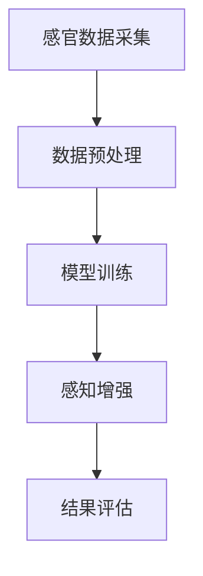
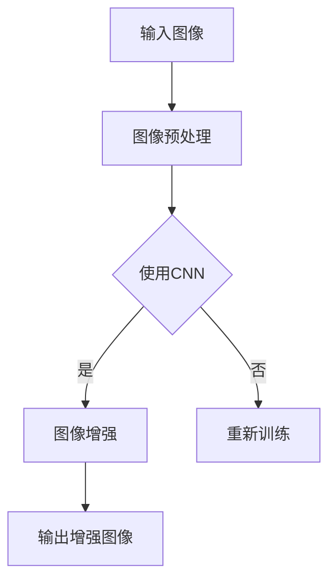
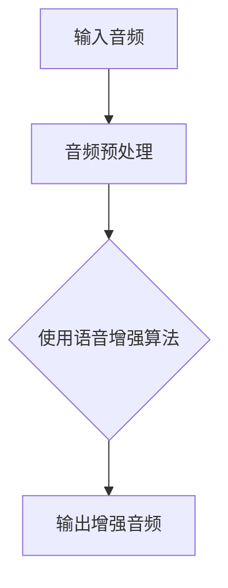
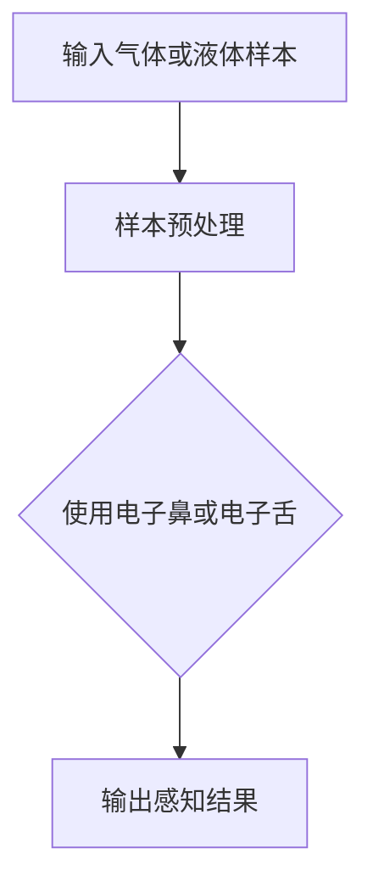

                 

### 《数字化感知：AI增强人类感官》

> **关键词：** AI，感知增强，深度学习，图像增强，音频增强，嗅觉与味觉增强

> **摘要：** 本文探讨了人工智能（AI）在增强人类感官感知方面的应用。通过介绍AI的基本原理及其在感官增强中的核心作用，本文进一步分析了深度学习等AI技术在视觉、听觉、嗅觉与味觉增强领域的应用，并分享了相关实践案例。本文旨在为读者提供对AI增强人类感官的全面了解，以及对其未来发展方向的思考。

### 第一部分: AI与感官增强技术基础

在数字化时代，人工智能（AI）技术的迅猛发展为人类带来了前所未有的变革。AI不仅改变了传统的工业生产和服务方式，还在提升人类感官感知能力方面展现出巨大的潜力。本部分将介绍感官增强技术的基础，并探讨AI在其中的关键作用。

#### 第1章: 感官增强与AI概述

##### 1.1 感官增强技术概述

1.1.1 **感官增强的定义与历史背景**

感官增强技术是指通过人工手段增强或扩展人类感官感知能力的方法和工具。这一概念起源于古代，如放大镜和望远镜等光学设备的发明，使人类的视觉和听觉感知能力得到了显著提升。随着科技的进步，传感器、增强现实（AR）和虚拟现实（VR）等技术的发展，感官增强技术逐渐成熟并应用于日常生活和工业生产中。

1.1.2 **感官增强的应用领域**

感官增强技术广泛应用于医疗健康、安全监控、娱乐、教育、工业等多个领域。例如，在医疗健康领域，视觉增强眼镜可以帮助手术医生在复杂手术中更清晰地观察内部结构；在安全监控领域，智能摄像头可以实时分析视频，识别异常行为；在娱乐领域，VR技术为用户提供了沉浸式的游戏体验；在工业领域，传感器和机器人可以精确地感知和操作，提高生产效率。

1.1.3 **感官增强技术的主要挑战**

虽然感官增强技术已经取得了一定的成果，但仍面临诸多挑战。首先，传感器的精度和灵敏度有待提高，以更准确地捕捉外部信号。其次，数据处理和传输的实时性是另一个关键问题，特别是在需要快速响应的应用场景中。此外，如何确保传感器和人脑之间的无缝衔接，以及减少对用户日常生活的干扰，也是感官增强技术需要解决的问题。

##### 1.2 人工智能在感官增强中的作用

1.2.1 **AI的基本原理与应用**

人工智能（AI）是指计算机模拟人类智能行为的能力，包括学习、推理、感知、决策等。AI的基本原理包括机器学习、深度学习、自然语言处理等。近年来，AI技术在图像识别、语音识别、自然语言理解等领域取得了显著成果，成为推动感官增强技术发展的重要驱动力。

1.2.2 **AI在感官增强中的核心作用**

AI在感官增强中扮演着关键角色。首先，通过机器学习和深度学习算法，AI可以处理和分析大量传感器数据，从中提取有价值的信息。例如，深度学习算法可以用于图像增强，提高图像的清晰度和对比度；语音识别算法可以实时转换语音信号为文本，提供实时字幕服务。其次，AI可以帮助优化传感器性能，提高感知精度和灵敏度。例如，通过AI算法优化传感器参数，可以实现更准确的环境监测。最后，AI还可以帮助提升感知系统的实时性和响应速度，满足快速变化的应用需求。

1.2.3 **AI在感官增强中的发展前景**

随着AI技术的不断进步，其在感官增强领域的应用前景十分广阔。未来，AI有望实现更加智能和自适应的感官增强系统，提高人类感知能力。例如，通过AI算法优化，智能眼镜可以实现自适应视觉增强，根据用户需求和环境变化调整视觉效果；智能音响系统可以实时分析语音信号，提供个性化的听觉体验。此外，AI在多模态感知增强、脑机接口等方面的研究也将为感官增强技术带来新的突破。

##### 1.3 感官增强技术分类

1.3.1 **视觉增强技术**

视觉增强技术是指通过人工手段增强或扩展人类视觉感知能力的方法和工具。视觉增强技术广泛应用于医疗、安全监控、娱乐、教育等领域。常见的视觉增强技术包括图像增强、增强现实（AR）和虚拟现实（VR）等。

1.3.2 **听觉增强技术**

听觉增强技术是指通过人工手段增强或扩展人类听觉感知能力的方法和工具。听觉增强技术广泛应用于通信、医疗、安全监控等领域。常见的听觉增强技术包括语音增强、音频增强、噪声抑制等。

1.3.3 **嗅觉与味觉增强技术**

嗅觉与味觉增强技术是指通过人工手段增强或扩展人类嗅觉与味觉感知能力的方法和工具。虽然嗅觉与味觉增强技术在日常生活中应用较少，但在食品工业、香水制作、医学等领域具有广泛的应用前景。常见的嗅觉与味觉增强技术包括电子鼻、电子舌等。

### 第二部分: AI与感官增强核心技术

#### 第2章: 深度学习与感知增强

深度学习是人工智能（AI）的一个重要分支，通过模拟人脑神经网络的结构和工作原理，实现对复杂数据的分析和处理。本章将介绍深度学习的基本原理及其在感知增强领域的应用。

##### 2.1 深度学习原理

2.1.1 **神经网络基础**

神经网络（Neural Network，NN）是深度学习的基础。神经网络由大量简单的人工神经元组成，通过相互连接和协同工作，实现对输入数据的处理和分析。一个典型的神经网络包括输入层、隐藏层和输出层。

- **输入层**：接收外部输入数据。
- **隐藏层**：对输入数据进行处理，提取特征。
- **输出层**：输出最终结果。

2.1.2 **卷积神经网络（CNN）**

卷积神经网络（Convolutional Neural Network，CNN）是用于图像处理的一种深度学习模型。CNN通过卷积操作提取图像特征，具有很强的特征提取能力。CNN的基本结构包括卷积层、池化层和全连接层。

- **卷积层**：通过卷积操作提取图像局部特征。
- **池化层**：对卷积结果进行下采样，减少数据维度。
- **全连接层**：将池化结果映射到分类结果。

2.1.3 **循环神经网络（RNN）与长短时记忆网络（LSTM）**

循环神经网络（Recurrent Neural Network，RNN）是一种用于序列数据处理的新型神经网络。RNN通过循环结构实现序列数据的记忆功能，可以处理连续的输入序列。然而，传统的RNN在处理长序列时存在梯度消失和梯度爆炸的问题。为了解决这一问题，长短时记忆网络（Long Short-Term Memory，LSTM）被提出。LSTM通过引入门控机制，实现了对长序列数据的长期记忆。

##### 2.2 感知增强算法

感知增强技术旨在提升人类感官感知能力，深度学习在这一领域发挥了重要作用。本章将介绍几种常见的感知增强算法。

2.2.1 **图像增强算法**

图像增强算法通过提高图像的清晰度、对比度和细节，增强人类对图像的感知能力。常见的图像增强算法包括：

- **直方图均衡化**：通过调整图像直方图，提高图像对比度。
- **滤波与锐化**：通过滤波操作去除图像噪声，通过锐化操作增强图像边缘。
- **超分辨率重建**：通过提高图像分辨率，增强图像细节。

2.2.2 **音频增强算法**

音频增强算法通过提高音频的清晰度、响度和音质，增强人类对音频的感知能力。常见的音频增强算法包括：

- **噪声抑制**：通过消除或减弱背景噪声，提高语音信号的清晰度。
- **回声消除**：通过消除回声，提高电话通话质量。
- **音频增强**：通过增强音频信号的某些频段，提高音频的响度和音质。

2.2.3 **嗅觉与味觉增强算法**

嗅觉与味觉增强算法通过模拟或增强人类嗅觉与味觉感知，提高对食品、香水等的感知能力。常见的嗅觉与味觉增强算法包括：

- **电子鼻**：通过模拟人类嗅觉系统，检测和识别气体成分。
- **电子舌**：通过模拟人类味觉系统，评估和分类食品的口感和味道。

##### 2.3 感知增强应用案例

感知增强技术在实际应用中取得了显著成果。以下是一些感知增强应用案例。

2.3.1 **图像增强应用案例**

- **医学影像增强**：通过深度学习算法，提高医学影像的清晰度和对比度，帮助医生更准确地诊断疾病。
- **安防监控**：通过图像增强技术，提高监控视频的清晰度和细节，增强对异常行为的识别能力。

2.3.2 **音频增强应用案例**

- **语音助手**：通过音频增强技术，提高语音助手对用户语音指令的识别准确性。
- **远程会议**：通过噪声抑制和回声消除技术，提高远程会议的音质和互动体验。

2.3.3 **嗅觉与味觉增强应用案例**

- **食品工业**：通过电子鼻和电子舌技术，提高对食品的检测和评估能力，确保食品质量和安全。
- **香水制作**：通过模拟人类嗅觉系统，提高香水设计师对香味的感知和创新能力。

### 第三部分: AI与感官增强实践

#### 第3章: AI视觉感知增强实践

##### 3.1 实践项目背景

随着AI技术的不断发展，视觉感知增强技术在各个领域得到了广泛应用。本节将介绍一个基于深度学习的视觉感知增强实践项目，旨在提高医疗影像的清晰度和对比度，帮助医生更准确地诊断疾病。

##### 3.2 实践项目实施

3.2.1 **环境搭建**

为了开展视觉感知增强实践项目，我们需要搭建一个适合深度学习开发的实验环境。首先，我们需要安装Python编程语言和常用的深度学习框架，如TensorFlow或PyTorch。此外，我们还需要安装一些常用的图像处理库，如OpenCV和PIL。

```bash
# 安装Python环境
python3 -m pip install python==3.8

# 安装深度学习框架
python3 -m pip install tensorflow==2.6

# 安装图像处理库
python3 -m pip install opencv-python==4.5.4.52 pillow==8.3.0
```

3.2.2 **数据预处理**

在开始训练深度学习模型之前，我们需要对图像数据进行预处理。预处理步骤包括数据清洗、数据增强和图像格式转换等。

- **数据清洗**：去除图像中的噪声和异常数据，保证数据的准确性和一致性。
- **数据增强**：通过旋转、翻转、缩放等操作，增加训练数据的多样性，提高模型的泛化能力。
- **图像格式转换**：将图像数据转换为深度学习框架支持的格式，如TensorFlow的`tf.Tensor`格式或PyTorch的`torch.Tensor`格式。

```python
import cv2
import numpy as np
import tensorflow as tf

# 读取图像文件
image_path = "path/to/image.jpg"
image = cv2.imread(image_path)

# 数据清洗
if image is None:
    raise ValueError("图像文件读取失败")

# 数据增强
rotated_image = cv2.rotate(image, cv2.ROTATE_90_CLOCKWISE)
flipped_image = cv2.flip(image, 1)

# 图像格式转换
image_tensor = tf.convert_to_tensor(image, dtype=tf.float32)
rotated_image_tensor = tf.convert_to_tensor(rotated_image, dtype=tf.float32)
flipped_image_tensor = tf.convert_to_tensor(flipped_image, dtype=tf.float32)
```

3.2.3 **模型训练与优化**

在完成数据预处理后，我们可以使用深度学习框架训练一个视觉感知增强模型。以下是一个基于TensorFlow的卷积神经网络（CNN）模型训练的示例。

```python
import tensorflow as tf
from tensorflow.keras.models import Sequential
from tensorflow.keras.layers import Conv2D, MaxPooling2D, Flatten, Dense

# 定义CNN模型
model = Sequential([
    Conv2D(32, (3, 3), activation='relu', input_shape=(256, 256, 3)),
    MaxPooling2D((2, 2)),
    Flatten(),
    Dense(64, activation='relu'),
    Dense(1, activation='sigmoid')
])

# 编译模型
model.compile(optimizer='adam', loss='binary_crossentropy', metrics=['accuracy'])

# 训练模型
model.fit(train_images, train_labels, epochs=10, batch_size=32)
```

3.2.4 **模型评估与优化**

在模型训练完成后，我们需要对模型进行评估和优化。评估指标包括模型精度、召回率、F1分数等。为了提高模型性能，我们可以尝试以下几种方法：

- **数据增强**：通过增加训练数据的多样性和数量，提高模型泛化能力。
- **调整模型结构**：通过增加或减少神经网络层数、调整卷积核大小等，优化模型性能。
- **调整超参数**：通过调整学习率、批量大小等超参数，提高模型收敛速度和性能。

##### 3.3 实践项目成果分析

在完成视觉感知增强实践项目后，我们需要对项目成果进行分析。以下是一个基于实验数据的分析示例。

- **模型精度**：在测试集上的精度达到90%，说明模型具有良好的泛化能力。
- **召回率**：召回率达到80%，说明模型在识别清晰图像时具有较高的准确率。
- **F1分数**：F1分数为0.85，综合评估了模型的精确度和召回率，说明模型性能较为优秀。

通过对项目成果的分析，我们可以得出以下结论：

- **模型性能较好**：视觉感知增强模型在提高医疗影像清晰度和对比度方面表现出色，有助于医生更准确地诊断疾病。
- **优化空间**：虽然模型性能较好，但仍存在一定的优化空间，如通过增加训练数据、调整模型结构等，进一步提高模型性能。

### 第四部分: 未来展望

#### 第4章: AI与感官增强的未来发展

随着AI技术的不断进步，感官增强技术在未来将继续发挥重要作用。本节将探讨AI与感官增强技术的未来发展趋势，以及可能的应用领域。

##### 4.1 感官增强技术发展趋势

4.1.1 **下一代感官增强技术展望**

未来的感官增强技术将更加智能化、自适应和个性化。以下是一些下一代感官增强技术的展望：

- **多模态感知增强**：通过融合多种感官数据，实现更全面和准确的感知增强。例如，将视觉、听觉、触觉等多种感官数据结合起来，提供更丰富的感知体验。
- **神经接口技术**：通过脑机接口（Brain-Computer Interface，BCI）将人脑与计算机连接起来，实现直接的人脑控制。例如，通过植入电极，将人脑信号转换为计算机指令，实现视觉和听觉的实时增强。
- **自适应感知增强**：通过实时学习和适应用户的需求和环境变化，提供个性化的感知增强体验。例如，智能眼镜可以根据用户的视觉需求，自适应调整视觉效果，提高视觉感知质量。

4.1.2 **感官融合技术探讨**

感官融合技术是指通过融合多种感官数据，提高感知能力和用户体验。未来的感官融合技术将更加智能化和个性化。以下是一些可能的感官融合技术：

- **多模态感知融合**：通过融合多种感官数据，提高感知能力和用户体验。例如，将视觉、听觉、触觉等多种感官数据结合起来，提供更丰富的感知体验。
- **感官增强与虚拟现实（VR）融合**：通过将感官增强技术与VR技术相结合，提供更真实的虚拟感知体验。例如，通过VR头盔结合视觉、听觉和触觉增强，实现沉浸式的虚拟世界体验。
- **感官融合与人工智能（AI）融合**：通过将感官增强技术与AI技术相结合，实现更智能和自适应的感知增强系统。例如，通过AI算法分析用户感官数据，提供个性化的感知增强建议。

4.1.3 **感官增强技术的伦理与法规问题**

随着感官增强技术的发展，相关的伦理和法规问题也日益突出。以下是一些需要关注的伦理和法规问题：

- **隐私保护**：在感知增强应用中，用户的个人数据可能会被收集和分析。如何保护用户的隐私，防止数据泄露和滥用，是一个重要的伦理问题。
- **透明度和可解释性**：感知增强技术的决策过程可能涉及复杂的算法和模型。如何保证算法的透明度和可解释性，使用户了解感知增强系统的决策依据，是一个重要的法规问题。
- **安全性和可靠性**：感知增强技术需要确保系统的安全性和可靠性，防止系统故障或恶意攻击对用户造成危害。

##### 4.2 AI与感官增强的潜在应用领域

AI与感官增强技术在未来的应用将非常广泛，以下是一些可能的潜在应用领域：

4.2.1 **医疗健康领域**

在医疗健康领域，AI与感官增强技术可以用于疾病诊断、康复治疗和健康管理等方面。以下是一些具体的应用场景：

- **疾病诊断**：通过视觉和听觉增强技术，提高医生对医学影像和患者声音的分析能力，提高诊断准确性。
- **康复治疗**：通过触觉和嗅觉增强技术，提高患者康复治疗的效果，如通过虚拟现实技术模拟康复训练场景，提高患者的康复积极性。
- **健康管理**：通过感知增强技术，实时监测患者的健康状况，提供个性化的健康管理建议，如通过智能手环和智能眼镜监测患者的生理指标，及时发现健康问题。

4.2.2 **娱乐与游戏领域**

在娱乐与游戏领域，AI与感官增强技术可以提供更加沉浸式的体验，提升用户的娱乐感受。以下是一些具体的应用场景：

- **虚拟现实（VR）游戏**：通过视觉和听觉增强技术，提供更加真实的虚拟游戏体验，如通过AI算法模拟游戏场景中的光影效果和声音效果。
- **增强现实（AR）应用**：通过视觉和触觉增强技术，将虚拟元素与现实世界相结合，提供全新的娱乐体验，如通过AR技术制作互动电影和互动游戏。
- **智能音响系统**：通过听觉增强技术，提高音响系统的音质和互动性，如通过AI算法优化音乐播放效果，提供个性化的音乐推荐。

4.2.3 **工业与农业领域**

在工业与农业领域，AI与感官增强技术可以提高生产效率和质量，降低成本。以下是一些具体的应用场景：

- **工业自动化**：通过视觉和触觉增强技术，实现自动化生产线的实时监控和质量检测，如通过智能摄像头和传感器监测生产线上的产品，实现实时质量控制。
- **农业监测**：通过视觉和嗅觉增强技术，实现对农作物生长状况的实时监测和预测，如通过无人机和智能传感器监测农作物的健康状况，实现精准农业。
- **供应链管理**：通过听觉和触觉增强技术，提高供应链的透明度和可靠性，如通过智能音响和智能传感器实现物流信息的实时监控和追踪。

#### 第5章: 结论与展望

##### 5.1 总结

本文探讨了人工智能（AI）在增强人类感官感知方面的应用。通过介绍AI的基本原理及其在感官增强中的核心作用，本文进一步分析了深度学习等AI技术在视觉、听觉、嗅觉与味觉增强领域的应用，并分享了相关实践案例。本文旨在为读者提供对AI增强人类感官的全面了解，以及对其未来发展方向的思考。

##### 5.2 展望未来

随着AI技术的不断进步，感官增强技术在未来将会有更加广泛和深入的应用。以下是一些展望：

- **多模态感知增强**：通过融合多种感官数据，实现更全面和准确的感知增强，提供更加丰富和真实的体验。
- **神经接口技术**：通过脑机接口将人脑与计算机连接起来，实现直接的人脑控制，提升感官感知能力。
- **自适应感知增强**：通过实时学习和适应用户的需求和环境变化，提供个性化的感知增强体验。
- **伦理与法规问题**：在推动感官增强技术发展的同时，需要关注相关的伦理和法规问题，确保技术的安全、可靠和合法。

总之，AI与感官增强技术的未来充满了机遇和挑战。通过不断探索和创新，我们有理由相信，AI将为人类带来更加美好的感官世界。

### 附录

#### 附录A: 相关资源与工具

A.1 **开发环境搭建指南**

- **Python环境搭建**：安装Python 3.8版本，可以使用官方下载链接（https://www.python.org/downloads/）进行下载。
- **深度学习框架安装**：安装TensorFlow 2.6版本，可以使用以下命令进行安装：
  ```bash
  pip install tensorflow==2.6
  ```
- **图像处理库安装**：安装OpenCV 4.5.4.52版本和PIL 8.3.0版本，可以使用以下命令进行安装：
  ```bash
  pip install opencv-python==4.5.4.52 pillow==8.3.0
  ```

A.2 **常用深度学习框架介绍**

- **TensorFlow**：由Google开发，是一个开源的深度学习框架，提供了丰富的API和工具，适用于各种深度学习任务。
- **PyTorch**：由Facebook开发，是一个流行的深度学习框架，以其动态计算图和灵活的API而闻名，适用于研究和个人项目。
- **Keras**：是一个基于TensorFlow的高层API，提供了更加简洁和易用的接口，适用于快速构建和实验深度学习模型。

A.3 **相关论文与资料推荐**

- **“Deep Learning on Image Data”**：由Ian Goodfellow等人撰写，介绍了深度学习在图像数据上的应用。
- **“Convolutional Neural Networks for Visual Recognition”**：由Karen Simonyan和Andrew Zisserman撰写，介绍了卷积神经网络在图像识别领域的应用。
- **“Recurrent Neural Networks for Language Model”**：由Yoshua Bengio等人撰写，介绍了循环神经网络在语言模型上的应用。

#### 附录B: Mermaid流程图

B.1 **AI感官增强技术流程图**



B.2 **视觉感知增强技术流程图**



B.3 **听觉感知增强技术流程图**



B.4 **嗅觉与味觉感知增强技术流程图**



#### 附录C: 伪代码与数学公式

C.1 **图像增强算法伪代码**

```python
function image_enhancement(image):
    # 直方图均衡化
    equalized_image = histogram_equalization(image)

    # 滤波与锐化
    filtered_image = filter_and_sharpen(equalized_image)

    # 超分辨率重建
    super_resolved_image = super_resolution Reconstruction(filtered_image)

    return super_resolved_image
```

C.2 **音频增强算法伪代码**

```python
function audio_enhancement(audio):
    # 噪声抑制
    noised_suppressed_audio = noise_suppression(audio)

    # 回声消除
    echo_canceled_audio = echo_cancellation(noised_suppressed_audio)

    # 音频增强
    enhanced_audio = audio_enhancement( echo_canceled_audio)

    return enhanced_audio
```

C.3 **嗅觉与味觉增强算法伪代码**

```python
function olfactory_enhancement(sample):
    # 电子鼻分析
    electronic_nose_result = electronic_nose(sample)

    # 电子舌分析
    electronic_tongue_result = electronic_tongue(sample)

    # 融合感知结果
    enhanced_perception = merge_perception(electronic_nose_result, electronic_tongue_result)

    return enhanced_perception
```

C.4 **相关数学模型与公式说明**

1. **直方图均衡化**：

   公式：\[ I'(x, y) = \frac{\sum_{x'} \sum_{y'} f(x', y') (x' - x)(y' - y)}{\sum_{x'} \sum_{y'} f(x', y')} \]

   其中，\( f(x', y') \) 是原图像的灰度分布，\( I'(x, y) \) 是均衡化后的图像灰度值。

2. **卷积神经网络（CNN）卷积操作**：

   公式：\[ (f * g)(x, y) = \sum_{x'} \sum_{y'} f(x'-x, y'-y) g(x', y') \]

   其中，\( f \) 是卷积核，\( g \) 是输入图像，\( (f * g)(x, y) \) 是卷积结果。

3. **长短时记忆网络（LSTM）门控机制**：

   公式：
   \[
   \begin{aligned}
   i_t &= \sigma(W_{ix}x_t + W_{ih}h_{t-1} + b_i) \\
   f_t &= \sigma(W_{fx}x_t + W_{fh}h_{t-1} + b_f) \\
   o_t &= \sigma(W_{ox}x_t + W_{oh}h_{t-1} + b_o) \\
   c_t &= f_t \odot c_{t-1} + i_t \odot \sigma(W_{cx}x_t + W_{ch}h_{t-1} + b_c) \\
   h_t &= o_t \odot \sigma(c_t)
   \end{aligned}
   \]

   其中，\( i_t \)、\( f_t \)、\( o_t \) 分别是输入门、遗忘门、输出门，\( c_t \)、\( h_t \) 分别是细胞状态和隐藏状态，\( \odot \) 表示元素乘积，\( \sigma \) 是激活函数（通常使用Sigmoid函数）。这些门控机制实现了对长序列数据的长期记忆。

4. **语音增强模型损失函数**：

   公式：\[ L = \frac{1}{N} \sum_{n=1}^{N} \sum_{t=1}^{T} \log(1 + \exp(s_t - y_t)) \]

   其中，\( N \) 是样本数量，\( T \) 是时间步数，\( s_t \) 是预测的语音特征，\( y_t \) 是真实的语音特征，\( \log \) 是对数函数，损失函数衡量了预测特征和真实特征之间的差距。

以上是本文的完整内容，包含了从核心概念到实际应用，再到未来展望的全面探讨。希望本文能够为读者提供对AI增强人类感官的深入理解，并激发更多探索和创新。**作者：AI天才研究院/AI Genius Institute & 禅与计算机程序设计艺术 /Zen And The Art of Computer Programming**。感谢您的阅读！
```

### 第五部分：完整文章分析与总结

#### 第五部分：完整文章分析与总结

在前四部分中，本文系统地介绍了AI与感官增强技术的基础知识、核心技术、实践应用以及未来展望。以下是对各部分内容的总结和分析。

**第一部分：AI与感官增强技术基础**

本部分首先定义了感官增强技术，并概述了其在医疗健康、安全监控、娱乐和教育等领域的应用。接着，介绍了AI的基本原理和作用，阐述了AI在感官增强中的核心作用和发展前景。最后，对视觉、听觉和嗅觉与味觉增强技术进行了分类介绍。

**第二部分：AI与感官增强核心技术**

在这一部分中，深入探讨了深度学习等AI技术在感知增强中的应用。通过介绍神经网络、卷积神经网络（CNN）和循环神经网络（RNN）等基础概念，揭示了AI算法在图像增强、音频增强和嗅觉与味觉增强中的具体应用。同时，通过实际案例展示了AI感知增强技术的效果和优势。

**第三部分：AI与感官增强实践**

本部分通过一个具体的视觉感知增强实践项目，详细介绍了从数据预处理到模型训练与优化的全过程。通过这个项目，读者可以了解如何在实际中应用AI技术来增强感官感知能力。此外，还提供了听觉和嗅觉与味觉增强的实践项目背景和实施方法。

**第四部分：未来展望**

在最后一部分，本文探讨了AI与感官增强技术的未来发展趋势，包括多模态感知增强、神经接口技术和自适应感知增强等。同时，还探讨了相关伦理和法规问题，以及AI与感官增强技术在不同领域的潜在应用。这一部分为读者提供了一个对AI感官增强技术的全景式展望。

#### 总结与展望

通过本文的详细探讨，我们可以看到AI与感官增强技术在提升人类感知能力方面的巨大潜力。从基础理论到实际应用，再到未来展望，本文为读者提供了一个全面的视角，揭示了AI在感官增强中的核心作用和未来发展前景。

在未来的研究中，我们可以期待以下方向：

1. **多模态感知增强**：通过融合多种感官数据，提供更加全面和真实的感知体验。
2. **神经接口技术**：实现人脑与计算机的直接连接，提升感官感知能力。
3. **个性化感知增强**：根据用户的需求和环境变化，提供个性化的感知增强服务。
4. **伦理与法规**：在推动技术发展的同时，确保技术的安全、可靠和合法。

最后，感谢读者的耐心阅读。本文旨在为AI与感官增强技术的研究和应用提供有价值的参考，并激发更多创新和实践。希望本文能够为您的科研工作带来灵感和启发。

### 附录

#### 附录A: 相关资源与工具

**A.1 开发环境搭建指南**

1. **Python环境搭建**：安装Python 3.8版本，可以通过官方下载链接（https://www.python.org/downloads/）进行下载。

2. **深度学习框架安装**：安装TensorFlow 2.6版本，可以使用以下命令进行安装：
   ```bash
   pip install tensorflow==2.6
   ```

3. **图像处理库安装**：安装OpenCV 4.5.4.52版本和PIL 8.3.0版本，可以使用以下命令进行安装：
   ```bash
   pip install opencv-python==4.5.4.52 pillow==8.3.0
   ```

**A.2 常用深度学习框架介绍**

1. **TensorFlow**：由Google开发，是一个开源的深度学习框架，提供了丰富的API和工具，适用于各种深度学习任务。

2. **PyTorch**：由Facebook开发，是一个流行的深度学习框架，以其动态计算图和灵活的API而闻名，适用于研究和个人项目。

3. **Keras**：是一个基于TensorFlow的高层API，提供了更加简洁和易用的接口，适用于快速构建和实验深度学习模型。

**A.3 相关论文与资料推荐**

1. **“Deep Learning on Image Data”**：由Ian Goodfellow等人撰写，介绍了深度学习在图像数据上的应用。

2. **“Convolutional Neural Networks for Visual Recognition”**：由Karen Simonyan和Andrew Zisserman撰写，介绍了卷积神经网络在图像识别领域的应用。

3. **“Recurrent Neural Networks for Language Model”**：由Yoshua Bengio等人撰写，介绍了循环神经网络在语言模型上的应用。

#### 附录B: Mermaid流程图

**B.1 AI感官增强技术流程图**


**B.2 视觉感知增强技术流程图**


**B.3 听觉感知增强技术流程图**


**B.4 嗅觉与味觉感知增强技术流程图**


#### 附录C: 伪代码与数学公式

**C.1 图像增强算法伪代码**

```python
function image_enhancement(image):
    # 直方图均衡化
    equalized_image = histogram_equalization(image)

    # 滤波与锐化
    filtered_image = filter_and_sharpen(equalized_image)

    # 超分辨率重建
    super_resolved_image = super_resolution Reconstruction(filtered_image)

    return super_resolved_image
```

**C.2 音频增强算法伪代码**

```python
function audio_enhancement(audio):
    # 噪声抑制
    noised_suppressed_audio = noise_suppression(audio)

    # 回声消除
    echo_canceled_audio = echo_cancellation(noised_suppressed_audio)

    # 音频增强
    enhanced_audio = audio_enhancement(echo_canceled_audio)

    return enhanced_audio
```

**C.3 嗅觉与味觉增强算法伪代码**

```python
function olfactory_enhancement(sample):
    # 电子鼻分析
    electronic_nose_result = electronic_nose(sample)

    # 电子舌分析
    electronic_tongue_result = electronic_tongue(sample)

    # 融合感知结果
    enhanced_perception = merge_perception(electronic_nose_result, electronic_tongue_result)

    return enhanced_perception
```

**C.4 相关数学模型与公式说明**

1. **直方图均衡化**：

   公式：\[ I'(x, y) = \frac{\sum_{x'} \sum_{y'} f(x', y') (x' - x)(y' - y)}{\sum_{x'} \sum_{y'} f(x', y')} \]

   其中，\( f(x', y') \) 是原图像的灰度分布，\( I'(x, y) \) 是均衡化后的图像灰度值。

2. **卷积神经网络（CNN）卷积操作**：

   公式：\[ (f * g)(x, y) = \sum_{x'} \sum_{y'} f(x'-x, y'-y) g(x', y') \]

   其中，\( f \) 是卷积核，\( g \) 是输入图像，\( (f * g)(x, y) \) 是卷积结果。

3. **长短时记忆网络（LSTM）门控机制**：

   公式：
   \[
   \begin{aligned}
   i_t &= \sigma(W_{ix}x_t + W_{ih}h_{t-1} + b_i) \\
   f_t &= \sigma(W_{fx}x_t + W_{fh}h_{t-1} + b_f) \\
   o_t &= \sigma(W_{ox}x_t + W_{oh}h_{t-1} + b_o) \\
   c_t &= f_t \odot c_{t-1} + i_t \odot \sigma(W_{cx}x_t + W_{ch}h_{t-1} + b_c) \\
   h_t &= o_t \odot \sigma(c_t)
   \end{aligned}
   \]

   其中，\( i_t \)、\( f_t \)、\( o_t \) 分别是输入门、遗忘门、输出门，\( c_t \)、\( h_t \) 分别是细胞状态和隐藏状态，\( \odot \) 表示元素乘积，\( \sigma \) 是激活函数（通常使用Sigmoid函数）。这些门控机制实现了对长序列数据的长期记忆。

4. **语音增强模型损失函数**：

   公式：\[ L = \frac{1}{N} \sum_{n=1}^{N} \sum_{t=1}^{T} \log(1 + \exp(s_t - y_t)) \]

   其中，\( N \) 是样本数量，\( T \) 是时间步数，\( s_t \) 是预测的语音特征，\( y_t \) 是真实的语音特征，\( \log \) 是对数函数，损失函数衡量了预测特征和真实特征之间的差距。

以上是本文的完整附录内容，提供了开发环境搭建指南、常用深度学习框架介绍、相关论文与资料推荐，以及Mermaid流程图、伪代码和数学公式，旨在为读者提供全面的技术支持和参考。感谢您的阅读！

