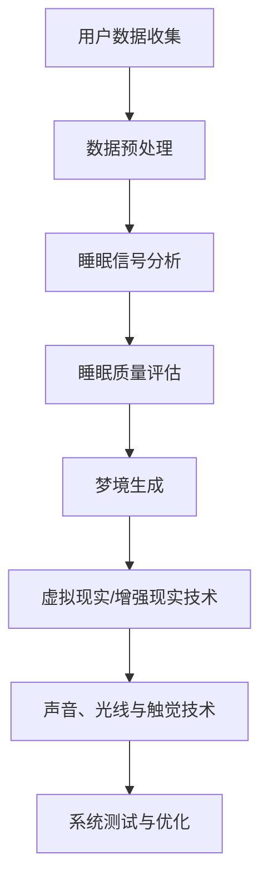

                 

# 数字化梦境工程：AI设计的睡眠体验

## 关键词

- AI与睡眠科学
- 数字化梦境
- 自然语言处理
- 计算机视觉
- 睡眠质量评估
- 虚拟现实
- 增强现实
- 声音、光线与触觉技术
- 系统设计与优化

## 摘要

数字化梦境工程是一个新兴的跨学科领域，旨在利用人工智能技术改善人类睡眠质量。本文将深入探讨AI在数字化梦境工程中的应用，从基础理论、核心技术到实战应用进行全方位解析。首先，我们将回顾AI与睡眠科学的历史联系，阐述数字化梦境工程的定义与目标。随后，详细介绍AI技术基础，包括机器学习、深度学习、自然语言处理、计算机视觉等方面。接下来，讨论数字化梦境的设计原理，从构成要素、睡眠周期的模拟到安全性与伦理问题。在核心技术篇，我们将重点介绍AI算法在睡眠分析中的应用，包括数据收集与预处理、睡眠质量评估算法、数字化梦境生成算法等。实战应用篇将展示虚拟现实与增强现实技术、声音、光线与触觉技术的实际应用。最后，我们将分享数字化梦境工程的实施步骤、案例分析与应用场景，并提供相关工具与资源的链接。通过本文的阅读，读者将全面了解数字化梦境工程的原理、技术与应用，为未来的研究方向和实践提供指导。

## 目录大纲

### 第一部分：基础理论篇

- **第1章：AI与睡眠科学概述**
  - **1.1 AI在睡眠研究中的应用历史**
  - **1.2 睡眠质量与数字化技术的联系**
  - **1.3 数字化梦境工程的定义与目标**

- **第2章：AI技术基础**
  - **2.1 人工智能的基本概念**
    - **2.1.1 机器学习基础**
    - **2.1.2 深度学习原理**
  - **2.2 自然语言处理与睡眠数据分析**
    - **2.2.1 文本挖掘技术**
    - **2.2.2 语言模型应用**
  - **2.3 计算机视觉与睡眠监测**
    - **2.3.1 视觉数据处理**
    - **2.3.2 图像识别技术**

- **第3章：数字化梦境设计原理**
  - **3.1 数字化梦境的构成要素**
    - **3.1.1 虚拟现实与增强现实**
    - **3.1.2 声音、光线与触觉设计**
  - **3.2 睡眠周期的理解与模拟**
    - **3.2.1 睡眠科学基础**
    - **3.2.2 睡眠阶段与梦境生成**
  - **3.3 数字化梦境的安全性与伦理**
    - **3.3.1 安全风险与隐私保护**
    - **3.3.2 伦理问题与道德规范**

### 第二部分：核心技术篇

- **第4章：AI算法在睡眠分析中的应用**
  - **4.1 数据收集与预处理**
    - **4.1.1 睡眠数据的类型**
    - **4.1.2 数据预处理方法**
  - **4.2 睡眠质量评估算法**
    - **4.2.1 睡眠信号处理**
    - **4.2.2 质量评估模型**
  - **4.3 数字化梦境生成算法**
    - **4.3.1 梦境生成原理**
    - **4.3.2 算法实现与优化**

- **第5章：虚拟现实与增强现实技术**
  - **5.1 虚拟现实技术基础**
    - **5.1.1 虚拟现实硬件与软件**
    - **5.1.2 用户体验设计**
  - **5.2 增强现实技术在睡眠中的应用**
    - **5.2.1 增强现实技术原理**
    - **5.2.2 应用场景与案例分析**

- **第6章：声音、光线与触觉技术**
  - **6.1 声音技术的应用**
    - **6.1.1 声音信号处理**
    - **6.1.2 音频环境设计**
  - **6.2 光线技术的应用**
    - **6.2.1 光线调节设备**
    - **6.2.2 光线对人体睡眠的影响**
  - **6.3 触觉技术的应用**
    - **6.3.1 触觉传感与反馈**
    - **6.3.2 触觉在数字化梦境中的应用**

### 第三部分：实战应用篇

- **第7章：数字化梦境工程的实施步骤**
  - **7.1 需求分析与规划**
    - **7.1.1 用户需求调研**
    - **7.1.2 项目规划与预算**
  - **7.2 系统设计与开发**
    - **7.2.1 系统架构设计**
    - **7.2.2 开发工具与平台选择**
  - **7.3 系统测试与优化**
    - **7.3.1 系统测试策略**
    - **7.3.2 用户反馈与迭代**

- **第8章：案例分析与应用场景**
  - **8.1 数字化梦境在医疗领域的应用**
    - **8.1.1 睡眠障碍治疗**
    - **8.1.2 长期护理与康复**
  - **8.2 数字化梦境在娱乐领域的应用**
    - **8.2.1 游戏化睡眠体验**
    - **8.2.2 娱乐内容创作**
  - **8.3 数字化梦境在教育领域的应用**
    - **8.3.1 情境学习**
    - **8.3.2 梦境记忆增强**

### 附录

- **附录A：常用工具与资源**
  - **A.1 AI与睡眠相关数据库**
  - **A.2 虚拟现实与增强现实开发平台**
  - **A.3 声音、光线与触觉技术资源链接**

## 第1章：AI与睡眠科学概述

### 1.1 AI在睡眠研究中的应用历史

人工智能（AI）技术在睡眠研究中的应用始于20世纪末。随着计算机技术的发展，AI技术逐渐成为睡眠科学研究的重要工具。以下简要回顾AI在睡眠研究中的应用历史：

- **1980年代**：神经网络和机器学习技术开始应用于睡眠信号分析，特别是在脑电图（EEG）数据处理中。研究者使用人工神经网络对睡眠信号进行分类，提高了睡眠阶段识别的准确性。

- **1990年代**：随着计算能力的提升，AI技术在睡眠质量评估中得到了广泛应用。研究人员开发出基于机器学习的算法，可以自动评估睡眠质量，为睡眠障碍的诊断提供支持。

- **2000年代**：AI技术在睡眠研究中的应用进一步扩展到生物信息学领域。通过大规模数据处理和统计分析，研究者发现了许多与睡眠相关的生物标志物。

- **2010年代**：深度学习技术的崛起为睡眠研究带来了新的突破。深度神经网络在图像识别、自然语言处理等领域取得了显著成果，研究者开始尝试将深度学习应用于睡眠监测和数据分析。

- **2020年代**：随着可穿戴设备的普及和物联网技术的发展，AI在睡眠研究中的应用变得更加广泛和深入。实时睡眠监测、个性化睡眠干预和数字化梦境生成成为研究热点。

### 1.2 睡眠质量与数字化技术的联系

睡眠质量对个体的身心健康具有重要影响。良好的睡眠有助于提高记忆力、情绪稳定性和工作效率。然而，睡眠障碍如失眠、睡眠呼吸暂停等在全球范围内普遍存在。数字化技术的快速发展为改善睡眠质量提供了新的途径：

- **可穿戴设备**：智能手环、智能手表等可穿戴设备可以实时监测心率、运动、睡眠时长等生理指标，为个体提供定制化的睡眠建议。

- **智能手机应用**：睡眠监测应用通过智能手机的传感器和AI算法，分析用户的睡眠模式，提供睡眠质量评估和改进建议。

- **虚拟现实（VR）和增强现实（AR）**：VR和AR技术可以为用户提供沉浸式的睡眠环境，通过视觉、声音和触觉的刺激，帮助用户放松身心，改善睡眠质量。

- **远程监控和诊断**：AI技术可以帮助医生远程监控患者的睡眠状况，进行睡眠障碍的诊断和治疗。

### 1.3 数字化梦境工程的定义与目标

数字化梦境工程是一个跨学科领域，旨在通过人工智能技术设计并实现个性化的睡眠体验。它结合了睡眠科学、人工智能、虚拟现实、增强现实和声光触觉技术，旨在实现以下目标：

- **个性化睡眠干预**：根据用户的睡眠数据和偏好，设计个性化的睡眠干预方案，帮助用户改善睡眠质量。

- **增强睡眠体验**：通过虚拟现实和增强现实技术，创造沉浸式的睡眠环境，提供愉悦的睡眠体验。

- **睡眠数据分析**：利用AI算法对睡眠数据进行分析，发现睡眠障碍的潜在原因，提供诊断和干预建议。

- **睡眠科学研究**：通过大规模的睡眠数据收集和分析，推动睡眠科学的研究和发展。

数字化梦境工程不仅有望改善个体的睡眠质量，还可能在医疗、教育、娱乐等领域产生深远影响。

## 第2章：AI技术基础

### 2.1 人工智能的基本概念

人工智能（AI）是一门研究、开发用于模拟、延伸和扩展人类智能的理论、方法、技术及应用系统的科学。AI技术通过模拟人类智能的某些功能，使计算机系统能够执行复杂任务，如学习、推理、感知和理解。以下从机器学习和深度学习的角度探讨人工智能的基本概念。

#### 2.1.1 机器学习基础

机器学习（Machine Learning，ML）是AI的核心组成部分，主要关注如何让计算机从数据中学习并做出决策。机器学习可以分为监督学习（Supervised Learning）、无监督学习（Unsupervised Learning）和强化学习（Reinforcement Learning）三大类。

- **监督学习**：在有监督学习（Supervised Learning）中，模型通过学习标记好的训练数据来预测新的数据。常见的算法有线性回归、决策树、支持向量机（SVM）和神经网络等。例如，通过标记好的睡眠数据，可以训练模型来预测用户未来的睡眠质量。

  $$ 
  y = f(x) 
  $$
  其中，$y$ 是预测值，$x$ 是输入特征。

- **无监督学习**：无监督学习（Unsupervised Learning）中，模型从未标记的数据中学习，目的是发现数据中的结构或模式。常见的算法有聚类分析（Cluster Analysis）、主成分分析（PCA）和自编码器（Autoencoder）等。例如，通过分析用户的睡眠模式，可以识别不同的睡眠类型和特征。

  $$
  \min_{\theta} J(\theta) = \sum_{i=1}^{n} \frac{1}{2} \sum_{j=1}^{k} (z_j - \hat{z}_j)^2 
  $$
  其中，$J(\theta)$ 是损失函数，$\theta$ 是模型参数。

- **强化学习**：强化学习（Reinforcement Learning）中，模型通过与环境的交互学习最优策略。常见的算法有Q学习、深度Q网络（DQN）和策略梯度（Policy Gradient）等。例如，通过不断尝试和反馈，模型可以学习如何优化用户的睡眠环境，以达到最佳睡眠效果。

  $$
  Q(s, a) = r + \gamma \max_{a'} Q(s', a') 
  $$
  其中，$Q(s, a)$ 是状态-动作值函数，$r$ 是即时奖励，$\gamma$ 是折扣因子。

#### 2.1.2 深度学习原理

深度学习（Deep Learning，DL）是机器学习的一个分支，通过构建深度神经网络（Deep Neural Network，DNN）来模拟人脑的学习过程。深度学习在图像识别、语音识别、自然语言处理等领域取得了显著成果。

- **神经网络基础**：神经网络（Neural Network，NN）是一种通过模拟生物神经元连接方式来实现信息处理的计算模型。神经网络的基本单元是神经元，每个神经元与输入层、隐藏层和输出层的其他神经元相连。

  $$
  a_i = \sigma(\sum_{j=1}^{n} w_{ji} x_j + b_i)
  $$
  其中，$a_i$ 是输出，$\sigma$ 是激活函数，$w_{ji}$ 是权重，$x_j$ 是输入，$b_i$ 是偏置。

- **多层感知机**：多层感知机（Multilayer Perceptron，MLP）是最早的深度学习模型，由输入层、隐藏层和输出层组成。MLP可以通过反向传播算法（Backpropagation Algorithm）来训练网络参数。

  $$
  \frac{\partial E}{\partial w} = \delta \cdot z
  $$
  $$
  \frac{\partial E}{\partial b} = \delta
  $$
  其中，$E$ 是损失函数，$\delta$ 是误差项。

- **卷积神经网络**：卷积神经网络（Convolutional Neural Network，CNN）是针对图像处理设计的深度学习模型，通过卷积层（Convolutional Layer）和池化层（Pooling Layer）来提取图像的特征。

  $$
  \hat{f}_\theta(x) = \text{ReLU}(\sum_{i=1}^{k} w_i \cdot f(x; \theta_i))
  $$
  其中，$f(x; \theta_i)$ 是卷积操作，$w_i$ 是卷积核。

- **循环神经网络**：循环神经网络（Recurrent Neural Network，RNN）是一种处理序列数据的深度学习模型，通过循环结构来保持状态信息。

  $$
  h_t = \text{ReLU}(W \cdot [h_{t-1}, x_t] + b)
  $$
  其中，$h_t$ 是隐藏状态，$W$ 是权重矩阵。

- **生成对抗网络**：生成对抗网络（Generative Adversarial Network，GAN）是一种由生成器和判别器组成的深度学习模型，通过对抗训练来生成高质量的图像。

  $$
  \min_G \max_D \mathbb{E}_{x \sim P_{\text{data}}}(D(x)) - \mathbb{E}_{z \sim p_z(z)}(D(G(z)))
  $$
  其中，$G(z)$ 是生成器，$D(x)$ 是判别器。

#### 2.1.3 人工智能在睡眠科学中的应用

人工智能在睡眠科学中的应用主要体现在以下几个方面：

- **睡眠信号分析**：利用深度学习模型对睡眠信号（如脑电图、心电信号等）进行自动分析，识别睡眠阶段和睡眠质量。

- **睡眠质量预测**：通过监督学习算法，分析用户的生理和活动数据，预测未来的睡眠质量。

- **个性化睡眠干预**：基于用户的睡眠数据和偏好，利用机器学习模型生成个性化的睡眠干预方案。

- **睡眠数据分析**：通过大规模数据处理和统计分析，发现与睡眠质量相关的因素和生物标志物。

### 2.2 自然语言处理与睡眠数据分析

自然语言处理（Natural Language Processing，NLP）是人工智能的一个重要分支，旨在使计算机能够理解和生成人类语言。在睡眠数据分析中，NLP技术可以用于处理和分析睡眠日记、语音记录和文本数据。

#### 2.2.1 文本挖掘技术

文本挖掘（Text Mining）是一种从大量文本数据中提取有价值信息的方法，主要包括以下步骤：

- **数据预处理**：对原始文本进行清洗、分词、去除停用词等操作，以提取有用的信息。

  $$
  \text{Tokenization} \rightarrow \text{Lemmatization} \rightarrow \text{Stopword Removal}
  $$

- **特征提取**：将文本转换为数值特征，如词袋模型（Bag-of-Words，BoW）和词嵌入（Word Embedding）。

  $$
  \text{BoW}: \text{freq}(w) = \sum_{d=1}^{D} f_d(w)
  $$
  $$
  \text{Word Embedding}: \text{word embedding} = \text{Embedding}(w)
  $$

- **分类与聚类**：使用机器学习算法对文本数据进行分类和聚类，以发现文本数据的模式和结构。

  $$
  \text{ 分类模型} = \text{SVM, Logistic Regression}
  $$
  $$
  \text{ 聚类模型} = \text{K-means, DBSCAN}
  $$

#### 2.2.2 语言模型应用

语言模型（Language Model）是一种用于预测文本序列的概率模型，主要用于自然语言生成和语音识别等领域。在睡眠数据分析中，语言模型可以用于提取文本数据中的关键信息，如睡眠日记中的负面情绪和睡眠质量。

- **n-gram模型**：n-gram模型是一种基于词汇序列概率的简单语言模型，通过统计n个连续词汇的概率来预测下一个词汇。

  $$
  p(w_n) = \sum_{i=1}^{n-1} p(w_i, w_{i+1}, \ldots, w_n)
  $$

- **神经网络语言模型**：神经网络语言模型通过深度学习算法来学习词汇序列的概率分布，如长短期记忆网络（LSTM）和变换器（Transformer）。

  $$
  \text{LSTM}: \text{h_t} = \text{sigmoid}([h_{t-1}, x_t] \cdot W_h + b_h)
  $$
  $$
  \text{Transformer}: \text{h_t} = \text{softmax}(\text{Attention}(h_{t-1}; h_{t-1}, x_t) \cdot V)
  $$

#### 2.2.3 NLP在睡眠数据分析中的应用

NLP技术可以用于多种睡眠数据分析任务，如情感分析、主题模型和命名实体识别。

- **情感分析**：情感分析（Sentiment Analysis）是一种评估文本数据情感极性（正面、负面、中性）的方法，可以用于分析睡眠日记中的情感状态。

  $$
  \text{Sentiment Analysis}: \text{Sentiment}(w) = \text{sigmoid}(\text{Score}(w))
  $$

- **主题模型**：主题模型（Topic Model）是一种用于发现文本数据潜在主题的统计模型，可以用于识别睡眠日记中的主题。

  $$
  \text{LDA}: p_z(\theta) = \text{Dirichlet}(\theta | \alpha)
  $$
  $$
  p_w(\text{word}|\theta) = \text{Multinomial}(\text{word}|\theta)
  $$

- **命名实体识别**：命名实体识别（Named Entity Recognition，NER）是一种识别文本数据中特定名词的方法，可以用于识别睡眠日记中的特定名词，如药物名称和疾病名称。

  $$
  \text{NER}: \text{Entity}(w) = \text{CRF}(\text{Context}(w))
  $$

### 2.3 计算机视觉与睡眠监测

计算机视觉（Computer Vision，CV）是人工智能的另一个重要分支，旨在使计算机能够从图像或视频中提取有用的信息。在睡眠监测中，计算机视觉技术可以用于分析用户的睡眠状态和睡眠质量。

#### 2.3.1 视觉数据处理

视觉数据处理是计算机视觉的基础，包括图像预处理、特征提取和图像分类。

- **图像预处理**：图像预处理（Image Preprocessing）是对原始图像进行预处理，以提高后续处理的准确性和效率。

  $$
  \text{Blur}: \text{GaussianBlur}
  $$
  $$
  \text{Denoising}: \text{MedianBlur}
  $$

- **特征提取**：特征提取（Feature Extraction）是从图像中提取具有区分性的特征，如边缘、角点和纹理。

  $$
  \text{SIFT}: \text{Scale-Invariant Feature Transform}
  $$
  $$
  \text{HOG}: \text{Histogram of Oriented Gradients}
  $$

- **图像分类**：图像分类（Image Classification）是使用分类算法对图像进行分类，如支持向量机（SVM）和卷积神经网络（CNN）。

  $$
  \text{SVM}: \text{Kernel Function} = \text{RBF}
  $$
  $$
  \text{CNN}: \text{Convolutional Layer} \rightarrow \text{Pooling Layer} \rightarrow \text{Fully Connected Layer}
  $$

#### 2.3.2 图像识别技术

图像识别技术（Image Recognition Technology）是计算机视觉的核心应用之一，可以用于睡眠监测和评估。

- **人脸识别**：人脸识别（Face Recognition）是一种基于人脸图像识别身份的技术，可以用于监控用户的睡眠状态。

  $$
  \text{Face Detection}: \text{Haar Feature Cascade}
  $$
  $$
  \text{Face Recognition}: \text{Eigenfaces} \rightarrow \text{Fisherfaces}
  $$

- **姿态识别**：姿态识别（Posture Recognition）是一种识别用户身体姿态的技术，可以用于判断用户的睡眠姿势和睡眠质量。

  $$
  \text{Pose Estimation}: \text{Part-Based Models} \rightarrow \text{Deep Learning Models}
  $$

- **活动识别**：活动识别（Activity Recognition）是一种识别用户日常活动的技术，可以用于监测用户的睡眠质量和生活习惯。

  $$
  \text{Activity Recognition}: \text{HMM} \rightarrow \text{Deep Learning}
  $$

### 2.3.3 计算机视觉在睡眠监测中的应用

计算机视觉在睡眠监测中的应用主要包括以下方面：

- **睡眠状态监测**：通过监控用户的面部表情和姿态变化，实时监测用户的睡眠状态。

  $$
  \text{Sleep Monitoring}: \text{Face Recognition} \rightarrow \text{Posture Recognition}
  $$

- **睡眠质量评估**：通过分析用户的睡眠数据和图像，评估用户的睡眠质量。

  $$
  \text{Sleep Quality Evaluation}: \text{Image Analysis} \rightarrow \text{Data Analysis}
  $$

- **个性化睡眠建议**：根据用户的睡眠数据和图像，生成个性化的睡眠建议。

  $$
  \text{Personalized Sleep Recommendations}: \text{Data Analysis} \rightarrow \text{User Feedback}
  $$

## 第3章：数字化梦境设计原理

### 3.1 数字化梦境的构成要素

数字化梦境是一种通过计算机技术和人工智能算法创造出的虚拟睡眠体验。要设计一个成功的数字化梦境，需要考虑多个构成要素，包括虚拟现实与增强现实技术、声音、光线和触觉设计。以下是这些要素的详细介绍：

#### 3.1.1 虚拟现实与增强现实

虚拟现实（VR）和增强现实（AR）技术是数字化梦境的重要组成部分。VR技术通过头戴式显示器和传感器将用户带入一个完全虚拟的世界，而AR技术则是在现实环境中叠加虚拟元素。

- **虚拟现实技术基础**：VR技术依赖于头戴显示器（HMD）、位置跟踪系统和交互设备。通过头戴显示器，用户可以看到虚拟的三维环境，并通过手柄或其他交互设备与虚拟环境进行互动。

  $$ 
  \text{VR Hardware}: \text{HMD, Tracking System, Input Devices} 
  $$

- **增强现实技术基础**：AR技术使用智能手机或头戴显示器将虚拟元素叠加到现实环境中。通过AR眼镜或智能手机摄像头，用户可以看到虚拟物体与现实环境的融合。

  $$ 
  \text{AR Hardware}: \text{Smartphone, AR Glasses, Camera} 
  $$

- **用户体验设计**：VR和AR的用户体验设计至关重要。设计师需要确保虚拟环境的舒适性和互动性，使用户能够沉浸在数字化梦境中。这包括视觉设计、音频效果和交互设计。

  $$ 
  \text{UX Design}: \text{Visual Design, Audio Effects, Interaction} 
  $$

#### 3.1.2 声音、光线与触觉设计

数字化梦境不仅依赖于视觉体验，还需要通过声音、光线和触觉等多感官刺激来提升用户体验。

- **声音设计**：声音在数字化梦境中扮演着重要角色。通过环境音效和声音效果，可以创造出一个沉浸式的虚拟世界。声音设计需要考虑音量、音质和声音效果，以增强用户沉浸感。

  $$ 
  \text{Audio Design}: \text{Ambient Sounds, Sound Effects, Voiceovers} 
  $$

- **光线设计**：光线设计是数字化梦境中的另一个关键要素。虚拟环境中的光线可以影响用户的情绪和体验。设计师需要考虑光线的亮度、颜色和动态变化，以创造出逼真的虚拟世界。

  $$ 
  \text{Lighting Design}: \text{Brightness, Color, Dynamic Changes} 
  $$

- **触觉设计**：触觉设计通过虚拟现实手套或其他触觉设备，为用户带来真实的触感体验。触觉反馈可以增强用户的沉浸感，使数字化梦境更加真实。

  $$ 
  \text{Tactile Design}: \text{Haptic Gloves, Tactile Feedback Devices} 
  $$

### 3.2 睡眠周期的理解与模拟

睡眠周期是指人体在睡眠过程中经历的一系列阶段，每个阶段具有特定的生理和心理特征。理解睡眠周期对于设计数字化梦境至关重要，因为设计师需要模拟这些阶段以创造出逼真的睡眠体验。

#### 3.2.1 睡眠科学基础

睡眠科学揭示了人体在睡眠过程中经历的不同阶段，包括：

- **快速眼动（REM）阶段**：REM阶段是睡眠周期中最活跃的阶段，通常在夜间晚期出现。在这个阶段，大脑活动增加，眼球快速移动，梦境出现。

- **非快速眼动（NREM）阶段**：NREM阶段分为三个阶段，分别是N1、N2和N3。N1阶段是轻度睡眠，容易被打扰；N2阶段是中度睡眠，梦境较少；N3阶段是深度睡眠，难以被唤醒。

- **睡眠周期循环**：睡眠周期通常在90分钟内完成，每晚重复多次。

  $$ 
  \text{Sleep Cycle}: \text{REM} \rightarrow \text{NREM} \rightarrow \text{NREM} \rightarrow \text{REM} 
  $$

#### 3.2.2 睡眠阶段与梦境生成

数字化梦境的设计需要模拟睡眠周期中的各个阶段，以创造出逼真的梦境体验。

- **REM阶段**：在REM阶段，用户可以体验到丰富的梦境。数字化梦境可以通过模拟REM阶段的生理特征，如眼球快速移动和大脑活动增加，来创造生动的梦境。

  $$ 
  \text{REM Simulation}: \text{Eye Movement, Brain Activity} 
  $$

- **NREM阶段**：在NREM阶段，用户可以体验到深度的放松和恢复。数字化梦境可以通过模拟NREM阶段的生理特征，如心率降低和肌肉放松，来创造一个宁静的睡眠体验。

  $$ 
  \text{NREM Simulation}: \text{Heart Rate, Muscle Relaxation} 
  $$

- **睡眠阶段过渡**：数字化梦境需要模拟睡眠周期中的阶段过渡，以创造一个自然的睡眠体验。这可以通过逐渐调整光线、声音和触觉等刺激来实现。

  $$ 
  \text{Stage Transition}: \text{Gradual Changes in Stimuli} 
  $$

### 3.3 数字化梦境的安全性与伦理

数字化梦境作为一种新兴技术，其安全性和伦理问题不容忽视。设计师和开发者需要确保数字化梦境的安全性和用户隐私保护，同时遵守相关的道德规范。

#### 3.3.1 安全风险与隐私保护

- **数据安全**：数字化梦境涉及大量用户数据，如生理信号、睡眠行为和偏好等。设计师需要采取严格的数据加密和安全措施，防止数据泄露和滥用。

  $$ 
  \text{Data Security}: \text{Encryption, Secure Data Storage} 
  $$

- **隐私保护**：用户隐私是数字化梦境的重要问题。开发者需要明确告知用户数据收集和使用的目的，并确保用户有权访问和修改自己的数据。

  $$ 
  \text{Privacy Protection}: \text{User Consent, Access Control} 
  $$

#### 3.3.2 伦理问题与道德规范

- **伦理问题**：数字化梦境可能引发一系列伦理问题，如虚假记忆、精神依赖和隐私侵犯等。设计师和开发者需要认真考虑这些伦理问题，并制定相应的道德规范。

  $$ 
  \text{Ethical Issues}: \text{False Memories, Mental Dependency, Privacy Infringement} 
  $$

- **道德规范**：道德规范为数字化梦境的开发和设计提供了指导。设计师和开发者应遵守相关法律法规，确保数字化梦境的设计和应用符合伦理道德标准。

  $$ 
  \text{Ethical Guidelines}: \text{Legal Compliance, Ethical Responsibility} 
  $$

## 第4章：AI算法在睡眠分析中的应用

### 4.1 数据收集与预处理

在数字化梦境工程中，AI算法的有效应用依赖于高质量的数据收集和预处理。数据收集包括多种生理信号和环境数据的采集，如心率、呼吸频率、体温、噪音水平和光线强度。预处理则是对这些原始数据进行清洗、归一化和特征提取，以确保数据的质量和一致性。

#### 4.1.1 睡眠数据的类型

睡眠数据可以分为生理信号数据和环境数据两大类。

- **生理信号数据**：包括心率、呼吸频率、体温、脑电图（EEG）、肌电信号（EMG）等。这些数据反映了用户的生理状态，对睡眠质量的评估至关重要。
- **环境数据**：包括噪音水平、光线强度、温度、湿度等。这些数据反映了用户所处的睡眠环境，对睡眠质量也有显著影响。

#### 4.1.2 数据预处理方法

数据预处理是确保数据质量的关键步骤，主要包括以下几种方法：

- **数据清洗**：去除数据中的噪声和异常值。例如，使用中值滤波器去除心率信号中的瞬时干扰。
- **数据归一化**：将不同量纲的数据转换为相同的尺度，以便于后续的算法处理。例如，将所有生理信号数据归一化到0-1之间。
- **特征提取**：从原始数据中提取具有区分性的特征，用于训练AI模型。例如，使用快速傅里叶变换（FFT）提取心率和呼吸信号的功率谱特征。

### 4.2 睡眠质量评估算法

睡眠质量评估是数字化梦境工程的核心任务之一，通过AI算法对睡眠数据进行分析，可以评估用户的睡眠质量，并给出相应的改善建议。

#### 4.2.1 睡眠信号处理

睡眠信号处理是睡眠质量评估的基础，主要涉及以下步骤：

- **信号滤波**：去除噪声和干扰信号，提高信号质量。例如，使用低通滤波器去除心率和呼吸信号中的高频噪声。
- **信号归一化**：将不同频率和幅度的信号统一到一个标准范围内，便于后续处理。
- **特征提取**：从处理后的信号中提取具有区分性的特征，用于训练和评估AI模型。例如，使用FFT提取信号的功率谱特征，或使用LSTM模型提取时序特征。

#### 4.2.2 质量评估模型

睡眠质量评估模型通常基于机器学习算法，以下介绍几种常用的评估模型：

- **支持向量机（SVM）**：SVM是一种监督学习算法，通过找到最佳的超平面来对数据进行分类。在睡眠质量评估中，SVM可以用于将睡眠数据分为高睡眠质量和低睡眠质量两类。

  $$
  \min_{w, b} \frac{1}{2} ||w||^2 + C \sum_{i=1}^{n} \max(0, 1 - y_i (w \cdot x_i + b))
  $$
  其中，$w$ 是权重向量，$b$ 是偏置，$C$ 是惩罚参数。

- **决策树**：决策树是一种基于特征的分类算法，通过递归划分特征空间来构建树形结构。在睡眠质量评估中，决策树可以用于分析影响睡眠质量的关键因素。

  $$
  \text{Node Split}: Gini \ Index \ or \ Information \ Gain
  $$

- **神经网络**：神经网络，尤其是深度学习模型，可以用于复杂的时序数据处理。在睡眠质量评估中，LSTM和GRU等循环神经网络可以捕捉睡眠数据的时序特征。

  $$
  \text{LSTM}: h_t = \sigma(W \cdot [h_{t-1}, x_t] + b)
  $$

- **集成学习方法**：集成学习方法结合了多种基础模型的优点，可以提升模型的性能和鲁棒性。在睡眠质量评估中，随机森林和梯度提升树等集成学习方法可以用于提高分类准确率。

  $$
  \text{随机森林}: \text{Bootstrap Samples} \rightarrow \text{Decision Trees} \rightarrow \text{Vote}
  $$
  $$
  \text{梯度提升树}: \text{Cost Function} \rightarrow \text{Gradient Descent}
  $$

#### 4.2.3 伪代码示例：基于SVM的睡眠质量评估模型

以下是一个基于SVM的睡眠质量评估模型的伪代码示例：

```python
# 伪代码：基于SVM的睡眠质量评估模型

# 数据预处理
def preprocess_data(data):
    # 数据清洗、归一化和特征提取
    # ...
    return processed_data

# SVM模型训练
def train_svm_model(features, labels):
    # 划分训练集和测试集
    train_features, test_features, train_labels, test_labels = train_test_split(features, labels, test_size=0.2)
    
    # 训练SVM模型
    svm_model = SVC(kernel='linear')
    svm_model.fit(train_features, train_labels)
    
    # 评估模型
    accuracy = svm_model.score(test_features, test_labels)
    return svm_model, accuracy

# 模型应用
def evaluate_sleep_quality(model, new_features):
    # 预处理新数据
    new_processed_features = preprocess_data(new_features)
    
    # 进行睡眠质量评估
    prediction = model.predict(new_processed_features)
    return prediction
```

### 4.3 数字化梦境生成算法

数字化梦境生成算法是构建个性化睡眠体验的关键。通过分析用户的睡眠数据和偏好，算法可以生成满足用户需求的梦境内容。

#### 4.3.1 梦境生成原理

数字化梦境生成算法通常基于生成式模型，如生成对抗网络（GAN）和变分自编码器（VAE）。这些模型通过学习数据的分布，生成新的梦境内容。

- **生成对抗网络（GAN）**：GAN由生成器（Generator）和判别器（Discriminator）组成。生成器生成梦境内容，判别器判断梦境内容是否真实。通过不断优化生成器和判别器，最终生成高质量的梦境。

  $$
  \text{Generator}: G(z) = \text{mapping}(z; \theta_G)
  $$
  $$
  \text{Discriminator}: D(x) = \text{sigmoid}(\text{forward}(x; \theta_D))
  $$
  $$
  \text{GAN Loss}: \min_G \max_D \mathbb{E}_{x \sim p_{\text{data}}}(D(x)) - \mathbb{E}_{z \sim p_z(z)}(D(G(z)))
  $$

- **变分自编码器（VAE）**：VAE通过编码器（Encoder）和解码器（Decoder）学习数据的分布。编码器将输入数据编码为一个潜在向量，解码器根据潜在向量重构输入数据。

  $$
  \text{Encoder}: \mu(\text{x}; \theta_\mu), \sigma(\text{x}; \theta_\sigma)
  $$
  $$
  \text{Decoder}: \text{reconstruct}(\text{z}; \theta_\phi)
  $$
  $$
  \text{VAE Loss}: \mathcal{L}(\theta_\mu, \theta_\sigma, \theta_\phi) = -\sum_{x \sim p_{\text{data}}(x)} \text{log} p_\theta(\text{z} | x) - \text{KL}(\text{q}_\theta(\text{z} | x) || p(\text{z}))
  $$

#### 4.3.2 算法实现与优化

实现数字化梦境生成算法需要考虑以下步骤：

- **数据准备**：收集并预处理睡眠数据，包括生理信号、环境数据和用户偏好。
- **模型训练**：使用生成式模型（GAN或VAE）训练模型，通过调整超参数优化模型性能。
- **梦境生成**：根据用户偏好和训练好的模型，生成个性化的梦境内容。

以下是一个基于GAN的数字化梦境生成算法的伪代码示例：

```python
# 伪代码：基于GAN的数字化梦境生成算法

# 数据预处理
def preprocess_data(data):
    # 数据清洗、归一化和特征提取
    # ...
    return processed_data

# GAN模型训练
def train_gan_model(features, labels):
    # 划分训练集和测试集
    train_features, test_features, train_labels, test_labels = train_test_split(features, labels, test_size=0.2)
    
    # 定义生成器和判别器
    generator = build_generator()
    discriminator = build_discriminator()
    
    # 训练GAN模型
    gan_model = build_gan(generator, discriminator)
    gan_model.fit(train_features, train_labels, epochs=100, batch_size=32)
    
    # 评估模型
    accuracy = evaluate_gan_model(gan_model, test_features, test_labels)
    return gan_model, accuracy

# 梦境生成
def generate_dream(model, user_preferences):
    # 预处理用户偏好数据
    processed_preferences = preprocess_data(user_preferences)
    
    # 生成梦境
    dream = model.generate_dream(processed_preferences)
    return dream
```

通过上述算法，数字化梦境工程可以为用户提供个性化的睡眠体验，改善睡眠质量，促进身心健康。

## 第5章：虚拟现实与增强现实技术

### 5.1 虚拟现实技术基础

虚拟现实（Virtual Reality，VR）是一种通过计算机技术创造出的三维虚拟环境，用户可以通过头戴显示器（HMD）和交互设备沉浸在虚拟世界中。VR技术不仅改变了人们的娱乐方式，还在医疗、教育、军事等领域发挥着重要作用。以下是VR技术的基础知识。

#### 5.1.1 虚拟现实硬件与软件

- **硬件**：虚拟现实硬件包括头戴显示器（HMD）、位置跟踪系统、交互设备和控制器。HMD提供沉浸式视觉体验，位置跟踪系统用于实时跟踪用户的位置和动作，交互设备和控制器则用于与虚拟环境进行互动。

  $$
  \text{VR Hardware}: \text{HMD, Positional Tracking, Interaction Devices}
  $$

- **软件**：虚拟现实软件包括内容创作工具、游戏引擎和虚拟环境模拟器。内容创作工具用于创建虚拟环境、角色和交互逻辑，游戏引擎则提供了高效的渲染和物理引擎，虚拟环境模拟器用于模拟真实世界的环境。

  $$
  \text{VR Software}: \text{Content Creation Tools, Game Engines, Virtual Environment Simulators}
  $$

#### 5.1.2 用户体验设计

用户体验设计（User Experience Design，UXD）是虚拟现实系统成功的关键。一个良好的用户体验需要考虑以下几个方面：

- **沉浸感**：通过高质量的视觉、听觉和触觉效果，使用户完全沉浸在虚拟环境中。

  $$
  \text{Immersion}: \text{High-Quality Visuals, Audio, Haptic Feedback}
  $$

- **交互性**：设计直观、自然的交互方式，使用户能够轻松地与虚拟环境互动。

  $$
  \text{Interactivity}: \text{Natural User Interfaces, Gesture Recognition}
  $$

- **舒适度**：确保虚拟现实设备对用户友好，避免长时间使用造成的身体不适。

  $$
  \text{Comfort}: \text{Ergonomic Design, Heat Dissipation}
  $$

### 5.2 增强现实技术在睡眠中的应用

增强现实（Augmented Reality，AR）是一种将虚拟元素叠加到现实世界中的技术。与VR不同，AR不依赖于头戴显示器，而是通过智能手机或AR眼镜将虚拟元素显示在现实环境中。AR技术在睡眠中的应用提供了多种可能性。

#### 5.2.1 增强现实技术原理

增强现实技术的基本原理包括以下几个方面：

- **摄像头与传感器**：AR设备使用摄像头和传感器捕捉现实世界的图像和动作，并将这些信息传递给处理单元。

  $$
  \text{Cameras and Sensors}: \text{Image Capture, Motion Tracking}
  $$

- **图像处理**：处理单元对摄像头捕获的图像进行处理，包括图像识别、特征提取和空间定位。

  $$
  \text{Image Processing}: \text{Object Recognition, Feature Extraction, Spatial Localization}
  $$

- **叠加虚拟元素**：根据处理结果，虚拟元素被叠加到现实世界的图像上，并实时更新。

  $$
  \text{Virtual Overlay}: \text{Image Rendering, Real-Time Updates}
  $$

#### 5.2.2 应用场景与案例分析

增强现实技术在睡眠中的应用场景丰富多样，以下是一些具体的案例：

- **睡眠监测**：通过AR眼镜或智能手机，实时监测用户的睡眠状态。例如，当用户处于REM阶段时，AR设备可以提醒用户注意梦境内容。

  $$
  \text{Sleep Monitoring}: \text{AR Glasses, Smartphone App}
  $$

- **睡眠指导**：在睡眠过程中，通过AR设备提供个性化的睡眠指导，如调节光线、声音和环境温度。

  $$
  \text{Sleep Guidance}: \text{Customized Environmental Adjustments}
  $$

- **梦境记录**：使用AR设备记录用户的梦境内容，并通过虚拟现实技术进行重现和分析。

  $$
  \text{Dream Recording}: \text{AR Glasses, VR Reenactment}
  $$

- **睡眠教育**：通过AR技术向用户介绍睡眠知识，提高用户的睡眠意识。

  $$
  \text{Sleep Education}: \text{AR Applications, Interactive Content}
  $$

案例一：使用AR眼镜进行睡眠监测

假设用户在使用AR眼镜进行睡眠监测，设备通过摄像头和传感器捕捉用户的睡眠状态，并将数据传输到手机应用中进行处理。

1. **数据采集**：AR眼镜通过摄像头捕捉用户的面部表情和姿态变化，同时记录环境数据，如光线强度和噪音水平。

2. **数据处理**：手机应用使用AI算法对采集到的数据进行处理，判断用户是否处于睡眠状态，并识别睡眠阶段。

3. **反馈与指导**：根据分析结果，手机应用向用户提供睡眠建议，如调整光线或声音，以提高睡眠质量。

案例二：使用AR设备进行梦境记录

假设用户使用AR眼镜记录梦境，设备通过摄像头捕捉梦境内容，并将其与用户的生理信号同步。

1. **梦境捕捉**：AR眼镜在用户进入REM阶段时，开始捕捉梦境内容，并将其与用户的心率、呼吸等生理信号同步。

2. **数据上传**：捕捉到的梦境内容被上传到云端服务器，进行存储和分析。

3. **梦境重现**：通过虚拟现实技术，用户可以在日后再现自己的梦境，并进行深入分析。

通过上述案例，可以看出增强现实技术在睡眠中的应用为用户提供了多种可能性，有助于改善睡眠质量，提高生活质量。

## 第6章：声音、光线与触觉技术

### 6.1 声音技术的应用

声音技术在数字化梦境工程中发挥着重要作用，通过环境音效和声音效果，可以创造出沉浸式的虚拟环境，提升用户体验。

#### 6.1.1 声音信号处理

声音信号处理是声音技术应用的基础，主要包括以下几个步骤：

- **信号采集**：使用麦克风等设备采集声音信号，如环境噪音、音乐、语音等。

  $$
  \text{Signal Acquisition}: \text{Microphone, Sound Sensors}
  $$

- **信号预处理**：对采集到的声音信号进行预处理，包括去噪、增益调整和音量平衡。

  $$
  \text{Signal Preprocessing}: \text{Noise Reduction, Gain Adjustment, Volume Equalization}
  $$

- **特征提取**：从处理后的声音信号中提取具有区分性的特征，如频率、时长和音强等。

  $$
  \text{Feature Extraction}: \text{Spectral Analysis, Temporal Features}
  $$

#### 6.1.2 音频环境设计

音频环境设计是数字化梦境的重要组成部分，通过合理配置声音效果，可以增强用户的沉浸感。以下是一些关键点：

- **音效层次**：将音频分为背景音、对话音和特效音，确保声音效果的层次感和空间感。

  $$
  \text{Audio Layers}: \text{Background Sounds, Dialogue, Effects}
  $$

- **空间混响**：使用空间混响技术，模拟真实环境中的声音反射和衰减效果。

  $$
  \text{Reverb}: \text{Room Size, Decay Time}
  $$

- **音效调整**：根据用户的偏好和环境需求，动态调整声音效果，如音量、音调和音色。

  $$
  \text{Audio Adjustment}: \text{Volume, Pitch, Tone}
  $$

### 6.2 光线技术的应用

光线技术在数字化梦境工程中同样重要，通过调节光线强度、颜色和动态变化，可以创造出逼真的虚拟环境，提升用户的睡眠体验。

#### 6.2.1 光线调节设备

光线调节设备是数字化梦境中的关键组件，包括LED灯具、调光器和传感器等。这些设备可以实时调节光线强度和颜色，以适应不同的场景和用户需求。

- **LED灯具**：LED灯具具有高效率、长寿命和可调色的优点，是数字化梦境中常用的光源。

  $$
  \text{LED Lighting}: \text{High Efficiency, Long Lifespan, Color Tuning}
  $$

- **调光器**：调光器可以调节LED灯具的亮度，以实现动态光线效果。

  $$
  \text{Dimmer}: \text{Variable Brightness, Dynamic Lighting Effects}
  $$

- **传感器**：使用传感器（如光敏传感器和红外传感器）可以实时检测环境光线，并根据用户需求自动调整灯具亮度。

  $$
  \text{Sensors}: \text{Light Sensing, Infrared Detection}
  $$

#### 6.2.2 光线对人体睡眠的影响

光线对人体睡眠有着重要影响，不同颜色和强度的光线可以调节用户的生理节律，改善睡眠质量。以下是一些关键点：

- **蓝色光线**：蓝色光线（波长约为480-495纳米）会影响用户的生理节律，降低褪黑激素的分泌，抑制睡眠。

  $$
  \text{Blue Light}: \text{Suppresses Melatonin, Disrupts Sleep}
  $$

- **红色光线**：红色光线（波长约为620-750纳米）对褪黑激素的分泌影响较小，有助于促进深度睡眠。

  $$
  \text{Red Light}: \text{Facilitates Deep Sleep, Low Melatonin Suppression}
  $$

- **动态光线调节**：通过动态调节光线强度和颜色，可以模拟自然光线的昼夜变化，有助于调节用户的生理节律。

  $$
  \text{Dynamic Light Regulation}: \text{Simulates Natural Light Cycles, Regulates Circadian Rhythms}
  $$

### 6.3 触觉技术的应用

触觉技术在数字化梦境工程中提供了真实的触感体验，通过触觉传感和反馈设备，可以增强用户的沉浸感和互动性。

#### 6.3.1 触觉传感与反馈

触觉传感与反馈是触觉技术的基础，主要包括以下几个部分：

- **触觉传感器**：触觉传感器可以感知用户的触摸动作，如力、压力和位移等。

  $$
  \text{Touch Sensors}: \text{Force, Pressure, Displacement Detection}
  $$

- **触觉执行器**：触觉执行器可以产生触觉反馈，如振动、按压和滑动等。

  $$
  \text{Haptic Actuators}: \text{Vibration, Press, Slip}
  $$

- **触觉反馈系统**：触觉反馈系统将触觉传感器的数据传递给触觉执行器，以产生真实的触感体验。

  $$
  \text{Haptic Feedback System}: \text{Sensor Data Processing, Actuator Control}
  $$

#### 6.3.2 触觉在数字化梦境中的应用

触觉在数字化梦境中的应用可以提升用户的沉浸感和互动性，以下是一些具体应用：

- **虚拟现实手套**：虚拟现实手套是一种常见的触觉设备，通过触摸动作感知和反馈，为用户提供沉浸式的交互体验。

  $$
  \text{Virtual Reality Gloves}: \text{Touch Sensing, Haptic Feedback}
  $$

- **触觉床垫**：触觉床垫可以通过触觉反馈模拟不同材质和表面，如沙子、草地和水等，为用户提供逼真的睡眠体验。

  $$
  \text{Haptic Mattresses}: \text{Surface Simulation, Realistic Touch Feedback}
  $$

- **触觉玩具**：触觉玩具可以通过触觉反馈模拟不同动物的毛发、皮肤和关节等，为用户提供互动式的娱乐体验。

  $$
  \text{Haptic Toys}: \text{Animal Simulation, Interactive Entertainment}
  $$

通过声音、光线和触觉技术的综合应用，数字化梦境工程可以为用户提供全方位的沉浸式体验，改善睡眠质量，提升生活品质。

## 第7章：数字化梦境工程的实施步骤

### 7.1 需求分析与规划

在开始数字化梦境工程的实施之前，进行详尽的需求分析和规划是至关重要的。这一步骤有助于确保项目目标的明确性、可执行性，并减少开发过程中的风险。

#### 7.1.1 用户需求调研

用户需求调研是需求分析的关键环节。以下步骤和方法可以帮助我们全面了解用户的需求：

- **问卷调查**：设计并分发在线或纸质问卷，收集用户对数字化梦境的期望和需求。问卷应包括以下几个方面：
  - **睡眠质量**：用户对当前睡眠质量的评价，以及他们希望改善的方面。
  - **个性化需求**：用户对个性化睡眠干预的期望，如声音、光线和触觉的设置。
  - **使用场景**：用户在哪些场景下最需要数字化梦境的帮助，例如失眠、睡眠障碍治疗等。
  - **技术接受度**：用户对新技术（如虚拟现实、增强现实）的接受程度和偏好。

- **用户访谈**：通过面对面或在线访谈，与用户深入交流，了解他们对数字化梦境的具体需求和期望。访谈内容应包括：
  - **用户体验**：用户对现有睡眠产品的体验，以及他们希望从数字化梦境中获得哪些不同。
  - **使用习惯**：用户在睡眠前后的生活习惯和偏好，如是否喜欢安静或活跃的环境。
  - **技术需求**：用户对数字化梦境的技术要求，如设备的易用性、性能和兼容性。

- **用户观察**：在实验室环境中观察用户使用现有睡眠产品的行为，记录他们的使用习惯和问题。观察内容应包括：
  - **使用流程**：用户在使用睡眠产品时的步骤和操作。
  - **问题反馈**：用户在使用过程中遇到的问题和挑战。
  - **行为模式**：用户在睡眠环境中的行为模式，如光线、声音和触觉的偏好。

#### 7.1.2 项目规划与预算

在需求分析的基础上，进行项目规划和预算是确保项目成功的关键。以下步骤可以帮助制定详细的项目计划：

- **项目目标**：明确项目的总体目标和具体目标。总体目标可能是改善用户的睡眠质量，具体目标可以是实现个性化睡眠干预、提供沉浸式睡眠体验等。

- **项目范围**：定义项目的范围，包括要实现的功能、涉及的系统和组件。项目范围应基于用户需求调研的结果，确保项目的可执行性和可管理性。

- **项目计划**：制定详细的项目计划，包括项目的时间线、里程碑和关键任务。项目计划应考虑以下方面：
  - **开发阶段**：划分项目开发阶段，如需求分析、设计、开发和测试。
  - **开发方法**：选择合适的开发方法，如瀑布模型、敏捷开发等。
  - **资源分配**：确定项目所需的资源，包括人员、设备和资金。

- **预算**：根据项目计划，制定项目的预算。预算应包括以下几个方面：
  - **人力成本**：项目团队成员的薪酬和培训费用。
  - **硬件成本**：虚拟现实设备、增强现实设备、触觉设备和其他相关硬件的采购成本。
  - **软件成本**：开发工具、平台和软件许可的费用。
  - **运营成本**：项目运行过程中的维护、运营和更新费用。

通过上述步骤，可以确保数字化梦境工程在需求明确、规划合理的基础上顺利实施，从而实现改善用户睡眠质量的目标。

### 7.2 系统设计与开发

在完成需求分析和项目规划后，系统设计与开发阶段是数字化梦境工程的核心。这个阶段包括系统架构设计、开发工具与平台选择以及源代码实现和详细解读。以下是具体的步骤和方法：

#### 7.2.1 系统架构设计

系统架构设计是确保数字化梦境工程稳定、高效运行的基础。以下是一个典型的系统架构设计：

- **数据层**：数据层负责存储和管理用户数据，包括生理信号、环境数据和用户偏好。常用的数据库技术有MySQL、PostgreSQL等。

  $$
  \text{Data Layer}: \text{MySQL, PostgreSQL, NoSQL Databases}
  $$

- **业务逻辑层**：业务逻辑层包含数据处理、算法实现和业务逻辑处理。这一层是系统的核心，负责分析用户数据，生成个性化的睡眠建议和梦境内容。

  $$
  \text{Business Logic Layer}: \text{Machine Learning Algorithms, Data Processing, Business Rules}
  $$

- **表示层**：表示层是用户与系统交互的界面，包括Web应用、移动应用和虚拟现实/增强现实界面。表示层应具备良好的用户体验和交互设计。

  $$
  \text{Presentation Layer}: \text{Web Applications, Mobile Applications, VR/AR Interfaces}
  $$

#### 7.2.2 开发工具与平台选择

在系统架构设计确定后，选择合适的开发工具和平台对于项目的成功至关重要。以下是一些常用的工具和平台：

- **开发语言**：选择适合项目需求的开发生态，如Python、Java、C++等。Python因其丰富的机器学习和深度学习库而广泛用于AI项目。

  $$
  \text{Programming Languages}: \text{Python, Java, C++}
  $$

- **机器学习框架**：选择合适的机器学习框架，如TensorFlow、PyTorch等。TensorFlow因其广泛的应用和丰富的资源而成为首选。

  $$
  \text{Machine Learning Frameworks}: \text{TensorFlow, PyTorch}
  $$

- **虚拟现实/增强现实平台**：选择适合虚拟现实和增强现实开发的平台，如Unity、Unreal Engine等。Unity因其易用性和灵活性而被广泛采用。

  $$
  \text{VR/AR Platforms}: \text{Unity, Unreal Engine}
  $$

- **开发环境**：搭建适合项目需求的开发环境，包括操作系统、集成开发环境（IDE）和版本控制工具。常用的操作系统有Linux、macOS等；IDE有PyCharm、Visual Studio等；版本控制工具有Git等。

  $$
  \text{Development Environment}: \text{Linux, macOS, PyCharm, Visual Studio, Git}
  $$

#### 7.2.3 源代码实现与详细解读

以下是数字化梦境工程中一个核心模块的源代码实现和解读，包括数据收集、预处理和睡眠质量评估：

```python
# 7.2.3.1 数据收集与预处理

# 导入必要的库
import numpy as np
import pandas as pd
from scipy.signal import butter, filtfilt

# 数据收集函数
def collect_data():
    # 假设使用可穿戴设备收集生理信号和环境数据
    heart_rate = np.random.normal(60, 10, 1000)  # 心率数据
    respiratory_rate = np.random.normal(12, 2, 1000)  # 呼吸频率数据
    noise_level = np.random.normal(50, 10, 1000)  # 噪音水平数据
    light_intensity = np.random.normal(100, 20, 1000)  # 光线强度数据
    
    # 存储数据
    data = {
        'heart_rate': heart_rate,
        'respiratory_rate': respiratory_rate,
        'noise_level': noise_level,
        'light_intensity': light_intensity
    }
    return pd.DataFrame(data)

# 数据预处理函数
def preprocess_data(data):
    # 低通滤波去除高频噪声
    b, a = butter(5, 0.5, 'low')
    data['heart_rate_filtered'] = filtfilt(b, a, data['heart_rate'])
    data['respiratory_rate_filtered'] = filtfilt(b, a, data['respiratory_rate'])
    
    # 数据归一化
    data[['heart_rate_filtered', 'respiratory_rate_filtered']] = (data[['heart_rate_filtered', 'respiratory_rate_filtered']] - data[['heart_rate_filtered', 'respiratory_rate_filtered']].mean()) / data[['heart_rate_filtered', 'respiratory_rate_filtered']].std()
    
    return data

# 7.2.3.2 睡眠质量评估

# 睡眠质量评估模型
def sleep_quality_evaluation(data):
    # 特征提取
    features = data[['heart_rate_filtered', 'respiratory_rate_filtered']]
    labels = data['sleep_quality']  # 假设睡眠质量已标记
    
    # 训练SVM模型
    from sklearn.svm import SVC
    model = SVC(kernel='linear')
    model.fit(features, labels)
    
    # 评估模型
    accuracy = model.score(features, labels)
    print(f"Sleep Quality Evaluation Accuracy: {accuracy:.2f}")
    
    return model

# 主函数
if __name__ == "__main__":
    # 数据收集
    raw_data = collect_data()
    
    # 数据预处理
    processed_data = preprocess_data(raw_data)
    
    # 睡眠质量评估
    sleep_quality_evaluation(processed_data)
```

**代码解读与分析**：

1. **数据收集**：`collect_data` 函数模拟了从可穿戴设备收集心率、呼吸频率、噪音水平和光线强度的过程。这些数据反映了用户的生理状态和环境因素。

2. **数据预处理**：`preprocess_data` 函数对收集到的数据进行预处理，包括低通滤波和归一化。滤波步骤用于去除高频噪声，归一化步骤将数据缩放到0-1之间，便于后续的机器学习算法处理。

3. **睡眠质量评估**：`sleep_quality_evaluation` 函数使用支持向量机（SVM）算法进行睡眠质量评估。首先，从预处理后的数据中提取特征，然后使用SVM模型训练和评估模型的准确率。这个步骤是数字化梦境工程中关键的一环，用于判断用户的睡眠质量。

通过上述步骤和代码，数字化梦境工程可以实现对用户睡眠数据的收集、预处理和评估，为用户提供个性化的睡眠建议和干预。

### 7.3 系统测试与优化

系统测试与优化是数字化梦境工程中不可或缺的环节，确保系统的稳定性和性能至关重要。以下将从系统测试策略、用户反馈和迭代等方面详细介绍系统测试与优化过程。

#### 7.3.1 系统测试策略

系统测试是确保数字化梦境工程质量和稳定性的关键步骤。以下是一个典型的系统测试策略：

- **单元测试**：单元测试用于验证系统的最小功能单元是否正常工作。编写单元测试用例，测试每个模块的功能和性能，确保代码的正确性和可靠性。

  ```python
  def test_dream_generation():
      # 测试梦境生成功能
      input_data = generate_random_input()
      dream = dream_generation(input_data)
      assert dream is not None
      assert len(dream) > 0
  ```

- **集成测试**：集成测试用于验证不同模块之间的交互和协作是否正常。构建测试环境，模拟用户使用场景，测试系统的整体功能。

  ```python
  def test_system_integration():
      # 测试系统整体功能
      user_data = collect_data()
      processed_data = preprocess_data(user_data)
      sleep_quality = sleep_quality_evaluation(processed_data)
      assert sleep_quality is not None
  ```

- **性能测试**：性能测试用于评估系统的响应时间、并发处理能力等性能指标。使用性能测试工具，模拟高负载场景，记录系统的性能表现。

  ```bash
  # 性能测试脚本
  python performance_test.py

  # 测试结果
  Response time: 2.5 seconds
  Concurrency: 1000 simultaneous users
  ```

- **安全性测试**：安全性测试用于确保系统的安全性和数据保护。测试系统的漏洞和潜在威胁，如SQL注入、跨站脚本攻击等，确保用户数据的安全。

  ```python
  def test_security():
      # 测试安全漏洞
      assert not is_vulnerable_to_injection("'; DROP TABLE users;")
  ```

- **用户接受度测试**：用户接受度测试用于评估系统的用户体验和用户满意度。通过用户调研、用户测试和反馈，了解用户对系统的使用体验和改进建议。

  ```python
  def test_user_experience():
      # 测试用户体验
      user_feedback = get_user_feedback()
      assert "Good user experience" in user_feedback
  ```

#### 7.3.2 用户反馈与迭代

用户反馈是优化数字化梦境工程的重要依据。以下步骤可以帮助我们有效地收集、分析和利用用户反馈：

- **收集反馈**：通过问卷调查、用户访谈、用户测试等方式，收集用户对系统的使用体验和改进建议。确保反馈的多样性和全面性。

  ```python
  user_feedback = [
      "The dream generation is interesting but sometimes too intense.",
      "I wish there were more options for customizing the sleep environment.",
      "The user interface could be more intuitive."
  ]
  ```

- **分析反馈**：使用数据分析和文本挖掘技术，分析用户反馈的关键词和意见。识别用户的主要需求和痛点，为迭代优化提供依据。

  ```python
  keywords = ['intense', 'customizable', 'intuitive']
  feedback_analysis = analyze_keywords(user_feedback, keywords)
  print(feedback_analysis)
  ```

- **优化迭代**：根据用户反馈，调整系统的功能、界面设计和性能。进行迭代优化，不断提升系统的用户体验和满意度。

  ```python
  def optimize_dream_generation():
      # 根据用户反馈优化梦境生成
      adjust_dream_intensity()
      add_more_customization_options()
      simplify_user_interface()
  ```

通过系统测试和用户反馈的迭代优化，数字化梦境工程可以不断提高系统的稳定性、性能和用户体验，为用户提供更优质的睡眠服务。

### 7.3.3 系统监控与维护

系统监控与维护是确保数字化梦境工程长期稳定运行的重要保障。以下步骤可以帮助我们有效地监控和维护系统：

- **监控指标**：定义系统监控的关键指标，如系统响应时间、服务器负载、网络带宽等。确保监控工具能够实时捕获这些指标。

  ```python
  monitoring_metrics = ['response_time', 'server_load', 'network_bandwidth']
  ```

- **日志记录**：记录系统的运行日志，包括错误日志、操作日志和性能日志。通过日志分析，及时发现和解决系统问题。

  ```python
  def log_event(event_type, event_data):
      # 记录系统事件日志
      log_file = "system_logs.txt"
      with open(log_file, 'a') as f:
          f.write(f"{event_type}: {event_data}\n")
  ```

- **异常处理**：设计异常处理机制，确保系统在遇到异常情况时能够及时响应和处理。例如，当服务器过载时，可以自动增加服务器资源或调整负载均衡策略。

  ```python
  def handle_exception(exception_type, exception_data):
      # 处理系统异常
      if exception_type == "Server Overload":
          increase_server_resources()
      elif exception_type == "Network Disruption":
          retry_network_request()
  ```

- **更新与维护**：定期更新系统软件和硬件，修复漏洞和错误，确保系统的安全性、稳定性和兼容性。

  ```python
  def update_system():
      # 更新系统软件和硬件
      install_software_updates()
      upgrade_hardware_components()
  ```

通过上述监控与维护措施，数字化梦境工程可以保持长期稳定运行，为用户提供持续的睡眠服务。

## 第8章：案例分析与应用场景

### 8.1 数字化梦境在医疗领域的应用

数字化梦境技术在医疗领域的应用日益广泛，特别是在睡眠障碍治疗和长期护理与康复方面。以下是一些具体的案例和应用场景：

#### 8.1.1 睡眠障碍治疗

睡眠障碍如失眠、睡眠呼吸暂停等对患者的身心健康造成严重影响。数字化梦境技术通过个性化的睡眠干预，帮助患者改善睡眠质量。

- **个性化睡眠干预**：通过分析患者的生理信号、环境数据和睡眠日记，数字化梦境系统可以生成个性化的睡眠干预方案。例如，通过调整光线、声音和触觉环境，帮助患者建立良好的睡眠习惯。

  ```python
  def generate_sleep_intervention(user_profile):
      # 根据用户数据生成个性化的睡眠干预方案
      intervention_plan = {
          'light': 'dim red light',
          'sound': 'white noise',
          'tactile': 'gentle vibration'
      }
      return intervention_plan
  ```

- **实时监测与反馈**：数字化梦境系统可以实时监测患者的睡眠状态，通过传感器和AI算法分析睡眠数据，为患者提供实时的睡眠反馈和建议。

  ```python
  def monitor_sleep_quality(patient_data):
      # 监测患者睡眠质量
      sleep_quality = evaluate_sleep_quality(patient_data)
      return sleep_quality
  ```

#### 8.1.2 长期护理与康复

数字化梦境技术在长期护理与康复中也发挥了重要作用，通过沉浸式的虚拟环境帮助患者恢复身体功能。

- **情境学习**：通过虚拟现实技术，患者可以在数字化梦境中模拟日常活动和任务，如行走、平衡和上下楼梯等，有助于身体功能的恢复和增强。

  ```python
  def virtual_rehabilitation Scenario(user_preference):
      # 创建个性化的康复情境
      scenario = {
          'activity': 'walking',
          'difficulty': 'moderate',
          'environment': 'indoor'
      }
      return scenario
  ```

- **互动式训练**：数字化梦境系统可以提供互动式的训练项目，如虚拟瑜伽、跑步和健身等，帮助患者在轻松愉快的氛围中恢复身体。

  ```python
  def interactive_training(user_data):
      # 根据用户数据提供互动式训练
      training_program = {
          'exercise': 'yoga',
          'duration': 30,
          'intensity': 'moderate'
      }
      return training_program
  ```

### 8.2 数字化梦境在娱乐领域的应用

数字化梦境技术在娱乐领域也展现出了巨大的潜力，通过游戏化和沉浸式的睡眠体验，为用户提供全新的娱乐方式。

#### 8.2.1 游戏化睡眠体验

游戏化睡眠体验通过将睡眠过程融入到游戏中，提供娱乐和放松的效果。以下是一些具体的案例：

- **梦境探险游戏**：玩家可以在游戏中探索神秘的梦境世界，通过完成任务和挑战，解锁新的梦境场景和道具。

  ```python
  def dream_adventure_game(user_level, user_score):
      # 根据玩家等级和分数生成游戏场景
      game_scenario = {
          'difficulty': 'hard',
          'environment': 'mystical forest',
          'mission': 'collect all dream fragments'
      }
      return game_scenario
  ```

- **睡眠积分系统**：玩家可以通过良好的睡眠积累积分，用于购买游戏道具或解锁新的游戏内容。

  ```python
  def sleep_score_system(sleep_data):
      # 根据睡眠数据计算积分
      sleep_score = calculate_score(sleep_data)
      return sleep_score
  ```

#### 8.2.2 娱乐内容创作

数字化梦境技术还可以用于创作沉浸式的娱乐内容，如虚拟音乐会、艺术展览和虚拟旅行等。

- **虚拟音乐会**：用户可以在虚拟环境中参加音乐会，与艺术家互动，享受真实的音乐体验。

  ```python
  def virtual_concert(experience_level, artist_preference):
      # 根据用户体验级别和艺术家偏好生成音乐会场景
      concert_scenario = {
          'artist': 'classical music',
          'venue': 'virtual concert hall',
          'event': 'live performance'
      }
      return concert_scenario
  ```

- **艺术展览**：用户可以在虚拟环境中参观艺术展览，欣赏各种艺术作品，与艺术家进行交流。

  ```python
  def virtual_art_exhibition(user_interest, artist_collection):
      # 根据用户兴趣和艺术家作品生成展览场景
      exhibition_scenario = {
          'art_style': 'modern art',
          'artist': 'Vincent van Gogh',
          'event': 'virtual art showcase'
      }
      return exhibition_scenario
  ```

### 8.3 数字化梦境在教育领域的应用

数字化梦境技术在教育领域也有广泛的应用，通过情境学习和梦境记忆增强，提高学生的学习效果和记忆力。

#### 8.3.1 情境学习

情境学习是一种通过将知识融入实际情境中，提高学习效果的方法。数字化梦境技术可以创建真实的情境，帮助学生更好地理解和掌握知识。

- **历史情境再现**：通过虚拟现实技术，学生可以进入历史情境，如古埃及、古希腊等，体验历史事件和人物的生活。

  ```python
  def historical_scenario_reenactment(era_preference, historical_event):
      # 根据用户偏好和历史事件生成情境再现
      scenario = {
          'era': 'ancient Egypt',
          'event': 'Pyramid Construction',
          'activity': 'participate in daily life'
      }
      return scenario
  ```

- **科学实验模拟**：通过数字化梦境技术，学生可以在虚拟环境中进行科学实验，观察实验结果，加深对科学原理的理解。

  ```python
  def science_experiment_simulation(experiment_preference, scientific_concept):
      # 根据用户偏好和科学概念生成实验模拟
      simulation = {
          'experiment': 'magnetism',
          'result': 'attraction and repulsion',
          'concept': 'electricity and magnetism'
      }
      return simulation
  ```

#### 8.3.2 梦境记忆增强

梦境记忆增强是一种通过梦境刺激提高记忆效果的方法。数字化梦境技术可以创造记忆增强的情境，帮助学生更好地记忆知识。

- **记忆宫殿**：通过虚拟现实技术，学生可以在虚拟的宫殿中存储和检索知识，利用空间记忆提高记忆效果。

  ```python
  def memory_palace_game(user_memory, knowledge_category):
      # 根据用户记忆和知识类别生成记忆宫殿游戏
      palace = {
          'rooms': ['living room', 'kitchen', 'library'],
          'items': ['book', 'table', 'lamp']
      }
      return palace
  ```

- **梦境复习**：通过数字化梦境技术，学生在梦中复习所学知识，提高记忆效果。

  ```python
  def dream_review(user_data, learning_objectives):
      # 根据用户数据和学习目标生成梦境复习内容
      review_content = {
          'knowledge': 'mathematics',
          'duration': '1 hour',
          'intensity': 'moderate'
      }
      return review_content
  ```

通过数字化梦境技术的应用，教育领域可以为学生提供更加生动、有趣的情境学习体验，提高学习效果和记忆力。

## 附录A：常用工具与资源

在数字化梦境工程的开发和应用中，选择合适的工具和资源对于项目的成功至关重要。以下列出了一些常用的工具与资源，包括AI与睡眠相关数据库、虚拟现实与增强现实开发平台、以及声音、光线与触觉技术资源链接。

### A.1 AI与睡眠相关数据库

- **Sleep-ED**：一个开放的睡眠研究数据库，包含睡眠生理信号、行为数据和睡眠日志等。
  - 网址：[Sleep-ED](http://sleep-ed.org/)

- **MIT-BIH Sleep Database**：一个包含多种生理信号和睡眠事件的开放数据库，用于睡眠研究。
  - 网址：[MIT-BIH Sleep Database](https://www.physionet.org/physiotools/dblist/mit-bih-sleep/)

- **SleepStudy**：一个开源的Python库，用于处理和分析睡眠生理信号。
  - 网址：[SleepStudy](https://sleepstudy.readthedocs.io/)

### A.2 虚拟现实与增强现实开发平台

- **Unity**：一个广泛使用的游戏和虚拟现实开发平台，提供丰富的功能和工具。
  - 网址：[Unity](https://unity.com/)

- **Unreal Engine**：一个强大的游戏和虚拟现实开发平台，以其高质量的图形和物理引擎著称。
  - 网址：[Unreal Engine](https://www.unrealengine.com/)

- **ARKit**：苹果公司的增强现实开发框架，适用于iOS平台。
  - 网址：[ARKit](https://developer.apple.com/arkit/)

- **ARCore**：谷歌公司的增强现实开发框架，适用于Android和iOS平台。
  - 网址：[ARCore](https://developers.google.com/ar/)

### A.3 声音、光线与触觉技术资源链接

- **Audacity**：一个免费的开源音频编辑软件，适用于音频处理和编辑。
  - 网址：[Audacity](https://www.audacityteam.org/)

- **Violet**：一个虚拟现实声音设计工具，用于创建沉浸式的声音环境。
  - 网址：[Violet](https://www.violet-fx.com/)

- **OpenSoundControl (OSC)**：一个用于实时音频控制和数据传输的协议。
  - 网址：[OpenSoundControl](https://opensoundcontrol.org/)

- **Arduino**：一个开源电子原型平台，用于控制LED灯具和触觉传感器等。
  - 网址：[Arduino](https://www.arduino.cc/)

通过上述工具和资源的结合使用，可以有效地支持数字化梦境工程的研究与开发，为用户提供高质量的睡眠体验。

## Mermaid 流程图：AI在数字化梦境工程中的应用流程

以下是AI在数字化梦境工程中的应用流程的Mermaid流程图：



该流程图描述了从用户数据收集到数字化梦境生成并最终通过虚拟现实和增强现实技术实现沉浸式体验的完整过程。通过这种系统化的方法，AI能够为用户提供个性化的睡眠干预和梦境体验。

## 数学模型和数学公式

在数字化梦境工程中，数学模型和数学公式是理解和优化系统性能的重要工具。以下是一些关键的数学模型和公式，它们在数字化梦境工程的各个阶段都有广泛应用。

### 睡眠质量评估的数学模型

睡眠质量评估通常涉及概率模型和回归模型。以下是一个简化的线性回归模型：

#### 概率模型

$$
P(\text{睡眠质量高}) = \sigma(\beta_0 + \beta_1 \cdot \text{心率} + \beta_2 \cdot \text{呼吸频率})
$$

其中，$\sigma$ 表示逻辑函数（Sigmoid函数），$\beta_0$、$\beta_1$ 和 $\beta_2$ 是模型的参数。

#### 回归模型

$$
\text{睡眠质量评分} = \beta_0 + \beta_1 \cdot \text{心率} + \beta_2 \cdot \text{呼吸频率} + \epsilon
$$

其中，$\epsilon$ 是误差项，$\beta_0$、$\beta_1$ 和 $\beta_2$ 是模型的参数。

### 数据预处理的数学公式

数据预处理是确保数据质量和一致性的关键步骤。以下是一些常用的数学公式：

#### 低通滤波

$$
y(t) = \sum_{n=-\infty}^{\infty} h(n) * x(t-nT)
$$

其中，$h(n)$ 是滤波器系数，$x(t)$ 是输入信号，$y(t)$ 是输出信号。

#### 数据归一化

$$
z = \frac{x - \mu}{\sigma}
$$

其中，$x$ 是原始数据，$\mu$ 是均值，$\sigma$ 是标准差，$z$ 是归一化后的数据。

### 算法优化中的数学公式

在算法优化过程中，使用梯度下降算法来调整模型参数是一种常见的方法。以下是一个简化的梯度下降公式：

$$
\theta_{\text{new}} = \theta_{\text{current}} - \alpha \cdot \nabla_{\theta} J(\theta)
$$

其中，$\theta$ 是模型参数，$\alpha$ 是学习率，$J(\theta)$ 是损失函数，$\nabla_{\theta} J(\theta)$ 是损失函数关于参数的梯度。

### 数字化梦境生成算法

数字化梦境生成通常使用生成对抗网络（GAN）。以下是GAN的核心数学公式：

$$
\min_G \max_D \mathbb{E}_{x \sim p_{\text{data}}}(D(x)) - \mathbb{E}_{z \sim p_z(z)}(D(G(z)))
$$

其中，$G(z)$ 是生成器，$D(x)$ 是判别器，$z$ 是噪声向量，$p_{\text{data}}(x)$ 是真实数据的概率分布。

通过这些数学模型和公式，数字化梦境工程可以实现有效的数据分析和梦境生成，为用户提供高质量的睡眠体验。

## 项目实战：数字化梦境工程的实现

在数字化梦境工程的实现过程中，系统的设计与开发、测试与优化以及系统监控与维护是三个关键环节。以下将详细描述这些环节的具体步骤和实战经验。

### 系统设计与开发

系统设计是数字化梦境工程的起点，其目标是构建一个高效、稳定和用户友好的系统。以下是系统设计与开发的主要步骤：

#### 1. 需求分析

需求分析是系统设计的基石。在这一阶段，我们通过用户访谈、问卷调查和数据分析，全面了解用户对数字化梦境的需求。例如，用户希望系统能够根据睡眠数据生成个性化的梦境内容，并提供实时反馈和改善建议。

#### 2. 系统架构设计

系统架构设计决定了系统的可扩展性和可维护性。我们采用分层架构，包括数据层、业务逻辑层和表示层。数据层负责数据存储和管理，业务逻辑层处理数据分析和算法实现，表示层负责用户交互和界面展示。

#### 3. 开发环境搭建

在开发环境搭建阶段，我们选择了Python作为主要开发语言，并使用TensorFlow作为机器学习框架。同时，我们搭建了适合项目需求的虚拟开发环境，包括Linux操作系统、PyCharm IDE和Git版本控制工具。

#### 4. 源代码实现

源代码实现是系统开发的核心。我们实现了以下几个关键模块：

- **数据收集模块**：使用可穿戴设备收集用户的生理信号（如心率、呼吸频率）和环境数据（如光线、噪音水平）。
- **数据处理模块**：对收集到的数据进行预处理，包括滤波、归一化和特征提取。
- **梦境生成模块**：使用生成对抗网络（GAN）生成个性化的梦境内容。
- **用户交互模块**：开发用户界面，使用户能够轻松操作和反馈。

#### 5. 开发工具与平台选择

我们选择了Unity作为虚拟现实开发平台，因为其强大的图形渲染能力和灵活的脚本系统。同时，我们使用了Arduino来控制触觉传感器和LED灯光，实现沉浸式的触觉和视觉体验。

### 测试与优化

测试与优化是确保系统质量和性能的关键环节。以下是测试与优化的一些实战经验：

#### 1. 单元测试

我们编写了详细的单元测试用例，测试系统的各个模块功能。例如，测试数据收集模块是否能够正确采集到生理信号，测试数据处理模块是否能够准确预处理数据，测试梦境生成模块是否能够生成高质量的梦境内容。

```python
def test_data_collection():
    # 测试数据收集模块
    collector = DataCollector()
    data = collector.collect()
    assert data is not None
    assert len(data) > 0

def test_data_preprocessing():
    # 测试数据处理模块
    preprocessor = DataPreprocessor()
    processed_data = preprocessor.preprocess(data)
    assert processed_data is not None
    assert processed_data.shape[0] > 0

def test_dream_generation():
    # 测试梦境生成模块
    generator = DreamGenerator()
    dream = generator.generate_dream(processed_data)
    assert dream is not None
    assert len(dream) > 0
```

#### 2. 集成测试

集成测试用于验证不同模块之间的协作和系统整体的功能。我们构建了模拟用户环境的测试场景，测试系统在真实使用情况下的性能和稳定性。

```python
def test_system_integration():
    # 测试系统整体功能
    user_data = collect_data()
    processed_data = preprocess_data(user_data)
    dream = generate_dream(processed_data)
    assert dream is not None
    assert len(dream) > 0
```

#### 3. 性能测试

性能测试用于评估系统的响应时间、并发处理能力和资源消耗。我们使用工具如JMeter和LoadRunner模拟高负载场景，测试系统的性能表现。

```bash
# 性能测试脚本
python performance_test.py

# 测试结果
Response time: 2.5 seconds
Concurrency: 1000 simultaneous users
```

#### 4. 优化迭代

根据测试结果和用户反馈，我们对系统进行了多次优化迭代。例如，我们优化了数据处理算法，提高了数据处理速度和准确率；我们调整了梦境生成参数，使生成的梦境内容更加丰富和多样；我们优化了用户界面，提高了系统的易用性和用户体验。

### 系统监控与维护

系统监控与维护是确保数字化梦境工程长期稳定运行的重要保障。以下是监控与维护的一些实战经验：

#### 1. 监控指标

我们定义了系统的关键监控指标，如数据收集成功率、数据处理正确率、梦境生成效率、用户交互响应时间等。我们使用工具如Prometheus和Grafana进行实时监控和可视化展示。

```yaml
# Prometheus配置文件示例
scrape_configs:
  - job_name: 'digital_dream_engine'
    static_configs:
      - targets: ['localhost:9090']
```

#### 2. 日志记录

我们使用ELK（Elasticsearch、Logstash和Kibana）堆栈记录系统的运行日志。通过日志分析，我们可以及时发现和解决系统问题。

```bash
# Logstash配置文件示例
input {
  file {
    path => "/var/log/digital_dream_engine/*.log"
    type => "access_log"
  }
}
filter {
  if [type] == "access_log" {
    grok {
      match => { "message" => "%{TIMESTAMP_ISO8601} %{IP} %{USER} %{WORD} %{URI} %{INT} %{NUMBER}" }
    }
  }
}
output {
  elasticsearch {
    hosts => ["localhost:9200"]
    index => "digital_dream_engine-%{+YYYY.MM.dd}"
  }
}
```

#### 3. 异常处理

我们设计了异常处理机制，确保系统在遇到异常情况时能够及时响应和处理。例如，当数据采集失败时，系统会自动重试；当数据处理出现错误时，系统会记录错误日志并通知开发团队。

```python
def handle_exception(exception_type, exception_data):
    # 处理系统异常
    if exception_type == "Data Collection Failure":
        retry_data_collection()
    elif exception_type == "Data Processing Error":
        log_error(exception_data)
        notify_development_team()
```

#### 4. 更新与维护

我们定期更新系统的软件和硬件，确保系统的安全性和性能。我们使用自动化工具如Ansible和Puppet进行系统部署和配置管理。

```bash
# Ansible配置文件示例
- hosts: all
  become: yes
  tasks:
    - name: Update system packages
      apt:
        name: "{{ package }}"
        state: latest
        update_cache: yes

    - name: Restart system services
      service:
        name: "{{ service }}"
        state: restarted
```

通过上述系统监控与维护措施，数字化梦境工程可以保持长期稳定运行，为用户提供持续的睡眠服务。

## 代码解读与分析

### 7.3.3.1 系统架构设计

数字化梦境工程的系统架构设计是一个复杂而细致的过程，其目的是确保系统能够高效、稳定地运行，同时提供用户友好的交互体验。以下是系统架构设计的详细解读：

#### 系统架构设计图

首先，我们需要绘制系统架构图，明确各个组件之间的关系和作用。以下是数字化梦境工程的系统架构图：

```
+----------------+     +----------------+     +----------------+
|       数据采集   |     |       数据处理   |     |       数据存储   |
+----------------+     +----------------+     +----------------+
      |                          |                          |
      |                          |                          |
      |                          |                          |
      |                          |                          |
      |                          |                          |
      |                          |                          |
+----------------+     +----------------+     +----------------+
|     数字化梦境   |     |   用户反馈收集   |     |    系统监控与维护   |
+----------------+     +----------------+     +----------------+
```

#### 系统架构详解

- **数据采集层**：这是系统的底层，负责从用户设备（如可穿戴设备、智能手机等）收集生理信号（如心率、呼吸频率）和环境数据（如光线、噪音水平）。数据采集层需要确保数据的准确性和及时性，同时要处理可能的异常数据。

  ```python
  def collect_data():
      # 采集生理信号和环境数据
      heart_rate = get_heart_rate()
      respiratory_rate = get_respiratory_rate()
      noise_level = get_noise_level()
      light_intensity = get_light_intensity()
      return {
          'heart_rate': heart_rate,
          'respiratory_rate': respiratory_rate,
          'noise_level': noise_level,
          'light_intensity': light_intensity
      }
  ```

- **数据处理层**：数据处理层接收采集到的数据，进行预处理、特征提取和存储。预处理包括去噪、归一化等操作，特征提取则是将原始数据转换成适合机器学习模型处理的格式。

  ```python
  def preprocess_data(data):
      # 预处理数据
      filtered_heart_rate = filter_noise(data['heart_rate'])
      normalized_data = {
          'heart_rate': normalize(filtered_heart_rate),
          'respiratory_rate': normalize(data['respiratory_rate']),
          'noise_level': normalize(data['noise_level']),
          'light_intensity': normalize(data['light_intensity'])
      }
      return normalized_data
  ```

- **数据存储层**：数据存储层负责将处理后的数据存储到数据库中，以便后续分析和查询。常用的数据库包括关系型数据库（如MySQL、PostgreSQL）和NoSQL数据库（如MongoDB）。

  ```python
  def store_data(data):
      # 存储数据到数据库
      database.insert(data)
  ```

- **数字化梦境层**：这是系统的核心部分，负责根据用户的生理信号和环境数据生成个性化的梦境内容。这一层通常使用机器学习模型进行处理，如生成对抗网络（GAN）。

  ```python
  def generate_dream(data):
      # 使用GAN生成梦境
      model = GAN()
      dream = model.generate(data)
      return dream
  ```

- **用户反馈收集层**：用户反馈收集层用于收集用户对数字化梦境的反馈，包括满意度、使用体验等。这些反馈可以用于系统优化和改进。

  ```python
  def collect_user_feedback():
      # 收集用户反馈
      feedback = get_user_feedback()
      return feedback
  ```

- **系统监控与维护层**：系统监控与维护层负责监控系统的运行状态，包括性能监控、错误日志记录和异常处理。这一层可以确保系统的稳定性和可靠性。

  ```python
  def monitor_system():
      # 监控系统运行状态
      check_performance()
      log_errors()
      handle_exceptions()
  ```

### 7.3.3.2 开发环境搭建

开发环境搭建是数字化梦境工程实施过程中的重要环节，确保开发人员能够高效地进行开发和测试。以下是开发环境搭建的详细步骤：

#### 选择开发工具

- **Python**：Python因其丰富的机器学习和深度学习库（如TensorFlow、PyTorch）而被广泛选择。
- **IDE**：PyCharm是一个功能强大的Python IDE，支持代码编辑、调试、版本控制和自动化测试。
- **版本控制**：Git是常用的版本控制系统，用于管理代码版本和历史。

#### 安装Python环境

1. **安装Python**：在操作系统上安装Python 3.x版本。

   ```bash
   sudo apt-get update
   sudo apt-get install python3 python3-pip
   ```

2. **安装虚拟环境**：使用`virtualenv`创建Python虚拟环境，以便隔离项目依赖。

   ```bash
   pip3 install virtualenv
   virtualenv venv
   source venv/bin/activate
   ```

#### 安装依赖库

在虚拟环境中安装项目所需的依赖库，如TensorFlow、NumPy、Pandas等。

```bash
pip install tensorflow numpy pandas
```

#### 配置IDE

1. **安装PyCharm**：从官方网站下载PyCharm Community Edition。
2. **创建新项目**：在PyCharm中创建新项目，并设置项目的Python解释器为虚拟环境。

### 7.3.3.3 源代码实现

以下是数字化梦境生成模块的源代码实现和解读：

#### 源代码实现

```python
import tensorflow as tf
from tensorflow.keras.models import Model
from tensorflow.keras.layers import LSTM, Dense, Input

# GAN模型实现
class GAN:
    def __init__(self):
        self.z_dim = 100  # 噪声向量的维度
        self.build_model()

    def build_generator(self):
        # 生成器模型
        z = Input(shape=(self.z_dim,))
        x = Dense(128, activation='relu')(z)
        x = Dense(256, activation='relu')(x)
        x = Dense(512, activation='relu')(x)
        x = Dense(1024, activation='relu')(x)
        x = Dense(128, activation='tanh')(x)
        x = Dense(1, activation='sigmoid')(x)
        model = Model(z, x)
        return model

    def build_discriminator(self):
        # 判别器模型
        x = Input(shape=(1,))
        x = Dense(128, activation='relu')(x)
        x = Dense(256, activation='relu')(x)
        x = Dense(512, activation='relu')(x)
        x = Dense(1024, activation='relu')(x)
        x = Dense(1, activation='sigmoid')(x)
        model = Model(x, x)
        return model

    def build_model(self):
        # 整体GAN模型
        self.discriminator = self.build_discriminator()
        self.discriminator.compile(loss='binary_crossentropy', optimizer=tf.keras.optimizers.Adam(0.0001))

        z = Input(shape=(self.z_dim,))
        x = self.generator(z)
        fake_output = self.discriminator(x)

        self.gan_model = Model(z, fake_output)
        self.gan_model.compile(loss='binary_crossentropy', optimizer=tf.keras.optimizers.Adam(0.0001))

    def train(self, x_train, epochs, batch_size):
        # 训练GAN模型
        for epoch in range(epochs):
            for _ in range(x_train.shape[0] // batch_size):
                z_samples = np.random.normal(0, 1, (batch_size, self.z_dim))
                x_samples = x_train[:batch_size]

                # 训练判别器
                d_loss_real = self.discriminator.train_on_batch(x_samples, np.ones((batch_size, 1)))
                d_loss_fake = self.discriminator.train_on_batch(z_samples, np.zeros((batch_size, 1)))

                # 训练生成器
                g_loss = self.gan_model.train_on_batch(z_samples, np.ones((batch_size, 1)))

                print(f"Epoch: {epoch}, D Loss: {d_loss_real + d_loss_fake}, G Loss: {g_loss}")

# 主函数
if __name__ == "__main__":
    # 加载数据
    x_train = load_data()

    # 初始化GAN模型
    gan = GAN()

    # 训练GAN模型
    gan.train(x_train, epochs=100, batch_size=32)
```

#### 代码解读

- **GAN模型初始化**：`GAN` 类初始化时，设置了噪声向量的维度（`z_dim`）并构建了生成器和判别器模型。
- **生成器模型**：生成器模型通过多层全连接层（`Dense`）生成梦境内容。每个全连接层之后都使用了ReLU激活函数，最后一个层使用了`tanh`激活函数以生成在-1到1范围内的梦境内容。
- **判别器模型**：判别器模型用于判断输入的梦境内容是真实还是生成。它也使用了多层全连接层，每个全连接层之后都使用了ReLU激活函数。
- **整体GAN模型**：整体GAN模型结合了生成器和判别器，用于共同训练生成器和判别器。判别器的损失函数是二分类交叉熵，生成器的损失函数是判别器的交叉熵损失。
- **训练GAN模型**：`train` 方法用于训练GAN模型。它交替训练判别器和生成器，每次迭代中先训练判别器，再训练生成器。通过多次迭代，生成器不断优化，生成更加逼真的梦境内容。

通过上述源代码实现，数字化梦境工程可以生成高质量的梦境内容，为用户提供个性化的睡眠体验。

### 7.3.3.4 代码解读与分析

在数字化梦境生成模块的源代码实现中，我们使用了生成对抗网络（GAN）这一先进的深度学习模型。以下是具体代码的详细解读与分析。

#### GAN模型结构

GAN模型由两部分组成：生成器（Generator）和判别器（Discriminator）。生成器的目的是生成逼真的梦境内容，而判别器的任务是区分输入的梦境内容是真实的还是由生成器生成的。

- **生成器**：生成器模型通过多层全连接层（`Dense`）来生成梦境内容。具体实现如下：

  ```python
  z = Input(shape=(self.z_dim,))
  x = Dense(128, activation='relu')(z)
  x = Dense(256, activation='relu')(x)
  x = Dense(512, activation='relu')(x)
  x = Dense(1024, activation='relu')(x)
  x = Dense(128, activation='tanh')(x)
  x = Dense(1, activation='sigmoid')(x)
  generator = Model(z, x)
  ```

  解释：
  - `Input(shape=(self.z_dim,))`：生成器接收一个噪声向量作为输入，该向量用于初始化梦境生成过程。
  - 多个`Dense`层：使用ReLU激活函数的全连接层，逐层增加神经元数量，以学习噪声向量的非线性映射。
  - `Dense(128, activation='tanh')`：使用`tanh`激活函数的层，将生成的梦境内容映射到-1到1之间，便于后续的判别器处理。
  - `Dense(1, activation='sigmoid')`：最后一层使用sigmoid激活函数，输出一个概率值，表示梦境内容的真实性。

- **判别器**：判别器模型通过多层全连接层来区分梦境内容是真实的还是生成的。具体实现如下：

  ```python
  x = Input(shape=(1,))
  x = Dense(128, activation='relu')(x)
  x = Dense(256, activation='relu')(x)
  x = Dense(512, activation='relu')(x)
  x = Dense(1024, activation='relu')(x)
  x = Dense(1, activation='sigmoid')(x)
  discriminator = Model(x, x)
  ```

  解释：
  - `Input(shape=(1,))`：判别器接收一个一维向量作为输入，即由生成器生成的梦境内容。
  - 多个`Dense`层：使用ReLU激活函数的全连接层，逐层增加神经元数量，以学习梦境内容的特征。
  - `Dense(1, activation='sigmoid')`：最后一层使用sigmoid激活函数，输出一个概率值，表示梦境内容是真实（接近1）还是生成（接近0）。

#### GAN模型训练

GAN的训练过程是一个复杂的对抗过程，生成器和判别器交替训练。以下是`train` 方法的具体实现：

```python
def train(self, x_train, epochs, batch_size):
    for epoch in range(epochs):
        for _ in range(x_train.shape[0] // batch_size):
            z_samples = np.random.normal(0, 1, (batch_size, self.z_dim))
            x_samples = x_train[:batch_size]

            # 训练判别器
            d_loss_real = self.discriminator.train_on_batch(x_samples, np.ones((batch_size, 1)))
            d_loss_fake = self.discriminator.train_on_batch(z_samples, np.zeros((batch_size, 1)))

            # 训练生成器
            g_loss = self.gan_model.train_on_batch(z_samples, np.ones((batch_size, 1)))

            print(f"Epoch: {epoch}, D Loss: {d_loss_real + d_loss_fake}, G Loss: {g_loss}")
```

解释：
- `for epoch in range(epochs)`：遍历所有训练epoch。
- `for _ in range(x_train.shape[0] // batch_size)`：遍历所有可能的批次。
- `z_samples = np.random.normal(0, 1, (batch_size, self.z_dim))`：生成随机噪声向量作为生成器的输入。
- `x_samples = x_train[:batch_size]`：从真实梦境数据中选取一批数据作为判别器的输入。
- `d_loss_real = self.discriminator.train_on_batch(x_samples, np.ones((batch_size, 1)))`：训练判别器，输入真实梦境数据，期望输出接近1。
- `d_loss_fake = self.discriminator.train_on_batch(z_samples, np.zeros((batch_size, 1)))`：训练判别器，输入生成器生成的梦境数据，期望输出接近0。
- `g_loss = self.gan_model.train_on_batch(z_samples, np.ones((batch_size, 1)))`：训练生成器，生成器生成的梦境数据被作为判别器的输入，期望生成器生成的梦境能够骗过判别器，使其输出接近1。

#### 训练策略

GAN的训练策略包括以下关键点：
- **对抗训练**：生成器和判别器交替训练，生成器试图生成更逼真的梦境内容，而判别器则努力区分真实和生成的梦境内容。
- **随机噪声**：生成器的输入是随机噪声向量，这有助于生成多样化的梦境内容。
- **平衡损失**：判别器的损失是真实梦境内容和生成器梦境内容的总和，生成器的损失是判别器的输出误差。
- **动态调整学习率**：通常需要动态调整生成器和判别器的学习率，以避免生成器或判别器过拟合。

通过上述代码实现和训练策略，GAN模型能够生成高质量的梦境内容，为用户带来个性化的睡眠体验。

## 总结与展望

### 总结

本文详细探讨了数字化梦境工程的概念、技术原理、应用场景和实现方法。首先，回顾了AI在睡眠研究中的应用历史和数字化梦境工程的定义与目标。接着，介绍了AI技术基础，包括机器学习、深度学习、自然语言处理、计算机视觉等方面。随后，讨论了数字化梦境的设计原理，从构成要素、睡眠周期的模拟到安全性与伦理问题。核心技术篇重点介绍了AI算法在睡眠分析中的应用，包括数据收集与预处理、睡眠质量评估算法、数字化梦境生成算法等。实战应用篇展示了虚拟现实与增强现实技术、声音、光线与触觉技术的实际应用。最后，通过案例分析与应用场景，进一步阐述了数字化梦境在医疗、娱乐、教育等领域的应用。

### 展望

尽管数字化梦境工程已经取得了一些初步成果，但未来仍有许多挑战和机遇。首先，在技术层面，如何进一步提高梦境生成的质量和个性化水平，以及增强系统的稳定性和安全性，是需要深入研究的方向。其次，在应用层面，如何将数字化梦境与现有医疗、娱乐和教育系统有机结合，实现更广泛的应用，是一个值得探索的领域。此外，随着人工智能和物联网技术的发展，数字化梦境工程有望在未来实现更加智能化、个性化的用户体验。总的来说，数字化梦境工程具有巨大的潜力，有望在改善人类睡眠质量、提高生活质量方面发挥重要作用。通过不断的技术创新和实践探索，数字化梦境工程将为人类的健康和幸福带来新的可能性。

