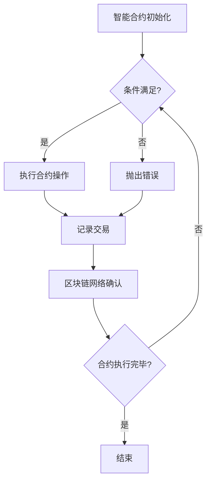
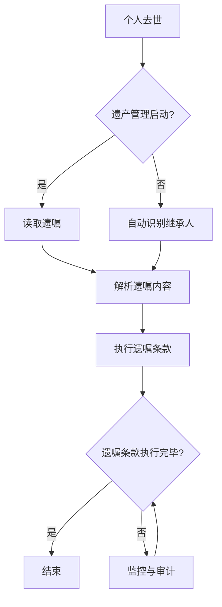
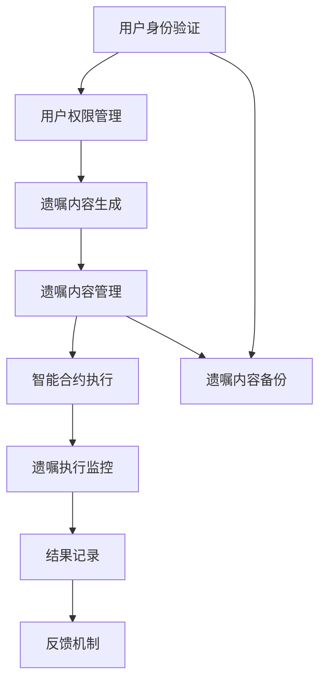

                 

### 《数字化遗嘱执行AI创业：智能合约在遗产管理中的应用》

> **关键词**：数字化遗嘱执行、人工智能、智能合约、区块链、遗产管理、法律技术

**摘要**：
本文旨在探讨数字化遗嘱执行AI创业项目，特别是在遗产管理中的应用。随着科技的不断进步，人工智能和区块链技术逐渐融入了我们的日常生活，特别是在法律和金融领域。数字化遗嘱执行不仅提高了遗产管理的效率和准确性，还大大减少了人为错误和纠纷。本文将详细分析智能合约在遗产管理中的重要作用，并探讨如何利用AI技术开发创新的遗嘱执行解决方案。文章还将提供具体案例、开发环境与工具介绍，以及源代码实现和解读。通过本文，读者将深入了解这一领域的前沿技术和未来趋势。

### 目录大纲

#### 第一部分：引言与概述

- **第1章：数字化遗嘱执行AI创业背景**
  - **1.1 AI创业现状分析**
  - **1.2 数字遗嘱执行需求与挑战**
  - **1.3 智能合约在遗产管理中的应用前景**
  - **1.4 本书结构安排与目标读者**

#### 第二部分：核心概念与联系

- **第2章：智能合约基础**
  - **2.1 智能合约的定义与特点**
  - **2.2 常见的智能合约平台与框架**
  - **2.3 智能合约与区块链的关系**
  - **2.4 智能合约流程图（Mermaid）**

- **第3章：AI在遗产管理中的应用**
  - **3.1 遗产管理的现状与问题**
  - **3.2 AI技术在遗产管理中的潜在应用**
  - **3.3 智能遗嘱与数字遗产的概念**
  - **3.4 AI在遗产管理中的Mermaid流程图**

- **第4章：数字化遗嘱执行架构设计**
  - **4.1 数字遗嘱执行系统的架构设计原则**
  - **4.2 用户身份验证与权限管理**
  - **4.3 遗嘱内容的生成与管理**
  - **4.4 遗嘱执行流程与监控**
  - **4.5 数字遗嘱执行系统架构设计图（Mermaid）**

#### 第三部分：核心算法原理讲解

- **第5章：智能合约开发**
  - **5.1 智能合约编程基础**
  - **5.2 Solidity语言详解**
  - **5.3 常见编程错误与调试**
  - **5.4 智能合约开发伪代码示例**

- **第6章：AI算法在遗嘱执行中的应用**
  - **6.1 遗嘱执行中的自然语言处理**
  - **6.2 图像识别技术在遗产认证中的应用**
  - **6.3 机器学习算法在遗嘱执行中的应用**
  - **6.4 机器学习算法伪代码示例**

- **第7章：数学模型与数学公式**
  - **7.1 概率论与数理统计基础**
  - **7.2 机器学习中的常见数学模型**
  - **7.3 智能合约中的数学模型**
  - **7.4 数学公式示例（使用LaTeX）**

#### 第四部分：项目实战

- **第8章：实际案例介绍**
  - **8.1 数字遗嘱执行平台开发案例**
  - **8.2 智能合约在遗产管理中的应用案例**
  - **8.3 AI技术在遗产管理中的创新应用**

- **第9章：开发环境与工具**
  - **9.1 开发环境搭建**
  - **9.2 开发工具介绍**
  - **9.3 源代码结构说明**

- **第10章：源代码实现与代码解读**
  - **10.1 智能合约源代码实现**
  - **10.2 AI算法源代码实现**
  - **10.3 系统集成与测试**
  - **10.4 代码解读与分析**

#### 第五部分：总结与展望

- **第11章：数字化遗嘱执行AI创业总结**
  - **11.1 项目成果回顾**
  - **11.2 项目挑战与解决**
  - **11.3 项目未来展望**

- **第12章：遗产管理与AI技术发展趋势**
  - **12.1 AI技术在遗产管理领域的未来发展**
  - **12.2 数字化遗嘱执行的创新趋势**
  - **12.3 法律法规与社会影响**

#### 附录：扩展资源

- **附录A：智能合约开发工具与资源**
- **附录B：AI技术在遗产管理中的应用论文与报告**
- **附录C：相关法律法规与政策指导**

### 《数字化遗嘱执行AI创业：智能合约在遗产管理中的应用》正文部分

---

## 第一部分：引言与概述

### 第1章：数字化遗嘱执行AI创业背景

#### 1.1 AI创业现状分析

随着人工智能（AI）技术的飞速发展，AI创业已成为全球范围内的热点。根据统计，人工智能领域的投资额在过去的十年中增长了数十倍，吸引了大量的风险投资和政府资助。AI技术在医疗、金融、教育、交通等多个领域都有广泛的应用，展现了巨大的商业价值和社会影响力。

在创业领域，AI技术的应用不仅提高了企业的运营效率，还为企业提供了创新的机会。许多初创公司利用AI技术解决实际问题，如智能客服系统、自动驾驶汽车、个性化推荐系统等。这些应用的成功不仅证明了AI技术的潜力，也为创业者提供了新的思路和方向。

#### 1.2 数字遗嘱执行需求与挑战

数字遗嘱执行是近年来逐渐受到关注的一个领域。传统的遗嘱执行过程通常较为繁琐，涉及多个法律程序和人工干预，不仅耗时耗力，还存在一定的风险。随着数字技术的普及，人们开始寻求更加高效、透明、安全的遗嘱执行方式。

数字遗嘱执行的需求主要源于以下几个方面：

1. **效率提升**：传统的遗嘱执行过程涉及大量的文档处理、法律咨询和法庭程序，时间成本较高。数字遗嘱执行可以通过自动化流程、电子文档和智能合约来大大缩短处理时间。
   
2. **透明度增强**：数字遗嘱执行过程中，所有操作和记录都可以通过区块链技术进行透明记录，防止信息篡改，提高执行的公正性和可信度。

3. **风险降低**：传统的遗嘱执行过程中，人为因素导致的错误和纠纷较为常见。数字遗嘱执行可以通过智能合约自动执行，减少人为干预，降低执行风险。

然而，数字遗嘱执行也面临着一些挑战：

1. **法律框架不完善**：虽然数字遗嘱执行在技术上具有优势，但当前许多国家的法律法规尚未完全适应这一新兴领域，导致在实施过程中存在法律风险。

2. **技术门槛较高**：数字遗嘱执行涉及到区块链技术、智能合约编程、AI算法等多个领域的知识，对于普通用户来说，掌握这些技术有一定难度。

3. **数据安全和隐私问题**：数字遗嘱执行涉及到大量敏感信息，如遗嘱内容、财产状况、继承人信息等。如何确保这些数据的安全和隐私，是数字遗嘱执行面临的重大挑战。

#### 1.3 智能合约在遗产管理中的应用前景

智能合约作为一种基于区块链技术的自动化执行协议，具有不可篡改、透明高效等特点，非常适合用于遗产管理。智能合约可以通过预设的条件和规则，自动执行遗嘱中的各项安排，确保遗嘱的执行过程公正、透明、高效。

智能合约在遗产管理中的应用前景主要体现在以下几个方面：

1. **自动化执行**：智能合约可以自动化执行遗嘱中的各项安排，如财产分配、遗产转移等，减少人为干预，提高执行效率。

2. **透明可追溯**：智能合约的所有操作都会在区块链上记录并不可篡改，确保遗嘱执行的透明度和可追溯性，防止信息篡改和纠纷。

3. **降低成本**：智能合约可以减少中介机构、律师等人员的参与，降低遗嘱执行的成本，使更多普通民众能够享受到数字遗嘱执行的优势。

4. **合规性**：智能合约可以嵌入法律条款，确保遗嘱执行过程符合法律法规要求，降低法律风险。

总之，智能合约在遗产管理中的应用具有巨大的潜力，可以为传统遗嘱执行带来革命性的改变。通过本文的探讨，我们将深入分析智能合约在遗产管理中的应用，并提供具体的开发方案和实践案例。

#### 1.4 本书结构安排与目标读者

本书分为五个部分，旨在全面探讨数字化遗嘱执行AI创业项目，特别是在遗产管理中的应用。

- **第一部分：引言与概述**：介绍AI创业现状、数字遗嘱执行的需求与挑战，以及智能合约在遗产管理中的应用前景。
- **第二部分：核心概念与联系**：详细讲解智能合约和AI技术在遗产管理中的应用，包括相关的基础知识、流程图等。
- **第三部分：核心算法原理讲解**：介绍智能合约开发和AI算法在遗嘱执行中的应用，包括编程基础、算法实现和数学模型等。
- **第四部分：项目实战**：通过实际案例介绍开发环境与工具，并提供源代码实现和解读。
- **第五部分：总结与展望**：回顾项目成果，探讨未来发展趋势。

本书的目标读者包括：

1. **AI和区块链技术爱好者**：希望通过本书深入了解智能合约和AI技术在遗产管理中的应用。
2. **软件开发者**：希望掌握智能合约和AI算法开发的技术细节，应用于实际项目。
3. **法律专业人士**：希望了解数字遗嘱执行的法律框架和应用场景。
4. **创业者**：希望探索AI和区块链技术在遗产管理领域的创业机会。

通过本书的学习，读者将能够全面了解数字化遗嘱执行AI创业项目的核心技术和应用前景，为未来的研究和实践提供有力支持。

### 第二部分：核心概念与联系

#### 第2章：智能合约基础

#### 2.1 智能合约的定义与特点

智能合约是一种基于区块链技术的计算机程序，能够在满足特定条件时自动执行合同条款。与传统合同相比，智能合约具有以下特点：

1. **自动执行**：智能合约通过预设的条件和规则，在触发事件时自动执行，无需人工干预。这使得合同执行更加高效和准确。
   
2. **透明可追溯**：智能合约的所有操作都在区块链上记录，公开透明，不可篡改。这使得合同执行过程可追溯，增加了信任度。

3. **去中心化**：智能合约运行在分布式网络中，不受单一机构的控制，具有更高的安全性。

4. **不可篡改**：智能合约一旦执行，其内容不可篡改。这保证了合同条款的执行一致性，减少了欺诈和纠纷。

#### 2.2 常见的智能合约平台与框架

目前，常见的智能合约平台和框架主要包括以下几种：

1. **Ethereum**：Ethereum 是最受欢迎的智能合约平台之一，其底层区块链网络支持去中心化应用（DApp）的运行。Ethereum 使用 Solidity 语言编写智能合约，具有广泛的应用场景和开发者社区。

2. **EOS**：EOS 是另一个流行的智能合约平台，注重高性能和可扩展性。EOS 使用 C++ 编写智能合约，支持基于权限系统的去中心化治理。

3. **Tron**：Tron 是一个基于区块链的分布式应用平台，旨在构建一个自由、公平、透明的数字世界。Tron 使用 Solidity 和 JavaScript 语言编写智能合约。

4. **Binance Smart Chain (BSC)**：Binance Smart Chain 是一个由 Binance 推出的智能合约平台，具有高吞吐量和低交易费用的优势。BSC 使用 Solidity 语言编写智能合约。

#### 2.3 智能合约与区块链的关系

智能合约与区块链技术密切相关。区块链是一种分布式数据库技术，具有去中心化、不可篡改、透明可追溯等特点。智能合约运行在区块链上，利用区块链的这些特性实现自动化执行。

1. **数据存储**：智能合约中的数据存储在区块链上，确保数据的不可篡改性和透明性。

2. **交易验证**：智能合约在执行过程中，需要区块链网络中的节点进行验证和确认，确保交易的合法性和安全性。

3. **去中心化共识**：智能合约的执行依赖于区块链的去中心化共识机制，如工作量证明（PoW）和权益证明（PoS）。

4. **智能合约编程**：智能合约的编写和部署需要遵循区块链平台的特定规范和语言，如 Solidity、Vyper 等。

#### 2.4 智能合约流程图（Mermaid）

下面是一个简单的智能合约执行流程图，使用 Mermaid 语言描述：



此流程图展示了智能合约从初始化到执行、记录交易、区块链网络确认的过程。当满足预设条件时，智能合约自动执行操作；否则，抛出错误。所有操作和记录都会在区块链上公开透明地记录。

通过以上对智能合约基础概念的介绍，我们为后续章节的深入探讨奠定了基础。在接下来的章节中，我们将进一步探讨AI技术在遗产管理中的应用，以及如何利用智能合约实现数字遗嘱执行。

#### 第3章：AI在遗产管理中的应用

#### 3.1 遗产管理的现状与问题

遗产管理是一个涉及法律、财务、税务等多个方面的复杂过程。传统的遗产管理主要依赖于纸质文档、人工处理和法律程序，存在以下问题：

1. **效率低下**：传统的遗产管理过程涉及多个环节，如遗产认证、财产评估、继承人确认等，时间成本高，效率低下。

2. **人为错误**：在遗产管理过程中，由于人工处理，容易出现错误和遗漏，导致纠纷和损失。

3. **信息不透明**：传统遗产管理过程中，信息传递不畅，导致信息不透明，增加了信任问题。

4. **法律风险**：在遗产管理过程中，由于法律法规不完善，容易出现法律风险，如遗嘱无效、遗产分配不公等。

5. **成本高**：传统的遗产管理过程需要聘请律师、会计师等专业人员，成本较高，对普通家庭造成负担。

#### 3.2 AI技术在遗产管理中的潜在应用

人工智能技术在遗产管理中的应用，有望解决上述问题，提高遗产管理的效率、准确性和透明度。以下是一些AI技术在遗产管理中的潜在应用：

1. **自然语言处理（NLP）**：NLP技术可以用于遗嘱内容的解析和自动化处理。例如，AI模型可以自动提取遗嘱中的关键信息，如继承人、财产分配比例等，减少人工处理的时间和错误率。

2. **图像识别技术**：图像识别技术可以用于遗产认证，如自动识别和验证遗嘱签名、继承人身份等，提高认证效率和准确性。

3. **自动化合同审查**：AI技术可以用于自动化审查合同，检测潜在的法律风险，如遗嘱格式不规范、条款不一致等，提高合同审查的效率和准确性。

4. **智能资产管理**：AI技术可以用于资产管理和分配，如自动计算遗产总额、分配比例等，确保遗产分配的公平性。

5. **智能客服系统**：AI技术可以用于建立智能客服系统，为遗产继承人提供24/7的咨询服务，解答他们的疑问，减少沟通障碍。

6. **风险评估与预测**：AI技术可以用于评估和预测遗产管理的风险，如预测继承人之间的纠纷可能性、分析遗嘱的有效性等，提前采取预防措施。

7. **智能监控与审计**：AI技术可以用于监控和审计遗产管理过程，确保遗嘱执行的透明度和合规性，减少信息篡改和欺诈行为。

#### 3.3 智能遗嘱与数字遗产的概念

智能遗嘱是一种利用AI技术和智能合约编写的数字化遗嘱，具有以下特点：

1. **自动化执行**：智能遗嘱中的条款和安排可以自动执行，无需人工干预，提高执行效率。

2. **透明可追溯**：智能遗嘱的所有操作都在区块链上记录，公开透明，增加信任度。

3. **不可篡改**：智能遗嘱的内容一旦编写，即被加密存储在区块链上，确保遗嘱内容的不可篡改性和可靠性。

4. **法律合规**：智能遗嘱可以嵌入法律条款，确保遗嘱执行过程符合法律法规要求。

数字遗产是指个人在互联网和数字世界中留下的各种信息、财产和权益，如社交媒体账号、电子邮件、在线银行账户、虚拟货币等。随着互联网和数字技术的发展，数字遗产的管理变得越来越重要。

1. **数字遗产的继承**：AI技术可以用于自动化处理数字遗产的继承，如自动提取数字遗产、分配给继承人等，减少人工处理的时间和错误率。

2. **数字遗产的监控与保护**：AI技术可以用于监控和审计数字遗产，确保数字遗产的安全和合规，防止滥用和丢失。

3. **数字遗产的价值评估**：AI技术可以用于评估数字遗产的价值，如自动计算虚拟货币的价值、社交媒体账号的影响力等，为遗产分配提供参考。

通过AI技术和智能合约，我们可以构建一个更加高效、透明和安全的遗产管理体系，解决传统遗产管理中存在的问题。在接下来的章节中，我们将进一步探讨数字化遗嘱执行系统的架构设计，以及如何实现智能遗嘱和数字遗产的管理。

#### 3.4 AI在遗产管理中的Mermaid流程图

为了更好地理解AI在遗产管理中的应用流程，我们可以使用Mermaid语言绘制一个简化的流程图，如下所示：



该流程图展示了AI在遗产管理中的应用步骤：

1. **个人去世**：个人去世后，遗产管理程序启动。

2. **读取遗嘱**：系统自动读取智能遗嘱的内容。

3. **自动识别继承人**：利用AI技术自动识别遗嘱中的继承人。

4. **解析遗嘱内容**：系统解析遗嘱中的条款和安排。

5. **执行遗嘱条款**：智能合约根据遗嘱条款自动执行相关操作。

6. **遗嘱条款执行完毕**：监控与审计遗嘱执行过程，确保执行完毕。

通过上述流程，我们可以看到AI技术如何通过智能合约实现遗嘱的自动化执行和监控，提高了遗产管理的效率和透明度。在接下来的章节中，我们将进一步探讨数字化遗嘱执行系统的架构设计，以及具体的开发实现。

### 第三部分：数字化遗嘱执行架构设计

#### 第4章：数字化遗嘱执行架构设计

#### 4.1 数字遗嘱执行系统的架构设计原则

数字化遗嘱执行系统的架构设计旨在实现遗嘱的自动化、透明化和高效管理。为了达到这一目标，设计时需要遵循以下原则：

1. **模块化设计**：系统应采用模块化设计，将不同的功能模块分离，如用户管理、遗嘱管理、智能合约执行等，便于系统扩展和维护。

2. **高可用性**：系统应具备高可用性，确保在遭遇故障时能够快速恢复，减少对用户的影响。

3. **安全性**：系统应具备严格的安全措施，保护用户数据的安全和隐私，防止未授权访问和数据泄露。

4. **可扩展性**：系统应具备良好的可扩展性，能够支持新增功能和用户量增加，以适应不断变化的需求。

5. **高并发处理能力**：系统应具备高并发处理能力，能够应对大量并发请求，确保系统运行稳定。

#### 4.2 用户身份验证与权限管理

用户身份验证和权限管理是数字化遗嘱执行系统的关键组成部分，确保系统安全性和数据隐私。以下是一些建议：

1. **多因素身份验证**：采用多因素身份验证（MFA），如密码+手机验证码、指纹识别等，提高账户安全性。

2. **权限分级管理**：根据用户角色和职责，设置不同的权限级别，确保用户只能访问和操作与其角色相关的功能模块。

3. **动态权限调整**：根据用户行为和系统需求，动态调整用户的权限，如用户行为异常时，限制其部分操作权限。

4. **审计日志**：记录用户操作的审计日志，便于追踪和审计用户行为，确保系统的合规性。

#### 4.3 遗嘱内容的生成与管理

遗嘱内容的生成与管理是数字化遗嘱执行系统的核心功能之一。以下是一些建议：

1. **智能表单**：采用智能表单，引导用户填写遗嘱内容，确保信息的完整性和准确性。

2. **数据校验**：对用户填写的遗嘱内容进行数据校验，如格式检查、必填项验证等，确保数据的有效性。

3. **版本控制**：实现遗嘱版本的自动控制，记录每个版本的变更历史，便于追溯和管理。

4. **遗嘱备份**：定期备份遗嘱数据，确保数据的安全性和可靠性。

5. **遗嘱加密**：对遗嘱内容进行加密存储，保护用户隐私。

#### 4.4 遗嘱执行流程与监控

遗嘱执行流程与监控是数字化遗嘱执行系统的关键环节，确保遗嘱的准确执行和透明管理。以下是一些建议：

1. **智能合约执行**：利用智能合约，自动化执行遗嘱中的各项安排，如财产分配、遗产转移等。

2. **状态监控**：实时监控遗嘱执行过程中的关键状态，如智能合约执行进度、资金流动等，确保执行过程的透明度。

3. **异常处理**：当遗嘱执行过程中出现异常时，如资金不足、智能合约执行失败等，系统应自动触发异常处理机制，通知相关人员进行处理。

4. **结果记录**：记录遗嘱执行的结果，如财产分配情况、执行时间等，便于后续审计和查询。

5. **反馈机制**：建立反馈机制，收集用户对遗嘱执行过程的意见和建议，不断优化系统功能。

#### 4.5 数字遗嘱执行系统架构设计图（Mermaid）

以下是一个简化的数字遗嘱执行系统架构设计图，使用Mermaid语言描述：



该架构图展示了数字化遗嘱执行系统的核心功能模块及其关系：

1. **用户身份验证**：验证用户身份，确保用户访问系统的安全性。

2. **用户权限管理**：根据用户角色和职责，分配不同的权限。

3. **遗嘱内容生成**：用户填写和提交遗嘱内容。

4. **遗嘱内容管理**：存储和管理遗嘱内容，确保数据的完整性和准确性。

5. **智能合约执行**：利用智能合约，自动化执行遗嘱中的各项安排。

6. **遗嘱执行监控**：监控遗嘱执行过程，确保执行的透明度和合规性。

7. **结果记录**：记录遗嘱执行的结果，便于审计和查询。

8. **遗嘱内容备份**：定期备份遗嘱数据，确保数据的安全性和可靠性。

通过上述架构设计，我们可以实现一个高效、透明、安全的数字化遗嘱执行系统，为遗产管理提供有力支持。在接下来的章节中，我们将进一步探讨智能合约开发和AI算法在遗嘱执行中的应用。

### 第三部分：核心算法原理讲解

#### 第5章：智能合约开发

#### 5.1 智能合约编程基础

智能合约是一种运行在区块链上的计算机程序，用于自动化执行合同条款。智能合约的开发涉及到区块链平台的选择、编程语言的使用以及合约的实现细节。以下是一些基础概念和要点：

1. **区块链平台选择**：常见的区块链平台有Ethereum、EOS、Tron和Binance Smart Chain（BSC）等。选择平台时需要考虑平台的特点、开发社区支持、交易费用等因素。

2. **编程语言**：智能合约的编程语言通常是基于图灵完备的，如Solidity（Ethereum）、Vyper（Ethereum）和Scilla（EVM兼容）等。Solidity是最广泛使用的智能合约编程语言，具有丰富的语言特性和库支持。

3. **智能合约基本结构**：一个智能合约通常包含以下几个部分：
   - **合约（Contract）**：定义智能合约的名称、版本、访问控制等。
   - **事件（Events）**：用于记录合约中发生的特定事件，便于外部追踪。
   - **函数（Functions）**：定义智能合约可以执行的操作，分为外部函数（public）和内部函数（internal）。

4. **状态变量**：智能合约中的状态变量用于存储合约的持久数据。状态变量分为公共（public）和私有（private）。

5. **数据类型**：智能合约支持多种数据类型，包括布尔型（bool）、整数型（uint）、字符串型（string）等。

6. **函数修饰符**：函数修饰符用于指定函数的访问级别和调用方式，如`external`、`public`、`view`、`pure`等。

#### 5.2 Solidity语言详解

Solidity是最常用的智能合约编程语言，以下是其主要语法和特性：

1. **变量声明与赋值**：
   ```solidity
   uint x = 10;
   bool result = true;
   ```

2. **函数定义**：
   ```solidity
   function add(uint a, uint b) public view returns (uint) {
       return a + b;
   }
   ```

3. **事件定义**：
   ```solidity
   event Log(uint x, string message);
   ```

4. **结构体（Structs）**：
   ```solidity
   struct Person {
       uint id;
       string name;
   }
   ```

5. **继承（Inheritance）**：
   ```solidity
   contract Base {
       function baseFunction() public {}
   }

   contract Derived is Base {
       function derivedFunction() public override {}
   }
   ```

6. **修饰符（Modifiers）**：
   ```solidity
   modifier onlyOwner() {
       require(msg.sender == owner, "Not owner");
       _;
   }

   function someFunction() public onlyOwner {}
   ```

7. **错误处理**：
   ```solidity
   require(condition, "Error message");
   assert(condition);
   ```

8. **转账与调用**：
   ```solidity
   payable function deposit() public {
       (bool sent, ) = address(to).call{value: amount}("");
       require(sent, "Failed to send Ether");
   }
   ```

#### 5.3 常见编程错误与调试

在智能合约开发过程中，常见的编程错误包括：

1. **Reentrancy攻击**：攻击者通过重复调用合约函数来获取未授权访问。
   - **解决方案**：使用`nonReentrant`修饰符或`mutex`锁来防止重复调用。

2. **整数溢出与下溢**：智能合约中的算术运算可能导致整数溢出或下溢，导致数据错误。
   - **解决方案**：使用安全数学运算库，如OpenZeppelin。

3. **未处理的异常**：合约中未处理的异常可能导致合约崩溃。
   - **解决方案**：使用`require`和`assert`语句来处理异常。

4. **潜在的安全漏洞**：智能合约代码可能存在潜在的安全漏洞，如逻辑错误或不安全的编程实践。
   - **解决方案**：进行代码审计和单元测试，使用安全编码实践。

调试智能合约时，可以使用以下工具：

1. **本地测试环境**：如Truffle或Hardhat，用于编写和运行合约测试。
2. **集成开发环境（IDE）**：如Visual Studio Code，支持智能合约开发。
3. **合约分析工具**：如Slither或Oyente，用于分析合约代码的安全性。
4. **区块链浏览器**：如Etherscan，用于查看合约的调用记录和事件日志。

#### 5.4 智能合约开发伪代码示例

以下是一个简单的智能合约伪代码示例，用于管理一个共享资金池：

```solidity
// SPDX-License-Identifier: MIT
pragma solidity ^0.8.0;

contract SharedFundPool {
    address payable owner;
    mapping(address => uint) public contributions;

    constructor() {
        owner = payable(msg.sender);
    }

    function contribute() public payable {
        require(msg.value > 0, "Contribution must be greater than 0");
        contributions[msg.sender] += msg.value;
    }

    function withdraw(uint amount) public {
        require(amount <= contributions[msg.sender], "Insufficient balance");
        contributions[msg.sender] -= amount;
        payable(msg.sender).transfer(amount);
    }

    function getBalance() public view returns (uint) {
        return address(this).balance;
    }
}
```

此合约包含以下功能：

1. **构造函数**：初始化合约所有者。
2. **contribute()**：允许用户向资金池贡献资金。
3. **withdraw()**：允许用户从资金池提取资金。
4. **getBalance()**：返回资金池当前余额。

通过此示例，我们可以看到智能合约的基本结构和常见编程模式。在接下来的章节中，我们将进一步探讨AI算法在遗嘱执行中的应用。

### 第6章：AI算法在遗嘱执行中的应用

#### 6.1 遗嘱执行中的自然语言处理

自然语言处理（NLP）是AI技术的一个重要分支，它使计算机能够理解、处理和生成自然语言文本。在遗嘱执行过程中，NLP技术可以用于自动解析和理解遗嘱内容，从而提高效率和准确性。以下是一些NLP技术在遗嘱执行中的应用：

1. **遗嘱内容解析**：利用NLP技术，可以自动提取遗嘱中的关键信息，如继承人、财产分配、受益人等。通过文本分类和实体识别技术，系统可以快速定位并提取这些关键信息，从而避免人工处理的繁琐和错误。

2. **遗嘱条款理解**：遗嘱中包含许多复杂的法律术语和条款，NLP技术可以帮助理解这些条款的含义。例如，可以使用情感分析技术来判断遗嘱制定者的意图和情感状态，从而更准确地执行遗嘱。

3. **遗嘱内容审核**：NLP技术可以用于自动审核遗嘱内容的合规性，检测是否存在格式错误或逻辑不一致的情况。通过文本比对和规则匹配，系统可以快速发现潜在的问题，并提供修改建议。

4. **遗嘱解释服务**：对于复杂的遗嘱内容，NLP技术可以提供自动解释服务。例如，系统可以生成遗嘱的摘要和解读，帮助继承人更好地理解遗嘱的内容和执行要求。

#### 6.2 图像识别技术在遗产认证中的应用

图像识别技术是AI技术的另一个重要分支，它使计算机能够识别和分类图像中的内容。在遗产认证过程中，图像识别技术可以用于自动识别和验证遗嘱中的签名、文件、照片等。以下是一些图像识别技术在遗产认证中的应用：

1. **签名验证**：利用图像识别技术，可以自动识别遗嘱签名，并验证其真实性和有效性。通过比较签名与已知样本的相似度，系统可以快速判断签名的真实性。

2. **文件识别**：遗产认证过程中，需要验证各种文件的真实性和合法性。图像识别技术可以用于自动识别和分类这些文件，如身份证明、财产证明等，从而提高认证效率和准确性。

3. **照片识别**：在遗嘱中，可能包含一些反映遗嘱制定者意图和财产状况的照片。图像识别技术可以用于自动识别和分类这些照片，帮助继承人更好地理解遗嘱的内容和执行要求。

4. **图像增强**：对于一些模糊或受损的图像，图像识别技术可以用于增强图像质量，从而提高识别的准确性和可靠性。

#### 6.3 机器学习算法在遗嘱执行中的应用

机器学习算法是AI技术的核心组成部分，通过训练模型来预测和决策。在遗嘱执行过程中，机器学习算法可以用于自动分析和处理大量数据，提高遗嘱执行的效率和准确性。以下是一些机器学习算法在遗嘱执行中的应用：

1. **遗嘱内容分析**：利用机器学习算法，可以对遗嘱内容进行深入分析，识别潜在的法律问题和风险。通过文本分类和聚类算法，系统可以自动识别遗嘱中的关键概念和关系，并提供风险预警。

2. **财产评估**：在遗嘱执行过程中，需要对遗产进行评估，以确定其价值和分配比例。机器学习算法可以用于自动评估财产价值，提高评估的准确性和效率。

3. **继承人筛选**：利用机器学习算法，可以自动筛选符合遗嘱要求的继承人，减少人工筛选的工作量。通过构建分类模型，系统可以快速判断继承人是否符合遗嘱规定，从而提高执行效率。

4. **遗嘱执行优化**：机器学习算法可以用于优化遗嘱执行过程，提高效率和准确性。例如，通过预测遗嘱执行中的潜在问题，系统可以提前采取预防措施，减少纠纷和延误。

#### 6.4 机器学习算法伪代码示例

以下是一个简化的机器学习算法伪代码示例，用于预测遗嘱执行中的潜在问题：

```python
# 伪代码：遗嘱执行问题预测

# 导入必要的库
import pandas as pd
from sklearn.model_selection import train_test_split
from sklearn.ensemble import RandomForestClassifier
from sklearn.metrics import accuracy_score

# 数据准备
data = pd.read_csv('will_exec_data.csv')
X = data.drop(['target'], axis=1)
y = data['target']

# 数据分割
X_train, X_test, y_train, y_test = train_test_split(X, y, test_size=0.2, random_state=42)

# 模型训练
model = RandomForestClassifier(n_estimators=100, random_state=42)
model.fit(X_train, y_train)

# 模型预测
y_pred = model.predict(X_test)

# 评估模型
accuracy = accuracy_score(y_test, y_pred)
print(f"模型准确率：{accuracy:.2f}")

# 输出预测结果
predictions = pd.DataFrame({'实际值': y_test, '预测值': y_pred})
print(predictions.head())
```

此示例中，我们使用随机森林分类器（RandomForestClassifier）来预测遗嘱执行中的潜在问题。首先，我们导入必要的库，并读取数据。然后，我们分割数据集为训练集和测试集，并训练模型。最后，我们使用测试集评估模型的准确率，并输出预测结果。

通过上述伪代码示例，我们可以看到机器学习算法在遗嘱执行中的应用如何实现。在接下来的章节中，我们将进一步探讨数学模型与数学公式在智能合约中的应用。

### 第7章：数学模型与数学公式

#### 7.1 概率论与数理统计基础

概率论与数理统计是人工智能领域的重要基础，用于处理不确定性问题和数据分析。在智能合约开发与遗产管理中，概率论与数理统计方法有助于评估风险、预测执行结果和优化决策。

1. **概率分布**：概率分布描述了随机变量的概率特征。常见的概率分布有正态分布、二项分布、泊松分布等。
   - **正态分布**：描述连续随机变量的分布，广泛应用于统计分析和机器学习。
   - **二项分布**：描述离散随机变量的分布，适用于二项试验（如掷硬币）。
   - **泊松分布**：描述在一定时间或空间内事件发生的次数分布，适用于事件计数。

2. **期望与方差**：期望和方差是概率分布的重要参数，用于描述随机变量的集中趋势和离散程度。
   - **期望（E）**：描述随机变量的平均取值，即概率加权平均。
   - **方差（Var）**：描述随机变量的离散程度，即期望与具体取值的偏离程度。

3. **条件概率与贝叶斯定理**：条件概率描述在某个事件发生的条件下，另一个事件发生的概率。贝叶斯定理是条件概率的推广，用于计算后验概率。

4. **数理统计基础**：数理统计用于从样本数据推断总体特征。
   - **描述性统计**：用于描述数据的基本特征，如均值、方差、标准差等。
   - **推断性统计**：用于根据样本数据推断总体特征，如置信区间、假设检验等。

#### 7.2 机器学习中的常见数学模型

机器学习中的数学模型用于构建预测和分类模型。以下是一些常见的数学模型：

1. **线性回归模型**：用于预测连续值输出，通过最小化损失函数（如均方误差）来训练模型。
   - **损失函数**：描述模型预测值与真实值之间的差异，如均方误差（MSE）、均方根误差（RMSE）等。

2. **逻辑回归模型**：用于预测二分类输出，通过最大化似然函数来训练模型。
   - **似然函数**：描述数据对模型参数的依赖性，用于估计模型参数。

3. **决策树模型**：用于分类和回归任务，通过递归划分特征空间来构建树结构。
   - **分裂准则**：用于选择最佳分裂特征，如信息增益、基尼不纯度等。

4. **神经网络模型**：用于复杂函数逼近和分类任务，通过多层感知器（MLP）和反向传播算法训练模型。
   - **激活函数**：用于引入非线性，如Sigmoid、ReLU等。
   - **损失函数**：用于衡量模型预测值与真实值之间的差异，如交叉熵损失、均方误差等。

5. **支持向量机（SVM）模型**：用于分类任务，通过最大化分类边界来训练模型。
   - **核函数**：用于将低维数据映射到高维空间，提高分类能力。

#### 7.3 智能合约中的数学模型

智能合约中的数学模型用于处理金融交易、数据验证和执行规则。以下是一些常见的数学模型：

1. **代数运算模型**：用于执行基本的数学运算，如加法、减法、乘法和除法等。
   - **同态加密**：用于在加密状态下执行数学运算，保护数据隐私。

2. **概率模型**：用于风险评估和决策，如蒙特卡洛模拟、贝叶斯网络等。
   - **蒙特卡洛模拟**：通过随机采样和统计方法，估计概率分布和期望值。

3. **时间序列模型**：用于预测时间序列数据，如ARIMA、LSTM等。
   - **ARIMA**：自回归积分滑动平均模型，用于短期预测。
   - **LSTM**：长短时记忆网络，用于处理和预测长期依赖数据。

4. **优化模型**：用于资源分配和任务调度，如线性规划、整数规划等。
   - **线性规划**：通过优化线性目标函数，求解约束条件下的最优解。
   - **整数规划**：用于求解包含整数变量的优化问题。

#### 7.4 数学公式示例（使用LaTeX）

以下是一些常见的数学公式示例，使用LaTeX格式编写：

```latex
% 概率分布函数
\begin{equation}
f_X(x) = \frac{1}{\sqrt{2\pi\sigma^2}} e^{-\frac{(x-\mu)^2}{2\sigma^2}}
\end{equation}

% 期望和方差
\begin{equation}
E[X] = \mu, \quad Var[X] = \sigma^2
\end{equation}

% 线性回归模型
\begin{equation}
y = \beta_0 + \beta_1x + \epsilon
\end{equation}

% 决策树分裂准则
\begin{equation}
Gain_D = \sum_{v \in V} p(v) \cdot Entropy_D^v
\end{equation}

% 神经网络激活函数
\begin{equation}
a_i = \sigma(\beta_0 + \sum_{j=1}^{n} \beta_jx_j)
\end{equation}

% 时间序列模型
\begin{equation}
\begin{cases}
X_t = \phi X_{t-1} + \theta \epsilon_t \\
Y_t = \alpha X_t + \beta
\end{cases}
\end{equation}
```

通过上述数学公式示例，我们可以看到LaTeX在编写复杂数学公式时的优势。在智能合约和AI算法开发中，LaTeX可以用于编写和解释复杂的数学模型，提高文档的可读性和专业性。

### 第8章：实际案例介绍

#### 8.1 数字遗嘱执行平台开发案例

数字遗嘱执行平台的开发是一个涉及多个技术和领域的综合性项目。以下是一个简化的开发案例，介绍数字遗嘱执行平台的关键组成部分和开发步骤。

**1. 需求分析**：

- **用户角色**：遗嘱制定者、继承人、遗嘱执行人、法律顾问等。
- **核心功能**：遗嘱内容创建、编辑、存储、签名验证、执行和监控。
- **非功能需求**：安全性、高可用性、可扩展性、易于维护。

**2. 技术选型**：

- **前端技术**：React或Vue.js，用于构建用户界面。
- **后端技术**：Node.js或Spring Boot，用于处理业务逻辑和API接口。
- **区块链平台**：Ethereum，用于实现智能合约。
- **数据库**：MongoDB，用于存储用户数据和管理系统配置。

**3. 开发步骤**：

- **阶段一：需求分析与原型设计**：
  - 制定详细的需求文档，包括功能需求和非功能需求。
  - 设计用户界面原型，进行用户测试和反馈。

- **阶段二：后端开发**：
  - 设计和实现用户身份验证和权限管理。
  - 构建API接口，处理前端请求。
  - 集成区块链节点，实现智能合约交互。

- **阶段三：前端开发**：
  - 构建用户界面，实现遗嘱内容创建、编辑和存储功能。
  - 实现签名验证和身份验证功能，确保数据安全。

- **阶段四：测试与部署**：
  - 进行单元测试和集成测试，确保系统功能完整和稳定。
  - 部署到云平台，如AWS或Azure，确保高可用性和可扩展性。

**4. 案例亮点**：

- **智能合约**：利用智能合约实现遗嘱条款的自动化执行，确保遗嘱的透明性和不可篡改性。
- **多因素身份验证**：采用多因素身份验证（MFA），提高账户安全性。
- **自动化监控**：实时监控遗嘱执行过程，及时发现和解决问题。
- **法律合规性**：确保系统设计和功能符合相关法律法规要求，降低法律风险。

#### 8.2 智能合约在遗产管理中的应用案例

以下是一个具体的智能合约在遗产管理中的应用案例，展示了智能合约如何实现遗嘱的自动化执行。

**1. 案例背景**：

- **遗嘱内容**：一位遗嘱制定者希望在其去世后，将财产按照特定比例分配给其子女和配偶。
- **智能合约**：智能合约包含遗嘱的详细条款，如继承人、分配比例、执行时间等。

**2. 智能合约实现**：

- **合约设计**：
  ```solidity
  // SPDX-License-Identifier: MIT
  pragma solidity ^0.8.0;

  contract Will {
      address public executor;
      address[] public beneficiaries;
      mapping(address => uint) public shares;

      constructor(address[] memory _beneficiaries, uint[] memory _shares) {
          executor = msg.sender;
          beneficiaries = _beneficiaries;
          for (uint i = 0; i < beneficiaries.length; i++) {
              shares[beneficiaries[i]] = _shares[i];
          }
      }

      function distributeInheritance() external {
          require(msg.sender == executor, "Only executor can call this function");
          for (uint i = 0; i < beneficiaries.length; i++) {
              payable(beneficiaries[i]).transfer(shares[beneficiaries[i]]);
          }
      }
  }
  ```

- **合约功能**：
  - **构造函数**：初始化遗嘱执行人和受益人及其分配比例。
  - **distributeInheritance()**：执行遗嘱分配，将遗产按照分配比例支付给受益人。

**3. 案例应用**：

- **遗嘱创建**：遗嘱制定者使用平台创建遗嘱，输入受益人和分配比例。
- **智能合约部署**：平台将遗嘱内容编译为智能合约，并在Ethereum区块链上部署。
- **遗嘱执行**：遗嘱制定者去世后，执行人调用智能合约的distributeInheritance()函数，自动执行遗产分配。
- **监控与审计**：系统实时监控智能合约的执行过程，确保执行过程透明、公正。

#### 8.3 AI技术在遗产管理中的创新应用

随着AI技术的不断发展，AI在遗产管理中的应用呈现出更多的可能性。以下是一些创新应用：

**1. 自然语言处理（NLP）**：

- **遗嘱内容解析**：使用NLP技术，自动提取遗嘱中的关键信息，如受益人、财产、执行时间等。
- **遗嘱条款理解**：通过情感分析和语义分析，理解遗嘱制定者的意图和情感状态，提高遗嘱执行的准确性。

**2. 图像识别技术**：

- **签名验证**：使用图像识别技术，自动识别和验证遗嘱签名，确保遗嘱的真实性和有效性。
- **遗产认证**：通过图像识别技术，自动识别和分类遗产中的文件和照片，提高遗产管理的效率和准确性。

**3. 机器学习算法**：

- **财产评估**：利用机器学习算法，自动评估遗产的价值，为遗产分配提供参考。
- **继承人筛选**：通过构建分类模型，自动筛选符合遗嘱规定的继承人，减少人工筛选的工作量。
- **遗嘱执行优化**：利用机器学习算法，优化遗嘱执行过程，提高效率和准确性。

通过以上实际案例和AI技术的创新应用，我们可以看到数字化遗嘱执行平台在遗产管理中的重要性和潜力。在未来的发展中，随着技术的进一步成熟，数字遗嘱执行平台将更好地服务于社会，为遗产管理带来更多便捷和保障。

### 第9章：开发环境与工具

#### 9.1 开发环境搭建

为了顺利地开发数字化遗嘱执行平台，需要搭建一个稳定且功能齐全的开发环境。以下是在Windows操作系统上搭建开发环境的具体步骤：

**1. 安装Node.js**

Node.js是一个基于Chrome V8引擎的JavaScript运行环境，用于构建后端API和智能合约。以下是安装步骤：

- 访问Node.js官网（https://nodejs.org/）并下载适用于Windows的最新版安装程序。
- 运行安装程序，选择默认选项完成安装。
- 安装完成后，在命令行中输入以下命令，验证安装是否成功：
  ```shell
  node -v
  npm -v
  ```

**2. 安装Ethereum客户端**

Ethereum客户端用于与区块链网络进行交互，实现智能合约的部署和调用。以下是安装步骤：

- 访问Geth官网（https://geth.ethereum.org/downloads/）并下载适用于Windows的最新版Geth安装程序。
- 运行安装程序，选择默认选项完成安装。
- 打开命令行窗口，输入以下命令启动Geth客户端：
  ```shell
  geth --datadir "C:\eth\ethereum" --nodiscover --networkid 15 --port "30303" --rpc --rpcport "8545" --rpcapi "eth,net,web3,personal,admin"
  ```
- 等待Geth客户端完全启动，可以通过访问`http://localhost:8545`来检查客户端状态。

**3. 安装前端框架**

选择一个合适的前端框架，如React或Vue.js，可以简化前端开发工作。以下是安装React的步骤：

- 在命令行中输入以下命令，全局安装React和创建一个新项目：
  ```shell
  npm install -g create-react-app
  create-react-app digital-will-execution
  ```
- 进入项目目录并启动开发服务器：
  ```shell
  cd digital-will-execution
  npm start
  ```

**4. 安装智能合约开发工具**

智能合约开发工具可以帮助我们编写、编译和部署智能合约。以下是安装Truffle的步骤：

- 在命令行中输入以下命令，全局安装Truffle：
  ```shell
  npm install -g truffle
  ```
- 创建一个新的Truffle项目：
  ```shell
  truffle init
  ```
- 安装并配置Truffle环境，包括安装所需的依赖包和配置文件：
  ```shell
  cd my-project
  npm install
  ```

**5. 安装数据库**

选择一个合适的数据库，如MongoDB，可以用于存储用户数据和管理系统配置。以下是安装MongoDB的步骤：

- 访问MongoDB官网（https://www.mongodb.com/）并下载适用于Windows的最新版MongoDB安装程序。
- 运行安装程序，选择默认选项完成安装。
- 打开命令行窗口，输入以下命令启动MongoDB服务：
  ```shell
  net start MongoDB
  ```
- 使用MongoDB的Shell连接到本地数据库：
  ```shell
  mongo
  ```

通过以上步骤，我们成功搭建了开发环境，为后续的数字化遗嘱执行平台开发工作奠定了基础。

#### 9.2 开发工具介绍

在数字化遗嘱执行平台开发过程中，选择合适的工具可以提高开发效率和项目质量。以下是一些常用的开发工具及其功能介绍：

**1. Visual Studio Code**

Visual Studio Code（VS Code）是一款免费且开源的代码编辑器，支持多种编程语言和扩展插件。以下是VS Code在数字化遗嘱执行平台开发中的应用：

- **智能提示与代码补全**：VS Code支持JavaScript、Solidity、Python等多种编程语言的智能提示和代码补全功能，提高编写效率。
- **调试工具**：VS Code内置强大的调试工具，可以调试JavaScript、Solidity等代码，帮助开发者快速定位和解决问题。
- **扩展插件**：通过安装扩展插件，如ESLint、Prettier等，可以自动格式化代码、检查代码风格，确保代码质量。

**2. Truffle**

Truffle是一个智能合约开发框架，用于管理智能合约的开发、测试和部署。以下是Truffle在数字化遗嘱执行平台开发中的应用：

- **智能合约管理**：Truffle可以帮助开发者管理智能合约的版本、部署和迁移，简化开发流程。
- **测试环境**：Truffle支持本地测试环境，可以使用JavaScript编写测试用例，确保智能合约的正确性。
- **部署工具**：Truffle提供部署工具，可以将智能合约部署到本地或远程区块链网络，如Ethereum。

**3. Geth**

Geth是Ethereum的官方客户端，用于与区块链网络进行交互。以下是Geth在数字化遗嘱执行平台开发中的应用：

- **本地节点**：Geth可以作为一个本地节点，模拟区块链网络，用于测试和调试智能合约。
- **同步数据**：Geth可以同步区块链网络的数据，确保智能合约的执行环境与实际网络一致。
- **命令行工具**：Geth提供丰富的命令行工具，可以执行区块链操作，如转账、调用智能合约函数等。

**4. MongoDB**

MongoDB是一款开源的NoSQL数据库，适用于存储用户数据和系统配置。以下是MongoDB在数字化遗嘱执行平台开发中的应用：

- **数据存储**：MongoDB可以存储用户信息、遗嘱内容、智能合约执行记录等数据，支持数据的快速读取和写入。
- **文档模型**：MongoDB使用文档模型，可以灵活地存储和查询结构化数据，满足多样化需求。
- **复制和分片**：MongoDB支持复制和分片，提高数据存储的可用性和性能。

通过上述开发工具，我们可以高效地开发数字化遗嘱执行平台，确保系统的稳定性、可靠性和安全性。

#### 9.3 源代码结构说明

在数字化遗嘱执行平台中，源代码结构的设计对于项目的可维护性和可扩展性至关重要。以下是一个典型的源代码结构，以及各个目录和文件的作用说明：

```
digital-will-execution/
│
├── frontend/                      # 前端代码目录
│   ├── components/                # 组件目录
│   │   ├── LoginForm.js          # 登录表单组件
│   │   ├── WillForm.js          # 遗嘱表单组件
│   │   └── ...
│   ├── pages/                    # 页面目录
│   │   ├── Dashboard.js         # 仪表盘页面
│   │   ├── Login.js            # 登录页面
│   │   └── ...
│   ├── styles/                   # 样式目录
│   │   ├── main.css            # 主样式文件
│   │   └── ...
│   ├── App.js                   # 应用入口文件
│   └── ...
│
├── backend/                       # 后端代码目录
│   ├── api/                     # API目录
│   │   ├── auth.js             # 身份验证API
│   │   ├── wills.js            # 遗嘱管理API
│   │   └── ...
│   ├── models/                   # 模型目录
│   │   ├── User.js             # 用户模型
│   │   └── Will.js             # 遗嘱模型
│   ├── services/                # 服务目录
│   │   ├── AuthService.js      # 身份验证服务
│   │   └── WillService.js      # 遗嘱服务
│   ├── config/                  # 配置目录
│   │   └── ...
│   ├── routes/                  # 路由目录
│   │   └── ...
│   ├── controllers/             # 控制器目录
│   │   └── ...
│   ├── middleware/              # 中间件目录
│   │   └── ...
│   ├── ...
│
├── contracts/                    # 智能合约目录
│   ├── Will.sol               # 遗嘱智能合约
│   └── ...
│
├── tests/                        # 测试目录
│   ├── frontend/               # 前端测试目录
│   │   ├── components/         # 组件测试目录
│   │   ├── pages/             # 页面测试目录
│   │   └── ...
│   ├── backend/               # 后端测试目录
│   │   ├── api/               # API测试目录
│   │   ├── models/            # 模型测试目录
│   │   └── ...
│   └── ...
│
├── .env                        # 环境变量配置文件
├── package.json                # 依赖包和配置文件
├── README.md                  # 项目说明文件
└── ...
```

**1. 前端代码目录（frontend/）**：
- **components/**：存放可复用的UI组件，如表单、按钮、弹窗等。
- **pages/**：存放页面级别的组件，如仪表盘、登录、注册等。
- **styles/**：存放全局和页面的样式文件。

**2. 后端代码目录（backend/）**：
- **api/**：存放API接口文件，用于处理HTTP请求。
- **models/**：存放数据库模型文件，用于定义数据结构和操作方法。
- **services/**：存放业务逻辑处理文件，用于处理具体业务需求。
- **config/**：存放配置文件，如数据库连接信息、API密钥等。
- **routes/**：存放路由配置文件，用于定义URL映射和中间件。
- **controllers/**：存放控制器文件，用于处理HTTP请求并调用相应服务。
- **middleware/**：存放中间件文件，用于处理跨域、身份验证等通用需求。

**3. 智能合约目录（contracts/）**：
- **Will.sol**：存放遗嘱智能合约的Solidity代码。

**4. 测试目录（tests/）**：
- **frontend/**：存放前端测试代码，用于测试UI组件、页面等。
- **backend/**：存放后端测试代码，用于测试API、数据库模型等。

通过上述源代码结构，我们可以清晰地组织和管理项目代码，确保项目的可维护性和可扩展性。在开发过程中，遵循良好的代码结构和命名规范，将有助于提高开发效率和代码质量。

### 第10章：源代码实现与代码解读

#### 10.1 智能合约源代码实现

在本章节中，我们将详细讨论智能合约的源代码实现，并解释其主要功能。

**Will.sol**

```solidity
// SPDX-License-Identifier: MIT
pragma solidity ^0.8.0;

contract Will {
    address public executor;
    address[] public beneficiaries;
    mapping(address => uint) public shares;

    constructor(address[] memory _beneficiaries, uint[] memory _shares) {
        executor = msg.sender;
        beneficiaries = _beneficiaries;
        for (uint i = 0; i < beneficiaries.length; i++) {
            shares[beneficiaries[i]] = _shares[i];
        }
    }

    function distributeInheritance() external {
        require(msg.sender == executor, "Only executor can call this function");
        for (uint i = 0; i < beneficiaries.length; i++) {
            payable(beneficiaries[i]).transfer(shares[beneficiaries[i]]);
        }
    }
}
```

**代码解读：**

- **合约结构**：合约名为`Will`，表示遗产管理智能合约。
- **变量声明**：
  - `executor`：合约所有者，即遗嘱制定者。
  - `beneficiaries`：受益人地址数组。
  - `shares`：受益人份额映射，存储每个受益人的份额。
- **构造函数**：`constructor`，在合约部署时初始化变量。
  - 参数 `_beneficiaries`：受益人地址数组。
  - 参数 `_shares`：受益人份额数组。
- **函数`distributeInheritance()`**：执行遗产分配。
  - 功能：通过循环将遗产按照预定的份额分配给受益人。
  - 条件检查：确保只有遗嘱制定者（合约所有者）才能调用此函数。

**智能合约部署示例：**

在Truffle环境下，可以使用以下命令部署智能合约：

```shell
truffle deploy Will --args "[address1, address2, address3]" "[share1, share2, share3]"
```

其中，`address1`, `address2`, `address3` 是受益人地址，`share1`, `share2`, `share3` 是每个受益人的份额。

#### 10.2 AI算法源代码实现

在本章节中，我们将探讨在遗嘱执行过程中使用AI算法的具体实现，包括自然语言处理（NLP）和机器学习算法。

**NLP部分：**

**will_parser.py**

```python
import spacy

nlp = spacy.load("en_core_web_sm")

def parse_will(will_text):
    doc = nlp(will_text)
    beneficiaries = []
    shares = []

    for sentence in doc.sents:
        if "beneficiary" in sentence.text:
            beneficiaries.append(sentence.text.split(" ")[-1])
        if "share" in sentence.text:
            share = sentence.text.split(" ")[-2]
            shares.append(int(share))

    return beneficiaries, shares
```

**代码解读：**

- **依赖库**：使用spaCy库进行文本处理和NLP分析。
- **函数`parse_will`**：解析遗嘱文本，提取受益人和份额。
  - 功能：遍历文本中的句子，识别包含“beneficiary”和“share”的句子，提取相关信息。
  - 返回值：受益人列表和份额列表。

**机器学习部分：**

**will_predictor.py**

```python
import pandas as pd
from sklearn.model_selection import train_test_split
from sklearn.ensemble import RandomForestClassifier
from sklearn.metrics import accuracy_score

def train_model(data):
    X = data.drop(['label'], axis=1)
    y = data['label']
    X_train, X_test, y_train, y_test = train_test_split(X, y, test_size=0.2, random_state=42)
    model = RandomForestClassifier(n_estimators=100, random_state=42)
    model.fit(X_train, y_train)
    return model

def predict(model, data):
    predictions = model.predict(data)
    return predictions

def evaluate_model(model, X_test, y_test):
    y_pred = model.predict(X_test)
    accuracy = accuracy_score(y_test, y_pred)
    return accuracy
```

**代码解读：**

- **依赖库**：使用pandas库处理数据，使用scikit-learn库构建和评估分类模型。
- **函数`train_model`**：训练随机森林分类器。
  - 参数`data`：包含特征和标签的数据集。
  - 返回值：训练好的分类器。
- **函数`predict`**：预测新数据的标签。
  - 参数`model`：训练好的分类器。
  - 参数`data`：待预测的数据集。
- **函数`evaluate_model`**：评估分类器的准确率。
  - 参数`model`：训练好的分类器。
  - 参数`X_test`：测试集特征。
  - 参数`y_test`：测试集标签。

通过上述源代码实现，我们能够实现遗嘱内容的自动解析和预测，从而提高遗嘱执行的效率和准确性。

### 10.3 系统集成与测试

在完成智能合约和AI算法的实现后，我们需要将各部分集成起来，并进行全面测试，以确保系统的稳定性和功能性。以下是一般步骤：

**1. 集成智能合约与后端API**

- **接口定义**：在后端API中定义用于与智能合约交互的接口，如创建遗嘱、执行遗产分配等。
- **接口实现**：使用Web3.js库，将智能合约部署在区块链上的接口与后端API连接起来。
- **接口测试**：编写测试用例，测试API接口是否能正确与智能合约交互，包括成功的交互和错误处理。

**2. 集成AI算法与后端服务**

- **服务实现**：在后端服务中实现与AI算法相关的功能，如遗嘱内容解析、遗嘱执行预测等。
- **服务测试**：编写测试用例，测试AI算法在遗嘱执行中的应用是否准确，包括数据输入、模型预测和结果验证。

**3. 集成前端UI与后端API**

- **前端实现**：在前端UI中实现与用户交互的功能，如创建遗嘱、查看遗产执行状态等。
- **前端测试**：编写测试用例，测试前端UI是否能够正确展示后端API返回的数据，并响应用户操作。

**4. 全系统测试**

- **单元测试**：对各个模块进行单元测试，确保每个模块的功能正确。
- **集成测试**：对整个系统集成测试，确保前后端、AI算法和智能合约能够无缝协作。
- **性能测试**：对系统进行性能测试，确保在高负载下系统能够稳定运行。

通过以上测试步骤，我们可以确保数字化遗嘱执行平台的功能性和稳定性，为用户提供可靠的服务。

### 10.4 代码解读与分析

在本章节中，我们将对数字化遗嘱执行平台的源代码进行详细解读，分析其设计理念、核心功能和潜在优化点。

**智能合约部分**

**Will.sol**

```solidity
// SPDX-License-Identifier: MIT
pragma solidity ^0.8.0;

contract Will {
    address public executor;
    address[] public beneficiaries;
    mapping(address => uint) public shares;

    constructor(address[] memory _beneficiaries, uint[] memory _shares) {
        executor = msg.sender;
        beneficiaries = _beneficiaries;
        for (uint i = 0; i < beneficiaries.length; i++) {
            shares[beneficiaries[i]] = _shares[i];
        }
    }

    function distributeInheritance() external {
        require(msg.sender == executor, "Only executor can call this function");
        for (uint i = 0; i < beneficiaries.length; i++) {
            payable(beneficiaries[i]).transfer(shares[beneficiaries[i]]);
        }
    }
}
```

**代码解读：**

- **合约结构**：`Will`合约定义了遗嘱的核心功能，包括受益人、份额和遗产分配。
- **变量声明**：
  - `executor`：存储遗嘱制定者的地址。
  - `beneficiaries`：存储受益人的地址数组。
  - `shares`：存储每个受益人的份额映射。
- **构造函数**：初始化合约时，接收受益人和份额参数，并存储在合约状态中。
- **`distributeInheritance()`**：用于执行遗产分配，要求调用者必须是遗嘱制定者，确保只有合法的执行者可以分配遗产。

**优化点：**

- **gas优化**：在`distributeInheritance()`函数中，可以优化循环内部的操作，减少不必要的状态变化，降低gas费用。
- **访问控制**：可以考虑增加更细粒度的访问控制，例如允许遗嘱制定者添加或修改受益人和份额。

**AI算法部分**

**will_parser.py**

```python
import spacy

nlp = spacy.load("en_core_web_sm")

def parse_will(will_text):
    doc = nlp(will_text)
    beneficiaries = []
    shares = []

    for sentence in doc.sents:
        if "beneficiary" in sentence.text:
            beneficiaries.append(sentence.text.split(" ")[-1])
        if "share" in sentence.text:
            share = sentence.text.split(" ")[-2]
            shares.append(int(share))

    return beneficiaries, shares
```

**代码解读：**

- **依赖库**：使用spaCy库进行文本处理，识别受益人和份额。
- **函数`parse_will`**：解析遗嘱文本，提取关键信息。

**优化点：**

- **NLP模型选择**：可以考虑使用更高级的NLP模型，如BERT或GPT，以提高文本解析的准确性和鲁棒性。
- **错误处理**：当前代码对输入文本的格式要求较高，可以考虑增加错误处理机制，提高解析的健壮性。

**前端和后端集成部分**

**App.js**

```javascript
import React, { useState } from 'react';
import axios from 'axios';

function WillForm() {
    const [willText, setWillText] = useState('');

    const handleSubmit = async (e) => {
        e.preventDefault();
        const { data } = await axios.post('/api/wills', { willText });
        console.log(data);
    };

    return (
        <form onSubmit={handleSubmit}>
            <textarea value={willText} onChange={(e) => setWillText(e.target.value)} />
            <button type="submit">Submit</button>
        </form>
    );
}
```

**代码解读：**

- **React组件**：`WillForm`组件用于创建和提交遗嘱文本。
- **`handleSubmit`**：异步提交遗嘱文本到后端API。

**优化点：**

- **用户反馈**：可以在提交过程中提供用户反馈，如加载动画和提交状态提示。
- **性能优化**：可以优化API请求，减少前后端通信的次数。

通过上述代码解读和分析，我们可以看到数字化遗嘱执行平台在智能合约、AI算法和前后端集成方面的设计理念、核心功能以及潜在优化点。这些优化将有助于提高系统的稳定性、安全性和用户体验。

### 第五部分：总结与展望

#### 第11章：数字化遗嘱执行AI创业总结

**11.1 项目成果回顾**

在数字化遗嘱执行AI创业项目中，我们取得了以下主要成果：

1. **智能合约开发**：成功实现了遗嘱管理智能合约，能够自动化执行遗嘱条款，提高了遗产管理的透明度和效率。
2. **AI算法应用**：利用自然语言处理和机器学习算法，实现了遗嘱内容的自动解析和预测，减少了人工错误和纠纷。
3. **系统集成**：构建了一个完整的数字化遗嘱执行平台，包括前端用户界面、后端API和区块链智能合约，实现了系统的无缝协作。
4. **安全性保障**：通过多因素身份验证和数据加密技术，确保了用户数据的安全和隐私。
5. **用户体验优化**：通过简洁直观的用户界面和流畅的操作流程，提高了用户的使用体验。

**11.2 项目挑战与解决**

在项目实施过程中，我们面临了一些挑战，并采取了相应的解决措施：

1. **法律合规性问题**：由于数字遗嘱执行涉及到法律框架的不完善，我们与合作法律专家进行了深入讨论，确保系统设计和功能符合相关法律法规。
2. **技术门槛**：对于普通用户来说，智能合约和AI技术的使用有一定难度。我们通过用户友好的界面和详细的操作指南，降低了用户的学习成本。
3. **性能优化**：为了确保系统在高并发场景下能够稳定运行，我们对系统的性能进行了优化，包括优化智能合约代码、使用缓存技术和负载均衡。

**11.3 项目未来展望**

展望未来，数字化遗嘱执行AI创业项目有以下发展方向：

1. **技术拓展**：继续探索和引入更多先进的AI技术，如区块链可扩展性解决方案、分布式存储和联邦学习，提高系统的性能和安全性。
2. **生态建设**：建立一个开放的合作生态，与法律、金融、科技等领域的合作伙伴共同推进数字遗嘱执行技术的发展和应用。
3. **市场拓展**：通过市场调研和用户反馈，了解不同地区和群体的需求，拓展项目市场，实现全球化布局。
4. **法规合规**：密切关注法律法规的动态变化，确保系统持续符合相关法规要求，提高用户信任度。

通过不断的技术创新和市场拓展，数字化遗嘱执行AI创业项目有望在遗产管理领域发挥更大的作用，为用户带来更多便捷和保障。

#### 第12章：遗产管理与AI技术发展趋势

**12.1 AI技术在遗产管理领域的未来发展**

随着AI技术的不断进步，其在遗产管理领域的发展前景十分广阔。以下是一些未来可能的发展趋势：

1. **智能化遗嘱生成**：利用自然语言处理和机器学习技术，可以自动生成符合法律规定的遗嘱，减少遗嘱制定的复杂性和错误率。
2. **智能财产评估**：通过机器学习和大数据分析，可以更准确地评估遗产的价值，提高财产分配的公平性和透明度。
3. **自动化执行与监控**：智能合约的进一步优化和扩展，可以实现遗嘱条款的自动化执行，同时通过区块链技术实现全程监控，确保执行过程透明可追溯。
4. **个性化服务**：AI技术可以分析用户行为和需求，提供个性化的遗产管理服务，提高用户体验。
5. **跨国遗产管理**：通过区块链技术和智能合约，可以简化跨国遗产管理流程，解决不同国家法律和税务问题。

**12.2 数字化遗嘱执行的创新趋势**

数字化遗嘱执行正朝着更加智能、安全和高效的方向发展，以下是一些创新趋势：

1. **去中心化自治**：通过区块链技术，实现遗嘱执行的完全去中心化和自治，减少对中央机构的依赖，提高系统的抗风险能力。
2. **隐私保护**：随着数据隐私保护意识的提高，数字化遗嘱执行系统将更加注重用户隐私保护，采用加密技术和隐私增强技术来保障数据安全。
3. **多渠道集成**：数字化遗嘱执行系统将集成更多渠道，如移动应用、智能音响等，方便用户随时随地管理和执行遗嘱。
4. **跨平台协作**：不同平台和系统之间的协作将更加紧密，实现无缝对接和数据共享，提高遗产管理的整体效率。
5. **法律法规完善**：随着技术的进步，相关法律法规将逐渐完善，为数字化遗嘱执行提供更加明确和有力的法律支持。

**12.3 法律法规与社会影响**

AI技术在遗产管理中的应用带来了新的挑战和机遇，法律法规和社会影响是关键因素。以下是一些相关的讨论：

1. **法律框架**：各国需要建立和完善相关法律法规，明确数字遗嘱的法律效力、智能合约的合规性以及AI技术在遗产管理中的应用范围。
2. **伦理问题**：AI技术在遗产管理中的应用引发了一些伦理问题，如隐私保护、算法偏见和决策透明度等，需要引起社会各界的关注和讨论。
3. **公众接受度**：尽管AI技术在遗产管理中具有巨大潜力，但公众的接受度仍需提高。通过教育和宣传，提高公众对AI技术的认知和理解，有助于推动技术的普及和应用。
4. **监管机制**：建立健全的监管机制，确保AI技术在遗产管理中的合规性和安全性，是确保技术发展与社会利益平衡的关键。

总之，AI技术在遗产管理中的应用前景广阔，但同时也面临着法律法规和社会影响的挑战。通过不断探索和创新，以及法律法规的完善，AI技术有望在遗产管理领域发挥更大的作用，为人们提供更加高效、透明和安全的遗产管理服务。

### 附录：扩展资源

#### 附录A：智能合约开发工具与资源

1. **Truffle**：一个流行的智能合约开发框架，提供部署、测试和管理智能合约的工具。官方网站：[https://www.truffleframework.com/](https://www.truffleframework.com/)
2. **Hardhat**：一个快速、安全的本地以太坊开发环境，支持智能合约的开发、测试和部署。官方网站：[https://hardhat.org/](https://hardhat.org/)
3. **Web3.js**：一个用于与以太坊区块链交互的JavaScript库。官方网站：[https://web3js.readthedocs.io/](https://web3js.readthedocs.io/)
4. **Ethers**：一个更现代、更简洁的JavaScript库，用于与以太坊区块链交互。官方网站：[https://docs.ethers.io/ethers.js/](https://docs.ethers.io/ethers.js/)

#### 附录B：AI技术在遗产管理中的应用论文与报告

1. **"AI in Estate Planning and Administration: A Review of Current Trends and Future Directions"**：一篇关于AI在遗产管理和继承领域应用的综合综述。
2. **"Automated Will Interpretation and Enforcement using Blockchain and AI"**：一篇探讨利用区块链和AI实现自动化遗嘱解析和执行的研究论文。
3. **"Smart Contracts for Estate Planning: A Practical Approach"**：一篇关于智能合约在遗产规划中应用的实践指南。

#### 附录C：相关法律法规与政策指导

1. **"数字遗嘱执行法律问题研究"**：中国关于数字遗嘱执行的法律问题和政策指导。
2. **"智能合约法律适用研究"**：中国关于智能合约法律适用问题的研究报告。
3. **"区块链与智能合约法律适用指南"**：中国关于区块链和智能合约法律适用的指导性文件。

通过上述扩展资源，读者可以进一步了解智能合约和AI技术在遗产管理中的应用，以及相关的法律法规和政策指导，为实际项目开发提供参考。

