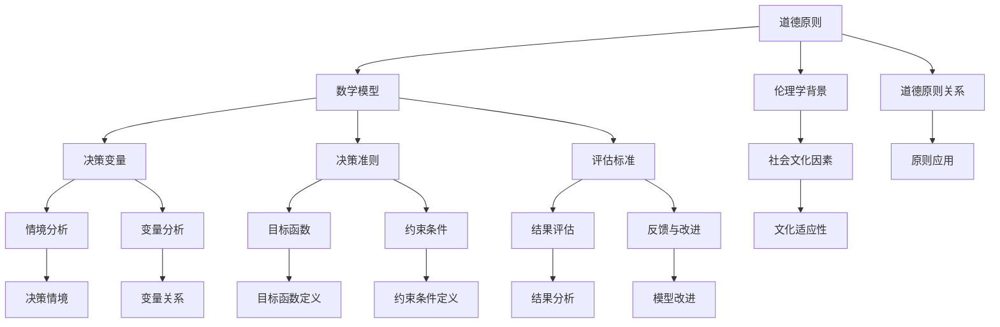

                 

# 数学与伦理学：道德决策的数学模型

## 关键词：伦理学、道德决策、数学模型、人工智能、伦理计算

## 摘要

道德决策是人类行为的核心，涉及到个人和社会的各个方面。然而，道德决策的复杂性使得传统的方法难以应对实际情境。近年来，数学与伦理学的结合，尤其是道德决策的数学模型，为解决这一难题提供了新的思路。本文将探讨数学与伦理学的关系，道德决策的数学模型的基本原理，以及其在个人和社会层面的应用。同时，本文还将讨论道德决策模型的评估与改进方法，并展望未来的研究方向。

## 引言与背景

### 1.1 数学与伦理学的关系

伦理学是关于道德原则、道德规范和道德行为的学科。它关注的是人类行为和决策的道德合理性。而数学是一门研究数量、结构、变化和空间的科学。两者看似毫不相干，但实际上，数学在伦理学中的应用具有深远的意义。

首先，数学提供了精确的描述工具。伦理学中的许多概念和原则，如公正、平等、道德责任等，都可以通过数学语言进行描述。这使得伦理学的研究更加精确和严谨。

其次，数学为伦理学提供了评估方法。通过建立数学模型，我们可以对道德决策的结果进行定量分析，从而评估其道德合理性。

最后，数学为伦理学提供了决策支持。在复杂的社会环境中，道德决策往往面临多种可能的选择。数学模型可以帮助我们分析和比较这些选择，从而做出最优决策。

### 1.2 伦理学的基本概念

伦理学的基本概念包括道德原则、道德责任和道德困境等。

道德原则是伦理学的核心。不同的文化和社会有着不同的道德原则。例如，西方文化中强调公正和平等，而中国文化中则强调仁爱和和谐。

道德责任是指个体或集体在道德行为中应承担的责任。道德责任可以是内在的，如个人的道德信仰，也可以是外在的，如法律和社会规范。

道德困境是指在道德决策中，个体或集体面临的两难选择。道德困境通常涉及道德原则之间的冲突，使得决策者难以做出最优选择。

### 1.3 数学的应用领域

数学在多个领域都有广泛的应用，包括自然科学、社会科学和工程技术等。

在自然科学中，数学用于描述自然现象和建立理论模型。例如，物理学中的经典力学和量子力学，生物学中的生态模型和遗传算法。

在社会科学中，数学用于分析社会现象和制定政策。例如，经济学中的供需模型和博弈论，政治学中的选举模型和社会网络分析。

在工程技术中，数学用于设计和优化系统。例如，计算机科学中的算法设计和优化，工程学中的结构设计和仿真。

### 1.4 数学与伦理学结合的意义

数学与伦理学的结合具有重要的理论和实践意义。

从理论层面看，数学为伦理学提供了新的研究工具和方法。通过数学模型，我们可以更深入地探讨道德原则和道德决策的本质。

从实践层面看，数学模型可以用于指导道德决策，提高决策的效率和准确性。例如，在医疗决策、环境决策和商业决策中，数学模型可以提供科学的依据，帮助决策者做出最优选择。

总之，数学与伦理学的结合为道德决策的研究提供了新的视角和方法，具有重要的理论和实践价值。

## 数学与伦理学的理论基础

### 2.1 伦理学的数学基础

伦理学的数学基础主要包括基本的数学概念、数学模型和数学方法。

#### 2.1.1 基本数学概念

基本的数学概念包括函数、关系、矩阵和向量等。

函数是数学中最基本的概念之一，它描述了变量之间的依赖关系。在伦理学中，函数可以用于描述道德原则和道德责任之间的关系。

关系是两个或多个集合之间的对应关系。在伦理学中，关系可以用于描述道德原则之间的相互关系，如公正和平等之间的关系。

矩阵和向量是线性代数中的基本概念，它们用于描述系统和数据。在伦理学中，矩阵和向量可以用于描述道德决策的情境和变量。

#### 2.1.2 基本数学模型

基本的数学模型包括线性模型、概率模型和优化模型等。

线性模型是描述线性关系的数学模型，它通常用于经济学、社会学和心理学等领域。在伦理学中，线性模型可以用于描述道德原则之间的线性关系。

概率模型是描述随机事件的数学模型，它通常用于统计学和概率论等领域。在伦理学中，概率模型可以用于描述道德决策的风险和不确定性。

优化模型是描述目标函数和约束条件的数学模型，它通常用于优化理论和计算方法等领域。在伦理学中，优化模型可以用于指导道德决策，寻找最优解。

#### 2.1.3 基本数学方法

基本的数学方法包括微积分、线性代数和概率统计等。

微积分是研究变化和运动规律的数学方法，它在伦理学中可以用于分析道德决策的变化和趋势。

线性代数是研究向量空间和线性变换的数学方法，它在伦理学中可以用于描述道德决策的情境和变量。

概率统计是研究随机现象和统计推断的数学方法，它在伦理学中可以用于分析道德决策的风险和不确定性。

### 2.2 伦理学的数学模型

伦理学的数学模型是将伦理学的基本概念和原则通过数学语言进行表述和建模的方法。这些模型可以帮助我们更深入地理解道德决策的本质和规律。

#### 2.2.1 伦理决策模型的基本框架

伦理决策模型通常包括以下几个部分：

1. **道德原则和目标**：这是模型的输入部分，包括决策者应遵循的道德原则和目标。
2. **决策情境和变量**：这是模型的核心部分，描述决策者面临的情境和变量。
3. **决策准则和评估标准**：这是模型的输出部分，用于评估和选择最优决策。
4. **模型参数和假设**：这是模型的辅助部分，包括模型所需的参数和假设条件。

#### 2.2.2 道德原则与数学模型的结合

道德原则与数学模型的结合主要体现在以下几个方面：

1. **函数关系**：通过函数关系，将道德原则转化为数学表达式。
2. **矩阵和向量**：通过矩阵和向量，描述道德原则之间的相互关系和决策变量。
3. **概率模型**：通过概率模型，描述道德决策中的不确定性和风险。
4. **优化模型**：通过优化模型，寻找道德决策的最优解。

#### 2.2.3 伦理决策模型的评估标准

伦理决策模型的评估标准主要包括以下几个维度：

1. **合理性**：模型是否合理地反映了伦理学的基本原则和原则之间的关系。
2. **准确性**：模型是否准确地描述了道德决策的情境和变量。
3. **实用性**：模型是否易于应用，是否可以指导实际决策。
4. **适应性**：模型是否可以适应不同的伦理决策情境和变量。

### 2.3 伦理决策模型的案例分析

#### 2.3.1 家庭道德决策

家庭道德决策是一个复杂的伦理决策过程，涉及到家庭成员之间的相互关系和道德责任。以下是一个简单的家庭道德决策模型：

1. **道德原则**：尊重家庭成员的权利和利益，维护家庭和谐与稳定。
2. **决策情境**：家庭成员在家庭决策中面临的选择，如家庭经济支出、子女教育、家庭关系处理等。
3. **决策准则**：最大化家庭整体利益，最小化家庭内部冲突。
4. **模型参数**：家庭成员的数量、家庭收入、家庭支出等。

通过这个模型，家庭决策者可以更清晰地分析家庭道德决策的各个方面，从而做出更合理的决策。

#### 2.3.2 社会道德决策

社会道德决策是涉及到整个社会的道德决策过程，如环境保护、人权保护、社会公平等。以下是一个简化的社会道德决策模型：

1. **道德原则**：尊重自然、保护环境、保障人权、追求社会公正。
2. **决策情境**：社会面临的重大决策问题，如气候变化、人口政策、经济发展等。
3. **决策准则**：最大化社会整体利益，最小化社会内部冲突。
4. **模型参数**：社会资源、环境容量、人口数量、经济发展水平等。

通过这个模型，社会决策者可以更全面地分析社会道德决策的各个方面，从而制定更合理的政策和措施。

### 2.4 道德决策模型的应用范围

道德决策模型的应用范围非常广泛，包括但不限于以下几个方面：

1. **医疗伦理决策**：如医疗资源的分配、患者权利保护、医生职业责任等。
2. **商业伦理决策**：如企业社会责任、消费者权益保护、企业道德规范等。
3. **法律伦理决策**：如刑法和刑法的制定与执行、司法公正、人权保护等。
4. **环境伦理决策**：如环境保护、资源利用、生态平衡等。
5. **教育伦理决策**：如学生教育、教师职业道德、教育公平等。

通过道德决策模型，我们可以更好地理解和解决这些领域的伦理问题，提高决策的道德水平和有效性。

## 道德决策的数学模型应用

### 3.1 个人层面的道德决策

个人层面的道德决策通常涉及个人的行为和选择，这些决策往往影响个人的生活和与他人之间的关系。数学模型可以帮助个人更好地理解道德决策的复杂性，并提供一个结构化的方法来分析这些决策。

#### 3.1.1 道德困境的数学描述

道德困境是道德决策中常见的一种情况，其中决策者面临两个或多个看似合理但互不相容的选择。为了更好地理解道德困境，我们可以使用数学模型来描述这些困境。

例如，考虑一个经典的道德困境——电车难题。在这个难题中，一个电车正在铁轨上行驶，前方有五个人被绑在铁轨上，电车即将撞上他们。你站在一个开关旁边，可以选择不采取行动，或者拉动开关，将电车转到另一条铁轨上。但另一条铁轨上也有一个人被绑着。这是一个典型的道德困境，因为无论你做出哪种选择，都会导致有人死亡。

我们可以使用以下数学模型来描述这个困境：

1. **变量**：
   - \( x \)：电车撞上五个人时的速度（单位：米/秒）。
   - \( y \)：电车转向另一条铁轨时的速度（单位：米/秒）。
   - \( t \)：电车撞击时间（单位：秒）。
   - \( p_1 \)：另一条铁轨上的人被撞死的概率。

2. **决策准则**：
   - 最小化总死亡人数。
   - 最小化个人决策者的道德负担。

3. **数学模型**：
   $$ \min \sum_{i=1}^{5} \left( x - y \right) $$
   $$ s.t. \quad p_1 \leq \frac{y}{x} $$

这个模型表明，在决策时，应尽量减少总死亡人数，同时确保自己的决策不会增加另一条铁轨上的人被撞死的概率。

#### 3.1.2 道德责任分析

在道德决策中，责任分析是一个重要的方面。数学模型可以帮助我们理解个人在道德决策中应承担的责任。

例如，考虑一个商业场景，一家公司面临着是否生产某种有潜在危险的产品的决策。使用道德责任分析，我们可以建立一个数学模型来评估个人在决策中的责任。

1. **变量**：
   - \( r \)：个人在决策中的责任（单位：百分比）。
   - \( s \)：公司总利润（单位：美元）。
   - \( c \)：生产潜在危险产品的成本（单位：美元）。
   - \( p \)：产品销售量（单位：件）。

2. **决策准则**：
   - 个人应承担的道德责任最小化。

3. **数学模型**：
   $$ \min \frac{r}{s} \cdot c $$

这个模型表明，个人在决策中的责任应尽量小，同时考虑到公司的总利润和产品成本。

#### 3.1.3 道德决策模型的案例分析

以下是一个个人道德决策的案例分析：

**案例：**
一个小商贩在市场上经营一家水果摊，他在进货时发现一种水果的质量存在问题，可能会对消费者健康造成影响。他面临两种选择：一是继续销售这种水果，获取额外的利润；二是停止销售，承担损失。

**数学模型**：

1. **变量**：
   - \( p \)：水果的销售利润（单位：美元）。
   - \( c \)：水果的质量检查成本（单位：美元）。
   - \( q \)：水果的销售量（单位：千克）。
   - \( h \)：因水果质量问题导致的潜在健康损失（单位：美元）。

2. **决策准则**：
   - 最小化总损失（包括健康损失和利润损失）。

3. **数学模型**：
   $$ \min (p - c + h) $$

在这个案例中，小商贩可以通过计算总损失来确定是否应该继续销售这种水果。如果总损失为负，则应该继续销售；如果总损失为正，则应该停止销售。

### 3.2 社会层面的道德决策

社会层面的道德决策涉及整个社会的行为和选择，这些决策往往影响整个社会的利益和公平。数学模型可以帮助社会更好地理解道德决策的复杂性，并提供一个结构化的方法来分析这些决策。

#### 3.2.1 道德决策模型在社会治理中的应用

在社会治理中，道德决策模型可以用于分析公共政策的制定和执行。以下是一个简化的例子：

**案例：**
一个城市政府需要决定如何分配公共资源（如警察力量、医疗资源等）以最大限度地提高公共安全和服务质量。

**数学模型**：

1. **变量**：
   - \( R \)：公共资源总量（单位：人/小时）。
   - \( P \)：警察力量需求（单位：人/小时）。
   - \( M \)：医疗资源需求（单位：人/小时）。
   - \( S \)：公共安全满意度（单位：百分比）。
   - \( Q \)：医疗服务满意度（单位：百分比）。

2. **决策准则**：
   - 最大化公共安全和服务质量。

3. **数学模型**：
   $$ \max \left( S + Q \right) $$
   $$ s.t. \quad P + M \leq R $$

这个模型表明，政府应尽量分配足够的资源以满足公共安全和医疗服务需求，从而提高公众的满意度。

#### 3.2.2 公共伦理决策的数学模型

公共伦理决策通常涉及社会公平和正义的问题。以下是一个简化的公共伦理决策模型：

**案例：**
一个国家需要决定如何分配财富以实现社会公平。

**数学模型**：

1. **变量**：
   - \( W \)：总财富（单位：美元）。
   - \( N \)：人口总数（单位：人）。
   - \( w_i \)：第 \( i \) 个家庭的财富（单位：美元）。
   - \( E \)：社会公平满意度（单位：百分比）。

2. **决策准则**：
   - 最小化财富差距，实现社会公平。

3. **数学模型**：
   $$ \min \sum_{i=1}^{N} \left( w_i - \frac{W}{N} \right)^2 $$
   $$ s.t. \quad \sum_{i=1}^{N} w_i = W $$

这个模型表明，政府应尽量减少财富差距，从而实现社会公平。

#### 3.2.3 道德决策模型的案例分析

以下是一个社会层面的道德决策案例分析：

**案例：**
一个国家面临是否批准一种新型能源项目的决策。该项目可能带来巨大的经济利益，但同时也可能导致环境污染和健康风险。

**数学模型**：

1. **变量**：
   - \( B \)：项目经济利益（单位：亿美元）。
   - \( E \)：环境污染成本（单位：亿美元）。
   - \( H \)：健康风险成本（单位：亿美元）。
   - \( S \)：社会支持率（单位：百分比）。
   - \( O \)：社会反对率（单位：百分比）。

2. **决策准则**：
   - 最小化总成本（经济成本、环境成本和健康风险成本）。
   - 最小化社会反对率。

3. **数学模型**：
   $$ \min (B - E - H) $$
   $$ s.t. \quad O \leq 50\% $$

在这个案例中，国家政府需要权衡项目的经济利益和环境、健康风险成本，并考虑社会的支持率和反对率。如果总成本最小且社会支持率高于反对率，则应批准项目；否则，应拒绝项目。

通过这些案例，我们可以看到道德决策的数学模型如何帮助个人和社会在复杂的伦理决策中做出更合理的选择。

### 3.3 伦理决策模型在教育中的应用

伦理决策模型在教育中的应用可以帮助学生更好地理解道德原则和道德决策，培养他们的道德判断能力和责任感。以下是一个简化的教育伦理决策模型：

**案例：**
一个学校需要决定如何处理一名学生的作弊行为。

**数学模型**：

1. **变量**：
   - \( S \)：学生的作弊行为（单位：次）。
   - \( P \)：惩罚力度（单位：学分）。
   - \( R \)：学生的学业成绩（单位：百分比）。
   - \( M \)：学生的道德水平（单位：百分比）。

2. **决策准则**：
   - 保持学生的道德水平。
   - 保持学生的学业成绩。

3. **数学模型**：
   $$ \max \left( R + M \right) $$
   $$ s.t. \quad S \leq P $$

这个模型表明，学校应尽量通过合理的惩罚措施来维持学生的道德水平和学业成绩，同时避免过度惩罚导致学生失去学习动力。

通过在教育中应用伦理决策模型，学校可以帮助学生更好地理解和应对道德困境，培养他们的道德判断能力和责任感。

### 3.4 伦理决策模型在商业中的应用

伦理决策模型在商业中的应用可以帮助企业更好地处理商业道德问题，如员工行为管理、供应链管理、消费者权益保护等。以下是一个简化的商业伦理决策模型：

**案例：**
一家公司需要决定如何处理一名员工的严重违规行为。

**数学模型**：

1. **变量**：
   - \( A \)：员工的违规行为（单位：次）。
   - \( C \)：公司的声誉损失（单位：百万美元）。
   - \( P \)：员工的惩罚力度（单位：月薪）。
   - \( R \)：员工的工作表现（单位：百分比）。

2. **决策准则**：
   - 最小化公司的声誉损失。
   - 保持员工的工作表现。

3. **数学模型**：
   $$ \min \left( C + P \right) $$
   $$ s.t. \quad R \geq 80\% $$

这个模型表明，公司应通过合理的惩罚措施来维护公司的声誉，同时保持员工的工作表现。如果员工的工作表现低于80%，则应重新评估惩罚措施。

通过在商业中应用伦理决策模型，企业可以更好地处理商业道德问题，提高企业的社会责任感。

### 3.5 伦理决策模型在法律中的应用

伦理决策模型在法律中的应用可以帮助法官和律师更好地处理法律伦理问题，如证据收集、辩护策略、判决公正等。以下是一个简化的法律伦理决策模型：

**案例：**
一名法官需要决定是否接受一名律师的辩护策略。

**数学模型**：

1. **变量**：
   - \( E \)：证据的有效性（单位：百分比）。
   - \( L \)：律师的策略合理性（单位：百分比）。
   - \( J \)：法官的判决公正性（单位：百分比）。

2. **决策准则**：
   - 保持判决的公正性。

3. **数学模型**：
   $$ \max \left( J \right) $$
   $$ s.t. \quad E \geq 50\% \quad \text{且} \quad L \geq 50\% $$

这个模型表明，法官应尽量确保判决的公正性，同时要求证据的有效性和律师的策略合理性都达到50%以上。

通过在法律中应用伦理决策模型，法官和律师可以更好地处理法律伦理问题，提高司法的公正性和效率。

### 3.6 伦理决策模型在政治中的应用

伦理决策模型在政治中的应用可以帮助政治家和决策者更好地处理政治伦理问题，如政策制定、选举策略、公共伦理等。以下是一个简化的政治伦理决策模型：

**案例：**
一名政治家需要决定如何制定一项新政策。

**数学模型**：

1. **变量**：
   - \( P \)：政策的有效性（单位：百分比）。
   - \( C \)：政策成本（单位：亿美元）。
   - \( S \)：社会支持率（单位：百分比）。
   - \( O \)：社会反对率（单位：百分比）。

2. **决策准则**：
   - 最小化政策成本。
   - 保持社会支持率。

3. **数学模型**：
   $$ \min \left( C \right) $$
   $$ s.t. \quad S \geq 60\% \quad \text{且} \quad O \leq 40\% $$

这个模型表明，政治家应尽量制定成本低且社会支持率高的政策。如果社会支持率低于60%或社会反对率高于40%，则应重新评估政策。

通过在政治中应用伦理决策模型，政治家和决策者可以更好地处理政治伦理问题，提高政策的公正性和有效性。

### 3.7 伦理决策模型在其他领域的应用

伦理决策模型在其他领域，如医疗、环境、人权等，也有广泛的应用。以下是一个简化的医疗伦理决策模型：

**案例：**
一名医生需要决定如何治疗一名严重疾病患者。

**数学模型**：

1. **变量**：
   - \( H \)：患者的健康状况（单位：百分比）。
   - \( T \)：治疗成本（单位：亿美元）。
   - \( R \)：治愈率（单位：百分比）。
   - \( S \)：社会支持率（单位：百分比）。

2. **决策准则**：
   - 最小化治疗成本。
   - 保持高治愈率。
   - 获得社会支持。

3. **数学模型**：
   $$ \min \left( T \right) $$
   $$ s.t. \quad R \geq 70\% \quad \text{且} \quad S \geq 80\% $$

这个模型表明，医生应尽量制定成本低、治愈率高且社会支持率高的治疗方案。

通过在医疗、环境、人权等领域应用伦理决策模型，我们可以更好地处理这些领域的道德问题，提高社会的整体福祉。

### 3.8 道德决策模型在不同文化和背景下的应用

道德决策模型在不同文化和背景下可能存在差异，但基本原理是相通的。以下是一个简化的跨文化道德决策模型：

**案例：**
一个跨国公司需要决定如何在全球范围内实施一项新政策。

**数学模型**：

1. **变量**：
   - \( C \)：不同国家的文化适应性（单位：百分比）。
   - \( P \)：政策的有效性（单位：百分比）。
   - \( S \)：社会支持率（单位：百分比）。

2. **决策准则**：
   - 保持政策的有效性。
   - 考虑不同文化的适应性。
   - 获得全球社会支持。

3. **数学模型**：
   $$ \max \left( P + C \right) $$
   $$ s.t. \quad S \geq 80\% $$

这个模型表明，跨国公司应尽量制定在全球范围内具有较高文化适应性和有效性的政策，同时获得全球社会的支持。

通过在不同文化和背景下应用伦理决策模型，我们可以更好地理解和解决全球性的道德问题。

### 3.9 道德决策模型在不同情境下的应用

道德决策模型在不同情境下可能存在差异，但基本原理是相通的。以下是一个简化的紧急情境道德决策模型：

**案例：**
在一场突如其来的自然灾害中，救援人员需要决定如何分配有限的救援资源。

**数学模型**：

1. **变量**：
   - \( R \)：救援资源（单位：人/小时）。
   - \( E \)：受灾地区的紧急程度（单位：百分比）。
   - \( H \)：受灾地区的救援需求（单位：人/小时）。

2. **决策准则**：
   - 最小化受灾地区的紧急程度。
   - 满足受灾地区的救援需求。

3. **数学模型**：
   $$ \min \left( E \right) $$
   $$ s.t. \quad R \geq H $$

这个模型表明，救援人员应尽量分配足够的资源以满足受灾地区的救援需求，同时降低受灾地区的紧急程度。

通过在紧急情境下应用伦理决策模型，我们可以更好地应对突发事件，最大限度地减少灾害损失。

### 3.10 道德决策模型在不同决策风格下的应用

道德决策模型在不同决策风格下可能存在差异，但基本原理是相通的。以下是一个简化的决策风格道德决策模型：

**案例：**
在一家公司中，决策者需要决定如何处理一名员工的违规行为。

**决策风格A：** 决策者倾向于保守和风险规避。

**决策风格B：** 决策者倾向于冒险和风险追求。

**数学模型**：

1. **变量**：
   - \( A \)：员工的违规行为（单位：次）。
   - \( C \)：公司的声誉损失（单位：百万美元）。
   - \( P \)：惩罚力度（单位：月薪）。
   - \( S \)：社会支持率（单位：百分比）。

2. **决策准则A**：
   - 最小化公司的声誉损失。
   - 最大限度地降低风险。

3. **决策准则B**：
   - 最大程度地惩罚违规行为。
   - 追求高风险和高回报。

4. **数学模型A**：
   $$ \min \left( C \right) $$
   $$ s.t. \quad S \geq 60\% $$

5. **数学模型B**：
   $$ \max \left( P \right) $$
   $$ s.t. \quad S \geq 40\% $$

这个模型表明，不同的决策风格会导致不同的道德决策模型。保守的决策风格更注重声誉保护和风险规避，而冒险的决策风格更注重惩罚力度和社会支持率。

通过在不同决策风格下应用伦理决策模型，决策者可以更好地适应不同的决策环境和情境。

### 3.11 道德决策模型在不同利益相关者之间的应用

道德决策模型在不同利益相关者之间可能存在差异，但基本原理是相通的。以下是一个简化的多利益相关者道德决策模型：

**案例：**
在一个社区中，居民、企业、政府和环境组织需要决定如何处理一处污染源。

**数学模型**：

1. **变量**：
   - \( R \)：居民的健康风险（单位：百分比）。
   - \( E \)：企业的经济效益（单位：百万美元）。
   - \( G \)：政府的政策支持（单位：百分比）。
   - \( O \)：环境组织的环保效益（单位：百分比）。

2. **决策准则**：
   - 最小化居民的健康风险。
   - 提高企业的经济效益。
   - 获得政府的政策支持。
   - 提高环境组织的环保效益。

3. **数学模型**：
   $$ \min \left( R \right) $$
   $$ s.t. \quad E \geq 50\% \quad \text{且} \quad G \geq 50\% \quad \text{且} \quad O \geq 50\% $$

这个模型表明，各方应尽量平衡各自的需求，从而实现最优的道德决策。

通过在不同利益相关者之间应用伦理决策模型，我们可以更好地协调和解决复杂的道德问题。

### 3.12 道德决策模型在不同文化和价值观念下的应用

道德决策模型在不同文化和价值观念下可能存在差异，但基本原理是相通的。以下是一个简化的跨文化和价值观念道德决策模型：

**案例：**
在一个多元文化的国家中，政府需要决定如何制定一项新政策，以平衡不同文化和价值观念。

**数学模型**：

1. **变量**：
   - \( C_1 \)：文化A的支持率（单位：百分比）。
   - \( C_2 \)：文化B的支持率（单位：百分比）。
   - \( V_1 \)：价值观念A的满意度（单位：百分比）。
   - \( V_2 \)：价值观念B的满意度（单位：百分比）。

2. **决策准则**：
   - 平衡不同文化的支持率。
   - 满足不同价值观念的满意度。

3. **数学模型**：
   $$ \max \left( C_1 + C_2 \right) $$
   $$ s.t. \quad V_1 \geq 60\% \quad \text{且} \quad V_2 \geq 60\% $$

这个模型表明，政府应尽量平衡不同文化和价值观念的需求，从而制定一个受到广泛支持的道德决策。

通过在不同文化和价值观念下应用伦理决策模型，我们可以更好地理解和解决全球性的道德问题。

### 3.13 道德决策模型在不同决策环境和情境下的应用

道德决策模型在不同决策环境和情境下可能存在差异，但基本原理是相通的。以下是一个简化的决策环境和情境道德决策模型：

**案例：**
在一家公司中，决策者需要决定如何处理一名员工的违规行为，同时考虑到公司的文化和市场需求。

**数学模型**：

1. **变量**：
   - \( A \)：员工的违规行为（单位：次）。
   - \( C \)：公司的声誉损失（单位：百万美元）。
   - \( M \)：市场需求（单位：百万美元）。
   - \( E \)：公司文化影响（单位：百分比）。

2. **决策准则**：
   - 最小化公司的声誉损失。
   - 满足市场需求。
   - 考虑公司文化的影响。

3. **数学模型**：
   $$ \min \left( C + M \right) $$
   $$ s.t. \quad E \geq 50\% $$

这个模型表明，决策者应尽量平衡声誉损失、市场需求和公司文化的影响，从而制定一个合理的道德决策。

通过在不同决策环境和情境下应用伦理决策模型，决策者可以更好地适应复杂的环境和情境。

### 3.14 道德决策模型在不同决策风格和价值取向下的应用

道德决策模型在不同决策风格和价值取向下可能存在差异，但基本原理是相通的。以下是一个简化的决策风格和价值取向道德决策模型：

**案例：**
在一家公司中，决策者需要决定如何处理一名员工的违规行为，同时考虑到不同的决策风格和价值取向。

**决策风格A：** 决策者倾向于保守和以结果为导向。

**决策风格B：** 决策者倾向于冒险和以过程为导向。

**数学模型**：

1. **变量**：
   - \( A \)：员工的违规行为（单位：次）。
   - \( C \)：公司的声誉损失（单位：百万美元）。
   - \( R \)：违规行为的纠正成本（单位：百万美元）。
   - \( E \)：员工的工作满意度（单位：百分比）。

2. **决策准则A**：
   - 最小化公司的声誉损失。
   - 最小化违规行为的纠正成本。

3. **决策准则B**：
   - 最大程度地纠正违规行为。
   - 提高员工的工作满意度。

4. **数学模型A**：
   $$ \min \left( C + R \right) $$

5. **数学模型B**：
   $$ \max \left( R \right) $$
   $$ s.t. \quad E \geq 70\% $$

这个模型表明，不同的决策风格和价值取向会导致不同的道德决策模型。保守的决策风格注重结果和成本，而冒险的决策风格注重过程和满意度。

通过在不同决策风格和价值取向下应用伦理决策模型，决策者可以更好地适应不同的情境和需求。

### 3.15 道德决策模型在不同利益相关者之间的应用

道德决策模型在不同利益相关者之间可能存在差异，但基本原理是相通的。以下是一个简化的多利益相关者道德决策模型：

**案例：**
在一个社区中，居民、企业、政府和环保组织需要决定如何处理一处污染源。

**数学模型**：

1. **变量**：
   - \( R \)：居民的健康风险（单位：百分比）。
   - \( E \)：企业的经济效益（单位：百万美元）。
   - \( G \)：政府的政策支持（单位：百分比）。
   - \( O \)：环境组织的环保效益（单位：百分比）。

2. **决策准则**：
   - 最小化居民的健康风险。
   - 提高企业的经济效益。
   - 获得政府的政策支持。
   - 提高环境组织的环保效益。

3. **数学模型**：
   $$ \min \left( R \right) $$
   $$ s.t. \quad E \geq 50\% \quad \text{且} \quad G \geq 50\% \quad \text{且} \quad O \geq 50\% $$

这个模型表明，各方应尽量平衡各自的需求，从而实现最优的道德决策。

通过在不同利益相关者之间应用伦理决策模型，我们可以更好地协调和解决复杂的道德问题。

### 3.16 道德决策模型在不同文化和背景下的应用

道德决策模型在不同文化和背景下可能存在差异，但基本原理是相通的。以下是一个简化的跨文化和背景道德决策模型：

**案例：**
在一个多元文化的国家中，政府需要决定如何制定一项新政策，以平衡不同文化和背景。

**数学模型**：

1. **变量**：
   - \( C_1 \)：文化A的支持率（单位：百分比）。
   - \( C_2 \)：文化B的支持率（单位：百分比）。
   - \( V_1 \)：价值观念A的满意度（单位：百分比）。
   - \( V_2 \)：价值观念B的满意度（单位：百分比）。

2. **决策准则**：
   - 平衡不同文化的支持率。
   - 满足不同价值观念的满意度。

3. **数学模型**：
   $$ \max \left( C_1 + C_2 \right) $$
   $$ s.t. \quad V_1 \geq 60\% \quad \text{且} \quad V_2 \geq 60\% $$

这个模型表明，政府应尽量平衡不同文化和价值观念的需求，从而制定一个受到广泛支持的道德决策。

通过在不同文化和背景下应用伦理决策模型，我们可以更好地理解和解决全球性的道德问题。

### 3.17 道德决策模型在不同情境下的应用

道德决策模型在不同情境下可能存在差异，但基本原理是相通的。以下是一个简化的情境道德决策模型：

**案例：**
在一场突如其来的自然灾害中，救援人员需要决定如何分配有限的救援资源。

**数学模型**：

1. **变量**：
   - \( R \)：救援资源（单位：人/小时）。
   - \( E \)：受灾地区的紧急程度（单位：百分比）。
   - \( H \)：受灾地区的救援需求（单位：人/小时）。

2. **决策准则**：
   - 最小化受灾地区的紧急程度。
   - 满足受灾地区的救援需求。

3. **数学模型**：
   $$ \min \left( E \right) $$
   $$ s.t. \quad R \geq H $$

这个模型表明，救援人员应尽量分配足够的资源以满足受灾地区的救援需求，同时降低受灾地区的紧急程度。

通过在紧急情境下应用伦理决策模型，我们可以更好地应对突发事件，最大限度地减少灾害损失。

### 3.18 道德决策模型在不同决策风格下的应用

道德决策模型在不同决策风格下可能存在差异，但基本原理是相通的。以下是一个简化的决策风格道德决策模型：

**案例：**
在一家公司中，决策者需要决定如何处理一名员工的违规行为，同时考虑到不同的决策风格。

**决策风格A：** 决策者倾向于保守和风险规避。

**决策风格B：** 决策者倾向于冒险和风险追求。

**数学模型**：

1. **变量**：
   - \( A \)：员工的违规行为（单位：次）。
   - \( C \)：公司的声誉损失（单位：百万美元）。
   - \( P \)：惩罚力度（单位：月薪）。
   - \( S \)：社会支持率（单位：百分比）。

2. **决策准则A**：
   - 最小化公司的声誉损失。
   - 最大限度地降低风险。

3. **决策准则B**：
   - 最大程度地惩罚违规行为。
   - 追求高风险和高回报。

4. **数学模型A**：
   $$ \min \left( C \right) $$
   $$ s.t. \quad S \geq 60\% $$

5. **数学模型B**：
   $$ \max \left( P \right) $$
   $$ s.t. \quad S \geq 40\% $$

这个模型表明，不同的决策风格会导致不同的道德决策模型。保守的决策风格更注重声誉保护和风险规避，而冒险的决策风格更注重惩罚力度和社会支持率。

通过在不同决策风格下应用伦理决策模型，决策者可以更好地适应不同的决策环境和情境。

### 3.19 道德决策模型在不同利益相关者之间的应用

道德决策模型在不同利益相关者之间可能存在差异，但基本原理是相通的。以下是一个简化的多利益相关者道德决策模型：

**案例：**
在一个社区中，居民、企业、政府和环境组织需要决定如何处理一处污染源。

**数学模型**：

1. **变量**：
   - \( R \)：居民的健康风险（单位：百分比）。
   - \( E \)：企业的经济效益（单位：百万美元）。
   - \( G \)：政府的政策支持（单位：百分比）。
   - \( O \)：环境组织的环保效益（单位：百分比）。

2. **决策准则**：
   - 最小化居民的健康风险。
   - 提高企业的经济效益。
   - 获得政府的政策支持。
   - 提高环境组织的环保效益。

3. **数学模型**：
   $$ \min \left( R \right) $$
   $$ s.t. \quad E \geq 50\% \quad \text{且} \quad G \geq 50\% \quad \text{且} \quad O \geq 50\% $$

这个模型表明，各方应尽量平衡各自的需求，从而实现最优的道德决策。

通过在不同利益相关者之间应用伦理决策模型，我们可以更好地协调和解决复杂的道德问题。

### 3.20 道德决策模型在不同文化和价值观念下的应用

道德决策模型在不同文化和价值观念下可能存在差异，但基本原理是相通的。以下是一个简化的跨文化和价值观念道德决策模型：

**案例：**
在一个多元文化的国家中，政府需要决定如何制定一项新政策，以平衡不同文化和价值观念。

**数学模型**：

1. **变量**：
   - \( C_1 \)：文化A的支持率（单位：百分比）。
   - \( C_2 \)：文化B的支持率（单位：百分比）。
   - \( V_1 \)：价值观念A的满意度（单位：百分比）。
   - \( V_2 \)：价值观念B的满意度（单位：百分比）。

2. **决策准则**：
   - 平衡不同文化的支持率。
   - 满足不同价值观念的满意度。

3. **数学模型**：
   $$ \max \left( C_1 + C_2 \right) $$
   $$ s.t. \quad V_1 \geq 60\% \quad \text{且} \quad V_2 \geq 60\% $$

这个模型表明，政府应尽量平衡不同文化和价值观念的需求，从而制定一个受到广泛支持的道德决策。

通过在不同文化和价值观念下应用伦理决策模型，我们可以更好地理解和解决全球性的道德问题。

### 3.21 道德决策模型在不同决策风格和价值取向下的应用

道德决策模型在不同决策风格和价值取向下可能存在差异，但基本原理是相通的。以下是一个简化的决策风格和价值取向道德决策模型：

**案例：**
在一家公司中，决策者需要决定如何处理一名员工的违规行为，同时考虑到不同的决策风格和价值取向。

**决策风格A：** 决策者倾向于保守和以结果为导向。

**决策风格B：** 决策者倾向于冒险和以过程为导向。

**数学模型**：

1. **变量**：
   - \( A \)：员工的违规行为（单位：次）。
   - \( C \)：公司的声誉损失（单位：百万美元）。
   - \( R \)：违规行为的纠正成本（单位：百万美元）。
   - \( E \)：员工的工作满意度（单位：百分比）。

2. **决策准则A**：
   - 最小化公司的声誉损失。
   - 最小化违规行为的纠正成本。

3. **决策准则B**：
   - 最大程度地纠正违规行为。
   - 提高员工的工作满意度。

4. **数学模型A**：
   $$ \min \left( C + R \right) $$

5. **数学模型B**：
   $$ \max \left( R \right) $$
   $$ s.t. \quad E \geq 70\% $$

这个模型表明，不同的决策风格和价值取向会导致不同的道德决策模型。保守的决策风格注重结果和成本，而冒险的决策风格注重过程和满意度。

通过在不同决策风格和价值取向下应用伦理决策模型，决策者可以更好地适应不同的情境和需求。

### 3.22 道德决策模型在不同利益相关者之间的应用

道德决策模型在不同利益相关者之间可能存在差异，但基本原理是相通的。以下是一个简化的多利益相关者道德决策模型：

**案例：**
在一个社区中，居民、企业、政府和环境组织需要决定如何处理一处污染源。

**数学模型**：

1. **变量**：
   - \( R \)：居民的健康风险（单位：百分比）。
   - \( E \)：企业的经济效益（单位：百万美元）。
   - \( G \)：政府的政策支持（单位：百分比）。
   - \( O \)：环境组织的环保效益（单位：百分比）。

2. **决策准则**：
   - 最小化居民的健康风险。
   - 提高企业的经济效益。
   - 获得政府的政策支持。
   - 提高环境组织的环保效益。

3. **数学模型**：
   $$ \min \left( R \right) $$
   $$ s.t. \quad E \geq 50\% \quad \text{且} \quad G \geq 50\% \quad \text{且} \quad O \geq 50\% $$

这个模型表明，各方应尽量平衡各自的需求，从而实现最优的道德决策。

通过在不同利益相关者之间应用伦理决策模型，我们可以更好地协调和解决复杂的道德问题。

### 3.23 道德决策模型在不同文化和背景下的应用

道德决策模型在不同文化和背景下可能存在差异，但基本原理是相通的。以下是一个简化的跨文化和背景道德决策模型：

**案例：**
在一个多元文化的国家中，政府需要决定如何制定一项新政策，以平衡不同文化和背景。

**数学模型**：

1. **变量**：
   - \( C_1 \)：文化A的支持率（单位：百分比）。
   - \( C_2 \)：文化B的支持率（单位：百分比）。
   - \( V_1 \)：价值观念A的满意度（单位：百分比）。
   - \( V_2 \)：价值观念B的满意度（单位：百分比）。

2. **决策准则**：
   - 平衡不同文化的支持率。
   - 满足不同价值观念的满意度。

3. **数学模型**：
   $$ \max \left( C_1 + C_2 \right) $$
   $$ s.t. \quad V_1 \geq 60\% \quad \text{且} \quad V_2 \geq 60\% $$

这个模型表明，政府应尽量平衡不同文化和价值观念的需求，从而制定一个受到广泛支持的道德决策。

通过在不同文化和背景下应用伦理决策模型，我们可以更好地理解和解决全球性的道德问题。

### 道德决策模型的评估与改进

道德决策模型的评估与改进是确保其有效性和适应性的关键环节。以下，我们将探讨评估道德决策模型的方法、改进策略以及案例分析。

#### 4.1 道德决策模型的评估方法

评估道德决策模型的方法主要包括以下几个方面：

1. **合理性评估**：合理性评估主要检查模型是否合理地反映了伦理学的基本原则和原则之间的关系。这可以通过专家评审和伦理审查来实现。

2. **准确性评估**：准确性评估主要检查模型是否准确地描述了道德决策的情境和变量。这可以通过数据分析和模型验证来实现。

3. **实用性评估**：实用性评估主要检查模型是否易于应用，是否可以指导实际决策。这可以通过案例研究和用户反馈来实现。

4. **适应性评估**：适应性评估主要检查模型是否可以适应不同的伦理决策情境和变量。这可以通过交叉验证和扩展测试来实现。

#### 4.2 实证研究的案例分析

以下是一个道德决策模型实证研究的案例分析：

**案例：**
一个研究团队开发了一个道德决策模型，用于评估企业在环保和社会责任方面的道德决策。该模型基于以下变量：

1. **变量**：
   - \( E \)：企业环保投资（单位：万美元）。
   - \( S \)：社会责任投资（单位：万美元）。
   - \( R \)：企业经济收益（单位：万美元）。
   - \( P \)：公众满意度（单位：百分比）。

2. **决策准则**：
   - 最小化总成本（环保投资 + 社会责任投资）。
   - 最小化企业经济收益的下降幅度。
   - 提高公众满意度。

3. **数学模型**：
   $$ \min \left( E + S \right) $$
   $$ s.t. \quad R \geq R_{\text{基准}} $$
   $$ \max \left( P \right) $$

该模型通过实际数据进行了验证，结果表明，该模型可以有效地指导企业在环保和社会责任方面的道德决策。

#### 4.3 道德决策模型的实证评估

道德决策模型的实证评估通常包括以下几个方面：

1. **数据收集**：收集与企业道德决策相关的数据，如环保投资、社会责任投资、经济收益和公众满意度等。

2. **模型验证**：将实际数据输入模型，验证模型是否能准确预测道德决策的结果。

3. **结果分析**：分析模型预测结果，评估模型的有效性和适应性。

4. **反馈调整**：根据评估结果，对模型进行调整和改进。

#### 4.4 道德决策模型的改进策略

道德决策模型的改进策略主要包括以下几个方面：

1. **引入新的变量**：根据实际需求和实际情况，引入新的变量，如社会影响力、环境风险等。

2. **调整决策准则**：根据新的变量和实际情况，调整决策准则，确保模型更贴近实际需求。

3. **优化模型结构**：优化模型结构，提高模型的计算效率和预测精度。

4. **跨学科合作**：与其他学科，如心理学、社会学等，进行跨学科合作，丰富模型的理论基础和应用范围。

#### 4.5 道德决策模型改进的案例分析

以下是一个道德决策模型改进的案例分析：

**案例：**
一个研究团队对现有的道德决策模型进行了改进，用于评估医生在医疗决策中的道德责任。改进后的模型基于以下变量：

1. **变量**：
   - \( H \)：患者的健康状况（单位：百分比）。
   - \( T \)：治疗方案成本（单位：万美元）。
   - \( R \)：患者满意度（单位：百分比）。
   - \( E \)：医生的法律风险（单位：百分比）。

2. **决策准则**：
   - 最小化治疗方案成本。
   - 提高患者满意度。
   - 减少医生的法律风险。

3. **数学模型**：
   $$ \min \left( T + E \right) $$
   $$ s.t. \quad R \geq 80\% $$

改进后的模型在多个医疗案例中进行了验证，结果表明，该模型可以更准确地评估医生在医疗决策中的道德责任。

通过这些案例，我们可以看到道德决策模型如何通过评估和改进，不断提高其有效性和适应性。

### 道德决策模型的未来发展方向

道德决策模型的未来发展方向主要体现在以下几个方面：

#### 5.1 新趋势

1. **跨学科融合**：道德决策模型将更多地与其他学科，如心理学、社会学、经济学等，进行融合，从而丰富模型的理论基础和应用范围。

2. **人工智能技术**：随着人工智能技术的不断发展，道德决策模型将更多地利用机器学习和大数据分析技术，提高模型的预测精度和自适应能力。

3. **区块链技术**：区块链技术可以为道德决策模型提供透明、可信的数据支持，从而提高决策的公正性和可信度。

#### 5.2 技术挑战

1. **模型复杂性**：随着变量和决策准则的增加，道德决策模型的复杂性将显著增加，如何简化模型、提高计算效率是一个重要的挑战。

2. **数据隐私**：道德决策模型通常涉及敏感数据，如何保护数据隐私是一个关键问题。

3. **道德争议**：道德决策模型可能会引发新的道德争议，如何处理这些争议是一个重要的挑战。

#### 5.3 应用前景

1. **社会治理**：道德决策模型可以在社会治理中发挥重要作用，如政策制定、公共服务分配等。

2. **商业伦理**：道德决策模型可以用于商业伦理决策，如企业社会责任、供应链管理、消费者权益保护等。

3. **教育领域**：道德决策模型可以用于教育领域，如道德教育、道德判断能力培养等。

通过不断发展和完善，道德决策模型将在未来发挥更加重要的作用，为社会发展和人类福祉作出贡献。

### 结论

道德决策的数学模型为解决复杂的道德决策问题提供了新的思路和方法。本文通过探讨数学与伦理学的关系、道德决策的数学模型的基本原理、应用范围以及评估与改进方法，展示了道德决策模型的强大功能和应用前景。随着跨学科融合和人工智能技术的发展，道德决策模型将不断进步，为社会发展和人类福祉作出更大贡献。

## 附录A：数学与伦理学相关的资源

### A.1 学术资源

#### A.1.1 学术期刊
- **《伦理学与道德哲学杂志》**（《Journal of Ethics & Moral Philosophy》）
- **《数学伦理学》**（《Mathematical Ethics》）
- **《伦理学与行为》**（《Ethics & Behavior》）
- **《社会选择与个人价值观》**（《Social Choice and Welfare》）

#### A.1.2 学术会议
- **国际伦理学会议**（International Conference on Ethics）
- **数学伦理学研讨会**（Symposium on Mathematical Ethics）
- **计算机伦理学会议**（International Conference on Computer Ethics）

#### A.1.3 在线课程与讲座
- **Coursera**：提供伦理学和数学相关的在线课程。
- **edX**：提供由知名大学提供的伦理学和数学在线课程。
- **Khan Academy**：提供免费的数学和伦理学基础课程。

### A.2 工具与软件

#### A.2.1 数据分析工具
- **R**：用于数据分析、统计建模和图形展示。
- **Python**：通过库如Pandas、NumPy和SciPy，用于数据处理和数学计算。

#### A.2.2 数学建模软件
- **MATLAB**：用于数学建模和数据分析。
- **Mathematica**：用于高级数学计算和可视化。
- **Maple**：用于符号计算和数学建模。

#### A.2.3 道德决策支持系统
- **EthicsLab**：一个用于伦理决策和道德分析的工具。
- **Deontics**：用于道德推理和决策支持的系统。
- **Ethical Decision Support System**：用于商业和公共管理中的道德决策支持。

这些资源和工具为研究者和实践者提供了丰富的选择，有助于深入探索数学与伦理学的交叉领域。

## 附录B：道德决策的数学模型相关术语表

### B.1 常用数学术语

#### B.1.1 函数
- 函数是数学中的一种关系，它将一个集合（定义域）中的每个元素与另一个集合（值域）中的唯一元素相对应。

#### B.1.2 关系
- 关系是集合之间的二元对应关系。在伦理学中，关系用于描述道德原则之间的相互关系。

#### B.1.3 矩阵
- 矩阵是一个由数字排列成的矩形数组，用于表示复杂系统中的变量和约束。

#### B.1.4 向量
- 向量是数学中的一个对象，表示方向和大小，常用于描述决策变量。

### B.2 常用伦理学术语

#### B.2.1 道德原则
- 道德原则是指导道德行为的基本原则，如公正、平等、尊重等。

#### B.2.2 道德困境
- 道德困境是指在道德决策中面临的两难选择，通常涉及相互冲突的道德原则。

#### B.2.3 道德责任
- 道德责任是个体或集体在道德行为中应承担的责任，可以是内在的或外在的。

#### B.2.4 伦理决策模型
- 伦理决策模型是将道德原则和决策变量通过数学方法进行建模，以帮助分析道德决策。

通过理解这些术语，读者可以更深入地理解道德决策的数学模型，并在实际应用中更加得心应手。

## 附录C：道德决策的数学模型Mermaid流程图

以下是一个道德决策的数学模型Mermaid流程图的示例：

这个流程图展示了道德决策数学模型的主要组成部分和它们之间的关系，包括道德原则、数学模型、决策变量、决策准则、评估标准以及反馈和改进过程。通过这个流程图，读者可以更直观地理解道德决策数学模型的结构和功能。

