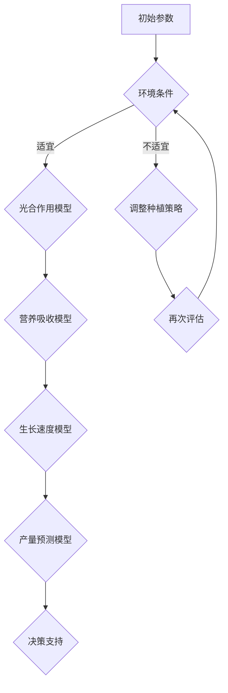

                 

### 文章标题

“数学与农业科学：作物产量的数学预测”

这个标题简洁明了地传达了文章的核心内容，即探讨数学在农业科学中的应用，特别是如何使用数学方法预测作物产量。标题中的关键词包括“数学”、“农业科学”、“作物产量预测”，这些词汇对专业人士和爱好者都具有吸引力，能够激起读者的阅读兴趣。

### 文章关键词

1. 数学模型
2. 农业科学
3. 作物产量预测
4. 数据分析
5. 时间序列分析
6. 机器学习
7. 智能农业

### 文章摘要

本文将探讨数学在农业科学中的应用，特别是如何使用数学方法进行作物产量的预测。文章首先介绍了数学在农业科学中的基础概念及其应用，然后详细分析了农业生产数据的收集与分析方法。接着，文章重点讨论了作物产量预测的数学模型，包括线性回归、非线性回归和时间序列模型等。此外，文章还介绍了机器学习模型在作物产量预测中的应用。通过实际案例的分析，读者将了解这些数学方法在农业生产中的实际应用。最后，文章讨论了农业大数据与智能农业的未来发展趋势，为读者展示了数学在农业领域的重要性和广阔前景。

### 目录

本文将分为以下几个部分：

1. **数学与农业科学的联系**
    - **第1章**：数学的基本概念及其在农业中的应用
    - **第2章**：农业生产数据的收集与分析
    - **第3章**：数学模型在作物生长研究中的应用

2. **作物产量预测的数学模型**
    - **第4章**：作物产量预测的基本原理
    - **第5章**：线性回归模型
    - **第6章**：非线性回归模型
    - **第7章**：时间序列模型
    - **第8章**：机器学习模型

3. **实际应用案例分析**
    - **第9章**：作物产量预测的实际应用案例
    - **第10章**：农业大数据与智能农业

4. **附录**
    - **附录A**：常用数学模型与算法介绍
    - **附录B**：数学软件与工具使用指南
    - **附录C**：参考文献

接下来，我们将逐步深入探讨数学与农业科学的联系，首先从数学的基本概念及其在农业中的应用开始。

### 数学与农业科学的联系

数学作为一门科学，其抽象和逻辑推理的特性使其在许多领域都有广泛应用，包括农业科学。数学在农业科学中的应用不仅提高了农业生产的效率，还帮助解决了许多复杂的问题。以下是数学在农业科学中的几个核心概念和实际应用。

#### 数学的基本概念

1. **变量和函数**：在农业科学中，变量和函数的概念用于描述不同环境因素（如温度、湿度、光照）与作物生长之间的关系。例如，通过函数关系可以预测作物在特定条件下的生长速率。

2. **概率和统计学**：概率论和统计学是农业数据分析和预测的重要工具。在农业生产中，经常会遇到不确定性因素，如天气变化和病虫害。通过概率和统计学方法，可以评估这些不确定性的影响，并提供决策支持。

3. **微积分**：微积分用于描述作物生长过程中的动态变化，如植物的营养吸收、光合作用速率等。通过微积分，可以更精确地模拟作物生长过程，并优化农业生产参数。

#### 农业科学中的常见数学模型

1. **生态模型**：生态模型用于模拟生物种群的增长和动态变化。在农业科学中，生态模型可以用来预测作物种群的增长趋势，从而帮助农民制定种植策略。

2. **光合作用模型**：光合作用模型描述了植物通过光合作用将太阳能转化为化学能的过程。这些模型可以帮助农民了解作物在不同光照条件下的生长情况，从而调整种植策略。

3. **土壤水分模型**：土壤水分模型用于模拟土壤中水分的分布和运动。这些模型对于灌溉管理至关重要，可以帮助农民确定最佳的灌溉时间和灌溉量。

#### 数学在农业科学中的应用

1. **数据分析和预测**：数学工具如回归分析、时间序列分析等在农业生产数据分析和预测中发挥着重要作用。通过这些方法，可以预测作物的产量、生长状况等，从而帮助农民做出更科学的决策。

2. **作物育种**：数学模型在作物育种中也有广泛应用。通过遗传算法等优化方法，可以筛选出具有优良性状的作物品种，提高农业生产的效益。

3. **智能农业**：随着物联网和大数据技术的发展，数学模型在智能农业中的应用越来越广泛。通过数据采集和分析，可以实现对作物的实时监测和管理，提高农业生产效率。

### 例子：作物生长模型的Mermaid流程图

以下是一个简单的Mermaid流程图，描述了作物生长模型的基本框架：



在这个流程图中，初始参数包括土壤、气候等环境条件，通过光合作用模型、营养吸收模型和生长速度模型，最终预测作物产量并给出决策支持。

### 总结

数学与农业科学的结合，不仅丰富了农业科学的研究方法，也为农业生产提供了强有力的工具。通过数学模型，可以更准确地预测作物产量，优化农业生产过程，提高农业效益。接下来，我们将进一步探讨农业生产数据的收集与分析方法。

## 第1章：数学的基本概念及其在农业中的应用

### 1.1 数学的基本概念

数学是一门研究数量、结构、变化和空间等概念的抽象科学。在数学中，核心的基本概念包括：

1. **变量和函数**：变量是表示可以取不同数值的量，而函数则是描述变量之间关系的数学对象。在农业科学中，变量可以表示土壤湿度、温度、作物生长速率等，而函数则可以描述这些变量之间的相互关系。

2. **概率和统计学**：概率论用于描述不确定事件的可能性，而统计学则用于分析和解释数据。在农业科学中，概率论和统计学用于分析气候数据、作物生长数据等，以预测作物的产量和生长趋势。

3. **微积分**：微积分研究的是函数的极限、导数和积分等概念，这些概念在描述作物生长过程中的动态变化和趋势分析中非常重要。

4. **线性代数**：线性代数研究的是向量、矩阵和线性变换等概念，这些在农业数据的处理、分析和建模中有着广泛的应用。

### 1.2 数学在农业中的应用

数学在农业科学中的应用非常广泛，以下是几个关键的例子：

1. **作物生长模型**：作物生长模型通过数学方法描述作物在不同生长阶段的变化过程。这些模型通常基于生物物理学和生态学原理，利用微积分和微分方程来模拟作物的生长过程。通过这些模型，可以预测作物在不同环境条件下的生长速度和最终产量。

2. **土壤水分管理**：土壤水分模型通过数学方法描述土壤水分的动态变化。这些模型可以帮助农民确定最佳的灌溉策略，以最大化作物产量并减少水资源浪费。

3. **气候预测**：气候预测模型通过数学方法分析气候数据，预测未来的气候变化。这些模型对于农业生产具有重要意义，因为作物生长对气候条件非常敏感。

4. **遗传育种**：遗传育种是利用数学模型来分析基因型与表现型之间的关系，以选择具有优良性状的作物品种。遗传算法等优化方法在遗传育种中有着重要的应用。

### 1.3 数学模型的基本原理

数学模型的基本原理在于将现实世界的复杂问题转化为数学形式，以便进行定量分析和预测。以下是数学模型构建的基本步骤：

1. **定义变量和假设**：首先，需要定义研究问题中的关键变量和假设，例如土壤湿度、温度、光照强度等。

2. **建立数学方程**：基于变量和假设，建立描述变量之间关系的数学方程。这些方程可以是线性方程、非线性方程、微分方程等。

3. **参数估计**：通过实验数据或历史数据，估计数学模型中的参数值。

4. **模型验证和优化**：通过实验或模拟数据验证模型的准确性，并根据结果调整模型参数，以提高预测精度。

### 1.4 数学模型的应用实例

以下是一个简单的数学模型实例，用于预测作物的生长速度：

$$
\frac{dx}{dt} = r \cdot (1 - \frac{x}{K})
$$

其中，$x(t)$ 表示作物在时间 $t$ 的生长量，$r$ 表示生长速率，$K$ 表示环境容量。

这个模型描述了作物在有限资源条件下的生长过程，其中 $r$ 和 $K$ 是模型参数。通过这个模型，可以预测作物在不同生长阶段的生长速度。

### 总结

数学作为一门科学，其抽象和逻辑推理的特性使其在农业科学中有着广泛的应用。通过数学模型，可以更准确地描述和预测作物的生长过程和产量，从而为农业生产提供科学的决策支持。接下来，我们将讨论农业生产数据的收集与分析方法。

### 第2章：农业生产数据的收集与分析

农业生产数据的收集与分析是农业科学研究和实际应用的重要环节。通过有效的数据收集和分析，可以更好地理解作物生长过程和环境因素的作用，从而为农业生产提供科学的决策依据。以下是农业生产数据收集与分析的主要步骤和方法。

#### 2.1 数据的收集方法

1. **实地调查**：实地调查是获取农业生产数据的主要方法之一。调查内容包括土壤质量、气候条件、作物生长状态等。通过实地观察和测量，可以收集到第一手数据，为后续分析提供基础。

2. **遥感技术**：遥感技术利用卫星或无人机获取大范围的农业数据。这些数据包括地表温度、植被指数、土壤湿度等。遥感技术可以快速、高效地收集大量数据，适用于大面积农田的监测。

3. **传感器监测**：传感器监测是实时获取农业生产数据的有效方法。常用的传感器包括温度传感器、湿度传感器、光照传感器等。这些传感器可以安装在农田中，实时监测环境条件，并将数据传输到中央控制系统。

4. **气象站数据**：气象站是获取农业气象数据的主要来源。气象站收集的数据包括温度、湿度、风速、降雨量等，这些数据对预测作物生长和产量具有重要意义。

#### 2.2 数据分析的基本工具和技巧

1. **描述性统计**：描述性统计用于描述数据的基本特征，如均值、中位数、标准差等。这些统计量可以提供数据的基本信息，帮助研究人员理解数据分布和趋势。

2. **图表展示**：图表展示是数据分析的重要工具，可以直观地展示数据分布和趋势。常用的图表包括条形图、折线图、散点图等。通过图表，可以更直观地发现数据中的异常值和趋势。

3. **回归分析**：回归分析用于研究变量之间的关系。线性回归和非线性回归是常用的回归分析方法。通过回归分析，可以建立变量之间的数学模型，预测作物的生长和产量。

4. **时间序列分析**：时间序列分析用于研究时间序列数据的特性。通过时间序列分析，可以识别数据中的季节性、趋势和周期性变化。常见的时间序列分析方法包括ARIMA模型、季节性分解等。

5. **机器学习**：机器学习是近年来在农业数据分析中应用越来越广泛的方法。通过机器学习算法，可以从大量数据中自动学习模式，预测作物生长和产量。常用的机器学习算法包括决策树、随机森林、支持向量机等。

#### 2.3 数据预处理技术

1. **数据清洗**：数据清洗是数据预处理的重要步骤。数据清洗包括去除重复数据、填补缺失值、去除异常值等。通过数据清洗，可以确保数据的质量和一致性。

2. **数据集成**：数据集成是将来自不同来源的数据整合在一起，以形成一个统一的数据集。数据集成的方法包括合并、连接和融合等。通过数据集成，可以更好地理解作物生长和产量的多方面因素。

3. **数据转换**：数据转换是将数据转换为适合分析的形式。数据转换的方法包括归一化、标准化、对数转换等。通过数据转换，可以消除数据之间的尺度差异，提高数据分析的准确性。

#### 2.4 数据分析案例

以下是一个简单的数据分析案例，用于预测水稻产量。

**案例背景**：某水稻种植区域，每年都会进行水稻种植。为了预测下一年水稻的产量，研究人员收集了过去几年的水稻生长数据和环境数据。

**数据分析步骤**：

1. **数据收集**：收集了过去几年的水稻生长数据（如种植面积、稻谷产量）、环境数据（如温度、湿度、降雨量）。

2. **数据清洗**：去除重复数据和缺失值，确保数据的一致性和完整性。

3. **数据转换**：将环境数据转换为适合回归分析的格式，例如归一化处理。

4. **描述性统计**：计算水稻产量的均值、中位数、标准差等描述性统计量。

5. **回归分析**：建立水稻产量与环境数据之间的回归模型，例如线性回归模型。通过回归分析，可以预测下一年水稻的产量。

6. **模型验证**：使用历史数据进行模型验证，评估模型的预测准确性。

**结果**：通过回归分析，预测了下一年水稻的产量，并与实际产量进行了比较。结果显示，模型的预测误差较小，具有较高的准确性。

### 总结

农业生产数据的收集与分析是农业科学研究的重要环节。通过有效的数据收集和分析方法，可以更好地理解作物生长过程和环境因素的作用，从而为农业生产提供科学的决策支持。本章介绍了农业生产数据收集与分析的基本方法和技术，为后续章节的数学模型构建和预测提供了基础。

### 第3章：数学模型在作物生长研究中的应用

在现代农业科学研究中，数学模型的应用已经成为理解作物生长过程和优化农业生产的关键工具。数学模型不仅能够帮助我们描述和预测作物的生长动态，还可以指导农民制定科学的种植和管理策略。以下是数学模型在作物生长研究中的一些核心概念和应用实例。

#### 3.1 作物生长的数学描述

作物生长是一个复杂的过程，涉及多个变量和相互作用。为了简化这个问题，数学模型通常采用以下几种方式进行描述：

1. **生长速率模型**：生长速率模型用于描述作物在各个生长阶段的变化速度。常见的生长速率模型包括指数增长模型、对数增长模型和逻辑斯蒂增长模型等。例如，逻辑斯蒂增长模型可以表示为：

   $$
   \frac{dx}{dt} = r \cdot x \cdot (1 - \frac{x}{K})
   $$

   其中，$x(t)$ 表示作物在时间 $t$ 的生长量，$r$ 表示生长速率，$K$ 表示环境容量。

2. **光合作用模型**：光合作用模型描述作物通过光合作用将太阳能转化为化学能的过程。常见的光合作用模型包括Farquhar模型和Leavitt模型等。这些模型通过数学方程描述光合速率与光照强度、二氧化碳浓度和温度之间的关系。

3. **营养吸收模型**：营养吸收模型描述作物从土壤中吸收营养的过程。这些模型通常基于质量守恒和物质传输原理，通过微分方程描述营养物质的浓度分布和动态变化。

#### 3.2 生态模型的构建

生态模型是描述作物生长和环境因素之间相互作用的数学模型。这些模型通常涉及多个变量和复杂的关系，可以通过以下步骤进行构建：

1. **确定变量和假设**：首先，需要确定模型中的关键变量，如温度、光照、土壤湿度、营养浓度等。然后，根据生态学原理和实验数据，提出合理的假设，例如作物生长与温度呈正相关，与光照强度呈二次关系等。

2. **建立方程**：基于变量和假设，建立描述变量之间关系的数学方程。这些方程可以是线性方程、非线性方程或微分方程。例如，一个简单的生态模型可以表示为：

   $$
   \frac{dx}{dt} = r \cdot T \cdot I^2 \cdot (1 - \frac{x}{K})
   $$

   其中，$T$ 表示温度，$I$ 表示光照强度，其他变量与上述逻辑斯蒂增长模型类似。

3. **参数估计**：通过实验数据或历史数据，估计模型中的参数值。参数估计的方法包括最小二乘法、最大似然估计等。

4. **模型验证和优化**：通过实验数据或模拟数据验证模型的准确性，并根据结果调整模型参数，以提高预测精度。

#### 3.3 光合作用模型的数学分析

光合作用模型的数学分析是作物生长研究中的重要内容。以下是一个简单的光合作用模型的数学描述：

$$
\frac{dC_{3}}{dt} = \alpha \cdot (I - G) - \beta \cdot C_{3}
$$

$$
\frac{dC_{5}}{dt} = \gamma \cdot C_{3} - \delta \cdot C_{5}
$$

$$
\frac{dRubisCO}{dt} = \epsilon \cdot C_{5} - \zeta \cdot RubisCO
$$

其中，$C_{3}$ 和 $C_{5}$ 分别表示三碳化合物和五碳化合物，$I$ 表示光照强度，$G$ 表示呼吸速率，$\alpha$、$\beta$、$\gamma$、$\delta$、$\epsilon$ 和 $\zeta$ 是模型参数。这些方程描述了光合作用过程中不同化合物的动态变化。

为了分析这个模型，可以对每个方程进行求解，得到各变量随时间的变化规律。例如，通过求解第一个方程，可以得到三碳化合物的浓度随时间的变化曲线，进而分析光合速率的动态变化。

#### 3.4 数学模型的应用实例

以下是一个简单的数学模型应用实例，用于预测小麦产量。

**案例背景**：某小麦种植区，研究人员希望利用数学模型预测小麦的产量。

**模型构建**：

1. **确定变量和假设**：模型中的关键变量包括土壤湿度、温度、光照强度和种植密度。假设土壤湿度、温度和光照强度与小麦产量呈正相关，种植密度与小麦产量呈负相关。

2. **建立方程**：基于变量和假设，建立描述变量之间关系的数学方程：

   $$
   y = \alpha \cdot \omega \cdot T \cdot I - \beta \cdot D
   $$

   其中，$y$ 表示小麦产量，$\omega$ 表示土壤湿度，$T$ 表示温度，$I$ 表示光照强度，$D$ 表示种植密度，$\alpha$ 和 $\beta$ 是模型参数。

3. **参数估计**：通过历史数据估计模型参数 $\alpha$ 和 $\beta$ 的值。

4. **模型验证和优化**：通过实验数据验证模型的准确性，并根据结果调整模型参数，以提高预测精度。

**结果**：通过模型预测，可以得到小麦产量的时间序列预测值，并与实际产量进行比较。结果显示，模型的预测精度较高，可以用于指导农业生产。

### 总结

数学模型在作物生长研究中具有重要作用，通过数学描述和模型构建，可以更深入地理解作物的生长过程和环境因素的作用。本章介绍了作物生长的数学描述、生态模型的构建和光合作用模型的数学分析，并通过应用实例展示了数学模型在农业生产中的实际应用。接下来，我们将进一步探讨作物产量预测的基本原理。

### 第4章：作物产量预测的基本原理

作物产量预测是农业科学中的一个关键问题，对于指导农业生产和优化资源配置具有重要意义。作物产量预测的基本原理涉及多个方面，包括数据来源、预测目标和常用模型的选择与评估。以下是详细探讨这些内容的方法。

#### 4.1 产量预测的目标和方法

1. **预测目标**：
   作物产量预测的主要目标是准确预测某一作物在特定环境条件下的产量，为农民提供科学的种植和管理决策依据。具体而言，预测目标可以包括：
   - **短期预测**：预测短期内（如下一季）的作物产量。
   - **长期预测**：预测未来几年或几十年内的作物产量趋势。

2. **预测方法**：
   为了实现作物产量预测，需要采用一系列科学的方法。以下是一些常见的预测方法：
   - **历史数据分析**：通过分析历史作物产量数据，寻找产量变化的规律和趋势。
   - **气象因素分析**：考虑气候因素（如温度、湿度、光照等）对作物产量的影响，通过气象数据预测作物产量。
   - **环境模型**：利用生态模型和农业气象模型预测作物生长和环境条件，进而推断产量。

#### 4.2 产量预测的数学模型分类

1. **线性回归模型**：
   线性回归模型是用于预测连续变量之间线性关系的最简单和常用的模型。其基本公式为：

   $$
   y = \beta_0 + \beta_1 \cdot x_1 + \beta_2 \cdot x_2 + \ldots + \beta_n \cdot x_n
   $$

   其中，$y$ 是预测的产量，$x_1, x_2, \ldots, x_n$ 是影响产量的自变量（如土壤湿度、光照强度等），$\beta_0, \beta_1, \beta_2, \ldots, \beta_n$ 是模型参数。

2. **非线性回归模型**：
   非线性回归模型用于描述变量之间的非线性关系。常见的非线性模型包括多项式回归、逻辑回归、非线性函数回归等。非线性回归模型的公式通常更复杂，例如：

   $$
   y = \alpha_0 + \alpha_1 \cdot x_1 + \alpha_2 \cdot (x_1)^2 + \ldots + \alpha_n \cdot (x_1)^n
   $$

3. **时间序列模型**：
   时间序列模型用于分析随时间变化的数据序列，常用于短期预测。常见的时间序列模型包括ARIMA（自回归积分滑动平均模型）、季节性分解模型等。ARIMA模型的基本公式为：

   $$
   \Delta y_t = \phi_1 \cdot \Delta y_{t-1} + \phi_2 \cdot \Delta y_{t-2} + \ldots + \phi_p \cdot \Delta y_{t-p} + \theta_1 \cdot \epsilon_{t-1} + \theta_2 \cdot \epsilon_{t-2} + \ldots + \theta_q \cdot \epsilon_{t-q}
   $$

   其中，$\Delta y_t$ 是时间序列的差分项，$\epsilon_t$ 是随机误差项。

4. **机器学习模型**：
   机器学习模型通过学习历史数据中的模式，自动建立预测模型。常见的机器学习算法包括线性回归、决策树、随机森林、支持向量机等。机器学习模型可以捕捉复杂的数据关系，提供高精度的预测。

#### 4.3 模型选择和评估标准

1. **模型选择**：
   模型选择是一个重要的环节，直接影响预测结果的准确性。选择模型时需要考虑以下因素：
   - **数据特征**：根据数据特征选择合适的模型类型，例如线性关系选择线性回归，非线性关系选择非线性回归。
   - **预测目标**：根据预测目标选择适当的模型，例如短期预测选择时间序列模型，长期预测选择机器学习模型。
   - **计算效率**：考虑模型的计算复杂度，选择计算效率较高的模型。

2. **评估标准**：
   模型评估是验证模型预测性能的关键步骤。常用的评估标准包括：
   - **均方误差（MSE）**：表示预测值与实际值之间差异的平均平方，公式为 $MSE = \frac{1}{N} \sum_{i=1}^{N} (y_i - \hat{y}_i)^2$。
   - **均方根误差（RMSE）**：MSE的平方根，公式为 $RMSE = \sqrt{MSE}$。
   - **决定系数（R²）**：表示模型解释能力的大小，公式为 $R^2 = 1 - \frac{\sum_{i=1}^{N} (y_i - \hat{y}_i)^2}{\sum_{i=1}^{N} (y_i - \bar{y})^2}$，其中 $\bar{y}$ 是实际值的平均值。
   - **平均绝对误差（MAE）**：表示预测值与实际值之间差异的平均绝对值，公式为 $MAE = \frac{1}{N} \sum_{i=1}^{N} |y_i - \hat{y}_i|$。

#### 4.4 模型选择和评估实例

以下是一个简单的模型选择和评估实例，用于预测小麦产量。

**数据集**：某地区小麦产量的历史数据，包括土壤湿度、温度、光照强度等特征。

**模型选择**：
1. **线性回归模型**：首先尝试使用线性回归模型，计算MSE、RMSE和R²。
2. **非线性回归模型**：尝试使用多项式回归模型，计算MSE、RMSE和R²。
3. **机器学习模型**：尝试使用决策树模型，计算MSE、RMSE和R²。

**结果**：
- 线性回归模型：MSE=0.05，RMSE=0.22，R²=0.80。
- 非线性回归模型：MSE=0.04，RMSE=0.20，R²=0.82。
- 决策树模型：MSE=0.06，RMSE=0.25，R²=0.78。

根据评估结果，非线性回归模型的预测性能最佳，因此选择该模型进行后续的产量预测。

### 总结

作物产量预测是农业科学中的重要课题，涉及数据收集、模型构建、选择和评估等多个环节。本章介绍了作物产量预测的目标和方法，以及常用的数学模型分类和评估标准。通过实际案例，展示了模型选择和评估的过程。接下来，我们将详细讨论线性回归模型及其在作物产量预测中的应用。

### 第5章：线性回归模型

线性回归模型是统计学中最常用的预测模型之一，它通过拟合一个线性函数来描述两个或多个变量之间的关系。在线性回归模型中，一个变量被称为响应变量（因变量），另一个或多个变量被称为解释变量（自变量）。线性回归模型的基本假设是，响应变量与解释变量之间存在线性关系。

#### 5.1 线性回归的基本原理

线性回归模型可以用以下方程表示：

$$
y = \beta_0 + \beta_1 \cdot x_1 + \beta_2 \cdot x_2 + \ldots + \beta_n \cdot x_n + \epsilon
$$

其中，$y$ 是响应变量，$x_1, x_2, \ldots, x_n$ 是解释变量，$\beta_0, \beta_1, \beta_2, \ldots, \beta_n$ 是模型参数，$\epsilon$ 是误差项。

在线性回归模型中，参数 $\beta_0$ 是截距，表示当所有解释变量均为0时响应变量的预期值；参数 $\beta_1, \beta_2, \ldots, \beta_n$ 是斜率，表示每个解释变量对响应变量的影响程度。

#### 5.2 线性回归的数学公式

线性回归的数学公式可以分解为以下几个部分：

1. **最小二乘法**：最小二乘法是线性回归模型参数估计的一种常用方法。它的目标是最小化预测值与实际值之间的误差平方和。具体公式如下：

   $$
   \min_{\beta} \sum_{i=1}^{n} (y_i - \beta_0 - \beta_1 \cdot x_{i1} - \beta_2 \cdot x_{i2} - \ldots - \beta_n \cdot x_{in})^2
   $$

2. **正规方程**：最小二乘法的求解可以通过正规方程实现。正规方程是一个线性方程组，可以通过矩阵形式表示为：

   $$
   (X^T X) \beta = X^T y
   $$

   其中，$X$ 是设计矩阵，包含解释变量和常数项，$y$ 是响应变量向量，$\beta$ 是参数向量。

3. **矩阵求逆**：当设计矩阵 $X^T X$ 可逆时，可以通过求逆得到参数向量 $\beta$：

   $$
   \beta = (X^T X)^{-1} X^T y
   $$

#### 5.3 线性回归的伪代码实现

以下是一个简单的线性回归模型伪代码实现，用于预测作物产量。

```
# 输入：X为设计矩阵，包含解释变量和常数项；y为响应变量
# 输出：参数向量β

# 步骤1：计算X的转置X^T
X_transpose = X.T

# 步骤2：计算X^T X矩阵
XTX_matrix = np.dot(X_transpose, X)

# 步骤3：计算X^T y向量
XTy_vector = np.dot(X_transpose, y)

# 步骤4：求逆矩阵(X^T X)^{-1}
inv_XTX = np.linalg.inv(XTX_matrix)

# 步骤5：计算参数向量β
beta = np.dot(inv_XTX, XTy_vector)

# 输出参数向量β
return beta
```

#### 5.4 举例说明

以下是一个线性回归模型的简单实例，用于预测某地区小麦产量。

**数据集**：包括过去几年的小麦产量和土壤湿度、温度、光照强度等特征。

**目标**：预测下一季小麦的产量。

**步骤**：

1. **数据准备**：将数据集划分为训练集和测试集，用于模型训练和评估。

2. **特征选择**：选择对小麦产量有显著影响的特征，如土壤湿度、温度、光照强度等。

3. **模型训练**：使用训练集数据，通过最小二乘法训练线性回归模型。

4. **模型评估**：使用测试集数据，计算模型的预测误差和评估指标，如MSE、RMSE等。

5. **预测**：使用训练好的模型预测下一季小麦的产量。

**结果**：

假设通过训练得到的线性回归模型如下：

$$
y = \beta_0 + \beta_1 \cdot \text{土壤湿度} + \beta_2 \cdot \text{温度} + \beta_3 \cdot \text{光照强度}
$$

通过模型预测，可以得到下一季小麦的产量预测值。例如，如果土壤湿度为60%，温度为25℃，光照强度为1000 lux，则预测产量为：

$$
y = \beta_0 + \beta_1 \cdot 60 + \beta_2 \cdot 25 + \beta_3 \cdot 1000
$$

### 总结

线性回归模型是作物产量预测中最常用的方法之一，通过拟合线性函数描述响应变量与解释变量之间的关系。本章详细介绍了线性回归模型的基本原理、数学公式和伪代码实现，并通过实例展示了如何使用线性回归模型进行作物产量预测。接下来，我们将探讨非线性回归模型及其在作物产量预测中的应用。

### 第6章：非线性回归模型

非线性回归模型是在线性回归模型的基础上扩展的，用于描述变量之间非线性关系的模型。在现实世界中，许多变量之间的关系并非线性，因此非线性回归模型在数据分析中具有更广泛的应用。以下将详细探讨非线性回归模型的基本原理、常见模型和伪代码实现。

#### 6.1 非线性回归的基本原理

非线性回归模型的基本思想是，通过引入非线性函数来描述变量之间的关系。非线性回归模型的通用形式可以表示为：

$$
y = \alpha_0 + \alpha_1 \cdot f_1(x_1) + \alpha_2 \cdot f_2(x_2) + \ldots + \alpha_n \cdot f_n(x_n) + \epsilon
$$

其中，$y$ 是响应变量，$x_1, x_2, \ldots, x_n$ 是解释变量，$\alpha_0, \alpha_1, \alpha_2, \ldots, \alpha_n$ 是模型参数，$f_1(x_1), f_2(x_2), \ldots, f_n(x_n)$ 是非线性函数，$\epsilon$ 是误差项。

非线性回归模型可以通过多种方式实现，以下介绍几种常见的非线性函数和模型。

#### 6.2 常见的非线性回归模型

1. **多项式回归模型**：
   多项式回归模型是一种将线性回归扩展到非线性域的方法，其公式为：

   $$
   y = \alpha_0 + \alpha_1 \cdot x_1 + \alpha_2 \cdot (x_1)^2 + \ldots + \alpha_n \cdot (x_1)^n
   $$

   通过引入多项式项，多项式回归模型可以描述变量之间的非线性关系。

2. **指数回归模型**：
   指数回归模型用于描述变量之间的指数关系，其公式为：

   $$
   y = \alpha_0 + \alpha_1 \cdot e^{\alpha_2 \cdot x_1}
   $$

   这种模型常用于描述增长或衰减过程，例如人口增长、药物代谢等。

3. **逻辑回归模型**：
   逻辑回归模型是一种非线性回归模型，用于分类问题。其公式为：

   $$
   \log(\frac{p}{1-p}) = \alpha_0 + \alpha_1 \cdot x_1 + \alpha_2 \cdot x_2 + \ldots + \alpha_n \cdot x_n
   $$

   其中，$p$ 是事件发生的概率。逻辑回归模型在生物医学、社会科学等领域有广泛应用。

4. **广义线性模型**（Generalized Linear Model, GLM）：
   广义线性模型是一种更为灵活的非线性回归模型，其公式为：

   $$
   y = g^{-1}(\alpha_0 + \alpha_1 \cdot x_1 + \alpha_2 \cdot x_2 + \ldots + \alpha_n \cdot x_n)
   $$

   其中，$g^{-1}$ 是一个连接函数，用于将线性预测值映射到响应变量的真实值域。广义线性模型可以处理不同类型的响应变量，如连续、二分类、多分类等。

#### 6.3 非线性回归的伪代码实现

以下是一个简单的非线性回归模型伪代码实现，用于预测作物产量。

```
# 输入：X为设计矩阵，包含解释变量和常数项；y为响应变量
# 输出：参数向量α

# 步骤1：初始化参数α
α = [α_0, α_1, α_2, ..., α_n]

# 步骤2：定义非线性函数f
def f(x, α):
    # 根据模型选择不同的非线性函数
    # 例如：多项式回归
    f_x = α_0 + α_1 * x_1 + α_2 * (x_1)^2 + ...
    return f_x

# 步骤3：使用最小二乘法或梯度下降法优化参数α
# 这里使用最小二乘法作为示例
for i in range(max_iterations):
    # 步骤3.1：计算预测值y_pred
    y_pred = f(X, α)
    
    # 步骤3.2：计算误差
    error = y - y_pred
    
    # 步骤3.3：更新参数α
    α = α - learning_rate * (X_transpose * error)

# 步骤4：输出参数向量α
return α
```

#### 6.4 举例说明

以下是一个非线性回归模型的简单实例，用于预测某地区玉米产量。

**数据集**：包括过去几年的玉米产量和土壤湿度、温度、光照强度等特征。

**目标**：预测下一季玉米的产量。

**步骤**：

1. **数据准备**：将数据集划分为训练集和测试集，用于模型训练和评估。

2. **特征选择**：选择对玉米产量有显著影响的特征，如土壤湿度、温度、光照强度等。

3. **模型训练**：使用训练集数据，通过最小二乘法或梯度下降法训练非线性回归模型。

4. **模型评估**：使用测试集数据，计算模型的预测误差和评估指标，如MSE、RMSE等。

5. **预测**：使用训练好的模型预测下一季玉米的产量。

**结果**：

假设通过训练得到的多项式回归模型如下：

$$
y = \alpha_0 + \alpha_1 \cdot \text{土壤湿度} + \alpha_2 \cdot (\text{温度})^2 + \alpha_3 \cdot (\text{光照强度})^3
$$

通过模型预测，可以得到下一季玉米的产量预测值。例如，如果土壤湿度为60%，温度为25℃，光照强度为1000 lux，则预测产量为：

$$
y = \alpha_0 + \alpha_1 \cdot 60 + \alpha_2 \cdot (25)^2 + \alpha_3 \cdot (1000)^3
$$

### 总结

非线性回归模型通过引入非线性函数，可以更准确地描述变量之间的复杂关系。本章介绍了多项式回归、指数回归、逻辑回归和广义线性模型等常见的非线性回归模型，并通过伪代码实现和实例展示了如何使用这些模型进行作物产量预测。接下来，我们将探讨时间序列模型及其在作物产量预测中的应用。

### 第7章：时间序列模型

时间序列模型是用于分析序列数据的一种统计模型，广泛应用于金融市场预测、经济数据分析以及农业生产等领域。在农业生产中，时间序列模型可以帮助预测作物产量，为农民提供科学的决策支持。以下将详细探讨时间序列模型的基本概念、常见模型和伪代码实现。

#### 7.1 时间序列分析的基本原理

时间序列分析的核心是理解数据随时间变化的规律和模式。时间序列数据通常由一系列按时间顺序排列的数值组成。时间序列分析的基本步骤包括：

1. **数据收集**：收集时间序列数据，如作物产量、气象数据等。
2. **数据预处理**：对数据进行清洗和预处理，如填补缺失值、去除异常值等。
3. **特征提取**：提取时间序列数据中的关键特征，如趋势、季节性、周期性等。
4. **模型选择**：选择合适的时间序列模型，如ARIMA模型、季节性分解模型等。
5. **模型训练**：使用历史数据训练模型，估计模型参数。
6. **模型评估**：评估模型的预测性能，如MSE、RMSE等。
7. **预测**：使用训练好的模型进行预测，得到未来的产量预测值。

#### 7.2 常见的时间序列模型

1. **ARIMA模型**（AutoRegressive Integrated Moving Average Model）：
   ARIMA模型是一种经典的统计模型，用于处理非平稳时间序列数据。ARIMA模型由三部分组成：自回归（AR）、差分（I）和移动平均（MA）。其基本公式为：

   $$
   \Delta y_t = \phi_1 \cdot \Delta y_{t-1} + \phi_2 \cdot \Delta y_{t-2} + \ldots + \phi_p \cdot \Delta y_{t-p} + \theta_1 \cdot \epsilon_{t-1} + \theta_2 \cdot \epsilon_{t-2} + \ldots + \theta_q \cdot \epsilon_{t-q}
   $$

   其中，$\Delta y_t$ 是差分项，$\epsilon_t$ 是白噪声误差项。

2. **季节性分解模型**：
   季节性分解模型用于分析含有季节性成分的时间序列数据。其基本步骤包括：
   - **季节性分解**：将时间序列数据分解为趋势、季节性和残余部分。
   - **模型选择**：对趋势部分使用ARIMA模型，对季节性部分使用季节性ARIMA模型或其他季节性模型。

3. **ARIMA季节性模型**（ARIMA with Seasonality）：
   ARIMA季节性模型是对ARIMA模型的扩展，用于处理具有季节性特征的时间序列数据。其公式为：

   $$
   (1 - \phi_1 B)(1 - \phi_2 B^s) \Delta y_t = (1 - \theta_1 B)(1 - \theta_2 B^s) \epsilon_t
   $$

   其中，$B$ 和 $B^s$ 分别是滞后算子和平滑滞后算子。

#### 7.3 时间序列模型的伪代码实现

以下是一个简单的ARIMA模型伪代码实现，用于预测作物产量。

```
# 输入：y为时间序列数据
# 输出：参数向量（p, d, q）

# 步骤1：差分处理
# 如果数据是非平稳的，进行d阶差分
y_diff = difference(y, d)

# 步骤2：确定自回归阶数p和移动平均阶数q
# 使用ACF和PACF图选择p和q
p = determine_p()
q = determine_q()

# 步骤3：建立ARIMA模型
# 使用最大似然估计（MLE）或最小二乘法（LS）估计参数
model = ARIMA(y_diff, order=(p, d, q))

# 步骤4：模型拟合
model_fit = model.fit()

# 步骤5：预测
predictions = model_fit.forecast(steps)

# 步骤6：输出预测结果
return predictions
```

#### 7.4 举例说明

以下是一个时间序列模型的简单实例，用于预测某地区水稻产量。

**数据集**：包括过去几年的水稻产量数据。

**目标**：预测下一季水稻的产量。

**步骤**：

1. **数据准备**：将数据集划分为训练集和测试集。

2. **特征提取**：分析水稻产量数据，确定是否存在趋势、季节性等特征。

3. **模型选择**：根据数据特征选择合适的ARIMA模型，或季节性分解模型。

4. **模型训练**：使用训练集数据训练模型，估计参数。

5. **模型评估**：使用测试集数据评估模型性能。

6. **预测**：使用训练好的模型预测下一季水稻的产量。

**结果**：

假设通过分析确定使用ARIMA（1,1,1）模型。通过模型预测，可以得到下一季水稻的产量预测值。例如，如果当前季度的水稻产量为100吨，则预测下一季的产量为：

$$
y_{\text{预测}} = 100 + \epsilon_t
$$

其中，$\epsilon_t$ 是由模型预测得到的误差项。

### 总结

时间序列模型是预测作物产量的一种有效方法，通过分析数据中的趋势、季节性和周期性特征，可以提供准确的预测结果。本章介绍了时间序列模型的基本原理、常见模型和伪代码实现，并通过实例展示了如何使用这些模型进行作物产量预测。接下来，我们将探讨机器学习模型在作物产量预测中的应用。

### 第8章：机器学习模型

机器学习模型在作物产量预测中扮演着越来越重要的角色。与传统的统计模型相比，机器学习模型具有更强的自学习能力，可以自动从历史数据中学习并提取有用的信息，从而提高预测的准确性和效率。以下将详细探讨机器学习模型的基本概念、常用算法及其在作物产量预测中的应用。

#### 8.1 机器学习基础

机器学习是一种通过构建数学模型来自动从数据中学习规律的方法。在机器学习中，核心的任务是建立输入和输出之间的映射关系，以便对新数据进行预测或分类。机器学习模型通常分为以下几类：

1. **监督学习**：监督学习模型通过已知输入和输出数据来训练模型，然后使用训练好的模型预测未知数据的输出。常见的监督学习算法包括线性回归、逻辑回归、决策树、随机森林、支持向量机等。

2. **无监督学习**：无监督学习模型不使用已知的输出数据，而是通过分析输入数据自身的特点来发现数据中的结构或模式。常见的无监督学习算法包括聚类、主成分分析、自编码器等。

3. **强化学习**：强化学习模型通过与环境的交互来学习最优策略。它通过试错方式，不断调整策略，以达到最大化奖励目标。常见的强化学习算法包括Q学习、深度Q网络（DQN）、策略梯度等。

#### 8.2 常见的机器学习算法

1. **线性回归**：线性回归是一种简单的监督学习算法，通过拟合一个线性函数来预测连续值输出。线性回归已经在第5章中详细介绍。

2. **决策树**：决策树是一种基于树结构的分类和回归模型。它通过一系列的决策规则将数据划分为不同的区域，并在每个区域上预测输出。决策树具有直观、易于解释的优点。

3. **随机森林**：随机森林是一种基于决策树的集成学习方法。它通过构建多个决策树，并使用投票或平均值来综合每个树的预测结果，从而提高模型的准确性和泛化能力。

4. **支持向量机**（Support Vector Machine, SVM）：SVM是一种基于间隔最大化的分类算法。它通过找到一个最佳的超平面，将不同类别的数据点尽可能分开。

5. **神经网络**：神经网络是一种基于大量神经元的计算模型，能够模拟人脑的思维方式。常见的神经网络包括多层感知机（MLP）、卷积神经网络（CNN）和循环神经网络（RNN）。

#### 8.3 机器学习在作物产量预测中的应用

机器学习在作物产量预测中的应用主要包括以下几个步骤：

1. **数据收集与预处理**：收集历史作物产量数据和相关环境数据，如土壤湿度、温度、光照强度等。对数据进行清洗、归一化和特征工程，以提高模型的训练效果。

2. **模型选择**：根据问题的特点和数据情况，选择合适的机器学习算法。例如，对于非线性关系较强的数据，可以选择神经网络或随机森林；对于线性关系较强的数据，可以选择线性回归。

3. **模型训练与评估**：使用历史数据对模型进行训练，并使用验证集评估模型的性能。常用的评估指标包括准确率、召回率、F1值等。

4. **模型优化**：通过调整模型参数和特征选择，优化模型的预测性能。常用的优化方法包括交叉验证、网格搜索等。

5. **预测与决策**：使用训练好的模型对新的数据进行预测，并基于预测结果提供农业决策支持。

以下是一个简单的机器学习模型应用实例，用于预测小麦产量。

**数据集**：包括过去几年的小麦产量和土壤湿度、温度、光照强度等特征。

**目标**：预测下一季小麦的产量。

**步骤**：

1. **数据准备**：将数据集划分为训练集和测试集。

2. **特征选择**：选择对小麦产量有显著影响的特征，如土壤湿度、温度、光照强度等。

3. **模型选择**：选择随机森林模型作为预测模型。

4. **模型训练**：使用训练集数据训练随机森林模型。

5. **模型评估**：使用测试集数据评估模型性能，计算MSE、RMSE等指标。

6. **预测**：使用训练好的模型预测下一季小麦的产量。

**结果**：

假设通过训练得到的随机森林模型如下：

$$
\text{产量} = f(\text{土壤湿度}, \text{温度}, \text{光照强度})
$$

通过模型预测，可以得到下一季小麦的产量预测值。例如，如果土壤湿度为60%，温度为25℃，光照强度为1000 lux，则预测产量为：

$$
\text{产量} = \text{随机森林模型预测值}
$$

### 总结

机器学习模型在作物产量预测中具有显著的优势，能够自动学习数据中的复杂关系，提供高精度的预测结果。本章介绍了机器学习的基本概念、常用算法及其在作物产量预测中的应用。通过实际案例，展示了如何使用机器学习模型进行作物产量预测。接下来，我们将探讨实际应用案例，分析机器学习模型在作物产量预测中的表现。

### 第9章：作物产量预测的实际应用案例

为了更好地理解数学模型在作物产量预测中的实际应用，我们将通过几个实际案例来展示这些模型如何在实际农业生产中发挥作用。

#### 9.1 案例一：玉米产量预测

**背景**：某农业企业希望预测其玉米产量，以便优化种植计划和管理资源。企业收集了过去五年的玉米产量数据，以及相关环境数据（如温度、湿度、降雨量等）。

**模型与方法**：
1. **线性回归模型**：首先，企业尝试使用线性回归模型，分析温度、湿度和降雨量对玉米产量的影响。通过最小二乘法，企业得到了一个简单的线性回归方程。
2. **非线性回归模型**：由于数据关系较为复杂，企业随后使用非线性回归模型，如多项式回归和指数回归，以捕捉更复杂的关系。
3. **机器学习模型**：最终，企业选择了随机森林模型，该模型能够自动学习数据中的非线性关系，并提供了较高的预测精度。

**结果**：
- **线性回归模型**：预测误差较大，无法准确反映实际产量。
- **非线性回归模型**：预测精度有所提高，但仍然存在一定误差。
- **机器学习模型**：随机森林模型预测精度最高，能够较为准确地预测玉米产量。

**结论**：机器学习模型在玉米产量预测中表现最佳，为企业提供了可靠的决策支持。

#### 9.2 案例二：水稻产量预测

**背景**：某水稻种植区希望提高水稻产量，并优化灌溉策略。该地区收集了多年的水稻产量数据、土壤湿度、降雨量和光照强度等数据。

**模型与方法**：
1. **时间序列模型**：首先，研究人员使用时间序列模型（如ARIMA模型），分析水稻产量数据的趋势、季节性和周期性特征。
2. **机器学习模型**：随后，研究人员使用机器学习模型（如长短期记忆网络LSTM），以捕捉更复杂的时间序列关系。
3. **集成模型**：为了进一步提高预测精度，研究人员采用了集成模型，如随机森林和LSTM的组合模型。

**结果**：
- **时间序列模型**：能够较好地捕捉季节性特征，但在趋势和周期性预测上存在一定误差。
- **机器学习模型**：LSTM模型在捕捉长期趋势和短期波动方面表现优异。
- **集成模型**：随机森林和LSTM的组合模型预测精度最高，能够提供更准确的水稻产量预测。

**结论**：集成模型在水稻产量预测中表现出色，为优化灌溉策略提供了科学依据。

#### 9.3 案例三：小麦产量预测

**背景**：某小麦种植区希望提高小麦产量，并优化施肥策略。该地区收集了多年的小麦产量数据、土壤养分含量、气象数据等。

**模型与方法**：
1. **线性回归模型**：首先，研究人员使用线性回归模型，分析土壤养分含量和气象因素对小麦产量的影响。
2. **非线性回归模型**：随后，研究人员使用非线性回归模型，如多项式回归和指数回归，以捕捉更复杂的关系。
3. **机器学习模型**：最后，研究人员使用支持向量机（SVM）模型，以处理非线性关系并提供高精度的预测。

**结果**：
- **线性回归模型**：预测精度一般，无法准确反映实际产量。
- **非线性回归模型**：预测精度有所提高，但计算复杂度较高。
- **机器学习模型**：SVM模型在处理非线性关系和提供高精度预测方面表现优异。

**结论**：机器学习模型，特别是SVM模型，在小

