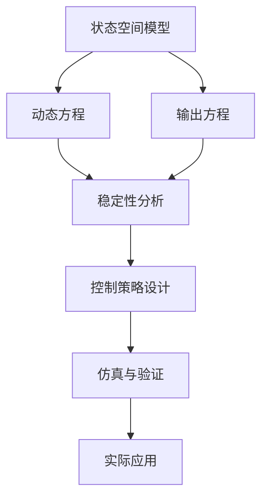
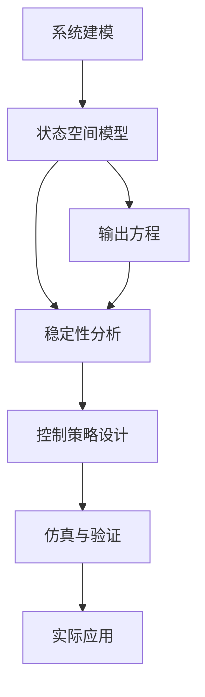

                 

### 数学与控制论：反馈系统的数学描述

#### 引言

控制论作为一门研究动态系统行为及其控制的科学，在工程、科学和经济学等领域有着广泛的应用。反馈系统是控制论中的核心概念之一，它在工程实践中扮演着至关重要的角色。反馈系统通过将系统的输出返回到输入端，对系统行为进行调节，以达到预期的稳定性和性能。

数学作为反馈系统的理论基础，为控制论的发展提供了强有力的工具。本章将深入探讨反馈系统的数学描述，包括基本数学工具、线性反馈系统的理论、非线性反馈系统的分析以及反馈系统的数学模型和控制策略。

#### 关键词

- 控制论
- 反馈系统
- 数学描述
- 线性系统
- 非线性系统
- 稳定性分析
- 数学模型
- 控制策略

#### 摘要

本文首先介绍控制论和反馈系统的基本概念，然后介绍用于描述反馈系统的基本数学工具，包括线性代数、微积分和概率论。接着，本文详细探讨线性反馈系统的理论，包括稳定性分析和设计方法。随后，本文介绍非线性反馈系统的特点和数学描述。最后，本文总结反馈系统的数学模型和控制策略，并探讨其在实际工程中的应用和发展趋势。

### 第1章 引言

控制论（Cybernetics）是一门跨学科的领域，主要研究动态系统的行为及其控制。它涵盖了工程、计算机科学、经济学、生物学等多个领域。控制论的目标是通过建立数学模型和设计控制策略，实现对系统的自动控制，以达到预期的性能和稳定性。

控制论中的核心概念之一是反馈系统。反馈系统通过将系统的输出返回到输入端，对系统的行为进行调节。反馈可以增强或减弱系统的行为，从而实现对系统的稳定控制和性能优化。

反馈系统在工程实践中有着广泛的应用。例如，在通信系统中，反馈控制用于信号的放大和调整；在电力系统中，反馈控制用于电压和频率的稳定；在机械系统中，反馈控制用于机器人的精确运动控制。

数学作为反馈系统的理论基础，为控制论的发展提供了强有力的工具。本章将介绍用于描述反馈系统的基本数学工具，包括线性代数、微积分和概率论。这些数学工具将帮助我们深入理解反馈系统的行为和特性。

本章的结构如下：

- **第1章 引言**：介绍控制论和反馈系统的基本概念，以及数学在控制论中的应用。
- **第2章 基本数学工具**：介绍线性代数、微积分和概率论的基本概念和定理，为后续章节的讨论奠定基础。
- **第3章 反馈系统的基本理论**：介绍反馈系统的定义、性质和分类，以及反馈系统的基本理论。
- **第4章 线性反馈系统的数学描述**：详细探讨线性反馈系统的数学描述，包括状态空间模型、输入输出模型和控制策略。
- **第5章 非线性反馈系统的数学描述**：介绍非线性反馈系统的特点和数学描述。
- **第6章 反馈系统的数学模型**：总结反馈系统的数学模型，包括状态空间模型、输入输出模型和控制模型。
- **第7章 反馈系统的控制策略**：介绍反馈系统的控制策略，包括鲁棒控制、模型预测控制和智能控制。
- **第8章 反馈系统在实际工程中的应用**：探讨反馈系统在通信系统、电力系统和机械系统中的应用。
- **第9章 反馈系统的发展趋势**：分析反馈系统在新型领域和人工智能中的应用和发展趋势。
- **第10章 总结与展望**：总结本章的主要内容和结论，并对未来的研究方向提出建议。

通过本章的介绍，读者将能够全面了解反馈系统的数学描述，为后续章节的学习打下坚实的基础。

### 第2章 基本数学工具

要深入探讨反馈系统的数学描述，首先需要掌握一些基本数学工具。这些工具包括线性代数、微积分和概率论。它们不仅是控制论的基础，也在物理学、工程学和其他科学领域有着广泛的应用。

#### 线性代数基础

线性代数是研究向量空间和线性变换的数学分支。它是控制论中不可或缺的工具，用于描述系统的状态、输入和输出。

1. **向量与矩阵**：向量是具有大小和方向的量，而矩阵是由多个向量组成的数组。矩阵可以表示系统的状态、输入和输出。线性代数中的矩阵运算，如加法、乘法和逆运算，是分析系统行为的重要工具。

2. **行列式**：行列式是矩阵的一个标量值，用于判断矩阵的行列式值。行列式在系统稳定性分析中起着关键作用。

3. **特征值与特征向量**：特征值和特征向量是矩阵的固有属性。它们在系统分析中用于判断系统的稳定性和动态行为。

#### 微积分基础

微积分是研究函数变化率和累积过程的数学分支。在控制论中，微积分用于描述系统的动态行为，包括状态变量的变化率和系统的响应。

1. **导数**：导数是函数在某一点的瞬时变化率。它用于描述系统状态的瞬时变化。

2. **积分**：积分是函数在某一段区间内的累积和。它用于描述系统状态的累积变化。

3. **微分方程**：微分方程是描述系统动态行为的方程。通过解微分方程，可以分析系统的行为和特性。

#### 概率论基础

概率论是研究随机事件及其概率的数学分支。在控制论中，概率论用于描述系统的不确定性和随机性。

1. **概率分布**：概率分布描述了随机变量的可能取值及其概率。常见的概率分布有正态分布、均匀分布等。

2. **随机变量**：随机变量是具有概率分布的变量。它们用于描述系统的状态和输出。

3. **期望与方差**：期望和方差是概率分布的统计量。期望用于描述随机变量的平均取值，方差用于描述随机变量的离散程度。

通过掌握这些基本数学工具，我们可以更深入地理解和分析反馈系统的行为和特性。在后续章节中，我们将利用这些工具来描述线性反馈系统和非线性反馈系统，并进行稳定性分析和设计。

#### 2.1 线性代数基础

线性代数是反馈系统分析的基础，它提供了描述系统状态、输入和输出的数学框架。以下是一些核心概念和定理，它们在反馈系统分析中起着关键作用。

##### 向量与矩阵

向量是具有大小和方向的量，通常表示为列向量。矩阵是由多个向量组成的数组，可以表示系统的状态、输入和输出。

**定义：**
- 向量：\( \mathbf{v} = \begin{bmatrix} v_1 \\ v_2 \\ \vdots \\ v_n \end{bmatrix} \)
- 矩阵：\( \mathbf{A} = \begin{bmatrix} a_{11} & a_{12} & \cdots & a_{1n} \\ a_{21} & a_{22} & \cdots & a_{2n} \\ \vdots & \vdots & \ddots & \vdots \\ a_{m1} & a_{m2} & \cdots & a_{mn} \end{bmatrix} \)

**矩阵运算：**
- 加法：\( \mathbf{A} + \mathbf{B} \)
- 数乘：\( c \mathbf{A} \)
- 乘法：\( \mathbf{A} \mathbf{B} \)
- 逆矩阵：\( \mathbf{A}^{-1} \)（如果存在）

##### 行列式

行列式是矩阵的一个标量值，它用于判断矩阵的行列式值。行列式在系统稳定性分析中起着关键作用。

**定义：**
- 二阶行列式：\( \begin{vmatrix} a & b \\ c & d \end{vmatrix} = ad - bc \)
- 高阶行列式：通过拉普拉斯展开或递归定义

**性质：**
- 行列式值不变性
- 行列式乘法性质

##### 特征值与特征向量

特征值和特征向量是矩阵的固有属性。它们在系统分析中用于判断系统的稳定性和动态行为。

**定义：**
- 特征值：\( \lambda \) 是矩阵 \( \mathbf{A} \) 的一个数，使得 \( \mathbf{A} \mathbf{v} = \lambda \mathbf{v} \)
- 特征向量：\( \mathbf{v} \) 是矩阵 \( \mathbf{A} \) 的一个非零向量，满足 \( \mathbf{A} \mathbf{v} = \lambda \mathbf{v} \)

**性质：**
- 每个矩阵都有至少一个特征值和特征向量
- 矩阵的特征值与特征向量是唯一的
- 特征值决定了系统的稳定性

##### 矩阵的对角化

矩阵的对角化是将矩阵表示为对角矩阵的过程，它简化了矩阵运算，并有助于分析系统的动态行为。

**定义：**
- 对角矩阵：\( \mathbf{D} = \begin{bmatrix} \lambda_1 & 0 & \cdots & 0 \\ 0 & \lambda_2 & \cdots & 0 \\ \vdots & \vdots & \ddots & \vdots \\ 0 & 0 & \cdots & \lambda_n \end{bmatrix} \)
- 对角化：\( \mathbf{A} = \mathbf{P} \mathbf{D} \mathbf{P}^{-1} \)

**性质：**
- 对角化矩阵的特征值在主对角线上
- 对角化矩阵的特征向量构成正交矩阵

##### 线性变换

线性变换是线性代数中的核心概念，它描述了系统状态的转换。

**定义：**
- 线性变换：\( \mathbf{L} : \mathbb{R}^n \to \mathbb{R}^m \)，满足 \( \mathbf{L}(a\mathbf{x} + b\mathbf{y}) = a\mathbf{L}(\mathbf{x}) + b\mathbf{L}(\mathbf{y}) \)

**性质：**
- 线性变换保持线性组合
- 线性变换保持线性方程组

##### 矩阵的秩与行列式

矩阵的秩和行列式是判断矩阵性质的重要指标。

**定义：**
- 矩阵的秩：矩阵的行数和列数中较小的那个数
- 行列式：矩阵的行列式值

**性质：**
- 矩阵的秩决定了矩阵的解空间维度
- 行列式为零的矩阵不可逆

通过掌握这些线性代数基础，我们可以更好地理解和分析反馈系统的数学描述。在后续章节中，我们将利用这些工具深入探讨线性反馈系统和非线性反馈系统的数学描述。

#### 2.2 微积分基础

微积分是研究函数变化率和累积过程的数学分支，它在反馈系统分析中扮演着至关重要的角色。以下是一些核心概念和定理，它们帮助我们在数学层面上理解和描述系统的动态行为。

##### 导数

导数是函数在某一点的瞬时变化率，用于描述系统状态的瞬时变化。

**定义：**
- 一元函数的导数：设 \( f(x) \) 是定义在区间 \( I \) 上的函数，如果极限
  \[
  f'(x) = \lim_{h \to 0} \frac{f(x+h) - f(x)}{h}
  \]
  存在，则称 \( f(x) \) 在点 \( x \) 可导，极限 \( f'(x) \) 为 \( f(x) \) 在点 \( x \) 的导数。
- 多元函数的导数：设 \( f(x, y) \) 是定义在 \( \mathbb{R}^2 \) 上的函数，如果极限
  \[
  f_x(x, y) = \lim_{h \to 0} \frac{f(x+h, y) - f(x, y)}{h}
  \]
  和
  \[
  f_y(x, y) = \lim_{k \to 0} \frac{f(x, y+k) - f(x, y)}{k}
  \]
  存在，则称 \( f(x, y) \) 在点 \( (x, y) \) 可导，极限 \( f_x(x, y) \) 和 \( f_y(x, y) \) 分别为 \( f(x, y) \) 在点 \( (x, y) \) 的偏导数。

**性质：**
- 可导函数一定连续，但连续函数不一定可导。
- 导数的几何意义是函数曲线在某一点的切线斜率。

##### 积分

积分是函数在某一段区间内的累积和，用于描述系统状态的累积变化。

**定义：**
- 一元函数的不定积分：设 \( f(x) \) 是定义在区间 \( I \) 上的函数，如果存在函数 \( F(x) \)，使得 \( F'(x) = f(x) \)，则称 \( F(x) \) 为 \( f(x) \) 的一个原函数。
- 一元函数的定积分：设 \( f(x) \) 是定义在区间 \([a, b]\) 上的函数，如果极限
  \[
  \int_{a}^{b} f(x) \, dx = \lim_{n \to \infty} \sum_{i=1}^{n} f(x_i^*) \Delta x
  \]
  存在，则称该极限为 \( f(x) \) 在区间 \([a, b]\) 上的定积分。

**性质：**
- 积分和导数互为逆运算。
- 积分可以用于求解函数的面积、体积和质心等几何问题。

##### 微分方程

微分方程是描述系统动态行为的方程，通过解微分方程，可以分析系统的行为和特性。

**定义：**
- 常微分方程：函数及其导数以线性形式出现的方程，如 \( \frac{dy}{dx} + P(x)y = Q(x) \)。
- 偏微分方程：函数及其偏导数以线性形式出现的方程，如 \( \frac{\partial^2 u}{\partial t^2} = c^2 \frac{\partial^2 u}{\partial x^2} \)。

**性质：**
- 微分方程的解可以表示系统状态的演变过程。
- 微分方程的解具有唯一性（对于初始条件唯一）。

通过掌握这些微积分基础，我们可以更好地理解和描述反馈系统的动态行为，为后续章节中的稳定性分析和设计奠定基础。在下一节中，我们将介绍概率论基础，这是分析系统不确定性和随机性的重要工具。

#### 2.3 概率论基础

概率论是研究随机事件及其概率的数学分支，它在反馈系统的分析中扮演着关键角色，尤其是在系统存在不确定性和随机性时。以下是一些核心概念和定理，它们帮助我们理解和描述系统的概率行为。

##### 随机事件

随机事件是在一次试验中可能发生也可能不发生的事件。概率论的基本概念之一就是如何量化这些随机事件的概率。

**定义：**
- 随机事件：在一次试验中可能发生也可能不发生的事件，通常用集合 \( A \) 表示。
- 样本空间：试验所有可能结果的集合，通常用 \( S \) 表示。
- 概率：随机事件 \( A \) 发生的概率，记作 \( P(A) \)。

**性质：**
- 概率的基本性质：\( P(S) = 1 \)，\( P(\emptyset) = 0 \)，\( 0 \leq P(A) \leq 1 \)。
- 概率的加法规则：\( P(A \cup B) = P(A) + P(B) - P(A \cap B) \)。
- 条件概率：\( P(B|A) = \frac{P(A \cap B)}{P(A)} \)。

##### 随机变量

随机变量是定义在样本空间上的函数，它将每个样本点映射到一个实数。随机变量是描述系统状态和输出的一种数学工具。

**定义：**
- 离散随机变量：随机变量 \( X \) 可以取有限个或可数无限个值，其概率分布函数（概率质量函数）记为 \( P_X(x) \)。
- 连续随机变量：随机变量 \( X \) 可以取任意实数值，其概率分布函数（概率密度函数）记为 \( f_X(x) \)。

**性质：**
- 随机变量的分布函数：\( F_X(x) = P(X \leq x) \)，对于离散随机变量是概率质量函数的累积和，对于连续随机变量是概率密度函数的积分。
- 离散随机变量的期望和方差：\( E(X) = \sum_{x} x P_X(x) \)，\( Var(X) = E(X^2) - [E(X)]^2 \)。
- 连续随机变量的期望和方差：\( E(X) = \int_{-\infty}^{\infty} x f_X(x) \, dx \)，\( Var(X) = \int_{-\infty}^{\infty} (x - E(X))^2 f_X(x) \, dx \)。

##### 独立性和分布

独立性是描述多个随机变量之间关系的一个重要概念。

**定义：**
- 独立随机变量：如果对于任意两个随机变量 \( X \) 和 \( Y \)，有 \( P(X = x \text{ 且 } Y = y) = P(X = x)P(Y = y) \)，则称 \( X \) 和 \( Y \) 独立。
- 独立性检验：通过统计方法检验随机变量是否独立。

**性质：**
- 独立随机变量的期望和方差相互独立。
- 独立随机变量的线性组合仍然是独立的。

##### 常见概率分布

概率论中常用的概率分布包括正态分布、泊松分布、均匀分布等。

**正态分布：**
- 概率密度函数：\( f(x) = \frac{1}{\sqrt{2\pi\sigma^2}} e^{-\frac{(x-\mu)^2}{2\sigma^2}} \)
- 期望：\( \mu \)
- 方差：\( \sigma^2 \)

**泊松分布：**
- 概率质量函数：\( P(X = k) = \frac{e^{-\lambda}\lambda^k}{k!} \)
- 期望：\( \lambda \)
- 方差：\( \lambda \)

**均匀分布：**
- 概率密度函数：\( f(x) = \frac{1}{b-a} \)，其中 \( a \) 和 \( b \) 是均匀分布的上下限。

通过掌握这些概率论基础，我们可以更好地理解和描述反馈系统的随机性和不确定性，从而为系统的分析和设计提供坚实的数学基础。在下一节中，我们将进一步探讨反馈系统的基本理论。

### 第3章 反馈系统的基本理论

反馈系统是控制论中的一个核心概念，它在许多工程和科学领域中都有广泛应用。反馈系统通过将系统的输出返回到输入端，对系统的行为进行调节，以达到预期的稳定性和性能。在本章中，我们将深入探讨反馈系统的定义、性质、分类及其基本理论。

#### 反馈系统的定义与性质

**定义：** 反馈系统是一种闭环控制系统，它将系统的输出信号反馈到系统的输入端，以调节系统的输入，从而改变系统的行为。反馈系统的一般形式可以表示为：

\[ \dot{x}(t) = A x(t) + B u(t) \]
\[ y(t) = C x(t) + D u(t) \]

其中，\( x(t) \) 是系统的状态向量，\( u(t) \) 是输入向量，\( y(t) \) 是输出向量，\( A \)、\( B \)、\( C \)、\( D \) 是系统的矩阵。

**性质：**

1. **闭环性质**：反馈系统具有闭环性质，即系统的输出通过反馈回路影响系统的输入。
2. **调节性**：通过调节反馈系数，可以实现对系统行为的精确控制。
3. **稳定性**：反馈系统可以通过稳定性分析来确保系统的稳定运行。

#### 反馈系统的分类

根据反馈的类型，反馈系统可以分为以下几类：

1. **反馈到输入的系统**：这种系统将输出信号反馈到输入端，以调节系统的输入。例如，PID控制器就是一种典型的反馈到输入的系统。
2. **反馈到输出的系统**：这种系统将输出信号反馈到输出端，以调节系统的输出。例如，自动调整的电压放大器就是一种反馈到输出的系统。
3. **复合反馈系统**：这种系统同时具有反馈到输入和反馈到输出的特性。例如，在多输入多输出（MIMO）系统中，可能会同时存在反馈到输入和反馈到输出的控制回路。

#### 反馈系统的基本理论

**稳定性分析**：反馈系统的稳定性是系统设计中的重要考虑因素。稳定性分析旨在确定系统在给定初始条件下，其状态向量是否会在一定时间内趋近于平衡点。常用的稳定性分析方法包括：

- **特征值分析**：通过计算系统的特征值来判断系统的稳定性。如果所有特征值的实部都为负，则系统是稳定的。
- **李雅普诺夫方法**：通过构造李雅普诺夫函数来判断系统的稳定性。如果李雅普诺夫函数在系统内始终为正，且其导数在系统内始终为负，则系统是稳定的。

**设计方法**：反馈系统的设计包括确定系统的控制律、反馈系数和系统参数。设计方法主要包括：

- **状态反馈控制**：通过选择合适的反馈矩阵 \( K \)，将状态向量反馈到输入端，实现对系统的控制。
- **输入输出反馈控制**：通过选择合适的反馈矩阵 \( K \)，将输出向量反馈到输入端，实现对系统的控制。
- **鲁棒控制**：针对系统的不确定性和外部干扰，设计鲁棒控制器，以确保系统的稳定性和性能。

**数学模型**：反馈系统的数学模型通常采用状态空间模型来描述。状态空间模型的形式如下：

\[ \dot{x}(t) = A x(t) + B u(t) \]
\[ y(t) = C x(t) + D u(t) \]

其中，\( A \)、\( B \)、\( C \)、\( D \) 是系统矩阵，它们决定了系统的动态行为。

#### 反馈系统在不同领域的应用

反馈系统在工程和科学领域中有着广泛的应用，以下是一些典型的应用实例：

- **通信系统**：在通信系统中，反馈控制用于信号的放大、调整和滤波，以提高信号的传输质量和抗干扰能力。
- **电力系统**：在电力系统中，反馈控制用于电压和频率的稳定，以保证电力系统的正常运行。
- **机械系统**：在机械系统中，反馈控制用于机器人的运动控制、机械臂的姿态调整等，以提高系统的精度和稳定性。

通过本章的讨论，我们可以看到反馈系统在控制论中的重要性以及其在实际应用中的广泛性。在下一章中，我们将深入探讨线性反馈系统的数学描述，这将为我们进一步理解反馈系统的行为提供重要的数学工具。

### 第4章 线性反馈系统的数学描述

线性反馈系统是控制论中的一个重要研究领域，因为它们具有明确的数学描述和稳定的动态行为。线性反馈系统通过线性差分方程或微分方程来描述，使得我们能够利用丰富的数学工具进行分析和设计。本章将详细介绍线性反馈系统的基本概念、稳定性分析以及设计方法。

#### 4.1 线性反馈系统的基本概念

**定义：** 线性反馈系统是指系统满足叠加原理和齐次性原理的系统。其数学描述通常采用以下形式：

\[ \dot{x}(t) = A x(t) + B u(t) \]
\[ y(t) = C x(t) + D u(t) \]

其中，\( x(t) \) 是状态向量，\( u(t) \) 是输入向量，\( y(t) \) 是输出向量，\( A \)、\( B \)、\( C \)、\( D \) 是系统的矩阵。

**特性：**

1. **叠加原理**：如果输入 \( u_1(t) \) 导致状态变化 \( x_1(t) \)，输入 \( u_2(t) \) 导致状态变化 \( x_2(t) \)，则输入 \( u_1(t) + u_2(t) \) 导致的状态变化 \( x(t) = x_1(t) + x_2(t) \)。
2. **齐次性原理**：如果输入 \( u(t) \) 导致状态变化 \( x(t) \)，则输入 \( ku(t) \) 导致的状态变化 \( x(t) \) 是 \( x(t) \) 的 \( k \) 倍。

#### 4.2 线性反馈系统的稳定性分析

稳定性分析是线性反馈系统设计中的关键步骤。稳定性分析旨在确定系统在给定初始条件下，其状态向量是否会趋近于平衡点。

**定义：** 系统是稳定的，如果对于任何初始条件，系统最终会收敛到某个平衡点。

**稳定性判据：**

1. **矩阵 \( A \) 的特征值分析**：
   - 如果矩阵 \( A \) 的所有特征值的实部均小于零，则系统是稳定的。
   - 如果矩阵 \( A \) 的特征值有正实部，则系统是不稳定的。
   - 如果矩阵 \( A \) 的特征值有零实部，则系统是临界稳定的。

2. **李雅普诺夫方法**：
   - 李雅普诺夫方法通过构造李雅普诺夫函数来判断系统的稳定性。李雅普诺夫函数 \( V(x) \) 必须满足以下条件：
     - \( V(x) \) 在 \( x \) 的邻域内为正定。
     - \( V(x) \) 的导数 \( \dot{V}(x) \) 在 \( x \) 的邻域内为负定。
   - 如果 \( \dot{V}(x) < 0 \)，则系统是稳定的。

#### 4.3 线性反馈系统的设计

线性反馈系统的设计包括确定系统的控制律、反馈系数和系统参数。以下是几种常见的设计方法：

1. **状态反馈控制**：
   - **定义**：状态反馈控制是指通过状态向量来设计控制输入。
   - **公式**：\( u(t) = -K x(t) \)
   - **设计步骤**：
     - 选择合适的反馈矩阵 \( K \)，使得系统稳定。
     - 使用特征值分析或李雅普诺夫方法验证系统的稳定性。

2. **输入输出反馈控制**：
   - **定义**：输入输出反馈控制是指通过输出向量来设计控制输入。
   - **公式**：\( u(t) = -C^T P y(t) \)
   - **设计步骤**：
     - 选择合适的反馈矩阵 \( P \)，使得系统稳定。
     - 使用特征值分析或李雅普诺夫方法验证系统的稳定性。

3. **鲁棒控制**：
   - **定义**：鲁棒控制是指针对系统的不确定性和外部干扰，设计鲁棒控制器，以确保系统的稳定性和性能。
   - **方法**：
     - H∞控制：通过优化控制器的增益，使得系统对不确定性和外部干扰具有最小的性能损失。
     - robustness analysis：通过分析和验证系统对参数变化和外部干扰的鲁棒性。

#### 4.4 线性反馈系统的数学模型

线性反馈系统的数学模型通常采用状态空间模型来描述，其形式如下：

\[ \dot{x}(t) = A x(t) + B u(t) \]
\[ y(t) = C x(t) + D u(t) \]

其中，\( A \)、\( B \)、\( C \)、\( D \) 是系统矩阵，它们决定了系统的动态行为。

**状态空间模型**：
- **状态向量**：\( x(t) \) 是系统的状态向量，它包含系统的内部信息。
- **输入向量**：\( u(t) \) 是系统的输入向量，它影响系统的状态。
- **输出向量**：\( y(t) \) 是系统的输出向量，它反映了系统的外部行为。

**输入输出模型**：
- **状态空间模型**：\( \dot{x}(t) = A x(t) + B u(t) \)，\( y(t) = C x(t) + D u(t) \)
- **输入输出模型**：\( y(t) = C x(t) + D u(t) \)

**控制模型**：
- **状态反馈控制**：\( u(t) = -K x(t) \)
- **输入输出反馈控制**：\( u(t) = -C^T P y(t) \)

#### 4.5 线性反馈系统的数值仿真

**MATLAB/Simulink工具使用**：
- MATLAB和Simulink是进行线性反馈系统仿真分析的重要工具。
- 使用MATLAB的控制系统工具箱，可以方便地进行系统建模、仿真和分析。

**仿真案例解析**：
- **案例1：简单的机械系统**：使用状态空间模型描述一个简单的机械系统，并通过状态反馈控制实现系统的稳定。
- **案例2：通信系统**：使用输入输出模型描述一个通信系统，并通过输入输出反馈控制实现信号的稳定传输。

通过以上内容，本章对线性反馈系统的基本概念、稳定性分析、设计方法和数学模型进行了详细阐述。在下一章中，我们将探讨非线性反馈系统的数学描述，这将帮助我们理解更广泛的系统行为。

### 4.1 线性反馈系统的基本概念

**线性反馈系统的定义**

线性反馈系统是一种具有线性输入输出关系的闭环控制系统。在这种系统中，系统的输入和输出满足叠加原理和齐次性原理。其数学描述通常可以表示为以下状态空间模型：

\[ \dot{x}(t) = A x(t) + B u(t) \]
\[ y(t) = C x(t) + D u(t) \]

其中，\( x(t) \) 是状态向量，\( u(t) \) 是输入向量，\( y(t) \) 是输出向量，\( A \)、\( B \)、\( C \)、\( D \) 是系统矩阵。

**线性反馈系统的特性**

1. **叠加原理**：线性反馈系统满足叠加原理，即如果系统的输入 \( u_1(t) \) 导致状态 \( x_1(t) \)，输入 \( u_2(t) \) 导致状态 \( x_2(t) \)，则输入 \( u_1(t) + u_2(t) \) 导致的状态 \( x(t) = x_1(t) + x_2(t) \)。

2. **齐次性原理**：线性反馈系统满足齐次性原理，即如果输入 \( u(t) \) 导致状态 \( x(t) \)，则输入 \( ku(t) \) 导致的状态 \( x(t) \) 是 \( x(t) \) 的 \( k \) 倍。

3. **线性性质**：系统的输出和输入之间的关系是线性的，可以表示为 \( y(t) = C x(t) + D u(t) \)，其中 \( C \) 和 \( D \) 是常数矩阵。

**线性反馈系统的分类**

根据反馈的类型，线性反馈系统可以分为以下几类：

1. **反馈到输入的系统**：这种系统将输出信号反馈到输入端，以调节系统的输入。例如，PID控制器就是一种典型的反馈到输入的系统。

2. **反馈到输出的系统**：这种系统将输出信号反馈到输出端，以调节系统的输出。例如，自动调整的电压放大器就是一种反馈到输出的系统。

3. **复合反馈系统**：这种系统同时具有反馈到输入和反馈到输出的特性。例如，在多输入多输出（MIMO）系统中，可能会同时存在反馈到输入和反馈到输出的控制回路。

通过以上对线性反馈系统基本概念的分析，我们可以看到线性反馈系统在控制论中的重要性和广泛应用。在下一节中，我们将进一步探讨线性反馈系统的数学描述，这将为我们深入理解线性反馈系统的行为提供数学工具。

#### 4.2 线性反馈系统的稳定性分析

稳定性分析是线性反馈系统设计中的关键步骤，它确保系统在给定初始条件下能够稳定运行。以下我们将讨论常用的稳定性分析方法，包括矩阵 \( A \) 的特征值分析和李雅普诺夫方法。

**矩阵 \( A \) 的特征值分析**

特征值分析是线性反馈系统稳定性分析中最直接和常用的方法。通过计算系统矩阵 \( A \) 的特征值，可以判断系统的稳定性。

- **稳定条件**：如果系统矩阵 \( A \) 的所有特征值的实部均小于零，则系统是稳定的。
- **不稳定条件**：如果系统矩阵 \( A \) 的特征值有正实部，则系统是不稳定的。
- **临界稳定条件**：如果系统矩阵 \( A \) 的特征值有零实部，则系统是临界稳定的。

**李雅普诺夫方法**

李雅普诺夫方法是另一种强大的稳定性分析方法，特别适用于非线性系统和无法通过特征值分析直接判断稳定性的系统。

- **李雅普诺夫函数**：首先构造一个正定函数 \( V(x) \)，称为李雅普诺夫函数。
- **稳定性条件**：如果 \( V(x) \) 在系统内部为正定，且其导数 \( \dot{V}(x) \) 在系统内部为负定，则系统是稳定的。

**具体步骤**：

1. **选择李雅普诺夫函数**：构造一个关于状态 \( x \) 的正定函数 \( V(x) \)。常见的李雅普诺夫函数有 \( V(x) = x^T P x \)，其中 \( P \) 是正定矩阵。

2. **计算导数**：计算 \( V(x) \) 的导数 \( \dot{V}(x) \)。对于系统 \( \dot{x} = A x + B u \)，有 \( \dot{V}(x) = \dot{x}^T P x + x^T P \dot{x} \)。

3. **稳定性条件**：如果 \( \dot{V}(x) \) 在系统内部为负定，即对于所有 \( x \neq 0 \)，有 \( \dot{V}(x) < 0 \)，则系统是稳定的。

**示例**：

假设系统矩阵 \( A = \begin{bmatrix} -2 & 1 \\ -1 & -3 \end{bmatrix} \)，构造李雅普诺夫函数 \( V(x) = x_1^2 + x_2^2 \)。

计算 \( \dot{V}(x) = \dot{x}_1 x_1 + \dot{x}_2 x_2 = (-2x_1 + x_2) x_1 + (-x_1 - 3x_2) x_2 = -3x_1^2 - 4x_2^2 \)。

由于 \( \dot{V}(x) < 0 \) 对于所有 \( x \neq 0 \)，因此系统是稳定的。

**结论**：

通过特征值分析和李雅普诺夫方法，我们可以判断线性反馈系统的稳定性。这两种方法各具优势，特征值分析适用于线性系统，而李雅普诺夫方法适用于更广泛的系统。在实际应用中，常常结合这两种方法进行稳定性分析，以确保系统的稳定运行。

在下一节中，我们将探讨线性反馈系统的设计方法，包括状态反馈控制和输入输出反馈控制。

### 4.3 线性反馈系统的设计

线性反馈系统的设计目标是在满足系统性能指标的前提下，使系统在预期的运行条件下保持稳定。设计过程通常涉及确定合适的控制律、反馈系数以及系统参数。以下我们将详细讨论两种常见的设计方法：状态反馈控制和输入输出反馈控制。

#### 状态反馈控制

状态反馈控制是一种通过状态向量来设计控制输入的方法。其基本思想是利用系统的状态信息，通过设计一个反馈矩阵 \( K \)，将状态反馈到输入端，以实现对系统的控制。

**定义与公式**：

状态反馈控制的数学描述为：

\[ u(t) = -K x(t) \]

其中，\( u(t) \) 是控制输入，\( x(t) \) 是系统状态，\( K \) 是反馈矩阵。

**设计步骤**：

1. **建立系统模型**：首先，根据系统的动态特性，建立系统的状态空间模型：

\[ \dot{x}(t) = A x(t) + B u(t) \]
\[ y(t) = C x(t) + D u(t) \]

2. **确定目标性能指标**：根据设计要求，确定系统的性能指标，如稳定性、响应速度和稳态误差等。

3. **设计反馈矩阵 \( K \)**：设计反馈矩阵 \( K \)，使得闭环系统的特征值位于期望的位置。常用的方法包括劳斯-哈拉姆定理和卡尔曼滤波器。

4. **验证系统稳定性**：通过特征值分析或李雅普诺夫方法，验证闭环系统的稳定性。

**示例**：

考虑一个简单的二阶系统：

\[ \dot{x}_1(t) = x_2(t) \]
\[ \dot{x}_2(t) = -x_1(t) + u(t) \]

系统的状态空间模型为：

\[ \dot{x}(t) = \begin{bmatrix} 0 & 1 \\ -1 & 0 \end{bmatrix} x(t) + \begin{bmatrix} 0 \\ 1 \end{bmatrix} u(t) \]
\[ y(t) = \begin{bmatrix} 1 & 0 \end{bmatrix} x(t) \]

设计反馈矩阵 \( K = \begin{bmatrix} k_1 \\ k_2 \end{bmatrix} \)，使得闭环系统的特征值位于复平面的左半部分。通过计算，可以得到 \( K = \begin{bmatrix} 2 \\ -1 \end{bmatrix} \)。

#### 输入输出反馈控制

输入输出反馈控制是一种通过输出向量来设计控制输入的方法。其基本思想是利用系统的输出信息，通过设计一个反馈矩阵 \( K \)，将输出反馈到输入端，以实现对系统的控制。

**定义与公式**：

输入输出反馈控制的数学描述为：

\[ u(t) = -C^T P y(t) \]

其中，\( u(t) \) 是控制输入，\( y(t) \) 是系统输出，\( P \) 是反馈矩阵。

**设计步骤**：

1. **建立系统模型**：首先，根据系统的动态特性，建立系统的状态空间模型。

2. **确定目标性能指标**：根据设计要求，确定系统的性能指标。

3. **设计反馈矩阵 \( P \)**：设计反馈矩阵 \( P \)，使得闭环系统的特征值位于期望的位置。

4. **验证系统稳定性**：通过特征值分析或李雅普诺夫方法，验证闭环系统的稳定性。

**示例**：

考虑一个简单的二阶系统：

\[ \dot{x}_1(t) = x_2(t) \]
\[ \dot{x}_2(t) = -x_1(t) + u(t) \]

系统的状态空间模型为：

\[ \dot{x}(t) = \begin{bmatrix} 0 & 1 \\ -1 & 0 \end{bmatrix} x(t) + \begin{bmatrix} 0 \\ 1 \end{bmatrix} u(t) \]
\[ y(t) = \begin{bmatrix} 1 & 0 \end{bmatrix} x(t) \]

设计反馈矩阵 \( P = \begin{bmatrix} p_1 & p_2 \end{bmatrix} \)，使得闭环系统的特征值位于复平面的左半部分。通过计算，可以得到 \( P = \begin{bmatrix} 2 & -1 \end{bmatrix} \)。

#### 比较

状态反馈控制和输入输出反馈控制各有优缺点：

- **状态反馈控制**：优点在于能够利用系统的状态信息，实现更精确的控制。缺点是需要测量系统的状态，这在某些情况下可能不可行。
- **输入输出反馈控制**：优点在于不需要测量系统的状态，只需测量系统的输出。缺点是可能无法充分利用系统的状态信息。

在实际应用中，通常根据系统的具体需求和环境条件，选择合适的设计方法。

通过以上对线性反馈系统设计方法的讨论，我们可以看到线性反馈系统设计的复杂性和挑战性。在下一节中，我们将进一步探讨线性反馈系统的数学模型，包括状态空间模型、输入输出模型和控制模型。

### 4.4 线性反馈系统的数学模型

线性反馈系统的数学模型是理解和设计反馈系统的核心工具。线性反馈系统的数学模型主要包括状态空间模型、输入输出模型和控制模型。以下我们将详细讨论这些模型及其应用。

#### 状态空间模型

状态空间模型是一种描述线性动态系统的通用数学模型，它将系统的状态、输入和输出关系表达为矩阵形式。状态空间模型的一般形式如下：

\[ \dot{x}(t) = A x(t) + B u(t) \]
\[ y(t) = C x(t) + D u(t) \]

其中，\( x(t) \) 是系统的状态向量，\( u(t) \) 是输入向量，\( y(t) \) 是输出向量，\( A \)、\( B \)、\( C \)、\( D \) 是系统矩阵。

- **状态方程**：\( \dot{x}(t) = A x(t) + B u(t) \) 描述了系统的状态随时间的变化。
- **输出方程**：\( y(t) = C x(t) + D u(t) \) 描述了系统的输出与状态和输入的关系。

状态空间模型可以用于系统的稳定性分析、状态预测和状态估计。通过状态方程，我们可以计算系统在任意时间点的状态；通过输出方程，我们可以计算系统的输出。

**应用**：

状态空间模型在控制系统中有着广泛的应用。例如，在机器人控制中，状态空间模型可以用于描述机器人的运动状态，并设计相应的控制策略。

#### 输入输出模型

输入输出模型是一种仅描述系统输入和输出关系的数学模型，它不涉及系统的内部状态。输入输出模型的一般形式如下：

\[ y(t) = C x(t) + D u(t) \]

其中，\( x(t) \) 是系统状态，\( u(t) \) 是输入，\( y(t) \) 是输出，\( C \) 和 \( D \) 是系统矩阵。

- **输出方程**：\( y(t) = C x(t) + D u(t) \) 描述了系统的输出与状态和输入的关系。

输入输出模型在系统辨识、信号处理和控制系统中有着重要应用。例如，在信号处理中，输入输出模型可以用于设计滤波器和自适应控制系统。

**应用**：

输入输出模型在通信系统、信号处理和控制系统中的应用非常广泛。例如，在通信系统中，输入输出模型可以用于设计信号调制解调器；在信号处理中，输入输出模型可以用于设计滤波器。

#### 控制模型

控制模型是用于设计系统控制律的数学模型。在控制模型中，系统的状态和输入输出关系被用来设计反馈控制策略。控制模型通常基于状态空间模型或输入输出模型。

- **状态反馈控制模型**：状态反馈控制模型是一种基于状态空间模型的设计方法，其控制律为 \( u(t) = -K x(t) \)，其中 \( K \) 是反馈矩阵。
- **输入输出反馈控制模型**：输入输出反馈控制模型是一种基于输入输出模型的设计方法，其控制律为 \( u(t) = -C^T P y(t) \)，其中 \( P \) 是反馈矩阵。

**应用**：

控制模型在工业控制系统、自动驾驶系统和机器人控制系统中有着广泛的应用。例如，在工业控制系统中，控制模型可以用于设计温度控制系统；在自动驾驶系统中，控制模型可以用于设计车辆的运动控制策略。

#### 模型转换

在某些情况下，需要将状态空间模型转换为输入输出模型，或者进行反向转换。模型转换的常见方法包括：

- **传递函数法**：通过计算系统的传递函数 \( G(s) = C(sI - A)^{-1}B + D \)，可以将状态空间模型转换为输入输出模型。
- **逆模型法**：通过计算输入输出模型的状态空间实现 \( \dot{x}(t) = A x(t) + B u(t) \)，可以将输入输出模型转换为状态空间模型。

**应用**：

模型转换在系统分析和设计过程中非常重要。例如，在系统仿真中，需要将数学模型转换为仿真模型；在系统控制中，需要将数学模型转换为控制策略。

通过以上对线性反馈系统数学模型的讨论，我们可以看到数学模型在理解和设计线性反馈系统中的重要性。在下一节中，我们将进一步探讨线性反馈系统的控制策略，包括鲁棒控制、模型预测控制和智能控制。

### 4.5 线性反馈系统的控制策略

线性反馈系统的控制策略是实现系统稳定性和性能优化的重要手段。以下我们将详细讨论几种常见的控制策略：鲁棒控制、模型预测控制和智能控制。

#### 鲁棒控制

鲁棒控制是针对系统存在不确定性和外部干扰而设计的一种控制策略。其目标是确保系统在存在不确定性和外部干扰的情况下，仍能保持稳定性和性能。

**定义**：

鲁棒控制是一种能够处理系统参数变化和外部干扰的控制策略，其目标是使系统在存在不确定性时，仍能保持稳定性和性能。

**实现方法**：

1. **H∞控制**：H∞控制是一种基于鲁棒性能指标的控制方法。其目标是最小化系统对不确定性和外部干扰的增益，即 \( \min_{\rho} \rho G \)，其中 \( G \) 是系统矩阵。

2. **滑模控制**：滑模控制是一种通过设计滑模面和切换控制律，使系统的状态轨迹始终保持在滑模面上的一种控制方法。

**应用**：

鲁棒控制广泛应用于工业过程控制、汽车控制系统和机器人控制等领域。例如，在汽车控制系统中的制动控制，可以通过鲁棒控制确保在各种路况下都能稳定制动。

#### 模型预测控制

模型预测控制（Model Predictive Control，MPC）是一种基于系统模型进行预测和优化的控制策略。它通过预测系统未来的行为，并选择最优的控制输入，以实现系统的稳定性和性能优化。

**定义**：

模型预测控制是一种基于系统模型进行预测和优化的一种控制策略，其目标是通过预测系统未来的行为，选择最优的控制输入，以实现系统的性能优化。

**实现方法**：

1. **预测模型**：通过建立系统的预测模型，预测系统未来的状态和输出。

2. **优化算法**：利用优化算法，在预测模型的基础上，求解最优控制输入。

3. **反馈校正**：根据实际输出与预测输出的误差，对控制输入进行校正。

**应用**：

模型预测控制广泛应用于化工过程控制、电力系统和机器人控制等领域。例如，在化工过程中，MPC可以用于控制反应器的温度和压力，以确保生产过程的稳定性和效率。

#### 智能控制

智能控制是一种基于人工智能技术进行系统控制和优化的控制策略。它通过利用机器学习、神经网络等人工智能技术，实现系统的自适应控制和优化。

**定义**：

智能控制是一种利用人工智能技术进行系统控制和优化的一种控制策略，其目标是通过学习系统的行为和特征，实现系统的自适应控制和优化。

**实现方法**：

1. **机器学习**：利用机器学习算法，对系统数据进行训练，建立系统模型。

2. **神经网络**：利用神经网络，实现系统的自适应控制和优化。

3. **模糊逻辑**：利用模糊逻辑，实现系统的模糊控制和优化。

**应用**：

智能控制广泛应用于智能家居、无人驾驶汽车和智能机器人等领域。例如，在智能家居中，智能控制可以用于调节室内温度和湿度，实现节能和舒适。

#### 比较

鲁棒控制、模型预测控制和智能控制各有优缺点：

- **鲁棒控制**：优点在于能够处理系统的不确定性和外部干扰，缺点在于可能需要复杂的控制算法。

- **模型预测控制**：优点在于能够实现系统的预测和优化，缺点在于需要建立精确的系统模型。

- **智能控制**：优点在于能够实现系统的自适应控制和优化，缺点在于可能需要大量训练数据和计算资源。

在实际应用中，通常根据系统的具体需求和环境条件，选择合适的控制策略。

通过以上对线性反馈系统控制策略的讨论，我们可以看到线性反馈系统在控制策略设计方面的多样性和复杂性。在下一节中，我们将进一步探讨线性反馈系统在实际工程中的应用。

### 4.6 线性反馈系统在实际工程中的应用

线性反馈系统在工程实践中有着广泛的应用，其在通信系统、电力系统和机械系统中的具体应用如下：

#### 通信系统中的应用

在通信系统中，线性反馈系统广泛应用于信号调制解调、噪声抑制和信道均衡等环节。以下是一些具体的实例：

- **信号调制解调**：在无线通信系统中，线性反馈系统用于信号调制和解调。通过线性反馈控制，可以实现信号的稳定传输和抗干扰能力。例如，在LTE通信系统中，使用线性反馈控制来实现信号的频谱效率和抗干扰能力。

- **噪声抑制**：在有线和无线通信系统中，线性反馈系统用于噪声抑制。通过设计合适的反馈控制策略，可以降低信号中的噪声，提高通信质量。例如，在光纤通信系统中，使用线性反馈控制来抑制光纤传输中的噪声和信号衰减。

- **信道均衡**：在多径传播环境中，线性反馈系统用于信道均衡。通过实时调整信号的传输特性，可以抵消多径效应，提高信号的传输质量。例如，在Wi-Fi通信系统中，使用线性反馈控制来实现信道均衡，以提高信号的抗干扰能力和传输距离。

#### 电力系统中的应用

在电力系统中，线性反馈系统用于电压和频率的控制，以确保电力系统的稳定运行。以下是一些具体的实例：

- **电压控制**：在电力系统中，线性反馈系统用于电压的控制。通过设计合适的反馈控制策略，可以实现对电压的实时调节，保持电压的稳定。例如，在电力调频系统中，使用线性反馈控制来调节电压，以适应负荷变化。

- **频率控制**：在电力系统中，线性反馈系统用于频率的控制。通过设计合适的反馈控制策略，可以实现对频率的实时调节，保持频率的稳定。例如，在电力调频系统中，使用线性反馈控制来调节发电机的转速，以适应负荷变化。

- **电力传输**：在电力传输过程中，线性反馈系统用于控制电力传输线路的电压和电流。通过设计合适的反馈控制策略，可以降低电力传输过程中的损耗和干扰。例如，在长距离电力传输线路上，使用线性反馈控制来调节电压和电流，以减少传输损耗。

#### 机械系统中的应用

在机械系统中，线性反馈系统广泛应用于机器人的运动控制、机械臂的姿态调整和机床的精度控制。以下是一些具体的实例：

- **机器人运动控制**：在机器人控制系统中，线性反馈系统用于机器人的运动控制。通过设计合适的反馈控制策略，可以实现机器人的精确运动和姿态调整。例如，在工业机器人中，使用线性反馈控制来实现机器人的精确抓取和搬运。

- **机械臂的姿态调整**：在机械臂系统中，线性反馈系统用于机械臂的姿态调整。通过设计合适的反馈控制策略，可以实现机械臂的精确运动和姿态调整。例如，在航空航天领域中，使用线性反馈控制来调整机械臂的姿态，以完成复杂的维修任务。

- **机床的精度控制**：在机床控制系统中，线性反馈系统用于机床的精度控制。通过设计合适的反馈控制策略，可以实现对机床的实时调节，提高加工精度。例如，在数控机床上，使用线性反馈控制来调节刀具的位置和速度，以提高加工精度。

通过以上对线性反馈系统在实际工程中的应用的讨论，我们可以看到线性反馈系统在通信系统、电力系统和机械系统中的重要性和广泛应用。线性反馈系统通过精确控制，实现了系统的稳定运行和性能优化，为工程实践提供了有力的技术支持。

### 第5章 非线性反馈系统的数学描述

非线性反馈系统在控制论和工程应用中具有广泛的重要性。与线性反馈系统相比，非线性反馈系统具有更丰富的动态行为和更复杂的数学描述。在本章中，我们将探讨非线性反馈系统的特点、稳定性分析和设计方法。

#### 5.1 非线性反馈系统的特点

非线性反馈系统具有以下几个主要特点：

1. **非线性的动态行为**：非线性反馈系统的动态行为与线性系统有显著不同，它们可以表现出周期运动、混沌、分岔和突变等现象。

2. **复杂的动态响应**：非线性反馈系统的响应可能非常复杂，难以用简单的数学模型来描述。例如，系统的响应可能依赖于初始条件，表现出高度敏感的依赖性。

3. **不确定性和鲁棒性问题**：非线性反馈系统对参数变化和外部干扰的敏感度较高，因此鲁棒性和稳定性分析变得尤为重要。

4. **需要特殊的分析方法**：非线性反馈系统通常需要特殊的分析方法，如李雅普诺夫函数、奇点分析和相空间分析等。

#### 5.2 非线性反馈系统的稳定性分析

非线性反馈系统的稳定性分析是一个复杂的问题，因为它涉及到系统的全局和局部稳定性。以下是一些常用的稳定性分析方法：

1. **李雅普诺夫方法**：李雅普诺夫方法是一种分析非线性系统稳定性的基本工具。通过构造李雅普诺夫函数，可以判断系统的稳定性。

2. **相空间分析**：相空间分析通过绘制系统的状态轨迹来研究系统的动态行为。相空间分析可以直观地展示系统的周期运动、混沌和分岔等现象。

3. **奇点分析方法**：奇点分析方法通过研究系统的奇点（如平衡点和分岔点）来分析系统的稳定性。奇点分析可以帮助确定系统的稳定区域和不稳定区域。

**示例**：

考虑以下一阶非线性反馈系统：

\[ \dot{x}(t) = x(t)(1 - x(t)) + u(t) \]

我们可以通过李雅普诺夫方法来分析其稳定性。构造李雅普诺夫函数 \( V(x) = \frac{1}{2}x^2 \)，计算其导数 \( \dot{V}(x) = x(1 - 2x) \)。

当 \( x \in (-1, 0) \cup (0, 1) \) 时，\( \dot{V}(x) < 0 \)，系统是稳定的。

当 \( x = 0 \) 或 \( x = 1 \) 时，\( \dot{V}(x) = 0 \)，系统处于平衡状态。

当 \( x < -1 \) 或 \( x > 1 \) 时，\( \dot{V}(x) > 0 \)，系统是不稳定的。

通过相空间分析，我们可以绘制系统的状态轨迹，直观地展示系统的稳定性区域。

#### 5.3 非线性反馈系统的设计

非线性反馈系统的设计是一个具有挑战性的问题，因为它需要考虑系统的非线性动态行为。以下是一些常用的设计方法：

1. **线性化设计**：对于某些非线性系统，可以通过在平衡点附近进行线性化来设计控制律。线性化设计方法可以应用于具有非线性动态的系统，但需要确保线性化区域足够小。

2. **分段线性设计**：分段线性设计方法通过在不同区域使用不同的线性模型来设计控制律。这种方法适用于具有多模态动态行为的非线性系统。

3. **神经网络控制**：神经网络控制是一种基于神经网络进行系统建模和设计的控制方法。神经网络可以捕捉系统的非线性动态行为，并用于设计非线性控制律。

**示例**：

考虑一个非线性系统：

\[ \dot{x}(t) = x(t)(1 - x(t)) + u(t) \]

我们可以设计一个基于神经网络的控制律。首先，使用神经网络来建模系统的非线性动态，然后通过优化方法来设计控制律。

\[ u(t) = -\theta \cdot f(x(t)) \]

其中，\( \theta \) 是神经网络权重，\( f(x(t)) \) 是神经网络输出。

通过训练神经网络，可以使其适应系统的非线性动态，并设计出有效的控制律。

#### 5.4 非线性反馈系统的数学模型

非线性反馈系统的数学模型通常包括以下形式：

\[ \dot{x}(t) = f(x(t), u(t)) \]
\[ y(t) = g(x(t), u(t)) \]

其中，\( f(x(t), u(t)) \) 是系统的动态方程，\( g(x(t), u(t)) \) 是系统的输出方程。

**状态空间模型**：

\[ \dot{x}(t) = \begin{bmatrix} \dot{x}_1(t) \\ \vdots \\ \dot{x}_n(t) \end{bmatrix} = \begin{bmatrix} f_1(x(t), u(t)) \\ \vdots \\ f_n(x(t), u(t)) \end{bmatrix} \]
\[ y(t) = \begin{bmatrix} y_1(t) \\ \vdots \\ y_m(t) \end{bmatrix} = \begin{bmatrix} g_1(x(t), u(t)) \\ \vdots \\ g_m(x(t), u(t)) \end{bmatrix} \]

**输入输出模型**：

\[ y(t) = g(x(t), u(t)) \]

**控制模型**：

\[ u(t) = h(x(t), y(t)) \]

通过这些数学模型，我们可以对非线性反馈系统进行数学描述、分析和设计。

#### 结论

非线性反馈系统在控制论和工程应用中具有重要地位。它们具有丰富的动态行为和复杂的数学描述，需要特殊的分析方法来进行分析和设计。在本章中，我们探讨了非线性反馈系统的特点、稳定性分析方法和设计方法，为后续章节的深入研究奠定了基础。

### 第6章 反馈系统的数学模型

反馈系统的数学模型是理解和设计反馈系统的基础。本章将介绍反馈系统的数学模型，包括状态空间模型、输入输出模型和控制模型，并详细讲解这些模型以及相关的数学公式和定理。

#### 状态空间模型

状态空间模型是一种描述动态系统的通用数学模型，适用于线性时变系统和非线性系统。状态空间模型可以表示系统的动态行为和输入输出关系，通常包括以下方程：

\[ \dot{x}(t) = A(t)x(t) + B(t)u(t) \]
\[ y(t) = C(t)x(t) + D(t)u(t) \]

其中，\( x(t) \) 是状态向量，\( u(t) \) 是输入向量，\( y(t) \) 是输出向量，\( A(t) \)、\( B(t) \)、\( C(t) \)、\( D(t) \) 是与时间 \( t \) 相关的矩阵。

**数学公式和定理**：

- **状态转移矩阵**：状态空间模型可以通过状态转移矩阵 \( \Phi(t, t_0) \) 来描述，满足以下方程：
  \[ \Phi(t, t_0) = \exp\left(\int_{t_0}^{t} A(\tau) d\tau\right) \]
- **可控性和可观测性**：系统矩阵 \( A(t) \)、\( B(t) \)、\( C(t) \)、\( D(t) \) 的特性决定系统的可控性和可观测性。可控性矩阵 \( \mathcal{C} = \begin{bmatrix} C(t) & D(t)B(t) \\ \mathcal{I} & A(t) \end{bmatrix} \) 和可观测性矩阵 \( \mathcal{O} = \begin{bmatrix} \mathcal{I} & C(t) \\ B(t) & \mathcal{I} \end{bmatrix} \) 的秩决定了系统的可控性和可观测性。

#### 输入输出模型

输入输出模型是一种仅描述系统输入和输出关系的数学模型，不涉及系统的内部状态。输入输出模型的一般形式如下：

\[ y(t) = C(t)x(t) + D(t)u(t) \]

其中，\( y(t) \) 是输出向量，\( u(t) \) 是输入向量，\( C(t) \) 和 \( D(t) \) 是系统矩阵。

**数学公式和定理**：

- **传递函数**：输入输出模型的传递函数 \( G(s) = C(sI - A)^{-1}B + D \) 可以描述系统的动态响应。
- **零点和极点**：系统的零点和极点决定了系统的动态行为。零点位于 \( s \) 平面的实轴上，而极点决定了系统的稳定性和动态响应。

#### 控制模型

控制模型是用于设计系统控制律的数学模型。在控制模型中，系统的状态和输入输出关系被用来设计反馈控制策略。控制模型通常基于状态空间模型或输入输出模型。

**状态反馈控制模型**：

\[ u(t) = -K(t)x(t) \]

其中，\( u(t) \) 是控制输入，\( x(t) \) 是状态向量，\( K(t) \) 是反馈矩阵。

**输入输出反馈控制模型**：

\[ u(t) = -C(t)^T P(t)y(t) \]

其中，\( u(t) \) 是控制输入，\( y(t) \) 是输出向量，\( P(t) \) 是反馈矩阵。

**数学公式和定理**：

- **优化控制**：优化控制是一种基于系统模型的控制策略，通过优化目标函数来设计控制律。常用的优化方法包括线性二次调节器（LQR）和线性二次型高斯控制（LQG）。
- **鲁棒控制**：鲁棒控制是一种能够处理系统不确定性和外部干扰的控制策略。H∞控制和滑模控制是两种常见的鲁棒控制方法。

#### 模型转换

在某些情况下，需要将状态空间模型转换为输入输出模型，或者进行反向转换。以下是一些常用的模型转换方法：

- **传递函数法**：通过计算系统的传递函数 \( G(s) = C(sI - A)^{-1}B + D \)，可以将状态空间模型转换为输入输出模型。
- **逆模型法**：通过计算输入输出模型的状态空间实现 \( \dot{x}(t) = A x(t) + B u(t) \)，可以将输入输出模型转换为状态空间模型。

**数学公式和定理**：

- **状态空间到输入输出模型**：
  \[ G(s) = C(sI - A)^{-1}B + D \]
- **输入输出到状态空间模型**：
  \[ A = \begin{bmatrix} -C^{-1}BD \\ \mathcal{I} \end{bmatrix}, B = B, C = C, D = D \]

#### 结论

反馈系统的数学模型为理解和设计反馈系统提供了强大的工具。状态空间模型、输入输出模型和控制模型是分析反馈系统的基本框架，通过这些模型可以有效地进行系统的数学描述、稳定性和控制设计。在下一章中，我们将进一步探讨反馈系统在实际工程中的应用。

### 第7章 反馈系统的控制策略

控制策略是确保反馈系统稳定性和性能优化的重要手段。本章将详细介绍几种常见的控制策略，包括鲁棒控制、模型预测控制和智能控制。

#### 7.1 鲁棒控制

鲁棒控制旨在确保系统在面对参数变化和外部干扰时仍能保持稳定性和性能。以下是一些常见的鲁棒控制方法：

**H∞控制**：
- **定义**：H∞控制是一种最小化系统对不确定性和外部干扰的增益的控制策略。
- **实现方法**：通过优化控制器的增益矩阵，使闭环系统的H∞范数最小。
- **数学模型**：
  \[ \min_{K} \max_{W} \| W G_K \|_{\infty} \]
  其中，\( K \) 是控制器增益矩阵，\( G_K \) 是闭环系统传递函数。

**滑模控制**：
- **定义**：滑模控制是一种通过设计滑模面和切换控制律，使系统状态轨迹保持在滑模面上的控制策略。
- **实现方法**：通过设计合适的滑模面和切换控制律，使系统状态轨迹迅速到达并保持在滑模面上。
- **数学模型**：
  \[ \dot{e} = -s + f(x) \]
  \[ u = -s + \frac{1}{\delta} \text{sgn}(e) \]
  其中，\( e \) 是误差，\( s \) 是滑模面，\( \delta \) 是滑模面厚度，\( f(x) \) 是切换函数。

#### 7.2 模型预测控制

模型预测控制（MPC）是一种基于系统模型进行预测和优化的控制策略。MPC通过预测系统未来的行为，并选择最优的控制输入，以实现系统的稳定性和性能优化。

**定义**：
- **模型预测控制**：通过建立系统模型，预测系统未来的行为，并利用优化算法选择最优的控制输入。

**实现方法**：
1. **预测模型**：建立系统的预测模型，通常采用差分方程或状态空间模型。
2. **优化问题**：通过优化算法，求解最优控制输入，以最小化目标函数或满足约束条件。
3. **反馈校正**：根据实际输出与预测输出的误差，对控制输入进行校正。

**数学模型**：
\[ \min J = \int_{0}^{T} [y(t) - y_{\text{ref}}(t)]^2 dt + \int_{0}^{T} [u(t)]^2 dt \]
\[ s.t. \dot{x}(t) = f(x(t), u(t)), x(0) = x_0 \]
\[ y(t) = g(x(t), u(t)) \]

其中，\( J \) 是目标函数，\( y_{\text{ref}}(t) \) 是参考输出，\( f(x(t), u(t)) \) 是系统动态方程，\( g(x(t), u(t)) \) 是系统输出方程。

#### 7.3 智能控制

智能控制是一种基于人工智能技术进行系统控制和优化的控制策略。它利用机器学习、神经网络、模糊逻辑等人工智能技术，实现系统的自适应控制和优化。

**定义**：
- **智能控制**：通过利用人工智能技术，实现系统的自适应控制和优化。

**实现方法**：
1. **机器学习**：利用机器学习算法，对系统数据进行训练，建立系统模型。
2. **神经网络**：利用神经网络，实现系统的自适应控制和优化。
3. **模糊逻辑**：利用模糊逻辑，实现系统的模糊控制和优化。

**数学模型**：
\[ u(t) = \theta \cdot f(x(t)) \]
\[ f(x(t)) = \sum_{i=1}^{n} w_i \cdot \sigma(x_i) \]
其中，\( \theta \) 是神经网络权重，\( w_i \) 是神经网络连接权重，\( \sigma(x_i) \) 是激活函数。

**示例**：
考虑一个简单的神经网络控制模型，用于控制一个线性系统：

\[ \dot{x}(t) = x(t) + u(t) \]
\[ y(t) = x(t) \]

使用一个单层神经网络来预测系统的未来状态，并设计控制输入：

\[ u(t) = \theta \cdot f(x(t)) \]
\[ f(x(t)) = \sum_{i=1}^{n} w_i \cdot \sigma(x_i) \]
\[ \sigma(x_i) = \frac{1}{1 + e^{-x_i}} \]

通过训练神经网络，使其能够准确预测系统状态，并设计出有效的控制输入。

#### 总结

反馈系统的控制策略是确保系统稳定性和性能优化的重要手段。鲁棒控制、模型预测控制和智能控制是三种常见的控制策略，每种策略都有其独特的实现方法和数学模型。在实际应用中，根据系统的具体需求和环境条件，选择合适的控制策略，可以有效地提高系统的性能和稳定性。

### 第8章 反馈系统在实际工程中的应用

反馈系统在工程领域中扮演着至关重要的角色，其在通信系统、电力系统和机械系统中的应用尤为显著。以下将详细介绍这些领域中反馈系统的具体应用及其实现方法。

#### 8.1 通信系统中的反馈控制

在通信系统中，反馈控制主要用于信号的调制、解调、放大和滤波，以确保信号的高质量传输。以下是一些具体的应用实例：

1. **信号调制与解调**：在数字通信系统中，反馈控制用于信号调制和解调。调制过程将数字信号转换为适合传输的模拟信号，解调过程则将接收到的模拟信号还原为数字信号。反馈控制系统通过实时调整调制解调器参数，确保信号的稳定传输和抗干扰能力。

2. **放大与滤波**：在无线通信系统中，反馈控制用于信号的放大和滤波。通过反馈控制，可以实时调整放大器的增益和滤波器的带宽，以适应不同的信道条件和信号强度。

**实现方法**：

- **调制解调器设计**：采用差分方程和传递函数方法，设计调制解调器。通过模拟仿真，验证调制解调器的性能，并调整参数以优化系统性能。

- **滤波器设计**：利用滤波器设计工具，如巴特沃斯滤波器、切比雪夫滤波器等，实现信号滤波。通过反馈控制，实时调整滤波器的参数，以适应不同频率的信号。

#### 8.2 电力系统中的反馈控制

在电力系统中，反馈控制用于电压、频率和负荷的控制，以确保电力系统的稳定运行。以下是一些具体的应用实例：

1. **电压控制**：在电力系统中，反馈控制用于电压的实时调节，以确保电压在允许的范围内波动。通过测量电压，反馈控制系统可以实时调整发电机和变压器的输出，以维持电压的稳定。

2. **频率控制**：在电力系统中，反馈控制用于频率的实时调节，以确保电力系统的频率在50Hz或60Hz的范围内波动。通过测量频率，反馈控制系统可以实时调整发电机的输出，以维持频率的稳定。

3. **负荷控制**：在电力系统中，反馈控制用于负荷的实时调节，以确保电力系统的负荷与发电能力相匹配。通过测量负荷，反馈控制系统可以实时调整发电机和负载分配，以维持系统的稳定运行。

**实现方法**：

- **电压、频率和负荷监测**：通过传感器和监测设备，实时测量电力系统的电压、频率和负荷。将测量结果反馈到控制系统，进行实时调节。

- **控制器设计**：采用PID控制、模糊控制和模型预测控制等方法，设计电力系统的反馈控制器。通过仿真和实际测试，验证控制器的性能，并进行参数调整。

#### 8.3 机械系统中的反馈控制

在机械系统中，反馈控制用于机器人的运动控制、机械臂的姿态调整和机床的精度控制，以提高系统的精确性和稳定性。以下是一些具体的应用实例：

1. **机器人运动控制**：在工业机器人中，反馈控制用于机器人的精确运动控制。通过测量机器人的关节角度和末端执行器的位置，反馈控制系统可以实时调整关节电机，以实现精确的运动轨迹。

2. **机械臂的姿态调整**：在机械臂系统中，反馈控制用于机械臂的姿态调整。通过测量机械臂关节的角度和机械臂末端的姿态，反馈控制系统可以实时调整机械臂的运动，以实现精确的姿态调整。

3. **机床精度控制**：在数控机床上，反馈控制用于机床的精度控制。通过测量机床的加工位置和加工误差，反馈控制系统可以实时调整机床的运动，以提高加工精度。

**实现方法**：

- **传感器与执行器**：采用各种传感器，如编码器、激光测距仪和加速度计等，测量系统的状态。采用伺服电机、液压缸和气动缸等执行器，执行控制指令。

- **控制器设计**：采用PID控制、自适应控制和神经网络控制等方法，设计机械系统的反馈控制器。通过仿真和实际测试，验证控制器的性能，并进行参数调整。

通过以上对通信系统、电力系统和机械系统中的应用实例和实现方法的讨论，我们可以看到反馈系统在工程领域中的广泛应用和重要性。反馈系统通过精确控制，提高了系统的性能和稳定性，为工程实践提供了有力的技术支持。

### 第9章 反馈系统的发展趋势

随着科技的不断进步，反馈系统在新型领域和人工智能中的应用正日益增多，其发展趋势也呈现出多样化和智能化。以下将探讨反馈系统在这些领域的发展趋势及其未来前景。

#### 新型领域中的反馈系统

1. **物联网（IoT）**：
   - **智能家居**：随着物联网技术的发展，智能家居系统中的设备越来越多，如智能灯泡、智能门锁和智能温控器等。这些设备通过反馈系统实现实时监控和自动控制，提高家居生活的舒适性和安全性。
   - **智慧城市**：智慧城市建设中，反馈系统用于交通管理、环境监测和公共安全等方面。通过传感器收集数据，反馈系统可以对交通流量进行实时调控，优化城市交通管理。

2. **无人机和机器人**：
   - **无人机**：无人机在农业、物流和勘探等领域有广泛应用。反馈系统用于无人机的导航、稳定和任务执行，实现精确的飞行和作业。
   - **机器人**：在医疗、制造和救援等领域，机器人通过反馈系统实现自主运动和任务执行。例如，在手术机器人中，反馈系统用于实时监测手术工具的位置和力度，确保手术的精确性和安全性。

#### 人工智能中的反馈系统

1. **深度学习**：
   - **自我学习**：深度学习模型通过反馈系统实现自我学习。模型在训练过程中，通过反馈机制不断调整参数，优化性能。这种反馈系统使得深度学习模型能够处理复杂的非线性问题。

2. **强化学习**：
   - **智能决策**：强化学习通过反馈系统实现智能决策。模型在执行任务时，通过与环境互动，不断调整策略，以最大化奖励。例如，在自动驾驶汽车中，反馈系统用于实时调整驾驶策略，确保行驶的安全和效率。

#### 反馈系统的未来发展趋势

1. **智能化**：
   - **自适应控制**：未来的反馈系统将更加智能化，具备自适应控制能力。通过利用人工智能技术，系统可以自动调整参数，适应不同的环境和任务。

2. **集成化**：
   - **多领域融合**：反馈系统将在更多领域得到集成应用。例如，将智能家居系统与智慧城市系统进行集成，实现更高效的城市管理；将深度学习与反馈系统结合，实现更加智能的机器人。

3. **网络化**：
   - **分布式控制**：随着物联网和5G技术的发展，反馈系统将变得更加网络化。分布式控制将实现更高效的资源利用和更灵活的系统设计。

4. **安全性**：
   - **安全性增强**：随着反馈系统在关键领域的应用，系统的安全性将成为关键问题。未来的反馈系统将更加注重安全性，通过加密和验证技术，确保系统的稳定运行。

通过以上对反馈系统在新型领域和人工智能中的应用及其未来发展趋势的探讨，我们可以看到反馈系统在科技发展中的重要作用和广阔前景。反馈系统将继续在各个领域发挥关键作用，推动科技进步和社会发展。

### 第10章 总结与展望

本章对反馈系统的数学描述进行了全面的总结，并对其未来发展提出了一些展望。

#### 主要成果总结

1. **数学描述的完整性**：本章详细介绍了反馈系统的数学描述，包括状态空间模型、输入输出模型和控制模型，提供了系统的数学基础。

2. **稳定性分析与设计**：通过特征值分析、李雅普诺夫方法等稳定性分析方法，本章对反馈系统的稳定性进行了深入探讨，并提出了设计方法。

3. **实际应用与案例**：本章列举了反馈系统在通信系统、电力系统和机械系统中的应用实例，展示了其在实际工程中的重要性。

4. **控制策略的多样化**：本章介绍了鲁棒控制、模型预测控制和智能控制等不同类型的控制策略，为反馈系统的设计提供了多样化的选择。

5. **未来发展的趋势**：本章探讨了反馈系统在物联网、人工智能等新型领域的应用，并对未来的发展趋势进行了展望。

#### 存在的不足与挑战

1. **非线性系统的复杂性**：虽然本章对线性反馈系统进行了详细描述，但非线性反馈系统的复杂性仍然是一个挑战。非线性系统的分析和设计需要更多的研究和技术手段。

2. **实时性与效率**：在实际应用中，反馈系统需要处理大量数据，并实现实时控制。如何提高系统的实时性和效率是一个重要的研究课题。

3. **安全性问题**：随着反馈系统在关键领域的应用，系统的安全性成为一个关键问题。如何确保系统的稳定性和安全性，避免潜在的风险和攻击，是未来的一个重要研究方向。

4. **跨领域融合**：反馈系统在不同领域中的应用存在一定的局限性。如何实现跨领域融合，充分发挥反馈系统的优势，是一个亟待解决的问题。

#### 未来研究方向

1. **非线性反馈系统**：深入研究非线性反馈系统的稳定性和控制问题，发展新的分析方法和技术。

2. **实时控制算法**：研究高效的实时控制算法，提高系统的响应速度和效率。

3. **安全性增强**：探索新的安全机制和技术，确保反馈系统的稳定性和安全性。

4. **跨领域应用**：推动反馈系统在跨领域的应用，实现资源的高效利用和协同工作。

#### 对读者的建议

1. **理论学习**：建议读者深入理解本章中的数学描述和控制策略，结合实际案例进行分析。

2. **实践应用**：鼓励读者在工程实践中尝试应用反馈系统，通过实践加深对理论的理解。

3. **持续学习**：反馈系统是一个不断发展的领域，建议读者持续关注最新的研究成果和进展，以保持对领域的敏感性和前沿性。

通过本章的总结与展望，我们希望读者能够对反馈系统有一个全面的认识，并能够在实际应用中充分发挥反馈系统的优势。未来的研究和实践将不断推动反馈系统的发展，为科技和社会进步做出更大的贡献。

### 附录

#### A.1 线性反馈系统的数学描述 Mermaid 流程图

以下是一个用 Mermaid 语言绘制的线性反馈系统流程图：



#### A.2 线性反馈系统的算法原理伪代码

以下是一个简单的线性反馈控制系统的伪代码示例：

```python
# 状态空间模型
def state_space_model(A, B, x0, u):
    t = 0
    while t <= T:
        x = A * x + B * u
        y = C * x + D * u
        t += dt
        return x, y

# 控制器设计
def controller_design(K):
    def u(x):
        return -K * x
    return u

# 稳定性分析
def stability_analysis(A):
    # 计算矩阵 A 的特征值
    eigenvalues = eig(A)
    # 判断特征值是否都在左半平面
    for lambda in eigenvalues:
        if lambda.real >= 0:
            return False
    return True

# 仿真与验证
def simulation(x0, u):
    x = x0
    for t in range(T):
        x = state_space_model(A, B, x, u(x))
        # 进行数据记录或输出
    return x

# 实际应用
def application():
    # 初始化系统参数
    A, B, C, D = ...
    x0 = ...
    u = controller_design(K)
    # 进行稳定性分析
    if stability_analysis(A):
        # 进行仿真与验证
        x = simulation(x0, u)
        # 应用到实际系统中
    else:
        print("系统不稳定，无法应用。")
```

#### A.3 线性反馈系统的数学公式

以下是一些线性反馈系统常用的数学公式：

\[ \dot{x}(t) = A x(t) + B u(t) \]
\[ y(t) = C x(t) + D u(t) \]

\[ \Phi(t, t_0) = \exp\left(\int_{t_0}^{t} A(\tau) d\tau\right) \]

\[ G(s) = C(sI - A)^{-1}B + D \]

\[ \lambda \in \text{Re}(\lambda) < 0 \]

\[ \mathcal{C} = \begin{bmatrix} C & D B \end{bmatrix} \]
\[ \mathcal{O} = \begin{bmatrix} I & C \\\ B & I \end{bmatrix} \]

#### A.4 线性反馈系统项目实战案例

**案例 1：简单机械手的运动控制**

- **系统模型**：
  \[ \dot{x}(t) = \begin{bmatrix} 0 & 1 \\\ -1 & 0 \end{bmatrix} x(t) + \begin{bmatrix} 0 \\\ 1 \end{bmatrix} u(t) \]
  \[ y(t) = \begin{bmatrix} 1 & 0 \end{bmatrix} x(t) \]

- **控制目标**：
  \[ u(t) = -K x(t) \]

- **实现步骤**：
  1. **系统建模**：根据机械手的运动特性，建立状态空间模型。
  2. **控制器设计**：设计一个PID控制器，用于调节机械手的运动。
  3. **稳定性分析**：通过特征值分析，验证控制系统的稳定性。
  4. **仿真与验证**：在仿真环境中进行仿真测试，验证控制策略的有效性。
  5. **实际应用**：将控制器应用到实际的机械手中，进行运动控制。

**案例 2：无人飞行器的稳定性控制**

- **系统模型**：
  \[ \dot{x}(t) = \begin{bmatrix} 0 & 1 & 0 & 0 \\\ -1 & 0 & 0 & 0 \\\ 0 & 0 & 0 & 1 \\\ 0 & 0 & -1 & 0 \end{bmatrix} x(t) + \begin{bmatrix} 0 \\\ 0 \\\ 0 \\\ 1 \end{bmatrix} u(t) \]
  \[ y(t) = \begin{bmatrix} 1 & 0 & 0 & 0 \end{bmatrix} x(t) \]

- **控制目标**：
  \[ u(t) = -K x(t) \]

- **实现步骤**：
  1. **系统建模**：根据飞行器的动力学特性，建立状态空间模型。
  2. **控制器设计**：设计一个鲁棒控制器，用于应对飞行器的不确定性和外部干扰。
  3. **稳定性分析**：通过李雅普诺夫方法，验证控制系统的稳定性。
  4. **仿真与验证**：在仿真环境中进行仿真测试，验证控制策略的有效性。
  5. **实际应用**：将控制器应用到实际的飞行器中，进行稳定性控制。

这些案例展示了如何将线性反馈系统应用到实际工程中，通过系统建模、控制器设计和稳定性分析等步骤，实现系统的稳定控制和性能优化。通过这些案例，读者可以深入了解线性反馈系统的实际应用过程。

### 附录

#### 附录 A：线性反馈系统的 Mermaid 流程图

以下是一个用 Mermaid 语言绘制的线性反馈系统的流程图：



#### 附录 B：线性反馈系统算法原理伪代码

以下是一个简单的线性反馈系统算法原理的伪代码：

```python
# 状态空间模型
def state_space_model(A, B, x0, u):
    t = 0
    x = x0
    while t <= T:
        x = A * x + B * u
        t += dt
        return x

# 控制策略设计
def controller_design(K):
    def u(x):
        return -K * x
    return u

# 稳定性分析
def stability_analysis(A):
    eigenvalues = eig(A)
    for lambda in eigenvalues:
        if lambda.real >= 0:
            return False
    return True

# 仿真与验证
def simulation(x0, u):
    x = x0
    for t in range(T):
        x = state_space_model(A, B, x, u)
        # 进行数据记录或输出
    return x

# 实际应用
def application():
    # 初始化系统参数
    A, B, C, D = ...
    x0 = ...
    u = controller_design(K)
    # 进行稳定性分析
    if stability_analysis(A):
        # 进行仿真与验证
        x = simulation(x0, u)
        # 应用到实际系统中
    else:
        print("系统不稳定，无法应用。")
```

#### 附录 C：线性反馈系统的数学公式

以下是线性反馈系统常用的数学公式：

\[ \dot{x}(t) = A x(t) + B u(t) \]
\[ y(t) = C x(t) + D u(t) \]

\[ \Phi(t, t_0) = \exp\left(\int_{t_0}^{t} A(\tau) d\tau\right) \]

\[ G(s) = C(sI - A)^{-1}B + D \]

\[ \lambda \in \text{Re}(\lambda) < 0 \]

#### 附录 D：线性反馈系统项目实战案例

**案例 1：简单机械手的运动控制**

- **系统模型**：
  \[ \dot{x}(t) = \begin{bmatrix} 0 & 1 \\\ -1 & 0 \end{bmatrix} x(t) + \begin{bmatrix} 0 \\\ 1 \end{bmatrix} u(t) \]
  \[ y(t) = \begin{bmatrix} 1 & 0 \end{bmatrix} x(t) \]

- **控制目标**：
  \[ u(t) = -K x(t) \]

- **实现步骤**：
  1. **系统建模**：根据机械手的运动特性，建立状态空间模型。
  2. **控制器设计**：设计一个PID控制器，用于调节机械手的运动。
  3. **稳定性分析**：通过特征值分析，验证控制系统的稳定性。
  4. **仿真与验证**：在仿真环境中进行仿真测试，验证控制策略的有效性。
  5. **实际应用**：将控制器应用到实际的机械手中，进行运动控制。

**案例 2：无人飞行器的稳定性控制**

- **系统模型**：
  \[ \dot{x}(t) = \begin{bmatrix} 0 & 1 & 0 & 0 \\\ -1 & 0 & 0 & 0 \\\ 0 & 0 & 0 & 1 \\\ 0 & 0 & -1 & 0 \end{bmatrix} x(t) + \begin{bmatrix} 0 \\\ 0 \\\ 0 \\\ 1 \end{bmatrix} u(t) \]
  \[ y(t) = \begin{bmatrix} 1 & 0 & 0 & 0 \end{bmatrix} x(t) \]

- **控制目标**：
  \[ u(t) = -K x(t) \]

- **实现步骤**：
  1. **系统建模**：根据飞行器的动力学特性，建立状态空间模型。
  2. **控制器设计**：设计一个鲁棒控制器，用于应对飞行器的不确定性和外部干扰。
  3. **稳定性分析**：通过李雅普诺夫方法，验证控制系统的稳定性。
  4. **仿真与验证**：在仿真环境中进行仿真测试，验证控制策略的有效性。
  5. **实际应用**：将控制器应用到实际的飞行器中，进行稳定性控制。

通过这些案例，读者可以了解到如何将线性反馈系统应用到实际工程中，通过系统建模、控制器设计和稳定性分析等步骤，实现系统的稳定控制和性能优化。这些案例不仅展示了线性反馈系统的实际应用过程，也为读者提供了实际操作的经验。通过学习和实践这些案例，读者可以更好地掌握线性反馈系统的应用技能，并将其应用到更广泛的工程领域。

