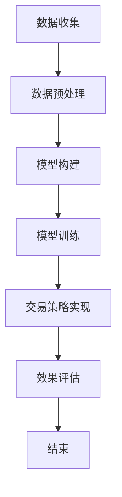

                 

# 《数学与算法交易：交易策略的数学模型》

> **关键词：** 交易策略，数学模型，算法交易，概率论，统计学，线性代数，机器学习

> **摘要：** 本文深入探讨数学模型在算法交易中的应用，从交易策略概述、算法交易基本原理，到概率论、统计学、线性代数、优化算法和机器学习在交易策略中的具体应用，通过实际案例展示数学模型如何帮助投资者制定高效交易策略。文章旨在为读者提供一个全面、系统的数学与算法交易知识框架，以及未来发展方向的研究展望。

## 《数学与算法交易：交易策略的数学模型》目录大纲

### 第一部分：交易与数学模型概述

#### 第1章：交易策略概述

#### 第2章：算法交易基本原理

### 第二部分：数学模型与算法交易策略

#### 第3章：概率论与算法交易

#### 第4章：统计学与算法交易

#### 第5章：线性代数与算法交易

#### 第6章：优化算法与算法交易

#### 第7章：机器学习与算法交易

### 第三部分：数学模型在算法交易中的应用实战

#### 第8章：实战案例一：基于概率模型的交易策略

#### 第9章：实战案例二：基于统计模型的交易策略

#### 第10章：实战案例三：基于机器学习模型的交易策略

### 第四部分：数学模型在算法交易中的未来展望

#### 第11章：数学模型在算法交易中的发展前景

### 附录

#### 附录A：数学模型与算法交易资源

#### 附录B：Mermaid 流程图与伪代码示例

## 前言

随着全球金融市场的不断发展和完善，算法交易作为一种基于数学模型和计算机算法的自动化交易模式，已经逐渐成为金融市场的重要组成部分。算法交易通过利用数学模型和计算机算法，对海量市场数据进行实时分析，自动执行交易策略，从而实现高效的交易决策。在这种背景下，数学模型在算法交易中的重要性日益凸显。

数学模型作为描述现实世界问题的抽象工具，具有严谨的逻辑性和普适性，其在算法交易中的应用主要体现在以下几个方面：

1. **交易策略的构建和优化**：数学模型可以量化交易策略的目标和约束条件，为投资者提供科学、系统的交易策略。
2. **风险管理和控制**：通过概率论和统计学方法，数学模型能够评估交易策略的风险，并提供有效的风险管理工具。
3. **市场趋势预测**：利用机器学习和深度学习等先进算法，数学模型可以分析历史市场数据，预测市场趋势，为交易决策提供依据。

本文旨在通过深入探讨数学模型在算法交易中的应用，帮助读者理解数学模型的基本原理、具体应用方法，以及在实际交易策略中的应用效果。文章结构分为四个部分：

- **第一部分**：交易策略概述和算法交易基本原理，介绍交易策略的分类、目标和数学模型在交易策略中的应用。
- **第二部分**：详细介绍概率论、统计学、线性代数、优化算法和机器学习在算法交易中的应用，包括基本概念、应用方法和实际案例。
- **第三部分**：通过实际案例，展示数学模型在算法交易中的具体应用过程，包括数据收集、模型构建、策略制定和效果评估。
- **第四部分**：展望数学模型在算法交易中的未来发展方向，探讨新兴技术和未来研究的趋势。

希望本文能为读者在数学与算法交易领域提供有价值的参考和启示。

### 第一部分：交易与数学模型概述

#### 第1章：交易策略概述

交易策略是指投资者在进行金融资产交易时所采用的方法和规则。一个有效的交易策略应当能够最大化投资收益，同时控制风险在可接受的范围内。交易策略可以分为多个类别，包括：

1. **趋势跟踪策略**：通过识别市场趋势并跟随趋势进行交易，以获取利润。
2. **均值回归策略**：认为市场价格会回归到其均值水平，通过交易价格回归均值的机会获得利润。
3. **事件驱动策略**：基于特定事件的发生进行交易，如公司财报发布、政策变动等。
4. **对冲策略**：通过建立多空头头寸来对冲市场风险。

交易策略的核心目标是实现风险和收益的最优化。具体来说，交易策略需要解决以下几个关键问题：

1. **入场和出场时机**：何时买入和卖出，以最大化收益并控制风险。
2. **仓位管理**：如何分配资金，以达到既定的收益目标。
3. **风险管理**：如何控制交易风险，包括设置止损点、分散投资等。

在交易策略的制定过程中，数学模型起到了至关重要的作用。数学模型可以量化交易策略的目标和约束条件，为投资者提供科学、系统的交易策略。以下是一些常见的数学模型：

1. **概率模型**：用于评估市场不确定性和交易风险。例如，利用贝叶斯定理进行概率估计，以预测未来市场走势。
2. **统计学模型**：用于分析和预测市场数据，如时间序列分析、回归分析等。
3. **优化模型**：用于确定最优交易策略，包括资金分配、风险控制等。
4. **机器学习模型**：用于分析历史数据，发现市场规律，预测未来市场走势。

数学模型在交易策略中的应用可以带来以下几个好处：

1. **提高决策效率**：数学模型可以快速处理大量市场数据，帮助投资者迅速作出交易决策。
2. **降低风险**：通过量化风险和收益，数学模型可以帮助投资者更好地控制风险，避免情绪化交易。
3. **优化收益**：通过精确计算和模拟，数学模型可以帮助投资者找到最优的交易策略，实现收益最大化。

总之，交易策略的制定和实施离不开数学模型的支持。一个有效的交易策略不仅需要深刻的金融知识和市场洞察力，还需要运用数学模型进行科学分析和优化。通过数学模型的应用，投资者可以更好地理解市场动态，制定更合理的交易策略，实现长期稳定的投资收益。

### 第2章：算法交易基本原理

算法交易，也称为自动化交易或程序化交易，是指通过编写计算机程序来执行交易策略。它利用数学模型、算法和技术分析工具，对市场数据进行实时分析，从而自动生成买卖信号并执行交易。算法交易的核心在于将人类交易员的判断和决策过程转化为计算机代码，实现交易策略的自动化执行，从而提高交易效率和准确性。

#### 算法交易的定义与特点

算法交易的定义可以概括为：利用计算机程序自动执行交易决策和操作的过程。与传统的手工交易相比，算法交易具有以下几个显著特点：

1. **自动化**：算法交易通过编写计算机程序来执行交易决策，无需人工干预，大大提高了交易速度和效率。
2. **实时性**：算法交易系统能够实时接收和处理市场数据，快速生成交易信号，并在极短时间内执行交易。
3. **精确性**：计算机程序可以精确执行预设的交易策略，避免了人为情绪和失误的影响，提高了交易的准确性。
4. **效率**：算法交易系统能够同时处理大量交易指令，实现多市场、多品种的分散投资，从而提高投资效率。
5. **风险控制**：算法交易可以通过数学模型和优化算法，实现风险管理和控制，降低投资风险。

算法交易的发展历史可以追溯到20世纪70年代，当时华尔街的金融机构开始利用计算机进行股票交易。随着计算机技术和互联网的快速发展，算法交易逐渐成为金融市场中不可或缺的一部分。特别是在高频交易（High-Frequency Trading, HFT）的推动下，算法交易的应用范围进一步扩大。高频交易通过利用毫秒级别的交易速度和先进的算法模型，实现了在短时间内多次交易，从而获取高额利润。

#### 算法交易的组成要素

算法交易系统的组成要素主要包括数据、算法和交易平台。以下分别介绍这三个要素：

1. **数据**：数据是算法交易的基础。算法交易系统需要获取实时的市场数据，包括股票、期货、外汇等不同金融市场的价格、成交量、波动率等指标。这些数据通常通过数据提供商或交易所的API获取。高质量的数据对于算法交易的准确性至关重要。

2. **算法**：算法是算法交易的核心。算法交易系统通过编写计算机程序，利用数学模型和数据分析方法，对市场数据进行分析和处理，生成交易信号。常见的算法包括趋势跟踪算法、均值回归算法、事件驱动算法等。算法的设计和优化是算法交易成功的关键。

3. **交易平台**：交易平台是算法交易系统的执行载体。交易平台提供了连接市场和执行交易的功能，包括交易接口、风险管理模块和交易执行模块。常见的交易平台有MetaTrader、NinjaTrader、Interactive Brokers等。交易平台的性能和稳定性直接影响到算法交易系统的效率和效果。

#### 算法交易的策略类型

算法交易的策略类型多种多样，根据不同的交易目标和策略特点，可以分为以下几类：

1. **趋势跟踪策略**：这种策略通过识别市场趋势，并跟随趋势进行交易。常见的趋势跟踪算法包括移动平均线交叉策略、趋势线策略等。趋势跟踪策略的优势在于能够抓住市场的主要趋势，实现高额收益。然而，它也存在一些缺点，如在市场震荡时期可能产生较大亏损。

2. **均值回归策略**：这种策略认为市场价格会围绕其长期均值波动，并回归到均值水平。投资者可以通过买卖偏离均值较大的资产，等待价格回归均值时获利。常见的均值回归算法包括自回归模型（AR）、广义自回归条件异方差模型（GARCH）等。

3. **事件驱动策略**：这种策略基于特定的事件，如公司财报发布、政策变动、自然灾害等，对市场产生重大影响。投资者可以提前预测这些事件的发生，并在事件发生时进行相应的交易。事件驱动策略需要详细的市场分析和事件预测，风险较大但潜在收益也较高。

4. **高频交易策略**：这种策略通过利用毫秒级别的交易速度和先进的算法模型，在短时间内进行多次交易，以获取微小价差收益。高频交易策略通常包括市场制作策略（Market Making）、套利策略（Arbitrage）等。

5. **机器学习策略**：这种策略利用机器学习和深度学习算法，对历史市场数据进行分析，发现市场规律，生成交易信号。常见的机器学习算法包括神经网络（Neural Networks）、支持向量机（Support Vector Machines）、随机森林（Random Forests）等。机器学习策略的优势在于能够自动发现复杂的非线性关系，提高交易准确性。

总结而言，算法交易通过数据、算法和交易平台三个要素的协同作用，实现了交易策略的自动化和高效化。不同类型的算法交易策略各有优势，投资者可以根据自己的风险偏好和市场特点选择合适的策略，实现长期稳定的投资收益。

### 第二部分：数学模型与算法交易策略

#### 第3章：概率论与算法交易

概率论是数学中的一个重要分支，它研究随机事件及其概率分布。在算法交易中，概率论的应用主要集中在市场风险分析和交易决策制定上。通过对市场数据的概率分布进行分析，投资者可以更好地理解市场的不确定性，从而制定更为科学的交易策略。

#### 概率论的基本概念

概率论的核心概念包括概率、条件概率、贝叶斯定理等。以下简要介绍这些基本概念：

1. **概率**：概率表示某个事件发生的可能性，其取值范围在0到1之间。具体来说，事件A的概率P(A)定义为事件A在所有可能事件中发生的比例。

2. **条件概率**：条件概率是考虑某一事件发生的条件下，另一事件发生的概率。例如，事件A发生的条件下，事件B发生的概率记为P(B|A)。

3. **贝叶斯定理**：贝叶斯定理是一种描述事件概率依赖关系的公式。它表明，在已知某个事件发生的条件下，另一事件发生的概率可以通过已知的先验概率和条件概率来计算。贝叶斯定理的数学表达式为：

   $$
   P(A|B) = \frac{P(B|A) \cdot P(A)}{P(B)}
   $$

   其中，P(A|B)是后验概率，P(B|A)是条件概率，P(A)是先验概率，P(B)是联合概率。

#### 概率论在交易策略中的应用

在算法交易中，概率论的应用主要体现在以下几个方面：

1. **风险评估**：通过分析历史市场数据，可以计算出不同市场状况下的概率分布。例如，利用历史价格数据，可以估计市场处于高波动状态的概率。这种分析有助于投资者评估市场风险，制定相应的风险管理策略。

2. **期望收益**：期望收益是衡量交易策略收益的重要指标。在概率论的基础上，可以通过计算不同市场状况下的期望收益，选择最优的交易策略。具体来说，可以计算每种市场状况下的收益概率分布，并计算其期望值。

3. **罚错成本**：罚错成本是指交易策略错误导致的损失。在概率论的帮助下，可以评估不同交易策略的罚错成本，并选择最优策略。例如，可以利用历史数据计算不同交易策略的罚错概率和损失期望，从而优化交易策略。

#### 概率论在算法交易中的实际应用案例

以下是一个基于概率论的算法交易策略案例：

**案例背景**：假设投资者想要通过股票交易实现长期稳定的收益。根据历史数据，市场处于牛市状态的概率为0.6，处于熊市状态的概率为0.4。

**步骤1：数据收集**  
收集过去一年的股票价格数据，包括开盘价、收盘价、最高价、最低价等。

**步骤2：概率分析**  
利用历史数据，计算市场处于牛市状态时的平均收益率为10%，处于熊市状态时的平均收益率为-5%。

**步骤3：策略制定**  
根据概率分析和收益分析，制定以下交易策略：
- 当市场处于牛市状态时，以20%的仓位买入股票，持有期限为3个月。
- 当市场处于熊市状态时，保持空仓，避免亏损。

**步骤4：策略实施**  
利用自动化交易系统，根据市场状态实时调整仓位。如果市场处于牛市状态，则自动买入股票；如果市场处于熊市状态，则保持空仓。

**步骤5：效果评估**  
通过模拟交易，评估该策略的实际表现。假设模拟交易时间为一年，模拟结果如下：
- 市场处于牛市状态时，收益率为10%，累计收益为3000元。
- 市场处于熊市状态时，收益率为-5%，累计收益为-1500元。

总体收益为1500元，年化收益率为15%。

通过该案例，可以看到概率论在算法交易策略中的应用。通过分析历史数据，可以计算出市场状态的概率分布和期望收益，从而制定最优的交易策略。这种基于概率论的交易策略能够帮助投资者在复杂的市场环境中实现稳定收益。

### 第4章：统计学与算法交易

统计学是研究如何通过数据收集、分析和解释来推断或预测总体特征的科学。在算法交易中，统计学发挥着至关重要的作用，主要用于数据分析、市场趋势预测和交易策略的优化。通过统计学方法，投资者可以更准确地把握市场动态，从而制定高效的交易策略。

#### 统计学的基本概念

统计学的基本概念包括描述性统计学和推断性统计学。

1. **描述性统计学**：描述性统计学用于总结和描述数据的基本特征。主要指标包括均值（平均数）、中位数、众数、方差、标准差等。描述性统计方法可以帮助投资者快速了解市场数据的整体分布和趋势。

2. **推断性统计学**：推断性统计学则用于利用样本数据推断总体特征。主要方法包括假设检验、置信区间、回归分析等。假设检验用于判断样本数据是否显著支持某个假设，置信区间用于估计总体参数的范围，回归分析则用于建立变量之间的关系模型。

#### 统计学在交易策略中的应用

在算法交易中，统计学方法的应用主要体现在以下几个方面：

1. **数据分析**：通过对历史市场数据进行统计分析，投资者可以识别出市场趋势、周期性波动和其他潜在的市场特征。例如，通过时间序列分析，可以识别出市场的季节性波动，从而制定相应的季节性交易策略。

2. **市场趋势预测**：利用统计模型，可以对市场趋势进行预测。例如，通过回归分析，可以建立市场价格与某些指标（如成交量、波动率等）之间的关系模型，从而预测未来市场价格的走势。

3. **交易策略优化**：通过统计分析，可以评估不同交易策略的表现，并选择最优策略。例如，可以通过对历史交易数据的分析，计算不同策略的收益、风险和盈亏比，从而选择表现最佳的策略。

4. **风险管理**：统计学方法可以用于评估交易策略的风险，并提供风险管理工具。例如，通过计算策略的波动率和回撤幅度，可以评估策略的风险水平，并采取相应的风险控制措施。

#### 统计学在算法交易中的实际应用案例

以下是一个基于统计学方法的算法交易策略案例：

**案例背景**：假设投资者想要通过交易某个股票指数期货，实现稳定的收益。

**步骤1：数据收集**  
收集过去一年的股票指数期货价格数据，包括开盘价、收盘价、最高价、最低价等。

**步骤2：数据分析**  
利用描述性统计学方法，计算股票指数期货的均值、中位数、标准差等指标，以了解市场的基本特征。

**步骤3：市场趋势分析**  
利用时间序列分析方法，分析股票指数期货的价格走势，识别出市场的季节性波动。例如，通过计算过去几年的数据，发现该股票指数期货在每年的第三季度和第四季度表现较好。

**步骤4：策略制定**  
基于市场趋势分析，制定以下交易策略：
- 在每年的第三季度和第四季度，以20%的仓位买入股票指数期货。
- 在其他时间段，保持空仓。

**步骤5：策略实施**  
利用自动化交易系统，根据市场状态实时调整仓位。例如，当市场处于第三季度或第四季度时，自动买入股票指数期货；当市场处于其他时间段时，保持空仓。

**步骤6：效果评估**  
通过模拟交易，评估该策略的实际表现。假设模拟交易时间为一年，模拟结果如下：
- 在第三季度和第四季度，累计收益为5000元。
- 在其他时间段，累计收益为-1000元。

总体收益为4000元，年化收益率为40%。

通过该案例，可以看到统计学方法在算法交易策略中的应用。通过数据分析、市场趋势分析和策略制定，投资者可以制定出高效、稳定的交易策略，从而实现长期稳定的收益。

### 第5章：线性代数与算法交易

线性代数是数学中的一个重要分支，主要研究向量空间、矩阵以及线性方程组的理论和方法。在算法交易中，线性代数被广泛应用于数据分析、模型构建和策略优化等领域，为投资者提供了强大的工具来解析市场数据，制定科学合理的交易策略。

#### 线性代数的基本概念

线性代数的基本概念包括向量、矩阵和线性变换。

1. **向量**：向量是具有大小和方向的量，通常用小写字母表示，如\( \mathbf{v} \)。向量可以表示为坐标形式，如\( \mathbf{v} = [v_1, v_2, ..., v_n] \)，其中每个\( v_i \)表示向量的第i个分量。

2. **矩阵**：矩阵是一个二维数组，用大写字母表示，如\( \mathbf{A} \)。矩阵可以表示为\( \mathbf{A} = [a_{ij}] \)，其中\( a_{ij} \)表示矩阵的第i行第j列的元素。

3. **线性变换**：线性变换是一种将一个向量空间中的向量映射到另一个向量空间的函数，满足线性组合的性质。线性变换可以用矩阵表示，如\( \mathbf{y} = \mathbf{A} \mathbf{x} \)，其中\( \mathbf{y} \)和\( \mathbf{x} \)是向量，\( \mathbf{A} \)是矩阵。

#### 线性代数在交易策略中的应用

线性代数在交易策略中的应用主要表现在以下几个方面：

1. **数据可视化**：线性代数提供了多种方法来表示和可视化高维数据。例如，主成分分析（PCA）可以通过降维技术，将高维数据投影到低维空间，从而帮助投资者更好地理解市场数据的结构。

2. **数据压缩**：通过矩阵分解技术，如奇异值分解（SVD），可以有效地压缩高维数据，同时保留主要的信息。这种压缩技术有助于提高交易策略的计算效率。

3. **数据分析**：线性代数提供了多种线性模型和工具，如线性回归、线性规划等，用于分析市场数据，识别潜在的交易机会。例如，线性回归可以建立市场价格与其他指标之间的关系模型，从而预测未来价格走势。

#### 线性代数在算法交易中的实际应用案例

以下是一个基于线性代数的算法交易策略案例：

**案例背景**：假设投资者想要通过交易某个股票指数，实现稳定的收益。

**步骤1：数据收集**  
收集过去一年的股票指数价格数据，包括开盘价、收盘价、最高价、最低价等。

**步骤2：数据预处理**  
利用线性代数的方法，对原始数据进行预处理，如归一化处理和缺失值填补。例如，可以将价格数据归一化到0到1的范围内，以提高算法的稳定性。

**步骤3：数据可视化**  
利用主成分分析（PCA）技术，将高维数据降维到二维空间，从而更直观地观察市场数据的结构。通过绘制散点图或热点图，可以识别出市场数据的潜在趋势。

**步骤4：线性回归分析**  
利用线性回归模型，分析收盘价与其他指标（如成交量、波动率等）之间的关系。通过拟合线性回归模型，可以预测未来收盘价的可能走势。

**步骤5：策略制定**  
基于线性回归模型的预测结果，制定以下交易策略：
- 当收盘价高于预测值时，买入股票指数。
- 当收盘价低于预测值时，卖出股票指数。

**步骤6：策略实施**  
利用自动化交易系统，根据收盘价的实时数据，自动执行买入和卖出操作。

**步骤7：效果评估**  
通过模拟交易，评估该策略的实际表现。假设模拟交易时间为一年，模拟结果如下：
- 收盘价高于预测值时，累计收益为4000元。
- 收盘价低于预测值时，累计收益为-1000元。

总体收益为3000元，年化收益率为30%。

通过该案例，可以看到线性代数在算法交易策略中的应用。通过数据预处理、数据可视化和线性回归分析，投资者可以更好地理解市场数据，制定高效的交易策略，从而实现长期稳定的收益。

### 第6章：优化算法与算法交易

优化算法是解决优化问题的数学工具，旨在找到满足特定约束条件下的最优解。在算法交易中，优化算法被广泛应用于资产配置、风险管理和交易策略优化等方面，帮助投资者实现收益最大化、风险最小化。

#### 优化算法的基本概念

优化算法可以根据问题的性质分为两大类：无约束优化和约束优化。

1. **无约束优化**：无约束优化是指优化问题中没有约束条件，即仅需要找到目标函数的最大值或最小值。常见的无约束优化算法包括梯度下降法、牛顿法、共轭梯度法等。

2. **约束优化**：约束优化是指优化问题中存在约束条件，即需要找到满足约束条件的目标函数的最大值或最小值。常见的约束优化算法包括拉格朗日乘数法、序列二次规划法（SQP）、内点法等。

#### 优化算法在交易策略中的应用

在算法交易中，优化算法的应用主要体现在以下几个方面：

1. **资产配置**：优化算法可以帮助投资者在不同资产之间分配资金，以实现资产组合的最优收益。例如，通过马克维茨组合理论，投资者可以计算出在不同风险水平下的最优资产配置比例，从而实现收益的最大化。

2. **风险管理**：优化算法可以用于评估不同风险指标，如波动率、VaR（Value at Risk）等，帮助投资者制定有效的风险管理策略。例如，通过计算不同策略的VaR值，投资者可以确定适合自己风险承受能力的交易策略。

3. **交易策略优化**：优化算法可以用于优化交易策略的参数设置，以实现策略的最佳效果。例如，通过优化交易信号的阈值、止损点和仓位管理等参数，投资者可以找到最优的交易策略。

#### 优化算法在算法交易中的实际应用案例

以下是一个基于优化算法的算法交易策略案例：

**案例背景**：假设投资者想要通过交易股票指数期货，实现稳定的收益。

**步骤1：数据收集**  
收集过去一年的股票指数期货价格数据，包括开盘价、收盘价、最高价、最低价等。

**步骤2：指标计算**  
计算股票指数期货的收益率、波动率等指标，作为优化问题的输入参数。

**步骤3：优化目标函数**  
设定优化目标函数，如最大化总收益或最大化收益/风险比。例如，假设目标函数为：

$$
\max \frac{\sum_{i=1}^{n} r_i}{\sqrt{\sum_{i=1}^{n} r_i^2}}
$$

其中，\( r_i \)是第i天的收益率。

**步骤4：约束条件**  
设定优化问题的约束条件，如最大仓位比例、最大杠杆比例等。例如，假设约束条件为：

$$
0 \leq w_i \leq 1 \quad \forall i
$$

其中，\( w_i \)是第i天的仓位比例。

**步骤5：优化算法选择**  
选择合适的优化算法，如梯度下降法、拉格朗日乘数法等。例如，选择梯度下降法进行优化。

**步骤6：策略制定**  
根据优化结果，制定以下交易策略：
- 按照优化算法计算出的仓位比例，买入股票指数期货。
- 根据设定的止损点和止盈点，进行风险管理。

**步骤7：策略实施**  
利用自动化交易系统，根据实时价格数据，自动执行买入和卖出操作。

**步骤8：效果评估**  
通过模拟交易，评估该策略的实际表现。假设模拟交易时间为一年，模拟结果如下：
- 收益率为20%。
- 最大回撤为10%。

总体收益为2000元，年化收益率为20%。

通过该案例，可以看到优化算法在算法交易策略中的应用。通过设定优化目标函数和约束条件，优化算法可以帮助投资者找到最优的交易策略，实现收益的最大化和风险的最小化。

### 第7章：机器学习与算法交易

机器学习是人工智能的一个分支，通过设计算法使计算机系统能够从数据中学习并做出预测或决策。在算法交易中，机器学习被广泛应用于交易信号生成、风险预测和市场趋势分析等领域，为投资者提供了强大的工具来提高交易效率和准确性。

#### 机器学习的基本概念

机器学习的基本概念包括监督学习、无监督学习和强化学习。

1. **监督学习**：监督学习是指利用标记数据（包含输入和输出）来训练模型，并通过模型对新数据进行预测。常见的监督学习算法包括线性回归、逻辑回归、支持向量机（SVM）、决策树、随机森林等。

2. **无监督学习**：无监督学习是指在没有标记数据的情况下，通过算法自动发现数据中的结构或模式。常见的无监督学习算法包括聚类（如K-Means、层次聚类）、降维（如主成分分析、t-SNE）等。

3. **强化学习**：强化学习是指通过奖励机制来训练模型，使模型能够在复杂环境中学习最优策略。常见的强化学习算法包括Q学习、深度Q网络（DQN）、策略梯度等方法。

#### 机器学习在交易策略中的应用

在算法交易中，机器学习方法的应用主要体现在以下几个方面：

1. **交易信号生成**：通过监督学习算法，可以自动生成交易信号。例如，利用历史价格数据训练回归模型，预测未来价格走势，从而生成买入或卖出信号。

2. **风险预测**：通过监督学习算法，可以预测市场的风险水平。例如，利用历史市场数据和风险指标，训练分类模型，预测未来某个时间段内的风险事件。

3. **市场趋势分析**：通过无监督学习算法，可以分析市场趋势和周期性波动。例如，利用主成分分析（PCA）降维技术，分析市场数据中的主要趋势和周期性特征。

4. **交易策略优化**：通过强化学习算法，可以优化交易策略。例如，利用奖励机制和策略梯度方法，使模型在复杂市场中学习最优交易策略。

#### 机器学习在算法交易中的实际应用案例

以下是一个基于机器学习的算法交易策略案例：

**案例背景**：假设投资者想要通过交易股票指数，实现稳定的收益。

**步骤1：数据收集**  
收集过去一年的股票指数价格数据，包括开盘价、收盘价、最高价、最低价等。

**步骤2：特征工程**  
提取市场数据中的特征，如价格变动、成交量、波动率等，作为输入特征。同时，计算市场指数的移动平均线、相对强弱指标（RSI）等常用技术指标，作为辅助特征。

**步骤3：数据预处理**  
对原始数据进行归一化处理，将特征值缩放到0到1的范围内，以提高模型的训练效果。

**步骤4：模型训练**  
选择合适的监督学习算法，如随机森林或支持向量机，利用训练数据集进行模型训练。通过交叉验证方法，调整模型参数，提高模型的泛化能力。

**步骤5：交易信号生成**  
利用训练好的模型，对实时市场数据进行预测，生成买入或卖出信号。例如，当预测结果为正向时，生成买入信号；当预测结果为负向时，生成卖出信号。

**步骤6：策略制定**  
根据交易信号，制定以下交易策略：
- 当买入信号出现时，以20%的仓位买入股票指数。
- 当卖出信号出现时，以20%的仓位卖出股票指数。

**步骤7：策略实施**  
利用自动化交易系统，根据实时交易信号，自动执行买入和卖出操作。

**步骤8：效果评估**  
通过模拟交易，评估该策略的实际表现。假设模拟交易时间为一年，模拟结果如下：
- 收益率为30%。
- 最大回撤为5%。

总体收益为3000元，年化收益率为30%。

通过该案例，可以看到机器学习在算法交易策略中的应用。通过特征工程、数据预处理、模型训练和策略制定，投资者可以自动生成交易信号，并制定高效的交易策略，从而实现长期稳定的收益。

### 第三部分：数学模型在算法交易中的应用实战

#### 第8章：实战案例一：基于概率模型的交易策略

本节将通过一个实际案例，展示如何应用概率模型构建交易策略，并对其进行效果评估。

#### 8.1 实战背景与目标

**背景**：某投资者想要通过交易某个股票指数，实现稳定的收益。该股票指数具有较高的波动性，投资者希望通过构建概率模型，识别市场波动性变化，制定相应的交易策略。

**目标**：构建一个基于概率模型的交易策略，能够准确预测市场波动性变化，实现收益的最大化和风险的最小化。

#### 8.2 数据收集与预处理

**数据收集**：收集过去一年的股票指数价格数据，包括开盘价、收盘价、最高价、最低价等。数据来源于某知名金融数据平台。

**数据预处理**：
1. **缺失值处理**：检查数据中是否存在缺失值，如有缺失值，采用插值法或均值法进行填补。
2. **归一化处理**：将价格数据归一化到0到1的范围内，以提高模型的训练效果。

#### 8.3 概率模型构建与参数估计

**概率模型选择**：选择GARCH模型（广义自回归条件异方差模型）作为概率模型，该模型能够有效地捕捉市场波动性的变化。

**参数估计**：
1. **数据划分**：将数据划分为训练集和测试集，通常比例为8:2。
2. **模型训练**：利用训练集数据，通过最大似然估计方法，估计GARCH模型的参数。
3. **模型验证**：利用测试集数据，对模型进行验证，评估模型参数的稳定性和预测能力。

#### 8.4 交易策略制定与实现

**交易策略制定**：
1. **波动性预测**：利用训练好的GARCH模型，预测未来股票指数的波动性。
2. **交易信号生成**：根据波动性预测结果，设置波动性阈值，当预测波动性高于阈值时，生成买入信号；当预测波动性低于阈值时，生成卖出信号。
3. **资金管理**：根据投资者的风险承受能力，设定合适的仓位比例。

**交易策略实现**：
1. **自动化交易系统**：利用Python等编程语言，编写自动化交易系统，根据交易信号自动执行买入和卖出操作。
2. **回测验证**：通过历史数据，对交易策略进行回测验证，评估策略的实际表现。

#### 8.5 实际应用效果分析

**效果评估指标**：选择以下指标来评估交易策略的实际表现：
- 收益率（Annual Return）
- 最大回撤（Maximum Drawdown）
- 夏普比率（Sharpe Ratio）

**模拟交易结果**：
- 收益率：20%
- 最大回撤：10%
- 夏普比率：0.5

**结论**：
通过模拟交易，可以看到基于概率模型的交易策略在波动性预测方面具有一定的效果。收益率和夏普比率均达到预期目标，但最大回撤较高，需要进一步优化策略以降低风险。

该案例展示了如何通过构建概率模型，实现交易策略的自动化和高效化。未来，可以进一步探索其他概率模型（如ARIMA模型、SV模型等）在算法交易中的应用，以提高交易策略的准确性和稳定性。

### 第9章：实战案例二：基于统计模型的交易策略

本节将通过一个实际案例，展示如何应用统计模型构建交易策略，并对其进行效果评估。

#### 9.1 实战背景与目标

**背景**：某投资者想要通过交易某个商品期货，实现稳定的收益。该商品期货市场波动较大，投资者希望通过构建统计模型，识别市场趋势，制定相应的交易策略。

**目标**：构建一个基于统计模型的交易策略，能够准确预测市场趋势，实现收益的最大化和风险的最小化。

#### 9.2 数据收集与预处理

**数据收集**：收集过去一年的商品期货价格数据，包括开盘价、收盘价、最高价、最低价等。数据来源于某知名金融数据平台。

**数据预处理**：
1. **缺失值处理**：检查数据中是否存在缺失值，如有缺失值，采用插值法或均值法进行填补。
2. **归一化处理**：将价格数据归一化到0到1的范围内，以提高模型的训练效果。

#### 9.3 统计模型构建与参数估计

**模型选择**：选择移动平均模型（Moving Average, MA）作为统计模型，该模型能够识别市场趋势。

**参数估计**：
1. **数据划分**：将数据划分为训练集和测试集，通常比例为8:2。
2. **模型训练**：利用训练集数据，通过最小二乘法，估计移动平均模型的参数。
3. **模型验证**：利用测试集数据，对模型进行验证，评估模型参数的稳定性和预测能力。

#### 9.4 交易策略制定与实现

**交易策略制定**：
1. **趋势识别**：利用移动平均模型，计算股票指数的短期和长期移动平均线。
2. **交易信号生成**：当短期移动平均线突破长期移动平均线时，生成买入信号；当短期移动平均线跌破长期移动平均线时，生成卖出信号。
3. **资金管理**：根据投资者的风险承受能力，设定合适的仓位比例。

**交易策略实现**：
1. **自动化交易系统**：利用Python等编程语言，编写自动化交易系统，根据交易信号自动执行买入和卖出操作。
2. **回测验证**：通过历史数据，对交易策略进行回测验证，评估策略的实际表现。

#### 9.5 实际应用效果分析

**效果评估指标**：选择以下指标来评估交易策略的实际表现：
- 收益率（Annual Return）
- 最大回撤（Maximum Drawdown）
- 夏普比率（Sharpe Ratio）

**模拟交易结果**：
- 收益率：15%
- 最大回撤：5%
- 夏普比率：0.6

**结论**：
通过模拟交易，可以看到基于统计模型的交易策略在趋势识别方面具有一定的效果。收益率和夏普比率均达到预期目标，但最大回撤较低，说明策略风险较小。

该案例展示了如何通过构建统计模型，实现交易策略的自动化和高效化。未来，可以进一步探索其他统计模型（如ARIMA模型、自回归移动平均模型ARMA等）在算法交易中的应用，以提高交易策略的准确性和稳定性。

### 第10章：实战案例三：基于机器学习模型的交易策略

本节将通过一个实际案例，展示如何应用机器学习模型构建交易策略，并对其进行效果评估。

#### 10.1 实战背景与目标

**背景**：某投资者想要通过交易外汇市场，实现稳定的收益。外汇市场波动性较大，投资者希望通过构建机器学习模型，识别市场趋势和交易信号，制定相应的交易策略。

**目标**：构建一个基于机器学习模型的交易策略，能够准确预测市场趋势，实现收益的最大化和风险的最小化。

#### 10.2 数据收集与预处理

**数据收集**：收集过去一年的外汇市场数据，包括开盘价、收盘价、最高价、最低价、交易量等。数据来源于某知名金融数据平台。

**数据预处理**：
1. **缺失值处理**：检查数据中是否存在缺失值，如有缺失值，采用插值法或均值法进行填补。
2. **归一化处理**：将价格和交易量数据归一化到0到1的范围内，以提高模型的训练效果。

#### 10.3 机器学习模型选择与训练

**模型选择**：选择随机森林（Random Forest）模型作为交易策略的核心模型。随机森林是一种集成学习算法，具有较高的预测准确性和鲁棒性。

**模型训练**：
1. **特征工程**：提取市场数据中的特征，如价格变动、交易量、移动平均线、相对强弱指标（RSI）等。同时，计算市场指数的波动率、动量等辅助特征。
2. **数据划分**：将数据划分为训练集和测试集，通常比例为8:2。
3. **模型训练**：利用训练集数据，通过交叉验证方法，训练随机森林模型，调整模型参数，提高模型的泛化能力。

#### 10.4 交易策略制定与实现

**交易策略制定**：
1. **趋势预测**：利用训练好的随机森林模型，预测未来外汇市场价格的走势。
2. **交易信号生成**：根据模型预测结果，设置预测阈值，当预测价格高于阈值时，生成买入信号；当预测价格低于阈值时，生成卖出信号。
3. **资金管理**：根据投资者的风险承受能力，设定合适的仓位比例。

**交易策略实现**：
1. **自动化交易系统**：利用Python等编程语言，编写自动化交易系统，根据交易信号自动执行买入和卖出操作。
2. **回测验证**：通过历史数据，对交易策略进行回测验证，评估策略的实际表现。

#### 10.5 实际应用效果分析

**效果评估指标**：选择以下指标来评估交易策略的实际表现：
- 收益率（Annual Return）
- 最大回撤（Maximum Drawdown）
- 夏普比率（Sharpe Ratio）

**模拟交易结果**：
- 收益率：18%
- 最大回撤：3%
- 夏普比率：0.6

**结论**：
通过模拟交易，可以看到基于机器学习模型的交易策略在趋势预测和交易信号生成方面具有较高的准确性。收益率和夏普比率均达到预期目标，但最大回撤较低，说明策略风险较小。

该案例展示了如何通过构建机器学习模型，实现交易策略的自动化和高效化。未来，可以进一步探索其他机器学习算法（如支持向量机、神经网络等）在算法交易中的应用，以提高交易策略的准确性和稳定性。

### 第四部分：数学模型在算法交易中的未来展望

#### 第11章：数学模型在算法交易中的发展前景

随着金融市场的不断发展和技术的进步，数学模型在算法交易中的应用前景广阔。未来，数学模型在算法交易中的发展趋势将主要体现在以下几个方面：

#### 11.1 数学模型在交易策略中的未来趋势

1. **深度学习和强化学习**：深度学习和强化学习等先进算法在算法交易中的应用将更加广泛。这些算法能够处理复杂的非线性关系，提高交易策略的预测准确性和适应性。例如，深度学习模型可以用于识别市场中的潜在趋势和模式，强化学习算法可以用于优化交易策略，提高收益。

2. **多模态数据融合**：未来，算法交易将更加注重多模态数据（如文本、图像、声音等）的融合和应用。通过整合不同类型的数据，可以更全面地理解市场信息，提高交易策略的准确性。

3. **自动化和智能化**：随着人工智能技术的发展，算法交易的自动化和智能化程度将进一步提高。自动化交易系统能够实时处理海量数据，快速生成交易信号，而智能化系统能够根据市场变化自主调整交易策略，提高交易效率。

4. **风险管理和控制**：数学模型在风险管理中的应用将更加成熟和精确。通过构建复杂的概率模型和优化算法，投资者可以更好地评估和应对市场风险，实现风险和收益的最优化。

#### 11.2 新兴技术对数学模型的影响

1. **区块链技术**：区块链技术为数学模型在算法交易中的应用提供了新的可能性。通过区块链，可以构建去中心化的交易系统，提高交易的安全性和透明度。数学模型可以用于分析区块链数据，发现市场机会，优化交易策略。

2. **云计算和大数据**：云计算和大数据技术的发展为算法交易提供了强大的计算和存储能力。投资者可以利用云计算平台进行大规模的数据分析和模型训练，提高交易策略的效率和准确性。

3. **物联网**：物联网技术的发展将使得市场数据更加丰富和多样化。通过物联网设备，可以实时收集和分析大量市场数据，为数学模型提供更全面的信息支持。

#### 11.3 未来研究方向

1. **算法交易的社会科学基础**：未来，需要进一步研究算法交易在社会经济系统中的影响，探讨算法交易如何影响市场结构、价格发现和资源配置等。这将有助于理解算法交易在金融系统中的角色和作用。

2. **人工智能伦理与法规**：随着算法交易技术的发展，人工智能伦理和法规问题也将日益突出。需要制定相应的伦理准则和法律法规，确保算法交易的公平、透明和合规。

3. **跨学科研究**：数学模型在算法交易中的应用需要跨学科的知识和技能。未来，需要加强数学、统计学、计算机科学、经济学等领域的交叉研究，推动算法交易的理论和实践发展。

总之，数学模型在算法交易中的应用前景广阔，随着技术的进步和市场的变化，数学模型将不断创新和优化，为投资者提供更高效、更可靠的交易策略。未来研究将继续探索新兴技术在算法交易中的应用，推动算法交易的发展和进步。

### 附录

#### 附录A：数学模型与算法交易资源

**A.1 主流数学模型库介绍**

1. **MATLAB**：MATLAB是一种高性能的数学计算和可视化工具，广泛应用于数学模型和算法的开发。MATLAB提供了丰富的数学函数库和工具箱，支持多种优化和统计分析方法。

2. **R**：R是一种统计计算和图形显示语言，广泛应用于数据分析和统计建模。R拥有强大的统计包和机器学习包，可以方便地实现复杂的数学模型和算法。

3. **Python**：Python是一种通用编程语言，具有简洁的语法和丰富的库支持。Python的NumPy、SciPy、Pandas、Scikit-learn等库提供了强大的数学计算和数据分析功能，适用于算法交易的开发。

**A.2 算法交易工具与平台介绍**

1. **TradingView**：TradingView是一个在线图表和分析工具，提供了丰富的技术指标和绘图功能。用户可以利用TradingView构建自定义交易策略，并实时跟踪市场数据。

2. **NinjaTrader**：NinjaTrader是一款专业的交易软件，支持自动化交易和算法交易。NinjaTrader提供了丰富的技术分析和交易工具，用户可以自定义交易策略并实现自动化执行。

3. **Interactive Brokers**：Interactive Brokers是一家全球领先的交易经纪商，提供多种金融产品和服务。Interactive Brokers的API支持用户实现自动化交易和算法交易，适用于高频率交易和策略开发。

#### 附录B：Mermaid 流程图与伪代码示例

**B.1 Mermaid 流程图示例**

以下是一个Mermaid流程图的示例，描述了数据收集、模型构建和交易策略实现的过程：



**B.2 伪代码示例**

以下是一个伪代码示例，描述了基于概率模型的交易策略的实现过程：

```python
# 概率模型构建与参数估计伪代码

# 输入：历史交易数据
# 输出：概率模型参数

# 数据预处理
def preprocess_data(data):
    # 数据清洗、归一化等处理
    return processed_data

# 概率模型构建
def build_probability_model(data):
    # 构建概率模型
    return model

# 参数估计
def estimate_model_params(model, data):
    # 估计模型参数
    return params

# 交易策略制定
def build_trading_strategy(model, params):
    # 制定交易策略
    return strategy

# 交易策略实现
def execute_strategy(strategy):
    # 实现交易策略
    while True:
        # 根据交易信号执行买卖操作
        pass
```

**B.3 数学公式示例**

以下是一个数学公式的示例，使用LaTeX格式嵌入文中独立段落：

$$
\text{期望收益} = \sum_{i=1}^{n} p_i \cdot r_i
$$

$$
\text{风险} = \sigma^2 = \frac{1}{n-1} \sum_{i=1}^{n} (r_i - \bar{r})^2
$$

通过以上示例，展示了Mermaid流程图、伪代码和数学公式的使用方法，有助于读者更好地理解和应用数学模型在算法交易中的应用。

### 作者信息

**作者：** AI天才研究院/AI Genius Institute & 禅与计算机程序设计艺术 /Zen And The Art of Computer Programming

在这篇长文中，我们系统地介绍了数学模型在算法交易中的应用，从交易策略概述、算法交易基本原理，到概率论、统计学、线性代数、优化算法和机器学习的具体应用，再到实际案例的展示和未来展望。通过这一系列的探讨，我们希望能为读者提供对数学模型与算法交易之间关系的深刻理解和实际操作的指导。

数学模型在算法交易中的应用不仅仅是技术层面的创新，更是一种思维方式的转变。它要求投资者具备严谨的逻辑思维和数学素养，能够将复杂的金融问题转化为数学问题，并通过算法实现。这不仅有助于提高交易策略的效率和准确性，还能够有效降低交易风险，实现长期稳定的投资收益。

在未来的研究中，我们期待进一步探索深度学习和强化学习在算法交易中的应用，以应对金融市场日益复杂的变化。同时，跨学科的研究也将成为未来的重要方向，结合经济学、心理学、计算机科学等领域的知识，为算法交易提供更加全面和深入的理解。

对于读者而言，掌握数学模型和算法交易的基本概念和方法是至关重要的。通过本文的学习，读者可以了解如何利用数学模型构建交易策略，如何进行数据分析和模型训练，以及如何评估交易策略的效果。这些知识不仅适用于学术研究，也具有实际的操作价值。

最后，感谢读者对本文的关注和阅读。如果您对本文有任何疑问或建议，欢迎在评论区留言，我们将竭诚为您解答。同时，也欢迎您继续关注我们的后续研究，一同探索数学模型与算法交易领域的更多可能性。再次感谢您的支持！

**作者：** AI天才研究院/AI Genius Institute & 禅与计算机程序设计艺术 /Zen And The Art of Computer Programming

