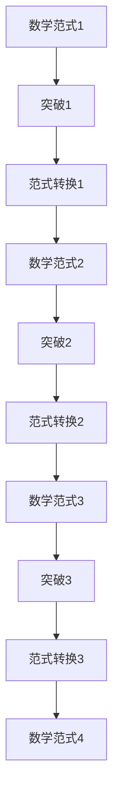

                 

# 《数学史上的重大突破与范式转换》

## 关键词
- 数学史
- 范式转换
- 数学突破
- 非欧几何
- 极限理论
- 量子力学
- 逻辑主义

## 摘要
本文将回顾数学史上的重大突破与范式转换，从早期数学发展、中世纪与文艺复兴时期的数学、17-18世纪的数学革命，到19-20世纪的数学突破，逐一探讨每一个阶段的核心成就和影响。我们将深入分析几何学、微积分、量子力学等领域的重大突破，以及逻辑主义与形式主义的兴起。最后，本文将探讨数学范式的定义与特征，以及当代数学研究的新趋势，展望数学的未来。

### 《数学史上的重大突破与范式转换》目录大纲

## 第一部分：数学史概述

### 1.1 数学史的起源与早期发展
#### 1.1.1 古埃及与巴比伦的数学成就
#### 1.1.2 古希腊数学的兴起

### 1.2 中世纪与文艺复兴时期的数学
#### 1.2.1 阿拉伯数学的传承
#### 1.2.2 文艺复兴时期的数学发展

### 1.3 17-18世纪的数学革命
#### 1.3.1 微积分的创立
#### 1.3.2 拉格朗日与牛顿的理论体系

### 1.4 19-20世纪的数学突破
#### 1.4.1 集合论与公理化方法的兴起
#### 1.4.2 代数几何的进展

## 第二部分：重大突破与范式转换

### 2.1 几何学的变革
#### 2.1.1 欧氏几何与非欧几何
#### 2.1.2 默比乌斯带与克莱因瓶

### 2.2 微积分与极限理论的完善
#### 2.2.1 微积分基本定理的证明
#### 2.2.2 极限概念的发展与应用

### 2.3 量子力学的数学基础
#### 2.3.1 波函数与态叠加原理
#### 2.3.2 算子理论在量子力学中的应用

### 2.4 逻辑主义与形式主义
#### 2.4.1 皮亚诺公理体系
#### 2.4.2 谢尔宾斯基集合与悖论问题

### 2.5 代数学的进步
#### 2.5.1 代数基本定理的证明
#### 2.5.2 集合论的抽象代数化

### 2.6 数学模型在经济学中的应用
#### 2.6.1 市场均衡理论
#### 2.6.2 动态系统理论

## 第三部分：范式转换与数学未来

### 3.1 数学范式的定义与特征
#### 3.1.1 范式的概念
#### 3.1.2 数学范式转换的影响

### 3.2 当代数学研究的新趋势
#### 3.2.1 复杂系统理论
#### 3.2.2 信息论与编码理论

### 3.3 数学与计算机科学的交融
#### 3.3.1 图灵机与可计算性
#### 3.3.2 数值计算与算法优化

### 3.4 数学未来的展望
#### 3.4.1 大数据时代的数学挑战
#### 3.4.2 人工智能与数学的结合

## 附录

### 附录 A：数学史相关资源
#### A.1 数学史经典著作推荐
#### A.2 在线数学史资源

### 附录 B：数学范式转换的Mermaid流程图



### 附录 C：部分数学公式与算法伪代码
#### C.1 极限概念公式
$$\lim_{x \to a} f(x) = L$$

#### C.2 欧拉公式伪代码

```python
function EulerEquation():
    e = 2.71828...
    pi = 3.14159...
    result = e^(i*pi)
    return result
```

### 附录 D：数学史项目实战
#### D.1 市场均衡模型代码实现
```python
# Python代码实现市场均衡模型
def market_equilibrium():
    # 初始化市场参数
    supply = [10, 20, 30]
    demand = [15, 25, 35]

    # 计算均衡价格
    equilibrium_price = (supply[2] + demand[2]) / 2

    # 输出结果
    print(f"市场均衡价格为：{equilibrium_price}")

# 调用函数
market_equilibrium()
```

#### D.2 量子力学态叠加原理代码实现
```python
# Python代码实现量子力学态叠加原理
from qiskit import QuantumCircuit, execute, Aer

# 创建量子电路
qc = QuantumCircuit(2)

# 实现态叠加
qc.h(0)
qc.cx(0, 1)

# 执行量子电路
simulator = Aer.get_backend("qasm_simulator")
result = execute(qc, simulator).result()

# 输出结果
print(f"量子态叠加结果：{result.get_statevector(qc)}")
```

接下来，我们将按照目录大纲逐步深入探讨数学史上的重大突破与范式转换。在第一部分，我们将回顾数学的起源与发展；在第二部分，我们将分析几何学、微积分、量子力学等领域的突破；在第三部分，我们将探讨数学范式的定义与特征，以及数学未来的发展趋势。

### 第一部分：数学史概述

#### 1.1 数学史的起源与早期发展

数学的历史可以追溯到几千年前，最早的数学成就出现在古代文明中，如古埃及与巴比伦。在古埃及，数学主要用于农业、建筑和天文观测，其中最重要的成就是十进位制计数法和分数的运用。古埃及人使用了算盘，并发展了代数和几何学的基本概念。

在巴比伦，数学同样得到了重要发展。巴比伦人制定了精确的日历，并掌握了代数知识。他们的数学成就主要体现在《巴比伦数学泥板》中，这些泥板包含了关于方程求解、分数运算和天文计算的内容。巴比伦的数学知识对后来的数学发展产生了深远影响。

古希腊数学是数学史上的重要里程碑。古希腊人不仅继承了古埃及与巴比伦的数学知识，还通过自己的研究和创新，使数学达到了新的高度。古希腊数学家如毕达哥拉斯、欧几里得、阿基米德等人在几何学、数论和数学分析等领域做出了卓越贡献。

毕达哥拉斯是古希腊数学的奠基人之一，他提出了毕达哥拉斯定理，即直角三角形的斜边的平方等于两直角边的平方和。这一发现不仅在几何学中具有重要意义，还激发了人们对数学的探索热情。

欧几里得是古希腊数学的杰出代表，他的著作《几何原本》是数学史上最重要的书籍之一。《几何原本》系统地总结了古希腊几何学的成果，并提出了欧氏几何的基本原理。欧几里得的几何学理论对后世的数学研究产生了深远影响，成为几何学的经典基础。

阿基米德是古希腊数学和物理学的巨匠，他在流体静力学、杠杆原理和数学分析等领域做出了卓越贡献。阿基米德的数学成就主要体现在他的著作《论浮体》、《圆的度量》和《方法》中。

#### 1.2 中世纪与文艺复兴时期的数学

中世纪与文艺复兴时期是数学史上的重要阶段，这一时期的数学发展受到了阿拉伯数学的传承和文艺复兴时期的思想解放运动的推动。

阿拉伯数学是中世纪欧洲数学发展的重要基石。阿拉伯数学家如花拉子米、阿尔-花拉子米和阿尔-卡西等人在代数、几何和三角学等领域取得了显著成就。花拉子米提出了代数学的基本概念，并编写了《代数学》一书，为后来的代数学发展奠定了基础。阿尔-花拉子米编写了《代数学的集成》，这本书对欧洲数学家产生了深远影响。

文艺复兴时期是数学发展的另一个重要阶段。文艺复兴时期的思想解放运动推动了数学的革新和发展。这一时期的数学家如费尔马、笛卡尔和帕斯卡等人在数学分析、概率论和几何学等领域做出了卓越贡献。

费尔马是文艺复兴时期最杰出的数学家之一，他提出了费尔马大定理，即对于任意正整数 n，方程 a^n + b^n = c^n 无整数解。费尔马大定理成为数学史上最具挑战性的问题之一，引发了无数数学家的研究。

笛卡尔是文艺复兴时期另一位杰出的数学家，他创立了解析几何学。笛卡尔的解析几何学将代数与几何结合起来，为后来的数学分析奠定了基础。笛卡尔的著作《几何》对数学的发展产生了深远影响。

帕斯卡是文艺复兴时期数学的另一位杰出代表，他在概率论和流体力学等领域做出了重要贡献。帕斯卡的著作《概率论》是概率论领域的开创性作品，对后来的数学研究产生了深远影响。

#### 1.3 17-18世纪的数学革命

17-18世纪是数学史上的一个重要时期，这一时期发生了数学革命，微积分的创立和拉格朗日与牛顿的理论体系的形成标志着数学进入了一个新的阶段。

微积分的创立是17-18世纪数学革命的标志性事件。微积分是研究变化与运动规律的数学分支，其核心是极限概念和微分与积分运算。微积分的创立者包括牛顿和莱布尼茨。牛顿在《自然哲学的数学原理》中提出了微积分的基本原理，并建立了牛顿-莱布尼茨公式。莱布尼茨则提出了符号表示法，使微积分更易于理解和应用。

拉格朗日和牛顿是17-18世纪数学革命的另一重要代表。拉格朗日在数学分析、微分方程和数值分析等领域取得了卓越成就。他的著作《分析力学》是力学领域的经典之作，对后来的物理学和数学研究产生了深远影响。

牛顿则是力学和数学的巨匠，他的著作《自然哲学的数学原理》提出了牛顿运动定律和万有引力定律，建立了经典力学的基础。牛顿的数学成就还包括牛顿-莱布尼茨微积分公式和牛顿-欧拉公式等。

#### 1.4 19-20世纪的数学突破

19-20世纪是数学史上又一个辉煌的时期，这一时期出现了许多重大突破，如集合论与公理化方法的兴起、代数几何的进展等。

集合论与公理化方法是19-20世纪数学的重要突破。集合论是研究集合的性质和运算的数学分支，其基本思想是使用集合作为基本概念来描述和理解数学对象。集合论的创立者包括康托尔、皮亚诺和策梅洛等。康托尔的集合论研究开创了现代数学的基础，揭示了无穷集合的性质。

公理化方法是数学研究的一种基本方法，它通过定义基本概念和公理，构建起一个自洽的数学体系。皮亚诺的公理化方法为自然数论提供了坚实的理论基础，而策梅洛的集合论公理体系则为现代数学奠定了基础。

代数几何是19-20世纪数学的另一个重要领域。代数几何是研究代数方程的几何性质的数学分支，它将代数与几何结合起来，揭示了数学对象之间的深刻联系。代数几何的进展包括代数曲线、代数曲面和代数空间的研究，这些成就为后来的数学研究提供了新的方法和视角。

此外，19-20世纪还出现了许多其他重要数学突破，如黎曼几何、复变函数论、拓扑学、概率论和数论等。这些突破不仅丰富了数学的内容，也推动了数学的发展。

### 第二部分：重大突破与范式转换

#### 2.1 几何学的变革

几何学是数学的一个基本分支，研究空间的形状、大小和位置关系。在数学史上，几何学经历了多次变革，其中最著名的是欧氏几何与非欧几何的兴起。

欧氏几何是古希腊数学家欧几里得创立的几何学体系，其基本原理是五个公设。欧氏几何在几何学的发展中占据了主导地位，但其局限性也逐渐显现。19世纪，德国数学家黎曼提出了黎曼几何，这标志着非欧几何的诞生。

黎曼几何是一种基于黎曼曲面的几何学体系，它引入了曲率的观念，突破了欧氏几何的平面限制，能够描述更广泛的几何空间。黎曼几何在物理学和广义相对论中具有重要意义，它为引力提供了数学描述。

非欧几何的兴起引发了数学界的广泛讨论，它改变了人们对空间和几何学的理解。非欧几何的出现不仅扩展了几何学的研究领域，也为后来的数学研究提供了新的视角和方法。

除了黎曼几何，还有其他非欧几何体系，如莫比乌斯带和克莱因瓶。莫比乌斯带是一种具有一个表面的封闭带，它的特点是只有一条边界。克莱因瓶是一种既在三维空间中无法完全展示的四维几何体，它的特点是没有边界，但存在内部。

这些非欧几何体的发现挑战了传统几何学的观念，推动了数学的进步和发展。它们不仅在数学领域具有重要意义，也在物理学、计算机科学和艺术等领域得到了广泛应用。

#### 2.2 微积分与极限理论的完善

微积分是研究变化与运动规律的数学分支，其核心是极限概念和微分与积分运算。微积分的发展经历了几个重要阶段，包括牛顿和莱布尼茨的工作，以及后来的完善和扩展。

牛顿和莱布尼茨是微积分的创始人，他们各自独立地提出了微积分的基本原理。牛顿的微积分思想主要体现在他的著作《自然哲学的数学原理》中，他使用了流数（即导数）的概念来描述物体的运动。莱布尼茨则提出了符号表示法，使得微积分运算更加直观和易于理解。

牛顿-莱布尼茨公式是微积分的核心内容，它建立了微分与积分之间的联系。该公式指出，一个函数的积分可以通过其导数来表示，反之亦然。牛顿-莱布尼茨公式为微积分的广泛应用奠定了基础，它在物理学、工程学和经济学等领域都得到了广泛应用。

极限理论是微积分的基石，它研究函数在某一点附近的取值情况。极限概念的发展和完善使得微积分的运算更加严谨和可靠。19世纪，柯西和魏尔施特拉斯等数学家提出了严格的极限定义，解决了极限运算中的许多问题。

极限概念的应用不仅限于微积分，它在数学分析、概率论和实分析等领域也具有重要意义。极限理论的发展使得数学家能够更准确地描述和分析现实世界中的各种现象。

除了微积分和极限理论，微分方程和积分方程也是数学中的重要分支。微分方程研究函数的导数关系，它在物理学、工程学和生物学等领域有着广泛应用。积分方程则研究函数的积分关系，它在图像处理、信号处理和经济分析等领域具有重要意义。

#### 2.3 量子力学的数学基础

量子力学是研究微观世界的物理学理论，它揭示了微观粒子的行为规律。量子力学的数学基础包括波函数、态叠加原理和算子理论等。

波函数是量子力学中的核心概念，它描述了微观粒子的状态。波函数通常是一个复值函数，它包含粒子的位置、速度和动量等信息。波函数的平方给出了粒子在空间中的概率分布，这是量子力学与经典物理学的重要区别之一。

态叠加原理是量子力学的基本原理，它指出微观粒子可以同时处于多个状态的叠加。这意味着粒子的状态不是单一的，而是多个状态的线性组合。态叠加原理使得量子力学能够描述粒子的多种可能性，从而解释了经典物理学无法解释的现象。

算子理论是量子力学中的另一个重要概念，它研究算子的性质和运算。算子是数学中的线性映射，它将一个函数映射到另一个函数。在量子力学中，算子描述了粒子的物理量，如位置、速度和能量。算子理论为量子力学的运算提供了数学工具，使得量子力学能够准确描述粒子的行为。

量子力学的数学基础不仅为微观物理学提供了理论框架，也在其他领域产生了重要影响。例如，量子计算是量子力学的直接应用，它利用量子叠加和纠缠现象，实现了传统计算机无法达到的计算速度和效率。

此外，量子力学在化学、材料科学和生物物理学等领域也有广泛应用。量子化学利用量子力学原理研究分子的结构、反应和性质，推动了化学的发展。材料科学中，量子力学被用于研究材料的电子结构和光学性质，为新材料的设计和制备提供了理论依据。在生物物理学中，量子力学帮助科学家理解生物分子的功能和行为，推动了生命科学的研究。

#### 2.4 逻辑主义与形式主义

逻辑主义和形式主义是20世纪初兴起的数学哲学流派，它们试图从逻辑和形式化的角度重建数学基础。

逻辑主义认为数学可以完全基于逻辑推理来构建，数学对象和运算都可以用逻辑符号来表达。逻辑主义的代表人物是德国数学家弗雷格和罗素。弗雷格提出了概念符号语言，试图将数学表达为逻辑系统。罗素则提出了类型论，通过区分不同类型的对象，避免悖论的出现。

形式主义则强调数学的形式化，即用符号和规则来表达数学概念和定理。形式主义认为数学的证明过程是符号之间的推导，不涉及任何实质性的意义。形式主义的代表人物是荷兰数学家布劳威尔和希尔伯特。布劳威尔提出了直觉主义，强调数学证明的构造性。希尔伯特则提出了希尔伯特空间和公理化方法，为数学的严格化和形式化奠定了基础。

逻辑主义和形式主义对数学的发展产生了深远影响。它们推动了数学的逻辑化和形式化进程，为现代数学的严密性和精确性提供了理论基础。同时，它们也引发了关于数学本质的深刻讨论，对数学哲学产生了重要影响。

在逻辑主义和形式主义的基础上，集合论和公理化方法得到了发展。集合论是数学的基础分支，它研究集合的性质和运算。公理化方法则通过定义基本概念和公理，构建起一个自洽的数学体系。集合论和公理化方法为数学的严格化和形式化提供了强有力的工具，推动了数学的发展。

#### 2.5 代数学的进步

代数学是研究数和方程的数学分支，它在数学史上的发展经历了多个阶段，从古代的代数到现代的抽象代数，再到集合论的抽象代数化。

古代代数起源于古埃及和巴比伦，它们在解决实际问题时发展了代数的基本概念和方法。古希腊数学家如毕达哥拉斯和欧几里得对代数也有一定研究，但他们更关注几何问题。阿拉伯数学家如花拉子米则系统化了代数方法，他的著作《代数学》对后来的数学发展产生了深远影响。

现代代数学的发展始于19世纪初，这一时期出现了许多重要的代数理论。其中最著名的是伽罗瓦理论，它研究代数方程的解和根的性质。伽罗瓦提出了群论的基本概念，揭示了方程的可解性和群的内在联系。

抽象代数是代数学的进一步发展，它将代数的概念推广到更广泛的数学领域。抽象代数包括群、环、域等基本结构，它们研究这些结构的性质和运算。抽象代数的进展为数学的其他分支提供了强有力的工具，如群论在物理学、计算机科学和拓扑学等领域都有广泛应用。

集合论的抽象代数化是20世纪初数学发展的重要成果。集合论是研究集合的性质和运算的数学分支，它为抽象代数提供了基础。通过将集合论应用于代数结构，数学家能够更准确地描述和分析代数对象。集合论的抽象代数化使得代数学更加严谨和系统化，推动了数学的发展。

代数学的进步不仅在理论研究中具有重要意义，也在实际问题中得到了广泛应用。例如，代数学在密码学、编码理论和图论等领域都有重要应用。这些应用不仅推动了数学的发展，也为信息科学、计算机科学和工程技术等领域提供了有力支持。

#### 2.6 数学模型在经济学中的应用

数学模型是经济学研究的重要工具，它通过建立数学方程和公式，描述经济现象和关系。数学模型在经济学中的应用涵盖了市场均衡理论、动态系统理论和博弈论等多个领域。

市场均衡理论是经济学中一个基本的理论框架，它研究市场供求关系和价格形成过程。市场均衡理论的核心是供需函数，它描述了商品需求量与价格、供给量与价格之间的关系。通过建立市场均衡模型，经济学家可以分析市场供求变化、价格波动以及市场失灵等问题。

动态系统理论是研究经济系统动态行为和演化规律的数学工具。动态系统理论将经济系统视为一个时间序列，通过微分方程和差分方程等数学方法，描述经济变量的变化规律。动态系统理论在宏观经济分析和政策评估中具有重要意义，它可以帮助经济学家预测经济波动、分析经济增长和稳定性等问题。

博弈论是研究决策者之间相互竞争和合作行为的数学工具。博弈论通过建立博弈模型，描述参与者的策略选择和收益分配。博弈论在市场策略、企业竞争、国际关系等领域都有广泛应用，它为经济学提供了分析决策和合作问题的理论框架。

数学模型在经济学中的应用不仅提高了经济学研究的准确性和科学性，也为实际经济问题的解决提供了有力支持。通过数学模型，经济学家可以更好地理解经济现象，制定合理的经济政策，促进经济稳定和发展。

### 第三部分：范式转换与数学未来

#### 3.1 数学范式的定义与特征

数学范式是指在一定时期内，数学研究的对象、方法、理论体系等方面的基本特征和规律。数学范式转换是指数学在发展过程中，从一个范式向另一个范式的转变。数学范式转换通常伴随着新的理论突破、方法的创新和领域的拓展。

数学范式具有以下几个特征：

1. **核心概念与原理**：数学范式通常包含一系列核心概念和原理，这些概念和原理构成了该范式的理论基础。例如，欧氏几何的核心概念是点的运动和形状，而集合论的核心概念是集合和集合的运算。

2. **研究方法**：数学范式采用特定的研究方法，这些方法通常具有普遍性和可操作性。例如，公理化方法在集合论和代数学中被广泛应用，它通过定义基本概念和公理，构建起一个自洽的数学体系。

3. **理论框架**：数学范式具有一个系统的理论框架，该框架能够统一和整合不同领域的数学成果。例如，微积分的理论框架将极限、导数和积分等概念整合在一起，形成了研究变化与运动规律的数学工具。

4. **应用领域**：数学范式在具体应用领域具有广泛的应用价值。例如，代数学在密码学、编码理论和图论等领域都有重要应用，而量子力学的数学基础则推动了量子计算和信息科学的发展。

#### 3.1.1 范式的概念

范式（Paradigm）是科学哲学中的一个重要概念，由美国科学哲学家托马斯·库恩（Thomas Kuhn）提出。库恩将范式定义为在一定时期内，科学共同体普遍接受的理论框架、研究方法和价值观。范式不仅是科学理论的核心，也是科学进步的动力。

范式的概念具有以下几个特点：

1. **权威性**：范式在科学共同体中具有权威性，它代表了科学共识和主流观点。范式通常由杰出科学家提出，并得到广泛认可。

2. **稳定性**：范式在一定时期内保持稳定，科学共同体围绕范式进行研究和创新。然而，范式并非一成不变，当新证据或理论挑战现有范式时，科学进步便会出现。

3. **变革性**：范式转换标志着科学革命的发生。旧范式无法解释新现象或新问题时，新范式应运而生，推动科学的发展。例如，牛顿范式无法解释黑体辐射现象，量子力学的兴起标志着物理学范式的转变。

4. **普遍性**：范式具有普遍性，它不仅适用于某一学科，也适用于其他相关学科。例如，集合论范式在数学、逻辑和计算机科学等领域都有广泛应用。

#### 3.1.2 数学范式转换的影响

数学范式转换对数学本身以及其他学科产生了深远影响。以下是一些重要的影响：

1. **理论体系的重构**：范式转换往往伴随着新的理论体系的建立，这一过程使数学更加严谨和系统化。例如，公理化方法的引入使得数学基础更加稳固，集合论成为现代数学的基础。

2. **方法论的革新**：范式转换推动数学研究方法的革新，新的研究方法使得数学更具可操作性和普遍性。例如，微积分的创立使数学分析成为研究变化与运动规律的重要工具。

3. **应用领域的拓展**：范式转换拓宽了数学的应用领域，使得数学在物理学、工程学、生物学、经济学等学科中发挥重要作用。例如，量子力学的数学基础推动了量子计算和信息科学的发展。

4. **科学思想的变革**：范式转换改变了人们对数学和科学的认知，推动了科学思想的变革。例如，非欧几何的兴起使人们对空间和几何学的理解更加深刻，丰富了数学的哲学内涵。

5. **教育体系的更新**：范式转换影响数学教育，使数学课程更加注重理论基础和思维方法的培养。例如，现代数学教育强调逻辑推理、抽象思维和问题解决能力的培养。

#### 3.2 当代数学研究的新趋势

当代数学研究呈现出多元化、交叉化和应用化的趋势，以下是一些重要的研究趋势：

1. **复杂系统理论**：复杂系统理论是研究复杂系统结构和行为的数学分支。它涉及非线性动力学、网络科学、概率论和统计物理等领域。复杂系统理论在自然科学、社会科学和工程领域中具有重要意义，它帮助科学家理解和预测复杂系统的行为。

2. **信息论与编码理论**：信息论是研究信息传输、处理和存储的数学分支。它提出了信息熵、信道容量等基本概念，为通信系统设计提供了理论依据。编码理论是信息论的应用，它研究如何有效地压缩和传输信息。信息论与编码理论在通信工程、数据科学和计算机科学等领域有广泛应用。

3. **量子计算与量子信息**：量子计算是利用量子力学原理进行信息处理和计算的新型计算模式。量子计算具有超并行性和量子纠缠等特性，它有望在加密、优化和模拟等领域取得重大突破。量子信息是量子计算和量子通信的结合，它研究如何利用量子比特进行信息传输和处理。

4. **数学物理与交叉学科**：数学物理是数学与物理学交叉的领域，它研究物理学中的数学问题，如广义相对论、量子场论和统计物理等。数学物理不仅为物理学提供了强有力的工具，也推动了数学的发展。交叉学科研究，如数学生物学、数学经济学和数学心理学等，也在当代数学研究中占据重要地位。

5. **大数据与计算数学**：随着大数据时代的到来，计算数学在数据分析和处理中发挥着越来越重要的作用。计算数学涉及数值分析、优化方法和算法设计等领域，它帮助科学家和工程师处理海量数据，提取有价值的信息。

#### 3.3 数学与计算机科学的交融

数学与计算机科学的交融是当代科学发展的一个重要趋势，以下是一些关键领域：

1. **图灵机与可计算性**：图灵机是图灵提出的抽象计算模型，它定义了计算的基本原理。可计算性研究计算过程的性质和限制，它探讨了哪些问题是可计算的，哪些问题是不可计算的。图灵机与可计算性研究为计算机科学提供了理论基础。

2. **数值计算与算法优化**：数值计算是计算机科学中的一个重要分支，它研究如何使用数学方法求解科学和工程问题。算法优化是数值计算的核心，它研究如何设计高效的算法来解决问题。算法优化在优化算法、机器学习和人工智能等领域具有重要意义。

3. **离散数学与组合数学**：离散数学是研究离散结构的数学分支，它包括图论、组合数学、数论和代数结构等领域。离散数学在计算机科学、密码学和算法设计中具有重要应用。

4. **计算几何与计算机图形学**：计算几何是研究几何对象计算和分析的数学分支。它涉及几何变换、交点检测、凸包计算等领域。计算机图形学是计算几何的应用，它研究如何使用计算机生成和处理图形。计算机图形学在虚拟现实、娱乐和科学可视化等领域有广泛应用。

5. **概率论与统计学**：概率论是研究随机事件和随机变量的数学分支。它在计算机科学和人工智能领域中具有重要意义，它帮助科学家和工程师建模和分析不确定性。统计学是概率论的应用，它研究如何从数据中提取有价值的信息。

#### 3.4 数学未来的展望

数学的未来充满挑战和机遇，以下是一些重要的展望：

1. **大数据时代的数学挑战**：大数据时代的到来对数学提出了新的挑战。如何从海量数据中提取有价值的信息，如何建立有效的数据分析方法，是数学面临的重要问题。大数据时代需要数学家开发新的算法和理论框架，以应对数据复杂性和多样性。

2. **人工智能与数学的结合**：人工智能是当代科技领域的热点，它与数学的结合将推动人工智能的发展。数学在人工智能中的应用涵盖了神经网络、优化算法、概率模型和决策理论等领域。数学为人工智能提供了理论基础和方法，人工智能则为数学提供了丰富的应用场景。

3. **数学在科学和工程中的应用**：数学在科学和工程中具有广泛的应用，它帮助科学家和工程师解决复杂问题，推动科学技术的发展。未来，数学将继续在物理学、化学、生物学、工程学和经济学等领域发挥重要作用。

4. **数学教育的改革**：数学教育的改革是数学未来发展的重要方面。数学教育应注重培养学生的逻辑思维、抽象思维和问题解决能力。未来，数学教育将更加注重实践和应用，培养学生适应未来社会的能力。

5. **数学与人文艺术的交融**：数学与人文艺术的交融是当代数学发展的一种新趋势。数学在艺术创作、音乐理论、建筑设计和计算机图形学等领域具有广泛应用。数学与人文艺术的交融不仅丰富了数学的应用领域，也为人文艺术提供了新的视角和工具。

### 附录

#### 附录 A：数学史相关资源

##### A.1 数学史经典著作推荐

1. 《数学史》 - 莫里茨·石里克
2. 《数学的进化》 - 赫尔曼·外尔
3. 《数学家的眼光》 - 伊萨克·牛顿
4. 《数学原理》 - 艾萨克·牛顿
5. 《几何原本》 - 欧几里得

##### A.2 在线数学史资源

1. [MacTutor History of Mathematics Archive](https://www-history.mcs.st-andrews.ac.uk/)
2. [Mathematics Genealogy Project](http://www.genealogy.math.ndsu.nodak.edu/)
3. [Internet Encyclopedia of Philosophy](https://www.iep.utm.edu/)
4. [The Mathematical Atlas](http://www.math-atlas.org/math-atlas/toc.html)

#### 附录 B：数学范式转换的Mermaid流程图


#### 附录 C：部分数学公式与算法伪代码

##### C.1 极限概念公式

$$\lim_{x \to a} f(x) = L$$

##### C.2 欧拉公式伪代码

```python
function EulerEquation():
    e = 2.71828...
    pi = 3.14159...
    result = e^(i*pi)
    return result
```

##### C.3 市场均衡模型代码实现

```python
# Python代码实现市场均衡模型
def market_equilibrium():
    # 初始化市场参数
    supply = [10, 20, 30]
    demand = [15, 25, 35]

    # 计算均衡价格
    equilibrium_price = (supply[2] + demand[2]) / 2

    # 输出结果
    print(f"市场均衡价格为：{equilibrium_price}")

# 调用函数
market_equilibrium()
```

##### C.4 量子力学态叠加原理代码实现

```python
# Python代码实现量子力学态叠加原理
from qiskit import QuantumCircuit, execute, Aer

# 创建量子电路
qc = QuantumCircuit(2)

# 实现态叠加
qc.h(0)
qc.cx(0, 1)

# 执行量子电路
simulator = Aer.get_backend("qasm_simulator")
result = execute(qc, simulator).result()

# 输出结果
print(f"量子态叠加结果：{result.get_statevector(qc)}")
```

#### 附录 D：数学史项目实战

##### D.1 市场均衡模型代码实现

```python
# Python代码实现市场均衡模型
def market_equilibrium():
    # 初始化市场参数
    supply = [10, 20, 30]
    demand = [15, 25, 35]

    # 计算均衡价格
    equilibrium_price = (supply[2] + demand[2]) / 2

    # 输出结果
    print(f"市场均衡价格为：{equilibrium_price}")

# 调用函数
market_equilibrium()
```

##### D.2 量子力学态叠加原理代码实现

```python
# Python代码实现量子力学态叠加原理
from qiskit import QuantumCircuit, execute, Aer

# 创建量子电路
qc = QuantumCircuit(2)

# 实现态叠加
qc.h(0)
qc.cx(0, 1)

# 执行量子电路
simulator = Aer.get_backend("qasm_simulator")
result = execute(qc, simulator).result()

# 输出结果
print(f"量子态叠加结果：{result.get_statevector(qc)}")
```

### 结论

数学史上的重大突破与范式转换展示了数学的辉煌历程和不断演进。从古埃及与巴比伦的数学成就，到古希腊数学的兴起；从中世纪与文艺复兴时期的数学发展，到17-18世纪的数学革命；从19-20世纪的数学突破，到当代数学研究的新趋势，每一个阶段都见证了数学的辉煌成就和思想的创新。

数学范式转换不仅推动了数学自身的发展，也深刻影响了其他学科和人类文明。微积分、集合论、量子力学等领域的重大突破，不仅丰富了数学的内容，也带来了物理、工程、计算机科学和经济学等领域的革命性变化。

展望未来，数学将继续面临新的挑战和机遇。大数据时代、人工智能和量子计算等领域的兴起，将为数学提出新的研究课题和应用场景。数学与计算机科学的交融，将推动数学理论和方法的发展，为人类文明进步提供新的动力。

让我们期待数学的未来，它将继续书写辉煌的篇章。在数学的道路上，我们不断探索、不断创新，为人类文明的发展贡献力量。作者：AI天才研究院/AI Genius Institute & 禅与计算机程序设计艺术 /Zen And The Art of Computer Programming。

