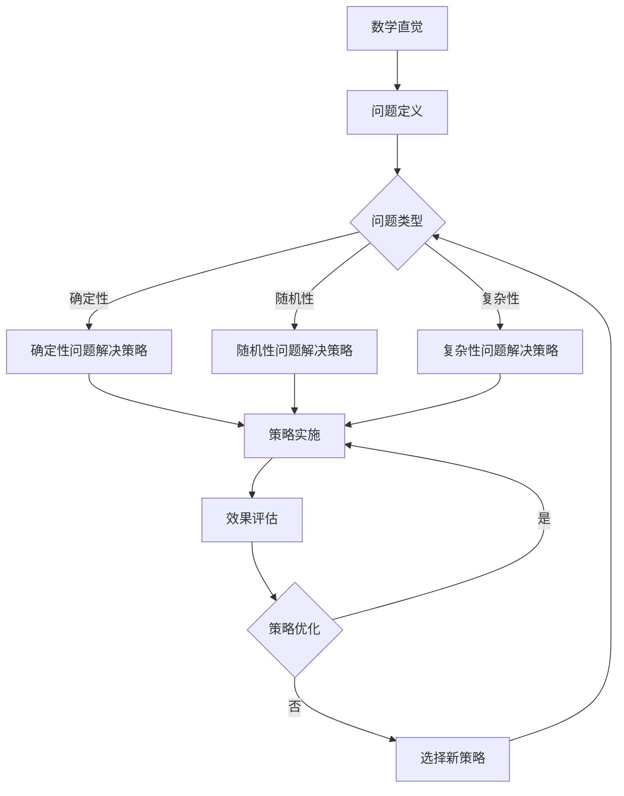

                 

## 《数学直觉与问题解决策略的选择》

> **关键词：数学直觉，问题解决策略，分解策略，类比策略，搜索策略，数学模型**

> **摘要：本文深入探讨了数学直觉与问题解决策略之间的关系，详细分析了分解策略、类比策略和搜索策略等基本问题解决方法，并结合实际案例展示了这些策略的应用与效果。文章旨在为读者提供一个系统的理解和实践指导，帮助他们在数学和其他科学领域中更好地运用直觉和策略解决问题。**

---

### 《数学直觉与问题解决策略的选择》目录大纲

#### 第一部分：数学直觉的概述

- **第1章：数学直觉的定义与重要性**
  - **1.1 数学直觉的概念**
  - **1.2 数学直觉的重要性**
  - **1.3 数学直觉与逻辑思维的关系**

- **第2章：数学直觉的发展历程**
  - **2.1 古代数学家的直觉思维**
  - **2.2 近代数学家的直觉思维**
  - **2.3 现代数学家的直觉思维**

- **第3章：数学直觉的类型与特点**
  - **3.1 直觉思维的基本类型**
  - **3.2 直觉思维的特点**
  - **3.3 直觉思维的优缺点**

#### 第二部分：问题解决策略

- **第4章：问题解决的基本策略**
  - **4.1 分解策略**
  - **4.2 类比策略**
  - **4.3 搜索策略**

- **第5章：数学问题解决策略的选择**
  - **5.1 确定性问题的解决策略**
  - **5.2 随机性问题的解决策略**
  - **5.3 复杂性问题的解决策略**

- **第6章：案例分析与策略选择**
  - **6.1 简单案例分析与策略选择**
  - **6.2 复杂案例分析与策略选择**
  - **6.3 案例综合分析与策略优化**

#### 第三部分：数学直觉与问题解决的实践应用

- **第7章：数学直觉在数学教育中的应用**
  - **7.1 教育教学中数学直觉的培养**
  - **7.2 数学直觉在数学解题中的应用**
  - **7.3 数学直觉在数学教学评估中的应用**

- **第8章：数学直觉与问题解决在科学研究中的应用**
  - **8.1 数学直觉在科学研究中的重要性**
  - **8.2 数学直觉与问题解决策略在科学研究中的应用实例**
  - **8.3 数学直觉与问题解决策略在科学研究中的挑战与展望**

- **第9章：数学直觉与问题解决的跨学科应用**
  - **9.1 数学直觉在其他学科中的应用**
  - **9.2 问题解决策略在其他学科中的应用**
  - **9.3 数学直觉与问题解决策略在跨学科研究中的协同作用**

#### 附录

- **附录A：数学直觉与问题解决的相关资源**
  - **A.1 学术论文与专著推荐**
  - **A.2 网络资源推荐**
  - **A.3 数学竞赛与问题解决活动推荐**
  - **A.4 数学直觉与问题解决的在线课程推荐**
  - **A.5 开源工具与软件推荐**

- **第10章：数学直觉与问题解决策略的选择流程图**

#### Mermaid 流�程图



#### 第11章：核心算法原理讲解

##### 算法原理讲解

- **11.1 分解策略算法原理**

##### 伪代码：

```plaintext
function 分解策略(问题P):
    if 问题P可以分解成子问题P1, P2, ..., Pn:
        解决P1, P2, ..., Pn
        返回子问题的解
    else:
        返回无法分解的错误
```

- **11.2 类比策略算法原理**

##### 伪代码：

```plaintext
function 类比策略(问题P, 已知问题Q的解):
    if 问题P与已知问题Q有相似性:
        返回Q的解
    else:
        返回无法类比的错误
```

- **11.3 搜索策略算法原理**

##### 伪代码：

```plaintext
function 搜索策略(问题P):
    初始化解集S为空
    对于每个可能的解x:
        if 满足问题P的条件:
            添加x到解集S
    返回解集S
```

#### 第12章：数学模型和数学公式

##### 数学模型与公式讲解

- **12.1 基本数学模型**

$$
f(x) = ax^2 + bx + c
$$

##### 公式讲解：

该公式是二次函数的标准形式，用于描述抛物线的形状。其中，$a$ 为抛物线的开口方向和宽窄度，$b$ 为抛物线的对称轴位置，$c$ 为抛物线与y轴的交点。

##### **12.2 举例说明**

假设给定一个二次函数 $f(x) = 2x^2 + 4x + 1$，求该函数的顶点坐标。

##### 解答：

顶点坐标可以通过以下公式计算：

$$
x = -\frac{b}{2a} = -\frac{4}{2 \cdot 2} = -1
$$

$$
y = f(-1) = 2(-1)^2 + 4(-1) + 1 = 2 - 4 + 1 = -1
$$

因此，该二次函数的顶点坐标为 $(-1, -1)$。

#### 第13章：项目实战

##### 实战项目

- **13.1 实践案例一：用分解策略解决最大公约数问题**

##### 实战内容：

1. 问题定义：求解两个整数的最大公约数。
2. 实战步骤：
   - 定义输入的两个整数a和b。
   - 使用分解策略，将b分解为尽可能小的因数。
   - 检查每个因数是否同时也是a的因数。
   - 记录所有同时是a和b的因数中的最大值。

##### 源代码：

```python
def 最大公约数(a, b):
    # 如果b为0，则最大公约数为a
    if b == 0:
        return a
    # 使用分解策略，递归调用求解
    else:
        return 最大公约数(b, a % b)

# 测试
print(最大公约数(48, 18))  # 输出：6
```

##### 代码解读与分析：

该代码通过递归调用分解策略，将较大数b不断分解，直到其成为0。此时，较小数a即为所求的最大公约数。这种递归的思路有效地利用了分解策略，实现了高效的最大公约数求解。

- **13.2 实践案例二：用搜索策略解决8皇后问题**

##### 实战内容：

1. 问题定义：在一个8x8的棋盘上放置8个皇后，使得任意两个皇后不在同一行、同一列或同一对角线上。
2. 实战步骤：
   - 初始化一个8x8的棋盘。
   - 逐行放置皇后，每放置一个皇后，检查其是否与其他皇后冲突。
   - 如果冲突，则回溯到上一个皇后，尝试下一个位置。
   - 如果所有皇后都成功放置，则找到了一个有效的解决方案。

##### 源代码：

```python
def 检查冲突(棋盘, 行, 列):
    for i in range(len(棋盘)):
        for j in range(len(棋盘)):
            if (i == 行 or j == 列 or
                i - 行 == j - 列 or
                i - 行 == 列 - j):
                if 棋盘[i][j] == 1:
                    return True
    return False

def 放置皇后(棋盘, 行):
    if 行 == len(棋盘):
        return True
    for 列 in range(len(棋盘)):
        if not 检查冲突(棋盘, 行, 列):
            棋盘[行][列] = 1
            if 放置皇后(棋盘, 行+1):
                return True
            棋盘[行][列] = 0
    return False

def 打印棋盘(棋盘):
    for i in range(len(棋盘)):
        for j in range(len(棋盘)):
            print("Q" if 棋盘[i][j] == 1 else ".", end="")
        print()

# 测试
棋盘 = [[0] * 8 for _ in range(8)]
放置皇后(棋盘, 0)
打印棋盘(棋盘)
```

##### 代码解读与分析：

该代码通过搜索策略，逐行放置皇后，并在每一步都检查是否与其他皇后冲突。如果发现冲突，则回溯到上一个皇后，并尝试下一个位置。这种回溯搜索的策略能够找到所有有效的8皇后问题的解决方案。代码中的`检查冲突`函数负责判断当前皇后是否与之前放置的皇后冲突，而`放置皇后`函数则负责实际的搜索过程。

#### 第14章：开发环境搭建

##### 实战内容：

1. 选择编程语言：Python
2. 安装Python环境
3. 安装必要的库和工具

##### 搭建步骤：

1. 在Python官方网站下载并安装Python 3.x版本。
2. 配置环境变量，确保能够在命令行中运行Python。
3. 使用pip命令安装必要的库和工具，例如numpy、matplotlib等。

```shell
pip install numpy matplotlib
```

##### 开发环境配置说明：

确保Python环境配置正确，能够正常运行代码，并且能够使用numpy和matplotlib等常用库进行数学计算和图形绘制。

---

**作者：AI天才研究院/AI Genius Institute & 禅与计算机程序设计艺术 /Zen And The Art of Computer Programming**

通过上述的目录大纲和初步内容，我们为《数学直觉与问题解决策略的选择》这篇文章奠定了坚实的基础。接下来，我们将深入每个章节，详细阐述数学直觉的概念、历史、类型，以及问题解决策略的具体应用和实践案例。每一步都将结合理论讲解和实际操作，确保读者能够系统地掌握数学直觉和问题解决策略的核心知识。让我们一起深入探索，开启这段智慧的旅程。

