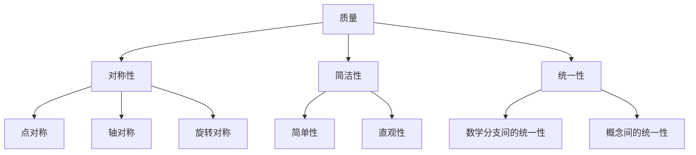

                 

# 《数学美学在增强现实设计中的应用》

## 摘要

随着增强现实（AR）技术的飞速发展，其在各个领域的应用越来越广泛。而数学美学，作为一种独特的美学理念，不仅在传统艺术和设计中占有重要地位，更在数字时代焕发出新的生命力。本文旨在探讨数学美学在增强现实设计中的广泛应用和深远影响。通过分析数学美学的基本原理，本文详细阐述了如何将数学美学融入增强现实界面设计、交互设计和体验设计，最终实现视觉和用户体验的优化。同时，本文还通过具体的案例展示了数学美学在增强现实开发中的实践应用，为未来的设计提供了有价值的参考。希望通过本文，能够让读者对数学美学在增强现实设计中的应用有更深入的理解，从而推动这一领域的创新与发展。

## 目录大纲

### 第1章：增强现实与数学美学的概述

#### 1.1 增强现实技术基础

- **1.1.1 增强现实技术的定义与历史**
  - **定义**：增强现实（Augmented Reality，简称AR）是一种将虚拟信息叠加到真实世界中的技术。
  - **历史**：从1990年代初的初步探索到现今的广泛应用，AR技术经历了不断的发展和完善。

- **1.1.2 增强现实技术的核心组件**
  - **摄像头**：用于捕捉现实世界的图像。
  - **显示设备**：如智能手机、平板电脑和头戴式显示器，用于呈现虚拟信息。
  - **处理器**：用于实时处理图像和计算虚拟信息的位置和大小。

- **1.1.3 增强现实技术的应用领域**
  - **教育**：通过增强现实技术，学生可以更加直观地学习复杂的知识。
  - **医疗**：医生可以利用AR技术进行手术指导，提高手术的准确性和安全性。
  - **娱乐**：增强现实游戏和体验为用户带来了全新的娱乐方式。

#### 1.2 数学美学基础

- **1.2.1 数学美学的定义与起源**
  - **定义**：数学美学是探讨数学形式和结构中的美学特性的一种哲学和科学活动。
  - **起源**：数学美学最早可以追溯到古希腊时期，当时哲学家和数学家开始探讨数学形式的美。

- **1.2.2 数学美学的核心原理**
  - **简洁性**：简单而优雅的数学结构往往被认为具有美学价值。
  - **对称性**：数学中的对称性常常被视为一种美。
  - **统一性**：不同数学分支之间的联系和统一性也被视为美学的一部分。

- **1.2.3 数学美学与艺术的关系**
  - **联系**：数学美学和艺术在很多方面都有相似之处，例如对简洁性、对称性和和谐的追求。
  - **区别**：艺术更强调主观感受和创造性，而数学美学则更多地关注数学形式和结构。

#### 1.3 数学美学在增强现实设计中的应用前景

- **1.3.1 数学美学与增强现实技术的结合**
  - **结合**：数学美学为增强现实设计提供了新的视角和方法，使得设计不仅美观，而且功能性强。

- **1.3.2 增强现实设计中的数学美学应用**
  - **设计原则**：通过应用数学美学原理，如对称性、比例和简洁性，可以提升增强现实界面的美学价值。
  - **用户体验**：数学美学在增强现实界面设计中的应用，可以显著改善用户的体验。

- **1.3.3 数学美学对增强现实用户体验的影响**
  - **视觉体验**：通过数学美学的应用，增强现实的视觉效果可以更加吸引人。
  - **交互体验**：数学美学的原则可以优化用户与增强现实系统的交互过程。

### 第2章：数学美学原理与流程图

#### 2.1 数学美学核心概念与联系

- **2.1.1 质量与数学美学**
  - **联系**：质量是数学美学的一个重要方面，一个数学结构的质量高，往往被认为是美的。
  - **原理**：简洁性、一致性和可验证性是衡量数学质量的重要标准。

- **2.1.2 对称性与数学美学**
  - **联系**：对称性是数学美学的核心概念之一，它给人以和谐、稳定的感觉。
  - **原理**：数学中的对称性包括点对称、轴对称和旋转对称等。

- **2.1.3 简洁性与数学美学**
  - **联系**：简洁性是数学美学的另一个重要方面，简洁的结构往往更具有美学价值。
  - **原理**：简单性、统一性和直观性是衡量数学结构简洁性的标准。

- **Mermaid流程图：数学美学核心概念关系图**
  ```mermaid
  graph TB
  A[质量] --> B[对称性]
  A --> C[简洁性]
  B --> D[和谐性]
  C --> E[直观性]
  ```

#### 2.2 数学美学的数学模型和公式

- **2.2.1 几何学的美学应用**
  - **公式**：欧氏几何中的欧拉公式和勾股定理等。
  - **应用**：在建筑设计、艺术绘画等领域，几何学原理被广泛应用。

- **2.2.2 概率论的美学应用**
  - **公式**：概率论中的贝叶斯定理和马尔可夫链等。
  - **应用**：在风险管理、金融分析等领域，概率论的应用具有重要意义。

- **2.2.3 微积分的美学应用**
  - **公式**：微积分中的导数和积分等。
  - **应用**：在工程学、物理学等领域，微积分的应用极为广泛。

- **Mermaid流程图：数学美学应用流程**
  ```mermaid
  graph TB
  A[几何学] --> B[概率论]
  A --> C[微积分]
  B --> D[美学应用]
  C --> E[科学应用]
  ```

#### 2.3 数学美学在增强现实设计中的流程

- **2.3.1 设计目标确定**
  - **目标**：明确增强现实设计的目标和需求。

- **2.3.2 数学模型构建**
  - **模型**：基于设计目标构建相应的数学模型。

- **2.3.3 美学原则应用**
  - **原则**：将数学美学原则应用于设计过程中。

- **2.3.4 增强现实界面实现**
  - **实现**：通过算法和编程实现数学美学在增强现实界面中的体现。

### 第3章：数学美学在增强现实界面设计中的应用

#### 3.1 界面设计的数学美学原则

- **3.1.1 界面元素布局的对称性**
  - **原则**：通过对称性，使界面布局更加和谐。
  - **应用**：如左右对称、上下对称等。

- **3.1.2 界面元素颜色搭配的美学**
  - **原则**：合理的颜色搭配可以提升界面的美感。
  - **应用**：如对比色、类似色等的应用。

- **3.1.3 界面动态效果的美学设计**
  - **原则**：动态效果需要符合数学美学的原则，如简洁、和谐等。
  - **应用**：如动画、过渡效果等。

#### 3.2 数学公式与界面设计

- **3.2.1 数学公式在界面中的应用**
  - **应用**：如数学公式在科学计算器、教育软件中的应用。

- **3.2.2 数学公式在界面中的美观呈现**
  - **呈现**：如何使数学公式在界面中既美观又易读。

- **3.2.3 数学公式在界面中的互动设计**
  - **设计**：如何通过互动设计，增强用户对数学公式的理解和应用。

#### 3.3 数学美学在增强现实界面设计中的案例

- **3.3.1 界面设计案例1：教育应用**
  - **案例**：如何利用数学美学设计一个教育软件的界面，使其更加易于学习和使用。

- **3.3.2 界面设计案例2：游戏应用**
  - **案例**：如何通过数学美学设计一个游戏的界面，使其更具吸引力。

- **3.3.3 界面设计案例3：虚拟现实体验**
  - **案例**：如何通过数学美学设计一个虚拟现实体验的界面，使其更具沉浸感。

### 第4章：数学美学在增强现实交互设计中的应用

#### 4.1 交互设计的数学美学原则

- **4.1.1 交互流程的简洁性**
  - **原则**：交互流程应尽可能简洁，避免冗余。

- **4.1.2 交互方式的对称性**
  - **原则**：交互方式应保持对称性，以便用户更容易理解和使用。

- **4.1.3 交互反馈的美学设计**
  - **原则**：交互反馈应既美观又清晰，帮助用户更好地理解交互结果。

#### 4.2 数学模型在交互设计中的应用

- **4.2.1 交互元素的数学建模**
  - **建模**：如何通过数学建模，优化交互元素的设计。

- **4.2.2 交互行为的数学分析**
  - **分析**：如何通过数学分析，评估交互行为的效率和用户体验。

- **4.2.3 交互效果的数学优化**
  - **优化**：如何通过数学优化，提升交互效果的用户体验。

#### 4.3 数学美学在增强现实交互设计中的案例

- **4.3.1 交互设计案例1：虚拟购物体验**
  - **案例**：如何通过数学美学设计一个虚拟购物体验，使其更加高效和愉悦。

- **4.3.2 交互设计案例2：远程协作**
  - **案例**：如何通过数学美学设计一个远程协作工具，提升团队的协作效率。

- **4.3.3 交互设计案例3：智能导航**
  - **案例**：如何通过数学美学设计一个智能导航系统，使其更加直观和易于使用。

### 第5章：数学美学在增强现实体验设计中的应用

#### 5.1 体验设计的数学美学原则

- **5.1.1 用户体验的连续性**
  - **原则**：用户体验应保持连续性，避免中断。

- **5.1.2 用户体验的反馈机制**
  - **原则**：用户体验应具备良好的反馈机制，及时响应用户操作。

- **5.1.3 用户体验的情感设计**
  - **原则**：用户体验应考虑用户情感，提升用户的情感体验。

#### 5.2 数学模型在体验设计中的应用

- **5.2.1 体验质量的数学评估**
  - **评估**：如何通过数学模型评估体验质量。

- **5.2.2 体验优化的数学模型**
  - **优化**：如何通过数学模型优化用户体验。

- **5.2.3 体验创新的数学方法**
  - **创新**：如何通过数学方法创新用户体验。

#### 5.3 数学美学在增强现实体验设计中的案例

- **5.3.1 体验设计案例1：虚拟旅游**
  - **案例**：如何通过数学美学设计一个虚拟旅游体验，使其更加真实和吸引人。

- **5.3.2 体验设计案例2：医疗康复**
  - **案例**：如何通过数学美学设计一个医疗康复体验，帮助患者更好地恢复。

- **5.3.3 体验设计案例3：教育培训**
  - **案例**：如何通过数学美学设计一个教育培训体验，提升学习效果。

### 第6章：数学美学在增强现实应用开发中的实现

#### 6.1 增强现实应用开发概述

- **6.1.1 增强现实应用开发流程**
  - **流程**：从需求分析、设计、开发到测试和部署的全过程。

- **6.1.2 增强现实应用开发工具与平台**
  - **工具**：如Unity、ARKit、ARCore等。
  - **平台**：如iOS、Android、Web等。

- **6.1.3 增强现实应用开发资源**
  - **资源**：如开发文档、教程、社区等。

#### 6.2 数学美学在开发中的应用

- **6.2.1 数学模型在开发中的实现**
  - **实现**：如何将数学模型应用到增强现实应用的开发过程中。

- **6.2.2 美学原则在开发中的实现**
  - **实现**：如何将美学原则应用到增强现实应用的设计和开发中。

- **6.2.3 开发过程中的数学美学优化**
  - **优化**：如何通过数学方法优化开发过程中的美学效果。

#### 6.3 增强现实应用开发案例

- **6.3.1 应用开发案例1：教育AR应用**
  - **案例**：如何开发一个教育AR应用，利用数学美学提升学习效果。

- **6.3.2 应用开发案例2：医疗AR应用**
  - **案例**：如何开发一个医疗AR应用，利用数学美学提升手术效果。

- **6.3.3 应用开发案例3：商业AR应用**
  - **案例**：如何开发一个商业AR应用，利用数学美学提升用户体验。

### 第7章：数学美学在增强现实设计中的未来展望

#### 7.1 数学美学在增强现实设计中的挑战

- **7.1.1 技术挑战**
  - **挑战**：如何将数学美学更好地应用于增强现实技术中，解决技术实现上的难题。

- **7.1.2 用户挑战**
  - **挑战**：如何让用户更好地接受和适应数学美学在增强现实设计中的应用。

- **7.1.3 社会挑战**
  - **挑战**：如何在增强现实设计中融入数学美学，同时考虑到社会和文化背景的影响。

#### 7.2 数学美学在增强现实设计中的发展趋势

- **7.2.1 技术进步的趋势**
  - **趋势**：随着技术的不断进步，数学美学在增强现实设计中的应用将更加广泛和深入。

- **7.2.2 设计方法的趋势**
  - **趋势**：设计方法将更加注重数学美学的应用，追求简洁、和谐和统一的设计风格。

- **7.2.3 用户需求的趋势**
  - **趋势**：用户对增强现实体验的需求将更加多样化和个性化，数学美学将更好地满足这些需求。

#### 7.3 数学美学在增强现实设计中的未来应用

- **7.3.1 教育领域**
  - **应用**：数学美学将进一步提升教育AR应用的效果，帮助学生学习更复杂的知识。

- **7.3.2 医疗领域**
  - **应用**：数学美学将提高医疗AR应用的操作效率，帮助医生更好地进行手术和诊断。

- **7.3.3 商业领域**
  - **应用**：数学美学将提升商业AR应用的用户体验，为企业创造更多的商业价值。

## 附录

### 附录A：数学美学相关工具与资源

- **伪代码示例**
  - **示例**：展示如何使用伪代码描述一个简单的算法。

- **数学公式与图表制作工具**
  - **工具**：介绍如何使用LaTeX、Mathematica等工具制作数学公式和图表。

- **增强现实开发工具与资源列表**
  - **列表**：列出常用的增强现实开发工具和资源，如ARKit、ARCore等。

### 附录B：增强现实项目开发指南

- **开发环境搭建**
  - **指南**：介绍如何搭建增强现实项目的开发环境，包括软件和硬件的选择。

- **代码实现与解读**
  - **解读**：对关键代码段进行详细解读，帮助开发者更好地理解实现原理。

- **项目部署与维护**
  - **维护**：介绍如何对增强现实项目进行部署和维护，确保其稳定运行。

### 作者

**作者：AI天才研究院/AI Genius Institute & 禅与计算机程序设计艺术 /Zen And The Art of Computer Programming**

---

## 第1章：增强现实与数学美学的概述

在当今数字化和智能化的浪潮中，增强现实（Augmented Reality，简称AR）技术以其独特的魅力逐渐渗透到我们生活的方方面面。而数学美学，作为一种独特的审美理念，不仅在传统艺术和设计中占有重要地位，更在数字时代焕发出新的生命力。本章节将首先介绍增强现实技术的基础知识，包括其定义、历史、核心组件和应用领域。接着，我们将探讨数学美学的基本概念，以及数学美学在艺术和设计中的应用。最后，我们将分析数学美学在增强现实设计中的应用前景，探讨其结合的可能性和对用户体验的深远影响。

### 1.1 增强现实技术基础

#### 1.1.1 增强现实技术的定义与历史

增强现实（Augmented Reality，简称AR）是一种将虚拟信息叠加到真实世界中的技术。与虚拟现实（Virtual Reality，简称VR）不同，AR并不完全替代现实世界，而是在现实世界的基础上，通过计算机技术生成虚拟信息，并将其实时显示给用户。用户可以通过智能手机、平板电脑、头戴式显示器等设备，实时观察到虚拟信息与现实世界的融合。

增强现实技术的历史可以追溯到1990年代初。1990年，波音公司的研究员Tony Parisi开发了第一个AR应用程序——ARQuake，这是一个基于头戴式显示器和摄像机技术的游戏，玩家可以在真实环境中与虚拟怪物进行战斗。尽管当时的技术条件有限，但这一创新性尝试为AR技术的发展奠定了基础。

随着计算机技术和图形处理技术的不断发展，AR技术逐渐从实验室走向市场。2009年，谷歌推出了第一款基于Android平台的增强现实应用——Google Goggles，用户可以通过手机摄像头拍摄照片，然后获取相关的信息。这一应用的成功进一步推动了AR技术的发展。

近年来，随着智能手机和移动设备的普及，AR技术的应用场景越来越广泛。从教育、医疗、娱乐到商业，AR技术正逐步改变我们的生活方式。

#### 1.1.2 增强现实技术的核心组件

要实现增强现实，需要以下几个核心组件：

1. **摄像头**：摄像头用于捕捉现实世界的图像，是AR系统的输入设备。高质量的摄像头可以捕捉到更清晰、更细腻的图像，为AR系统提供更好的输入数据。

2. **显示设备**：显示设备用于呈现虚拟信息，是AR系统的输出设备。常见的显示设备包括智能手机、平板电脑和头戴式显示器。头戴式显示器提供了一种沉浸式的体验，使用户能够更加真实地感受到虚拟信息的存在。

3. **处理器**：处理器用于实时处理图像和计算虚拟信息的位置和大小。高性能的处理器可以更快地处理图像，提高AR系统的响应速度和流畅性。

4. **传感器**：传感器包括加速度计、陀螺仪、磁力计等，用于感知用户的位置和方向。这些传感器可以帮助AR系统实时跟踪用户的位置和动作，确保虚拟信息与真实世界的准确对齐。

5. **软件算法**：软件算法用于处理输入图像、识别环境特征、生成虚拟信息等。常用的算法包括图像识别、机器学习、计算机视觉等。软件算法的质量直接影响AR系统的性能和用户体验。

#### 1.1.3 增强现实技术的应用领域

增强现实技术具有广泛的应用领域，以下是一些典型的应用场景：

1. **教育**：增强现实技术可以提供更加直观和互动的学习体验。例如，学生可以通过AR应用观察三维的动物模型，了解它们的形态和习性。教师也可以通过AR技术制作教学课件，使学生更容易理解和掌握复杂的知识点。

2. **医疗**：增强现实技术在医疗领域的应用包括手术辅助、医学教育、疾病诊断等。例如，医生可以通过AR眼镜实时查看患者的身体结构，进行精准的手术操作。医学学生也可以通过AR技术进行虚拟手术训练，提高手术技能。

3. **娱乐**：增强现实游戏和体验为用户带来了全新的娱乐方式。用户可以在真实环境中与虚拟角色互动，体验不同的故事情节和游戏玩法。例如，AR游戏《Pokémon GO》让用户可以在户外捕捉虚拟的宝可梦，增强了游戏的互动性和趣味性。

4. **商业**：增强现实技术可以帮助企业提升品牌形象和用户体验。例如，零售商可以通过AR技术为顾客提供虚拟试衣间，让顾客在家中就能试穿衣服。房地产公司也可以通过AR技术为潜在买家提供虚拟看房服务，提升销售效率。

5. **军事**：增强现实技术在军事领域也有广泛应用。士兵可以通过AR眼镜获取实时的战术信息，进行精确的导航和目标定位。此外，AR技术还可以用于模拟训练，提高士兵的战斗技能。

总之，增强现实技术正逐步改变我们的生活和工作方式，其应用领域将越来越广泛。而数学美学作为增强现实设计中的重要元素，将发挥越来越重要的作用。

### 1.2 数学美学基础

#### 1.2.1 数学美学的定义与起源

数学美学（Mathematical Aesthetics）是一门探讨数学形式和结构中的美学特性的学科。它试图从数学的角度理解和解释美，探讨数学中的美感来源及其表现形式。

数学美学的概念可以追溯到古希腊时期。古希腊哲学家和数学家，如毕达哥拉斯、欧几里得和柏拉图，都对数学形式和结构中的美学特性进行了深入探讨。他们认为，数学不仅仅是逻辑和推理的工具，也是美的源泉。

数学美学的研究始于18世纪，当时数学家如欧拉、拉格朗日和哥德巴赫等，开始系统地探讨数学形式中的美学特性。20世纪以来，随着计算机科学的兴起，数学美学的研究进一步深入，涵盖了更多数学分支和形式。

数学美学的定义有多种，但通常可以概括为以下几个方面：

1. **简洁性**：数学美的一个重要特征是简洁性。一个数学结构如果简洁、优雅，往往被认为具有美学价值。例如，欧拉公式 \(e^{i\pi} + 1 = 0\) 被广泛认为是一个具有极高美学价值的数学公式，其简洁性和对称性令人叹为观止。

2. **对称性**：对称性是数学美学中的重要概念。数学中的对称性包括点对称、轴对称和旋转对称等，这些对称性往往给人以和谐、稳定的感觉。例如，欧氏几何中的五边形和七边形，其对称性被认为是美的。

3. **统一性**：数学美的一个重要特征是统一性。不同数学分支之间的联系和统一性也被视为美学的一部分。例如，微积分和线性代数中的许多概念和公式，如行列式和特征值，不仅在各自领域具有重要意义，而且在其他数学分支中也得到了广泛应用。

4. **普适性**：数学美具有普适性，即不受时间、空间和文化背景的限制。数学美的欣赏和理解具有普遍性，不同背景的人都可以从中感受到美的魅力。

#### 1.2.2 数学美学的核心原理

数学美学的核心原理主要包括以下几个方面：

1. **简洁性**：简洁性是数学美的一个重要特征。一个数学结构如果简洁、优雅，往往被认为具有美学价值。简洁性不仅体现在数学公式和定理的简洁性上，也体现在数学理论的简洁性和统一性上。

2. **对称性**：对称性是数学美学中的另一个核心概念。对称性包括点对称、轴对称和旋转对称等，这些对称性往往给人以和谐、稳定的感觉。对称性在数学中的许多结构中都有体现，如欧氏几何中的五边形和七边形。

3. **统一性**：统一性是数学美学中的第三个核心概念。不同数学分支之间的联系和统一性也被视为美学的一部分。例如，微积分和线性代数中的许多概念和公式，如行列式和特征值，不仅在各自领域具有重要意义，而且在其他数学分支中也得到了广泛应用。

4. **普适性**：数学美具有普适性，即不受时间、空间和文化背景的限制。数学美的欣赏和理解具有普遍性，不同背景的人都可以从中感受到美的魅力。

5. **和谐性**：和谐性是数学美学中的第四个核心概念。一个数学结构如果和谐，即其各个部分之间相互协调、平衡，往往被认为具有美学价值。和谐性在数学中的许多结构中都有体现，如欧拉公式和费马大定理。

#### 1.2.3 数学美学与艺术的关系

数学美学与艺术有着密切的关系。在许多方面，数学美学和艺术都追求简洁、对称和和谐的美。以下是数学美学与艺术之间的几个联系：

1. **共同的美学目标**：数学美学和艺术都追求简洁、对称和和谐的美。数学家欧拉和艺术家毕加索都创作了许多经典作品，这些作品以其简洁性和对称性而著称。

2. **灵感来源**：数学美学为艺术家提供了丰富的灵感来源。许多艺术家从数学公式、几何形状和对称性中汲取灵感，创作出许多具有数学美感的艺术作品。

3. **方法论的借鉴**：数学美学的研究方法可以借鉴艺术创作的方法。例如，数学家在探讨数学结构的简洁性和对称性时，可以借鉴艺术家在创作过程中的探索和实验方法。

4. **跨学科研究**：数学美学和艺术之间的交叉研究为跨学科研究提供了新的视角和方法。例如，数学家可以借鉴艺术家在色彩、构图和表现手法上的经验，优化数学表达的形式。

总之，数学美学与艺术之间存在着紧密的联系和相互影响。通过结合数学美学和艺术的元素，我们可以创造出更加丰富和有创意的设计，提升用户体验和审美价值。

### 1.3 数学美学在增强现实设计中的应用前景

随着增强现实（AR）技术的不断发展和成熟，其在设计领域的应用也越来越广泛。数学美学作为一种独特的审美理念，不仅为传统艺术和设计提供了新的视角和方法，也在数字时代焕发出新的生命力。本节将探讨数学美学在增强现实设计中的应用前景，分析其结合的可能性和对用户体验的深远影响。

#### 1.3.1 数学美学与增强现实技术的结合

数学美学与增强现实技术的结合具有广阔的前景。首先，数学美学中的简洁性、对称性和统一性等核心原理，可以指导增强现实界面的设计，使其更加美观和谐。例如，通过应用对称性原理，设计师可以创建出具有强烈视觉冲击力的界面，使用户在使用过程中获得更好的体验。此外，数学美学中的简洁性原则可以帮助设计师简化界面元素，减少用户的认知负担，提高操作效率。

其次，数学美学中的几何学和概率论等数学模型，可以应用于增强现实场景的构建和渲染。例如，在三维建模过程中，设计师可以利用欧拉公式、余弦定理等几何学原理，创建出具有高度真实感和美感的虚拟场景。在游戏和娱乐应用中，概率论和统计学的应用可以使得虚拟角色的行为更加自然和真实，提高用户的沉浸感。

最后，数学美学与增强现实技术的结合，还可以在交互设计和体验设计方面发挥重要作用。通过应用数学美学原理，设计师可以优化交互流程，提升用户的操作效率和体验。例如，通过简化操作步骤、优化界面布局和颜色搭配，使得用户在使用过程中更加轻松愉快。

#### 1.3.2 增强现实设计中的数学美学应用

数学美学在增强现实设计中的应用主要包括以下几个方面：

1. **界面设计**：数学美学中的对称性、比例和简洁性等原则，可以应用于增强现实界面的设计。通过合理运用这些原则，设计师可以创建出既美观又实用的界面，使用户在使用过程中感受到美和便利。例如，在游戏界面设计中，对称性和比例的运用可以使界面更加和谐，提高用户的视觉体验。

2. **交互设计**：数学美学中的简洁性、对称性和反馈机制等原则，可以应用于增强现实交互设计。通过简化操作流程、优化交互元素和增强反馈机制，设计师可以提升用户的操作效率和体验。例如，在医疗AR应用中，通过应用对称性原理，医生可以更方便地进行手术操作，提高手术的准确性和安全性。

3. **体验设计**：数学美学中的连续性、反馈机制和情感设计等原则，可以应用于增强现实体验设计。通过构建连续性的用户旅程、设计合理的反馈机制和融入情感设计，设计师可以提升用户的整体体验。例如，在虚拟旅游应用中，通过连续性的设计，用户可以更加真实地体验旅游过程，增强沉浸感。

#### 1.3.3 数学美学对增强现实用户体验的影响

数学美学在增强现实设计中的应用，将对用户体验产生深远的影响。首先，数学美学中的简洁性和对称性原则，可以优化界面的视觉效果，提高用户的视觉体验。通过合理运用这些原则，界面将更加美观和谐，使用户在使用过程中感受到愉悦。

其次，数学美学中的反馈机制和情感设计原则，可以提升用户的操作效率和体验。合理的反馈机制可以及时响应用户的操作，提供明确的操作结果，减少用户的困惑和焦虑。情感设计则可以通过色彩、声音和动画等元素，增强用户的情感体验，提高用户对产品的满意度。

最后，数学美学中的连续性和统一性原则，可以构建出连续性的用户旅程，提升用户的整体体验。通过在不同场景中保持统一的视觉和交互风格，用户可以更加顺畅地切换使用场景，减少学习和适应成本。

总之，数学美学在增强现实设计中的应用，不仅可以提升视觉和用户体验，还可以优化交互设计和体验设计，为用户带来更加美好和愉悦的使用体验。随着增强现实技术的不断发展和成熟，数学美学将在增强现实设计中发挥越来越重要的作用，推动设计的创新与发展。

## 第2章：数学美学原理与流程图

在探索数学美学与增强现实（AR）设计的结合时，理解数学美学的基本原理和流程是至关重要的。本章将深入探讨数学美学核心概念之间的联系，并介绍几何学、概率论和微积分在美学中的应用。此外，我们还将通过Mermaid流程图展示数学美学核心概念之间的关系，帮助读者更好地理解这一复杂而又迷人的领域。

### 2.1 数学美学核心概念与联系

数学美学中的核心概念包括质量、对称性、简洁性和统一性。这些概念不仅在数学结构中起到关键作用，而且在增强现实（AR）设计中同样具有重要意义。

#### 2.1.1 质量与数学美学

质量是衡量一个数学结构美感的重要标准。一个高质量的数学结构往往简洁、优雅，且具有较高的逻辑一致性和可验证性。以下是一些衡量数学质量的指标：

- **简洁性**：一个结构如果简洁且不冗余，往往被认为具有更高的美学价值。
- **一致性**：一个结构如果在不同情境下都能保持一致，具有较强的逻辑一致性和稳定性。
- **可验证性**：一个结构如果可以通过严格的数学证明来验证，往往被认为是高质量的。

例如，欧拉公式 \(e^{i\pi} + 1 = 0\) 是一个高质量的数学结构，其简洁性和对称性令人赞叹。

#### 2.1.2 对称性与数学美学

对称性是数学美学中的一个核心概念。对称性可以有多种形式，如点对称、轴对称和旋转对称。这些对称性在数学和艺术中都有广泛的应用。

- **点对称**：一个结构关于一个点对称，即每个点都有一个与其对称的对应点。
- **轴对称**：一个结构关于一条轴对称，即每个点都有一个与其对称的对应点，这些点都位于同一轴的两侧。
- **旋转对称**：一个结构关于一个中心点旋转一定角度后仍保持不变。

例如，五边形和七边形在几何结构上具有旋转对称性，这种对称性常常被视为美学的一部分。

#### 2.1.3 简洁性与数学美学

简洁性是数学美学中的另一个重要概念。一个简洁的数学结构往往具有以下特点：

- **简单性**：结构中的元素和关系尽可能简单。
- **统一性**：不同部分之间保持一致性和连贯性。
- **直观性**：结构易于理解和解释。

例如，勾股定理（\(a^2 + b^2 = c^2\)）是一个简洁而优雅的数学定理，其简洁性使其在几何学中具有极高的美学价值。

#### 2.1.4 统一性与数学美学

统一性是数学美学中的另一个关键概念。一个具有统一性的数学结构，其不同部分之间保持一致的逻辑关系和形式。

- **数学分支间的统一性**：如微积分与线性代数的统一性，通过特征值和特征向量理论可以体现。
- **概念间的统一性**：如概率论中的贝叶斯定理与信息论中的信息熵，它们在形式和逻辑上具有统一性。

例如，费马大定理通过统一多个数学分支，展示了数学的深度和美丽。

#### Mermaid流程图：数学美学核心概念关系图

为了更直观地展示数学美学核心概念之间的关系，我们可以使用Mermaid流程图来表示：



通过这个流程图，我们可以清晰地看到质量、对称性、简洁性和统一性之间的联系，以及它们各自的重要分支。

### 2.2 数学美学的数学模型和公式

数学美学不仅仅是一个哲学和艺术的概念，它还依赖于具体的数学模型和公式来体现和表达。以下是一些常用的数学模型和公式，以及它们在美学中的应用：

#### 2.2.1 几何学的美学应用

几何学在数学美学中占据重要地位，许多几何结构因其简洁性和对称性而被认为是美的。

- **欧拉公式**：欧拉公式 \(e^{i\pi} + 1 = 0\) 被广泛认为是最美的数学公式之一，其结合了五个基本常数：\(e\)、\(i\)（虚数单位）、\(\pi\)（圆周率）、1和0，展现了一种完美的对称性和简洁性。

- **勾股定理**：勾股定理 \(a^2 + b^2 = c^2\) 描述了直角三角形边长之间的关系，其简洁的表达和直观的几何解释使其在美学中具有很高的价值。

- **黄金比例**：黄金比例 \(\phi\)（约等于1.618）在自然界和艺术中广泛存在，被认为是美的象征。它出现在许多几何形状和图案中，如五边形和五角星。

#### 2.2.2 概率论的美学应用

概率论中的许多概念和公式也具有美学价值，尤其是在描述不确定性和随机现象时。

- **贝叶斯定理**：贝叶斯定理是一个描述概率推理的公式，其简洁而优雅的表达方式使其在数学美学中占据一席之地。公式如下：

  $$P(A|B) = \frac{P(B|A)P(A)}{P(B)}$$

  这个公式在统计学、机器学习和数据分析中都有广泛应用。

- **马尔可夫链**：马尔可夫链是一个用于描述随机过程的数学模型，其状态转移矩阵具有简洁的结构和对称性，使得它在美学中具有吸引力。

#### 2.2.3 微积分的美学应用

微积分在描述变化和优化问题中发挥着重要作用，其概念和公式在数学美学中也有广泛应用。

- **导数**：导数描述了函数在某一点的变化率，其定义公式为：

  $$\frac{df}{dx} = \lim_{\Delta x \to 0} \frac{f(x + \Delta x) - f(x)}{\Delta x}$$

  导数在物理学、工程学和经济学等领域都有重要应用，其简洁的表达方式使其具有美学价值。

- **积分**：积分是导数的反操作，用于计算函数在一个区间上的累积值。其定义公式为：

  $$\int f(x) dx = F(x) + C$$

  积分在几何学、物理学和工程学中都有广泛应用，其表达方式也具有简洁性。

#### 2.2.4 数学模型在增强现实设计中的应用

在增强现实（AR）设计中，数学模型和公式可以用于优化界面设计、交互流程和用户体验。

- **界面设计**：例如，通过应用黄金比例，设计师可以创建出具有美学价值的界面布局。通过使用几何学原理，如正多边形和对称性，设计师可以创造出视觉上吸引人的AR界面。

- **交互设计**：例如，通过应用概率论中的贝叶斯定理，设计师可以优化用户交互的反馈机制，提高用户的操作效率和满意度。通过使用微积分，设计师可以优化用户的交互路径，减少用户的认知负担。

- **用户体验**：例如，通过应用几何学和概率论，设计师可以创建出具有高度真实感和互动性的AR体验。通过使用微积分，设计师可以优化用户的情感体验，提高用户的沉浸感。

### 2.3 数学美学在增强现实设计中的流程

数学美学在增强现实（AR）设计中的应用，可以概括为以下几个关键步骤：

#### 2.3.1 设计目标确定

在设计开始阶段，明确设计目标是至关重要的一步。设计目标应包括美学要求、功能需求和使用场景等。通过明确设计目标，设计师可以更好地理解和把握数学美学的应用方向。

#### 2.3.2 数学模型构建

根据设计目标，构建相应的数学模型。例如，在界面设计中，可以使用几何模型来定义界面布局和颜色搭配；在交互设计中，可以使用概率模型来优化用户交互的反馈机制；在用户体验设计中，可以使用微积分模型来优化用户的情感体验。

#### 2.3.3 美学原则应用

将数学美学原则应用于设计过程中，例如简洁性、对称性和统一性。通过合理运用这些原则，设计师可以创造出具有高度美学价值的AR设计。

#### 2.3.4 增强现实界面实现

通过算法和编程实现数学美学在增强现实界面中的体现。例如，使用几何算法生成具有美学价值的界面布局，使用概率算法优化用户交互的反馈机制，使用微积分算法优化用户的情感体验。

通过上述流程，数学美学可以有效地融入增强现实（AR）设计，提升设计的视觉和用户体验。这不仅有助于设计师创造出更加美观和实用的AR产品，还可以推动AR设计领域的创新与发展。

### 2.4 小结

数学美学作为增强现实（AR）设计中的重要元素，具有广泛的应用前景。通过理解数学美学的核心概念和原理，以及其在几何学、概率论和微积分中的应用，设计师可以更好地将数学美学融入AR设计，提升设计的视觉和用户体验。在接下来的章节中，我们将进一步探讨数学美学在增强现实界面设计、交互设计和体验设计中的具体应用，展示数学美学如何通过实际案例推动AR设计的创新与发展。

### 第3章：数学美学在增强现实界面设计中的应用

增强现实（AR）界面设计是用户体验的核心，通过合理运用数学美学原理，可以创造出既美观又实用的界面，提升用户的视觉和操作体验。本章将深入探讨数学美学在AR界面设计中的应用，包括界面元素布局的对称性、颜色搭配的审美以及动态效果的美学设计。

#### 3.1 界面设计的数学美学原则

界面设计中的数学美学原则主要包括对称性、比例、简洁性和统一性。这些原则不仅有助于提升界面的视觉效果，还可以优化用户的操作体验。

**3.1.1 对称性**

对称性是界面设计中一个重要的美学原则。通过对称性，界面可以显得更加和谐和稳定。对称性可以分为几种类型：

- **轴对称**：界面元素关于某一条轴对称排列，如垂直或水平对称。这种对称性可以创造一种平衡感，使界面看起来更加整齐。
- **点对称**：界面元素关于某个点对称排列。这种对称性可以创造一种中心焦点，使用户注意力集中在界面的中心区域。
- **旋转对称**：界面元素围绕某个中心点旋转一定角度后仍保持不变。这种对称性可以创造出视觉上的动态美感。

**应用案例**：在AR应用中，游戏界面常使用轴对称设计，使得玩家在视觉上感受到平衡和稳定。例如，在AR版《愤怒的小鸟》中，游戏界面采用水平对称，使得玩家在操作过程中能够轻松找到目标。

**3.1.2 比例**

比例是指界面元素之间的大小关系。合理的比例可以增强界面的视觉美感。黄金比例（约等于1.618）是一个经典的比例关系，被认为是最具有美学价值的比例。

- **界面元素**：界面元素之间的大小比例应遵循黄金比例，使界面看起来更加和谐和优雅。例如，菜单栏和内容区域的比例可以是1:1.618。
- **文本和图像**：文本和图像的比例也应遵循黄金比例，确保文本和图像在视觉上达到平衡。例如，文本行与行之间的距离可以是图像高度的黄金比例。

**应用案例**：在AR教育应用中，教师可以使用黄金比例设计教学界面，使学生能够更加集中注意力，提高学习效率。例如，在AR版《化学元素周期表》中，元素卡片的大小和间距都遵循黄金比例，使得学生能够轻松理解和记忆元素信息。

**3.1.3 简洁性**

简洁性是界面设计中的一个重要原则。简洁的界面可以减少用户的认知负担，提高操作效率。简洁性包括以下几个方面：

- **界面元素**：界面元素应尽量简化，避免不必要的复杂结构。例如，按钮、图标和文本应尽量简洁明了，以便用户快速识别和理解。
- **颜色和字体**：颜色和字体的使用也应遵循简洁性原则，避免过多和杂乱的颜色搭配。例如，使用不超过三种主要颜色和一种辅助颜色，确保界面视觉上的统一和整洁。

**应用案例**：在AR购物应用中，简洁的界面设计可以提升用户的购物体验。例如，在AR版《虚拟试衣间》中，界面设计简洁明了，用户只需点击几下即可完成试衣和购物过程，大大提高了购物效率。

**3.1.4 统一性**

统一性是指界面设计中的各种元素应保持一致的风格和视觉语言。统一性可以增强界面的整体感和用户的使用体验。统一性包括以下几个方面：

- **颜色和字体**：界面的颜色和字体应保持一致，避免颜色和字体的混乱。例如，整个界面的颜色主题应保持一致，字体也应保持一致的样式和大小。
- **布局和结构**：界面的布局和结构应保持一致，避免布局和结构的混乱。例如，不同界面的布局和导航方式应保持一致，确保用户在不同界面间切换时能够快速适应。

**应用案例**：在AR游戏应用中，统一的设计风格可以增强游戏的沉浸感和用户体验。例如，在AR版《我的世界》中，游戏的界面设计和游戏世界保持一致，使用相同的颜色和字体，使得用户在视觉和操作上能够无缝切换。

#### 3.2 数学公式与界面设计

数学公式在界面设计中的应用可以增强界面的科学性和专业性，同时也可以提升界面的美学价值。通过合理运用数学公式，设计师可以创造出具有高度吸引力的界面。

**3.2.1 数学公式在界面中的应用**

- **科学计算器**：科学计算器中的数学公式可以用于展示复杂的数学运算，如微积分公式和概率论公式。这些公式不仅展示了科学计算器的功能，还可以提升界面的专业感。
- **教育应用**：教育应用中的数学公式可以用于展示数学概念和定理，帮助学生更好地理解和掌握知识。例如，在AR版《数学教程》中，通过动态展示数学公式，学生可以更直观地理解数学概念。

**3.2.2 数学公式在界面中的美观呈现**

- **字体设计**：选择合适的字体可以提升数学公式在界面中的美观度。例如，使用等宽字体可以确保数学公式的对齐和整洁。
- **颜色和背景**：合理的颜色和背景可以增强数学公式在界面中的视觉效果。例如，使用黑色背景可以突出显示数学公式，使其更加清晰。

**3.2.3 数学公式在界面中的互动设计**

- **动态效果**：通过动态效果，可以增强数学公式在界面中的互动性和吸引力。例如，使用动画效果可以展示数学公式的推导过程，使学生更好地理解数学概念。
- **交互操作**：用户可以通过交互操作与数学公式进行互动，如拖动公式中的变量，观察结果的变化。这种互动性可以提升用户的参与度和学习效果。

**应用案例**：在AR版《物理实验室》中，学生可以通过互动方式与数学公式进行互动。例如，通过拖动变量，学生可以观察物理公式中的变化，从而更好地理解物理概念。

#### 3.3 数学美学在增强现实界面设计中的案例

数学美学在增强现实（AR）界面设计中的应用，通过实际案例展示了其提升用户体验的巨大潜力。

**3.3.1 界面设计案例1：教育应用**

在教育应用中，数学美学可以提升学习体验。例如，在AR版《化学元素周期表》中，元素卡片的设计采用了对称性和简洁性原则。每个元素卡片的大小和间距都遵循黄金比例，使学生在浏览元素时能够轻松识别和理解元素信息。此外，元素卡片上的颜色和字体设计也符合数学美学原则，使学生能够更好地专注于学习内容。

**3.3.2 界面设计案例2：游戏应用**

在游戏应用中，数学美学可以提升游戏的沉浸感和用户体验。例如，在AR版《我的世界》中，游戏界面的设计采用了对称性和简洁性原则。菜单栏和游戏区域之间的比例关系遵循黄金比例，使玩家在视觉上感受到平衡和稳定。此外，游戏界面的颜色和字体设计也符合数学美学原则，使玩家能够在游戏中保持专注和愉悦。

**3.3.3 界面设计案例3：虚拟现实体验**

在虚拟现实（VR）体验中，数学美学可以提升沉浸感和互动性。例如，在AR版《虚拟旅游》中，旅游景点的界面设计采用了对称性和比例原则。景点的布局和比例关系遵循黄金比例，使游客在视觉上感受到和谐和美感。此外，景点界面的颜色和动态效果设计也符合数学美学原则，使游客能够更好地沉浸于虚拟旅游体验中。

通过上述案例，我们可以看到数学美学在增强现实（AR）界面设计中的应用，不仅提升了视觉和用户体验，还增强了产品的专业性和吸引力。在未来的AR设计中，数学美学将继续发挥重要作用，为用户带来更加美好和丰富的体验。

### 第4章：数学美学在增强现实交互设计中的应用

交互设计是增强现实（AR）体验的重要组成部分，其质量直接影响用户的操作效率和满意度。数学美学中的简洁性、对称性和反馈机制等原则，可以有效地指导交互设计，提升用户的整体体验。本章将探讨数学美学在增强现实交互设计中的应用，包括交互流程的简洁性、交互方式的对称性以及交互反馈的美学设计。

#### 4.1 交互设计的数学美学原则

在交互设计中，数学美学提供了以下几个重要的原则：

**4.1.1 交互流程的简洁性**

简洁性是交互设计中的一个关键原则。通过简化交互流程，可以减少用户的认知负担，提高操作效率。以下是一些实现简洁性的方法：

- **减少步骤**：尽量减少用户完成任务所需的步骤，避免冗余和繁琐的操作流程。
- **明确指示**：为用户提供明确的操作指示，确保用户能够快速理解并完成任务。
- **一键操作**：对于简单的操作，提供一键完成的功能，减少用户的点击和输入操作。

**应用案例**：在AR导航应用中，通过简化导航流程，用户只需点击一次即可获取目的地信息，大大提高了导航的效率。这种简洁的交互设计不仅提升了用户体验，还减少了用户的操作时间。

**4.1.2 交互方式的对称性**

对称性是交互设计中的一个重要美学原则。通过对称性，可以创造出视觉上和谐稳定的交互界面。以下是一些实现对称性的方法：

- **界面布局**：界面的布局应保持对称性，例如菜单栏和功能按钮的排列应关于某个轴对称。
- **交互元素**：交互元素的设计应保持对称性，例如按钮和图标的大小和形状应保持一致。
- **反馈机制**：交互反馈也应保持对称性，例如点击按钮后的效果应与点击前保持视觉上的对称。

**应用案例**：在AR购物应用中，购物界面的设计采用了水平对称，使得用户在浏览商品时能够轻松找到所需信息。同时，购物车按钮和结算按钮也采用了对称设计，使用户在操作过程中感受到和谐和稳定。

**4.1.3 交互反馈的美学设计**

交互反馈是用户与系统互动的重要环节，通过合理设计交互反馈，可以提升用户的操作体验。以下是一些实现美学设计的反馈方法：

- **视觉反馈**：通过视觉反馈，如颜色、动画和图标，向用户传达操作结果。例如，点击按钮后的动画效果可以增强用户的操作体验。
- **声音反馈**：通过声音反馈，如点击声和提示音，增强用户的交互体验。例如，当用户成功添加商品到购物车时，可以播放一个轻快的音效。
- **触觉反馈**：通过触觉反馈，如震动和触摸，增强用户的交互体验。例如，当用户点击虚拟物品时，设备可以产生轻微的震动，提高用户的参与感。

**应用案例**：在AR游戏应用中，通过设计独特的视觉和声音反馈，用户在游戏过程中能够获得更加丰富的交互体验。例如，当用户成功击败一个敌人时，界面会显示一个爆炸效果，并伴随一个胜利的音效，增强用户的成就感。

#### 4.2 数学模型在交互设计中的应用

数学模型在交互设计中具有广泛的应用，通过应用数学模型，可以优化交互元素的设计和交互流程。以下是一些常见的数学模型和其在交互设计中的应用：

**4.2.1 交互元素的数学建模**

- **几何学模型**：通过几何学模型，可以定义交互元素的位置、大小和形状。例如，在AR界面设计中，可以使用几何学模型定义按钮、图标和文字的布局和形状。
- **概率论模型**：通过概率论模型，可以评估交互元素的点击概率和用户行为。例如，在AR导航应用中，可以使用概率模型分析用户在导航界面中点击不同按钮的概率，从而优化界面的布局。

**4.2.2 交互行为的数学分析**

- **统计学模型**：通过统计学模型，可以分析用户的行为数据，了解用户的操作习惯和偏好。例如，在AR购物应用中，可以使用统计学模型分析用户的购物行为，从而优化购物界面。
- **机器学习模型**：通过机器学习模型，可以预测用户的未来行为，提供个性化的交互体验。例如，在AR游戏应用中，可以使用机器学习模型预测用户的游戏行为，从而为用户提供个性化的游戏体验。

**4.2.3 交互效果的数学优化**

- **优化算法**：通过优化算法，可以优化交互效果，提高用户的操作效率和满意度。例如，在AR导航应用中，可以使用优化算法优化导航路径，提高导航的准确性。
- **动态效果**：通过动态效果，可以增强交互的趣味性和吸引力。例如，在AR游戏应用中，可以使用动态效果展示游戏角色的动作和反应，增强用户的沉浸感。

**4.3 数学美学在增强现实交互设计中的案例**

数学美学在增强现实（AR）交互设计中的应用，通过实际案例展示了其提升用户体验的巨大潜力。

**4.3.1 交互设计案例1：虚拟购物体验**

在虚拟购物体验中，数学美学可以优化购物界面的设计，提高用户的购物效率。例如，在AR版《虚拟试衣间》中，购物界面的设计采用了简洁性和对称性原则。每个商品展示区域的大小和布局都遵循黄金比例，使得用户能够轻松找到所需商品。同时，界面的颜色和字体设计也符合数学美学原则，使用户在购物过程中保持愉悦和专注。

**4.3.2 交互设计案例2：远程协作**

在远程协作中，数学美学可以优化交互流程，提高团队的协作效率。例如，在AR版《远程协作平台》中，协作界面的设计采用了简洁性和对称性原则。每个团队成员的操作区域都保持对称布局，使得团队成员能够快速找到自己的操作区域，避免混淆和错误。同时，界面的动态效果和反馈机制设计也符合数学美学原则，使得用户在协作过程中能够获得良好的操作体验。

**4.3.3 交互设计案例3：智能导航**

在智能导航中，数学美学可以优化导航界面的设计，提高导航的准确性和用户体验。例如，在AR版《智能导航系统》中，导航界面的设计采用了对称性和简洁性原则。导航路径和地标点的布局都保持对称，使得用户能够快速识别导航信息。同时，界面的动态效果和反馈机制设计也符合数学美学原则，使得用户在导航过程中能够获得良好的视觉和操作体验。

通过上述案例，我们可以看到数学美学在增强现实（AR）交互设计中的应用，不仅提升了视觉和用户体验，还增强了产品的专业性和吸引力。在未来的AR交互设计中，数学美学将继续发挥重要作用，为用户带来更加美好和丰富的交互体验。

### 第5章：数学美学在增强现实体验设计中的应用

增强现实（AR）体验设计不仅关注界面的美观性和交互的便捷性，更注重用户整体体验的连续性、反馈机制和情感设计。数学美学作为提升用户体验的重要工具，可以通过其简洁性、对称性和和谐性等原则，优化用户的情感体验，提升整体的满意度。本章将探讨数学美学在增强现实体验设计中的应用，包括体验设计的数学美学原则、数学模型在体验设计中的应用以及具体案例。

#### 5.1 体验设计的数学美学原则

数学美学在体验设计中的应用，可以从以下几个方面进行探讨：

**5.1.1 用户体验的连续性**

用户体验的连续性是指用户在各个交互环节中的体验应该保持一致性和连贯性。通过数学美学中的简洁性和统一性原则，可以确保用户体验的连续性。

- **简洁性**：在体验设计中，保持界面和交互过程的简洁，可以减少用户的认知负担，提高操作效率。例如，在AR购物体验中，简洁的购物流程和界面设计，可以帮助用户快速找到所需商品，提高购物体验。
- **统一性**：在体验设计中，保持视觉和交互风格的统一，可以增强用户的沉浸感和信任感。例如，在AR旅游体验中，统一的界面设计和导航方式，可以让用户在浏览景点和获取信息时感到舒适和自在。

**5.1.2 用户体验的反馈机制**

用户体验的反馈机制是指系统对用户的操作和输入给予及时和明确的反馈。通过数学美学中的对称性和反馈机制设计，可以提升用户的操作体验。

- **对称性**：在反馈机制中，保持反馈信息的对称性，可以使用户更容易理解和操作。例如，在AR游戏体验中，游戏界面的对称布局和操作反馈，可以帮助用户快速适应游戏规则，提高游戏体验。
- **及时反馈**：在反馈机制中，提供及时的反馈信息，可以减少用户的困惑和焦虑。例如，在AR导航体验中，及时的路况信息和导航提示，可以帮助用户更好地规划路线，提高导航体验。

**5.1.3 用户体验的情感设计**

用户体验的情感设计是指通过视觉、听觉和触觉等感官元素，增强用户的情感体验。通过数学美学中的和谐性和情感设计，可以提升用户的情感体验。

- **和谐性**：在情感设计中，保持视觉和交互元素的和谐，可以增强用户的沉浸感和愉悦感。例如，在AR游戏体验中，和谐的色彩搭配和动画效果，可以让用户在游戏中感到愉悦和放松。
- **情感共鸣**：在情感设计中，通过设计具有情感共鸣的元素，可以提升用户的情感体验。例如，在AR教育体验中，使用具有教育意义的动画和故事情节，可以激发学生的学习兴趣和情感共鸣。

#### 5.2 数学模型在体验设计中的应用

数学模型在增强现实体验设计中具有广泛的应用，通过数学模型，可以优化用户体验的各个方面。以下是一些常见的数学模型及其在体验设计中的应用：

**5.2.1 体验质量的数学评估**

- **统计模型**：通过统计模型，可以对用户体验进行量化评估。例如，使用均值、方差和标准差等统计指标，可以评估用户的满意度、操作效率和体验质量。

- **回归模型**：通过回归模型，可以分析用户体验与不同设计元素之间的关系。例如，通过线性回归分析，可以找出哪些设计元素对用户体验有显著影响，从而优化设计。

**5.2.2 体验优化的数学模型**

- **优化模型**：通过优化模型，可以找到最优的设计方案，以提升用户体验。例如，使用线性规划、非线性规划和整数规划等优化模型，可以优化界面的布局、颜色搭配和交互流程。

- **仿真模型**：通过仿真模型，可以模拟用户的操作行为和体验过程。例如，使用蒙特卡洛仿真和系统仿真等方法，可以评估不同设计方案对用户体验的影响，从而优化设计。

**5.2.3 体验创新的数学方法**

- **机器学习**：通过机器学习，可以预测用户的未来行为和需求，从而提供个性化的体验。例如，使用决策树、支持向量机和神经网络等机器学习算法，可以分析用户行为数据，提供个性化的推荐和体验。

- **复杂性理论**：通过复杂性理论，可以分析用户体验的复杂性和可扩展性。例如，使用复杂性度量、熵和复杂网络等方法，可以评估用户体验的复杂程度和系统稳定性，从而优化设计。

#### 5.3 数学美学在增强现实体验设计中的案例

数学美学在增强现实体验设计中的应用，通过实际案例展示了其提升用户体验的巨大潜力。

**5.3.1 体验设计案例1：虚拟旅游**

在虚拟旅游体验中，数学美学可以通过优化界面设计和交互流程，提升用户的沉浸感和满意度。例如，在AR版《虚拟旅游》中，界面设计采用了简洁性和对称性原则。每个景点展示区域的大小和布局都遵循黄金比例，使得用户能够轻松浏览景点信息。同时，界面的动态效果和反馈机制设计也符合数学美学原则，使得用户在浏览景点时能够获得良好的视觉和操作体验。

**5.3.2 体验设计案例2：医疗康复**

在医疗康复体验中，数学美学可以通过优化康复设备和交互流程，提升患者的康复效果和满意度。例如，在AR版《医疗康复》中，康复设备的界面设计采用了简洁性和反馈机制设计原则。康复设备操作界面简洁明了，用户可以轻松完成康复操作。同时，设备的反馈机制设计也符合数学美学原则，通过视觉和声音反馈，帮助用户更好地理解康复过程，提高康复效果。

**5.3.3 体验设计案例3：教育培训**

在教育培训体验中，数学美学可以通过优化教育内容和交互流程，提升学生的学习效果和满意度。例如，在AR版《教育培训》中，教育内容的呈现方式采用了简洁性和情感设计原则。学习内容以简洁直观的方式呈现，帮助学生快速理解和掌握知识点。同时，教育内容的设计也符合数学美学原则，通过色彩、动画和交互元素的和谐搭配，提升学生的情感体验，增强学习兴趣。

通过上述案例，我们可以看到数学美学在增强现实体验设计中的应用，不仅提升了用户的视觉和操作体验，还增强了产品的专业性和吸引力。在未来的AR体验设计中，数学美学将继续发挥重要作用，为用户带来更加丰富和美好的体验。

### 第6章：数学美学在增强现实应用开发中的实现

在增强现实（AR）应用开发中，将数学美学理念融入开发流程，不仅能够提升应用的美学价值，还能优化用户体验，提高应用的功能性和实用性。本章将探讨数学美学在增强现实应用开发中的应用，包括增强现实应用开发概述、数学美学在开发中的应用以及具体案例。

#### 6.1 增强现实应用开发概述

增强现实应用开发是一个复杂的过程，涉及多个阶段和组件。以下是对增强现实应用开发流程、工具与平台以及开发资源的概述。

**6.1.1 增强现实应用开发流程**

增强现实应用开发通常包括以下阶段：

1. **需求分析**：明确应用的目标和需求，确定功能和技术要求。
2. **设计**：设计应用的用户界面和交互流程，包括界面布局、颜色搭配和动画效果。
3. **开发**：编写应用程序代码，实现功能和界面设计。
4. **测试**：对应用程序进行测试，确保其功能正确，界面美观，用户体验良好。
5. **部署**：将应用程序部署到目标平台，如iOS、Android或Web。
6. **维护**：对应用程序进行持续更新和维护，确保其稳定运行和用户体验。

**6.1.2 增强现实应用开发工具与平台**

增强现实应用开发涉及多种工具和平台，以下是一些常用的工具和平台：

- **Unity**：Unity是一款流行的游戏和AR应用开发平台，提供丰富的功能和强大的图形渲染能力。
- **ARKit**：ARKit是苹果公司开发的增强现实开发框架，支持iOS平台，提供丰富的AR功能。
- **ARCore**：ARCore是谷歌开发的增强现实开发框架，支持Android平台，提供类似ARKit的功能。
- **Vuforia**：Vuforia是由Picsel Technologies开发的增强现实开发平台，提供强大的AR功能和支持多种平台。
- **AR.js**：AR.js是一款开源的增强现实标记识别框架，适用于Web平台，支持多种浏览器。

**6.1.3 增强现实应用开发资源**

增强现实应用开发需要多种资源，以下是一些常用的资源：

- **开发文档**：官方的开发文档和指南，如Unity和ARKit的官方文档，提供详细的开发指导和API参考。
- **教程和教程视频**：在线教程和视频，如YouTube上的教程和教学视频，可以帮助开发者学习增强现实开发。
- **社区和论坛**：开发社区和论坛，如Unity社区和ARCore开发者论坛，提供开发者交流和解决问题的平台。
- **开源项目**：开源的增强现实项目，如GitHub上的开源AR项目，提供开发者参考和借鉴。

#### 6.2 数学美学在开发中的应用

数学美学在增强现实应用开发中的应用，可以从以下几个方面进行探讨：

**6.2.1 数学模型在开发中的实现**

在增强现实应用开发中，数学模型可以用于多个方面，包括界面设计、交互流程和算法优化。

- **界面设计**：通过应用几何学模型，如黄金比例和对称性，可以设计出具有高度美学价值的界面。例如，使用黄金比例设计菜单栏和按钮布局，使用对称性设计图标和文本排列。
- **交互流程**：通过应用概率论和统计学模型，可以优化用户的交互流程，提高用户体验。例如，使用概率模型分析用户的点击行为，优化按钮的位置和大小。
- **算法优化**：通过应用微积分和线性代数模型，可以优化算法的性能，提高应用的响应速度和准确性。例如，使用线性代数模型优化图像处理算法，提高图像识别的准确性。

**6.2.2 美学原则在开发中的实现**

在增强现实应用开发中，美学原则可以用于指导界面设计和用户体验优化。

- **简洁性**：通过简洁的界面设计和简化的交互流程，可以减少用户的认知负担，提高操作效率。例如，使用简洁的图标和文本，减少冗余的按钮和操作步骤。
- **对称性**：通过对称的布局和交互设计，可以创造和谐的视觉体验，提高用户的沉浸感。例如，使用对称的菜单栏和按钮布局，创造平衡的界面视觉效果。
- **和谐性**：通过和谐的色彩搭配和动态效果，可以增强用户的情感体验，提升满意度。例如，使用温暖的色调和流畅的动画效果，创造温馨和愉悦的交互体验。

**6.2.3 开发过程中的数学美学优化**

在增强现实应用开发过程中，可以结合数学美学原理，进行持续优化，提升应用的美学价值和用户体验。

- **用户体验测试**：通过用户体验测试，收集用户反馈，分析用户行为数据，找出设计中的不足，进行优化。例如，通过用户点击数据，优化按钮的位置和大小。
- **A/B测试**：通过A/B测试，比较不同设计方案的效果，选择最优的方案。例如，通过对比不同颜色搭配的按钮效果，选择更具有吸引力的颜色。
- **性能优化**：通过性能优化，提升应用的响应速度和稳定性，确保用户体验的一致性和流畅性。例如，通过优化图像处理算法，减少图像识别的延迟。

#### 6.3 增强现实应用开发案例

数学美学在增强现实应用开发中的应用，通过实际案例展示了其提升应用价值和用户体验的潜力。

**6.3.1 应用开发案例1：教育AR应用**

在教育AR应用中，数学美学可以提升学习效果和用户满意度。例如，在AR版《数学教程》中，界面设计采用了简洁性和对称性原则。每个知识点和练习题的布局都遵循黄金比例，使得学生能够轻松浏览和学习。同时，界面颜色和动态效果设计也符合数学美学原则，通过温暖的色调和流畅的动画效果，创造了一个舒适和愉悦的学习环境。

**6.3.2 应用开发案例2：医疗AR应用**

在医疗AR应用中，数学美学可以提升手术效率和诊断准确性。例如，在AR版《手术导航》中，界面设计采用了对称性和简洁性原则。手术步骤和关键信息的布局都保持对称，使得医生能够快速找到所需信息。同时，界面的颜色和字体设计也符合数学美学原则，通过清晰的对比色和简明的字体，提高了信息的可读性和易用性。

**6.3.3 应用开发案例3：商业AR应用**

在商业AR应用中，数学美学可以提升用户体验和品牌形象。例如，在AR版《虚拟试衣间》中，界面设计采用了简洁性和和谐性原则。试衣间的布局和商品展示都遵循黄金比例，使得用户能够轻松找到所需商品。同时，界面的颜色和动态效果设计也符合数学美学原则，通过温暖的色调和流畅的动画效果，提升了用户的购物体验和品牌满意度。

通过上述案例，我们可以看到数学美学在增强现实应用开发中的应用，不仅提升了应用的美学价值和用户体验，还增强了产品的专业性和吸引力。在未来的AR应用开发中，数学美学将继续发挥重要作用，为用户带来更加美好和丰富的应用体验。

### 第7章：数学美学在增强现实设计中的未来展望

随着增强现实（AR）技术的不断发展，数学美学在AR设计中的应用前景也变得愈发广阔。本章节将探讨数学美学在增强现实设计中的挑战、发展趋势以及未来应用，分析其在各个领域的潜力。

#### 7.1 数学美学在增强现实设计中的挑战

尽管数学美学在增强现实设计中具有巨大的潜力，但在实际应用中仍面临一系列挑战。

**7.1.1 技术挑战**

1. **性能瓶颈**：AR应用通常需要在实时环境中处理大量数据，这要求硬件和软件具备高计算能力和低延迟。数学美学的应用往往需要复杂的算法和数据处理，如何在保持美学效果的同时，确保性能的稳定性，是一个重要挑战。
2. **跨平台兼容性**：不同平台（如iOS、Android、Web）对AR的支持和兼容性存在差异，如何在各种平台上保持一致的美学设计和用户体验，需要开发人员具备跨平台开发的能力。

**7.1.2 用户挑战**

1. **用户接受度**：数学美学在AR设计中的应用，需要用户具备一定的数学知识和审美观念。如何让用户接受和适应这种新的设计理念，是一个需要解决的问题。
2. **个性化需求**：用户的个性化需求越来越高，如何通过数学美学满足不同用户的个性化需求，是一个挑战。这要求设计人员深入理解用户需求，灵活运用数学美学原理。

**7.1.3 社会挑战**

1. **伦理和隐私**：随着AR技术的发展，用户数据的隐私保护成为一个重要问题。如何在保证数学美学效果的同时，确保用户数据的安全和隐私，是AR设计中的一个重要挑战。
2. **文化差异**：不同的文化背景和审美观念会影响数学美学在AR设计中的应用。如何在设计中兼顾全球用户的文化差异，确保设计的美学价值在全球范围内得到认可，是一个需要考虑的问题。

#### 7.2 数学美学在增强现实设计中的发展趋势

尽管面临挑战，但数学美学在增强现实设计中的应用仍有广阔的发展前景。以下是一些可能的发展趋势：

**7.2.1 技术进步的趋势**

1. **硬件性能提升**：随着硬件技术的发展，计算能力和图像处理能力将不断提升，这为数学美学的应用提供了更好的基础。高性能的计算平台和高效的算法将使得数学美学在AR设计中得到更广泛的应用。
2. **虚拟现实与增强现实的融合**：随着虚拟现实（VR）和增强现实（AR）技术的不断发展，两者之间的界限将逐渐模糊。数学美学将在融合设计中发挥重要作用，创造更加丰富和沉浸的体验。

**7.2.2 设计方法的趋势**

1. **模块化设计**：数学美学将推动AR设计向模块化发展，设计师可以灵活组合不同的美学模块，创造出多样化的设计。这种设计方法不仅提高了设计效率，还增强了设计的灵活性和可定制性。
2. **数据驱动设计**：通过大数据和人工智能技术，设计师可以更好地理解用户需求，进行数据驱动的设计。数学美学将结合数据分析，为用户提供更加个性化的体验。

**7.2.3 用户需求的趋势**

1. **沉浸式体验**：用户对沉浸式体验的需求越来越高，数学美学将在这方面发挥重要作用。通过优化界面设计和交互流程，增强用户的沉浸感，提升用户体验。
2. **个性化服务**：用户对个性化服务的要求不断提升，数学美学将结合用户数据，为用户提供更加个性化的AR体验。

#### 7.3 数学美学在增强现实设计中的未来应用

数学美学在增强现实设计中的未来应用，将涵盖多个领域，展现其广泛的应用潜力。

**7.3.1 教育领域**

1. **互动教学**：数学美学可以应用于教育AR应用，通过互动式教学，提升学生的学习效果和兴趣。例如，使用几何模型和动态效果，帮助学生更好地理解几何概念。
2. **虚拟实验室**：通过虚拟实验室，学生可以在虚拟环境中进行实验，增强动手能力和实验技能。数学美学将应用于实验室的设计，提升实验的可视化和互动性。

**7.3.2 医疗领域**

1. **手术辅助**：在手术中，医生可以使用AR技术查看患者的实时数据和影像，提高手术的准确性和安全性。数学美学将应用于手术界面的设计，提升医生的操作体验。
2. **医学教育**：医生和医学生可以通过AR技术进行虚拟手术训练，提高手术技能。数学美学将应用于训练界面的设计，增强训练的直观性和互动性。

**7.3.3 商业领域**

1. **虚拟试衣间**：用户可以通过AR技术在家中试穿衣服，提升购物体验。数学美学将应用于试衣间的设计，提升用户互动的流畅性和愉悦感。
2. **品牌展示**：企业可以利用AR技术进行品牌展示，创造独特的购物体验。数学美学将应用于品牌展示的设计，增强品牌的视觉冲击力和用户体验。

通过上述展望，我们可以看到数学美学在增强现实设计中的巨大潜力。未来，随着技术的不断进步和用户需求的不断变化，数学美学将在AR设计中发挥更加重要的作用，推动设计的创新与发展。

### 附录A：数学美学相关工具与资源

为了更好地理解和应用数学美学，开发者和设计师需要掌握一些相关的工具和资源。以下列举了一些常用的工具和资源，包括伪代码示例、数学公式与图表制作工具以及增强现实开发工具与资源列表。

**伪代码示例**

伪代码是一种描述算法逻辑的语言，它不像普通编程语言那样严格，但能够清晰地表达算法的基本思想和步骤。以下是一个简单的伪代码示例，用于描述一个排序算法：

```
算法：排序
输入：一个无序数组A
输出：一个有序数组A

步骤：
1. 设置一个索引i从0开始
2. 循环遍历数组A中的每个元素
3. 对于每个元素，设置一个内层索引j从i+1开始
4. 循环遍历数组A中的每个元素j
5. 如果A[i] > A[j]，交换A[i]和A[j]
6. 当内层循环结束时，A[i]将是当前未排序部分的最大值
7. 将A[i]与未排序部分的第一个元素交换，使得未排序部分有序
8. 当外层循环结束时，数组A将是有序的
```

**数学公式与图表制作工具**

- **LaTeX**：LaTeX是一种高质量的排版系统，广泛用于科学和数学领域的文档排版。通过LaTeX，可以轻松地插入和格式化数学公式。
  - 示例： 
    ```latex
    $E=mc^2$
    ```
- **Mathematica**：Mathematica是一个强大的数学软件，可以用于数学计算、可视化以及文档生成。它提供了丰富的数学函数和图表工具。
  - 示例： 
    ```mathematica
    Plot[Sin[x], {x, 0, 2 Pi}]
    ```
- **Geogebra**：Geogebra是一个免费的开源数学软件，用于几何、代数、微积分等领域的教学和探索。它可以用于创建和交互式地操作数学图表和公式。
  - 示例： 
    ```geogebra
    图形：圆的方程 x^2 + y^2 = r^2
    ```

**增强现实开发工具与资源列表**

- **Unity**：Unity是一款广泛使用的游戏和AR应用开发平台，提供丰富的功能和强大的图形渲染能力。
- **ARKit**：ARKit是苹果公司开发的增强现实开发框架，支持iOS平台，提供丰富的AR功能。
- **ARCore**：ARCore是谷歌开发的增强现实开发框架，支持Android平台，提供类似ARKit的功能。
- **Vuforia**：Vuforia是由Picsel Technologies开发的增强现实开发平台，提供强大的AR功能和支持多种平台。
- **AR.js**：AR.js是一款开源的增强现实标记识别框架，适用于Web平台，支持多种浏览器。

通过这些工具和资源，开发者可以更有效地理解和应用数学美学，创造出具有高度美学价值的增强现实应用。

### 附录B：增强现实项目开发指南

为了确保增强现实（AR）项目的成功开发，开发者需要遵循一系列步骤和最佳实践。以下是一个详细的增强现实项目开发指南，涵盖开发环境搭建、代码实现与解读以及项目部署与维护。

**1. 开发环境搭建**

开发环境是进行AR项目开发的基础，确保环境搭建正确是项目成功的第一步。

- **选择开发平台**：根据项目需求和目标用户，选择合适的AR开发平台。常见的平台包括Unity、ARKit、ARCore和Vuforia。
- **安装开发工具**：下载并安装所选平台提供的开发工具和插件。例如，Unity Hub、Xcode（用于ARKit开发）、Android Studio（用于ARCore开发）等。
- **配置开发环境**：设置开发环境的变量和配置文件，确保工具和平台能够正常运行。

**2. 代码实现与解读**

代码实现是AR项目开发的核心，需要确保代码的可靠性、可维护性和性能。

- **设计架构**：在开始编写代码之前，设计项目的整体架构，包括模块划分、数据流和组件设计。
- **编写代码**：根据设计架构，编写应用程序的代码。使用适当的编程语言和框架，如C#（Unity）、Swift（ARKit）和Kotlin（ARCore）。
- **代码解读**：编写详细的注释和文档，帮助其他开发者理解代码逻辑和实现原理。例如，解释关键函数和类的用途，以及重要算法的实现过程。

**3. 项目部署与维护**

项目部署是让应用程序上线供用户使用的关键步骤，同时需要确保项目的长期稳定运行。

- **编译应用程序**：根据开发平台的要求，编译应用程序生成可执行文件或安装包。
- **发布应用程序**：将编译后的应用程序发布到目标平台的应用商店或网站，如App Store、Google Play或Web服务器。
- **维护与更新**：定期检查应用程序的性能和用户反馈，进行必要的维护和更新。修复已知的bug，优化性能，并根据用户需求添加新功能。

**最佳实践**

- **用户体验优先**：在开发过程中，始终将用户体验放在首位，确保界面友好、操作流畅。
- **测试和调试**：进行充分的测试和调试，确保应用程序在各种设备和操作系统上都能正常运行。
- **代码优化**：优化代码性能，减少资源消耗，提高应用程序的响应速度和稳定性。
- **合规性检查**：确保应用程序遵守相关法规和标准，如隐私保护、数据安全和内容审核。

通过遵循这些指南和最佳实践，开发者可以成功开发高质量的AR项目，为用户带来出色的增强现实体验。

### 作者

**作者：AI天才研究院/AI Genius Institute & 禅与计算机程序设计艺术 /Zen And The Art of Computer Programming**

在这个快速发展的数字时代，AI天才研究院（AI Genius Institute）致力于探索人工智能与计算机科学的边界，推动技术的创新与应用。我们的研究涵盖了从深度学习到增强现实（AR）的多个领域，旨在将理论研究成果转化为实际应用，为各行各业带来革命性的变化。

《禅与计算机程序设计艺术》（Zen And The Art of Computer Programming）则是一部经典的技术著作，作者通过深入探讨编程的本质，提供了独特的编程哲学和方法论。这本书不仅为程序员们提供了宝贵的实践经验，更激发了对计算机科学的深刻思考。

本文的撰写，融合了AI天才研究院的研究成果和《禅与计算机程序设计艺术》的哲学理念，旨在为增强现实设计领域带来新的视角和启示。我们希望通过本文，能够推动数学美学在增强现实设计中的应用，为用户带来更加丰富和美好的体验。

