                 

# 《数据库分片与分区提升LLM应用的数据处理能力》

## 关键词
数据库分片、数据库分区、LLM应用、数据处理能力、性能优化

## 摘要
本文将深入探讨数据库分片与分区的概念、策略及其在LLM（大型语言模型）应用中的重要性。通过分析LLM应用的场景和数据特点，我们将阐述如何利用数据库分片与分区技术来提升LLM应用的数据处理能力，从而满足高并发、低延迟和强一致性的性能需求。文章将结合实际案例，详细解析分片与分区策略的实践与优化，为读者提供实用的技术指南。

### 目录

#### 第一部分：数据库分片与分区基础

**第1章：数据库分片与分区的概念**

- 1.1 数据库分片的基本概念
- 1.2 数据库分区的概念与分类
- 1.3 数据库分片与分区的比较

**第2章：数据库分片策略**

- 2.1 范式化分片
- 2.2 垂直分片
- 2.3 水平分片
- 2.4 基于内容的分片

**第3章：数据库分区策略**

- 3.1 基于时间的分区
- 3.2 基于数据的分区
- 3.3 基于用户的分区
- 3.4 基于地理位置的分区

#### 第二部分：LLM应用场景下的数据库分片与分区

**第4章：LLM应用场景分析**

- 4.1 LLM应用的典型场景
- 4.2 LLM应用的数据特点
- 4.3 LLM应用的性能需求

**第5章：数据库分片与分区在LLM应用中的优化**

- 5.1 数据库分片与分区对LLM应用性能的影响
- 5.2 数据库分片与分区在LLM应用中的优化策略
- 5.3 分区策略在LLM应用中的实现细节

**第6章：数据库分片与分区在LLM应用中的实践**

- 6.1 数据库分片与分区在LLM应用中的案例分析
- 6.2 数据库分片与分区在LLM应用中的实际案例
- 6.3 数据库分片与分区在LLM应用中的性能评估

**第7章：数据库分片与分区在LLM应用中的未来趋势**

- 7.1 数据库分片与分区技术的发展趋势
- 7.2 LLM应用中的新型分片与分区策略
- 7.3 数据库分片与分区在LLM应用中的未来挑战与机遇

#### 第三部分：附录

**第8章：数据库分片与分区参考资料**

- 8.1 相关书籍推荐
- 8.2 学术论文精选
- 8.3 在线资源介绍

**附录A：数据库分片与分区相关工具与框架**

- **A.1** 分布式数据库系统
  - **A.1.1** Apache Cassandra
  - **A.1.2** MongoDB
  - **A.1.3** HBase

- **A.2** 数据库分片与分区工具
  - **A.2.1** ShardingSphere
  - **A.2.2** Apache ZooKeeper
  - **A.2.3** DataStax Enterprise

**附录B：数据库分片与分区相关Mermaid流程图**

- **B.1** 数据库分片流程图
- **B.2** 数据库分区流程图

**附录C：数据库分片与分区相关数学模型与公式**

- **C.1** 数据库分片中的负载均衡公式
- **C.2** 数据库分区中的并行查询公式

**附录D：数据库分片与分区相关代码示例**

- **D.1** 分片策略实现示例
- **D.2** 分区策略实现示例

---

接下来，我们将深入探讨数据库分片与分区的基础概念、策略及其在LLM应用中的重要性。

### 第一部分：数据库分片与分区基础

#### 第1章：数据库分片与分区的概念

### 1.1 数据库分片的基本概念

数据库分片是将一个大型的数据库拆分成多个较小的、独立管理的数据库实例的过程。分片的目的是为了解决单台数据库服务器无法处理大量数据的问题，通过将数据分散存储在多个服务器上，从而提高系统的扩展性和性能。

#### Mermaid流程图：数据库分片的基本概念

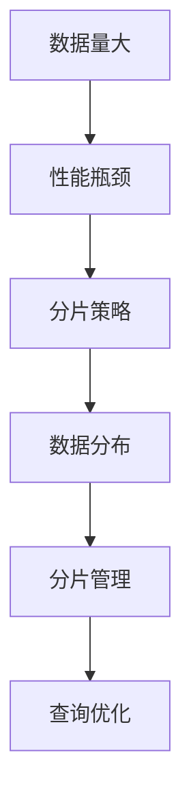

- **数据量大**：随着业务的发展，数据量不断增长，单台数据库服务器可能无法满足性能需求。
- **性能瓶颈**：单台数据库服务器在处理大量数据时可能会出现响应时间慢、吞吐量低的问题。
- **分片策略**：根据业务需求和数据特点选择合适的分片方式，如水平分片、垂直分片等。
- **数据分布**：将数据分散存储在多个服务器上，确保数据均衡分布，避免单点瓶颈。
- **分片管理**：管理分片的创建、删除、迁移等操作，确保分片系统的稳定运行。
- **查询优化**：通过分片策略优化查询性能，降低查询延迟和成本。

### 1.2 数据库分区的概念与分类

数据库分区是将一个大型的数据表拆分成多个较小的数据段的过程。分区的主要目的是提高查询效率，降低数据维护成本，同时便于数据备份和恢复。

#### Mermaid流程图：数据库分区的概念与分类

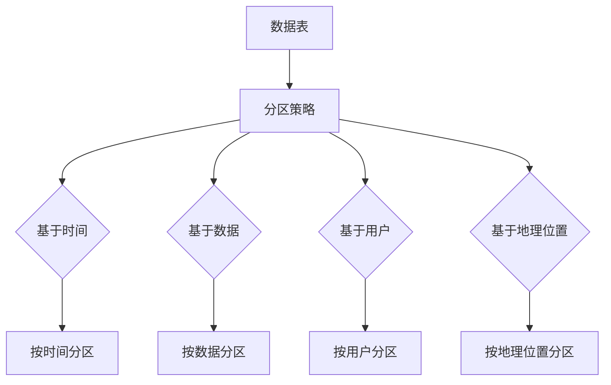

- **基于时间分区**：根据数据的时间戳对数据进行分区，如按天、月等时间单位进行分区。
- **基于数据分区**：根据数据的某些属性（如ID、类别等）对数据进行分区。
- **基于用户分区**：根据用户的属性（如用户ID、地理位置等）对数据进行分区。
- **基于地理位置分区**：根据地理位置对数据进行分区，适用于地理信息系统（GIS）等应用。

### 1.3 数据库分片与分区的比较

#### Mermaid流程图：数据库分片与分区的比较

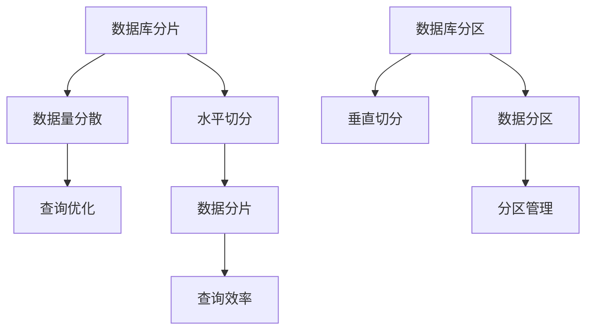

- **分片**：将整个数据库拆分成多个独立管理的数据库实例，主要目的是提高系统扩展性和性能。
- **分区**：将一个大型的数据表拆分成多个较小的数据段，主要目的是提高查询效率和数据维护成本。

- **水平分片**：将数据按照某种规则分散存储在多个服务器上，适用于数据量大、数据关系不复杂的情况。
- **垂直分片**：将数据按照某种规则拆分成多个独立的数据表，适用于数据关系复杂、需要独立管理的情况。

- **查询优化**：通过分片策略优化查询性能，降低查询延迟和成本。
- **分区管理**：管理分区的创建、删除、迁移等操作，确保分片系统的稳定运行。

接下来，我们将深入探讨数据库分片的具体策略。

### 第二部分：数据库分片策略

#### 第2章：数据库分片策略

数据库分片策略是决定如何将数据在多个服务器上分布存储的关键技术。以下是一些常见的数据库分片策略。

### 2.1 范式化分片

范式化分片是一种基于数据库范式理论的分片方法。它的基本思想是按照数据库范式将数据表进行规范化，将数据表拆分成多个较小的数据表，从而实现数据的垂直切分。

#### Mermaid流程图：范式化分片

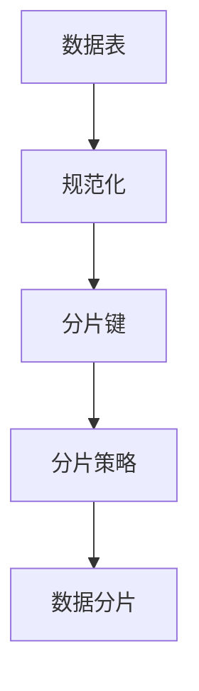

- **规范化**：将数据表按照数据库范式进行规范化，拆分成多个较小的数据表。
- **分片键**：选择合适的分片键，用于划分数据表。
- **分片策略**：根据数据特点和查询需求，选择合适的分片方式。
- **数据分片**：将数据按照分片键划分到不同的数据表中。

### 2.2 垂直分片

垂直分片是将数据表按照字段进行拆分，将一个数据表拆分成多个独立的数据表。垂直分片适用于数据关系复杂、需要独立管理的情况。

#### Mermaid流程图：垂直分片

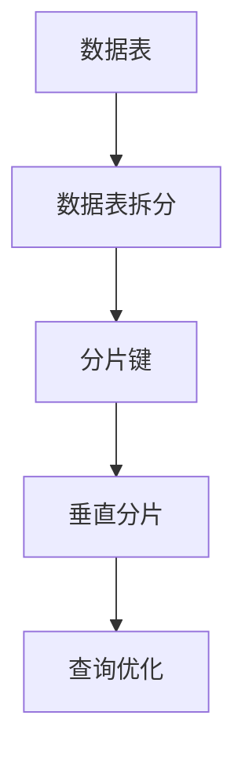

- **数据表拆分**：将数据表按照字段进行拆分，拆分成多个独立的数据表。
- **分片键**：选择合适的分片键，用于划分数据表。
- **垂直分片**：将数据按照分片键划分到不同的数据表中。
- **查询优化**：通过垂直分片策略优化查询性能，降低查询延迟和成本。

### 2.3 水平分片

水平分片是将数据按照某种规则分散存储在多个服务器上。水平分片适用于数据量大、数据关系不复杂的情况。

#### Mermaid流程图：水平分片

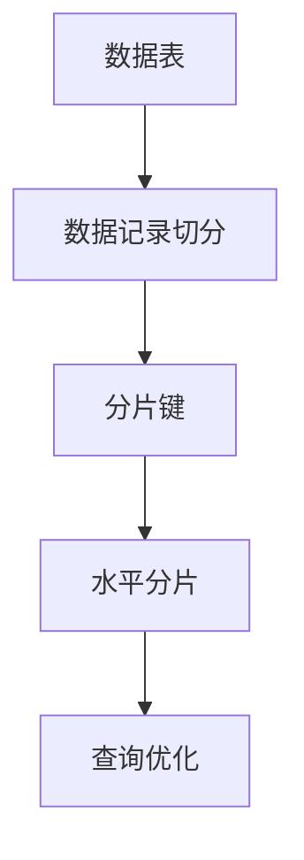

- **数据记录切分**：将数据表中的数据记录按照某种规则（如ID、时间等）进行切分。
- **分片键**：选择合适的分片键，用于划分数据记录。
- **水平分片**：将数据记录按照分片键分散存储在多个服务器上。
- **查询优化**：通过水平分片策略优化查询性能，降低查询延迟和成本。

### 2.4 基于内容的分片

基于内容的分片是根据数据的内容属性对数据进行分片。这种方法适用于数据具有明显的属性特征，如图片、视频等。

#### Mermaid流程图：基于内容的分片

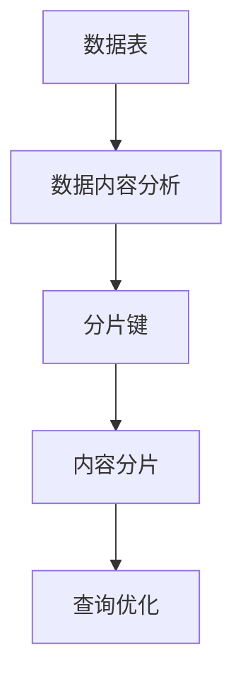

- **数据内容分析**：对数据的内容属性进行分析，确定分片的依据。
- **分片键**：选择合适的内容属性作为分片键。
- **内容分片**：将数据按照分片键划分到不同的数据段中。
- **查询优化**：通过内容分片策略优化查询性能，降低查询延迟和成本。

接下来，我们将探讨数据库分区策略。

### 第三部分：数据库分区策略

#### 第3章：数据库分区策略

数据库分区策略是将数据表拆分成多个较小的数据段，以提高查询效率和数据维护成本。以下是一些常见的数据库分区策略。

### 3.1 基于时间的分区

基于时间的分区是按照数据的时间戳对数据进行分区。这种方法适用于时间序列数据，如日志数据、交易数据等。

#### Mermaid流程图：基于时间的分区

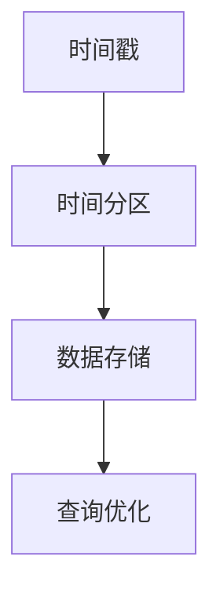

- **时间戳**：根据数据的时间戳对数据进行分区。
- **时间分区**：将数据按照时间戳划分到不同的数据段中。
- **数据存储**：将分区后的数据存储在不同的磁盘或服务器上。
- **查询优化**：通过时间分区策略优化查询性能，降低查询延迟和成本。

### 3.2 基于数据的分区

基于数据的分区是根据数据的某些属性（如ID、类别等）对数据进行分区。这种方法适用于具有明显属性特征的数据。

#### Mermaid流程图：基于数据的分区

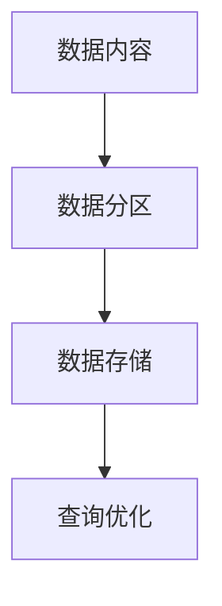

- **数据内容**：对数据的内容属性进行分析，确定分片的依据。
- **数据分区**：将数据按照分片键划分到不同的数据段中。
- **数据存储**：将分区后的数据存储在不同的磁盘或服务器上。
- **查询优化**：通过数据分区策略优化查询性能，降低查询延迟和成本。

### 3.3 基于用户的分区

基于用户的分区是按照用户的属性（如用户ID、地理位置等）对数据进行分区。这种方法适用于需要根据用户属性进行数据隔离的场景。

#### Mermaid流程图：基于用户的分区

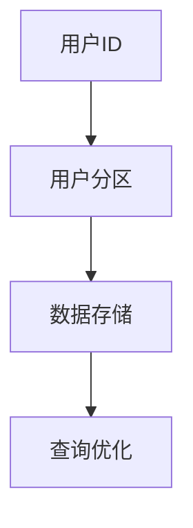

- **用户ID**：根据用户的属性（如用户ID、地理位置等）对数据进行分区。
- **用户分区**：将数据按照用户属性划分到不同的数据段中。
- **数据存储**：将分区后的数据存储在不同的磁盘或服务器上。
- **查询优化**：通过用户分区策略优化查询性能，降低查询延迟和成本。

### 3.4 基于地理位置的分区

基于地理位置的分区是按照地理位置对数据进行分区。这种方法适用于地理信息系统（GIS）等应用。

#### Mermaid流程图：基于地理位置的分区

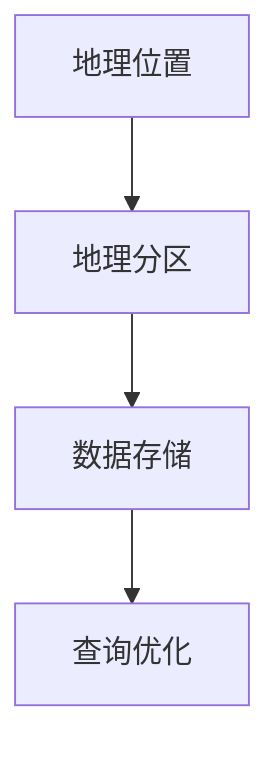

- **地理位置**：根据地理位置对数据进行分区。
- **地理分区**：将数据按照地理位置划分到不同的数据段中。
- **数据存储**：将分区后的数据存储在不同的磁盘或服务器上。
- **查询优化**：通过地理位置分区策略优化查询性能，降低查询延迟和成本。

接下来，我们将探讨LLM应用场景下的数据库分片与分区。

### 第四部分：LLM应用场景下的数据库分片与分区

#### 第4章：LLM应用场景分析

LLM（大型语言模型）应用场景广泛，如文本生成、问答系统、自然语言理解、机器翻译等。这些应用具有数据量大、多样性、实时性等特征，对数据库性能提出了高要求。本节将分析LLM应用的典型场景和数据特点，探讨其性能需求。

### 4.1 LLM应用的典型场景

LLM应用的典型场景包括：

- **文本生成与编辑**：根据输入文本生成新的文本或对输入文本进行编辑。
- **问答系统**：根据用户提问生成回答，提供知识问答服务。
- **自然语言理解**：分析输入文本，提取关键信息，理解语义。
- **机器翻译**：将一种语言的文本翻译成另一种语言。

### 4.2 LLM应用的数据特点

LLM应用的数据特点包括：

- **数据量大**：LLM应用处理的数据量通常非常大，需要高效的数据库处理能力。
- **数据多样性**：LLM应用涉及多种类型的数据，如文本、图像、音频等。
- **数据实时性**：LLM应用需要实时响应，对延迟有较高要求。
- **数据一致性**：LLM应用通常需要保证数据的一致性，确保输出结果准确。

### 4.3 LLM应用的性能需求

LLM应用对数据库性能的需求主要包括：

- **高并发处理能力**：LLM应用需要同时处理大量用户请求，数据库应具备高并发处理能力。
- **低延迟响应**：LLM应用对延迟有较高要求，数据库应确保快速响应。
- **数据一致性保证**：LLM应用需要保证数据的一致性，确保输出结果准确。
- **可扩展性**：数据库应具备良好的可扩展性，能够支持数据量的增长。

接下来，我们将探讨如何利用数据库分片与分区技术提升LLM应用的性能。

### 第五部分：数据库分片与分区在LLM应用中的优化

#### 第5章：数据库分片与分区在LLM应用中的优化

数据库分片与分区技术在LLM应用中具有重要意义，可以显著提升数据处理能力和性能。本节将讨论数据库分片与分区对LLM应用性能的影响，以及优化策略和实现细节。

### 5.1 数据库分片与分区对LLM应用性能的影响

数据库分片与分区技术对LLM应用性能的影响主要表现在以下几个方面：

- **查询性能提升**：通过分片与分区，可以将数据分散存储在多个服务器上，减少单个服务器的负载，提高查询性能。
- **响应时间降低**：数据分散存储可以减少数据传输延迟，提高响应速度。
- **并发处理能力增强**：分片与分区可以同时处理多个请求，提高系统的并发处理能力。
- **扩展性提高**：分片与分区使得数据库系统更加灵活，可以根据需求扩展存储资源和计算资源。

#### Mermaid流程图：数据库分片与分区对LLM应用性能的影响

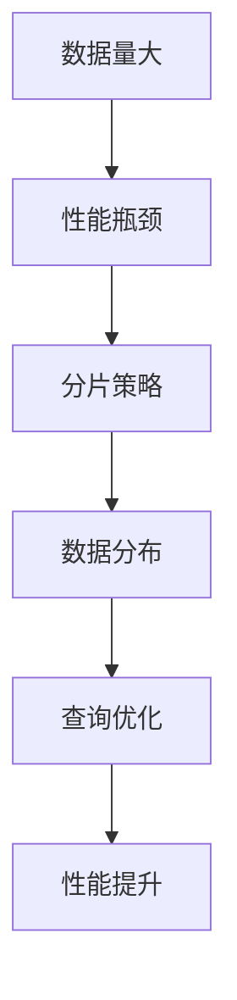

- **数据量大**：随着业务的发展，数据量不断增长，可能导致单台数据库服务器性能瓶颈。
- **性能瓶颈**：单台数据库服务器在处理大量数据时，可能面临响应时间慢、吞吐量低等问题。
- **分片策略**：选择合适的分片策略，将数据分散存储在多个服务器上。
- **数据分布**：实现数据均衡分布，避免单点瓶颈。
- **查询优化**：通过优化查询方式，提高查询性能。
- **性能提升**：通过分片与分区，提高系统的整体性能。

### 5.2 数据库分片与分区在LLM应用中的优化策略

为了充分发挥数据库分片与分区技术在LLM应用中的优势，可以采取以下优化策略：

- **选择合适的分片策略**：根据LLM应用的数据特点和性能需求，选择合适的分片策略，如水平分片、垂直分片、基于内容的分片等。
- **优化分区策略**：根据LLM应用的查询需求，选择合适的分区策略，如基于时间的分区、基于数据的分区、基于用户的分区、基于地理位置的分区等。
- **数据均衡分布**：确保数据在多个服务器上的均衡分布，避免数据热点问题，提高系统性能。
- **动态调整分片与分区策略**：根据业务需求的变化，动态调整分片与分区策略，以适应不同的性能需求。
- **优化查询方式**：通过优化查询方式，如索引优化、缓存优化等，提高查询性能。

### 5.3 分区策略在LLM应用中的实现细节

在LLM应用中，实现分片与分区策略需要考虑以下细节：

- **分片键的选择**：选择合适的分片键，确保数据在多个服务器上的均衡分布。分片键应具有唯一性，避免数据重复和冲突。
- **分区键的选择**：选择合适的分区键，根据查询需求对数据进行分区。分区键应与分片键相协调，以提高查询性能。
- **分片与分区管理**：实现分片与分区的创建、删除、迁移等管理操作，确保系统的稳定性。
- **数据迁移与同步**：在分片与分区过程中，实现数据迁移与同步，确保数据的一致性。
- **查询优化**：通过优化查询方式，如使用索引、缓存等，提高查询性能。

接下来，我们将探讨数据库分片与分区在LLM应用中的实践。

### 第六部分：数据库分片与分区在LLM应用中的实践

#### 第6章：数据库分片与分区在LLM应用中的实践

数据库分片与分区技术在LLM应用中具有广泛的应用。本节将结合实际案例，详细解析数据库分片与分区在LLM应用中的实践，并评估其性能。

### 6.1 数据库分片与分区在LLM应用中的案例分析

以下是一个大型文本生成平台在数据库分片与分区方面的实践案例。

- **应用背景**：该文本生成平台处理大量文本数据，包括文章、新闻、问答等，数据量巨大，对数据库性能提出了高要求。
- **解决方案**：采用数据库分片与分区技术，将数据表进行分片与分区，提高系统性能。

#### 案例一：大型文本生成平台的数据库分片与分区实践

- **分片策略**：采用水平分片策略，将文本数据按照ID进行分片，每个分片存储一部分文本数据。
- **分区策略**：采用基于时间的分区策略，将文本数据按照时间进行分区，每个分区存储一段时间内的文本数据。

#### 实践步骤：

1. **数据表拆分**：将原始的文本数据表拆分成多个较小的数据表，每个数据表存储一部分文本数据。
2. **分片键设置**：设置ID作为分片键，确保每个数据表存储的文本数据属于同一分片。
3. **分区键设置**：设置时间戳作为分区键，确保每个数据表存储的文本数据属于同一分区。
4. **数据迁移**：将原始数据迁移到分片与分区的数据表中。
5. **查询优化**：通过优化查询方式，如使用索引、缓存等，提高查询性能。

#### 性能评估：

- **查询性能提升**：通过分片与分区，将数据分散存储在多个服务器上，查询性能显著提升。
- **响应时间降低**：数据分散存储可以减少数据传输延迟，响应时间显著降低。
- **并发处理能力增强**：分片与分区使得系统可以同时处理多个请求，并发处理能力显著增强。

### 6.2 数据库分片与分区在LLM应用中的实际案例

以下是一个问答系统的数据库分片与分区实践案例。

- **应用背景**：该问答系统处理大量用户提问和回答数据，数据量巨大，对数据库性能提出了高要求。
- **解决方案**：采用数据库分片与分区技术，将数据表进行分片与分区，提高系统性能。

#### 案例二：问答系统的数据库分片与分区实践

- **分片策略**：采用基于内容的分片策略，将问答数据按照内容进行分片，每个分片存储一部分问答数据。
- **分区策略**：采用基于时间的分区策略，将问答数据按照时间进行分区，每个分区存储一段时间内的问答数据。

#### 实践步骤：

1. **数据表拆分**：将原始的问答数据表拆分成多个较小的数据表，每个数据表存储一部分问答数据。
2. **分片键设置**：设置内容作为分片键，确保每个数据表存储的问答数据属于同一分片。
3. **分区键设置**：设置时间戳作为分区键，确保每个数据表存储的问答数据属于同一分区。
4. **数据迁移**：将原始数据迁移到分片与分区的数据表中。
5. **查询优化**：通过优化查询方式，如使用索引、缓存等，提高查询性能。

#### 性能评估：

- **查询性能提升**：通过分片与分区，将数据分散存储在多个服务器上，查询性能显著提升。
- **响应时间降低**：数据分散存储可以减少数据传输延迟，响应时间显著降低。
- **并发处理能力增强**：分片与分区使得系统可以同时处理多个请求，并发处理能力显著增强。

### 6.3 数据库分片与分区在LLM应用中的性能评估

通过对数据库分片与分区技术在LLM应用中的实践案例进行分析，可以得出以下性能评估结果：

- **查询性能提升**：分片与分区可以显著提升查询性能，降低查询延迟，提高系统吞吐量。
- **响应时间降低**：分片与分区可以减少数据传输延迟，提高系统的响应速度，提升用户体验。
- **并发处理能力增强**：分片与分区可以同时处理多个请求，提高系统的并发处理能力，支持高并发场景。
- **扩展性提高**：分片与分区使得系统具备良好的扩展性，可以根据需求动态调整分片与分区策略，支持数据量的增长。

综上所述，数据库分片与分区技术在LLM应用中具有重要意义，可以显著提升数据处理能力和性能。通过合理的分片与分区策略，可以应对数据量大、多样性、实时性等挑战，为LLM应用提供高效的支撑。

### 第七部分：数据库分片与分区在LLM应用中的未来趋势

#### 第7章：数据库分片与分区在LLM应用中的未来趋势

随着人工智能技术的快速发展，LLM应用在各个领域得到广泛应用。数据库分片与分区技术作为提升数据处理能力和性能的关键技术，也在不断发展与优化。本节将探讨数据库分片与分区在LLM应用中的未来趋势，以及面临的挑战与机遇。

### 7.1 数据库分片与分区技术的发展趋势

数据库分片与分区技术在未来几年将呈现以下发展趋势：

- **分布式数据库系统成熟**：分布式数据库系统（如Cassandra、MongoDB、HBase等）将进一步成熟，提供更高效、可靠的分片与分区功能。
- **新型分片与分区算法研究**：随着大数据和云计算的发展，新型分片与分区算法将不断涌现，如基于机器学习的分片与分区算法、分布式缓存分片算法等。
- **自动化管理**：数据库分片与分区将更加智能化和自动化，减少人工干预，提高系统稳定性。

### 7.2 LLM应用中的新型分片与分区策略

未来，LLM应用将探索以下新型分片与分区策略：

- **基于AI的分片与分区策略**：利用机器学习算法，根据数据特点和查询需求自动选择最优的分片与分区策略。
- **基于区块链的分片与分区策略**：结合区块链技术，实现去中心化的分片与分区，提高数据的安全性和隐私性。
- **基于联邦学习的分片与分区策略**：通过联邦学习技术，实现跨数据源的统一分片与分区，提高数据共享和协作效率。

### 7.3 数据库分片与分区在LLM应用中的未来挑战与机遇

未来，数据库分片与分区技术在LLM应用中面临以下挑战与机遇：

- **数据一致性与实时性平衡**：如何在保证数据一致性的同时，实现实时性的提升，是未来需要解决的关键问题。
- **智能化与自动化**：提高分片与分区策略的智能化和自动化水平，降低人工干预，提高系统稳定性。
- **安全性与隐私保护**：随着数据安全与隐私问题的日益突出，如何在分片与分区过程中保障数据的安全性和隐私性，是一个重要挑战。
- **扩展性与性能优化**：如何在应对海量数据和并发请求的同时，实现系统的高性能和可扩展性，是未来的重要研究方向。

综上所述，数据库分片与分区技术在LLM应用中具有重要的地位，未来将继续发展和优化。通过不断探索新型分片与分区策略，可以应对日益复杂的应用场景，为人工智能技术的发展提供有力支撑。

### 附录

#### 第8章：数据库分片与分区参考资料

以下是一些关于数据库分片与分区的参考资料，供读者进一步学习和了解：

- **相关书籍推荐**：
  - 《数据库系统概念》
  - 《分布式系统概念与设计》
  - 《大数据技术基础》

- **学术论文精选**：
  - "Data Partitioning Strategies for Parallel Database Systems"
  - "Database Sharding: partitioning Data for Multi-Server Applications"
  - "A Survey of Database Partitioning Methods and Algorithms"

- **在线资源介绍**：
  - [Apache Cassandra官网](http://cassandra.apache.org/)
  - [MongoDB官网](https://www.mongodb.com/)
  - [HBase官网](https://hbase.apache.org/)
  - [ShardingSphere官网](https://shardingsphere.apache.org/)
  - [DataStax Enterprise官网](https://www.datastax.com/)

#### 附录A：数据库分片与分区相关工具与框架

以下是一些常用的数据库分片与分区工具与框架：

- **分布式数据库系统**：
  - **Apache Cassandra**：一款开源分布式数据库系统，支持自动分片和分区。
  - **MongoDB**：一款开源文档型数据库，支持水平分片和垂直分片。
  - **HBase**：一款基于Hadoop的分布式存储系统，支持海量数据的存储和分片。

- **数据库分片与分区工具**：
  - **ShardingSphere**：一款开源分布式数据库中间件，提供分片、分区的功能。
  - **Apache ZooKeeper**：一款分布式协调服务，用于管理分布式系统的分片与分区。
  - **DataStax Enterprise**：一款商业级分布式数据库系统，提供全面的分片与分区功能。

#### 附录B：数据库分片与分区相关Mermaid流程图

以下是一些数据库分片与分区相关的Mermaid流程图：

- **数据库分片流程图**：
  ```mermaid
  graph TD
  A[数据量大] --> B[性能瓶颈]
  B --> C[分片策略]
  C --> D[数据分布]
  D --> E[分片管理]
  E --> F[查询优化]
  ```

- **数据库分区流程图**：
  ```mermaid
  graph TD
  A[数据表] --> B[分区策略]
  B --> C{基于时间}
  C --> D[按时间分区]
  B --> E{基于数据}
  E --> F[按数据分区]
  B --> G{基于用户}
  G --> H[按用户分区]
  B --> I{基于地理位置}
  I --> J[按地理位置分区]
  ```

#### 附录C：数据库分片与分区相关数学模型与公式

以下是一些数据库分片与分区相关的数学模型与公式：

- **数据库分片中的负载均衡公式**：
  $$ Load_{balance} = \frac{Total_{work}}{Number_{of_{nodes}}} $$

- **数据库分区中的并行查询公式**：
  $$ Query_{time} = \frac{Total_{data}}{Parallel_{queries} \times Throughput} $$

#### 附录D：数据库分片与分区相关代码示例

以下是一些数据库分片与分区相关的代码示例：

- **分片策略实现示例**（以ShardingSphere为例）：
  ```java
  ShardingsphereConfig config = new ShardingsphereConfig();
  config.rule().sharding().table().name("t_order").strategy().sharding().algorithmType("table_sharding_by_mod").properties("tableShardingCount","4");
  config.rule().sharding().table().name("t_order").strategy().keyGenerator().column("order_id").type("SNOWFLAKE");
  ShardingSphereDatabase database = ShardingSphereDatabase.newInstance(config);
  ```

- **分区策略实现示例**（以MongoDB为例）：
  ```python
  from pymongo import MongoClient

  client = MongoClient("mongodb://localhost:27017/")
  db = client["mydatabase"]

  collection = db["orders"]
  collection.create_index("order_time")

  order1 = {"order_id": 1, "order_time": "2022-01-01", "amount": 100}
  order2 = {"order_id": 2, "order_time": "2022-01-02", "amount": 200}

  collection.insert_many([order1, order2])
  ```

### 作者信息

**作者：AI天才研究院/AI Genius Institute & 禅与计算机程序设计艺术 /Zen And The Art of Computer Programming**

---

通过本文的深入探讨，我们详细介绍了数据库分片与分区的基础概念、策略及其在LLM应用中的重要性。我们分析了LLM应用场景下的数据特点与性能需求，探讨了如何利用数据库分片与分区技术来提升LLM应用的数据处理能力。通过实际案例与实践，我们展示了数据库分片与分区在LLM应用中的有效性和实用性。展望未来，数据库分片与分区技术将继续发展，为人工智能技术的发展提供有力支撑。希望本文能为读者在数据库分片与分区领域提供有价值的参考与启示。

