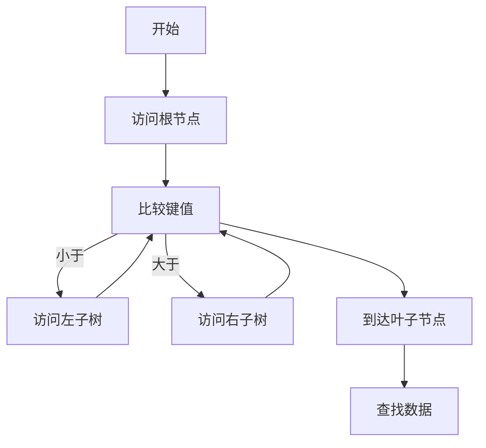
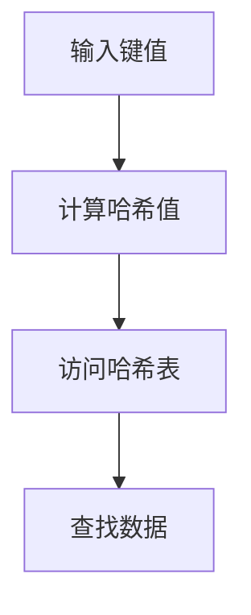
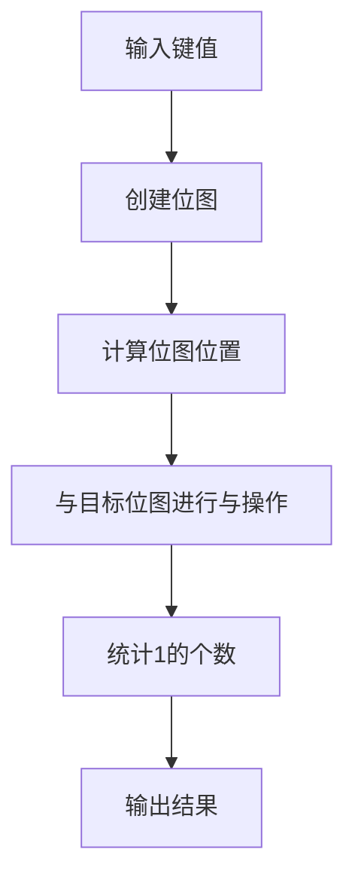

                 

# 《数据库索引优化LLM应用查询效率》

> 关键词：数据库索引、LLM、查询效率、优化策略、案例分析

> 摘要：本文深入探讨了数据库索引优化在提升LLM应用查询效率方面的重要性和具体策略。通过分析索引的基础概念、原理、优化方法和实际应用案例，为读者提供了全面的技术指导和实用建议。

## 目录

1. 第一部分：数据库索引优化基础
   1.1 数据库索引概述
   1.2 数据库索引原理
   1.3 索引优化策略
   1.4 索引优化的工具与技术
   1.5 索引优化案例分析

2. 第二部分：LLM应用与查询效率
   2.1 LLM简介
   2.2 LLM模型结构
   2.3 LLM训练与优化
   2.4 LLM与数据库查询效率
   2.5 实际应用案例

3. 附录
   3.1 数据库索引优化相关工具介绍
   3.2 LLM模型参数调优指南
   3.3 常见数据库索引优化问题汇总与解答

### 第一部分：数据库索引优化基础

#### 第1章：数据库索引概述

1.1 数据库索引的基本概念

数据库索引是一种数据结构，它可以帮助快速地查找数据库表中的特定行。索引通过创建指针指向表中的数据页，从而提高查询速度。索引类似于书的目录，可以快速定位到所需内容的位置，而无需逐页翻阅。

1.2 索引的类型

数据库索引主要有以下几种类型：

- B+树索引：最常见的索引类型，适用于大部分查询场景。
- 哈希索引：通过哈希函数快速定位数据，适用于等值查询。
- 位图索引：适用于列值离散且比较少的场景。

1.3 索引的设计原则

索引设计应遵循以下原则：

- 优先考虑最频繁的查询：设计索引时，应优先考虑最常用的查询语句。
- 索引列的选择：选择具有高选择性（即不同值的比例高）的列作为索引。
- 索引列的顺序：根据查询条件设计索引列的顺序。

### 第2章：数据库索引原理

2.1 B+树索引

B+树索引是一种多路平衡搜索树，具有以下特点：

- 节点中只有键值和子节点指针。
- 只有叶子节点存储数据。
- 每个节点的键值数略大于或等于一半的最大键值数。

B+树索引的查询过程如下：

2.2 哈希索引

哈希索引通过哈希函数快速定位数据。哈希索引的特点如下：

- 查询速度快，但适用于等值查询。
- 哈希冲突可能导致查询性能下降。

哈希索引的查询过程如下：

2.3 位图索引

位图索引适用于列值离散且比较少的场景。位图索引的查询过程如下：

2.4 索引结构的性能对比

不同类型的索引结构具有不同的性能特点，以下是它们之间的性能对比：

| 索引类型 | 查询速度 | 更新速度 | 占用空间 |
| :------: | :------: | :------: | :------: |
| B+树索引 | 较快     | 较慢     | 较大     |
| 哈希索引 | 快       | 较快     | 较小     |
| 位图索引 | 快       | 快       | 较小     |

### 第3章：索引优化策略

3.1 查询优化

查询优化是提高数据库性能的重要手段，主要包括以下策略：

- 选择合适的索引类型。
- 避免全表扫描。
- 减少数据冗余。

3.2 索引维护

索引维护是保证数据库性能的重要环节，主要包括以下任务：

- 定期重建索引。
- 定期优化索引。
- 监控索引使用情况。

3.3 索引选择与创建

索引选择与创建是优化数据库性能的关键，应遵循以下原则：

- 根据查询需求选择索引。
- 选择高选择性列作为索引。
- 创建复合索引，提高查询效率。

### 第4章：索引优化的工具与技术

4.1 自动化索引优化工具

自动化索引优化工具可以自动识别数据库性能问题并提供优化建议。常用的自动化索引优化工具有：

- SQL Server 的 Index Tuning Wizard。
- MySQL 的 pt-query-digest。
- PostgreSQL 的 pg_repack。

4.2 SQL优化器原理

SQL优化器是数据库系统的核心组件，负责生成执行计划。SQL优化器的工作原理如下：

- 首先分析查询语句，生成查询树。
- 然后对查询树进行重写，生成执行计划。
- 最后根据执行计划执行查询。

4.3 存储引擎的选择

存储引擎是数据库系统的核心组件，直接影响数据库的性能。常用的存储引擎有：

- InnoDB：支持事务、行级锁，适用于高并发场景。
- MyISAM：不支持事务、表级锁，适用于读多写少场景。
- Memory：基于内存存储，适用于临时数据。

### 第5章：索引优化案例分析

5.1 案例一：电商平台的查询优化

电商平台中的商品查询是一个典型的查询优化案例。通过以下策略进行查询优化：

- 创建商品名称、分类、价格等复合索引。
- 避免全表扫描，使用索引查询。
- 定期重建索引，提高查询性能。

5.2 案例二：金融数据库的索引优化

金融数据库中的交易查询是一个复杂的查询优化案例。通过以下策略进行查询优化：

- 创建交易时间、交易金额等复合索引。
- 避免全表扫描，使用索引查询。
- 根据查询需求调整索引结构。

5.3 案例三：大数据处理的索引优化

大数据处理中的索引优化面临巨大挑战。通过以下策略进行查询优化：

- 选择适合大数据处理的索引类型，如位图索引。
- 避免全表扫描，使用索引查询。
- 利用分布式计算框架优化索引性能。

### 第二部分：LLM应用与查询效率

#### 第6章：LLM简介

6.1 什么是LLM

LLM（Large Language Model）是一种大型语言模型，通过学习海量文本数据生成自然语言文本。LLM具有以下特点：

- 参数规模巨大：数十亿至千亿级别的参数。
- 自适应能力强：可以根据不同场景进行调整。
- 生成文本质量高：生成的文本具有很高的可读性。

6.2 LLM的发展历程

LLM的发展历程可以分为以下几个阶段：

- 早期的统计语言模型，如N-gram模型。
- 基于神经网络的深度学习模型，如循环神经网络（RNN）。
- Transformer模型的提出，引领了LLM的发展。

6.3 LLM的应用场景

LLM在多个领域具有广泛的应用，主要包括：

- 自然语言处理：文本分类、机器翻译、情感分析等。
- 问答系统：智能客服、问答机器人等。
- 自动写作：文章生成、摘要生成等。

#### 第7章：LLM模型结构

7.1 语言模型的基本结构

语言模型的基本结构包括输入层、隐藏层和输出层。输入层接收文本序列，隐藏层通过神经网络进行处理，输出层生成概率分布。

7.2 注意力机制

注意力机制是一种用于提高模型处理长序列数据的能力的技术。注意力机制通过计算不同部分之间的相关性，提高模型的生成质量。

7.3 Transformer模型详解

Transformer模型是一种基于自注意力机制的序列到序列模型，具有以下特点：

- 并行计算：通过多头注意力机制实现并行计算，提高计算效率。
- 自适应：通过上下文信息生成文本，具有很高的自适应能力。

#### 第8章：LLM训练与优化

8.1 LLM训练过程

LLM的训练过程包括以下步骤：

- 数据预处理：清洗文本数据，分词、去停用词等。
- 构建词向量：将文本转化为数字向量。
- 训练模型：通过梯度下降等优化算法训练模型。
- 调参与验证：调整模型参数，提高生成质量。

8.2 LLM优化方法

LLM的优化方法主要包括：

- 正则化：防止模型过拟合。
- 批次归一化：加速收敛。
- 梯度裁剪：防止梯度爆炸。

8.3 模型压缩与加速

模型压缩与加速的方法包括：

- 参数剪枝：删除冗余参数。
- 模型量化：降低模型参数的精度。
- 硬件加速：利用GPU、TPU等硬件加速计算。

#### 第9章：LLM与数据库查询效率

9.1 LLM在数据库查询中的应用

LLM在数据库查询中的应用主要包括：

- 自动生成查询语句。
- 智能查询优化。
- 数据库问答系统。

9.2 LLM对数据库查询效率的影响

LLM对数据库查询效率的影响包括：

- 提高查询语句生成质量。
- 优化查询执行计划。
- 降低查询响应时间。

9.3 查询优化的新挑战与解决方案

随着LLM在数据库查询中的应用，查询优化面临以下新挑战：

- 大规模数据生成：提高数据处理能力。
- 查询语句多样性：优化查询生成算法。
- 查询性能评估：准确评估查询性能。

针对这些挑战，可以采取以下解决方案：

- 利用分布式计算框架提高数据处理能力。
- 结合统计学习与深度学习优化查询生成算法。
- 设计针对LLM的查询性能评估方法。

#### 第10章：实际应用案例

10.1 案例一：智能客服系统

智能客服系统利用LLM生成自然语言回答，提高客户满意度。通过以下步骤实现智能客服系统：

- 数据预处理：清洗客户咨询文本，分词、去停用词等。
- 模型训练：训练LLM模型，提高生成质量。
- 查询优化：利用LLM生成优化查询语句。
- 系统部署：实现智能客服系统，提供自动回答。

10.2 案例二：个性化推荐系统

个性化推荐系统利用LLM生成个性化推荐文案，提高用户满意度。通过以下步骤实现个性化推荐系统：

- 数据预处理：清洗用户行为数据，分词、去停用词等。
- 模型训练：训练LLM模型，提高生成质量。
- 查询优化：利用LLM生成优化查询语句。
- 系统部署：实现个性化推荐系统，提供个性化推荐。

10.3 案例三：金融风控系统

金融风控系统利用LLM生成风险分析报告，提高风控效果。通过以下步骤实现金融风控系统：

- 数据预处理：清洗金融数据，分词、去停用词等。
- 模型训练：训练LLM模型，提高生成质量。
- 查询优化：利用LLM生成优化查询语句。
- 系统部署：实现金融风控系统，提供风险分析报告。

### 附录

#### 附录A：数据库索引优化相关工具介绍

附录A介绍了常用的数据库索引优化工具，包括：

- SQL Server 的 Index Tuning Wizard。
- MySQL 的 pt-query-digest。
- PostgreSQL 的 pg_repack。

#### 附录B：LLM模型参数调优指南

附录B提供了LLM模型参数调优指南，包括：

- 学习率、批量大小等超参数的选择。
- 正则化方法的选择。
- 梯度裁剪策略。

#### 附录C：常见数据库索引优化问题汇总与解答

附录C汇总了常见数据库索引优化问题，并提供了解答，包括：

- 如何选择合适的索引类型？
- 如何避免全表扫描？
- 如何优化索引维护策略？

### 作者

作者：AI天才研究院/AI Genius Institute & 禅与计算机程序设计艺术 /Zen And The Art of Computer Programming

本文详细阐述了数据库索引优化在提升LLM应用查询效率方面的重要性和具体策略。通过分析索引的基础概念、原理、优化方法和实际应用案例，为读者提供了全面的技术指导和实用建议。希望本文能对您的数据库索引优化工作有所帮助。

