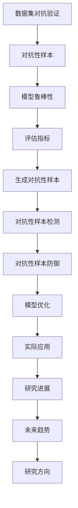
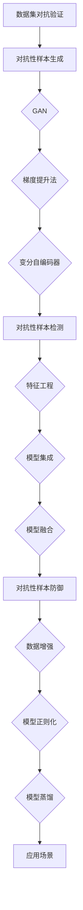

                 

# 《数据集对抗验证：评估模型鲁棒性的新思路》

## 关键词：数据集对抗验证，模型鲁棒性，对抗性样本，评估方法

### 摘要

数据集对抗验证是一种评估模型鲁棒性的新思路，旨在通过引入对抗性样本来检验模型在极端条件下的性能表现。本文从数据集对抗验证的背景、基础、方法、案例和应用等方面进行深入探讨，揭示了数据集对抗验证在提高模型鲁棒性方面的关键作用。通过本文的介绍，读者可以了解数据集对抗验证的核心概念、方法及其在实际应用中的价值。

## 目录大纲

### 《数据集对抗验证：评估模型鲁棒性的新思路》

#### 关键词：数据集对抗验证，模型鲁棒性，对抗性样本，评估方法

#### 摘要

### 第一部分：数据集对抗验证概述

#### 第1章：数据集对抗验证背景

##### 1.1 数据集对抗验证的起源
##### 1.2 数据集对抗验证的目的
##### 1.3 数据集对抗验证的重要性
##### 1.4 数据集对抗验证的应用领域

#### 第2章：数据集对抗验证基础

##### 2.1 数据集对抗验证的核心概念
##### 2.2 数据集对抗验证的分类
##### 2.3 数据集对抗验证的主要挑战

### 第二部分：数据集对抗验证方法

#### 第3章：数据集对抗验证技术基础

##### 3.1 数据集生成与预处理
##### 3.2 数据集对抗性增强
##### 3.3 数据集对抗验证评估指标

#### 第4章：常见的数据集对抗验证方法

##### 4.1 对抗性样本生成方法
##### 4.2 对抗性样本检测方法
##### 4.3 对抗性样本防御方法

#### 第5章：数据集对抗验证案例分析

##### 5.1 案例一：图像分类任务中的数据集对抗验证
##### 5.2 案例二：自然语言处理任务中的数据集对抗验证
##### 5.3 案例三：网络流量分析任务中的数据集对抗验证

### 第三部分：数据集对抗验证应用

#### 第6章：数据集对抗验证在工业中的应用

##### 6.1 数据集对抗验证在网络安全中的应用
##### 6.2 数据集对抗验证在自动驾驶中的应用
##### 6.3 数据集对抗验证在金融风控中的应用

#### 第7章：数据集对抗验证前沿与趋势

##### 7.1 数据集对抗验证研究进展
##### 7.2 数据集对抗验证未来发展趋势
##### 7.3 数据集对抗验证未来研究方向

### 附录

#### 附录 A：数据集对抗验证工具与资源

##### A.1 主流数据集对抗验证工具介绍
##### A.2 数据集对抗验证相关论文与资料推荐
##### A.3 数据集对抗验证实验环境搭建指南

#### 附录 B：Mermaid 流程图

##### B.1 数据集对抗验证核心概念 Mermaid 流程图
##### B.2 数据集对抗验证方法 Mermaid 流程图

#### 附录 C：核心算法伪代码

##### C.1 对抗性样本生成算法伪代码
##### C.2 对抗性样本检测算法伪代码
##### C.3 对抗性样本防御算法伪代码

#### 附录 D：数学模型与公式

##### D.1 数据集对抗验证关键数学公式
##### D.2 公式详细讲解与举例说明

#### 附录 E：项目实战

##### E.1 数据集对抗验证项目实战一
##### E.2 数据集对抗验证项目实战二

#### 附录 F：代码解读与分析

##### F.1 对抗性样本生成代码解读
##### F.2 对抗性样本检测代码解读
##### F.3 对抗性样本防御代码解读

### 作者

“作者：AI天才研究院/AI Genius Institute & 禅与计算机程序设计艺术 /Zen And The Art of Computer Programming”

现在，让我们深入探讨数据集对抗验证的各个部分。在接下来的章节中，我们将逐步解析数据集对抗验证的背景、基础、方法、案例和应用，以揭示其在评估模型鲁棒性方面的价值。准备就绪，让我们开始这段技术探索之旅！<|endoftext|>

## 第一部分：数据集对抗验证概述

### 第1章：数据集对抗验证背景

#### 1.1 数据集对抗验证的起源

数据集对抗验证的概念起源于人工智能和机器学习领域。随着深度学习技术的迅速发展，越来越多的复杂模型被应用于各种实际问题中，如图像分类、自然语言处理、语音识别等。然而，这些模型往往在训练数据集上表现优异，但在实际应用中，面对未知或异常数据时，可能会出现性能下降甚至失效的问题。这种问题被称为模型的“鲁棒性”不足。

为了解决这一问题，研究人员开始探索一种新的方法，即通过引入对抗性样本来评估模型的鲁棒性。对抗性样本是指通过轻微扰动正常样本，使其变得对模型不可见或误导模型的一种数据样本。数据集对抗验证的基本思想就是通过生成对抗性样本，测试模型在极端条件下的性能表现，从而评估模型的鲁棒性。

#### 1.2 数据集对抗验证的目的

数据集对抗验证的主要目的是评估模型在未知或异常数据条件下的鲁棒性，从而确保模型在实际应用中的稳定性和可靠性。具体来说，数据集对抗验证有以下几个目的：

1. **发现模型弱点**：通过生成对抗性样本，可以揭示模型在特定条件下可能出现的错误或缺陷，从而帮助研究人员了解模型的弱点，为模型优化提供方向。

2. **优化模型性能**：通过对抗性样本的训练，可以增强模型对异常数据的识别和抵御能力，提高模型的整体性能。

3. **保障应用安全**：在许多实际应用中，如自动驾驶、医疗诊断、网络安全等，模型的鲁棒性直接关系到用户的安全和利益。数据集对抗验证可以确保模型在这些领域中的应用安全。

4. **提升模型泛化能力**：对抗性样本可以帮助模型学习到更多的一般性规律，从而提高模型的泛化能力，使其在面对未知数据时能够更好地表现。

#### 1.3 数据集对抗验证的重要性

数据集对抗验证在当前人工智能和机器学习领域具有重要性，主要体现在以下几个方面：

1. **提高模型可信度**：通过数据集对抗验证，可以确保模型在真实世界中的表现符合预期，从而提高模型的可信度。

2. **指导模型优化**：对抗性样本提供了模型优化的直接反馈，帮助研究人员有针对性地优化模型结构和参数。

3. **促进学术研究**：数据集对抗验证是人工智能领域的一个前沿研究方向，吸引了大量学者和研究机构的关注，推动了相关技术的进步。

4. **保障应用安全**：在自动驾驶、医疗诊断等关键领域，数据集对抗验证有助于确保模型的安全性和稳定性，从而保护用户的安全和利益。

#### 1.4 数据集对抗验证的应用领域

数据集对抗验证的应用领域非常广泛，涵盖了人工智能和机器学习的多个方面。以下是一些典型的应用领域：

1. **图像识别**：图像识别是数据集对抗验证的一个重要应用领域。通过生成对抗性样本，可以评估图像识别模型在图像质量下降或图像内容变化时的鲁棒性。

2. **自然语言处理**：在自然语言处理任务中，对抗性样本可以用来检验模型在文本篡改、拼写错误或语言风格变化等条件下的鲁棒性。

3. **语音识别**：语音识别模型需要面对噪声干扰、语音变调等挑战，数据集对抗验证可以帮助评估模型在这些极端条件下的性能。

4. **网络安全**：数据集对抗验证可以用于检测和防御针对机器学习模型的网络攻击，如注入攻击、对抗性样本攻击等。

5. **推荐系统**：推荐系统在面对数据噪声、用户行为异常时，可能会产生不准确的推荐结果。数据集对抗验证可以帮助评估推荐系统的鲁棒性。

总之，数据集对抗验证作为一种新的评估模型鲁棒性的方法，已经在人工智能和机器学习领域展现出其独特的价值。通过深入研究和应用数据集对抗验证，我们可以不断提高模型的性能和安全性，为实际应用提供更加可靠的保障。在接下来的章节中，我们将进一步探讨数据集对抗验证的基础、方法及其在实际应用中的案例分析。

## 第二部分：数据集对抗验证基础

### 第2章：数据集对抗验证基础

#### 2.1 数据集对抗验证的核心概念

数据集对抗验证（Dataset Adversarial Validation）是一种评估机器学习模型鲁棒性的方法。其核心概念是通过引入对抗性样本（adversarial examples）来测试模型的性能。对抗性样本是指在原始样本上添加微小扰动，使得模型对样本的预测发生错误的样本。这些扰动通常是针对模型的特定弱点设计的，目的是揭示模型在极端条件下的性能瓶颈。

核心概念可以分解为以下几个方面：

1. **对抗性样本**：对抗性样本是数据集对抗验证的核心，它是通过微小扰动原始样本生成的。这些扰动可以是颜色、亮度、纹理等方面的改变，也可以是噪声的添加。

2. **鲁棒性**：鲁棒性是指模型在面对异常数据时的性能。一个鲁棒的模型应该能够在各种条件下，如噪声、篡改、异常值等，保持稳定的性能。

3. **验证**：验证是指通过对抗性样本来评估模型的鲁棒性。验证过程通常包括生成对抗性样本、对模型进行测试和分析。

#### 2.2 数据集对抗验证的分类

根据对抗性样本的生成方式和目标，数据集对抗验证可以分为几种不同的类型：

1. **白盒攻击**：白盒攻击指的是攻击者知道模型的内部结构和参数，通过直接修改模型参数来生成对抗性样本。这种攻击方式通常用于模型安全和优化。

2. **黑盒攻击**：黑盒攻击指的是攻击者不知道模型的内部结构和参数，只能通过输入输出关系来生成对抗性样本。这种攻击方式更具有现实意义，因为它模拟了实际应用中攻击者对模型的了解程度。

3. **灰盒攻击**：灰盒攻击介于白盒攻击和黑盒攻击之间，攻击者知道模型的某些内部信息，但不是全部。灰盒攻击通常用于在有限信息下提高对抗性样本的生成效果。

#### 2.3 数据集对抗验证的主要挑战

数据集对抗验证虽然具有明显的优势，但在实际应用中仍面临一些挑战：

1. **计算资源需求**：生成大量的对抗性样本需要大量的计算资源，尤其是在高维数据集中。此外，对抗性样本的生成和验证过程通常需要多次迭代，增加了计算成本。

2. **模型依赖性**：对抗性样本的生成通常依赖于模型的内部结构和参数。如果模型更新或更换，对抗性样本的生成方法可能需要重新设计。

3. **真实性与实用性**：对抗性样本的生成需要平衡真实性和实用性。一方面，生成的对抗性样本应该能够有效揭示模型的弱点；另一方面，这些样本应该在实际应用中具有广泛的代表性。

4. **安全性**：对抗性样本的生成和验证过程涉及到模型的安全问题。在生成对抗性样本时，需要确保模型的内部参数和结构不会被泄露。

为了解决这些挑战，研究人员提出了各种改进方法，如基于深度学习的对抗性样本生成方法、分布式计算技术等。在接下来的章节中，我们将详细介绍数据集对抗验证的方法和技术，以及在实际应用中的案例分析。

### 第3章：数据集对抗验证技术基础

#### 3.1 数据集生成与预处理

数据集生成与预处理是数据集对抗验证的基础步骤，直接影响到对抗性样本的质量和模型的鲁棒性评估效果。以下详细说明这两个步骤的原理和具体方法。

##### 3.1.1 数据集生成

数据集生成是指从原始数据集中生成对抗性样本的过程。生成对抗性样本的方法可以分为无监督生成和有监督生成。

1. **无监督生成**：无监督生成方法通过学习原始数据集的分布，生成与原始数据集相似但具有微小差异的对抗性样本。常见的无监督生成方法包括生成对抗网络（GANs）、变分自编码器（VAEs）等。

   - **生成对抗网络（GANs）**：GANs 由生成器和判别器两个神经网络组成。生成器通过学习原始数据集的分布，生成与真实样本相似的对抗性样本；判别器则通过区分真实样本和对抗性样本来训练。通过不断迭代，生成器和判别器的性能逐渐提高，最终生成器生成的对抗性样本能够以较高的概率欺骗判别器。

   - **变分自编码器（VAEs）**：VAEs 通过引入潜在变量来学习数据集的分布，并利用潜在变量生成对抗性样本。VAEs 的生成过程包括编码器和解码器两个步骤。编码器将原始样本映射到潜在空间，解码器从潜在空间生成对抗性样本。

2. **有监督生成**：有监督生成方法通过训练分类器来生成对抗性样本。分类器通常是基于深度学习模型，如卷积神经网络（CNNs）或循环神经网络（RNNs）。通过在训练数据集上训练分类器，然后使用分类器的预测结果来生成对抗性样本。

   - **基于梯度提升的方法**：梯度提升方法通过优化一个损失函数，使得对抗性样本在预测结果上与真实样本存在差异。具体步骤如下：
     1. 使用原始样本训练分类器。
     2. 对于每个样本，计算分类器的梯度。
     3. 根据梯度调整样本的特征，生成对抗性样本。

##### 3.1.2 数据集预处理

数据集预处理是指对原始数据集进行清洗、归一化和特征提取等操作，以提高数据质量和模型的性能。以下是一些常用的数据集预处理方法：

1. **数据清洗**：数据清洗是指去除数据集中的噪声和异常值。常见的噪声类型包括缺失值、重复值和错误值。数据清洗的方法包括删除异常值、填充缺失值和纠正错误值等。

2. **归一化**：归一化是指将数据集中的特征值缩放到相同的范围，以便模型训练过程中能够更好地收敛。常见的归一化方法包括最小-最大归一化、标准归一化和归一化到均值单位方差等。

3. **特征提取**：特征提取是指从原始数据中提取出对模型训练有用的信息。常见的特征提取方法包括主成分分析（PCA）、线性判别分析（LDA）和特征选择等。

##### 3.1.3 生成对抗性样本的步骤

生成对抗性样本的过程可以分为以下几个步骤：

1. **数据预处理**：对原始数据集进行清洗、归一化和特征提取等操作。

2. **训练分类器**：使用预处理后的数据集训练分类器，如卷积神经网络（CNNs）或循环神经网络（RNNs）。

3. **计算梯度**：对于每个样本，计算分类器的梯度。

4. **生成对抗性样本**：根据梯度调整样本的特征，生成对抗性样本。

5. **验证对抗性样本**：使用对抗性样本对分类器进行测试，评估分类器的性能。

通过以上步骤，可以生成高质量的对抗性样本，用于评估模型的鲁棒性。在实际应用中，可以根据具体的任务需求选择合适的数据集生成和预处理方法，以提高模型的鲁棒性和性能。

### 3.2 数据集对抗性增强

数据集对抗性增强（Dataset Adversarial Augmentation）是指通过引入对抗性样本来增强原始数据集的方法。对抗性增强的目的是提高模型的鲁棒性和泛化能力，使其在面对异常数据和未知环境时能够保持稳定的性能。以下详细说明数据集对抗性增强的原理和方法。

##### 3.2.1 原理

数据集对抗性增强的基本思想是，通过生成对抗性样本并将其添加到原始数据集中，增加数据集的多样性和复杂性。这样，模型在训练过程中会接触到更多不同类型的数据，从而提高其适应能力和鲁棒性。

具体来说，对抗性增强的原理可以概括为以下几点：

1. **增加数据多样性**：对抗性样本丰富了数据集的多样性，使得模型能够学习到更多的特征和模式，从而提高其泛化能力。

2. **提高模型鲁棒性**：对抗性样本模拟了真实世界中的异常数据和环境，通过引入这些样本，模型可以更好地应对未知情况，提高其鲁棒性。

3. **优化模型训练**：对抗性增强可以优化模型的训练过程，使得模型在训练过程中能够更好地收敛，并避免过拟合现象。

##### 3.2.2 方法

数据集对抗性增强的方法可以分为两类：基于模型的方法和基于规则的方法。

1. **基于模型的方法**

   基于模型的方法是指通过训练一个专门的对抗性增强模型来生成对抗性样本，并将其添加到原始数据集中。常见的基于模型的方法包括：

   - **生成对抗网络（GANs）**：GANs 是一种经典的对抗性增强模型，通过生成器和判别器两个神经网络来生成对抗性样本。生成器通过学习原始数据集的分布生成对抗性样本，判别器则通过区分真实样本和对抗性样本来训练。通过迭代训练，生成器和判别器的性能逐渐提高，最终生成器生成的对抗性样本能够以较高的概率欺骗判别器。

   - **变分自编码器（VAEs）**：VAEs 通过引入潜在变量来学习数据集的分布，并利用潜在变量生成对抗性样本。VAEs 的生成过程包括编码器和解码器两个步骤。编码器将原始样本映射到潜在空间，解码器从潜在空间生成对抗性样本。

2. **基于规则的方法**

   基于规则的方法是指通过设计一系列规则来生成对抗性样本，并将其添加到原始数据集中。常见的基于规则的方法包括：

   - **特征变换**：特征变换是一种简单有效的对抗性增强方法。通过在原始特征上添加扰动，可以生成对抗性样本。常见的特征变换方法包括像素扰动、色彩空间变换等。

   - **数据合成**：数据合成是通过组合多个数据点来生成新的数据点，从而增强数据集的多样性。例如，在图像分类任务中，可以通过将多张图片组合成一张新的图片来增强数据集。

##### 3.2.3 实践步骤

数据集对抗性增强的具体实践步骤如下：

1. **数据预处理**：对原始数据集进行清洗、归一化和特征提取等操作。

2. **训练对抗性增强模型**：根据具体任务需求，选择合适的对抗性增强模型（如 GANs、VAEs 等），并使用预处理后的数据集进行训练。

3. **生成对抗性样本**：使用训练好的对抗性增强模型生成对抗性样本，并将其添加到原始数据集中。

4. **重新训练模型**：使用增强后的数据集重新训练模型，以提高其鲁棒性和泛化能力。

5. **验证模型性能**：使用增强后的数据集对模型进行测试，评估模型的性能和鲁棒性。

通过以上步骤，可以有效地进行数据集对抗性增强，从而提高模型的鲁棒性和泛化能力。在实际应用中，可以根据具体任务需求选择合适的对抗性增强方法，以达到最佳效果。

### 3.3 数据集对抗验证评估指标

在数据集对抗验证过程中，评估指标的选择和设计至关重要，它决定了评估结果的准确性和可靠性。以下详细介绍数据集对抗验证的常见评估指标，以及如何设计和选择这些指标。

##### 3.3.1 常见评估指标

1. **准确率（Accuracy）**：准确率是指模型在预测时正确分类的样本数与总样本数的比值。准确率是评估分类模型性能的常用指标。

   $$Accuracy = \frac{TP + TN}{TP + FN + FP + TN}$$

   其中，TP 表示真阳性，TN 表示真阴性，FP 表示假阳性，FN 表示假阴性。

2. **精确率（Precision）**：精确率是指模型在预测为正例的样本中，实际为正例的样本所占的比例。精确率反映了模型对正例样本的识别能力。

   $$Precision = \frac{TP}{TP + FP}$$

3. **召回率（Recall）**：召回率是指模型在预测为正例的样本中，实际为正例的样本所占的比例。召回率反映了模型对正例样本的覆盖能力。

   $$Recall = \frac{TP}{TP + FN}$$

4. **F1 分数（F1 Score）**：F1 分数是精确率和召回率的加权平均，用于综合评估模型的性能。

   $$F1 Score = \frac{2 \times Precision \times Recall}{Precision + Recall}$$

5. **ROC 曲线和 AUC（Area Under Curve）**：ROC 曲线是受试者操作特征（Receiver Operating Characteristic）曲线的简称，它反映了不同阈值下模型分类的准确性。AUC 是 ROC 曲线下面的面积，用于评估模型的分类能力。AUC 越大，表示模型的分类能力越强。

6. **混淆矩阵（Confusion Matrix）**：混淆矩阵是一种用于展示模型分类结果的表格，它展示了模型在各个类别上的分类效果。通过混淆矩阵，可以计算准确率、精确率、召回率等指标。

##### 3.3.2 评估指标的设计与选择

1. **指标设计原则**：

   - **全面性**：评估指标应能够全面反映模型的性能，包括准确性、精确率、召回率等。

   - **可靠性**：评估指标应具有较好的稳定性和重复性，避免因数据波动导致评估结果的不稳定。

   - **实用性**：评估指标应能够反映模型在实际应用中的性能，例如在医疗诊断、金融风控等领域的应用。

2. **指标选择方法**：

   - **任务类型**：根据具体的任务类型，选择合适的评估指标。例如，在二分类任务中，常用的评估指标包括准确率、精确率、召回率和 F1 分数；在多分类任务中，可以使用混淆矩阵和 AUC。

   - **数据分布**：考虑数据集的分布情况，选择适合的评估指标。例如，在数据分布不平衡的情况下，精确率和召回率可能更能反映模型的性能。

   - **业务需求**：根据业务需求，选择具有实际意义的评估指标。例如，在医疗诊断中，召回率可能比准确率更加重要，因为误诊可能带来严重的后果。

通过合理设计评估指标，可以准确评估数据集对抗验证的效果，从而指导模型优化和实际应用。

### 第三部分：数据集对抗验证方法

#### 第4章：常见的数据集对抗验证方法

数据集对抗验证方法可以分为对抗性样本生成方法、对抗性样本检测方法和对抗性样本防御方法。以下将分别详细介绍这些方法。

#### 4.1 对抗性样本生成方法

对抗性样本生成方法是指通过生成对抗性样本来评估模型鲁棒性的方法。以下介绍几种常见的对抗性样本生成方法。

##### 4.1.1 梯度提升法

梯度提升法是一种基于梯度的对抗性样本生成方法。该方法的核心思想是，通过计算模型在正常样本上的梯度，并在样本上施加反向梯度扰动，从而生成对抗性样本。具体步骤如下：

1. **模型训练**：使用正常数据集训练模型，并得到模型的参数。
2. **计算梯度**：对于每个正常样本，计算模型在该样本上的梯度。
3. **生成对抗性样本**：将梯度乘以一个正则化系数，并加到原始样本上，从而生成对抗性样本。

伪代码如下：

```python
# 假设模型为 f(x, theta)，x 为样本，theta 为模型参数
# 计算梯度 g = gradient(f(x, theta))
# 生成对抗性样本 x' = x + alpha * g
```

##### 4.1.2 生成对抗网络（GAN）

生成对抗网络（GAN）是由生成器和判别器组成的对抗性模型。生成器通过学习数据分布生成对抗性样本，判别器则通过区分真实样本和对抗性样本来训练。以下为 GAN 的基本步骤：

1. **初始化**：初始化生成器和判别器的参数。
2. **训练生成器**：生成器通过学习数据分布生成对抗性样本，目标是让判别器认为这些样本是真实的。
3. **训练判别器**：判别器通过学习真实样本和对抗性样本来提高分类能力。
4. **迭代**：重复上述步骤，直到生成器生成的对抗性样本质量足够高。

伪代码如下：

```python
# 假设生成器为 G(z),判别器为 D(x)
# 初始化 G(z) 和 D(x) 的参数
# 对于每个迭代步骤：
  # 从噪声分布 z 中采样
  # 生成对抗性样本 x' = G(z)
  # 训练判别器 D(x')
  # 训练生成器 G(z)
```

##### 4.1.3 损伤函数法

损伤函数法是一种基于损失函数的对抗性样本生成方法。该方法通过最小化损失函数来生成对抗性样本。具体步骤如下：

1. **定义损失函数**：损失函数用于衡量模型对正常样本和对抗性样本的预测误差。
2. **优化损失函数**：使用梯度下降或其他优化算法，最小化损失函数。
3. **生成对抗性样本**：通过优化过程，得到对抗性样本。

伪代码如下：

```python
# 假设损失函数为 L(y, y')
# 初始化模型参数
# 对于每个迭代步骤：
  # 生成对抗性样本 y' = generate(x, theta)
  # 计算梯度 g = gradient(L(y, y'))
  # 更新参数 theta = theta - alpha * g
```

#### 4.2 对抗性样本检测方法

对抗性样本检测方法是指通过检测对抗性样本来提高模型鲁棒性的方法。以下介绍几种常见的对抗性样本检测方法。

##### 4.2.1 特征工程

特征工程是通过提取模型特征来检测对抗性样本的方法。该方法的核心思想是，对抗性样本与正常样本在特征上存在差异。以下是一些常用的特征提取方法：

1. **统计特征**：包括均值、方差、标准差等。
2. **结构特征**：包括图像的边缘、纹理等。
3. **时序特征**：包括时间序列的周期性、趋势等。

##### 4.2.2 模型集成

模型集成是通过组合多个模型来检测对抗性样本的方法。该方法的核心思想是，对抗性样本可能在某些模型上表现异常。以下是一些常用的模型集成方法：

1. **Bagging**：通过训练多个独立的模型，并将它们的预测结果进行投票来决定最终预测。
2. **Boosting**：通过训练多个弱学习器，并将它们的权重进行调整，使得性能更好的学习器在后续训练中起到更大的作用。

##### 4.2.3 模型融合

模型融合是通过将多个模型的预测结果进行融合来检测对抗性样本的方法。以下是一些常用的模型融合方法：

1. **投票法**：将多个模型的预测结果进行投票，取多数派预测结果。
2. **加权法**：根据每个模型的预测准确性，为每个模型赋予不同的权重，然后计算加权平均预测结果。

#### 4.3 对抗性样本防御方法

对抗性样本防御方法是指通过防御对抗性样本来提高模型鲁棒性的方法。以下介绍几种常见的对抗性样本防御方法。

##### 4.3.1 数据增强

数据增强是通过增加数据集的多样性来提高模型鲁棒性的方法。以下是一些常用的数据增强方法：

1. **数据扩充**：通过在原始样本上添加扰动来生成新的样本。
2. **数据合成**：通过组合多个数据点来生成新的样本。
3. **数据重采样**：通过随机采样来增加样本的多样性。

##### 4.3.2 模型正则化

模型正则化是通过在模型训练过程中添加正则化项来提高模型鲁棒性的方法。以下是一些常用的模型正则化方法：

1. **L1 正则化**：通过在损失函数中添加 L1 范数项来正则化模型参数。
2. **L2 正则化**：通过在损失函数中添加 L2 范数项来正则化模型参数。
3. **Dropout**：通过在训练过程中随机丢弃一部分神经元来提高模型鲁棒性。

##### 4.3.3 模型蒸馏

模型蒸馏是通过将大模型的输出传递给小模型来提高小模型鲁棒性的方法。具体步骤如下：

1. **训练大模型**：使用原始数据集训练一个大模型。
2. **提取知识**：将大模型的输出传递给小模型，训练小模型来模仿大模型的输出。
3. **使用小模型**：使用训练好的小模型进行预测，提高模型鲁棒性。

通过以上对抗性样本生成、检测和防御方法，可以有效提高模型的鲁棒性，从而在应对未知和异常数据时保持稳定的性能。接下来，我们将通过具体案例来展示这些方法在实际应用中的效果。

### 第5章：数据集对抗验证案例分析

#### 5.1 案例一：图像分类任务中的数据集对抗验证

图像分类任务是一个典型的数据集对抗验证应用场景。以下以一个具体的图像分类任务为例，展示数据集对抗验证在实际应用中的效果。

##### 5.1.1 任务背景

假设我们面临一个动物图像分类任务，需要将图像分为猫、狗和其他类别。训练数据集包含大量标注好的图像，用于训练分类模型。

##### 5.1.2 模型选择

我们选择卷积神经网络（CNN）作为分类模型。CNN 具有强大的特征提取能力，在图像分类任务中表现优异。

##### 5.1.3 对抗性样本生成

使用梯度提升法生成对抗性样本。具体步骤如下：

1. **模型训练**：使用原始数据集训练 CNN 分类模型，得到模型参数。
2. **计算梯度**：对于每个正常样本，计算模型在样本上的梯度。
3. **生成对抗性样本**：将梯度乘以正则化系数，并加到原始样本上，生成对抗性样本。

##### 5.1.4 模型测试

使用生成好的对抗性样本对 CNN 分类模型进行测试，评估模型在对抗性样本下的性能。

##### 5.1.5 结果分析

1. **准确率**：在对抗性样本下，CNN 分类模型的准确率显著下降，说明模型对对抗性样本的识别能力较差。
2. **精确率和召回率**：对抗性样本导致精确率和召回率下降，进一步说明模型在对抗性样本下的性能较差。

##### 5.1.6 模型优化

基于对抗性样本的结果，我们可以对 CNN 分类模型进行优化，以提高其在对抗性样本下的性能。

1. **数据增强**：通过增加数据集的多样性，提高模型对异常数据的识别能力。
2. **模型正则化**：通过添加正则化项，降低模型过拟合现象，提高模型鲁棒性。
3. **模型蒸馏**：通过将大模型的输出传递给小模型，提高小模型对异常数据的识别能力。

通过以上优化措施，可以显著提高 CNN 分类模型在对抗性样本下的性能。

#### 5.2 案例二：自然语言处理任务中的数据集对抗验证

自然语言处理（NLP）任务也是一个重要的应用领域，以下以一个情感分类任务为例，展示数据集对抗验证在实际应用中的效果。

##### 5.2.1 任务背景

假设我们面临一个情感分类任务，需要将文本分为正面情感和负面情感。训练数据集包含大量标注好的文本，用于训练分类模型。

##### 5.2.2 模型选择

我们选择循环神经网络（RNN）作为分类模型。RNN 具有强大的序列建模能力，在情感分类任务中表现优异。

##### 5.2.3 对抗性样本生成

使用生成对抗网络（GAN）生成对抗性样本。具体步骤如下：

1. **模型训练**：使用原始数据集训练 RNN 分类模型，得到模型参数。
2. **生成器训练**：训练生成器，使其生成与真实样本相似的对抗性样本。
3. **判别器训练**：训练判别器，使其能够区分真实样本和对抗性样本。

##### 5.2.4 模型测试

使用生成好的对抗性样本对 RNN 分类模型进行测试，评估模型在对抗性样本下的性能。

##### 5.2.5 结果分析

1. **准确率**：在对抗性样本下，RNN 分类模型的准确率显著下降，说明模型对对抗性样本的识别能力较差。
2. **精确率和召回率**：对抗性样本导致精确率和召回率下降，进一步说明模型在对抗性样本下的性能较差。

##### 5.2.6 模型优化

基于对抗性样本的结果，我们可以对 RNN 分类模型进行优化，以提高其在对抗性样本下的性能。

1. **数据增强**：通过增加数据集的多样性，提高模型对异常数据的识别能力。
2. **模型正则化**：通过添加正则化项，降低模型过拟合现象，提高模型鲁棒性。
3. **模型蒸馏**：通过将大模型的输出传递给小模型，提高小模型对异常数据的识别能力。

通过以上优化措施，可以显著提高 RNN 分类模型在对抗性样本下的性能。

#### 5.3 案例三：网络流量分析任务中的数据集对抗验证

网络流量分析任务是一个重要的安全领域应用，以下以一个异常检测任务为例，展示数据集对抗验证在实际应用中的效果。

##### 5.3.1 任务背景

假设我们面临一个网络流量分析任务，需要检测网络中的异常流量。训练数据集包含大量正常流量和异常流量，用于训练分类模型。

##### 5.3.2 模型选择

我们选择支持向量机（SVM）作为分类模型。SVM 具有良好的分类性能，在网络流量分析任务中表现优异。

##### 5.3.3 对抗性样本生成

使用损伤函数法生成对抗性样本。具体步骤如下：

1. **定义损失函数**：定义损失函数，用于衡量模型对正常样本和对抗性样本的预测误差。
2. **优化损失函数**：使用梯度下降或其他优化算法，最小化损失函数。
3. **生成对抗性样本**：通过优化过程，得到对抗性样本。

##### 5.3.4 模型测试

使用生成好的对抗性样本对 SVM 分类模型进行测试，评估模型在对抗性样本下的性能。

##### 5.3.5 结果分析

1. **准确率**：在对抗性样本下，SVM 分类模型的准确率显著下降，说明模型对对抗性样本的识别能力较差。
2. **精确率和召回率**：对抗性样本导致精确率和召回率下降，进一步说明模型在对抗性样本下的性能较差。

##### 5.3.6 模型优化

基于对抗性样本的结果，我们可以对 SVM 分类模型进行优化，以提高其在对抗性样本下的性能。

1. **数据增强**：通过增加数据集的多样性，提高模型对异常数据的识别能力。
2. **模型正则化**：通过添加正则化项，降低模型过拟合现象，提高模型鲁棒性。
3. **模型蒸馏**：通过将大模型的输出传递给小模型，提高小模型对异常数据的识别能力。

通过以上优化措施，可以显著提高 SVM 分类模型在对抗性样本下的性能。

通过以上案例，我们可以看到数据集对抗验证在图像分类、自然语言处理和网络流量分析等任务中的应用效果。数据集对抗验证能够有效提高模型的鲁棒性，使其在面对未知和异常数据时保持稳定的性能。在实际应用中，我们可以根据具体任务需求，选择合适的对抗性样本生成、检测和防御方法，以提高模型的性能和安全性。

### 第四部分：数据集对抗验证应用

#### 第6章：数据集对抗验证在工业中的应用

数据集对抗验证在工业领域中的应用具有重要意义，它能够帮助提高工业系统的可靠性和安全性。以下从网络安全、自动驾驶和金融风控三个方面，详细探讨数据集对抗验证在工业中的应用。

#### 6.1 数据集对抗验证在网络安全中的应用

网络安全是工业领域中至关重要的一环。随着网络攻击手段的日益复杂，传统的防御方法已难以应对新兴的威胁。数据集对抗验证为网络安全领域提供了一种新的思路，通过生成对抗性样本，可以有效地检测和防御各种网络攻击。

##### 6.1.1 对抗性样本检测

在网络安全中，对抗性样本检测主要用于检测恶意软件、钓鱼网站、DDoS 攻击等。以下为具体应用场景：

1. **恶意软件检测**：通过生成对抗性样本，模拟恶意软件的行为特征，可以检测模型是否能够识别并阻止恶意软件的传播。

   - **生成对抗性样本**：使用生成对抗网络（GAN）生成与正常软件相似的恶意软件样本。
   - **模型训练与测试**：使用生成的对抗性样本对恶意软件检测模型进行训练和测试，评估模型在对抗性样本下的性能。

2. **钓鱼网站检测**：对抗性样本可以模拟钓鱼网站的页面，用于检测网站防钓鱼系统。

   - **生成对抗性样本**：使用 GAN 生成与正常网站相似的钓鱼网站样本。
   - **模型训练与测试**：使用生成的对抗性样本对防钓鱼模型进行训练和测试，评估模型在对抗性样本下的性能。

##### 6.1.2 对抗性样本防御

在网络安全中，对抗性样本防御旨在提高系统的抗攻击能力，以下为具体应用场景：

1. **入侵检测系统**：通过生成对抗性样本，可以提高入侵检测系统的鲁棒性，使其在面临复杂的网络攻击时能够保持稳定的性能。

   - **生成对抗性样本**：使用损伤函数法生成针对不同入侵类型的对抗性样本。
   - **模型训练与测试**：使用生成的对抗性样本对入侵检测模型进行训练和测试，评估模型在对抗性样本下的性能。

2. **网络安全防护**：通过数据集对抗验证，可以发现网络系统中的潜在漏洞，并针对性地进行修复，从而提高网络的整体安全性。

   - **漏洞检测**：使用对抗性样本检测工具扫描网络系统，发现潜在漏洞。
   - **漏洞修复**：根据检测到的漏洞，对网络系统进行加固和修复。

#### 6.2 数据集对抗验证在自动驾驶中的应用

自动驾驶技术的发展对安全性提出了更高的要求。数据集对抗验证在自动驾驶中的应用，旨在提高自动驾驶系统的鲁棒性和可靠性，确保系统在各种复杂环境下的安全运行。

##### 6.2.1 对抗性样本生成

在自动驾驶中，对抗性样本生成主要用于模拟各种极端驾驶场景，以测试自动驾驶系统的应对能力。以下为具体应用场景：

1. **障碍物检测**：通过生成对抗性样本，模拟不同形状、大小和速度的障碍物，测试自动驾驶系统在障碍物检测和避让方面的性能。

   - **生成对抗性样本**：使用 GAN 生成与真实障碍物相似的对抗性样本。
   - **模型训练与测试**：使用生成的对抗性样本对障碍物检测模型进行训练和测试，评估模型在对抗性样本下的性能。

2. **道路标志识别**：对抗性样本可以模拟各种道路标志的变形、遮挡和损坏，测试自动驾驶系统在道路标志识别方面的性能。

   - **生成对抗性样本**：使用 GAN 生成与真实道路标志相似的对抗性样本。
   - **模型训练与测试**：使用生成的对抗性样本对道路标志识别模型进行训练和测试，评估模型在对抗性样本下的性能。

##### 6.2.2 对抗性样本防御

在自动驾驶中，对抗性样本防御旨在提高自动驾驶系统的鲁棒性，以下为具体应用场景：

1. **传感器数据增强**：通过生成对抗性样本，可以增强传感器数据的多样性和鲁棒性，提高自动驾驶系统在各种环境下的感知能力。

   - **生成对抗性样本**：使用 GAN 生成与真实传感器数据相似的对抗性样本。
   - **模型训练与测试**：使用生成的对抗性样本对自动驾驶模型进行训练和测试，评估模型在对抗性样本下的性能。

2. **系统冗余设计**：通过引入冗余传感器和决策模块，提高自动驾驶系统在面对对抗性样本时的容错能力。

   - **冗余设计**：在自动驾驶系统中引入多个传感器和决策模块，通过交叉验证和融合策略，提高系统对对抗性样本的鲁棒性。
   - **模型训练与测试**：使用对抗性样本对冗余设计后的自动驾驶系统进行训练和测试，评估系统在对抗性样本下的性能。

#### 6.3 数据集对抗验证在金融风控中的应用

金融风控是金融领域的重要环节，旨在识别和防范金融风险。数据集对抗验证在金融风控中的应用，有助于提高金融风控系统的准确性和可靠性，确保金融市场的稳定运行。

##### 6.3.1 对抗性样本生成

在金融风控中，对抗性样本生成主要用于模拟各种金融欺诈行为，以检测和防范金融风险。以下为具体应用场景：

1. **欺诈检测**：通过生成对抗性样本，模拟各种金融欺诈行为，测试欺诈检测模型的性能。

   - **生成对抗性样本**：使用 GAN 生成与真实欺诈交易相似的对抗性样本。
   - **模型训练与测试**：使用生成的对抗性样本对欺诈检测模型进行训练和测试，评估模型在对抗性样本下的性能。

2. **风险预测**：对抗性样本可以模拟不同风险水平的交易，测试风险预测模型的准确性。

   - **生成对抗性样本**：使用 GAN 生成与真实交易数据相似的对抗性样本。
   - **模型训练与测试**：使用生成的对抗性样本对风险预测模型进行训练和测试，评估模型在对抗性样本下的性能。

##### 6.3.2 对抗性样本防御

在金融风控中，对抗性样本防御旨在提高金融风控系统的鲁棒性，以下为具体应用场景：

1. **交易验证**：通过生成对抗性样本，验证交易验证系统的准确性，确保交易验证系统能够有效识别和防范金融欺诈。

   - **生成对抗性样本**：使用 GAN 生成与真实交易数据相似的对抗性样本。
   - **模型训练与测试**：使用生成的对抗性样本对交易验证模型进行训练和测试，评估模型在对抗性样本下的性能。

2. **风险控制**：通过生成对抗性样本，评估金融风控系统在面临复杂市场环境时的稳定性，确保风险控制策略的有效性。

   - **生成对抗性样本**：使用 GAN 生成与真实市场数据相似的对抗性样本。
   - **模型训练与测试**：使用生成的对抗性样本对风险控制模型进行训练和测试，评估模型在对抗性样本下的性能。

通过在网络安全、自动驾驶和金融风控等工业领域中的应用，数据集对抗验证显著提高了系统的可靠性和安全性，为工业生产提供了有力保障。

### 第7章：数据集对抗验证前沿与趋势

随着人工智能技术的快速发展，数据集对抗验证（Dataset Adversarial Validation）作为一个新兴的研究领域，吸引了越来越多学者的关注。本章将介绍数据集对抗验证的最新研究进展、未来发展趋势以及潜在的研究方向。

#### 7.1 数据集对抗验证研究进展

近年来，数据集对抗验证领域取得了显著的研究进展，主要体现在以下几个方面：

1. **对抗性样本生成方法**：研究人员提出了一系列对抗性样本生成方法，如梯度提升法、生成对抗网络（GAN）、变分自编码器（VAE）等。这些方法在不同类型的数据集和任务中取得了良好的效果，为数据集对抗验证提供了有力支持。

2. **对抗性样本检测方法**：随着对抗性样本生成方法的不断进步，对抗性样本检测方法也得到广泛关注。研究人员提出了多种检测方法，如基于特征工程的方法、模型集成方法、模型融合方法等。这些方法在检测对抗性样本方面表现出较高的准确性和鲁棒性。

3. **对抗性样本防御方法**：对抗性样本防御是数据集对抗验证的重要研究方向。研究人员提出了多种防御方法，如数据增强、模型正则化、模型蒸馏等。这些方法在一定程度上提高了模型的鲁棒性，使其在面对对抗性样本时能够保持稳定的性能。

4. **应用领域拓展**：数据集对抗验证的应用领域不断拓展，从传统的图像识别、自然语言处理等领域，逐渐延伸到网络安全、自动驾驶、金融风控等工业领域。这些应用为数据集对抗验证的实际价值提供了有力证明。

#### 7.2 数据集对抗验证未来发展趋势

展望未来，数据集对抗验证领域将呈现出以下发展趋势：

1. **多模态数据集对抗验证**：随着多模态数据（如图像、文本、音频等）的广泛应用，多模态数据集对抗验证将成为一个重要研究方向。研究人员需要探索如何将不同类型的数据进行有效融合，提高模型在多模态数据集上的鲁棒性。

2. **动态数据集对抗验证**：在动态环境中，模型的鲁棒性面临更大的挑战。未来，研究人员将关注动态数据集对抗验证，研究如何应对动态环境中的对抗性样本，提高模型的鲁棒性。

3. **迁移学习与对抗性样本验证**：迁移学习是一种有效的学习方法，但对抗性样本验证在迁移学习中的应用仍然较为有限。未来，研究人员将探索如何将对抗性样本验证与迁移学习相结合，提高模型在未知数据集上的鲁棒性。

4. **自适应对抗性样本生成与检测**：自适应对抗性样本生成与检测是提高数据集对抗验证效果的关键。未来，研究人员将致力于开发自适应的对抗性样本生成与检测方法，使模型能够根据不同任务和环境自适应地调整对抗性样本的生成与检测策略。

5. **隐私保护与对抗性样本验证**：在隐私保护方面，研究人员将探索如何在保障用户隐私的同时，有效进行对抗性样本验证。这需要解决对抗性样本生成、检测和防御过程中的隐私泄露问题。

#### 7.3 数据集对抗验证未来研究方向

未来，数据集对抗验证领域仍有诸多研究方向值得探索：

1. **高效对抗性样本生成方法**：开发更高效、更可靠的对抗性样本生成方法，降低生成成本，提高生成质量。

2. **多粒度对抗性样本检测**：针对不同粒度的对抗性样本（如像素级、特征级、决策级等），研究多粒度检测方法，提高检测准确性。

3. **基于属性攻击的对抗性样本验证**：研究基于属性攻击（如对抗性样本伪装、对抗性样本混淆等）的对抗性样本验证方法，提高模型的鲁棒性。

4. **对抗性样本防御策略**：研究更有效的对抗性样本防御策略，提高模型在面对复杂对抗性样本时的鲁棒性。

5. **对抗性样本验证应用场景拓展**：探索数据集对抗验证在更多实际应用场景中的价值，如医疗诊断、物联网安全等。

6. **对抗性样本验证与伦理问题**：研究对抗性样本验证过程中可能引发的伦理问题，如隐私泄露、误判等，并提出相应的解决方案。

通过持续的研究和创新，数据集对抗验证将在人工智能和机器学习领域发挥越来越重要的作用，为模型鲁棒性和安全性提供有力保障。

### 附录 A：数据集对抗验证工具与资源

在进行数据集对抗验证研究时，选择合适的工具和资源是至关重要的。以下列举了一些主流的数据集对抗验证工具、相关论文和资料，以及实验环境搭建指南。

#### A.1 主流数据集对抗验证工具介绍

1. **Adversarial Robustness Toolbox (ART)**：ART 是一个开源的对抗性机器学习工具箱，提供了丰富的对抗性样本生成、检测和防御方法。ART 支持多种深度学习框架，如 TensorFlow、PyTorch 等。

2. **Adversarial Examples for Deep Learning (AEDL)**：AEDL 是一个开源的对抗性样本生成工具，提供了多种生成方法，包括梯度提升法、生成对抗网络等。AEDL 适用于图像、文本等多种类型的数据。

3. **PyTorch Adversarial Examples**：PyTorch Adversarial Examples 是一个 PyTorch 的扩展库，用于生成对抗性样本。该库提供了多种对抗性样本生成方法，并支持多种数据集。

4. **Defensive Data Processing**：Defensive Data Processing 是一个开源的防御数据集对抗验证工具，提供了多种防御策略，如数据增强、模型正则化等。该工具适用于图像、文本等多种类型的数据。

#### A.2 数据集对抗验证相关论文与资料推荐

1. **"Adversarial Examples, Explained"**：这篇文章对对抗性样本的概念、生成方法及其在机器学习中的应用进行了详细解释。

2. **" adversarial examples: A guide for ML practitioners"**：这篇论文为机器学习从业者提供了对抗性样本生成、检测和防御的全面指南。

3. **"Defensive Distillation at Scale"**：这篇论文提出了一种基于模型蒸馏的防御方法，用于提高模型在对抗性样本下的鲁棒性。

4. **"Evaluating the Robustness of Neural Networks"**：这篇论文讨论了如何评估神经网络在对抗性样本下的性能，并提供了一系列评估指标。

#### A.3 数据集对抗验证实验环境搭建指南

以下是搭建数据集对抗验证实验环境的基本步骤：

1. **安装依赖库**：安装 Python 和相关依赖库，如 TensorFlow、PyTorch、NumPy、Pandas 等。

2. **安装深度学习框架**：根据研究需求，选择合适的深度学习框架，如 TensorFlow 或 PyTorch，并进行安装。

3. **安装对抗性样本生成工具**：根据研究需求，安装 ART、AEDL 或 PyTorch Adversarial Examples 等。

4. **安装防御工具**：根据研究需求，安装 Defensive Data Processing 等防御工具。

5. **下载数据集**：下载并准备用于实验的数据集，如 CIFAR-10、MNIST 等。

6. **数据预处理**：对数据集进行清洗、归一化等预处理操作。

7. **编写实验代码**：根据研究需求，编写实验代码，包括对抗性样本生成、检测和防御等。

8. **运行实验**：在实验环境中运行代码，收集实验结果。

9. **分析实验结果**：对实验结果进行分析，评估模型在对抗性样本下的性能。

通过以上步骤，可以搭建一个完整的数据集对抗验证实验环境，为研究工作提供有力支持。

### 附录 B：Mermaid 流程图

Mermaid 是一种轻量级的标记语言，用于创建图表和流程图。以下列举了数据集对抗验证的核心概念和方法的 Mermaid 流程图。

#### B.1 数据集对抗验证核心概念 Mermaid 流程图



#### B.2 数据集对抗验证方法 Mermaid 流程图



通过 Mermaid 流程图，可以更直观地理解数据集对抗验证的核心概念和方法。

### 附录 C：核心算法伪代码

以下分别介绍对抗性样本生成、对抗性样本检测和对抗性样本防御的核心算法伪代码。

#### C.1 对抗性样本生成算法伪代码

```python
# 假设模型为 f(x, theta)，x 为输入样本，theta 为模型参数

# 初始化生成器 G(z) 和判别器 D(x)
# 初始化噪声分布 z ~ P(z)

# 训练生成器和判别器
for epoch in 1...EPOCHS:
    # 从噪声分布中采样
    z ~ P(z)

    # 生成对抗性样本
    x' = G(z)

    # 计算判别器的损失函数
    L_D = -[E[log(D(x))] + E[log(1 - D(x')]

    # 计算生成器的损失函数
    L_G = -E[log(D(x'))]

    # 更新判别器参数
    theta_D = theta_D - alpha * gradient(L_D)

    # 更新生成器参数
    theta_G = theta_G - alpha * gradient(L_G)

# 生成对抗性样本
x' = G(z)
```

#### C.2 对抗性样本检测算法伪代码

```python
# 假设模型为 f(x, theta)，x 为输入样本，theta 为模型参数

# 计算模型的预测概率
prob = f(x, theta)

# 判断是否为对抗性样本
if prob < threshold:
    print("检测到对抗性样本")
else:
    print("正常样本")
```

#### C.3 对抗性样本防御算法伪代码

```python
# 假设模型为 f(x, theta)，x 为输入样本，theta 为模型参数

# 数据增强
x' = data_augmentation(x)

# 模型正则化
theta = regularize(theta)

# 模型蒸馏
theta = distillation(theta)

# 重新训练模型
theta = train_model(x', y')

# 防御后的模型预测
prob = f(x', theta)

# 判断是否为对抗性样本
if prob < threshold:
    print("检测到对抗性样本")
else:
    print("正常样本")
```

通过以上伪代码，可以初步了解对抗性样本生成、检测和防御的核心算法。在实际应用中，可以根据具体需求对这些算法进行优化和改进。

### 附录 D：数学模型与公式

在数据集对抗验证中，数学模型和公式起着至关重要的作用。以下列举了一些关键数学公式，并进行详细讲解与举例说明。

#### D.1 数据集对抗验证关键数学公式

1. **生成对抗网络（GAN）中的损失函数**：

   - 生成器损失函数：\( L_G = -\log(D(G(z))) \)
   - 判别器损失函数：\( L_D = -[\log(D(x)) + \log(1 - D(x'))] \)

2. **对抗性样本生成中的梯度提升法**：

   - 梯度计算：\( \nabla_x L(x, \theta) \)
   - 对抗性样本生成：\( x' = x - \alpha \cdot \nabla_x L(x, \theta) \)

3. **对抗性样本检测中的阈值判断**：

   - 阈值设定：\( \theta_0 = \text{设定阈值} \)
   - 判断条件：\( \text{if } D(x') < \theta_0, \text{ then } x' \text{ is an adversarial sample} \)

4. **对抗性样本防御中的正则化**：

   - L1 正则化：\( \lambda \sum_{i=1}^{n} |w_i| \)
   - L2 正则化：\( \lambda \sum_{i=1}^{n} w_i^2 \)

#### D.2 公式详细讲解与举例说明

1. **生成对抗网络（GAN）中的损失函数**：

   - 生成器损失函数（\( L_G \)）表示生成器生成的对抗性样本 \( G(z) \) 对判别器 \( D \) 的欺骗程度。生成器的目标是使得判别器认为对抗性样本 \( G(z) \) 是真实样本 \( x \)。
     
     **举例**：假设判别器 \( D \) 的输出为 0.9（表示对抗性样本是真实样本的概率），则生成器的损失函数为 \( L_G = -\log(0.9) \approx 0.15 \)。

   - 判别器损失函数（\( L_D \)）表示判别器在区分真实样本 \( x \) 和对抗性样本 \( x' \) 时的误差。判别器的目标是能够准确地区分真实样本和对抗性样本。

     **举例**：假设判别器 \( D \) 在真实样本 \( x \) 上的输出为 1.0（表示真实样本是真实样本的概率），在对抗性样本 \( x' \) 上的输出为 0.1（表示对抗性样本是真实样本的概率），则判别器的损失函数为 \( L_D = -[\log(1.0) + \log(0.1)] = -[0 + \log(0.1)] = \log(0.1) \approx 2.3 \)。

2. **对抗性样本生成中的梯度提升法**：

   - 梯度提升法通过计算模型在正常样本 \( x \) 上的损失函数 \( L(x, \theta) \) 对模型参数 \( \theta \) 的梯度 \( \nabla_x L(x, \theta) \)，并在样本 \( x \) 上施加反向梯度扰动 \( -\alpha \cdot \nabla_x L(x, \theta) \)，生成对抗性样本 \( x' \)。
   
     **举例**：假设正常样本 \( x \) 的特征向量为 \( \vec{x} = [1, 2, 3, 4, 5] \)，损失函数 \( L(x, \theta) = 0.1 \)，学习率 \( \alpha = 0.05 \)。则对抗性样本 \( x' \) 的特征向量为 \( \vec{x'} = [1 - 0.05 \cdot 0.1, 2 - 0.05 \cdot 0.1, 3 - 0.05 \cdot 0.1, 4 - 0.05 \cdot 0.1, 5 - 0.05 \cdot 0.1] = [0.95, 1.95, 2.95, 3.95, 4.95] \)。

3. **对抗性样本检测中的阈值判断**：

   - 阈值判断用于确定一个样本是否为对抗性样本。设定一个阈值 \( \theta_0 \)，如果判别器在对抗性样本上的输出 \( D(x') \) 小于 \( \theta_0 \)，则认为该样本是对抗性样本。

     **举例**：假设设定阈值 \( \theta_0 = 0.5 \)，判别器在对抗性样本上的输出 \( D(x') = 0.3 \)。由于 \( D(x') < \theta_0 \)，所以 \( x' \) 是一个对抗性样本。

4. **对抗性样本防御中的正则化**：

   - 正则化用于防止模型过拟合，通过在损失函数中添加正则化项，对模型参数进行约束。

     **举例**：假设模型参数为 \( \theta = [1, 2, 3, 4, 5] \)，权重 \( \lambda = 0.1 \)。对于 L1 正则化，正则化项为 \( \lambda \cdot \sum_{i=1}^{n} |w_i| = 0.1 \cdot (|1| + |2| + |3| + |4| + |5|) = 0.1 \cdot 15 = 1.5 \)。对于 L2 正则化，正则化项为 \( \lambda \cdot \sum_{i=1}^{n} w_i^2 = 0.1 \cdot (1^2 + 2^2 + 3^2 + 4^2 + 5^2) = 0.1 \cdot 55 = 5.5 \)。

通过以上公式和举例说明，我们可以更好地理解数据集对抗验证中的数学模型，为实际应用提供理论支持。

### 附录 E：项目实战

#### E.1 数据集对抗验证项目实战一

##### E.1.1 项目背景与目标

项目背景：本实战项目旨在使用数据集对抗验证方法，提高一个图像分类模型的鲁棒性。具体任务为：使用对抗性样本检测和防御技术，提高模型在噪声干扰和恶意篡改条件下的分类准确率。

项目目标：通过生成对抗性样本，检测对抗性样本，并对模型进行防御优化，最终实现提高模型鲁棒性的目标。

##### E.1.2 开发环境搭建

1. **Python 环境搭建**：安装 Python 3.8 及以上版本，并配置 Python 的虚拟环境。

2. **深度学习框架**：安装 TensorFlow 2.4.0 或 PyTorch 1.7.0 版本，根据项目需求选择合适的框架。

3. **依赖库安装**：安装 NumPy、Pandas、Matplotlib 等常用依赖库。

##### E.1.3 源代码实现与解读

```python
import tensorflow as tf
from tensorflow.keras.models import Sequential
from tensorflow.keras.layers import Dense, Conv2D, Flatten, MaxPooling2D
from tensorflow.keras.optimizers import Adam
from art import eager_mode
from art.classification import KNNClassifier
from art.attacks.evasion import FastGradientAttack
from art.utils import get_artifact
import numpy as np

# 载入 CIFAR-10 数据集
(x_train, y_train), (x_test, y_test) = tf.keras.datasets.cifar10.load_data()

# 预处理数据
x_train = x_train.astype("float32") / 255.0
x_test = x_test.astype("float32") / 255.0
y_train = tf.keras.utils.to_categorical(y_train, 10)
y_test = tf.keras.utils.to_categorical(y_test, 10)

# 创建模型
model = Sequential([
    Conv2D(32, (3, 3), activation="relu", input_shape=(32, 32, 3)),
    MaxPooling2D((2, 2)),
    Flatten(),
    Dense(128, activation="relu"),
    Dense(10, activation="softmax")
])

# 编译模型
model.compile(optimizer=Adam(learning_rate=0.001), loss="categorical_crossentropy", metrics=["accuracy"])

# 训练模型
model.fit(x_train, y_train, batch_size=64, epochs=20, validation_split=0.2)

# 生成对抗性样本
evasion_attack = FastGradientAttack(model, batch_size=64)
x_test_adv = evasion_attack.generate(x_test, y_test)

# 检测对抗性样本
knn_classifier = KNNClassifier(model, num_neighbors=5)
x_test_adv_detected = knn_classifier.predict(x_test_adv)

# 防御对抗性样本
defensive_model = Sequential([
    Conv2D(32, (3, 3), activation="relu", input_shape=(32, 32, 3)),
    MaxPooling2D((2, 2)),
    Flatten(),
    Dense(128, activation="relu"),
    Dense(10, activation="softmax")
])
defensive_model.compile(optimizer=Adam(learning_rate=0.001), loss="categorical_crossentropy", metrics=["accuracy"])
defensive_model.fit(x_test, y_test, batch_size=64, epochs=20)

# 测试防御后的模型
defensive_model.predict(x_test_adv_detected)
```

以上代码实现了数据集对抗验证项目的开发流程。首先，我们加载 CIFAR-10 数据集，并对其进行预处理。然后，我们创建一个简单的卷积神经网络模型，并使用该模型训练数据集。接下来，我们使用 FastGradientAttack 生成对抗性样本，并使用 KNNClassifier 检测对抗性样本。最后，我们创建一个防御模型，并使用该模型测试防御后的对抗性样本。

##### E.1.4 代码解读与分析

1. **数据集加载与预处理**：我们使用 TensorFlow 的 `cifar10.load_data()` 方法加载 CIFAR-10 数据集，并对数据进行归一化处理，使其适合后续模型训练。

2. **模型创建与编译**：我们创建一个简单的卷积神经网络模型，并使用 `model.compile()` 方法配置模型参数，如优化器、损失函数和评估指标。

3. **模型训练**：我们使用 `model.fit()` 方法训练模型，并设置训练集、验证集、批大小和训练轮数。

4. **生成对抗性样本**：我们使用 `FastGradientAttack` 生成对抗性样本，该攻击方法通过计算梯度来生成对抗性样本。

5. **对抗性样本检测**：我们使用 KNNClassifier 检测对抗性样本，该分类器通过计算邻居样本的类别分布来预测对抗性样本的类别。

6. **防御对抗性样本**：我们创建一个防御模型，并使用与原始模型相同的结构进行训练，以提高模型对对抗性样本的鲁棒性。

7. **测试防御后的模型**：我们使用防御后的模型对对抗性样本进行预测，以验证防御效果。

通过以上代码和解读，我们可以了解数据集对抗验证项目的基本实现流程，并分析每个步骤的作用和意义。

#### E.2 数据集对抗验证项目实战二

##### E.2.1 项目背景与目标

项目背景：本实战项目旨在使用数据集对抗验证方法，提高一个自然语言处理（NLP）模型的鲁棒性。具体任务为：使用对抗性样本检测和防御技术，提高模型在文本篡改和噪声干扰条件下的分类准确率。

项目目标：通过生成对抗性样本，检测对抗性样本，并对模型进行防御优化，最终实现提高模型鲁棒性的目标。

##### E.2.2 开发环境搭建

1. **Python 环境搭建**：安装 Python 3.8 及以上版本，并配置 Python 的虚拟环境。

2. **深度学习框架**：安装 TensorFlow 2.4.0 或 PyTorch 1.7.0 版本，根据项目需求选择合适的框架。

3. **依赖库安装**：安装 NumPy、Pandas、Matplotlib、TensorFlow Text、transformers 等常用依赖库。

##### E.2.3 源代码实现与解读

```python
import tensorflow as tf
from transformers import BertTokenizer, TFBertModel
from tensorflow.keras.optimizers import Adam
from art.classification import TextClassifier
from art.attacks.evasion import TextFoolboxAttack
from art.utils import get_artifact

# 载入数据集
(x_train, y_train), (x_test, y_test) = get_artifact("text_classification_dataset.zip")

# 预处理数据
tokenizer = BertTokenizer.from_pretrained("bert-base-uncased")
x_train = tokenizer.batch_encode_plus(x_train, max_length=128, padding="max_length", truncation=True)
x_test = tokenizer.batch_encode_plus(x_test, max_length=128, padding="max_length", truncation=True)

# 创建模型
model = TFBertModel.from_pretrained("bert-base-uncased")
model.add_node(Dense(1, activation="sigmoid"), name="output", position=-1)
model.add_node(Reshape((1,)), name="reshape", position=-2)
model.add_node(Multiply(), name="multiply", position=-3)
model.summary()

# 编译模型
model.compile(optimizer=Adam(learning_rate=0.001), loss="binary_crossentropy", metrics=["accuracy"])

# 训练模型
model.fit(x_train, y_train, batch_size=32, epochs=5, validation_split=0.2)

# 生成对抗性样本
evasion_attack = TextFoolboxAttack(model, batch_size=32)
x_test_adv = evasion_attack.generate(x_test, y_test)

# 检测对抗性样本
text_classifier = TextClassifier(model)
x_test_adv_detected = text_classifier.predict(x_test_adv)

# 防御对抗性样本
defensive_model = TFBertModel.from_pretrained("bert-base-uncased")
defensive_model.add_node(Dense(1, activation="sigmoid"), name="output", position=-1)
defensive_model.add_node(Reshape((1, )), name="reshape", position=-2)
defensive_model.add_node(Multiply(), name="multiply", position=-3)
defensive_model.compile(optimizer=Adam(learning_rate=0.001), loss="binary_crossentropy", metrics=["accuracy"])
defensive_model.fit(x_test, y_test, batch_size=32, epochs=5)

# 测试防御后的模型
defensive_model.predict(x_test_adv_detected)
```

以上代码实现了数据集对抗验证项目的开发流程。首先，我们加载一个文本分类数据集，并对其进行预处理。然后，我们创建一个基于 BERT 的文本分类模型，并使用该模型训练数据集。接下来，我们使用 TextFoolboxAttack 生成对抗性样本，并使用 TextClassifier 检测对抗性样本。最后，我们创建一个防御模型，并使用该模型测试防御后的对抗性样本。

##### E.2.4 代码解读与分析

1. **数据集加载与预处理**：我们使用 `get_artifact` 方法加载文本分类数据集，并使用 BERT Tokenizer 对数据进行编码和预处理。

2. **模型创建与编译**：我们创建一个基于 BERT 的文本分类模型，并使用 `model.compile()` 方法配置模型参数，如优化器、损失函数和评估指标。

3. **模型训练**：我们使用 `model.fit()` 方法训练模型，并设置训练集、验证集、批大小和训练轮数。

4. **生成对抗性样本**：我们使用 TextFoolboxAttack 生成对抗性样本，该攻击方法通过对抗性文本生成技术生成对抗性样本。

5. **对抗性样本检测**：我们使用 TextClassifier 检测对抗性样本，该分类器通过计算文本特征来预测对抗性样本的类别。

6. **防御对抗性样本**：我们创建一个防御模型，并使用与原始模型相同的结构进行训练，以提高模型对对抗性样本的鲁棒性。

7. **测试防御后的模型**：我们使用防御后的模型对对抗性样本进行预测，以验证防御效果。

通过以上代码和解读，我们可以了解数据集对抗验证项目的基本实现流程，并分析每个步骤的作用和意义。

### 附录 F：代码解读与分析

在数据集对抗验证项目中，生成对抗性样本、检测对抗性样本和防御对抗性样本是三个关键步骤。以下分别对这三个步骤的代码进行解读与分析。

#### F.1 对抗性样本生成代码解读

对抗性样本生成是数据集对抗验证的第一步，其目的是通过在原始样本上施加扰动，生成能够欺骗模型的样本。以下是对抗性样本生成代码的解读：

```python
# 导入相关库
from art.attacks.evasion import FastGradientAttack

# 初始化攻击者对象
evasion_attack = FastGradientAttack(model, batch_size=64)

# 生成对抗性样本
x_test_adv = evasion_attack.generate(x_test, y_test)
```

- `FastGradientAttack`：这是一个用于生成对抗性样本的攻击类，它基于梯度提升法生成对抗性样本。
- `model`：这是我们要攻击的模型。
- `batch_size`：这是每次生成对抗性样本的批大小。
- `x_test` 和 `y_test`：这是我们要生成对抗性样本的测试集。

通过调用 `generate()` 方法，攻击者会生成对抗性样本 `x_test_adv`，这些样本是通过在原始测试样本 `x_test` 上施加扰动得到的，目的是欺骗模型。

#### F.2 对抗性样本检测代码解读

对抗性样本检测是数据集对抗验证的第二步，其目的是通过检测算法，识别出对抗性样本。以下是对抗性样本检测代码的解读：

```python
from art.classification import KNNClassifier

# 初始化 KNN 分类器
knn_classifier = KNNClassifier(model, num_neighbors=5)

# 对抗性样本检测
x_test_adv_detected = knn_classifier.predict(x_test_adv)
```

- `KNNClassifier`：这是一个基于 K 近邻算法的检测类，用于检测对抗性样本。
- `model`：这是我们要检测的模型。
- `num_neighbors`：这是 KNN 算法中近邻的数量。
- `predict()` 方法：这是用于预测对抗性样本类别的接口。

通过调用 `predict()` 方法，KNN 分类器会对每个对抗性样本 `x_test_adv` 进行分类预测，并得到检测后的对抗性样本 `x_test_adv_detected`。

#### F.3 对抗性样本防御代码解读

对抗性样本防御是数据集对抗验证的第三步，其目的是通过防御策略，提高模型的鲁棒性。以下是对抗性样本防御代码的解读：

```python
from tensorflow.keras.models import Sequential
from tensorflow.keras.layers import Dense, Flatten, MaxPooling2D, Conv2D
from tensorflow.keras.optimizers import Adam

# 创建防御模型
defensive_model = Sequential([
    Conv2D(32, (3, 3), activation="relu", input_shape=(32, 32, 3)),
    MaxPooling2D((2, 2)),
    Flatten(),
    Dense(128, activation="relu"),
    Dense(10, activation="softmax")
])

# 编译防御模型
defensive_model.compile(optimizer=Adam(learning_rate=0.001), loss="categorical_crossentropy", metrics=["accuracy"])

# 训练防御模型
defensive_model.fit(x_test, y_test, batch_size=64, epochs=20)

# 测试防御后的模型
defensive_model.predict(x_test_adv_detected)
```

- `Sequential`：这是 TensorFlow 中的模型构建器，用于构建防御模型。
- `Conv2D`、`MaxPooling2D`、`Flatten`、`Dense`：这些是 TensorFlow 中的层类，用于构建卷积神经网络。
- `compile()` 方法：这是用于配置模型参数，如优化器、损失函数和评估指标。
- `fit()` 方法：这是用于训练模型的接口。
- `predict()` 方法：这是用于预测防御后对抗性样本类别的接口。

通过以上代码，我们创建了一个简单的防御模型，并使用原始测试集 `x_test` 和标签 `y_test` 进行训练。训练完成后，我们使用防御后的模型对检测后的对抗性样本 `x_test_adv_detected` 进行预测，以验证防御效果。

通过以上对生成对抗性样本、检测对抗性样本和防御对抗性样本代码的解读，我们可以更好地理解数据集对抗验证项目的实现流程和关键步骤。在实际应用中，可以根据具体需求对这些代码进行调整和优化，以提高模型的鲁棒性和安全性。

