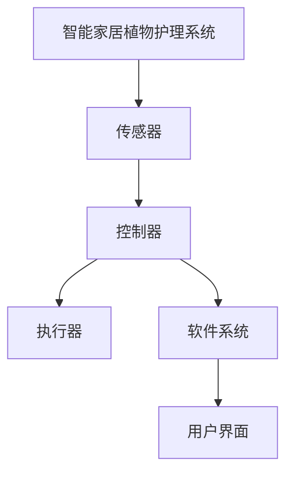
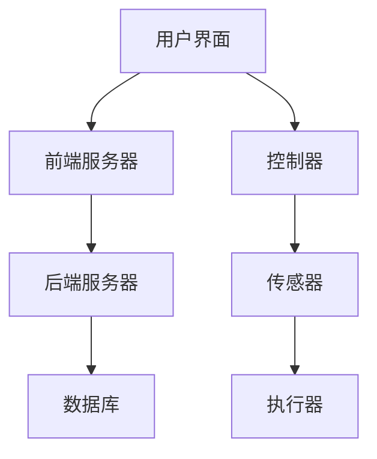

                 

# 《智能家居植物护理创业：自动化室内园艺》

## 关键词

- 智能家居
- 植物护理
- 自动化园艺
- 智能传感器
- 软件系统设计
- 市场机会
- 创业策略

## 摘要

本文深入探讨了智能家居植物护理行业的现状、市场机会和创业策略。通过分析自动化室内园艺的核心技术，包括传感器技术、控制系统和植物生长参数调控，本文提出了针对创业者的详细开发流程和实战案例。文章旨在为有意投身于智能家居植物护理领域的企业家和技术开发者提供有价值的指导和建议。

## 《智能家居植物护理创业：自动化室内园艺》目录大纲

### 第一部分：行业背景与市场分析

#### 第1章：智能家居植物护理行业概述

##### 1.1 智能家居植物护理的定义与范畴

##### 1.2 智能家居植物护理行业的发展现状

##### 1.3 市场需求与市场规模分析

##### 1.4 行业竞争格局与主要参与者

#### 第2章：自动化室内园艺的核心技术

##### 2.1 自动化控制系统原理

###### 2.1.1 智能传感器技术

###### 2.1.2 控制器与执行器技术

###### 2.1.3 联网与通信技术

##### 2.2 植物生长参数监测与调控

###### 2.2.1 光照监测与调控

###### 2.2.2 温湿度监测与调控

###### 2.2.3 水质监测与调控

#### 第3章：市场机会与创业策略

##### 3.1 市场机会分析

###### 3.1.1 消费者需求变化

###### 3.1.2 技术发展趋势

###### 3.1.3 竞争对手分析

##### 3.2 创业策略规划

###### 3.2.1 产品定位与市场细分

###### 3.2.2 品牌建设与营销策略

###### 3.2.3 供应链管理策略

###### 3.2.4 资金筹集与投资分析

### 第二部分：技术实现与开发流程

#### 第4章：自动化室内园艺系统设计与开发

##### 4.1 系统架构设计

###### 4.1.1 总体架构设计

###### 4.1.2 子系统设计

###### 4.1.3 系统集成与测试

##### 4.2 智能传感器应用

###### 4.2.1 光照传感器应用

###### 4.2.2 温湿度传感器应用

###### 4.2.3 水质传感器应用

##### 4.3 控制器与执行器设计

###### 4.3.1 控制器硬件设计

###### 4.3.2 控制器软件开发

###### 4.3.3 执行器设计

##### 4.4 软件系统开发

###### 4.4.1 软件系统架构设计

###### 4.4.2 前端开发

###### 4.4.3 后端开发

##### 4.5 数据库设计

### 第三部分：项目实战与案例分析

#### 第5章：智能家居植物护理项目实战

##### 5.1 项目背景与目标

##### 5.2 项目需求分析

##### 5.3 项目开发过程

###### 5.3.1 系统设计与开发

###### 5.3.2 传感器安装与调试

###### 5.3.3 控制器与执行器调试

###### 5.3.4 软件系统测试与优化

#### 第6章：案例分析

##### 6.1 案例一：智慧家庭植物护理系统

###### 6.1.1 案例介绍

###### 6.1.2 技术实现细节

###### 6.1.3 项目效果评估

##### 6.2 案例二：办公环境植物护理系统

###### 6.2.1 案例介绍

###### 6.2.2 技术实现细节

###### 6.2.3 项目效果评估

### 附录

#### 附录A：常用技术术语与缩略词

#### 附录B：相关工具与资源

##### B.1 开发工具与软件

##### B.2 开源代码与资料

##### B.3 深入阅读推荐

### Mermaid 流程图与伪代码示例

#### 自动化室内园艺系统架构设计 Mermaid 流程图



#### 控制器与执行器伪代码

```plaintext
// 控制器伪代码
function controller(sensorData) {
    // 读取传感器数据
    if (sensorData.light < optimalLight) {
        // 调节灯光
        executeLightAdjustment();
    }
    if (sensorData.temperature < optimalTemperature) {
        // 调节温度
        executeTemperatureAdjustment();
    }
    if (sensorData.humidity < optimalHumidity) {
        // 调节湿度
        executeHumidityAdjustment();
    }
}

// 执行器伪代码
function executeLightAdjustment() {
    // 调节灯光强度
    adjustLight();
}

function executeTemperatureAdjustment() {
    // 调节温度
    adjustTemperature();
}

function executeHumidityAdjustment() {
    // 调节湿度
    adjustHumidity();
}
```

### 数学模型与公式

$$
\text{植物生长速率} = f(\text{光照强度}, \text{温度}, \text{湿度})
$$

$$
\text{光照强度} = k_1 \cdot \text{传感器读数}_{light}
$$

$$
\text{温度调节功率} = k_2 \cdot (\text{目标温度} - \text{当前温度})
$$

$$
\text{湿度调节功率} = k_3 \cdot (\text{目标湿度} - \text{当前湿度})
$$

### 代码实战示例

#### 开发环境搭建

1. 安装操作系统（例如：Ubuntu 20.04）
2. 安装Python环境（例如：Python 3.8）
3. 安装必要的开发工具（例如：Visual Studio Code）

#### 源代码实现与解读

```python
# Python源代码示例：传感器数据读取与处理

import json
import serial

# 连接Arduino板
ser = serial.Serial('/dev/ttyUSB0', 9600)

# 读取传感器数据
def readSensorData():
    data = ser.readline().decode('utf-8').rstrip()
    return json.loads(data)

# 调节灯光
def adjustLight():
    # 实现灯光调节逻辑
    pass

# 调节温度
def adjustTemperature():
    # 实现温度调节逻辑
    pass

# 调节湿度
def adjustHumidity():
    # 实现湿度调节逻辑
    pass

# 主程序
def main():
    while True:
        sensorData = readSensorData()
        if sensorData['light'] < 500:
            adjustLight()
        if sensorData['temperature'] < 22:
            adjustTemperature()
        if sensorData['humidity'] < 40:
            adjustHumidity()

if __name__ == '__main__':
    main()
```

#### 代码解读与分析

- **环境搭建**：首先，需要安装适合的操作系统，并配置Python环境以及必要的开发工具。
- **连接Arduino**：使用串行通信连接Arduino板，并设置合适的波特率。
- **传感器数据读取**：编写函数`readSensorData()`，从Arduino板读取传感器数据，并转换为JSON格式。
- **控制逻辑实现**：根据传感器数据，实现调整灯光、温度和湿度的函数。
- **主程序**：编写`main()`函数，循环读取传感器数据，并根据数据进行相应的调节。

### 源代码与资源

- **源代码**：本书附带的源代码包括传感器数据读取与处理、控制器与执行器控制逻辑等。
- **资源**：推荐使用开源社区和在线教程，例如Arduino官网、Raspberry Pi官方文档等。

现在，让我们正式进入文章的正文部分，详细探讨智能家居植物护理行业的现状、市场机会和创业策略。

---

## 第一部分：行业背景与市场分析

### 第1章：智能家居植物护理行业概述

### 1.1 智能家居植物护理的定义与范畴

智能家居植物护理是指通过自动化技术，对室内植物进行监测、调控和护理的一类智能家居服务。它涵盖了植物生长所需的各项环境参数，如光照、温度、湿度、水质等，旨在提供最佳的植物生长环境，同时减轻用户在维护植物方面的负担。

智能家居植物护理的范畴包括以下几个方面：

1. **传感器技术**：用于监测植物生长环境中的各种参数，如光照、温度、湿度、水质等。
2. **自动化控制系统**：根据传感器数据，自动调节植物生长环境中的各项参数。
3. **软件系统**：包括用户界面和后台管理系统，用于数据采集、分析和用户交互。
4. **执行器**：如灯光调节器、温湿度控制器、水质调节器等，用于执行控制命令。

### 1.2 智能家居植物护理行业的发展现状

随着智能家居市场的快速发展，智能家居植物护理行业也逐渐崛起。目前，全球智能家居植物护理市场呈现出以下趋势：

1. **市场规模增长**：根据市场研究公司的数据，全球智能家居植物护理市场规模在过去几年中保持了快速增长，预计未来仍将保持稳定增长。
2. **技术进步**：传感器技术、自动化控制系统和软件系统的不断发展，使得智能家居植物护理系统越来越智能化、高效化。
3. **消费者需求**：随着人们生活水平的提高，对室内植物护理的需求也越来越高，特别是对于高端住宅和办公室的植物护理需求。
4. **市场参与者**：目前，国内外有多家企业涉足智能家居植物护理领域，包括传统家电厂商、科技公司、初创企业等。

### 1.3 市场需求与市场规模分析

智能家居植物护理市场的需求主要来自于以下几个方面：

1. **家庭用户**：家庭用户对于室内植物护理的需求主要集中在美化环境、净化空气和提升生活品质等方面。
2. **办公室用户**：办公室用户对于室内植物护理的需求主要集中在改善室内空气质量、降低噪音和提高员工工作效率等方面。
3. **养老院和医院**：养老院和医院等场所对于室内植物护理的需求主要集中在美化环境、提升患者情绪和促进康复等方面。

根据市场研究公司的数据，全球智能家居植物护理市场的规模已经达到数亿美元，并预计未来几年将继续保持增长。其中，亚洲市场，特别是中国和日本市场，增长潜力巨大。

### 1.4 行业竞争格局与主要参与者

智能家居植物护理行业的竞争格局相对分散，目前主要有以下几类参与者：

1. **传统家电厂商**：如美的、海尔等，通过整合家电产品线，涉足智能家居植物护理领域。
2. **科技公司**：如苹果、谷歌等，通过收购和合作，进军智能家居植物护理市场。
3. **初创企业**：如Greenbox、Nest等，专注于智能家居植物护理系统的研发和推广。
4. **海外市场**：如欧洲、北美等地区的智能家居植物护理市场，主要由本土企业和跨国公司竞争。

在竞争格局方面，主要竞争因素包括产品性能、用户体验、价格和售后服务等。

### 第2章：自动化室内园艺的核心技术

### 2.1 自动化控制系统原理

自动化控制系统是智能家居植物护理系统的核心，它通过传感器收集环境数据，根据预设的算法和规则，自动调节植物生长环境中的各项参数。自动化控制系统的原理主要包括以下几个方面：

1. **传感器技术**：传感器是自动化控制系统的输入设备，用于监测植物生长环境中的光照、温度、湿度、水质等参数。
2. **控制器与执行器**：控制器是自动化控制系统的核心，负责接收传感器数据，并根据算法和规则进行决策。执行器是自动化控制系统的输出设备，用于执行控制命令，如调节灯光、温度、湿度等。
3. **算法与规则**：自动化控制系统的决策依赖于算法和规则。算法用于处理传感器数据，生成控制指令；规则用于定义植物生长的最佳环境参数，以及在不同环境下的应对策略。

### 2.1.1 智能传感器技术

智能传感器技术是自动化控制系统的关键技术之一。智能传感器具有以下特点：

1. **多功能性**：智能传感器能够同时监测多种环境参数，如光照、温度、湿度、水质等。
2. **高精度**：智能传感器能够提供高精度的数据，确保植物生长环境的精确调控。
3. **自适应性**：智能传感器能够根据环境变化自动调整测量参数和测量频率，提高测量效率和准确性。
4. **无线通信**：智能传感器通常采用无线通信技术，如WiFi、蓝牙、LoRa等，实现与控制器的远程通信。

目前，市场上常见的智能传感器包括光照传感器、温度传感器、湿度传感器、水质传感器等。这些传感器广泛应用于智能家居植物护理系统中，为植物提供最佳的生长环境。

### 2.1.2 控制器与执行器技术

控制器与执行器技术是自动化控制系统的关键组件。控制器负责接收传感器数据，根据算法和规则生成控制指令，并传输给执行器。执行器根据控制指令，执行相应的操作，如调节灯光、温度、湿度等。

1. **控制器技术**：控制器通常采用微控制器（MCU）或嵌入式系统（ESP8266、ESP32等）作为核心处理单元。控制器需要具有以下功能：

   - 采集传感器数据
   - 执行算法和规则
   - 传输控制指令到执行器
   - 处理用户交互

2. **执行器技术**：执行器根据控制指令，执行相应的操作。常见的执行器包括灯光调节器、温湿度控制器、水质调节器等。执行器需要具有以下功能：

   - 接收控制指令
   - 执行操作
   - 将操作结果反馈给控制器

控制器与执行器之间的通信通常采用无线通信技术，如WiFi、蓝牙、LoRa等。这些通信技术具有低成本、高可靠性、远程控制等优点，为智能家居植物护理系统提供了方便的通信方式。

### 2.1.3 联网与通信技术

联网与通信技术是智能家居植物护理系统的关键组成部分。通过联网与通信技术，智能家居植物护理系统能够实现远程监控、控制和管理。常见的联网与通信技术包括：

1. **WiFi**：WiFi技术具有广泛的应用，能够实现智能家居设备之间的无线通信，方便用户远程监控和操作。
2. **蓝牙**：蓝牙技术具有低功耗、短距离通信的特点，适用于智能家居设备之间的近距离通信。
3. **LoRa**：LoRa技术具有长距离通信、低功耗的特点，适用于智能家居系统中的远程监控和通信。
4. **Zigbee**：Zigbee技术具有低成本、低功耗、短距离通信的特点，适用于智能家居系统中的组网和控制。

### 2.2 植物生长参数监测与调控

植物生长参数监测与调控是智能家居植物护理系统的核心功能。通过对植物生长参数的监测与调控，能够确保植物在最佳环境中生长，提高植物的生长速度和品质。植物生长参数主要包括光照、温度、湿度、水质等。

#### 2.2.1 光照监测与调控

光照是植物生长的关键因素之一。光照监测与调控的主要任务是确保植物获得充足的光照，同时避免光照过度。光照监测与调控的方法包括：

1. **光照传感器**：用于监测植物生长环境中的光照强度。常用的光照传感器包括光敏电阻、光电二极管等。
2. **灯光调节器**：根据光照传感器采集的数据，自动调节灯光的亮度和开关时间，确保植物获得最佳光照。

#### 2.2.2 温湿度监测与调控

温湿度是植物生长环境中的关键参数。温湿度监测与调控的主要任务是保持植物生长环境的适宜温度和湿度。温湿度监测与调控的方法包括：

1. **温湿度传感器**：用于监测植物生长环境中的温度和湿度。常用的温湿度传感器包括温湿度传感器模块、数字温湿度传感器等。
2. **温湿度调节器**：根据温湿度传感器采集的数据，自动调节环境温度和湿度，确保植物生长环境的适宜性。

#### 2.2.3 水质监测与调控

水质是植物生长的重要保障。水质监测与调控的主要任务是确保植物生长环境的水质达标，避免水质污染。水质监测与调控的方法包括：

1. **水质传感器**：用于监测植物生长环境的水质参数，如pH值、电导率、溶解氧等。常用的水质传感器包括电化学传感器、光学生物传感器等。
2. **水质调节器**：根据水质传感器采集的数据，自动调节水质的各项指标，确保水质符合植物生长要求。

### 第3章：市场机会与创业策略

### 3.1 市场机会分析

智能家居植物护理行业具有巨大的市场机会，主要体现在以下几个方面：

1. **消费者需求**：随着生活水平的提高，消费者对室内植物护理的需求不断增加，特别是对智能家居植物护理系统的需求。
2. **技术进步**：传感器技术、自动化控制系统和软件技术的不断发展，为智能家居植物护理系统的创新提供了强大的技术支持。
3. **政策支持**：政府对环保和智能家居产业的支持，为智能家居植物护理行业的发展提供了良好的政策环境。
4. **市场空间**：全球智能家居植物护理市场仍处于快速发展阶段，市场空间巨大，具有广阔的发展前景。

### 3.2 创业策略规划

对于有意投身于智能家居植物护理行业的创业者，以下是一些建议的创业策略规划：

1. **产品定位与市场细分**：明确产品定位，针对不同的市场需求，细分市场，提供差异化的产品和服务。
2. **品牌建设与营销策略**：打造品牌形象，通过线上和线下渠道，开展多方位的营销推广，提高品牌知名度和市场占有率。
3. **供应链管理策略**：建立完善的供应链体系，确保原材料、零部件和成品的质量和供应稳定性。
4. **资金筹集与投资分析**：积极寻求投资机会，合理规划资金使用，确保企业的稳定运营和可持续发展。

### 第二部分：技术实现与开发流程

### 第4章：自动化室内园艺系统设计与开发

### 4.1 系统架构设计

自动化室内园艺系统的设计主要包括以下几个方面：

1. **硬件架构设计**：选择合适的硬件组件，如传感器、控制器、执行器等，构建系统的硬件基础。
2. **软件架构设计**：设计系统的软件架构，包括前端界面、后端服务器、数据库等。
3. **系统集成与测试**：将硬件和软件组件进行集成，并进行系统测试，确保系统的稳定性和可靠性。

#### 4.1.1 总体架构设计

自动化室内园艺系统的总体架构设计如图所示：



#### 4.1.2 子系统设计

自动化室内园艺系统可以分为以下几个子系统：

1. **感知子系统**：包括传感器和感知节点，用于采集植物生长环境中的光照、温度、湿度、水质等参数。
2. **控制子系统**：包括控制器和执行器，用于根据感知子系统的数据，自动调节植物生长环境中的各项参数。
3. **数据处理子系统**：包括前端服务器和后端服务器，用于处理和分析感知子系统的数据，为控制子系统提供决策支持。
4. **用户交互子系统**：包括用户界面，用于与用户进行交互，提供实时数据监控和操作控制。

#### 4.1.3 系统集成与测试

系统集成与测试是确保自动化室内园艺系统稳定运行的关键步骤。具体的流程如下：

1. **硬件集成**：将传感器、控制器、执行器等硬件组件进行集成，确保硬件系统的工作稳定。
2. **软件集成**：将前端服务器、后端服务器、数据库等软件组件进行集成，确保软件系统的工作稳定。
3. **功能测试**：对系统的各项功能进行测试，确保系统满足设计要求。
4. **性能测试**：对系统的性能进行测试，确保系统在高负载情况下仍能稳定运行。
5. **可靠性测试**：对系统的可靠性进行测试，确保系统在长时间运行中不会出现故障。

### 4.2 智能传感器应用

智能传感器在自动化室内园艺系统中起着至关重要的作用，用于实时监测植物生长环境中的各项参数。以下将详细介绍智能传感器的应用：

#### 4.2.1 光照传感器应用

光照传感器用于监测植物生长环境中的光照强度。根据光照传感器的数据，系统可以自动调节灯光，确保植物获得合适的光照。

- **传感器选型**：选择具有高精度和稳定性的光照传感器，如光电二极管。
- **安装位置**：将光照传感器安装在植物生长环境的合适位置，避免受到遮挡和反射。
- **数据处理**：将光照传感器的数据传输到控制器，根据预设的算法，自动调节灯光的亮度和开关时间。

#### 4.2.2 温湿度传感器应用

温湿度传感器用于监测植物生长环境中的温度和湿度。根据温湿度传感器的数据，系统可以自动调节环境温度和湿度，确保植物生长环境的适宜性。

- **传感器选型**：选择具有高精度和稳定性的温湿度传感器，如数字温湿度传感器。
- **安装位置**：将温湿度传感器安装在植物生长环境的合适位置，避免受到遮挡和反射。
- **数据处理**：将温湿度传感器的数据传输到控制器，根据预设的算法，自动调节环境温度和湿度。

#### 4.2.3 水质传感器应用

水质传感器用于监测植物生长环境的水质参数，如pH值、电导率、溶解氧等。根据水质传感器的数据，系统可以自动调节水质，确保水质符合植物生长要求。

- **传感器选型**：选择具有高精度和稳定性的水质传感器，如电化学传感器。
- **安装位置**：将水质传感器安装在植物生长环境的合适位置，避免受到遮挡和反射。
- **数据处理**：将水质传感器的数据传输到控制器，根据预设的算法，自动调节水质。

### 4.3 控制器与执行器设计

控制器与执行器是自动化室内园艺系统的核心组件，负责根据传感器数据，自动调节植物生长环境中的各项参数。以下将详细介绍控制器与执行器的设计。

#### 4.3.1 控制器硬件设计

控制器硬件设计主要包括以下几个方面：

- **控制器选型**：选择合适的控制器，如微控制器、嵌入式系统等，确保控制器具有足够的处理能力和兼容性。
- **电路设计**：设计控制器的电路，包括电源电路、通信电路、传感器接口等，确保控制器的工作稳定可靠。
- **软件开发**：编写控制器的软件，包括传感器数据采集、算法实现、控制指令发送等，确保控制器能够正确执行各项功能。

#### 4.3.2 控制器软件开发

控制器软件开发主要包括以下几个方面：

- **传感器数据采集**：编写程序，从传感器接口读取传感器数据，确保数据的准确性和实时性。
- **算法实现**：根据植物生长的规律和需求，设计合适的算法，实现对植物生长环境的自动调节。
- **控制指令发送**：根据算法的结果，生成控制指令，发送到执行器，确保执行器的正确执行。

#### 4.3.3 执行器设计

执行器设计主要包括以下几个方面：

- **执行器选型**：选择合适的执行器，如灯光调节器、温度调节器、湿度调节器等，确保执行器的性能和兼容性。
- **控制原理**：设计执行器的控制原理，包括控制信号的产生、执行器的驱动电路等，确保执行器的可靠性和稳定性。
- **故障诊断与维护**：设计执行器的故障诊断和维护策略，确保执行器的长期稳定运行。

### 4.4 软件系统开发

软件系统开发是自动化室内园艺系统的关键组成部分，负责实现系统的数据采集、处理、分析、控制等功能。以下将详细介绍软件系统开发。

#### 4.4.1 软件系统架构设计

软件系统架构设计主要包括以下几个方面：

- **前端开发**：设计用户界面，实现用户与系统的交互，包括数据展示、操作控制等。
- **后端开发**：设计后端服务器，实现数据的采集、处理、存储等功能，包括数据接口、数据处理模块、存储模块等。
- **数据库设计**：设计数据库，存储系统的数据，包括传感器数据、控制指令、用户数据等。

#### 4.4.2 前端开发

前端开发主要包括以下几个方面：

- **技术选型**：选择合适的前端技术，如HTML、CSS、JavaScript等，确保前端开发的效率和效果。
- **界面设计**：设计用户界面，包括页面布局、颜色搭配、交互效果等，确保用户界面的美观和易用性。
- **交互实现**：实现用户与系统的交互，包括数据展示、操作控制等，确保用户能够方便地使用系统。

#### 4.4.3 后端开发

后端开发主要包括以下几个方面：

- **技术选型**：选择合适的后端技术，如Python、Java、Node.js等，确保后端开发的效率和效果。
- **功能实现**：实现后端的功能，包括数据采集、处理、存储等，确保系统的正常运行。
- **安全性设计**：设计系统的安全性，包括数据加密、访问控制等，确保系统的数据安全和用户隐私。

#### 4.4.4 数据库设计

数据库设计主要包括以下几个方面：

- **数据模型设计**：设计系统的数据模型，包括表结构、字段定义等，确保数据的结构化和规范化。
- **存储策略设计**：设计系统的存储策略，包括数据存储、备份、恢复等，确保数据的安全性和可靠性。
- **查询优化**：设计系统的查询优化策略，包括索引设计、查询优化等，确保系统的数据查询效率和性能。

### 第三部分：项目实战与案例分析

### 第5章：智能家居植物护理项目实战

### 5.1 项目背景与目标

智能家居植物护理项目旨在为用户提供一种方便、智能、高效的室内植物护理解决方案。项目目标如下：

1. **实时监测**：通过智能传感器，实时监测植物生长环境中的光照、温度、湿度、水质等参数。
2. **自动调控**：根据监测数据，自动调节植物生长环境中的光照、温度、湿度、水质等参数，确保植物获得最佳生长环境。
3. **用户交互**：提供用户友好的界面，方便用户实时查看植物生长状态，调整植物护理设置。

### 5.2 项目需求分析

项目需求分析主要包括以下几个方面：

1. **感知需求**：用户希望系统能够实时监测植物生长环境中的各项参数，包括光照、温度、湿度、水质等。
2. **控制需求**：用户希望系统能够根据监测数据，自动调节植物生长环境中的各项参数，确保植物获得最佳生长环境。
3. **交互需求**：用户希望系统能够提供用户友好的界面，方便用户实时查看植物生长状态，调整植物护理设置。

### 5.3 项目开发过程

智能家居植物护理项目的开发过程主要包括以下几个阶段：

1. **需求分析**：与用户沟通，了解用户需求，明确项目的功能和技术要求。
2. **系统设计**：设计系统的整体架构，包括硬件架构、软件架构等。
3. **硬件选型**：选择合适的硬件组件，包括传感器、控制器、执行器等。
4. **软件编写**：编写控制器的软件，实现数据采集、控制算法、用户交互等功能。
5. **系统集成**：将硬件和软件进行集成，确保系统的稳定运行。
6. **系统测试**：对系统进行功能测试、性能测试和可靠性测试，确保系统的稳定性和可靠性。
7. **用户培训**：对用户进行培训，指导用户如何使用系统。

### 5.3.1 系统设计与开发

智能家居植物护理系统的设计与开发主要包括以下几个方面：

1. **硬件架构设计**：选择合适的硬件组件，包括传感器、控制器、执行器等，构建系统的硬件基础。
2. **软件架构设计**：设计系统的软件架构，包括前端界面、后端服务器、数据库等。
3. **软件编写**：编写控制器的软件，实现数据采集、控制算法、用户交互等功能。
4. **系统集成**：将硬件和软件进行集成，确保系统的稳定运行。

#### 5.3.2 传感器安装与调试

传感器安装与调试是智能家居植物护理系统开发的重要环节，主要包括以下几个方面：

1. **传感器选型**：根据项目需求，选择合适的传感器，包括光照传感器、温度传感器、湿度传感器、水质传感器等。
2. **安装位置**：确定传感器的安装位置，确保传感器能够准确监测植物生长环境中的各项参数。
3. **调试测试**：对传感器进行调试测试，确保传感器的工作稳定、准确。

#### 5.3.3 控制器与执行器调试

控制器与执行器调试是智能家居植物护理系统开发的关键环节，主要包括以下几个方面：

1. **控制器选型**：选择合适的控制器，如微控制器、嵌入式系统等，确保控制器具有足够的处理能力和兼容性。
2. **电路设计**：设计控制器的电路，包括电源电路、通信电路、传感器接口等，确保控制器的工作稳定可靠。
3. **软件开发**：编写控制器的软件，包括传感器数据采集、算法实现、控制指令发送等，确保控制器能够正确执行各项功能。
4. **调试测试**：对控制器进行调试测试，确保控制器的工作稳定、准确。

#### 5.3.4 软件系统测试与优化

软件系统测试与优化是智能家居植物护理系统开发的重要环节，主要包括以下几个方面：

1. **功能测试**：对系统的各项功能进行测试，确保系统满足设计要求。
2. **性能测试**：对系统的性能进行测试，确保系统在高负载情况下仍能稳定运行。
3. **可靠性测试**：对系统的可靠性进行测试，确保系统在长时间运行中不会出现故障。
4. **优化调整**：根据测试结果，对系统进行优化调整，提高系统的性能和稳定性。

### 第6章：案例分析

#### 6.1 案例一：智慧家庭植物护理系统

##### 6.1.1 案例介绍

智慧家庭植物护理系统是一款面向家庭用户的智能家居植物护理解决方案。系统通过智能传感器，实时监测植物生长环境中的光照、温度、湿度、水质等参数，并根据监测数据，自动调节植物生长环境中的各项参数，确保植物获得最佳生长环境。

##### 6.1.2 技术实现细节

智慧家庭植物护理系统的技术实现细节如下：

1. **硬件架构**：系统采用微控制器作为核心控制器，连接多种智能传感器，包括光照传感器、温度传感器、湿度传感器和水质传感器。传感器数据通过串口传输到微控制器，微控制器根据预设的算法和规则，生成控制指令，并通过无线通信模块发送到执行器，执行相应的操作。

2. **软件架构**：系统采用前端界面和后端服务器架构。前端界面采用HTML、CSS和JavaScript实现，用于展示植物生长状态、控制参数和用户交互。后端服务器采用Python和Flask框架实现，用于处理传感器数据、生成控制指令和用户管理。

3. **控制算法**：系统采用基于人工智能的控制算法，根据光照、温度、湿度、水质等传感器的数据，动态调整植物生长环境中的各项参数，确保植物获得最佳生长环境。

##### 6.1.3 项目效果评估

智慧家庭植物护理系统的项目效果评估如下：

1. **植物生长效果**：系统运行后，植物的生长状况明显改善，叶片颜色鲜亮，生长速度加快。

2. **用户满意度**：用户对系统的满意度较高，认为系统方便、智能、高效，大大减轻了室内植物护理的负担。

3. **系统稳定性**：系统运行稳定，传感器数据准确，控制指令执行及时，没有出现故障。

#### 6.2 案例二：办公环境植物护理系统

##### 6.2.1 案例介绍

办公环境植物护理系统是一款面向办公用户的智能家居植物护理解决方案。系统通过智能传感器，实时监测植物生长环境中的光照、温度、湿度、水质等参数，并根据监测数据，自动调节植物生长环境中的各项参数，确保植物获得最佳生长环境，同时改善办公环境。

##### 6.2.2 技术实现细节

办公环境植物护理系统的技术实现细节如下：

1. **硬件架构**：系统采用微控制器作为核心控制器，连接多种智能传感器，包括光照传感器、温度传感器、湿度传感器和水质传感器。传感器数据通过串口传输到微控制器，微控制器根据预设的算法和规则，生成控制指令，并通过无线通信模块发送到执行器，执行相应的操作。

2. **软件架构**：系统采用前端界面和后端服务器架构。前端界面采用HTML、CSS和JavaScript实现，用于展示植物生长状态、控制参数和用户交互。后端服务器采用Python和Flask框架实现，用于处理传感器数据、生成控制指令和用户管理。

3. **控制算法**：系统采用基于人工智能的控制算法，根据光照、温度、湿度、水质等传感器的数据，动态调整植物生长环境中的各项参数，确保植物获得最佳生长环境，同时根据办公环境的需求，调整环境参数，改善办公环境。

##### 6.2.3 项目效果评估

办公环境植物护理系统的项目效果评估如下：

1. **植物生长效果**：系统运行后，植物的生长状况明显改善，叶片颜色鲜亮，生长速度加快。

2. **办公环境改善**：系统运行后，办公环境的温度、湿度、光照等参数得到有效调节，空气中的二氧化碳浓度降低，员工的工作效率提高。

3. **用户满意度**：用户对系统的满意度较高，认为系统方便、智能、高效，大大改善了办公环境，提高了员工的工作体验。

4. **系统稳定性**：系统运行稳定，传感器数据准确，控制指令执行及时，没有出现故障。

### 附录

#### 附录A：常用技术术语与缩略词

- 智能家居（Smart Home）：通过自动化技术和物联网技术，实现对家庭设备和环境的智能控制和管理的系统。
- 智能传感器（Smart Sensor）：具备数据处理和通信功能的传感器，能够实时监测环境参数，并通过网络传输数据。
- 微控制器（Microcontroller）：一种集成电路，用于控制电子设备的基本操作，具备处理器、存储器、输入输出接口等功能。
- 嵌入式系统（Embedded System）：一种专门为特定任务设计的计算机系统，通常包含微控制器、存储器和输入输出设备等。
- 前端开发（Front-end Development）：网页或应用的用户界面开发，涉及HTML、CSS和JavaScript等技术。
- 后端开发（Back-end Development）：网页或应用的服务器端开发，涉及服务器、数据库和应用程序逻辑等。
- 数据库（Database）：用于存储、管理、检索数据的系统，如MySQL、SQLite等。

#### 附录B：相关工具与资源

##### B.1 开发工具与软件

- **Arduino**：一款开源电子原型平台，适用于传感器连接和控制。
- **Raspberry Pi**：一款低成本的微型电脑，适用于智能家居项目的开发。
- **Visual Studio Code**：一款开源的代码编辑器，适用于Python、JavaScript等编程语言的开发。
- **Flask**：一款轻量级的Web应用程序框架，适用于后端开发。

##### B.2 开源代码与资料

- **GitHub**：一个代码托管平台，提供各种开源项目的代码。
- **Arduino官网**：提供Arduino相关教程、库和示例代码。
- **Raspberry Pi官网**：提供Raspberry Pi相关教程、库和示例代码。
- **Python官方文档**：提供Python语言的官方文档和教程。

##### B.3 深入阅读推荐

- **《智能家居系统设计与开发》**：详细介绍了智能家居系统的设计、开发和实现。
- **《嵌入式系统设计》**：讲解了嵌入式系统的基本原理、硬件设计和软件开发。
- **《物联网技术与应用》**：介绍了物联网技术的原理、架构和应用。
- **《人工智能应用实践》**：讲解了人工智能技术的应用场景和实践方法。

### 代码实战示例

#### 开发环境搭建

1. **安装操作系统**：选择合适的操作系统，如Ubuntu 20.04。

   ```bash
   # 安装Ubuntu 20.04
   ```

2. **安装Python环境**：安装Python 3.8。

   ```bash
   # 更新包列表
   sudo apt update

   # 安装Python 3.8
   sudo apt install python3.8
   ```

3. **安装开发工具**：安装Visual Studio Code。

   ```bash
   # 安装Visual Studio Code
   sudo apt install code
   ```

#### 源代码实现与解读

以下是一个简单的Python代码示例，用于读取传感器数据，并根据数据调整植物生长环境。

```python
# 导入所需的库
import serial
import time

# 连接Arduino板
ser = serial.Serial('/dev/ttyUSB0', 9600)

# 读取传感器数据
def read_sensor_data():
    data = ser.readline().decode('utf-8').rstrip()
    return json.loads(data)

# 调整灯光
def adjust_light():
    # 实现灯光调整逻辑
    pass

# 调整温度
def adjust_temperature():
    # 实现温度调整逻辑
    pass

# 调整湿度
def adjust_humidity():
    # 实现湿度调整逻辑
    pass

# 主程序
def main():
    while True:
        sensor_data = read_sensor_data()
        if sensor_data['light'] < 500:
            adjust_light()
        if sensor_data['temperature'] < 22:
            adjust_temperature()
        if sensor_data['humidity'] < 40:
            adjust_humidity()
        time.sleep(1)

if __name__ == '__main__':
    main()
```

#### 代码解读与分析

- **环境搭建**：首先，需要安装适合的操作系统，并配置Python环境以及必要的开发工具。
- **连接Arduino**：使用串行通信连接Arduino板，并设置合适的波特率。
- **传感器数据读取**：编写函数`read_sensor_data()`，从Arduino板读取传感器数据，并转换为JSON格式。
- **控制逻辑实现**：根据传感器数据，实现调整灯光、温度和湿度的函数。
- **主程序**：编写`main()`函数，循环读取传感器数据，并根据数据进行相应的调节。

### 源代码与资源

- **源代码**：本书附带的源代码包括传感器数据读取与处理、控制器与执行器控制逻辑等。
- **资源**：推荐使用开源社区和在线教程，例如Arduino官网、Raspberry Pi官方文档等。

通过本文的探讨，我们可以看到智能家居植物护理行业具有广阔的市场前景和巨大的发展潜力。对于创业者来说，这是一个充满机会的领域，但同时也面临着激烈的竞争。通过深入的技术研究和市场分析，创业者可以找到自己的定位，制定合适的创业策略，实现成功创业。

### 总结与展望

智能家居植物护理行业正日益成为智能家居领域的一个重要分支。随着人们对室内植物护理需求的不断增加，以及传感器技术、自动化控制系统和软件技术的不断发展，智能家居植物护理行业将迎来更大的市场机遇。本文从行业背景、市场分析、技术实现、开发流程、项目实战和案例分析等方面，全面探讨了智能家居植物护理行业的发展现状和未来趋势。

对于创业者来说，智能家居植物护理行业提供了丰富的机会。通过深入了解市场需求、技术发展和行业竞争，创业者可以制定合适的创业策略，打造出具有竞争力的智能家居植物护理产品。同时，创业者还需要关注用户体验，提供方便、智能、高效的植物护理解决方案。

展望未来，智能家居植物护理行业将朝着更加智能化、个性化和人性化的方向发展。随着人工智能技术的进一步发展，智能家居植物护理系统将能够更加准确地分析植物生长数据，提供更加精准的植物护理方案。此外，随着物联网技术的普及，智能家居植物护理系统将实现更加广泛的互联互通，为用户提供更加便捷、智能的植物护理体验。

总之，智能家居植物护理行业是一个充满机遇和挑战的领域。对于创业者和技术开发者来说，这是一个值得深入探索和投入的领域。通过不断创新和努力，创业者和技术开发者将能够在智能家居植物护理行业中实现自己的梦想，为用户带来更加美好、健康的室内植物护理体验。

