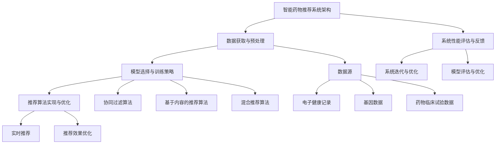

                 

### 《智能药物推荐系统：精准医疗的技术创新》

关键词：智能药物推荐系统、精准医疗、机器学习、深度学习、推荐算法、医疗数据处理、个性化医疗、医疗数据隐私、医疗技术趋势

摘要：本文深入探讨了智能药物推荐系统的概念、架构、核心技术及其在精准医疗中的应用。通过分析智能药物推荐系统的架构设计和数据收集处理方法，本文详细阐述了协同过滤、基于内容的推荐算法和混合推荐算法等核心推荐算法原理，并展示了机器学习和深度学习在药物推荐中的应用。此外，本文还通过具体案例研究了个性化药物剂量推荐、基于基因信息的药物推荐以及多模态数据药物推荐，并对智能药物推荐系统的安全与伦理问题进行了探讨。最后，本文展望了智能药物推荐系统的未来发展趋势，为精准医疗领域的技术创新提供了新的思路。

### 《智能药物推荐系统：精准医疗的技术创新》目录大纲

#### 第一部分：引言与背景

**第1章：智能药物推荐系统概述**

- **1.1 智能药物推荐系统的定义与意义**
- **1.2 智能药物推荐系统的应用领域**
- **1.3 精准医疗的发展与智能药物推荐系统的关系**

**第2章：智能药物推荐系统的架构**

- **2.1 系统架构设计原则**
- **2.2 数据获取与预处理**
- **2.3 模型选择与训练策略**
- **2.4 推荐算法的实现与优化**

#### 第二部分：核心技术

**第3章：数据收集与处理**

- **3.1 数据来源与类型**
- **3.2 数据预处理方法**
- **3.3 特征工程与选择**

**第4章：推荐算法原理**

- **4.1 协同过滤算法**
- **4.2 基于内容的推荐算法**
- **4.3 混合推荐算法**

**第5章：机器学习与深度学习在药物推荐中的应用**

- **5.1 机器学习算法在药物推荐中的应用**
- **5.2 深度学习模型在药物推荐中的应用**
- **5.3 个性化推荐模型的优化与评估**

**第6章：智能药物推荐系统的案例研究**

- **6.1 案例一：个性化药物剂量推荐**
- **6.2 案例二：基于基因信息的药物推荐**
- **6.3 案例三：基于多模态数据的药物推荐**

**第7章：智能药物推荐系统的安全与伦理问题**

- **7.1 数据安全与隐私保护**
- **7.2 算法透明性与可解释性**
- **7.3 伦理问题与法规遵循**

#### 第三部分：未来展望与发展趋势

**第8章：智能药物推荐系统的未来发展趋势**

- **8.1 新技术的影响与挑战**
- **8.2 智能药物推荐系统的商业模式创新**
- **8.3 未来研究方向与展望**

**第9章：总结与展望**

- **9.1 主要内容回顾**
- **9.2 知识体系与学习建议**
- **9.3 对未来的展望**

**附录**

**附录A：智能药物推荐系统常用工具与库**

- **A.1 常用数据预处理工具**
- **A.2 推荐系统常用算法库**
- **A.3 深度学习框架应用**

**附录B：智能药物推荐系统资源链接**

- **B.1 开源代码与数据集**
- **B.2 学术论文与报告**
- **B.3 交流与学习平台**

### 引用

作者：AI天才研究院/AI Genius Institute & 禅与计算机程序设计艺术 /Zen And The Art of Computer Programming

### 第一部分：引言与背景

#### 第1章：智能药物推荐系统概述

##### 1.1 智能药物推荐系统的定义与意义

智能药物推荐系统是一种基于人工智能技术的系统，它利用机器学习和深度学习算法，通过分析患者的历史医疗数据、基因信息、药物反应数据等，为医生和患者提供个性化的药物推荐。这种系统旨在提高药物的疗效，减少副作用，并优化患者的治疗过程。

智能药物推荐系统的核心意义在于其能够实现精准医疗，即根据患者的个体差异进行个性化的治疗。在传统医疗模式中，药物的选择往往基于经验或者标准治疗方案，而忽视了患者的个体差异。智能药物推荐系统通过分析患者的基因、病史、药物反应等数据，为医生提供更为精准的药物推荐，从而实现个性化的治疗方案。

智能药物推荐系统不仅在医疗领域具有重要意义，还能够在其他领域产生深远影响。例如，在药物研发过程中，智能药物推荐系统可以帮助研究人员快速筛选出具有潜在疗效的药物，提高药物研发的效率。此外，智能药物推荐系统还可以应用于药物供应链管理、药物滥用监控等场景，为社会带来更多价值。

##### 1.2 智能药物推荐系统的应用领域

智能药物推荐系统的应用领域非常广泛，涵盖了精准医疗的各个方面。以下是一些主要的应用领域：

1. **个性化药物治疗**：智能药物推荐系统可以根据患者的基因信息、病史、药物反应等数据，为医生提供个性化的药物推荐，从而提高药物的疗效，减少副作用。

2. **药物副作用预测**：通过分析大量的药物副作用数据，智能药物推荐系统可以预测患者在服用特定药物后可能出现的不良反应，从而帮助医生调整治疗方案，减少药物副作用的风险。

3. **药物相互作用分析**：智能药物推荐系统可以分析患者当前正在服用的多种药物之间的相互作用，提供安全、有效的药物组合，避免药物相互作用导致的健康风险。

4. **新药研发**：智能药物推荐系统可以帮助研究人员快速筛选出具有潜在疗效的药物，提高药物研发的效率。

5. **药物供应链管理**：智能药物推荐系统可以实时监控药物库存，预测药物需求，优化供应链管理，提高药品供应的及时性和准确性。

6. **药物滥用监控**：通过分析患者的药物使用行为，智能药物推荐系统可以识别药物滥用行为，提供相应的干预措施，减少药物滥用的风险。

##### 1.3 精准医疗的发展与智能药物推荐系统的关系

精准医疗是一种基于个体差异进行个性化治疗的新型医疗模式，其核心思想是通过分析患者的基因、环境、生活习惯等数据，为患者提供个性化的治疗方案。智能药物推荐系统是精准医疗的重要组成部分，它利用人工智能技术，实现了药物的个性化推荐，为精准医疗提供了有力支持。

随着精准医疗的发展，智能药物推荐系统的应用场景越来越广泛。一方面，智能药物推荐系统可以充分利用海量医疗数据，为医生提供更为精准的药物推荐，提高治疗效果；另一方面，智能药物推荐系统可以降低医生的工作负担，提高医疗效率。

此外，精准医疗的发展也为智能药物推荐系统带来了新的挑战。精准医疗要求对患者的数据进行全面、深入的分析，这对智能药物推荐系统的算法和数据预处理提出了更高的要求。同时，精准医疗的推广也要求智能药物推荐系统具备高效、可靠的性能，以确保药物推荐结果的准确性和稳定性。

总之，智能药物推荐系统与精准医疗的发展密不可分，它为精准医疗提供了技术支持，同时也推动了精准医疗的发展。在未来，随着人工智能技术的不断进步，智能药物推荐系统将在精准医疗领域发挥更为重要的作用。

#### 第2章：智能药物推荐系统的架构

##### 2.1 系统架构设计原则

智能药物推荐系统的设计需要遵循一系列原则，以确保系统的可靠性、可扩展性和高效性。以下是一些关键的设计原则：

1. **模块化设计**：系统应采用模块化设计，将不同的功能模块分离，例如数据收集与处理模块、推荐算法模块、用户接口模块等。这种设计方式有助于系统的维护和升级，同时也方便了各个模块之间的数据传递和交互。

2. **数据驱动**：智能药物推荐系统的核心是数据分析，因此系统的设计应充分考虑数据的来源、存储、处理和利用。系统应具备高效的数据处理能力，能够快速处理大量医疗数据，提取出有用的信息。

3. **用户中心**：智能药物推荐系统应始终以用户为中心，充分考虑用户的实际需求。系统的用户接口设计应简洁、直观，易于用户操作和理解。

4. **可扩展性**：系统应具备良好的可扩展性，能够根据业务需求的变化，灵活调整和扩展系统的功能模块。例如，当新类型的药物数据出现时，系统应能够快速集成这些数据，并提供相应的药物推荐。

5. **高可用性**：系统应具备高可用性，能够保证在故障发生时，系统能够快速恢复，确保业务的连续性。例如，系统应实现数据备份和故障转移机制，确保数据的完整性和系统的稳定性。

##### 2.2 数据获取与预处理

数据获取是智能药物推荐系统的关键步骤，系统的性能和质量在很大程度上取决于数据的质量和完整性。以下是一些关键的数据获取和预处理步骤：

1. **数据来源**：智能药物推荐系统的数据来源包括电子健康记录（EHRs）、基因数据、药物临床试验数据、药物副作用报告等。这些数据可以从医疗机构、药物研发公司、公共数据库等获取。

2. **数据收集**：数据收集过程中，需要考虑数据的全面性和时效性。系统应实现自动化的数据收集，确保数据能够及时更新。

3. **数据清洗**：数据清洗是数据预处理的重要步骤，旨在去除数据中的噪声、错误和冗余信息。例如，去除重复记录、填补缺失值、处理异常值等。

4. **数据标准化**：不同来源的数据可能在格式、单位和精度上存在差异，因此需要统一数据格式和单位，确保数据的一致性。

5. **数据整合**：智能药物推荐系统通常需要处理多种类型的数据，例如结构化数据和非结构化数据。系统应实现数据整合，将不同类型的数据统一存储和处理。

##### 2.3 模型选择与训练策略

模型选择和训练策略是智能药物推荐系统的核心，直接影响到系统的性能和推荐效果。以下是一些关键的选择和训练策略：

1. **模型选择**：智能药物推荐系统可以采用多种机器学习和深度学习模型，如协同过滤、基于内容的推荐、混合推荐、生成对抗网络（GAN）等。选择模型时，需要考虑数据的特性、业务需求以及计算资源等因素。

2. **特征工程**：特征工程是模型训练的重要环节，旨在从原始数据中提取出对模型训练有帮助的特征。特征工程包括特征选择、特征变换、特征组合等步骤。

3. **训练数据准备**：训练数据的质量对模型性能至关重要。系统应实现自动化的训练数据准备，包括数据预处理、样本平衡、标签生成等。

4. **训练策略**：训练策略包括模型初始化、超参数调整、训练过程监控等。系统应实现自动化的训练策略，以优化模型性能。

5. **模型评估与优化**：模型评估是评估模型性能的重要手段，可以通过交叉验证、A/B测试等方法进行。评估结果用于指导模型优化，例如调整超参数、增加训练数据等。

##### 2.4 推荐算法的实现与优化

推荐算法是智能药物推荐系统的核心组件，其实现在很大程度上决定了系统的推荐效果。以下是一些关键的实现和优化策略：

1. **算法选择**：智能药物推荐系统可以采用多种推荐算法，如协同过滤、基于内容的推荐、混合推荐等。选择算法时，需要考虑数据规模、计算资源以及推荐效果等因素。

2. **算法实现**：算法实现是推荐算法的具体实现过程，包括数据预处理、模型训练、推荐生成等。系统应实现模块化的算法实现，便于维护和升级。

3. **实时推荐**：实时推荐是智能药物推荐系统的关键需求，系统应实现高效的实时推荐算法，能够快速响应用户的需求。

4. **推荐效果优化**：推荐效果优化是提高系统推荐效果的重要手段，可以通过用户反馈、模型迭代、数据增强等方式进行。

5. **推荐策略调整**：根据业务需求和用户反馈，系统应具备灵活的推荐策略调整能力，以适应不断变化的市场需求。

#### 第3章：数据收集与处理

##### 3.1 数据来源与类型

智能药物推荐系统依赖于大量的数据，这些数据主要来源于以下几个渠道：

1. **电子健康记录（EHRs）**：EHRs包括患者的诊断记录、治疗记录、药物处方记录等，是智能药物推荐系统的重要数据来源。

2. **基因数据**：基因数据包括患者的基因序列、基因表达数据等，对于个性化药物推荐具有重要意义。

3. **药物临床试验数据**：药物临床试验数据包括药物的疗效、副作用、剂量等，对于药物推荐和药物研发具有重要意义。

4. **药物副作用报告**：药物副作用报告包括患者服用药物后出现的不良反应，对于药物安全性和副作用预测具有重要意义。

5. **医学文献和报告**：医学文献和报告包括学术论文、临床指南、药物说明书等，为药物推荐提供了理论支持和实践指导。

6. **社交媒体和患者反馈**：社交媒体和患者反馈包括患者的用药经历、反馈和建议，对于药物推荐和患者教育具有重要意义。

以上数据来源涵盖了结构化数据和非结构化数据，其中结构化数据包括EHRs、基因数据、药物临床试验数据等，非结构化数据包括药物副作用报告、医学文献和报告、社交媒体和患者反馈等。

##### 3.2 数据预处理方法

数据预处理是智能药物推荐系统的重要步骤，其目的是将原始数据转换为适合模型训练和推荐生成的形式。以下是一些常见的数据预处理方法：

1. **数据清洗**：数据清洗是数据预处理的第一步，旨在去除数据中的噪声、错误和冗余信息。具体方法包括：
   - **去除重复数据**：通过比对数据中的唯一标识（如患者ID），去除重复的数据记录。
   - **填补缺失值**：对于缺失的数据，可以通过平均值、中位数、插值等方法进行填补。
   - **处理异常值**：对于异常值，可以通过删除或修正的方法进行处理，例如使用统计学方法检测异常值，然后根据具体情况进行处理。

2. **数据转换**：数据转换是将数据转换为适合模型训练和推荐生成的形式。具体方法包括：
   - **数值化**：将分类数据转换为数值形式，例如使用独热编码（One-Hot Encoding）将类别数据转换为二进制形式。
   - **归一化**：将不同尺度的数据进行归一化处理，使得特征值处于同一尺度范围内，例如使用标准归一化（Standardization）或最小-最大缩放（Min-Max Scaling）。

3. **特征提取**：特征提取是从原始数据中提取出对模型训练和推荐生成有帮助的特征。具体方法包括：
   - **特征选择**：通过特征选择算法（如信息增益、特征重要性等）选择对模型训练有帮助的特征，去除冗余特征。
   - **特征组合**：通过特征组合方法（如特征交叉、特征融合等）生成新的特征，提高模型的效果。

4. **数据分割**：数据分割是将数据集划分为训练集、验证集和测试集，用于模型训练、验证和评估。具体方法包括：
   - **随机划分**：随机地将数据集划分为训练集、验证集和测试集，以保证数据划分的随机性和公平性。
   - **分层划分**：按照不同类别或标签的比例，将数据集划分为训练集、验证集和测试集，以保持数据集的分布。

##### 3.3 特征工程与选择

特征工程是数据预处理的重要环节，其目的是从原始数据中提取出对模型训练和推荐生成有帮助的特征。以下是一些常见的特征工程方法和选择策略：

1. **特征提取方法**：
   - **文本特征提取**：从文本数据中提取特征，如词袋模型（Bag-of-Words）、词嵌入（Word Embedding）、主题模型（Topic Modeling）等。
   - **图像特征提取**：从图像数据中提取特征，如卷积神经网络（CNN）、特征点提取、视觉词汇（Visual Vocabulary）等。
   - **序列特征提取**：从时间序列数据中提取特征，如时序模型（Time Series Models）、循环神经网络（RNN）、长短时记忆网络（LSTM）等。

2. **特征选择方法**：
   - **基于信息论的特征选择**：通过计算特征与标签之间的信息增益、互信息等，选择对模型训练有帮助的特征。
   - **基于统计学的特征选择**：通过计算特征的相关性、方差等，选择对模型训练有帮助的特征。
   - **基于模型评估的特征选择**：通过模型训练和评估的结果，选择对模型性能有显著提升的特征。

3. **特征选择策略**：
   - **过滤式特征选择**：先对原始特征进行筛选，去除不相关或冗余的特征，再进行后续的模型训练和优化。
   - **包裹式特征选择**：通过搜索整个特征空间，寻找最优的特征组合，进行模型训练和优化。
   - **嵌入式特征选择**：在模型训练过程中，自动筛选出对模型训练有帮助的特征，例如使用LASSO回归、树模型等。

#### 第4章：推荐算法原理

##### 4.1 协同过滤算法

协同过滤（Collaborative Filtering）是一种常见的推荐算法，其基本思想是通过分析用户的历史行为和偏好，为用户推荐相似的其他用户喜欢的项目。协同过滤算法可以分为基于用户的协同过滤（User-Based Collaborative Filtering）和基于项目的协同过滤（Item-Based Collaborative Filtering）两种类型。

1. **基于用户的协同过滤算法**：
   - **相似度计算**：基于用户的协同过滤算法首先计算用户之间的相似度。常见的相似度计算方法包括余弦相似度（Cosine Similarity）、皮尔逊相关系数（Pearson Correlation Coefficient）等。
   - **邻居选择**：根据相似度计算结果，选择与目标用户相似度最高的若干个邻居用户。
   - **推荐生成**：基于邻居用户的偏好，为用户生成推荐列表。常见的方法包括加权平均（Weighted Average）和Top-N推荐（Top-N Recommendation）。

2. **基于项目的协同过滤算法**：
   - **相似度计算**：基于项目的协同过滤算法首先计算项目之间的相似度。常见的相似度计算方法包括Jaccard相似度（Jaccard Similarity）、余弦相似度（Cosine Similarity）等。
   - **邻居选择**：根据相似度计算结果，选择与目标项目相似度最高的若干个项目。
   - **推荐生成**：基于邻居项目的用户偏好，为用户生成推荐列表。常见的方法包括加权平均（Weighted Average）和Top-N推荐（Top-N Recommendation）。

##### 4.2 基于内容的推荐算法

基于内容的推荐算法（Content-Based Recommendation）是一种基于用户历史行为或偏好，分析项目的内容特征，为用户推荐相似的项目。基于内容的推荐算法通常包括以下步骤：

1. **项目特征提取**：从项目的内容中提取特征，例如文本、图像、音频等。常见的特征提取方法包括词袋模型（Bag-of-Words）、词嵌入（Word Embedding）、卷积神经网络（CNN）等。

2. **用户特征提取**：从用户的历史行为或偏好中提取特征，例如用户浏览记录、购买记录等。

3. **相似度计算**：计算项目特征和用户特征之间的相似度，常见的相似度计算方法包括余弦相似度（Cosine Similarity）、皮尔逊相关系数（Pearson Correlation Coefficient）等。

4. **推荐生成**：根据相似度计算结果，为用户生成推荐列表。常见的方法包括基于用户的最近邻推荐（User-Based Nearest Neighbor）、基于项目的最近邻推荐（Item-Based Nearest Neighbor）等。

##### 4.3 混合推荐算法

混合推荐算法（Hybrid Recommendation）是一种将协同过滤和基于内容的推荐算法相结合的推荐算法，旨在提高推荐系统的性能和准确性。混合推荐算法通常包括以下几种类型：

1. **基于模型的混合推荐算法**：
   - **协同过滤与基于内容的结合**：将协同过滤算法和基于内容的推荐算法结合起来，通过模型训练和优化，提高推荐系统的性能。常见的方法包括矩阵分解（Matrix Factorization）、深度学习模型（Deep Learning Model）等。
   - **协同过滤与聚类算法的结合**：将协同过滤算法和聚类算法（如K-means、DBSCAN等）结合起来，通过聚类分析用户和项目，提高推荐系统的准确性。

2. **基于规则的混合推荐算法**：
   - **协同过滤与基于规则的结合**：将协同过滤算法和基于规则的推荐算法（如关联规则挖掘、决策树等）结合起来，通过规则推理和优化，提高推荐系统的性能。
   - **基于内容的推荐与基于规则的结合**：将基于内容的推荐算法和基于规则的推荐算法结合起来，通过规则推理和优化，提高推荐系统的准确性。

#### 第5章：机器学习与深度学习在药物推荐中的应用

##### 5.1 机器学习算法在药物推荐中的应用

机器学习算法在药物推荐中具有广泛的应用，以下是一些常见的机器学习算法及其在药物推荐中的应用：

1. **线性回归（Linear Regression）**：
   - **应用场景**：线性回归可以用于预测药物的疗效和副作用。通过分析患者的病史、药物剂量等特征，建立线性回归模型，预测患者的药物反应。
   - **模型原理**：线性回归模型通过拟合特征和目标变量之间的线性关系，实现对药物反应的预测。模型的损失函数通常采用均方误差（MSE）。

2. **逻辑回归（Logistic Regression）**：
   - **应用场景**：逻辑回归可以用于预测药物的副作用发生概率。通过分析患者的病史、药物剂量等特征，建立逻辑回归模型，预测患者是否会发生特定副作用。
   - **模型原理**：逻辑回归模型通过拟合特征和目标变量之间的逻辑关系，实现对副作用发生概率的预测。模型的损失函数通常采用对数似然损失（Log-Likelihood Loss）。

3. **支持向量机（Support Vector Machine, SVM）**：
   - **应用场景**：支持向量机可以用于分类药物反应。通过分析患者的病史、药物剂量等特征，建立支持向量机模型，分类患者的药物反应。
   - **模型原理**：支持向量机通过寻找最佳的超平面，将不同类别的药物反应数据分开。模型的损失函数通常采用Hinge Loss。

4. **随机森林（Random Forest）**：
   - **应用场景**：随机森林可以用于预测药物的疗效和副作用。通过分析患者的病史、药物剂量等特征，建立随机森林模型，预测患者的药物反应。
   - **模型原理**：随机森林通过构建多个决策树，利用集成学习的方法，提高模型的预测准确性。每个决策树通过随机选择特征和样本子集进行训练，最终通过投票决定预测结果。

##### 5.2 深度学习模型在药物推荐中的应用

深度学习模型在药物推荐中具有广泛的应用，以下是一些常见的深度学习模型及其在药物推荐中的应用：

1. **卷积神经网络（Convolutional Neural Network, CNN）**：
   - **应用场景**：卷积神经网络可以用于处理图像数据，例如药物图像、患者照片等。通过分析图像特征，卷积神经网络可以识别药物的类别和剂量。
   - **模型原理**：卷积神经网络通过卷积层、池化层和全连接层的组合，实现对图像特征的提取和分类。卷积层用于提取图像的局部特征，池化层用于减小特征图的尺寸，全连接层用于分类。

2. **循环神经网络（Recurrent Neural Network, RNN）**：
   - **应用场景**：循环神经网络可以用于处理序列数据，例如患者病史、药物序列等。通过分析时间序列特征，循环神经网络可以识别患者的药物反应模式。
   - **模型原理**：循环神经网络通过在时间序列中传递信息，实现对序列数据的建模。在每个时间步，循环神经网络将当前输入和隐藏状态进行加权组合，生成新的隐藏状态。

3. **长短时记忆网络（Long Short-Term Memory, LSTM）**：
   - **应用场景**：长短时记忆网络可以用于处理长时间依赖的序列数据，例如患者病史、药物序列等。通过分析长时间依赖的特征，长短时记忆网络可以识别患者的药物反应模式。
   - **模型原理**：长短时记忆网络通过引入门控机制，解决传统循环神经网络在处理长时间依赖问题时出现梯度消失和梯度爆炸的问题。在LSTM中，门控单元用于控制信息的输入和输出，遗忘门用于控制信息的遗忘。

4. **生成对抗网络（Generative Adversarial Network, GAN）**：
   - **应用场景**：生成对抗网络可以用于生成新的药物序列，例如通过生成对抗网络生成新的药物组合，提高药物研发的效率。
   - **模型原理**：生成对抗网络由生成器和判别器两部分组成。生成器通过学习真实数据的分布，生成新的药物序列；判别器通过判断生成数据的真实性和虚假性，与生成器进行对抗训练。最终，生成器生成的新药物序列能够逼近真实数据分布。

##### 5.3 个性化推荐模型的优化与评估

个性化推荐模型的优化与评估是提高推荐系统性能和用户满意度的关键。以下是一些常见的优化与评估方法：

1. **模型优化方法**：
   - **交叉验证（Cross-Validation）**：交叉验证是一种评估模型性能的方法，通过将数据集划分为训练集和验证集，多次训练和验证，评估模型的泛化能力。
   - **超参数调优（Hyperparameter Tuning）**：超参数调优是优化模型性能的重要步骤，通过调整模型参数（如学习率、隐藏层节点数等），找到最优的参数组合。
   - **集成学习（Ensemble Learning）**：集成学习通过构建多个模型，利用投票或平均的方式，提高模型的预测准确性。常见的方法包括随机森林、梯度提升树（Gradient Boosting Tree）等。

2. **评估指标**：
   - **准确率（Accuracy）**：准确率是评估分类模型性能的常用指标，表示分类正确的样本数占总样本数的比例。
   - **精确率（Precision）**：精确率是评估分类模型性能的常用指标，表示预测为正类的样本中，实际为正类的比例。
   - **召回率（Recall）**：召回率是评估分类模型性能的常用指标，表示实际为正类的样本中，预测为正类的比例。
   - **F1值（F1 Score）**：F1值是精确率和召回率的调和平均值，用于综合评估分类模型的性能。
   - **ROC曲线和AUC值（Receiver Operating Characteristic and Area Under Curve）**：ROC曲线和AUC值用于评估二分类模型的性能，AUC值越接近1，表示模型的区分能力越强。

3. **用户反馈**：
   - **点击率（Click-Through Rate, CTR）**：点击率是评估推荐系统性能的重要指标，表示用户点击推荐列表中的项目比例。
   - **转化率（Conversion Rate）**：转化率是评估推荐系统性能的重要指标，表示用户点击推荐列表中的项目并实际购买或使用的比例。
   - **满意度（Satisfaction）**：满意度是评估推荐系统用户体验的重要指标，表示用户对推荐系统的整体满意程度。

通过以上优化与评估方法，可以不断提高个性化推荐模型的质量，提高用户满意度和推荐效果。

#### 第6章：智能药物推荐系统的案例研究

##### 6.1 案例一：个性化药物剂量推荐

个性化药物剂量推荐是智能药物推荐系统的一个重要应用场景。该案例以一个具体的应用实例为基础，介绍如何利用智能药物推荐系统为患者提供个性化的药物剂量推荐。

**应用实例**：

一个医疗机构希望为患者提供个性化的药物剂量推荐，以提高药物疗效和减少副作用。该机构收集了患者的历史医疗数据，包括诊断记录、药物处方记录、基因数据等。

**解决方案**：

1. **数据收集与预处理**：
   - 数据来源：电子健康记录（EHRs）、基因数据、药物临床试验数据等。
   - 数据清洗：去除重复记录、填补缺失值、处理异常值等。
   - 数据转换：将分类数据转换为数值形式，统一数据格式和单位。

2. **特征提取与选择**：
   - 特征提取：从医疗数据中提取对患者药物剂量有显著影响的特征，如诊断类型、药物种类、基因表达等。
   - 特征选择：通过信息增益、特征重要性等方法，选择对药物剂量预测有帮助的特征。

3. **模型构建与训练**：
   - 模型选择：采用基于机器学习和深度学习的方法，如线性回归、逻辑回归、支持向量机、循环神经网络等。
   - 模型训练：使用训练数据集，训练不同的药物剂量预测模型。

4. **模型评估与优化**：
   - 模型评估：使用交叉验证和A/B测试等方法，评估模型性能和预测准确性。
   - 模型优化：调整超参数、增加训练数据等，提高模型性能。

5. **个性化药物剂量推荐**：
   - 基于患者的历史数据和模型预测结果，为患者推荐个性化的药物剂量。
   - 通过用户反馈和模型迭代，不断优化药物剂量推荐效果。

**案例效果**：

通过个性化药物剂量推荐系统，医疗机构能够为患者提供更为精准的药物剂量推荐，提高药物疗效和减少副作用。例如，对于某些特定类型的药物，系统能够根据患者的基因信息和病史，推荐更为合适的剂量范围，从而提高治疗效果。

##### 6.2 案例二：基于基因信息的药物推荐

基于基因信息的药物推荐是智能药物推荐系统在精准医疗领域的一个重要应用。该案例以一个具体的应用实例为基础，介绍如何利用智能药物推荐系统为患者提供基于基因信息的药物推荐。

**应用实例**：

一个药物研发公司希望为患者提供基于基因信息的药物推荐，以提高药物疗效和减少副作用。该公司的数据集中包含了大量患者的基因数据、药物反应数据等。

**解决方案**：

1. **数据收集与预处理**：
   - 数据来源：基因数据、药物临床试验数据、患者药物反应报告等。
   - 数据清洗：去除重复记录、填补缺失值、处理异常值等。
   - 数据转换：将分类数据转换为数值形式，统一数据格式和单位。

2. **特征提取与选择**：
   - 特征提取：从基因数据中提取对患者药物反应有显著影响的基因特征，如基因表达量、基因突变等。
   - 特征选择：通过信息增益、特征重要性等方法，选择对药物反应预测有帮助的特征。

3. **模型构建与训练**：
   - 模型选择：采用基于机器学习和深度学习的方法，如逻辑回归、支持向量机、循环神经网络等。
   - 模型训练：使用训练数据集，训练不同的药物反应预测模型。

4. **模型评估与优化**：
   - 模型评估：使用交叉验证和A/B测试等方法，评估模型性能和预测准确性。
   - 模型优化：调整超参数、增加训练数据等，提高模型性能。

5. **基于基因信息的药物推荐**：
   - 基于患者的基因数据和模型预测结果，为患者推荐适合的药物。
   - 通过用户反馈和模型迭代，不断优化药物推荐效果。

**案例效果**：

通过基于基因信息的药物推荐系统，药物研发公司能够为患者提供更为精准的药物推荐，提高药物疗效和减少副作用。例如，对于某些特定基因变异的患者，系统能够推荐更为有效的药物，从而提高治疗效果。

##### 6.3 案例三：基于多模态数据的药物推荐

基于多模态数据的药物推荐是智能药物推荐系统在医学领域的一个重要应用。该案例以一个具体的应用实例为基础，介绍如何利用智能药物推荐系统为患者提供基于多模态数据的药物推荐。

**应用实例**：

一个综合性医院希望为患者提供基于多模态数据的药物推荐，以提高药物疗效和减少副作用。该医院的数据集中包含了患者的历史医疗记录、基因数据、药物反应数据、影像数据等。

**解决方案**：

1. **数据收集与预处理**：
   - 数据来源：电子健康记录（EHRs）、基因数据、药物临床试验数据、影像数据等。
   - 数据清洗：去除重复记录、填补缺失值、处理异常值等。
   - 数据转换：将分类数据转换为数值形式，统一数据格式和单位。

2. **特征提取与选择**：
   - 特征提取：从多模态数据中提取对患者药物反应有显著影响的特征，如诊断记录、基因表达、影像特征等。
   - 特征选择：通过信息增益、特征重要性等方法，选择对药物反应预测有帮助的特征。

3. **模型构建与训练**：
   - 模型选择：采用基于机器学习和深度学习的方法，如循环神经网络、卷积神经网络、长短时记忆网络等。
   - 模型训练：使用训练数据集，训练不同的药物反应预测模型。

4. **模型评估与优化**：
   - 模型评估：使用交叉验证和A/B测试等方法，评估模型性能和预测准确性。
   - 模型优化：调整超参数、增加训练数据等，提高模型性能。

5. **基于多模态数据的药物推荐**：
   - 基于患者的多模态数据和模型预测结果，为患者推荐适合的药物。
   - 通过用户反馈和模型迭代，不断优化药物推荐效果。

**案例效果**：

通过基于多模态数据的药物推荐系统，综合性医院能够为患者提供更为全面和个性化的药物推荐，提高药物疗效和减少副作用。例如，对于某些特定类型的疾病，系统能够综合分析患者的病史、基因数据和影像特征，推荐更为合适的药物，从而提高治疗效果。

#### 第7章：智能药物推荐系统的安全与伦理问题

##### 7.1 数据安全与隐私保护

智能药物推荐系统的核心在于对大量医疗数据进行分析和处理，因此在数据安全与隐私保护方面面临着巨大的挑战。以下是一些关键的数据安全与隐私保护措施：

1. **数据加密**：对医疗数据进行加密处理，确保数据在传输和存储过程中不被未授权访问。常用的加密算法包括对称加密（如AES）和非对称加密（如RSA）。

2. **访问控制**：对医疗数据设置严格的访问控制机制，确保只有授权用户才能访问特定的数据。通过身份验证、权限管理等方式，控制对数据的访问。

3. **数据匿名化**：在数据处理过程中，对敏感信息进行匿名化处理，例如使用伪匿名化技术（如k-匿名）或差分隐私技术，以保护患者隐私。

4. **数据备份与恢复**：定期对医疗数据进行备份，确保在数据丢失或损坏时能够迅速恢复。同时，建立灾难恢复计划，以应对突发情况。

5. **安全审计**：对医疗数据的访问和操作进行审计，记录和监控数据的访问和使用情况，以便在出现安全问题时进行追溯和调查。

##### 7.2 算法透明性与可解释性

智能药物推荐系统通常采用复杂的机器学习和深度学习算法，这些算法的内部机制对用户而言往往是不透明的。算法的透明性与可解释性是确保系统公正性和可信度的关键。以下是一些提高算法透明性与可解释性的方法：

1. **模型可解释性**：通过可视化技术（如决策树、注意力机制等）和解释性模型（如LIME、SHAP等），展示算法的决策过程和关键特征。

2. **算法透明性报告**：定期发布算法的透明性报告，详细描述算法的原理、参数设置和评估结果，让用户了解系统的运作机制。

3. **用户反馈机制**：建立用户反馈机制，收集用户对算法推荐结果的反馈，并根据反馈进行调整和优化，提高系统的可解释性和可信度。

4. **专家审核**：邀请医学和计算机领域的专家对算法进行审核，确保算法的公正性和准确性。

##### 7.3 伦理问题与法规遵循

智能药物推荐系统的开发和部署涉及一系列伦理问题，这些问题的处理需要遵循相关的法律法规和伦理准则。以下是一些关键的伦理问题和法规遵循要求：

1. **知情同意**：在收集和处理患者数据时，确保患者对数据的收集、使用和共享有知情同意的权利。在患者未同意的情况下，不得收集和使用其敏感信息。

2. **隐私保护**：遵守隐私保护法律法规（如《通用数据保护条例》（GDPR）等），确保患者数据的保密性和安全性。

3. **数据共享**：在数据共享时，确保数据匿名化或去标识化，避免泄露患者身份信息。

4. **算法公平性**：确保算法在推荐药物时不会因种族、性别、年龄等因素产生偏见，确保药物的推荐是公正和客观的。

5. **伦理审核**：在开发和部署智能药物推荐系统时，进行伦理审核，确保系统遵循医学伦理和职业道德。

6. **法规遵循**：遵循相关的法律法规，如《药品管理法》、《医疗信息安全管理办法》等，确保系统的合法合规。

#### 第8章：智能药物推荐系统的未来发展趋势

##### 8.1 新技术的影响与挑战

随着人工智能技术的不断发展，智能药物推荐系统也将受到新的技术影响和面临新的挑战。以下是一些关键的新技术和挑战：

1. **大数据与云计算**：大数据和云计算技术为智能药物推荐系统提供了强大的计算能力和数据存储能力。然而，如何有效地管理和处理海量医疗数据，成为系统面临的一大挑战。

2. **机器学习和深度学习**：机器学习和深度学习技术的发展为智能药物推荐系统提供了强大的算法支持。然而，如何选择合适的算法和优化模型性能，成为系统面临的一大挑战。

3. **区块链技术**：区块链技术具有去中心化、不可篡改等特点，可以增强智能药物推荐系统的数据安全性和透明性。然而，如何在医疗领域有效地应用区块链技术，仍需进一步探索。

4. **隐私保护与伦理问题**：智能药物推荐系统在处理患者数据时，面临着隐私保护和伦理问题。如何确保患者数据的安全性和隐私性，同时遵循伦理准则，成为系统面临的一大挑战。

##### 8.2 智能药物推荐系统的商业模式创新

智能药物推荐系统的商业模式创新是推动系统发展的重要动力。以下是一些可能的商业模式创新：

1. **平台模式**：构建一个开放的智能药物推荐平台，吸引医疗机构、药物研发公司、患者等各方参与，实现数据共享和合作。

2. **订阅模式**：为医疗机构和患者提供智能药物推荐服务，以订阅模式收费，根据使用量进行计费。

3. **广告模式**：与药品制造商合作，在智能药物推荐系统中展示广告，为药品制造商提供推广渠道。

4. **价值共享模式**：通过智能药物推荐系统，帮助医疗机构提高治疗效果，降低医疗成本。医疗机构可以将节省的医疗成本与智能药物推荐系统提供方进行分享。

##### 8.3 未来研究方向与展望

智能药物推荐系统在未来将继续发展，以下是一些未来研究方向和展望：

1. **多模态数据处理**：未来研究将重点关注如何有效地整合多模态数据（如电子健康记录、基因数据、影像数据等），提高药物推荐系统的准确性和个性化程度。

2. **深度学习模型的优化**：未来研究将致力于优化深度学习模型的结构和算法，提高模型的训练效率和预测准确性。

3. **个性化推荐算法**：未来研究将关注个性化推荐算法的发展，如何根据患者的个性化特征，提供更为精准的药物推荐。

4. **伦理与隐私保护**：未来研究将重点关注智能药物推荐系统的伦理和隐私保护问题，确保系统的合法合规和用户信任。

5. **跨学科合作**：未来研究将促进医学、计算机科学、统计学等学科的交叉融合，推动智能药物推荐系统的发展。

#### 第9章：总结与展望

##### 9.1 主要内容回顾

本文系统地介绍了智能药物推荐系统的概念、架构、核心技术以及应用场景。通过分析智能药物推荐系统的数据收集与处理方法、推荐算法原理、机器学习和深度学习在药物推荐中的应用，以及智能药物推荐系统的案例研究和安全与伦理问题，本文展示了智能药物推荐系统在精准医疗领域的重要作用。

##### 9.2 知识体系与学习建议

为了更好地理解和应用智能药物推荐系统，以下是一些学习建议：

1. **掌握基本机器学习和深度学习算法**：了解线性回归、逻辑回归、支持向量机、随机森林、循环神经网络等基本机器学习和深度学习算法。

2. **熟悉推荐系统原理**：了解协同过滤、基于内容的推荐算法和混合推荐算法等推荐系统原理，掌握算法的实现和优化方法。

3. **学习数据处理和特征工程**：学习如何收集、处理和整合多源数据，掌握数据预处理和特征工程的方法和技巧。

4. **了解医学和药学知识**：了解医学和药学的基本知识，掌握药物的作用机制、副作用和药物相互作用等。

5. **实践项目**：通过实际项目实践，将所学知识应用于智能药物推荐系统的开发和应用。

##### 9.3 对未来的展望

智能药物推荐系统在精准医疗领域具有巨大的发展潜力。随着人工智能技术的不断进步，智能药物推荐系统将实现更高的准确性和个性化程度。未来的研究将重点关注多模态数据处理、深度学习模型的优化、个性化推荐算法以及伦理和隐私保护问题。通过跨学科合作和不断创新，智能药物推荐系统将为精准医疗和个性化医疗提供更加有力的支持。

#### 附录

##### 附录A：智能药物推荐系统常用工具与库

- **数据预处理工具**：
  - **Pandas**：Python数据预处理库，用于数据清洗、转换和操作。
  - **NumPy**：Python科学计算库，用于数据处理和计算。

- **推荐系统常用算法库**：
  - **Scikit-learn**：Python机器学习库，包括协同过滤、基于内容的推荐算法等。
  - **Surprise**：Python推荐系统库，提供多种协同过滤算法和评估指标。

- **深度学习框架应用**：
  - **TensorFlow**：Google开发的深度学习框架，适用于构建和训练深度学习模型。
  - **PyTorch**：Facebook开发的深度学习框架，适用于快速原型设计和模型训练。

##### 附录B：智能药物推荐系统资源链接

- **开源代码与数据集**：
  - **GitHub**：存储智能药物推荐系统相关开源代码和项目。
  - **Kaggle**：提供丰富的医疗数据集和竞赛，用于实践和测试智能药物推荐系统。

- **学术论文与报告**：
  - **PubMed**：提供大量的医学和药学相关学术论文。
  - **ArXiv**：提供最新的深度学习和机器学习学术论文。

- **交流与学习平台**：
  - **Kaggle**：深度学习和数据科学社区，提供比赛、教程和讨论。
  - **Stack Overflow**：编程问答社区，解决智能药物推荐系统开发过程中的问题。

### Mermaid 流程图示例（第2章）



### 伪代码示例（第4章）

```python
# 协同过滤算法伪代码
def collaborative_filtering(data, user, item):
    # 计算用户-user与其他用户的相似度
    similarity_matrix = compute_similarity(data, user)

    # 计算用户-user对item的评分预测
    prediction = 0
    for other_user, similarity in similarity_matrix.items():
        if data[user, item] > 0:
            prediction += similarity * data[other_user, item]

    return prediction / sum(similarity_matrix.values())
```

### 数学模型与公式（第5章）

#### 基于内容的推荐算法

$$
\text{similarity}(i, u) = \frac{\sum_{j \in Q(i) \cap Q(u)} w_{ij} w_{uj}}{\sqrt{\sum_{j \in Q(i)} w_{ij}^2 \sum_{j \in Q(u)} w_{uj}^2}}
$$

其中，$Q(i)$ 和 $Q(u)$ 分别是项目 $i$ 和用户 $u$ 的特征向量集合，$w_{ij}$ 和 $w_{uj}$ 是相应的特征权重。

### 代码案例与解读（第6章）

#### 个性化药物剂量推荐案例

```python
# 假设我们使用深度学习模型进行个性化药物剂量推荐
from keras.models import Sequential
from keras.layers import Dense, Dropout, Activation, Flatten
from keras.optimizers import RMSprop

# 数据预处理
X_train = preprocess_data(training_data)
y_train = prepare_labels(training_data)

# 构建深度学习模型
model = Sequential()
model.add(Dense(256, input_dim=X_train.shape[1], activation='relu'))
model.add(Dropout(0.5))
model.add(Dense(128, activation='relu'))
model.add(Dense(1, activation='sigmoid'))

# 编译模型
model.compile(loss='binary_crossentropy',
              optimizer=RMSprop(lr=0.0001),
              metrics=['accuracy'])

# 训练模型
model.fit(X_train, y_train, batch_size=32, epochs=10, verbose=1)

# 模型评估
evaluation = model.evaluate(X_test, y_test, batch_size=32, verbose=1)
print('Test accuracy:', evaluation[1])
```

代码解读：
1. **数据预处理**：使用`preprocess_data`函数对训练数据集进行预处理，包括数据归一化、缺失值填补等，以便于深度学习模型的训练。
2. **模型构建**：使用`Sequential`模型构建深度学习模型，包括全连接层（`Dense`）、激活函数（`ReLU`）和dropout层（`Dropout`）。
3. **编译模型**：设置损失函数（`binary_crossentropy`）、优化器（`RMSprop`）和评估指标（`accuracy`）。
4. **模型训练**：使用预处理后的训练数据进行模型训练，设置批次大小（`batch_size`）和训练轮数（`epochs`）。
5. **模型评估**：使用测试数据进行模型评估，并输出测试准确率。

通过以上步骤，深度学习模型能够学习到个性化药物剂量推荐的特征和模式，为医生和患者提供准确的药物剂量推荐。

### 全文总结

本文系统地介绍了智能药物推荐系统的概念、架构、核心技术及其在精准医疗中的应用。通过详细阐述数据收集与处理方法、推荐算法原理、机器学习和深度学习在药物推荐中的应用，以及智能药物推荐系统的案例研究和安全与伦理问题，本文展示了智能药物推荐系统在提高药物疗效、减少副作用和优化患者治疗过程中的重要作用。

本文首先介绍了智能药物推荐系统的定义与意义，以及其在精准医疗中的应用领域。接着，分析了智能药物推荐系统的架构设计原则，包括模块化设计、数据驱动、用户中心、可扩展性和高可用性。随后，详细探讨了数据收集与处理、特征工程与选择、模型选择与训练策略、推荐算法的实现与优化等关键步骤。

在核心技术部分，本文介绍了协同过滤、基于内容的推荐算法和混合推荐算法等推荐算法原理，并探讨了机器学习和深度学习在药物推荐中的应用，包括线性回归、逻辑回归、支持向量机、循环神经网络等常见算法。此外，本文通过具体案例研究了个性化药物剂量推荐、基于基因信息的药物推荐和基于多模态数据的药物推荐，展示了智能药物推荐系统的实际应用效果。

在安全与伦理问题部分，本文分析了智能药物推荐系统面临的数据安全与隐私保护、算法透明性与可解释性、伦理问题与法规遵循等挑战，并提出了相应的解决方案。

最后，本文总结了智能药物推荐系统的未来发展趋势，包括新技术的影响与挑战、商业模式创新、未来研究方向与展望，并对全文进行了总结与展望。

总之，本文为智能药物推荐系统提供了全面而深入的探讨，旨在为读者提供关于智能药物推荐系统的理论基础和实践指导。通过本文的阅读，读者可以了解智能药物推荐系统的核心概念、架构设计和核心技术，并为实际应用提供参考。随着人工智能技术的不断发展，智能药物推荐系统将在精准医疗领域发挥更为重要的作用，为患者提供更为精准、个性化的治疗方案。

