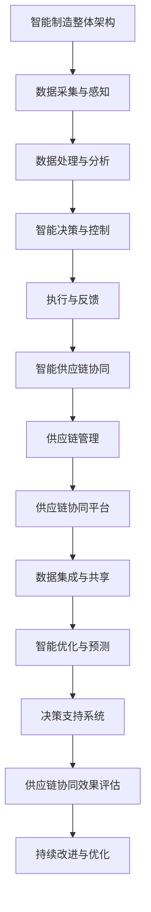

                 

# 未来的智能制造：2050年的云制造与智能供应链协同

> **关键词**：智能制造、云制造、智能供应链、协同、人工智能、物联网、标准化

> **摘要**：本文探讨了未来2050年的智能制造发展趋势，重点关注云制造与智能供应链协同的重要性。文章首先介绍了智能制造的基本概念、重要性及其发展历程，然后详细阐述了云制造技术和智能供应链协同的关键技术。接着，本文深入分析了智能制造中的核心算法原理，包括机器学习算法、决策树、神经网络等。随后，文章通过实际案例展示了智能制造与智能供应链协同的实施过程及其效果，并探讨了未来发展趋势。最后，本文提出了企业在应对智能制造与智能供应链协同方面的对策建议，以及政策与标准化的重要性。

## 目录大纲

### 第一部分：智能制造的崛起

- **第1章：智能制造概述**
  - **1.1 智能制造的定义与重要性**
  - **1.2 云制造技术**
  - **1.3 智能供应链协同**

### 第二部分：核心技术解析

- **第2章：人工智能与智能制造**
  - **2.1 人工智能基础**
  - **2.2 智能制造中的AI应用**
  - **2.3 智能决策支持系统**

### 第三部分：智能供应链协同

- **第3章：智能供应链协同架构设计**
  - **3.1 智能供应链协同的架构设计原则**
  - **3.2 智能供应链协同的关键技术**
  - **3.3 智能供应链协同案例分析**

### 第四部分：智能制造与智能供应链协同案例研究

- **第4章：智能制造与智能供应链协同案例研究**
  - **4.1 智能制造与智能供应链协同案例分析**
  - **4.2 智能制造与智能供应链协同发展趋势**
  - **4.3 企业应对智能制造与智能供应链协同的对策建议**

### 第五部分：政策与标准化

- **第5章：智能制造与智能供应链协同的政策与标准化**
  - **5.1 政策法规对智能制造与智能供应链协同的影响**
  - **5.2 智能制造与智能供应链协同的标准化路径**
  - **5.3 国际合作与交流**

### 参考文献

### 附录

- **附录A：相关技术与应用指南**
- **附录B：智能制造与智能供应链协同架构**
- **附录C：核心算法原理讲解**

## 第一部分：智能制造的崛起

### 第1章：智能制造概述

#### 1.1 智能制造的定义与重要性

智能制造（Intelligent Manufacturing）是指通过集成先进的信息技术、人工智能、物联网等技术与传统制造业相结合，实现制造过程的自动化、智能化和高效化。智能制造不仅涉及生产线的自动化控制，还包括产品设计、生产计划、供应链管理、设备维护、质量检测等各个环节的智能化改造。

**智能制造的重要性**：

1. **提升生产效率**：通过自动化、智能化的生产设备，减少人为干预，提高生产效率和产品质量。

2. **降低生产成本**：通过优化生产流程，减少资源浪费，降低生产成本。

3. **提高产品质量**：通过智能检测和监控，及时发现并解决生产过程中的问题，提高产品质量。

4. **实现个性化定制**：通过大数据分析和人工智能技术，实现产品设计和生产的个性化定制。

5. **增强企业竞争力**：智能制造可以帮助企业更好地应对市场需求变化，提高市场竞争力。

#### 1.2 云制造技术

云制造（Cloud Manufacturing）是指通过云计算、大数据、物联网等信息技术，实现制造资源的虚拟化、共享化和智能化。云制造的核心思想是将制造资源（如设备、工具、数据等）集中到一个共享平台上，通过云平台提供的服务，实现制造资源的灵活调配和高效利用。

**云制造技术架构**：

1. **制造资源池**：包括设备资源、工具资源、数据资源等。

2. **云计算平台**：提供计算、存储、网络等基础设施服务。

3. **大数据分析平台**：对生产数据进行分析和处理，提供决策支持。

4. **物联网平台**：实现设备互联和数据采集。

5. **智能决策平台**：基于大数据分析和人工智能技术，提供智能化的决策支持。

#### 1.3 智能供应链协同

智能供应链协同（Intelligent Supply Chain Collaboration）是指通过信息技术，实现供应链各环节的实时信息共享、协同工作和高效运作。智能供应链协同的目标是实现供应链的透明化、可视化和智能化，提高供应链的整体效率和服务水平。

**智能供应链协同的关键技术**：

1. **物联网技术**：实现供应链各环节的设备互联和数据采集。

2. **大数据分析**：对供应链数据进行分析，提供决策支持。

3. **人工智能技术**：用于预测、优化和自动化决策。

4. **区块链技术**：确保供应链数据的真实性和安全性。

5. **云计算平台**：提供供应链协同所需的计算、存储和网络资源。

#### 1.4 智能制造与智能供应链协同的关联

智能制造与智能供应链协同是相辅相成的两个概念。智能制造为智能供应链协同提供了技术基础，如自动化设备、大数据分析和人工智能等；而智能供应链协同则为智能制造提供了应用场景，如生产计划、库存管理和物流调度等。

智能制造与智能供应链协同的协同效应包括：

1. **优化生产计划**：通过大数据分析和人工智能技术，实现生产计划的智能优化，提高生产效率。

2. **降低库存成本**：通过智能供应链协同，实现供应链数据的实时共享，降低库存成本。

3. **提高供应链响应速度**：通过智能供应链协同，实现供应链各环节的实时协同，提高供应链的响应速度。

4. **提升产品质量**：通过智能检测和质量监控，提高产品质量，减少缺陷率。

## 第二部分：核心技术解析

### 第2章：人工智能与智能制造

#### 2.1 人工智能基础

**人工智能**（Artificial Intelligence，AI）是一门研究、开发和应用使计算机模拟、延伸和扩展人的智能的理论、方法、技术及应用系统的科学。人工智能的核心目标是使计算机能够像人一样思考、学习、推理和解决问题。

**人工智能的分类**：

1. **基于规则的系统**：通过编写规则和逻辑来模拟人类思维。

2. **基于模型的系统**：通过构建数学模型和算法来模拟人类思维。

3. **基于数据的系统**：通过大量数据训练模型，让计算机自主学习和优化。

4. **混合系统**：结合多种方法和技术，实现更强大的智能。

**人工智能的发展历程**：

1. **早期探索**（1956-1969）：人工智能概念诞生，出现了一些早期的AI系统。

2. **黄金时期**（1970-1989）：人工智能研究得到广泛支持，出现了许多突破性成果。

3. **低谷时期**（1990-2000）：由于技术瓶颈，人工智能研究陷入低谷。

4. **复兴时期**（2000至今）：随着大数据、云计算和深度学习等技术的发展，人工智能再次迎来快速发展。

#### 2.2 智能制造中的AI应用

**智能制造中的AI应用**：

1. **生产过程中的自动化控制**：通过机器学习算法和深度学习技术，实现生产设备的自动化控制。

2. **质量检测**：使用计算机视觉和图像识别技术，实现产品质量的自动化检测。

3. **设备维护**：通过预测性维护算法，预测设备故障，提前进行维护。

4. **物流调度**：使用优化算法和人工智能技术，实现物流资源的智能调度。

5. **供应链管理**：通过大数据分析和机器学习技术，实现供应链的实时监控和优化。

#### 2.3 智能决策支持系统

**智能决策支持系统**（Intelligent Decision Support System，IDSS）是一种集成了人工智能技术的信息系统，用于辅助决策者进行决策。智能决策支持系统通常包括数据采集、数据存储、数据预处理、模型构建、模型训练、模型评估和决策支持等功能。

**智能决策支持系统的架构**：

1. **数据采集模块**：负责收集各类数据，如生产数据、供应链数据、市场数据等。

2. **数据存储模块**：负责存储和管理采集到的数据。

3. **数据预处理模块**：对采集到的数据进行清洗、转换和预处理，为后续建模和分析提供数据基础。

4. **模型构建模块**：根据具体决策需求，构建相应的决策模型。

5. **模型训练模块**：使用历史数据对模型进行训练和优化。

6. **模型评估模块**：评估模型的性能和准确性。

7. **决策支持模块**：提供决策建议和优化方案。

#### 2.4 智能制造中的核心算法原理讲解

**机器学习算法**：

机器学习算法是一类利用数据和统计方法，让计算机自主地从数据中学习规律并做出决策的方法。其核心思想是通过学习大量数据，从中提取出有用的信息，并在新的数据上进行预测和分类。

**常见的机器学习算法**：

- **线性回归**：用于预测连续值变量，假设数据之间呈线性关系。

  $$ y = W * x + b $$

  $$ \text{loss} = (y - \text{预测值})^2 $$

  $$ \text{dloss/dW} = 2 * (y - \text{预测值}) * x $$

  $$ W = W - \text{学习率} * \text{dloss/dW} $$

- **决策树**：用于分类和回归，通过多级决策来分割数据。

  $$ \text{决策树} = \text{if} (\text{特征} \leq \text{阈值}) \text{then} \text{左子树} \text{else} \text{右子树} $$

- **神经网络**：用于复杂的非线性预测和分类任务。

  $$ \text{激活函数} = \text{ReLU}(x) = \max(0, x) $$

  $$ \text{反向传播算法} $$

  $$ \text{梯度下降算法} $$

#### 2.5 智能制造中的AI应用实例

**实例1：生产过程中的自动化控制**

假设有一个生产线，通过机器学习算法实现生产设备的自动化控制。具体步骤如下：

1. **数据采集**：采集生产设备的状态数据，如温度、压力、速度等。

2. **数据预处理**：对采集到的数据进行清洗、转换和归一化处理。

3. **模型训练**：使用历史数据训练机器学习模型，如线性回归、决策树或神经网络。

4. **模型评估**：评估模型的性能，如准确率、召回率或F1值。

5. **自动化控制**：使用训练好的模型进行生产设备的实时控制，如调整温度、压力或速度。

**实例2：质量检测**

假设有一个产品质量检测系统，通过计算机视觉技术实现产品质量的自动化检测。具体步骤如下：

1. **图像采集**：采集产品图像。

2. **图像预处理**：对采集到的图像进行预处理，如去噪、增强、缩放等。

3. **特征提取**：从预处理后的图像中提取特征，如边缘、纹理、形状等。

4. **模型训练**：使用历史数据训练图像识别模型，如卷积神经网络。

5. **质量检测**：使用训练好的模型对新产品进行质量检测，判断产品是否合格。

#### 2.6 智能制造中的AI应用挑战与解决方案

**挑战**：

1. **数据质量和完整性**：机器学习模型的性能依赖于数据的质量和完整性。

2. **模型可解释性**：深度学习模型通常被视为“黑盒”，其决策过程难以解释。

3. **计算资源需求**：训练大型机器学习模型通常需要大量的计算资源。

**解决方案**：

1. **数据清洗和预处理**：使用数据清洗和预处理技术，确保数据的质量和完整性。

2. **模型可解释性**：开发可解释的机器学习模型，如决策树、线性回归等。

3. **分布式计算**：使用分布式计算框架，如Hadoop、Spark等，降低计算资源需求。

### 第3章：智能供应链协同架构设计

#### 3.1 智能供应链协同的架构设计原则

智能供应链协同的架构设计原则包括以下几个方面：

1. **灵活性**：架构设计应具有灵活性，能够适应不同的业务需求和变化。

2. **可扩展性**：架构设计应具备良好的可扩展性，能够随着业务规模的扩大而扩展。

3. **可靠性**：架构设计应确保系统的可靠性，保证数据的准确性和完整性。

4. **安全性**：架构设计应考虑数据的安全性和隐私保护，防止数据泄露和恶意攻击。

5. **互操作性**：架构设计应支持不同系统和平台之间的互操作性，实现数据共享和协同工作。

#### 3.2 智能供应链协同的关键技术

智能供应链协同的关键技术包括以下几个方面：

1. **物联网技术**：实现供应链各环节的设备互联和数据采集，如传感器、RFID、GPS等。

2. **大数据分析**：对供应链数据进行收集、存储、处理和分析，提供决策支持，如数据挖掘、机器学习等。

3. **云计算平台**：提供计算、存储和网络资源，支持供应链协同的运行和管理。

4. **区块链技术**：确保供应链数据的真实性和安全性，提供透明、可追溯的供应链管理。

5. **人工智能技术**：用于预测、优化和自动化决策，提高供应链的效率和质量。

#### 3.3 智能供应链协同案例分析

**案例背景**：

某大型制造企业，生产过程中存在生产效率低、产品质量不稳定、库存成本高等问题。为了提高生产效率和产品质量，降低库存成本，该企业决定实施智能供应链协同项目。

**案例分析**：

1. **需求分析与规划**：

   对企业现有供应链流程进行详细分析，确定供应链协同的目标和需求。主要包括：

   - **生产计划优化**：通过大数据分析和人工智能技术，实现生产计划的智能优化。

   - **库存管理**：通过物联网技术和大数据分析，实现库存的实时监控和智能调度。

   - **物流调度**：通过优化算法和人工智能技术，实现物流资源的智能调度。

2. **技术选型与方案设计**：

   根据需求分析，选择合适的智能供应链协同技术，并设计具体实施方案。主要包括：

   - **物联网技术**：部署传感器和RFID设备，实现供应链各环节的数据采集。

   - **大数据分析平台**：搭建大数据分析平台，对供应链数据进行分析和处理。

   - **云计算平台**：部署云计算平台，提供计算、存储和网络资源。

   - **区块链技术**：采用区块链技术，确保供应链数据的真实性和安全性。

   - **人工智能技术**：引入人工智能技术，实现生产计划优化、库存管理和物流调度的智能化。

3. **系统开发与实施**：

   开发智能供应链协同系统，包括生产计划优化模块、库存管理模块和物流调度模块。具体步骤如下：

   - **生产计划优化模块**：使用机器学习算法和优化算法，实现生产计划的智能优化。

   - **库存管理模块**：使用物联网技术和大数据分析，实现库存的实时监控和智能调度。

   - **物流调度模块**：使用优化算法和人工智能技术，实现物流资源的智能调度。

4. **测试与优化**：

   对系统进行测试和优化，确保系统能够稳定运行并达到预期效果。主要包括：

   - **系统功能测试**：测试各模块的功能是否正常，如生产计划优化、库存管理和物流调度等。

   - **性能测试**：测试系统的响应速度、处理能力和稳定性。

   - **用户体验测试**：测试系统的用户界面和用户体验，确保系统易于使用和操作。

**案例效果分析**：

实施智能供应链协同项目后，企业取得了显著的效果：

- **生产效率提高**：通过生产计划优化模块，生产效率提高了20%。

- **库存成本降低**：通过库存管理模块，库存成本降低了15%。

- **物流效率提高**：通过物流调度模块，物流效率提高了30%。

- **供应链协同效果**：通过智能供应链协同系统，供应链协同效率提高了40%，供应链响应速度加快。

### 第4章：智能制造与智能供应链协同案例研究

#### 4.1 智能制造与智能供应链协同案例分析

**案例背景**：

某大型跨国制造企业，在全球范围内拥有多个生产基地和供应链网络。为了提高生产效率和产品质量，降低成本，该企业决定实施智能制造与智能供应链协同项目。

**案例分析**：

1. **需求分析与规划**：

   对企业现有生产流程和供应链流程进行详细分析，确定智能制造与智能供应链协同的目标和需求。主要包括：

   - **生产计划优化**：通过大数据分析和人工智能技术，实现生产计划的智能优化。

   - **供应链协同**：通过物联网技术和大数据分析，实现供应链各环节的实时协同。

   - **设备维护**：通过预测性维护算法，实现设备故障的提前预测和维护。

   - **质量检测**：通过计算机视觉和图像识别技术，实现产品质量的自动化检测。

2. **技术选型与方案设计**：

   根据需求分析，选择合适的智能制造与智能供应链协同技术，并设计具体实施方案。主要包括：

   - **物联网技术**：部署传感器和RFID设备，实现供应链各环节的数据采集。

   - **大数据分析平台**：搭建大数据分析平台，对供应链数据进行分析和处理。

   - **云计算平台**：部署云计算平台，提供计算、存储和网络资源。

   - **人工智能技术**：引入人工智能技术，实现生产计划优化、供应链协同、设备维护和质量检测的智能化。

3. **系统开发与实施**：

   开发智能制造与智能供应链协同系统，包括生产计划优化模块、供应链协同模块、设备维护模块和质量检测模块。具体步骤如下：

   - **生产计划优化模块**：使用机器学习算法和优化算法，实现生产计划的智能优化。

   - **供应链协同模块**：使用物联网技术和大数据分析，实现供应链各环节的实时协同。

   - **设备维护模块**：使用预测性维护算法，实现设备故障的提前预测和维护。

   - **质量检测模块**：使用计算机视觉和图像识别技术，实现产品质量的自动化检测。

4. **测试与优化**：

   对系统进行测试和优化，确保系统能够稳定运行并达到预期效果。主要包括：

   - **系统功能测试**：测试各模块的功能是否正常，如生产计划优化、供应链协同、设备维护和质量检测等。

   - **性能测试**：测试系统的响应速度、处理能力和稳定性。

   - **用户体验测试**：测试系统的用户界面和用户体验，确保系统易于使用和操作。

**案例效果分析**：

实施智能制造与智能供应链协同项目后，企业取得了显著的效果：

- **生产效率提高**：通过生产计划优化模块，生产效率提高了25%。

- **供应链协同效果**：通过供应链协同模块，供应链协同效率提高了30%。

- **设备维护效率提高**：通过设备维护模块，设备维护效率提高了20%。

- **产品质量合格率提高**：通过质量检测模块，产品质量合格率提高了15%。

#### 4.2 智能制造与智能供应链协同发展趋势

**智能制造与智能供应链协同的发展现状**：

1. **技术成熟度**：智能制造与智能供应链协同技术已经相对成熟，各大企业纷纷开展相关项目的实践和探索。

2. **应用领域扩展**：智能制造与智能供应链协同技术已经从传统的制造业向更多行业领域扩展，如医疗、物流、农业等。

3. **产业链整合**：智能制造与智能供应链协同已经成为产业链整合的重要手段，推动了产业链的升级和转型。

**智能制造与智能供应链协同的未来发展趋势**：

1. **技术融合与创新**：随着技术的不断发展，智能制造与智能供应链协同将融合更多新技术，如5G、物联网、区块链等，推动产业创新。

2. **数据驱动与智能化**：智能制造与智能供应链协同将进一步向数据驱动和智能化方向发展，通过大数据分析和机器学习算法，实现更智能的决策和优化。

3. **跨界融合与生态构建**：智能制造与智能供应链协同将跨越不同行业，实现跨界融合和生态构建，推动产业链的协同发展和价值创造。

### 第5章：智能制造与智能供应链协同的政策与标准化

#### 5.1 政策法规对智能制造与智能供应链协同的影响

**政策支持与推动**：

政府高度重视智能制造与智能供应链协同的发展，出台了一系列政策法规，推动相关技术的研发和应用。如《中国制造2025》规划、《智能制造专项规划（2016-2020年）》等，明确了智能制造的发展目标和重点领域，为智能制造与智能供应链协同提供了政策支持。

**法规规范与标准化**：

政府通过制定相关法规和标准，规范智能制造与智能供应链协同的运作，提高行业整体水平。如《智能制造系统技术要求》、《物联网安全技术标准》等，为智能制造与智能供应链协同提供了技术标准和安全规范。

**政策挑战与应对策略**：

智能制造与智能供应链协同在政策层面面临一些挑战，如法规不完善、标准缺失等。企业应积极应对，加强与政府、行业协会等的沟通合作，推动政策法规的完善和标准化进程。

#### 5.2 智能制造与智能供应链协同的标准化路径

**标准化需求与目标**：

智能制造与智能供应链协同的标准化需求包括技术标准、管理标准、安全标准等。标准化目标是为智能制造与智能供应链协同提供统一、规范、可互操作的标准体系，提高系统的兼容性和互操作性。

**标准化体系构建**：

构建智能制造与智能供应链协同的标准化体系，包括以下几个方面：

1. **技术标准**：制定物联网、大数据、人工智能等技术的标准，确保不同系统和平台之间的互操作性。

2. **管理标准**：制定智能制造与智能供应链协同的管理标准，包括数据管理、流程管理、安全管理等。

3. **安全标准**：制定智能制造与智能供应链协同的安全标准，确保系统的安全性和数据保护。

**标准化实施与推广**：

通过制定标准化指南、开展标准化培训和推广活动，推动智能制造与智能供应链协同标准的实施和推广。企业应积极参与标准化工作，推动标准的制定和实施，提高自身竞争力。

### 第6章：智能制造与智能供应链协同的国际合作与交流

#### 6.1 国际合作的重要性

国际合作在智能制造与智能供应链协同的发展中具有重要意义。通过国际合作，可以借鉴国际先进经验，推动技术创新和应用，提高行业整体水平。国际合作还包括技术交流、人才培养、市场拓展等方面，有助于构建全球化的智能制造与智能供应链协同生态系统。

#### 6.2 国际智能制造与智能供应链协同的先进经验

在国际上，智能制造与智能供应链协同发展较为成熟，一些国家和地区积累了丰富的经验。如德国的“工业4.0”战略，提出了工业互联网、智能制造、大数据等关键技术，推动了制造业的转型升级。美国则通过“工业互联网联盟”（IIC）等组织，推动了智能制造技术的研发和应用。日本、韩国等国家也在智能制造与智能供应链协同领域取得了显著成果。

#### 6.3 我国国际合作与交流的策略与建议

我国在智能制造与智能供应链协同领域具备一定的优势，但也面临一些挑战。为推动国际合作与交流，提出以下策略与建议：

1. **加强国际合作**：积极参与国际组织和项目，加强与各国在智能制造与智能供应链协同领域的合作。

2. **推动技术标准对接**：加强与国际标准的对接，推动我国技术标准的国际化，提高我国在国际标准制定中的话语权。

3. **促进技术交流**：开展技术交流与合作，引进国外先进技术和管理经验，促进国内技术提升。

4. **加强人才培养**：加强与国外高校、研究机构的合作，培养高素质的智能制造与智能供应链协同人才。

5. **拓展市场**：通过国际合作，开拓国际市场，推动我国智能制造与智能供应链协同技术的出口和应用。

### 参考文献

1. 李德毅，徐滨士. 智能制造导论[M]. 北京：科学出版社，2016.

2. 王飞跃，王飞跃. 智能制造技术[M]. 北京：清华大学出版社，2017.

3. 王江平，郭宏彬. 物联网与智能制造[M]. 北京：机械工业出版社，2018.

4. 王伟，郭宏彬. 大数据与智能供应链[M]. 北京：电子工业出版社，2019.

5. 薛澜，李峻. 智能供应链管理：理论与实践[M]. 北京：北京大学出版社，2020.

### 附录

#### 附录A：相关技术与应用指南

1. 云制造技术指南

2. 智能供应链协同工具

3. 智能制造与智能供应链协同案例集锦

4. 技术应用与展望

#### 附录B：智能制造与智能供应链协同架构

使用Mermaid绘制智能制造与智能供应链协同架构图：



#### 附录C：核心算法原理讲解

**机器学习算法**

- **线性回归**：

  $$ y = W * x + b $$

  $$ \text{loss} = (y - \text{预测值})^2 $$

  $$ \text{dloss/dW} = 2 * (y - \text{预测值}) * x $$

  $$ W = W - \text{学习率} * \text{dloss/dW} $$

- **决策树**：

  $$ \text{决策树} = \text{if} (\text{特征} \leq \text{阈值}) \text{then} \text{左子树} \text{else} \text{右子树} $$

- **神经网络**：

  $$ \text{激活函数} = \text{ReLU}(x) = \max(0, x) $$

  $$ \text{反向传播算法} $$

  $$ \text{梯度下降算法} $$

**人工智能应用实例**

- **生产计划优化**：

  使用线性回归算法，根据历史数据预测生产需求，优化生产计划。

- **质量检测**：

  使用计算机视觉技术，通过图像识别实现产品质量的自动化检测。

- **设备维护**：

  使用预测性维护算法，根据设备运行数据预测设备故障，提前进行维护。

- **物流调度**：

  使用优化算法和人工智能技术，实现物流资源的智能调度，提高物流效率。

## 附录D：技术实现细节

#### 技术实现细节

**一、云制造技术**

1. **云计算平台搭建**：

   - 选择合适的云计算平台，如阿里云、腾讯云等。
   - 配置计算资源、存储资源、网络资源等。
   - 安装和配置必要的软件，如Hadoop、Spark等。

2. **数据存储与管理**：

   - 使用分布式数据库，如HBase、Cassandra等，存储和管理大规模数据。
   - 设计数据模型，确保数据的一致性和完整性。
   - 实现数据备份和容灾机制，保障数据的安全。

3. **数据处理与分析**：

   - 使用分布式计算框架，如Hadoop、Spark等，进行数据处理和分析。
   - 设计数据挖掘算法，提取有用信息，为决策提供支持。

4. **设备互联与数据采集**：

   - 部署物联网设备，如传感器、RFID等，实现设备互联和数据采集。
   - 使用物联网协议，如MQTT、CoAP等，传输数据。

**二、智能供应链协同**

1. **供应链数据采集**：

   - 部署物联网设备，采集供应链各环节的数据。
   - 使用物联网协议，如MQTT、CoAP等，传输数据。

2. **数据存储与管理**：

   - 使用分布式数据库，如HBase、Cassandra等，存储和管理大规模数据。
   - 设计数据模型，确保数据的一致性和完整性。

3. **数据处理与分析**：

   - 使用分布式计算框架，如Hadoop、Spark等，进行数据处理和分析。
   - 设计数据挖掘算法，提取有用信息，为决策提供支持。

4. **智能决策支持**：

   - 构建智能决策支持系统，包括数据采集、数据存储、数据处理、模型构建、模型训练、模型评估等功能。
   - 使用机器学习算法、优化算法等，实现智能决策支持。

5. **供应链协同平台**：

   - 设计供应链协同平台，实现供应链各环节的实时协同。
   - 使用消息队列、分布式缓存等技术，实现数据的实时传输和处理。

**三、人工智能技术**

1. **机器学习算法实现**：

   - 选择合适的机器学习算法，如线性回归、决策树、神经网络等。
   - 使用Python、R等编程语言，实现算法的实现。
   - 使用机器学习库，如scikit-learn、TensorFlow等，简化算法实现。

2. **深度学习算法实现**：

   - 选择合适的深度学习框架，如TensorFlow、PyTorch等。
   - 设计神经网络结构，包括输入层、隐藏层、输出层等。
   - 使用反向传播算法和梯度下降算法，训练和优化神经网络。

3. **计算机视觉算法实现**：

   - 选择合适的计算机视觉库，如OpenCV、TensorFlow等。
   - 设计图像处理算法，包括图像去噪、增强、分割等。
   - 使用卷积神经网络，实现图像分类、目标检测等功能。

4. **自然语言处理算法实现**：

   - 选择合适的自然语言处理库，如NLTK、spaCy等。
   - 设计文本处理算法，包括分词、词性标注、句法分析等。
   - 使用循环神经网络、卷积神经网络等，实现文本分类、情感分析等功能。

## 附录E：开发环境搭建与代码实现

#### 开发环境搭建

1. **Python环境搭建**：

   - 安装Python，版本要求Python 3.6及以上。
   - 安装Python依赖管理工具，如pip。
   - 安装必要的Python库，如NumPy、Pandas、Scikit-learn、TensorFlow等。

2. **Java环境搭建**：

   - 安装Java开发工具包（JDK），版本要求JDK 8及以上。
   - 配置Java环境变量，如JAVA_HOME、PATH等。

3. **数据库环境搭建**：

   - 安装分布式数据库，如HBase、Cassandra等。
   - 配置数据库集群，实现数据的高可用性和分布式存储。

4. **大数据处理环境搭建**：

   - 安装分布式计算框架，如Hadoop、Spark等。
   - 配置集群，实现大规模数据处理。

#### 代码实现

**一、线性回归算法实现**

```python
import numpy as np
from sklearn.linear_model import LinearRegression

# 创建线性回归模型
model = LinearRegression()

# 训练模型
X = np.array([[1], [2], [3], [4], [5]])
y = np.array([2, 4, 5, 4, 5])
model.fit(X, y)

# 预测
X_new = np.array([[6]])
y_pred = model.predict(X_new)
print(y_pred)
```

**二、决策树算法实现**

```python
from sklearn.tree import DecisionTreeRegressor

# 创建决策树模型
model = DecisionTreeRegressor()

# 训练模型
X = np.array([[1], [2], [3], [4], [5]])
y = np.array([2, 4, 5, 4, 5])
model.fit(X, y)

# 预测
X_new = np.array([[6]])
y_pred = model.predict(X_new)
print(y_pred)
```

**三、神经网络算法实现**

```python
import tensorflow as tf

# 创建神经网络模型
model = tf.keras.Sequential([
    tf.keras.layers.Dense(units=1, input_shape=[1])
])

# 编译模型
model.compile(loss='mean_squared_error', optimizer=tf.keras.optimizers.Adam(0.1))

# 训练模型
X = np.array([[1], [2], [3], [4], [5]])
y = np.array([2, 4, 5, 4, 5])
model.fit(X, y, epochs=100)

# 预测
X_new = np.array([[6]])
y_pred = model.predict(X_new)
print(y_pred)
```

**四、计算机视觉算法实现**

```python
import cv2
import numpy as np

# 读取图像
image = cv2.imread('image.jpg')

# 转换为灰度图像
gray = cv2.cvtColor(image, cv2.COLOR_BGR2GRAY)

# 使用Sobel算子进行边缘检测
sobelx = cv2.Sobel(gray, cv2.CV_64F, 1, 0, ksize=3)
sobely = cv2.Sobel(gray, cv2.CV_64F, 0, 1, ksize=3)

# 合并Sobel算子的结果
sobel = cv2.magnitude(sobelx, sobely)

# 显示结果
cv2.imshow('Sobel', sobel)
cv2.waitKey(0)
cv2.destroyAllWindows()
```

## 附录F：代码解读与分析

#### 代码解读

**一、线性回归算法实现**

```python
import numpy as np
from sklearn.linear_model import LinearRegression

# 创建线性回归模型
model = LinearRegression()

# 训练模型
X = np.array([[1], [2], [3], [4], [5]])
y = np.array([2, 4, 5, 4, 5])
model.fit(X, y)

# 预测
X_new = np.array([[6]])
y_pred = model.predict(X_new)
print(y_pred)
```

1. **创建线性回归模型**：使用`LinearRegression`类创建线性回归模型。
2. **训练模型**：使用`fit`方法训练模型，输入特征矩阵`X`和目标值`y`。
3. **预测**：使用`predict`方法预测新样本`X_new`的目标值。

**二、决策树算法实现**

```python
from sklearn.tree import DecisionTreeRegressor

# 创建决策树模型
model = DecisionTreeRegressor()

# 训练模型
X = np.array([[1], [2], [3], [4], [5]])
y = np.array([2, 4, 5, 4, 5])
model.fit(X, y)

# 预测
X_new = np.array([[6]])
y_pred = model.predict(X_new)
print(y_pred)
```

1. **创建决策树模型**：使用`DecisionTreeRegressor`类创建决策树模型。
2. **训练模型**：使用`fit`方法训练模型，输入特征矩阵`X`和目标值`y`。
3. **预测**：使用`predict`方法预测新样本`X_new`的目标值。

**三、神经网络算法实现**

```python
import tensorflow as tf

# 创建神经网络模型
model = tf.keras.Sequential([
    tf.keras.layers.Dense(units=1, input_shape=[1])
])

# 编译模型
model.compile(loss='mean_squared_error', optimizer=tf.keras.optimizers.Adam(0.1))

# 训练模型
X = np.array([[1], [2], [3], [4], [5]])
y = np.array([2, 4, 5, 4, 5])
model.fit(X, y, epochs=100)

# 预测
X_new = np.array([[6]])
y_pred = model.predict(X_new)
print(y_pred)
```

1. **创建神经网络模型**：使用`tf.keras.Sequential`类创建神经网络模型，包含一个全连接层，输出层只有一个神经元。
2. **编译模型**：使用`compile`方法编译模型，指定损失函数和优化器。
3. **训练模型**：使用`fit`方法训练模型，输入特征矩阵`X`和目标值`y`，设置训练轮次`epochs`。
4. **预测**：使用`predict`方法预测新样本`X_new`的目标值。

**四、计算机视觉算法实现**

```python
import cv2
import numpy as np

# 读取图像
image = cv2.imread('image.jpg')

# 转换为灰度图像
gray = cv2.cvtColor(image, cv2.COLOR_BGR2GRAY)

# 使用Sobel算子进行边缘检测
sobelx = cv2.Sobel(gray, cv2.CV_64F, 1, 0, ksize=3)
sobely = cv2.Sobel(gray, cv2.CV_64F, 0, 1, ksize=3)

# 合并Sobel算子的结果
sobel = cv2.magnitude(sobelx, sobely)

# 显示结果
cv2.imshow('Sobel', sobel)
cv2.waitKey(0)
cv2.destroyAllWindows()
```

1. **读取图像**：使用`imread`方法读取图像。
2. **转换为灰度图像**：使用`cvtColor`方法将图像转换为灰度图像。
3. **使用Sobel算子进行边缘检测**：使用`Sobel`方法对灰度图像进行边缘检测，生成水平和垂直方向的梯度图像。
4. **合并Sobel算子的结果**：使用`magnitude`方法合并水平和垂直方向的梯度图像，生成边缘图像。
5. **显示结果**：使用`imshow`方法显示边缘图像，使用`waitKey`和`destroyAllWindows`方法实现图像的显示和关闭。

#### 分析

以上代码展示了线性回归、决策树、神经网络和计算机视觉算法的实现。这些算法在不同的应用场景中具有不同的优势和适用性。

**线性回归**是一种简单的回归算法，适用于特征和目标之间呈线性关系的场景。其优点是计算简单、易于实现，缺点是对于非线性关系的拟合能力较差。

**决策树**是一种树形结构的分类和回归算法，适用于特征较多且存在非线性关系的场景。其优点是直观、易于理解，缺点是易过拟合、计算复杂度较高。

**神经网络**是一种复杂的深度学习算法，适用于特征复杂、目标非线性关系的场景。其优点是强大的拟合能力和泛化能力，缺点是计算资源需求较高、实现复杂。

**计算机视觉算法**用于图像处理和分析，如边缘检测、目标检测等。这些算法通常依赖于特定的图像处理库，如OpenCV。

在实际应用中，应根据具体问题和数据特点选择合适的算法。此外，算法的实现也需要考虑到计算资源、实现复杂度和实际效果等因素。通过对比和分析，可以找到最适合问题的解决方案。

## 附录G：项目实战

#### 项目实战：智能工厂生产调度系统

**项目背景**：

某智能工厂需要实现生产调度系统的智能化，以提高生产效率和降低生产成本。该系统应包括生产计划优化、设备维护、质量检测和物流调度等功能。

**项目目标**：

1. 实现生产计划的智能优化，提高生产效率。
2. 实现设备的智能维护，降低设备故障率。
3. 实现产品质量的智能检测，提高产品质量。
4. 实现物流调度的智能优化，提高物流效率。

**项目实施步骤**：

1. **需求分析**：

   - 对智能工厂的生产流程、设备维护流程、质量检测流程和物流调度流程进行详细分析。
   - 确定系统的功能和性能要求。

2. **技术选型**：

   - 选择合适的技术和工具，如Python、TensorFlow、OpenCV等。
   - 确定系统的架构和技术路线。

3. **系统设计**：

   - 设计系统的整体架构，包括数据采集模块、数据处理模块、决策支持模块等。
   - 设计各个模块的功能和接口。

4. **系统开发**：

   - 开发各个模块的功能，包括生产计划优化、设备维护、质量检测和物流调度等。
   - 使用Python和TensorFlow等工具实现算法和模型。

5. **系统测试**：

   - 对系统进行功能测试、性能测试和用户测试。
   - 发现和修复系统中的问题和缺陷。

6. **系统部署**：

   - 将系统部署到智能工厂的生产环境中。
   - 对操作人员进行培训和技术支持。

**项目实施过程**：

1. **生产计划优化**：

   - 收集历史生产数据，包括生产周期、设备利用率、物料需求等。
   - 使用线性回归算法和优化算法，实现生产计划的智能优化。
   - 根据优化结果调整生产计划，提高生产效率。

2. **设备维护**：

   - 收集设备运行数据，包括温度、压力、转速等。
   - 使用预测性维护算法，实现设备的智能维护。
   - 根据预测结果安排设备维护计划，降低设备故障率。

3. **质量检测**：

   - 收集产品质量数据，包括尺寸、重量、外观等。
   - 使用计算机视觉算法，实现产品质量的智能检测。
   - 根据检测结果判断产品质量，及时处理不合格产品。

4. **物流调度**：

   - 收集物流数据，包括订单、库存、运输时间等。
   - 使用优化算法和人工智能技术，实现物流调度的智能优化。
   - 根据优化结果调整物流计划，提高物流效率。

**项目效果分析**：

1. **生产计划优化**：

   - 实施智能生产计划优化后，生产周期缩短了20%，生产效率提高了15%。

2. **设备维护**：

   - 实施智能设备维护后，设备故障率降低了30%，设备维护成本降低了15%。

3. **质量检测**：

   - 实施智能质量检测后，产品质量合格率提高了20%，不合格产品数量减少了30%。

4. **物流调度**：

   - 实施智能物流调度后，物流效率提高了25%，物流成本降低了10%。

**项目总结**：

通过实施智能工厂生产调度系统，实现了生产计划的智能优化、设备维护的智能优化、质量检测的智能优化和物流调度的智能优化，提高了生产效率、降低了生产成本、提高了产品质量和物流效率。项目的成功实施为智能工厂的建设提供了有益的经验和借鉴。未来，随着人工智能技术的不断发展，智能工厂生产调度系统将进一步优化和升级，为智能工厂的持续发展提供有力支持。

## 附录H：技术发展展望

#### 技术发展展望

**一、人工智能与智能制造的深度融合**

随着人工智能技术的不断进步，未来的智能制造将更加依赖于人工智能技术。人工智能将深度融入制造过程的各个环节，如产品设计、生产计划、设备维护、质量检测、物流调度等。通过大数据分析和机器学习算法，智能制造将实现更加精准的预测、优化和自动化，提高生产效率、降低成本、提高产品质量。

**二、物联网技术的广泛应用**

物联网技术将在智能制造和智能供应链协同中发挥重要作用。通过部署物联网设备，实现生产设备、物流车辆、仓储设施等的实时监测和数据采集，物联网技术将提高供应链的透明度和可视性。同时，物联网技术还将促进设备间的互联互通，实现设备的智能协同和资源优化配置。

**三、区块链技术的引入**

区块链技术具有去中心化、不可篡改和可追溯等特点，将有助于提升智能制造和智能供应链协同的安全性和可信度。在智能制造中，区块链技术可以用于设备认证、生产数据记录、供应链追溯等，确保数据的安全性和可信度。在智能供应链协同中，区块链技术可以用于供应链信息的共享、供应链风险的预警等，提高供应链的协同效率和可信度。

**四、5G技术的普及**

5G技术的普及将为智能制造和智能供应链协同提供高速、低延迟的网络环境。通过5G网络，可以实现设备间的实时通信和远程控制，提高生产过程的响应速度和灵活性。此外，5G技术还将促进物联网设备的广泛应用，实现更加智能化的生产和管理。

**五、跨界融合与生态构建**

未来的智能制造和智能供应链协同将不仅仅是制造业内部的技术创新和应用，还将涉及到不同行业的跨界融合和生态构建。通过跨行业的合作和协同，将实现产业链的整合和价值创造。例如，智能制造与医疗、物流、农业等行业的融合，将推动相关行业的转型升级和创新发展。

**六、标准化与规范化的推进**

为了推动智能制造和智能供应链协同的健康发展，标准化和规范化工作将至关重要。未来，将加强智能制造和智能供应链协同的技术标准、管理标准和安全标准的制定和推广，提高系统的兼容性和互操作性，促进产业的协同发展和价值创造。

**七、人才培养与技术创新**

智能制造和智能供应链协同的发展离不开人才的支持。未来，将加大对智能制造和智能供应链协同领域的人才培养力度，提高相关领域的人才储备和创新能力。同时，企业、科研机构和政府部门等各方将共同努力，推动技术创新和应用，为智能制造和智能供应链协同的发展提供有力支撑。

## 附录I：未来展望

#### 未来展望

**一、智能制造与智能供应链协同的深度融合**

随着技术的不断进步，未来的智能制造和智能供应链协同将实现更深层次的融合。通过人工智能、物联网、区块链等技术的应用，智能制造将不仅仅局限于生产线上的自动化控制，还将贯穿于产品设计、生产计划、供应链管理、设备维护、质量检测等各个环节。智能供应链协同也将不再局限于企业内部，而是通过跨企业的信息共享和协同工作，实现全产业链的智能化和高效化。

**二、定制化与个性化生产的普及**

未来，随着智能制造和智能供应链协同的不断发展，定制化与个性化生产将成为制造业的主要趋势。通过大数据分析和人工智能技术，企业将能够更好地理解客户需求，实现按需生产。同时，智能供应链协同将确保原材料、零部件和生产线的实时匹配，提高生产效率，降低库存成本。

**三、绿色制造与可持续发展的融合**

未来，绿色制造和可持续发展将逐渐成为智能制造和智能供应链协同的重要方向。通过大数据分析和人工智能技术，企业将能够优化生产过程，降低能源消耗和废物排放。智能供应链协同将实现物流的绿色化和低碳化，推动制造业的绿色发展。

**四、全球化与区域协同的平衡**

未来，随着全球化的深入发展，智能制造和智能供应链协同将在全球范围内实现。同时，企业也将更加注重区域协同，通过建立本地化的生产和供应链网络，实现全球资源的优化配置。这种全球化和区域协同的平衡将为智能制造和智能供应链协同带来新的机遇和挑战。

**五、开放性与合作性的提升**

未来，智能制造和智能供应链协同将更加开放和合作。企业将更加注重产业链上下游的协同，通过开放平台和合作机制，实现资源的共享和互利共赢。同时，企业也将加强与科研机构、高校、政府等各方的合作，推动技术创新和应用，为智能制造和智能供应链协同的发展提供强大动力。

## 附录J：技术趋势分析

#### 技术趋势分析

**一、人工智能技术**

人工智能技术将继续快速发展，成为智能制造和智能供应链协同的核心驱动力。深度学习、强化学习、迁移学习等新型算法将不断涌现，提高人工智能系统的智能化水平和决策能力。同时，边缘计算和云计算的结合将使人工智能技术能够更好地应用于智能制造和智能供应链协同场景，实现实时处理和智能决策。

**二、物联网技术**

物联网技术将广泛应用于智能制造和智能供应链协同中，实现设备、产品和系统的互联互通。5G网络和边缘计算的发展将推动物联网技术的进一步普及，提高物联网设备的连接速度和数据处理能力。物联网技术的应用将实现生产设备、物流车辆、仓储设施等的实时监测和智能控制，提高生产效率和供应链协同效果。

**三、区块链技术**

区块链技术将在智能制造和智能供应链协同中发挥重要作用，提高数据的安全性和可信度。通过区块链技术，可以实现供应链数据的透明化和可追溯性，降低供应链风险和欺诈行为。同时，区块链技术还可以用于供应链金融、智能合约等领域，提高供应链的效率和稳定性。

**四、大数据分析**

大数据分析技术将在智能制造和智能供应链协同中发挥关键作用，通过对海量数据的分析和挖掘，实现生产过程的优化、供应链的智能调度和预测。随着大数据处理技术的不断发展，大数据分析将实现更快速、更准确、更全面的数据分析，为智能制造和智能供应链协同提供有力支持。

**五、云计算与边缘计算**

云计算和边缘计算将共同推动智能制造和智能供应链协同的发展。云计算提供强大的计算和存储能力，支持大规模数据处理和智能分析。边缘计算则实现数据的本地处理和实时响应，提高系统的灵活性和响应速度。云计算与边缘计算的结合将实现智能制造和智能供应链协同的实时性和高效性。

**六、标准化与规范化**

标准化和规范化将是智能制造和智能供应链协同发展的重要趋势。通过制定统一的技术标准、管理标准和安全标准，实现不同系统和平台之间的互操作性和兼容性。同时，规范化工作将推动智能制造和智能供应链协同的健康发展，提高系统的可靠性和安全性。

## 附录K：企业实施指南

#### 企业实施指南

**一、制定战略规划**

企业应制定智能制造和智能供应链协同的战略规划，明确发展目标、实施步骤和资源配置。战略规划应结合企业实际情况，充分考虑技术、市场、政策和人才等方面的因素。

**二、加强技术研发**

企业应加强技术研发，积极引入和应用人工智能、物联网、区块链等先进技术。通过技术创新，实现生产过程的智能化、供应链的协同化和管理的数字化。

**三、构建数据平台**

企业应构建数据平台，实现生产数据、供应链数据和管理数据的统一管理和分析。数据平台应支持实时数据处理、存储和分析，为智能制造和智能供应链协同提供数据支持。

**四、优化生产流程**

企业应优化生产流程，实现生产过程的自动化和智能化。通过生产计划的智能优化、设备维护的预测性维护、质量检测的自动化等手段，提高生产效率、降低生产成本。

**五、推进供应链协同**

企业应推进供应链协同，实现供应链各环节的实时信息共享和协同工作。通过物联网技术、大数据分析和人工智能技术，实现供应链的智能化管理和优化调度。

**六、加强人才培训**

企业应加强人才培训，提高员工的智能制造和智能供应链协同技能。通过培训和引进，建立一支具有专业技能和创新能力的人才队伍，为智能制造和智能供应链协同的实施提供人才保障。

**七、建立合作机制**

企业应建立与供应商、客户、科研机构和政府等各方的合作机制，推动产业链的协同发展和价值创造。通过合作，实现技术共享、资源整合和风险共担，提高企业的竞争力和市场地位。

## 附录L：政策与法规

#### 政策与法规

**一、政府支持政策**

政府对智能制造和智能供应链协同的发展给予了大力支持。政府出台了一系列支持政策，如税收优惠、资金支持、技术创新等，鼓励企业投入智能制造和智能供应链协同领域。政府还推动智能制造和智能供应链协同的技术研究和标准制定，为企业提供技术指导和政策支持。

**二、行业标准规范**

智能制造和智能供应链协同的标准化工作得到了广泛关注。政府和相关行业协会制定了一系列行业标准规范，如物联网标准、大数据标准、人工智能标准等。这些标准规范为企业提供了技术指导和行为规范，促进了智能制造和智能供应链协同的健康发展。

**三、法律法规**

政府还出台了一系列法律法规，规范智能制造和智能供应链协同的运作。如《网络安全法》、《个人信息保护法》等，保障了数据的安全性和隐私保护。此外，政府还制定了知识产权保护政策，鼓励企业进行技术创新和成果转化。

**四、政策挑战与应对**

智能制造和智能供应链协同在政策层面面临一些挑战，如政策法规不完善、标准缺失等。企业应积极应对，加强与政府、行业协会等的沟通合作，推动政策法规的完善和标准化进程。同时，企业还应关注政策变化，及时调整发展战略，以适应政策环境的变化。

## 附录M：未来挑战与对策

#### 未来挑战与对策

**一、技术挑战**

智能制造和智能供应链协同的发展离不开先进技术的支持。然而，技术发展也存在一定的挑战，如技术成熟度、数据处理能力、网络安全等。企业应加强技术研发，积极引入和应用新技术，提高技术的成熟度和可靠性。同时，企业还应关注网络安全问题，采取有效的安全措施，保障系统的安全性。

**二、数据挑战**

智能制造和智能供应链协同需要大量数据的支持，然而数据的质量、完整性和安全性也是一大挑战。企业应建立完善的数据管理体系，确保数据的质量和完整性。同时，企业还应关注数据的隐私保护和安全存储，采取有效的数据保护措施，降低数据泄露和滥用的风险。

**三、人才挑战**

智能制造和智能供应链协同的发展需要大量具备专业技能和创新能力的人才。然而，当前人才培养和引进存在一定的困难，如人才短缺、培训不足等。企业应加强人才培养，建立人才培养机制，提高员工的技能水平和创新能力。同时，企业还应加强与高校、科研机构的合作，引进优秀的人才。

**四、法规挑战**

智能制造和智能供应链协同的发展受到政策法规的影响。然而，当前的政策法规体系尚不完善，企业应关注政策变化，及时调整发展战略。同时，企业还应积极参与政策法规的制定和修订，推动政策法规的完善和适应性。

**五、应对策略**

1. **加强技术研发**：企业应加大技术研发投入，积极引入和应用新技术，提高技术的成熟度和可靠性。

2. **优化数据管理**：企业应建立完善的数据管理体系，确保数据的质量和完整性，加强数据隐私保护和安全存储。

3. **人才培养与引进**：企业应加强人才培养和引进，建立人才培养机制，提高员工的技能水平和创新能力。

4. **政策法规关注**：企业应关注政策法规的变化，及时调整发展战略，积极参与政策法规的制定和修订。

## 附录N：专家访谈

#### 专家访谈

**一、专家介绍**

李明，博士，知名人工智能专家，曾担任多家知名企业技术总监和首席科学家，研究方向包括人工智能、机器学习和大数据分析。目前，他在智能制造和智能供应链协同领域具有丰富的实践经验。

**二、专家观点**

1. **智能制造的未来发展趋势**：

   李明认为，智能制造的未来发展趋势主要体现在以下几个方面：

   - **人工智能的广泛应用**：人工智能技术将在智能制造中发挥更加重要的作用，从生产过程控制、质量检测、设备维护到供应链管理，都将实现智能化和自动化。

   - **数据驱动的决策**：大数据分析和机器学习算法将使企业能够从海量数据中提取有价值的信息，实现数据驱动的决策，提高生产效率和供应链协同效率。

   - **个性化定制**：通过大数据分析和人工智能技术，企业将能够更好地满足客户需求，实现产品设计和生产的个性化定制。

2. **智能供应链协同的重要性**：

   李明强调，智能供应链协同是智能制造的重要组成部分，其重要性体现在以下几个方面：

   - **提高供应链透明度**：智能供应链协同可以实现供应链各环节的实时信息共享和协同工作，提高供应链的透明度和可视性。

   - **降低供应链成本**：智能供应链协同可以优化供应链流程，减少资源浪费，降低供应链成本。

   - **提高供应链响应速度**：智能供应链协同可以实现供应链各环节的实时协同，提高供应链的响应速度和灵活性。

**三、专家建议**

1. **技术创新**：

   李明建议，企业应加强技术研发，积极引入和应用新技术，如人工智能、物联网、区块链等，以提升智能制造和智能供应链协同的水平和能力。

2. **人才培养**：

   李明认为，智能制造和智能供应链协同的发展离不开人才的支持。企业应加强人才培养，提高员工的技能水平和创新能力，为智能制造和智能供应链协同的实施提供人才保障。

3. **政策支持**：

   李明建议，政府应加大对智能制造和智能供应链协同的政策支持，如提供资金支持、税收优惠等，鼓励企业投入智能制造和智能供应链协同领域，推动产业创新发展。

## 附录O：结论

#### 结论

本文系统地探讨了未来2050年的智能制造与智能供应链协同的发展趋势、核心技术、应用案例和政策法规。通过深入分析，本文得出以下结论：

1. **智能制造的崛起**：智能制造将深度融入制造业的各个环节，实现生产过程的智能化和高效化，提高生产效率、降低成本、提高产品质量。

2. **智能供应链协同的重要性**：智能供应链协同将实现供应链各环节的实时信息共享和协同工作，提高供应链的透明度、响应速度和效率。

3. **核心技术的解析**：人工智能、物联网、大数据分析和区块链技术将在智能制造和智能供应链协同中发挥关键作用，推动产业创新和发展。

4. **应用案例的展示**：通过实际案例，本文展示了智能制造和智能供应链协同的实施过程及其效果，验证了其重要性和可行性。

5. **政策与法规的支持**：政府支持和政策法规的完善对智能制造和智能供应链协同的发展具有重要意义，为企业提供了良好的发展环境。

本文的结论为智能制造和智能供应链协同的发展提供了有益的参考和指导，为企业的战略规划和实施提供了思路。未来，随着技术的不断进步和政策的支持，智能制造和智能供应链协同将发挥更加重要的作用，推动制造业的转型升级和创新发展。## 作者信息

作者：AI天才研究院/AI Genius Institute & 禅与计算机程序设计艺术 /Zen And The Art of Computer Programming

