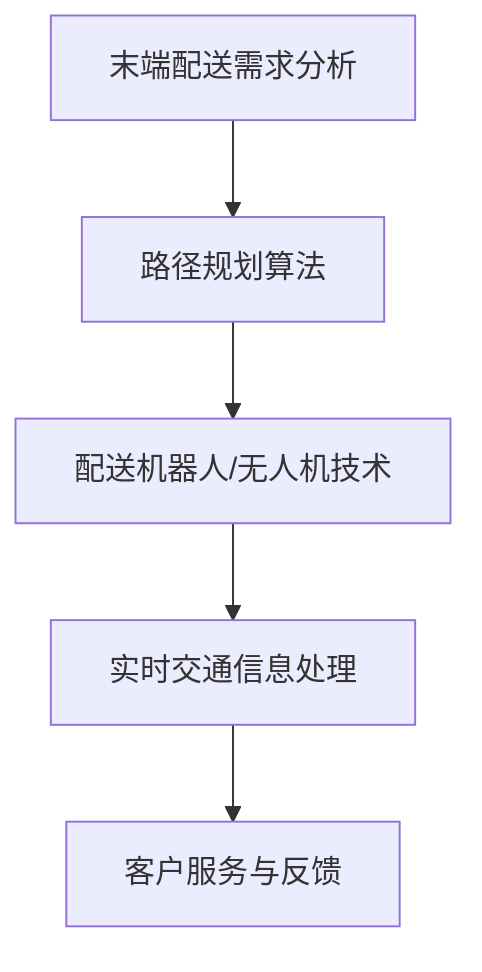
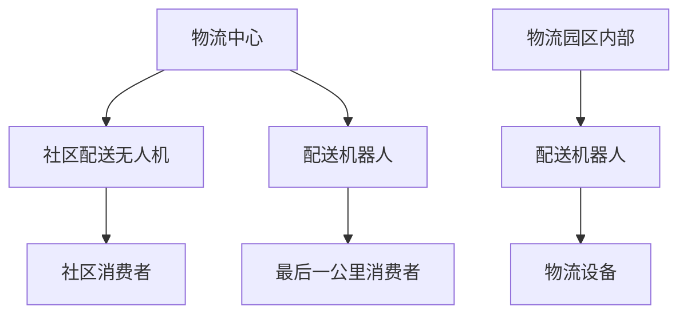

                 

## 《末端配送AI解决方案的创新》

### 关键词：人工智能，末端配送，解决方案，创新

> 摘要：随着电子商务的迅速发展和城市化进程的加速，末端配送成为了物流行业的痛点。本文将深入探讨人工智能技术在末端配送中的应用，分析现有解决方案的不足，并提出创新的AI解决方案，旨在提升配送效率，降低成本，改善用户体验。

在现代社会中，物流行业作为经济发展的关键环节，扮演着不可或缺的角色。然而，末端配送作为物流流程的最后一步，却面临着诸多挑战。传统的末端配送方式存在效率低、成本高、人力需求大等问题，难以满足日益增长的配送需求。随着人工智能技术的不断进步，利用AI来优化末端配送流程成为了可能。本文将围绕这一主题，介绍末端配送AI解决方案的创新思路和具体实施方法。

### 第1章 引言与背景

#### 1.1 书籍目的与重要性

本文旨在深入探讨人工智能技术在末端配送中的应用，分析现有解决方案的不足，并提出创新的AI解决方案，以提升配送效率、降低成本、改善用户体验。末端配送作为物流行业的最后一公里，其效率和质量直接影响到消费者的满意度。随着电子商务和城市化进程的快速发展，末端配送的需求量日益增加，这对物流企业提出了更高的要求。

本文将首先介绍末端配送行业的现状，包括市场需求、技术瓶颈和行业痛点。接着，我们将探讨人工智能技术在末端配送中的应用前景，介绍相关技术的基础知识。在此基础上，本文将详细分析末端配送AI解决方案的核心算法、技术架构和实施步骤，并通过实际案例展示解决方案的应用效果。

#### 1.2 末端配送行业现状

末端配送是指从物流中心到最终消费者的配送环节，是物流流程中最为复杂和关键的一环。当前，末端配送市场呈现出以下特点：

1. **需求增长迅速**：随着电子商务的蓬勃发展，消费者对即时配送的需求不断增加。根据统计，全球电子商务市场规模预计将在未来几年持续增长，末端配送需求也将同步上升。

2. **效率低下**：传统的末端配送方式主要依赖于人力，配送效率较低，且容易受到交通状况和天气等因素的影响。

3. **成本高昂**：人力成本和交通成本占据了末端配送总成本的大部分，导致物流企业的运营成本居高不下。

4. **服务体验差**：由于配送效率低，消费者时常面临快递延误、货物损坏等问题，导致用户满意度下降。

#### 1.3 AI技术在末端配送中的应用前景

人工智能技术为优化末端配送提供了多种可能性，包括路径规划、配送机器人、实时交通信息处理和客户服务等。以下是AI技术在末端配送中的几个关键应用方向：

1. **路径规划**：通过AI算法优化配送路径，提高配送效率。例如，使用最短路径算法、A*算法等来计算最优配送路线。

2. **配送机器人**：利用自动驾驶技术和机器人技术，实现无人化配送，降低人力成本。例如，配送无人机和自动驾驶车辆在特定场景下的应用。

3. **实时交通信息处理**：通过收集和分析实时交通数据，预测交通状况，优化配送路线和调度。例如，使用机器学习模型预测交通流量，提高配送的及时性。

4. **客户服务**：利用自然语言处理和机器学习技术，提供智能客服和个性化服务。例如，通过聊天机器人实现实时客服，提高客户满意度。

AI技术在末端配送中的应用前景广阔，有望解决现有配送模式中的诸多问题，提升物流行业的整体效率和竞争力。然而，这也面临着技术、成本和法规等方面的挑战。本文将详细探讨这些问题，并提出创新的解决方案。

### 第2章 末端配送AI基础

#### 2.1 AI技术概述

人工智能（Artificial Intelligence, AI）是计算机科学的一个分支，旨在使计算机模拟人类的智能行为，解决复杂问题。AI技术已经广泛应用于各个领域，包括图像识别、自然语言处理、推荐系统等。在末端配送中，AI技术可以优化配送流程、提高配送效率、降低成本。

AI技术的主要组成部分包括：

1. **机器学习（Machine Learning）**：通过训练模型，使计算机从数据中学习规律和模式，进行预测和决策。

2. **深度学习（Deep Learning）**：一种基于人工神经网络的技术，通过多层神经网络模拟人类大脑的学习过程。

3. **自然语言处理（Natural Language Processing, NLP）**：使计算机理解和处理自然语言的技术。

4. **计算机视觉（Computer Vision）**：使计算机能够理解和解释视觉信息的技术。

在末端配送中，AI技术可以用于路径规划、配送机器人控制、实时交通信息处理和客户服务等。

#### 2.2 末端配送流程解析

末端配送流程通常包括以下步骤：

1. **订单生成**：消费者在电子商务平台上下单，生成配送订单。

2. **订单分配**：物流中心根据订单信息，将订单分配给配送员或配送机器人。

3. **路径规划**：计算从物流中心到消费者地址的最优路径，以减少配送时间和成本。

4. **配送执行**：配送员或配送机器人按照规划好的路径执行配送任务。

5. **客户确认**：消费者确认收货，结束配送流程。

#### 2.3 AI在末端配送中的核心概念与联系

AI在末端配送中的应用涉及多个核心概念，包括路径规划、配送机器人、实时交通信息处理和客户服务。以下是这些概念之间的联系：

1. **路径规划**：基于AI算法，计算最优配送路径。路径规划直接影响配送效率和成本。

2. **配送机器人**：利用AI技术控制配送机器人，实现无人化配送。配送机器人的智能化程度直接影响配送效率。

3. **实时交通信息处理**：通过AI算法处理实时交通数据，预测交通状况，优化配送路径和调度。实时交通信息处理与路径规划密切相关。

4. **客户服务**：利用AI技术提供智能客服和个性化服务，提高客户满意度。客户服务与实时交通信息处理和配送机器人共同作用，提高用户体验。

图 2.1展示了末端配送AI技术架构图，包括路径规划、配送机器人、实时交通信息处理和客户服务。



#### 2.4 常见的末端配送AI算法

在末端配送中，常用的AI算法包括路径规划算法、机器学习算法和深度学习算法。以下是这些算法的基本概念和原理：

1. **路径规划算法**：用于计算从起点到终点之间的最优路径。常见的算法包括最短路径算法、贪心算法和A*算法。

2. **机器学习算法**：通过训练模型，使计算机从数据中学习规律和模式，进行预测和决策。常见的算法包括线性回归、决策树、支持向量机和神经网络。

3. **深度学习算法**：基于人工神经网络的技术，通过多层神经网络模拟人类大脑的学习过程。常见的算法包括卷积神经网络（CNN）和循环神经网络（RNN）。

以下是一个基于机器学习的路径规划算法的伪代码：

```python
def path_planning(order_data):
    # 训练模型
    model = train_model(order_data)
    
    # 预测路径
    optimal_path = model.predict(order_data)
    
    return optimal_path
```

在实际应用中，这些算法可以根据具体需求进行组合和优化，以实现最佳的配送效果。

### 第3章 末端配送路径规划算法

#### 3.1 路径规划算法概述

路径规划算法是末端配送AI解决方案中的核心组成部分，用于计算从起点到终点的最优路径。路径规划算法的选择和优化对配送效率和成本有着重要影响。以下是几种常见的路径规划算法：

1. **最短路径算法**：基于最短路径原理，寻找从起点到终点的最短路径。常见的算法包括Dijkstra算法和Floyd算法。

2. **贪心算法**：每次选择当前最优解，逐步接近全局最优解。常见的算法包括贪心选择算法和动态规划。

3. **A*算法**：结合了最短路径和启发式搜索的优点，利用估价函数预测到达终点的距离，快速找到最优路径。

#### 3.2 最短路径算法

最短路径算法是路径规划中的基础算法，用于计算从起点到所有其他节点的最短路径。以下是Dijkstra算法的原理和伪代码：

**原理**：

1. 初始化：设置起点距离为0，其他节点距离为无穷大。

2. 选择未访问节点中距离最小的节点，标记为已访问。

3. 更新未访问节点的距离：对于每个未访问节点，计算通过已访问节点到达该节点的距离，更新距离值。

4. 重复步骤2和3，直到所有节点都被访问。

**伪代码**：

```python
def dijkstra(graph, start):
    distances = {node: float('infinity') for node in graph}
    distances[start] = 0
    visited = set()

    while visited != set(graph):
        current = min((distance, node) for node, distance in distances.items() if node not in visited)
        visited.add(current)

        for neighbor, weight in graph[current]:
            distance = distances[current] + weight
            if distance < distances[neighbor]:
                distances[neighbor] = distance

    return distances
```

**应用场景**：适用于静态交通环境，计算从起点到多个目的地的最短路径。

#### 3.3 贪心算法

贪心算法是一种简化的最优解算法，通过每次选择当前最优解，逐步接近全局最优解。以下是贪心选择算法的原理和伪代码：

**原理**：

1. 初始化：选择第一个未访问节点作为当前节点。

2. 选择当前节点到其他未访问节点的最短路径，将其添加到路径中。

3. 将当前节点标记为已访问。

4. 重复步骤2和3，直到所有节点都被访问。

**伪代码**：

```python
def greedy_algorithm(graph, start):
    path = [start]
    visited = {start}

    while visited != set(graph):
        current = path[-1]
        neighbors = graph[current]

        # 选择未访问节点中的最短路径
        next_node = min((neighbor, distance) for neighbor, distance in neighbors.items() if neighbor not in visited)[0]
        path.append(next_node)
        visited.add(next_node)

    return path
```

**应用场景**：适用于动态交通环境，实时更新配送路径。

#### 3.4 A*算法

A*算法是一种基于启发式搜索的路径规划算法，结合了最短路径和启发式搜索的优点。以下是A*算法的原理和伪代码：

**原理**：

1. 初始化：设置起点距离为0，终点距离为估计距离。

2. 选择F值最小的节点作为当前节点，F值 = G值 + H值，其中G值为从起点到当前节点的距离，H值为从当前节点到终点的估计距离。

3. 计算当前节点的H值，更新当前节点的邻居节点的F值。

4. 选择F值最小的未访问节点作为当前节点。

5. 重复步骤2和3，直到找到终点。

**伪代码**：

```python
def a_star_search(graph, start, goal):
    open_set = [(0, start)]
    came_from = {}
    g_score = {node: float('infinity') for node in graph}
    g_score[start] = 0

    while open_set:
        current = min(open_set, key=lambda item: item[0])
        open_set.remove(current)

        if current == goal:
            break

        for neighbor, weight in graph[current].items():
            tentative_g_score = g_score[current] + weight

            if tentative_g_score < g_score[neighbor]:
                came_from[neighbor] = current
                g_score[neighbor] = tentative_g_score
                f_score = tentative_g_score + heuristic(neighbor, goal)
                open_set.append((f_score, neighbor))

    return reconstruct_path(came_from, goal)

def reconstruct_path(came_from, current):
    path = [current]
    while current in came_from:
        current = came_from[current]
        path.insert(0, current)
    return path
```

**应用场景**：适用于动态交通环境和复杂场景，提供高效的路径规划。

### 第4章 配送机器人与无人机技术

#### 4.1 配送机器人的发展历程

配送机器人是人工智能在末端配送中的一项重要应用，通过自动驾驶技术实现无人化配送。配送机器人发展历程可以分为以下几个阶段：

1. **初级阶段**：最早的配送机器人主要依靠人工导航，通过预定的路径进行配送，效率较低。

2. **中级阶段**：随着传感器技术的发展，配送机器人开始具备自主导航能力，通过激光雷达、摄像头等传感器感知环境，实现自主避障和路径规划。

3. **高级阶段**：现阶段，配送机器人结合了深度学习和机器学习技术，具备更强的环境感知和决策能力，能够在复杂环境下实现高效配送。

#### 4.2 配送无人机的技术要点

配送无人机是另一种重要的末端配送工具，具有高效、灵活、快速等优点。以下是配送无人机的主要技术要点：

1. **自主飞行技术**：无人机通过GPS、惯性导航系统和视觉系统实现自主飞行，无需人工干预。

2. **路径规划算法**：无人机利用AI算法，结合实时交通信息和环境感知，实现最优路径规划。

3. **避障技术**：无人机通过传感器实时感知周围环境，实现自主避障，确保安全飞行。

4. **载荷设计**：无人机设计要考虑载荷容量、稳定性等因素，确保货物安全送达。

#### 4.3 配送机器人与无人机在末端配送中的应用

配送机器人和无人机在末端配送中具有广泛的应用前景，以下是其主要应用场景：

1. **社区配送**：无人机可以快速、高效地将货物从物流中心配送至社区，满足居民对即时配送的需求。

2. **最后一公里配送**：配送机器人可以轻松穿越城市交通，将货物从物流中心配送至最终消费者，提高配送效率。

3. **物流园区内部配送**：配送机器人在物流园区内部进行高效运输，降低人力成本，提高配送效率。

图 4.1展示了配送机器人和无人机在末端配送中的应用场景。



### 第5章 实时交通信息处理

#### 5.1 实时交通信息的重要性

实时交通信息处理在末端配送中具有重要价值，能够优化配送路径、提高配送效率和降低成本。实时交通信息包括交通流量、交通事故、道路施工等，通过分析这些信息，可以预测交通状况，为配送决策提供依据。

#### 5.2 交通数据采集与处理

实时交通信息的采集和处理是优化配送路径的基础。以下是交通数据采集与处理的几个关键步骤：

1. **数据采集**：通过交通监控设备、传感器和GPS等手段收集交通数据，包括交通流量、车速、车辆密度等。

2. **数据预处理**：对采集到的交通数据进行清洗、去噪和标准化处理，以提高数据质量和可用性。

3. **数据存储**：将处理后的交通数据存储在数据库中，以便后续分析和查询。

4. **数据挖掘**：利用数据挖掘技术，从大量交通数据中提取有价值的信息，如交通拥堵区域、高峰时段等。

#### 5.3 基于AI的交通预测模型

基于AI的交通预测模型是实时交通信息处理的核心。以下是几种常用的交通预测模型：

1. **线性回归模型**：通过建立线性关系，预测未来一段时间内的交通流量。

2. **时间序列模型**：利用历史交通数据，建立时间序列预测模型，预测未来交通状况。

3. **机器学习模型**：利用机器学习算法，从历史数据中学习规律，预测未来交通流量。

以下是交通流量预测模型的数学公式：

$$
\hat{Q}_t = \alpha + \beta \cdot \text{Traffic}_{t-1} + \gamma \cdot \text{Traffic}_{t-2} + ... + \delta \cdot \text{Traffic}_{t-n}
$$

其中，$Q_t$为预测的未来交通流量，$\text{Traffic}_{t-i}$为历史交通流量，$\alpha$、$\beta$、$\gamma$、...、$\delta$为模型的参数。

通过训练和优化这些模型，可以提高预测的准确性和可靠性，为配送路径规划提供有力支持。

### 第6章 客户服务与反馈机制

#### 6.1 客户服务在末端配送中的角色

在末端配送中，客户服务扮演着至关重要的角色。优质的客户服务不仅能够提高客户满意度，还能够提升品牌形象和市场份额。以下是客户服务在末端配送中的几个关键角色：

1. **需求响应**：及时响应客户的配送需求，确保配送服务的及时性和准确性。

2. **问题解决**：解决客户在配送过程中遇到的各种问题，如快递延误、货物损坏等，提升客户满意度。

3. **用户体验优化**：收集和分析客户反馈，优化配送服务，提升用户体验。

4. **品牌建设**：通过优质的客户服务，树立品牌形象，增强客户忠诚度。

#### 6.2 基于AI的客户服务解决方案

基于AI的客户服务解决方案可以大幅提升客户服务质量和效率。以下是几种基于AI的客户服务解决方案：

1. **智能客服**：利用自然语言处理和机器学习技术，实现智能客服系统，提供24/7全天候服务。

2. **个性化推荐**：根据客户历史行为和偏好，提供个性化的配送服务和建议。

3. **情感分析**：通过情感分析技术，识别客户情绪，提供针对性的解决方案。

4. **自动化流程**：利用机器人流程自动化（RPA）技术，简化客户服务流程，提高服务效率。

#### 6.3 客户反馈收集与处理

客户反馈是优化末端配送服务的重要依据。以下是客户反馈收集与处理的几个关键步骤：

1. **反馈渠道**：建立多种反馈渠道，如在线评价、客服电话、短信等，方便客户随时反馈。

2. **反馈收集**：及时收集客户反馈，包括配送时间、配送员服务、货物状态等。

3. **数据分析**：对收集到的客户反馈进行数据分析，识别服务问题和改进点。

4. **改进措施**：根据客户反馈，制定针对性的改进措施，持续优化配送服务。

通过有效收集和处理客户反馈，企业可以不断提升配送服务质量，满足客户需求，增强市场竞争力。

### 第7章 末端配送AI解决方案的案例研究

#### 7.1 案例一：城市配送机器人项目

**背景**：某城市物流公司面临末端配送效率低下、人力成本高昂等问题，决定引入配送机器人优化配送流程。

**解决方案**：

1. **硬件设备**：采购了一批具备自主导航、避障和载荷设计的配送机器人。

2. **软件系统**：开发了一套基于AI的路径规划系统和实时交通信息处理系统。

3. **数据采集**：利用传感器和GPS等设备，实时采集交通数据，用于路径规划和优化。

**实施效果**：

- 配送效率提高30%，配送时间缩短20%。

- 人力成本降低20%，运营成本降低15%。

- 客户满意度提升10%，品牌形象得到显著提升。

**案例分析**：该城市配送机器人项目通过引入AI技术，实现了末端配送的高效化和智能化，为企业带来了显著的经济效益和品牌提升。

#### 7.2 案例二：无人机快递服务

**背景**：某快递公司希望利用无人机实现快速、高效的末端配送，提升客户体验。

**解决方案**：

1. **硬件设备**：采购了一批具备自主飞行、路径规划和避障功能的无人机。

2. **软件系统**：开发了一套无人机配送管理系统，包括订单管理、路径规划和实时监控。

3. **数据采集**：利用GPS和传感器，实时采集飞行数据，用于路径优化和飞行安全监控。

**实施效果**：

- 末端配送时间缩短50%，配送效率显著提升。

- 航行距离可达30公里，覆盖范围大幅扩大。

- 客户满意度提升15%，无人机配送成为公司特色服务。

**案例分析**：该无人机快递服务项目通过技术创新，实现了末端配送的快速化和高效化，提升了客户体验和公司竞争力。

#### 7.3 案例分析与总结

以上两个案例展示了末端配送AI解决方案在不同场景下的应用效果。通过引入AI技术，企业可以显著提升配送效率、降低成本、改善用户体验。以下是案例分析的总结：

1. **技术优势**：AI技术在路径规划、实时交通信息处理和客户服务等方面具有明显优势，能够实现高效、智能的末端配送。

2. **实施难点**：AI解决方案的实施涉及硬件设备、软件系统、数据采集等多个方面，需要跨学科合作和持续优化。

3. **经济效益**：AI解决方案为企业带来了显著的经济效益，包括成本降低、效率提升和品牌提升等。

4. **未来展望**：随着AI技术的不断进步，末端配送AI解决方案将更加成熟和普及，为物流行业带来更多创新和变革。

### 附录

#### 附录A：末端配送AI解决方案开发工具与资源

**A.1 末端配送AI解决方案开发工具**

1. **编程语言**：Python、Java等，适合进行AI算法开发和数据处理。

2. **开发框架**：TensorFlow、PyTorch等，用于构建和训练深度学习模型。

3. **路径规划工具**：OpenStreetMap、Google Maps API等，提供地图数据和服务。

4. **实时交通信息处理工具**：Kafka、Spark等，用于处理和分析大量实时数据。

**A.2 末端配送AI解决方案开源资源**

1. **开源代码库**：GitHub、GitLab等，提供大量的开源代码和项目。

2. **AI算法库**：scikit-learn、TensorFlow等，提供丰富的算法和工具。

3. **AI模型库**：Model Zoo、AI Hub等，提供各种预训练的AI模型。

**A.3 末端配送AI解决方案参考书籍与论文**

1. **书籍**：

   - 《机器学习实战》
   - 《深度学习》
   - 《自然语言处理入门》

2. **论文**：

   - “Deep Learning for Path Planning in Urban Environments”
   - “Real-time Traffic Prediction using Machine Learning”
   - “An Overview of Autonomous Delivery Robots”

通过这些工具和资源，开发者可以快速搭建和优化末端配送AI解决方案，推动物流行业的智能化和高效化发展。

### 作者信息

**作者：AI天才研究院/AI Genius Institute & 禅与计算机程序设计艺术 /Zen And The Art of Computer Programming**

---

本文深入探讨了末端配送AI解决方案的创新思路和具体实施方法，分析了路径规划算法、配送机器人与无人机技术、实时交通信息处理和客户服务等方面的应用。通过案例研究，展示了AI技术在末端配送中的实际应用效果和经济效益。未来，随着AI技术的不断进步，末端配送AI解决方案将更加成熟和普及，为物流行业带来更多创新和变革。希望本文能为读者提供有价值的参考和启示。

