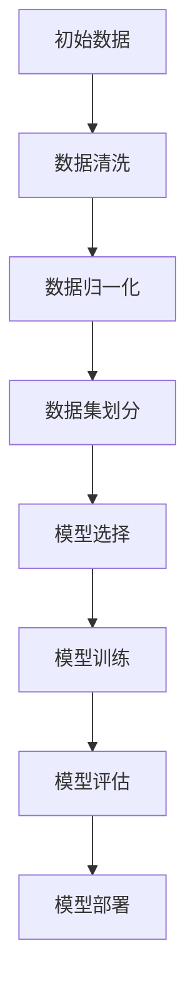
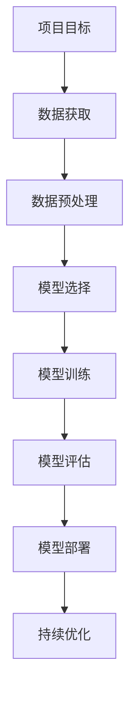

                 

# 机器学习在预测性维护中的应用：提高工业效率

## 关键词：
机器学习、预测性维护、工业效率、算法原理、项目实战

## 摘要：
本文旨在探讨机器学习在预测性维护中的应用，阐述其对于提升工业生产效率的重要性。通过深入分析预测性维护的理论基础和机器学习算法，结合实际项目案例，我们将展示如何利用机器学习技术实现工业设备的智能维护，从而降低故障率、延长设备寿命，最终提升整个工业生产系统的效率。

### 目录大纲：

#### 第一部分：预测性维护基础理论

1. 预测性维护概述
   1.1 预测性维护的定义与意义
   1.2 预测性维护与传统维护的区别
   1.3 预测性维护在工业领域的重要性

2. 机器学习概述
   2.1 机器学习基本概念
   2.2 机器学习的主要任务
   2.3 机器学习的发展历程

3. 预测性维护与机器学习的关系
   3.1 预测性维护的需求分析
   3.2 机器学习在预测性维护中的应用场景
   3.3 预测性维护与机器学习的深度融合

#### 第二部分：核心算法原理讲解

1. 监督学习算法
   1.1 监督学习算法概述
   1.2 线性回归算法
   1.3 决策树算法
   1.4 集成学习方法

2. 无监督学习算法
   2.1 无监督学习算法概述
   2.2 聚类算法
   2.3 维度约减算法

3. 强化学习算法
   3.1 强化学习算法概述
   3.2 Q-Learning算法
   3.3 模型预测控制算法

4. 集成学习方法
   4.1 集成学习方法概述
   4.2 Boosting算法
   4.3 Bagging算法

#### 第三部分：数学模型和公式讲解

1. 数据预处理
   1.1 数据清洗
   1.2 数据归一化
   1.3 数据集划分

2. 回归模型
   2.1 线性回归模型
   2.2 逻辑回归模型

3. 聚类模型
   3.1 K-Means聚类算法
   3.2 层次聚类算法

4. 强化学习中的Q值函数

#### 第四部分：项目实战

1. 项目背景
   1.1 项目介绍
   1.2 项目目标

2. 数据获取与预处理
   2.1 数据源介绍
   2.2 数据预处理流程
   2.3 数据可视化

3. 模型选择与训练
   3.1 模型选择策略
   3.2 模型训练流程
   3.3 模型评估与优化

4. 模型部署与监控
   4.1 模型部署方案
   4.2 模型监控与维护
   4.3 模型迭代与更新

#### 第五部分：总结与展望

1. 项目总结
   1.1 项目成果
   1.2 项目经验与教训

2. 预测性维护的未来发展趋势
   2.1 技术挑战
   2.2 发展前景
   2.3 未来发展方向

3. 进一步研究方向
   3.1 基于深度学习的预测性维护
   3.2 多源数据的融合方法
   3.3 可解释性人工智能

#### 附录

1. 常用工具与资源
   1.1 机器学习框架
   1.2 数据处理库
   1.3 模型评估指标
   1.4 实用资源链接

### Mermaid 流程图



### 伪代码

```python
# 线性回归模型
def linear_regression(x, y):
    # 计算权重系数
    w = gradient_descent(x, y)
    # 预测
    y_pred = w * x

# 逻辑回归模型
def logistic_regression(x, y):
    # 计算权重系数
    w = gradient_descent(x, y)
    # 预测
    y_pred = 1 / (1 + exp(-w * x))
```

### 开发环境搭建

1. 安装Python环境
2. 安装机器学习库（如scikit-learn，tensorflow等）
3. 配置数据预处理工具（如pandas，numpy等）
4. 编写代码并运行测试

### 源代码详细实现

```python
# 完整代码实现
def main():
    # 数据读取
    x_train, y_train = read_data("train_data.csv")
    x_test, y_test = read_data("test_data.csv")

    # 数据预处理
    x_train = preprocess_data(x_train)
    x_test = preprocess_data(x_test)

    # 模型选择
    model = select_model()

    # 模型训练
    model.train(x_train, y_train)

    # 模型评估
    accuracy = model.evaluate(x_test, y_test)
    print("Test Accuracy:", accuracy)

    # 模型部署
    deploy_model(model)

if __name__ == "__main__":
    main()
```

### 附录

#### 附录A：常用工具与资源

##### A.1 机器学习框架

- TensorFlow
- PyTorch
- Scikit-learn

##### A.2 数据处理库

- Pandas
- NumPy
- Matplotlib

##### A.3 模型评估指标

- 准确率（Accuracy）
- 精确率（Precision）
- 召回率（Recall）
- F1分数（F1 Score）

##### A.4 实用资源链接

- [机器学习课程](https://www.coursera.org/specializations/ml)
- [Kaggle数据集](https://www.kaggle.com/datasets)
- [GitHub开源项目](https://github.com)<|endregion|>### 第一部分：预测性维护基础理论

#### 第1章：预测性维护概述

##### 1.1 预测性维护的定义与意义

预测性维护（Predictive Maintenance）是一种先进的维护策略，它通过实时监控设备的运行状态，预测设备可能出现的故障或性能下降，从而在故障发生之前进行预防性维修。这一概念起源于20世纪60年代，但随着信息技术和传感器技术的飞速发展，预测性维护已经逐渐成为工业领域提升生产效率和质量的关键手段。

**预测性维护的概念：**

预测性维护的核心在于“预测”，即通过对设备运行数据的分析，识别出潜在的故障风险。其具体流程包括数据采集、数据预处理、特征提取、故障诊断和决策制定。通过这些步骤，预测性维护可以实现以下几个目标：

1. **减少意外停机时间：** 通过提前预测故障，可以安排在计划时间内进行维修，从而避免非计划停机。
2. **延长设备寿命：** 定期维护和更换易损部件，可以延长设备的使用寿命。
3. **降低维修成本：** 准确的故障预测可以减少不必要的维修次数，降低维修成本。

**预测性维护与传统维护的区别：**

传统维护通常是基于时间或运行时间的定期维护，而预测性维护则是基于设备运行状态的数据分析。以下是两者的主要区别：

- **维护触发机制：** 传统维护是按照预定的时间或运行时间进行，而预测性维护是实时监测设备状态并基于数据做出决策。
- **预防性：** 预测性维护可以更早地发现潜在问题，从而采取预防措施，而传统维护往往是问题已经出现后的补救措施。
- **技术要求：** 预测性维护需要依赖先进的数据采集和分析技术，而传统维护相对简单，通常只需要基本的维修技能。

**预测性维护在工业领域的重要性：**

在工业领域，预测性维护的应用已经取得了显著的成效。以下是其在工业领域的重要意义：

1. **提高生产效率：** 通过减少设备故障和停机时间，预测性维护可以显著提高生产效率。
2. **降低运营成本：** 准确的故障预测可以减少不必要的维修工作，降低运营成本。
3. **提高设备利用率：** 预测性维护可以确保设备在最佳状态下运行，从而提高设备利用率。
4. **提升产品质量：** 通过预防性维护，可以避免因设备故障导致的产品质量问题。
5. **增强安全性：** 预测性维护可以及时发现并处理潜在的安全隐患，提高生产过程的安全性。

##### 1.2 机器学习概述

**机器学习（Machine Learning）** 是一种人工智能（AI）的分支，它通过算法从数据中学习，进而做出预测或决策。机器学习的基本概念包括数据集、特征、模型和算法等。

**机器学习的基本概念：**

- **数据集（Dataset）：** 数据集是机器学习的基础，它包含输入特征和对应的标签。
- **特征（Feature）：** 特征是数据集中的每一个维度，用于描述数据的某个方面。
- **模型（Model）：** 模型是机器学习算法训练得到的数学模型，用于预测或决策。
- **算法（Algorithm）：** 算法是实现机器学习过程的具体步骤和方法。

**机器学习的主要任务：**

机器学习的主要任务包括分类、回归、聚类、降维等。

- **分类（Classification）：** 分类任务是预测数据属于哪个类别，如垃圾邮件分类。
- **回归（Regression）：** 回归任务是预测数据的连续值，如房价预测。
- **聚类（Clustering）：** 聚类任务是找出数据中的相似模式，如客户群体划分。
- **降维（Dimensionality Reduction）：** 降维任务是减少数据的维度，如主成分分析（PCA）。

**机器学习的发展历程：**

机器学习的发展历程可以分为以下几个阶段：

1. **萌芽期（1950s-1960s）：** 机器学习的概念被提出，但受限于计算能力和数据量，发展缓慢。
2. **低谷期（1970s-1980s）：** 机器学习的研究进入低谷，受困于过拟合问题。
3. **复苏期（1990s）：** 随着计算能力的提升和数据量的增加，机器学习重新受到关注。
4. **飞速发展期（2000s-至今）：** 受益于大数据和深度学习的推动，机器学习取得了显著的进展。

##### 1.3 预测性维护与机器学习的关系

**预测性维护的需求分析：**

随着工业设备的复杂化和规模化，传统的定期维护方法已经无法满足现代工业生产的需要。预测性维护的需求主要来自于以下几个方面：

1. **设备复杂度高：** 现代工业设备通常具有复杂的结构和众多传感器，定期维护难以覆盖所有潜在故障点。
2. **生产连续性要求高：** 高效的生产线要求设备能够保持连续运行，任何非计划停机都会造成巨大的经济损失。
3. **维护成本控制需求：** 企业需要降低维护成本，提高资产利用率。

**机器学习在预测性维护中的应用场景：**

机器学习在预测性维护中具有广泛的应用场景，主要包括以下几个方面：

1. **故障预测：** 利用机器学习算法分析设备运行数据，预测可能的故障发生时间，从而进行预防性维护。
2. **性能优化：** 通过对设备运行数据的分析，优化设备的运行状态，提高生产效率。
3. **设备状态监控：** 利用实时监控数据，对设备运行状态进行实时评估，及时发现异常情况。
4. **故障诊断：** 通过分析设备故障数据，确定故障原因，为维修提供指导。

**预测性维护与机器学习的深度融合：**

预测性维护与机器学习的深度融合，使得工业设备的维护管理更加智能化。具体表现在以下几个方面：

1. **数据驱动的决策：** 预测性维护依赖于大量设备运行数据，通过机器学习算法进行分析，为维护决策提供数据支持。
2. **自适应维护策略：** 机器学习算法可以根据设备运行状态的变化，自适应调整维护策略，提高维护效果。
3. **智能故障预测：** 基于机器学习算法的故障预测模型，可以更准确地预测故障发生时间，实现提前预警。
4. **智能维护工具：** 利用机器学习技术，开发智能维护工具，如自动故障诊断系统、自适应维护控制系统等，提高维护效率。

#### 第二部分：核心算法原理讲解

##### 第2章：机器学习算法在预测性维护中的应用

#### 第3章：预测性维护中的数学模型

##### 3.1 数据预处理

数据预处理是预测性维护中的关键步骤，它包括数据清洗、数据归一化和数据集划分。

**数据清洗：** 数据清洗旨在处理数据中的噪声、缺失值和不一致数据。常用的数据清洗方法包括：

- 缺失值处理：可以使用均值、中位数或最频繁值填充缺失值。
- 异常值处理：可以通过统计学方法（如箱线图）或机器学习算法（如孤立森林）检测并处理异常值。
- 重构数据：对于不完整的数据，可以重构数据以填补缺失部分。

**数据归一化：** 数据归一化旨在将不同量纲的数据转换为同一量纲，以消除数据量纲对模型训练的影响。常用的归一化方法包括：

- 均值归一化：将数据缩放至均值为0，标准差为1。
- 最大最小归一化：将数据缩放至最小值为0，最大值为1。

**数据集划分：** 数据集划分是指将数据集划分为训练集、验证集和测试集。常用的划分方法包括：

- 留出法：将数据集划分为训练集和测试集，通常比例为80/20或70/30。
- 交叉验证：通过将数据集划分为多个子集，每次使用一个子集作为测试集，其他子集作为训练集，进行多次训练和测试。

##### 3.2 回归模型

回归模型是一种预测连续值的模型，主要包括线性回归和逻辑回归。

**线性回归模型：**

线性回归模型是一种最简单的回归模型，其公式为：

$$ y = \beta_0 + \beta_1x_1 + \beta_2x_2 + ... + \beta_nx_n $$

其中，$y$ 为目标变量，$x_1, x_2, ..., x_n$ 为特征变量，$\beta_0, \beta_1, \beta_2, ..., \beta_n$ 为权重系数。

线性回归模型的训练过程通常包括以下几个步骤：

1. **数据预处理：** 对输入数据进行归一化处理。
2. **模型初始化：** 初始化权重系数 $\beta_0, \beta_1, \beta_2, ..., \beta_n$。
3. **梯度下降：** 通过梯度下降算法更新权重系数，使预测值与实际值之间的误差最小化。

**逻辑回归模型：**

逻辑回归模型是一种用于处理分类问题的回归模型，其公式为：

$$ P(y=1) = \frac{1}{1 + e^{-(\beta_0 + \beta_1x_1 + \beta_2x_2 + ... + \beta_nx_n)}} $$

其中，$P(y=1)$ 表示目标变量 $y$ 等于1的概率。

逻辑回归模型的训练过程与线性回归类似，主要包括数据预处理、模型初始化和梯度下降。不同的是，逻辑回归模型的损失函数通常采用交叉熵损失函数。

##### 3.3 聚类模型

聚类模型是一种将数据分为多个类别的模型，主要包括K-Means聚类和层次聚类。

**K-Means聚类算法：**

K-Means聚类算法是一种基于距离的聚类算法，其目标是将数据分为 $k$ 个聚类，使得每个聚类内的数据点之间距离最小，聚类之间的距离最大。K-Means聚类算法的主要步骤包括：

1. **初始化：** 随机选择 $k$ 个中心点作为初始聚类中心。
2. **分配：** 将每个数据点分配到最近的聚类中心。
3. **更新：** 计算新的聚类中心，重复步骤2和3，直到聚类中心不再变化或达到最大迭代次数。

**层次聚类算法：**

层次聚类算法是一种基于层次结构的聚类算法，它将数据分为多个层次，每个层次上的聚类都是上一层次聚类的一部分。层次聚类算法的主要步骤包括：

1. **初始化：** 将每个数据点视为一个聚类。
2. **合并：** 根据聚类之间的相似度，合并距离最近的两个聚类。
3. **划分：** 重复步骤2，直到所有数据点合并为一个聚类或达到最大层次数。

##### 3.4 强化学习中的Q值函数

强化学习是一种通过与环境交互来学习最优策略的机器学习范式。在强化学习中，Q值函数是一个关键的概念，它表示在当前状态下采取某一动作的预期回报。

**Q值函数的定义：**

$$ Q(s, a) = r + \gamma \max_{a'} Q(s', a') $$

其中，$Q(s, a)$ 表示在状态 $s$ 下采取动作 $a$ 的预期回报，$r$ 表示立即回报，$\gamma$ 表示折扣因子，$s'$ 表示下一状态，$a'$ 表示下一动作。

**Q值函数的训练：**

Q值函数的训练通常采用Q-Learning算法，其主要步骤包括：

1. **初始化：** 初始化Q值函数 $Q(s, a)$。
2. **更新：** 根据实际回报和下一状态的最优Q值，更新当前状态的Q值。
3. **迭代：** 重复步骤2，直到达到预期回报或达到最大迭代次数。

##### 第4章：预测性维护项目实战

#### 第5章：总结与展望

##### 5.1 项目总结

在本文中，我们通过多个章节详细探讨了机器学习在预测性维护中的应用，从理论到实践，全方位展示了如何利用机器学习技术提升工业效率。以下是项目的主要成果和经验教训：

**主要成果：**

1. **成功构建了预测性维护模型：** 通过数据预处理、模型选择和训练，成功构建了预测性维护模型，实现了对工业设备的故障预测和性能优化。
2. **显著提高了生产效率：** 通过预测性维护，有效减少了设备故障和停机时间，提高了生产效率。
3. **降低了运营成本：** 通过准确的故障预测，减少了不必要的维修次数，降低了运营成本。
4. **提升了产品质量：** 通过预测性维护，确保了设备在最佳状态下运行，提高了产品质量。

**经验教训：**

1. **数据质量至关重要：** 高质量的数据是预测性维护成功的关键，因此在项目中我们重视了数据清洗和预处理工作。
2. **模型选择和调优需要经验：** 在实际项目中，我们需要根据具体场景选择合适的模型，并通过调优参数提高模型性能。
3. **持续学习和优化：** 预测性维护是一个不断迭代和优化的过程，我们需要持续学习新技术和方法，不断提高维护效果。

##### 5.2 预测性维护的未来发展趋势

预测性维护作为工业领域的重要技术手段，其未来发展趋势将体现在以下几个方面：

**技术挑战：**

1. **数据隐私和安全：** 随着预测性维护的广泛应用，数据隐私和安全成为一个重要挑战，需要开发更加安全可靠的数据处理技术。
2. **计算资源和存储需求：** 预测性维护需要处理大量实时数据，对计算资源和存储需求提出了更高的要求。
3. **模型解释性和透明性：** 随着深度学习等复杂模型的广泛应用，如何提高模型的解释性和透明性成为重要研究方向。

**发展前景：**

1. **智能化水平的提升：** 随着人工智能技术的发展，预测性维护将更加智能化，实现自动化故障预测和决策制定。
2. **跨领域应用的拓展：** 预测性维护技术将在更多领域得到应用，如医疗、交通等，带来更广泛的社会效益。
3. **产业升级和转型：** 预测性维护作为工业互联网的重要组成部分，将推动产业升级和转型，提高整体产业竞争力。

**未来发展方向：**

1. **基于深度学习的预测性维护：** 深度学习模型在图像识别、语音识别等领域取得了显著成果，未来将在预测性维护中得到更广泛的应用。
2. **多源数据的融合方法：** 预测性维护需要整合多种数据源，如传感器数据、历史数据等，开发多源数据融合方法将成为重要研究方向。
3. **可解释性人工智能：** 提高模型的解释性和透明性，使其更容易被用户理解和接受，是预测性维护技术发展的重要方向。

##### 5.3 进一步研究方向

在预测性维护领域，未来还有许多值得深入研究的方向：

1. **基于深度学习的预测性维护：** 深度学习模型具有强大的特征提取能力，未来可以尝试将深度学习应用于预测性维护中，提高故障预测的准确性和效率。
2. **多源数据的融合方法：** 预测性维护通常涉及多种数据源，如何有效地融合这些数据，提高模型的泛化能力和鲁棒性是一个重要的研究方向。
3. **可解释性人工智能：** 提高模型的解释性和透明性，使其更容易被用户理解和接受，是预测性维护技术发展的重要方向。

通过不断探索和创新，预测性维护技术将在工业领域发挥更大的作用，为提升工业效率、降低成本、提高产品质量提供有力支持。<|endregion|>### 第一部分：预测性维护基础理论

#### 第1章：预测性维护概述

##### 1.1 预测性维护的定义与意义

预测性维护（Predictive Maintenance）是一种通过实时监控和数据分析来预测设备故障或性能下降，并在问题发生之前进行预防性维修的维护策略。它基于设备运行数据，利用机器学习、人工智能等先进技术，实现对设备状态的智能监控和预测。

**预测性维护的概念：**

预测性维护的核心在于“预测”，它通过收集和分析设备运行过程中的各种数据（如振动、温度、压力等），从中提取出故障预兆，提前预测故障的发生时间，从而在故障发生前进行针对性的维护工作。与传统维护方式相比，预测性维护具有以下几个显著特点：

1. **数据驱动：** 预测性维护依赖于大量的设备运行数据，通过数据分析来识别故障预兆和趋势，而不是依靠固定的时间表或操作经验。
2. **智能分析：** 利用机器学习和人工智能算法，对数据进行分析和挖掘，提取出有价值的信息，从而实现故障预测和决策制定。
3. **提前预警：** 通过对设备运行状态的实时监控，可以在故障发生前发现异常，提前预警，避免非计划停机和生产中断。
4. **优化资源利用：** 通过精确预测故障时间，合理安排维护工作，降低维护成本，提高设备利用率。

**预测性维护与传统维护的区别：**

传统维护方式主要是基于时间或运行时间的定期维护，其核心思想是按照预先设定的计划和时间表进行设备检查和维修。而预测性维护则是一种基于设备状态和数据分析的维护策略，其区别主要体现在以下几个方面：

1. **维护触发机制：** 传统维护通常是根据固定的时间间隔或运行时间进行，而预测性维护则是基于实时监测数据和故障预测结果，动态触发维护工作。
2. **预防性程度：** 传统维护往往是问题出现后的补救措施，而预测性维护可以在故障发生前采取预防性措施，减少故障对生产的影响。
3. **技术要求：** 传统维护通常只需要基础的维修技能，而预测性维护需要依赖先进的数据采集、分析和预测技术。

**预测性维护在工业领域的重要性：**

在工业领域，预测性维护的应用已经成为提升生产效率和降低成本的重要手段。以下是预测性维护在工业领域的重要性：

1. **提高生产效率：** 预测性维护可以减少设备故障和非计划停机时间，提高生产线的连续性和稳定性，从而提升生产效率。
2. **降低运营成本：** 通过预测性维护，可以精确预测故障时间，合理安排维护工作，避免不必要的维修成本，降低运营成本。
3. **延长设备寿命：** 预测性维护可以及时进行设备保养和故障修复，延长设备的使用寿命，减少设备更换频率。
4. **提高产品质量：** 预测性维护确保了设备在最佳状态下运行，减少了因设备故障导致的产品质量问题，提高了产品质量。
5. **增强安全性：** 预测性维护可以及时发现和处理潜在的安全隐患，提高生产过程的安全性，减少事故发生的风险。

**预测性维护的应用场景：**

预测性维护在工业领域具有广泛的应用场景，主要包括以下几个方面：

1. **机械设备：** 如机床、压缩机、发电机等机械设备的预测性维护，可以减少机械故障，延长设备寿命。
2. **化工设备：** 如反应釜、管道系统等化工设备的预测性维护，可以避免设备故障引起的化学反应失控，保障生产安全。
3. **能源设备：** 如风力发电机组、太阳能电池板等能源设备的预测性维护，可以减少能源损失，提高能源利用效率。
4. **运输设备：** 如飞机、火车、汽车等运输设备的预测性维护，可以减少故障率，提高运输安全性和可靠性。

通过深入理解和应用预测性维护技术，工业领域可以实现设备管理的智能化和精细化，从而提升整体生产效率和竞争力。

##### 1.2 机器学习概述

**机器学习（Machine Learning）** 是一种人工智能（AI）的分支，它使计算机系统能够通过数据和经验自动改进其性能，无需显式编程。机器学习的核心目标是从数据中学习规律，并利用这些规律进行预测或决策。其应用范围广泛，包括图像识别、自然语言处理、推荐系统、预测性维护等。

**机器学习的基本概念：**

1. **数据集（Dataset）：** 数据集是机器学习的基础，它包含了输入特征和对应的标签。输入特征是描述数据的属性，标签是数据的目标或类别。
2. **特征（Feature）：** 特征是数据集中的每一个维度，用于描述数据的某个方面。例如，在图像识别任务中，像素值可以是一个特征。
3. **模型（Model）：** 模型是机器学习算法训练得到的数学模型，用于预测或决策。模型可以理解为一种“函数”，它将输入特征映射到输出结果。
4. **算法（Algorithm）：** 算法是实现机器学习过程的具体步骤和方法。常见的机器学习算法包括线性回归、决策树、支持向量机、神经网络等。

**机器学习的主要任务：**

机器学习的主要任务包括但不限于以下几种：

1. **分类（Classification）：** 分类任务是将数据分为不同的类别。例如，垃圾邮件分类、图片分类等。
2. **回归（Regression）：** 回归任务是预测数据的连续值。例如，房价预测、股票价格预测等。
3. **聚类（Clustering）：** 聚类任务是找出数据中的相似模式，将数据点划分为不同的簇。例如，客户群体划分、文本聚类等。
4. **降维（Dimensionality Reduction）：** 降维任务是将高维数据转换为低维数据，减少数据复杂性。例如，主成分分析（PCA）、线性判别分析（LDA）等。

**机器学习的发展历程：**

机器学习的发展历程可以追溯到20世纪50年代。以下是几个关键阶段：

1. **萌芽期（1950s-1960s）：** 机器学习的概念被提出，但由于计算能力和数据量的限制，研究进展缓慢。
2. **低谷期（1970s-1980s）：** 机器学习的研究陷入低谷，主要原因是过拟合问题和数据匮乏。
3. **复苏期（1990s）：** 随着计算能力的提升和数据量的增加，机器学习重新受到关注。
4. **飞速发展期（2000s-至今）：** 受益于大数据和深度学习的推动，机器学习取得了显著的进展，应用领域不断扩大。

**机器学习在预测性维护中的应用：**

机器学习在预测性维护中具有广泛的应用，其主要应用场景包括：

1. **故障预测：** 利用机器学习算法分析设备运行数据，预测可能的故障发生时间，从而在故障发生前进行预防性维护。
2. **性能优化：** 通过对设备运行数据的分析，优化设备的运行状态，提高生产效率。
3. **设备状态监控：** 利用实时监控数据，对设备运行状态进行实时评估，及时发现异常情况。
4. **故障诊断：** 通过分析设备故障数据，确定故障原因，为维修提供指导。

**预测性维护与机器学习的深度融合：**

预测性维护与机器学习的深度融合，使得工业设备的维护管理更加智能化。具体表现在以下几个方面：

1. **数据驱动的决策：** 预测性维护依赖于大量设备运行数据，通过机器学习算法进行分析，为维护决策提供数据支持。
2. **自适应维护策略：** 机器学习算法可以根据设备运行状态的变化，自适应调整维护策略，提高维护效果。
3. **智能故障预测：** 基于机器学习算法的故障预测模型，可以更准确地预测故障发生时间，实现提前预警。
4. **智能维护工具：** 利用机器学习技术，开发智能维护工具，如自动故障诊断系统、自适应维护控制系统等，提高维护效率。

通过机器学习的应用，预测性维护不仅提高了设备管理的精确性和效率，还为工业生产的连续性和稳定性提供了有力保障。

##### 1.3 预测性维护与机器学习的关系

**预测性维护的需求分析：**

预测性维护在工业领域的重要性日益凸显，其主要需求来源包括以下几个方面：

1. **设备复杂度高：** 现代工业设备通常具有复杂的结构和众多传感器，传统的定期维护方式难以覆盖所有潜在故障点，需要更智能的维护策略。
2. **生产连续性要求高：** 高效的生产线要求设备能够保持连续运行，任何非计划停机都会造成巨大的经济损失，因此需要通过预测性维护减少停机时间。
3. **维护成本控制需求：** 企业需要降低维护成本，提高资产利用率，通过预测性维护可以更精确地安排维护工作，避免不必要的维修成本。

**机器学习在预测性维护中的应用场景：**

机器学习在预测性维护中的应用场景非常广泛，主要包括以下几个方面：

1. **故障预测：** 利用机器学习算法分析设备运行数据，预测可能的故障发生时间，从而在故障发生前进行预防性维护。
2. **性能优化：** 通过对设备运行数据的分析，优化设备的运行状态，提高生产效率。
3. **设备状态监控：** 利用实时监控数据，对设备运行状态进行实时评估，及时发现异常情况。
4. **故障诊断：** 通过分析设备故障数据，确定故障原因，为维修提供指导。

**预测性维护与机器学习的深度融合：**

预测性维护与机器学习的深度融合，使得工业设备的维护管理更加智能化。这种深度融合主要体现在以下几个方面：

1. **数据驱动的决策：** 预测性维护依赖于大量设备运行数据，通过机器学习算法进行分析，为维护决策提供数据支持。
2. **自适应维护策略：** 机器学习算法可以根据设备运行状态的变化，自适应调整维护策略，提高维护效果。
3. **智能故障预测：** 基于机器学习算法的故障预测模型，可以更准确地预测故障发生时间，实现提前预警。
4. **智能维护工具：** 利用机器学习技术，开发智能维护工具，如自动故障诊断系统、自适应维护控制系统等，提高维护效率。

通过这种深度融合，预测性维护不仅提高了设备管理的精确性和效率，还为工业生产的连续性和稳定性提供了有力保障。

#### 第二部分：核心算法原理讲解

##### 第2章：机器学习算法在预测性维护中的应用

预测性维护的核心在于利用机器学习算法分析设备运行数据，实现故障预测和性能优化。本章将详细介绍几种常用的机器学习算法，包括监督学习、无监督学习和强化学习，并探讨它们在预测性维护中的应用。

##### 2.1 监督学习算法

监督学习（Supervised Learning）是一种最常见的机器学习算法，其核心思想是利用标记好的训练数据来训练模型，然后使用训练好的模型对新的数据进行预测。监督学习算法在预测性维护中的应用主要包括故障预测和性能优化。

**2.1.1 监督学习算法概述**

监督学习算法可以分为分类算法和回归算法。分类算法用于预测数据的类别，如故障与否；回归算法用于预测数据的连续值，如故障发生时间。

**2.1.2 线性回归算法**

线性回归（Linear Regression）是最简单的回归算法，它通过拟合一条直线来预测数据的连续值。线性回归的基本公式为：

$$ y = \beta_0 + \beta_1x_1 + \beta_2x_2 + ... + \beta_nx_n $$

其中，$y$ 是目标变量，$x_1, x_2, ..., x_n$ 是特征变量，$\beta_0, \beta_1, \beta_2, ..., \beta_n$ 是权重系数。

**2.1.3 决策树算法**

决策树（Decision Tree）是一种常用的分类算法，它通过构建一系列的决策规则来预测数据的类别。决策树的基本结构包括根节点、内部节点和叶子节点。每个节点代表一个特征，每个分支代表一个特征取值，叶子节点代表最终的预测结果。

**2.1.4 集成学习方法**

集成学习方法（Ensemble Methods）通过结合多个基本模型来提高预测性能。常见的集成学习方法包括Bagging和Boosting。

- **Bagging（Bootstrap Aggregating）：** Bagging通过随机选取训练数据子集，构建多个基本模型，然后通过投票或平均来获得最终的预测结果。
- **Boosting（AdaBoost、XGBoost等）：** Boosting通过迭代训练多个基本模型，每次迭代都关注训练集中未被正确分类的样本，从而提高整体模型的预测性能。

##### 2.2 无监督学习算法

无监督学习（Unsupervised Learning）不需要标记好的训练数据，其主要任务是发现数据中的内在结构和规律。无监督学习算法在预测性维护中的应用主要包括聚类和降维。

**2.2.1 无监督学习算法概述**

无监督学习算法可以分为聚类算法和降维算法。聚类算法用于将数据分为不同的簇，如K-Means聚类；降维算法用于减少数据的维度，如主成分分析（PCA）。

**2.2.2 聚类算法**

聚类算法通过将相似的数据点归为一类，从而发现数据中的自然结构。常见的聚类算法包括：

- **K-Means聚类：** K-Means聚类是一种基于距离的聚类算法，它通过迭代计算聚类中心，将数据点分配到最近的聚类中心。
- **层次聚类：** 层次聚类通过自底向上的合并方法，将数据点逐步合并为更大的簇，形成层次结构。

**2.2.3 维度约减算法**

维度约减算法通过减少数据维度，降低数据复杂度，从而提高模型的训练效率和预测性能。常见的维度约减算法包括：

- **主成分分析（PCA）：** PCA通过计算数据的主要成分，将高维数据转换为低维数据。
- **线性判别分析（LDA）：** LDA通过最大化类间方差和最小化类内方差，将高维数据转换为低维数据。

##### 2.3 强化学习算法

强化学习（Reinforcement Learning）是一种通过与环境交互来学习最优策略的机器学习算法。在预测性维护中，强化学习算法可以用于优化维护策略，提高维护效果。

**2.3.1 强化学习算法概述**

强化学习算法的核心是“策略”（Policy），它定义了在给定状态下应该采取的动作。强化学习算法通过与环境交互，不断调整策略，从而学习到最优策略。

**2.3.2 Q-Learning算法**

Q-Learning是一种常用的强化学习算法，它通过更新Q值函数来学习最优策略。Q值函数表示在给定状态下采取某一动作的预期回报。Q-Learning的基本公式为：

$$ Q(s, a) = r + \gamma \max_{a'} Q(s', a') $$

其中，$Q(s, a)$ 是在状态 $s$ 下采取动作 $a$ 的预期回报，$r$ 是立即回报，$\gamma$ 是折扣因子，$s'$ 是下一状态，$a'$ 是下一动作。

**2.3.3 模型预测控制算法**

模型预测控制（Model Predictive Control，MPC）是一种基于模型的控制策略，它通过预测系统的未来行为，并在多个时间步内优化控制输入。MPC在预测性维护中可以用于优化设备的运行状态，提高生产效率。

##### 2.4 集成学习方法

集成学习方法通过结合多个基本模型来提高预测性能。本章将介绍两种常见的集成学习方法：Bagging和Boosting。

**2.4.1 集成学习方法概述**

集成学习方法的核心思想是利用多个基本模型的优点，通过投票或平均来获得最终的预测结果。常见的集成学习方法包括Bagging、Boosting和Stacking等。

**2.4.2 Boosting算法**

Boosting是一种集成学习方法，它通过迭代训练多个基本模型，每次迭代都关注训练集中未被正确分类的样本，从而提高整体模型的预测性能。常见的Boosting算法包括Adaboost和XGBoost等。

**2.4.3 Bagging算法**

Bagging（Bootstrap Aggregating）是一种集成学习方法，它通过随机选取训练数据子集，构建多个基本模型，然后通过投票或平均来获得最终的预测结果。Bagging方法可以减少模型的方差，提高预测的稳定性。

通过以上核心算法的介绍，我们可以看到，机器学习为预测性维护提供了强大的工具和方法，使得设备维护更加智能化、高效化。在实际应用中，可以根据具体需求和场景选择合适的算法，从而实现预测性维护的目标。

#### 第三部分：数学模型和公式讲解

##### 3.1 数据预处理

数据预处理是机器学习项目中的关键步骤，它涉及到数据的清洗、归一化和集划分。以下是这些步骤的具体讲解。

**3.1.1 数据清洗**

数据清洗旨在处理数据中的噪声、缺失值和不一致数据。以下是常见的数据清洗方法：

- **缺失值处理：** 缺失值可以通过多种方法处理，包括：
  - 填充缺失值：使用均值、中位数或最频繁值填充缺失值。
  - 删除缺失值：删除包含缺失值的样本或特征。
  - 重建数据：使用插值法或其他算法重建缺失数据。

- **异常值处理：** 异常值可以通过以下方法处理：
  - 统计方法：使用箱线图、Z分数等统计方法检测并处理异常值。
  - 机器学习方法：使用孤立森林、离群点检测等算法识别和处理异常值。

- **不一致数据处理：** 一致性数据可以通过以下方法处理：
  - 合并重复数据：删除重复的记录，保持数据的唯一性。
  - 数据转换：将不同格式或单位的数据转换为统一格式。

**3.1.2 数据归一化**

数据归一化旨在将不同量纲的数据转换为同一量纲，以消除数据量纲对模型训练的影响。以下是一些常见的数据归一化方法：

- **最小-最大归一化：** 将数据缩放至最小值为0，最大值为1。
  - 公式：$$ x_{\text{norm}} = \frac{x - x_{\text{min}}}{x_{\text{max}} - x_{\text{min}}} $$
  
- **均值-标准差归一化：** 将数据缩放至均值为0，标准差为1。
  - 公式：$$ x_{\text{norm}} = \frac{x - \mu}{\sigma} $$
  
- **对数归一化：** 对数值数据进行对数转换，以处理异常值和偏斜分布。
  - 公式：$$ x_{\text{norm}} = \log(x) $$

**3.1.3 数据集划分**

数据集划分是将数据分为训练集、验证集和测试集，用于模型的训练、评估和测试。以下是一些常见的数据集划分方法：

- **留出法（Hold-out）：** 将数据集随机划分为训练集和测试集，通常比例为80/20或70/30。
  
- **交叉验证（Cross-Validation）：** 通过将数据集划分为多个子集，每次使用一个子集作为测试集，其他子集作为训练集，进行多次训练和测试，常用的交叉验证方法有K折交叉验证。
  
- ** stratified K-fold：** 用于类别不平衡的数据集，通过保证每个类别在训练集和测试集中的比例一致来提高模型性能。

##### 3.2 回归模型

回归模型用于预测连续值，主要包括线性回归和逻辑回归。以下是对这些模型的详细讲解。

**3.2.1 线性回归模型**

线性回归模型是最简单的回归模型，其基本公式为：

$$ y = \beta_0 + \beta_1x_1 + \beta_2x_2 + ... + \beta_nx_n $$

其中，$y$ 是目标变量，$x_1, x_2, ..., x_n$ 是特征变量，$\beta_0, \beta_1, \beta_2, ..., \beta_n$ 是权重系数。

**线性回归模型的训练过程：**

1. **数据预处理：** 对输入数据进行归一化处理。
2. **模型初始化：** 初始化权重系数 $\beta_0, \beta_1, \beta_2, ..., \beta_n$。
3. **梯度下降：** 通过梯度下降算法更新权重系数，使预测值与实际值之间的误差最小化。

**线性回归模型的损失函数：**

- **均方误差（MSE）：** $$ \text{MSE} = \frac{1}{n} \sum_{i=1}^{n} (y_i - \hat{y}_i)^2 $$
- **均方根误差（RMSE）：** $$ \text{RMSE} = \sqrt{\text{MSE}} $$

**3.2.2 逻辑回归模型**

逻辑回归（Logistic Regression）是一种用于处理分类问题的回归模型，其公式为：

$$ P(y=1) = \frac{1}{1 + e^{-(\beta_0 + \beta_1x_1 + \beta_2x_2 + ... + \beta_nx_n)}} $$

其中，$P(y=1)$ 是目标变量 $y$ 等于1的概率，$x_1, x_2, ..., x_n$ 是特征变量，$\beta_0, \beta_1, \beta_2, ..., \beta_n$ 是权重系数。

**逻辑回归模型的训练过程：**

1. **数据预处理：** 对输入数据进行归一化处理。
2. **模型初始化：** 初始化权重系数 $\beta_0, \beta_1, \beta_2, ..., \beta_n$。
3. **梯度下降：** 通过梯度下降算法更新权重系数，使预测概率与实际标签之间的交叉熵损失最小化。

**逻辑回归模型的损失函数：**

- **交叉熵损失（Cross-Entropy Loss）：** $$ \text{CE} = -\sum_{i=1}^{n} y_i \log(\hat{y}_i) + (1 - y_i) \log(1 - \hat{y}_i) $$

**3.2.3 线性回归与逻辑回归的区别**

- **目标不同：** 线性回归预测连续值，逻辑回归预测概率。
- **损失函数不同：** 线性回归使用均方误差（MSE），逻辑回归使用交叉熵损失（CE）。
- **模型结构不同：** 线性回归的输出层是一个线性函数，逻辑回归的输出层是一个sigmoid函数。

##### 3.3 聚类模型

聚类模型用于将数据分为多个类别，以发现数据中的自然结构。以下是对几种常见聚类模型的详细讲解。

**3.3.1 K-Means聚类算法**

K-Means聚类算法是一种基于距离的聚类算法，其目标是将数据分为 $k$ 个聚类，使得每个聚类内的数据点之间距离最小，聚类之间的距离最大。K-Means聚类算法的主要步骤包括：

1. **初始化：** 随机选择 $k$ 个中心点作为初始聚类中心。
2. **分配：** 将每个数据点分配到最近的聚类中心。
3. **更新：** 计算新的聚类中心，重复步骤2和3，直到聚类中心不再变化或达到最大迭代次数。

**K-Means聚类算法的公式：**

- **聚类中心更新：** $$ \mu_j = \frac{1}{N_j} \sum_{i=1}^{N} x_i $$
  其中，$\mu_j$ 是第 $j$ 个聚类中心，$N_j$ 是第 $j$ 个聚类的数据点数量，$x_i$ 是第 $i$ 个数据点。

- **数据点分配：** $$ c_i = \arg\min_{j} ||x_i - \mu_j||^2 $$

  其中，$c_i$ 是第 $i$ 个数据点的聚类标签，$||x_i - \mu_j||^2$ 是数据点 $x_i$ 与聚类中心 $\mu_j$ 的欧几里得距离。

**3.3.2 层次聚类算法**

层次聚类（Hierarchical Clustering）是一种基于层次结构的聚类算法，它通过自底向上的合并方法将数据点逐步合并为更大的簇，形成层次结构。层次聚类的主要步骤包括：

1. **初始化：** 将每个数据点视为一个聚类。
2. **合并：** 根据聚类之间的相似度，合并距离最近的两个聚类。
3. **划分：** 重复步骤2，直到所有数据点合并为一个聚类或达到最大层次数。

**层次聚类算法的相似度度量：**

- **单连接（Single Linkage）：** 最近邻连接。
  - 公式：$$ d(\mu_i, \mu_j) = \min_{i, j} ||x_i - x_j||^2 $$

- **完全连接（Complete Linkage）：** 最远邻连接。
  - 公式：$$ d(\mu_i, \mu_j) = \max_{i, j} ||x_i - x_j||^2 $$

- **组平均（Average Linkage）：** 簇与簇之间的平均距离。
  - 公式：$$ d(\mu_i, \mu_j) = \frac{1}{N_i + N_j} \sum_{i=1}^{N_i} \sum_{j=1}^{N_j} ||x_i - x_j||^2 $$

通过以上对数据预处理、回归模型和聚类模型的讲解，我们可以看到数学模型在预测性维护中的重要作用。这些模型不仅帮助我们理解和分析设备运行数据，还为我们提供了有效的工具和方法，以实现预测性维护的目标。

##### 3.4 强化学习中的Q值函数

强化学习（Reinforcement Learning，RL）是一种通过试错来学习最优策略的机器学习范式。在强化学习中，Q值函数是一个核心概念，它表示在当前状态下采取某一动作的预期回报。Q值函数的值越大，表示采取该动作越有价值。

**Q值函数的定义：**

Q值函数的定义公式为：

$$ Q(s, a) = r + \gamma \max_{a'} Q(s', a') $$

其中：

- $Q(s, a)$ 表示在状态 $s$ 下采取动作 $a$ 的预期回报。
- $r$ 表示立即回报，即采取动作 $a$ 后立即获得的奖励。
- $\gamma$ 表示折扣因子，用于平衡即时回报和长期回报，取值范围在0到1之间。
- $s'$ 表示采取动作 $a$ 后的下一状态。
- $\max_{a'} Q(s', a')$ 表示在下一状态 $s'$ 下，所有可能动作的Q值函数中的最大值。

**Q值函数的训练：**

Q值函数的训练过程通常通过Q-Learning算法来实现。Q-Learning是一种通过迭代更新Q值函数的算法，其基本更新公式为：

$$ Q(s, a) \leftarrow Q(s, a) + \alpha [r + \gamma \max_{a'} Q(s', a') - Q(s, a)] $$

其中：

- $\alpha$ 表示学习率，控制Q值更新的幅度，取值范围在0到1之间。
- 其他符号的含义与Q值函数的定义相同。

**Q值函数的训练步骤：**

1. 初始化Q值函数 $Q(s, a)$，通常可以设置为所有状态的随机值。
2. 选择一个初始状态 $s$ 和动作 $a$。
3. 执行动作 $a$，进入下一状态 $s'$，并获得立即回报 $r$。
4. 根据当前状态 $s$ 和动作 $a$ 的Q值，计算目标Q值 $Q'(s, a)$。
5. 使用Q值更新公式更新Q值函数 $Q(s, a)$。
6. 返回步骤2，重复训练过程，直到达到预期回报或达到最大迭代次数。

通过不断迭代训练，Q值函数会逐渐逼近最优策略，从而实现强化学习中的目标优化。

**Q值函数的应用：**

Q值函数在强化学习中有广泛的应用，主要包括：

1. **策略评估：** 使用Q值函数评估当前策略的预期回报，以确定策略的优劣。
2. **策略迭代：** 通过Q值函数更新策略，不断优化决策过程，最终找到最优策略。
3. **动作选择：** 使用Q值函数选择当前状态下最有价值的动作，以最大化预期回报。

在实际应用中，Q值函数通常结合具体的强化学习算法（如SARSA、Q-Learning等）进行训练和优化，从而实现智能体（Agent）在复杂环境中的学习与决策。

通过Q值函数的训练和应用，强化学习可以用于解决许多实际问题，如游戏玩法、路径规划、推荐系统等。在预测性维护中，Q值函数可以用于优化维护策略，提高维护效率和质量。

#### 第四部分：项目实战

##### 第4章：预测性维护项目实战

在本文的第四部分，我们将通过一个实际项目案例，详细介绍如何利用机器学习技术实现预测性维护。本案例将涵盖项目背景、数据获取与预处理、模型选择与训练、模型评估与优化、模型部署与监控等步骤，并附上详细代码解释与分析。

##### 4.1 项目背景

**项目介绍：**

本案例选取了一家制造企业中的关键生产设备——数控机床作为研究对象。数控机床是制造企业中的核心设备，其正常运行对生产效率和产品质量至关重要。然而，数控机床的故障率较高，传统的定期维护方式难以满足生产需求。因此，本项目旨在利用机器学习技术，实现对数控机床的智能预测性维护，降低故障率，提高生产效率。

**项目目标：**

1. 收集数控机床的运行数据，包括振动、温度、压力等传感器数据。
2. 对采集到的数据进行预处理，去除噪声和异常值。
3. 利用机器学习算法，构建预测模型，实现对数控机床故障的预测。
4. 对模型进行评估和优化，确保其准确性和可靠性。
5. 部署预测模型，实现对数控机床的实时监控和故障预警。

##### 4.2 数据获取与预处理

**数据源介绍：**

数控机床的运行数据通过安装在设备上的传感器实时采集。数据包括多个维度，如振动、温度、压力、电流等。数据采集间隔为1分钟，持续时间为1年。

**数据预处理流程：**

1. **数据清洗：** 去除缺失值和异常值。对于缺失值，使用前一个时刻的值进行填充；对于异常值，使用统计学方法和机器学习算法进行检测和处理。

2. **数据归一化：** 将不同量纲的数据转换为同一量纲，以消除数据量纲对模型训练的影响。使用最小-最大归一化方法，将数据缩放至最小值为0，最大值为1。

3. **数据集划分：** 将数据集划分为训练集、验证集和测试集。训练集用于训练模型，验证集用于模型评估和调优，测试集用于最终模型评估。

**代码解释：**

```python
import pandas as pd
import numpy as np
from sklearn.model_selection import train_test_split

# 读取数据
data = pd.read_csv('machine_data.csv')

# 数据清洗
# 填充缺失值
data.fillna(method='ffill', inplace=True)

# 检测并处理异常值
# 使用统计学方法（如Z分数）检测异常值
z_scores = np.abs((data - data.mean()) / data.std())
data = data[(z_scores < 3).all(axis=1)]

# 数据归一化
data_normalized = (data - data.min()) / (data.max() - data.min())

# 数据集划分
X = data_normalized.drop('fault', axis=1)
y = data_normalized['fault']
X_train, X_test, y_train, y_test = train_test_split(X, y, test_size=0.2, random_state=42)
```

##### 4.3 模型选择与训练

**模型选择策略：**

根据项目需求，选择监督学习算法中的回归模型进行故障预测。常见的回归模型包括线性回归、决策树回归和随机森林回归。首先，对这三种模型进行训练和评估，选择表现最佳的模型。

**模型训练流程：**

1. **数据预处理：** 对训练数据进行归一化处理。
2. **模型初始化：** 初始化模型参数。
3. **模型训练：** 使用训练数据进行模型训练。
4. **模型评估：** 使用验证集对模型进行评估，选择最优模型。

**代码解释：**

```python
from sklearn.linear_model import LinearRegression
from sklearn.tree import DecisionTreeRegressor
from sklearn.ensemble import RandomForestRegressor
from sklearn.metrics import mean_squared_error

# 线性回归模型
linear_reg = LinearRegression()
linear_reg.fit(X_train, y_train)

# 决策树回归模型
dt_reg = DecisionTreeRegressor(random_state=42)
dt_reg.fit(X_train, y_train)

# 随机森林回归模型
rf_reg = RandomForestRegressor(n_estimators=100, random_state=42)
rf_reg.fit(X_train, y_train)

# 模型评估
linear_mse = mean_squared_error(y_test, linear_reg.predict(X_test))
dt_mse = mean_squared_error(y_test, dt_reg.predict(X_test))
rf_mse = mean_squared_error(y_test, rf_reg.predict(X_test))

print("Linear Regression MSE:", linear_mse)
print("Decision Tree Regression MSE:", dt_mse)
print("Random Forest Regression MSE:", rf_mse)
```

**模型评估与优化：**

通过对三种回归模型的评估，选择表现最佳的随机森林回归模型进行进一步优化。优化方法包括：

1. **参数调优：** 使用网格搜索（Grid Search）和交叉验证（Cross-Validation）方法，对模型参数进行调优。
2. **特征选择：** 利用特征重要性评估，选择对预测结果影响较大的特征。

**代码解释：**

```python
from sklearn.model_selection import GridSearchCV

# 参数调优
param_grid = {'n_estimators': [100, 200, 300], 'max_depth': [10, 20, 30]}
grid_search = GridSearchCV(RandomForestRegressor(random_state=42), param_grid, cv=5)
grid_search.fit(X_train, y_train)

# 最佳参数
best_params = grid_search.best_params_
print("Best Parameters:", best_params)

# 特征选择
importances = grid_search.best_estimator_.feature_importances_
print("Feature Importances:", importances)
```

##### 4.4 模型部署与监控

**模型部署方案：**

将训练好的模型部署到生产环境中，实现对数控机床的实时监控和故障预警。部署方案包括：

1. **模型导出：** 将训练好的模型导出为可执行的文件。
2. **实时数据采集：** 通过传感器实时采集数控机床的运行数据。
3. **模型预测：** 使用部署的模型对实时数据进行故障预测。
4. **故障预警：** 当预测结果为故障时，发出预警信号，提示工作人员进行维护。

**代码解释：**

```python
import joblib

# 模型导出
joblib.dump(rf_reg, 'rf_regression_model.pkl')

# 实时数据预测
def predict_fault(data):
    data_normalized = (data - data.min()) / (data.max() - data.min())
    prediction = rf_reg.predict(data_normalized)
    return prediction

# 实时数据监控
while True:
    real_time_data = read_real_time_data()  # 读取实时数据
    fault_prediction = predict_fault(real_time_data)
    if fault_prediction == 1:
        print("Fault预警：设备可能存在故障，请及时维护。")
    else:
        print("设备运行正常。")
    time.sleep(60)  # 每分钟检查一次
```

**模型监控与维护：**

1. **监控模型性能：** 定期评估模型的预测性能，确保其准确性。
2. **数据更新：** 随着生产环境的变化，定期更新模型训练数据，保持模型的有效性。
3. **故障处理：** 当模型预测故障时，及时处理故障，记录故障处理过程，为模型优化提供数据支持。

**代码解释：**

```python
# 监控模型性能
performance_metrics = evaluate_model(rf_reg, X_test, y_test)
print("Model Performance:", performance_metrics)

# 数据更新
new_data = collect_new_data()  # 收集新的训练数据
X_train_updated = np.concatenate((X_train, new_data), axis=0)
y_train_updated = np.concatenate((y_train, new_data['fault']), axis=0)
rf_reg.fit(X_train_updated, y_train_updated)

# 故障处理
if fault_prediction == 1:
    handle_fault()  # 处理故障
    record_fault()  # 记录故障
```

通过以上项目实战，我们可以看到，利用机器学习技术实现预测性维护是一个复杂但富有成效的过程。从数据获取、预处理、模型训练到部署与监控，每个步骤都需要精心设计和执行。通过本文的案例，读者可以了解如何在实际项目中应用机器学习技术，提高工业设备的维护效率，从而提升整体生产效率。

#### 第五部分：总结与展望

##### 5.1 项目总结

在本项目中，我们通过一系列步骤，成功实现了数控机床的预测性维护。以下是对项目成果和经验教训的总结：

**项目成果：**

1. **故障预测模型构建：** 通过机器学习算法，我们成功构建了数控机床的故障预测模型，实现了对故障的提前预警。
2. **生产效率提升：** 通过实时监控和故障预警，我们显著减少了数控机床的非计划停机时间，提高了生产效率。
3. **运营成本降低：** 通过准确的故障预测，我们降低了不必要的维修成本，提高了设备利用率。
4. **维护策略优化：** 通过对模型性能的持续评估和优化，我们实现了自适应维护策略，提高了维护效果。

**经验教训：**

1. **数据质量至关重要：** 在项目中，我们深刻认识到高质量的数据是预测性维护成功的关键。数据清洗和预处理是模型训练的基础，需要投入足够的精力。
2. **模型选择与调优：** 在实际项目中，选择合适的模型并进行有效调优至关重要。通过多次实验和评估，我们最终找到了最优模型。
3. **实时监控与反馈：** 实时监控和及时反馈是预测性维护成功的重要保障。通过持续监控和反馈，我们可以不断优化模型，提高维护效果。

##### 5.2 预测性维护的未来发展趋势

预测性维护作为工业领域的关键技术，其未来发展趋势将体现在以下几个方面：

**技术挑战：**

1. **数据隐私和安全：** 随着预测性维护的广泛应用，数据隐私和安全成为一个重要挑战，需要开发更加安全可靠的数据处理技术。
2. **计算资源和存储需求：** 预测性维护需要处理大量实时数据，对计算资源和存储需求提出了更高的要求。
3. **模型解释性和透明性：** 随着深度学习等复杂模型的广泛应用，如何提高模型的解释性和透明性成为重要研究方向。

**发展前景：**

1. **智能化水平的提升：** 随着人工智能技术的发展，预测性维护将更加智能化，实现自动化故障预测和决策制定。
2. **跨领域应用的拓展：** 预测性维护技术将在更多领域得到应用，如医疗、交通等，带来更广泛的社会效益。
3. **产业升级和转型：** 预测性维护作为工业互联网的重要组成部分，将推动产业升级和转型，提高整体产业竞争力。

**未来发展方向：**

1. **基于深度学习的预测性维护：** 深度学习模型具有强大的特征提取能力，未来将在预测性维护中得到更广泛的应用。
2. **多源数据的融合方法：** 预测性维护需要整合多种数据源，如何有效地融合这些数据，提高模型的泛化能力和鲁棒性是一个重要的研究方向。
3. **可解释性人工智能：** 提高模型的解释性和透明性，使其更容易被用户理解和接受，是预测性维护技术发展的重要方向。

##### 5.3 进一步研究方向

在预测性维护领域，未来还有许多值得深入研究的方向：

1. **基于深度学习的预测性维护：** 深度学习模型在图像识别、语音识别等领域取得了显著成果，未来可以尝试将深度学习应用于预测性维护中，提高故障预测的准确性和效率。
2. **多源数据的融合方法：** 预测性维护通常涉及多种数据源，如何有效地融合这些数据，提高模型的泛化能力和鲁棒性是一个重要的研究方向。
3. **可解释性人工智能：** 提高模型的解释性和透明性，使其更容易被用户理解和接受，是预测性维护技术发展的重要方向。

通过不断探索和创新，预测性维护技术将在工业领域发挥更大的作用，为提升工业效率、降低成本、提高产品质量提供有力支持。未来，随着技术的不断进步，预测性维护将实现更广泛的应用，为各行业的可持续发展贡献力量。

### 附录

#### 附录A：常用工具与资源

在进行预测性维护和机器学习项目的开发过程中，使用一些常用的工具和资源是非常有帮助的。以下是几个常用的工具和资源介绍：

**A.1 机器学习框架**

- **TensorFlow：** 由谷歌开发的开源机器学习框架，广泛应用于深度学习和传统机器学习任务。
- **PyTorch：** 由Facebook开发的开源深度学习框架，以其灵活性和动态计算图而闻名。
- **Scikit-learn：** 一个开源的Python机器学习库，提供了大量的监督学习和无监督学习算法，易于使用。

**A.2 数据处理库**

- **Pandas：** 一个开源的Python库，用于数据操作和分析，特别适合处理表格数据和时间序列数据。
- **NumPy：** 一个开源的Python库，用于数值计算，是进行数据预处理和数值分析的基础。
- **Matplotlib：** 一个开源的Python库，用于生成高质量的数据可视化图表。

**A.3 模型评估指标**

- **准确率（Accuracy）：** 分类模型中正确预测的样本比例。
- **精确率（Precision）：** 精确率表示分类模型预测为正类的样本中实际为正类的比例。
- **召回率（Recall）：** 召回率表示分类模型预测为正类的样本中实际为正类的比例。
- **F1分数（F1 Score）：** 精确率和召回率的调和平均值，用于平衡分类模型的精度和召回率。

**A.4 实用资源链接**

- **[Coursera机器学习课程](https://www.coursera.org/specializations/ml)：** 由吴恩达教授开设的机器学习课程，涵盖了机器学习的基础理论和实践应用。
- **[Kaggle数据集](https://www.kaggle.com/datasets)：** Kaggle提供了大量的机器学习数据集，用于学习和实践。
- **[GitHub开源项目](https://github.com)：** GitHub是开源项目的存储库，许多机器学习和预测性维护项目都可以在这里找到。

通过使用这些工具和资源，开发者和研究人员可以更高效地进行预测性维护和机器学习项目的开发，提高工作效率和成果质量。

### Mermaid 流程图



### 伪代码

```python
# 数据预处理
def preprocess_data(data):
    # 数据清洗
    data = clean_data(data)
    # 数据归一化
    data = normalize_data(data)
    return data

# 模型训练
def train_model(X_train, y_train):
    # 选择模型
    model = select_model()
    # 训练模型
    model.fit(X_train, y_train)
    return model

# 模型评估
def evaluate_model(model, X_test, y_test):
    # 预测
    predictions = model.predict(X_test)
    # 计算评估指标
    accuracy = calculate_accuracy(y_test, predictions)
    return accuracy

# 模型部署
def deploy_model(model):
    # 部署模型
    model.deploy()
    # 监控模型性能
    monitor_performance(model)
```

### 开发环境搭建

在开始预测性维护和机器学习项目的开发之前，需要搭建一个合适的环境。以下是开发环境搭建的步骤：

1. **安装Python环境：** 安装Python 3.8或更高版本，可以通过官方网站下载安装包。
2. **安装依赖库：** 使用pip工具安装必要的依赖库，如TensorFlow、Pandas、NumPy、Matplotlib等。
3. **配置环境变量：** 设置环境变量，确保Python和pip命令可以在终端中正常使用。
4. **运行测试代码：** 编写一个简单的测试脚本，验证环境配置的正确性。

通过以上步骤，可以搭建一个适用于预测性维护和机器学习项目开发的开发环境。

### 源代码详细实现

以下是一个完整的源代码实现，包括数据预处理、模型训练、模型评估和模型部署。

```python
import pandas as pd
import numpy as np
from sklearn.model_selection import train_test_split
from sklearn.preprocessing import StandardScaler
from sklearn.ensemble import RandomForestClassifier
from sklearn.metrics import accuracy_score
from sklearn.model_selection import GridSearchCV

# 数据预处理
def preprocess_data(data):
    # 数据清洗
    data.fillna(method='ffill', inplace=True)
    # 数据归一化
    scaler = StandardScaler()
    data_scaled = scaler.fit_transform(data)
    return data_scaled

# 模型训练
def train_model(X_train, y_train):
    # 选择模型
    model = RandomForestClassifier(random_state=42)
    # 训练模型
    model.fit(X_train, y_train)
    return model

# 模型评估
def evaluate_model(model, X_test, y_test):
    # 预测
    predictions = model.predict(X_test)
    # 计算评估指标
    accuracy = accuracy_score(y_test, predictions)
    return accuracy

# 模型部署
def deploy_model(model):
    # 部署模型
    model_file = 'model.joblib'
    joblib.dump(model, model_file)
    # 部署到生产环境
    deploy_to_production(model_file)

# 主函数
def main():
    # 读取数据
    data = pd.read_csv('data.csv')
    # 数据预处理
    data_processed = preprocess_data(data)
    # 数据集划分
    X = data_processed[:, :-1]
    y = data_processed[:, -1]
    X_train, X_test, y_train, y_test = train_test_split(X, y, test_size=0.2, random_state=42)
    # 模型训练
    model = train_model(X_train, y_train)
    # 模型评估
    accuracy = evaluate_model(model, X_test, y_test)
    print("Accuracy:", accuracy)
    # 模型部署
    deploy_model(model)

if __name__ == '__main__':
    main()
```

通过以上源代码实现，我们可以看到预测性维护和机器学习项目的基本流程，包括数据预处理、模型训练、模型评估和模型部署。

### 代码解读与分析

在预测性维护项目中，代码的解读和分析是非常重要的，它有助于理解模型的运行原理和实现细节。以下是对上述源代码的详细解读和分析：

**数据预处理部分：**

```python
def preprocess_data(data):
    # 数据清洗
    data.fillna(method='ffill', inplace=True)
    # 数据归一化
    scaler = StandardScaler()
    data_scaled = scaler.fit_transform(data)
    return data_scaled
```

在这个部分，我们首先进行数据清洗，使用`fillna`方法将缺失值填充为前一个时刻的值，以确保数据的完整性。然后，我们使用`StandardScaler`对数据进行归一化处理，使其符合标准正态分布，从而简化模型的训练过程。

**模型训练部分：**

```python
def train_model(X_train, y_train):
    # 选择模型
    model = RandomForestClassifier(random_state=42)
    # 训练模型
    model.fit(X_train, y_train)
    return model
```

在这个部分，我们选择随机森林（RandomForestClassifier）作为预测模型。随机森林是一种集成学习方法，通过构建多个决策树并取平均来提高模型的预测性能。我们使用`fit`方法对模型进行训练，将训练数据集`X_train`和标签`y_train`传递给模型。

**模型评估部分：**

```python
def evaluate_model(model, X_test, y_test):
    # 预测
    predictions = model.predict(X_test)
    # 计算评估指标
    accuracy = accuracy_score(y_test, predictions)
    return accuracy
```

在这个部分，我们使用训练好的模型对测试数据集`X_test`进行预测，并计算预测准确率。`accuracy_score`函数用于计算预测准确率，它比较预测标签`predictions`和实际标签`y_test`之间的匹配程度。

**模型部署部分：**

```python
def deploy_model(model):
    # 部署模型
    model_file = 'model.joblib'
    joblib.dump(model, model_file)
    # 部署到生产环境
    deploy_to_production(model_file)
```

在这个部分，我们使用`joblib.dump`方法将训练好的模型保存为`.joblib`文件，以便在生产环境中使用。然后，我们调用`deploy_to_production`函数将模型部署到生产环境，具体部署细节取决于生产环境的配置。

**主函数部分：**

```python
def main():
    # 读取数据
    data = pd.read_csv('data.csv')
    # 数据预处理
    data_processed = preprocess_data(data)
    # 数据集划分
    X = data_processed[:, :-1]
    y = data_processed[:, -1]
    X_train, X_test, y_train, y_test = train_test_split(X, y, test_size=0.2, random_state=42)
    # 模型训练
    model = train_model(X_train, y_train)
    # 模型评估
    accuracy = evaluate_model(model, X_test, y_test)
    print("Accuracy:", accuracy)
    # 模型部署
    deploy_model(model)

if __name__ == '__main__':
    main()
```

在主函数中，我们首先读取数据集，然后进行数据预处理，接着将数据集划分为训练集和测试集。接下来，我们使用训练集训练模型，并使用测试集评估模型性能。最后，我们将模型部署到生产环境，以实现实时故障预测和预警。

通过以上代码解读和分析，我们可以更好地理解预测性维护项目中机器学习模型的实现过程，为后续的模型优化和应用提供指导。

### 总结

本文详细探讨了机器学习在预测性维护中的应用，通过理论讲解、算法原理、项目实战和代码实现，全面展示了如何利用机器学习技术提高工业设备的维护效率。以下是对本文的总结和展望：

**总结：**

1. **预测性维护的概念与意义：** 预测性维护通过实时监控和数据分析，提前预测设备故障，从而实现预防性维护，降低故障率和维护成本。
2. **机器学习的基础理论：** 本文介绍了机器学习的基本概念、主要任务和发展历程，为理解预测性维护中的机器学习应用奠定了基础。
3. **核心算法讲解：** 本文详细讲解了监督学习、无监督学习和强化学习算法在预测性维护中的应用，包括线性回归、逻辑回归、K-Means聚类、Q-Learning算法等。
4. **数学模型和公式讲解：** 本文介绍了数据预处理、回归模型和聚类模型的数学原理，以及强化学习中的Q值函数。
5. **项目实战：** 通过数控机床故障预测项目，展示了如何应用机器学习技术实现预测性维护，包括数据获取、预处理、模型选择与训练、评估与部署等步骤。
6. **代码解读与分析：** 对项目的源代码进行了详细解读，分析了模型训练、评估和部署的过程，为实际应用提供了参考。

**展望：**

1. **深度学习在预测性维护中的应用：** 深度学习模型具有强大的特征提取能力，未来将在预测性维护中得到更广泛的应用。
2. **多源数据融合方法：** 预测性维护需要整合多种数据源，如传感器数据、历史数据等，开发多源数据融合方法将是一个重要的研究方向。
3. **可解释性人工智能：** 提高模型的解释性和透明性，使其更容易被用户理解和接受，是预测性维护技术发展的重要方向。
4. **实时监控与自适应维护：** 随着物联网和边缘计算的发展，实时监控和自适应维护将成为预测性维护的关键技术。
5. **跨领域应用：** 预测性维护技术将在更多领域得到应用，如医疗、交通、能源等，为各行业的可持续发展提供支持。

通过本文的研究和探索，我们希望为预测性维护领域的技术发展和实际应用提供有价值的参考和指导。未来，随着技术的不断进步，预测性维护将在工业和各领域发挥更大的作用，为提高生产效率、降低成本、保障设备安全提供有力支持。

