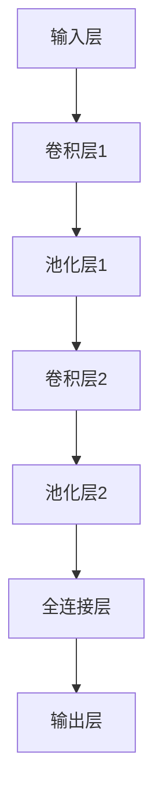
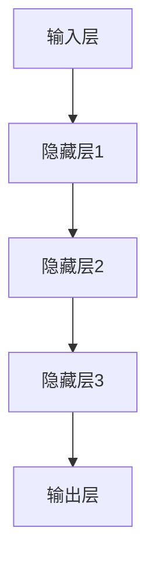
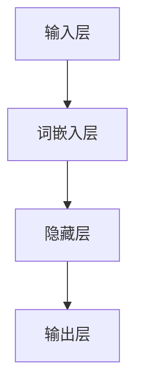
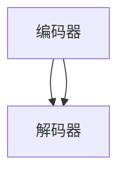

                 

### 文章标题

**《李开复：AI 2.0 时代的投资价值》**

在人工智能（AI）不断演进的过程中，我们见证了从AI 1.0到AI 2.0的转变。李开复博士作为全球人工智能领域的知名专家，他对AI 2.0时代的投资价值有着独到的见解。本文将基于李开复博士的研究，详细探讨AI 2.0时代的投资背景、技术核心、投资机会与风险，以及投资实践。

### 关键词

- AI 2.0
- 投资价值
- 机器学习
- 深度学习
- 投资策略
- 投资风险

### 摘要

本文旨在分析AI 2.0时代的投资价值，从多个角度阐述这一新兴领域带来的机遇和挑战。通过深入探讨AI 2.0的定义与特点、核心技术、投资机会与风险，以及实际投资案例，本文为投资者提供了一份详实的投资指南。

## 《李开复：AI 2.0 时代的投资价值》目录大纲

### 第一部分：AI 2.0 时代的背景与投资概述

#### 1.1 AI 2.0 时代的到来

##### 1.1.1 AI 2.0 的定义与特点
##### 1.1.2 AI 2.0 与 AI 1.0 的区别
##### 1.1.3 AI 2.0 的发展趋势

#### 1.2 AI 2.0 时代的投资价值

##### 1.2.1 AI 2.0 对经济增长的贡献
##### 1.2.2 AI 2.0 对投资者的影响
##### 1.2.3 投资AI 2.0 的策略与建议

### 第二部分：AI 2.0 技术核心

#### 2.1 机器学习基础

##### 2.1.1 机器学习概述
##### 2.1.2 线性回归
##### 2.1.3 逻辑回归

#### 2.2 深度学习基础

##### 2.2.1 深度学习概述
##### 2.2.2 卷积神经网络
##### 2.2.3 循环神经网络

#### 2.3 自然语言处理

##### 2.3.1 自然语言处理概述
##### 2.3.2 词嵌入技术
##### 2.3.3 序列到序列模型

### 第三部分：AI 2.0 时代的投资机会与风险

#### 3.1 AI 2.0 时代的投资机会

##### 3.1.1 人工智能行业的投资机会
##### 3.1.2 AI 2.0 时代的投资策略
##### 3.1.3 AI 2.0 时代的投资案例

#### 3.2 AI 2.0 时代的投资风险

##### 3.2.1 技术风险
##### 3.2.2 法规风险
##### 3.2.3 市场风险

### 第四部分：AI 2.0 时代的投资实践

#### 4.1 AI 2.0 时代的投资实战

##### 4.1.1 投资环境的准备
##### 4.1.2 投资项目筛选
##### 4.1.3 投资决策与执行

#### 4.2 AI 2.0 时代的投资案例解析

##### 4.2.1 案例一：人工智能医疗
##### 4.2.2 案例二：人工智能金融
##### 4.2.3 案例三：人工智能制造

### 附录

#### 附录 A: AI 2.0 投资工具与资源

##### A.1 主流人工智能框架
##### A.2 人工智能开源资源
##### A.3 人工智能投资报告与文献

现在，我们按照目录大纲的结构，逐步深入探讨AI 2.0时代的投资价值。

---

### 第一部分：AI 2.0 时代的背景与投资概述

#### 1.1 AI 2.0 时代的到来

##### 1.1.1 AI 2.0 的定义与特点

在人工智能（AI）发展的历史上，AI 2.0被视为一个重要的里程碑。AI 2.0不仅代表了计算能力的提升，更重要的是它引入了数据驱动和自适应学习的理念。AI 2.0的核心特点可以概括为以下几点：

1. **计算能力的提升**：随着计算能力的不断增强，AI 2.0可以处理更加复杂的数据集，进行更加高效的计算。
   
2. **数据驱动**：AI 2.0强调从大量数据中学习，通过数据驱动的方式进行决策和优化。

3. **自适应学习**：AI 2.0能够根据环境变化自动调整模型参数，实现持续学习和优化。

4. **智能化决策**：AI 2.0不仅能够执行预定的任务，还能够进行智能化决策，甚至在某些方面超越人类。

##### 1.1.2 AI 2.0 与 AI 1.0 的区别

AI 1.0通常指的是基于规则和特征的简单模型，如专家系统和决策树。这些模型的主要优势在于其透明性和可解释性，但局限性也很明显，比如在处理复杂问题时效果不佳。

相比之下，AI 2.0是基于深度学习和大数据的复杂模型。它通过多层神经网络学习数据中的特征和模式，能够在多个领域实现高性能的预测和决策。具体区别如下：

1. **模型复杂度**：AI 1.0的模型相对简单，而AI 2.0的模型更加复杂，能够处理更多维的数据。

2. **数据需求**：AI 1.0通常不需要大量数据，而AI 2.0需要大量高质量的数据进行训练。

3. **可解释性**：AI 1.0的模型较为透明，易于理解，而AI 2.0的模型则更为复杂，其内部工作机制难以解释。

4. **性能提升**：AI 2.0在处理复杂任务时性能显著提升，特别是在图像识别、自然语言处理等领域。

##### 1.1.3 AI 2.0 的发展趋势

AI 2.0的发展趋势可以从技术进步、应用领域和未来发展三个方面来分析。

1. **技术进步**：随着计算能力的提升和算法的优化，AI 2.0的技术水平将不断提高，包括更高效的训练算法、更强大的推理能力等。

2. **应用领域**：AI 2.0将在更多的行业和领域中发挥作用，如医疗、金融、制造、教育等，实现更广泛的应用。

3. **未来发展**：AI 2.0的发展将朝着更加智能化、自适应和人性化的方向前进，实现更高水平的智能自动化。

##### 1.2 AI 2.0 时代的投资价值

AI 2.0时代的到来为投资者带来了巨大的机遇。以下是AI 2.0对投资者的影响和投资AI 2.0的几个关键点：

1. **经济增长贡献**：AI 2.0能够提升生产力、优化资源配置，对经济增长的贡献巨大。

2. **投资机会**：AI 2.0在多个领域创造了巨大的投资机会，包括但不限于医疗、金融、制造等。

3. **投资策略**：投资者需要制定合理的投资策略，包括分散投资、长期持有等，以应对技术风险和市场波动。

4. **风险管理**：投资者应关注技术风险、法规风险和市场风险，采取相应的风险管理措施。

接下来，我们将深入探讨AI 2.0时代的核心技术，包括机器学习、深度学习和自然语言处理。

---

### 第二部分：AI 2.0 技术核心

#### 2.1 机器学习基础

##### 2.1.1 机器学习概述

机器学习是AI 2.0的核心技术之一，它使计算机系统能够从数据中学习，并对新的输入做出预测或决策。以下是机器学习的一些基本概念：

- **监督学习**：在有标注的数据集上训练模型，然后使用该模型对新的数据进行预测。
- **无监督学习**：在无标注的数据集上训练模型，让模型发现数据中的隐藏结构和规律。
- **强化学习**：通过不断试错和反馈，让模型逐渐学习到最优策略。

##### 2.1.2 线性回归

线性回归是一种简单的监督学习算法，用于预测连续值输出。其基本公式为：

\[ y = \beta_0 + \beta_1x \]

其中，\( y \) 是预测值，\( x \) 是输入特征，\( \beta_0 \) 和 \( \beta_1 \) 是模型参数。

以下是一个线性回归的伪代码：

```python
def linear_regression(X, y):
    # 计算参数
    theta = optimize.minimizeGradientDescent(X, y)
    # 预测
    predictions = X * theta
    return predictions
```

##### 2.1.3 逻辑回归

逻辑回归是一种用于预测概率的二分类算法，其基本公式为：

\[ P(y=1) = \frac{1}{1 + e^{-(\beta_0 + \beta_1x)}} \]

其中，\( P(y=1) \) 是预测概率，\( x \) 是输入特征，\( \beta_0 \) 和 \( \beta_1 \) 是模型参数。

以下是一个逻辑回归的伪代码：

```python
def logistic_regression(X, y):
    # 计算参数
    theta = optimize.minimizeGradientDescent(X, y)
    # 预测
    predictions = 1 / (1 + np.exp(-X * theta))
    return predictions
```

#### 2.2 深度学习基础

##### 2.2.1 深度学习概述

深度学习是一种基于多层神经网络的学习方法，它通过构建多层次的神经网络模型来提取数据中的特征和模式。以下是深度学习的一些基本概念：

- **神经网络**：由多层节点（神经元）组成，通过前向传播和反向传播进行训练。
- **卷积神经网络（CNN）**：用于处理图像数据，通过卷积层提取空间特征。
- **循环神经网络（RNN）**：用于处理序列数据，通过循环结构保持长期依赖关系。

##### 2.2.2 卷积神经网络（CNN）

卷积神经网络是一种用于图像识别和分类的深度学习模型，其核心是卷积层。以下是CNN的基本结构：

1. **输入层**：接收图像数据。
2. **卷积层**：通过卷积操作提取图像特征。
3. **池化层**：降低数据维度，减少计算量。
4. **全连接层**：将卷积层和池化层的输出映射到分类结果。

以下是一个简单的CNN模型结构：



##### 2.2.3 循环神经网络（RNN）

循环神经网络是一种用于处理序列数据的深度学习模型，其核心是循环结构。以下是RNN的基本结构：

1. **输入层**：接收序列数据。
2. **隐藏层**：通过循环结构保持序列中的长期依赖关系。
3. **输出层**：将隐藏层的输出映射到序列的下一个元素。

以下是一个简单的RNN模型结构：



#### 2.3 自然语言处理

##### 2.3.1 自然语言处理概述

自然语言处理（NLP）是AI 2.0中的重要领域，旨在使计算机理解和生成自然语言。以下是NLP的一些基本概念：

- **词嵌入**：将单词映射到高维空间，以便计算机能够理解和处理。
- **序列到序列模型**：用于将一种序列映射到另一种序列，如机器翻译。

##### 2.3.2 词嵌入技术

词嵌入是将单词映射到高维空间的技术，其核心思想是将单词表示为向量。以下是一个简单的词嵌入模型：



##### 2.3.3 序列到序列模型

序列到序列模型（Seq2Seq）是一种用于将一种序列映射到另一种序列的深度学习模型。其基本结构包括编码器和解码器。以下是一个简单的Seq2Seq模型：



编码器将输入序列编码为一个固定长度的向量，解码器则使用这个向量生成输出序列。

### 第三部分：AI 2.0 时代的投资机会与风险

#### 3.1 AI 2.0 时代的投资机会

AI 2.0时代的到来为投资者带来了前所未有的机遇。以下是一些重要的投资机会：

##### 3.1.1 人工智能行业的投资机会

人工智能在多个行业中都有广泛的应用，包括但不限于：

1. **医疗**：AI 2.0在医疗领域的应用包括疾病诊断、药物研发、医疗设备优化等。
2. **金融**：AI 2.0在金融领域的应用包括风险控制、信用评估、量化交易等。
3. **制造**：AI 2.0在制造领域的应用包括自动化生产线、质量检测、供应链优化等。
4. **交通**：AI 2.0在交通领域的应用包括自动驾驶、智能交通管理、物流优化等。

##### 3.1.2 AI 2.0 时代的投资策略

投资者在AI 2.0时代应采取以下投资策略：

1. **分散投资**：在多个行业中分散投资，以降低风险。
2. **长期投资**：AI 2.0技术的发展是一个长期的过程，投资者应采取长期投资策略。
3. **技术创新投资**：关注技术创新企业，以抓住行业发展的先机。

##### 3.1.3 AI 2.0 时代的投资案例

以下是一些AI 2.0时代的投资案例：

1. **医疗AI公司**：如IBM的Watson Health，通过AI技术提供疾病诊断和药物推荐服务。
2. **金融AI公司**：如OpenAI，通过AI技术提供量化交易策略和风险控制解决方案。
3. **制造AI公司**：如GE的Predix平台，通过AI技术提供智能制造解决方案。

#### 3.2 AI 2.0 时代的投资风险

尽管AI 2.0时代为投资者带来了巨大的机遇，但也存在一些风险。以下是一些主要的风险因素：

##### 3.2.1 技术风险

技术风险是AI 2.0时代投资的主要风险之一，包括：

1. **技术发展不确定性**：AI技术的快速发展可能导致一些现有投资过时。
2. **技术实现难度**：AI技术的实现可能面临技术瓶颈和挑战。

##### 3.2.2 法规风险

法规风险是AI 2.0时代投资的重要考虑因素，包括：

1. **法规政策不确定性**：法规政策的变化可能影响投资决策。
2. **法律法规限制**：一些国家和地区的法律法规可能对AI技术的应用实施限制。

##### 3.2.3 市场风险

市场风险是AI 2.0时代投资不可避免的因素，包括：

1. **市场波动**：市场波动可能影响投资回报。
2. **市场竞争**：激烈的竞争可能导致市场份额的重新分配。

### 第四部分：AI 2.0 时代的投资实践

#### 4.1 AI 2.0 时代的投资实战

在AI 2.0时代，投资者需要具备一定的技术背景和市场洞察力，以把握投资机会。以下是一些投资实战的步骤：

##### 4.1.1 投资环境的准备

投资者需要熟悉AI技术的基本概念和框架，如机器学习、深度学习和自然语言处理等。此外，投资者还需要了解AI行业的发展趋势和市场动态。

##### 4.1.2 投资项目筛选

投资者应根据自身的投资目标和风险偏好，筛选潜在的投资项目。以下是一些筛选标准：

1. **技术实力**：评估企业的技术实力和创新能力。
2. **市场前景**：分析企业的市场前景和市场份额。
3. **财务状况**：评估企业的财务状况和盈利能力。

##### 4.1.3 投资决策与执行

投资者在做出投资决策后，需要制定详细的执行计划，包括资金安排、投资比例和退出策略等。以下是一些关键步骤：

1. **尽职调查**：对投资项目进行详细调查，了解企业的运营情况、管理团队和技术水平等。
2. **签订投资协议**：与被投资企业签订投资协议，明确投资条款和权益分配。
3. **投资执行**：按照协议执行投资计划，确保投资资金按时到位。
4. **投资管理**：对投资项目进行持续管理，包括风险控制、投资回报评估和退出策略等。

#### 4.2 AI 2.0 时代的投资案例解析

##### 4.2.1 案例一：人工智能医疗

**案例背景**：人工智能医疗公司通过AI技术提供疾病诊断、药物研发和医疗设备优化等服务。

**投资决策过程**：

1. **尽职调查**：评估企业的技术实力、市场前景和财务状况。
2. **签订投资协议**：与被投资企业签订投资协议，明确投资条款和权益分配。
3. **投资执行**：按照协议执行投资计划，确保投资资金按时到位。
4. **投资管理**：对投资项目进行持续管理，包括风险控制、投资回报评估和退出策略等。

**案例分析**：通过投资人工智能医疗公司，投资者可以分享企业在疾病诊断、药物研发和医疗设备优化等领域的收益。

##### 4.2.2 案例二：人工智能金融

**案例背景**：人工智能金融公司通过AI技术提供量化交易策略、风险控制和信用评估等服务。

**投资决策过程**：

1. **尽职调查**：评估企业的技术实力、市场前景和财务状况。
2. **签订投资协议**：与被投资企业签订投资协议，明确投资条款和权益分配。
3. **投资执行**：按照协议执行投资计划，确保投资资金按时到位。
4. **投资管理**：对投资项目进行持续管理，包括风险控制、投资回报评估和退出策略等。

**案例分析**：通过投资人工智能金融公司，投资者可以分享企业在量化交易、风险控制和信用评估等领域的收益。

##### 4.2.3 案例三：人工智能制造

**案例背景**：人工智能制造公司通过AI技术提供自动化生产线、质量检测和供应链优化等服务。

**投资决策过程**：

1. **尽职调查**：评估企业的技术实力、市场前景和财务状况。
2. **签订投资协议**：与被投资企业签订投资协议，明确投资条款和权益分配。
3. **投资执行**：按照协议执行投资计划，确保投资资金按时到位。
4. **投资管理**：对投资项目进行持续管理，包括风险控制、投资回报评估和退出策略等。

**案例分析**：通过投资人工智能制造公司，投资者可以分享企业在自动化生产线、质量检测和供应链优化等领域的收益。

### 附录

#### 附录 A: AI 2.0 投资工具与资源

为了帮助投资者更好地理解和应用AI 2.0技术，以下是一些AI 2.0投资工具与资源：

##### A.1 主流人工智能框架

- **TensorFlow**：由Google开发的开源深度学习框架。
- **PyTorch**：由Facebook开发的开源深度学习框架。
- **Keras**：基于Theano和TensorFlow的高层次深度学习API。

##### A.2 人工智能开源资源

- **OpenAI Gym**：一个开源的AI环境和基准测试库。
- **ML5.js**：一个基于TensorFlow.js的机器学习库。
- **Hugging Face Transformers**：一个用于NLP的开源库。

##### A.3 人工智能投资报告与文献

- **顶级人工智能研究报告**：如年度AI报告、行业白皮书等。
- **人工智能行业白皮书**：如医疗AI、金融AI等领域的详细分析报告。
- **投资策略文献汇总**：关于AI投资策略和案例分析的相关文献。

### 总结

AI 2.0 时代为投资者带来了巨大的机遇，同时也伴随着一定的风险。投资者应深入了解AI技术、市场趋势和投资策略，以把握投资机会。通过本文的探讨，我们希望能为读者提供一份有价值的投资指南。

### 作者

**作者：AI天才研究院/AI Genius Institute & 禅与计算机程序设计艺术 /Zen And The Art of Computer Programming**

