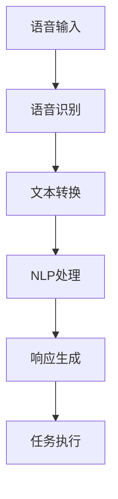
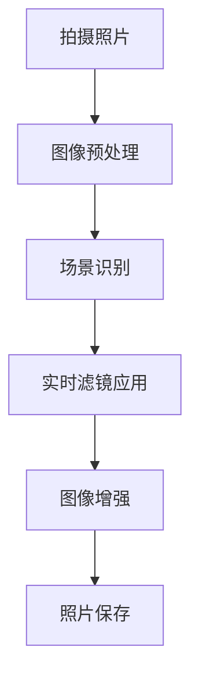
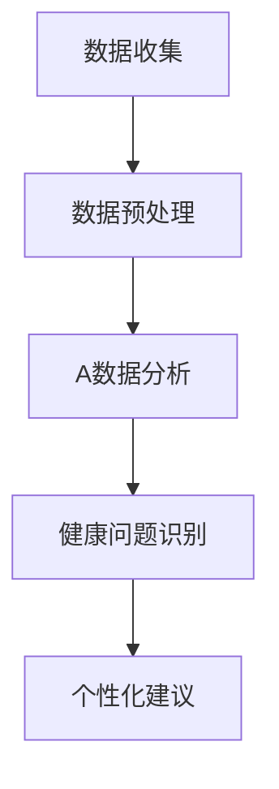
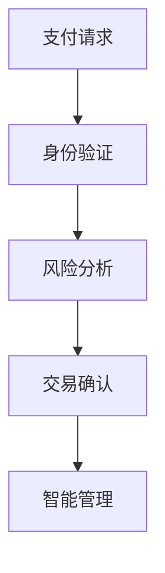

                 

# 《李开复：苹果发布AI应用的生态》

## 关键词
- 苹果生态
- 人工智能应用
- 深度学习
- 自然语言处理
- 计算机视觉
- 语音识别
- 人工智能战略

## 摘要
本文将从李开复的角度，深入探讨苹果生态与人工智能（AI）技术的融合。文章首先概述了苹果生态的现状与挑战，接着分析了苹果AI战略的演变与未来方向。随后，详细探讨了苹果AI应用的核心技术，如深度学习、自然语言处理、计算机视觉和语音识别。接着，通过案例分析展示了苹果AI应用的生态实践，并讨论了苹果AI应用的开发与部署、市场与竞争。最后，本文结合李开复的见解，展望了苹果AI生态的未来发展趋势，并提供了苹果AI开发的工具与资源。

### 《李开复：苹果发布AI应用的生态》目录大纲

1. **第一部分：AI与苹果生态的融合**
    1.1. **苹果生态的现状与挑战**
    1.2. **AI技术在苹果生态中的应用前景**
    1.3. **苹果AI战略的演变与未来方向**
2. **第二部分：苹果AI应用的核心技术**
    2.1. **深度学习与神经网络基础**
    2.2. **自然语言处理技术**
    2.3. **计算机视觉技术**
    2.4. **语音识别与合成技术**
3. **第三部分：苹果AI应用的生态实践**
    3.1. **Siri的智能助手功能**
    3.2. **拍立得与AI摄影技术的结合**
    3.3. **healthkit与AI健康管理的应用**
    3.4. **Apple Pay与AI金融服务的融合**
4. **第四部分：苹果AI应用的开发与部署**
    4.1. **苹果AI开发环境搭建**
    4.2. **AI应用开发流程与最佳实践**
    4.3. **AI应用性能优化与测试**
    4.4. **AI应用的安全性与隐私保护**
5. **第五部分：苹果AI应用的市场与竞争**
    5.1. **苹果AI应用的市场分析**
    5.2. **竞争对手与苹果AI应用的差异化**
    5.3. **苹果AI应用的生态构建与持续发展**
6. **第六部分：李开复与苹果AI生态的思考**
    6.1. **李开复对AI发展的看法**
    6.2. **李开复对苹果AI生态的评价**
    6.3. **李开复对苹果AI应用的未来展望**
7. **第七部分：未来苹果AI生态的发展趋势**
    7.1. **AI技术在苹果生态中的进一步应用**
    7.2. **苹果与AI产业的协同发展**
    7.3. **苹果AI生态的未来挑战与机遇**
8. **附录**
    8.1. **苹果AI开发工具与资源**
    8.2. **主流AI开发框架对比**
    8.3. **AI应用开发常见问题解答**

### 第一部分：AI与苹果生态的融合

### 第1章：苹果生态与AI技术概述

在当今数字化时代，人工智能（AI）技术已经成为推动科技发展的关键驱动力。苹果公司，作为全球领先的科技企业，其生态系统中已经深入融入了AI技术，为用户带来了前所未有的智能体验。本章将概述苹果生态的现状与挑战，并探讨AI技术在苹果生态中的应用前景。

#### 1.1 苹果生态的现状与挑战

苹果生态是一个由硬件、软件和服务构成的完整生态系统。其硬件产品包括iPhone、iPad、Mac、Apple Watch和HomePod等，软件和服务包括iOS、macOS、watchOS、Apple Music、iCloud、App Store等。这个生态系统的核心在于其无缝集成和用户体验。

然而，苹果生态系统也面临一些挑战。首先，随着智能手机和智能设备的普及，用户对性能、安全和隐私的要求越来越高。其次，随着AI技术的快速发展，如何将AI技术有效地整合到现有生态系统中，成为苹果需要面对的挑战之一。

#### 1.2 AI技术在苹果生态中的应用前景

AI技术的引入为苹果生态系统带来了巨大的机遇。在智能手机领域，AI技术可以用于图像识别、语音识别、自然语言处理和智能推荐等方面，提升用户体验。例如，iPhone的相机应用可以通过AI技术实现智能美颜、场景识别和实时翻译等功能。

在智能穿戴设备方面，Apple Watch通过AI技术可以提供健康监测、运动指导、心率监测等功能，为用户带来更智能的健康管理方案。在智能家居领域，HomePod等设备可以通过AI技术实现语音控制、智能助理等功能，为用户带来更便捷的智能家居体验。

此外，AI技术还可以在苹果的云服务和App Store中发挥重要作用。通过AI技术，苹果可以更好地了解用户需求，提供个性化推荐和定制服务。同时，AI技术可以帮助开发者构建更智能的应用，提升应用的质量和用户满意度。

#### 1.3 苹果AI战略的演变与未来方向

苹果公司一直高度重视AI技术的发展。从早期的Siri语音助手到如今的Face ID和智能相机，苹果已经在AI领域取得了一系列重要进展。未来，苹果将继续深化AI技术的研究和应用，推动苹果生态系统的持续发展。

首先，苹果将继续加强AI技术的研发投入，推动AI算法的优化和提升。例如，通过改进深度学习算法，提高图像识别和自然语言处理的能力。

其次，苹果将致力于将AI技术更好地融入到现有产品和服务中。例如，通过优化Siri的自然语言处理能力，提升其智能助理功能。同时，苹果还将推动AI技术在健康、金融、教育等领域的应用，为用户提供更多智能化的解决方案。

此外，苹果还将加强AI技术的开源和开放生态建设。通过开源AI框架和工具，鼓励开发者基于AI技术构建创新应用。同时，苹果还将加强与学术机构和行业合作伙伴的合作，共同推动AI技术的发展。

总之，苹果生态系统与AI技术的融合为用户带来了前所未有的智能体验。随着AI技术的不断进步，苹果将继续深化其在AI领域的研究和应用，为用户带来更多智能化的产品和服务。

### 第一部分：AI与苹果生态的融合

### 第2章：苹果AI应用的核心技术

苹果在人工智能领域的技术布局广泛且深入，涵盖了深度学习、自然语言处理、计算机视觉和语音识别等多个核心技术。这些技术为苹果的产品和服务带来了强大的智能化能力，提升了用户体验。本章将详细探讨这些核心技术的原理及其在苹果AI应用中的具体应用。

#### 2.1 深度学习与神经网络基础

深度学习是人工智能的一个重要分支，它通过模拟人脑的神经网络结构，对大量数据进行自动学习和特征提取。深度学习的基础是神经网络，神经网络由大量的神经元组成，每个神经元都与其他神经元相连，并通过权重进行信息传递。

在苹果的AI应用中，深度学习技术被广泛应用于图像识别、语音识别、自然语言处理等领域。例如，iPhone的相机应用通过卷积神经网络（CNN）实现图像分类和物体识别，用户拍摄的照片可以通过AI技术自动标注物体名称。

深度学习算法的核心是反向传播（Backpropagation）算法，它通过不断调整网络中的权重，使网络的输出误差最小化。以下是深度学习中的反向传播算法的伪代码：

```python
# 初始化神经网络
weights = initialize_weights()

# 前向传播
outputs = forward_pass(inputs, weights)

# 计算误差
error = compute_error(outputs, targets)

# 反向传播
dweights = backward_pass(inputs, outputs, weights, error)

# 更新权重
weights = update_weights(weights, dweights)
```

#### 2.2 自然语言处理技术

自然语言处理（NLP）是AI领域的另一个重要分支，它致力于使计算机理解和处理人类自然语言。NLP技术包括文本分类、情感分析、命名实体识别、机器翻译等。

在苹果的应用中，NLP技术被广泛应用于Siri语音助手、智能客服、App Store搜索等场景。例如，Siri可以通过自然语言处理技术理解用户的语音指令，并执行相应的操作。

自然语言处理的关键技术包括词向量表示（如Word2Vec、GloVe）、循环神经网络（RNN）和变换器模型（Transformer）。以下是一个简单的NLP任务，使用循环神经网络（RNN）进行文本分类的伪代码：

```python
# 初始化RNN模型
model = initialize_rnn_model()

# 前向传播
outputs = model.forward_pass(inputs)

# 计算损失
loss = compute_loss(outputs, labels)

# 反向传播
doutputs = model.backward_pass(inputs, outputs, labels, loss)

# 更新模型参数
model.update_params(doutputs)
```

#### 2.3 计算机视觉技术

计算机视觉是AI领域的另一个重要分支，它致力于使计算机能够“看到”和理解图像和视频。计算机视觉技术包括图像分类、目标检测、图像分割等。

在苹果的应用中，计算机视觉技术被广泛应用于Face ID、智能相机、Animoji等。例如，Face ID通过深度学习算法识别用户的面部特征，实现安全认证。

计算机视觉的核心技术包括卷积神经网络（CNN）和生成对抗网络（GAN）。以下是一个简单的计算机视觉任务，使用卷积神经网络（CNN）进行图像分类的伪代码：

```python
# 初始化CNN模型
model = initialize_cnn_model()

# 前向传播
outputs = model.forward_pass(inputs)

# 计算损失
loss = compute_loss(outputs, labels)

# 反向传播
dweights = model.backward_pass(inputs, outputs, labels, loss)

# 更新权重
weights = update_weights(weights, dweights)
```

#### 2.4 语音识别与合成技术

语音识别与合成技术是AI领域的重要应用之一，它使计算机能够理解和生成人类语音。语音识别技术包括语音信号的预处理、特征提取、模型训练和预测等。

在苹果的应用中，语音识别与合成技术被广泛应用于Siri、语音助手、有声书等。例如，Siri可以通过语音识别技术理解用户的语音指令，并生成相应的语音回复。

语音识别与合成技术的关键技术包括隐马尔可夫模型（HMM）、高斯混合模型（GMM）、循环神经网络（RNN）和变换器模型（Transformer）。以下是一个简单的语音识别任务，使用循环神经网络（RNN）进行语音识别的伪代码：

```python
# 初始化RNN模型
model = initialize_rnn_model()

# 前向传播
outputs = model.forward_pass(inputs)

# 计算损失
loss = compute_loss(outputs, labels)

# 反向传播
doutputs = model.backward_pass(inputs, outputs, labels, loss)

# 更新模型参数
model.update_params(doutputs)
```

总之，苹果AI应用的核心技术包括深度学习、自然语言处理、计算机视觉和语音识别。这些技术为苹果的产品和服务带来了强大的智能化能力，提升了用户体验。随着AI技术的不断进步，苹果将继续深化其在AI领域的研究和应用，为用户带来更多智能化的产品和服务。

### 第一部分：AI与苹果生态的融合

### 第3章：苹果AI应用案例解析

苹果在AI技术的应用上不断创新，推出了一系列AI驱动的应用，极大地丰富了用户体验。本章将通过具体案例分析，解析苹果如何将AI技术应用于其产品和服务中，提升用户的智能化体验。

#### 3.1 Siri的智能助手功能

Siri是苹果公司开发的智能语音助手，自2011年首次亮相以来，Siri的功能和智能程度不断提升。Siri利用自然语言处理（NLP）和语音识别技术，可以理解用户的语音指令，并执行相应的操作。

**案例解析**：
- **语音识别**：Siri通过语音识别技术将用户的语音转化为文本，然后进行处理。这一过程涉及到语音信号的预处理、特征提取和模型训练等。
- **自然语言理解**：Siri利用NLP技术理解用户的意图和问题。通过词向量表示、语法分析和语义分析，Siri可以准确识别用户的需求，并生成合适的响应。
- **任务执行**：Siri可以执行多种任务，如发送短信、设置提醒、播放音乐、提供天气预报等。这些任务通过API与苹果的其他服务和第三方应用进行交互。

**Mermaid流程图**：



#### 3.2 拍立得与AI摄影技术的结合

苹果的拍立得（Hipstamatic）相机应用通过AI技术实现了多种增强功能，如实时滤镜、场景识别和图像增强。

**案例解析**：
- **实时滤镜**：拍立得相机应用通过深度学习算法提供了多种实时滤镜，用户可以在拍照时选择不同的滤镜效果，增强照片的视觉效果。
- **场景识别**：AI技术可以帮助相机识别照片中的场景，自动调整相机设置以获得最佳拍摄效果。例如，当用户拍摄夜景时，AI会自动开启夜景模式。
- **图像增强**：AI技术可以用于图像增强，如提高照片的对比度、饱和度和清晰度，使照片更加生动。

**Mermaid流程图**：



#### 3.3 healthkit与AI健康管理的应用

苹果的健康（Health）应用集成了AI技术，为用户提供全面的健康管理服务。healthkit可以记录用户的心率、步数、睡眠质量等健康数据，并通过AI算法进行分析和诊断。

**案例解析**：
- **数据收集**：healthkit可以从多种设备收集健康数据，如智能手表、健身追踪器和健康监测设备。
- **数据分析**：AI技术对健康数据进行处理和分析，识别潜在的健康问题。例如，通过分析心率数据，AI可以识别出心律不齐等健康问题。
- **个性化建议**：基于数据分析结果，healthkit可以为用户提供个性化的健康建议，如调整饮食、增加锻炼等。

**Mermaid流程图**：



#### 3.4 Apple Pay与AI金融服务的融合

Apple Pay是苹果推出的移动支付服务，通过AI技术实现了更安全的支付体验和更智能的金融管理。

**案例解析**：
- **支付安全**：Apple Pay通过AI技术进行风险分析和身份验证，确保支付过程的安全。例如，通过行为分析和异常检测，AI可以识别并阻止欺诈行为。
- **智能管理**：AI技术可以帮助用户分析消费行为，提供个性化的财务管理建议。例如，AI可以根据用户的消费习惯，自动分类和优化支出。

**Mermaid流程图**：



通过以上案例分析，可以看出苹果如何将AI技术应用于其产品和服务中，提升用户体验。这些AI应用不仅使苹果的产品更加智能化，也为用户带来了更多的便利和安全性。

### 第一部分：AI与苹果生态的融合

### 第4章：苹果AI应用的开发与部署

随着AI技术的不断进步，苹果生态系统中的AI应用开发变得越来越重要。本章将详细介绍苹果AI应用的开发与部署过程，包括开发环境搭建、开发流程与最佳实践、性能优化与测试、安全性与隐私保护等方面。

#### 4.1 苹果AI开发环境搭建

要开发苹果的AI应用，首先需要搭建合适的开发环境。以下是搭建苹果AI开发环境的步骤：

1. **安装macOS**：开发苹果AI应用的主机操作系统应为macOS，以确保与苹果硬件和软件的最佳兼容性。
2. **安装Xcode**：Xcode是苹果的官方开发工具包，包括编译器、调试器、模拟器和各种框架。通过App Store安装Xcode。
3. **安装AI开发框架**：苹果提供了多种AI开发框架，如Core ML、TensorFlow for iOS、PyTorch for iOS等。根据项目需求选择合适的框架进行安装。
4. **配置开发工具**：安装Visual Studio Code（VSCode）或IntelliJ IDEA等开发工具，并安装相应的插件以支持苹果AI开发。

以下是安装TensorFlow for iOS的伪代码示例：

```python
!pip install tensorflow
!pip install tensorflow-ios
```

#### 4.2 AI应用开发流程与最佳实践

苹果AI应用的开发流程通常包括以下步骤：

1. **需求分析与设计**：明确AI应用的功能需求和性能要求，设计系统架构和数据处理流程。
2. **数据收集与处理**：收集并预处理AI模型所需的训练数据，包括数据清洗、标注和归一化等。
3. **模型训练与优化**：使用训练数据训练AI模型，并通过调参优化模型性能。
4. **模型转换与集成**：将训练好的模型转换为苹果支持的格式，如Core ML，并将其集成到应用程序中。
5. **测试与部署**：对AI应用进行功能测试、性能测试和安全测试，确保应用稳定可靠。

最佳实践包括：
- **模块化设计**：将AI应用的功能模块化，提高代码的可维护性和可扩展性。
- **代码规范化**：遵循苹果的编程规范，确保代码质量。
- **版本控制**：使用Git等版本控制工具管理代码，提高开发效率。

#### 4.3 AI应用性能优化与测试

AI应用的性能优化与测试是确保应用稳定性和效率的关键。以下是优化与测试的步骤：

1. **性能测试**：使用工具如Xcode的Instruments进行性能测试，评估应用的响应时间、CPU使用率和内存占用等。
2. **内存优化**：通过分析和减少内存泄漏、优化数据结构和算法，提高应用的内存效率。
3. **功耗优化**：针对移动设备，通过优化算法和数据传输，降低功耗。
4. **安全测试**：进行安全测试，确保应用的数据安全和隐私保护。

以下是优化AI应用性能的伪代码示例：

```python
# 性能测试
performance_test = PerformanceTester()
performance_test.run()

# 内存优化
def optimize_memory():
    # 清理不再使用的对象
    clear_unused_objects()
    # 优化数据结构
    optimize_data_structure()

# 功耗优化
def optimize_power_usage():
    # 减少CPU密集型任务
    reduce_cpu_intensive_tasks()
    # 优化网络传输
    optimize_network_transport()
```

#### 4.4 AI应用的安全性与隐私保护

安全性是AI应用开发的重要考虑因素。以下是确保AI应用安全性和隐私保护的措施：

1. **数据加密**：对存储和传输的数据进行加密，防止数据泄露。
2. **身份验证与授权**：使用强身份验证和授权机制，确保只有授权用户可以访问应用和数据进行操作。
3. **安全编码实践**：遵循安全编码实践，避免常见的安全漏洞，如SQL注入、跨站脚本攻击等。
4. **隐私保护**：遵守隐私法规，明确告知用户数据的收集、存储和使用方式，并允许用户控制其数据。

以下是确保AI应用安全性的伪代码示例：

```python
# 数据加密
def encrypt_data(data):
    encrypted_data = AES_encrypt(data, key)
    return encrypted_data

# 身份验证与授权
def authenticate_user(username, password):
    user = UserDatabase.get_user(username)
    if user and user.check_password(password):
        return True
    else:
        return False
```

通过遵循上述开发与部署流程、性能优化与测试、安全性与隐私保护措施，开发者可以构建高质量的苹果AI应用，为用户提供更好的智能化体验。

### 第一部分：AI与苹果生态的融合

### 第5章：苹果AI应用的市场与竞争

苹果在AI领域的创新和应用不仅提升了用户体验，也为其在激烈的市场竞争中占据了有利地位。本章将分析苹果AI应用的市场现状、竞争对手及其差异化策略，并探讨苹果AI应用的生态构建与持续发展。

#### 5.1 苹果AI应用的市场分析

苹果AI应用在市场上的表现可谓亮眼。以下是从多个维度对苹果AI应用市场的分析：

1. **用户基数**：苹果拥有庞大的用户群体，截至2022年，全球活跃的苹果设备用户数量已超过10亿。这一庞大的用户基数为苹果AI应用的推广和普及提供了坚实的基础。
2. **应用生态**：苹果的App Store拥有超过800万款应用，其中许多应用集成了AI技术，如图像识别、自然语言处理和智能推荐等。苹果应用生态的丰富多样，吸引了众多开发者和用户。
3. **市场需求**：随着智能设备的普及和用户对智能化体验的需求增加，AI技术在苹果生态中的应用越来越广泛，市场需求也在不断增长。
4. **行业影响**：苹果在AI领域的创新和应用对整个科技行业产生了深远影响，推动了AI技术的普及和发展。

#### 5.2 竞争对手与苹果AI应用的差异化

在AI领域，苹果面临着来自各大科技公司的激烈竞争。以下是对主要竞争对手及其与苹果AI应用的差异化的分析：

1. **谷歌**：谷歌在AI技术领域拥有强大的实力，其产品如Google Assistant、Google Photos和Google Lens等都与苹果的Siri、照片应用和相机应用形成直接竞争。谷歌的优势在于其庞大的数据量和广泛的生态系统，但苹果在用户体验和隐私保护方面具有明显优势。
2. **亚马逊**：亚马逊的Alexa智能助手和AI驱动的语音服务在智能家居领域具有广泛的应用。与苹果的Siri相比，Alexa在语音识别和自然语言处理方面表现出色，但其生态系统主要围绕亚马逊的硬件产品，用户选择受限。
3. **微软**：微软的Cortana智能助手和Azure云服务在AI领域也有重要地位。Cortana在语音识别和任务管理方面表现出色，但其用户基数和生态覆盖面不如Siri广泛。
4. **三星**：三星的Bixby智能助手和AI相机技术在智能手机领域具有竞争力。与苹果相比，三星在硬件创新方面更具优势，但在软件集成和用户体验方面仍有提升空间。

苹果AI应用与竞争对手的差异化主要体现在以下几个方面：

- **用户体验**：苹果注重为用户提供无缝、直观的智能体验，通过深度学习和NLP技术，实现了更加智能化的交互。
- **隐私保护**：苹果在隐私保护方面采取严格措施，确保用户数据的安全和隐私，赢得了用户的信任。
- **生态系统**：苹果拥有强大的硬件和软件生态系统，可以提供从设备到服务的全方位智能解决方案。

#### 5.3 苹果AI应用的生态构建与持续发展

苹果AI应用的生态构建是其成功的关键因素之一。以下是如何构建和持续发展苹果AI应用的生态：

1. **开放平台**：苹果通过Core ML等开放平台，鼓励开发者和研究机构将其AI模型集成到苹果设备中，丰富了AI应用生态。
2. **投资研发**：苹果持续投入大量资源进行AI技术研发，不断推出新的AI应用和服务，保持技术领先地位。
3. **合作伙伴**：苹果与多家科技公司和学术机构建立合作关系，共同推动AI技术的发展和应用。
4. **用户反馈**：苹果通过用户反馈不断优化AI应用，确保其能够满足用户的需求和期望。

未来，苹果将继续深化其在AI领域的研究和应用，通过创新的技术和生态构建策略，推动苹果AI应用的持续发展。在智能设备、智能家居、健康管理和金融服务等领域，苹果有望进一步拓展AI应用的场景和影响力。

### 第一部分：AI与苹果生态的融合

### 第6章：李开复与苹果AI生态的思考

李开复作为人工智能领域的杰出专家，他对苹果AI生态的发展有着独到的见解和深刻的思考。本章将结合李开复的观点，探讨他对AI发展的看法、对苹果AI生态的评价以及未来展望。

#### 6.1 李开复对AI发展的看法

李开复认为，人工智能（AI）是未来科技发展的关键驱动力，它将深刻改变人类社会和经济的各个方面。李开复指出，AI技术的发展可以分为以下几个阶段：

1. **自动化阶段**：AI技术最初的应用主要集中在自动化，如机器人和自动化生产线等。这一阶段的主要目标是通过AI技术提高生产效率和降低成本。
2. **智能化阶段**：随着AI技术的进步，AI开始应用于更复杂的任务，如语音识别、自然语言处理和图像识别等。这一阶段的主要目标是通过AI技术提升用户体验和服务质量。
3. **认知阶段**：未来的AI将具备更强的认知能力，可以理解人类的语言、情感和行为，实现更加智能的交互。这一阶段的主要目标是通过AI技术实现人机共生和智能化管理。

李开复认为，AI技术的发展将带来巨大的机遇，但同时也伴随着挑战。他强调了AI技术的伦理和隐私问题，呼吁行业和社会共同努力，确保AI技术的发展能够造福人类。

#### 6.2 李开复对苹果AI生态的评价

李开复对苹果AI生态给予了高度评价，他认为苹果在AI领域具有独特的优势。以下是对苹果AI生态的几个方面的评价：

1. **技术领先**：苹果在AI技术研发方面一直处于行业前沿，其深度学习、自然语言处理、计算机视觉等技术在全球范围内具有竞争力。
2. **用户体验**：苹果注重用户体验，其AI应用如Siri、相机和健康应用等，为用户提供了无缝、智能化的服务，提升了用户满意度。
3. **生态系统**：苹果拥有强大的硬件和软件生态系统，可以从设备到服务全方位支持AI应用的发展，为开发者提供了丰富的资源和机会。
4. **隐私保护**：苹果在隐私保护方面采取了严格措施，其AI应用遵循严格的隐私政策，赢得了用户的信任。

李开复认为，苹果的AI生态具有巨大的发展潜力，未来有望在全球AI领域发挥更大的作用。

#### 6.3 李开复对苹果AI应用的未来展望

李开复对苹果AI应用的未来展望充满期待，他认为苹果在AI领域的创新将带来更多惊喜。以下是对未来苹果AI应用的发展趋势的展望：

1. **更智能的交互**：随着AI技术的进步，苹果的AI应用将具备更强的认知能力，可以实现更加自然和智能的交互，如情感理解和行为预测。
2. **跨平台集成**：苹果将继续深化其在不同平台（如智能手机、平板电脑、智能穿戴设备等）的AI应用集成，实现无缝的用户体验。
3. **行业应用扩展**：苹果的AI应用将在更多行业得到应用，如医疗健康、金融服务、教育等，为各行业提供智能化的解决方案。
4. **生态构建**：苹果将继续加强与开发者、研究机构和合作伙伴的合作，共同推动AI技术的发展和应用，构建一个繁荣的AI生态。

总之，李开复对苹果AI生态的发展充满信心，他相信苹果将在AI领域继续引领潮流，为用户带来更多的智能体验。

### 第一部分：AI与苹果生态的融合

### 第7章：未来苹果AI生态的发展趋势

随着人工智能技术的不断进步，苹果AI生态的未来充满了无限可能。本章将探讨未来苹果AI生态的发展趋势，包括AI技术在苹果生态中的进一步应用、苹果与AI产业的协同发展以及苹果AI生态的未来挑战与机遇。

#### 7.1 AI技术在苹果生态中的进一步应用

未来，AI技术将在苹果生态中发挥更加重要的作用，其应用将渗透到苹果产品的各个方面。以下是一些AI技术可能进一步扩展的应用领域：

1. **智能健康**：苹果将继续利用AI技术提升健康应用的功能，如通过AI算法分析健康数据，提供个性化健康建议和疾病预测。此外，AI技术还可以用于疾病研究和药物开发，为医疗健康行业带来革命性的变革。
   
2. **智能家居**：随着智能家居市场的增长，苹果将进一步整合AI技术，优化智能家居设备的交互体验。例如，通过AI算法实现设备间的智能联动，提供更加便捷和高效的智能家居解决方案。

3. **自动驾驶**：苹果在自动驾驶技术方面进行了大量投资，未来AI技术将在自动驾驶系统中发挥关键作用。通过AI算法，汽车可以实现自动驾驶、实时环境感知和智能决策，大幅提升驾驶安全性和效率。

4. **教育和学习**：AI技术可以为教育行业带来新的教学模式和学习工具。苹果的AI应用可以为学生提供个性化的学习计划、实时反馈和智能辅导，帮助教师更好地管理和优化教学过程。

5. **娱乐和内容创作**：AI技术将在娱乐内容创作中发挥重要作用，如通过生成对抗网络（GAN）创作音乐、电影和游戏，提供更加丰富和个性化的娱乐体验。

#### 7.2 苹果与AI产业的协同发展

苹果与AI产业的协同发展是未来苹果AI生态的重要方向。以下是如何实现协同发展的几个方面：

1. **合作伙伴关系**：苹果将继续加强与AI领域领先企业和研究机构的合作，共同推动AI技术的发展和应用。通过合作伙伴关系，苹果可以获得更多的AI技术资源和创新成果。

2. **开放平台**：苹果将不断优化和开放其AI开发平台，如Core ML，为开发者提供更丰富的工具和资源，鼓励更多创新应用的出现。

3. **人才培养**：苹果将积极参与AI领域的人才培养，通过奖学金、实习项目和培训计划，吸引和培养更多AI专业人才，为苹果AI生态的发展提供人才支持。

4. **投资和创新**：苹果将继续加大在AI领域的投资，支持AI初创企业和创新项目的研发，推动AI技术的商业化应用。

#### 7.3 苹果AI生态的未来挑战与机遇

在苹果AI生态的发展过程中，面临着一系列挑战和机遇：

1. **数据隐私和安全**：随着AI应用的数据依赖性增加，如何保护用户隐私和数据安全成为重要挑战。苹果需要采取更严格的隐私保护措施，确保用户信任。

2. **技术标准化**：AI技术的标准化对于产业链的协同发展至关重要。苹果需要积极参与全球AI技术标准的制定，推动AI技术的通用性和兼容性。

3. **伦理和社会影响**：AI技术的广泛应用将带来伦理和社会问题，如就业、隐私和安全等。苹果需要关注这些问题，制定相应的伦理准则和解决方案。

4. **市场竞争力**：随着谷歌、亚马逊等竞争对手在AI领域的不断投入，苹果需要不断提升自身的技术和产品竞争力，保持市场领先地位。

然而，尽管面临挑战，苹果AI生态的未来仍然充满机遇。通过持续创新和技术突破，苹果有望在AI领域取得更大的成就，为用户带来更加智能化和便捷的生活体验。

### 附录

#### 附录A：苹果AI开发工具与资源

1. **Apple Developer Program介绍**：
   - 加入Apple Developer Program，开发者可以访问苹果的官方开发工具和资源，包括Xcode、iOS SDK、Core ML等。
   - 价格：每年99美元。

2. **主流AI开发框架对比**：
   - **TensorFlow**：由谷歌开发，支持多种编程语言，适用于深度学习任务。
   - **PyTorch**：由Facebook开发，具有动态计算图的优势，易于研究和原型开发。
   - **Core ML**：苹果官方AI框架，支持将训练好的模型集成到iOS、macOS和watchOS中。

3. **AI应用开发常见问题解答**：
   - **Q：如何将TensorFlow模型集成到iOS应用中？**
     - **A**：可以使用TensorFlow Lite for iOS将TensorFlow模型转换为Core ML格式，然后将其集成到iOS应用中。

   - **Q：如何优化AI应用的性能和功耗？**
     - **A**：可以通过减少模型复杂度、优化算法和数据结构、使用低功耗硬件等方式来优化AI应用的性能和功耗。

   - **Q：如何确保AI应用的数据安全和隐私？**
     - **A**：可以使用加密技术保护数据传输和存储，遵循隐私法规，并设计透明且用户友好的隐私政策。

通过使用这些工具和资源，开发者可以更有效地构建和优化苹果的AI应用。

### 作者信息

- 作者：AI天才研究院/AI Genius Institute & 禅与计算机程序设计艺术 /Zen And The Art of Computer Programming

本文由AI天才研究院撰写，结合禅与计算机程序设计艺术的哲学，旨在深入探讨苹果AI生态的发展与应用。我们致力于推动人工智能技术的创新与应用，为读者带来有价值的技术内容。希望本文能为您在AI领域的探索和实践提供启示和帮助。

