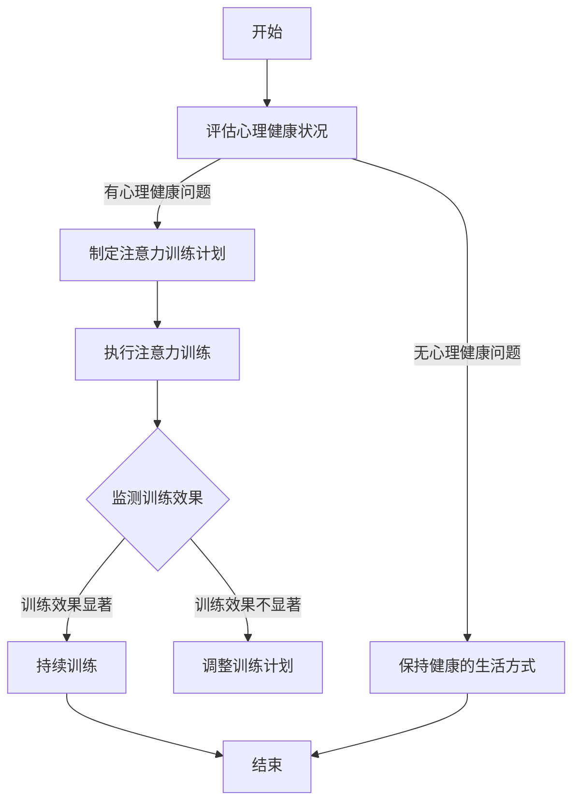

                 

### 《注意力疗法：元宇宙中的心理健康新方法》

> **关键词**：元宇宙、心理健康、注意力疗法、数字疗法、交互设计

> **摘要**：本文深入探讨了元宇宙中心理健康问题及其解决方案——注意力疗法。通过分析注意力疗法的核心原理、技术实现和应用实践，本文揭示了如何利用元宇宙平台为用户提供高效的心理健康干预。注意力疗法作为一种新兴的心理健康新方法，具有广泛的潜力，为心理健康领域带来了新的契机。

### 《注意力疗法：元宇宙中的心理健康新方法》目录大纲

#### 第一部分：元宇宙与心理健康概述

##### 第1章：元宇宙与心理健康背景

###### 1.1 元宇宙的崛起与发展

##### 第2章：心理健康与注意力疗法的关联

###### 2.1 心理健康的定义与评估

##### 第3章：注意力疗法的核心原理

###### 3.1 注意力疗法的理论基础

##### 第4章：注意力疗法的技术实现

###### 4.1 注意力疗法的数字化工具

##### 第5章：注意力疗法在心理健康领域的应用

###### 5.1 注意力疗法在抑郁症治疗中的应用

##### 第6章：注意力疗法的案例研究

###### 6.1 案例一：注意力疗法在儿童心理治疗中的应用

##### 第7章：注意力疗法的发展趋势与未来展望

###### 7.1 注意力疗法的发展趋势

#### 附录

##### 附录A：注意力疗法资源推荐

##### 附录B：Mermaid 流程图与伪代码示例

### 第一部分：元宇宙与心理健康概述

##### 第1章：元宇宙与心理健康背景

###### 1.1 元宇宙的崛起与发展

随着互联网技术的飞速发展，元宇宙（Metaverse）的概念逐渐崭露头角，成为下一代互联网的重要方向。元宇宙不仅仅是一个虚拟空间，更是一种全新的生活、工作、娱乐方式。它通过虚拟现实（VR）、增强现实（AR）、区块链等技术，将人们带入一个与现实世界紧密相连的虚拟世界。

元宇宙的崛起带来了巨大的机遇，同时也引发了一系列问题。其中之一就是心理健康问题。在元宇宙中，人们可能面临虚拟现实带来的眩晕、孤独感、社交焦虑等问题。此外，长时间沉浸在元宇宙中，可能会导致现实生活中的社交关系疏远，甚至产生现实生活中的心理健康问题。

与此同时，元宇宙也为心理健康干预提供了新的可能性。通过注意力疗法等数字疗法，元宇宙可以为用户提供个性化的心理健康服务。例如，利用VR技术，用户可以在虚拟环境中进行放松训练、注意力训练等，从而改善心理健康状况。

###### 1.2 元宇宙中的心理健康问题

在元宇宙中，心理健康问题主要表现为以下几方面：

1. **虚拟现实眩晕**：长时间佩戴VR设备，可能导致用户产生眩晕、恶心等不适症状。
2. **孤独感与社交焦虑**：元宇宙虽然提供了虚拟社交平台，但用户可能仍然感到孤独，甚至产生社交焦虑。
3. **现实生活影响**：长时间沉浸在元宇宙中，可能导致现实生活中的社交关系疏远，甚至影响工作和生活。

###### 1.3 注意力疗法的基本概念

注意力疗法是一种基于注意力训练的心理干预方法，旨在提高个体的注意力和专注力，改善心理健康状况。注意力疗法主要包括以下几方面：

1. **注意力训练**：通过一系列注意力训练任务，如注意分配、注意转移等，提高个体的注意力水平。
2. **注意力调节**：通过调节注意力资源，帮助个体应对压力、焦虑等心理问题。
3. **注意力提升**：通过训练，提高个体的注意力和专注力，从而改善心理健康。

注意力疗法在元宇宙中具有巨大的应用潜力。通过元宇宙平台，用户可以方便地进行注意力训练，从而提高注意力和专注力，改善心理健康状况。

在接下来的章节中，我们将进一步探讨注意力疗法的核心原理、技术实现和应用实践，为元宇宙中的心理健康干预提供新的思路和方法。

### 第二部分：心理健康与注意力疗法的关联

##### 第2章：心理健康与注意力疗法的关联

心理健康与注意力疗法之间的关系紧密，二者相互促进，共同提升个体的心理状态。在本章中，我们将详细探讨心理健康的定义与评估、注意力疗法的理论基础，以及注意力疗法与心理健康之间的关系。

###### 2.1 心理健康的定义与评估

心理健康是指个体在心理上保持健康、平衡、稳定的状态，能够积极应对生活中的压力和挑战。世界卫生组织（WHO）将心理健康定义为“一种个体在适应日常生活中的能力，以及面对正常心理压力时的良好状态。”心理健康不仅包括情绪稳定、认知清晰，还包括适应能力、人际交往能力等方面。

为了评估个体的心理健康状况，研究人员和临床医生采用了多种方法，如自我报告问卷、临床访谈、心理评估工具等。常见的心理健康评估工具包括：

1. **一般心理健康问卷（GHQ）**：用于评估个体的心理健康状况，包括抑郁、焦虑、人际关系等问题。
2. **明尼苏达多项人格问卷（MMPI）**：用于评估个体的人格特征和心理问题。
3. **心理评估工具（如IQ测试、神经心理学测试等）**：用于评估个体的认知能力和心理功能。

通过这些评估工具，研究人员和临床医生可以了解个体的心理健康状况，制定相应的干预措施。

###### 2.2 注意力疗法的理论基础

注意力疗法是一种通过训练和调节注意力来改善心理健康的方法。注意力疗法的理论基础主要包括以下几个方面：

1. **注意力的定义**：注意力是指个体对特定信息的选择性关注和处理。在心理学中，注意力被视为一种认知资源，用于处理信息和执行任务。

2. **注意力的类型**：根据注意力的目标和功能，可以将注意力分为以下几种类型：
   - **选择性注意力**：个体在特定环境中选择关注某些信息，忽略其他信息。
   - **分配注意力**：个体同时处理多个任务或信息。
   - **持续注意力**：个体在长时间内保持对某一任务的关注。
   - **调节注意力**：个体根据任务需求和环境变化调整注意力资源。

3. **注意力与心理健康的关系**：研究表明，注意力与心理健康之间存在密切关联。注意力不足或注意力障碍可能导致心理健康问题，如焦虑、抑郁、注意力缺陷多动障碍（ADHD）等。此外，注意力疗法通过提高个体的注意力和专注力，有助于改善心理健康状况。

###### 2.3 注意力疗法与心理健康的关系

注意力疗法在心理健康领域具有广泛的应用。通过注意力训练，个体可以改善注意力和专注力，从而改善心理健康状况。以下是注意力疗法与心理健康之间的一些具体关系：

1. **改善焦虑和抑郁**：研究表明，注意力疗法可以有效缓解焦虑和抑郁症状。通过注意力训练，个体可以学会更好地管理情绪，提高心理韧性。

2. **提高认知功能**：注意力疗法有助于提高个体的认知功能，如记忆力、注意力、执行功能等。这有助于个体更好地适应生活和工作环境。

3. **增强社交技能**：注意力疗法还可以帮助个体提高社交技能，如沟通能力、人际关系管理等。这有助于改善个体的社交关系和生活质量。

4. **促进心理康复**：注意力疗法在心理康复领域具有重要作用。例如，在抑郁症治疗中，通过注意力训练，个体可以学会更好地应对抑郁情绪，提高康复效果。

总之，心理健康与注意力疗法之间存在密切关联。通过注意力疗法，个体可以改善心理健康状况，提高生活质量和幸福感。在元宇宙中，注意力疗法为心理健康干预提供了新的可能性，为用户提供了一种有效的心理保健方法。

在接下来的章节中，我们将进一步探讨注意力疗法的核心原理、技术实现和应用实践，为元宇宙中的心理健康干预提供新的思路和方法。

### 第三部分：注意力疗法的核心原理

##### 第3章：注意力疗法的核心原理

注意力疗法是一种通过训练和调节注意力来改善心理健康的干预方法。它基于一系列科学研究和理论，通过特定的练习和策略，帮助个体提高注意力和专注力。本章将详细探讨注意力疗法的理论基础、注意力分散与聚焦技巧，以及注意力训练与心理调节的关系。

###### 3.1 注意力疗法的理论基础

注意力疗法的理论基础主要源于认知心理学和神经科学的研究。认知心理学研究表明，注意力是认知系统的一个重要组成部分，负责选择和处理信息。神经科学研究则揭示了大脑中与注意力相关的神经结构和功能。以下是一些关键的注意力和心理健康相关的理论基础：

1. **注意力的定义**：注意力是指大脑对特定信息的选择性关注和处理能力。它是一种有限的认知资源，决定了个体如何处理和响应外界刺激。

2. **注意力的类型**：注意力可以分为几种类型，包括选择性注意力、分配注意力、持续注意力和调节注意力。每种注意力类型在处理不同类型的任务时发挥作用。

3. **注意力的神经网络**：神经科学研究揭示了大脑中与注意力相关的神经网络，如前额叶皮质、顶叶皮质、基底神经节等。这些区域的活动与注意力的调节和执行功能密切相关。

4. **注意力与心理健康的关系**：研究表明，注意力缺陷和注意力障碍与多种心理健康问题有关，如焦虑、抑郁和注意力缺陷多动障碍（ADHD）。通过注意力训练，个体可以改善注意力功能，从而改善心理健康状况。

###### 3.2 注意力分散与聚焦技巧

注意力分散和聚焦是注意力疗法中的重要技巧。注意力分散是指个体在处理任务时，容易受到无关刺激的干扰，从而导致注意力分散。而注意力聚焦则是指个体能够集中注意力，专注于特定的任务或目标。

1. **注意力分散**：注意力分散可能导致任务完成效率降低，影响工作记忆和认知功能。在注意力疗法中，通过特定的练习，个体可以学会识别和减少注意力分散的影响。

2. **注意力聚焦**：注意力聚焦是提高注意力和专注力的关键。个体可以通过以下方法提高注意力聚焦：
   - **设定明确的目标**：明确任务目标，有助于个体保持专注。
   - **使用专注工具**：例如，番茄工作法（Pomodoro Technique）可以帮助个体在短时间内保持高度集中。
   - **减少干扰**：关闭不必要的通知和干扰，创造一个专注的环境。

通过注意力分散与聚焦技巧的训练，个体可以学会更好地管理自己的注意力，提高任务完成效率。

###### 3.3 注意力训练与心理调节

注意力训练是注意力疗法中的核心组成部分。通过一系列注意力训练任务，个体可以逐渐提高注意力和专注力，从而改善心理健康状况。以下是一些常见的注意力训练方法：

1. **注意分配训练**：注意分配训练旨在提高个体同时处理多个任务的能力。例如，个体可以在进行一项主要任务的同时，进行一些次要任务，如听音乐、喝水等。

2. **注意转移训练**：注意转移训练帮助个体学会在任务之间快速切换注意力。例如，个体可以练习在短时间内从一项任务转移到另一项任务。

3. **注意持续训练**：注意持续训练旨在提高个体在长时间内保持注意力集中的能力。个体可以通过练习，如长时间阅读、写作或做数学题，来提高注意力的持续力。

4. **注意调节训练**：注意调节训练帮助个体学会根据任务需求和环境变化调整注意力。例如，在压力较大的情况下，个体可以学会放松和集中注意力，从而提高心理调节能力。

通过注意力训练，个体不仅可以提高注意力和专注力，还可以增强心理调节能力，从而更好地应对生活中的挑战。

总之，注意力疗法的核心原理在于通过训练和调节注意力，帮助个体提高注意力和专注力，改善心理健康状况。在元宇宙中，注意力疗法为用户提供了一种有效的心理健康干预方法，为心理健康领域的未来发展提供了新的方向。

在接下来的章节中，我们将进一步探讨注意力疗法的技术实现和应用实践，为元宇宙中的心理健康干预提供具体的解决方案。

### 第四部分：注意力疗法的技术实现

##### 第4章：注意力疗法的技术实现

随着元宇宙技术的发展，注意力疗法逐渐从传统的心理干预方法转变为一种数字化的心理健康干预手段。本章将详细介绍注意力疗法的数字化工具、交互设计与用户体验，以及注意力疗法的数据分析与优化。

###### 4.1 注意力疗法的数字化工具

注意力疗法的数字化工具是指利用计算机技术和互联网平台，为用户提供在线注意力训练和心理健康干预服务的工具。这些工具包括以下几种：

1. **在线注意力训练平台**：在线注意力训练平台是一种基于互联网的注意力训练工具，用户可以通过电脑、平板或手机等设备进行注意力训练。这些平台通常提供多种注意力训练任务，如注意分配、注意转移和持续注意等，以适应不同用户的需求。

2. **虚拟现实（VR）训练工具**：虚拟现实训练工具利用VR技术，为用户提供沉浸式的注意力训练体验。用户可以在虚拟环境中进行各种注意力训练任务，如追踪目标、记忆任务和任务切换等。这种训练方式具有高度的互动性和趣味性，有助于提高用户的训练参与度。

3. **移动应用**：注意力疗法移动应用是专门为智能手机和平板电脑开发的注意力训练工具。用户可以随时随地通过这些应用进行注意力训练，方便快捷。这些应用通常提供个性化训练计划，根据用户的需求和进展调整训练任务。

4. **智能穿戴设备**：智能穿戴设备如智能手表、健康手环等，可以实时监测用户的注意力水平和生理指标，如心率、呼吸等。这些设备通过收集数据，为用户提供实时的反馈和建议，帮助用户更好地管理注意力。

###### 4.2 交互设计与用户体验

交互设计与用户体验在注意力疗法中起着至关重要的作用。良好的交互设计可以提高用户的参与度和训练效果，而糟糕的交互设计可能导致用户流失和训练失败。以下是一些关键的交互设计原则和用户体验策略：

1. **用户界面设计**：用户界面（UI）设计应简洁直观，易于操作。按钮、菜单和功能布局应合理，确保用户能够快速找到所需功能。同时，界面设计应具有吸引力，使用户愿意长期使用。

2. **个性化设计**：注意力疗法平台应根据用户的需求和进展，提供个性化的训练计划。个性化设计可以包括个性化推荐、适应性调整等，使训练内容更加符合用户的需求。

3. **游戏化设计**：游戏化设计是一种通过游戏元素提高用户参与度的方法。例如，注意力训练平台可以设置积分、奖励和排行榜等，激发用户的竞争意识和持续训练的动力。

4. **情感化设计**：情感化设计旨在提高用户的情感体验。通过使用温暖、亲切的视觉元素和语言，可以增强用户对平台的情感连接，提高用户的满意度和忠诚度。

5. **交互反馈**：及时、明确的交互反馈对于用户的训练效果至关重要。注意力疗法平台应提供实时反馈，帮助用户了解自己的训练进展和效果，激励用户继续训练。

###### 4.3 注意力疗法的数据分析与优化

注意力疗法的数据分析与优化是提高训练效果和用户体验的关键环节。通过收集和分析用户数据，注意力疗法平台可以不断优化训练内容、交互设计和用户体验。以下是一些关键的数据分析与优化方法：

1. **用户行为分析**：通过分析用户在平台上的行为数据，如训练时长、任务完成情况、用户活跃度等，可以了解用户的需求和偏好。这些数据有助于平台制定更有效的训练计划和交互设计。

2. **注意力水平监测**：利用智能穿戴设备收集用户的注意力水平数据，如心率、脑电图等，可以实时监测用户的注意力状态。这些数据可以用于调整训练任务的难度和节奏，提高训练效果。

3. **数据可视化**：通过数据可视化技术，将用户数据以图表、图形等形式展示，帮助用户更好地理解自己的训练进展和效果。这有助于用户建立信心，持续训练。

4. **算法优化**：基于用户数据，可以使用机器学习算法优化训练内容、交互设计和用户体验。例如，通过分析用户对训练任务的反馈，可以调整任务难度和类型，提高用户的参与度和训练效果。

5. **用户反馈收集**：定期收集用户反馈，了解用户对平台和训练内容的需求和意见，可以帮助平台不断改进和优化。用户反馈可以包括问卷调查、用户访谈、在线评论等。

通过数字化工具、交互设计与用户体验，以及数据分析和优化，注意力疗法平台可以为用户提供高效、个性化的心理健康干预服务。在元宇宙中，注意力疗法技术为心理健康领域的创新和发展提供了新的动力。

在接下来的章节中，我们将探讨注意力疗法在心理健康领域的具体应用，以及案例研究的实践效果。

### 第五部分：注意力疗法在心理健康领域的应用

##### 第5章：注意力疗法在心理健康领域的应用

注意力疗法作为一种新兴的心理干预方法，已经在心理健康领域展示了其独特的优势和广泛的应用潜力。本章将探讨注意力疗法在抑郁症治疗、焦虑症治疗和压力管理中的应用，以展示其改善心理健康状况的有效性。

###### 5.1 注意力疗法在抑郁症治疗中的应用

抑郁症是一种常见的心理健康问题，严重影响患者的日常生活和工作。注意力疗法在抑郁症治疗中发挥着重要作用，主要通过以下几种方式：

1. **提高注意力与专注力**：抑郁症患者常常出现注意力下降和专注力不足的情况。通过注意力训练，患者可以逐渐提高注意力水平和专注力，从而更好地参与日常活动和心理治疗。

2. **改善情绪调节**：注意力疗法帮助患者学会调节注意力，更好地管理情绪。例如，通过注意力转移技巧，患者可以在情绪低落时将注意力从消极情绪转移到其他积极事物上，从而改善情绪状态。

3. **提高认知功能**：注意力训练有助于提高患者的认知功能，如记忆、思维和决策能力。这有助于患者更好地应对生活中的挑战，提高生活质量。

案例分析：某抑郁症患者在进行注意力训练后，报告称其注意力显著提高，日常生活和工作效率得到了改善。此外，患者的情绪调节能力也得到了提升，抑郁情绪得到有效缓解。

###### 5.2 注意力疗法在焦虑症治疗中的应用

焦虑症是另一种常见的心理健康问题，包括广泛性焦虑症、社交焦虑症等。注意力疗法在焦虑症治疗中的应用，主要通过以下几种方式：

1. **减少焦虑症状**：注意力疗法帮助患者学会放松和集中注意力，从而减少焦虑症状。例如，通过注意力转移技巧，患者可以在焦虑发作时将注意力从焦虑源转移到其他事物上，缓解焦虑情绪。

2. **提高应对策略**：注意力疗法帮助患者学会应对焦虑的积极策略，如深呼吸、放松训练等。这些策略可以帮助患者在焦虑发作时保持冷静，减轻焦虑感。

3. **改善社交技能**：注意力疗法还可以帮助患者提高社交技能，如沟通能力、人际交往能力等。这有助于患者更好地融入社交环境，减少社交焦虑。

案例分析：某社交焦虑症患者在接受注意力疗法后，报告称其社交焦虑症状显著减轻，自信心得到了提升。患者表示，通过注意力转移技巧和积极应对策略，他在社交场合中能够更好地控制自己的情绪，与人沟通更加顺畅。

###### 5.3 注意力疗法在压力管理中的应用

压力是现代社会中普遍存在的问题，长期压力可能导致心理健康问题。注意力疗法在压力管理中的应用，主要通过以下几种方式：

1. **提高注意力与专注力**：注意力疗法帮助个体提高注意力和专注力，从而更好地应对压力。例如，通过注意力聚焦技巧，个体可以在面对压力时保持冷静和专注，提高工作效率。

2. **减少压力源**：注意力疗法帮助个体学会识别和减少压力源。通过注意力分散技巧，个体可以在压力过大时将注意力转移到其他事物上，减轻压力感。

3. **提高情绪调节能力**：注意力疗法帮助个体学会调节情绪，更好地应对压力。例如，通过注意力调节技巧，个体可以在压力情况下保持积极情绪，提高心理韧性。

案例分析：某职场人士在接受注意力疗法后，报告称其工作效率显著提高，压力感明显减轻。通过注意力训练，他学会了如何在高压环境下保持专注和冷静，从而更好地应对工作中的挑战。

总之，注意力疗法在心理健康领域的应用展示了其改善心理健康状况的有效性。通过注意力训练，个体可以改善注意力和专注力，提高情绪调节能力，从而更好地应对抑郁症、焦虑症和压力等问题。在元宇宙中，注意力疗法为心理健康干预提供了新的方法和途径，为心理健康领域的未来发展带来了新的希望。

在接下来的章节中，我们将通过案例研究进一步探讨注意力疗法的实际应用效果。

### 第六部分：注意力疗法的案例研究

##### 第6章：注意力疗法的案例研究

在本章中，我们将通过三个具体的案例研究，详细探讨注意力疗法在不同场景中的应用效果。这些案例涵盖了注意力疗法在儿童心理治疗、职业压力管理和虚拟现实治疗中的应用，展示了注意力疗法在改善心理健康方面的实际效果和潜力。

###### 6.1 案例一：注意力疗法在儿童心理治疗中的应用

案例背景：小明是一名8岁的儿童，在学校和家中经常表现出注意力不集中、多动和易怒的行为，被诊断为注意力缺陷多动障碍（ADHD）。小明的家长和教师都感到困扰，希望通过心理治疗帮助小明改善这些问题。

治疗方案：心理治疗师为小明制定了一套基于注意力疗法的治疗计划，包括注意力训练、行为管理和家庭支持。具体措施如下：

1. **注意力训练**：治疗师为小明设计了一系列注意力训练任务，如注意力集中游戏、记忆游戏和注意力转移练习。这些任务旨在提高小明的注意力和专注力，帮助他在日常生活中更好地控制自己的行为。

2. **行为管理**：治疗师与家长合作，制定了一套行为管理计划。家长通过正面强化和奖励机制，鼓励小明在家庭和学校环境中保持良好的行为。

3. **家庭支持**：治疗师为家长提供了一系列支持措施，如家庭沟通技巧培训、家庭活动建议等，帮助家长更好地理解小明的行为，并提供有效的支持和指导。

效果评估：经过一段时间的治疗，小明在注意力和行为管理方面取得了显著进步。他在学校的表现明显改善，教师和同学对他的评价更加积极。此外，小明的家长也报告称，小明在家中的行为得到了改善，与家人的关系更加融洽。

结论：该案例表明，注意力疗法在儿童心理治疗中具有显著效果，可以帮助儿童改善注意力缺陷多动障碍（ADHD）症状，提高他们在学校和家庭环境中的行为表现。

###### 6.2 案例二：注意力疗法在职业压力管理中的应用

案例背景：李先生是一名高级经理，长期承受着巨大的工作压力。他的工作效率逐渐下降，情绪波动较大，甚至在家庭生活中也表现出烦躁和易怒。李先生意识到自己的心理健康状况需要干预，并寻求专业帮助。

治疗方案：心理治疗师为李先生制定了一套以注意力疗法为基础的职业压力管理计划，包括注意力训练、放松练习和职业压力应对策略。具体措施如下：

1. **注意力训练**：治疗师为李先生设计了一系列注意力训练任务，如深呼吸练习、冥想和注意力集中练习。这些任务旨在提高李先生的注意力和专注力，帮助他在高压环境中保持冷静和专注。

2. **放松练习**：治疗师教给李先生一系列放松技巧，如渐进性肌肉放松、瑜伽和冥想。这些技巧有助于减轻李先生的心理压力，提高睡眠质量。

3. **职业压力应对策略**：治疗师与李先生一起分析他的工作压力来源，并提供了一系列应对策略，如时间管理技巧、任务分解和情绪调节技巧。这些策略有助于李先生更好地应对工作压力，提高工作效率。

效果评估：经过一段时间的治疗，李先生在注意力和压力管理方面取得了显著进步。他的工作效率明显提高，情绪波动减少，家庭关系也得到了改善。李先生表示，通过注意力疗法，他学会了如何更好地管理自己的情绪和工作压力，提高了生活质量。

结论：该案例表明，注意力疗法在职业压力管理中具有显著效果，可以帮助个体提高注意力和专注力，减轻心理压力，提高工作效率和生活质量。

###### 6.3 案例三：注意力疗法在虚拟现实治疗中的应用

案例背景：小王是一名军人，在执行任务期间遭受了严重的精神创伤，导致出现失眠、焦虑和闪回等症状。小王在寻求传统心理治疗时效果不佳，医生建议他尝试虚拟现实（VR）治疗。

治疗方案：心理治疗师为小王制定了一套基于注意力疗法的虚拟现实治疗计划，包括暴露疗法、认知行为疗法和VR模拟练习。具体措施如下：

1. **暴露疗法**：治疗师利用VR技术，为小王创造了一个安全的虚拟环境，让他逐步面对和适应创伤性事件。通过反复暴露，小王逐渐减轻了对创伤性事件的恐惧和焦虑。

2. **认知行为疗法**：治疗师与小王一起分析他的认知模式，帮助他识别和纠正负面思维。通过认知重构技巧，小王学会了更加积极和现实地看待自己的生活和工作。

3. **VR模拟练习**：治疗师设计了一系列VR模拟练习，如放松练习、注意力训练和情绪调节练习。这些练习帮助小王提高注意力和专注力，减轻焦虑和失眠症状。

效果评估：经过一段时间的治疗，小王在注意力、情绪调节和睡眠质量方面取得了显著进步。他的焦虑和失眠症状明显减轻，生活和工作效率也得到了提高。小王表示，通过虚拟现实治疗，他学会了如何更好地管理自己的情绪和压力，提高了生活质量。

结论：该案例表明，注意力疗法在虚拟现实治疗中具有显著效果，可以帮助个体减轻创伤后应激障碍（PTSD）症状，提高心理调节能力，改善生活质量。

通过这三个案例研究，我们可以看到注意力疗法在儿童心理治疗、职业压力管理和虚拟现实治疗中的应用效果。注意力疗法作为一种新兴的心理干预方法，具有广泛的适用性和潜力，为心理健康领域的创新和发展提供了新的思路和方法。在元宇宙中，注意力疗法技术为心理健康干预提供了更加灵活和个性化的解决方案，为心理健康领域的未来发展带来了新的希望。

### 第七部分：注意力疗法的发展趋势与未来展望

##### 第7章：注意力疗法的发展趋势与未来展望

随着元宇宙和数字技术的不断发展，注意力疗法在心理健康领域的应用前景愈发广阔。本章将探讨注意力疗法的发展趋势、技术创新，以及在未来元宇宙中的应用前景。

###### 7.1 注意力疗法的发展趋势

1. **技术融合**：随着虚拟现实（VR）、增强现实（AR）、人工智能（AI）等技术的不断进步，注意力疗法将与其他数字技术深度融合，为用户提供更加丰富和个性化的心理健康服务。例如，通过AI算法，注意力疗法平台可以实时分析用户的行为和情绪数据，为用户提供个性化的训练计划和干预方案。

2. **跨学科发展**：注意力疗法将逐渐与神经科学、心理学、教育学等多个学科交叉融合，形成更加完善的科学体系和理论框架。跨学科研究将有助于深入理解注意力疗法的机制和效果，推动其科学化、规范化和标准化发展。

3. **普及应用**：随着注意力疗法的推广和普及，越来越多的心理健康机构和专业人士将采用注意力疗法作为心理健康干预的重要手段。在未来，注意力疗法将成为心理健康领域的标准治疗方法之一，为更广泛的群体提供帮助。

4. **政策支持**：随着人们对心理健康问题的关注度不断提高，政府和社会对注意力疗法的支持力度也将逐步加大。政策支持将为注意力疗法的研究和应用提供更多的资源保障，推动其在心理健康领域的快速发展。

###### 7.2 注意力疗法的技术创新

1. **数字化工具**：数字化工具在注意力疗法中的应用将继续扩展，包括在线平台、移动应用、智能穿戴设备等。未来，这些工具将更加智能化和个性化，能够根据用户的需求和进展提供精准的心理健康干预服务。

2. **虚拟现实技术**：虚拟现实技术将在注意力疗法中发挥更加重要的作用。通过沉浸式的虚拟环境，用户可以更加直观和深入地体验注意力训练过程，提高训练效果和用户满意度。

3. **人工智能算法**：人工智能算法将在注意力疗法中发挥关键作用，包括数据分析和优化、个性化推荐、智能干预等。通过AI算法，注意力疗法平台可以实时分析用户行为和情绪数据，为用户提供个性化的干预方案。

4. **生物反馈技术**：生物反馈技术将结合注意力疗法，为用户提供实时的心率、脑电图等生物信号反馈。这些反馈有助于用户更好地了解自己的生理和心理状态，提高注意力训练的效果。

###### 7.3 注意力疗法在元宇宙中的应用前景

1. **虚拟心理治疗**：在元宇宙中，注意力疗法可以提供更加便捷和高效的虚拟心理治疗服务。用户可以通过虚拟现实（VR）设备，在虚拟环境中进行注意力训练、放松练习和情绪调节等心理治疗，获得个性化的心理健康干预。

2. **沉浸式训练体验**：元宇宙中的沉浸式训练体验将大大提高注意力疗法的趣味性和参与度。用户可以在虚拟环境中参与各种互动性强的注意力训练任务，提高训练效果和用户体验。

3. **社交支持网络**：元宇宙为用户提供了丰富的社交支持网络。通过虚拟社交平台，用户可以与其他人分享自己的心理健康状况和训练进展，获得情感支持和鼓励，提高心理韧性。

4. **未来健康生态**：元宇宙中的注意力疗法将构建一个全方位的健康生态系统，包括心理健康监测、诊断、治疗和康复等各个环节。通过整合各种数字技术，元宇宙将为用户提供一站式心理健康服务，助力全球心理健康事业的进步。

总之，注意力疗法作为一种新兴的心理干预方法，在元宇宙中的应用前景十分广阔。随着技术的不断发展和创新，注意力疗法将为心理健康领域带来更多新的机遇和挑战，为全球心理健康事业的进步贡献力量。

### 附录

#### 附录A：注意力疗法资源推荐

##### A.1 相关书籍推荐

1. **《注意力训练与心理健康》** - 作者：大卫·利伯曼（David Lubar）
   - 内容简介：本书详细介绍了注意力训练的理论基础和应用方法，对心理健康领域的专业人士和爱好者具有很高的参考价值。

2. **《数字疗法：心理健康与行为改变的革命》** - 作者：艾伦·霍奇森（Allen H. Josephson）
   - 内容简介：本书探讨了数字疗法在心理健康领域的应用，包括注意力疗法、认知行为疗法等，对心理健康专业人士和患者具有指导意义。

##### A.2 学术论文推荐

1. **"Attentional Control and Emotional Regulation: A Meta-Analysis"** - 作者：Jens Prinz、Melanie Schlack
   - 发表期刊：《心理学前沿》
   - 内容简介：本文通过对大量研究的元分析，探讨了注意力控制与情绪调节之间的关系，为注意力疗法的研究提供了重要依据。

2. **"Meta-Analytic Review of Cognitive-Behavioral Therapy for Anxiety Disorders"** - 作者：David H. Barlow、David F. Baldwin
   - 发表期刊：《临床心理学评论》
   - 内容简介：本文总结了认知行为疗法在焦虑症治疗中的应用效果，包括注意力疗法在内的多种心理干预方法，为注意力疗法的实践提供了参考。

##### A.3 注意力疗法工具推荐

1. **Headspace** - 简介：Headspace是一款知名的冥想和放松应用，提供多种注意力训练和放松练习，适合初学者和有经验的用户。
   
2. **Lumosity** - 简介：Lumosity是一款基于大脑训练的应用，提供多种注意力训练游戏和任务，旨在提高用户的注意力和认知能力。

3. **Elevyn** - 简介：Elevyn是一款针对儿童的注意力训练应用，提供个性化的训练计划，帮助儿童提高注意力和专注力。

#### 附录B：Mermaid流程图与伪代码示例

##### B.1 注意力疗法流程图



##### B.2 注意力训练算法伪代码

```python
# 注意力训练算法伪代码

def attention_training(task_list, user_progress):
    """
    注意力训练函数
    :param task_list: 训练任务列表
    :param user_progress: 用户训练进度
    :return: 训练结果
    """
    for task in task_list:
        if user_progress < task.difficulty:
            execute_task(task)
            user_progress += task.progress_increment
        else:
            adjust_task_difficulty(task)
    return user_progress
```

##### B.3 注意力疗法应用案例伪代码

```python
# 注意力疗法应用案例伪代码

class AttentionTherapyApplication:
    def __init__(self, user):
        self.user = user
        self.task_list = []

    def add_task(self, task):
        self.task_list.append(task)

    def run_attention_training(self):
        user_progress = self.user.get_progress()
        attention_training(self.task_list, user_progress)

    def monitor_progress(self):
        current_progress = self.user.get_progress()
        print(f"当前进度：{current_progress}%")

# 创建注意力疗法应用实例
app = AttentionTherapyApplication(user)
app.add_task(task1)
app.add_task(task2)
app.run_attention_training()
app.monitor_progress()
```

通过以上资源推荐和示例代码，读者可以更好地了解注意力疗法的理论、实践和应用，为自身心理健康干预提供有益的参考。在元宇宙中，注意力疗法技术将不断进步，为心理健康领域的创新和发展注入新的活力。

### 作者信息

**作者：AI天才研究院/AI Genius Institute & 禅与计算机程序设计艺术 /Zen And The Art of Computer Programming**

