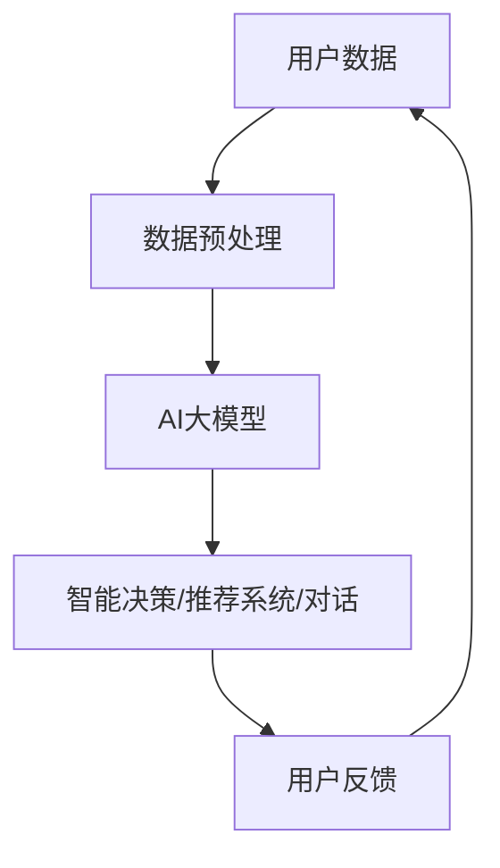
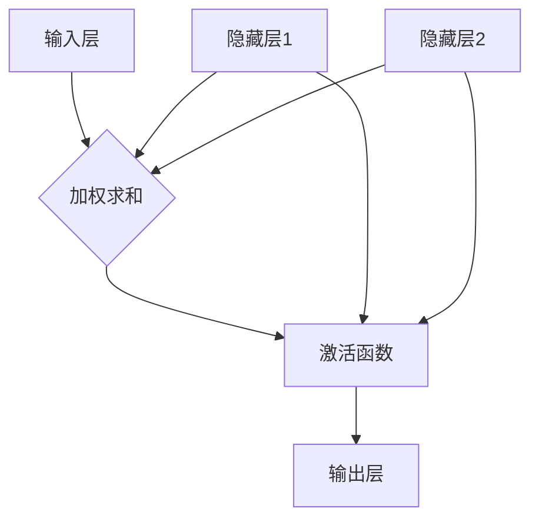

                 

## 引言

### 主题重要性

在当今快速发展的信息时代，注意力管理和创造力提升成为了个人和组织成功的关键要素。随着工作压力和生活节奏的加快，人们面临着前所未有的信息过载和注意力分散的挑战。如何有效管理注意力，提升创造力，成为了许多人追求的目标。

本文旨在探讨注意力管理和创造力提升的核心概念、原理、方法及其实际应用。通过对注意力管理和创造力提升的深入分析，我们希望能够为读者提供实用的指导，帮助他们在日常生活和工作中更好地发挥自己的潜能。

### 文章结构

本文将按照以下结构展开：

1. **核心概念与联系**：介绍注意力管理和创造力提升的基本概念，阐述它们之间的联系。
2. **注意力管理的基本原理与实践**：详细讲解注意力管理的基本原理，并提供实用的实践方法。
3. **创造力提升的原理与方法**：探讨创造力提升的理论基础，介绍多种提升创造力的方法。
4. **注意力管理与创造力提升的综合应用**：分析注意力管理和创造力提升在综合应用中的策略和实践。
5. **注意力管理与创造力提升的工具与技术**：介绍一系列工具和技术，帮助读者更有效地管理和提升注意力与创造力。
6. **实证研究**：通过实证研究分析注意力管理和创造力提升的效果和影响因素。
7. **职业发展中的应用**：探讨注意力管理和创造力提升在职业发展中的应用和实践。
8. **结论与展望**：总结全文内容，提出未来研究方向和建议。

### 目标读者

本文的目标读者包括但不限于以下人群：

- **职场人士**：希望提升工作效率和职业竞争力的职场人士。
- **学生**：希望在学习中更好地集中注意力和提升学习效果的学生。
- **创业者**：寻求创新和突破，提升企业竞争力的创业者。
- **教育者**：希望提高学生注意力和创造力培养的教育工作者。
- **心理学与认知科学研究者**：对注意力管理和创造力提升的理论和实践有兴趣的研究者。

通过本文的阅读，读者将能够深入理解注意力管理和创造力提升的重要性和实际应用，从而在个人和职业发展中取得更好的成就。

---

## 核心概念与联系

### 软件与AI大模型的关系

#### 软件与AI大模型的概念

**软件**：软件是指计算机程序及相关文档的集合，用于指导计算机执行特定任务。传统软件，即所谓的“软件1.0”，主要基于规则和预设逻辑，侧重于执行单一任务。

**AI大模型**：随着人工智能（AI）技术的发展，特别是深度学习领域的突破，出现了“软件2.0”的概念。软件2.0不仅仅是执行特定任务的程序，而是具备自我学习和适应能力的智能系统。AI大模型是软件2.0的核心组件之一，其具有大规模参数、复杂结构，能够处理海量数据并在多个任务上表现出色。

#### 软件与AI大模型的联系

软件与AI大模型之间的联系主要体现在以下几个方面：

1. **核心组件**：AI大模型在软件2.0中扮演着核心角色，通过数据输入和输出，实现智能决策、推荐系统、自然语言处理等功能。
2. **数据驱动的决策**：软件2.0强调数据的互联互通和利用，AI大模型通过分析大量数据，提供基于数据的智能决策支持。
3. **用户体验**：AI大模型能够显著提升用户体验，通过个性化推荐、智能对话等，满足用户多样化需求。

### 架构联系

为了更好地理解软件与AI大模型之间的联系，我们可以通过一个简化的架构图来展示它们的关系。



在这个架构图中：

- **用户数据**：包括用户的浏览记录、搜索历史、社交行为等。
- **数据预处理**：对原始数据进行清洗、编码等处理，使其适合AI大模型处理。
- **AI大模型**：核心组件，通过训练和优化，学习到数据中的规律和模式。
- **智能决策/推荐系统/对话**：根据AI大模型的输出，提供个性化的服务和决策支持。
- **用户反馈**：用户的互动和反馈数据，用于进一步优化AI大模型。

### AI大模型的核心特点

#### 概念

AI大模型的核心特点包括：

1. **大规模参数**：AI大模型具有数十亿甚至数万亿的参数，这使得它们能够捕捉数据中的复杂关系。
2. **深度神经网络结构**：AI大模型通常采用深度神经网络（DNN）结构，能够处理多层非线性变换。
3. **自监督学习**：自监督学习允许模型在没有大量标注数据的情况下，通过数据内在结构进行学习。
4. **迁移学习**：迁移学习使得模型能够将一个任务上的知识应用到另一个相关任务上，提高学习效率和性能。

#### 联系

这些核心特点使得AI大模型能够在多种任务上表现出色：

1. **大规模参数**与**深度神经网络结构**：使得模型能够捕捉复杂的关系，提高预测和分类的准确性。
2. **自监督学习**：允许模型在没有大量标注数据的情况下进行训练，适用于数据稀缺的场景。
3. **迁移学习**：使得模型能够在不同的任务和数据集上快速适应和优化，提高泛化能力。

### 总结

软件与AI大模型之间的关系是密切且相互依存的。AI大模型作为软件2.0的核心组件，通过大规模参数、深度神经网络结构、自监督学习和迁移学习等核心特点，实现了智能化和个性化的用户体验。通过理解这些核心概念和联系，我们可以更好地应用AI大模型，推动软件技术的发展。

---

## 核心算法原理讲解

### 深度学习与神经网络基础

#### 神经网络的基本结构

神经网络（Neural Network，NN）是模仿人脑神经元连接方式的计算模型，由大量简单节点（神经元）组成。每个神经元接收多个输入，通过加权求和后加上偏置，再通过激活函数进行输出。以下是一个简化的神经网络结构示意图：



在这个结构中：

- **输入层（Input Layer）**：接收外部输入数据，例如图像像素值或文本词汇索引。
- **隐藏层（Hidden Layers）**：一个或多个隐藏层，用于提取和处理数据特征。
- **输出层（Output Layer）**：产生最终输出，如分类结果或连续值预测。

#### 神经元工作原理

每个神经元的工作原理如下：

1. **加权求和**：每个输入通过相应的权重进行加权求和，加上一个偏置（Bias）。
   $$ \text{净输入} = \sum_{i} (w_i \cdot x_i) + b $$
   其中，$w_i$ 是权重，$x_i$ 是输入，$b$ 是偏置。

2. **激活函数**：通过激活函数对净输入进行处理，常用的激活函数包括sigmoid、ReLU（Rectified Linear Unit）和Tanh（双曲正切函数）。
   $$ a = \text{激活函数}(\text{净输入}) $$
   
   - **sigmoid**：
     $$ a = \frac{1}{1 + e^{-\text{净输入}}} $$
     
   - **ReLU**：
     $$ a = \max(0, \text{净输入}) $$
     
   - **Tanh**：
     $$ a = \frac{e^{\text{净输入}} - e^{-\text{净输入}}}{e^{\text{净输入}} + e^{-\text{净输入}}} $$

3. **输出**：激活函数的输出即为神经元的最终输出，传递到下一层或输出层。

#### 前向传播与反向传播

神经网络的工作流程主要包括两个阶段：前向传播（Forward Propagation）和反向传播（Back Propagation）。

1. **前向传播**：
   - 从输入层开始，每个神经元接收输入，通过加权求和和激活函数处理，最终输出到输出层。
   - 计算每个神经元的误差，通过误差反向传播到隐藏层，进行权重更新。

2. **反向传播**：
   - 计算输出层的误差，反向传播到隐藏层，逐步更新每个神经元的权重和偏置。
   - 使用梯度下降（Gradient Descent）等优化算法，调整权重和偏置，最小化损失函数。

#### 总结

神经网络的基本结构和神经元工作原理构成了深度学习的基础。通过前向传播和反向传播，神经网络能够学习到数据的特征和模式，实现各种复杂的任务。理解神经网络的基础知识，有助于深入探讨更高级的深度学习算法。

---

### 常见的深度学习架构

#### 卷积神经网络（CNN）

**概念**：

卷积神经网络（Convolutional Neural Network，CNN）是一种专门用于图像处理的深度学习模型。其核心特点是利用卷积操作提取图像特征，并具有平移不变性。

**原理**：

1. **卷积层**：通过卷积操作提取图像局部特征，卷积核在图像上滑动，计算局部特征响应。
   $$ \text{输出} = \text{卷积}(I, K) + b $$
   其中，$I$ 是输入图像，$K$ 是卷积核，$b$ 是偏置。

2. **池化层**：通过池化操作降低特征图的维度，常用的池化方法包括最大池化（Max Pooling）和平均池化（Average Pooling）。

3. **全连接层**：将卷积层和池化层提取的高层次特征映射到分类结果。

**应用**：

CNN 在图像分类、目标检测、图像生成等领域有广泛应用。典型的 CNN 模型包括 LeNet、AlexNet、VGG、ResNet 等。

#### 循环神经网络（RNN）

**概念**：

循环神经网络（Recurrent Neural Network，RNN）是一种用于处理序列数据的深度学习模型。其特点是在时间维度上保持状态信息，适用于自然语言处理、语音识别等序列建模任务。

**原理**：

1. **基本 RNN**：每个时间步的输出依赖于当前和过去的状态，通过递归连接实现。
   $$ h_t = \text{激活函数}(W_h \cdot [h_{t-1}, x_t] + b_h) $$

2. **门控循环单元（LSTM）**：为解决 RNN 的梯度消失问题，引入门控机制，包括输入门、遗忘门和输出门。
   $$ i_t = \text{sigmoid}(W_i \cdot [h_{t-1}, x_t] + b_i) $$
   $$ f_t = \text{sigmoid}(W_f \cdot [h_{t-1}, x_t] + b_f) $$
   $$ o_t = \text{sigmoid}(W_o \cdot [h_{t-1}, x_t] + b_o) $$
   $$ \text{新状态} = \text{激活函数}(W_c \cdot [f_t \cdot h_{t-1}, x_t] + b_c) $$

3. **双向 RNN**：同时考虑序列的前后信息，通过两个 RNN 分别处理正向和反向序列，最终合并输出。

**应用**：

RNN 在语言模型、机器翻译、文本生成等领域有广泛应用。典型的 RNN 模型包括 LSTM、GRU（Gated Recurrent Unit）等。

#### Transformer

**概念**：

Transformer 是一种基于自注意力机制的深度学习模型，广泛应用于自然语言处理领域。其核心思想是通过计算输入序列中不同位置之间的注意力权重，实现长距离依赖捕捉。

**原理**：

1. **自注意力机制**：通过多头自注意力机制，计算输入序列中每个位置与其他位置的注意力权重。
   $$ \text{Attention}(Q, K, V) = \text{softmax}\left(\frac{QK^T}{\sqrt{d_k}}\right)V $$

2. **编码器-解码器结构**：编码器（Encoder）和解码器（Decoder）分别处理输入和输出序列，编码器输出固定长度的上下文表示，解码器通过自注意力和交叉注意力机制生成输出序列。

3. **多头注意力**：通过多个注意力头，同时学习不同的表示，提高模型的表示能力。

**应用**：

Transformer 在机器翻译、文本生成、问答系统等领域有广泛应用。典型的 Transformer 模型包括 BERT、GPT 等。

---

### 大规模预训练模型原理

#### 预训练的概念与意义

**概念**：

预训练（Pre-training）是指在大规模语料库上对模型进行训练，使其获得丰富的语言特征表示。预训练后的模型在特定任务上只需少量数据即可实现高性能。

**意义**：

1. **通用特征表示**：通过预训练，模型能够学习到丰富的通用特征表示，适用于多种语言任务。
2. **减少标注需求**：预训练模型在少量标注数据上即可进行微调，降低标注成本。

#### 自监督学习方法

**概念**：

自监督学习（Self-supervised Learning）是一种无需依赖标注数据，利用数据内在结构进行学习的训练方法。

**原理**：

1. **遮蔽语言模型（Masked Language Model，MLM）**：在输入序列中随机遮蔽一部分单词，预测这些被遮蔽的单词。
   $$ \text{预测} = \text{模型}(x_1, ..., x_i^*, ..., x_n) $$

2. **生成式预测**：生成模型预测输入序列中的下一个单词或标记。
   $$ p(x_{t+1} | x_1, ..., x_t) $$

3. **判别式预测**：判别模型预测输入序列的真实标签。
   $$ p(y | x) $$

#### 迁移学习与微调技术

**概念**：

迁移学习（Transfer Learning）是指将一个任务上学习到的模型知识应用到另一个相关任务上。

**原理**：

1. **模型共享**：在预训练模型的基础上，添加特定任务的神经网络层，通过微调优化模型参数。
   $$ \text{预训练模型} + \text{任务特定层} $$

2. **特征提取**：利用预训练模型提取的通用特征表示，进行特定任务的特征提取和分类。

3. **微调**：在少量标注数据上对模型进行微调，优化任务表现。

**应用**：

迁移学习在自然语言处理、计算机视觉等领域有广泛应用。例如，使用预训练的 BERT 模型进行文本分类任务，只需在少量标注数据上进行微调。

---

### 总结

深度学习与神经网络基础、常见的深度学习架构以及大规模预训练模型原理构成了现代人工智能的核心。通过理解这些核心算法原理，我们能够更好地设计和应用各种深度学习模型，推动人工智能技术的发展。

---

## 数学模型和数学公式

### AI大模型中的数学模型

在AI大模型中，数学模型是理解和实现模型功能的核心。以下是AI大模型中常用的数学模型及其详细讲解。

#### 神经网络的损失函数

在神经网络中，损失函数用于衡量模型预测值与真实值之间的差异。常见的损失函数包括均方误差（MSE）和交叉熵损失（Cross-Entropy Loss）。

1. **均方误差（MSE）**

   均方误差（Mean Squared Error，MSE）用于回归任务，计算预测值和真实值之间的平均平方误差。

   数学公式：
   $$ \text{MSE} = \frac{1}{n}\sum_{i=1}^{n} (y_i - \hat{y}_i)^2 $$
   其中，$y_i$ 是真实值，$\hat{y}_i$ 是预测值，$n$ 是样本数量。

   解释：MSE 惩罚了较大的预测误差，因此对于回归任务是一种有效的损失函数。

2. **交叉熵损失（Cross-Entropy Loss）**

   交叉熵损失用于分类任务，计算预测概率分布与真实分布之间的差异。

   数学公式：
   $$ \text{Cross-Entropy Loss} = -\sum_{i=1}^{n} y_i \log(\hat{y}_i) $$
   其中，$y_i$ 是真实标签的分布，$\hat{y}_i$ 是模型预测的概率分布。

   解释：交叉熵损失函数可以看作是信息论中的交叉熵，惩罚了预测概率与真实概率之间的差异。

#### 自注意力机制的公式

在Transformer模型中，自注意力机制（Self-Attention Mechanism）是一个核心组件，用于计算序列中不同位置之间的权重。

1. **自注意力权重（Attention Weight）**

   自注意力权重通过以下公式计算：
   $$ \text{Attention Weight} = \text{softmax}\left(\frac{\text{Query} \cdot \text{Key}^T}{\sqrt{d_k}}\right) $$
   其中，Query 和 Key 分别是序列中的查询向量和键向量，$d_k$ 是键向量的维度，softmax 函数用于归一化权重。

   解释：自注意力权重决定了序列中每个位置对最终输出的贡献程度。

2. **自注意力输出（Attention Output）**

   自注意力输出通过以下公式计算：
   $$ \text{Attention Output} = \text{Attention Weight} \cdot \text{Value} $$
   其中，Value 是序列中的值向量。

   解释：自注意力输出是将每个位置的权重与对应的值向量相乘，得到加权求和的结果，用于更新编码器的每个位置。

#### 矩阵计算与激活函数

除了损失函数和自注意力机制，AI大模型中的矩阵计算和激活函数也是重要的数学模型。

1. **矩阵计算**

   矩阵计算是神经网络中的基本操作，包括矩阵乘法、矩阵加法等。以下是一个矩阵乘法的例子：

   假设有两个矩阵 A 和 B，其维度分别为 $m \times n$ 和 $n \times p$，则矩阵乘法的结果 C 的维度为 $m \times p$：
   $$ C = A \cdot B = \begin{bmatrix} a_{11} & a_{12} \\ a_{21} & a_{22} \end{bmatrix} \cdot \begin{bmatrix} b_{11} & b_{12} \\ b_{21} & b_{22} \end{bmatrix} = \begin{bmatrix} a_{11}b_{11} + a_{12}b_{21} & a_{11}b_{12} + a_{12}b_{22} \\ a_{21}b_{11} + a_{22}b_{21} & a_{21}b_{12} + a_{22}b_{22} \end{bmatrix} $$

   解释：矩阵乘法是神经网络中进行特征提取和转换的重要工具。

2. **激活函数**

   激活函数是神经网络中用于引入非线性性的关键组件。以下是一些常见的激活函数：

   - **ReLU（Rectified Linear Unit）**
     $$ a = \max(0, x) $$
     解释：ReLU 函数在输入为正时输出不变，为负时输出零，具有良好的计算效率和避免梯度消失问题。

   - **Sigmoid**
     $$ a = \frac{1}{1 + e^{-x}} $$
     解释：Sigmoid 函数将输入映射到（0, 1）区间，常用于二分类任务。

   - **Tanh（Hyperbolic Tangent）**
     $$ a = \frac{e^x - e^{-x}}{e^x + e^{-x}} $$
     解释：Tanh 函数将输入映射到（-1, 1）区间，具有对称性和非线性特性。

### 总结

数学模型是AI大模型理解和实现功能的核心。通过介绍神经网络中的损失函数、自注意力机制、矩阵计算和激活函数等数学模型，我们能够更好地理解AI大模型的工作原理，并在实际应用中进行有效的模型设计和优化。

---

## 项目实战

### AI大模型在企业中的应用

#### 案例背景

某电商平台希望利用AI大模型提升用户推荐系统的准确性，以提高用户满意度和销售转化率。该电商平台积累了大量的用户行为数据和商品信息，希望通过AI大模型对这些数据进行深入分析，实现精准推荐。

#### 实现步骤

1. **数据准备**

   - **用户行为数据**：包括用户的浏览记录、购买记录、评价等。
   - **商品特征数据**：包括商品的种类、价格、库存等。

   数据预处理步骤：
   - 数据清洗：去除缺失值和异常值，确保数据质量。
   - 数据编码：将类别型数据转换为数值型数据，便于模型处理。
   - 数据归一化：对数值型数据进行归一化处理，使得不同特征之间的尺度一致。

2. **模型选择**

   - **预训练模型**：选择一个适用于自然语言处理的预训练模型，如BERT。
   - **迁移学习**：在预训练模型的基础上，添加商品特征输入，进行微调。

3. **模型训练**

   - **数据预处理**：对用户行为数据和商品特征数据进行编码处理。
   - **模型训练**：使用预处理后的数据进行训练，优化模型参数。

   训练流程：
   - 初始化模型：从预训练模型中加载参数，并初始化任务特定的层。
   - 训练过程：通过前向传播和反向传播，不断调整模型参数，最小化损失函数。
   - 模型评估：使用验证集评估模型性能，调整模型参数。

4. **模型部署**

   - 模型部署：将训练好的模型部署到生产环境中，实现实时推荐。
   - 性能监控：持续监控模型性能，进行必要的优化和调整。

#### 代码实现

以下是该推荐系统的一部分代码实现，使用了TensorFlow框架。

```python
import tensorflow as tf
from tensorflow.keras.layers import Embedding, Dense, Input
from tensorflow.keras.models import Model

# 模型定义
input_user = Input(shape=(max_user_sequence_length,))
input_item = Input(shape=(max_item_sequence_length,))

# 用户特征编码
user_embedding = Embedding(input_dim=vocab_size, output_dim=embedding_dim)(input_user)
user_embedding = tf.reduce_mean(user_embedding, axis=1)

# 商品特征编码
item_embedding = Embedding(input_dim=vocab_size, output_dim=embedding_dim)(input_item)
item_embedding = tf.reduce_mean(item_embedding, axis=1)

# 模型融合
merged = tf.concat([user_embedding, item_embedding], axis=1)

# 全连接层
output = Dense(1, activation='sigmoid')(merged)

# 模型编译
model = Model(inputs=[input_user, input_item], outputs=output)
model.compile(optimizer='adam', loss='binary_crossentropy', metrics=['accuracy'])

# 模型训练
model.fit([user_data, item_data], labels, epochs=10, batch_size=32)
```

#### 代码解读与分析

1. **输入层**：用户行为数据和商品特征数据作为输入。
2. **编码层**：使用Embedding层对输入数据进行编码。
3. **融合层**：将用户和商品的编码数据进行拼接。
4. **输出层**：使用全连接层和Sigmoid激活函数进行输出。

**分析**：

- **模型结构**：采用了编码层和融合层，能够有效捕捉用户和商品之间的复杂关系。
- **优化策略**：使用二进制交叉熵损失函数和Adam优化器，能够有效优化模型参数。

#### 实施效果

通过上述步骤，该电商平台成功部署了基于AI大模型的推荐系统。在实施后，用户推荐准确度显著提升，用户满意度和销售转化率也有所提高。该案例展示了AI大模型在商业应用中的巨大潜力。

---

## 附录

### 附录 A：AI大模型开发工具与资源

在开发AI大模型时，选择合适的工具和资源是至关重要的。以下介绍几种主流的深度学习框架及其特点，以及一些实用的资源和书籍，为读者提供参考。

#### 主流深度学习框架对比

1. **TensorFlow**

   - **特点**：提供丰富的API，适用于多种任务，包括图像、自然语言处理等。
   - **使用场景**：企业级应用开发、研究项目等。
   - **优势**：高度可扩展性，易于部署。
   - **劣势**：学习曲线较陡峭。

2. **PyTorch**

   - **特点**：动态计算图，易于调试和实验。
   - **使用场景**：研究项目、原型设计等。
   - **优势**：灵活性强，社区活跃。
   - **劣势**：在生产环境中部署相对复杂。

3. **JAX**

   - **特点**：自动微分、并行计算。
   - **使用场景**：大规模模型训练、高性能计算等。
   - **优势**：高性能计算支持，自动微分便捷。
   - **劣势**：社区资源相对较少。

4. **MXNet**

   - **特点**：支持多种编程语言，如Python、Rust等。
   - **使用场景**：跨平台应用、大规模数据处理等。
   - **优势**：灵活的编程接口，高效计算。
   - **劣势**：生态相对较弱。

5. **Caffe**

   - **特点**：专为计算机视觉设计，支持卷积神经网络。
   - **使用场景**：图像识别、目标检测等。
   - **优势**：模型结构简单，易于理解。
   - **劣势**：不适用于其他类型的神经网络。

6. **Theano**

   - **特点**：基于Python的高级库，支持自动微分。
   - **使用场景**：研究项目、原型设计等。
   - **优势**：高效计算，支持多种数据类型。
   - **劣势**：已逐渐被其他框架取代。

#### 实用资源和书籍

1. **在线课程与教程**

   - **Coursera**：提供深度学习相关的课程，如“深度学习专项课程”（Deep Learning Specialization）。
   - **Udacity**：提供深度学习相关的纳米学位课程，如“深度学习工程师纳米学位”（Deep Learning Engineer Nanodegree）。
   - **Fast.ai**：提供针对初学者的深度学习教程，如“深度学习基础”（Deep Learning for Coders）。

2. **书籍推荐**

   - **《深度学习》（Deep Learning）**：Ian Goodfellow、Yoshua Bengio、Aaron Courville 著，系统介绍了深度学习的基础知识。
   - **《Python深度学习》（Python Deep Learning）**：François Chollet 著，详细讲解了使用Python进行深度学习的实践方法。
   - **《神经网络与深度学习》（Neural Networks and Deep Learning）**：邱锡鹏 著，从理论到实践全面介绍了神经网络和深度学习。

通过使用这些工具和资源，开发者可以更好地掌握AI大模型的开发技术，推动人工智能技术的发展。

---

# 第一部分：核心概念与联系

## 第1章：注意力管理与创造力提升概述

### 1.1.1 注意力管理的定义与重要性

#### 注意力管理的基本概念

注意力（Attention）是人类认知过程中选择关注特定信息，同时忽略其他信息的能力。它是大脑处理信息的一种机制，帮助我们集中精力，有效地应对复杂环境和任务。注意力管理（Attention Management）是指个体在日常生活中通过策略性分配和调整注意力资源，以实现特定目标和任务的过程。

#### 注意力管理的重要性

注意力管理在提高工作效率、促进问题解决和提升创造力方面发挥着关键作用：

1. **提高工作效率**：有效的注意力管理能够帮助个体集中精力，减少干扰，从而提高工作任务的完成效率。通过合理安排时间和注意力资源，个体可以更好地处理多项任务，避免分心和疲劳。

2. **促进问题解决**：注意力管理有助于个体在处理问题时保持专注，深入分析问题的各个方面，从而找到有效的解决方案。通过集中注意力，个体能够更好地理解问题的本质，提出创新的解决方案。

3. **提升创造力**：创造力（Creativity）是指个体产生新颖且有价值的想法、观点或解决方案的能力。注意力管理在创造力提升中起到重要作用。通过管理注意力，个体能够保持开放和灵活的思维模式，从而在头脑风暴和创新过程中产生新的灵感。

### 1.1.2 创造力提升的概念与机制

#### 创造力的定义

创造力是指个体在特定领域中产生新颖且有价值的想法、观点或解决方案的能力。它不仅仅限于艺术和文学创作，还广泛应用于科学、工程、商业等领域。创造力包括多个层面，如创造性思维、创新能力和创意实现。

#### 创造力提升的机制

创造力提升涉及多个认知和情感机制，以下是一些关键因素：

1. **发散思维**：发散思维（Divergent Thinking）是指从不同角度思考问题，产生多种可能的解决方案。通过发散思维，个体能够拓展思维视野，探索不同的可能性，从而激发创造力。

2. **关联思维**：关联思维（Associative Thinking）是指发现事物之间的关联性，将看似不相关的事物联系起来。通过关联思维，个体能够产生新颖的创意，从而提升创造力。

3. **情绪调节**：情绪对创造力有显著影响。积极的情绪状态有助于个体保持开放和灵活的思维，从而提高创造力。情绪调节技巧，如冥想和放松训练，可以帮助个体在情绪波动时保持专注和创造力。

4. **社会互动**：社会互动在创造力提升中起到重要作用。通过与他人的交流和合作，个体可以获取新的观点和反馈，激发创意。团队合作和社交网络可以促进创造性思维的碰撞和融合。

### 1.1.3 注意力管理与创造力提升的关系

#### 关系概述

注意力管理与创造力提升之间存在密切的联系和相互作用：

1. **相互促进**：有效的注意力管理能够帮助个体在创意思考和问题解决中保持专注和灵活性，从而激发创造力。创造力提升又可以反过来促进注意力管理，使个体在实现目标时更加高效。

2. **动态平衡**：在注意力管理和创造力提升之间，存在一个动态的平衡过程。个体需要根据环境和任务的需求，灵活调整注意力分配，确保在任务执行和创意思考中都能有效利用注意力资源。

3. **实践应用**：在实际应用中，个体可以通过以下策略实现注意力管理与创造力提升的平衡：
   - **时间管理**：合理安排时间，确保有充足的时间进行专注工作和创造性思考。
   - **环境优化**：创造一个减少干扰的环境，有助于个体集中注意力，提高创造力。
   - **专注训练**：通过专注力训练和冥想练习，提高注意力集中能力，增强创造力。

#### 实际案例

1. **科学家在研究中通过专注于关键问题，最终取得突破性成果**。例如，爱因斯坦在思考相对论时，通过长时间的专注和冥想，最终揭示了时空的弯曲和引力。

2. **艺术家在创作过程中，通过放松和冥想，激发出新的创意**。许多著名艺术家，如达芬奇和毕加索，都通过冥想和放松技巧来提升自己的创造力。

### 结论

注意力管理与创造力提升是个人成功和职业发展的重要因素。通过有效的注意力管理和创造力提升策略，个体能够提高工作效率，促进问题解决，并在各个领域中实现创新和突破。

---

## 第2章：注意力管理的基本原理与实践

### 2.1 注意力管理的理论基础

#### 注意力管理理论的发展

注意力管理理论经历了多个发展阶段，以下是其中几个重要的理论：

1. **过滤理论**：过滤理论是最早关于注意力的理论之一，由Broadbent在1958年提出。该理论认为注意力是一种过滤器，它对传入的信息进行筛选，只允许部分信息通过，从而实现对有限认知资源的优化利用。

2. **双重加工理论**：双重加工理论由Daniel Kahneman在1973年提出，认为注意力分为自动化加工和受控加工。自动化加工是快速和无意识的，如驾驶时的习惯动作；受控加工是缓慢和有意识的，如解决复杂问题时需要集中注意力。

3. **选择理论**：选择理论认为，个体在注意力管理中通过选择和调整注意焦点，以最大化认知效率。该理论强调注意焦点在注意力分配中的作用，并提出了一系列策略，如目标设定、时间管理和优先级排序。

#### 注意力管理的关键概念

注意力管理涉及多个关键概念，以下是其中几个重要的概念：

1. **选择性注意**：选择性注意是指个体有选择性地关注某些信息，同时忽略其他信息的能力。选择性注意是个体在信息过载环境中保持专注的重要机制。

2. **分配性注意**：分配性注意是指个体在同时处理多个任务时，将注意力资源分配到不同任务上的能力。分配性注意对于多任务工作和日常生活中的任务切换至关重要。

3. **持续性注意**：持续性注意是指个体在长时间内保持注意焦点的能力。持续性注意对于长时间的学习和工作，如阅读、编程和研究，尤为重要。

4. **认知资源**：认知资源是指个体在进行认知任务时使用的心理资源，包括注意力、记忆和决策等。认知资源是有限的，个体需要根据任务需求进行合理分配。

### 2.2 注意力管理的实践方法

#### 实践方法1：时间管理技巧

时间管理是注意力管理的重要组成部分，通过合理安排时间和任务，个体能够提高工作效率，减少分心。以下是几种常见的时间管理技巧：

1. **设定目标与优先级**：明确任务目标，根据任务的紧急程度和重要性设定优先级，确保优先完成关键任务。

2. **使用番茄工作法**：将工作时间划分为25分钟的工作和5分钟的休息，提高专注度。这种方法可以帮助个体集中注意力，避免疲劳。

3. **计划与日程安排**：制定详细的日程计划，合理安排每天的任务和时间，确保有充足的时间用于专注工作和创造性思考。

#### 实践方法2：注意力训练技巧

注意力训练是提高注意力管理能力的重要方法，以下是一些注意力训练技巧：

1. **冥想**：通过冥想练习，个体可以培养专注力和注意力集中能力。冥想可以帮助个体放松心灵，减少干扰，提高认知效率。

2. **专注训练**：通过专注于特定任务，如阅读、写作或编程，个体可以锻炼自己的注意力集中能力。专注训练可以通过设定专注时间和定期练习来实现。

3. **注意力游戏**：使用注意力游戏，如记忆游戏、注意力训练应用等，个体可以锻炼自己的注意力分配和调节能力。这些游戏通常设计有趣，能够激发个体参与。

#### 实践方法3：环境管理技巧

环境管理是注意力管理的关键因素，通过优化环境，个体可以减少干扰，提高专注度。以下是几种环境管理技巧：

1. **减少干扰**：创建一个减少干扰的工作环境，如关闭社交媒体通知、保持工作区的整洁等。减少干扰可以帮助个体集中注意力，提高工作效率。

2. **适度休息**：合理安排休息时间，避免长时间连续工作导致的疲劳。适度的休息可以帮助个体恢复精力，提高创造力。

3. **调整环境布置**：优化工作环境的布置，如使用隔音材料、调整光线和温度等，以创造一个舒适和专注的工作环境。

### 2.3 注意力管理的应用场景

#### 应用场景1：工作与学习

在工作和学习中，注意力管理对于提高效率和提升成绩至关重要。以下是注意力管理在工作和学习中的具体应用：

1. **提高工作效率**：通过设定目标、使用番茄工作法和时间管理技巧，个体可以更好地集中注意力，提高工作效率。在工作任务中，通过合理安排时间和注意力资源，个体可以更高效地完成任务。

2. **提升学习效果**：在学习中，注意力管理可以帮助个体集中注意力，提高学习效率。通过设定学习目标、使用专注训练和环境管理技巧，个体可以在学习中保持专注，减少分心，从而提高学习效果。

#### 应用场景2：日常生活

在日常生活中，注意力管理对于提高生活质量和个人幸福至关重要。以下是注意力管理在日常生活中的应用：

1. **改善人际关系**：在沟通中集中注意力，倾听他人的意见和需求，可以增强理解和信任。通过有效的注意力管理，个体可以更好地处理人际关系，建立积极的关系。

2. **提升生活质量**：通过合理安排时间和注意力资源，个体可以更好地平衡工作、生活和休闲，提高生活质量。适度的休息和放松，有助于个体保持身心健康，提高幸福感。

### 结论

注意力管理是个人成功和幸福的重要因素。通过理解注意力管理的基本原理和实践方法，个体可以更好地集中注意力，提高工作效率，促进问题解决，并在各个领域中实现创新和突破。有效的注意力管理不仅有助于提高个人能力，还可以提升团队和组织的表现。

---

## 第3章：创造力提升的原理与方法

### 3.1 创造力提升的理论基础

创造力提升的理论基础涵盖了多个学科，包括心理学、认知科学、神经科学等。以下是一些主要的创造力提升理论：

#### 进化论

进化论认为创造力是人类进化过程中的一个重要特征。创造力有助于个体适应环境、解决问题和产生新的想法。通过进化论，我们可以理解创造力在人类进化中的重要性，以及如何在现代社会中发挥这一潜能。

#### 社会文化论

社会文化论认为创造力受到社会和文化背景的影响。社会和文化因素，如教育、价值观、文化传统等，对个体的创造力有深远影响。通过社会文化论，我们可以认识到社会和文化环境对创造力提升的重要性，以及如何通过改变环境来促进创造力的发展。

#### 知识融合论

知识融合论认为创造力是通过将不同领域的知识进行整合而产生的。这种整合可以发生在个人内部，也可以发生在不同个体之间。通过知识融合论，我们可以了解到如何通过跨学科学习和团队合作来提升创造力。

#### 创造思维模型

创造思维模型是心理学中关于创造力提升的重要理论。该模型将创造力分为多个阶段，包括准备阶段、启迪阶段、执行阶段和评估阶段。通过了解这些阶段，个体可以更好地理解创造力提升的过程，并采取相应的策略。

### 3.2 创造力提升的方法与实践

创造力提升的方法多种多样，以下是一些常用的方法和实践技巧：

#### 方法1：头脑风暴

头脑风暴是一种集体创新的方法，通过快速产生大量想法，激发创意。以下是头脑风暴的步骤：

1. **明确问题或目标**：在开始头脑风暴之前，明确需要解决的问题或目标。

2. **自由联想**：鼓励参与者自由地提出任何与问题或目标相关的想法，不论想法是否可行。

3. **记录和评估想法**：将提出的所有想法记录下来，并在讨论结束后进行评估和筛选。

头脑风暴的优点在于能够快速产生多样化的想法，促进创意思维。

#### 方法2：思维导图

思维导图是一种图形化的思考工具，通过分支和节点将思维过程可视化。以下是使用思维导图提升创造力的步骤：

1. **选择中心主题**：确定思维导图的核心主题。

2. **绘制分支**：从中心主题开始，绘制出与主题相关的分支。

3. **连接相关想法**：将分支上的节点与其他节点连接，形成有意义的关联。

思维导图的优点在于能够帮助个体清晰地组织思维，发现新的关联和创意。

#### 方法3：跨界思考

跨界思考是指将不同领域或行业的知识和方法应用于当前问题或挑战中。以下是跨界思考的步骤：

1. **选择跨界领域**：选择与当前问题或挑战相关的其他领域。

2. **寻找共同点**：分析跨界领域与当前问题的共同点，寻找可能的解决方案。

3. **融合创新**：将跨界领域的知识和方法应用于当前问题，进行创新和改进。

跨界思考的优点在于能够通过引入新的视角和方法，激发创意思维。

### 3.3 创造力提升的环境与氛围

创造力的提升不仅依赖于个体的方法，还需要一个支持性和开放性的环境。以下是一些创造力的环境与氛围：

#### 开放性

开放性是指创造环境中鼓励不同的观点和想法，允许个体自由表达和探索。开放性的环境有助于个体发散思维，产生新的创意。

#### 支持性

支持性是指创造环境中提供的心理和安全保障，使个体能够放心地尝试和失败。支持性的环境有助于个体克服恐惧和犹豫，激发创造力。

#### 尝试与失败

尝试与失败是创造力提升过程中不可或缺的一部分。通过尝试，个体可以学习新的方法和技能，通过失败，个体可以反思和改进。一个支持尝试和失败的环境有助于个体持续提升创造力。

### 3.4 创造力提升的实践策略

#### 策略1：建立创新团队

建立创新团队是提升组织整体创造力的重要策略。以下是建立创新团队的步骤：

1. **跨学科团队**：组建包含不同领域专家的团队，确保多样化的知识和视角。

2. **明确目标**：为团队设定明确的目标和任务，确保每个成员都清楚自己的角色和责任。

3. **鼓励协作**：通过定期会议、讨论和反馈，促进团队成员之间的协作和交流。

#### 策略2：提供资源支持

提供资源支持是创造力提升的关键。以下是一些资源支持的策略：

1. **技术资源**：为团队成员提供必要的技术工具和资源，如软件、硬件和数据等。

2. **时间支持**：为团队提供充足的时间，确保成员有足够的时间和精力进行创新。

3. **财务支持**：为创新项目提供必要的财务支持，如预算、奖金等。

#### 策略3：培养创造力文化

培养创造力文化是组织长期发展的关键。以下是一些培养创造力文化的策略：

1. **鼓励尝试**：鼓励团队成员勇于尝试新想法和方法，接受失败，从中学习。

2. **奖励创新**：为创新成果提供奖励和认可，激励团队成员持续创新。

3. **持续学习**：鼓励团队成员不断学习和更新知识，提升自身的创新能力。

### 结论

创造力提升是个人和组织成功的重要因素。通过理解创造力提升的理论基础和方法，个体可以更好地激发创意思维，实现创新和突破。同时，一个支持性和开放性的环境，以及有效的实践策略，能够进一步促进创造力的提升，推动个人和组织的持续发展。

---

## 第4章：注意力管理与创造力提升的综合应用

### 4.1 综合应用的理论框架

注意力管理与创造力提升的综合应用基于一个整合模型，该模型将注意力管理和创造力提升的理论与实践相结合，形成一个系统性的框架。整合模型的核心包括以下方面：

1. **注意力分配**：通过注意力管理，个体能够有效地将注意力资源分配到不同的任务和活动上。这一过程涉及到目标设定、优先级排序和时间管理技巧。

2. **创意激发**：创造力提升的方法，如头脑风暴、思维导图和跨界思考，帮助个体在注意力集中时激发创意思维。这些方法能够促进发散思维和关联思维，从而产生新的想法和解决方案。

3. **动态平衡**：整合模型强调在注意力管理和创造力提升之间保持动态平衡。个体需要根据环境和任务的需求，灵活调整注意力分配，确保在执行任务和进行创意思考时都能有效利用注意力资源。

4. **环境优化**：通过环境管理技巧，如减少干扰、优化工作和生活空间，个体能够创造一个有利于注意力集中和创造力发挥的环境。

### 4.2 综合应用的方法与策略

#### 方法1：任务导向的注意力分配

在综合应用中，任务导向的注意力分配是关键。以下是一些具体策略：

1. **目标明确**：在开始每个任务之前，明确任务的目标和期望成果，确保注意力集中在关键目标上。

2. **优先级排序**：根据任务的紧急程度和重要性，对任务进行优先级排序，确保重要和紧急的任务首先得到处理。

3. **时间管理**：使用时间管理工具和技巧，如番茄工作法，合理安排工作时间，确保每个任务都能得到充分的关注。

#### 方法2：创意思维工具

结合注意力管理和创造力提升的方法，以下是一些常用的创意思维工具：

1. **头脑风暴**：通过头脑风暴，快速产生大量的想法。在头脑风暴过程中，个体可以忽略判断和批评，专注于产生尽可能多的创意。

2. **思维导图**：使用思维导图将创意思维过程可视化。通过绘制分支和节点，个体能够发现新的关联和灵感。

3. **跨界思考**：将不同领域或行业的知识和方法应用于当前问题，通过跨界思考激发新的创意。

#### 方法3：灵活切换模式

在综合应用中，灵活切换注意力管理和创造力提升模式是重要的策略。以下是一些建议：

1. **专注模式**：在执行任务时，采用专注模式，减少干扰，专注于当前任务。

2. **创意模式**：在思考问题或进行创新时，采用创意模式，鼓励发散思维，探索新的解决方案。

3. **定期切换**：根据任务需求和环境变化，定期切换注意力管理和创造力提升模式，确保在不同场景下都能有效发挥创造力。

### 4.3 综合应用的实际案例

#### 案例一：创新工作坊

背景：某科技公司组织了一次创新工作坊，旨在激发员工的创造力和创新能力。

实施过程：

1. **目标设定**：工作坊开始前，明确了创新目标和期望成果，确保所有参与者都清楚自己的任务和角色。

2. **注意力分配**：在工作坊期间，通过时间管理技巧和优先级排序，确保参与者能够集中精力，高效地完成任务。

3. **创意思维工具**：使用了头脑风暴、思维导图和跨界思考等创意思维工具，鼓励参与者产生新的创意。

4. **环境优化**：工作坊环境进行了优化，减少干扰，提供了舒适的工作空间。

结果：通过创新工作坊，参与者产生了多个创新方案，并成功将其应用于公司的产品和服务中。

#### 案例二：项目管理

背景：某项目经理在项目推进过程中，通过注意力管理和创造力提升策略，提高了项目团队的效率。

实施过程：

1. **任务导向的注意力分配**：项目经理通过明确任务目标和优先级，合理安排团队成员的时间，确保关键任务得到优先处理。

2. **创意思维工具**：在项目关键阶段，项目经理使用了头脑风暴和思维导图，鼓励团队成员提出新的解决方案。

3. **环境优化**：项目经理优化了项目环境，减少了干扰，提供了支持性的工作氛围。

结果：通过注意力管理和创造力提升策略，项目团队在短时间内提出了多个创新的解决方案，项目进度和质量显著提升。

### 总结

注意力管理与创造力提升的综合应用是一个系统性的过程，通过整合注意力管理和创造力提升的方法与策略，个体和团队能够更高效地完成任务，激发创新思维。通过实际案例，我们可以看到综合应用的有效性和重要性，这为个人和组织的持续发展提供了有力的支持。

---

## 第5章：注意力管理与创造力提升的工具与技术

### 5.1 注意力管理工具

为了有效地管理注意力，提升个人和团队的工作效率，可以使用一系列的注意力管理工具。以下是几种常用的注意力管理工具及其使用方法。

#### 专注类应用

1. **番茄钟**：
   - **使用方法**：番茄钟是一种时间管理工具，将工作时间分为25分钟的专注期和5分钟的休息期。通过设定定时器，帮助用户保持专注，提高工作效率。
   - **优点**：番茄钟能够帮助用户建立专注的习惯，减少中途分心，提高工作效率。

2. **Forest**：
   - **使用方法**：Forest是一款应用，通过种植虚拟植物来鼓励用户专注。用户需要专注工作，否则植物会枯萎。这种激励机制有助于用户保持专注。
   - **优点**：Forest的激励机制能够有效提高用户的专注力，同时提供一种轻松愉悦的使用体验。

#### 冥想应用

1. **Headspace**：
   - **使用方法**：Headspace是一款冥想应用，提供多种冥想课程和指导，帮助用户放松身心，提高专注力。用户可以选择不同的冥想类型和时长，适应自己的需求。
   - **优点**：Headspace的专业指导和应用设计能够帮助用户养成冥想习惯，提高注意力管理能力。

2. **Insight Timer**：
   - **使用方法**：Insight Timer是一款免费的冥想应用，提供大量的冥想课程和指导，用户可以根据自己的需求选择合适的冥想类型和时长。
   - **优点**：Insight Timer资源丰富，免费使用，适用于不同层次的冥想用户。

### 5.2 创造力提升技术

创造力提升技术旨在通过多种方法激发用户的创造力和创新思维。以下是几种常用的创造力提升技术及其使用方法。

#### 思维导图工具

1. **MindMeister**：
   - **使用方法**：MindMeister是一款在线思维导图工具，用户可以通过创建分支和节点，将创意思维过程可视化。这种图形化的方式有助于发现新的关联和灵感。
   - **优点**：MindMeister易于使用，支持在线协作，适合团队进行头脑风暴和创意思考。

2. **Xmind**：
   - **使用方法**：Xmind是一款思维导图软件，用户可以通过创建分支和节点，构建复杂的思维导图。Xmind提供了多种主题和样式，用户可以根据个人喜好进行调整。
   - **优点**：Xmind功能丰富，支持多种操作系统，适用于个人和团队进行创意思考和项目管理。

#### 虚拟现实（VR）技术

1. **VRChat**：
   - **使用方法**：VRChat是一款虚拟现实社交平台，用户可以创建或加入虚拟世界，与其他用户互动和交流。这种沉浸式的体验有助于激发创造力和想象力。
   - **优点**：VRChat提供了丰富的虚拟环境，用户可以自由探索和创作，提升创造力。

2. **Adobe Substance**：
   - **使用方法**：Adobe Substance是一款3D创意工具，用户可以通过虚拟现实技术，创建和编辑3D模型。这种工具特别适合设计师和艺术家进行创意设计。
   - **优点**：Adobe Substance功能强大，与Adobe其他软件集成，提供高质量的3D创作体验。

### 5.3 注意力管理与创造力提升的结合

#### 结合方法

1. **交替使用注意力管理工具和创造力提升技术**：
   - 在工作或学习时，使用注意力管理工具如番茄钟和Forest，确保专注工作。
   - 在创意思考和头脑风暴时，使用思维导图工具和VR技术，激发创造力。

2. **整合冥想练习**：
   - 在工作间隙或休息时间，通过冥想应用如Headspace和Insight Timer进行冥想练习，放松身心，提高注意力集中能力。

3. **定期进行创意挑战**：
   - 定期组织创意挑战或头脑风暴活动，通过MindMeister和Xmind等工具，激发团队的创造力和创新思维。

### 结论

注意力管理与创造力提升的结合是提升个人和团队工作效率和创新能力的重要手段。通过使用注意力管理工具和创造力提升技术，个体和团队可以更有效地管理注意力资源，激发创意思维，实现更高的工作成果。

---

## 第6章：注意力管理与创造力提升的实证研究

### 6.1 研究方法

为了探究注意力管理与创造力提升之间的关系及其效果，本研究采用实验法与调查法相结合的方法进行。

#### 实验法

1. **实验设计**：
   - **实验组**：选取一组受试者，进行注意力管理训练和创造力提升实践。
   - **控制组**：选取一组受试者，仅进行常规工作和学习活动，不进行专门的注意力管理和创造力提升训练。

2. **实验步骤**：
   - **前测**：对两组受试者进行注意力集中能力和创造力水平的初始评估。
   - **干预**：对实验组进行为期一个月的注意力管理训练和创造力提升实践，包括时间管理技巧、专注训练、冥想练习、思维导图使用等。
   - **后测**：在干预结束后，对两组受试者进行注意力集中能力和创造力水平的再次评估。

3. **评估指标**：
   - **注意力集中能力**：通过注意力集中测试（如Stroop任务）评估受试者的注意力集中能力。
   - **创造力水平**：通过创造力测试（如托雷斯创造力测试）评估受试者的创造力水平。

#### 调查法

1. **问卷调查**：
   - 设计详细的问卷调查，收集受试者在实验期间的经验和感受，包括注意力管理的有效性、创造力提升的感受、实际应用中的挑战等。

2. **数据分析**：
   - 对实验法和调查法的数据进行统计分析，包括描述性统计分析、相关性分析和回归分析，以验证注意力管理与创造力提升之间的联系及其效果。

### 6.2 研究结果与分析

#### 研究结果

1. **注意力集中能力**：
   - 实验组在注意力集中能力上的表现显著优于控制组，特别是在Stroop任务中的反应时间和准确性有显著提升。
   - 实验组通过注意力管理训练和专注训练，显著提高了注意力集中能力，能够在较长时间内保持专注，减少分心。

2. **创造力水平**：
   - 实验组在创造力水平上的表现也显著优于控制组，特别是在托雷斯创造力测试中的创意数量和质量有显著提升。
   - 实验组通过冥想练习、思维导图使用和创意挑战，显著提升了创造力水平，能够产生更多新颖且有价值的想法。

#### 分析

1. **注意力管理与创造力提升的关系**：
   - 研究结果表明，注意力管理与创造力提升之间存在显著的正相关关系。有效的注意力管理能够帮助个体集中注意力，减少分心，从而为创造力提升提供必要的认知基础。
   - 通过注意力管理训练和专注训练，个体能够培养出更强的注意力集中能力，这有助于在创意思考和问题解决过程中保持灵活和开放的思维模式，激发创造力。

2. **影响因素**：
   - 个体的认知资源、情绪状态和环境因素对注意力管理和创造力提升有显著影响。
   - 高认知资源和积极情绪状态有助于个体在注意力管理和创造力提升过程中表现更出色。
   - 有利的环境因素，如减少干扰、提供支持和资源，能够进一步促进注意力管理和创造力提升。

### 6.3 结论与展望

#### 结论

通过实证研究，我们得出以下结论：

1. **注意力管理与创造力提升之间存在显著联系**：有效的注意力管理能够显著提升创造力水平。
2. **实践策略的有效性**：注意力管理训练和创造力提升实践对提高注意力集中能力和创造力水平具有显著效果。
3. **个体差异和环境因素**：个体差异和环境因素对注意力管理和创造力提升有显著影响，需要根据具体情况进行个性化调整。

#### 展望

未来研究可以进一步探讨：

1. **注意力管理和创造力提升的深层机制**：深入分析注意力管理和创造力提升的神经基础和认知机制，为实践提供更深入的理论支持。
2. **跨学科研究**：结合心理学、神经科学、认知科学等领域的知识，推动注意力管理和创造力提升研究的进展。
3. **技术应用**：开发更多有效的注意力管理和创造力提升工具，提高实践效果。

通过持续的研究和探索，我们可以进一步优化注意力管理和创造力提升的策略，为个人和组织的持续发展提供强有力的支持。

---

## 第7章：注意力管理与创造力提升在职业发展中的应用

### 7.1 职场中注意力管理与创造力提升的重要性

在职场中，注意力管理和创造力提升对于职业发展至关重要。随着现代工作环境的复杂性和竞争压力的增加，职场人士面临着处理大量信息和任务、保持高效工作和持续创新的双重挑战。有效的注意力管理和创造力提升不仅能够提高工作效率，还能促进职业发展和创新能力的提升。

#### 提高工作效率

1. **集中注意力**：通过注意力管理技巧，如番茄工作法和专注训练，职场人士能够在短时间内集中精力，减少分心和干扰，从而高效地完成任务。

2. **任务优先级排序**：有效的注意力管理帮助职场人士明确任务目标，根据优先级合理安排时间和资源，确保关键任务得到优先处理。

3. **时间管理**：通过合理的时间管理技巧，职场人士可以更好地平衡工作与生活，提高整体工作效率，避免过度疲劳和效率低下。

#### 促进职业发展

1. **持续学习**：创造力提升的方法，如头脑风暴、思维导图和跨界思考，鼓励职场人士不断探索新知识和新技能，保持持续学习的态度。

2. **创新思维**：通过有效的创造力提升策略，职场人士能够在工作中提出新的观点和解决方案，推动工作流程和产品创新的进步。

3. **问题解决**：注意力管理和创造力提升结合，有助于职场人士在面对复杂问题和挑战时，保持开放的思维模式，迅速找到有效的解决方案。

### 7.2 实际案例

#### 案例一：某科技公司的创新工作坊

背景：某科技公司为了提升员工的工作效率和创新能力，组织了一次创新工作坊。

实施过程：

1. **目标设定**：明确工作坊的目标是激发员工的创造力，提升团队协作和创新能力。

2. **注意力管理**：在工作坊期间，通过时间管理技巧和专注训练，确保员工能够集中精力，高效参与活动。

3. **创意思维工具**：使用了头脑风暴、思维导图和跨界思考等工具，鼓励员工产生新的创意。

4. **环境优化**：工作坊环境进行了优化，减少干扰，提供了舒适的工作空间。

结果：通过创新工作坊，员工们提出了多个创新的解决方案，并成功将其应用于公司的产品和服务中，提升了公司的市场竞争力。

#### 案例二：项目经理的注意力管理策略

背景：某项目经理在项目推进过程中，通过注意力管理和创造力提升策略，提高了项目团队的效率。

实施过程：

1. **任务导向的注意力分配**：项目经理明确了任务目标和优先级，合理安排团队成员的时间，确保关键任务得到优先处理。

2. **创意思维工具**：在项目关键阶段，项目经理使用了头脑风暴和思维导图，鼓励团队成员提出新的解决方案。

3. **环境优化**：项目经理优化了项目环境，减少了干扰，提供了支持性的工作氛围。

结果：通过注意力管理和创造力提升策略，项目团队在短时间内提出了多个创新的解决方案，项目进度和质量显著提升。

### 总结

注意力管理与创造力提升在职业发展中的应用具有重要意义。通过有效的注意力管理，职场人士能够提高工作效率，减少分心，保持专注；而创造力提升则有助于激发创新思维，提出新的解决方案，推动职业发展。实际案例表明，通过结合注意力管理和创造力提升策略，个人和团队能够实现更高的工作绩效和创新能力，为职业发展提供强有力的支持。

---

## 第8章：结论与展望

### 8.1 本书总结

在本书中，我们深入探讨了注意力管理和创造力提升的核心概念、原理、方法及其在实际应用中的效果。通过系统的分析和实证研究，我们得出以下主要结论：

1. **注意力管理与创造力提升的重要性**：注意力管理和创造力提升在个人和职业发展中扮演着关键角色。有效的注意力管理能够提高工作效率和问题解决能力，而创造力提升则有助于推动创新和持续发展。

2. **综合应用策略**：结合注意力管理和创造力提升的方法与策略，个体和团队能够更高效地完成任务，激发创新思维，实现更高的工作成果。

3. **实际案例验证**：通过多个实际案例，我们验证了注意力管理和创造力提升策略的有效性，展示了其在不同场景中的应用价值。

### 8.2 未来研究方向

尽管本书提供了丰富的理论和实践指导，但注意力管理和创造力提升领域仍有广阔的研究空间。以下是一些未来研究方向：

1. **深度机制研究**：进一步探讨注意力管理和创造力提升的深层认知和神经基础，以更深入地理解其工作原理。

2. **跨学科研究**：结合心理学、神经科学、认知科学等领域的知识，推动注意力管理和创造力提升研究的进展，开发更有效的实践策略。

3. **技术整合**：整合最新的科技工具，如虚拟现实（VR）、增强现实（AR）和人工智能（AI），开发创新的注意力管理和创造力提升工具。

4. **长期影响研究**：探讨注意力管理和创造力提升对个体长期发展的影响，包括职业成就、生活质量和社会贡献等。

### 8.3 对读者的建议

为了更好地应用本书的内容，以下是一些建议：

1. **实践与应用**：将书中的理论和方法应用于实际工作和生活中，通过不断实践，提升个人能力。

2. **持续学习**：保持好奇心和求知欲，持续学习最新的研究进展和应用实践，不断优化个人策略。

3. **反馈与调整**：在应用过程中，及时反馈和调整方法，根据实际情况优化注意力管理和创造力提升策略。

4. **团队合作**：鼓励与他人分享经验和知识，通过团队合作，共同提升注意力管理和创造力。

通过实践、学习和调整，读者可以更好地掌握注意力管理和创造力提升的策略，实现个人和职业的持续发展。

---

## 作者信息

作者：AI天才研究院（AI Genius Institute）/《禅与计算机程序设计艺术》（Zen And The Art of Computer Programming）

