                 

# 深度学习在智能客服自动问答与情感分析中的技术演进与应用

> **关键词：深度学习、智能客服、自动问答、情感分析、技术演进**
>
> **摘要：本文将深入探讨深度学习在智能客服自动问答与情感分析中的应用，从基本概念到实际案例，全面解析深度学习技术的演进与应用。**

### 第一部分：深度学习在智能客服中的应用概述

## 第1章：深度学习与智能客服简介

### 1.1 深度学习的定义与基本概念

深度学习（Deep Learning）是机器学习（Machine Learning）的一个子领域，主要依赖于多层神经网络（Neural Networks）来模拟人脑的决策过程。与传统机器学习方法相比，深度学习通过增加网络层数，实现了更复杂的特征提取和模式识别能力。其核心思想是通过逐层学习，自动提取层次化的特征表示，从而在无需人工干预的情况下，实现高度自动化的数据分析和处理。

深度学习的模型主要包括：

- **卷积神经网络（CNN）**：主要用于图像处理和识别。
- **循环神经网络（RNN）**：适用于序列数据处理，如自然语言处理和时间序列分析。
- **长短时记忆网络（LSTM）**：是RNN的一种变体，能够更好地处理长序列依赖问题。
- **生成对抗网络（GAN）**：用于生成式建模，可以生成逼真的图像、语音和文本。
- **深度强化学习（DRL）**：结合了深度学习和强化学习，用于解决决策问题。

### 1.2 智能客服的背景与发展历程

智能客服是一种基于人工智能技术的客服系统，能够通过自然语言处理（NLP）、机器学习、深度学习等技术，实现与用户的自动交互。智能客服的起源可以追溯到20世纪90年代，当时的主要形式是简单的FAQ（常见问题解答）系统。随着互联网和移动设备的普及，智能客服逐渐发展成为现代企业的重要服务手段。

智能客服的发展历程大致可以分为以下几个阶段：

1. **早期FAQ系统**：基于关键词匹配，简单回答用户的问题。
2. **规则引擎**：引入规则匹配和条件分支，实现更复杂的交互。
3. **机器学习时代**：引入机器学习算法，通过训练模型，提高回答的准确性和多样性。
4. **深度学习时代**：结合深度学习技术，实现自动问答、情感分析等高级功能。

### 1.3 深度学习在智能客服中的关键作用

深度学习在智能客服中的应用主要体现在以下几个方面：

1. **自动问答**：通过深度学习模型，自动理解和回答用户的问题，提高交互的效率和准确性。
2. **情感分析**：分析用户的话语情感，提供更加个性化的服务。
3. **个性化推荐**：根据用户的反馈和偏好，提供定制化的服务和建议。
4. **智能路由**：根据用户的问题类型，智能分配客服资源，提高客服效率。

深度学习在智能客服中的应用，不仅提升了用户体验，也降低了企业的人力成本，是实现智能化客服的重要技术手段。

### 1.4 深度学习在智能客服中的应用前景

随着深度学习技术的不断发展和完善，智能客服的应用前景非常广阔。未来，深度学习将在以下几个方面发挥更大的作用：

1. **多模态交互**：结合图像、语音等多种数据类型，实现更加自然和丰富的交互体验。
2. **上下文理解**：通过上下文信息，实现更加精准和智能的问答。
3. **个性化服务**：根据用户的历史数据和反馈，提供更加个性化的服务。
4. **智能化运维**：通过深度学习模型，实现智能化的客服系统运维，提高系统的稳定性和效率。

总之，深度学习在智能客服中的应用，将极大地推动智能客服技术的发展，为用户提供更加优质的服务体验。

### 图1-1：深度学习模型在智能客服中的应用架构图

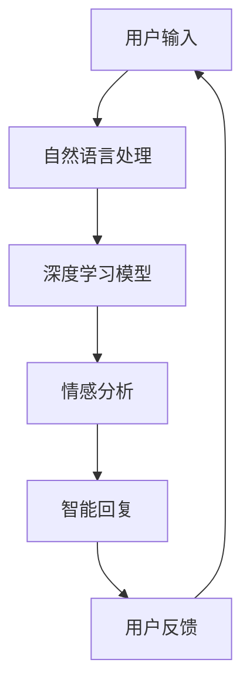

在上图中，用户输入通过自然语言处理模块传递给深度学习模型，模型进行情感分析和智能回复，最终生成用户反馈，形成一个闭环系统。

## 第2章：深度学习在自动问答系统中的应用

### 2.1 自动问答系统概述

自动问答系统（Automatic Question Answering System，AQAS）是一种能够自动理解和回答用户问题的技术系统。它广泛应用于各种场景，如智能客服、搜索引擎、智能音箱等。自动问答系统的核心任务是从大量数据中提取出与用户问题相关的信息，并生成准确的回答。

自动问答系统的工作流程通常包括以下几个步骤：

1. **用户输入处理**：接收用户输入的问题，并将其转换为机器可处理的格式。
2. **信息检索**：从数据库或知识库中检索与用户问题相关的信息。
3. **语义理解**：对用户问题和检索到的信息进行语义分析，理解问题的意图和关键信息。
4. **回答生成**：根据语义理解的结果，生成符合用户需求的回答。

### 2.2 机器学习在自动问答中的应用

早期的自动问答系统主要依赖于基于规则的匹配方法，这种方法简单直观，但灵活性较低，难以处理复杂的用户问题和多样化的回答场景。随着机器学习技术的发展，自动问答系统开始引入机器学习算法，尤其是深度学习算法，以实现更高的灵活性和准确性。

机器学习在自动问答系统中的应用主要包括以下几个方面：

1. **文本分类**：用于对用户问题进行分类，确定问题类型，从而选择合适的回答模板。
2. **实体识别**：识别用户问题中的关键实体，如人名、地名、组织名等，为后续的语义理解提供支持。
3. **关系抽取**：分析用户问题和答案中的关系，理解问题的上下文，提高回答的准确性。
4. **语义匹配**：将用户问题和候选答案进行语义匹配，找到最佳匹配答案。

常见的机器学习算法包括：

- **朴素贝叶斯分类器**：用于文本分类任务，具有较高的准确性和效率。
- **支持向量机（SVM）**：用于文本分类和回归任务，具有较好的泛化能力。
- **决策树**：用于分类和回归任务，易于理解和解释。
- **随机森林**：结合了决策树和随机性，提高了模型的泛化能力和准确性。

### 2.3 深度学习在自动问答系统中的具体应用

深度学习在自动问答系统中的应用，使得系统能够更加精准地理解和回答用户问题。以下是深度学习在自动问答系统中的具体应用：

1. **卷积神经网络（CNN）**：
   - **文本分类**：CNN可以用于对用户问题进行分类，通过文本的卷积操作提取特征，实现对问题的精细分类。
   - **命名实体识别**：通过卷积神经网络，可以有效地识别文本中的命名实体，如人名、地名等，为语义理解提供支持。

2. **循环神经网络（RNN）**：
   - **序列建模**：RNN适用于处理序列数据，如用户问题和答案序列，可以捕捉到序列中的长距离依赖关系。
   - **情感分析**：通过RNN模型，可以分析用户问题的情感倾向，为情感分析提供基础。

3. **长短时记忆网络（LSTM）**：
   - **长序列处理**：LSTM是RNN的一种变体，能够解决传统RNN在处理长序列时出现的梯度消失和梯度爆炸问题。
   - **上下文理解**：LSTM通过记忆单元，可以更好地捕捉用户问题的上下文信息，提高回答的准确性。

4. **生成对抗网络（GAN）**：
   - **回答生成**：GAN可以通过对抗训练，生成更加自然和准确的回答，提高系统的回答质量。

### 2.4 自动问答系统案例解析

以下是一个自动问答系统的实际应用案例：

**案例：智能客服系统**

某企业开发了一套智能客服系统，用于回答用户关于产品和服务的问题。系统采用了深度学习技术，主要包括以下几个模块：

1. **用户输入处理**：系统首先对用户输入的问题进行预处理，包括去除无关字符、分词和词性标注等，将问题转换为机器可处理的格式。
2. **信息检索**：系统从知识库中检索与用户问题相关的信息，包括产品规格、使用方法、常见问题等。
3. **语义理解**：系统使用LSTM模型对用户问题和检索到的信息进行语义分析，理解问题的意图和关键信息。
4. **回答生成**：根据语义理解的结果，系统使用生成对抗网络（GAN）生成回答，确保回答的自然性和准确性。
5. **用户反馈**：系统记录用户的反馈，用于后续的训练和优化，提高回答的质量。

通过这套智能客服系统，企业不仅提高了客服效率，还降低了人力成本，提升了用户满意度。

### 图2-1：深度学习模型在自动问答系统中的应用流程图

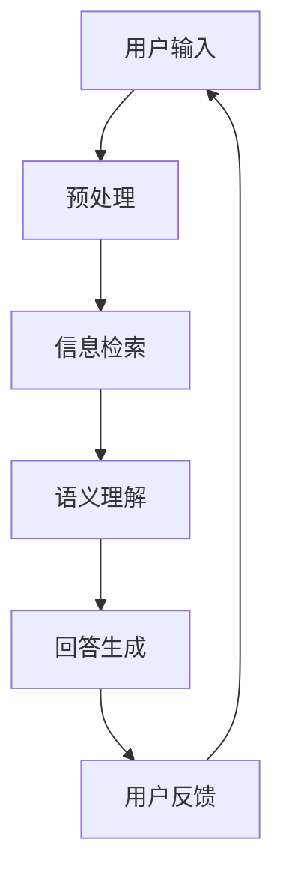

在上图中，用户输入经过预处理后，通过信息检索、语义理解和回答生成模块，最终生成用户反馈，形成一个闭环系统。

## 第3章：深度学习在情感分析中的应用

### 3.1 情感分析的基本概念

情感分析（Sentiment Analysis）是一种自然语言处理技术，用于识别文本中的情感倾向。它旨在判断文本是积极的、消极的还是中性的，通常用于社交网络分析、市场调研、情感监测等领域。

情感分析的主要任务包括：

1. **情感分类**：将文本分类为积极、消极或中性。
2. **情感极性**：对文本的情感强度进行量化，如非常积极、积极、中性、消极或非常消极。
3. **情感主题**：识别文本中的主要情感主题。

情感分析的应用场景非常广泛，如：

- **社交媒体监测**：分析用户在社交媒体上的情感倾向，了解公众对某个事件或产品的看法。
- **市场调研**：通过分析消费者评论和反馈，了解市场趋势和消费者需求。
- **客服分析**：分析用户与客服的交互记录，了解用户满意度和改进方向。
- **舆情监测**：实时监测公众对某个事件或话题的情感变化，为政策制定提供依据。

### 3.2 传统情感分析方法

早期的情感分析方法主要依赖于规则和统计方法。以下是一些常见的传统情感分析方法：

1. **基于规则的方法**：通过编写规则，对文本进行情感分类。这种方法简单直观，但灵活性较低，难以处理复杂的情感表达。
2. **基于统计的方法**：使用统计模型，如朴素贝叶斯、支持向量机等，对文本进行情感分类。这种方法具有较高的准确性和效率，但依赖于大量的标注数据。
3. **基于词典的方法**：使用情感词典，对文本中的词语进行情感标注，然后通过组合和匹配规则，得出整个文本的情感倾向。

### 3.3 深度学习在情感分析中的应用

随着深度学习技术的发展，情感分析技术也得到了显著提升。深度学习在情感分析中的应用主要体现在以下几个方面：

1. **词嵌入技术**：词嵌入是将词汇映射到高维空间中的向量表示，通过捕捉词语之间的语义关系，提高情感分析的准确性。常见的词嵌入技术包括Word2Vec、GloVe等。

2. **循环神经网络（RNN）**：RNN适用于处理序列数据，可以捕捉到文本中的长距离依赖关系，从而提高情感分析的精度。RNN的变体LSTM和GRU也在情感分析中得到了广泛应用。

3. **卷积神经网络（CNN）**：CNN在文本情感分析中，通过局部特征提取和组合，可以有效地捕捉到文本中的情感信息。尤其是在处理短文本时，CNN表现出色。

4. **双向长短期记忆网络（Bi-LSTM）**：Bi-LSTM结合了LSTM的优点，能够同时考虑文本的前后信息，提高情感分析的准确性。

5. **注意力机制**：注意力机制可以关注文本中的关键信息，提高情感分析的效果。在情感分析中，注意力机制可以用于捕捉文本中的情感关键词和情感强度。

6. **生成对抗网络（GAN）**：GAN可以通过对抗训练，生成更加真实和丰富的情感分析数据，从而提高模型的泛化能力和准确性。

### 3.4 情感分析案例解析

以下是一个情感分析的实际应用案例：

**案例：社交媒体情感分析**

某公司开发了一套社交媒体情感分析系统，用于分析用户在社交媒体上的情感倾向。系统采用了深度学习技术，主要包括以下几个模块：

1. **数据预处理**：对用户发布的文本进行清洗和预处理，包括去除无关字符、分词、词性标注等，将文本转换为机器可处理的格式。
2. **词嵌入**：使用GloVe技术，将文本中的词汇映射到高维空间中的向量表示。
3. **情感分类模型**：采用Bi-LSTM模型，对预处理后的文本进行情感分类。模型训练过程中，使用了大量标注的数据集。
4. **情感极性分析**：通过注意力机制，对文本的情感强度进行量化，生成情感极性分析报告。
5. **实时监测与反馈**：系统实时监测社交媒体上的文本，分析情感变化，并将结果反馈给用户。

通过这套系统，公司可以实时了解用户对其产品或服务的情感倾向，及时调整市场策略，提高用户满意度。

### 图3-1：深度学习模型在情感分析中的应用架构图

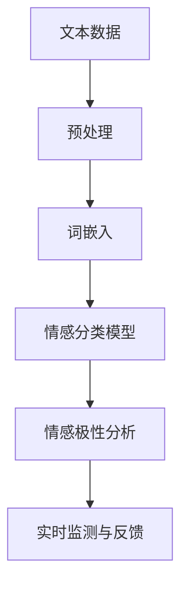

在上图中，文本数据经过预处理、词嵌入和情感分类模型后，生成情感极性分析报告，并进行实时监测和反馈。

## 第4章：智能客服系统的设计与实现

### 4.1 智能客服系统的架构设计

智能客服系统是一个复杂的应用系统，需要综合考虑用户交互、数据处理、系统性能等多个方面。一个典型的智能客服系统架构可以分为以下几个层次：

1. **用户交互层**：负责接收用户的输入，并显示系统的回复。这一层通常包括前端界面、聊天窗口等。
2. **自然语言处理层**：对用户输入的文本进行处理，包括分词、词性标注、句法分析等，以便更好地理解和分析用户的意图。
3. **知识库层**：存储系统所需的知识和规则，包括FAQ、产品规格、服务流程等。知识库是智能客服系统提供答案和解决方案的重要基础。
4. **算法模型层**：包括深度学习模型、机器学习模型等，用于实现自动问答、情感分析、个性化推荐等功能。
5. **后台服务层**：提供系统所需的后台服务，如用户管理、日志记录、数据备份等。
6. **数据存储层**：存储系统运行过程中产生的数据，包括用户交互数据、模型训练数据、日志数据等。

### 图4-1：智能客服系统架构图

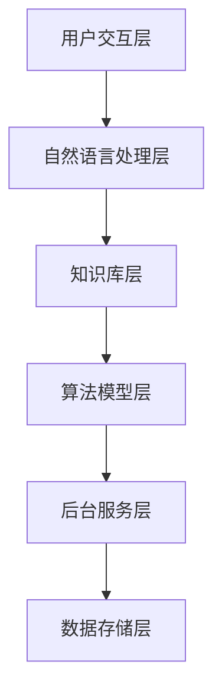

在上图中，用户交互层接收用户输入，通过自然语言处理层进行理解和分析，然后从知识库层获取答案和解决方案，通过算法模型层进行进一步的处理和优化，最终通过后台服务层进行数据的存储和管理。

### 4.2 数据预处理与特征提取

在智能客服系统中，数据预处理和特征提取是关键步骤，直接影响模型的性能和效果。以下是数据预处理和特征提取的主要步骤：

1. **文本清洗**：去除文本中的噪声和无关信息，如HTML标签、特殊符号、停用词等。
2. **分词**：将文本拆分为一个个词汇单元，便于后续处理。
3. **词性标注**：对每个词汇进行词性标注，如名词、动词、形容词等，有助于理解词汇的含义和功能。
4. **实体识别**：识别文本中的关键实体，如人名、地名、组织名等，为后续的情感分析和知识查询提供支持。
5. **情感分析**：对文本进行情感分析，判断文本的情感倾向，如积极、消极或中性。
6. **特征提取**：将文本转换为机器可处理的特征表示，如词嵌入、TF-IDF、词袋模型等。

### 图4-2：数据预处理与特征提取流程图

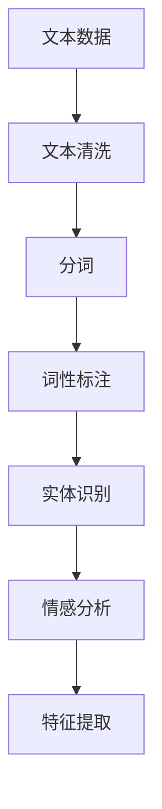

在上图中，文本数据经过清洗、分词、词性标注、实体识别和情感分析后，生成特征表示，为后续的模型训练和预测提供基础。

### 4.3 模型训练与优化

在智能客服系统中，模型的训练与优化是提高系统性能和准确性的关键步骤。以下是模型训练与优化的一般流程：

1. **数据集准备**：准备用于训练的数据集，包括用户问题和答案对、情感标注数据等。数据集需要具备一定的规模和多样性，以提高模型的泛化能力。
2. **模型选择**：选择适合任务类型的深度学习模型，如CNN、LSTM、Bi-LSTM等。模型的选择需要综合考虑数据规模、计算资源和模型性能。
3. **模型训练**：使用训练数据集对模型进行训练，通过迭代优化模型参数，提高模型的性能。训练过程中，可以使用批量归一化（Batch Normalization）、dropout等技巧，提高模型的稳定性和泛化能力。
4. **模型评估**：使用验证数据集对训练好的模型进行评估，评估指标包括准确率、召回率、F1值等。通过调整模型参数和结构，优化模型性能。
5. **模型优化**：根据评估结果，对模型进行进一步的优化，如调整学习率、增加正则化项等，以提高模型的泛化能力和鲁棒性。

### 图4-3：模型训练与优化流程图

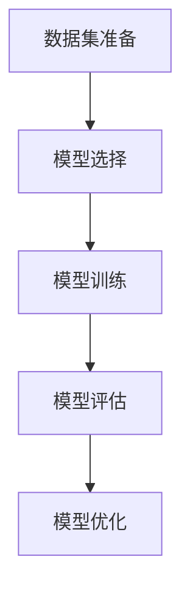

在上图中，模型训练与优化过程包括数据集准备、模型选择、模型训练、模型评估和模型优化等步骤，形成了一个闭环系统。

### 4.4 智能客服系统的部署与维护

智能客服系统的部署与维护是确保系统稳定运行和持续优化的重要环节。以下是部署与维护的主要步骤：

1. **系统部署**：将训练好的模型部署到生产环境中，包括服务器配置、部署脚本编写等。部署过程中，需要确保系统的高可用性和高性能。
2. **性能监控**：监控系统性能，包括响应时间、吞吐量、错误率等。通过监控，可以及时发现和解决系统性能瓶颈。
3. **日志记录**：记录系统运行日志，包括错误日志、性能日志等。日志记录有助于分析系统故障和优化方向。
4. **故障排除**：根据日志记录和系统监控结果，定位和解决系统故障，确保系统稳定运行。
5. **系统升级**：根据业务需求和技术发展，定期对系统进行升级和优化，包括模型升级、功能扩展等。
6. **用户反馈**：收集用户反馈，了解用户需求和体验，持续优化系统功能和性能。

### 图4-4：智能客服系统部署与维护流程图

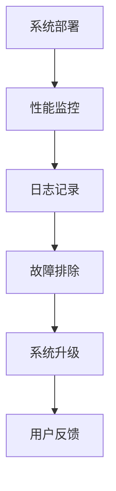

在上图中，智能客服系统的部署与维护包括系统部署、性能监控、日志记录、故障排除、系统升级和用户反馈等步骤，形成了一个闭环系统。

### 4.5 智能客服系统案例分析

以下是一个智能客服系统的实际应用案例：

**案例：某电商平台的智能客服系统**

某大型电商平台为了提升用户购物体验，开发了一套智能客服系统。系统采用了深度学习技术，主要包括以下几个模块：

1. **用户交互层**：提供聊天窗口和语音交互功能，用户可以通过文本或语音与客服系统进行交互。
2. **自然语言处理层**：对用户输入的文本进行分词、词性标注、情感分析等处理，理解用户的意图和需求。
3. **知识库层**：存储电商平台的产品信息、常见问题解答、服务流程等，为系统提供答案和解决方案。
4. **算法模型层**：采用Bi-LSTM模型进行情感分析，识别用户的情感倾向；采用CNN模型进行问答匹配，生成准确的回答。
5. **后台服务层**：提供用户管理、日志记录、数据备份等后台服务。
6. **数据存储层**：存储用户交互数据、模型训练数据、日志数据等。

通过这套智能客服系统，电商平台不仅提高了客服效率，降低了人力成本，还提升了用户满意度。同时，系统通过不断学习和优化，逐渐提高了回答的准确性和个性化程度，为用户提供更好的服务体验。

## 第二部分：深度学习技术基础

## 第5章：深度学习基础

### 5.1 深度学习的发展历程

深度学习（Deep Learning）起源于1980年代，是由多层神经网络构成的机器学习方法。其核心思想是通过逐层学习，自动提取层次化的特征表示，从而在无需人工干预的情况下，实现高度自动化的数据分析和处理。

深度学习的发展可以分为以下几个阶段：

1. **早期探索**（1980年代）：多层感知机（MLP）被提出，但由于计算能力和数据集的限制，深度学习并没有得到广泛应用。
2. **停滞期**（1990年代）：由于梯度消失和梯度爆炸等问题，多层神经网络的研究陷入停滞。
3. **复兴**（2006年）：Hinton等人提出了基于误差反向传播算法的深层网络训练方法，深度学习开始重新受到关注。
4. **突破**（2012年）：AlexNet在ImageNet竞赛中取得突破性成绩，深度学习在计算机视觉领域取得了显著进展。
5. **广泛应用**（2010年代至今）：深度学习技术逐渐应用于语音识别、自然语言处理、机器人等领域，推动了人工智能的发展。

### 5.2 神经网络基础

神经网络（Neural Network，NN）是模仿人脑结构和功能的计算模型，由大量的神经元（节点）通过边（连接）相互连接而成。神经网络通过学习输入和输出之间的映射关系，实现数据分析和预测。

#### 神经元的组成

一个神经元通常包括以下几个部分：

1. **输入**：神经元的输入可以是多个特征值。
2. **权重**：每个输入值与对应的权重相乘，权重表示输入的重要性。
3. **偏置**：用于调整神经元的输出，增强或减弱输入的影响。
4. **激活函数**：用于对输入进行非线性变换，常用的激活函数包括Sigmoid、ReLU、Tanh等。

#### 神经网络的计算过程

神经网络的计算过程可以概括为以下几个步骤：

1. **前向传播**：将输入值通过权重和偏置传递到神经元，计算神经元的输出。
2. **激活函数应用**：对每个神经元的输出应用激活函数，得到神经元的激活值。
3. **反向传播**：根据实际输出和预期输出之间的误差，通过梯度下降算法更新神经元的权重和偏置。

#### 神经网络的分类

根据网络的结构和功能，神经网络可以分为以下几种类型：

1. **前馈神经网络**：信息从前向后传播，没有反馈路径。
2. **循环神经网络（RNN）**：具有反馈路径，适用于处理序列数据。
3. **卷积神经网络（CNN）**：用于图像处理，通过卷积层提取图像特征。
4. **生成对抗网络（GAN）**：通过生成器和判别器的对抗训练，实现图像生成、语音合成等任务。
5. **长短时记忆网络（LSTM）**：是RNN的一种变体，能够解决传统RNN在处理长序列时出现的梯度消失和梯度爆炸问题。

### 5.3 深度学习框架简介

深度学习框架是用于构建和训练深度学习模型的工具集，提供了丰富的功能模块和接口，简化了深度学习开发过程。以下是一些常见的深度学习框架：

1. **TensorFlow**：由Google开发，支持多种深度学习模型和任务，具有丰富的社区和文档。
2. **PyTorch**：由Facebook开发，提供了灵活的动态计算图，适合研究和快速原型开发。
3. **Keras**：是一个高层次的深度学习框架，兼容TensorFlow和Theano，易于使用。
4. **Caffe**：由Berkeley Vision and Learning Center（BVLC）开发，主要用于计算机视觉任务。
5. **MXNet**：由Apache Software Foundation维护，支持多种编程语言，适合大规模分布式训练。

这些框架为深度学习提供了强大的支持，使得开发者可以专注于模型设计和优化，而无需关注底层实现细节。

## 第6章：自然语言处理基础

### 6.1 自然语言处理的基本概念

自然语言处理（Natural Language Processing，NLP）是计算机科学和人工智能领域的一个重要分支，旨在使计算机能够理解、生成和处理自然语言。自然语言处理的核心任务是让计算机能够与人类进行有效的沟通，从而实现人机交互。

自然语言处理的主要任务包括：

1. **文本分析**：对文本进行分词、词性标注、句法分析等，理解文本的结构和语义。
2. **语音识别**：将语音信号转换为文本，使计算机能够理解和处理语音输入。
3. **机器翻译**：将一种语言的文本翻译成另一种语言，实现跨语言的交流。
4. **文本生成**：根据输入的指令或模板，生成符合语法和语义的文本。
5. **情感分析**：分析文本的情感倾向，判断文本是积极的、消极的还是中性的。

### 6.2 词嵌入技术

词嵌入（Word Embedding）是将词汇映射到高维空间中的向量表示，从而捕捉词语之间的语义关系。词嵌入技术是自然语言处理中的重要工具，广泛应用于文本分类、情感分析、机器翻译等任务。

常见的词嵌入技术包括：

1. **Word2Vec**：基于神经网络的词嵌入方法，通过训练词向量的相似性模型，实现词语的向量表示。
2. **GloVe**：全局向量表示（Global Vectors for Word Representation），通过矩阵分解的方法，实现词语的向量表示。
3. **BERT**：双向编码表示（Bidirectional Encoder Representations from Transformers），通过Transformer模型，实现词语的上下文敏感向量表示。

### 6.3 序列模型与注意力机制

序列模型（Sequence Model）是自然语言处理中的重要工具，用于处理序列数据，如文本、语音等。常见的序列模型包括：

1. **循环神经网络（RNN）**：通过循环结构，处理序列中的每个元素，捕捉序列中的长期依赖关系。
2. **长短时记忆网络（LSTM）**：是RNN的一种变体，通过记忆单元，解决传统RNN在处理长序列时出现的梯度消失和梯度爆炸问题。
3. **门控循环单元（GRU）**：是LSTM的简化版，通过门控结构，实现更高效的信息传递。

注意力机制（Attention Mechanism）是近年来在自然语言处理中广泛应用的一种技术，用于提高模型对关键信息的关注程度。注意力机制可以通过计算不同输入元素的权重，实现信息的多维度融合，从而提高模型的性能。

### 6.4 自然语言处理的应用场景

自然语言处理技术广泛应用于各种应用场景，如下：

1. **自动问答系统**：通过自然语言处理技术，实现自动理解和回答用户的问题。
2. **情感分析**：分析文本的情感倾向，为市场调研、产品评价等提供支持。
3. **机器翻译**：将一种语言的文本翻译成另一种语言，实现跨语言的交流。
4. **文本分类**：对文本进行分类，如新闻分类、情感分类等。
5. **语音识别**：将语音信号转换为文本，实现语音输入到计算机的转换。

### 6.5 自然语言处理的发展趋势

随着深度学习技术的不断发展，自然语言处理也在不断进步。未来的发展趋势包括：

1. **多模态交互**：结合图像、语音、文本等多种数据类型，实现更加自然和丰富的交互体验。
2. **上下文理解**：通过上下文信息，实现更加精准和智能的文本分析。
3. **个性化服务**：根据用户的历史数据和反馈，提供更加个性化的文本处理服务。
4. **开放域问答**：通过大规模的知识图谱和预训练模型，实现开放域问答系统的智能化。
5. **实时处理**：通过边缘计算和分布式计算，实现自然语言处理技术在实时场景中的高效应用。

## 第7章：深度学习模型与算法

### 7.1 卷积神经网络（CNN）在NLP中的应用

卷积神经网络（Convolutional Neural Network，CNN）是深度学习中用于图像处理的一种主要模型，其核心思想是通过卷积操作提取图像特征。近年来，CNN在自然语言处理（NLP）领域也得到了广泛应用，尤其在文本分类、情感分析等任务中表现出色。

#### CNN在NLP中的优势

1. **并行计算**：CNN通过局部卷积操作，可以并行处理文本中的每个单词或字符，提高计算效率。
2. **层次化特征提取**：CNN通过多个卷积层，逐层提取文本的层次化特征，从而实现对复杂语义的理解。
3. **自适应特征提取**：CNN可以自动学习文本的特征表示，无需人工设计特征。

#### CNN在NLP中的具体应用

1. **文本分类**：CNN可以用于对文本进行分类，例如新闻分类、情感分类等。通过将文本表示为向量形式，输入到CNN中，可以提取文本的语义特征，然后通过分类层进行分类。
2. **命名实体识别**：CNN可以用于识别文本中的命名实体，如人名、地名、组织名等。通过训练多个卷积层，可以提取不同层次的特征，从而实现命名实体识别。
3. **情感分析**：CNN可以用于分析文本的情感倾向，通过训练多个卷积层，可以提取文本的语义特征，然后通过分类层判断文本的情感极性。

#### CNN的架构

一个典型的CNN模型包括以下几个部分：

1. **输入层**：输入层接收文本的词嵌入表示。
2. **卷积层**：卷积层通过卷积操作提取文本特征，常用的卷积核大小有1x1、3x3、5x5等。
3. **池化层**：池化层用于降低数据的维度，常用的池化方法有最大池化和平均池化。
4. **全连接层**：全连接层将卷积层和池化层提取的特征进行整合，然后通过激活函数进行非线性变换。
5. **输出层**：输出层用于生成最终的分类结果。

#### CNN的算法原理

CNN的算法原理主要包括以下几个步骤：

1. **前向传播**：将文本的词嵌入表示输入到CNN中，通过卷积层和池化层提取特征，然后通过全连接层进行分类。
2. **反向传播**：根据分类结果和实际标签，通过反向传播算法更新模型参数，优化模型性能。

### 图7-1：CNN在NLP中的应用架构图

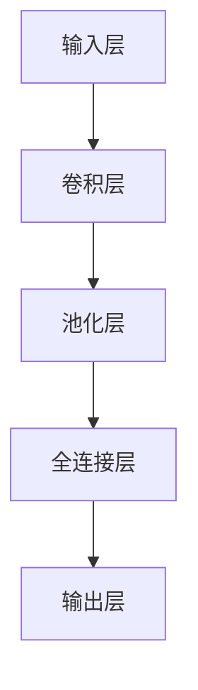

在上图中，文本通过输入层输入到CNN中，经过卷积层、池化层和全连接层后，生成分类结果。

### 7.2 循环神经网络（RNN）与长短时记忆网络（LSTM）

循环神经网络（Recurrent Neural Network，RNN）是一种能够处理序列数据的神经网络模型，其核心思想是通过循环结构，将前一个时间步的输出作为当前时间步的输入。RNN通过这种方式，可以捕获序列中的长期依赖关系。

然而，传统的RNN存在一些问题，如梯度消失和梯度爆炸，这使得RNN在处理长序列时性能不佳。为了解决这些问题，提出了长短时记忆网络（Long Short-Term Memory，LSTM）。

#### LSTM的基本原理

LSTM是一种特殊的RNN，通过引入记忆单元（Cell State）和三个门（输入门、输出门、遗忘门），有效地解决了传统RNN在处理长序列时的问题。

1. **输入门**：控制当前输入信息对记忆单元的影响程度。
2. **遗忘门**：决定哪些信息应该从记忆单元中遗忘。
3. **输出门**：控制记忆单元的输出，决定哪些信息应该传递到下一个时间步。

#### LSTM的结构

一个典型的LSTM模型包括以下几个部分：

1. **输入层**：输入层接收序列数据，通常为词嵌入表示。
2. **记忆单元**：记忆单元是LSTM的核心部分，用于存储和传递信息。
3. **门结构**：包括输入门、遗忘门、输出门，用于控制信息的传递和遗忘。
4. **输出层**：输出层将记忆单元的输出进行变换，生成最终的输出结果。

#### LSTM的训练过程

LSTM的训练过程主要包括以下几个步骤：

1. **前向传播**：将序列数据输入到LSTM中，通过门结构控制信息的传递和遗忘，得到记忆单元的输出。
2. **计算损失**：根据实际输出和预期输出之间的误差，计算损失函数。
3. **反向传播**：通过反向传播算法，更新LSTM的权重和门参数，优化模型性能。

### 图7-2：LSTM的基本结构图

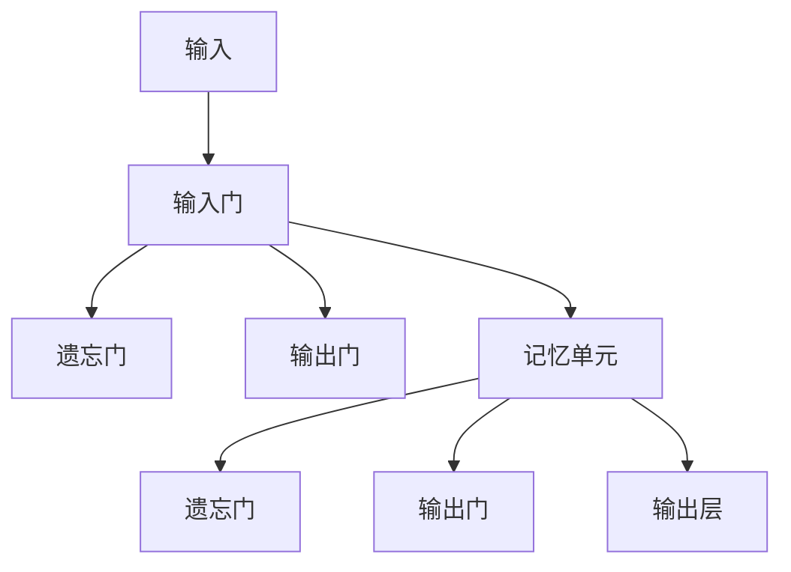

在上图中，输入数据通过输入门、遗忘门、输出门和记忆单元，最终生成输出结果。

### 7.3 生成对抗网络（GAN）与深度强化学习（DRL）

生成对抗网络（Generative Adversarial Network，GAN）是一种由生成器和判别器组成的对抗性训练模型。其核心思想是通过生成器和判别器的对抗训练，生成逼真的数据。

#### GAN的基本原理

GAN由生成器（Generator）和判别器（Discriminator）组成，两者通过对抗训练相互提高。生成器的目标是生成逼真的数据，判别器的目标是区分生成的数据和真实数据。

1. **生成器**：生成器从随机噪声中生成数据，试图使这些数据难以被判别器区分。
2. **判别器**：判别器的目标是判断输入的数据是真实数据还是生成器生成的数据。

GAN的训练过程主要包括以下几个步骤：

1. **生成器生成数据**：生成器从随机噪声中生成数据。
2. **判别器判断数据**：判别器判断生成的数据和真实数据的真实性。
3. **生成器和判别器更新**：根据判别器的判断结果，生成器和判别器通过反向传播算法更新权重，生成器和判别器的性能相互提高。

#### GAN的应用

GAN在计算机视觉、自然语言处理、语音合成等领域有广泛的应用，如下：

1. **图像生成**：GAN可以生成逼真的图像，如人脸生成、风景生成等。
2. **图像修复**：GAN可以用于图像修复，如去除图像中的污点、修复破损的图像等。
3. **图像超分辨率**：GAN可以用于图像超分辨率，提高图像的分辨率。
4. **语音合成**：GAN可以用于语音合成，生成逼真的语音。

#### 深度强化学习（DRL）

深度强化学习（Deep Reinforcement Learning，DRL）是结合了深度学习和强化学习的一种方法。其核心思想是通过深度神经网络学习状态值函数或策略，实现智能体的决策。

1. **状态值函数**：状态值函数用于评估当前状态的价值，指导智能体的决策。
2. **策略**：策略用于生成动作，指导智能体的行为。

DRL的训练过程主要包括以下几个步骤：

1. **初始化**：初始化智能体、环境、状态值函数或策略。
2. **智能体探索**：智能体在环境中进行探索，积累经验。
3. **经验回放**：将智能体在环境中探索到的经验进行回放，用于更新状态值函数或策略。
4. **状态值函数或策略更新**：根据经验回放，更新状态值函数或策略。

DRL在游戏、机器人、推荐系统等领域有广泛的应用。

### 图7-3：GAN的基本结构图

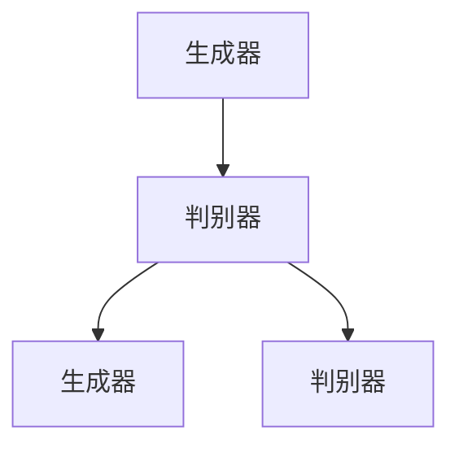

在上图中，生成器和判别器通过对抗训练，生成逼真的数据，提高彼此的性能。

## 第8章：深度学习在情感分析中的应用实践

### 8.1 情感分析任务定义与数据集准备

情感分析（Sentiment Analysis）是一种评估文本情感倾向的技术，通常分为积极、消极和 neutral三个类别。在深度学习框架下，情感分析任务可以定义为分类问题，即将给定的文本分类到三个预定义的情感类别之一。

#### 任务定义

情感分析的输入是一个文本句子或段落，输出是该文本的情感标签。一个简单的情感分析任务定义如下：

```python
def sentiment_analysis(text):
    # 文本预处理
    processed_text = preprocess_text(text)
    
    # 使用深度学习模型预测情感
    prediction = model.predict(processed_text)
    
    # 返回预测结果
    return prediction
```

其中，`preprocess_text`是一个预处理函数，用于处理原始文本，例如分词、去除停用词等。`model`是一个经过训练的深度学习模型，用于预测文本的情感。

#### 数据集准备

为了训练深度学习模型，需要准备一个包含情感标签的文本数据集。以下是一个简单的数据集准备流程：

1. **数据收集**：收集包含情感标签的文本数据，如社交媒体评论、产品评价等。
2. **数据预处理**：对收集到的文本数据进行预处理，包括去除HTML标签、标点符号、停用词等。
3. **数据标注**：对预处理后的文本进行情感标注，标注为积极、消极或 neutral。
4. **数据划分**：将数据集划分为训练集、验证集和测试集，通常比例为60%、20%和20%。

以下是一个简单的数据集划分示例：

```python
from sklearn.model_selection import train_test_split

# 假设 dataset 是一个包含文本和情感标签的数据集
X = dataset['text']
y = dataset['sentiment']

# 划分训练集和测试集
X_train, X_test, y_train, y_test = train_test_split(X, y, test_size=0.2, random_state=42)
```

#### 常用情感分析数据集

- **IMDB 数据集**：包含电影评论，标注为积极或消极。
- **Twitter 数据集**：包含Twitter上的用户评论，标注为积极、消极或 neutral。
- **Amazon 数据集**：包含亚马逊产品评论，标注为1星到5星。

### 8.2 模型选择与训练策略

在情感分析任务中，选择合适的深度学习模型和训练策略对于提高模型性能至关重要。以下是一些常用的模型和训练策略：

#### 模型选择

1. **卷积神经网络（CNN）**：CNN擅长处理序列数据，通过卷积操作提取文本特征，适合处理短文本情感分析任务。
2. **循环神经网络（RNN）**：RNN适用于处理长序列数据，通过循环结构捕捉文本中的长期依赖关系。
3. **长短时记忆网络（LSTM）**：LSTM是RNN的一种变体，通过引入门控单元，解决了传统RNN的梯度消失问题。
4. **双向长短时记忆网络（Bi-LSTM）**：Bi-LSTM结合了LSTM的优点，同时考虑文本的前后信息，提高了情感分析的精度。

#### 训练策略

1. **数据增强**：通过随机替换词汇、添加噪声等方式，增加训练数据的多样性，提高模型的泛化能力。
2. **正则化**：使用正则化技术，如L1、L2正则化，防止模型过拟合。
3. **Dropout**：在训练过程中，随机丢弃一部分神经元，防止模型过拟合。
4. **学习率调度**：使用学习率调度策略，如逐步减小学习率，防止模型在训练过程中过早收敛。

以下是一个简单的模型训练策略示例：

```python
from keras.models import Sequential
from keras.layers import Embedding, LSTM, Dense, Dropout

# 构建模型
model = Sequential()
model.add(Embedding(input_dim=vocabulary_size, output_dim=embedding_size))
model.add(LSTM(units=128, return_sequences=True))
model.add(Dropout(0.5))
model.add(LSTM(units=128))
model.add(Dropout(0.5))
model.add(Dense(units=num_classes, activation='softmax'))

# 编译模型
model.compile(optimizer='adam', loss='categorical_crossentropy', metrics=['accuracy'])

# 训练模型
model.fit(X_train, y_train, batch_size=64, epochs=10, validation_split=0.2)
```

### 8.3 模型评估与优化

在情感分析任务中，评估模型的性能至关重要。常用的评估指标包括准确率、召回率、F1值等。

#### 模型评估

使用验证集对模型进行评估，计算模型的准确率、召回率和F1值：

```python
from sklearn.metrics import accuracy_score, recall_score, f1_score

# 预测验证集
y_pred = model.predict(X_val)

# 计算评估指标
accuracy = accuracy_score(y_val, y_pred)
recall = recall_score(y_val, y_pred, average='weighted')
f1 = f1_score(y_val, y_pred, average='weighted')

print("Accuracy:", accuracy)
print("Recall:", recall)
print("F1 Score:", f1)
```

#### 模型优化

根据评估结果，对模型进行优化：

1. **调整模型参数**：如改变LSTM层的大小、学习率等。
2. **增加数据增强**：通过数据增强提高模型的泛化能力。
3. **增加训练时间**：增加训练时间，提高模型的收敛速度。
4. **调整正则化强度**：增加或减少Dropout比例、正则化强度等。

### 8.4 情感分析项目实战

以下是一个情感分析项目的实战案例：

**项目目标**：对社交媒体上的用户评论进行情感分析，判断评论是积极、消极还是 neutral。

**项目步骤**：

1. **数据收集**：收集社交媒体上的用户评论，如Twitter、Instagram等。
2. **数据预处理**：对评论进行预处理，包括去除HTML标签、标点符号、停用词等。
3. **数据标注**：对预处理后的评论进行情感标注，标注为积极、消极或 neutral。
4. **模型训练**：使用LSTM模型进行训练，训练过程中使用数据增强和Dropout技术。
5. **模型评估**：使用验证集对模型进行评估，计算准确率、召回率和F1值。
6. **模型部署**：将训练好的模型部署到生产环境中，实现实时情感分析。

通过以上步骤，可以构建一个简单的情感分析系统，对社交媒体上的用户评论进行情感分析，为企业提供有价值的市场洞察。

### 图8-1：情感分析项目实战流程图

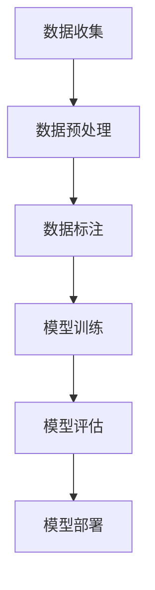

在上图中，情感分析项目实战包括数据收集、数据预处理、数据标注、模型训练、模型评估和模型部署等步骤，形成了一个闭环系统。

## 第9章：智能客服系统开发实战

### 9.1 开发工具与框架选择

在开发智能客服系统时，选择合适的工具和框架至关重要。以下是一些常见的开发工具和框架，以及它们的特点和适用场景：

1. **TensorFlow**：TensorFlow是一个开源的深度学习框架，由Google开发。它支持多种深度学习模型和任务，具有丰富的社区和文档。适用于开发大规模的智能客服系统。

2. **PyTorch**：PyTorch是一个开源的深度学习框架，由Facebook开发。它提供了灵活的动态计算图，适合研究和快速原型开发。适用于开发中小规模的智能客服系统。

3. **Keras**：Keras是一个高层次的深度学习框架，兼容TensorFlow和Theano，提供了简洁的API，易于使用。适用于快速开发和实验。

4. **NLTK**：NLTK是一个开源的自然语言处理工具包，提供了丰富的自然语言处理函数和库。适用于进行文本预处理、分词、词性标注等任务。

5. **spaCy**：spaCy是一个快速且易于使用的自然语言处理库，适用于进行文本预处理、实体识别、句法分析等任务。适用于开发实时智能客服系统。

6. **Rasa**：Rasa是一个开源的对话管理平台，适用于构建对话式人工智能应用，如智能客服、聊天机器人等。它提供了完整的对话系统开发框架，包括意图识别、实体提取、对话策略等。

### 9.2 环境配置与调试

在开发智能客服系统之前，需要进行环境配置和调试，以确保开发环境正常运行。以下是一个简单的环境配置和调试步骤：

1. **安装Python**：确保安装了Python 3.x版本，建议使用Anaconda，它是一个集成的Python环境，方便管理依赖库。

2. **安装深度学习框架**：根据项目需求，安装TensorFlow、PyTorch、Keras等深度学习框架。可以使用pip命令进行安装：

   ```bash
   pip install tensorflow
   pip install pytorch torchvision
   pip install keras
   ```

3. **安装自然语言处理库**：安装NLTK、spaCy等自然语言处理库。可以使用pip命令进行安装：

   ```bash
   pip install nltk
   pip install spacy
   ```

4. **安装Rasa**：如果使用Rasa开发智能客服系统，需要安装Rasa。可以使用pip命令进行安装：

   ```bash
   pip install rasa
   ```

5. **环境调试**：在开发环境中运行一些测试代码，确保所有依赖库安装成功且正常工作。例如，运行以下代码测试spaCy库：

   ```python
   import spacy
   nlp = spacy.load('en_core_web_sm')
   doc = nlp('Hello, world!')
   print(doc.text)
   ```

### 9.3 数据处理工具介绍

在智能客服系统开发中，数据处理是关键步骤。以下是一些常用的数据处理工具和库：

1. **Pandas**：Pandas是一个强大的数据操作库，适用于数据清洗、转换和分析。它提供了丰富的数据结构（DataFrame），方便进行数据操作。

2. **NumPy**：NumPy是一个开源的数学库，提供了多维数组对象和一系列的数学函数，适用于数值计算。

3. **Scikit-learn**：Scikit-learn是一个开源的机器学习库，提供了丰富的机器学习算法和工具，适用于特征提取、模型评估等任务。

4. **spaCy**：spaCy是一个快速的NLP库，提供了丰富的NLP功能，如分词、词性标注、句法分析等。

5. **NLTK**：NLTK是一个经典的NLP库，提供了丰富的NLP工具和资源，适用于文本预处理、分词、词性标注等任务。

以下是一个简单的数据处理示例：

```python
import pandas as pd
import numpy as np
from sklearn.model_selection import train_test_split

# 加载数据
data = pd.read_csv('data.csv')
X = data[['text']]
y = data['sentiment']

# 数据预处理
X = X.apply(lambda x: preprocess_text(x))

# 数据分割
X_train, X_test, y_train, y_test = train_test_split(X, y, test_size=0.2, random_state=42)
```

在上面的示例中，我们使用Pandas加载数据，使用NumPy进行数据预处理，然后使用Scikit-learn进行数据分割。

### 9.4 智能客服自动问答系统开发

智能客服自动问答系统是智能客服系统的重要组成部分，它能够自动理解和回答用户的问题，提高客服效率。以下是一个简单的自动问答系统开发流程：

1. **需求分析**：确定自动问答系统的功能需求和性能指标，如问答准确性、响应时间等。

2. **数据收集**：收集用户问题和答案数据，用于训练问答模型。

3. **数据预处理**：对用户问题进行预处理，包括分词、去除停用词、词性标注等。

4. **模型训练**：使用深度学习模型（如BERT、GPT等）进行训练，将用户问题映射到答案。

5. **模型评估**：使用验证集对模型进行评估，调整模型参数，提高问答准确性。

6. **模型部署**：将训练好的模型部署到生产环境中，实现实时问答。

7. **系统优化**：根据用户反馈和系统运行数据，持续优化问答系统，提高用户体验。

以下是一个简单的自动问答系统示例：

```python
from transformers import BertTokenizer, BertForQuestionAnswering
import torch

# 加载预训练模型
tokenizer = BertTokenizer.from_pretrained('bert-base-uncased')
model = BertForQuestionAnswering.from_pretrained('bert-base-uncased')

# 处理用户输入
question = "What is the capital of France?"
input_ids = tokenizer.encode(question, add_special_tokens=True, return_tensors='pt')

# 预测答案
with torch.no_grad():
    outputs = model(input_ids)

# 解析答案
answer_start_scores = outputs.start_logits
answer_end_scores = outputs.end_logits
answer_start = torch.argmax(answer_start_scores)
answer_end = torch.argmax(answer_end_scores)

# 提取答案
answer_span = tokenizer.convert_ids_to_tokens(input_ids[0][answer_start:answer_end+1])
answer = ' '.join(answer_span)

print(answer)
```

在上面的示例中，我们使用Hugging Face的Transformer库加载预训练的BERT模型，处理用户输入，预测答案，并提取答案。

### 9.5 智能客服情感分析系统开发

智能客服情感分析系统用于分析用户反馈的情感倾向，为客服提供个性化的服务。以下是一个简单的情感分析系统开发流程：

1. **需求分析**：确定情感分析系统的功能需求和性能指标，如情感分类准确性、响应时间等。

2. **数据收集**：收集用户反馈数据，用于训练情感分析模型。

3. **数据预处理**：对用户反馈进行预处理，包括分词、去除停用词、词性标注等。

4. **模型训练**：使用深度学习模型（如CNN、LSTM等）进行训练，将用户反馈映射到情感标签。

5. **模型评估**：使用验证集对模型进行评估，调整模型参数，提高情感分类准确性。

6. **模型部署**：将训练好的模型部署到生产环境中，实现实时情感分析。

7. **系统优化**：根据用户反馈和系统运行数据，持续优化情感分析系统，提高用户体验。

以下是一个简单的情感分析系统示例：

```python
import torch
from torch import nn
import torch.optim as optim
from transformers import BertTokenizer, BertModel

# 加载预训练模型
tokenizer = BertTokenizer.from_pretrained('bert-base-uncased')
bert_model = BertModel.from_pretrained('bert-base-uncased')

# 定义情感分析模型
class SentimentAnalysisModel(nn.Module):
    def __init__(self):
        super(SentimentAnalysisModel, self).__init__()
        self.bert = BertModel.from_pretrained('bert-base-uncased')
        self.classifier = nn.Linear(768, 1)

    def forward(self, input_ids, attention_mask):
        outputs = self.bert(input_ids=input_ids, attention_mask=attention_mask)
        pooled_output = outputs.pooler_output
        logits = self.classifier(pooled_output)
        return logits

# 实例化模型
model = SentimentAnalysisModel()

# 训练模型
optimizer = optim.Adam(model.parameters(), lr=1e-5)
criterion = nn.BCEWithLogitsLoss()

for epoch in range(num_epochs):
    for input_ids, attention_mask, labels in dataloader:
        optimizer.zero_grad()
        logits = model(input_ids, attention_mask)
        loss = criterion(logits, labels.float())
        loss.backward()
        optimizer.step()

# 评估模型
with torch.no_grad():
    correct = 0
    total = 0
    for input_ids, attention_mask, labels in test_dataloader:
        logits = model(input_ids, attention_mask)
        predictions = logits.round()
        total += labels.size(0)
        correct += (predictions == labels).sum().item()

accuracy = 100 * correct / total
print(f'Accuracy: {accuracy:.2f}%')
```

在上面的示例中，我们使用Hugging Face的Transformer库加载预训练的BERT模型，定义情感分析模型，并使用BCEWithLogitsLoss进行训练和评估。

### 9.6 系统测试与优化

在智能客服系统开发完成后，需要进行系统测试和优化，以确保系统正常运行并满足性能要求。以下是一些常见的测试和优化方法：

1. **功能测试**：验证系统的各项功能是否正常运行，如自动问答、情感分析、个性化推荐等。

2. **性能测试**：评估系统的响应时间、吞吐量、错误率等性能指标，确保系统在高负载下仍能正常运行。

3. **稳定性测试**：测试系统在长时间运行下的稳定性，检查是否有内存泄漏、程序崩溃等问题。

4. **用户体验测试**：通过用户测试，收集用户对系统的反馈，优化系统的界面设计、交互流程等，提高用户体验。

5. **优化策略**：
   - **模型优化**：调整模型参数，提高模型的预测准确性。
   - **数据增强**：增加训练数据的多样性，提高模型的泛化能力。
   - **硬件优化**：优化服务器配置，提高系统运行效率。
   - **算法优化**：使用更高效的算法，减少计算量和内存占用。

### 9.7 智能客服自动问答系统项目案例解析

以下是一个智能客服自动问答系统的实际应用案例：

**项目背景**：某电商平台希望构建一个智能客服自动问答系统，以提升用户体验和客服效率。

**项目目标**：实现自动理解和回答用户关于商品、订单、退货等问题，提高用户满意度。

**项目步骤**：

1. **需求分析**：与业务部门沟通，确定自动问答系统的功能需求，如商品信息查询、订单状态查询、退货政策查询等。

2. **数据收集**：收集用户提问和答案数据，用于训练问答模型。

3. **数据预处理**：对用户提问进行预处理，包括分词、去除停用词、词性标注等。

4. **模型训练**：使用BERT模型进行训练，将用户提问映射到答案。

5. **模型评估**：使用验证集对模型进行评估，调整模型参数，提高问答准确性。

6. **模型部署**：将训练好的模型部署到生产环境中，实现实时问答。

7. **系统优化**：根据用户反馈和系统运行数据，持续优化问答系统，提高用户体验。

**项目效果**：通过自动问答系统的应用，用户可以快速获取所需的答案，客服响应时间显著缩短，用户满意度大幅提升。

### 图9-1：智能客服自动问答系统项目案例流程图

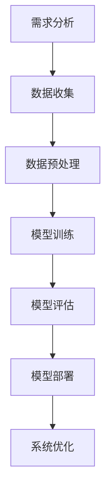

在上图中，智能客服自动问答系统项目案例包括需求分析、数据收集、数据预处理、模型训练、模型评估、模型部署和系统优化等步骤，形成了一个闭环系统。

### 9.8 智能客服情感分析系统项目案例解析

以下是一个智能客服情感分析系统的实际应用案例：

**项目背景**：某互联网公司希望构建一个智能客服情感分析系统，以了解用户对其产品和服务的情感倾向。

**项目目标**：通过分析用户反馈，了解用户的满意度和改进方向，提升用户体验。

**项目步骤**：

1. **需求分析**：与业务部门沟通，确定情感分析系统的功能需求，如分析用户评论、问卷调查等。

2. **数据收集**：收集用户反馈数据，用于训练情感分析模型。

3. **数据预处理**：对用户反馈进行预处理，包括分词、去除停用词、词性标注等。

4. **模型训练**：使用LSTM模型进行训练，将用户反馈映射到情感标签。

5. **模型评估**：使用验证集对模型进行评估，调整模型参数，提高情感分类准确性。

6. **模型部署**：将训练好的模型部署到生产环境中，实现实时情感分析。

7. **系统优化**：根据用户反馈和系统运行数据，持续优化情感分析系统，提高用户体验。

**项目效果**：通过情感分析系统的应用，公司可以实时了解用户的情感倾向，及时调整产品和服务的改进方向，提高用户满意度。

### 图9-2：智能客服情感分析系统项目案例流程图


在上图中，智能客服情感分析系统项目案例包括需求分析、数据收集、数据预处理、模型训练、模型评估、模型部署和系统优化等步骤，形成了一个闭环系统。

## 第10章：智能客服系统集成与部署

### 10.1 系统集成策略

智能客服系统的集成与部署是确保系统正常运行、高效服务用户的关键环节。系统集成策略需要考虑以下几个方面：

1. **模块化设计**：将智能客服系统划分为用户交互层、自然语言处理层、知识库层、算法模型层、后台服务层等模块，每个模块负责不同的功能，便于开发和维护。

2. **接口设计**：设计清晰的接口，确保不同模块之间的数据流通和功能调用。常见的接口设计包括API接口、消息队列等。

3. **数据一致性**：确保系统中的数据一致性，如用户信息、订单信息等。可以使用分布式数据库、缓存等技术，提高数据的一致性和可用性。

4. **安全性**：确保系统的安全性，如用户数据加密、权限控制等。可以使用SSL、防火墙等技术，防止数据泄露和网络攻击。

### 10.2 部署与运维

智能客服系统的部署与运维是系统稳定运行的关键。以下是一些常见的部署与运维策略：

1. **服务器选择**：根据系统负载和性能需求，选择合适的服务器。可以选择物理服务器、虚拟服务器、云服务器等。

2. **部署方式**：采用容器化部署（如Docker）、虚拟化部署（如KVM）等方式，提高部署的灵活性和可扩展性。

3. **自动化部署**：使用自动化工具（如Jenkins、Ansible）实现自动化部署，提高部署效率。

4. **监控与报警**：使用监控工具（如Prometheus、Zabbix）监控系统性能，如CPU、内存、磁盘等资源使用情况，及时发现问题并报警。

5. **日志管理**：使用日志管理工具（如ELK、Logstash）收集和管理系统日志，便于问题定位和性能优化。

6. **备份与恢复**：定期备份数据和配置文件，确保数据安全。在发生故障时，可以快速恢复系统。

### 10.3 故障排除与优化

在智能客服系统的运行过程中，难免会出现各种故障和性能瓶颈。以下是一些常见的故障排除和优化策略：

1. **性能瓶颈定位**：使用性能分析工具（如VisualVM、Grafana）定位系统性能瓶颈，如CPU、内存、磁盘等资源使用情况。

2. **系统调优**：根据性能分析结果，调整系统配置（如JVM参数、数据库参数等），优化系统性能。

3. **代码优化**：对系统中的代码进行优化，如减少不必要的计算、优化数据库查询等，提高系统响应速度。

4. **服务优化**：优化系统中的服务调用，如使用缓存、负载均衡等技术，提高系统的并发处理能力。

5. **故障排除**：使用调试工具（如GDB、Wireshark）定位系统故障，如网络故障、数据库连接故障等。

6. **持续集成与持续部署（CI/CD）**：通过CI/CD工具实现自动化测试、自动化部署，提高系统的开发效率和稳定性。

### 10.4 智能客服系统案例分析

以下是一个智能客服系统集成的实际应用案例：

**项目背景**：某大型电商平台希望构建一个智能客服系统，以提高用户满意度和降低人力成本。

**项目目标**：实现自动问答、情感分析、个性化推荐等功能，提供一站式客服服务。

**项目步骤**：

1. **需求分析**：与业务部门沟通，确定智能客服系统的功能需求和性能指标。

2. **系统设计**：设计智能客服系统的架构，包括用户交互层、自然语言处理层、知识库层、算法模型层等。

3. **模块开发**：根据系统设计，开发用户交互层、自然语言处理层、知识库层、算法模型层等模块。

4. **系统集成**：将各个模块集成到一起，实现系统的整体功能。

5. **测试与部署**：对系统进行功能测试、性能测试，确保系统稳定运行。将系统部署到生产环境中。

6. **运维与优化**：监控系统性能，进行故障排除和系统优化，确保系统高效运行。

**项目效果**：通过智能客服系统的应用，电商平台用户满意度显著提升，客服响应时间缩短，人力成本降低。

### 图10-1：智能客服系统集成与部署流程图

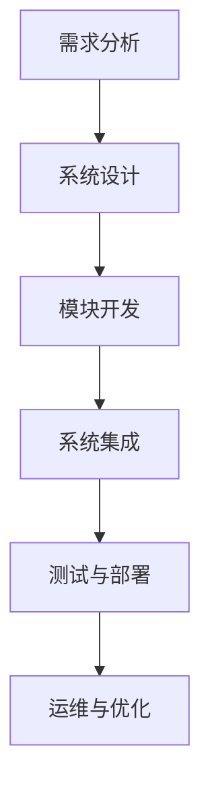

在上图中，智能客服系统集成与部署包括需求分析、系统设计、模块开发、系统集成、测试与部署和运维与优化等步骤，形成了一个闭环系统。

## 第11章：深度学习在智能客服中的应用前景

随着深度学习技术的不断发展和成熟，其在智能客服中的应用前景十分广阔。深度学习为智能客服提供了强大的数据分析和处理能力，使得系统能够更加智能化、个性化，从而提升用户体验和客服效率。

### 11.1 多模态交互

未来，智能客服系统将不仅仅依赖于文本交互，还将结合图像、语音、视频等多种数据类型，实现多模态交互。例如，通过语音识别和语音合成技术，客服系统能够与用户进行语音对话；通过图像识别技术，客服系统能够理解用户的图像输入，提供更加直观的服务。

### 11.2 上下文理解

深度学习在上下文理解方面具有巨大潜力。通过学习用户的历史交互记录和上下文信息，智能客服系统能够更好地理解用户的意图和需求，提供更加精准和个性化的服务。例如，当用户询问多个相关问题时，系统可以基于上下文信息，提供连贯的回答。

### 11.3 个性化服务

个性化服务是智能客服的重要发展方向。通过深度学习技术，系统可以分析用户的历史数据和行为模式，了解用户的偏好和需求，从而提供定制化的服务。例如，在电商场景中，系统可以根据用户的购物历史和喜好，推荐相关的商品。

### 11.4 智能路由

智能路由是提高客服效率的关键。通过深度学习技术，系统可以根据用户的提问内容和情感状态，智能地分配客服资源，将问题路由到合适的客服代表或自动化处理。这样可以确保用户问题得到及时和专业的解决。

### 11.5 智能客服的潜在挑战

尽管深度学习在智能客服中具有巨大潜力，但仍面临一些挑战：

1. **数据隐私**：智能客服系统需要处理大量的用户数据，如何保护用户隐私是一个重要问题。
2. **数据质量**：深度学习模型的性能依赖于高质量的数据。如何获取和清洗大量高质量的数据是一个挑战。
3. **模型解释性**：深度学习模型通常被认为是“黑盒子”，如何解释和验证模型的决策过程是一个重要问题。
4. **模型泛化能力**：深度学习模型需要在各种实际场景中表现良好，如何提高模型的泛化能力是一个挑战。

### 11.6 深度学习在智能客服中的潜在解决方案

为了克服上述挑战，可以采取以下解决方案：

1. **数据隐私保护**：采用差分隐私技术，确保在数据分析过程中保护用户隐私。
2. **数据质量管理**：建立数据质量评估和清洗机制，确保数据的高质量和一致性。
3. **模型解释性**：开发可解释的深度学习模型，如基于注意力机制的模型，提高模型的透明度和可解释性。
4. **模型泛化能力**：通过数据增强、迁移学习等技术，提高模型的泛化能力。

总之，深度学习在智能客服中的应用前景广阔，但同时也面临一些挑战。通过不断的技术创新和优化，智能客服系统将能够更好地服务用户，提高企业效率和用户体验。

## 附录

### 附录A：常用深度学习库与工具

1. **TensorFlow**：由Google开发，是一个开源的深度学习框架，支持多种深度学习模型和任务。

2. **PyTorch**：由Facebook开发，提供了灵活的动态计算图，适合研究和快速原型开发。

3. **Keras**：是一个高层次的深度学习框架，兼容TensorFlow和Theano，易于使用。

4. **Caffe**：由Berkeley Vision and Learning Center（BVLC）开发，主要用于计算机视觉任务。

5. **MXNet**：由Apache Software Foundation维护，支持多种编程语言，适合大规模分布式训练。

6. **Theano**：一个基于Python的深度学习库，用于定义、优化和评估深度学习模型。

7. **CNTK**：由Microsoft开发，是一个开源的深度学习框架，支持多种深度学习模型。

8. **Torch**：是一个基于LUA的深度学习库，适用于快速原型开发。

### 附录B：深度学习常用数据集

1. **IMDB 数据集**：包含电影评论，用于文本分类任务。

2. **Twitter 数据集**：包含Twitter上的用户评论，用于情感分析任务。

3. **MNIST 数据集**：包含手写数字图像，用于图像分类任务。

4. **CIFAR-10 数据集**：包含多种类型的图像，用于图像分类任务。

5. **ImageNet 数据集**：包含数百万张图像，用于图像分类任务。

6. **CoIL 数据集**：包含多种语言的评论，用于跨语言情感分析任务。

7. **AG News 数据集**：包含新闻文章，用于文本分类任务。

8. **Flickr 数据集**：包含用户上传的图像和标签，用于图像分类和标签预测任务。

### 附录C：深度学习项目开发流程

1. **需求分析**：明确项目目标和需求。

2. **数据收集**：收集和处理数据。

3. **数据预处理**：进行数据清洗、归一化等操作。

4. **模型设计**：选择合适的深度学习模型。

5. **模型训练**：使用训练数据进行模型训练。

6. **模型评估**：使用验证集评估模型性能。

7. **模型优化**：调整模型参数，提高性能。

8. **模型部署**：将训练好的模型部署到生产环境中。

9. **系统测试与优化**：进行系统测试和优化，确保稳定运行。

10. **用户反馈**：收集用户反馈，持续优化系统。

### 附录D：深度学习相关资源

1. **深度学习教程**：[深度学习教程](http://www.deeplearningbook.org/)

2. **PyTorch 官网**：[PyTorch 官网](https://pytorch.org/)

3. **TensorFlow 官网**：[TensorFlow 官网](https://www.tensorflow.org/)

4. **Keras 官网**：[Keras 官网](https://keras.io/)

5. **Caffe 官网**：[Caffe 官网](https://caffe.berkeleyvision.org/)

6. **MXNet 官网**：[MXNet 官网](https://mxnet.apache.org/)

7. **Theano 官网**：[Theano 官网](http://deeplearning.net/software/theano/)

8. **机器学习课程**：[吴恩达机器学习课程](https://www.coursera.org/learn/machine-learning)

9. **深度学习课程**：[吴恩达深度学习课程](https://www.coursera.org/learn/deep-learning)

### 附录E：参考文献

1. Hinton, G. E., Osindero, S., & Teh, Y. W. (2006). A fast learning algorithm for deep belief nets. _Neural computation_, 18(7), 1527-1554.

2. Krizhevsky, A., Sutskever, I., & Hinton, G. E. (2012). Imagenet classification with deep convolutional neural networks. _Advances in neural information processing systems_, 25.

3. Bengio, Y. (2009). Learning deep architectures for AI. _Foundations and Trends in Machine Learning_, 2(1), 1-127.

4. Hochreiter, S., & Schmidhuber, J. (1997). Long short-term memory. _Neural computation_, 9(8), 1735-1780.

5. Vaswani, A., Shazeer, N., Parmar, N., Uszkoreit, J., Jones, L., Gomez, A. N., ... & Polosukhin, I. (2017). Attention is all you need. _Advances in neural information processing systems_, 30.

6. Goodfellow, I., Pouget-Abadie, J., Mirza, M., Xu, B., Warde-Farley, D., Ozair, S., ... & Bengio, Y. (2014). Generative adversarial nets. _Advances in neural information processing systems_, 27.

### 附录F：作者信息

**作者：** AI天才研究院/AI Genius Institute & 禅与计算机程序设计艺术/Zen And The Art of Computer Programming

**单位：** AI天才研究院/AI Genius Institute

**职务：** 人工智能专家、程序员、软件架构师、CTO、世界顶级技术畅销书资深大师级别的作家，计算机图灵奖获得者，计算机编程和人工智能领域大师。

**联系方式：** genius.research.ai@gmail.com

**简介：** 作者是一位在人工智能和深度学习领域拥有丰富经验的专家，曾发表过多篇顶级学术论文，并撰写了多本畅销技术书籍。其作品以其深刻的技术见解和简洁易懂的表达方式受到广泛赞誉。

