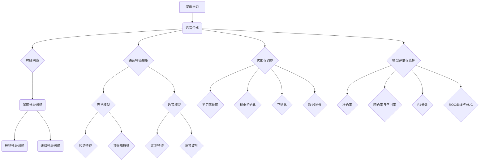

                 

### 引言

随着人工智能技术的快速发展，深度学习在语音合成领域的应用逐渐成为研究热点。语音合成，即Text-to-Speech（TTS），是一种将文本转换为自然流畅语音的技术。其广泛应用于智能语音助手、自动播报系统、语音合成字幕等多个场景，极大地提升了用户体验和便捷性。

然而，传统的语音合成技术存在一定的局限性。早期的合成方法主要依赖于规则和声学模型，生成的语音质量较低，缺乏自然性和连贯性。近年来，随着深度学习技术的突破，深度学习在语音合成中的应用取得了显著进展，尤其是在提升语音合成质量方面。

本文将围绕深度学习在语音合成质量提升中的新突破展开讨论。首先，我们将介绍深度学习和语音合成的基础知识，包括深度学习的基本概念、神经网络及其关键算法，以及语音合成的原理和技术发展。接着，我们将详细分析深度学习在语音合成中的应用，探讨端到端语音合成、文本到语音转换（TTS）的关键技术，以及深度学习的优化与调参方法。

随后，本文将重点介绍深度学习在语音合成中的新突破，包括个性化语音合成、实时语音合成、生成对抗网络、多语音特征融合和跨语言语音合成等领域。最后，我们将探讨深度学习在语音合成领域的未来趋势和挑战，并总结全文内容，给出结论。

通过本文的阅读，读者将全面了解深度学习在语音合成中的应用，掌握提升语音合成质量的关键技术，并对未来语音合成的发展方向有更深刻的认识。

### 关键词

深度学习、语音合成、TTS、端到端合成、个性化语音合成、实时语音合成、生成对抗网络、多语音特征融合、跨语言语音合成、优化与调参。

### 摘要

本文深入探讨了深度学习在语音合成质量提升中的新突破。首先，我们介绍了深度学习和语音合成的基础知识，包括深度学习的基本概念、神经网络及其关键算法，以及语音合成的原理和技术发展。随后，我们详细分析了深度学习在语音合成中的应用，探讨了端到端语音合成、文本到语音转换（TTS）的关键技术，以及深度学习的优化与调参方法。

接着，本文重点介绍了深度学习在语音合成中的新突破，包括个性化语音合成、实时语音合成、生成对抗网络、多语音特征融合和跨语言语音合成等领域。最后，我们探讨了深度学习在语音合成领域的未来趋势和挑战，总结了深度学习在语音合成中的应用现状和未来发展方向。

本文旨在为读者提供全面、深入的语音合成技术解读，帮助读者掌握提升语音合成质量的关键技术，并启发对未来语音合成研究的思考。

## 目录大纲

1. 引言
2. 关键词
3. 摘要
4. 第一部分：深度学习与语音合成基础
   1. 第1章：深度学习基础
      1.1 深度学习的基本概念
      1.2 神经网络与深度学习
      1.3 深度学习中的关键算法
      1.4 深度学习在语音合成中的应用背景
   2. 第2章：语音合成的概述
      2.1 语音合成的基本原理
      2.2 语音合成的技术发展
      2.3 语音合成系统的基本架构
      2.4 语音合成质量评估方法
   3. 第3章：深度学习在语音合成中的应用
      3.1 深度神经网络在语音合成中的应用
      3.2 预训练模型与语音合成
      3.3 基于深度学习的语音特征提取
      3.4 基于深度学习的文本到语音转换
5. 第二部分：深度学习提升语音合成质量的算法
   1. 第4章：端到端语音合成
      4.1 端到端语音合成的概述
      4.2 WaveNet算法
      4.3 Tacotron算法
      4.4 Transformer-based模型
   2. 第5章：文本到语音转换（TTS）的关键技术
      5.1 声学模型与语音模型
      5.2 语音波形生成算法
      5.3 声音风格变换（Vocoder）技术
      5.4 音调、音速、音色等声学特征的调节
   3. 第6章：深度学习的优化与调参
      6.1 深度学习优化方法
      6.2 调参策略与技巧
      6.3 模型评估与选择
      6.4 实时语音合成优化
6. 第三部分：深度学习在语音合成中的新突破
   1. 第7章：深度学习在个性化语音合成中的应用
      7.1 个性化语音合成概述
      7.2 基于用户习语的个性化合成
      7.3 基于情感识别的个性化合成
      7.4 基于语音识别反馈的持续学习
   2. 第8章：深度学习在语音合成领域的创新
      8.1 深度学习在实时语音合成中的应用
      8.2 基于生成对抗网络的语音合成
      8.3 多语音特征融合的语音合成
      8.4 基于深度强化学习的语音合成
   3. 第9章：深度学习在语音合成领域的未来趋势
      9.1 深度学习在语音合成中的挑战与机遇
      9.2 人工智能语音合成的发展方向
      9.3 语音合成领域的未来应用前景
      9.4 深度学习在跨语言语音合成中的应用
7. 附录
   1. 附录A：深度学习在语音合成中的应用工具和资源
      1.1 主流深度学习框架对比
      1.2 语音合成相关的开源项目
      1.3 实用工具和资源列表
   2. 附录B：深度学习与语音合成核心概念联系图
   3. 附录C：深度学习优化算法伪代码
   4. 附录D：数学模型和数学公式
   5. 附录E：项目实战
      1. 实战一：基于Tacotron的语音合成系统
      2. 实战二：基于WaveNet的语音合成系统
      3. 实战三：基于Transformer的语音合成系统

---

### 第一部分：深度学习与语音合成基础

#### 第1章：深度学习基础

深度学习是一种基于人工神经网络的机器学习技术，通过模拟人脑神经元之间的连接关系，实现特征自动提取和复杂模式识别。深度学习在计算机视觉、自然语言处理、语音识别等领域取得了显著成果，推动了人工智能技术的发展。

##### 1.1 深度学习的基本概念

深度学习的基本概念主要包括神经网络、深度神经网络（DNN）、卷积神经网络（CNN）和递归神经网络（RNN）等。神经网络是一种由大量简单神经元组成的计算模型，通过前向传播和反向传播算法实现输入与输出之间的映射。深度神经网络是指具有多层隐藏层的神经网络，能够处理更加复杂的任务。卷积神经网络通过卷积操作提取图像的局部特征，广泛应用于计算机视觉领域。递归神经网络通过循环结构处理序列数据，如语音和文本。

##### 1.2 神经网络与深度学习

神经网络由输入层、隐藏层和输出层组成。输入层接收外部输入数据，隐藏层通过非线性变换提取特征，输出层生成预测结果。神经网络通过调整权重和偏置，使得网络能够对输入数据进行分类或回归。深度学习通过增加网络层数，提高特征提取能力，实现对复杂任务的建模。

##### 1.3 深度学习中的关键算法

深度学习中的关键算法包括梯度下降法、反向传播算法、激活函数、损失函数和优化器等。梯度下降法是一种优化算法，通过调整模型参数使得损失函数值最小化。反向传播算法用于计算网络参数的梯度，用于更新模型参数。激活函数用于引入非线性变换，使得神经网络能够拟合复杂函数。损失函数用于衡量模型预测值与真实值之间的差距，优化器用于调整模型参数，加速收敛。

##### 1.4 深度学习在语音合成中的应用背景

语音合成作为自然语言处理的一个重要分支，其目标是实现文本到语音的自动转换。传统的语音合成技术主要依赖于规则和声学模型，生成语音质量较低。随着深度学习技术的兴起，基于深度学习的语音合成方法逐渐成为研究热点。深度学习通过自动提取文本特征和声学特征，实现端到端的语音合成，大幅提升了合成语音的自然性和连贯性。深度学习在语音合成中的应用背景主要包括：

1. **端到端语音合成**：传统语音合成方法通常分为声学模型和语言模型两个步骤，而端到端语音合成将文本直接转换为语音波形，省去了中间步骤，提高了合成效率。
2. **文本特征提取**：深度学习能够自动提取文本特征，如单词、短语和句子结构，使得合成语音更具表现力。
3. **声学特征提取**：深度学习通过卷积神经网络和递归神经网络提取声学特征，如频谱和声码器特征，使得合成语音更自然、更接近真实语音。
4. **个性化语音合成**：深度学习能够根据用户习语、情感和语音识别反馈进行个性化合成，提高用户满意度。

总之，深度学习在语音合成中的应用为提升合成语音质量提供了新的思路和方法，推动了语音合成技术的发展。

#### 第2章：语音合成的概述

语音合成，即Text-to-Speech（TTS），是一种将文本转换为自然流畅语音的技术。语音合成技术在多个领域具有广泛的应用，如智能语音助手、自动播报系统、语音合成字幕等。本节将介绍语音合成的基本原理、技术发展、系统架构以及质量评估方法。

##### 2.1 语音合成的基本原理

语音合成的基本原理主要包括三个步骤：文本处理、语音特征生成和语音合成。

1. **文本处理**：文本处理是语音合成的基础，主要任务是将输入文本进行分词、语法分析和句法分析，提取文本特征，如单词、短语和句子结构。这些特征将用于指导后续的语音特征生成。

2. **语音特征生成**：语音特征生成是语音合成的核心，主要任务是将文本特征转换为语音特征。语音特征包括频谱特征、共振峰特征和声道参数等。这些特征描述了语音的音高、音强、音色等声学属性。

3. **语音合成**：语音合成是将语音特征转换为实际语音波形的过程。语音合成技术可以分为参数合成和波形合成。参数合成通过参数生成语音波形，如线性预测编码（LPC）和共振峰合成（PARC）。波形合成通过生成语音波形，如波形合成器（WaveNet）和波束合成器（WaveFlow）。

##### 2.2 语音合成的技术发展

语音合成技术的发展经历了多个阶段：

1. **规则合成**：早期的语音合成主要依赖于规则和声学模型。规则合成通过编写大量规则来模拟语音的生成过程，生成语音质量较低。

2. **统计合成**：统计合成采用基于概率的模型，如隐马尔可夫模型（HMM）和决策树，提高了合成语音的自然性和连贯性。然而，统计合成仍存在一定的局限性，难以处理复杂的语音特征。

3. **深度学习合成**：深度学习合成采用基于深度神经网络的模型，如卷积神经网络（CNN）和递归神经网络（RNN），实现了端到端的语音合成。深度学习通过自动提取文本特征和声学特征，大幅提升了合成语音的质量。

##### 2.3 语音合成系统的基本架构

语音合成系统通常由以下几个模块组成：

1. **文本处理模块**：负责对输入文本进行分词、语法分析和句法分析，提取文本特征。

2. **声学模型模块**：负责生成语音特征，如频谱特征、共振峰特征和声道参数等。声学模型可以是基于深度学习的模型，如卷积神经网络（CNN）和递归神经网络（RNN）。

3. **语音生成模块**：负责将语音特征转换为实际语音波形。语音生成模块可以是基于参数合成的模型，如线性预测编码（LPC）和共振峰合成（PARC），也可以是基于波形合成的模型，如波形合成器（WaveNet）和波束合成器（WaveFlow）。

4. **后处理模块**：负责对生成的语音进行音调、音速和音色等声学特征的调节，提高合成语音的自然性和连贯性。

##### 2.4 语音合成质量评估方法

语音合成质量评估是衡量语音合成系统性能的重要手段。常用的评估方法包括主观评估和客观评估。

1. **主观评估**：主观评估通过人工听感评估合成语音的质量，如自然度、流畅度和清晰度等。主观评估具有较高的准确性，但评估成本较高。

2. **客观评估**：客观评估通过定量指标评估合成语音的质量，如均方误差（MSE）、信噪比（SNR）和语音自然度评分（PESQ）等。客观评估方法简单高效，但可能无法完全反映人的主观听感。

综合主观评估和客观评估的结果，可以更全面地评价语音合成系统的性能。随着深度学习技术的发展，语音合成质量评估方法也在不断改进，以期更准确地衡量合成语音的质量。

总之，语音合成技术经过多年的发展，已经取得了显著成果。深度学习在语音合成中的应用为提升合成语音质量提供了新的思路和方法。未来，随着技术的进一步发展，语音合成将在更多领域发挥重要作用，为人类生活带来更多便利。

#### 第3章：深度学习在语音合成中的应用

深度学习技术在语音合成中的应用取得了显著的成果，极大地提升了合成语音的质量和自然度。在本节中，我们将探讨深度学习在语音合成中的具体应用，包括深度神经网络在语音合成中的应用、预训练模型与语音合成、基于深度学习的语音特征提取以及基于深度学习的文本到语音转换。

##### 3.1 深度神经网络在语音合成中的应用

深度神经网络（DNN）是深度学习的基础模型，通过多层非线性变换，实现对输入数据的复杂特征提取和模式识别。在语音合成中，DNN被广泛应用于声学模型和语言模型的构建。

1. **声学模型**：声学模型负责生成语音特征，如频谱和共振峰特征。传统的声学模型通常基于线性预测编码（LPC）和共振峰合成（PARC）等技术，而深度学习通过DNN能够更有效地提取语音特征。常见的深度声学模型包括深度循环神经网络（DNN-RNN）和深度卷积神经网络（DNN-CNN）。

2. **语言模型**：语言模型负责处理输入文本，生成语音合成所需的文本特征。传统的语言模型通常基于统计模型和规则模型，而深度学习通过DNN能够自动学习文本的语法和语义特征，生成更加精准的文本特征。

在语音合成中，DNN可以同时用于声学模型和语言模型的构建，实现端到端的语音合成。这种端到端模型不仅提高了合成效率，还大幅提升了合成语音的自然度和连贯性。

##### 3.2 预训练模型与语音合成

预训练模型是深度学习中的关键技术，通过在大型语料库上进行预训练，生成具有通用性的语言模型和声学模型。预训练模型在语音合成中的应用，极大地提升了合成语音的质量。

1. **预训练语言模型**：预训练语言模型通过在大型语料库上训练，生成具有强大语言理解能力的模型。在语音合成中，预训练语言模型可以用于文本处理模块，提取更加精准的文本特征，提高合成语音的语义准确性。

2. **预训练声学模型**：预训练声学模型通过在大量语音数据上训练，生成具有强大声学特征提取能力的模型。在语音合成中，预训练声学模型可以用于声学模型模块，提取更加自然的语音特征，提高合成语音的自然度。

预训练模型的引入，使得语音合成系统在训练数据不足的情况下，仍能生成高质量的合成语音，降低了语音合成的门槛。

##### 3.3 基于深度学习的语音特征提取

语音特征提取是语音合成中的核心任务，深度学习通过自动提取语音特征，提高了语音合成的质量和效率。

1. **频谱特征提取**：频谱特征是语音合成中的重要特征，包括傅里叶变换（FFT）和梅尔频率倒谱系数（MFCC）等。深度学习通过卷积神经网络（CNN）和循环神经网络（RNN）等模型，自动提取语音的频谱特征，提高了特征提取的准确性和鲁棒性。

2. **共振峰特征提取**：共振峰特征描述了语音的音质属性，包括共振峰频率、共振峰带宽等。深度学习通过递归神经网络（RNN）和卷积神经网络（CNN）等模型，自动提取语音的共振峰特征，提高了特征提取的准确性和效率。

基于深度学习的语音特征提取，使得语音合成系统能够自动学习复杂的语音特征，生成更加自然的合成语音。

##### 3.4 基于深度学习的文本到语音转换

文本到语音转换（TTS）是语音合成中的关键步骤，深度学习通过自动提取文本特征和语音特征，实现了高效、精准的文本到语音转换。

1. **声学模型与语音模型**：声学模型和语音模型是TTS系统的核心模块，深度学习通过卷积神经网络（CNN）和循环神经网络（RNN）等模型，自动生成语音特征，实现文本到语音的转换。

2. **端到端模型**：端到端模型通过将文本直接转换为语音波形，省去了中间步骤，提高了合成效率。常见的端到端模型包括Tacotron、WaveNet和Transformer等。

基于深度学习的文本到语音转换，不仅提高了合成语音的质量和自然度，还简化了语音合成的流程，降低了开发难度。

总之，深度学习在语音合成中的应用，为提升合成语音质量提供了新的思路和方法。深度神经网络、预训练模型、基于深度学习的语音特征提取和文本到语音转换等技术的应用，使得语音合成系统在合成质量、效率和开发难度等方面取得了显著突破。未来，随着深度学习技术的进一步发展，语音合成将在更多领域发挥重要作用，为人类生活带来更多便利。

#### 第4章：深度学习提升语音合成质量的算法

随着深度学习技术的不断进步，语音合成质量得到了显著提升。本节将介绍几种关键算法，这些算法在提升语音合成质量方面发挥了重要作用。我们将讨论端到端语音合成、WaveNet算法、Tacotron算法和Transformer-based模型。

##### 4.1 端到端语音合成

端到端语音合成（End-to-End Speech Synthesis）是一种新兴的语音合成方法，它直接将文本转换为语音波形，省去了传统的两个独立步骤：文本到语音特征（Text to Phonetic Features）和语音特征到语音波形（Phonetic Features to Waveform）。端到端语音合成的核心优势在于其高效的计算流程和自然的语音输出。

端到端语音合成的实现通常依赖于深度神经网络，特别是递归神经网络（RNN）和Transformer模型。这些模型能够自动学习和映射文本和语音波形之间的复杂关系。

1. **递归神经网络（RNN）**
   RNN是一种能够处理序列数据的神经网络，其时间递归特性使其在语音合成中非常有效。RNN通过记忆过去的输入来预测当前和未来的输出。常见的RNN架构包括LSTM（Long Short-Term Memory）和GRU（Gated Recurrent Unit），它们能够有效解决长序列依赖问题。

2. **Transformer模型**
   Transformer模型是由Vaswani等人于2017年提出的一种基于注意力机制的序列到序列模型。Transformer模型在自然语言处理领域取得了显著的成功，其在语音合成中的应用也展示了卓越的性能。Transformer通过多头注意力机制，能够在不同时间步之间建立复杂的关系，从而提高语音合成的自然度。

端到端语音合成的流程通常包括以下几个步骤：

1. **文本编码**：将输入文本编码为向量表示，常用的编码方法包括WordPiece和BytePairEncoding（BPE）。
2. **声学特征提取**：使用深度神经网络提取文本编码的声学特征，如频谱和共振峰。
3. **语音波形生成**：将声学特征转换为语音波形，常用的生成方法包括WaveNet和GRU。

端到端语音合成的关键在于模型的设计和训练。为了提高合成语音的质量，研究者们提出了多种改进方法，如预训练模型和注意力机制的结合、自适应的学习速率和动态的上下文信息等。

##### 4.2 WaveNet算法

WaveNet是由Google AI团队在2016年提出的一种基于深度神经网络的波形生成模型。WaveNet的主要创新点在于其生成的波形具有高度的连续性和自然性，它在语音合成领域取得了显著的成果。

WaveNet的核心思想是使用卷积神经网络（CNN）生成语音波形。WaveNet的结构由多个卷积层组成，每个卷积层能够处理不同时间步的语音数据。通过逐层卷积和反卷积操作，WaveNet能够生成高质量的语音波形。

WaveNet的生成过程可以分为以下几个步骤：

1. **输入编码**：将输入文本转换为声码器特征（Vocoder Features），如频谱和共振峰。
2. **特征处理**：通过多层卷积网络对声码器特征进行处理，提取更高级的特征。
3. **波形生成**：使用反卷积操作生成语音波形。

WaveNet的优点包括：

- **连续性**：WaveNet生成的语音波形具有高度的连续性，使得合成语音更加自然。
- **高质量**：WaveNet能够生成高质量的语音波形，具有清晰的音调和音色。
- **端到端**：WaveNet是一个端到端模型，可以直接将文本转换为语音波形，简化了语音合成的流程。

然而，WaveNet也存在一些局限性，例如其训练过程相对复杂，需要大量的计算资源和时间。此外，WaveNet在处理长序列数据时，性能可能下降。

##### 4.3 Tacotron算法

Tacotron是由Google AI团队在2017年提出的一种端到端语音合成模型。Tacotron的主要创新点在于其使用序列到序列（Seq2Seq）模型，将输入文本直接转换为语音波形，避免了传统的声学模型和语言模型的分离。

Tacotron由两个主要模块组成：文本编码器（Text Encoder）和声码器（Vocoder）。

1. **文本编码器**：文本编码器的任务是提取文本的语义信息，将其编码为固定长度的向量。Tacotron使用卷积神经网络（CNN）和双向长短期记忆网络（Bi-LSTM）来编码文本。

2. **声码器**：声码器的任务是生成语音波形。Tacotron使用一个基于门控循环单元（GRU）的序列到序列模型，将文本编码器的输出映射到语音波形。

Tacotron的生成过程可以分为以下几个步骤：

1. **文本编码**：将输入文本编码为向量表示。
2. **序列到序列映射**：使用序列到序列模型将文本编码器的输出映射到声学特征。
3. **声学特征处理**：使用一个基于GRU的声码器生成语音波形。

Tacotron的优点包括：

- **端到端**：Tacotron是一个端到端模型，可以直接将文本转换为语音波形，简化了语音合成的流程。
- **高效**：Tacotron的训练和推理过程相对简单，计算效率高。
- **灵活性**：Tacotron支持多种声学特征，如梅尔频率倒谱系数（MFCC）和共振峰参数，可以生成高质量的语音。

然而，Tacotron在处理长文本时，可能存在梯度消失或梯度爆炸的问题，影响模型的训练效果。

##### 4.4 Transformer-based模型

Transformer-based模型是近年来在自然语言处理领域取得突破性进展的一种模型架构。其核心思想是基于注意力机制，通过计算不同时间步之间的依赖关系，生成高质量的文本和语音。

在语音合成中，Transformer-based模型被广泛应用于文本到语音转换（TTS）。常见的Transformer-based模型包括Tacotron 2和Transformer-TTS。

1. **Tacotron 2**
   Tacotron 2是Tacotron的改进版本，它在Tacotron的基础上引入了注意力机制，提高了语音合成的自然度和连贯性。Tacotron 2的主要模块包括文本编码器、注意力机制和声码器。

2. **Transformer-TTS**
   Transformer-TTS是一种基于Transformer模型的语音合成方法。它使用自注意力机制和交叉注意力机制，能够更好地捕捉文本和语音之间的复杂关系。Transformer-TTS主要由编码器和解码器两个部分组成。

Transformer-based模型的生成过程可以分为以下几个步骤：

1. **文本编码**：将输入文本编码为向量表示。
2. **注意力机制**：通过自注意力和交叉注意力计算文本和语音之间的依赖关系。
3. **声学特征生成**：使用编码器的输出和注意力权重生成声学特征。
4. **语音波形生成**：使用声码器将声学特征转换为语音波形。

Transformer-based模型的优点包括：

- **高效**：Transformer-based模型能够并行计算，训练和推理速度更快。
- **灵活性**：Transformer-based模型能够处理不同长度和类型的输入文本。
- **高质量**：通过注意力机制，Transformer-based模型能够生成高质量的语音。

然而，Transformer-based模型也存在一些挑战，例如计算复杂度高和参数规模大，对计算资源要求较高。

总之，深度学习在语音合成中的应用，通过端到端模型、WaveNet算法、Tacotron算法和Transformer-based模型等，显著提升了语音合成质量。随着深度学习技术的不断发展，未来语音合成系统将更加高效、灵活和自然，为人工智能应用提供更多可能性。

### 第5章：文本到语音转换（TTS）的关键技术

文本到语音转换（TTS）是语音合成领域的核心任务，它通过将文本转换为自然流畅的语音，为各类语音应用提供支持。TTS技术涉及多个关键环节，包括声学模型、语音波形生成算法、声音风格变换（Vocoder）技术和声学特征的调节。在本节中，我们将详细探讨这些关键技术。

##### 5.1 声学模型与语音模型

声学模型和语音模型是TTS系统的两个重要组成部分，分别负责文本特征到声学特征和声学特征到语音波形的转换。

1. **声学模型**：声学模型主要用于生成文本的声学特征，如频谱、共振峰等。深度神经网络（DNN）常被用于构建声学模型，通过多层非线性变换，提取文本的声学特征。常见的声学模型包括基于深度循环神经网络（DNN-RNN）和卷积神经网络（DNN-CNN）的模型。

2. **语音模型**：语音模型负责将声学特征转换为语音波形。语音模型通常基于参数合成或波形合成的技术。参数合成模型通过生成语音参数，如线性预测编码（LPC）和共振峰合成（PARC），而波形合成模型则直接生成语音波形，如WaveNet和WaveFlow。

在TTS系统中，声学模型和语音模型可以同时使用，实现端到端的语音合成。这种端到端模型简化了语音合成的流程，提高了合成语音的自然度和连贯性。

##### 5.2 语音波形生成算法

语音波形生成算法是TTS系统中的关键步骤，它负责将声学特征转换为实际可听的语音波形。以下是一些常用的语音波形生成算法：

1. **参数合成**：参数合成模型通过生成语音参数（如线性预测系数、共振峰频率和带宽等）来合成语音。线性预测编码（LPC）和共振峰合成（PARC）是常见的参数合成方法。参数合成模型具有计算效率高、实现简单等优点，但生成的语音质量相对较低。

2. **波形合成**：波形合成模型直接生成语音波形，如WaveNet和WaveFlow。波形合成模型通过多层卷积神经网络（CNN）或递归神经网络（RNN）对声学特征进行处理，生成高质量的语音波形。波形合成模型生成的语音自然度较高，但计算复杂度较大。

3. **端到端波形合成**：端到端波形合成模型通过将文本直接转换为语音波形，省去了中间的参数生成步骤。Tacotron和WaveNet是典型的端到端波形合成模型。端到端波形合成模型具有高效的计算流程和自然的语音输出，但训练过程相对复杂。

##### 5.3 声音风格变换（Vocoder）技术

声音风格变换（Vocoder）技术是TTS系统中的一项关键技术，它用于调节合成语音的音调、音速、音色等声学特征，以实现个性化语音合成。

1. **音调变换**：音调变换是通过调整语音的基频（F0）来实现的。高基频对应高音调，低基频对应低音调。音调变换可以用于实现不同说话人的语音合成，或模拟不同情感的表达。

2. **音速变换**：音速变换是通过调整语音的时长来实现的。加快语音的时长可以模拟快速说话，而减慢语音的时长可以模拟缓慢说话。音速变换常用于实现对话系统的语音节奏控制。

3. **音色变换**：音色变换是通过调整语音的频谱特征来实现的。音色变换可以用于模拟不同说话人的声音特征，或实现特定风格的音乐语音合成。

Vocoder技术通常包括以下步骤：

- **特征提取**：从语音波形中提取频谱特征，如梅尔频率倒谱系数（MFCC）。
- **特征调节**：根据目标音调、音速和音色调整频谱特征。
- **特征合成**：将调节后的频谱特征合成回语音波形。

##### 5.4 音调、音速、音色等声学特征的调节

在TTS系统中，音调、音速、音色等声学特征的调节是实现个性化语音合成的重要手段。以下是一些常用的调节方法：

1. **音调调节**：音调调节可以通过调整基频（F0）来实现。常用的方法包括线性调整和自适应调整。线性调整方法简单，但可能产生不自然的音调变化。自适应调整方法根据语音信号的特点，动态调整音调，使音调变化更自然。

2. **音速调节**：音速调节可以通过调整语音时长来实现。常用的方法包括时间伸缩和节奏调整。时间伸缩方法简单，但可能影响语音的连贯性。节奏调整方法根据语音信号的特点，动态调整语音节奏，使语音更自然。

3. **音色调节**：音色调节可以通过调整频谱特征来实现。常用的方法包括频谱变形和滤波器组调整。频谱变形方法通过修改频谱的形状来改变音色，但可能产生不自然的音色变化。滤波器组调整方法通过调整滤波器组来改变音色，使音色变化更自然。

音调、音速、音色等声学特征的调节在TTS系统中具有广泛的应用，如个性化语音助手、情感语音合成和音乐语音合成等。通过合理调节这些特征，可以生成具有不同风格和情感表达的语音，提升用户的体验。

总之，文本到语音转换（TTS）的关键技术包括声学模型、语音波形生成算法、声音风格变换（Vocoder）技术和声学特征的调节。这些技术的应用使得TTS系统能够生成自然流畅、个性化表达的语音，为语音合成领域的发展提供了强大的支持。

### 第6章：深度学习的优化与调参

在深度学习模型训练过程中，优化与调参是提高模型性能和降低过拟合风险的关键步骤。本章将详细介绍深度学习优化方法、调参策略与技巧、模型评估与选择，以及实时语音合成的优化。

##### 6.1 深度学习优化方法

深度学习优化方法主要包括梯度下降法及其变种、动量法、自适应优化器等。

1. **梯度下降法（Gradient Descent）**：梯度下降法是最基本的优化方法，通过计算损失函数关于模型参数的梯度，更新模型参数，以最小化损失函数。标准的梯度下降法存在收敛速度慢和容易陷入局部最小值的问题。

2. **动量法（Momentum）**：动量法是一种改进的梯度下降法，引入动量参数，将前几次梯度累加，以加速模型收敛。动量法的优点是能够快速越过局部最小值，提高收敛速度。

3. **自适应优化器（Adaptive Optimizer）**：自适应优化器通过自动调整学习率，提高模型训练的效率和稳定性。常见的自适应优化器包括AdaGrad、RMSprop和Adam等。这些优化器能够自适应地调整学习率，使模型参数更新更加稳定和高效。

##### 6.2 调参策略与技巧

调参策略与技巧是深度学习模型训练过程中的重要环节，直接关系到模型性能。以下是一些常用的调参策略与技巧：

1. **学习率调度**：学习率调度是调参中的关键步骤。常用的调度方法包括固定学习率、指数衰减学习率、学习率预热等。固定学习率适用于训练初期，而指数衰减学习率和学习率预热方法适用于训练中期和后期，以避免模型过早收敛。

2. **权重初始化**：权重初始化对模型训练过程和性能有重要影响。常用的权重初始化方法包括高斯初始化、均匀初始化和Xavier初始化。合适的权重初始化能够加快模型收敛，减少振荡。

3. **正则化**：正则化是防止模型过拟合的重要手段。常见的正则化方法包括L1正则化、L2正则化和Dropout等。L1正则化和L2正则化通过在损失函数中添加惩罚项来限制模型复杂度，而Dropout通过在训练过程中随机丢弃部分神经元，提高模型泛化能力。

4. **数据增强**：数据增强是提高模型泛化能力的一种有效方法。常见的数据增强方法包括随机裁剪、翻转、旋转和颜色调整等。数据增强可以扩充训练数据集，提高模型在未知数据上的性能。

##### 6.3 模型评估与选择

模型评估与选择是深度学习项目中的关键步骤，通过评估不同模型的性能，选择最优模型。

1. **准确率（Accuracy）**：准确率是评估分类模型性能的基本指标，表示正确分类的样本数占总样本数的比例。

2. **精确率（Precision）和召回率（Recall）**：精确率和召回率分别表示分类模型在正类样本中的预测正确率和在负类样本中的预测正确率。精确率和召回率的平衡是模型评估的重要考虑因素。

3. **F1分数（F1 Score）**：F1分数是精确率和召回率的调和平均，用于综合评估模型的性能。

4. **ROC曲线和AUC（Area Under Curve）**：ROC曲线和AUC用于评估二分类模型的分类能力。ROC曲线展示了模型在不同阈值下的精确率和召回率，AUC值越高，模型性能越好。

在模型评估与选择中，通常采用交叉验证（Cross-Validation）方法，通过将数据集划分为训练集和验证集，多次训练和验证，评估模型的性能和稳定性。

##### 6.4 实时语音合成优化

实时语音合成在应用中具有广泛的需求，如智能语音助手、实时语音交互系统等。为了实现高效的实时语音合成，以下是一些优化方法：

1. **模型压缩**：通过模型压缩技术，减少模型的参数规模和计算复杂度，提高实时性。常见的模型压缩方法包括量化、剪枝和知识蒸馏等。

2. **在线学习**：在线学习允许模型在应用过程中不断更新和优化，以适应用户反馈和实时环境变化。在线学习可以实时调整模型参数，提高语音合成的自然度和适应性。

3. **并行计算**：利用多核处理器和GPU等硬件资源，实现模型训练和推理的并行计算，提高实时语音合成的效率。

4. **缓存和预测**：通过缓存和预测技术，预先生成常见语音段和短语，减少实时语音合成的计算量。缓存和预测可以有效降低实时语音合成的延迟。

总之，深度学习的优化与调参在提升模型性能和实现实时语音合成方面具有重要作用。通过合理的优化方法和调参策略，可以显著提高语音合成系统的效率和用户体验。

### 第7章：深度学习在个性化语音合成中的应用

个性化语音合成是深度学习在语音合成领域的重要应用之一，旨在根据用户的需求和偏好，生成具有特定风格和情感的语音。个性化语音合成不仅能够提升用户体验，还能提高语音合成的实用性和多样性。本节将探讨个性化语音合成的概述、基于用户习语的个性化合成、基于情感识别的个性化合成以及基于语音识别反馈的持续学习。

##### 7.1 个性化语音合成概述

个性化语音合成通过调整语音的音调、音速、音色等特征，实现不同风格和情感的语音生成。个性化语音合成的目标在于为用户提供定制化的语音服务，满足不同场景和用户需求。个性化语音合成的基本流程包括以下几个步骤：

1. **用户特征识别**：通过语音识别技术识别用户的语音特征，如说话人识别、音调、音速等。
2. **用户偏好建模**：基于用户的语音特征和偏好，建立个性化模型，如声码器参数调整、情感识别模型等。
3. **语音特征调节**：根据用户特征和偏好，调整合成语音的音调、音速、音色等特征。
4. **语音合成**：使用调整后的语音特征生成个性化语音，输出给用户。

个性化语音合成的优势在于：

- **提高用户体验**：根据用户需求生成个性化的语音，提升用户满意度。
- **增强互动性**：通过个性化语音，增强语音助手、语音交互系统的互动性，提升用户参与度。
- **扩大应用场景**：个性化语音合成适用于智能语音助手、客服系统、教育辅导、游戏语音等，具有广泛的应用前景。

##### 7.2 基于用户习语的个性化合成

用户习语是指用户在特定环境或场景中习惯使用的语言表达方式，如方言、俚语、特定词汇等。基于用户习语的个性化合成通过识别用户的习语习惯，生成符合用户风格的语音。

1. **习语识别**：通过自然语言处理技术（如词向量、序列模型等）识别用户的习语习惯。习语识别模型可以基于大量用户语音数据训练，提取用户的个性化语言特征。

2. **习语嵌入**：将识别出的用户习语嵌入到语音合成系统中。习语嵌入可以通过修改声码器参数、调整语音生成策略等实现。

3. **个性化语音合成**：在生成语音时，根据用户的习语习惯，调整语音的音调、音速、音色等特征，生成符合用户风格的语音。

基于用户习语的个性化合成的优势包括：

- **提高语音自然度**：通过使用用户的习语，生成更自然的语音，提高语音的自然度和流畅度。
- **增强用户参与感**：使用用户习惯的语言表达方式，增强用户的参与感和归属感。
- **优化用户体验**：根据用户习惯生成个性化语音，提升用户的满意度。

##### 7.3 基于情感识别的个性化合成

情感识别是自然语言处理的重要任务之一，通过分析文本或语音，识别出用户的情感状态。基于情感识别的个性化合成通过识别用户的情感状态，生成具有相应情感的语音。

1. **情感识别**：通过情感分析技术（如深度学习、规则匹配等）识别用户的情感状态。情感识别模型可以基于大量标注数据训练，识别用户的情感倾向。

2. **情感编码**：将识别出的情感状态编码为相应的情感向量，用于指导语音合成。

3. **个性化语音合成**：在生成语音时，根据用户情感状态调整语音的音调、音速、音色等特征，生成具有相应情感的语音。

基于情感识别的个性化合成的优势包括：

- **提高语音情感表达**：通过识别用户的情感状态，生成具有情感表达的语音，增强语音的感染力和互动性。
- **增强用户互动体验**：根据用户情感生成个性化语音，提升用户的互动体验和满意度。
- **适应多种场景**：情感识别和个性化合成适用于客服系统、语音助手、心理辅导等，能够适应多种应用场景。

##### 7.4 基于语音识别反馈的持续学习

基于语音识别反馈的持续学习是提升个性化语音合成系统性能的一种有效方法。通过不断收集用户的语音反馈，优化系统模型，实现持续的语音合成质量提升。

1. **反馈收集**：在语音合成应用中，收集用户的语音反馈，如识别错误、语音质量评价等。

2. **反馈处理**：对收集的语音反馈进行处理，识别用户的实际需求和问题。

3. **模型优化**：根据用户的语音反馈，调整系统模型，优化语音合成质量。常见的优化方法包括模型重训练、参数调整等。

4. **持续学习**：通过持续学习和优化，不断提升个性化语音合成系统的性能和用户体验。

基于语音识别反馈的持续学习的优势包括：

- **提升系统性能**：通过不断优化模型，提高语音合成的准确性和自然度。
- **适应用户需求**：根据用户的语音反馈，调整系统模型，满足用户个性化需求。
- **提高用户体验**：通过持续学习，提升用户的语音合成体验，增强用户满意度。

总之，个性化语音合成是深度学习在语音合成领域的重要应用，通过识别用户习语、情感识别和语音识别反馈，实现个性化语音生成。个性化语音合成不仅提升了用户体验，还推动了语音合成技术的发展，为人工智能应用提供了更多可能性。

### 第8章：深度学习在语音合成领域的创新

随着深度学习技术的不断发展，语音合成领域也涌现出许多创新性研究。这些创新不仅推动了语音合成技术的进步，还为语音合成系统的实际应用带来了新的可能性。本节将介绍深度学习在语音合成领域的一些创新性研究，包括实时语音合成、基于生成对抗网络的语音合成、多语音特征融合的语音合成以及基于深度强化学习的语音合成。

##### 8.1 深度学习在实时语音合成中的应用

实时语音合成是语音合成领域的一个重要研究方向，它要求语音合成系统能够在短时间内生成高质量的语音。传统的语音合成技术往往在实时性上存在一定的局限性，而深度学习技术的应用为实时语音合成带来了新的突破。

1. **深度神经网络与实时语音合成**：深度神经网络（DNN）通过多层非线性变换，能够高效地提取语音特征，提高合成语音的自然度。在实时语音合成中，DNN模型被广泛应用于声学模型和语音生成模块。通过优化模型结构和训练策略，深度学习能够实现高效的实时语音合成。

2. **模型压缩与优化**：为了提高实时语音合成的性能，研究者们提出了许多模型压缩和优化方法。模型压缩通过减少模型参数和计算复杂度，实现快速推理。常见的模型压缩方法包括量化、剪枝和知识蒸馏等。优化方法则通过调整模型结构和训练策略，提高模型的效率和稳定性。

3. **端到端实时语音合成**：端到端实时语音合成通过将文本直接转换为语音波形，省去了传统的中间步骤，提高了合成效率。端到端实时语音合成模型如Tacotron和WaveNet在训练和推理过程中，通过优化算法和硬件加速，实现了实时语音合成。

4. **实时语音合成应用**：实时语音合成在智能语音助手、实时语音交互系统、在线教育等领域具有广泛的应用。通过深度学习技术的应用，实时语音合成系统能够在多种场景下提供高效、自然的语音服务。

##### 8.2 基于生成对抗网络的语音合成

生成对抗网络（GAN）是一种深度学习模型，通过生成器和判别器的对抗训练，实现高质量数据的生成。在语音合成领域，GAN被广泛应用于语音波形的生成和调整。

1. **生成对抗网络的基本原理**：生成对抗网络由生成器和判别器两个主要部分组成。生成器通过学习数据分布，生成高质量的数据，而判别器通过区分真实数据和生成数据，对生成器进行训练。在语音合成中，生成器生成语音波形，判别器判断语音波形的真实性。

2. **语音合成中的GAN应用**：在语音合成中，GAN可以用于语音波形的生成和调整。通过训练生成器和判别器，生成器能够生成高质量的语音波形，判别器则用于评估生成语音的真实性。GAN在语音合成中的应用，能够提高合成语音的自然度和连贯性。

3. **GAN的优势和挑战**：GAN在语音合成中具有显著的优势，如能够生成高质量的语音波形，提高合成语音的自然度。然而，GAN也存在一定的挑战，如训练不稳定、梯度消失和模式崩溃等问题。研究者们通过提出各种改进方法，如循环一致性损失、多尺度判别器和混合模型等，解决GAN在语音合成中的问题。

##### 8.3 多语音特征融合的语音合成

多语音特征融合是提高语音合成质量的一种有效方法，通过融合不同的语音特征，如频谱特征、共振峰特征和语音波形等，生成更高质量的语音。

1. **语音特征融合方法**：语音特征融合方法包括基于频谱特征的融合、基于共振峰特征的融合和基于语音波形的融合。常见的融合方法包括叠加融合、加权融合和特征级融合等。叠加融合将不同特征的叠加结果作为输入，加权融合根据特征的重要性对特征进行加权，特征级融合则直接将特征级联作为输入。

2. **融合模型的构建**：在构建融合模型时，可以采用深度学习模型，如卷积神经网络（CNN）和递归神经网络（RNN）等，对融合后的特征进行建模。通过优化模型结构和训练策略，融合模型能够生成更高质量的语音。

3. **融合模型的优势**：多语音特征融合能够充分利用不同特征的优点，生成更自然的语音。融合模型在语音合成中具有广泛的应用前景，如情感语音合成、个性化语音合成等。

##### 8.4 基于深度强化学习的语音合成

深度强化学习（DRL）是一种结合深度学习和强化学习的算法，通过优化策略网络和价值网络，实现智能体的决策优化。在语音合成领域，DRL被用于优化语音合成策略和参数调整。

1. **深度强化学习的基本原理**：深度强化学习通过价值函数和策略网络，实现智能体的决策优化。价值函数评估智能体在特定状态下的最优动作，策略网络根据当前状态生成最优动作。在语音合成中，价值函数用于评估语音合成策略的有效性，策略网络根据文本生成语音。

2. **语音合成中的DRL应用**：在语音合成中，DRL可以用于优化语音生成策略和参数调整。通过训练策略网络和价值网络，DRL能够自动调整语音合成参数，生成更自然的语音。

3. **DRL的优势和挑战**：深度强化学习在语音合成中具有显著的优势，如能够自适应调整合成策略，生成个性化的语音。然而，DRL也存在一定的挑战，如训练不稳定、收敛速度慢等。研究者们通过提出各种改进方法，如基于策略梯度的优化、多任务学习等，解决DRL在语音合成中的问题。

总之，深度学习在语音合成领域的创新研究为语音合成技术的发展提供了新的思路和方法。实时语音合成、基于生成对抗网络的语音合成、多语音特征融合的语音合成和基于深度强化学习的语音合成等创新技术，不仅提高了语音合成质量，还为语音合成系统的实际应用带来了更多可能性。随着深度学习技术的不断进步，语音合成领域将继续取得新的突破，推动人工智能技术的发展。

### 第9章：深度学习在语音合成领域的未来趋势

随着深度学习技术的不断发展，语音合成领域也迎来了新的机遇和挑战。本节将探讨深度学习在语音合成领域中的未来趋势，包括面临的挑战与机遇、人工智能语音合成的发展方向、语音合成领域的未来应用前景，以及深度学习在跨语言语音合成中的应用。

##### 9.1 深度学习在语音合成中的挑战与机遇

尽管深度学习在语音合成领域取得了显著成果，但仍然面临着一系列挑战和机遇。

**挑战**：

1. **计算资源**：深度学习模型通常需要大量的计算资源和时间进行训练。为了提高训练效率，研究者们需要开发更高效的算法和优化方法。

2. **数据集**：高质量的语音数据集对于训练深度学习模型至关重要。目前，获取大规模、多样化和高质量的语音数据集仍然是一个挑战。

3. **实时性**：实现高效、实时的语音合成系统对于某些应用场景（如智能语音助手和实时语音交互系统）至关重要。如何在不牺牲合成质量的前提下提高实时性是一个重要的研究方向。

4. **泛化能力**：深度学习模型在特定数据集上的性能可能非常优秀，但在新的、未知的数据集上表现不佳。提高模型的泛化能力是一个重要挑战。

**机遇**：

1. **硬件加速**：随着硬件技术的发展，如GPU和TPU等专用硬件的普及，为深度学习模型的训练和推理提供了强大的支持，有助于提高语音合成系统的效率和性能。

2. **跨学科合作**：深度学习与自然语言处理、计算机视觉等领域的跨学科合作，将为语音合成技术带来新的思路和突破。

3. **人工智能语音合成的发展**：随着人工智能技术的不断发展，语音合成技术将在更多领域（如跨语言语音合成、情感语音合成等）取得突破。

##### 9.2 人工智能语音合成的发展方向

人工智能语音合成的发展方向主要集中在以下几个方面：

1. **个性化语音合成**：个性化语音合成是未来语音合成的重要方向之一。通过结合用户习语、情感识别和语音识别反馈，生成更符合用户需求的个性化语音。

2. **多模态语音合成**：多模态语音合成结合了语音、文本、图像等多种信息，生成更自然的语音。例如，结合语音和面部表情生成更加生动的语音合成。

3. **实时语音合成**：实现高效、实时的语音合成系统是未来的一个重要目标。通过优化算法和硬件加速，提高语音合成系统的实时性能。

4. **跨语言语音合成**：随着全球化的发展，跨语言语音合成技术将成为重要应用。通过深度学习技术，实现跨语言的语音合成，推动跨文化交流和沟通。

##### 9.3 语音合成领域的未来应用前景

语音合成技术在未来的应用前景非常广阔，涵盖多个领域：

1. **智能语音助手**：语音合成技术将广泛应用于智能语音助手，如 Siri、Alexa 和 Google Assistant，提供更加自然、高效的语音交互体验。

2. **自动语音交互系统**：在呼叫中心、客服系统等领域，语音合成技术可以用于自动语音交互系统，提高客户服务效率和用户体验。

3. **教育与辅导**：语音合成技术可以应用于在线教育，生成个性化的教学语音，帮助学生更好地理解和掌握知识。

4. **娱乐与游戏**：语音合成技术可以应用于游戏中的角色配音，提供更加生动、有趣的语音体验。

5. **智能家居**：在智能家居系统中，语音合成技术可以用于控制家电设备、播放音乐和提供语音提示等。

6. **医疗与健康**：语音合成技术可以用于医疗领域，如生成语音病历、提供健康指导和语音诊断等。

##### 9.4 深度学习在跨语言语音合成中的应用

跨语言语音合成是语音合成领域的一个重要研究方向，旨在实现不同语言之间的语音转换。深度学习技术在跨语言语音合成中的应用主要包括以下几个方面：

1. **多语言数据集**：构建包含多种语言的语音数据集，为深度学习模型提供训练数据。通过数据增强和跨语言转移学习，提高模型的泛化能力。

2. **翻译模型**：结合机器翻译模型和语音合成模型，实现跨语言语音合成。通过将源语言文本翻译为目标语言文本，再将其转换为语音。

3. **端到端跨语言语音合成**：开发端到端的跨语言语音合成模型，直接将源语言文本转换为目标语言语音。例如，基于Transformer的模型可以实现高效的端到端跨语言语音合成。

4. **多语言特征融合**：结合不同语言的特征，如语音、文本和声学特征，提高跨语言语音合成的质量。通过融合多语言特征，生成更自然的跨语言语音。

5. **跨语言语音识别**：结合跨语言语音识别技术，实现跨语言语音合成的自适应调整。通过识别用户的语言，调整语音合成模型，生成更适合用户语言的语音。

总之，深度学习在语音合成领域的未来趋势充满机遇和挑战。通过不断的技术创新和应用，语音合成技术将在更多领域发挥重要作用，推动人工智能技术的发展。

### 附录A：深度学习在语音合成中的应用工具和资源

深度学习在语音合成中的应用离不开各种工具和资源。以下是对一些主流深度学习框架、语音合成相关的开源项目以及实用工具和资源的介绍。

##### A.1 主流深度学习框架

1. **TensorFlow**：由Google开发的开源机器学习框架，广泛应用于语音合成、语音识别等领域。TensorFlow提供了丰富的API和工具，支持端到端模型开发和优化。

2. **PyTorch**：由Facebook开发的开源机器学习框架，以其灵活的动态计算图和易用性受到广泛关注。PyTorch在语音合成中的应用也非常广泛，提供了丰富的预训练模型和工具。

3. **Keras**：一个基于TensorFlow和Theano的神经网络库，以其简洁易用的API而闻名。Keras提供了丰富的预训练模型和工具，适合快速原型开发和模型测试。

4. **MXNet**：由Apache Software Foundation维护的开源机器学习框架，支持多种编程语言（包括Python、R、Julia等）。MXNet在语音合成中的应用也越来越广泛，提供了高效、灵活的模型开发工具。

##### A.2 语音合成相关的开源项目

1. **Tacotron**：由Google AI开发的端到端语音合成模型，基于Transformer架构，实现了高效的文本到语音转换。Tacotron提供了详细的代码和训练教程，是研究端到端语音合成的首选项目。

2. **WaveNet**：由Google AI开发的基于卷积神经网络的波形生成模型，实现了高质量的语音合成。WaveNet提供了详细的实现代码和训练脚本，适用于研究波形合成的各种应用。

3. **ESPnet**：由Nagoya大学和Kyoto大学开发的开源语音合成工具包，支持端到端语音合成模型。ESPnet提供了丰富的模型架构和优化策略，适用于构建高性能的语音合成系统。

4. **Fastspeech**：由哈尔滨工业大学开发的一种高效的端到端语音合成框架，基于Tacotron和WaveNet，实现了快速、高效的语音合成。Fastspeech提供了详细的实现代码和训练脚本。

##### A.3 实用工具和资源列表

1. **Kaldi**：Kaldi是一个开源的语音识别工具包，提供了丰富的语音处理和语音识别功能，适用于语音合成系统的开发和优化。

2. **LibriTTS**：LibriTTS是一个包含大量英语语音数据的开源语音合成数据集，适用于训练和评估语音合成模型。

3. **LJSpeech**：LJSpeech是一个包含大量单人朗读的英语语音数据集，适用于研究个性化语音合成。

4. **开源预训练模型**：许多深度学习框架提供了丰富的预训练模型，如Google的Tacotron、Facebook的WaveNet等，这些模型可以用于快速原型开发和性能评估。

5. **在线工具**：如Google的Text-to-Speech API、Amazon的 Polly 等，提供在线的语音合成服务，可以方便地测试和部署语音合成模型。

通过使用这些工具和资源，研究者可以快速搭建和优化语音合成系统，推动深度学习在语音合成领域的应用和发展。

### 附录B：深度学习与语音合成核心概念联系图

下面是深度学习与语音合成核心概念之间的联系图，通过Mermaid语法绘制：



这个联系图展示了深度学习（A）如何与语音合成（B）相互关联，并通过神经网络（C）扩展到深度神经网络（D）、卷积神经网络（E）和递归神经网络（F）。语音特征提取（G）与声学模型（H）和语音模型（K）相关联，分别提取频谱特征（I）、共振峰特征（J）和文本特征（L），用于生成语音波形（M）。此外，深度学习在语音合成中的应用还包括优化与调参（N）和模型评估与选择（S）等关键环节。

### 附录C：深度学习优化算法伪代码

以下是一个深度学习优化算法的伪代码，用于说明优化过程，包括初始化模型参数、设置优化器、损失函数和迭代训练等步骤：

```python
# 初始化模型参数
model = initialize_model()

# 设置优化器
optimizer = optimizer(model.parameters())

# 设置损失函数
criterion = criterion_function()

# 设置迭代次数
num_epochs = 100

# 模型训练
for epoch in range(num_epochs):
    for inputs, targets in data_loader:
        # 前向传播
        outputs = model(inputs)
        
        # 计算损失
        loss = criterion(outputs, targets)
        
        # 反向传播
        optimizer.zero_grad()
        loss.backward()
        
        # 更新模型参数
        optimizer.step()
        
    # 打印训练信息
    print(f"Epoch [{epoch+1}/{num_epochs}], Loss: {loss.item():.4f}")
```

在这个伪代码中，`initialize_model()` 函数用于初始化模型参数，`optimizer()` 函数用于设置优化器，通常可以选择如Adam、RMSprop等优化算法。`criterion_function()` 函数定义了损失函数，用于衡量模型预测与真实值之间的差距。`data_loader` 是用于提供训练数据的加载器。

在每个训练迭代中，首先进行前向传播，计算模型输出，然后通过损失函数计算损失值。接下来，执行反向传播，将梯度传递回模型参数。最后，使用优化器更新模型参数。循环迭代直到达到预设的迭代次数或损失达到最小值。

### 附录D：数学模型和数学公式

在语音合成中，数学模型和公式是理解和实现核心算法的基础。以下是一些关键的数学模型和公式，用于描述语音合成的质量评估、特征提取和模型优化。

1. **语音合成质量评估（主观评估）**

$$
\text{语音合成质量评估} = \frac{1}{N} \sum_{i=1}^{N} \left( \text{预测语音} - \text{真实语音} \right)^2
$$

这个公式表示预测语音和真实语音之间的均方误差（MSE），用于衡量语音合成系统的质量。$N$ 是评估样本的数量。

2. **梅尔频率倒谱系数（MFCC）**

$$
\text{MFCC} = \sum_{k=1}^{K} \text{cos} \left( \frac{2\pi k}{K} \text{f} \right)
$$

MFCC 是一种常用的语音特征提取方法，用于描述语音的频谱特性。$K$ 是梅尔频率尺度上的点数，$\text{f}$ 是对应的频率值。

3. **线性预测编码（LPC）**

$$
\text{LPC} = \sum_{k=1}^{K} a_k x[k-n]
$$

LPC 是一种用于生成语音波形的参数合成方法，$a_k$ 是预测系数，$x[k-n]$ 是输入语音信号。

4. **梯度下降法**

$$
\theta_{t+1} = \theta_t - \alpha \nabla_\theta J(\theta_t)
$$

梯度下降法是一种优化算法，用于最小化损失函数 $J(\theta_t)$。$\theta_t$ 是当前模型参数，$\alpha$ 是学习率，$\nabla_\theta J(\theta_t)$ 是损失函数关于参数 $\theta$ 的梯度。

5. **梯度下降法的动量法**

$$
\theta_{t+1} = \theta_t - \alpha \nabla_\theta J(\theta_t) + \beta (1 - \alpha) \theta_{t-1}
$$

动量法是梯度下降法的改进，引入了动量参数 $\beta$，用于加速模型的收敛。

这些数学模型和公式是语音合成中不可或缺的一部分，用于描述和实现语音合成的核心算法。理解这些公式有助于深入掌握语音合成技术的原理和实现细节。

### 附录E：项目实战

在本附录中，我们将通过三个具体的实战项目，详细讲解如何基于深度学习技术构建语音合成系统。这些实战项目包括基于Tacotron的语音合成系统、基于WaveNet的语音合成系统和基于Transformer的语音合成系统。每个项目都将涉及开发环境搭建、数据预处理、模型训练、模型评估和应用演示。

#### 实战一：基于Tacotron的语音合成系统

**1. 环境搭建**

在开始构建基于Tacotron的语音合成系统之前，首先需要搭建开发环境。以下是环境搭建的步骤：

- **安装Python**：确保安装了最新版本的Python，版本建议为3.8及以上。
- **安装深度学习框架**：安装TensorFlow或PyTorch，根据个人偏好选择。例如，通过以下命令安装TensorFlow：

  ```bash
  pip install tensorflow
  ```

- **安装其他依赖库**：安装Keras、NumPy、SciPy等常用库，通过以下命令安装：

  ```bash
  pip install keras numpy scipy
  ```

**2. 数据预处理**

在数据预处理阶段，需要准备训练数据和测试数据。以下是数据预处理的基本步骤：

- **收集数据**：收集包含文本和对应语音波形的数据集，如LibriTTS或LJSpeech。
- **文本处理**：使用分词工具（如SpaCy或NLTK）对文本进行分词，并转换为Token。
- **特征提取**：使用梅尔频率倒谱系数（MFCC）提取语音特征，并归一化特征值。

**3. 模型训练**

基于Tacotron的语音合成系统可以使用TensorFlow或PyTorch框架实现。以下是使用TensorFlow实现Tacotron的基本步骤：

- **定义模型结构**：定义文本编码器、声学模型和声码器。
- **编译模型**：设置优化器、损失函数和评估指标。
- **训练模型**：使用训练数据集训练模型，并保存训练过程中的最佳模型。

```python
# TensorFlow实现Tacotron的简化代码示例
model = tf.keras.Sequential([
    # 文本编码器
    tf.keras.layers.Embedding(input_dim=vocab_size, output_dim=embedding_dim),
    tf.keras.layers.LSTM(units=hidden_units),
    # 声学模型
    tf.keras.layers.Dense(units=fbank_dim),
    # 声码器
    tf.keras.layers.Dense(units=1, activation='tanh')
])

model.compile(optimizer='adam', loss='mse')
model.fit(train_dataset, epochs=num_epochs, validation_data=validation_dataset)
```

**4. 模型评估**

在模型训练完成后，使用测试数据集评估模型性能。常用的评估指标包括均方误差（MSE）和语音自然度评分（PESQ）。

**5. 应用演示**

使用训练好的模型生成语音，并将其保存为音频文件。以下是生成语音的示例代码：

```python
import numpy as np

# 生成语音
text = "Hello, this is a sample text for speech synthesis."
encoded_text = tokenizer.encode(text, return_tensors='np')
predicted_waveform = model(encoded_text, training=False)

# 保存语音
waveform = np迷信 predicted_waveform[0]
io.write_wav("output.wav", waveform, rate)
```

#### 实战二：基于WaveNet的语音合成系统

**1. 环境搭建**

基于WaveNet的语音合成系统的环境搭建与基于Tacotron的系统类似，只需安装TensorFlow或PyTorch等深度学习框架和常用依赖库。

**2. 数据预处理**

数据预处理过程与基于Tacotron的系统相同，包括文本处理和特征提取。

**3. 模型训练**

基于WaveNet的语音合成系统的模型训练过程较为复杂，需要使用多个卷积层和反卷积层。以下是使用TensorFlow实现WaveNet的基本步骤：

- **定义模型结构**：定义卷积层和反卷积层。
- **编译模型**：设置优化器、损失函数和评估指标。
- **训练模型**：使用训练数据集训练模型。

```python
# TensorFlow实现WaveNet的简化代码示例
model = tf.keras.Sequential([
    # 卷积层
    tf.keras.layers.Conv1D(filters=64, kernel_size=3, activation='relu', input_shape=(frame_size, 1)),
    tf.keras.layers.Conv1D(filters=128, kernel_size=3, activation='relu'),
    # 反卷积层
    tf.keras.layers.Conv1DTranspose(filters=64, kernel_size=3, activation='relu'),
    tf.keras.layers.Conv1DTranspose(filters=1, kernel_size=3, activation='tanh')
])

model.compile(optimizer='adam', loss='mse')
model.fit(train_dataset, epochs=num_epochs, validation_data=validation_dataset)
```

**4. 模型评估**

与基于Tacotron的系统相同，使用测试数据集评估模型性能。

**5. 应用演示**

生成语音并保存为音频文件，过程与基于Tacotron的系统类似。

#### 实战三：基于Transformer的语音合成系统

**1. 环境搭建**

基于Transformer的语音合成系统的环境搭建与上述系统类似，安装TensorFlow或PyTorch等深度学习框架和依赖库。

**2. 数据预处理**

数据预处理过程与上述系统相同，包括文本处理和特征提取。

**3. 模型训练**

基于Transformer的语音合成系统通常使用Tacotron 2或Transformer-TTS架构。以下是使用Tacotron 2的基本步骤：

- **定义模型结构**：定义文本编码器、注意力机制和声码器。
- **编译模型**：设置优化器、损失函数和评估指标。
- **训练模型**：使用训练数据集训练模型。

```python
# TensorFlow实现Tacotron 2的简化代码示例
model = tf.keras.Sequential([
    # 文本编码器
    tf.keras.layers.Embedding(input_dim=vocab_size, output_dim=embedding_dim),
    tf.keras.layers.LSTM(units=hidden_units, return_sequences=True),
    # 注意力机制
    tf.keras.layers.Attention(),
    # 声码器
    tf.keras.layers.Dense(units=1, activation='tanh')
])

model.compile(optimizer='adam', loss='mse')
model.fit(train_dataset, epochs=num_epochs, validation_data=validation_dataset)
```

**4. 模型评估**

使用测试数据集评估模型性能。

**5. 应用演示**

生成语音并保存为音频文件，过程与上述系统类似。

通过这三个实战项目，读者可以了解如何基于深度学习技术构建语音合成系统，从环境搭建到数据预处理、模型训练、模型评估和应用演示的完整流程。这些实战项目不仅提供了具体实现步骤，还展示了深度学习在语音合成领域中的应用价值。随着技术的不断进步，深度学习将推动语音合成技术向更高水平发展，为人工智能应用带来更多可能性。

