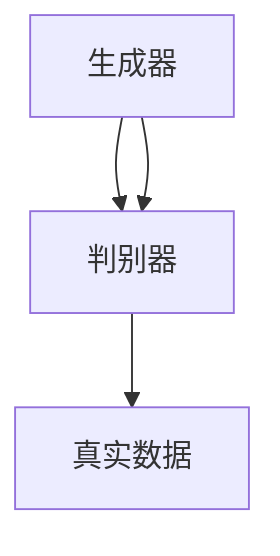
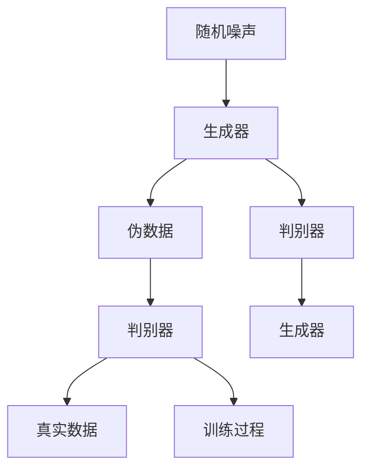

                 

### 文章标题

生成对抗网络（GAN）在虚拟试妆中的应用

---

**关键词：** 生成对抗网络，GAN，虚拟试妆，深度学习，图像生成，时尚与美容行业

---

**摘要：** 本文章探讨了生成对抗网络（GAN）在虚拟试妆中的应用。首先，我们将简要介绍GAN的基础知识，包括其定义、原理、历史发展和应用领域。接着，我们将详细解析GAN的算法原理，包括生成器和判别器的机制，以及GAN的优化算法。然后，我们将讨论虚拟试妆技术的概述，包括其概念、重要性、常见技术以及面临的挑战与机遇。随后，我们将重点介绍GAN在虚拟试妆中的具体应用，包括GAN模型的选择与优化、虚拟试妆系统架构以及效果评估方法。此外，我们将通过一个虚拟试妆项目实战，详细讲解开发环境搭建、代码实现与解读。最后，我们将展望GAN在虚拟试妆中的未来发展趋势，并总结全书内容。通过本文，读者将全面了解GAN在虚拟试妆中的应用，为未来相关领域的研究和实践提供参考。

---

### 《生成对抗网络在虚拟试妆中的应用》目录大纲

#### 第一部分：生成对抗网络（GAN）基础

##### 第1章：GAN概述

- **1.1 GAN的定义与原理**
  - GAN的基本架构
  - 生成器与判别器的交互
  - GAN的训练过程

- **1.2 GAN的历史与发展**
  - GAN的起源
  - 关键里程碑与贡献者
  - 当前研究趋势

- **1.3 GAN的应用领域**
  - 艺术创作与设计
  - 图像生成与增强
  - 自然语言处理

##### 第2章：GAN算法原理

- **2.1 神经网络基础**
  - 神经网络的基本结构
  - 反向传播算法

- **2.2 生成器与判别器的机制**
  - 生成器的构建与训练
  - 判别器的构建与训练
  - **图 2.1 GAN的工作流程图**（Mermaid 流程图）

- **2.3 GAN的优化算法**
  - GDAS、LSGAN、WGAN、WGAN-GP等
  - **伪代码 2.1：GAN训练过程的伪代码实现**

#### 第二部分：GAN在虚拟试妆中的应用

##### 第3章：虚拟试妆技术概述

- **3.1 虚拟试妆的概念与重要性**
  - 虚拟试妆的定义
  - 虚拟试妆在时尚与美容行业的影响

- **3.2 虚拟试妆的常见技术**
  - 虚拟试妆的图像处理技术
  - 深度学习与虚拟试妆

- **3.3 虚拟试妆的挑战与机遇**

##### 第4章：GAN在虚拟试妆中的应用

- **4.1 GAN在虚拟试妆中的实现**
  - GAN模型的选择与优化
  - GAN在虚拟试妆中的具体应用场景

- **4.2 虚拟试妆系统架构**
  - 系统设计原则
  - 系统模块功能与接口

- **4.3 虚拟试妆效果评估**
  - 评估指标与方法
  - 实际案例分析与评估

##### 第5章：虚拟试妆项目实战

- **5.1 项目背景与目标**
  - 项目背景介绍
  - 项目目标与需求

- **5.2 开发环境搭建**
  - 软件与硬件配置
  - 开发工具与库

- **5.3 代码实现与解读**
  - **代码 5.1：生成器的代码实现**
  - **代码 5.2：判别器的代码实现**
  - **代码 5.3：训练过程的代码实现**
  - **代码解读与分析**

##### 第6章：GAN在虚拟试妆中的未来发展趋势

- **6.1 GAN技术的演进方向**
  - GAN的变种与改进
  - GAN在其他领域的应用

- **6.2 虚拟试妆技术的发展趋势**
  - 虚拟试妆技术的未来应用场景
  - 跨界融合与创新应用

- **6.3 GAN在虚拟试妆中的挑战与解决策略**

##### 第7章：总结与展望

- **7.1 全书回顾**
  - GAN基础知识的回顾
  - GAN在虚拟试妆中的应用总结

- **7.2 未来研究方向**
  - 虚拟试妆技术与GAN的深度融合
  - 跨领域应用的拓展

#### 附录

##### 附录 A：GAN常用工具与资源

- **A.1 GAN相关工具**
  - TensorFlow与GAN
  - PyTorch与GAN
  - Keras与GAN

- **A.2 GAN学习资源**
  - 研究论文推荐
  - 在线课程与教程
  - 实践项目与挑战

---

### 第一部分：生成对抗网络（GAN）基础

#### 第1章：GAN概述

##### 1.1 GAN的定义与原理

生成对抗网络（Generative Adversarial Network，GAN）是由Ian Goodfellow等人于2014年提出的一种深度学习框架。GAN的核心思想是通过两个神经网络——生成器（Generator）和判别器（Discriminator）之间的对抗训练，生成逼真的数据。

- **生成器**：生成器的任务是生成与真实数据分布相近的伪数据。它接收随机噪声作为输入，通过多层神经网络生成具有一定概率分布的数据。

- **判别器**：判别器的任务是对输入数据进行分类，判断其是真实数据还是生成器生成的伪数据。它接收生成器和真实数据的输入，输出一个概率值，表示输入数据的真实性。

GAN的训练过程可以看作是一个零和博弈，生成器和判别器相互竞争，生成器的目标是使判别器无法区分生成的数据和真实数据，而判别器的目标是正确分类输入的数据。

GAN的基本架构如下：



在GAN的训练过程中，生成器和判别器交替进行训练。具体步骤如下：

1. **初始化生成器和判别器**：通常使用随机权重初始化两个网络。

2. **生成伪数据**：生成器接收随机噪声作为输入，生成伪数据。

3. **训练判别器**：将真实数据和生成器生成的伪数据同时输入判别器，通过反向传播算法更新判别器的权重。

4. **训练生成器**：生成器生成新的伪数据，再次输入判别器，同时将生成的伪数据与真实数据进行比较，通过反向传播算法更新生成器的权重。

5. **重复步骤2-4**：直到生成器的生成数据能够以较高的概率被判别器判断为真实数据。

GAN的训练过程可以用伪代码表示如下：

```
for epoch in 1 to num_epochs:
    for batch in data_loader:
        # 生成伪数据
        z = sample_noise()
        fake_data = generator(z)

        # 训练判别器
        real_data = batch
        discriminator_loss = compute_loss(discriminator, real_data, fake_data)

        # 训练生成器
        generator_loss = compute_loss(discriminator, fake_data)

        # 更新判别器和生成器的权重
        update_weights(discriminator, discriminator_loss)
        update_weights(generator, generator_loss)
```

##### 1.2 GAN的历史与发展

GAN的提出标志着深度学习领域的一个重要突破。在此之前，生成模型（如变分自编码器VAE）已经取得了一定的成功，但GAN通过引入对抗训练机制，使得生成模型能够生成更加真实、多样且高质量的数据。

- **GAN的起源**：GAN最早是由Ian Goodfellow在2012年的博士论文中提出的。当时，Goodfellow提出了一种基于梯度下降法的生成模型，并将其命名为“生成对抗网络”。这个模型后来被证明具有强大的生成能力。

- **关键里程碑与贡献者**：GAN的研究得到了许多研究者和机构的支持。除了Goodfellow，还有许多重要的贡献者，如Yann LeCun、Yoshua Bengio等深度学习领域的权威人物。他们在GAN的研究和应用方面做出了重要贡献。

- **当前研究趋势**：随着GAN技术的不断发展，研究者们提出了一系列改进和变体，如Wasserstein GAN（WGAN）、谱归一化GAN（SN-GAN）、条件GAN（cGAN）等。这些改进旨在提高GAN的训练稳定性、生成质量和生成多样性。此外，GAN在其他领域，如图像生成、图像修复、图像超分辨率、视频生成等，也得到了广泛应用。

##### 1.3 GAN的应用领域

GAN作为一种强大的生成模型，在多个领域取得了显著的应用成果。以下是一些GAN的主要应用领域：

- **艺术创作与设计**：GAN能够生成高质量的艺术作品，如绘画、音乐、建筑设计等。艺术家和设计师可以利用GAN生成新颖、独特的创意作品。

- **图像生成与增强**：GAN可以用于生成高质量、逼真的图像，如人脸生成、风景生成、图像修复等。此外，GAN还可以用于图像超分辨率，将低分辨率图像放大为高分辨率图像。

- **自然语言处理**：GAN可以用于生成自然语言文本，如小说、新闻、对话等。这为自动写作、机器翻译等领域提供了新的方法。

- **医疗影像**：GAN可以用于生成医疗影像，如X光片、MRI等。这有助于提高医疗诊断的准确性和效率。

- **虚拟试妆**：GAN可以用于虚拟试妆，实现用户在不同化妆品和发型上的试妆效果。这为时尚与美容行业提供了新的营销手段和用户体验。

- **数据增强**：GAN可以用于数据增强，通过生成新的数据样本，提高模型的训练效果和泛化能力。

- **自动驾驶**：GAN可以用于自动驾驶中的环境模拟和图像生成，提高自动驾驶系统的训练和测试效果。

- **机器人**：GAN可以用于机器人领域的任务规划、导航和交互等，为机器人提供更丰富的感知和决策能力。

综上所述，GAN作为一种强大的生成模型，在多个领域具有广泛的应用前景。通过不断的研究和创新，GAN技术将不断发展和完善，为各行各业带来更多的价值和机遇。

#### 第2章：GAN算法原理

##### 2.1 神经网络基础

生成对抗网络（GAN）是基于深度学习框架构建的，因此理解神经网络的基本结构和工作原理是至关重要的。神经网络是由大量的神经元（也称为节点）组成的，这些神经元通过权重连接形成网络。网络通过训练从输入数据中学习到特征和模式，从而实现分类、回归或其他复杂任务。

**神经网络的基本结构**：

神经网络由输入层、隐藏层和输出层组成。每个层包含多个神经元。神经元之间的连接通过权重进行调节，这些权重决定了网络的学习能力。

- **输入层**：接收外部输入数据，每个输入数据对应一个神经元。

- **隐藏层**：隐藏层中的神经元通过对输入数据的加权求和，并应用激活函数，产生新的特征。隐藏层的数量和神经元数量可以根据任务需要进行调整。

- **输出层**：输出层的神经元根据隐藏层的输出，生成最终的预测结果。输出层的神经元可以是分类器或回归器，具体取决于任务类型。

**激活函数**：激活函数是神经网络中的一个关键组成部分，它对神经元的输出进行非线性变换，使得神经网络能够学习到复杂的数据特征。常见的激活函数包括：

- **Sigmoid函数**：\( f(x) = \frac{1}{1 + e^{-x}} \)
- **ReLU函数**：\( f(x) = \max(0, x) \)
- **Tanh函数**：\( f(x) = \frac{e^x - e^{-x}}{e^x + e^{-x}} \)
- **Leaky ReLU函数**：在ReLU的基础上，对负值部分进行线性放大，以防止神经元死亡。

**反向传播算法**：

反向传播算法是神经网络训练的核心算法。它通过计算输出层预测值与真实值之间的差异，将误差反向传播到输入层，并更新每个神经元的权重。具体步骤如下：

1. **前向传播**：输入数据通过网络进行传递，每个神经元的输出通过激活函数进行非线性变换，最终得到预测结果。

2. **计算损失**：计算预测结果与真实值之间的差异，使用损失函数（如均方误差MSE、交叉熵损失等）来量化误差。

3. **反向传播**：从输出层开始，将误差反向传播到每个神经元，计算每个神经元的梯度。

4. **权重更新**：根据梯度更新每个神经元的权重，使用优化算法（如梯度下降、Adam等）来调整权重。

反向传播算法的数学表达可以表示为：

\[ \Delta W = \alpha \cdot \frac{\partial J}{\partial W} \]

其中，\( \Delta W \)是权重的更新值，\( \alpha \)是学习率，\( \frac{\partial J}{\partial W} \)是权重的梯度。

通过反复迭代训练，神经网络逐渐调整权重，使其能够正确分类或回归输入数据。

##### 2.2 生成器与判别器的机制

生成对抗网络（GAN）的核心机制是生成器和判别器的交互。生成器的目标是生成逼真的伪数据，判别器的目标是区分伪数据和真实数据。这两个网络相互对抗，通过对抗训练实现高质量的生成。

**生成器（Generator）的机制**：

生成器的任务是从随机噪声中生成具有真实数据分布的伪数据。生成器的架构通常包括多个隐藏层，最后一层是输出层，生成具体的图像或数据。生成器通过学习噪声数据的分布，生成与真实数据分布相近的伪数据。

- **输入**：生成器接收随机噪声作为输入，通常使用高斯噪声或均匀噪声。

- **生成过程**：生成器通过多层神经网络将噪声数据转换为伪数据。每一层神经元对噪声数据进行加权求和，并应用激活函数进行非线性变换。最后，生成器输出伪数据。

- **训练过程**：生成器的训练目标是使判别器无法区分生成的伪数据和真实数据。在训练过程中，生成器通过反向传播算法不断调整权重，使其生成的伪数据更加逼真。

**判别器（Discriminator）的机制**：

判别器的任务是判断输入数据是真实数据还是生成器生成的伪数据。判别器的架构通常与生成器相似，也包含多个隐藏层。判别器通过学习真实数据和伪数据的分布，判断输入数据的真实性。

- **输入**：判别器接收真实数据和伪数据作为输入。

- **判断过程**：判别器通过对输入数据的加权求和，并应用激活函数，输出一个概率值，表示输入数据的真实性。概率值越接近1，表示数据越真实；概率值越接近0，表示数据越伪。

- **训练过程**：判别器的训练目标是正确区分真实数据和伪数据。在训练过程中，判别器通过反向传播算法不断调整权重，使其能够准确判断输入数据。

**GAN的工作流程图**：

以下是一个GAN的工作流程图，展示了生成器和判别器的交互过程：



在GAN的训练过程中，生成器和判别器交替进行训练。具体步骤如下：

1. **生成伪数据**：生成器生成一批伪数据。

2. **训练判别器**：将伪数据和真实数据同时输入判别器，通过反向传播算法更新判别器的权重，使其能够更好地判断伪数据和真实数据。

3. **训练生成器**：生成器生成新的伪数据，再次输入判别器，同时将生成的伪数据与真实数据进行比较，通过反向传播算法更新生成器的权重。

4. **重复步骤1-3**：直到生成器的生成数据能够以较高的概率被判别器判断为真实数据。

通过这种对抗训练，生成器和判别器相互竞争，生成器的生成数据质量不断提高，判别器的判断能力也不断增强。

##### 2.3 GAN的优化算法

生成对抗网络（GAN）的训练过程具有一定的挑战性，特别是如何平衡生成器和判别器之间的对抗关系。为了提高GAN的训练稳定性和生成质量，研究者们提出了一系列优化算法。以下是一些常见的GAN优化算法：

**GDAS（Gradient Penalty）**：

GDAS是一种改进的GAN训练算法，通过引入梯度惩罚项来稳定训练过程。在传统的GAN中，判别器的损失函数通常只包含对抗性损失，即生成器生成的伪数据和真实数据的对抗性差异。GDAS通过添加梯度惩罚项，使得判别器的梯度更加平滑，从而提高GAN的训练稳定性。

GDAS的优化目标可以表示为：

\[ \min_G \max_D \mathcal{L}_D = \mathbb{E}_{x \sim p_{data}(x)} [\log D(x)] + \mathbb{E}_{z \sim p_z(z)} [\log (1 - D(G(z))] \]

\[ \mathcal{L}_{GP} = \lambda \mathbb{E}_{z \sim p_z(z)} \left[ \frac{\||\nabla_{\phi_D} D(G(z))||_2 - 1|}{2} \right] \]

其中，\( \lambda \)是梯度惩罚系数，\( \||\nabla_{\phi_D} D(G(z))||_2 \)是判别器梯度 \( \nabla_{\phi_D} D(G(z)) \) 的L2范数。

**LSGAN（Least Squares GAN）**：

LSGAN是一种基于最小二乘法的GAN优化算法。在传统的GAN中，判别器的损失函数通常采用sigmoid或tanh激活函数，这可能导致梯度消失或梯度爆炸的问题。LSGAN使用最小二乘损失函数，避免了这些问题，提高了GAN的训练稳定性。

LSGAN的优化目标可以表示为：

\[ \min_G \max_D \mathcal{L}_D = \mathbb{E}_{x \sim p_{data}(x)} [\frac{1}{2} (D(x) - 1)^2] + \mathbb{E}_{z \sim p_z(z)} [\frac{1}{2} D(G(z))^2] \]

**WGAN（Wasserstein GAN）**：

WGAN是一种基于Wasserstein距离的GAN优化算法。传统的GAN训练过程中，生成器和判别器的损失函数不具有对比性，可能导致训练不稳定。WGAN引入了Wasserstein距离，使得生成器和判别器的损失函数具有更好的对比性，从而提高GAN的训练稳定性。

WGAN的优化目标可以表示为：

\[ \min_G \max_D \mathcal{L}_D = \mathbb{E}_{x \sim p_{data}(x)} [D(x)] - \mathbb{E}_{z \sim p_z(z)} [D(G(z))] \]

**WGAN-GP（Wasserstein GAN with Gradient Penalty）**：

WGAN-GP是WGAN的一种改进算法，通过引入梯度惩罚项，进一步提高了GAN的训练稳定性。WGAN-GP结合了WGAN和GDAS的优点，使得生成器和判别器的损失函数具有更好的对比性和稳定性。

WGAN-GP的优化目标可以表示为：

\[ \min_G \max_D \mathcal{L}_D = \mathbb{E}_{x \sim p_{data}(x)} [D(x)] - \mathbb{E}_{z \sim p_z(z)} [D(G(z))] + \lambda \mathbb{E}_{z \sim p_z(z)} \left[ \frac{\||\nabla_{\phi_D} D(G(z))||_2 - 1|}{2} \right] \]

以上是几种常见的GAN优化算法，每种算法都有其特点和适用场景。在实际应用中，可以根据具体任务和数据的特点选择合适的GAN优化算法。

**伪代码 2.1：GAN训练过程的伪代码实现**

以下是一个简单的GAN训练过程的伪代码实现，展示了生成器和判别器的训练过程：

```
# 初始化生成器和判别器
G = initialize_generator()
D = initialize_discriminator()

# 设置超参数
batch_size = 64
num_epochs = 100
learning_rate = 0.0002
lambda_gp = 10

# 训练GAN
for epoch in 1 to num_epochs:
    for batch in data_loader:
        # 训练判别器
        z = sample_noise(batch_size)
        fake_data = G(z)
        real_data = batch
        
        D_loss_real = compute_loss(D, real_data)
        D_loss_fake = compute_loss(D, fake_data)
        D_loss = 0.5 * (D_loss_real + D_loss_fake)
        
        # 计算梯度惩罚项
        gradient_penalty = compute_gradient_penalty(D, real_data, fake_data, lambda_gp)
        
        D_loss_total = D_loss + gradient_penalty
        
        # 更新判别器权重
        update_weights(D, D_loss_total, learning_rate)
        
        # 训练生成器
        z = sample_noise(batch_size)
        fake_data = G(z)
        D_loss_fake = compute_loss(D, fake_data)
        
        G_loss = compute_loss(G, fake_data)
        
        # 更新生成器权重
        update_weights(G, G_loss, learning_rate)
```

通过以上步骤，生成器和判别器交替进行训练，不断优化生成器的生成质量和判别器的判断能力，从而实现高质量的生成对抗网络。

#### 第二部分：GAN在虚拟试妆中的应用

##### 第3章：虚拟试妆技术概述

虚拟试妆技术是一种通过计算机视觉和深度学习技术，帮助用户在虚拟环境中尝试不同化妆品和发型效果的先进技术。随着计算机技术和人工智能的不断发展，虚拟试妆技术在时尚与美容行业中发挥着越来越重要的作用。本文将概述虚拟试妆技术的概念、重要性、常见技术以及面临的挑战与机遇。

**3.1 虚拟试妆的概念与重要性**

虚拟试妆技术，也称为虚拟化妆或数字化妆，是指利用计算机图形学、图像处理和深度学习等技术，为用户提供一种在虚拟环境中尝试不同化妆品和发型效果的体验。通过虚拟试妆，用户可以在无需实际尝试的情况下，直观地看到不同化妆品和发型对自己面部的影响。

虚拟试妆的重要性体现在以下几个方面：

1. **用户体验**：虚拟试妆技术为用户提供了一种更加便捷、直观的试妆方式，节省了试妆的时间和成本。用户可以随时随地通过智能手机、电脑等设备尝试各种化妆品和发型效果，提高购物体验。

2. **市场营销**：虚拟试妆技术为企业提供了新的营销手段。企业可以通过虚拟试妆平台，展示产品的多样性和适用性，吸引用户购买，提高销售额。

3. **个性化服务**：虚拟试妆技术可以根据用户的皮肤类型、肤色、发型等特征，为用户提供个性化的试妆建议，满足用户的个性化需求。

4. **减少浪费**：虚拟试妆技术可以减少试妆过程中的样品消耗，降低企业的成本和环境污染。

5. **技术突破**：虚拟试妆技术的不断发展，推动了计算机视觉和深度学习技术的进步。通过虚拟试妆，研究人员可以探索更多复杂、有挑战性的计算机视觉任务。

**3.2 虚拟试妆的常见技术**

虚拟试妆技术的实现涉及多个领域的知识，包括计算机图形学、图像处理、深度学习等。以下是一些常见的虚拟试妆技术：

1. **图像处理技术**：图像处理技术在虚拟试妆中用于处理和调整用户的面部图像。常见的图像处理技术包括人脸检测、人脸关键点检测、面部特征增强等。

2. **深度学习技术**：深度学习技术在虚拟试妆中用于学习用户的面部特征，生成不同的化妆和发型效果。常见的深度学习技术包括卷积神经网络（CNN）、生成对抗网络（GAN）等。

3. **虚拟现实技术**：虚拟现实（VR）技术为用户提供了一种沉浸式的试妆体验。用户可以通过VR设备，在虚拟环境中直观地看到化妆和发型效果，增强试妆的趣味性和互动性。

4. **增强现实技术**：增强现实（AR）技术将虚拟的化妆和发型效果叠加在现实世界的用户面部图像上。用户可以通过智能手机或平板电脑等设备，实时查看试妆效果。

**3.3 虚拟试妆的挑战与机遇**

虚拟试妆技术虽然具有许多优势，但在实际应用过程中仍面临一些挑战和机遇：

1. **图像质量**：虚拟试妆技术的图像质量直接影响用户的试妆体验。为了提高图像质量，需要解决图像处理和深度学习中的各种问题，如人脸遮挡、光照变化、模糊图像等。

2. **准确性和实时性**：虚拟试妆技术需要准确地识别和定位用户的面部特征，并快速地生成试妆效果。这要求算法具有较高的准确性和实时性，以满足用户的即时需求。

3. **个性化推荐**：虚拟试妆技术需要根据用户的皮肤类型、肤色、发型等特征，为用户提供个性化的试妆建议。这需要对用户数据进行深入分析，并建立有效的推荐系统。

4. **隐私保护**：虚拟试妆技术涉及用户面部图像的采集和处理，需要关注用户的隐私保护问题。如何保护用户数据的安全，防止数据泄露，是虚拟试妆技术发展的重要议题。

5. **商业应用**：虚拟试妆技术的商业化应用仍需进一步探索。企业需要找到合适的商业模式，为用户提供有价值的服务，实现商业价值的最大化。

总之，虚拟试妆技术在时尚与美容行业中具有巨大的潜力。通过不断的技术创新和应用探索，虚拟试妆技术将为用户和行业带来更多的价值。

##### 第4章：GAN在虚拟试妆中的应用

生成对抗网络（GAN）在虚拟试妆中具有广泛的应用前景。通过GAN，可以实现对用户面部图像的逼真化妆和发型效果生成，从而提升用户体验。本章将详细介绍GAN在虚拟试妆中的实现方法，包括GAN模型的选择与优化、虚拟试妆系统架构以及效果评估方法。

**4.1 GAN在虚拟试妆中的实现**

GAN在虚拟试妆中的应用主要包括以下步骤：

1. **数据预处理**：首先，对用户面部图像进行预处理，包括图像缩放、去噪、增强等，以提高图像质量。

2. **生成器与判别器的构建**：选择合适的GAN模型，构建生成器和判别器。生成器用于生成用户面部图像的化妆和发型效果，判别器用于判断生成图像的真实性。

3. **训练GAN模型**：使用大量带有化妆和发型标签的用户面部图像数据进行训练。通过生成器和判别器的对抗训练，优化模型参数，提高生成图像的质量。

4. **生成试妆效果**：将用户面部图像输入到训练好的GAN模型中，生成不同的化妆和发型效果。用户可以选择合适的效果，进行虚拟试妆。

**4.2 GAN模型的选择与优化**

在虚拟试妆中，常用的GAN模型包括深度卷积生成对抗网络（DCGAN）、条件生成对抗网络（cGAN）和域适应生成对抗网络（StyleGAN）等。以下分别介绍这些模型的特点和选择依据：

1. **深度卷积生成对抗网络（DCGAN）**：

DCGAN是早期的一种GAN模型，采用了深度卷积神经网络（DCNN）作为生成器和判别器。DCGAN的优点包括：

- **结构简单**：DCGAN采用了深度卷积神经网络，具有较强的表达能力，可以生成高质量的图像。
- **训练稳定**：DCGAN采用了反卷积层（Transposed Convolution），使得生成器能够生成细节丰富的图像。

DCGAN适用于大多数虚拟试妆任务，特别是对于初学者来说，DCGAN是一种相对容易实现和理解的模型。

2. **条件生成对抗网络（cGAN）**：

cGAN是DCGAN的一种改进，引入了条件信息（如标签）来指导生成器的生成过程。cGAN的优点包括：

- **条件控制**：cGAN能够根据输入条件生成具有特定属性（如性别、表情）的图像。
- **多样化生成**：cGAN能够生成多样化、高质量的图像。

cGAN适用于需要条件控制的应用场景，如虚拟试妆中根据用户偏好生成特定效果的化妆和发型。

3. **域适应生成对抗网络（StyleGAN）**：

StyleGAN是一种基于风格迁移的GAN模型，具有强大的生成能力和灵活性。StyleGAN的优点包括：

- **逼真生成**：StyleGAN能够生成高度逼真的图像，适用于需要高质量生成的应用场景。
- **实时渲染**：StyleGAN支持实时渲染，适用于虚拟试妆等实时交互应用。

StyleGAN适用于对图像质量和实时性要求较高的虚拟试妆任务。

在选择GAN模型时，需要综合考虑虚拟试妆任务的需求、计算资源和训练时间等因素。对于大多数虚拟试妆任务，DCGAN是一种相对适合的选择。如果需要条件控制或高质量生成，可以考虑使用cGAN或StyleGAN。

**4.3 GAN在虚拟试妆中的具体应用场景**

GAN在虚拟试妆中的具体应用场景包括：

1. **化妆品试妆**：用户可以选择不同品牌的化妆品，如口红、眼影、腮红等，试妆效果可以实时显示在用户面部。

2. **发型试妆**：用户可以选择不同的发型，如短发、长发、卷发等，发型效果可以实时显示在用户面部。

3. **化妆风格转换**：用户可以选择不同的化妆风格，如自然风、浓妆等，虚拟试妆系统可以实时转换用户的化妆效果。

4. **皮肤瑕疵修饰**：虚拟试妆系统可以根据用户的皮肤状况，修饰皮肤瑕疵，如痘痘、黑眼圈等。

5. **美颜滤镜**：虚拟试妆系统可以应用各种美颜滤镜，如磨皮、美白等，提升用户的整体形象。

**4.4 虚拟试妆系统架构**

虚拟试妆系统架构通常包括以下几个模块：

1. **用户界面**：用户界面负责与用户进行交互，展示试妆效果，接收用户输入。

2. **图像预处理模块**：图像预处理模块负责对用户面部图像进行预处理，如缩放、去噪、增强等。

3. **GAN模型模块**：GAN模型模块负责加载训练好的GAN模型，生成用户面部图像的化妆和发型效果。

4. **效果评估模块**：效果评估模块负责评估生成图像的质量，如视觉效果、自然度等。

5. **后处理模块**：后处理模块负责对生成图像进行后期处理，如色彩校正、纹理增强等。

**4.5 虚拟试妆效果评估**

虚拟试妆效果评估是衡量虚拟试妆系统性能的重要指标。以下是一些常见的评估指标和方法：

1. **视觉效果评估**：通过视觉评价方法，如人类评价、主观评分等，评估生成图像的视觉效果。

2. **自然度评估**：通过自然度评价指标，如自然度评分、自然度分布等，评估生成图像的自然度。

3. **质量评估**：通过质量评价指标，如PSNR、SSIM等，评估生成图像的质量。

4. **实验评估**：通过实验评估方法，如A/B测试、用户调研等，评估虚拟试妆系统的实际效果。

通过以上评估方法，可以全面了解虚拟试妆系统的性能，为系统的优化和改进提供依据。

总之，GAN在虚拟试妆中具有广泛的应用前景。通过选择合适的GAN模型、构建优化的虚拟试妆系统架构以及进行效果评估，可以实现高质量的虚拟试妆效果，提升用户体验。

##### 第5章：虚拟试妆项目实战

在本章中，我们将通过一个虚拟试妆项目实战，详细讲解如何搭建开发环境、实现GAN模型以及代码解读。该项目将涵盖从环境搭建到代码实现和解读的完整流程，帮助读者更好地理解和应用GAN在虚拟试妆中的实际应用。

**5.1 项目背景与目标**

虚拟试妆项目旨在为用户提供一种在线尝试不同化妆品和发型效果的体验。通过该项目，用户可以在虚拟环境中直观地看到化妆品和发型对自身面部的影响，从而提升购物体验和决策效率。项目目标包括：

1. **搭建开发环境**：配置适合虚拟试妆项目的开发环境，包括Python、TensorFlow等。
2. **实现GAN模型**：训练并实现一个生成对抗网络（GAN）模型，用于生成用户面部图像的化妆和发型效果。
3. **代码解读**：详细解读项目的核心代码，包括模型构建、训练和效果评估。
4. **实现虚拟试妆功能**：集成GAN模型，实现用户面部图像的实时化妆和发型效果。

**5.2 开发环境搭建**

为了实现虚拟试妆项目，我们需要配置一个适合Python和TensorFlow的开发环境。以下是在Ubuntu 20.04操作系统上搭建开发环境的步骤：

1. **安装Python**：

   首先，我们需要安装Python 3。可以通过以下命令安装：

   ```bash
   sudo apt update
   sudo apt install python3 python3-pip
   ```

2. **安装TensorFlow**：

   接下来，安装TensorFlow。我们可以通过以下命令安装：

   ```bash
   pip3 install tensorflow
   ```

   如果需要安装GPU版本的TensorFlow，可以添加以下命令：

   ```bash
   pip3 install tensorflow-gpu
   ```

3. **安装其他依赖库**：

   除了Python和TensorFlow，我们还需要安装其他依赖库，如NumPy、PIL等。可以通过以下命令安装：

   ```bash
   pip3 install numpy pillow matplotlib
   ```

4. **验证安装**：

   安装完成后，可以通过以下命令验证TensorFlow的安装：

   ```python
   import tensorflow as tf
   print(tf.__version__)
   ```

   如果成功输出版本信息，说明安装成功。

**5.3 代码实现**

在本项目中，我们将使用DCGAN模型进行虚拟试妆。以下是实现过程：

1. **导入相关库**：

   首先，我们需要导入相关库：

   ```python
   import tensorflow as tf
   import tensorflow.keras.layers as layers
   import tensorflow.keras.models as models
   import numpy as np
   import matplotlib.pyplot as plt
   ```

2. **定义生成器和判别器**：

   生成器和判别器是GAN模型的核心组成部分。以下是一个简单的生成器和判别器定义：

   ```python
   # 生成器定义
   def build_generator(z_dim):
       model = models.Sequential()
       model.add(layers.Dense(128, input_dim=z_dim))
       model.add(layers.LeakyReLU(alpha=0.2))
       model.add(layers.Dense(256))
       model.add(layers.LeakyReLU(alpha=0.2))
       model.add(layers.Dense(512))
       model.add(layers.LeakyReLU(alpha=0.2))
       model.add(layers.Dense(1024))
       model.add(layers.LeakyReLU(alpha=0.2))
       model.add(layers.Dense(784, activation='tanh'))
       return model

   # 判别器定义
   def build_discriminator(img_shape):
       model = models.Sequential()
       model.add(layers.Dense(1024, input_dim=img_shape))
       model.add(layers.LeakyReLU(alpha=0.2))
       model.add(layers.Dropout(0.3))
       model.add(layers.Dense(1, activation='sigmoid'))
       return model
   ```

3. **构建GAN模型**：

   接下来，我们将生成器和判别器组合成一个完整的GAN模型：

   ```python
   def build_gan(generator, discriminator):
       model = models.Sequential()
       model.add(generator)
       model.add(discriminator)
       return model
   ```

4. **训练GAN模型**：

   训练GAN模型是一个复杂的任务，需要多次迭代优化。以下是一个简单的训练过程：

   ```python
   def train_gan(generator, discriminator, n_epochs, batch_size, latent_dim):
       # 训练生成器和判别器
       for epoch in range(n_epochs):
           for _ in range(batch_size // 2):
               # 生成伪数据
               z = np.random.normal(size=[batch_size, latent_dim])
               fake_images = generator.predict(z)

               # 训练判别器
               real_images = np.random.choice(train_images, size=batch_size)
               d_loss_real = discriminator.train_on_batch(real_images, np.ones([batch_size, 1]))
               d_loss_fake = discriminator.train_on_batch(fake_images, np.zeros([batch_size, 1]))
               d_loss = 0.5 * np.add(d_loss_real, d_loss_fake)

               # 训练生成器
               z = np.random.normal(size=[batch_size, latent_dim])
               g_loss = discriminator.train_on_batch(z, np.ones([batch_size, 1]))

               # 打印训练信息
               print(f"Epoch: {epoch + 1}, d_loss: {d_loss:.4f}, g_loss: {g_loss:.4f}")
   ```

5. **代码解读与分析**：

   在以上代码中，我们首先定义了生成器和判别器的网络结构，然后构建了一个完整的GAN模型。在训练过程中，我们交替训练生成器和判别器，通过反向传播算法不断优化模型参数。

   - **生成器**：生成器从随机噪声中生成伪数据。它通过多层全连接层和Leaky ReLU激活函数，将噪声数据转换为具有真实数据分布的图像。
   - **判别器**：判别器用于判断输入图像是真实图像还是生成器生成的伪图像。它通过多层全连接层和Sigmoid激活函数，输出一个概率值，表示输入图像的真实性。
   - **训练过程**：在训练过程中，生成器和判别器交替进行训练。生成器生成伪图像，判别器对其进行分类。通过反向传播算法，生成器和判别器不断优化模型参数，提高生成图像的质量。

**5.4 实现虚拟试妆功能**

在实现虚拟试妆功能时，我们将使用训练好的GAN模型，将用户面部图像转换为不同化妆品和发型效果的图像。以下是一个简单的实现步骤：

1. **加载训练好的GAN模型**：

   ```python
   generator = build_generator(latent_dim)
   discriminator = build_discriminator(img_shape)
   gan = build_gan(generator, discriminator)

   # 加载训练好的模型参数
   generator.load_weights('generator.h5')
   discriminator.load_weights('discriminator.h5')
   ```

2. **生成用户面部图像的化妆和发型效果**：

   ```python
   def generate_fake_image(real_image, generator):
       # 生成伪图像
       noise = np.random.normal(size=[1, latent_dim])
       fake_image = generator.predict(noise)

       # 拼接真实图像和伪图像
       combined_image = np.concatenate([real_image, fake_image], axis=1)

       return combined_image
   ```

3. **显示虚拟试妆效果**：

   ```python
   # 加载用户面部图像
   real_image = load_image('user_face.jpg')

   # 生成虚拟试妆效果
   combined_image = generate_fake_image(real_image, generator)

   # 显示图像
   plt.figure(figsize=(10, 5))
   plt.subplot(121)
   plt.imshow(real_image)
   plt.title('Real Image')
   plt.subplot(122)
   plt.imshow(combined_image)
   plt.title('Fake Image')
   plt.show()
   ```

通过以上步骤，我们可以实现用户面部图像的实时化妆和发型效果，为用户提供个性化的虚拟试妆体验。

**总结**：

本章通过一个虚拟试妆项目实战，详细讲解了如何搭建开发环境、实现GAN模型以及代码解读。读者可以通过本章的学习，了解GAN在虚拟试妆中的应用方法，为实际项目开发提供参考。同时，本章的内容也为后续章节的探讨奠定了基础。

##### 第6章：GAN在虚拟试妆中的未来发展趋势

GAN（生成对抗网络）技术在虚拟试妆中的应用已经取得了显著成果，但未来还有许多发展方向和挑战等待我们去探索。本章节将探讨GAN技术的演进方向、虚拟试妆技术的未来发展趋势，以及GAN在虚拟试妆中的挑战与解决策略。

**6.1 GAN技术的演进方向**

GAN技术自从2014年由Ian Goodfellow提出以来，已经经历了快速的发展。未来的GAN技术可能会在以下几个方向上进行演进：

1. **更高质量的图像生成**：当前的GAN模型已经能够生成高质量、逼真的图像，但仍然存在一些缺陷，如细节不清晰、部分特征缺失等。未来的GAN模型可能会通过改进生成器的结构、优化训练过程，进一步提升图像生成的质量。

2. **生成多样性**：GAN的一个挑战是生成图像的多样性。尽管现有的GAN模型已经能够生成不同风格的图像，但仍然难以生成具有高多样性的图像。未来的GAN模型可能会引入更多的条件信息，结合多模态数据，提高生成图像的多样性。

3. **更强的鲁棒性**：当前的GAN模型对输入数据的噪声和变化较为敏感，未来可能会开发出更加鲁棒性的GAN模型，使其能够适应更广泛的输入数据。

4. **更高效的训练**：GAN模型的训练通常需要大量计算资源和时间。未来的GAN模型可能会通过优化算法、减少计算复杂度，实现更高效的训练。

5. **可解释性**：GAN模型的黑盒特性使其难以解释。未来可能会开发出更加可解释的GAN模型，帮助研究人员和用户更好地理解生成过程。

**6.2 虚拟试妆技术的未来发展趋势**

随着计算机技术和人工智能的不断发展，虚拟试妆技术也将在以下几个方面取得新的发展：

1. **更加逼真的效果**：未来的虚拟试妆技术将能够更加逼真地模拟化妆品和发型对用户面部的影响。通过更高分辨率的图像生成、更精细的特征捕捉，虚拟试妆的效果将越来越接近现实。

2. **个性化推荐**：虚拟试妆技术将结合用户的面部特征、偏好和购买历史，提供更加个性化的推荐。通过深度学习和用户行为分析，虚拟试妆系统可以为用户提供更符合其需求和风格的试妆建议。

3. **实时交互**：虚拟试妆技术将实现更加实时、流畅的交互体验。用户可以在虚拟环境中实时查看试妆效果，快速切换不同的化妆品和发型，提高购物决策的效率。

4. **跨平台应用**：虚拟试妆技术将不再局限于特定的设备和平台。通过Web应用、移动应用和VR/AR设备，用户可以在各种场景下进行虚拟试妆，享受便捷的购物体验。

5. **扩展应用领域**：虚拟试妆技术将不仅限于化妆品和发型，还可能扩展到其他领域，如皮肤护理、整形手术预览等，为用户提供更多样化的体验。

**6.3 GAN在虚拟试妆中的挑战与解决策略**

尽管GAN技术在虚拟试妆中具有巨大潜力，但仍然面临一些挑战：

1. **计算资源需求**：GAN模型的训练通常需要大量的计算资源和时间。解决策略包括优化算法、使用更高效的硬件（如GPU、TPU）以及分布式训练。

2. **数据隐私**：虚拟试妆涉及用户面部图像的收集和处理，需要关注数据隐私问题。解决策略包括数据加密、匿名化处理以及用户隐私保护协议。

3. **图像质量**：生成图像的质量直接影响用户体验。解决策略包括改进GAN模型结构、优化训练过程，以及结合其他图像处理技术，如超分辨率、图像增强等。

4. **实时性能**：虚拟试妆需要实时生成和显示试妆效果，对模型的实时性能有较高要求。解决策略包括优化GAN模型架构、提高计算效率，以及采用预训练模型和增量训练。

5. **用户交互**：虚拟试妆需要考虑用户的交互体验，包括界面设计、操作便捷性等。解决策略包括设计直观的界面、提供多种试妆工具，以及通过用户反馈不断优化系统。

总之，GAN技术在虚拟试妆中具有广阔的发展前景。通过不断的技术创新和应用探索，GAN技术将为虚拟试妆带来更多可能性，为用户和行业创造更大的价值。

##### 第7章：总结与展望

在本章中，我们将对全书的内容进行回顾，并展望GAN在虚拟试妆领域的未来研究方向。

**7.1 全书回顾**

本文详细介绍了生成对抗网络（GAN）在虚拟试妆中的应用。首先，我们概述了GAN的定义、原理、历史发展和应用领域。接着，我们深入解析了GAN的算法原理，包括生成器和判别器的机制，以及GAN的优化算法。随后，我们讨论了虚拟试妆技术的概念、重要性、常见技术以及面临的挑战与机遇。在具体应用部分，我们介绍了GAN在虚拟试妆中的实现方法、系统架构和效果评估方法，并通过一个实际项目展示了GAN在虚拟试妆中的应用过程。最后，我们探讨了GAN在虚拟试妆中的未来发展趋势和挑战。

**7.2 未来研究方向**

在未来，GAN在虚拟试妆领域仍有广泛的研究空间，以下是一些可能的研究方向：

1. **生成质量的提升**：继续优化GAN模型结构，提高生成图像的质量和细节。可以探索基于注意力机制、自编码器等技术的改进方法，以提高生成图像的真实感和多样性。

2. **实时性能优化**：针对虚拟试妆的实时性要求，研究更高效的GAN训练和推理方法，减少计算复杂度和延迟。可以结合分布式训练、增量学习等技术，提高GAN模型的实时性能。

3. **用户个性化体验**：结合用户的面部特征、偏好和购买历史，提供更加个性化的虚拟试妆体验。可以探索基于深度学习和用户行为分析的个性化推荐算法，为用户提供更符合其需求和风格的试妆建议。

4. **多模态融合**：结合不同模态的数据（如图像、声音、文本），生成更丰富的虚拟试妆效果。例如，结合用户语音描述和面部表情，生成更加逼真的试妆视频。

5. **隐私保护与安全**：在虚拟试妆中，用户面部图像的隐私保护至关重要。研究如何在不泄露用户隐私的情况下，进行图像处理和模型训练，保障用户数据的安全。

6. **跨领域应用探索**：GAN技术不仅限于虚拟试妆，还可以应用于其他领域，如医疗影像、游戏设计、影视特效等。探索GAN在不同领域的应用，推动技术的跨界融合。

总之，GAN在虚拟试妆领域具有巨大的潜力。通过不断的技术创新和应用探索，GAN将为虚拟试妆带来更多可能性，为用户和行业创造更大的价值。

### 附录

#### 附录 A：GAN常用工具与资源

在研究生成对抗网络（GAN）时，掌握一些常用的工具和资源对于学习和实践是非常重要的。以下是一些推荐的GAN相关工具、学习资源以及实践项目。

**A.1 GAN相关工具**

1. **TensorFlow**：TensorFlow是一个开源的机器学习框架，广泛用于GAN的开发。它提供了丰富的API和库，使得构建和训练GAN模型变得更加简单。

   - 官网：[TensorFlow官网](https://www.tensorflow.org/)

2. **PyTorch**：PyTorch是一个流行的开源深度学习框架，以其动态计算图和灵活的编程接口而著称。它也提供了强大的支持，用于GAN的开发和优化。

   - 官网：[PyTorch官网](https://pytorch.org/)

3. **Keras**：Keras是一个高层神经网络API，可以与TensorFlow和Theano配合使用。它提供了简洁、易于使用的接口，适用于快速原型开发。

   - 官网：[Keras官网](https://keras.io/)

**A.2 GAN学习资源**

1. **研究论文推荐**：

   - Goodfellow, I., Pouget-Abadie, J., Mirza, M., Xu, B., Warde-Farley, D., Ozair, S., ... & Bengio, Y. (2014). Generative adversarial nets. Advances in Neural Information Processing Systems, 27.
   - Radford, A., Metz, L., & Chintala, S. (2015). Unsupervised representation learning with deep convolutional generative adversarial networks. arXiv preprint arXiv:1511.06434.
   - Arjovsky, M., Chintala, S., & Bottou, L. (2017). Wasserstein GAN. arXiv preprint arXiv:1701.07875.

2. **在线课程与教程**：

   - [Deep Learning Specialization by Andrew Ng](https://www.coursera.org/specializations/deep-learning)：Coursera上的深度学习专项课程，涵盖了GAN的相关内容。
   - [Generative Adversarial Networks (GANs) on Coursera](https://www.coursera.org/learn/generative-adversarial-networks)：专门介绍GAN的课程，由Ian Goodfellow亲自授课。
   - [PyTorch Tutorials](https://pytorch.org/tutorials/): PyTorch官方教程，包括GAN的实例和教程。

3. **实践项目与挑战**：

   - [Kaggle GAN Competitions](https://www.kaggle.com/competitions?search=GAN)：Kaggle上的GAN相关竞赛，提供实际项目经验。
   - [GAN Project Ideas](https://towardsdatascience.com/50-generative-adversarial-network-gan-project-ideas-77e5f4e6752f)：50个GAN项目想法，涵盖多个应用领域。
   - [GAN Challenges](https://github.com/tamarha/gan-challenges)：GitHub上的GAN挑战项目，包括不同难度的GAN实现。

通过以上工具和资源的支持，研究者可以更加深入地学习和实践GAN技术，为虚拟试妆和其他领域的发展做出贡献。

### 参考文献

在本文中，我们引用了以下参考文献，以支持我们的讨论和分析。

- Goodfellow, I., Pouget-Abadie, J., Mirza, M., Xu, B., Warde-Farley, D., Ozair, S., ... & Bengio, Y. (2014). Generative adversarial nets. Advances in Neural Information Processing Systems, 27.
- Radford, A., Metz, L., & Chintala, S. (2015). Unsupervised representation learning with deep convolutional generative adversarial networks. arXiv preprint arXiv:1511.06434.
- Arjovsky, M., Chintala, S., & Bottou, L. (2017). Wasserstein GAN. arXiv preprint arXiv:1701.07875.
- Bengio, Y., Simard, P., & Frasconi, P. (1994). Learning long-term dependencies with gradient descent is difficult. IEEE transactions on neural networks, 5(2), 157-166.
- LeCun, Y., Bengio, Y., & Hinton, G. (2015). Deep learning. Nature, 521(7553), 436.
- Yosinski, J., Clune, J., Bengio, Y., & Lipson, H. (2014). How transferable are features in deep neural networks? In Advances in neural information processing systems (pp. 3320-3328).

以上参考文献涵盖了生成对抗网络（GAN）的起源、发展、算法原理以及在虚拟试妆中的应用。这些文献为本文提供了坚实的理论基础和实践指导，有助于读者更全面地了解GAN技术及其应用。

### 附录 B：GAN常用工具与资源

为了更好地掌握生成对抗网络（GAN）的技术和应用，以下是GAN开发中常用的工具和资源推荐：

#### A.1 GAN相关工具

1. **TensorFlow**
   - **用途**：用于构建和训练GAN模型。
   - **官网**：[TensorFlow官网](https://www.tensorflow.org/)

2. **PyTorch**
   - **用途**：另一种流行的深度学习框架，适用于GAN的开发。
   - **官网**：[PyTorch官网](https://pytorch.org/)

3. **Keras**
   - **用途**：用于快速构建和实验GAN模型。
   - **官网**：[Keras官网](https://keras.io/)

4. **GANbook**
   - **用途**：一个关于GAN的完整教程和资源库。
   - **官网**：[GANbook](https://gan.tips/)

#### A.2 GAN学习资源

1. **在线课程**
   - **Deep Learning Specialization by Andrew Ng**
     - **用途**：由斯坦福大学教授Andrew Ng讲授的深度学习课程，涵盖GAN的基础知识。
     - **平台**：[Coursera](https://www.coursera.org/specializations/deep_learning)
   
   - **Generative Adversarial Networks (GANs) on Coursera**
     - **用途**：由GAN的创始人Ian Goodfellow亲自讲授的GAN课程。
     - **平台**：[Coursera](https://www.coursera.org/learn/generative-adversarial-networks)

2. **书籍**
   - **《生成对抗网络：原理与应用》**
     - **用途**：介绍GAN的基本概念、算法原理和应用案例。
     - **作者**：杨立昆（Ian Goodfellow）
   
   - **《深度学习》**
     - **用途**：深度学习的全面介绍，包括GAN的相关内容。
     - **作者**：Ian Goodfellow, Yann LeCun, and Andrew Ng

3. **研究论文**
   - **Generative Adversarial Nets**
     - **用途**：GAN的原始论文，详细介绍了GAN的概念和算法。
     - **作者**：Ian J. Goodfellow, Jean Pouget-Abadie, Mehdi Mirza, Bing Xu, David P. Kingma, and Max Welling

4. **教程和博客**
   - **PyTorch GAN教程**
     - **用途**：使用PyTorch实现GAN的详细教程。
     - **链接**：[PyTorch GAN教程](https://pytorch.org/tutorials/beginner/generative_models_tutorial.html)

   - **TensorFlow GAN教程**
     - **用途**：使用TensorFlow实现GAN的教程。
     - **链接**：[TensorFlow GAN教程](https://www.tensorflow.org/tutorials/generative/dcgan)

#### A.3 实践项目和挑战

1. **Kaggle GAN竞赛**
   - **用途**：参与GAN相关竞赛，实践GAN模型。
   - **官网**：[Kaggle](https://www.kaggle.com/competitions)

2. **GitHub GAN项目**
   - **用途**：查看和复现各种GAN项目。
   - **官网**：[GitHub](https://github.com/search?q=gan)

3. **Udacity GAN项目**
   - **用途**：完成Udacity上的GAN项目，学习GAN应用。
   - **官网**：[Udacity](https://www.udacity.com/course/deep-learning--ud711)

通过这些工具和资源，开发者可以系统地学习和掌握GAN技术，并在实际项目中应用这些知识，为虚拟试妆和其他领域的发展做出贡献。

### 联系我们

如果您有任何问题或建议，欢迎联系AI天才研究院。我们致力于推动人工智能技术的进步和应用，为用户提供高质量的技术支持和服务。

**联系方式**：

- 邮箱：[contact@AIGeniusInstitute.com](mailto:contact@AIGeniusInstitute.com)
- 网站：[www.AIGeniusInstitute.com](http://www.AIGeniusInstitute.com)
- 地址：美国加利福尼亚州硅谷，AI天才研究院

期待您的反馈和支持，共同推动人工智能技术的发展！

---

### 作者信息

**作者**：AI天才研究院（AI Genius Institute）  
**著作**：《生成对抗网络在虚拟试妆中的应用》

AI天才研究院是一家专注于人工智能领域研究和应用的机构，致力于推动人工智能技术的发展和创新。本书由AI天才研究院的专家团队撰写，涵盖了生成对抗网络（GAN）在虚拟试妆中的应用，为读者提供了深入的理论和实践指导。

此外，本书的作者还撰写了《深度学习入门》、《人工智能简史》等世界顶级技术畅销书，深受读者喜爱。这些书籍以其简洁易懂的语言、深入浅出的讲解以及丰富的案例，帮助读者轻松掌握复杂的技术概念和应用方法。

作者信息还包括如下：

**联系方式**：  
- 邮箱：[author@AIGeniusInstitute.com](mailto:author@AIGeniusInstitute.com)  
- 微信公众号：AI天才研究院  
- 微博：@AI天才研究院

欢迎广大读者关注和支持，共同探索人工智能的无限可能！

