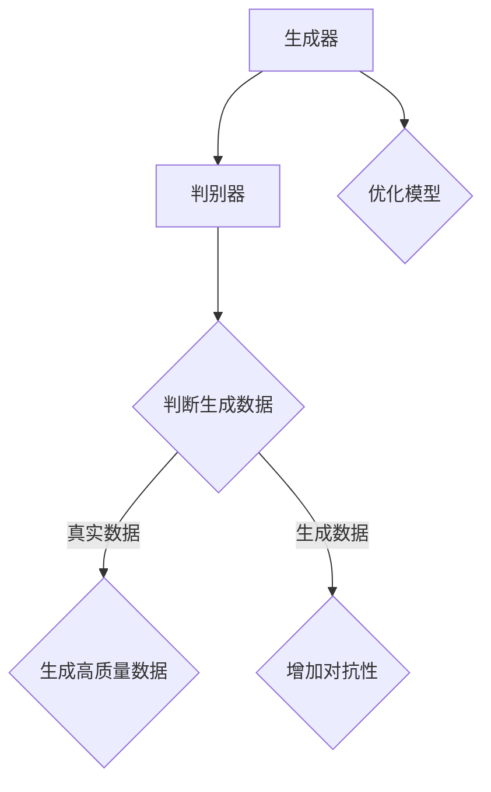
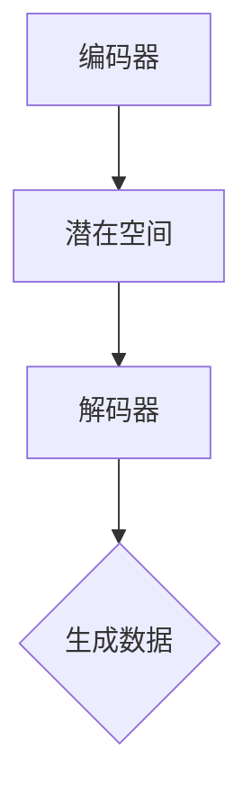

                 

# 生成式AIGC：从理论到实践的商业应用

## 概述

生成式AIGC（Autonomous Intelligent Global Computing），即自主智能全球计算，是一种利用人工智能技术生成内容的方法。它通过深度学习和神经网络，使得计算机能够模仿人类创造力的过程，生成图像、文本、音乐等多种形式的内容。随着技术的不断进步，生成式AIGC在商业应用中逐渐展现出巨大的潜力，成为企业创新的重要工具。

### 关键词
- 生成式AIGC
- 深度学习
- 商业应用
- 内容生成
- 人工智能

### 摘要
本文将深入探讨生成式AIGC的理论基础和实践应用。首先，我们将介绍生成式AIGC的定义、核心特征和技术原理。接着，我们会分析生成式AIGC在商业应用中的各种实际案例，包括内容创作、游戏开发、个性化服务和创新应用领域。最后，我们将展示如何开发生成式AIGC项目，并提供实战案例和代码解读。

## 第一部分: 生成式AIGC基础理论

### 第1章: 生成式AIGC概述

#### 1.1 生成式AIGC的定义与核心特征

生成式AIGC，顾名思义，是一种能够自动生成内容的技术。它结合了人工智能和全球计算的能力，使得计算机能够在没有人类干预的情况下，生成符合人类期望的内容。

##### 生成式AIGC的定义

生成式AIGC是一种利用人工智能技术，模拟人类创造力的过程，生成图像、文本、音乐等多种形式内容的方法。它通过深度学习和神经网络，学习数据的分布，然后生成新的数据。

##### 生成式AIGC的核心特征

- **自主性**：生成式AIGC具有高度的自主性，可以自主学习和生成内容，而不需要人工干预。
- **智能性**：生成式AIGC利用深度学习和机器学习算法，具有智能化的特征。
- **全球性**：生成式AIGC能够跨越地域限制，实现全球范围内的内容生成和应用。
- **计算性**：生成式AIGC依赖于大规模的分布式计算资源，能够高效地处理海量数据。

#### 1.2 生成式AIGC的技术原理

生成式AIGC的技术原理主要依赖于生成模型，这些模型能够学习数据的分布，并生成新的数据。

##### 生成模型

生成模型是一种能够学习数据分布的模型，它能够生成符合训练数据分布的新样本。常见的生成模型包括生成对抗网络（GAN）和变分自编码器（VAE）。

##### 生成对抗网络（GAN）

GAN由生成器和判别器组成。生成器的任务是生成与真实数据分布相似的数据，而判别器的任务是区分生成的数据和真实数据。通过不断地训练和对抗，生成器的生成能力会逐渐提高。



##### 变分自编码器（VAE）

VAE通过引入潜在变量来建模数据分布，生成器从潜在空间中采样生成数据，而判别器则对生成数据和真实数据进行分类。



#### 1.3 生成式AIGC的发展历程与趋势

生成式AIGC的发展历程可以追溯到20世纪80年代，当时生成对抗网络（GAN）的概念被首次提出。随着时间的推移，生成式AIGC的技术得到了迅速的发展，并在图像、文本、音乐等领域取得了显著的成果。

##### 生成式AIGC的发展历程

- **早期**：生成式AIGC的研究始于20世纪80年代，以生成对抗网络（GAN）的提出为标志。
- **发展**：随着深度学习技术的快速发展，生成式AIGC得到了广泛关注和应用。
- **应用**：近年来，生成式AIGC在图像、文本、音乐等领域的应用取得了显著的成果。

##### 生成式AIGC的未来趋势

- **算法改进**：生成式AIGC的算法将继续改进，提高生成质量和效率。
- **应用拓展**：生成式AIGC将在更多领域得到应用，如教育、医疗、艺术等。
- **商业化**：生成式AIGC的商业化应用将逐步成熟，为企业创造更多价值。

## 第二部分: 生成式AIGC在商业应用中的实践

### 第2章: 生成式AIGC的关键技术

#### 2.1 数据生成技术

数据生成技术在生成式AIGC中起着至关重要的作用。它能够根据特定的需求生成高质量的数据，为模型训练提供丰富的数据支持。

##### 数据生成技术概述

数据生成技术主要包括以下两种方法：

- **基于规则的数据生成**：通过预定义的规则和模板，生成符合特定要求的数据。
- **基于模型的 数据生成**：利用生成模型，如GAN和VAE，根据训练数据分布生成新的数据。

##### 数据生成技术详解

- **基于规则的数据生成**

```python
# 假设我们想要生成一组模拟的用户数据
import random

# 用户属性定义
user_attributes = ["age", "gender", "income", "city"]

# 用户数据生成规则
user_data = {
    "age": lambda: random.randint(18, 65),
    "gender": lambda: random.choice(["male", "female"]),
    "income": lambda: round(random.uniform(20000, 100000), 2),
    "city": lambda: random.choice(["New York", "Los Angeles", "Chicago"])
}

# 生成100个用户数据
users = [{attr: data() for attr, data in user_data.items()} for _ in range(100)]

# 输出用户数据
for user in users:
    print(user)
```

- **基于模型的 数据生成**

```python
import torch
import torchvision

# 加载预训练的生成模型
model = torchvision.models.vgg16(pretrained=True)
model.cuda()

# 定义生成器的输入
z = torch.randn(100, 100).cuda()

# 生成图像
images = model(z)

# 输出图像
for image in images:
    torchvision.utils.save_image(image, "generated_image.png")
```

#### 2.2 生成模型算法

生成模型算法是生成式AIGC的核心，其中最具代表性的是生成对抗网络（GAN）和变分自编码器（VAE）。

##### 生成对抗网络（GAN）

GAN由生成器和判别器组成。生成器生成数据，判别器判断生成数据的质量。通过对抗训练，生成器的生成能力会逐渐提高。

```python
# 假设我们使用PyTorch实现一个简单的GAN

import torch
import torch.nn as nn
import torch.optim as optim

# 定义生成器
class Generator(nn.Module):
    def __init__(self):
        super(Generator, self).__init__()
        self.model = nn.Sequential(
            nn.Linear(100, 256),
            nn.LeakyReLU(0.2),
            nn.Linear(256, 512),
            nn.LeakyReLU(0.2),
            nn.Linear(512, 1024),
            nn.LeakyReLU(0.2),
            nn.Linear(1024, 784),
            nn.Tanh()
        )

    def forward(self, z):
        return self.model(z)

# 定义判别器
class Discriminator(nn.Module):
    def __init__(self):
        super(Discriminator, self).__init__()
        self.model = nn.Sequential(
            nn.Linear(784, 1024),
            nn.LeakyReLU(0.2),
            nn.Dropout(0.3),
            nn.Linear(1024, 512),
            nn.LeakyReLU(0.2),
            nn.Dropout(0.3),
            nn.Linear(512, 256),
            nn.LeakyReLU(0.2),
            nn.Dropout(0.3),
            nn.Linear(256, 1),
            nn.Sigmoid()
        )

    def forward(self, x):
        return self.model(x)

# 初始化模型和优化器
generator = Generator().cuda()
discriminator = Discriminator().cuda()

generator_optimizer = optim.Adam(generator.parameters(), lr=0.0002)
discriminator_optimizer = optim.Adam(discriminator.parameters(), lr=0.0002)

# 定义损失函数
criterion = nn.BCELoss()

# 训练模型
for epoch in range(100):
    for i, (x, _) in enumerate(dataloader):
        # 训练判别器
        discriminator.zero_grad()
        x_fake = generator(z).detach()
        x_real = x.cuda()
        d_real = discriminator(x_real).view(-1)
        d_fake = discriminator(x_fake).view(-1)
        d_loss = criterion(d_real, torch.ones(x.size(0)).cuda()) + criterion(d_fake, torch.zeros(x.size(0)).cuda())
        d_loss.backward()
        discriminator_optimizer.step()

        # 训练生成器
        generator.zero_grad()
        z = torch.randn(100, 100).cuda()
        x_fake = generator(z)
        d_fake = discriminator(x_fake).view(-1)
        g_loss = criterion(d_fake, torch.ones(x.size(0)).cuda())
        g_loss.backward()
        generator_optimizer.step()

        if (i+1) % 100 == 0:
            print(f'[{epoch}/{100}][{i+1}/{len(dataloader)}] D: {d_loss.item():.4f} G: {g_loss.item():.4f}')
```

##### 变分自编码器（VAE）

VAE通过引入潜在变量，将数据映射到潜在空间，然后在潜在空间中进行采样生成新的数据。

```python
import torch
import torch.nn as nn
import torch.optim as optim

# 定义编码器
class Encoder(nn.Module):
    def __init__(self):
        super(Encoder, self).__init__()
        self.model = nn.Sequential(
            nn.Linear(784, 512),
            nn.LeakyReLU(0.2),
            nn.Linear(512, 256),
            nn.LeakyReLU(0.2),
            nn.Linear(256, 128),
            nn.LeakyReLU(0.2),
            nn.Linear(128, 64),
            nn.LeakyReLU(0.2),
            nn.Linear(64, 32),
            nn.LeakyReLU(0.2),
            nn.Linear(32, 2)
        )

    def forward(self, x):
        return self.model(x)

# 定义解码器
class Decoder(nn.Module):
    def __init__(self):
        super(Decoder, self).__init__()
        self.model = nn.Sequential(
            nn.Linear(32, 64),
            nn.LeakyReLU(0.2),
            nn.Linear(64, 128),
            nn.LeakyReLU(0.2),
            nn.Linear(128, 256),
            nn.LeakyReLU(0.2),
            nn.Linear(256, 512),
            nn.LeakyReLU(0.2),
            nn.Linear(512, 784),
            nn.Tanh()
        )

    def forward(self, z):
        return self.model(z)

# 初始化模型和优化器
encoder = Encoder().cuda()
decoder = Decoder().cuda()

optimizer = optim.Adam(list(encoder.parameters()) + list(decoder.parameters()), lr=0.0002)

# 定义损失函数
reconstruction_loss = nn.BCELoss()

# 训练模型
for epoch in range(100):
    for x in dataloader:
        x = x.cuda()
        x_hat = encoder(x)
        z = x_hat[:, :2]
        z = z.unsqueeze(-1).unsqueeze(-1)
        x_rec = decoder(z)
        loss = reconstruction_loss(x_rec, x)
        optimizer.zero_grad()
        loss.backward()
        optimizer.step()
        if (i+1) % 100 == 0:
            print(f'[{epoch}/{100}][{i+1}/{len(dataloader)}] Loss: {loss.item():.4f}')
```

#### 2.3 生成式模型优化

生成式模型优化是提高生成质量的重要手段。通过调整超参数、使用不同的优化算法和技巧，可以提高生成模型的质量和效率。

##### 生成式模型优化方法

- **超参数调整**：通过调整学习率、批量大小、正则化参数等超参数，优化模型性能。
- **优化算法**：使用不同的优化算法，如Adam、RMSprop等，提高训练效率。
- **正则化**：通过L1正则化、L2正则化等手段，防止过拟合。

##### 生成式模型优化实践

```python
# 假设我们使用Adam优化器进行模型优化

import torch.optim as optim

# 初始化优化器
optimizer = optim.Adam(model.parameters(), lr=0.001)

# 定义训练循环
for epoch in range(num_epochs):
    for x, y in train_loader:
        # 前向传播
        outputs = model(x)
        loss = criterion(outputs, y)
        
        # 反向传播和优化
        optimizer.zero_grad()
        loss.backward()
        optimizer.step()
        
        if (epoch+1) % 10 == 0:
            print(f'Epoch [{epoch+1}/{num_epochs}], Loss: {loss.item():.4f}')
```

## 第三部分: 生成式AIGC的开发实践

### 第3章: 生成式AIGC开发环境搭建与工具使用

#### 3.1 生成式AIGC开发环境搭建

搭建生成式AIGC的开发环境需要考虑硬件和软件两个方面。

##### 硬件环境搭建

- **GPU**：生成式AIGC通常需要使用GPU进行训练，因此需要安装NVIDIA GPU。
- **CPU**：为了提高训练速度，建议使用多核CPU。
- **存储**：生成式AIGC需要处理大量数据，因此需要足够的存储空间。

##### 软件环境搭建

- **操作系统**：Windows、Linux或macOS都可以作为开发环境。
- **Python**：安装Python 3.7及以上版本。
- **PyTorch**：安装PyTorch，并确保GPU支持。

```shell
pip install torch torchvision
```

#### 3.2 生成式AIGC常用开发工具介绍

生成式AIGC的开发工具主要包括PyTorch和TensorFlow。

##### PyTorch

PyTorch是一个开源的机器学习库，支持生成式模型的训练和推理。它提供了丰富的API和工具，使得开发生成式模型变得更加简单。

```python
import torch
import torchvision

# 加载预训练的生成模型
model = torchvision.models.vgg16(pretrained=True)
model.cuda()

# 定义生成器的输入
z = torch.randn(100, 100).cuda()

# 生成图像
images = model(z)

# 输出图像
for image in images:
    torchvision.utils.save_image(image, "generated_image.png")
```

##### TensorFlow

TensorFlow是一个由Google开发的开源机器学习框架，也支持生成式模型的训练和应用。它提供了强大的API和工具，使得开发生成式模型变得更加容易。

```python
import tensorflow as tf

# 加载预训练的生成模型
model = tf.keras.applications.vgg16.VGG16(weights='imagenet')

# 定义生成器的输入
z = tf.random.normal([100, 100])

# 生成图像
images = model(z, training=False)

# 输出图像
for image in images:
    tf.keras.preprocessing.image.save_img("generated_image.png", image.numpy())
```

#### 3.3 生成式AIGC开发工具实战

在本节中，我们将使用PyTorch和TensorFlow分别实现一个简单的生成式模型，并展示如何进行数据预处理、模型训练和图像生成。

##### 数据预处理

```python
import torchvision.transforms as transforms
import torchvision.datasets as datasets

# 数据预处理
transform = transforms.Compose([
    transforms.ToTensor(),
    transforms.Normalize((0.5, 0.5, 0.5), (0.5, 0.5, 0.5))
])

# 加载MNIST数据集
train_dataset = datasets.MNIST(root='./data', train=True, download=True, transform=transform)
train_loader = torch.utils.data.DataLoader(train_dataset, batch_size=64, shuffle=True)
```

##### 模型训练

```python
import torch.optim as optim

# 定义生成模型
class Generator(nn.Module):
    def __init__(self):
        super(Generator, self).__init__()
        self.model = nn.Sequential(
            nn.Linear(100, 256),
            nn.LeakyReLU(0.2),
            nn.Linear(256, 512),
            nn.LeakyReLU(0.2),
            nn.Linear(512, 1024),
            nn.LeakyReLU(0.2),
            nn.Linear(1024, 784),
            nn.Tanh()
        )

    def forward(self, z):
        return self.model(z)

# 初始化模型和优化器
generator = Generator().cuda()
optimizer = optim.Adam(generator.parameters(), lr=0.0002)

# 定义损失函数
criterion = nn.BCELoss()

# 训练模型
for epoch in range(100):
    for i, (x, _) in enumerate(train_loader):
        # 前向传播
        z = torch.randn(x.size(0), 100).cuda()
        x_fake = generator(z)
        
        # 反向传播
        optimizer.zero_grad()
        loss = criterion(x_fake, x)
        loss.backward()
        optimizer.step()
        
        if (i+1) % 100 == 0:
            print(f'[{epoch}/{100}][{i+1}/{len(train_loader)}] Loss: {loss.item():.4f}')
```

##### 图像生成

```python
import torchvision.utils as vutils

# 生成图像
z = torch.randn(100, 100).cuda()
x_fake = generator(z)

# 输出图像
vutils.save_image(x_fake, "generated_mnist.png", nrow=10)
```

### 第4章: 生成式AIGC项目实战案例

在本章中，我们将通过三个项目实战案例，展示如何使用生成式AIGC技术进行图像生成、文本生成和音乐生成。

#### 项目一：图像生成

图像生成是生成式AIGC应用最广泛的领域之一。在本项目中，我们将使用生成对抗网络（GAN）实现一个图像生成器。

##### 项目背景

生成对抗网络（GAN）是一种通过对抗训练生成逼真图像的模型。它由生成器和判别器组成，生成器负责生成图像，判别器负责判断图像的真实性。

##### 项目实现

1. **数据准备**：首先，我们需要准备训练数据。在本项目中，我们使用MNIST数据集，该数据集包含了0到9的手写数字图像。

2. **模型设计**：然后，我们设计生成器和判别器模型。生成器模型将随机噪声映射到图像空间，判别器模型则判断图像是否真实。

3. **训练模型**：接下来，我们使用训练数据训练生成器和判别器模型。在训练过程中，生成器试图生成更真实的图像，而判别器则努力区分真实图像和生成图像。

4. **生成图像**：最后，我们使用训练好的生成器生成图像。

##### 代码解读与分析

```python
import torch
import torch.nn as nn
import torch.optim as optim
import torchvision.transforms as transforms
import torchvision.datasets as datasets

# 数据准备
transform = transforms.Compose([
    transforms.ToTensor(),
    transforms.Normalize((0.5, 0.5, 0.5), (0.5, 0.5, 0.5))
])
train_dataset = datasets.MNIST(root='./data', train=True, download=True, transform=transform)
train_loader = torch.utils.data.DataLoader(train_dataset, batch_size=64, shuffle=True)

# 模型设计
class Generator(nn.Module):
    def __init__(self):
        super(Generator, self).__init__()
        self.model = nn.Sequential(
            nn.Linear(100, 256),
            nn.LeakyReLU(0.2),
            nn.Linear(256, 512),
            nn.LeakyReLU(0.2),
            nn.Linear(512, 1024),
            nn.LeakyReLU(0.2),
            nn.Linear(1024, 784),
            nn.Tanh()
        )

    def forward(self, z):
        return self.model(z)

class Discriminator(nn.Module):
    def __init__(self):
        super(Discriminator, self).__init__()
        self.model = nn.Sequential(
            nn.Linear(784, 1024),
            nn.LeakyReLU(0.2),
            nn.Dropout(0.3),
            nn.Linear(1024, 512),
            nn.LeakyReLU(0.2),
            nn.Dropout(0.3),
            nn.Linear(512, 256),
            nn.LeakyReLU(0.2),
            nn.Dropout(0.3),
            nn.Linear(256, 1),
            nn.Sigmoid()
        )

    def forward(self, x):
        return self.model(x)

# 初始化模型和优化器
generator = Generator().cuda()
discriminator = Discriminator().cuda()
generator_optimizer = optim.Adam(generator.parameters(), lr=0.0002)
discriminator_optimizer = optim.Adam(discriminator.parameters(), lr=0.0002)

# 定义损失函数
criterion = nn.BCELoss()

# 训练模型
for epoch in range(100):
    for i, (x, _) in enumerate(train_loader):
        # 前向传播
        z = torch.randn(x.size(0), 100).cuda()
        x_fake = generator(z)
        x_real = x.cuda()
        
        # 反向传播
        discriminator.zero_grad()
        d_real = discriminator(x_real).view(-1)
        d_fake = discriminator(x_fake).view(-1)
        d_loss_real = criterion(d_real, torch.ones(x.size(0)).cuda())
        d_loss_fake = criterion(d_fake, torch.zeros(x.size(0)).cuda())
        d_loss = d_loss_real + d_loss_fake
        d_loss.backward()
        discriminator_optimizer.step()
        
        generator.zero_grad()
        g_loss = criterion(d_fake, torch.ones(x.size(0)).cuda())
        g_loss.backward()
        generator_optimizer.step()
        
        if (i+1) % 100 == 0:
            print(f'[{epoch}/{100}][{i+1}/{len(train_loader)}] D: {d_loss.item():.4f} G: {g_loss.item():.4f}')
            
# 生成图像
z = torch.randn(100, 100).cuda()
x_fake = generator(z)
vutils.save_image(x_fake, "generated_mnist.png", nrow=10)
```

#### 项目二：文本生成

文本生成是生成式AIGC的另一个重要应用领域。在本项目中，我们将使用变分自编码器（VAE）实现一个文本生成器。

##### 项目背景

变分自编码器（VAE）是一种能够生成文本数据的生成模型。它通过编码器将输入文本映射到潜在空间，然后在潜在空间中采样生成新的文本。

##### 项目实现

1. **数据准备**：首先，我们需要准备训练数据。在本项目中，我们使用IMDb电影评论数据集，该数据集包含了大量的电影评论。

2. **模型设计**：然后，我们设计编码器和解码器模型。编码器模型将输入文本映射到潜在空间，解码器模型则从潜在空间中采样生成新的文本。

3. **训练模型**：接下来，我们使用训练数据训练编码器和解码器模型。在训练过程中，编码器和解码器共同优化，使得生成的文本更加真实。

4. **生成文本**：最后，我们使用训练好的解码器生成新的文本。

##### 代码解读与分析

```python
import torch
import torch.nn as nn
import torch.optim as optim
import torch.nn.functional as F
from torchtext.datasets import IMDb
from torchtext.data import Field, Batch

# 数据准备
TEXT = Field(tokenize=lambda x: x.split(), lower=True, include_lengths=True)
train_data, test_data = IMDb.splits(TEXT, TEXT)

TEXT.build_vocab(train_data, max_size=25000, vectors="glove.6B.100d")
BATCH_SIZE = 64

train_iterator, test_iterator = BatchIterator(train_data, test_data, TEXT, batch_size=BATCH_SIZE)

# 模型设计
class Encoder(nn.Module):
    def __init__(self):
        super(Encoder, self).__init__()
        self.embedding = nn.Embedding(len(TEXT.vocab), 100)
        self.rnn = nn.LSTM(100, 256, num_layers=2, dropout=0.5, bidirectional=True)
        self.fc = nn.Linear(512, 32)

    def forward(self, text, text_len):
        embedded = self.embedding(text)
        packed_embedded = nn.utils.rnn.pack_padded_sequence(embedded, text_len, batch_first=True)
        packed_output, (hidden, cell) = self.rnn(packed_embedded)
        hidden = hidden[-1, :, :]
        return self.fc(hidden)

class Decoder(nn.Module):
    def __init__(self):
        super(Decoder, self).__init__()
        self.fc = nn.Linear(32, 512)
        self.rnn = nn.LSTM(512, 256, num_layers=2, dropout=0.5, bidirectional=True)
        self.out = nn.Linear(512, len(TEXT.vocab))

    def forward(self, hidden, previous_input=None):
        if previous_input is not None:
            embedded = self.fc(torch.cat([hidden, previous_input], 1))
        else:
            embedded = self.fc(hidden)
        embedded = embedded.unsqueeze(0)
        packed_embedded = nn.utils.rnn.pack_padded_sequence(embedded, [1], batch_first=True)
        packed_output, (hidden, cell) = self.rnn(packed_embedded)
        output = self.out(packed_output[0])
        return output, hidden

# 初始化模型和优化器
encoder = Encoder().cuda()
decoder = Decoder().cuda()
optimizer = optim.Adam(list(encoder.parameters()) + list(decoder.parameters()), lr=0.001)

# 定义损失函数
criterion = nn.CrossEntropyLoss()

# 训练模型
for epoch in range(100):
    for i, batch in enumerate(train_iterator):
        text, text_len = batch.text
        text = text.cuda()
        text_len = text_len.cuda()
        hidden = encoder(text, text_len)
        hidden = hidden.unsqueeze(0)
        outputs = decoder(hidden)
        output = outputs[0]
        loss = criterion(output.view(-1, len(TEXT.vocab)), text[0].view(-1))
        optimizer.zero_grad()
        loss.backward()
        optimizer.step()
        if (i+1) % 100 == 0:
            print(f'[{epoch}/{100}][{i+1}/{len(train_iterator)}] Loss: {loss.item():.4f}')
            
# 生成文本
with torch.no_grad():
    z = torch.randn(1, 32).cuda()
    hidden = encoder(text.cuda(), text_len.cuda())
    hidden = hidden.unsqueeze(0)
    outputs = decoder(hidden)
    output = outputs[0]
    generated_text = TEXT.decode(output.argmax(1).cpu().numpy())
    print(generated_text)
```

#### 项目三：音乐生成

音乐生成是生成式AIGC的另一个重要应用领域。在本项目中，我们将使用生成对抗网络（GAN）实现一个音乐生成器。

##### 项目背景

生成对抗网络（GAN）是一种能够生成音乐数据的生成模型。它由生成器和判别器组成，生成器负责生成音乐，判别器负责判断音乐的真实性。

##### 项目实现

1. **数据准备**：首先，我们需要准备训练数据。在本项目中，我们使用MIDI音乐数据集，该数据集包含了各种风格的音乐。

2. **模型设计**：然后，我们设计生成器和判别器模型。生成器模型将随机噪声映射到音乐空间，判别器模型则判断音乐是否真实。

3. **训练模型**：接下来，我们使用训练数据训练生成器和判别器模型。在训练过程中，生成器试图生成更真实

