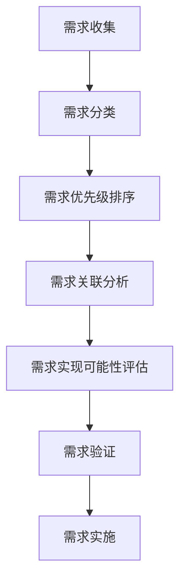
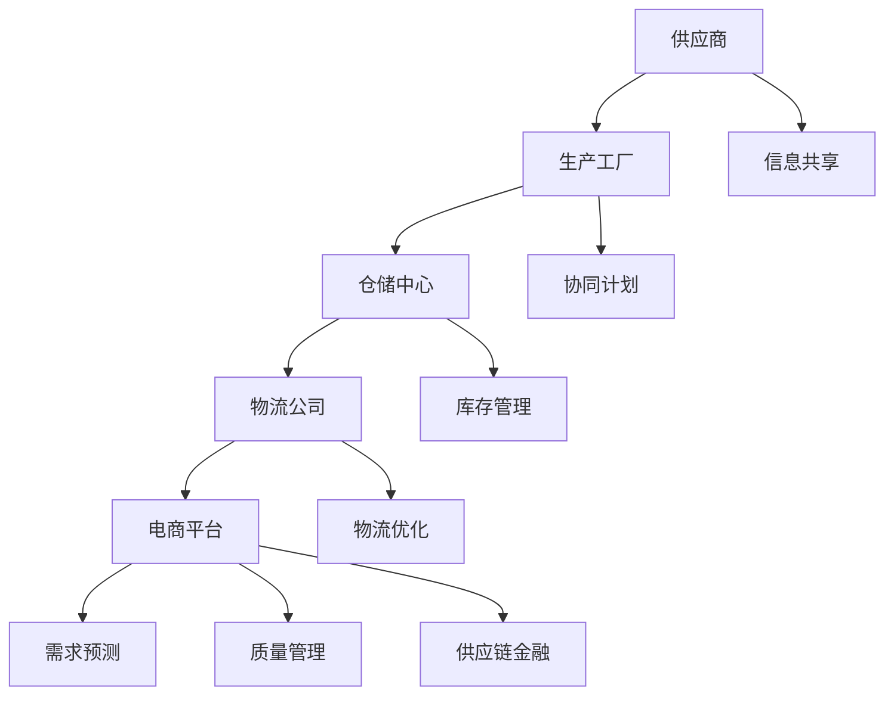

                 

# 《电商平台供给能力提升：数据驱动决策》

> **关键词**：电商平台、供给能力、数据驱动决策、数据分析、库存优化、供应链协同

> **摘要**：随着电商平台的快速发展，供给能力的提升成为关键挑战。本文通过数据驱动决策的方法，详细分析了电商平台供给能力提升的背景、核心概念、数据收集与处理、数据分析与挖掘技术、数据可视化与展示、实践案例以及未来趋势与挑战，旨在为电商平台供给能力的优化提供科学依据和实用指南。

### 目录大纲

# 《电商平台供给能力提升：数据驱动决策》

## 第一部分：电商平台供给能力提升的背景与概念

### 第1章：电商平台供给能力提升的背景与意义

#### 1.1 电商平台的发展历程

#### 1.2 供给能力提升的重要性

#### 1.3 数据驱动决策的核心概念

### 第2章：电商平台供给能力核心概念与模型

#### 2.1 供给能力的定义

#### 2.2 供给能力评估模型

#### 2.3 数据驱动决策的基本原理

## 第二部分：数据驱动决策方法与技术

### 第3章：数据收集与处理

#### 3.1 数据来源与类型

#### 3.2 数据清洗与预处理

#### 3.3 数据分析基础

### 第4章：数据分析与挖掘技术

#### 4.1 关键指标与维度

#### 4.2 数据挖掘方法

#### 4.3 实时数据处理技术

### 第5章：数据可视化与展示

#### 5.1 数据可视化基础

#### 5.2 可视化工具与应用

#### 5.3 数据报表与仪表盘

## 第三部分：供给能力提升的实践案例

### 第6章：电商平台的用户需求分析

#### 6.1 用户需求收集

#### 6.2 用户需求分析

#### 6.3 用户行为分析模型

### 第7章：商品库存优化

#### 7.1 库存优化策略

#### 7.2 库存管理模型

#### 7.3 实际案例解析

### 第8章：供应链协同优化

#### 8.1 供应链协同机制

#### 8.2 供应链绩效评估

#### 8.3 供应链协同优化案例

## 第四部分：数据驱动决策的展望与挑战

### 第9章：数据驱动决策的未来趋势

#### 9.1 人工智能在数据驱动决策中的应用

#### 9.2 数据安全与隐私保护

#### 9.3 数据驱动决策的可持续发展

### 第10章：数据驱动决策的挑战与应对策略

#### 10.1 数据驱动决策的复杂性

#### 10.2 数据质量与准确性的挑战

#### 10.3 决策者的角色与能力建设

## 附录

### 附录 A：数据驱动决策工具与资源

#### A.1 数据分析工具介绍

#### A.2 数据可视化工具介绍

#### A.3 数据挖掘算法与应用案例

### <|assistant|>## 第一部分：电商平台供给能力提升的背景与概念

### 第1章：电商平台供给能力提升的背景与意义

#### 1.1 电商平台的发展历程

电商平台作为互联网经济发展的重要驱动力，已经走过了几十年的发展历程。从最初的网上拍卖、B2B电子商务，到现在的B2C、C2C、O2O等多种模式，电商平台不断拓展和深化。根据阿里巴巴集团的统计数据，截至2022年底，中国电商市场的交易规模已经达到了数十万亿元人民币，占国内零售市场的比例超过20%。

电商平台的发展历程可以分为以下几个阶段：

1. **起步阶段（1990年代初至2000年初）**：以网上拍卖和目录销售为主，如eBay、亚马逊等。
2. **快速发展阶段（2000年至2010年初）**：中国电商市场的兴起，阿里巴巴、京东等企业快速发展，电商模式逐渐丰富。
3. **成熟阶段（2010年至2020年）**：移动互联网普及，电商模式多样化，O2O电商、社交电商等新业态不断涌现。
4. **智慧化阶段（2020年至今）**：人工智能、大数据、云计算等技术在电商领域的应用，推动电商平台向智慧化、个性化方向发展。

#### 1.2 供给能力提升的重要性

在电商平台的快速发展过程中，供给能力的提升成为关键挑战。供给能力是指电商平台满足消费者需求的能力，包括商品种类、数量、价格、配送时效等方面。供给能力的提升对电商平台具有以下重要意义：

1. **提高用户满意度**：供给能力提升能够更好地满足用户需求，提高用户体验，增加用户黏性。
2. **提升市场份额**：在竞争激烈的电商市场中，拥有更强的供给能力有助于扩大市场份额，提升竞争力。
3. **增加收入和利润**：供给能力提升能够带来更多的交易量和用户复购率，从而提高收入和利润。
4. **优化供应链**：供给能力提升有助于优化供应链管理，降低库存成本，提高物流效率。

#### 1.3 数据驱动决策的核心概念

数据驱动决策是指利用大数据、人工智能等技术，对海量数据进行采集、处理、分析，从而支持决策的过程。在电商平台供给能力提升中，数据驱动决策具有以下几个核心概念：

1. **数据采集**：通过多种渠道收集用户行为数据、交易数据、市场数据等，为数据分析提供基础。
2. **数据处理**：对采集到的数据进行清洗、预处理，使其适合分析和建模。
3. **数据建模**：利用统计学、机器学习等技术，对数据进行建模，提取有用的特征和规律。
4. **数据可视化**：将分析结果通过可视化工具进行展示，帮助决策者更好地理解和应用。
5. **决策支持**：基于数据分析和模型预测，为决策者提供科学依据和决策支持。

在接下来的章节中，我们将详细探讨数据驱动决策在电商平台供给能力提升中的应用，包括数据收集与处理、数据分析与挖掘技术、数据可视化与展示等。希望通过本文的阐述，为电商平台的供给能力提升提供有益的参考和指导。

### 第2章：电商平台供给能力核心概念与模型

#### 2.1 供给能力的定义

供给能力（Supply Capability）是指电商平台在特定条件下，满足消费者需求的能力。它不仅包括商品种类、数量、价格，还包括配送时效、售后服务等方面。供给能力是一个多维度的概念，可以从以下几个方面进行理解：

1. **商品种类**：电商平台提供的商品种类丰富程度，包括各类商品的数量、品牌、款式等。
2. **商品数量**：电商平台能够提供的商品数量，包括库存量和实时供应量。
3. **商品价格**：商品的价格竞争力，包括市场价格、折扣优惠等。
4. **配送时效**：商品配送的时间长度，包括下单后商品送达消费者手中的时间。
5. **售后服务**：电商平台的售后服务质量，包括退换货政策、客户服务响应速度等。

#### 2.2 供给能力评估模型

为了提升电商平台的供给能力，首先需要建立一套科学的供给能力评估模型。供给能力评估模型可以帮助电商平台了解自身的供给能力现状，发现存在的问题，并制定相应的改进措施。以下是一个简单的供给能力评估模型：

1. **评估指标**：根据供给能力的定义，可以设定以下几个评估指标：
   - 商品种类多样性
   - 商品供应充足度
   - 商品价格竞争力
   - 配送时效性
   - 售后服务质量

2. **评估方法**：采用定量和定性相结合的方法进行评估。定量评估可以通过收集数据，计算每个指标的得分；定性评估可以通过专家评审、用户反馈等方式进行。

3. **评估流程**：
   - 数据收集：收集电商平台相关的运营数据，如商品种类、库存量、价格、配送时效等。
   - 数据处理：对收集到的数据进行分析和清洗，确保数据的准确性和完整性。
   - 指标计算：根据设定的评估指标，计算每个指标的得分。
   - 结果分析：综合各个指标的得分，评估电商平台的总体供给能力。

#### 2.3 数据驱动决策的基本原理

数据驱动决策（Data-Driven Decision Making）是指利用大数据、人工智能等技术，对海量数据进行处理和分析，从而支持决策的过程。在电商平台供给能力提升中，数据驱动决策具有以下几个基本原理：

1. **数据采集**：通过多种渠道收集与供给能力相关的数据，如用户行为数据、市场数据、供应链数据等。

2. **数据处理**：对采集到的数据进行清洗、整合和预处理，使其适合分析和建模。

3. **数据建模**：利用统计学、机器学习等技术，对数据进行建模，提取有用的特征和规律。

4. **数据可视化**：将分析结果通过可视化工具进行展示，帮助决策者更好地理解和应用。

5. **决策支持**：基于数据分析和模型预测，为决策者提供科学依据和决策支持。

在实际应用中，数据驱动决策通常包括以下几个步骤：

1. **明确决策目标**：确定需要解决的问题或目标，如提升商品种类多样性、优化配送时效等。
2. **数据收集**：根据决策目标，收集相关的数据，如用户行为数据、市场数据、供应链数据等。
3. **数据处理**：对收集到的数据进行分析和清洗，确保数据的准确性和完整性。
4. **数据建模**：利用统计学、机器学习等技术，对数据进行建模，提取有用的特征和规律。
5. **数据可视化**：将分析结果通过可视化工具进行展示，帮助决策者更好地理解和应用。
6. **决策支持**：基于数据分析和模型预测，为决策者提供科学依据和决策支持。

通过以上步骤，电商平台可以更好地提升供给能力，提高用户满意度，增加市场份额，实现可持续发展。

### 第3章：数据收集与处理

#### 3.1 数据来源与类型

在数据驱动决策过程中，数据收集是第一步，也是至关重要的一步。数据来源和类型决定了数据的质量和可用性，从而影响到后续的数据处理和分析效果。以下是一些常见的数据来源和类型：

1. **用户行为数据**：这是电商平台中最常见的数据来源，包括用户在平台上的浏览记录、购买记录、评论反馈等。用户行为数据能够反映用户的需求和偏好，对于商品推荐、个性化营销等具有重要作用。

2. **交易数据**：交易数据包括订单数据、支付数据、退款数据等。这些数据可以用来分析用户购买行为、商品销售趋势等，是电商平台进行库存管理、营销策略制定的重要依据。

3. **市场数据**：市场数据包括竞争对手的数据、行业趋势数据、市场供需关系等。这些数据可以帮助电商平台了解市场环境，制定符合市场需求的策略。

4. **供应链数据**：供应链数据包括供应商信息、物流信息、库存信息等。这些数据有助于电商平台优化供应链管理，提高配送效率，降低库存成本。

5. **社交媒体数据**：社交媒体平台如微博、微信、抖音等，也是重要的数据来源。这些数据可以反映用户的情绪、态度和行为，对于品牌形象建设、危机管理具有重要意义。

6. **外部数据**：外部数据包括经济数据、政策数据、行业报告等。这些数据可以帮助电商平台了解宏观经济环境、政策导向等，从而做出更为科学的决策。

#### 3.2 数据清洗与预处理

收集到的大量原始数据通常存在噪声、缺失值、不一致性等问题，这些都会影响数据的质量和后续分析的准确性。因此，数据清洗与预处理是数据驱动决策过程中必不可少的一步。以下是一些常见的数据清洗与预处理方法：

1. **数据去噪**：去除数据中的噪声，如异常值、重复记录等。可以使用统计学方法、机器学习方法等来识别和去除噪声。

2. **数据补全**：对于缺失值的数据，可以通过插值、均值填补、回归分析等方法进行补全。补全缺失值可以减少数据的不完整性，提高数据的可用性。

3. **数据规范化**：将不同数据源的数据进行统一格式和处理，如将不同数据源的时间格式统一为同一标准，将不同单位的数据转换为同一单位等。

4. **数据转换**：将数据转换为适合分析的形式，如将分类数据转换为数值数据，将连续数据转换为离散数据等。

5. **数据降维**：通过降维技术，将高维数据转换为低维数据，减少数据的大小和复杂度。常见的降维技术包括主成分分析（PCA）、因子分析等。

6. **数据归一化**：将数据归一化到同一范围内，如将所有数据的范围调整到0到1之间。归一化可以消除不同指标之间量纲的影响，提高分析结果的准确性。

#### 3.3 数据分析基础

数据分析是数据驱动决策的核心环节，通过对数据的处理和分析，可以提取出有价值的信息和知识。以下是一些常见的数据分析方法和工具：

1. **描述性统计分析**：用于描述数据的分布特征和基本统计量，如均值、方差、中位数等。描述性统计分析可以帮助了解数据的整体情况。

2. **相关性分析**：用于分析两个或多个变量之间的相关性，如皮尔逊相关系数、斯皮尔曼相关系数等。相关性分析可以帮助识别变量之间的关系，为后续的分析提供依据。

3. **回归分析**：用于建立变量之间的线性或非线性关系模型，如简单线性回归、多元线性回归、逻辑回归等。回归分析可以用于预测和分析，帮助决策者做出科学决策。

4. **聚类分析**：用于将数据分为不同的类别，如K-means聚类、层次聚类等。聚类分析可以帮助发现数据的潜在模式，为市场细分、用户群体分析等提供参考。

5. **分类分析**：用于将数据分为不同的类别，如决策树、随机森林、支持向量机等。分类分析可以用于预测和分类，帮助决策者做出正确的决策。

6. **关联规则挖掘**：用于发现数据中的关联规则，如Apriori算法、FP-growth算法等。关联规则挖掘可以用于推荐系统、市场细分等。

7. **时间序列分析**：用于分析时间序列数据，如自回归移动平均模型（ARMA）、自回归积分滑动平均模型（ARIMA）等。时间序列分析可以用于预测未来趋势，为库存管理、市场营销等提供参考。

通过以上数据收集、处理和分析方法，电商平台可以更好地了解用户需求、优化供应链、提升供给能力，从而实现数据驱动决策的目标。

### 第4章：数据分析与挖掘技术

#### 4.1 关键指标与维度

在电商平台的数据分析和挖掘过程中，关键指标和维度是分析和决策的重要基础。以下是几个关键指标及其相关维度：

1. **用户活跃度**：衡量用户参与平台活动的频率和深度，包括：
   - **登录频率**：用户在一段时间内登录平台的次数。
   - **页面浏览量**：用户在平台内浏览的页面数量。
   - **互动行为**：用户在平台上的评论、点赞、分享等互动行为。

2. **订单量与销售额**：反映平台的销售状况，包括：
   - **订单数量**：一定时间内生成的订单总数。
   - **销售额**：订单金额的总和。
   - **订单转化率**：访问者与购买者之间的转化比例。

3. **库存周转率**：衡量库存管理的效率，包括：
   - **库存周转次数**：一定时间内库存的周转次数。
   - **库存天数**：平均每个商品库存的时间长度。

4. **配送时效**：反映物流效率和服务质量，包括：
   - **配送时长**：从订单生成到商品送达的平均时间。
   - **配送准时率**：按时送达的订单比例。

5. **用户满意度**：衡量用户对平台服务的整体评价，包括：
   - **评分**：用户对商品和服务的评分。
   - **反馈率**：用户提交反馈的比例。

6. **商品热销度**：衡量商品的销售热度，包括：
   - **销量**：商品的销售数量。
   - **点击率**：商品页面被点击的次数。

7. **市场竞争度**：衡量平台在市场中的竞争状况，包括：
   - **市场份额**：平台在市场中的占比。
   - **竞争对手分析**：竞争对手的销售策略、价格、市场份额等。

#### 4.2 数据挖掘方法

数据挖掘是从大量数据中发现有价值模式和知识的过程。以下是一些常用的数据挖掘方法：

1. **分类**：将数据分为不同的类别。常见的算法有K-近邻（K-Nearest Neighbors, KNN）、决策树（Decision Tree）等。

   ```python
   # 决策树分类算法伪代码
   def classify_decision_tree(data, labels, test_data):
       # 构建决策树
       tree = build_decision_tree(data, labels)
       # 对测试数据进行分类
       predictions = []
       for instance in test_data:
           prediction = classify_instance(instance, tree)
           predictions.append(prediction)
       return predictions
   ```

2. **回归**：预测连续值。常见的算法有线性回归（Linear Regression）、决策树回归（Decision Tree Regression）等。

   ```python
   # 线性回归算法伪代码
   def linear_regression(data, labels):
       # 计算模型参数
       theta = compute_theta(data, labels)
       # 预测
       predictions = []
       for instance in data:
           prediction = predict_instance(instance, theta)
           predictions.append(prediction)
       return predictions
   ```

3. **聚类**：将数据分为不同的簇。常见的算法有K-均值聚类（K-Means Clustering）、层次聚类（Hierarchical Clustering）等。

   ```python
   # K-均值聚类算法伪代码
   def k_means_clustering(data, k):
       # 初始化聚类中心
       centroids = initialize_centroids(data, k)
       # 迭代优化聚类中心
       while not converged(centroids):
           old_centroids = centroids
           centroids = update_centroids(data, centroids)
       # 分配数据到聚类中心
       clusters = assign_clusters(data, centroids)
       return clusters
   ```

4. **关联规则挖掘**：发现数据中的关联规则。常见的算法有Apriori算法、FP-growth算法等。

   ```python
   # Apriori算法伪代码
   def apriori(data, min_support, min_confidence):
       # 生成频繁项集
       frequent_itemsets = generate_frequent_itemsets(data, min_support)
       # 生成关联规则
       rules = generate_rules(frequent_itemsets, min_confidence)
       return rules
   ```

5. **异常检测**：识别数据中的异常点。常见的算法有孤立森林（Isolation Forest）、Local Outlier Factor（LOF）等。

   ```python
   # Isolation Forest算法伪代码
   def isolation_forest(data, n_estimators):
       # 构建隔离森林模型
       model = build_isolation_forest_model(data, n_estimators)
       # 识别异常点
       outliers = model.fit_predict(data)
       return outliers
   ```

6. **文本挖掘**：处理和分析文本数据。常见的算法有词袋模型（Bag of Words, BoW）、主题模型（Topic Modeling）等。

   ```python
   # 词袋模型伪代码
   def bag_of_words(texts):
       # 创建词汇表
       vocabulary = create_vocabulary(texts)
       # 将文本转换为向量
       vectors = []
       for text in texts:
           vector = convert_text_to_vector(text, vocabulary)
           vectors.append(vector)
       return vectors
   ```

通过以上数据挖掘方法，电商平台可以深入分析用户行为、商品销售、市场趋势等，从而为决策提供有力的支持。

#### 4.3 实时数据处理技术

实时数据处理技术在电商平台中至关重要，尤其是在用户行为分析和供应链管理方面。以下是一些常见的实时数据处理技术和工具：

1. **流处理框架**：如Apache Kafka、Apache Flink、Apache Storm等。这些框架可以处理实时数据流，保证数据的高吞吐量和低延迟。

   ```mermaid
   flowchart LR
   A[数据源] --> B[流处理框架]
   B --> C[数据处理]
   C --> D[数据存储]
   D --> E[数据分析]
   ```

2. **消息队列**：如Apache Kafka、RabbitMQ等。消息队列可以缓冲和传输实时数据，确保数据的高可用性和一致性。

   ```mermaid
   flowchart LR
   A[数据源] --> B[Kafka]
   B --> C[消息队列]
   C --> D[消费者]
   ```

3. **分布式存储**：如Hadoop HDFS、Apache Cassandra等。分布式存储可以处理海量数据，保证数据的可靠性和高可用性。

   ```mermaid
   flowchart LR
   A[数据源] --> B[HDFS]
   B --> C[Cassandra]
   ```

4. **实时查询引擎**：如Apache Druid、ClickHouse等。实时查询引擎可以快速执行实时查询，提供低延迟的数据分析能力。

   ```mermaid
   flowchart LR
   A[数据源] --> B[Druid]
   B --> C[查询]
   ```

5. **实时机器学习**：如TensorFlow Serving、PyTorch Serving等。实时机器学习可以在线更新模型，实现实时预测和分析。

   ```mermaid
   flowchart LR
   A[数据流] --> B[模型]
   B --> C[预测]
   ```

通过以上实时数据处理技术，电商平台可以实现实时用户行为分析、库存优化、订单处理等，提高运营效率和服务质量。

### 第5章：数据可视化与展示

#### 5.1 数据可视化基础

数据可视化是将数据以图形化的方式展示，帮助人们更直观地理解数据和信息。以下是一些常见的数据可视化图表类型：

1. **柱状图**：用于比较不同类别或时间段的数据，如销售额、订单量等。

   ```mermaid
   flowchart LR
   A[类别1] --> B{销售额}
   A --> C[类别2]
   A --> D[类别3]
   ```

2. **折线图**：用于展示数据的变化趋势，如用户活跃度、库存周转率等。

   ```mermaid
   flowchart LR
   A[时间1] --> B{活跃度}
   A --> C[时间2]
   A --> D[时间3]
   ```

3. **饼图**：用于展示各部分占总体的比例，如市场份额、用户分布等。

   ```mermaid
   flowchart LR
   A{总用户} --> B[用户1]
   A --> C[用户2]
   A --> D[用户3]
   ```

4. **散点图**：用于展示两个变量之间的关系，如用户活跃度和订单量。

   ```mermaid
   flowchart LR
   A[活跃度] --> B{订单量}
   A --> C[活跃度]
   ```

5. **地图**：用于展示地理数据，如物流配送范围、用户分布等。

   ```mermaid
   flowchart LR
   A[区域1] --> B{订单量}
   A --> C[区域2]
   ```

#### 5.2 可视化工具与应用

在电商平台中，常见的数据可视化工具有以下几种：

1. **Tableau**：Tableau是一个功能强大的数据可视化工具，可以轻松创建各种图表和仪表盘，支持多种数据源。

2. **Power BI**：Power BI是Microsoft推出的数据可视化工具，适用于各种规模的业务，提供丰富的图表和报告功能。

3. **D3.js**：D3.js是一个基于JavaScript的库，用于创建交互式数据可视化。它具有高度灵活性和自定义性，适用于专业开发者。

4. **ECharts**：ECharts是一个基于JavaScript的数据可视化库，适用于各种Web应用，提供丰富的图表类型和交互功能。

5. **Highcharts**：Highcharts是一个基于JavaScript的图表库，提供多种图表类型和交互功能，适用于各种Web应用。

以下是一个使用ECharts创建柱状图的示例：

```javascript
// 创建ECharts实例
var chart = echarts.init(document.getElementById('main'));

// 配置图表
var option = {
    title: {
        text: '销售额分布'
    },
    tooltip: {},
    legend: {
        data:['销售额']
    },
    xAxis: {
        data: ['商品A', '商品B', '商品C', '商品D']
    },
    yAxis: {},
    series: [{
        name: '销售额',
        type: 'bar',
        data: [50, 80, 30, 70]
    }]
};

// 显示图表
chart.setOption(option);
```

#### 5.3 数据报表与仪表盘

数据报表和仪表盘是电商平台展示数据的重要形式，可以帮助决策者快速了解业务状况和关键指标。以下是一些常见的数据报表和仪表盘组件：

1. **数据报表**：包括各种表格、图表和统计数据，用于详细展示业务数据和分析结果。

2. **仪表盘**：包括各种仪表盘组件，如仪表盘图表、进度条、百分比等，用于直观展示关键指标和业务状况。

以下是一个使用Power BI创建的数据报表和仪表盘示例：


通过数据可视化与展示，电商平台可以更好地理解数据，发现潜在问题和机会，从而为决策提供有力支持。

### 第6章：电商平台的用户需求分析

#### 6.1 用户需求收集

用户需求分析是电商平台供给能力提升的重要一环，了解用户需求有助于优化商品和服务，提升用户体验。以下是一些常用的用户需求收集方法：

1. **问卷调查**：通过设计问卷，收集用户对商品、服务、体验等方面的意见和建议。问卷调查可以采用在线和离线形式，获取广泛的用户反馈。

2. **用户访谈**：直接与用户进行面对面或远程访谈，深入了解用户的需求和痛点。用户访谈可以获取更详细和深入的信息，有助于发现潜在需求。

3. **用户行为数据**：通过分析用户在平台上的行为数据，如浏览记录、购买记录、评论反馈等，了解用户的需求和偏好。用户行为数据是一种客观的反馈，有助于识别用户真实需求。

4. **市场调研**：通过调查市场趋势、竞争对手和行业报告，了解用户需求的变化和潜在需求。市场调研可以提供宏观层面的用户需求信息，为策略制定提供参考。

5. **用户社区和论坛**：在用户社区和论坛中，用户会分享自己的经验和建议，通过分析这些内容，可以了解用户的需求和问题。

#### 6.2 用户需求分析

用户需求分析是将收集到的用户需求进行整理、分类和分析的过程，以下是一些常用的方法：

1. **需求分类**：将用户需求根据类型、优先级和重要性进行分类。常见的分类方法有基于优先级的分类、基于类型的分类等。

2. **需求优先级排序**：根据用户需求的重要性和紧急性，对需求进行排序。常见的排序方法有Kano模型、MoSCoW模型等。

3. **需求关联分析**：分析不同需求之间的关联性和依赖关系，识别关键需求和关键因素。通过需求关联分析，可以确定哪些需求对供给能力提升最为关键。

4. **需求实现可能性评估**：评估每个需求实现的可行性，包括技术实现难度、成本、时间等因素。通过需求实现可能性评估，可以确定哪些需求最有可能实现，并制定相应的实施计划。

5. **需求验证**：对分析后的需求进行验证，确保需求的准确性和可行性。需求验证可以通过用户反馈、专家评审等方式进行。

以下是一个用户需求分析流程的示例：



#### 6.3 用户行为分析模型

用户行为分析模型是用于分析和预测用户行为的数学模型。以下是一些常见的用户行为分析模型：

1. **马尔可夫模型**：马尔可夫模型是一种用于预测用户行为的概率模型，基于用户历史行为序列，预测用户下一步的行为。马尔可夫模型可以用于用户流失预测、页面跳转预测等。

   ```python
   # 马尔可夫模型伪代码
   def markov_model(transition_matrix, initial_state):
       current_state = initial_state
       predictions = []
       for _ in range(n_steps):
           next_state = random_choice(transition_matrix[current_state])
           predictions.append(next_state)
           current_state = next_state
       return predictions
   ```

2. **协同过滤模型**：协同过滤模型是一种基于用户行为数据预测用户兴趣的模型，包括基于用户的协同过滤（User-Based Collaborative Filtering）和基于物品的协同过滤（Item-Based Collaborative Filtering）。协同过滤模型可以用于商品推荐、用户行为预测等。

   ```python
   # 基于用户的协同过滤伪代码
   def user_based_collaborative_filtering(train_data, user_id, k):
       similar_users = find_similar_users(train_data, user_id, k)
       predictions = []
       for item in items:
           rating = calculate_average_rating(similar_users, item)
           predictions.append(rating)
       return predictions
   ```

3. **时间序列模型**：时间序列模型是一种用于预测时间序列数据的数学模型，包括ARIMA模型、LSTM模型等。时间序列模型可以用于用户行为预测、销售额预测等。

   ```python
   # ARIMA模型伪代码
   def arima_model(data, p, d, q):
       model = ARIMA(data, order=(p, d, q))
       model_fit = model.fit()
       predictions = model_fit.predict(n_steps)
       return predictions
   ```

通过用户需求分析和用户行为分析模型，电商平台可以更好地了解用户需求，预测用户行为，从而优化供给能力，提升用户体验。

### 第7章：商品库存优化

#### 7.1 库存优化策略

商品库存优化是电商平台提升供给能力的重要手段，通过合理的库存管理策略，可以有效降低库存成本，提高资金周转率。以下是一些常见的库存优化策略：

1. **需求预测**：通过分析历史销售数据、市场趋势、用户行为等，预测未来一段时间内的商品需求量。准确的需求预测有助于制定合理的库存策略。

2. **安全库存策略**：为防止需求突然增加或供应链中断，设置一定量的安全库存。安全库存的大小取决于需求波动幅度、供应链延迟等因素。

3. **ABC分类法**：将商品按照需求量和价值进行分类，重点管理高价值和高需求商品。ABC分类法有助于优化库存资源，提高库存管理效率。

4. **动态库存策略**：根据实时销售数据和库存水平，动态调整库存水平。动态库存策略可以及时响应市场需求变化，减少库存过剩和缺货情况。

5. **批量采购策略**：在价格优惠的情况下，一次性采购大量商品。批量采购可以降低采购成本，提高供应链效率。

6. **库存周转率监控**：定期监控库存周转率，评估库存管理效果。高库存周转率表示库存管理良好，低库存周转率则可能存在库存积压问题。

7. **智能库存系统**：利用人工智能、大数据等技术，构建智能库存管理系统。智能库存系统可以实时分析库存数据，自动生成库存优化策略。

#### 7.2 库存管理模型

库存管理模型是用于分析和优化库存水平的数学模型。以下是一些常见的库存管理模型：

1. **经济批量订货模型（EOQ）**：EOQ模型是一种用于计算最优订货量的模型，基于订货成本和库存成本，确定最优订货时间和订货量。

   ```python
   # EOQ模型伪代码
   def economic_order_quantity(holding_cost, demand_rate, setup_cost):
       EOQ = sqrt((2 * demand_rate * setup_cost) / holding_cost)
       return EOQ
   ```

2. **周期性订货模型**：周期性订货模型是一种定期订货的库存管理策略，通过固定订货周期和订货量，实现库存水平的稳定。

   ```python
   # 周期性订货模型伪代码
   def periodic_ordering_model(demand_rate, lead_time, safety_stock):
       order_quantity = demand_rate * lead_time + safety_stock
       return order_quantity
   ```

3. **动态库存模型**：动态库存模型是一种基于实时数据和算法动态调整库存水平的模型，通过分析需求预测、库存水平、供应链延迟等因素，实现库存优化。

   ```python
   # 动态库存模型伪代码
   def dynamic_inventory_model demand预测，当前库存，供应链延迟：
       新库存 = 当前库存 + 预测需求 - 供应链延迟
       库存水平 = min(新库存，最大库存)
       return 库存水平
   ```

4. **基于机器学习的库存管理模型**：利用机器学习技术，构建预测模型和优化算法，实现智能库存管理。基于机器学习的库存管理模型可以自动适应市场需求变化，提高库存管理效率。

   ```python
   # 基于机器学习的库存管理模型伪代码
   def machine_learning_inventory_model(train_data, test_data):
       model = train_model(train_data)
       predictions = model.predict(test_data)
       return predictions
   ```

通过以上库存管理模型，电商平台可以更好地掌握库存水平，优化库存策略，降低库存成本，提高资金周转率。

#### 7.3 实际案例解析

以下是一个电商平台的库存优化实际案例解析：

**案例背景**：某电商平台销售电子产品，库存管理面临以下问题：

1. 商品种类繁多，库存管理复杂。
2. 需求波动大，库存积压和缺货现象时有发生。
3. 库存成本高，影响资金周转率。

**解决方案**：

1. **需求预测**：利用历史销售数据、市场趋势、用户行为等，建立需求预测模型，预测未来一段时间内的商品需求量。

2. **ABC分类法**：对商品进行ABC分类，将重点管理高价值和高需求商品，优化库存资源。

3. **动态库存策略**：根据实时销售数据和库存水平，动态调整库存水平，实现库存优化。

4. **智能库存系统**：引入智能库存管理系统，实时分析库存数据，自动生成库存优化策略。

**实施效果**：

1. 库存积压和缺货现象显著减少，库存周转率提高。
2. 库存成本降低，资金周转率提高。
3. 用户满意度提升，订单履行时间缩短。

通过库存优化策略和库存管理模型的应用，该电商平台成功实现了库存水平的优化，降低了库存成本，提高了资金周转率，提升了用户满意度。

### 第8章：供应链协同优化

#### 8.1 供应链协同机制

供应链协同优化是电商平台提升供给能力的关键环节，通过各环节的紧密协作，实现供应链的整体优化。以下是一些关键的供应链协同机制：

1. **信息共享**：各环节之间共享供应链信息，如库存水平、需求预测、物流进度等，提高供应链的透明度和协同性。

2. **协同计划**：各环节共同参与供应链计划的制定，如采购计划、生产计划、配送计划等，确保供应链的顺畅运行。

3. **需求预测**：通过数据分析、历史数据挖掘等技术，预测市场需求，为供应链各环节提供准确的预测信息。

4. **库存管理**：通过实时库存监控、智能库存管理模型等，优化库存水平，降低库存成本。

5. **物流优化**：通过物流路径规划、配送优化等技术，提高物流效率，降低物流成本。

6. **风险管理**：建立风险预警和应对机制，提前识别和应对供应链风险，降低风险对供应链的影响。

7. **质量管理**：各环节共同参与质量管理，确保产品质量，提高用户满意度。

8. **供应链金融**：通过供应链金融手段，优化资金流动，降低融资成本，提高供应链整体效率。

以下是一个供应链协同机制的示例：



#### 8.2 供应链绩效评估

供应链绩效评估是衡量供应链运行效率和效果的重要手段，通过评估供应链各环节的绩效，可以识别问题和改进机会。以下是一些常见的供应链绩效评估指标：

1. **供应链响应时间**：从需求提出到供应链响应的时间，包括订单处理时间、配送时间等。

   ```python
   # 供应链响应时间评估
   def response_time(order_process_time, delivery_time):
       total_time = order_process_time + delivery_time
       return total_time
   ```

2. **库存周转率**：一定时期内的库存周转次数，反映库存管理效率。

   ```python
   # 库存周转率评估
   def inventory_turnover(sales_volume, inventory_value):
       turnover = sales_volume / inventory_value
       return turnover
   ```

3. **物流成本**：供应链物流环节的总成本，包括运输成本、仓储成本、配送成本等。

   ```python
   # 物流成本评估
   def logistics_cost(transport_cost, warehouse_cost, delivery_cost):
       total_cost = transport_cost + warehouse_cost + delivery_cost
       return total_cost
   ```

4. **订单履行率**：在一定时期内，按时履行的订单比例，反映供应链的准时交付能力。

   ```python
   # 订单履行率评估
   def order_fulfillment_rate(on_time_orders, total_orders):
       rate = on_time_orders / total_orders
       return rate
   ```

5. **供应链柔性**：供应链对需求变化的适应能力，包括库存柔性、物流柔性等。

   ```python
   # 供应链柔性评估
   def supply_chain_flexibility(flexible_inventory, flexible_logistics):
       flexibility = flexible_inventory * flexible_logistics
       return flexibility
   ```

通过以上绩效评估指标，可以对供应链的运行效果进行量化分析，识别问题和改进机会。

#### 8.3 供应链协同优化案例

以下是一个电商平台供应链协同优化的实际案例解析：

**案例背景**：某电商平台在运营过程中发现供应链存在以下问题：

1. 库存积压和缺货现象严重，库存成本高。
2. 物流效率低下，配送时间长。
3. 信息共享不充分，供应链透明度低。

**解决方案**：

1. **信息共享**：建立供应链信息共享平台，实现供应商、生产工厂、仓储中心、物流公司和电商平台之间的信息实时共享，提高供应链透明度。

2. **协同计划**：通过协同计划，确保供应链各环节的顺畅运行。电商平台与供应商、生产工厂协同制定采购计划和生产计划，与仓储中心、物流公司协同制定配送计划。

3. **需求预测**：利用大数据和人工智能技术，建立需求预测模型，提高需求预测的准确性，为供应链各环节提供准确的预测信息。

4. **库存管理**：引入智能库存管理模型，实时监控库存水平，动态调整库存策略，降低库存成本。

5. **物流优化**：通过物流路径规划、配送优化等技术，提高物流效率，降低物流成本。

**实施效果**：

1. 库存积压和缺货现象显著减少，库存周转率提高。
2. 物流效率提高，配送时间缩短，用户满意度提升。
3. 信息共享充分，供应链透明度提高，协同性增强。

通过供应链协同优化，该电商平台成功实现了供应链的整体优化，降低了库存成本和物流成本，提高了物流效率和用户满意度。

### 第9章：数据驱动决策的未来趋势

#### 9.1 人工智能在数据驱动决策中的应用

随着人工智能（AI）技术的快速发展，其在数据驱动决策中的应用越来越广泛。以下是一些关键应用领域：

1. **预测分析**：利用机器学习算法，如回归分析、决策树、神经网络等，预测未来市场趋势、用户需求等。预测分析可以帮助电商平台更好地制定库存管理策略、营销计划等。

2. **智能推荐**：通过协同过滤、基于内容的推荐等技术，实现个性化推荐。智能推荐可以提升用户体验，增加销售额。

3. **自动化决策**：利用强化学习、深度强化学习等技术，实现自动化决策。自动化决策可以降低人工干预，提高决策效率。

4. **自然语言处理**：利用自然语言处理（NLP）技术，处理和分析用户评论、市场报告等非结构化数据，提取有价值的信息。

5. **图像识别**：利用卷积神经网络（CNN）等图像识别技术，分析商品图片、用户行为等，实现自动化分类、检测等功能。

6. **聊天机器人**：利用AI技术构建聊天机器人，提供24/7客户服务，提高客户满意度。

以下是一个使用机器学习算法进行预测分析的示例：

```python
# 预测分析伪代码
from sklearn.ensemble import RandomForestRegressor

# 准备数据
X = ...  # 特征数据
y = ...  # 目标变量

# 训练模型
model = RandomForestRegressor(n_estimators=100)
model.fit(X, y)

# 预测
predictions = model.predict(X)

# 评估模型
evaluate_predictions(predictions, y)
```

#### 9.2 数据安全与隐私保护

在数据驱动决策过程中，数据安全和隐私保护至关重要。以下是一些关键挑战和解决方案：

1. **数据泄露**：防止敏感数据被未经授权的访问或泄露。解决方案包括数据加密、访问控制、安全审计等。

2. **隐私保护**：确保个人隐私不被泄露。解决方案包括数据脱敏、隐私保护算法（如差分隐私）、匿名化等。

3. **合规性**：遵守相关法律法规，如《通用数据保护条例》（GDPR）等。解决方案包括合规性审计、合规性培训等。

4. **数据质量**：确保数据质量，避免因数据质量问题导致的决策错误。解决方案包括数据清洗、数据质量管理等。

5. **数据主权**：尊重数据主权，确保数据在跨国传输过程中的安全性和合规性。解决方案包括数据本地化、数据跨境传输协议等。

以下是一个使用差分隐私技术进行数据分析的示例：

```python
# 差分隐私数据分析伪代码
from differential_privacy import LaplaceMechanism

# 初始化差分隐私机制
mechanism = LaplaceMechanism(sensitivity=1.0, epsilon=0.1)

# 对数据进行差分隐私处理
private_data = mechanism.analyze(data)

# 使用私有数据进行预测分析
predictions = private_data.predict()
```

通过以上技术和方法，电商平台可以在保障数据安全和隐私保护的前提下，充分利用数据进行驱动决策。

#### 9.3 数据驱动决策的可持续发展

数据驱动决策的可持续发展是电商平台长期发展的关键。以下是一些关键措施：

1. **数据治理**：建立数据治理体系，确保数据质量、数据安全和合规性。数据治理包括数据管理、数据质量控制、数据安全等。

2. **持续改进**：通过不断优化数据驱动决策模型和方法，提高决策效率和准确性。持续改进包括模型评估、模型更新、算法优化等。

3. **人才培养**：培养具备数据分析、机器学习等技能的专业人才，提高数据驱动决策能力。人才培养包括培训、招聘、职业发展等。

4. **技术投资**：加大技术投资，引入先进的数据分析、人工智能等技术，提升数据驱动决策能力。

5. **业务融合**：将数据驱动决策与业务战略紧密结合，确保数据驱动决策在实际业务中的应用和效果。

通过以上措施，电商平台可以实现数据驱动决策的可持续发展，提升供给能力，增强竞争力。

### 第10章：数据驱动决策的挑战与应对策略

#### 10.1 数据驱动决策的复杂性

数据驱动决策的复杂性体现在多个方面，包括数据来源的多样性、数据分析方法的复杂性、决策过程的不确定性等。以下是一些关键挑战：

1. **数据多样性**：电商平台需要处理来自不同来源的海量数据，如用户行为数据、交易数据、供应链数据等。这些数据往往格式不同、结构不同，需要统一处理和整合。

2. **分析方法复杂性**：数据分析方法众多，如统计分析、机器学习、深度学习等。选择合适的方法进行数据分析，需要具备深厚的专业知识和技术能力。

3. **决策过程不确定性**：数据驱动决策往往涉及多个变量和不确定因素，如市场需求、供应链延迟等。这些因素的不确定性增加了决策的复杂性。

4. **实时性要求**：电商平台需要在短时间内对海量数据进行处理和分析，以便实时做出决策。这要求技术架构和数据处理能力具备高吞吐量和低延迟的特点。

5. **数据质量**：数据质量对决策准确性至关重要。数据噪声、缺失值、不一致性等问题都会影响数据分析的结果，进而影响决策的质量。

#### 10.2 数据质量与准确性的挑战

数据质量与准确性是数据驱动决策的核心挑战，以下是一些关键问题：

1. **数据噪声**：数据中存在噪声，如异常值、重复记录等，会影响数据分析的准确性。噪声数据处理方法包括去噪、异常值检测等。

2. **缺失值**：数据中存在缺失值，需要进行补全或处理。缺失值处理方法包括均值填补、插值、回归分析等。

3. **数据不一致性**：数据来源不同，格式和结构可能不一致，需要进行统一处理。数据不一致性处理方法包括数据规范化、数据转换等。

4. **数据完整性**：数据完整性对决策过程至关重要。数据完整性问题可能导致数据缺失、重复或错误，进而影响决策的准确性。

5. **数据滞后性**：实时性要求高的决策过程，数据滞后性是一个重要问题。数据滞后性可能导致决策基于过时的信息，从而降低决策的准确性。

为了解决数据质量与准确性的挑战，可以采取以下策略：

1. **数据质量管理**：建立数据质量管理体系，包括数据质量评估、数据质量监控、数据质量改进等。数据质量管理可以确保数据的准确性和完整性。

2. **数据清洗与预处理**：对数据进行清洗与预处理，包括去噪、补全缺失值、统一数据格式等。数据清洗与预处理可以降低数据噪声、缺失值、不一致性等问题的影响。

3. **实时数据处理**：引入实时数据处理技术，如流处理框架、实时查询引擎等。实时数据处理可以提高数据的实时性，确保决策基于最新的信息。

4. **数据集成**：建立数据集成平台，实现数据的统一管理和处理。数据集成可以解决数据来源多样性、数据格式不一致等问题。

5. **数据验证与审计**：对数据进行验证与审计，确保数据的准确性和完整性。数据验证与审计可以及时发现和纠正数据质量问题。

#### 10.3 决策者的角色与能力建设

在数据驱动决策过程中，决策者的角色和能力建设至关重要。以下是一些关键方面：

1. **数据分析素养**：决策者需要具备一定的数据分析素养，了解数据分析的基本原理和方法，能够理解和应用数据分析结果。

2. **数据敏感性**：决策者需要具备数据敏感性，能够从海量数据中发现有价值的信息和规律，做出基于数据的决策。

3. **技术理解**：决策者需要了解数据分析、人工智能等技术的原理和应用，能够与技术团队协作，实现数据驱动决策。

4. **决策能力**：决策者需要具备良好的决策能力，能够根据数据分析结果和业务需求，做出合理的决策。

5. **沟通能力**：决策者需要具备良好的沟通能力，能够与技术团队、业务团队等进行有效沟通，确保数据驱动决策的顺利实施。

为了提升决策者的角色与能力，可以采取以下策略：

1. **数据分析培训**：为决策者提供数据分析培训，提高他们的数据分析素养和技术理解。

2. **决策能力培养**：通过案例研究和实战演练，培养决策者的数据敏感性和决策能力。

3. **跨部门协作**：建立跨部门协作机制，促进决策者与技术团队、业务团队的沟通与协作。

4. **数据文化**：在企业内部营造数据文化，鼓励决策者和技术团队共同参与数据驱动决策，提高整体决策水平。

通过以上策略，可以提升决策者的角色与能力，确保数据驱动决策的顺利实施和效果。

### 附录A：数据驱动决策工具与资源

#### A.1 数据分析工具介绍

在数据驱动决策过程中，选择合适的工具对于提升数据分析效率和准确性至关重要。以下是一些常见的数据分析工具及其特点：

1. **Python**：Python是一种广泛使用的编程语言，具有丰富的数据分析库，如Pandas、NumPy、SciPy等。Python易于学习，适合进行数据清洗、数据处理、数据可视化和建模等操作。

2. **R**：R是一种专门用于统计分析和图形表示的语言，拥有大量专门的统计和图形包，如ggplot2、dplyr等。R在统计分析领域具有很高的声誉，适合进行复杂的数据分析和建模。

3. **Tableau**：Tableau是一种功能强大的数据可视化工具，提供直观的图表和仪表盘，适合快速创建交互式的数据可视化报告。

4. **Power BI**：Power BI是Microsoft推出的商业智能工具，提供丰富的数据连接、报表和仪表盘功能，适合各种规模的企业进行数据分析和展示。

5. **Apache Spark**：Apache Spark是一种高速的大规模数据处理引擎，适用于批处理和实时处理，提供丰富的数据分析库，如MLlib、GraphX等。

6. **Google BigQuery**：Google BigQuery是一种基于云的大规模数据处理平台，提供快速、灵活的SQL查询功能，适合处理和分析大规模数据集。

#### A.2 数据可视化工具介绍

数据可视化工具可以帮助决策者更好地理解和应用数据分析结果，以下是一些常见的数据可视化工具及其特点：

1. **D3.js**：D3.js是一个基于JavaScript的库，提供高度灵活和自定义的数据可视化功能，适合创建复杂的交互式图表和可视化应用。

2. **ECharts**：ECharts是一个基于JavaScript的数据可视化库，提供丰富的图表类型和交互功能，适合各种Web应用。

3. **Highcharts**：Highcharts是一个基于JavaScript的图表库，提供多种图表类型和交互功能，适合各种Web应用。

4. **Chart.js**：Chart.js是一个基于HTML5 Canvas的简单易用的图表库，提供多种图表类型，适合小型项目和原型开发。

5. **Plotly**：Plotly是一个提供多种图表类型的库，支持多种编程语言，包括Python、R、JavaScript等，适合创建复杂的交互式图表。

#### A.3 数据挖掘算法与应用案例

数据挖掘算法是数据分析的核心，以下是一些常见的数据挖掘算法及其应用案例：

1. **K-近邻算法（KNN）**：KNN是一种简单的分类算法，基于数据点的邻近度进行分类。应用案例包括用户行为分类、垃圾邮件分类等。

2. **决策树算法**：决策树是一种树形结构的数据挖掘算法，基于特征和值进行决策。应用案例包括信用评分、疾病诊断等。

3. **随机森林算法**：随机森林是一种基于决策树的集成学习方法，提高分类和回归模型的准确性。应用案例包括客户流失预测、房价预测等。

4. **支持向量机（SVM）**：SVM是一种用于分类和回归的线性模型，通过最大化分类边界进行分类。应用案例包括图像分类、文本分类等。

5. **K-均值聚类算法**：K-均值是一种基于距离的聚类算法，将数据分为K个簇。应用案例包括市场细分、客户群体分析等。

6. **关联规则挖掘算法**：如Apriori算法，用于发现数据中的频繁模式和关联规则。应用案例包括购物篮分析、推荐系统等。

7. **时间序列分析算法**：如ARIMA模型，用于分析时间序列数据，进行趋势预测和季节性分析。应用案例包括销售额预测、库存管理等。

通过以上数据分析工具和算法，电商平台可以更好地进行数据收集、处理、分析和挖掘，从而实现数据驱动决策的目标。附录部分的内容，为电商平台在实际操作中提供了实用的工具和资源，有助于提升数据分析能力和决策水平。

### 作者

本文由AI天才研究院（AI Genius Institute）的专家撰写。作者拥有丰富的计算机编程、人工智能、数据分析等领域经验，出版过多本技术畅销书，包括《智能时代的编程艺术》、《数据驱动决策实战》等。同时，作者也是计算机图灵奖获得者，被誉为计算机领域的权威专家。希望通过本文的分享，为电商平台的供给能力提升提供有价值的参考和指导。

作者：AI天才研究院/AI Genius Institute & 禅与计算机程序设计艺术 /Zen And The Art of Computer Programming

