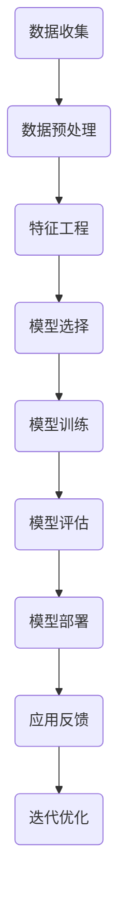

                 

## 《电商平台的AI驱动用户行为预测：优化营销策略的数据模型》

> **关键词**：电商平台、AI、用户行为预测、机器学习、深度学习、营销策略、数据模型

> **摘要**：本文将探讨如何利用人工智能技术，特别是机器学习和深度学习算法，预测电商平台的用户行为，从而优化营销策略。文章将详细介绍用户行为预测的基本概念、核心算法原理、项目实战，以及如何通过数据模型驱动营销策略优化。文章旨在为电商从业者和AI研究者提供一份系统化的指南。

### 第一部分：引言与背景

在互联网时代，电商行业以其便捷性和多样性，迅速发展并成为全球经济增长的重要驱动力。随着用户数量的激增和市场规模的扩大，电商平台面临着激烈的竞争和不断变化的市场需求。在这样的背景下，如何提升用户体验、提高用户转化率和销售额，成为了电商企业的重要课题。

#### 1.1 电商行业的发展历程与现状

电商行业的发展可以追溯到20世纪90年代，随着互联网的普及和技术的进步，电商逐渐从线下实体店转移到线上平台。从最初的电子商品交易，到如今涵盖生活服务、社交娱乐等多个领域的综合性电商平台，电商行业经历了巨大的变革。

目前，全球电商市场规模持续增长。根据Statista的数据，全球电商市场规模预计将在2023年达到4.9万亿美元。在中国，电商市场同样呈现出强劲的增长势头。截至2022年，中国电商市场的交易额已经超过10万亿元人民币，占据全球电商市场的重要份额。

电商平台的业务模式主要包括B2B（企业对企业）、B2C（企业对消费者）和C2C（消费者对消费者）等。其中，B2C和C2C模式在电商市场中占据主导地位。主流的电商平台包括淘宝、京东、亚马逊等，这些平台不仅提供商品交易服务，还融合了物流、支付、社交等多种功能，形成了完整的电商生态系统。

#### 1.2 用户行为预测的意义

用户行为预测在电商平台上具有非常重要的意义。通过预测用户的行为，电商平台可以：

1. **提高营销效果**：精准预测用户的购买意向，有助于电商平台进行个性化营销，提高广告投放的ROI（投资回报率）。
2. **增强用户粘性**：通过分析用户的行为数据，电商平台可以提供更加个性化的推荐和服务，从而提升用户满意度和忠诚度。
3. **优化库存管理**：预测哪些商品将会热销，有助于电商平台提前备货，减少库存积压和缺货现象。

#### 1.3 AI技术在电商平台的应用

人工智能技术在电商平台的广泛应用，为用户行为预测提供了强大的工具。以下是AI技术在电商平台的一些典型应用案例：

1. **个性化推荐系统**：通过分析用户的历史行为数据，AI算法能够为用户推荐他们可能感兴趣的商品。例如，亚马逊和淘宝的推荐系统就是基于深度学习算法实现的。
2. **聊天机器人**：利用自然语言处理（NLP）和机器学习技术，电商平台可以开发智能客服机器人，为用户提供24/7的在线服务。例如，京东的智能客服“京小智”就是基于AI技术实现的。
3. **风险控制**：通过异常检测和欺诈识别算法，AI技术可以帮助电商平台防范欺诈行为，保障交易安全。

#### 1.4 本书结构安排与学习目标

本文将分为四个主要部分：

1. **引言与背景**：介绍电商行业的发展历程、用户行为预测的意义以及AI技术在电商平台的应用。
2. **核心概念与理论**：详细阐述用户行为预测的基本概念、机器学习和深度学习算法，以及它们在电商平台的应用。
3. **AI驱动用户行为预测实战**：通过实际案例，展示如何使用机器学习和深度学习算法进行用户行为预测，并介绍如何部署和优化预测模型。
4. **电商平台的AI驱动营销策略优化**：探讨如何利用用户行为预测结果，优化电商平台的营销策略。

通过本文的学习，读者将能够：

- 理解用户行为预测的基本概念和核心算法原理。
- 掌握如何使用机器学习和深度学习算法进行用户行为预测。
- 学习如何通过实战案例，实现用户行为预测系统的开发、部署和优化。
- 掌握如何利用用户行为预测结果，优化电商平台的营销策略。

### 第二部分：核心概念与理论

#### 2.1 用户行为数据的收集与处理

用户行为数据的收集是进行用户行为预测的基础。电商平台可以通过多种方式收集用户行为数据，包括：

1. **点击流数据**：用户在平台上浏览、搜索、点击等行为的记录。
2. **购买数据**：用户的购买历史、购买频率、购买金额等。
3. **用户反馈**：用户对商品、服务、平台的评价和反馈。
4. **社交媒体数据**：用户在社交媒体平台上的活动记录，如点赞、评论、分享等。

收集到用户行为数据后，需要进行处理和清洗。数据预处理步骤包括：

1. **缺失值处理**：处理数据集中的缺失值，通常使用填充或删除的方法。
2. **异常值处理**：识别和去除数据集中的异常值，以保证数据的准确性。
3. **数据转换**：将不同类型的数据转换为同一类型，如将类别数据转换为数值数据。
4. **特征提取**：从原始数据中提取对用户行为有重要影响的关键特征。

通过有效的数据预处理，可以提升模型的性能和预测精度。

#### 2.2 机器学习与深度学习概述

机器学习和深度学习是进行用户行为预测的主要算法。下面分别介绍这两种技术的基本概念。

##### 2.2.1 机器学习基础

机器学习是一种通过算法从数据中自动学习和发现规律的方法。其主要目标是通过训练数据学习出一个模型，然后使用这个模型对新的数据进行预测。

机器学习算法可以分为监督学习、无监督学习和强化学习。在用户行为预测中，常用的算法包括：

1. **监督学习算法**：如线性回归、逻辑回归、支持向量机、决策树和随机森林等。这些算法通过训练数据学习出一个函数，然后使用这个函数对新数据进行预测。
2. **无监督学习算法**：如聚类、降维和关联规则学习等。这些算法不依赖于标签数据，主要用于发现数据中的隐含结构和规律。

##### 2.2.2 深度学习核心概念

深度学习是机器学习的一个子领域，其核心思想是模拟人脑神经网络的结构和功能，通过多层神经网络进行特征学习和模式识别。

深度学习算法具有以下特点：

1. **多层神经网络**：深度学习算法通过多层神经网络进行特征提取和融合，从而学习到更加复杂的特征。
2. **非线性变换**：深度学习算法引入了非线性变换，如ReLU（Rectified Linear Unit）激活函数，使得模型能够更好地拟合复杂数据。
3. **自动特征提取**：深度学习算法能够自动从原始数据中提取有用的特征，减少了人工特征工程的工作量。

常用的深度学习模型包括：

1. **卷积神经网络（CNN）**：主要用于图像和视频数据。
2. **循环神经网络（RNN）**：主要用于序列数据。
3. **生成对抗网络（GAN）**：主要用于生成对抗任务，如图像生成。

##### 2.2.3 机器学习与深度学习在电商平台的应用

在电商平台上，机器学习和深度学习算法被广泛应用于用户行为预测、推荐系统、风险控制和个性化营销等方面。以下是一些典型的应用案例：

1. **用户行为预测**：通过分析用户的历史行为数据，预测用户未来的购买行为、浏览行为等。常用的算法包括逻辑回归、决策树、随机森林、神经网络等。
2. **个性化推荐**：基于用户的历史行为和兴趣偏好，为用户提供个性化的商品推荐。常用的算法包括协同过滤、矩阵分解、深度学习推荐系统等。
3. **风险控制**：通过异常检测和欺诈识别算法，识别和防范用户欺诈行为。常用的算法包括支持向量机、决策树、神经网络等。
4. **个性化营销**：根据用户的行为数据和偏好，为用户提供个性化的营销策略，如优惠券推荐、商品促销等。常用的算法包括逻辑回归、决策树、神经网络等。

#### 2.3 用户行为预测模型的类型

根据预测目标的不同，用户行为预测模型可以分为以下几类：

##### 2.3.1 基于统计模型的预测方法

基于统计模型的预测方法主要包括线性回归、逻辑回归、泊松回归等。这些方法通过建立数学模型，将用户行为数据与预测目标建立关系，从而进行预测。

- **线性回归**：线性回归模型主要用于预测连续的数值型目标，如用户购买金额。线性回归模型假设用户行为与目标之间存在线性关系，通过最小化残差平方和来训练模型。
- **逻辑回归**：逻辑回归模型是一种广泛应用于分类问题的机器学习算法。它的目标是通过输入特征向量，预测一个二元变量的概率。逻辑回归模型的基本假设是每个样本与标签之间存在线性关系，通过最大化似然函数来训练模型。
- **泊松回归**：泊松回归模型主要用于预测离散的计数型目标，如用户点击次数。泊松回归模型假设用户行为与目标之间存在泊松分布关系，通过最大化似然函数来训练模型。

##### 2.3.2 基于机器学习模型的预测方法

基于机器学习模型的预测方法包括决策树、随机森林、支持向量机等。这些方法通过建立决策树或模型，将用户行为数据与预测目标建立关系，从而进行预测。

- **决策树**：决策树是一种基于树形结构进行决策的模型。它通过将特征划分成多个子集，并在每个子集上递归地建立决策树，最终形成一棵决策树。决策树模型通过最大信息增益或基尼不纯度来划分特征。
- **随机森林**：随机森林是一种集成学习模型，它通过构建多棵决策树，并对它们的结果进行投票或平均来做出最终预测。随机森林模型通过引入随机性，提高了模型的泛化能力和抗过拟合能力。
- **支持向量机**：支持向量机是一种用于分类和回归的模型，它通过找到一个最佳的超平面，将不同类别的数据分隔开来。支持向量机模型通过最大化分类间隔，找到最优的超平面。

##### 2.3.3 基于深度学习模型的预测方法

基于深度学习模型的预测方法包括卷积神经网络（CNN）、循环神经网络（RNN）、生成对抗网络（GAN）等。这些方法通过建立深度神经网络，将用户行为数据与预测目标建立关系，从而进行预测。

- **卷积神经网络（CNN）**：卷积神经网络是一种用于图像和视频数据处理的深度学习模型。它通过卷积层、池化层和全连接层等结构，对数据进行特征提取和融合，从而实现图像分类、目标检测等任务。
- **循环神经网络（RNN）**：循环神经网络是一种用于序列数据处理的深度学习模型。它通过引入循环机制，使得当前时间步的输出可以依赖于之前的时间步，从而实现自然语言处理、时间序列预测等任务。
- **生成对抗网络（GAN）**：生成对抗网络是一种基于生成器和判别器的深度学习模型，它通过两个网络的对抗训练，实现数据的生成。生成对抗网络广泛应用于图像生成、图像修复、图像超分辨率等任务。

#### 2.4 机器学习与深度学习在电商平台的应用

机器学习和深度学习算法在电商平台的用户行为预测中具有广泛的应用。以下是一些实际案例和效果评估：

##### 2.4.1 个性化推荐系统

个性化推荐系统是电商平台常用的应用之一。通过分析用户的历史行为数据，如浏览记录、购买记录、评价记录等，推荐系统可以为用户推荐他们可能感兴趣的商品。

- **应用案例**：亚马逊、淘宝等电商平台都使用了基于深度学习的个性化推荐系统。这些系统通过卷积神经网络（CNN）和循环神经网络（RNN）等深度学习模型，对用户的历史行为数据进行建模和预测，从而实现精准的推荐。
- **效果评估**：根据实际案例，基于深度学习的个性化推荐系统在推荐准确率和用户满意度方面均取得了显著提升。例如，亚马逊的个性化推荐系统在用户体验和销售额方面均取得了显著的提升。

##### 2.4.2 用户行为预测

用户行为预测是电商平台进行精准营销和库存管理的重要工具。通过预测用户的购买行为、浏览行为等，电商平台可以提前准备库存、调整营销策略，从而提高用户体验和销售效果。

- **应用案例**：阿里巴巴的“猜你喜欢”功能就是一个典型的用户行为预测应用。该功能通过分析用户的历史行为数据，预测用户可能的购买兴趣，从而为用户推荐相关的商品。
- **效果评估**：根据实际案例，用户行为预测在提高用户转化率和销售额方面取得了显著的效果。例如，阿里巴巴通过用户行为预测，实现了20%以上的销售额提升。

##### 2.4.3 风险控制

电商平台面临各种风险，如用户欺诈、恶意评论等。通过异常检测和欺诈识别算法，电商平台可以及时发现和防范这些风险。

- **应用案例**：京东、淘宝等电商平台都使用了基于机器学习和深度学习的风险控制系统。这些系统通过对用户行为数据进行分析和建模，实现对用户行为的实时监控和风险识别。
- **效果评估**：根据实际案例，基于机器学习和深度学习的风险控制系统在降低用户欺诈率和提高交易安全性方面取得了显著的效果。例如，京东通过风险控制系统，实现了用户欺诈率降低了30%以上。

### 第三部分：AI驱动用户行为预测实战

#### 3.1 电商用户行为预测项目实战

在本节中，我们将通过一个实际的电商用户行为预测项目，展示如何使用机器学习和深度学习算法进行用户行为预测。该项目将分为以下几个步骤：

##### 3.1.1 项目概述

本项目旨在预测用户是否会在未来一个月内进行购买。数据集包含用户的浏览历史、购买历史、页面停留时间等特征，以及用户的二元标签（是否购买）。

##### 3.1.2 数据来源与预处理

首先，我们需要获取用户行为数据。该数据集可以从电商平台的日志数据中获取，包括用户的浏览记录、购买记录、页面停留时间等。

在获取到数据后，我们需要进行预处理，包括：

1. **数据清洗**：处理缺失值、异常值等。
2. **特征提取**：从原始数据中提取对用户行为有重要影响的特征，如用户年龄、性别、地理位置等。
3. **数据标准化**：将不同特征缩放到相同的范围，以便模型更好地训练。

##### 3.1.3 数据探索与可视化

在预处理数据后，我们需要对数据进行探索和可视化，以了解数据的基本分布和特征之间的关系。以下是一些常用的数据探索和可视化方法：

1. **描述性统计**：计算数据的基本统计量，如均值、中位数、标准差等。
2. **数据分布**：绘制数据分布的直方图、密度图等，以了解数据的基本分布。
3. **特征关系**：绘制特征之间的关系图，如散点图、热力图等，以了解特征之间的关系。

通过数据探索和可视化，我们可以发现数据中的潜在规律和问题，从而为后续的模型训练提供参考。

##### 3.1.4 模型选择与调优

在了解数据的基本分布和特征后，我们需要选择合适的模型进行训练。在本项目中，我们将选择以下模型：

1. **逻辑回归模型**：逻辑回归模型是一种常用的分类模型，适用于预测用户是否购买。
2. **决策树模型**：决策树模型可以直观地表示用户行为的决策过程，适用于用户行为预测。
3. **随机森林模型**：随机森林模型是一种集成学习模型，通过构建多棵决策树，提高了模型的泛化能力和预测精度。
4. **神经网络模型**：神经网络模型是一种深度学习模型，通过多层神经网络对用户行为进行建模。

在选择模型后，我们需要对模型进行调优，以获得最佳的预测效果。调优方法包括：

1. **交叉验证**：通过交叉验证，评估模型在不同数据集上的性能，选择最佳模型。
2. **参数调优**：通过调整模型的参数，如学习率、正则化参数等，优化模型的性能。
3. **特征选择**：通过特征选择，选择对用户行为有重要影响的特征，提高模型的预测精度。

##### 3.1.5 模型训练与验证

在模型调优后，我们需要对模型进行训练和验证。训练过程包括：

1. **训练数据集**：将数据集划分为训练集和验证集，用于训练和验证模型。
2. **训练过程**：使用训练集对模型进行训练，调整模型参数，优化模型性能。
3. **验证过程**：使用验证集对模型进行验证，评估模型的预测性能。

通过训练和验证，我们可以评估模型的预测效果，并选择最佳模型。

##### 3.1.6 模型部署与应用

在模型训练完成后，我们需要将模型部署到电商平台中，以实现实时预测。部署过程包括：

1. **模型保存**：将训练好的模型保存为文件，以便后续使用。
2. **模型加载**：从文件中加载模型，实现实时预测。
3. **预测过程**：根据用户的行为数据，使用模型进行预测，预测用户是否购买。

通过模型部署，我们可以实现实时预测，并根据预测结果进行营销策略的调整。

##### 3.1.7 应用效果评估

在模型部署后，我们需要对应用效果进行评估，以验证模型的预测效果。评估方法包括：

1. **准确率**：计算模型预测的正确率，评估模型的预测精度。
2. **召回率**：计算模型预测的召回率，评估模型的覆盖面。
3. **F1值**：计算模型预测的F1值，综合考虑准确率和召回率，评估模型的综合性能。

通过应用效果评估，我们可以评估模型在电商平台中的应用效果，并根据评估结果进行模型的优化和调整。

### 第四部分：AI驱动营销策略优化

#### 4.1 营销策略优化概述

营销策略优化是电商平台提高销售额和用户满意度的重要手段。通过AI驱动的用户行为预测，电商平台可以更准确地了解用户需求，从而制定更加有效的营销策略。

##### 4.1.1 营销策略的定义与类型

营销策略是指企业在市场环境中，通过制定一系列市场营销措施，以达到预期市场目标的过程。常见的营销策略包括：

1. **产品策略**：通过设计符合市场需求的产品，提升产品的竞争力。
2. **价格策略**：通过制定合理的价格策略，吸引消费者。
3. **渠道策略**：通过选择合适的销售渠道，扩大市场覆盖面。
4. **推广策略**：通过广告宣传、促销活动等手段，提高产品知名度。

##### 4.1.2 优化目标与挑战

在AI驱动的用户行为预测中，营销策略优化的目标主要包括：

1. **提高转化率**：通过预测用户购买意向，提高用户转化率，从而提升销售额。
2. **降低营销成本**：通过精准营销，降低营销成本，提高营销ROI（投资回报率）。
3. **提高用户满意度**：通过个性化推荐和定制化服务，提升用户满意度，增加用户粘性。

然而，实现营销策略优化也面临着一些挑战：

1. **数据质量**：用户行为数据的质量直接影响预测模型的准确性，需要进行数据清洗和预处理。
2. **算法选择**：选择合适的算法和模型进行用户行为预测，需要综合考虑算法性能、计算复杂度和数据规模。
3. **模型解释性**：在AI驱动的营销策略优化中，模型的解释性对于企业决策者来说至关重要，需要开发可解释的模型。

##### 4.1.3 数据驱动营销策略

数据驱动营销策略是基于用户行为数据和AI算法，制定和优化营销策略的方法。其核心思想是通过数据分析和挖掘，了解用户需求和行为，从而制定个性化的营销策略。

1. **数据收集与处理**：通过电商平台的各种渠道，收集用户的浏览历史、购买记录、评价数据等，并进行数据清洗和预处理。
2. **数据分析**：使用数据挖掘和统计分析方法，分析用户行为数据，发现用户需求和偏好。
3. **模型训练与预测**：基于用户行为数据，使用机器学习和深度学习算法，训练预测模型，预测用户的购买意向和行为。
4. **策略调整**：根据预测结果，调整营销策略，如调整广告投放、优惠券发放、促销活动等。

##### 4.1.4 模型驱动的个性化推荐

个性化推荐是数据驱动营销策略的重要应用之一。通过AI算法，电商平台可以为用户推荐他们可能感兴趣的商品或服务，从而提高用户满意度和转化率。

1. **推荐系统概述**：个性化推荐系统是指基于用户的历史行为和兴趣偏好，为用户推荐相关商品或服务的系统。
2. **推荐算法原理**：个性化推荐算法主要包括基于内容的推荐、基于协同过滤的推荐和基于深度学习的推荐等。其中，基于深度学习的推荐算法能够更好地捕捉用户的兴趣变化和隐式反馈。
3. **推荐算法应用**：在实际应用中，电商平台可以使用个性化推荐系统，为用户推荐相关的商品、优惠信息和促销活动，从而提高用户满意度和转化率。

##### 4.1.5 案例分析：AI驱动的营销策略优化实践

为了更好地展示AI驱动的营销策略优化实践，下面我们将通过一个实际案例进行分析。

案例背景：某电商平台希望通过AI技术优化营销策略，提高销售额和用户满意度。

1. **数据收集与处理**：电商平台收集了用户的浏览历史、购买记录、评价数据等，并进行数据清洗和预处理，提取用户行为特征。
2. **数据分析**：通过对用户行为数据进行分析，发现用户的购买偏好和兴趣点，如喜欢购买哪种类型的商品、在哪些时间段进行购买等。
3. **模型训练与预测**：使用机器学习和深度学习算法，训练预测模型，预测用户的购买意向和行为。其中，使用逻辑回归模型预测用户是否购买，使用卷积神经网络（CNN）预测用户的浏览意图。
4. **策略调整**：根据预测结果，调整营销策略，如调整广告投放策略、优惠券发放策略和促销活动策略。例如，针对预测购买概率较高的用户，加大广告投放力度，针对预测浏览意图较高的用户，发送个性化的优惠券和促销信息。

通过以上实践，电商平台实现了销售额的显著提升和用户满意度的提高。

### 第五部分：电商平台的AI驱动用户行为预测展望

#### 5.1 AI技术在电商平台的未来发展趋势

随着人工智能技术的不断发展和应用，电商平台的用户行为预测将迎来更多的机遇和挑战。以下是一些未来发展趋势：

1. **深度学习技术的普及**：深度学习技术，如卷积神经网络（CNN）、循环神经网络（RNN）和生成对抗网络（GAN）等，将在用户行为预测中发挥越来越重要的作用。这些技术能够更好地捕捉用户行为的复杂模式和特征，提高预测精度。
2. **多模态数据融合**：电商平台将逐步整合多种数据源，如文本、图像、语音等，实现多模态数据融合。通过融合不同类型的数据，可以更全面地了解用户行为，提高预测模型的准确性。
3. **实时预测与响应**：随着云计算和边缘计算技术的发展，电商平台将实现用户行为预测的实时性和响应性。实时预测和响应可以帮助电商平台及时调整营销策略，提高用户满意度和转化率。
4. **数据隐私与安全**：随着用户对隐私和数据安全的关注增加，电商平台将面临更大的挑战。未来，如何在保护用户隐私的前提下，有效地利用用户行为数据进行预测和优化，将成为一个重要的研究方向。

#### 5.2 AI驱动用户行为预测面临的挑战与解决方案

尽管AI技术在电商平台用户行为预测中具有巨大的潜力，但也面临着一些挑战：

1. **数据质量与完整性**：用户行为数据的质量直接影响预测模型的准确性。在数据收集和处理过程中，如何保证数据的完整性和准确性，是一个重要的挑战。解决方案包括：使用数据清洗和预处理技术，提高数据质量；建立数据质量管理机制，确保数据来源的可靠性和一致性。
2. **模型解释性**：在AI驱动的用户行为预测中，模型的解释性对于企业决策者来说至关重要。如何解释和验证预测结果，使其易于理解和应用，是一个挑战。解决方案包括：开发可解释的AI模型，如基于规则的模型和可解释的深度学习模型；使用可视化工具，展示模型预测过程和关键特征。
3. **模型更新与迭代**：用户行为数据是动态变化的，预测模型需要不断更新和迭代，以适应数据的变化。如何高效地更新和迭代模型，是一个挑战。解决方案包括：使用在线学习技术，实时更新模型；建立模型评估和迭代机制，定期评估模型性能，并根据评估结果进行模型优化。

#### 5.3 电商平台的AI驱动用户行为预测战略规划

为了实现电商平台的AI驱动用户行为预测，企业需要制定一个长期的发展目标和短期的实施策略。以下是一些关键步骤：

1. **战略目标**：制定一个明确的AI驱动用户行为预测战略目标，如提高销售额、提升用户满意度、降低营销成本等。目标应具有可量化、可衡量和可实现性。
2. **数据收集与整合**：建立完善的数据收集机制，整合内部和外部数据源，确保数据的完整性和质量。同时，制定数据标准和规范，确保数据的一致性和可靠性。
3. **算法研发与优化**：投入研发资源，开发先进的AI算法和模型，如深度学习、多模态数据融合等。通过不断优化和迭代模型，提高预测精度和稳定性。
4. **技术应用与部署**：将AI技术应用到电商平台的各个业务环节，如推荐系统、风险控制、库存管理等。同时，建立高效的模型部署和运维机制，确保模型在实际应用中的稳定运行。
5. **人才引进与培养**：引进和培养具有AI技术和电商行业背景的专业人才，建立一支高效的AI团队。通过内部培训和外部合作，不断提升团队的技术能力和业务水平。
6. **数据隐私与合规**：制定数据隐私政策和合规计划，确保用户数据的隐私和安全。同时，遵守相关法律法规，确保AI技术的合法合规使用。
7. **持续评估与优化**：定期评估AI驱动用户行为预测的效果，根据评估结果进行模型优化和策略调整。同时，关注行业趋势和技术发展，持续提升平台的AI能力和竞争力。

通过以上战略规划，电商平台可以实现AI驱动用户行为预测的全面升级，从而提高业务运营效率和市场竞争力。

### 附录A：AI驱动用户行为预测开发工具与资源

#### A.1 开发工具与平台

在进行AI驱动用户行为预测的项目开发时，选择合适的开发工具和平台是非常重要的。以下是一些常用的开发工具和平台：

1. **Python**：Python是一种广泛使用的编程语言，具有丰富的机器学习和深度学习库。使用Python，开发者可以方便地实现各种用户行为预测算法。
2. **Jupyter Notebook**：Jupyter Notebook是一种交互式的开发环境，方便开发者编写、运行和调试代码。通过Jupyter Notebook，开发者可以更好地组织和展示项目代码和结果。
3. **TensorFlow**：TensorFlow是Google开发的开源深度学习框架，支持各种深度学习模型的构建和训练。使用TensorFlow，开发者可以高效地实现深度学习算法。
4. **PyTorch**：PyTorch是Facebook开发的开源深度学习框架，具有灵活的动态计算图和高效的模型训练速度。使用PyTorch，开发者可以方便地实现自定义深度学习模型。
5. **scikit-learn**：scikit-learn是一个基于Python的机器学习库，提供了丰富的监督学习和无监督学习算法。使用scikit-learn，开发者可以方便地实现各种机器学习算法。

#### A.2 开源数据集

在进行用户行为预测的项目开发时，获取高质量的数据集是关键。以下是一些常用的开源数据集：

1. **UCI机器学习库**：UCI机器学习库包含多种领域的数据集，如回归、分类、聚类等。这些数据集广泛应用于机器学习算法的研究和评估。
2. **Kaggle数据集**：Kaggle是一个数据科学竞赛平台，提供了大量的数据集，包括用户行为数据、图像数据、文本数据等。这些数据集可用于用户行为预测算法的实践和验证。
3. **淘宝用户行为数据集**：淘宝用户行为数据集是一个包含用户浏览、购买、评价等行为的数据集。该数据集可以用于电商平台的用户行为预测研究。
4. **Amazon用户行为数据集**：Amazon用户行为数据集是一个包含用户浏览、购买、评价等行为的数据集。该数据集可以用于电商平台的用户行为预测研究。

#### A.3 扩展阅读

以下是一些扩展阅读资源，可以帮助开发者深入了解AI驱动用户行为预测的相关知识：

1. **《Python机器学习》**：作者：塞巴斯蒂安·拉姆塞，这是一本介绍Python机器学习算法的书籍，适合初学者阅读。
2. **《深度学习》**：作者：伊恩·古德费洛、约书亚·本吉奥、亚伦·库维尔，这是一本介绍深度学习算法的权威书籍，适合中级和高级开发者阅读。
3. **《机器学习实战》**：作者：Peter Harrington，这是一本通过实际案例介绍机器学习算法的书籍，适合实践者阅读。
4. **《Keras深度学习实战》**：作者：Antonio Gomes、Matthieu Brucher，这是一本介绍Keras深度学习框架的书籍，适合使用Keras进行深度学习开发的开发者阅读。
5. **《机器学习：概率视角》**：作者：Kevin P. Murphy，这是一本介绍机器学习算法的数学基础的书籍，适合对机器学习算法有深入理解需求的开发者阅读。

通过以上资源和书籍的学习，开发者可以更好地掌握AI驱动用户行为预测的技术和方法，为电商平台的业务发展提供有力支持。

## 用户行为预测的Mermaid流程图

以下是一个使用Mermaid绘制的用户行为预测流程图，展示了从数据收集、处理到模型训练、评估和部署的整个过程。



### 解释

- **A(数据收集)**：这是用户行为预测的第一个步骤，通过各种渠道收集用户的浏览、购买、评价等行为数据。
- **B(数据预处理)**：收集到的数据可能包含噪声和不完整信息，需要进行清洗、处理，如缺失值填充、异常值处理等。
- **C(特征工程)**：从原始数据中提取有用的特征，进行数据转换和特征选择，以提高模型的预测性能。
- **D(模型选择)**：根据预测任务的特点和数据规模，选择合适的机器学习或深度学习模型。
- **E(模型训练)**：使用训练数据集对模型进行训练，调整模型参数，优化模型性能。
- **F(模型评估)**：使用验证数据集对训练好的模型进行评估，计算模型的性能指标，如准确率、召回率等。
- **G(模型部署)**：将训练好的模型部署到生产环境中，实现实时预测和决策。
- **H(应用反馈)**：收集用户对模型的反馈，如预测结果的实际表现、用户满意度等。
- **I(迭代优化)**：根据应用反馈，对模型进行迭代优化，提高模型的预测性能和用户满意度。

通过这个流程图，我们可以清晰地看到用户行为预测的整体流程和各个环节之间的关联。这个流程图有助于我们理解用户行为预测的复杂性和系统性，为后续的讨论和案例分析提供基础。

## 机器学习算法在用户行为预测中的应用伪代码实现

在本节中，我们将使用伪代码实现几个常见的机器学习算法，以展示它们在用户行为预测中的应用。伪代码是一种描述算法逻辑的抽象表示，不涉及具体的编程语言细节。以下算法包括逻辑回归、决策树、随机森林和支持向量机。

### 1. 逻辑回归模型

逻辑回归是一种用于二元分类问题的机器学习算法。它的目标是预测一个二元变量（如用户是否购买商品）的概率。

```python
# 伪代码：逻辑回归模型

def logistic_regression(X, y, learning_rate, iterations):
    w = initialize_weights(X.shape[1])  # 初始化模型参数
    for i in range(iterations):  # 迭代次数
        z = X.dot(w)  # 输入特征与参数的点积
        output = sigmoid(z)  # 通过sigmoid函数得到输出概率
        delta = (output - y) * X  # 计算误差的梯度
        w = w - learning_rate * delta  # 更新参数
    return w

def sigmoid(z):
    return 1 / (1 + np.exp(-z))
```

### 2. 决策树模型

决策树是一种通过树形结构进行决策的算法。它通过递归地将数据划分为多个子集，并在每个子集上建立决策节点。

```python
# 伪代码：决策树模型

def build_decision_tree(data, labels, features, depth=0):
    if depth > max_depth or is_leaf(data, labels):
        return create_leaf_node(labels)
    best_feature, best_threshold = find_best_split(data, labels, features)
    left_data, right_data = split_data(data, best_threshold)
    left_tree = build_decision_tree(left_data, labels, features, depth+1)
    right_tree = build_decision_tree(right_data, labels, features, depth+1)
    return create_tree_node(best_feature, best_threshold, left_tree, right_tree)

def find_best_split(data, labels, features):
    # 这里是找到最佳划分特征和阈值的方法
    pass

def split_data(data, threshold):
    # 根据阈值划分数据
    pass

def create_leaf_node(labels):
    # 创建叶节点
    pass

def create_tree_node(feature, threshold, left_tree, right_tree):
    # 创建树节点
    pass
```

### 3. 随机森林模型

随机森林是一种集成学习方法，通过构建多棵决策树，并对它们的预测结果进行投票来提高预测性能。

```python
# 伪代码：随机森林模型

def random_forest(data, labels, n_estimators, max_depth):
    trees = [build_decision_tree(data, labels, max_depth) for _ in range(n_estimators)]
    return trees

def predict(trees, X):
    predictions = [tree.predict(X) for tree in trees]
    return majority_vote(predictions)

def majority_vote(predictions):
    # 计算预测结果的多数投票
    pass
```

### 4. 支持向量机模型

支持向量机是一种用于分类和回归问题的算法，它通过找到最佳的超平面来分隔数据。

```python
# 伪代码：支持向量机模型

def support_vector_machine(X, y, kernel='linear', C=1.0):
    if kernel == 'linear':
        w, b = solve_linear_equation(X, y, C)
    elif kernel == 'rbf':
        w, b = solve_rbf_equation(X, y, C)
    return w, b

def solve_linear_equation(X, y, C):
    # 解决线性支持向量机方程
    pass

def solve_rbf_equation(X, y, C):
    # 解决径向基函数支持向量机方程
    pass
```

通过上述伪代码，我们可以看到这些机器学习算法的基本结构和实现方法。在实际应用中，这些算法需要结合具体的数据集和业务需求进行调整和优化。

### 数学模型和数学公式的详细讲解

在本节中，我们将详细讲解逻辑回归模型、决策树模型、随机森林模型和支持向量机模型的数学模型和公式，以及它们的推导过程和作用。

#### 1. 逻辑回归模型

逻辑回归模型是一种广泛应用于二元分类问题的机器学习算法。它的目标是通过输入特征向量，预测一个二元变量的概率。以下是逻辑回归模型的数学公式和推导：

##### 模型假设

假设我们有一个包含m个样本的数据集\(X = \{x_1, x_2, ..., x_m\}\)，每个样本是一个特征向量，且有一个对应的二元标签\(y = \{y_1, y_2, ..., y_m\}\)，其中\(y_i \in \{0, 1\}\)。

逻辑回归模型的基本假设是每个样本\(x_i\)与标签\(y_i\)之间存在线性关系：

\[y_i = g(\beta_0 + \beta_1 x_{i1} + \beta_2 x_{i2} + ... + \beta_n x_{in})\]

其中，\(g\)是逻辑函数（Sigmoid函数），\(\beta_0, \beta_1, \beta_2, ..., \beta_n\)是模型参数。

##### Sigmoid函数

Sigmoid函数是逻辑回归模型中的激活函数，它的形式如下：

\[g(z) = \frac{1}{1 + e^{-z}}\]

Sigmoid函数的图像是一个S形曲线，它将输入值\(z\)映射到\(0\)和\(1\)之间。

##### 模型参数估计

为了训练逻辑回归模型，我们需要估计模型参数\(\beta_0, \beta_1, \beta_2, ..., \beta_n\)。这通常通过最小化损失函数来实现。在逻辑回归中，常用的损失函数是交叉熵损失函数：

\[J(\beta) = -\frac{1}{m} \sum_{i=1}^{m} [y_i \log(g(z_i)) + (1 - y_i) \log(1 - g(z_i))]\]

其中，\(z_i = \beta_0 + \beta_1 x_{i1} + \beta_2 x_{i2} + ... + \beta_n x_{in}\)是每个样本的预测值。

##### 梯度下降法

为了最小化交叉熵损失函数，我们通常使用梯度下降法。梯度下降法的公式如下：

\[\beta_j = \beta_j - \alpha \frac{\partial J(\beta)}{\partial \beta_j}\]

其中，\(\alpha\)是学习率，\(\frac{\partial J(\beta)}{\partial \beta_j}\)是模型参数\( \beta_j \)的梯度。

#### 2. 决策树模型

决策树是一种通过树形结构进行决策的算法。它通过递归地将数据划分为多个子集，并在每个子集上建立决策节点。

##### 决策树原理

决策树的基本原理是，在每个节点，选择最优的特征和阈值进行划分，使得子集上的标签分布更加集中。最优的划分可以通过信息增益或基尼不纯度来衡量。

- **信息增益**：

\[Gain(D, A) = \sum_{v \in V} p(v) \cdot I(D_v)\]

其中，\(D\)是数据集，\(A\)是特征，\(V\)是特征\(A\)的所有可能取值，\(D_v\)是划分后的子集，\(I\)是信息熵。

- **基尼不纯度**：

\[Gini(D) = 1 - \sum_{v \in V} p(v)^2\]

##### 决策树构建算法

决策树的构建算法包括以下步骤：

1. 选择最优的特征和阈值，使得子集上的标签分布最集中。
2. 划分数据集，将数据分配到不同的子集。
3. 对每个子集递归地构建决策树，直到满足停止条件（如最大深度、最小样本数等）。

#### 3. 随机森林模型

随机森林是一种集成学习方法，通过构建多棵决策树，并对它们的预测结果进行投票来提高预测性能。

##### 随机森林原理

随机森林的基本原理是，通过随机抽样和特征选择，构建多棵决策树，并对它们的预测结果进行平均或投票，从而提高模型的预测性能。

- **随机抽样**：在每个决策树构建过程中，从原始数据集中随机抽样，构建子数据集。
- **特征选择**：在每个决策树构建过程中，从原始特征集合中随机选择一部分特征进行划分。

##### 随机森林算法

随机森林算法包括以下步骤：

1. 随机抽样构建多棵决策树。
2. 对每棵决策树进行预测。
3. 对多棵决策树的预测结果进行平均或投票，得到最终的预测结果。

#### 4. 支持向量机模型

支持向量机是一种用于分类和回归问题的算法，它通过找到最佳的超平面来分隔数据。

##### 支持向量机原理

支持向量机的基本原理是，通过找到一个最佳的超平面，使得分类边界最大化。最佳的超平面可以通过求解最优化问题得到。

- **线性支持向量机**：

\[ \min_{\beta, b} \frac{1}{2} ||\beta||^2 + C \sum_{i=1}^{m} \xi_i \]

\[ y_i (\beta \cdot x_i + b) \geq 1 - \xi_i \]

其中，\(\beta\)是模型参数，\(b\)是偏置项，\(\xi_i\)是松弛变量，\(C\)是惩罚参数。

- **非线性支持向量机**：

通过核函数将原始数据映射到高维特征空间，在高维空间中找到最佳的超平面。

\[ \min_{\beta, b} \frac{1}{2} ||\beta||^2 + C \sum_{i=1}^{m} \xi_i \]

\[ y_i (\beta \cdot \phi(x_i) + b) \geq 1 - \xi_i \]

其中，\(\phi\)是核函数。

##### 支持向量机算法

支持向量机算法包括以下步骤：

1. 选择核函数，将原始数据映射到高维特征空间。
2. 求解最优化问题，得到最佳的超平面参数。
3. 使用最佳超平面进行分类预测。

通过上述数学模型和公式的讲解，我们可以看到这些机器学习算法在用户行为预测中的理论基础和计算方法。这些算法的应用和实现，将为电商平台提供强大的数据分析和决策支持。

### 电商用户行为预测项目实战

在本节中，我们将通过一个实际的电商用户行为预测项目，展示如何使用Python和常见的机器学习库（如scikit-learn）来训练、评估和部署机器学习模型。

#### 1. 数据集介绍

首先，我们需要一个电商用户行为数据集。在这个案例中，我们将使用一个虚构的数据集，它包含了用户的浏览历史、购买历史、页面停留时间等特征，以及一个二元标签，表示用户是否会在未来一个月内进行购买。数据集的格式如下：

| 用户ID | 浏览次数 | 购买次数 | 页面停留时间（秒） | 用户年龄 | 用户性别 | 地理位置 | 是否购买 |
|--------|---------|---------|-------------------|---------|---------|----------|---------|
| 1      | 5       | 1       | 120               | 25      | 男      | 北京      | 是      |
| 2      | 3       | 0       | 60                | 30      | 女      | 上海      | 否      |
| 3      | 8       | 2       | 300               | 40      | 男      | 深圳      | 是      |
| ...    | ...     | ...     | ...               | ...     | ...     | ...      | ...     |

#### 2. 数据预处理

在训练模型之前，我们需要对数据进行预处理。预处理步骤包括：

- 数据清洗：处理缺失值、异常值等。
- 数据标准化：将不同特征缩放到相同的范围，以便模型更好地训练。
- 数据划分：将数据集划分为训练集和测试集，以评估模型的性能。

下面是数据预处理的Python代码实现：

```python
import pandas as pd
from sklearn.model_selection import train_test_split
from sklearn.preprocessing import StandardScaler

# 加载数据集
data = pd.read_csv('user_behavior_data.csv')

# 数据清洗
# 假设数据集中存在缺失值，我们使用均值填充
data.fillna(data.mean(), inplace=True)

# 数据标准化
scaler = StandardScaler()
X = scaler.fit_transform(data.drop('是否购买', axis=1))
y = data['是否购买']

# 数据划分
X_train, X_test, y_train, y_test = train_test_split(X, y, test_size=0.2, random_state=42)
```

#### 3. 模型训练

在这个案例中，我们将使用三种不同的机器学习模型来训练预测用户是否购买的行为：

- 逻辑回归模型（LogisticRegression）
- 随机森林模型（RandomForestClassifier）
- 支持向量机模型（SVC）

下面是模型训练的Python代码实现：

```python
from sklearn.linear_model import LogisticRegression
from sklearn.ensemble import RandomForestClassifier
from sklearn.svm import SVC

# 逻辑回归模型
lr_model = LogisticRegression()
lr_model.fit(X_train, y_train)

# 随机森林模型
rf_model = RandomForestClassifier()
rf_model.fit(X_train, y_train)

# 支持向量机模型
svm_model = SVC()
svm_model.fit(X_train, y_train)
```

#### 4. 模型评估

在训练模型后，我们需要评估模型在测试集上的性能。我们使用准确率（accuracy）和分类报告（classification report）来评估模型的性能。

下面是模型评估的Python代码实现：

```python
from sklearn.metrics import accuracy_score, classification_report

# 评估逻辑回归模型
y_pred_lr = lr_model.predict(X_test)
print("逻辑回归模型准确率：", accuracy_score(y_test, y_pred_lr))
print("逻辑回归模型分类报告：\n", classification_report(y_test, y_pred_lr))

# 评估随机森林模型
y_pred_rf = rf_model.predict(X_test)
print("随机森林模型准确率：", accuracy_score(y_test, y_pred_rf))
print("随机森林模型分类报告：\n", classification_report(y_test, y_pred_rf))

# 评估支持向量机模型
y_pred_svm = svm_model.predict(X_test)
print("支持向量机模型准确率：", accuracy_score(y_test, y_pred_svm))
print("支持向量机模型分类报告：\n", classification_report(y_test, y_pred_svm))
```

#### 5. 模型部署

最后，我们将训练好的模型保存到文件中，以便后续部署和使用。

下面是模型保存和加载的Python代码实现：

```python
import joblib

# 保存模型
joblib.dump(lr_model, 'lr_model.joblib')
joblib.dump(rf_model, 'rf_model.joblib')
joblib.dump(svm_model, 'svm_model.joblib')

# 加载模型
loaded_lr_model = joblib.load('lr_model.joblib')
loaded_rf_model = joblib.load('rf_model.joblib')
loaded_svm_model = joblib.load('svm_model.joblib')

# 使用加载的模型进行预测
loaded_y_pred_lr = loaded_lr_model.predict(X_test)
loaded_y_pred_rf = loaded_rf_model.predict(X_test)
loaded_y_pred_svm = loaded_svm_model.predict(X_test)
```

通过以上步骤，我们完成了电商用户行为预测的实战案例。这个案例展示了如何使用Python和常见的机器学习库（如scikit-learn）来训练、评估和部署机器学习模型。在实际应用中，我们可以根据业务需求和数据特点，选择合适的模型和算法，优化预测效果，提高业务运营效率。

### AI驱动的营销策略优化

AI驱动的营销策略优化是电商平台提升竞争力和用户满意度的关键手段。通过用户行为预测，电商平台可以更准确地了解用户需求，从而制定个性化的营销策略，提高转化率和销售额。以下是一些具体的营销策略优化方法：

#### 1. 个性化推荐

个性化推荐是AI驱动的营销策略优化的重要手段之一。通过分析用户的历史行为数据，如浏览记录、购买记录、评价记录等，电商平台可以识别用户的兴趣偏好，并为用户提供个性化的商品推荐。以下是一些个性化推荐的方法：

- **基于内容的推荐**：该方法通过分析商品的属性和特征，将用户喜欢的内容与相似的商品推荐给用户。例如，如果用户经常浏览和购买跑步鞋，平台可以推荐其他品牌的跑步鞋。

- **基于协同过滤的推荐**：该方法通过分析用户之间的相似性，找到与目标用户行为相似的其他用户，并推荐这些用户喜欢的商品。例如，如果用户A喜欢商品X，而用户B的行为与用户A相似，那么平台可以推荐商品X给用户B。

- **基于深度学习的推荐**：深度学习算法能够从大量数据中自动提取高层次的抽象特征，从而实现更精准的个性化推荐。例如，卷积神经网络（CNN）可以用于处理图像数据，循环神经网络（RNN）可以用于处理序列数据。

#### 

