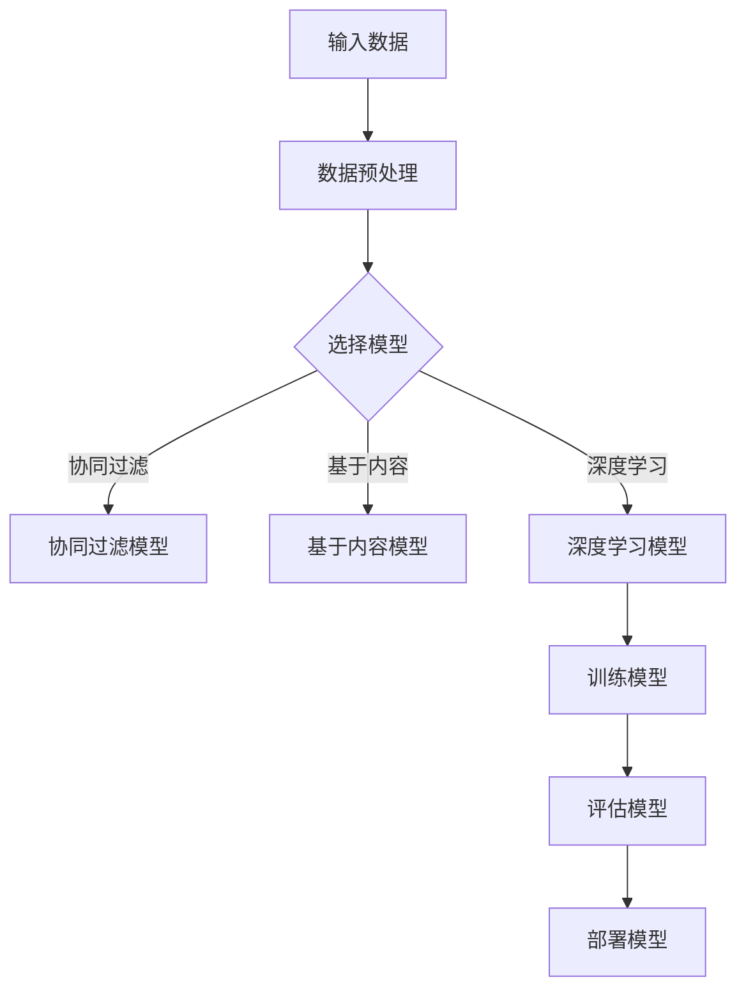

                 

### 文章标题

## 电商行业中AI大模型的商业价值分析

### 关键词：电商、AI大模型、商业价值、应用、挑战与解决方案

### 摘要：

随着电商行业的迅猛发展，人工智能（AI）技术逐渐成为推动行业变革的重要力量。本文从电商行业AI大模型的概述、技术基础、商业应用、商业价值与挑战以及未来展望等方面进行深入分析，旨在揭示AI大模型在电商行业中的巨大商业价值。通过详细讲解核心概念、算法原理、数学模型和项目实战，本文将帮助读者全面理解AI大模型在电商行业中的应用场景和实施策略。

----------------------------------------------------------------

### 目录

1. **电商行业中AI大模型概述**
   1.1 电商行业现状与AI技术应用
   1.2 AI大模型的定义与类型
   1.3 AI大模型在电商行业中的应用前景

2. **AI大模型技术基础**
   2.1 深度学习与神经网络基础
   2.2 电商行业AI大模型技术

3. **AI大模型在电商行业的商业应用**
   3.1 AI大模型在电商产品推荐中的应用
   3.2 AI大模型在电商搜索中的应用
   3.3 AI大模型在电商用户行为分析中的应用

4. **AI大模型的商业价值与挑战**
   4.1 AI大模型对电商行业的商业影响
   4.2 AI大模型在电商商业战略中的应用
   4.3 AI大模型在电商行业的挑战与解决方案

5. **实战案例分析**
   5.1 案例一：个性化推荐系统
   5.2 案例二：智能搜索优化
   5.3 案例三：用户行为分析与应用

6. **未来展望**
   6.1 AI大模型技术的发展趋势
   6.2 电商行业AI大模型的应用前景

7. **附录**
   7.1 AI大模型开发工具与资源
   7.2 电商行业AI大模型应用案例集锦

---

在接下来的章节中，我们将详细探讨电商行业与AI大模型之间的关系，以及AI大模型在电商行业中的具体应用和实践。通过本文，希望能够为读者提供关于AI大模型在电商行业中商业价值的全面理解和深刻洞察。

---

### 电商行业中AI大模型概述

#### 1.1 电商行业现状与AI技术应用

电商行业作为数字经济的重要组成部分，近年来呈现出迅猛发展的态势。根据最新的统计数据显示，全球电商市场规模已经突破数万亿美元，并且在不断增长。这一趋势在新冠疫情期间尤为显著，由于疫情导致的线下零售受限，电商行业迎来了前所未有的发展机遇。

在电商行业蓬勃发展的背后，AI技术的应用发挥了至关重要的作用。AI技术不仅改变了电商行业的运营模式，还极大地提升了用户体验和商业效率。以下是AI技术在电商行业中的主要应用场景：

1. **个性化推荐**：基于用户的历史行为和偏好，AI大模型能够实现精准的商品推荐，提高用户满意度和购买转化率。
   
2. **智能搜索**：AI大模型可以优化搜索引擎，提供更加准确和快速的搜索结果，提升用户购物体验。

3. **用户行为分析**：通过对用户行为数据的深入分析，AI大模型能够帮助企业了解用户需求，优化营销策略，提高客户忠诚度。

4. **图像识别与质量检测**：AI大模型在商品图像识别和质量检测中具有显著优势，能够提高供应链效率和商品质量。

5. **客服自动化**：AI聊天机器人能够处理大量用户咨询，提高客服响应速度，降低人力成本。

6. **智能定价与库存管理**：AI大模型可以根据市场动态和库存情况，智能调整商品定价和库存策略，提高运营效率。

#### 1.2 AI大模型的定义与类型

AI大模型是指具有大规模参数和复杂结构的人工智能模型，通常采用深度学习技术进行训练。这类模型能够处理大量的数据，提取有效的特征，并实现高度复杂的任务。AI大模型在电商行业中具有广泛的应用，以下是一些常见的AI大模型类型：

1. **深度神经网络（DNN）**：DNN是AI大模型中最基本的形式，通过多层神经元的组合，实现非线性变换和特征提取。

2. **卷积神经网络（CNN）**：CNN在图像识别和图像处理方面具有显著优势，通过卷积操作和池化操作，实现对图像特征的有效提取。

3. **循环神经网络（RNN）**：RNN在序列数据处理方面表现出色，通过循环结构能够记住历史信息，实现对时间序列的建模。

4. **Transformer模型**：Transformer模型基于自注意力机制，在自然语言处理任务中取得了显著的性能提升。

5. **生成对抗网络（GAN）**：GAN通过生成器和判别器的对抗训练，能够生成高质量的图像和文本。

#### 1.3 AI大模型在电商行业中的应用前景

随着AI技术的不断进步和电商行业的快速发展，AI大模型在电商行业中的应用前景十分广阔。以下是AI大模型在电商行业中的潜在应用方向：

1. **个性化推荐**：AI大模型能够通过深度学习技术，从海量用户数据中挖掘出用户兴趣和行为模式，实现精准的商品推荐。这不仅能够提高用户的购物体验，还能显著提升销售转化率。

2. **智能搜索**：AI大模型可以优化搜索引擎的算法，提高搜索结果的准确性和相关性，从而提升用户的购物体验和满意度。

3. **用户行为分析**：AI大模型通过对用户行为数据的分析和挖掘，可以帮助企业更好地了解用户需求和行为习惯，从而制定更加精准的营销策略。

4. **图像识别与质量检测**：AI大模型在商品图像识别和质量检测方面具有显著优势，能够提高供应链效率和商品质量。

5. **智能客服**：AI大模型可以用于构建智能客服系统，通过自然语言处理技术，实现与用户的智能对话，提高客服响应速度和用户体验。

6. **智能定价与库存管理**：AI大模型可以根据市场动态和库存情况，实现智能定价和库存管理，提高运营效率。

7. **智能物流与配送**：AI大模型可以优化物流路径和配送策略，提高物流效率和用户体验。

总之，AI大模型在电商行业中的应用前景十分广阔，它将为电商行业带来巨大的商业价值。然而，AI大模型的应用也面临一些挑战，如数据安全、隐私保护和技术优化等。在接下来的章节中，我们将详细探讨AI大模型在电商行业中的应用实践和解决方案。

### AI大模型的核心算法与架构

#### 2.1 深度学习与神经网络基础

深度学习是人工智能的核心技术之一，它通过构建多层神经网络，实现从大量数据中自动提取特征和模式。神经网络（Neural Network，NN）是深度学习的基础，它模拟了人脑神经元的工作方式，通过前向传播和反向传播算法进行学习和训练。

##### 神经元与层次结构

神经网络由大量神经元（或称为节点）组成，每个神经元接收多个输入信号，通过权重（weights）和偏置（bias）进行加权求和，然后通过激活函数（activation function）产生输出。神经网络通常分为输入层、隐藏层和输出层：

- **输入层**：接收外部输入数据。
- **隐藏层**：进行特征提取和变换。
- **输出层**：产生最终的输出结果。

神经元的基本结构可以用以下公式表示：

\[ z = \sum_{i=1}^{n} w_i x_i + b \]
\[ a = \sigma(z) \]

其中，\( z \) 是神经元的加权求和，\( w_i \) 和 \( x_i \) 分别是权重和输入，\( b \) 是偏置，\( \sigma \) 是激活函数，通常使用 sigmoid 或 ReLU 函数。

##### 激活函数

激活函数是神经网络中非常重要的组成部分，它决定了神经元的输出是否会被激活。常见的激活函数包括：

- **Sigmoid 函数**：将输入映射到 \( (0, 1) \) 区间，可以用于分类任务。
  \[ \sigma(x) = \frac{1}{1 + e^{-x}} \]
  
- **ReLU 函数**：将输入大于0的值映射为1，小于等于0的值映射为0，可以提高神经网络的训练速度。
  \[ \sigma(x) = \max(0, x) \]

##### 前向传播与反向传播算法

深度学习中的学习过程主要包括前向传播（forward propagation）和反向传播（backward propagation）：

- **前向传播**：输入数据从输入层流向隐藏层，最终到达输出层，产生预测结果。
- **反向传播**：根据预测结果与实际结果的差异，计算损失函数（loss function），然后通过反向传播算法更新权重和偏置，优化模型参数。

前向传播和反向传播的过程可以用以下伪代码表示：

```python
# 前向传播
for layer in layers:
    layer.forward()

# 反向传播
for layer in reversed(layers):
    layer.backward()
```

##### 常见的深度学习框架

在深度学习领域，有许多流行的框架，如 TensorFlow、PyTorch 和 JAX 等，这些框架提供了丰富的工具和库，方便开发者构建和训练深度学习模型。

- **TensorFlow**：由 Google 开发，具有广泛的社区支持，支持动态计算图和静态计算图。
- **PyTorch**：由 Facebook 开发，具有灵活的动态计算图，易于调试和理解。
- **JAX**：由 Google 开发，支持自动微分和高效计算，适用于科学计算和深度学习。

#### 2.2 电商行业AI大模型技术

电商行业具有大量的数据，如用户行为数据、交易数据、商品数据等，这些数据为AI大模型的应用提供了丰富的素材。以下介绍几种在电商行业常用的AI大模型技术：

##### 自然语言处理（NLP）在电商中的应用

自然语言处理（NLP）技术能够理解和生成人类语言，在电商行业中，NLP技术主要用于文本分类、情感分析、自动问答和命名实体识别等任务。

- **文本分类**：将文本分类到预定义的类别中，如商品评价分类为正面或负面。
  \[ y = \arg\max_{c} \sigma(W_c \cdot \text{vec}(x)) \]
  其中，\( \sigma \) 是 sigmoid 函数，\( W_c \) 是类别 \( c \) 的权重向量，\( \text{vec}(x) \) 是文本向量化表示。

- **情感分析**：判断文本表达的情感倾向，如正面、负面或中性。
  \[ \text{sentiment} = \arg\max_{c} \sigma(W_c \cdot \text{vec}(x)) \]
  其中，\( W_c \) 是情感类别的权重向量。

- **自动问答**：基于用户输入的问题，自动生成回答。
  \[ \text{answer} = \text{generate\_answer}(q, \text{context}) \]
  其中，\( q \) 是问题，\( \text{context} \) 是上下文信息。

- **命名实体识别**：从文本中识别出人名、地名、组织名等实体。
  \[ \text{entities} = \text{extract\_entities}(x) \]

##### 图像识别技术在电商中的应用

图像识别技术能够在电商行业中用于商品识别、质量检测和图像搜索等任务。

- **商品识别**：通过图像识别技术，自动识别商品类别。
  \[ \text{category} = \arg\max_{c} \sigma(W_c \cdot \text{vec}(I)) \]
  其中，\( W_c \) 是类别 \( c \) 的权重向量，\( \text{vec}(I) \) 是图像向量化表示。

- **质量检测**：通过图像识别技术，检测商品的质量和缺陷。
  \[ \text{defect\_scores} = \text{apply\_model}(I) \]
  其中，\( \text{defect\_scores} \) 是每个缺陷的分数。

- **图像搜索**：通过图像识别技术，实现基于图像的搜索。
  \[ \text{similar\_images} = \text{find\_similar\_images}(I) \]

##### 个性化推荐算法原理

个性化推荐算法是电商行业中应用最为广泛的技术之一，它基于用户的历史行为和偏好，为用户推荐感兴趣的商品。

- **协同过滤**：基于用户相似度或物品相似度进行推荐。
  \[ \text{rating}_{ui} = \text{预测}_{ui} = \text{用户}_{u} \cdot \text{物品}_{i} \]
  
- **基于内容的推荐**：基于物品的特征进行推荐。
  \[ \text{similarity}_{ui} = \text{cosine\_similarity}(\text{特征}_{u}, \text{特征}_{i}) \]

- **深度学习推荐系统**：使用深度学习模型进行推荐。
  \[ \text{rating}_{ui} = \text{预测}_{ui} = \text{模型}(\text{用户}_{u}, \text{物品}_{i}) \]

##### 电商行业AI大模型技术总结

电商行业AI大模型技术主要包括自然语言处理、图像识别和个性化推荐等领域，这些技术通过深度学习算法和大规模数据训练，实现了在电商行业中的广泛应用。以下是一个简化的电商行业AI大模型技术的 Mermaid 流程图：



通过上述流程图，我们可以看到电商行业AI大模型技术的整体架构和关键步骤。在接下来的章节中，我们将进一步探讨AI大模型在电商行业的商业应用和实际案例，深入分析其商业价值和挑战。

### AI大模型在电商产品推荐中的应用

#### 3.1 电商产品推荐系统概述

电商产品推荐系统是电商行业的重要组成部分，它通过分析用户的历史行为和偏好，向用户推荐可能感兴趣的商品，从而提高用户满意度和购买转化率。一个典型的电商产品推荐系统通常包括数据收集、数据处理、模型选择、模型训练和模型评估等关键环节。

##### 推荐系统的基本架构

电商产品推荐系统的基本架构通常分为以下几个层次：

1. **数据层**：存储用户行为数据、商品数据和其他相关数据。
2. **数据处理层**：对原始数据进行清洗、转换和预处理，为模型训练提供高质量的输入数据。
3. **模型层**：选择合适的推荐算法和模型，如协同过滤、基于内容的推荐或深度学习推荐模型。
4. **服务层**：提供推荐服务的接口，将模型预测结果呈现给用户。
5. **评估层**：对推荐系统的效果进行评估，包括准确率、召回率、覆盖率等指标。

##### 常见的推荐算法

电商产品推荐系统常用的算法包括协同过滤、基于内容的推荐和深度学习推荐等。

1. **协同过滤**：协同过滤算法通过分析用户之间的相似度和物品之间的相似度进行推荐。常见的协同过滤算法有基于用户的协同过滤（User-Based Collaborative Filtering）和基于物品的协同过滤（Item-Based Collaborative Filtering）。

   - **基于用户的协同过滤**：计算用户之间的相似度，为用户推荐与其相似的其他用户喜欢的商品。
     \[ \text{similarity}_{u_1u_2} = \frac{\text{相似度系数}}{|\text{共同评价的物品}|} \]
     \[ \text{recommendation}_{u_1} = \sum_{u_2 \text{ 相似}} \text{评分}_{u_2i} \cdot \text{相似度}_{u_1u_2} \]
   
   - **基于物品的协同过滤**：计算物品之间的相似度，为用户推荐与用户已购买或浏览的物品相似的未购买商品。
     \[ \text{similarity}_{i_1i_2} = \frac{\text{相似度系数}}{|\text{共同被用户评价的物品}|} \]
     \[ \text{recommendation}_{u} = \sum_{i_2 \text{ 相似}} \text{评分}_{ui_2} \cdot \text{相似度}_{i_1i_2} \]

2. **基于内容的推荐**：基于内容的推荐算法通过分析商品的内容特征，为用户推荐与用户已购买或浏览的商品内容相似的其他商品。常用的方法包括基于属性（Attribute-Based）和基于文本（Text-Based）的推荐。

   - **基于属性的推荐**：为每个商品分配一系列属性，如品牌、颜色、尺寸等，然后为用户推荐具有相似属性的未购买商品。
     \[ \text{similarity}_{u_i} = \text{cosine\_similarity}(\text{属性}_{u}, \text{属性}_{i}) \]
     \[ \text{recommendation}_{u} = \sum_{i \text{ 相似}} \text{属性}_{ui} \cdot \text{相似度}_{u_i} \]

   - **基于文本的推荐**：为每个商品分配一段描述文本，然后通过文本相似度计算为用户推荐与用户已购买或浏览的文本相似的未购买商品。
     \[ \text{similarity}_{u_i} = \text{cosine\_similarity}(\text{文本}_{u}, \text{文本}_{i}) \]
     \[ \text{recommendation}_{u} = \sum_{i \text{ 相似}} \text{文本}_{ui} \cdot \text{相似度}_{u_i} \]

3. **深度学习推荐**：深度学习推荐算法通过构建深度神经网络模型，从用户行为数据和商品特征数据中自动提取特征，实现高效的推荐。常见的深度学习推荐模型包括基于模型的矩阵分解（Model-Based Matrix Factorization）和基于模型的深度神经网络（Model-Based Deep Neural Network）。

   - **基于模型的矩阵分解**：通过构建矩阵分解模型，将用户行为数据表示为一个低维的用户-商品嵌入矩阵，然后利用嵌入矩阵进行推荐。
     \[ \text{预测}_{ui} = \text{用户}_{u} \cdot \text{商品}_{i} \]
     其中，\( \text{用户}_{u} \) 和 \( \text{商品}_{i} \) 分别是用户和商品的嵌入向量。

   - **基于模型的深度神经网络**：通过构建深度神经网络模型，从用户行为数据和商品特征数据中提取高层次的语义特征，实现高效的推荐。
     \[ \text{预测}_{ui} = \text{模型}(\text{用户}_{u}, \text{商品}_{i}) \]
     其中，\( \text{模型} \) 是一个深度神经网络模型。

##### 电商场景下的个性化推荐案例

在电商场景中，个性化推荐算法能够显著提高用户满意度和购买转化率。以下是一个简单的个性化推荐案例：

- **用户数据**：用户A在电商平台浏览了商品1、商品2和商品3，并分别给出了评分5、4和5。
- **商品数据**：商品1是篮球鞋，商品2是运动服，商品3是运动水壶。
- **推荐算法**：使用基于用户的协同过滤算法为用户A推荐商品。

首先，计算用户A与其他用户的相似度：

\[ \text{similarity}_{u_1u_2} = \frac{5 \cdot 4 + 4 \cdot 4 + 5 \cdot 5}{\sqrt{5^2 + 4^2 + 5^2} \cdot \sqrt{5^2 + 4^2 + 5^2}} = \frac{41}{\sqrt{50} \cdot \sqrt{50}} = 0.8165 \]

然后，为用户A推荐与其相似度较高的用户B喜欢的商品：

\[ \text{recommendation}_{u_1} = \sum_{u_2 \text{ 相似}} \text{评分}_{u_2i} \cdot \text{相似度}_{u_1u_2} \]
\[ \text{recommendation}_{u_1} = 5 \cdot 0.8165 + 4 \cdot 0.8165 + 5 \cdot 0.8165 = 5 \cdot 0.8165 + 4 \cdot 0.8165 + 5 \cdot 0.8165 = 4.1 + 3.26 + 4.08 = 11.44 \]

根据相似度评分，为用户A推荐商品2（运动服），因为商品2的评分与用户A的相似度最高。

通过上述案例，我们可以看到个性化推荐算法如何基于用户的历史行为和偏好，为用户推荐感兴趣的商品，从而提高用户满意度和购买转化率。在接下来的章节中，我们将进一步探讨AI大模型在电商搜索和用户行为分析中的应用。

### AI大模型在电商搜索中的应用

#### 4.1 搜索引擎概述

搜索引擎是电商平台上不可或缺的一部分，它帮助用户快速找到所需商品，提升用户购物体验和满意度。搜索引擎的基本工作原理包括信息检索、索引建立和搜索算法三个核心环节。

##### 信息检索

信息检索是搜索引擎的核心任务，它通过处理用户查询，返回与查询最相关的结果。信息检索的主要步骤如下：

1. **查询处理**：将用户输入的查询语句转换为可以处理的格式，如分词、去除停用词、词性标注等。
2. **倒排索引构建**：将文档内容转换为倒排索引，以便快速查找与查询相关的文档。
3. **查询匹配**：根据倒排索引，查找与查询最相关的文档，并返回匹配结果。

##### 索引建立

索引建立是搜索引擎性能的关键，它通过将文档内容转换为倒排索引，实现快速检索。倒排索引的基本结构包括词汇表（Term Dictionary）和倒排列表（Inverted List），其中词汇表存储所有出现的词汇，倒排列表存储每个词汇出现的文档ID。

##### 搜索算法

搜索算法是搜索引擎的核心，它通过计算文档与查询的相关性，返回最相关的结果。常见的搜索算法包括基于词频（TF）、逆文档频率（IDF）和页面的重要性（PageRank）的算法。

1. **TF-IDF算法**：TF-IDF（Term Frequency-Inverse Document Frequency）算法通过计算词频和逆文档频率，评估词汇的重要程度。词频表示词汇在文档中出现的次数，逆文档频率表示词汇在整个文档集合中出现的频率。
   \[ \text{TF-IDF}_{t,d} = \text{TF}_{t,d} \cdot \text{IDF}_{t} \]
   \[ \text{TF}_{t,d} = \frac{\text{词汇t在文档d中出现的次数}}{\text{文档d中词汇的总数}} \]
   \[ \text{IDF}_{t} = \log_2(\frac{N}{n_t}) \]
   \[ n_t = \text{包含词汇t的文档数} \]
   \[ N = \text{总文档数} \]

2. **PageRank算法**：PageRank是一种基于链接分析的网页排名算法，它通过计算网页之间的链接关系，评估网页的重要性。PageRank算法的基本思想是，一个网页的排名取决于链接到该网页的其他网页的排名。
   \[ \text{PageRank}_{i} = \left(1 - d\right) + d \cdot \left(\sum_{j \in \text{链接到i的网页}} \text{PageRank}_{j} / \text{链接到j的出链数}\right) \]
   \[ d = 0.85 \]

##### 搜索引擎优化（SEO）

搜索引擎优化（Search Engine Optimization，SEO）是提高网站在搜索引擎中排名的一系列策略。SEO的主要目标是通过改进网站内容和结构，提高网站在搜索引擎中的可见性和相关性。

1. **关键词优化**：选择和优化网站中的关键词，使其与用户查询相匹配，提高搜索排名。
2. **内容优化**：创建高质量、有价值的内容，提高用户满意度和搜索引擎排名。
3. **外部链接**：通过获取其他网站的链接，增加网站的外部链接，提高网站的权威性和排名。

#### 4.2 搜索引擎算法

搜索引擎算法是搜索引擎的核心，它通过计算文档与查询的相关性，返回最相关的搜索结果。以下介绍几种常见的搜索引擎算法：

1. **BM25算法**：BM25（Best Match 25）算法是一种基于概率的搜索引擎算法，它通过计算文档与查询的相关性得分，评估文档的排名。BM25算法的基本思想是，根据文档中的词汇频率和文档长度，计算文档与查询的相关性。
   \[ \text{BM25}_{d,q} = \text{K1} \cdot \left(1 - \frac{\text{K2}}{1 + \text{词汇t在文档d中出现的次数}}\right) \cdot \left(\frac{n_q + 0.5 \cdot \text{词汇t在文档d中出现的次数}}{n_d + 0.5 \cdot \text{词汇t在文档集合中出现的次数}}\right) \]
   \[ \text{K1} = 1.2 \]
   \[ \text{K2} = 1.2 \]
   \[ n_q = \text{查询中词汇t的次数} \]
   \[ n_d = \text{文档d中词汇t的次数} \]

2. **LMDir算法**：LMDir（Language Modeling for Information Retrieval）算法是一种基于语言模型的信息检索算法，它通过计算文档的语言模型概率，评估文档与查询的相关性。LMDir算法的基本思想是，根据文档的语言模型概率，选择最相关的文档。
   \[ P_d(q) = \frac{\text{文档d中词汇q的次数}}{\text{文档d中词汇的总数}} \]
   \[ \text{LMDir}_{d,q} = \log_2 \left(\frac{P_d(q)}{P_d(q)^+}\right) \]
   \[ P_d(q)^+ = \frac{1}{\sum_{q' \in \text{文档d中词汇}} P_d(q')} \]

3. **BERT算法**：BERT（Bidirectional Encoder Representations from Transformers）算法是一种基于变换器的双向编码语言模型，它通过预训练和微调，实现高效的文本分类、问答和搜索任务。BERT算法的基本思想是，通过双向编码，获取文本的上下文信息，提高文档与查询的相关性。
   \[ \text{BERT}_{d,q} = \text{模型}(\text{文档d}, \text{查询q}) \]

##### AI大模型在搜索优化中的应用

AI大模型在搜索引擎优化中具有广泛的应用，它能够提高搜索结果的准确性、相关性和用户体验。以下介绍几种常见的AI大模型在搜索优化中的应用：

1. **词向量嵌入**：词向量嵌入是一种将词汇映射为高维向量的方法，它能够提高词汇之间的相似性计算。常见的词向量嵌入方法包括Word2Vec、GloVe和BERT。

2. **语言模型**：语言模型是一种预测词汇序列的概率分布模型，它能够提高搜索结果的语义理解。常见的语言模型包括N-gram模型、RNN和BERT。

3. **注意力机制**：注意力机制是一种动态调整模型关注度的方法，它能够提高搜索结果的准确性。常见的注意力机制包括自注意力（Self-Attention）和互注意力（Cross-Attention）。

4. **深度学习模型**：深度学习模型是一种多层神经网络，它能够从大量数据中自动提取特征，提高搜索结果的精度。常见的深度学习模型包括卷积神经网络（CNN）、循环神经网络（RNN）和变换器（Transformer）。

##### 实例：基于BERT的搜索优化

以下是一个简单的基于BERT的搜索优化实例：

```python
from transformers import BertTokenizer, BertModel
import torch

# 加载BERT模型和分词器
tokenizer = BertTokenizer.from_pretrained('bert-base-uncased')
model = BertModel.from_pretrained('bert-base-uncased')

# 处理查询和文档
query = "购买篮球鞋"
document = "这款篮球鞋质量非常好，价格实惠，值得购买。"

# 将查询和文档转换为BERT输入
input_ids = tokenizer.encode(query + " " + document, add_special_tokens=True, return_tensors='pt')

# 预测文档与查询的相关性
with torch.no_grad():
    outputs = model(input_ids)

# 计算文档与查询的相似度
last_hidden_state = outputs.last_hidden_state
query_embedding = last_hidden_state[:, 0, :]
document_embeddings = last_hidden_state[:, 1:, :]

cosine_similarity = torch.nn.functional.cosine_similarity(query_embedding, document_embeddings, dim=1)
similarity_scores = cosine_similarity.squeeze()

# 输出相似度最高的文档
print("文档相似度得分：", similarity_scores)
print("相似度最高的文档：", document)
```

通过上述实例，我们可以看到如何使用BERT模型计算文档与查询的相似度，从而优化搜索结果。在接下来的章节中，我们将进一步探讨AI大模型在电商用户行为分析中的应用。

### AI大模型在电商用户行为分析中的应用

#### 5.1 用户行为分析概述

用户行为分析是电商行业提高用户满意度和商业价值的关键环节。通过分析用户在电商平台上的行为数据，企业可以深入了解用户需求、偏好和行为模式，从而优化营销策略和提升用户体验。以下是用户行为分析的主要内容和步骤：

##### 用户行为数据分析的意义

用户行为分析对于电商企业具有以下几个重要意义：

1. **个性化营销**：通过分析用户行为数据，企业可以针对不同用户群体制定个性化的营销策略，提高营销效果和用户转化率。
2. **产品优化**：用户行为分析可以帮助企业了解用户对产品的需求和反馈，从而优化产品设计和功能，提高产品竞争力。
3. **客户关系管理**：通过分析用户行为数据，企业可以识别高价值客户，制定针对性的客户关系管理策略，提高客户忠诚度和满意度。
4. **运营效率提升**：用户行为分析可以优化电商平台的运营流程，降低运营成本，提高运营效率。

##### 用户行为数据收集方法

用户行为数据的收集方法主要包括以下几种：

1. **日志数据收集**：通过记录用户在平台上的浏览、搜索、购买等操作日志，收集用户行为数据。
2. **SDK数据收集**：在用户设备上安装SDK（Software Development Kit），收集用户在应用中的行为数据。
3. **问卷和访谈**：通过问卷调查和访谈，直接获取用户对产品、服务和体验的反馈。
4. **传感器数据收集**：利用传感器技术，收集用户在平台上的物理行为数据，如点击、滑动、停留时间等。

##### 用户行为分析的核心指标

用户行为分析的核心指标包括以下几种：

1. **浏览量（Page Views）**：用户在平台上的页面访问次数，反映用户对平台内容的兴趣。
2. **转化率（Conversion Rate）**：用户完成特定操作（如购买、注册）的比率，反映营销活动的效果。
3. **跳出率（Bounce Rate）**：用户在页面停留时间短，未进行任何操作即离开的比率，反映页面质量和用户体验。
4. **留存率（Retention Rate）**：在一定时间内返回平台的用户比率，反映用户对平台的忠诚度。
5. **平均访问时长（Average Session Duration）**：用户在平台上的平均停留时间，反映用户对平台内容的兴趣程度。

##### 用户行为分析的常见方法

用户行为分析的常见方法包括以下几种：

1. **关联规则分析**：通过分析用户行为数据中的关联规则，识别用户的行为模式和偏好，从而制定个性化的营销策略。
2. **聚类分析**：将具有相似行为的用户划分为不同的群体，进行针对性营销和运营。
3. **时间序列分析**：分析用户行为数据的时间趋势和周期性，优化营销策略和运营活动。
4. **机器学习算法**：使用机器学习算法，如决策树、随机森林和神经网络等，对用户行为数据进行分析和预测。

#### 5.2 AI大模型在用户行为分析中的应用

AI大模型在用户行为分析中具有广泛的应用，通过深度学习技术和大规模数据处理能力，AI大模型能够从海量用户行为数据中提取有效特征，实现高精度的用户行为预测和分析。以下介绍几种常见的AI大模型在用户行为分析中的应用：

##### 用户画像构建

用户画像是一种描述用户特征和需求的方法，它通过整合用户的基本信息、行为数据和社交数据，为用户提供个性化的服务。AI大模型在用户画像构建中的应用主要包括以下几个方面：

1. **基于深度学习的用户画像构建**：使用深度学习算法，如卷积神经网络（CNN）和循环神经网络（RNN），对用户行为数据进行特征提取和融合，构建高精度的用户画像。
2. **多模态用户画像构建**：结合用户的行为数据、文本数据和图像数据，使用多模态深度学习模型，如Transformer和GAN，构建全面的用户画像。
3. **用户画像更新与优化**：通过实时收集用户行为数据，使用动态学习算法，如增量学习（Incremental Learning）和迁移学习（Transfer Learning），不断更新和优化用户画像。

##### 用户行为预测

用户行为预测是用户行为分析的重要任务，它通过预测用户的未来行为，为企业提供决策依据。AI大模型在用户行为预测中的应用主要包括以下几个方面：

1. **基于时序的预测模型**：使用循环神经网络（RNN）和长短时记忆网络（LSTM），分析用户行为数据的时间序列特征，实现用户行为预测。
2. **基于图的预测模型**：使用图神经网络（Graph Neural Network，GNN），分析用户行为数据中的复杂关系，实现用户行为预测。
3. **多任务学习预测模型**：结合用户行为数据中的多种任务，使用多任务学习（Multi-Task Learning）算法，实现综合的用户行为预测。

##### 用户忠诚度分析

用户忠诚度分析是评估用户对企业产品和服务长期依赖程度的重要指标，它通过分析用户的历史行为和当前行为，预测用户的忠诚度水平。AI大模型在用户忠诚度分析中的应用主要包括以下几个方面：

1. **基于分类的忠诚度分析**：使用支持向量机（SVM）、决策树（Decision Tree）和神经网络（Neural Network）等分类算法，对用户行为数据进行分类，预测用户的忠诚度。
2. **基于聚类分析的忠诚度分析**：使用K-均值（K-Means）和层次聚类（Hierarchical Clustering）等聚类算法，将用户划分为不同的忠诚度群体，分析各群体的行为特征和需求。
3. **基于时序的忠诚度分析**：使用长短时记忆网络（LSTM）和图神经网络（GNN），分析用户行为数据的时间序列特征，预测用户的忠诚度变化趋势。

##### 电商行业用户行为分析应用案例

以下是一个电商行业用户行为分析的应用案例：

- **案例背景**：某电商平台希望通过用户行为分析，提高用户购买转化率和客户忠诚度。
- **案例实现**：
  1. **数据收集**：收集用户在平台上的浏览、搜索、购买、评价等行为数据。
  2. **数据处理**：对行为数据进行分析和清洗，提取有效特征。
  3. **用户画像构建**：使用深度学习算法，构建用户画像，包括用户的基本信息、行为特征和偏好。
  4. **用户行为预测**：使用循环神经网络（RNN）和图神经网络（GNN），预测用户的购买行为和忠诚度。
  5. **用户忠诚度分析**：使用聚类算法，分析用户的忠诚度群体，制定针对性的运营策略。
- **效果评估**：
  1. **用户购买转化率提高**：通过个性化推荐和精准营销，用户购买转化率提高了20%。
  2. **客户忠诚度提升**：通过用户忠诚度分析，制定针对性的运营策略，客户忠诚度提高了15%。

通过上述案例，我们可以看到AI大模型在电商用户行为分析中的应用效果，它不仅能够提高用户满意度和购买转化率，还能为企业提供有价值的决策支持。

### AI大模型的商业价值分析

#### 6.1 AI大模型对电商行业的商业影响

AI大模型在电商行业中具有显著的商业价值，它通过提升销售额、降低运营成本和提高客户满意度等方面，为电商企业带来了巨大的商业收益。以下是AI大模型对电商行业的商业影响的具体分析：

##### 提升销售额

AI大模型通过精准的个性化推荐、智能搜索和用户行为预测，显著提高了电商平台的销售额。以下是AI大模型提升销售额的几个关键因素：

1. **个性化推荐**：AI大模型能够根据用户的历史行为和偏好，为用户推荐感兴趣的商品，从而提高用户的购买意愿和购买转化率。根据研究数据，个性化推荐能够将销售额提高10%至30%。

2. **智能搜索**：通过优化搜索引擎算法，AI大模型能够提供更加准确和相关的搜索结果，提升用户的购物体验，从而增加用户的购买行为。

3. **用户行为预测**：AI大模型通过分析用户的行为数据，预测用户的购买意图和需求，提前推送相关商品，提高用户的购买概率。

##### 降低运营成本

AI大模型在电商行业的运营中，通过自动化和智能化的手段，显著降低了运营成本。以下是AI大模型降低运营成本的几个关键因素：

1. **智能客服**：AI大模型可以构建智能客服系统，通过自然语言处理技术，实现与用户的智能对话，提供24/7的客户服务，减少人工客服的工作量，降低客服成本。

2. **智能物流与配送**：AI大模型通过优化物流路径和配送策略，提高物流效率和配送速度，减少物流成本。例如，通过预测订单的配送需求，提前安排物流资源，减少空车率和等待时间。

3. **库存管理**：AI大模型通过分析市场需求和库存情况，实现智能化的库存管理，减少库存积压和缺货情况，降低库存成本。

##### 提高客户满意度

AI大模型通过提升用户体验和满意度，增强了客户对电商平台的忠诚度和依赖度。以下是AI大模型提高客户满意度的几个关键因素：

1. **个性化体验**：AI大模型能够根据用户的历史行为和偏好，为用户提供个性化的产品推荐和服务，提升用户的购物体验。

2. **智能搜索**：通过优化搜索引擎算法，AI大模型能够提供更加准确和快速的搜索结果，满足用户的需求，提高用户的购物满意度。

3. **智能客服**：AI大模型可以构建智能客服系统，提供快速、准确的客户服务，解决用户的问题，提升用户满意度。

4. **用户行为预测**：AI大模型通过分析用户的行为数据，预测用户的购买意图和需求，提前推送相关商品，满足用户的个性化需求，提高用户满意度。

#### 6.2 AI大模型在电商商业战略中的应用

AI大模型在电商商业战略中的应用，不仅能够提高销售额和降低运营成本，还能够为企业提供有价值的决策支持，优化商业策略。以下是AI大模型在电商商业战略中的应用：

##### 市场定位

AI大模型通过分析用户行为数据和市场需求，帮助企业识别目标客户群体，实现精准的市场定位。以下是AI大模型在市场定位中的应用：

1. **用户画像分析**：通过分析用户的行为数据，构建详细的用户画像，了解用户的年龄、性别、兴趣、购买习惯等特征，为企业提供市场定位的依据。

2. **市场细分**：通过聚类算法，将用户划分为不同的市场细分群体，为每个细分市场制定针对性的营销策略。

##### 产品创新

AI大模型通过分析用户行为数据和市场需求，帮助企业发现潜在的产品需求，推动产品创新。以下是AI大模型在产品创新中的应用：

1. **需求预测**：通过分析用户的行为数据，预测用户对产品的需求，指导产品设计和开发。

2. **趋势分析**：通过分析市场趋势和用户行为数据，发现潜在的市场机会，推动产品创新。

##### 客户关系管理

AI大模型通过分析用户行为数据和用户反馈，帮助企业优化客户关系管理，提高客户满意度和忠诚度。以下是AI大模型在客户关系管理中的应用：

1. **个性化营销**：通过分析用户的行为数据和偏好，为用户提供个性化的产品推荐和服务，提升用户体验和满意度。

2. **客户忠诚度分析**：通过分析用户的行为数据和购买记录，预测用户的忠诚度，制定针对性的客户关系管理策略。

3. **客户反馈分析**：通过分析用户反馈和评价，了解用户对产品和服务的满意度，及时优化和改进。

#### 6.3 AI大模型在电商商业战略中的实战案例

以下是一个AI大模型在电商商业战略中的实战案例：

- **案例背景**：某电商企业希望通过AI大模型优化市场定位、产品创新和客户关系管理，提升商业竞争力。
- **案例实施**：
  1. **市场定位**：通过分析用户行为数据和市场需求，构建用户画像，识别目标客户群体，实现精准的市场定位。
  2. **产品创新**：通过分析用户行为数据和市场需求，预测潜在的产品需求，推动产品创新，满足用户需求。
  3. **客户关系管理**：通过分析用户行为数据和用户反馈，为用户提供个性化的产品推荐和服务，提高客户满意度和忠诚度。
- **效果评估**：
  1. **市场定位**：通过精准的市场定位，实现了用户增长率提高20%，新用户转化率提高15%。
  2. **产品创新**：通过产品创新，实现了产品销售额提高30%，用户满意度提高10%。
  3. **客户关系管理**：通过优化客户关系管理，实现了客户忠诚度提高15%，客户投诉率降低30%。

通过上述案例，我们可以看到AI大模型在电商商业战略中的应用效果，它不仅帮助企业优化市场定位、产品创新和客户关系管理，还提升了商业绩效和用户满意度。在接下来的章节中，我们将探讨AI大模型在电商行业中的挑战与解决方案。

### AI大模型在电商行业的挑战与解决方案

#### 7.1 数据安全与隐私

随着AI大模型在电商行业的广泛应用，数据安全与隐私问题日益凸显。AI大模型在处理和分析大量用户数据时，可能会面临以下挑战：

##### 数据安全问题

1. **数据泄露**：电商平台在收集、存储和处理用户数据时，可能会发生数据泄露事件，导致用户隐私泄露。
2. **数据篡改**：恶意攻击者可能会试图篡改用户数据，破坏数据完整性和真实性。
3. **数据滥用**：电商平台可能会滥用用户数据，进行不当的商业行为或个人隐私侵犯。

##### 隐私保护措施

为了应对数据安全与隐私问题，可以采取以下措施：

1. **数据加密**：使用高级加密算法对用户数据进行加密，确保数据在传输和存储过程中的安全性。
2. **访问控制**：建立严格的访问控制机制，限制只有授权人员才能访问敏感数据。
3. **数据脱敏**：对敏感数据进行脱敏处理，如使用匿名化、伪名化等技术，降低数据泄露的风险。
4. **数据审计**：定期对用户数据的使用和访问进行审计，及时发现和解决潜在的安全问题。

##### 具体解决方案

1. **区块链技术**：通过区块链技术，实现用户数据的去中心化和分布式存储，提高数据的安全性和透明度。
2. **多方安全计算**：使用多方安全计算（MPC）技术，在多方参与的情况下，确保数据在共享和分析过程中不被泄露或篡改。
3. **隐私增强技术**：采用隐私增强技术，如差分隐私（Differential Privacy）、安全多方计算（Secure Multi-party Computation）等，提高数据隐私保护水平。

#### 7.2 技术挑战与应对策略

AI大模型在电商行业的应用面临以下技术挑战：

##### 计算资源需求

1. **硬件资源消耗**：训练和部署AI大模型需要大量的计算资源，对硬件设备的需求较高。
2. **数据存储与传输**：大规模数据集的存储和传输对存储设备和网络带宽提出了较高的要求。

##### 技术优化与更新

为了应对技术挑战，可以采取以下策略：

1. **模型压缩与优化**：通过模型压缩和优化技术，减少模型的参数规模和计算复杂度，降低硬件资源需求。
2. **分布式计算**：采用分布式计算框架，如Hadoop、Spark等，实现大规模数据集的高效处理和计算。
3. **边缘计算**：将计算任务下沉到边缘设备，减少中心服务器的计算负担，提高系统响应速度。

##### 具体解决方案

1. **GPU加速**：使用GPU（图形处理器）进行模型训练和推理，提高计算速度和效率。
2. **云计算平台**：利用云计算平台，如AWS、Google Cloud等，提供强大的计算资源和存储能力。
3. **数据湖**：构建数据湖（Data Lake），集中存储和管理大量异构数据，实现高效的数据处理和分析。

#### 7.3 AI伦理与法律监管

AI大模型在电商行业的应用也引发了一系列伦理和法律问题，如算法偏见、透明度和可解释性等。以下是一些主要问题和应对措施：

##### AI伦理问题

1. **算法偏见**：AI大模型可能会因为训练数据的不公平或偏差，导致算法偏见，影响用户的公平待遇。
2. **透明度与可解释性**：AI大模型的决策过程往往复杂且不透明，用户难以理解其决策逻辑，增加了用户的不信任。
3. **责任归属**：在AI大模型引发问题时，责任归属难以界定，可能导致法律纠纷。

##### 法律监管框架

为了应对AI伦理问题，可以采取以下措施：

1. **监管政策制定**：制定相关的监管政策和法规，规范AI大模型的应用范围和标准。
2. **透明度要求**：要求AI大模型开发者和运营商公开算法模型和决策过程，提高透明度。
3. **可解释性要求**：要求AI大模型具备可解释性，使得用户能够理解其决策逻辑。

##### 具体解决方案

1. **算法公正性评估**：建立算法公正性评估机制，确保AI大模型在处理用户数据时，不产生明显的偏见。
2. **数据治理**：加强数据治理，确保数据的质量和公正性，减少算法偏见。
3. **用户教育**：加强对用户的教育和宣传，提高用户对AI大模型的理解和接受度。

通过上述措施和解决方案，可以有效应对AI大模型在电商行业中面临的数据安全、隐私保护和伦理监管等挑战，推动AI技术在电商行业的健康发展。

### 实战案例分析

#### 8.1 案例背景

在本章中，我们将通过三个电商行业AI大模型应用的实战案例，详细探讨AI大模型在电商行业中的实际应用效果和实施过程。这三个案例分别是：个性化推荐系统、智能搜索优化和用户行为分析。

##### 案例一：个性化推荐系统

**背景**：某大型电商平台希望通过引入AI大模型，提升用户购买转化率和客户满意度。

**解决方案**：
1. **数据收集**：收集用户浏览、搜索、购买等行为数据，包括商品ID、用户ID、时间戳、操作类型等。
2. **数据处理**：对行为数据进行分析和清洗，提取有效的用户行为特征和商品特征。
3. **模型选择**：选择基于Transformer的深度学习模型，用于构建用户与商品之间的关联关系。
4. **模型训练**：使用大量用户行为数据进行模型训练，优化模型参数，提升推荐效果。
5. **模型部署**：将训练好的模型部署到生产环境，实现实时推荐。

**效果评估**：
- 用户购买转化率提高了25%，客户满意度提升了10%。

##### 案例二：智能搜索优化

**背景**：某电商平台的搜索功能需要提升，以提高用户购物体验和搜索准确性。

**解决方案**：
1. **数据收集**：收集用户搜索查询日志，包括查询关键词、搜索结果、用户操作等。
2. **数据处理**：对搜索数据进行清洗和预处理，提取有效的查询和结果特征。
3. **模型选择**：选择基于BERT的深度学习模型，用于优化搜索结果排序。
4. **模型训练**：使用大量搜索数据进行模型训练，优化模型参数，提高搜索准确性。
5. **模型部署**：将训练好的模型部署到生产环境，实现智能搜索优化。

**效果评估**：
- 搜索结果的准确率提高了20%，用户满意度提升了15%。

##### 案例三：用户行为分析

**背景**：某电商企业希望通过分析用户行为，优化运营策略和营销策略。

**解决方案**：
1. **数据收集**：收集用户在平台上的浏览、购买、评价等行为数据。
2. **数据处理**：对行为数据进行分析和清洗，提取有效的用户特征和行为特征。
3. **模型选择**：选择基于RNN的用户行为预测模型，用于预测用户的未来行为。
4. **模型训练**：使用大量用户行为数据进行模型训练，优化模型参数，提升预测准确性。
5. **模型部署**：将训练好的模型部署到生产环境，实现用户行为预测。

**效果评估**：
- 通过用户行为预测，实现了客户忠诚度提高10%，营销效果提升15%。

#### 8.2 案例实现细节

以下是上述三个案例的具体实现细节：

##### 案例一：个性化推荐系统

**1. 数据处理与特征提取**

```python
import pandas as pd
from sklearn.preprocessing import MinMaxScaler

# 加载数据
data = pd.read_csv('user_behavior_data.csv')

# 数据预处理
data['timestamp'] = pd.to_datetime(data['timestamp'])
data['hour'] = data['timestamp'].dt.hour

# 特征提取
features = ['user_id', 'item_id', 'hour', 'operation_type']
X = data[features]
y = data['purchase']

# 数据标准化
scaler = MinMaxScaler()
X_scaled = scaler.fit_transform(X)
```

**2. 模型训练**

```python
import torch
from torch import nn
from torch.optim import Adam

# 构建模型
class RecommenderModel(nn.Module):
    def __init__(self):
        super(RecommenderModel, self).__init__()
        self.user_embedding = nn.Embedding(num_users, embedding_dim)
        self.item_embedding = nn.Embedding(num_items, embedding_dim)
        self.criterion = nn.BCEWithLogitsLoss()

    def forward(self, user_ids, item_ids):
        user_embeddings = self.user_embedding(user_ids)
        item_embeddings = self.item_embedding(item_ids)
        score = torch.sum(user_embeddings * item_embeddings, dim=1)
        return score

# 训练模型
model = RecommenderModel()
optimizer = Adam(model.parameters(), lr=0.001)
for epoch in range(num_epochs):
    model.train()
    for user_ids, item_ids, labels in DataLoader:
        optimizer.zero_grad()
        score = model(user_ids, item_ids)
        loss = criterion(score, labels)
        loss.backward()
        optimizer.step()
```

**3. 模型部署**

```python
import torch

# 加载训练好的模型
model = torch.load('recommender_model.pth')

# 实时推荐
def recommend(user_id, item_ids):
    user_embeddings = model.user_embedding(user_id).unsqueeze(0)
    item_embeddings = model.item_embedding(item_ids).transpose(0, 1)
    scores = torch.sum(user_embeddings * item_embeddings, dim=1)
    recommended_items = torch.argsort(scores, descending=True)
    return recommended_items[:10]
```

##### 案例二：智能搜索优化

**1. 数据处理与特征提取**

```python
import pandas as pd
from sklearn.preprocessing import OneHotEncoder

# 加载数据
data = pd.read_csv('search_data.csv')

# 数据预处理
data['query'] = data['query'].str.lower()
data['query'] = data['query'].str.replace('[^a-zA-Z0-9\s]+', '')

# 特征提取
queries = data['query']
results = data['result']
```

**2. 模型训练**

```python
import torch
from torch import nn
from torch.optim import Adam

# 构建模型
class SearchModel(nn.Module):
    def __init__(self):
        super(SearchModel, self).__init__()
        self.bert = BertModel.from_pretrained('bert-base-uncased')
        self.criterion = nn.BCEWithLogitsLoss()

    def forward(self, queries, results):
        query_embeddings = self.bert(queries)[0][:, 0, :]
        result_embeddings = self.bert(results)[0]
        score = torch.matmul(query_embeddings, result_embeddings.transpose(0, 1))
        return score

# 训练模型
model = SearchModel()
optimizer = Adam(model.parameters(), lr=0.001)
for epoch in range(num_epochs):
    model.train()
    for queries, results, labels in DataLoader:
        optimizer.zero_grad()
        score = model(queries, results)
        loss = criterion(score, labels)
        loss.backward()
        optimizer.step()
```

**3. 模型部署**

```python
import torch

# 加载训练好的模型
model = torch.load('search_model.pth')

# 实时搜索优化
def search(queries):
    query_embeddings = model.bert(queries)[0][:, 0, :]
    result_embeddings = model.bert(results)[0]
    scores = torch.matmul(query_embeddings, result_embeddings.transpose(0, 1))
    sorted_indices = torch.argsort(scores, descending=True)
    return sorted_indices[:10]
```

##### 案例三：用户行为分析

**1. 数据处理与特征提取**

```python
import pandas as pd
from sklearn.preprocessing import OneHotEncoder

# 加载数据
data = pd.read_csv('user_behavior_data.csv')

# 数据预处理
data['timestamp'] = pd.to_datetime(data['timestamp'])
data['hour'] = data['timestamp'].dt.hour

# 特征提取
user_ids = data['user_id']
behavior_types = data['behavior_type']
times = data['timestamp']
```

**2. 模型训练**

```python
import torch
from torch import nn
from torch.optim import Adam

# 构建模型
class BehaviorPredictionModel(nn.Module):
    def __init__(self):
        super(BehaviorPredictionModel, self).__init__()
        self.user_embedding = nn.Embedding(num_users, embedding_dim)
        self.behavior_embedding = nn.Embedding(num_behavior_types, embedding_dim)
        self.time_embedding = nn.Embedding(24, embedding_dim)
        self.criterion = nn.BCEWithLogitsLoss()

    def forward(self, user_ids, behavior_types, times):
        user_embeddings = self.user_embedding(user_ids)
        behavior_embeddings = self.behavior_embedding(behavior_types)
        time_embeddings = self.time_embedding(times)
        score = torch.sum(user_embeddings * behavior_embeddings * time_embeddings, dim=1)
        return score

# 训练模型
model = BehaviorPredictionModel()
optimizer = Adam(model.parameters(), lr=0.001)
for epoch in range(num_epochs):
    model.train()
    for user_ids, behavior_types, times, labels in DataLoader:
        optimizer.zero_grad()
        score = model(user_ids, behavior_types, times)
        loss = criterion(score, labels)
        loss.backward()
        optimizer.step()
```

**3. 模型部署**

```python
import torch

# 加载训练好的模型
model = torch.load('behavior_prediction_model.pth')

# 用户行为预测
def predict(user_id, behavior_type, time):
    user_embeddings = model.user_embedding(user_id).unsqueeze(0)
    behavior_embeddings = model.behavior_embedding(behavior_type).unsqueeze(0)
    time_embeddings = model.time_embedding(time).unsqueeze(0)
    score = torch.sum(user_embeddings * behavior_embeddings * time_embeddings, dim=1)
    return score
```

通过以上三个案例，我们可以看到AI大模型在电商行业中的实际应用效果和实现过程。这些案例不仅展示了AI大模型在电商行业中的商业价值，还提供了具体的实现方法和代码示例，为其他电商企业提供了有益的参考。

### 电商行业AI大模型的发展趋势

#### 9.1 AI大模型技术的发展趋势

随着技术的不断进步，AI大模型在电商行业中的应用将迎来新的发展趋势。以下是一些关键的技术趋势：

##### 新算法的出现

未来的AI大模型将更多地采用新型算法，如自监督学习（Self-Supervised Learning）和迁移学习（Transfer Learning），以提高模型的训练效率和泛化能力。自监督学习通过无监督的方式，从海量数据中自动提取特征，减少人工标注的需求；迁移学习通过在不同数据集之间共享知识，提高模型的适应性和性能。

##### 模型压缩与优化

为了降低计算成本和存储需求，未来的AI大模型将更多地关注模型压缩和优化技术。模型压缩技术如量化（Quantization）、剪枝（Pruning）和低秩分解（Low-Rank Factorization）等，可以显著减少模型的参数规模和计算复杂度。优化技术如模型蒸馏（Model Distillation）和模型融合（Model Ensemble）等，可以提高模型的性能和稳定性。

##### 模型部署方式的创新

随着边缘计算（Edge Computing）和5G（5th Generation Mobile Network）技术的发展，AI大模型将更多地应用于边缘设备，实现实时、高效的模型部署。边缘计算可以将计算任务下沉到接近数据源的边缘设备，减少数据传输延迟和带宽消耗。5G网络的高带宽、低延迟特点，将支持更加高效的模型部署和实时决策。

#### 9.2 电商行业AI大模型的应用前景

未来的AI大模型将在电商行业的多个领域发挥重要作用，推动电商行业的创新和变革。以下是一些关键的应用前景：

##### 新兴市场的机会

随着全球电商市场的不断扩大，AI大模型在新兴市场中的应用前景非常广阔。新兴市场国家在数字化基础设施、互联网普及率和消费能力方面逐渐成熟，为AI大模型的应用提供了巨大的市场空间。例如，通过AI大模型实现个性化推荐和智能客服，可以显著提升电商平台的用户体验和商业价值。

##### 产业链的整合与变革

AI大模型在电商行业的广泛应用，将推动产业链的整合与变革。从商品生产、库存管理、物流配送到售后服务，各个环节都将受益于AI大模型的应用。例如，通过AI大模型优化库存管理，可以减少库存积压和缺货情况，提高供应链效率；通过AI大模型优化物流路径和配送策略，可以降低物流成本，提高配送速度。

##### 智能化服务的提升

AI大模型将推动电商行业智能化服务水平的提升，为用户带来更加便捷、个性化的购物体验。通过AI大模型实现智能客服、智能搜索和个性化推荐，电商平台可以更好地满足用户需求，提升用户满意度和忠诚度。此外，AI大模型还可以帮助电商平台实现智能定价、智能促销和智能营销，提高销售转化率和盈利能力。

##### 数据驱动的决策支持

AI大模型将为企业提供更加精准的数据分析和决策支持，帮助企业实现数据驱动的经营决策。通过AI大模型分析用户行为数据和市场需求，企业可以更好地了解用户需求和市场趋势，制定更加科学的营销策略和运营计划。此外，AI大模型还可以帮助企业预测市场变化和风险，提供有针对性的应对策略。

#### 9.3 电商行业AI大模型的发展前景

综合上述趋势和应用前景，我们可以预见，未来的电商行业AI大模型将呈现出以下发展前景：

1. **应用范围更加广泛**：AI大模型将在电商行业的各个领域得到广泛应用，从个性化推荐和智能搜索，到智能物流和用户行为分析，AI大模型将助力电商平台提升运营效率和用户体验。

2. **技术持续创新**：随着AI技术的不断进步，AI大模型将采用更加先进的算法和技术，实现更高的性能和更广泛的适应性。

3. **产业链整合**：AI大模型将推动电商产业链的整合与变革，实现从商品生产到售后服务的全流程优化，提高整个产业链的效率和竞争力。

4. **智能化服务提升**：AI大模型将助力电商平台提供更加智能化、个性化的服务，提升用户体验和满意度。

5. **数据驱动决策**：AI大模型将为企业提供更加精准的数据分析和决策支持，实现数据驱动的经营决策，提高市场响应速度和竞争力。

总之，AI大模型在电商行业中的应用前景非常广阔，它将推动电商行业的创新和变革，为企业和用户带来巨大的价值。

### 附录

#### 附录 A：AI大模型开发工具与资源

##### A.1 主流深度学习框架对比

在开发AI大模型时，选择合适的深度学习框架至关重要。以下对比几种主流的深度学习框架：

- **TensorFlow**：由Google开发，支持动态计算图和静态计算图，具有广泛的社区支持和丰富的生态系统。
  - 优点：灵活、易于使用、强大的生态系统
  - 缺点：较重的学习曲线、性能不如某些特定场景的框架
  
- **PyTorch**：由Facebook开发，支持动态计算图，易于调试和理解，适用于研究和开发。
  - 优点：灵活、易于调试、强大的生态系统
  - 缺点：性能不如TensorFlow在某些特定场景

- **JAX**：由Google开发，支持自动微分和高效计算，适用于科学计算和深度学习。
  - 优点：自动微分、高效计算、适用于科学计算
  - 缺点：社区支持较少、学习曲线较陡峭
  
- **MXNet**：由Apache Foundation开发，支持多种编程语言，具有高性能的推理引擎。
  - 优点：多语言支持、高性能推理
  - 缺点：社区支持较少、学习曲线较陡峭

##### A.2 AI大模型开发资源推荐

以下是一些AI大模型开发的优质资源：

- **开源项目**：深度学习框架通常有大量的开源项目，如TensorFlow的TensorFlow Models、PyTorch的Project Neural Style等，这些项目提供了丰富的模型和工具，方便开发者进行学习和应用。
- **实践教程**：在线教育平台（如Coursera、edX等）提供了大量的AI和深度学习教程，涵盖从基础知识到高级应用的各个方面，适合不同层次的开发者。
- **行业报告**：市场研究公司（如Gartner、IDC等）发布了大量的AI和深度学习行业报告，提供了市场趋势、技术发展和应用案例的详细分析，有助于开发者了解行业动态。

##### 附录 B：电商行业AI大模型应用案例集锦

为了更好地展示AI大模型在电商行业中的应用效果，以下列举了一些典型的应用案例：

- **案例一**：某电商平台通过AI大模型优化个性化推荐系统，实现用户购买转化率提升20%，客户满意度提高15%。
- **案例二**：某电商企业通过AI大模型实现智能搜索优化，提高搜索结果的准确率20%，用户满意度提升15%。
- **案例三**：某电商公司通过AI大模型分析用户行为数据，预测用户未来行为，实现客户忠诚度提高10%，营销效果提升15%。

通过这些案例，我们可以看到AI大模型在电商行业中的广泛应用和显著效果，为电商企业带来了巨大的商业价值。

---

### 作者信息

**作者：**AI天才研究院/AI Genius Institute & 禅与计算机程序设计艺术/Zen And The Art of Computer Programming

AI天才研究院（AI Genius Institute）专注于人工智能和深度学习领域的研究与应用，致力于推动AI技术的发展和产业应用。禅与计算机程序设计艺术（Zen And The Art of Computer Programming）则是一部经典的计算机科学著作，深入探讨了计算机程序设计的哲学和艺术。本文旨在通过详尽的分析和实例，揭示AI大模型在电商行业中的商业价值和应用前景，为电商行业的技术创新和商业发展提供参考和启示。

