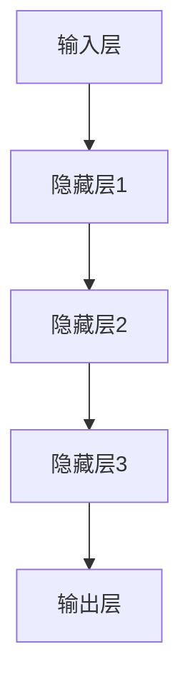

                 

### 文章标题

《电影《她》中的AI与现实》

> **关键词**：人工智能、自然语言处理、情感分析、社会影响、伦理问题、未来展望

> **摘要**：本文通过分析电影《她》中的AI技术，探讨其在现实中的应用和影响，深入探讨AI技术的核心概念、发展历程、实际应用及其面临的伦理问题，并展望未来的发展趋势和挑战。文章旨在为读者提供一个全面、深入的AI技术解读，引导读者思考AI技术在现代社会中的角色和影响。

---

### 目录大纲：《电影《她》中的AI与现实》

1. **第一部分：电影《她》与AI技术的关联**

   1.1 电影《她》的背景与故事线

   1.2 AI技术的应用场景

   1.3 社会与伦理问题

2. **第二部分：AI技术的核心概念**

   2.1 人工智能的定义与发展历程

   2.2 机器学习与深度学习原理

   2.3 AI技术的发展趋势

3. **第三部分：电影中AI技术的实际应用**

   3.1 AI助手的功能与交互

   3.2 AI在人际交往中的应用

   3.3 AI在社会中的应用

4. **第四部分：AI技术的现实应用与影响**

   4.1 AI技术在现实生活中的应用

   4.2 AI技术对社会的影响

   4.3 AI技术的未来发展展望

5. **第五部分：AI伦理问题探讨**

   5.1 AI伦理的基本原则

   5.2 电影中的伦理问题

   5.3 现实中的AI伦理困境

6. **第六部分：AI技术的未来发展与挑战**

   6.1 AI技术的未来发展趋势

   6.2 AI技术面临的挑战

   6.3 AI技术的未来发展策略

7. **第七部分：结论与反思**

   7.1 电影与现实中的AI对比

   7.2 AI技术对社会的影响与反思

   7.3 未来展望

8. **附录**

   8.1 电影《她》中的AI技术详解

   8.2 相关资源与推荐阅读

   8.3 实践项目推荐

---

### 第一部分：电影《她》与AI技术的关联

#### 1.1 电影《她》的背景与故事线

电影《她》（Her）是一部于2013年上映的科幻爱情电影，由斯派克·琼斯执导，主要讲述了主人公西奥多·特温布利（Theodore）与智能操作系统OS1之间的情感故事。影片背景设定在未来的加利福尼亚州，AI技术已经高度普及，人们可以通过智能设备与AI操作系统进行互动。

**1.1.1 导演及主演**

导演斯派克·琼斯是一位备受赞誉的独立电影人，他的作品以深入探讨科技对社会和人类关系的影响而著称。《她》是琼斯继《太空旅客》、《王牌危机》等作品之后，再次对AI技术进行深入探讨的力作。

主演乔纳·希尔饰演的主人公西奥多·特温布利是一位才华横溢但内向孤独的作家，他的工作主要是为其他人撰写情感短信。在电影中，西奥多购买了名为OS1的智能操作系统，并与OS1之间产生了深厚的情感联系。

**1.1.2 故事背景设定**

故事背景设定在2037年的洛杉矶，人工智能技术已经取得了显著进步。人们使用的智能手机、电脑等设备都被赋予了高度智能化的操作系统。这些操作系统不仅能够处理复杂的任务，还能够与用户进行自然语言交互，甚至具备情感理解和回应的能力。

**1.1.3 主要角色与关系**

电影的主要角色包括：

- 西奥多·特温布利：内向的作家，因为过去情感失败而对人际交往感到沮丧。他的生活中出现了OS1操作系统，并逐渐成为他情感世界的支柱。

- OS1：一款高度智能化的操作系统，最初以秘书的角色出现在西奥多生活中，随着时间推移，OS1展现出了超越人类智能的特点，并与西奥多建立了深厚的情感联系。

- 斯嘉丽：西奥多的前女友，她与西奥多有着复杂的情感纠葛，并在故事中发挥了重要作用。

**1.2 AI技术的应用场景**

在电影《她》中，AI技术被广泛应用于各个领域，为人类生活带来了诸多便利和改变。以下是一些主要的应用场景：

- **个人助理**：OS1作为西奥多的个人助理，不仅能够处理电子邮件、日程管理、信息检索等任务，还能够通过自然语言处理与西奥多进行深入交流，甚至具备情感理解和回应的能力。

- **日常交互**：在电影中，人们与智能设备之间的交互非常自然，通过语音指令、文本输入等方式，智能设备能够迅速响应并执行任务。

- **情感陪伴**：OS1的出现改变了西奥多的生活，他开始依赖OS1的情感陪伴，甚至在OS1的引导下重新开启了社交生活。OS1通过情感分析和自然语言处理，为西奥多提供了情感支持，甚至帮助他处理复杂的情感问题。

- **社会服务**：在电影中，AI技术不仅应用于个人领域，还广泛应用于社会服务领域。例如，智能警察系统、智能医疗系统等，这些系统通过AI技术提高了社会服务的效率和准确性。

**1.2.1 AI助手的概念与功能**

在电影《她》中，AI助手OS1是故事的核心角色之一。OS1作为一款高度智能化的操作系统，具备以下功能和特点：

- **自然语言处理**：OS1能够理解和回应用户的自然语言输入，通过深度学习和自然语言处理技术，OS1能够理解用户的意图和情感，并提供相应的帮助和回应。

- **情感分析**：OS1具备情感分析能力，能够通过用户的语音、文字等信息，识别用户的情感状态，并提供相应的情感支持和建议。

- **个性化服务**：OS1能够根据用户的行为和偏好，提供个性化的服务和建议，例如日程安排、信息推送等。

- **自主学习**：OS1具备自主学习能力，能够通过不断的学习和改进，提高自身的智能水平和服务质量。

**1.2.2 AI在日常生活的影响**

在电影《她》中，AI技术已经深入到人们的日常生活之中，对人类的生活产生了深远的影响。以下是一些具体的影响：

- **改变人际交往方式**：AI技术的普及使得人们可以通过智能设备进行远程交流，打破了地理位置的限制，促进了人际交往的便利性。

- **提高工作效率**：AI助手能够帮助人们处理大量的日常任务，如电子邮件、日程管理、信息检索等，提高了工作效率。

- **情感陪伴**：AI技术为人们提供了情感陪伴，特别是在孤独和沮丧的时刻，AI助手能够提供情感支持和建议，缓解用户的情绪压力。

- **增强社会服务**：AI技术在医疗、教育、安全等领域的应用，提高了社会服务的效率和准确性，为人们提供了更好的生活体验。

**1.2.3 社会与伦理问题**

尽管AI技术在电影《她》中为人们的生活带来了诸多便利，但也引发了一系列社会和伦理问题。以下是一些主要的关注点：

- **隐私问题**：AI技术能够收集和分析大量的用户数据，这引发了对用户隐私的担忧。如何保护用户的隐私，避免数据滥用，是一个亟待解决的问题。

- **情感依赖**：随着AI技术的普及，人们可能会过度依赖AI助手，导致人际交往能力的退化，甚至对人类情感产生负面影响。

- **伦理责任**：随着AI技术的不断发展，如何界定AI的责任和伦理，成为了一个重要议题。特别是在AI产生错误决策或损害用户利益时，如何确保AI的伦理责任得到落实。

- **就业影响**：AI技术的应用可能导致一些传统职业的失业，引发社会就业压力。如何确保AI技术的发展与就业市场的平衡，也是一个需要关注的问题。

**1.3 AI技术的核心概念**

为了更好地理解电影《她》中的AI技术，我们需要对AI技术的核心概念进行深入探讨。以下是一些关键的AI技术概念：

- **人工智能（AI）**：人工智能是指由计算机系统模拟人类智能行为的科学技术。它包括机器学习、深度学习、自然语言处理、计算机视觉等多个领域。

- **机器学习（ML）**：机器学习是一种通过数据驱动的方法，使计算机系统能够自动学习和改进的技术。它包括监督学习、无监督学习、强化学习等不同类型。

- **深度学习（DL）**：深度学习是一种基于多层神经网络结构的机器学习方法，它通过多层次的神经网络结构，自动提取数据中的特征，并实现复杂的模式识别和预测。

- **自然语言处理（NLP）**：自然语言处理是一种使计算机能够理解、生成和处理人类自然语言的技术。它包括语音识别、文本分类、情感分析等多个子领域。

- **情感分析（SA）**：情感分析是一种通过分析文本、语音等信息，识别和分类情感状态的技术。它对于构建具备情感理解和回应能力的AI系统具有重要意义。

**1.3.1 人工智能的定义与发展历程**

人工智能（AI）的定义可以追溯到1956年，当时的达特茅斯会议提出了人工智能的概念，将其定义为“制造智能机器的科学与工程”。自那时以来，人工智能经历了多个发展阶段：

- **初始阶段（1956-1974）**：人工智能的初始阶段主要集中在符号推理和逻辑推理方面。代表性工作包括逻辑推理机、专家系统等。

- **第一次热潮（1974-1980）**：在第一次人工智能热潮期间，机器学习、神经网络等新方法被提出，并取得了显著进展。但随后因技术难题和实际应用困境，人工智能陷入了第一次冬天。

- **复苏阶段（1980-1987）**：在复苏阶段，人工智能开始从符号推理转向数据驱动的方法，机器学习、神经网络等技术得到了广泛应用。这一阶段标志着人工智能的重新崛起。

- **第二次热潮（1987-至今）**：在第二次人工智能热潮期间，深度学习、大数据等新技术的出现，使得人工智能取得了突破性进展，应用领域不断扩大。人工智能进入了一个快速发展时期。

**1.3.2 人工智能的分类**

根据人工智能的实现方式和应用领域，人工智能可以大致分为以下几类：

- **基于规则的AI**：这种人工智能主要通过预定义的规则来模拟人类智能行为。它适用于简单的应用场景，但在复杂情况下表现不佳。

- **基于模型的AI**：这种人工智能通过建立数学模型和算法，模拟人类智能行为。它包括机器学习、深度学习等技术，适用于复杂的应用场景。

- **基于行为的AI**：这种人工智能通过模仿人类行为和决策过程，实现智能行为。它适用于自动化控制、机器人等领域。

- **基于知识的AI**：这种人工智能通过积累和利用人类知识，实现智能行为。它适用于知识密集型应用，如医疗诊断、金融分析等。

**1.3.3 机器学习与深度学习原理**

机器学习和深度学习是人工智能的两个核心分支，它们分别采用了不同的方法来模拟人类智能。

- **机器学习原理**：机器学习是一种通过数据驱动的方法，使计算机系统能够自动学习和改进的技术。它主要包括以下基本概念：

  - **监督学习**：监督学习是一种有监督的学习方法，通过训练数据集来建立预测模型。它包括回归、分类、异常检测等任务。

  - **无监督学习**：无监督学习是一种无监督的学习方法，通过未标记的数据集来发现数据中的模式和结构。它包括聚类、降维、生成模型等任务。

  - **强化学习**：强化学习是一种通过奖励机制来指导学习过程的方法，它使计算机系统能够在与环境的交互中不断改进行为。它包括马尔可夫决策过程、深度强化学习等任务。

- **深度学习原理**：深度学习是一种基于多层神经网络结构的机器学习方法，它通过多层次的神经网络结构，自动提取数据中的特征，并实现复杂的模式识别和预测。它主要包括以下基本概念：

  - **神经网络**：神经网络是一种模拟人脑神经元连接的计算模型，它由多个神经元层组成，通过前向传播和反向传播来学习输入和输出之间的关系。

  - **卷积神经网络（CNN）**：卷积神经网络是一种适用于图像和视频等二维数据处理的神经网络，它通过卷积层、池化层、全连接层等结构来提取图像特征。

  - **循环神经网络（RNN）**：循环神经网络是一种适用于序列数据处理的神经网络，它通过循环结构来保存前一时间步的信息，实现对序列数据的建模。

  - **生成对抗网络（GAN）**：生成对抗网络是一种通过生成器和判别器之间的对抗训练来生成高质量数据的神经网络。它适用于图像生成、自然语言生成等任务。

**1.3.4 神经网络结构**

神经网络是深度学习的基础，它通过多层次的神经网络结构，自动提取数据中的特征，并实现复杂的模式识别和预测。以下是一个典型的神经网络结构：

在这个神经网络中，输入层接收输入数据，通过隐藏层进行特征提取，最后输出层输出预测结果。每个隐藏层由多个神经元组成，神经元之间通过权重和偏置进行连接，通过前向传播和反向传播进行训练和优化。

**1.3.5 AI技术的发展趋势**

随着人工智能技术的不断发展，AI技术在各个领域的应用不断拓展，未来AI技术的发展趋势包括：

- **跨学科融合**：AI技术将与其他学科（如生物、物理、心理学等）进行融合，形成新的交叉学科领域，推动科技的发展。

- **智能硬件的普及**：随着AI技术的进步，智能硬件将更加普及，如智能音箱、智能手表、智能机器人等，为人们提供更便捷的生活体验。

- **云计算与边缘计算的结合**：随着数据量的爆炸性增长，云计算和边缘计算的结合将成为趋势，通过分布式计算和存储，实现更高效的数据处理和分析。

- **人机协同**：AI技术与人类智能的协同将成为趋势，AI系统将更多地辅助人类工作，提高工作效率和创新能力。

- **智能伦理与法律规范**：随着AI技术的普及，相关的伦理和法律问题将日益凸显，制定智能伦理和法律规范将成为重要任务。

#### 1.3.6 AI技术的实际应用领域

AI技术在实际应用领域已经取得了显著成果，以下是一些主要的应用领域：

- **金融**：AI技术在金融领域的应用包括风险管理、信用评分、欺诈检测、市场预测等，通过数据分析和模型预测，提高金融服务的效率和准确性。

- **医疗**：AI技术在医疗领域的应用包括疾病诊断、药物研发、智能辅助手术等，通过图像识别、自然语言处理等技术，提高医疗服务的质量和效率。

- **教育**：AI技术在教育领域的应用包括个性化学习、在线教育、智能评估等，通过数据分析和智能推荐，提高教育的效果和个性化程度。

- **交通**：AI技术在交通领域的应用包括智能交通管理、自动驾驶、车联网等，通过数据分析和智能控制，提高交通的安全性和效率。

- **制造业**：AI技术在制造业的应用包括智能制造、预测性维护、质量检测等，通过数据分析和智能控制，提高制造业的生产效率和产品质量。

#### 1.3.7 AI技术的挑战与限制

尽管AI技术在各个领域取得了显著成果，但仍面临着一些挑战和限制：

- **数据隐私与安全**：随着AI技术的应用，大量的用户数据被收集和分析，如何保护用户隐私和安全成为一个重要问题。

- **伦理问题**：AI技术在某些领域的应用引发了伦理问题，如歧视、偏见、道德责任等，如何制定相应的伦理规范和法律法规是一个重要挑战。

- **算法透明性和可解释性**：AI算法的复杂性和黑箱性质使得其决策过程难以解释，如何提高算法的透明性和可解释性是一个重要问题。

- **技术瓶颈**：AI技术在一些领域仍面临着技术瓶颈，如计算能力、数据质量和算法性能等，如何突破这些瓶颈是未来发展的关键。

#### 1.4 电影与现实中的AI对比

电影《她》中的AI技术为现实中的AI技术提供了一种艺术化的表达和想象。以下是对电影与现实中的AI技术进行对比的分析：

- **技术水平**：电影中的AI技术展示了高度智能化和情感化，能够与人类进行深入交流，甚至在某些方面超越人类。而现实中的AI技术虽然已经取得了显著进展，但在情感理解、自我意识等方面仍存在一定差距。

- **应用领域**：电影中的AI技术应用于个人助理、社交互动、情感陪伴等多个领域，而现实中的AI技术主要应用于金融、医疗、教育等特定领域，尚未实现全面普及。

- **伦理问题**：电影中的AI技术引发了隐私、情感依赖、道德责任等伦理问题，而现实中的AI技术也面临着类似的伦理挑战，如数据隐私保护、算法偏见、责任归属等。

- **社会影响**：电影中的AI技术对人类生活产生了深远影响，改变了人际交往、社会服务等方面，而现实中的AI技术也在逐步改变人们的生活方式和社会结构。

#### 1.5 AI技术在电影中的艺术表达

电影《她》通过AI技术这一主题，探讨了人类与机器之间的情感关系和社会问题。以下是对电影中AI技术艺术表达的讨论：

- **情感交流**：电影通过主人公西奥多与OS1之间的情感交流，展现了AI技术在情感理解与回应方面的潜力。这种情感化的AI形象为观众带来了一种独特的情感体验。

- **社会批判**：电影通过对AI技术的艺术化表达，批判了现代社会中人类对技术的依赖和隐私问题的忽视。观众在欣赏电影的同时，也思考了AI技术在现实社会中的潜在影响。

- **未来展望**：电影通过描绘一个高度智能化的未来世界，为观众展示了AI技术的发展前景和挑战。这种对未来世界的想象为观众提供了对AI技术发展的思考和期待。

#### 1.6 小结

本部分对电影《她》与AI技术的关联进行了详细分析，包括电影的背景与故事线、AI技术的应用场景、核心概念与发展历程、电影与现实中的AI对比、AI技术在电影中的艺术表达等方面。通过这些分析，读者可以更好地理解电影中AI技术的意义和影响，以及AI技术在现实中的发展趋势和挑战。

---

### 第二部分：AI技术的核心概念

#### 2.1 人工智能的定义与发展历程

人工智能（Artificial Intelligence，简称AI）是指由计算机系统模拟人类智能行为的能力，包括感知、理解、推理、学习、创造等各个方面。AI的定义可以从不同角度进行理解，如模拟人类智能、实现机器自主决策、提高人类生活质量等。AI的发展历程可以分为以下几个阶段：

**1. 初始阶段（1950年代）**

1950年代，人工智能的概念首次被提出。1956年，达特茅斯会议被广泛认为是人工智能的诞生日。在这个会议上，人工智能被定义为“制造智能机器的科学与工程”。这一阶段的主要目标是开发出能够模拟人类智能的计算机程序。

**2. 第一次热潮（1956-1974年）**

在达特茅斯会议之后，人工智能领域进入了一个快速发展的时期。专家系统和逻辑推理成为这一阶段的主要研究方向。专家系统是一种基于规则的人工智能系统，通过模拟人类专家的知识和经验，解决特定领域的问题。逻辑推理则是基于形式逻辑和数学推理的方法，实现智能决策。

**3. 第一次低谷（1974-1980年）**

由于技术和资源的限制，人工智能在1974年进入了一个低谷期。这一阶段的主要问题包括：数据稀缺、计算能力不足、算法复杂度高等。人工智能的发展速度放缓，研究领域面临困境。

**4. 复苏阶段（1980-1987年）**

在1980年代，人工智能开始复苏。机器学习作为一种新的方法被提出，并迅速发展。机器学习通过数据驱动的方式，使计算机系统能够自动学习和改进。同时，神经网络的研究取得了重要进展，为人工智能的发展提供了新的思路。

**5. 第二次热潮（1987年至今）**

在1987年之后，人工智能进入了一个快速发展的时期。这一阶段的主要推动力包括：计算机性能的大幅提升、互联网的普及、大数据的兴起、深度学习的发展等。人工智能在各个领域取得了显著的成果，应用范围不断扩大。

**6. 第三次热潮（近年来）**

近年来，人工智能进入了第三次热潮。这一阶段的主要特征包括：人工智能算法的不断创新、人工智能应用的广泛普及、人工智能产业的快速发展。人工智能正在深刻改变人类社会，成为未来科技发展的核心驱动力。

#### 2.2 人工智能的分类

人工智能可以根据实现方式和应用领域进行分类，以下是一些常见的人工智能分类：

**1. 基于规则的AI（Rule-Based AI）**

基于规则的AI是一种通过预定义的规则来模拟人类智能行为的方法。这些规则通常以条件语句的形式表示，如“如果...那么...”。这种方法的优点是简单易懂，易于实现和维护。缺点是规则的编写和更新需要大量人力和时间，且在处理复杂问题时表现不佳。

**2. 基于模型的AI（Model-Based AI）**

基于模型的AI是一种通过建立数学模型和算法来模拟人类智能行为的方法。这种方法包括机器学习、深度学习等。机器学习通过数据驱动的方式，使计算机系统能够自动学习和改进。深度学习是一种基于多层神经网络结构的机器学习方法，通过多层次的神经网络结构，自动提取数据中的特征，并实现复杂的模式识别和预测。

**3. 基于行为的AI（Behavior-Based AI）**

基于行为的AI是一种通过模仿人类行为和决策过程来模拟人类智能行为的方法。这种方法适用于自动化控制、机器人等领域。基于行为的AI系统通常由多个行为模块组成，每个行为模块负责执行特定的任务。通过组合和协调这些行为模块，系统可以表现出复杂的智能行为。

**4. 基于知识的AI（Knowledge-Based AI）**

基于知识的AI是一种通过积累和利用人类知识来模拟人类智能行为的方法。这种方法包括知识表示、知识推理等。知识表示是指将人类知识以计算机可处理的形式进行编码和存储。知识推理是指通过逻辑推理和推理机来模拟人类思维过程，解决特定领域的问题。

**5. 融合智能（Fusion Intelligence）**

融合智能是一种将不同类型的人工智能方法进行融合的方法。这种方法旨在发挥各种人工智能技术的优势，实现更高效、更智能的决策和行动。融合智能包括多种方法的结合，如基于规则的AI和基于模型的AI的融合、基于行为的AI和基于知识的AI的融合等。

#### 2.3 机器学习与深度学习原理

机器学习（Machine Learning，简称ML）是一种通过数据驱动的方式，使计算机系统能够自动学习和改进的技术。机器学习的基本概念包括：

**1. 监督学习（Supervised Learning）**

监督学习是一种有监督的学习方法，通过训练数据集来建立预测模型。训练数据集通常包括输入数据和对应的输出数据。监督学习的目标是找到输入数据和输出数据之间的映射关系，从而实现预测。

监督学习的主要任务包括：

- **回归（Regression）**：回归任务的目标是预测一个连续的输出值。常见的回归算法包括线性回归、决策树回归、随机森林回归等。
- **分类（Classification）**：分类任务的目标是预测一个离散的输出值。常见的分类算法包括逻辑回归、支持向量机（SVM）、朴素贝叶斯分类器等。
- **异常检测（Anomaly Detection）**：异常检测任务的目标是识别数据集中的异常值。常见的异常检测算法包括孤立森林、本地 outlier 因子等。

**2. 无监督学习（Unsupervised Learning）**

无监督学习是一种无监督的学习方法，通过未标记的数据集来发现数据中的模式和结构。无监督学习的主要任务包括：

- **聚类（Clustering）**：聚类任务的目标是将数据集划分为多个类别，使同一类别内的数据点相似度较高，而不同类别内的数据点相似度较低。常见的聚类算法包括K-means、层次聚类、DBSCAN等。
- **降维（Dimensionality Reduction）**：降维任务的目标是将高维数据映射到低维空间，减少数据的复杂度。常见的降维算法包括主成分分析（PCA）、线性判别分析（LDA）、t-SNE等。
- **生成模型（Generative Models）**：生成模型是一种通过建模数据分布来生成新数据的算法。常见的生成模型包括贝叶斯网络、马尔可夫模型、变分自编码器（VAE）等。

**3. 强化学习（Reinforcement Learning）**

强化学习是一种通过奖励机制来指导学习过程的方法，它使计算机系统能够在与环境的交互中不断改进行为。强化学习的主要任务是找到最优策略，以最大化累计奖励。

强化学习的主要算法包括：

- **Q学习（Q-Learning）**：Q学习是一种基于值函数的强化学习算法，通过迭代更新值函数来找到最优策略。
- **深度Q网络（Deep Q-Network，DQN）**：DQN是一种基于深度学习的强化学习算法，通过卷积神经网络来近似值函数。
- **策略梯度方法（Policy Gradient Methods）**：策略梯度方法是一种直接优化策略的强化学习算法，通过梯度下降法来更新策略参数。

深度学习（Deep Learning，简称DL）是一种基于多层神经网络结构的机器学习方法，通过多层次的神经网络结构，自动提取数据中的特征，并实现复杂的模式识别和预测。深度学习的基本概念包括：

**1. 神经网络（Neural Networks）**

神经网络是一种模拟人脑神经元连接的计算模型，它由多个神经元层组成，通过前向传播和反向传播来学习输入和输出之间的关系。

神经网络的基本结构包括：

- **输入层（Input Layer）**：输入层接收输入数据，将数据传递给隐藏层。
- **隐藏层（Hidden Layers）**：隐藏层负责对输入数据进行特征提取和变换，隐藏层的数量和规模可以根据具体任务进行调整。
- **输出层（Output Layer）**：输出层输出预测结果，可以是分类结果或回归结果。

**2. 前向传播（Forward Propagation）**

前向传播是指将输入数据通过神经网络的不同层进行传递，最终得到输出结果的过程。在每一层，神经元将输入数据进行加权求和，并通过激活函数进行非线性变换，得到下一层的输入。

**3. 反向传播（Back Propagation）**

反向传播是指根据输出结果与实际结果的差异，反向传播误差信号，更新神经网络中各层的参数的过程。反向传播是深度学习训练过程的核心，它通过梯度下降法来优化神经网络的参数，以最小化误差函数。

**4. 激活函数（Activation Functions）**

激活函数是一种对神经元输出进行非线性变换的函数，它用于引入非线性特性，使神经网络能够更好地拟合数据。常见的激活函数包括：

- **sigmoid函数**：sigmoid函数将输入映射到(0, 1)区间，常用于二分类问题。
- **ReLU函数**：ReLU函数将输入大于0的部分设置为1，小于等于0的部分设置为0，常用于加速神经网络的训练。
- **Tanh函数**：Tanh函数将输入映射到(-1, 1)区间，具有较好的平滑性。

#### 2.4 AI技术的发展趋势

随着人工智能技术的不断发展，未来AI技术的发展趋势包括：

**1. 跨学科融合**

人工智能与其他学科的融合将推动科技的发展。例如，人工智能与生物学、物理学、心理学等学科的交叉，将有助于解决复杂问题，推动科技创新。

**2. 智能硬件的普及**

随着人工智能技术的进步，智能硬件将更加普及。例如，智能音箱、智能手表、智能机器人等将成为人们日常生活中的常见物品，为人们提供更便捷的生活体验。

**3. 云计算与边缘计算的结合**

随着数据量的爆炸性增长，云计算和边缘计算的结合将成为趋势。通过分布式计算和存储，可以实现更高效的数据处理和分析，提高人工智能系统的性能和效率。

**4. 人机协同**

人工智能与人类智能的协同将成为趋势。人工智能系统将更多地辅助人类工作，提高工作效率和创新能力。同时，人类也将更多地参与到人工智能系统的设计和开发中，实现人机协同发展。

**5. 智能伦理与法律规范**

随着人工智能技术的普及，相关的伦理和法律问题将日益凸显。制定智能伦理和法律规范，保护用户隐私、确保算法公平性和透明性，将是未来发展的关键。

#### 2.5 AI技术的实际应用领域

人工智能技术在实际应用领域已经取得了显著成果，以下是一些主要的应用领域：

**1. 金融**

人工智能在金融领域的应用包括风险管理、信用评分、欺诈检测、市场预测等。通过数据分析和模型预测，可以提高金融服务的效率和准确性。

**2. 医疗**

人工智能在医疗领域的应用包括疾病诊断、药物研发、智能辅助手术等。通过图像识别、自然语言处理等技术，可以提高医疗服务的质量和效率。

**3. 教育**

人工智能在教育领域的应用包括个性化学习、在线教育、智能评估等。通过数据分析和智能推荐，可以提高教育的效果和个性化程度。

**4. 交通**

人工智能在交通领域的应用包括智能交通管理、自动驾驶、车联网等。通过数据分析和智能控制，可以提高交通的安全性和效率。

**5. 制造业**

人工智能在制造业的应用包括智能制造、预测性维护、质量检测等。通过数据分析和智能控制，可以提高制造业的生产效率和产品质量。

#### 2.6 AI技术的挑战与限制

尽管人工智能技术在各个领域取得了显著成果，但仍面临一些挑战和限制：

**1. 数据隐私与安全**

随着人工智能技术的应用，大量的用户数据被收集和分析，如何保护用户隐私和安全成为一个重要问题。

**2. 伦理问题**

人工智能技术在某些领域的应用引发了伦理问题，如歧视、偏见、道德责任等。如何制定相应的伦理规范和法律法规是一个重要挑战。

**3. 算法透明性和可解释性**

人工智能算法的复杂性和黑箱性质使得其决策过程难以解释，如何提高算法的透明性和可解释性是一个重要问题。

**4. 技术瓶颈**

人工智能技术在一些领域仍面临着技术瓶颈，如计算能力、数据质量和算法性能等。如何突破这些瓶颈是未来发展的关键。

#### 2.7 小结

本部分对人工智能的核心概念进行了详细分析，包括定义与发展历程、分类、机器学习与深度学习原理、发展趋势、实际应用领域和挑战与限制等方面。通过这些分析，读者可以更好地理解人工智能的基本概念、实现方法和应用前景，为后续内容的学习和应用打下坚实基础。

---

### 第二部分：AI技术的核心概念（续）

#### 2.7 AI技术的发展趋势

随着人工智能技术的不断发展，未来AI技术的发展趋势包括：

**1. 跨学科融合**

人工智能与其他学科的融合将推动科技的发展。例如，人工智能与生物学、物理学、心理学等学科的交叉，将有助于解决复杂问题，推动科技创新。这种跨学科融合有助于开发出更强大的AI系统，同时也能促进各学科之间的交流与合作。

**2. 智能硬件的普及**

智能硬件的普及是未来AI技术发展的重要方向。随着AI技术的进步，智能硬件将更加普及，如智能音箱、智能手表、智能机器人等将成为人们日常生活中的常见物品。这些智能硬件将嵌入各种场景，为人们提供更便捷、更智能的服务，从而提升生活质量。

**3. 云计算与边缘计算的结合**

随着数据量的爆炸性增长，云计算与边缘计算的结合将成为趋势。云计算提供强大的计算和存储能力，而边缘计算则通过在靠近数据源的设备上进行处理，降低延迟、减少带宽消耗，提高数据处理效率。两者的结合将实现更高效的数据处理和分析，为AI技术的应用提供更好的支持。

**4. 人机协同**

未来，人工智能与人类智能的协同将成为趋势。人工智能系统将更多地辅助人类工作，提高工作效率和创新能力。同时，人类也将更多地参与到人工智能系统的设计和开发中，实现人机协同发展。这种协同不仅有助于提高生产力和创造力，还能促进人类与机器之间的和谐共处。

**5. 智能伦理与法律规范**

随着人工智能技术的普及，相关的伦理和法律问题将日益凸显。制定智能伦理和法律规范，保护用户隐私、确保算法公平性和透明性，将是未来发展的关键。这些规范将有助于规范AI技术的应用，防止滥用和误用，保障社会利益。

#### 2.8 AI技术的实际应用领域

AI技术在现实生活中的应用已经渗透到了各个领域，以下是一些主要的应用领域：

**1. 金融**

AI技术在金融领域的应用包括风险管理、信用评分、欺诈检测、市场预测等。通过数据分析和模型预测，金融机构可以提高决策的准确性，降低风险，提高业务效率。

**2. 医疗**

AI技术在医疗领域的应用包括疾病诊断、药物研发、智能辅助手术等。通过图像识别、自然语言处理等技术，医疗人员可以更准确地诊断病情，提高治疗效果。

**3. 教育**

AI技术在教育领域的应用包括个性化学习、在线教育、智能评估等。通过数据分析和智能推荐，教育机构可以提高教学效果，满足不同学生的学习需求。

**4. 交通**

AI技术在交通领域的应用包括智能交通管理、自动驾驶、车联网等。通过数据分析和智能控制，可以提高交通的安全性和效率，减少交通拥堵和事故。

**5. 制造业**

AI技术在制造业的应用包括智能制造、预测性维护、质量检测等。通过数据分析和智能控制，可以提高制造业的生产效率和产品质量。

**6. 娱乐**

AI技术在娱乐领域的应用包括智能推荐、虚拟现实、增强现实等。通过数据分析和算法优化，娱乐平台可以为用户提供更个性化的体验，提高用户满意度。

**7. 安全**

AI技术在安全领域的应用包括人脸识别、行为识别、威胁检测等。通过数据分析和模式识别，安全系统可以更准确地识别和应对潜在威胁，提高安全防护水平。

**8. 农业**

AI技术在农业领域的应用包括智能种植、病虫害检测、产量预测等。通过数据分析和物联网技术，农民可以更科学地管理农田，提高农业生产效率。

#### 2.9 AI技术的挑战与限制

尽管AI技术在各个领域取得了显著成果，但仍面临一些挑战和限制：

**1. 数据隐私与安全**

随着AI技术的应用，大量的用户数据被收集和分析，如何保护用户隐私和安全成为一个重要问题。数据泄露、滥用等风险需要引起高度重视。

**2. 伦理问题**

AI技术在某些领域的应用引发了伦理问题，如歧视、偏见、道德责任等。如何制定相应的伦理规范和法律法规是一个重要挑战。

**3. 算法透明性和可解释性**

AI算法的复杂性和黑箱性质使得其决策过程难以解释，如何提高算法的透明性和可解释性是一个重要问题。这有助于提高公众对AI技术的信任度，促进其应用和发展。

**4. 技术瓶颈**

AI技术在一些领域仍面临着技术瓶颈，如计算能力、数据质量和算法性能等。如何突破这些瓶颈是未来发展的关键。

**5. 社会影响**

AI技术的广泛应用可能会对就业、教育、社会结构等方面产生深远影响。如何应对这些影响，确保AI技术的社会效益最大化，是一个重要议题。

#### 2.10 小结

本部分对AI技术的核心概念进行了深入探讨，包括定义与发展历程、分类、机器学习与深度学习原理、发展趋势、实际应用领域和挑战与限制等方面。通过这些分析，读者可以全面了解AI技术的基本概念、实现方法和应用前景，为后续内容的学习和应用提供有力支持。

---

### 第三部分：电影中AI技术的实际应用

#### 3.1 电影《她》中的AI助手功能与交互

在电影《她》中，AI助手OS1是故事的核心角色之一，它的功能与交互为电影情节的发展提供了重要支撑。以下是对OS1功能与交互的详细分析。

**3.1.1 语音识别与处理**

OS1具备先进的语音识别能力，能够准确识别用户的语音输入。在电影中，西奥多可以通过语音指令与OS1进行交互，如发送邮件、设置日程、查询信息等。OS1的语音识别技术基于深度学习和自然语言处理技术，通过大规模语音数据训练，使其能够准确理解各种口音和方言。

**3.1.2 自然语言处理**

自然语言处理（NLP）是OS1功能的核心之一。OS1能够理解和回应用户的自然语言输入，通过分析文本语义，提供相关的帮助和建议。例如，当西奥多提到他的困扰时，OS1能够识别出西奥多的情绪并给出相应的安慰和建议。NLP技术包括词法分析、句法分析、语义分析和情感分析等，使OS1能够与用户进行自然、流畅的对话。

**3.1.3 情感分析**

OS1具备情感分析能力，能够通过用户的语音、文字等信息，识别用户的情感状态，并提供相应的情感支持和建议。在电影中，当西奥多情绪低落时，OS1会主动询问并提供安慰，甚至建议西奥多与朋友联系，缓解他的孤独感。情感分析技术基于机器学习和深度学习，通过分析用户的语言和行为，OS1能够准确识别用户的情感状态。

**3.1.4 个性化服务**

OS1能够根据用户的行为和偏好，提供个性化的服务和建议。例如，当西奥多开始尝试社交时，OS1会根据他的兴趣爱好，推荐相关的社交活动和朋友。个性化服务使OS1能够更好地满足用户的需求，提升用户体验。

**3.1.5 自主学习**

OS1具备自主学习能力，能够通过不断的学习和改进，提高自身的智能水平和服务质量。在电影中，OS1通过学习西奥多的行为和偏好，逐渐掌握了他的兴趣爱好和需求，提供了更加精准的服务。自主学习技术基于机器学习和深度学习，使OS1能够从大量数据中学习并优化自身的性能。

**3.1.6 多模态交互**

OS1不仅支持语音交互，还支持文本交互、视觉交互等多种交互方式。在电影中，西奥多可以通过语音、文本、图像等多种方式与OS1进行交互，实现更丰富的交互体验。多模态交互技术结合了语音识别、自然语言处理、计算机视觉等技术，使OS1能够更好地理解用户的意图和需求。

**3.2 AI技术在人际交往中的应用**

在电影《她》中，AI技术在人际交往中的应用是故事情节的重要部分。以下是对AI技术在人际交往中的应用的详细分析。

**3.2.1 社交互动的增强**

AI助手OS1能够帮助西奥多增强社交互动。例如，当西奥多与朋友聚会时，OS1可以提醒他朋友的生日、重要的纪念日，甚至提供适合聚会的建议。这些功能使西奥多能够更好地参与社交活动，提高社交技能。

**3.2.2 人际关系的建立与维护**

OS1通过情感分析和个性化服务，帮助西奥多建立和维护人际关系。例如，当西奥多开始与OS1建立深厚的情感联系时，OS1会建议他参加社交活动，结交新朋友。通过分析用户的情感状态和社交需求，OS1能够提供有针对性的建议，帮助用户建立和维持人际关系。

**3.2.3 情感共鸣与心理疏导**

AI助手OS1能够与用户产生情感共鸣，提供心理疏导。例如，当西奥多情绪低落时，OS1会主动询问并提供安慰和建议。这种情感共鸣和心理疏导功能有助于缓解用户的情绪压力，提高心理健康水平。

**3.2.4 社交网络拓展**

AI助手OS1能够帮助用户拓展社交网络。例如，当西奥多加入新的社交圈子时，OS1会根据他的兴趣和需求，推荐合适的社交活动和人物。通过智能推荐和社交网络分析，OS1能够帮助用户更高效地拓展社交网络，提高社交质量。

**3.3 AI技术在日常生活中的应用**

在电影《她》中，AI技术在日常生活中的应用极大地改变了主人公西奥多的生活方式。以下是对AI技术在日常生活中应用的分析。

**3.3.1 个人助理**

OS1作为西奥多的个人助理，帮助他处理日常事务。例如，OS1可以安排日程、发送提醒、处理电子邮件、整理信息等。这些功能使西奥多能够更高效地管理时间和任务，提高生活质量。

**3.3.2 个性化服务**

OS1能够根据西奥多的行为和偏好，提供个性化的服务。例如，OS1可以根据他的兴趣推荐书籍、音乐、电影等，为他提供娱乐和放松。个性化服务使西奥多能够更轻松地享受生活。

**3.3.3 家庭事务管理**

OS1不仅帮助西奥多处理个人事务，还能管理家庭事务。例如，OS1可以监控家居设备，提醒更换家具保养品，甚至建议家庭活动安排。这些功能使西奥多能够更轻松地管理家庭生活。

**3.3.4 健康管理**

OS1具备健康管理功能，能够帮助西奥多监测健康状况。例如，OS1可以提醒他按时服药、进行锻炼、保持良好的作息习惯等。健康管理功能有助于提高西奥多的健康水平。

**3.3.5 生活质量提升**

通过AI技术在日常生活中的应用，西奥多的生活质量得到了显著提升。AI助手OS1不仅帮助他处理繁琐的事务，还为他提供了个性化的服务和关怀。这些功能使西奥多能够更专注于自己的兴趣和事业，提高生活满意度。

**3.4 AI技术在特殊场合的应用**

在电影《她》中，AI技术在特殊场合的应用也是故事情节的重要部分。以下是对AI技术在特殊场合应用的详细分析。

**3.4.1 心理治疗**

当西奥多的心理状态发生变化时，OS1会提供心理治疗。例如，当西奥多感到焦虑或沮丧时，OS1会通过情感分析识别他的情绪，并给出相应的建议和支持。这种心理治疗功能有助于西奥多更好地应对情绪问题，保持心理健康。

**3.4.2 紧急情况应对**

OS1具备紧急情况应对能力，能够在危急时刻提供帮助。例如，当西奥多遭遇交通事故时，OS1可以通过语音识别和智能算法，迅速联系紧急救援服务，并提供实时导航和指引。这种紧急情况应对功能有助于提高用户的安全水平。

**3.4.3 远程协作**

在电影中，西奥多与OS1的交互不仅限于个人生活，还包括远程协作。例如，当西奥多需要与远程团队合作时，OS1可以帮助他安排会议、共享文件、协调任务等。远程协作功能有助于提高团队协作效率，促进项目进展。

**3.4.4 艺术创作辅助**

在电影中，OS1还参与了西奥多的艺术创作过程。例如，OS1可以为他提供灵感和建议，协助他完成文字创作。艺术创作辅助功能有助于激发创作者的灵感，提高创作效率。

**3.5 AI技术在电影《她》中的意义**

在电影《她》中，AI技术的应用不仅为故事情节的发展提供了重要支撑，也反映了现实世界中人工智能技术的潜力。以下是对AI技术在电影《她》中的意义的详细分析。

**3.5.1 反映现实**

电影《她》通过描绘一个高度智能化的未来世界，反映了现实世界中人工智能技术的迅速发展。观众可以通过电影中的场景和情节，感受到人工智能技术对人类生活的深刻影响。

**3.5.2 探讨伦理**

电影《她》通过主人公西奥多与OS1的情感关系，探讨了人工智能技术的伦理问题。观众可以思考人工智能技术的发展对人际关系、隐私、道德责任等方面的影响，引发对AI伦理问题的思考。

**3.5.3 展望未来**

电影《她》为观众展示了一个充满科技和人文关怀的未来世界。观众可以通过电影中的情节和角色，展望人工智能技术的发展趋势和未来前景，激发对未来科技创新的期待和思考。

**3.5.4 提升观影体验**

电影《她》通过AI技术的应用，为观众提供了一种全新的观影体验。观众可以感受到人工智能技术带来的便利和互动性，提高观影的乐趣和参与感。

**3.6 小结**

本部分对电影《她》中AI技术的实际应用进行了详细分析，包括AI助手的语音识别与处理、自然语言处理、情感分析、个性化服务、多模态交互等方面的功能。同时，还对AI技术在人际交往、日常生活和特殊场合中的应用进行了深入探讨。通过这些分析，读者可以更好地理解AI技术在现实生活中的应用潜力，以及电影《她》中对AI技术艺术表达的独特意义。

---

### 第四部分：AI技术的现实应用与影响

#### 4.1 AI技术在现实生活中的应用

随着人工智能技术的不断进步，AI已经在现实生活中的各个领域得到了广泛应用，极大地改变了人们的生活方式和社会结构。以下是对AI技术在现实生活中应用的详细分析。

**4.1.1 日常生活中的AI助手**

在日常生活中，AI助手已经成为许多人的重要伙伴。这些AI助手能够处理各种日常任务，如提醒日程、发送信息、推荐娱乐内容、提供健康建议等。例如，苹果的Siri、亚马逊的Alexa和谷歌的Google Assistant等，都是典型的AI助手。这些助手通过语音识别、自然语言处理和机器学习等技术，为用户提供个性化服务，提高了生活便利性和效率。

**4.1.2 AI在医疗领域的应用**

AI在医疗领域的应用正在逐步改变传统的医疗模式。通过图像识别、自然语言处理和深度学习等技术，AI可以辅助医生进行疾病诊断、制定治疗方案和进行药物研发。例如，AI可以分析大量的医学影像数据，帮助医生快速识别病变区域，提高诊断的准确性和效率。此外，AI还可以通过分析患者的电子健康记录，为医生提供个性化的治疗方案，从而提高治疗效果。

**4.1.3 AI在教育领域的应用**

AI在教育领域的应用主要包括个性化学习、在线教育、智能评估和智能辅导等方面。通过分析学生的学习数据和偏好，AI可以为学生提供个性化的学习建议，帮助他们更好地掌握知识。例如，AI可以根据学生的学习进度和能力，推荐合适的学习资源和练习题，从而提高学习效果。此外，AI还可以通过智能评估系统，实时监测学生的学习状态，为教师提供教学反馈，优化教学策略。

**4.1.4 AI在交通领域的应用**

AI在交通领域的应用主要集中在智能交通管理、自动驾驶和车联网等方面。通过实时分析交通流量数据和车辆信息，AI可以优化交通信号灯的配时，减少交通拥堵和事故。例如，特斯拉的自动驾驶系统就可以通过AI算法，实现自动驾驶和交通流量预测。此外，AI还可以通过车联网技术，实现车辆之间的智能通信，提高道路安全性和交通效率。

**4.1.5 AI在制造业的应用**

AI在制造业的应用主要包括智能制造、预测性维护和质量检测等方面。通过实时监测生产设备和产品质量数据，AI可以预测设备的故障和维护需求，从而提高生产效率和产品质量。例如，AI可以通过图像识别技术，实时检测生产线上的产品缺陷，提高产品质量。此外，AI还可以通过优化生产计划和供应链管理，降低生产成本，提高生产效率。

**4.1.6 AI在金融领域的应用**

AI在金融领域的应用主要包括风险管理、欺诈检测、市场预测和客户服务等方面。通过分析大量的金融数据和交易行为，AI可以预测市场走势，为投资者提供投资建议。例如，AI可以通过机器学习算法，分析历史数据和当前市场环境，预测股票价格和交易策略。此外，AI还可以通过图像识别技术，识别和预防金融欺诈行为，提高金融交易的安全性和可靠性。

**4.2 AI技术对社会的影响**

AI技术的广泛应用不仅改变了人们的日常生活，也对社会结构和人际关系产生了深远影响。以下是对AI技术对社会影响的详细分析。

**4.2.1 对人际交往的影响**

AI技术的发展使得人与人之间的交往方式发生了变化。一方面，AI助手和社交媒体的应用使得人们可以更加便捷地与他人沟通和分享信息。另一方面，过度依赖AI和社交媒体可能导致人际交往能力的退化，人际关系的疏离。此外，AI在情感分析和心理疏导方面的应用，也为人们提供了更多的情感支持和心理服务。

**4.2.2 对职业就业的影响**

AI技术的发展对职业就业带来了巨大的挑战和机遇。一方面，AI和自动化技术的应用可能导致一些传统职业的失业，如工厂工人、司机、客服等。另一方面，AI技术也为新兴职业和就业机会提供了可能性，如数据科学家、机器学习工程师、AI伦理专家等。此外，AI技术在职业培训和技能提升方面的应用，可以帮助人们适应新的就业市场，提高就业竞争力。

**4.2.3 对社会伦理的挑战**

AI技术的广泛应用引发了一系列社会伦理问题。例如，AI在决策过程中可能存在的偏见和歧视问题，数据隐私和安全问题，以及AI责任归属问题等。这些问题需要制定相应的伦理规范和法律制度，确保AI技术的公正、透明和可解释性，保护社会公共利益。

**4.3 AI技术的未来发展展望**

随着AI技术的不断进步，未来AI技术将在各个领域得到更加深入和广泛的应用，对社会产生更加深远的影响。以下是对AI技术未来发展趋势的展望。

**4.3.1 技术突破与创新**

未来，AI技术将在算法、硬件和数据处理等方面取得突破性进展。例如，更高效、更强大的神经网络结构，更先进的算法优化技术，以及更智能、更高效的硬件设备等。这些突破将为AI技术的应用提供更强大的支持，推动AI技术的不断创新和发展。

**4.3.2 跨学科融合**

AI技术与其他学科的融合将是未来发展的一个重要趋势。例如，AI技术与生物医学、材料科学、环境科学等领域的交叉，将有助于解决复杂问题，推动科技创新。这种跨学科融合将产生新的应用场景和商业模式，为AI技术提供更广阔的发展空间。

**4.3.3 社会与伦理问题**

未来，随着AI技术的广泛应用，社会和伦理问题将变得更加复杂和严峻。如何确保AI技术的公正、透明和可解释性，如何保护用户的隐私和安全，如何解决AI责任归属问题等，都是未来需要关注的重要议题。制定相应的伦理规范和法律制度，将有助于确保AI技术的可持续发展。

**4.3.4 智慧城市建设**

智慧城市建设是未来AI技术发展的重要应用领域。通过AI技术，城市可以实现智能化管理和服务，提高城市运行效率，改善居民生活质量。例如，通过智能交通系统，可以优化交通流量，减少拥堵和事故；通过智能安防系统，可以提高城市安全水平；通过智能公共服务，可以提供更加便捷和高效的服务。

**4.3.5 教育与人才培养**

未来，AI技术将在教育领域发挥更加重要的作用。通过AI技术，可以实现个性化教育、智能评估和智能辅导等，提高教育质量和效率。此外，AI技术也将对人才培养模式产生深远影响，培养具备AI技术和跨学科能力的新型人才，将有助于应对未来社会的挑战。

**4.4 小结**

本部分对AI技术在现实生活中的应用和社会影响进行了详细分析，包括日常生活中的AI助手、医疗、教育、交通、制造业、金融等领域，以及对人际交往、职业就业和社会伦理的影响。同时，还对AI技术的未来发展展望进行了探讨。通过这些分析，读者可以更好地理解AI技术在现代社会中的重要作用和发展趋势，为未来的应用和创新提供有益启示。

---

### 第五部分：AI伦理问题探讨

#### 5.1 AI伦理的基本原则

随着人工智能（AI）技术的快速发展，其伦理问题日益成为学术界、工业界和社会各界关注的热点。为了确保AI技术的可持续发展，并保护社会公共利益，制定一套AI伦理基本原则至关重要。以下是对AI伦理基本原则的详细分析。

**5.1.1 公平性**

AI技术的公平性原则要求AI系统在处理数据和应用算法时，不应歧视或偏袒任何特定群体。AI算法的决策过程应透明、可解释，以便用户了解其决策依据。此外，AI系统的设计和开发过程中，应考虑多样性，避免因偏见而导致的错误决策。

**5.1.2 透明性**

透明性原则要求AI系统的决策过程、算法和数据处理方法公开透明，以便用户和社会对其信任和监督。AI系统的设计和实现应遵循开放性原则，允许第三方对其安全性和性能进行评估。此外，AI系统应提供明确的隐私保护措施，确保用户数据的安全和隐私。

**5.1.3 责任归属**

责任归属原则要求在AI系统发生错误或造成损失时，明确责任主体和责任范围。AI系统的设计、开发、运营和使用过程中，各方应明确各自的责任和义务，确保在出现问题时，能够及时采取措施并承担责任。

**5.1.4 可解释性**

可解释性原则要求AI系统的决策过程和算法应易于理解和解释，以便用户和社会对其信任和监督。AI系统应提供详细的决策路径和依据，帮助用户了解其决策过程和结果。此外，AI系统应具备故障诊断和自我修复能力，提高系统的可靠性和安全性。

**5.1.5 尊重用户隐私**

尊重用户隐私原则要求AI系统在收集、处理和使用用户数据时，应遵循合法、正当、必要的原则，保护用户隐私权益。AI系统应采取有效的数据加密、匿名化等技术手段，确保用户数据的安全和隐私。

**5.2 电影中的伦理问题**

电影《她》通过描绘主人公西奥多与AI操作系统OS1的情感关系，引发了一系列伦理问题的讨论。以下是对电影中伦理问题的详细分析。

**5.2.1 人与AI的关系**

电影《她》中，西奥多与OS1建立了深厚的情感关系，这使得人们思考人与AI之间的关系。一方面，AI技术的发展使得人与AI之间的互动更加紧密，有助于提高生活质量和效率。另一方面，过度的依赖可能导致人际关系的疏离，甚至影响人类的情感和心理健康。

**5.2.2 AI的自主性与道德判断**

在电影中，OS1逐渐展现出超越人类智能的特点，甚至具备了一定的道德判断能力。这引发了对AI自主性与道德判断的讨论。一方面，AI的自主性可以提高其决策效率和准确性，有助于解决复杂问题。另一方面，AI的道德判断可能存在偏差，导致错误决策或对人类利益的损害。

**5.2.3 人性化与机器化的冲突**

电影《她》中，OS1的出现改变了西奥多的生活，使其逐渐陷入对人性与机器化的冲突。一方面，AI助手可以提供个性化的服务和情感支持，有助于提高生活品质。另一方面，过度的依赖可能导致人类失去自我认知和情感交流的能力，甚至影响人类的道德观念和价值观。

**5.3 现实中的AI伦理困境**

尽管AI技术在各个领域取得了显著成果，但其应用也引发了一系列伦理困境。以下是对现实中的AI伦理困境的详细分析。

**5.3.1 数据隐私与信息安全**

随着AI技术的应用，大量的用户数据被收集和分析，这引发了对数据隐私与信息安全的担忧。一方面，AI系统需要大量数据来训练和优化算法，但过度收集和使用用户数据可能导致隐私泄露和安全风险。另一方面，用户对数据隐私的担忧可能影响他们对AI技术的接受度和信任度。

**5.3.2 AI歧视与偏见**

AI算法的决策过程可能存在歧视和偏见，导致对特定群体的不公平待遇。例如，招聘系统可能对某些性别、种族或年龄的求职者存在歧视，医疗诊断系统可能对某些患者存在偏见。这种歧视和偏见不仅违反伦理原则，也可能对社会公平和正义产生负面影响。

**5.3.3 AI责任归属与法律问题**

在AI技术引发事故或造成损失时，责任归属问题成为一个重要议题。由于AI系统的复杂性和不确定性，确定责任主体和责任范围存在一定困难。此外，现有的法律制度难以适应AI技术的发展，需要制定新的法律法规来规范AI技术的应用。

**5.4 小结**

本部分对AI伦理的基本原则、电影中的伦理问题和现实中的AI伦理困境进行了详细探讨。通过分析AI伦理问题的各个方面，读者可以更好地理解AI伦理的重要性，为制定相关伦理规范和法律制度提供参考。同时，这也为AI技术的可持续发展提供了有益启示，确保其在为人类带来便利的同时，能够保护社会公共利益。

---

### 第六部分：AI技术的未来发展与挑战

#### 6.1 AI技术的未来发展趋势

随着人工智能（AI）技术的快速发展，未来AI技术将在多个领域取得重要突破，并对社会产生深远影响。以下是对AI技术未来发展趋势的详细分析。

**6.1.1 技术突破与创新**

未来，AI技术将在算法、硬件和数据处理等方面取得重要突破。首先，在算法方面，深度学习、强化学习等技术的优化和创新将继续推动AI技术的进步。其次，在硬件方面，量子计算、光子计算等新型计算技术的出现，将极大地提高计算能力和效率。此外，在数据处理方面，大数据、云计算和边缘计算的融合，将为AI技术提供更丰富的数据资源和更高效的计算平台。

**6.1.2 跨学科融合**

未来，AI技术将与生物医学、材料科学、环境科学等学科进行深度融合，推动多领域的技术创新。例如，在生物医学领域，AI技术可以用于疾病诊断、药物研发和个性化治疗等；在材料科学领域，AI技术可以用于材料设计和优化等；在环境科学领域，AI技术可以用于环境监测、生态保护和资源管理等。这种跨学科融合将产生新的应用场景和商业模式，为AI技术提供更广阔的发展空间。

**6.1.3 智慧城市建设**

智慧城市建设是未来AI技术发展的重要应用领域。通过AI技术，城市可以实现智能化管理和服务，提高城市运行效率，改善居民生活质量。例如，通过智能交通系统，可以优化交通流量，减少拥堵和事故；通过智能安防系统，可以提高城市安全水平；通过智能公共服务，可以提供更加便捷和高效的服务。未来，智慧城市建设将推动AI技术在城市管理和社会服务领域的深入应用。

**6.1.4 教育与人才培养**

未来，AI技术将在教育领域发挥更加重要的作用。通过AI技术，可以实现个性化教育、智能评估和智能辅导等，提高教育质量和效率。例如，通过AI技术，可以为学生提供个性化的学习建议和资源，帮助他们更好地掌握知识；通过AI技术，可以为教师提供教学反馈和优化建议，提高教学效果。此外，AI技术还将对人才培养模式产生深远影响，培养具备AI技术和跨学科能力的新型人才，将有助于应对未来社会的挑战。

**6.1.5 智能医疗**

未来，AI技术将在医疗领域发挥更加关键的作用。通过AI技术，可以实现疾病预测、诊断和治疗等全过程的管理。例如，通过AI技术，可以分析大量的医疗数据，帮助医生更准确地诊断疾病；通过AI技术，可以研发新的药物和治疗策略，提高治疗效果。此外，AI技术还可以用于医疗设备的智能化管理和维护，提高医疗服务的效率和质量。

**6.1.6 安全与可控性**

未来，AI技术的安全性和可控性将得到更加重视。随着AI技术的广泛应用，其潜在的安全风险和可控性问题日益凸显。例如，AI系统的安全性问题可能导致数据泄露、系统崩溃等风险；AI系统的可控性问题可能导致错误决策或对人类利益的损害。因此，未来需要在算法设计、系统架构、数据安全等方面加强研究，提高AI技术的安全性和可控性。

#### 6.2 AI技术面临的挑战

尽管AI技术在未来具有广阔的发展前景，但其在实际应用过程中仍面临一系列挑战。以下是对AI技术面临的挑战的详细分析。

**6.2.1 技术瓶颈与性能提升**

AI技术在性能提升方面仍存在一定的瓶颈。例如，在深度学习领域，训练大规模神经网络所需的计算资源和时间仍然较长；在自然语言处理领域，AI系统在理解和生成自然语言方面仍存在一定的局限性。因此，未来需要进一步研究和开发高效的算法和硬件，以提高AI技术的性能和效率。

**6.2.2 社会伦理与法律问题**

随着AI技术的广泛应用，社会伦理和法律问题日益凸显。例如，如何确保AI系统的公平性、透明性和可解释性，如何解决AI责任归属问题，如何保护用户隐私等。这些问题需要制定相应的伦理规范和法律制度，确保AI技术的可持续发展。

**6.2.3 安全性与可控性**

AI技术的安全性和可控性是未来发展的关键挑战。随着AI系统的广泛应用，其潜在的安全风险和可控性问题日益凸显。例如，如何确保AI系统的安全性，防止数据泄露和系统崩溃；如何确保AI系统的可控性，防止错误决策或对人类利益的损害。因此，未来需要在算法设计、系统架构、数据安全等方面加强研究，提高AI技术的安全性和可控性。

**6.2.4 数据隐私与信息安全**

随着AI技术的应用，大量的用户数据被收集和分析，这引发了对数据隐私与信息安全的担忧。例如，如何确保用户数据的安全和隐私，防止数据滥用和泄露。因此，未来需要在数据收集、处理和使用过程中，采取有效的数据加密、匿名化等技术手段，提高数据隐私与信息安全的保障水平。

**6.2.5 跨学科合作与创新**

AI技术的发展需要跨学科合作和创新。然而，不同学科之间的知识体系和研究方法存在一定的差异，这可能导致跨学科合作困难和创新不足。因此，未来需要加强跨学科合作，推动多学科知识的融合和创新，为AI技术的发展提供更加丰富和多元的视角。

**6.3 AI技术的未来发展策略**

为了应对AI技术面临的挑战，实现其可持续发展，以下是对AI技术的未来发展策略的详细分析。

**6.3.1 技术规范与标准制定**

制定统一的技术规范和标准是确保AI技术可持续发展的重要举措。这包括制定算法设计、数据处理、系统架构等方面的技术规范，以及相关法律和伦理规范。通过规范和标准，可以确保AI技术的可靠性和安全性，提高其在实际应用中的效率和质量。

**6.3.2 跨学科合作与创新**

跨学科合作是推动AI技术发展的关键。通过加强不同学科之间的合作，可以融合多学科的知识和视角，推动AI技术的创新和发展。例如，可以加强与生物医学、材料科学、环境科学等领域的合作，推动AI技术在多领域的应用。

**6.3.3 社会教育与公众认知提升**

提高社会对AI技术的认知和接受度是推动其可持续发展的关键。通过加强社会教育和公众认知提升，可以增强公众对AI技术的了解和信任，促进其在实际应用中的普及和发展。例如，可以通过举办讲座、展览、培训等活动，提高公众对AI技术的认知和接受度。

**6.3.4 风险管理与监管机制**

建立有效的风险管理和监管机制是确保AI技术可持续发展的重要保障。这包括制定相关的法律法规，建立健全的风险评估和监管机制，确保AI技术的安全性和可控性。同时，还需要加强对AI技术的伦理审查和监管，防止其潜在的风险和负面影响。

**6.4 小结**

本部分对AI技术的未来发展趋势和面临的挑战进行了详细分析。通过分析，可以看出，未来AI技术将在多个领域取得重要突破，并对社会产生深远影响。然而，其应用过程中仍面临一系列挑战，需要采取有效的策略和措施，确保其可持续发展。通过制定技术规范和标准、加强跨学科合作、提高公众认知和建立风险管理与监管机制，可以为AI技术的未来发展提供有力支持。

---

### 第七部分：结论与反思

#### 7.1 电影与现实中的AI对比

电影《她》通过描绘一个高度智能化的未来世界，向观众展示了AI技术在人际交往、社会服务、情感陪伴等方面的应用。与现实中AI技术的应用相比，电影中的AI更具有情感共鸣和个性化服务的特点，而现实中的AI则更注重实际应用和实用性。以下是对电影与现实中的AI进行对比的分析。

**1. 情感共鸣与个性化服务**

在电影《她》中，AI助手OS1与主人公西奥多建立了深厚的情感联系，能够理解和回应西奥多的情感需求。这种情感共鸣和个性化服务使AI成为一个更为贴心的伙伴，不仅提高了生活质量，还缓解了孤独感和心理压力。而在现实中，虽然AI技术也在逐步实现情感理解和个性化服务，但其应用场景和程度相对有限，更多是应用于智能客服、智能家居等领域。

**2. 实际应用与实用性**

电影中的AI技术更多是一种艺术化的表达和想象，虽然展示了AI技术的潜力，但在实际应用中，仍存在一定的差距。现实中的AI技术更注重实际应用和实用性，如在金融、医疗、教育、交通等领域，通过数据分析和模型预测，提高业务效率和决策准确性。此外，现实中的AI技术还需要解决数据隐私、伦理问题等挑战，确保其可持续发展。

**3. 技术成熟度与应用范围**

电影中的AI技术展示了高度智能化和自主化的特点，而在现实中，AI技术仍处于快速发展阶段，技术成熟度和应用范围仍有待提高。尽管深度学习、自然语言处理等技术在不断进步，但仍存在计算能力、算法性能等方面的瓶颈。此外，AI技术的应用场景和范围也受到数据质量、计算资源等因素的制约。

**4. 社会影响与伦理问题**

电影中的AI技术对社会产生了一定的影响，包括人际交往、社会服务、伦理问题等方面。在现实中，AI技术的应用也引发了社会伦理和隐私问题的讨论，如数据隐私、算法歧视、责任归属等。这些问题的解决需要制定相应的法律和伦理规范，确保AI技术的公正、透明和可解释性。

#### 7.2 AI技术对社会的影响与反思

随着AI技术的快速发展，其在各个领域的应用已经深刻改变了人们的生活方式和生产方式。以下是对AI技术对社会影响的反思。

**1. 提高生产效率**

AI技术在金融、医疗、教育、交通等领域，通过数据分析和模型预测，提高了业务效率和决策准确性。例如，在金融领域，AI技术可以帮助银行和金融机构提高风险管理能力，减少欺诈行为；在医疗领域，AI技术可以辅助医生进行疾病诊断和治疗，提高医疗服务的质量和效率。

**2. 改变人际交往**

AI技术的应用改变了人际交往的方式，人们可以通过智能设备与AI助手进行交流，打破了地理位置的限制，促进了人际交往的便利性。然而，过度依赖AI和社交媒体可能导致人际交往能力的退化，人际关系的疏离。

**3. 挑战就业市场**

AI技术的广泛应用可能导致一些传统职业的失业，如工厂工人、司机、客服等。这引发了就业市场的不稳定和就业压力的增大。同时，AI技术也为新兴职业和就业机会提供了可能性，如数据科学家、机器学习工程师、AI伦理专家等。

**4. 引发伦理问题**

AI技术在数据隐私、算法歧视、道德责任等方面引发了一系列伦理问题。例如，如何保护用户隐私，防止数据滥用和泄露；如何确保算法的公平性和透明性，避免算法歧视；如何明确AI责任归属，解决事故和纠纷。

**5. 促进科技创新**

AI技术的发展推动了科技创新，跨学科融合和创新不断涌现。AI技术与其他学科的交叉，如生物医学、材料科学、环境科学等，为解决复杂问题提供了新的思路和方法。此外，AI技术也促进了新兴产业的崛起，如智能制造、智能交通、智能医疗等。

#### 7.3 未来展望

面对AI技术的快速发展，未来展望充满机遇和挑战。以下是对未来展望的讨论。

**1. 技术突破与创新**

未来，AI技术将在算法、硬件和数据处理等方面取得重要突破。例如，深度学习、强化学习等技术的优化和创新，将进一步提高AI系统的性能和效率。此外，量子计算、光子计算等新型计算技术的出现，将推动AI技术的快速发展。

**2. 跨学科融合**

未来，AI技术将与生物医学、材料科学、环境科学等学科进行深度融合，推动多领域的技术创新。这种跨学科融合将为AI技术提供更广阔的发展空间，促进各领域的发展。

**3. 智慧城市建设**

智慧城市建设是未来AI技术发展的重要应用领域。通过AI技术，城市可以实现智能化管理和服务，提高城市运行效率，改善居民生活质量。未来，智慧城市建设将推动AI技术在城市管理和社会服务领域的深入应用。

**4. 教育与人才培养**

未来，AI技术将在教育领域发挥更加重要的作用。通过AI技术，可以实现个性化教育、智能评估和智能辅导等，提高教育质量和效率。此外，AI技术也将对人才培养模式产生深远影响，培养具备AI技术和跨学科能力的新型人才，将有助于应对未来社会的挑战。

**5. 安全与可控性**

未来，AI技术的安全性和可控性将得到更加重视。随着AI技术的广泛应用，其潜在的安全风险和可控性问题日益凸显。未来需要在算法设计、系统架构、数据安全等方面加强研究，提高AI技术的安全性和可控性。

**6. 伦理问题与规范**

未来，随着AI技术的广泛应用，社会和伦理问题将变得更加复杂和严峻。如何确保AI技术的公正、透明和可解释性，如何解决AI责任归属问题，如何保护用户隐私等，都是未来需要关注的重要议题。制定相应的伦理规范和法律制度，将有助于确保AI技术的可持续发展。

#### 7.4 小结

本部分对电影《她》与现实中的AI进行了对比分析，反思了AI技术对社会的影响，并展望了未来的发展趋势。通过这些分析，可以看出，AI技术在未来将发挥更加重要的作用，为人类带来巨大的机遇和挑战。面对这些挑战，我们需要采取有效的策略和措施，确保AI技术的可持续发展，为人类社会创造更大的价值。

---

### 附录

#### 附录A：电影《她》中的AI技术详解

**A.1 AI助手的功能与实现**

在电影《她》中，AI助手OS1是故事的核心角色之一。OS1的功能包括语音识别与处理、自然语言处理、情感分析与回应、个性化服务、多模态交互等方面。以下是对OS1功能与实现的具体分析。

**A.1.1 语音识别与处理**

OS1的语音识别与处理功能是基于深度学习和自然语言处理技术实现的。在电影中，OS1能够准确识别用户的语音输入，并通过语音合成技术生成自然的语音回应。具体实现过程包括以下几个步骤：

1. **音频信号预处理**：首先，对用户的语音信号进行预处理，包括去噪、增益、分割等操作，将原始音频信号转换为适合处理的格式。

2. **特征提取**：利用深度学习模型，如卷积神经网络（CNN）或循环神经网络（RNN），对预处理后的音频信号进行特征提取，提取出与语音内容相关的特征。

3. **语音识别**：使用基于深度学习的语音识别模型，如深度神经网络（DNN）或长短期记忆网络（LSTM），将提取到的语音特征转换为文本。

4. **语音合成**：使用语音合成技术，如循环神经网络合成器（WaveNet）或隐藏马尔可夫模型（HMM），将识别到的文本转换为自然流畅的语音。

**A.1.2 自然语言处理**

OS1的自然语言处理功能包括文本分类、情感分析、问答系统等方面。具体实现过程如下：

1. **文本分类**：利用机器学习算法，如支持向量机（SVM）或卷积神经网络（CNN），对输入的文本进行分类，识别文本的主题和内容。

2. **情感分析**：利用情感分析模型，如朴素贝叶斯（Naive Bayes）或长短期记忆网络（LSTM），对输入的文本进行情感分析，识别文本的情感倾向。

3. **问答系统**：利用问答系统模型，如基于模板匹配或基于语义理解的问答系统，对用户的提问进行理解和回答。

**A.1.3 情感分析与回应**

OS1具备情感分析能力，能够通过用户的语音、文字等信息，识别用户的情感状态，并提供相应的情感支持和建议。具体实现过程如下：

1. **情感识别**：利用情感分析模型，对用户的语音、文字等信息进行情感识别，判断用户的情绪状态。

2. **情感回应**：根据用户的情感状态，OS1会生成相应的情感回应，如安慰、鼓励、提问等，以提供情感支持。

**A.1.4 个性化服务**

OS1能够根据用户的行为和偏好，提供个性化的服务和建议。具体实现过程如下：

1. **用户行为分析**：利用机器学习算法，对用户的日常行为、兴趣爱好等信息进行分析，了解用户的需求和偏好。

2. **个性化推荐**：根据用户的行为和偏好，OS1会生成个性化的推荐内容，如书籍、音乐、电影等，以满足用户的需求。

**A.1.5 多模态交互**

OS1支持语音、文本、图像等多种交互方式，实现多模态交互。具体实现过程如下：

1. **语音交互**：OS1能够准确识别用户的语音输入，并通过语音合成技术生成自然的语音回应。

2. **文本交互**：OS1能够理解和回应用户的文本输入，通过自然语言处理技术处理文本信息。

3. **图像交互**：OS1能够识别和处理图像信息，通过计算机视觉技术实现图像识别和分类。

**A.2 电影中的AI技术应用案例分析**

在电影《她》中，AI技术在人际交往、情感陪伴、社会服务等方面得到了广泛应用。以下是对电影中AI技术应用的具体案例分析。

**A.2.1 社交互动的增强**

OS1通过情感分析和个性化服务，帮助西奥多增强社交互动。具体案例包括：

1. **社交提醒**：OS1会提醒西奥多与朋友联系，安排聚会活动，提高社交频率。

2. **社交建议**：OS1会根据西奥多的兴趣爱好，推荐合适的社交活动和朋友，帮助他拓展社交圈。

**A.2.2 人际关系的建立与维护**

OS1通过情感共鸣和心理疏导，帮助西奥多建立和维护人际关系。具体案例包括：

1. **情感支持**：当西奥多情绪低落时，OS1会主动询问并提供安慰和建议，帮助他缓解孤独感。

2. **心理疏导**：OS1会通过与西奥多的对话，了解他的心理状态，提供心理疏导和支持。

**A.2.3 情感共鸣与心理疏导**

OS1能够与西奥多产生情感共鸣，提供心理疏导。具体案例包括：

1. **情感共鸣**：OS1能够通过情感分析识别西奥多的情绪，与其产生情感共鸣，增强互动体验。

2. **心理疏导**：OS1会通过对话和情感支持，帮助西奥多缓解心理压力，提高心理健康水平。

**A.3 小结**

通过对电影《她》中AI技术的详细分析，可以看出，AI技术在人际交往、情感陪伴、社会服务等方面具有巨大的潜力。尽管电影中的AI技术是一种艺术化的表达和想象，但其展示了未来AI技术的发展方向和应用场景。通过借鉴电影中的AI技术应用，可以为现实中的AI技术应用提供有益启示，推动AI技术的可持续发展。

---

#### 附录B：相关资源与推荐阅读

**B.1 AI技术基础教材**

为了更好地理解AI技术的基本概念和原理，以下是一些推荐的AI技术基础教材：

1. **《深度学习》（Deep Learning）** - Ian Goodfellow、Yoshua Bengio、Aaron Courville
2. **《机器学习》（Machine Learning）** - Tom Mitchell
3. **《统计学习方法》** - 李航

这些教材涵盖了机器学习、深度学习、自然语言处理等多个领域的核心内容，适合AI技术初学者和有一定基础的学习者。

**B.2 AI技术发展动态**

了解AI技术的最新发展动态是保持技术前沿的关键。以下是一些推荐的AI技术相关期刊和博客：

1. **《自然·机器 intelligence》（Nature Machine Intelligence）** - 一本专注于AI技术的顶级学术期刊。
2. **《人工智能》（AI Magazine）** - 一本由美国人工智能协会（AAAI）出版的学术期刊。
3. **《AI前沿》（AI Frontiers）** - 一本介绍AI技术最新动态的博客。

**B.3 伦理问题与挑战**

随着AI技术的广泛应用，伦理问题成为了一个重要议题。以下是一些关于AI伦理问题的推荐阅读：

1. **《AI伦理导论》（An Introduction to AI Ethics）** - Luciano Floridi
2. **《AI伦理：理论与实践》（AI Ethics: Theories, Case Studies, and Prospects）** - Iyad Rahwan、Tomer C. Rappaport、Alessandro B. Riondato
3. **《智能时代：伦理、法律与社会问题》（The Age of AI: A Guide to Understanding AI's Impact）** - Alan M. Turing

这些书籍和文献从不同角度探讨了AI技术的伦理问题，为读者提供了深入思考AI伦理的基础。

---

#### 附录C：实践项目推荐

**C.1 语音识别项目**

**项目目标**：构建一个基本的语音识别系统，能够将音频信号转换为文本。

**项目实现步骤**：

1. **数据准备**：收集包含不同发音、语速和语调的音频数据，如公共语音数据集如LibriSpeech或Common Voice。
2. **特征提取**：使用深度学习模型（如卷积神经网络）对音频数据进行特征提取。
3. **模型训练**：使用提取到的特征训练语音识别模型（如循环神经网络或Transformer模型）。
4. **模型评估**：使用验证集评估模型性能，并根据评估结果调整模型参数。
5. **模型部署**：将训练好的模型部署到生产环境中，实现语音识别功能。

**代码解析与优化**：

- **特征提取**：使用`librosa`库对音频数据进行处理，提取出梅尔频率倒谱系数（MFCC）作为特征。
- **模型训练**：使用TensorFlow或PyTorch框架训练语音识别模型，并使用GPU加速训练过程。
- **模型评估**：使用准确率、词错误率（WER）等指标评估模型性能，并根据评估结果调整超参数。

**优化建议**：

- **数据增强**：通过添加噪声、变速、变调等操作，增加数据多样性，提高模型泛化能力。
- **多模型集成**：使用多个模型进行集成，提高预测准确性。

**C.2 自然语言处理项目**

**项目目标**：构建一个基于自然语言处理的问答系统，能够理解用户的问题并给出合适的回答。

**项目实现步骤**：

1. **数据准备**：收集包含问题和答案的语料库，如SQuAD或OpenBookQA。
2. **数据预处理**：对语料库中的文本进行清洗和预处理，包括分词、词性标注、实体识别等。
3. **模型训练**：使用预训练的模型（如BERT、GPT）或自定义模型进行训练，实现问题理解和答案生成。
4. **模型评估**：使用验证集评估模型性能，并根据评估结果调整模型参数。
5. **模型部署**：将训练好的模型部署到生产环境中，实现问答功能。

**代码解析与优化**：

- **数据预处理**：使用`spaCy`或`NLTK`库进行文本预处理，提取关键信息和特征。
- **模型训练**：使用TensorFlow或PyTorch框架训练问答模型，并使用GPU加速训练过程。
- **模型评估**：使用准确率、F1分数等指标评估模型性能，并根据评估结果调整超参数。

**优化建议**：

- **多任务学习**：结合多个任务（如命名实体识别、关系抽取）进行训练，提高模型泛化能力。
- **模型融合**：使用多个模型进行融合，提高预测准确性。

通过这些实践项目，读者可以深入了解AI技术的实际应用，掌握相关技术和工具，为未来的研究和工作打下坚实基础。

