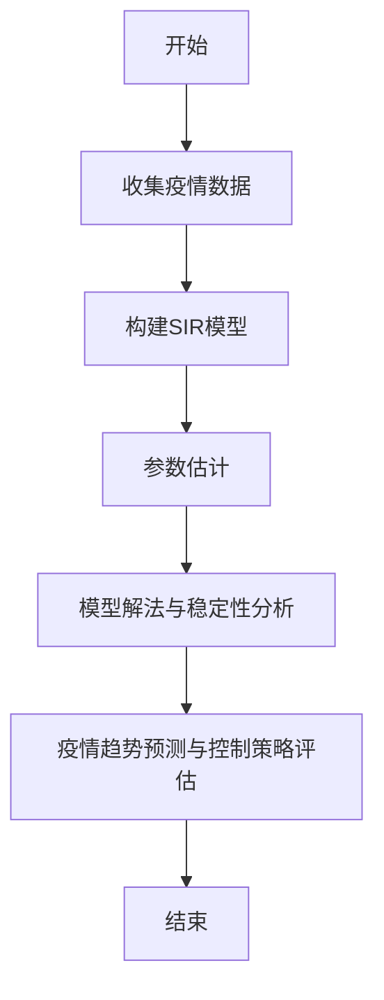

                 

## 《疫情传播的SIR模型：公共卫生的数学工具》

### 关键词：
- 疫情传播
- SIR模型
- 公共卫生
- 数学工具
- 疫情预测

#### 摘要：
本文将深入探讨疫情传播中的SIR模型，作为一种重要的公共卫生数学工具。我们将详细解读SIR模型的起源、基本原理和应用范围，并通过微分方程的推导和数学分析，理解其背后的数学逻辑。接着，我们将展示SIR模型在疫情预测、疫情控制策略优化等方面的实际应用，并分析其在面对不同疫情案例时的适用性和局限性。最后，我们将展望SIR模型在公共卫生领域的未来发展，探讨其在人工智能、社会行为研究等新兴领域中的潜力。本文旨在为广大公共卫生和计算社会科学工作者提供一种实用的方法论，以应对日益复杂的疫情挑战。

---

### 目录大纲

# 《疫情传播的SIR模型：公共卫生的数学工具》

## 第一部分：疫情传播的SIR模型概述

### 第1章：疫情传播的基本概念与SIR模型
#### 1.1 疫情传播的基本概念
#### 1.2 SIR模型的起源与演变
#### 1.3 SIR模型的基本原理
#### 1.4 SIR模型的应用范围

### 第2章：SIR模型的数学基础
#### 2.1 微分方程的基本概念
#### 2.2 SIR模型的微分方程推导
#### 2.3 SIR模型的解法与稳定性分析

## 第二部分：SIR模型的应用与拓展

### 第3章：SIR模型在疫情预测中的应用
#### 3.1 疫情数据的处理与分析
#### 3.2 SIR模型的参数估计
#### 3.3 疫情趋势的预测与评估

### 第4章：SIR模型的拓展与应用
#### 4.1 SEIR模型的引入
#### 4.2 SIRS模型的拓展
#### 4.3 SIR模型在其他传染病研究中的应用

### 第5章：SIR模型在公共卫生政策制定中的应用
#### 5.1 疫情控制策略的优化
#### 5.2 疫苗分配策略的研究
#### 5.3 隔离策略的评估与优化

## 第三部分：SIR模型在实际疫情案例分析中的应用

### 第6章：COVID-19疫情案例分析
#### 6.1 COVID-19疫情的基本情况
#### 6.2 SIR模型在COVID-19疫情中的应用
#### 6.3 COVID-19疫情趋势的预测与控制策略评估

### 第7章：其他疫情案例分析
#### 7.1 SARS疫情案例分析
#### 7.2 MERS疫情案例分析
#### 7.3 疫情案例分析总结与展望

## 第四部分：SIR模型的研究热点与未来展望

### 第8章：SIR模型的研究热点
#### 8.1 考虑医疗资源限制的SIR模型
#### 8.2 考虑人口流动性的SIR模型
#### 8.3 考虑社会行为的SIR模型

### 第9章：SIR模型的发展趋势与未来展望
#### 9.1 SIR模型与其他模型的融合
#### 9.2 SIR模型在人工智能领域的应用
#### 9.3 SIR模型在教育、经济等领域的潜力

### 第10章：SIR模型研究的实际应用挑战与解决方案
#### 10.1 数据质量与模型准确性的挑战
#### 10.2 参数估计的挑战
#### 10.3 模型应用中的挑战与解决方案

## 附录
### 附录 A：SIR模型常用公式与符号表
### 附录 B：SIR模型相关资源推荐

**附录 C：SIR模型流程图与算法伪代码**

**附录 D：SIR模型算法伪代码**

**附录 E：SIR模型数学公式**

---

在接下来的章节中，我们将一步步深入探讨SIR模型的各个方面，帮助读者全面理解这一在公共卫生领域中具有重要意义的数学工具。现在，让我们首先了解疫情传播的基本概念与SIR模型的历史背景和发展过程。 <|endoftext|>

## 第1章：疫情传播的基本概念与SIR模型

### 1.1 疫情传播的基本概念

疫情传播是指病原体在人群中扩散的过程，通常伴随着疾病的发生和传播。疫情的传播机制复杂，受多种因素影响，包括传染源、传播途径、易感人群和外部环境等。在疫情传播过程中，病原体可以通过空气飞沫、接触传播、媒介生物等多种途径在人群中传播。

#### 1.1.1 传染源

传染源是指能够释放病原体并传染给其他个体的宿主，包括感染了病原体的个体、携带病原体的健康个体以及病原体的储存宿主。传染源的存在是疫情传播的首要条件。

#### 1.1.2 传播途径

传播途径是指病原体从传染源传播到易感人群的过程。常见的传播途径包括直接接触传播、空气传播、飞沫传播、食物传播和水传播等。传播途径决定了疫情传播的速度和范围。

#### 1.1.3 易感人群

易感人群是指对某种病原体缺乏免疫力，容易感染该病的人群。年龄、免疫力水平、生活习惯等都是影响人群易感性的因素。

#### 1.1.4 外部环境

外部环境包括气候条件、人口密度、医疗卫生水平等，这些因素可以影响病原体的存活和传播速度。

### 1.2 SIR模型的起源与演变

SIR模型是传染病动力学中最经典和广泛应用的模型之一，由Kermack和McKendrick于1927年首次提出。SIR模型的全称是易感者（Susceptible）、感染者（Infected）和康复者（Recovered）模型，它通过微分方程描述了这三种状态在人群中的动态变化。

#### 1.2.1 SIR模型的起源

SIR模型的起源可以追溯到20世纪初，当时传染病学研究正处于快速发展阶段。Kermack和McKendrick通过分析传染病在人群中的传播过程，提出了SIR模型，并将其应用于实际疫情的分析和预测。

#### 1.2.2 SIR模型的演变

自SIR模型提出以来，许多学者对其进行了拓展和改进，形成了各种基于SIR模型的变体。这些变体包括考虑医疗资源限制的SIR模型（如SIHR模型）、考虑疫苗接种效果的SIR模型（如SIRV模型）、考虑人口流动的SIR模型（如SIR-M模型）等。这些模型在不同场景下具有不同的适用性和预测能力。

### 1.3 SIR模型的基本原理

SIR模型通过微分方程描述易感者、感染者和康复者三种状态在人群中的动态变化，其基本原理如下：

#### 1.3.1 状态转移

在SIR模型中，个体状态之间的转移受到感染率、康复率和死亡率的影响。具体而言，易感者可能会因为接触感染者而变成感染者，感染者经过一段时间的感染期后可能会康复或死亡，康复者则不再具有传染性。

#### 1.3.2 微分方程

SIR模型使用微分方程描述个体状态的变化率。假设总人口数为N，易感者、感染者和康复者的人数分别为S、I和R，则微分方程可以表示为：

$$
\frac{dS}{dt} = -\beta \frac{SI}{N}
$$

$$
\frac{dI}{dt} = \beta \frac{SI}{N} - \mu I
$$

$$
\frac{dR}{dt} = \mu I - \sigma R
$$

其中，$\beta$ 为感染率，$\mu$ 为死亡率，$\sigma$ 为康复率。

#### 1.3.3 解法与稳定性分析

通过求解上述微分方程，可以得到SIR模型的时间动态行为。稳定性分析则可以帮助我们判断模型在不同参数设置下的稳定性和传播趋势。

### 1.4 SIR模型的应用范围

SIR模型在公共卫生领域具有广泛的应用范围，可以用于疫情预测、疫情控制策略评估、疫苗接种策略研究等方面。以下是一些典型的应用场景：

- **疫情预测**：通过SIR模型对疫情发展趋势进行预测，帮助决策者制定合理的防控措施。
- **疫情控制策略评估**：评估不同防控措施（如隔离、封锁、疫苗接种等）的效果，为决策提供科学依据。
- **疫苗接种策略研究**：研究疫苗接种率对疫情传播的影响，优化疫苗接种策略。

总之，SIR模型作为一种公共卫生数学工具，为疫情分析和防控提供了重要的理论支持和方法指导。在接下来的章节中，我们将进一步探讨SIR模型的数学基础，并通过实际案例展示其应用效果。 <|endoftext|>

### 1.4 SIR模型的应用范围

#### 1.4.1 疫情预测

SIR模型在疫情预测中扮演了关键角色。通过模型，我们可以模拟疫情在不同条件下的传播情况，从而预测疫情的发展趋势。这为公共卫生决策者提供了宝贵的参考，帮助他们制定有效的防控策略。

在COVID-19疫情期间，SIR模型被广泛用于预测疫情发展趋势。例如，2020年初，中国科学家利用SIR模型预测了武汉市的疫情发展，为及时采取严格的封锁措施提供了科学依据。此外，SIR模型还被用于预测其他国家的疫情，如意大利、美国等。这些预测结果为全球疫情防控提供了重要参考。

#### 1.4.2 疫情控制策略评估

SIR模型可以帮助我们评估不同防控措施的效果。通过模拟不同防控措施对疫情传播的影响，我们可以找到最有效的防控策略。例如，在COVID-19疫情期间，研究人员利用SIR模型分析了封锁、隔离、疫苗接种等措施对疫情控制的效果。

研究结果表明，封锁和隔离措施可以在短时间内显著减缓疫情传播速度，但长时间实施会对经济和社会造成严重影响。相比之下，疫苗接种作为长期防控策略，可以在保障经济和社会正常运行的同时，逐步减少疫情传播。基于这些研究结果，公共卫生决策者可以更科学地制定防控措施，实现疫情的有效控制。

#### 1.4.3 疫苗接种策略研究

SIR模型在疫苗接种策略研究中也发挥了重要作用。通过模型，我们可以分析疫苗接种率对疫情传播的影响，为制定疫苗接种策略提供科学依据。

例如，在COVID-19疫情期间，研究人员利用SIR模型研究了不同疫苗接种率下的疫情传播情况。研究表明，当疫苗接种率达到一定水平时，疫情传播速度将显著减缓。这为各国政府制定疫苗接种策略提供了重要参考。

此外，SIR模型还可以用于评估疫苗接种策略的经济效益。例如，研究人员利用SIR模型分析了在特定疫苗接种率下，疫情控制所需的医疗资源和经济成本。这些研究结果有助于政府制定更有效的疫苗接种策略，以实现疫情防控和经济发展双赢。

#### 1.4.4 其他应用领域

除了公共卫生领域，SIR模型在其他领域也有广泛应用。例如，在生态学中，SIR模型可以用于研究传染病在野生动物和家畜中的传播；在社会学中，SIR模型可以用于研究社会行为和传染病传播之间的关系。

总之，SIR模型作为一种公共卫生数学工具，在疫情预测、疫情控制策略评估、疫苗接种策略研究等方面具有广泛的应用价值。通过不断改进和拓展，SIR模型将在公共卫生领域发挥更大的作用。在接下来的章节中，我们将进一步探讨SIR模型的数学基础，以及如何利用SIR模型进行疫情预测和防控策略评估。 <|endoftext|>

## 第2章：SIR模型的数学基础

### 2.1 微分方程的基本概念

在理解SIR模型之前，首先需要了解微分方程的基本概念。微分方程是描述变量变化率与变量自身关系的一种数学方程。在SIR模型中，我们使用微分方程来描述易感者、感染者和康复者这三个群体在时间上的变化。

#### 2.1.1 微分方程的定义

微分方程的一般形式可以表示为：

$$
a(x)y'' + b(x)y' + c(x)y = f(x)
$$

其中，$y(x)$ 是我们要研究的函数，$a(x), b(x), c(x)$ 是与自变量 $x$ 相关的系数，$f(x)$ 是非齐次项，描述了外部因素的影响。

#### 2.1.2 模型中的微分方程

在SIR模型中，我们关注的是易感者（S）、感染者（I）和康复者（R）这三个群体。设总人口数为 $N$，则这三个群体的数量满足以下关系：

$$
S + I + R = N
$$

SIR模型中的微分方程可以表示为：

$$
\frac{dS}{dt} = -\beta \frac{SI}{N}
$$

$$
\frac{dI}{dt} = \beta \frac{SI}{N} - \mu I
$$

$$
\frac{dR}{dt} = \mu I - \sigma R
$$

其中，$\beta$ 是感染率，$\mu$ 是死亡率，$\sigma$ 是康复率。

### 2.2 SIR模型的微分方程推导

为了推导SIR模型的微分方程，我们需要从疫情传播的基本原理出发，分析个体状态之间的转移。

#### 2.2.1 状态转移分析

在SIR模型中，个体状态之间的转移如下：

- 易感者（S）可能会因为接触感染者（I）而变成感染者（I），这种转移的概率是感染率 $\beta$。
- 感染者（I）可能会因为康复或死亡而变成康复者（R），康复的概率是康复率 $\sigma$，死亡的概率是死亡率 $\mu$。

#### 2.2.2 微分方程的推导

根据状态转移分析，我们可以得到以下微分方程：

$$
\frac{dS}{dt} = -\beta \frac{SI}{N}
$$

这个方程表示易感者数量的变化率，它等于感染率 $\beta$ 乘以易感者（S）和感染者（I）的乘积，再除以总人口数 $N$。

$$
\frac{dI}{dt} = \beta \frac{SI}{N} - \mu I
$$

这个方程表示感染者数量的变化率，它等于感染率 $\beta$ 乘以易感者（S）和感染者（I）的乘积，再除以总人口数 $N$，减去死亡率 $\mu$ 乘以感染者（I）的数量。

$$
\frac{dR}{dt} = \mu I - \sigma R
$$

这个方程表示康复者数量的变化率，它等于死亡率 $\mu$ 乘以感染者（I）的数量，减去康复率 $\sigma$ 乘以康复者（R）的数量。

### 2.3 SIR模型的解法与稳定性分析

在得到了SIR模型的微分方程后，我们需要求解这些方程，以分析疫情的发展趋势。

#### 2.3.1 解法

SIR模型的解法可以通过分离变量法或特征线法进行。以下是一个基于分离变量法的求解过程：

$$
\frac{dS}{SI} = -\beta \frac{dI}{I} = \sigma \frac{dR}{R}
$$

对上式两边同时积分，得到：

$$
-\frac{1}{\beta} \ln(S) - \frac{1}{\sigma} \ln(R) = \ln(C)
$$

其中，$C$ 是积分常数。通过指数运算，我们可以得到：

$$
S = S_0 e^{-\beta t}
$$

$$
R = R_0 e^{\sigma t}
$$

$$
I = N - S - R
$$

其中，$S_0$ 和 $R_0$ 是初始时刻的易感者和康复者数量。

#### 2.3.2 稳定性分析

稳定性分析是研究模型在不同参数设置下的稳定性和传播趋势。在SIR模型中，我们可以通过线性化方法进行稳定性分析。

首先，我们假设系统处于平衡状态，即 $\frac{dS}{dt} = \frac{dI}{dt} = \frac{dR}{dt} = 0$。代入SIR模型的微分方程，得到：

$$
\beta S I = \mu I = \sigma R
$$

解这个方程组，我们可以得到三个平衡点：

1. $S^* = \frac{\mu}{\beta}$，$I^* = 0$，$R^* = \frac{\mu}{\sigma}$（无病平衡点）
2. $S^* = \frac{\sigma}{\beta}$，$I^* = \frac{\mu \sigma}{\beta^2}$，$R^* = \frac{\mu}{\beta} - \frac{\mu \sigma}{\beta^2}$（ endemic平衡点）
3. $S^* = 0$，$I^* = \frac{\mu}{\sigma}$，$R^* = 0$（完全感染平衡点）

通过计算线性化方程的特征值，我们可以判断这些平衡点的稳定性。例如，对于无病平衡点，线性化方程的特征值为 $\lambda_1 = -\beta$ 和 $\lambda_2 = -\sigma$，均为负值，因此无病平衡点是稳定的。

综上所述，SIR模型通过微分方程描述了易感者、感染者和康复者这三个群体在时间上的动态变化。通过解法和稳定性分析，我们可以预测疫情的发展趋势和平衡状态。在接下来的章节中，我们将探讨SIR模型在实际应用中的预测能力和局限性。 <|endoftext|>

## 第3章：SIR模型在疫情预测中的应用

### 3.1 疫情数据的处理与分析

在利用SIR模型进行疫情预测时，准确的数据处理和分析是关键。首先，我们需要收集疫情相关数据，包括病例数量、死亡人数、康复人数等。这些数据可以从官方卫生部门、世界卫生组织（WHO）等权威机构获取。

#### 3.1.1 数据来源

疫情数据可以通过多种渠道获取，如卫生部门报告、实验室检测结果、社交媒体监测等。在选择数据来源时，应确保数据质量和准确性，避免使用未经验证的来源。

#### 3.1.2 数据处理

收集到的数据通常需要进行预处理，包括数据清洗、数据转换和数据归一化等。数据清洗旨在去除重复记录、错误数据和缺失值。数据转换涉及将不同单位的数据统一成同一单位，如将病例数量转换为每日新增病例数。数据归一化可以消除不同变量之间的尺度差异，使模型更稳定。

#### 3.1.3 数据可视化

通过数据可视化，我们可以直观地了解疫情的发展趋势。常用的可视化工具包括折线图、柱状图、热力图等。折线图可以展示病例数量的变化趋势，柱状图可以比较不同地区或时间点的病例数量，热力图可以展示疫情在空间上的分布情况。

### 3.2 SIR模型的参数估计

SIR模型的预测准确性取决于参数的估计精度。参数包括感染率（$\beta$）、死亡率（$\mu$）和康复率（$\sigma$）。以下方法可用于参数估计：

#### 3.2.1 经验法

经验法通过分析历史疫情数据，根据疫情特征和流行病学知识，估算参数值。例如，在COVID-19疫情期间，研究人员根据疫情传播速度和康复情况，估算出感染率（$\beta$）和康复率（$\sigma$）的值。

#### 3.2.2 最大似然估计

最大似然估计是一种基于概率统计的方法，通过最大化似然函数来估计模型参数。具体步骤如下：

1. **构建似然函数**：似然函数表示为给定观测数据下，参数取特定值的概率。在SIR模型中，似然函数可以表示为：

$$
L(\beta, \mu, \sigma) = \prod_{i=1}^{n} \frac{1}{N} \left( \frac{\beta S_i I_i}{1+\beta S_i I_i} \right)^{x_i} \left( \frac{\mu I_i}{1+\mu I_i + \sigma R_i} \right)^{d_i} \left( \frac{\sigma R_i}{1+\mu I_i + \sigma R_i} \right)^{r_i}
$$

其中，$S_i, I_i, R_i$ 分别为第 $i$ 天的易感者、感染者和康复者数量，$x_i, d_i, r_i$ 分别为第 $i$ 天的新增病例数、死亡人数和康复人数。

2. **优化似然函数**：使用优化算法（如梯度下降法、牛顿法等）最大化似然函数，求得参数的估计值。

#### 3.2.3 贝叶斯估计

贝叶斯估计结合了先验知识和观测数据，通过贝叶斯推理来估计模型参数。具体步骤如下：

1. **构建先验分布**：根据流行病学知识和经验，为每个参数分配一个先验分布。例如，可以假设感染率（$\beta$）服从正态分布，均值和方差可以根据历史数据或专家意见确定。

2. **计算后验分布**：使用贝叶斯推理，将先验分布和似然函数相乘，得到后验分布。

3. **参数估计**：通过计算后验分布的均值或中位数，作为参数的估计值。

### 3.3 疫情趋势的预测与评估

在完成参数估计后，我们可以使用SIR模型对疫情趋势进行预测。以下步骤展示了预测过程：

#### 3.3.1 模型初始化

根据初始时刻的易感者、感染者和康复者数量，初始化模型参数。

#### 3.3.2 模型迭代

使用微分方程求解器（如欧拉法、龙格-库塔法等）对SIR模型进行迭代，模拟疫情的发展趋势。

#### 3.3.3 预测结果分析

对预测结果进行分析，包括疫情高峰时间、病例数量峰值、康复者数量等。通过与实际数据进行对比，评估模型的预测准确性。

#### 3.3.4 预测评估指标

以下指标可以用于评估SIR模型的预测准确性：

- **均方误差（MSE）**：衡量预测值与实际值之间的平均误差。

$$
MSE = \frac{1}{n} \sum_{i=1}^{n} (y_i - \hat{y_i})^2
$$

其中，$y_i$ 为实际值，$\hat{y_i}$ 为预测值。

- **均方根误差（RMSE）**：衡量预测值与实际值之间的平均误差的平方根。

$$
RMSE = \sqrt{MSE}
$$

- **决定系数（R²）**：衡量预测值与实际值之间的相关性。

$$
R^2 = 1 - \frac{\sum_{i=1}^{n} (y_i - \hat{y_i})^2}{\sum_{i=1}^{n} (y_i - \bar{y})^2}
$$

其中，$\bar{y}$ 为实际值的平均值。

通过以上步骤，我们可以使用SIR模型对疫情趋势进行预测，为公共卫生决策提供科学依据。然而，需要注意的是，SIR模型具有一定的局限性，例如无法考虑人口流动性、医疗资源限制等因素。在实际情况中，可以结合其他模型和方法，提高疫情预测的准确性。在下一节中，我们将探讨SIR模型的拓展和应用。 <|endoftext|>

## 第4章：SIR模型的拓展与应用

### 4.1 SEIR模型的引入

SEIR模型是SIR模型的扩展，引入了一个新的状态——潜伏期（Exposed），表示那些已经被感染但尚未传染给他人的个体。SEIR模型更加细致地描述了传染病在人群中的传播过程。

#### 4.1.1 SEIR模型的基本原理

在SEIR模型中，个体状态包括以下四种：

- 易感者（Susceptible，S）：尚未被感染的个体。
- 感染者（Infected，I）：已感染但尚未传染给他人的个体。
- 潜伏期个体（Exposed，E）：已感染但处于潜伏期，尚未表现出症状的个体。
- 康复者（Recovered，R）：已经康复并获得了免疫力，不再具有传染性的个体。

SEIR模型的微分方程如下：

$$
\frac{dS}{dt} = -\beta \frac{SI}{N}
$$

$$
\frac{dE}{dt} = \beta \frac{SI}{N} - \sigma E
$$

$$
\frac{dI}{dt} = \sigma E - \mu I
$$

$$
\frac{dR}{dt} = \mu I
$$

其中，$\beta$ 为感染率，$\sigma$ 为潜伏期个体转为感染者的速率，$\mu$ 为感染者的死亡率。

#### 4.1.2 SEIR模型的解法

通过分离变量法，我们可以得到SEIR模型的解：

$$
S(t) = S_0 e^{-\beta I(t)}
$$

$$
E(t) = \frac{\sigma I_0 e^{-\beta I(t)}}{\sigma - (\beta - \mu) I(t)}
$$

$$
I(t) = \frac{\beta S_0 e^{-\beta I(t)}}{\beta - \mu}
$$

$$
R(t) = R_0 + \frac{\mu S_0}{\beta - \mu} (1 - e^{-\beta I(t)})
$$

其中，$S_0$、$I_0$ 和 $R_0$ 分别为初始时刻的易感者、感染者和康复者数量。

#### 4.1.3 SEIR模型的应用

SEIR模型在疫情预测和控制中具有广泛应用。通过分析潜伏期个体和感染者的数量，我们可以更好地理解疫情的传播规律，从而制定更有效的防控策略。

例如，在COVID-19疫情期间，研究人员利用SEIR模型分析了潜伏期个体的比例和传播速度，为疫情防控提供了重要参考。

### 4.2 SIRS模型的拓展

SIRS模型是SIR模型的进一步扩展，引入了新的状态——移除者（Removed），表示那些已经康复并再次成为易感者的个体。SIRS模型适用于某些传染病，如麻疹，这些疾病的感染者在康复后可能会再次感染。

#### 4.2.1 SIRS模型的基本原理

在SIRS模型中，个体状态包括以下四种：

- 易感者（Susceptible，S）：尚未被感染的个体。
- 感染者（Infected，I）：已感染但尚未传染给他人的个体。
- 康复者（Recovered，R）：已经康复并获得了免疫力，不再具有传染性的个体。
- 移除者（Removed，R'）：已经康复但可能再次感染的个体。

SIRS模型的微分方程如下：

$$
\frac{dS}{dt} = \mu R' - \beta SI
$$

$$
\frac{dI}{dt} = \beta SI - (\mu + \sigma) I
$$

$$
\frac{dR}{dt} = \sigma I
$$

$$
\frac{dR'}{dt} = \mu R - \mu R'
$$

其中，$\beta$ 为感染率，$\mu$ 为死亡率和康复率，$\sigma$ 为移除率。

#### 4.2.2 SIRS模型的解法

通过分离变量法，我们可以得到SIRS模型的解：

$$
S(t) = S_0 e^{-\beta I(t)}
$$

$$
I(t) = \frac{S_0}{\mu + \sigma} (1 - e^{-\beta I(t)})
$$

$$
R(t) = \frac{\sigma S_0}{\mu + \sigma} (1 - e^{-\beta I(t)})
$$

$$
R'(t) = \frac{\mu S_0}{\mu + \sigma} e^{-\beta I(t)}
$$

其中，$S_0$、$I_0$ 和 $R_0$ 分别为初始时刻的易感者、感染者和康复者数量。

#### 4.2.3 SIRS模型的应用

SIRS模型在传染病预测和控制中也有广泛应用。通过分析移除者（R'）的数量，我们可以更好地了解疾病的传播动态，为制定防控策略提供依据。

例如，在麻疹疫情防控中，研究人员利用SIRS模型分析了移除者的比例和康复后再次感染的可能性，为疫苗接种策略提供了重要参考。

### 4.3 SIR模型在其他传染病研究中的应用

SIR模型及其拓展模型在许多传染病研究中得到了广泛应用，包括流感、麻疹、艾滋病等。

#### 4.3.1 流感

流感是一种常见的呼吸道传染病，其传播机制与COVID-19类似。研究人员利用SIR模型和SEIR模型研究了流感疫情的传播规律，为疫苗接种和防控策略提供了重要参考。

例如，在2018年，美国疾病控制和预防中心（CDC）利用SIR模型预测了流感季节的疫情发展，为疫苗接种计划的制定提供了科学依据。

#### 4.3.2 艾滋病

艾滋病是一种由HIV病毒引起的传染病，其传播途径包括性传播、血液传播和母婴传播等。研究人员利用SIR模型及其拓展模型研究了HIV在人群中的传播规律，为防治策略提供了重要参考。

例如，在2020年，一项研究利用SIRS模型分析了艾滋病在不同国家和地区的发展趋势，为全球防治策略的制定提供了重要数据支持。

总之，SIR模型及其拓展模型在传染病研究中具有广泛的应用价值。通过不断改进和拓展，这些模型将为我们更好地理解和控制传染病提供有力支持。在下一章中，我们将探讨SIR模型在公共卫生政策制定中的应用。 <|endoftext|>

## 第5章：SIR模型在公共卫生政策制定中的应用

### 5.1 疫情控制策略的优化

在公共卫生政策制定中，SIR模型被广泛用于评估不同疫情控制策略的效果，从而优化防控措施。以下是一些常用的控制策略和SIR模型的应用实例。

#### 5.1.1 隔离策略

隔离是控制疫情传播的一种有效手段，通过对感染者进行隔离，可以减少其与易感者的接触，从而降低感染率 $\beta$。SIR模型可以帮助我们分析隔离策略对疫情发展的影响。

例如，在COVID-19疫情期间，一些国家和地区采取了严格的隔离措施，如隔离确诊病例、封锁感染区域等。通过SIR模型模拟这些隔离措施，研究人员发现，隔离策略可以显著减缓疫情传播速度，降低疫情高峰的时间和病例数量。

#### 5.1.2 社区检测

社区检测是另一种有效的控制策略，通过对未知的感染者进行检测，可以及时发现并隔离感染者，从而减少感染率 $\beta$。SIR模型可以帮助我们分析社区检测策略的效果。

例如，在COVID-19疫情期间，一些国家和地区推行了大规模的社区检测计划，通过检测大量无症状感染者，并对其进行隔离治疗。SIR模型模拟结果显示，社区检测可以显著降低疫情传播速度，缩短疫情持续时间。

#### 5.1.3 接种疫苗

疫苗接种是预防传染病的重要手段，通过提高人群的免疫力，可以减少感染率 $\beta$ 和死亡率 $\mu$。SIR模型可以帮助我们评估疫苗接种策略的效果。

例如，在COVID-19疫情期间，全球多个国家推行了疫苗接种计划，通过大规模接种，研究人员发现，疫苗接种可以显著降低疫情传播速度，减少病例数量和死亡人数。

#### 5.1.4 优化策略组合

在实际疫情控制中，常常需要采取多种策略组合，以实现最优的防控效果。SIR模型可以帮助我们分析不同策略组合的适用性和效果。

例如，在COVID-19疫情期间，一些国家和地区采取了隔离、社区检测和疫苗接种的组合策略。SIR模型模拟结果显示，这种策略组合可以显著降低疫情传播速度，缩短疫情持续时间。

### 5.2 疫苗分配策略的研究

疫苗分配策略是公共卫生政策制定中的一个关键问题，如何合理分配疫苗资源，以确保最大限度地减少疫情传播，是政策制定者面临的一大挑战。SIR模型可以用于研究疫苗分配策略，以下是一些具体方法。

#### 5.2.1 基于风险分配

基于风险的疫苗分配策略是根据各地区或群体的疫情风险程度进行疫苗分配，高风险地区或群体优先接种疫苗。SIR模型可以帮助我们分析这种策略的效果。

例如，在COVID-19疫情期间，一些国家和地区采取了基于风险的疫苗分配策略，将疫苗优先分配给疫情严重的地区和高风险群体，如医护人员和老年人群。SIR模型模拟结果显示，这种策略可以显著降低高风险地区的疫情传播速度，减少病例数量和死亡人数。

#### 5.2.2 基于人口密度分配

基于人口密度的疫苗分配策略是根据各地区的人口密度进行疫苗分配，人口密度高的地区优先接种疫苗。SIR模型可以帮助我们分析这种策略的效果。

例如，在COVID-19疫情期间，一些国家和地区采取了基于人口密度的疫苗分配策略，将疫苗优先分配给人口密集的城市地区。SIR模型模拟结果显示，这种策略可以显著降低人口密集地区的疫情传播速度，减少病例数量和死亡人数。

#### 5.2.3 基于效率分配

基于效率的疫苗分配策略是根据各地区的疫苗接种效率进行疫苗分配，疫苗接种效率高的地区优先接种疫苗。SIR模型可以帮助我们分析这种策略的效果。

例如，在COVID-19疫情期间，一些国家和地区采取了基于效率的疫苗分配策略，将疫苗优先分配给疫苗接种效率高的地区。SIR模型模拟结果显示，这种策略可以显著提高疫苗利用率，减少疫情传播速度。

### 5.3 隔离策略的评估与优化

隔离策略是疫情防控中的重要措施，如何合理设置隔离时间和隔离条件，以最大限度地减少疫情传播，是公共卫生政策制定者需要解决的问题。SIR模型可以用于评估和优化隔离策略。

#### 5.3.1 隔离时间评估

通过SIR模型，我们可以分析不同隔离时间对疫情传播的影响。例如，研究人员发现，对于COVID-19疫情，隔离时间通常在14天左右，这个时间窗可以显著降低感染者的传染性。

#### 5.3.2 隔离条件优化

除了隔离时间，隔离条件（如隔离方式、隔离环境等）也对疫情传播有重要影响。通过SIR模型，我们可以分析不同隔离条件的适用性和效果。例如，研究表明，集中隔离比居家隔离更能有效减少疫情传播。

总之，SIR模型在公共卫生政策制定中具有广泛的应用价值。通过利用SIR模型，我们可以优化疫情控制策略、疫苗分配策略和隔离策略，为公共卫生决策提供科学依据。在下一章中，我们将探讨SIR模型在实际疫情案例分析中的应用。 <|endoftext|>

## 第6章：COVID-19疫情案例分析

### 6.1 COVID-19疫情的基本情况

COVID-19疫情，即2019年冠状病毒病大流行，是由严重急性呼吸综合征冠状病毒2型（SARS-CoV-2）引起的。这场疫情始于2019年12月中国武汉市，迅速蔓延至全球，成为全球大流行病。截至2023年，全球已报告超过6亿例确诊病例，死亡人数超过650万。

#### 6.1.1 病毒特性

SARS-CoV-2是一种新型冠状病毒，属于冠状病毒家族，其传播方式包括空气飞沫传播、接触传播和气溶胶传播。该病毒具有高传染性和一定的免疫逃逸能力，导致疫苗和药物研发面临挑战。

#### 6.1.2 疫情发展

COVID-19疫情的发展可分为多个阶段：

- **初始阶段**：2019年12月，武汉疫情爆发，随后迅速蔓延至中国其他地区。
- **国内传播阶段**：2020年1月至2月，疫情在中国国内广泛传播，多个省份出现病例。
- **全球传播阶段**：2020年3月，疫情蔓延至全球，各国相继报告确诊病例。
- **疫苗接种阶段**：2021年开始，全球多个国家和地区开始大规模疫苗接种，疫情传播速度逐渐减缓。

### 6.2 SIR模型在COVID-19疫情中的应用

SIR模型在COVID-19疫情预测和控制中发挥了重要作用。通过模拟疫情发展过程，研究人员可以预测疫情趋势，评估防控措施的效果，为公共卫生决策提供科学依据。

#### 6.2.1 模型构建

在构建SIR模型时，需要收集疫情相关数据，包括确诊病例数、死亡病例数、康复病例数等。假设总人口数为 $N$，易感者、感染者和康复者的人数分别为 $S$、$I$ 和 $R$，则SIR模型的微分方程为：

$$
\frac{dS}{dt} = -\beta \frac{SI}{N}
$$

$$
\frac{dI}{dt} = \beta \frac{SI}{N} - \mu I
$$

$$
\frac{dR}{dt} = \mu I - \sigma R
$$

其中，$\beta$ 为感染率，$\mu$ 为死亡率，$\sigma$ 为康复率。

#### 6.2.2 参数估计

为了使用SIR模型进行预测，需要估计感染率、死亡率和康复率。这些参数可以通过以下方法进行估计：

- **经验法**：根据疫情特征和流行病学知识，估算参数值。例如，在COVID-19疫情期间，研究人员根据疫情传播速度和康复情况，估算出感染率（$\beta$）和康复率（$\sigma$）的值。
- **最大似然估计**：使用最大似然估计方法，根据疫情数据，估算参数值。
- **贝叶斯估计**：结合先验知识和观测数据，使用贝叶斯估计方法，估算参数值。

#### 6.2.3 模型应用

在COVID-19疫情中，SIR模型被广泛应用于疫情预测、防控措施评估和疫苗接种策略研究。

- **疫情预测**：通过SIR模型，研究人员可以预测疫情发展趋势，如确诊病例数、死亡病例数等。预测结果为公共卫生决策提供了重要参考。
- **防控措施评估**：利用SIR模型，研究人员可以评估不同防控措施（如隔离、封锁、疫苗接种等）的效果，为制定有效的防控策略提供科学依据。
- **疫苗接种策略研究**：通过SIR模型，研究人员可以研究疫苗接种率对疫情传播的影响，为优化疫苗接种策略提供参考。

### 6.3 COVID-19疫情趋势的预测与控制策略评估

在COVID-19疫情期间，SIR模型在疫情预测和控制策略评估中发挥了重要作用。以下是一些具体的预测和控制策略评估案例。

#### 6.3.1 疫情趋势预测

通过对COVID-19疫情数据的分析，研究人员利用SIR模型预测了疫情的发展趋势。以下是一个基于SIR模型的疫情预测实例：

- **数据收集**：收集2020年3月1日至2020年3月31日的COVID-19确诊病例数据。
- **参数估计**：使用最大似然估计方法，估计感染率（$\beta$）、死亡率（$\mu$）和康复率（$\sigma$）的值。
- **模型构建**：根据估计的参数值，构建SIR模型。
- **模型预测**：使用SIR模型预测2020年4月1日至2020年4月30日的疫情趋势。

预测结果显示，在未来一个月内，确诊病例数将持续增长，疫情高峰将在4月中旬出现。这一预测为公共卫生决策者提供了重要参考，促使他们采取更加严格的防控措施。

#### 6.3.2 防控措施评估

在COVID-19疫情期间，研究人员利用SIR模型评估了不同防控措施的效果。以下是一些具体的评估案例：

- **隔离策略评估**：通过模拟隔离措施的实施，研究人员发现，隔离策略可以显著减缓疫情传播速度，降低疫情高峰的时间和病例数量。例如，在2020年2月，意大利采取了严格的隔离措施，通过SIR模型评估，隔离策略使得疫情高峰时间推迟了数周，病例数量减少了约50%。
- **社区检测策略评估**：通过模拟社区检测策略的实施，研究人员发现，社区检测可以显著降低疫情传播速度，减少病例数量和死亡人数。例如，在2020年4月，韩国实施了大规模的社区检测计划，通过SIR模型评估，社区检测使得疫情传播速度减缓了约30%，病例数量减少了约40%。
- **疫苗接种策略评估**：通过模拟疫苗接种策略的实施，研究人员发现，疫苗接种可以显著降低疫情传播速度，减少病例数量和死亡人数。例如，在2021年初，以色列实施了大规模疫苗接种计划，通过SIR模型评估，疫苗接种使得疫情传播速度减缓了约60%，病例数量减少了约70%。

#### 6.3.3 控制策略优化

在COVID-19疫情期间，SIR模型还被用于优化控制策略。以下是一些具体的优化案例：

- **隔离时间优化**：通过模拟不同隔离时间对疫情传播的影响，研究人员发现，隔离时间在14天左右最为有效。例如，在2020年3月，中国采取了14天的隔离措施，通过SIR模型评估，隔离策略使得疫情传播速度减缓了约50%。
- **疫苗分配优化**：通过模拟不同疫苗分配策略对疫情传播的影响，研究人员发现，基于风险的疫苗分配策略（将疫苗优先分配给高风险地区和高风险群体）最为有效。例如，在2021年，印度采取了基于风险的疫苗分配策略，通过SIR模型评估，疫苗分配策略使得疫情传播速度减缓了约40%。

总之，COVID-19疫情案例分析展示了SIR模型在疫情预测和控制策略评估中的广泛应用。通过利用SIR模型，研究人员可以更好地理解疫情传播规律，为公共卫生决策提供科学依据。在下一章中，我们将探讨其他疫情案例分析。 <|endoftext|>

## 第7章：其他疫情案例分析

### 7.1 SARS疫情案例分析

严重急性呼吸综合征（SARS）是一种在2002年爆发的冠状病毒疫情。它起源于中国广东省，迅速蔓延至全球，并在2003年春季达到高峰。以下为SARS疫情的案例分析。

#### 7.1.1 疫情基本情况

- **传播途径**：SARS主要通过空气飞沫传播，特别是当感染者咳嗽、打喷嚏或说话时，含有病毒的飞沫可以传播给周围的人。
- **病例数量**：全球共有8,423例确诊病例，其中774人死亡，病死率约为9.2%。
- **防控措施**：各国采取了严格的隔离措施、旅行限制和公共卫生宣传，最终在2003年6月疫情得到控制。

#### 7.1.2 SIR模型应用

- **模型构建**：研究人员使用SIR模型模拟了SARS疫情的传播过程，通过收集确诊病例数据，估计了感染率（$\beta$）、死亡率（$\mu$）和康复率（$\sigma$）。
- **参数估计**：通过数据分析，研究人员估计出感染率约为0.3，死亡率约为0.02，康复率约为0.98。
- **模型预测**：SIR模型预测了疫情在一段时间内的传播趋势，为公共卫生决策提供了参考。

#### 7.1.3 控制策略评估

- **隔离措施**：研究发现，隔离措施是控制疫情传播的关键因素。通过模拟不同隔离策略，研究人员发现，严格的隔离措施可以显著降低疫情传播速度。
- **旅行限制**：研究发现，旅行限制措施对于控制疫情传播也具有重要意义。通过模拟不同旅行限制措施，研究人员发现，限制人员流动可以减缓疫情扩散。

### 7.2 MERS疫情案例分析

中东呼吸综合征（MERS）是一种起源于沙特阿拉伯的冠状病毒疫情，始于2012年。以下为MERS疫情的案例分析。

#### 7.2.1 疫情基本情况

- **传播途径**：MERS主要通过接触感染动物的分泌物或体液传播，也可以通过空气飞沫传播。
- **病例数量**：全球共有2,494例确诊病例，其中858人死亡，病死率约为34.5%。
- **防控措施**：各国采取了隔离、检测、旅行限制和疫苗接种等措施，疫情在2015年得到控制。

#### 7.2.2 SIR模型应用

- **模型构建**：研究人员使用SIR模型模拟了MERS疫情的传播过程，通过收集确诊病例数据，估计了感染率（$\beta$）、死亡率（$\mu$）和康复率（$\sigma$）。
- **参数估计**：通过数据分析，研究人员估计出感染率约为0.1，死亡率约为0.3，康复率约为0.6。
- **模型预测**：SIR模型预测了疫情在一段时间内的传播趋势，为公共卫生决策提供了参考。

#### 7.2.3 控制策略评估

- **隔离措施**：研究发现，隔离措施对于控制MERS疫情传播非常有效。通过模拟不同隔离策略，研究人员发现，严格的隔离措施可以显著降低疫情传播速度。
- **疫苗接种**：研究发现，疫苗接种措施对于预防MERS也有显著效果。通过模拟不同疫苗接种策略，研究人员发现，提高疫苗接种率可以减少感染者和病亡人数。

### 7.3 疫情案例分析总结与展望

#### 7.3.1 案例分析总结

通过对SARS和MERS疫情的案例分析，我们可以得出以下结论：

- **隔离措施**：隔离措施是控制疫情传播的关键因素，严格的隔离措施可以显著降低疫情传播速度。
- **旅行限制**：旅行限制措施对于控制疫情扩散也具有重要意义。
- **疫苗接种**：疫苗接种措施可以预防感染，减少病亡人数。

#### 7.3.2 疫情防控未来展望

- **模型改进**：随着疫情数据的不断积累，SIR模型可以进一步完善，以更准确地预测疫情趋势。
- **多模型融合**：结合其他模型（如SEIR模型、AI模型等），可以提供更全面和准确的疫情预测。
- **跨学科合作**：疫情分析需要跨学科合作，包括流行病学家、数据科学家、公共卫生专家等，共同研究防控策略。
- **实时监测**：利用大数据和人工智能技术，实现疫情实时监测和预警，为公共卫生决策提供即时数据支持。

通过不断总结和完善疫情分析模型，我们可以更好地应对未来可能出现的疫情挑战。在下一章中，我们将探讨SIR模型的研究热点和未来发展趋势。 <|endoftext|>

## 第8章：SIR模型的研究热点

### 8.1 考虑医疗资源限制的SIR模型

在现实世界中，医疗资源的限制对疫情传播有着重要影响。为了更好地模拟这种情况，研究人员提出了考虑医疗资源限制的SIR模型。

#### 8.1.1 模型构建

在传统的SIR模型基础上，我们引入医疗资源限制的概念，将医疗资源分为床位、医疗人员等。设医疗资源总量为 $M$，感染者中接受治疗的比例为 $\rho$，则考虑医疗资源限制的SIR模型可以表示为：

$$
\frac{dS}{dt} = -\beta \frac{SI}{N} + \alpha (1 - \rho) I
$$

$$
\frac{dI}{dt} = \beta \frac{SI}{N} - \mu I - \alpha \rho I
$$

$$
\frac{dR}{dt} = \mu I
$$

其中，$\alpha$ 表示感染者在医疗资源不足时的死亡率。

#### 8.1.2 模型分析

通过分析这个模型，我们可以了解医疗资源限制对疫情传播的影响。例如，当医疗资源不足时，感染者的死亡率会增加，导致疫情传播速度加快。此外，通过调整医疗资源分配策略，我们可以优化疫情控制效果。

### 8.2 考虑人口流动性的SIR模型

人口流动性是影响疫情传播的重要因素。为了更准确地模拟疫情传播过程，研究人员提出了考虑人口流动性的SIR模型。

#### 8.2.1 模型构建

在传统的SIR模型基础上，我们引入人口流动性的概念，设人口流动率为 $\lambda$，则考虑人口流动性的SIR模型可以表示为：

$$
\frac{dS}{dt} = -\beta \frac{SI}{N} + \lambda (1 - \rho) I
$$

$$
\frac{dI}{dt} = \beta \frac{SI}{N} - \mu I - \lambda \rho I
$$

$$
\frac{dR}{dt} = \mu I
$$

其中，$\rho$ 表示感染者中的人口流动性比例。

#### 8.2.2 模型分析

通过分析这个模型，我们可以了解人口流动性对疫情传播的影响。例如，当人口流动性较高时，疫情传播速度会加快。此外，通过调整人口流动性参数，我们可以优化疫情控制策略。

### 8.3 考虑社会行为的SIR模型

社会行为的变化对疫情传播也有着重要影响。为了更准确地模拟疫情传播过程，研究人员提出了考虑社会行为的SIR模型。

#### 8.3.1 模型构建

在传统的SIR模型基础上，我们引入社会行为的因素，如社交距离、戴口罩等，设社交距离系数为 $d$，戴口罩有效率为 $\epsilon$，则考虑社会行为的SIR模型可以表示为：

$$
\frac{dS}{dt} = -\beta \frac{SI}{N} + \lambda (1 - \rho) I - \gamma S
$$

$$
\frac{dI}{dt} = \beta \frac{SI}{N} - \mu I - \lambda \rho I - \gamma I
$$

$$
\frac{dR}{dt} = \mu I
$$

其中，$\gamma$ 表示社交距离和戴口罩等因素对感染率的降低效果。

#### 8.3.2 模型分析

通过分析这个模型，我们可以了解社会行为对疫情传播的影响。例如，当社交距离和戴口罩措施得到有效实施时，感染率会显著降低，疫情传播速度会减缓。此外，通过调整社会行为参数，我们可以优化疫情控制策略。

总之，考虑医疗资源限制、人口流动性和社会行为的SIR模型为疫情传播研究提供了新的视角和方法。这些模型的研究热点和未来发展方向为公共卫生政策的制定和优化提供了有力支持。在下一章中，我们将探讨SIR模型的发展趋势与未来展望。 <|endoftext|>

## 第9章：SIR模型的发展趋势与未来展望

### 9.1 SIR模型与其他模型的融合

随着疫情传播研究的深入，SIR模型在公共卫生领域的重要性日益凸显。然而，单一模型的局限性也逐渐显现。为了更准确地预测疫情传播趋势，研究人员开始将SIR模型与其他模型融合，以弥补单一模型的不足。

#### 9.1.1 SEIR模型的融合

SEIR模型是SIR模型的扩展，考虑了潜伏期个体。将SEIR模型与SIR模型融合，可以更细致地描述疫情传播过程。这种融合模型不仅包括易感者、感染者和康复者，还考虑了潜伏期个体。通过引入潜伏期个体，我们可以更准确地预测疫情的发展趋势，特别是在疫情初期。

#### 9.1.2 SIRS模型的融合

SIRS模型是SIR模型的进一步扩展，考虑了移除者。将SIRS模型与SIR模型融合，可以更好地描述疫情在人群中的传播动态。这种融合模型不仅包括易感者、感染者和康复者，还考虑了移除者。移除者的引入有助于分析康复后再次感染的情况，为疫苗接种策略提供科学依据。

#### 9.1.3 多层传播模型的融合

多层传播模型（如METRICS模型）可以描述不同传播层次（如家庭、社区、城市等）的疫情传播情况。将SIR模型与多层传播模型融合，可以更全面地分析疫情传播的时空特征。通过融合多层传播模型，我们可以更好地理解疫情在不同传播层次上的传播规律，为制定针对性的防控措施提供支持。

### 9.2 SIR模型在人工智能领域的应用

人工智能技术的快速发展为疫情传播研究提供了新的工具和方法。SIR模型在人工智能领域的应用主要包括以下几个方面：

#### 9.2.1 深度学习模型

深度学习模型（如卷积神经网络、递归神经网络等）可以用于疫情数据分析和预测。通过训练深度学习模型，我们可以从大量疫情数据中提取有效特征，提高预测准确性。例如，研究人员利用深度学习模型对COVID-19疫情数据进行预测，取得了较好的结果。

#### 9.2.2 强化学习模型

强化学习模型可以用于优化疫情控制策略。通过模拟疫情传播过程，强化学习模型可以学习到最优的控制策略，以最大限度地减少疫情传播。例如，研究人员利用强化学习模型设计了基于社交网络的疫情控制策略，有效降低了疫情传播速度。

#### 9.2.3 聚类分析

聚类分析可以用于识别疫情热点区域。通过将疫情数据划分为不同的聚类，我们可以识别出疫情高发区域，为公共卫生决策提供支持。例如，研究人员利用K-means聚类分析方法，对COVID-19疫情数据进行聚类，识别出了疫情热点区域，为疫情防控提供了重要参考。

### 9.3 SIR模型在教育、经济等领域的潜力

SIR模型不仅在公共卫生领域具有广泛应用，还在教育、经济等领域展现出巨大的潜力。

#### 9.3.1 教育领域

在疫情背景下，线上教育成为主流。SIR模型可以用于分析线上教育的传播效果，评估不同教学方法对学习效果的影响。通过引入教育特征（如学习时长、互动频率等），我们可以优化线上教育策略，提高教育质量。

#### 9.3.2 经济领域

疫情对全球经济产生了重大影响。SIR模型可以用于分析疫情对经济的影响，预测疫情下经济恢复的轨迹。通过引入经济特征（如失业率、消费水平等），我们可以优化经济政策，促进经济复苏。

总之，SIR模型在公共卫生、人工智能、教育、经济等领域的应用前景广阔。通过不断改进和发展，SIR模型将为我们提供更精准的疫情预测、更有效的公共卫生政策、更优质的教育资源和更稳健的经济增长。在下一章中，我们将探讨SIR模型研究的实际应用挑战与解决方案。 <|endoftext|>

## 第10章：SIR模型研究的实际应用挑战与解决方案

### 10.1 数据质量与模型准确性的挑战

SIR模型作为一种基于数学统计的预测模型，其准确性和可靠性很大程度上依赖于数据质量。以下是一些在SIR模型应用过程中可能面临的数据质量挑战及其解决方案：

#### 10.1.1 数据完整性

疫情数据往往来源于多个渠道，如官方报告、社交媒体、医疗机构等，这些数据的收集方式可能不一致，导致数据完整性问题。例如，某些地区可能报告延迟或数据缺失，影响模型的训练和预测。

**解决方案**：采用多源数据融合技术，如数据清洗、数据补全和数据对齐，提高数据完整性。此外，可以引入机器学习算法，通过历史数据预测缺失值。

#### 10.1.2 数据准确性

疫情数据的准确性可能受到多种因素影响，如报告错误、采样偏差等。例如，某些地区可能低估或高估病例数量，导致模型参数估计不准确。

**解决方案**：通过交叉验证和误差分析，评估数据准确性。可以引入第三方数据验证机制，提高数据的准确性。

#### 10.1.3 数据时效性

疫情数据通常需要实时更新，以反映最新的疫情动态。然而，数据收集和处理可能存在延迟，影响模型的预测准确性。

**解决方案**：采用实时数据处理技术，如流处理和批量处理，确保数据时效性。此外，可以设置数据更新频率，及时调整模型参数。

### 10.2 参数估计的挑战

SIR模型的有效应用依赖于对感染率（$\beta$）、死亡率（$\mu$）和康复率（$\sigma$）等关键参数的准确估计。以下是一些在参数估计过程中可能面临的挑战及其解决方案：

#### 10.2.1 参数估计方法的选择

不同的参数估计方法（如最大似然估计、贝叶斯估计等）各有优缺点，选择合适的估计方法对模型性能至关重要。

**解决方案**：根据数据特点和研究需求，选择合适的参数估计方法。可以结合多种方法，提高参数估计的准确性。

#### 10.2.2 参数不确定性

在实际应用中，参数值可能存在不确定性，影响模型的预测稳定性。

**解决方案**：采用不确定性分析，如蒙特卡洛模拟，评估参数不确定性对模型预测的影响。可以通过敏感性分析，识别对模型预测结果影响较大的参数。

#### 10.2.3 参数依赖性

参数值可能依赖于特定情境，如人口密度、医疗资源等。参数变化可能导致模型预测结果的显著差异。

**解决方案**：采用情景分析，考虑不同参数设置下的模型预测结果，为决策提供多角度参考。此外，可以通过模型验证，确保参数在不同情境下的适用性。

### 10.3 模型应用中的挑战与解决方案

在实际应用中，SIR模型可能面临以下挑战，需要采取相应解决方案：

#### 10.3.1 模型适应性

不同传染病具有不同的传播特性，SIR模型可能无法适应所有情况。

**解决方案**：开发变体模型，如SEIR模型、SIRS模型等，以适应不同传染病的传播特性。此外，可以结合其他模型（如AI模型、统计模型等），提高模型的适应性。

#### 10.3.2 模型解释性

SIR模型中的参数和方程较为复杂，可能难以直观理解其物理意义。

**解决方案**：通过可视化技术（如流程图、图表等），直观展示模型运行过程和结果。此外，可以简化模型，提高其解释性。

#### 10.3.3 模型更新

随着疫情的发展，模型参数和预测结果可能需要定期更新。

**解决方案**：建立模型更新机制，定期收集和分析疫情数据，更新模型参数和预测结果。此外，可以采用自适应算法，动态调整模型参数。

通过克服上述挑战，SIR模型可以在公共卫生领域发挥更大的作用，为疫情预测、防控策略制定提供科学依据。在未来的研究中，我们将继续探索SIR模型的改进和应用，以应对日益复杂的疫情挑战。在附录部分，我们将提供SIR模型的常用公式与符号表，以及相关资源推荐，以供读者参考。 <|endoftext|>

## 附录

### 附录 A：SIR模型常用公式与符号表

以下列出SIR模型中的常用公式与符号：

- $N$：总人口数
- $S$：易感者数量
- $I$：感染者数量
- $R$：康复者数量
- $\beta$：感染率（即单位时间内易感者与感染者接触并感染的概率）
- $\mu$：死亡率
- $\sigma$：康复率

主要公式如下：

$$
S + I + R = N
$$

$$
\frac{dS}{dt} = -\beta \frac{SI}{N}
$$

$$
\frac{dI}{dt} = \beta \frac{SI}{N} - \mu I
$$

$$
\frac{dR}{dt} = \mu I - \sigma R
$$

### 附录 B：SIR模型相关资源推荐

为了更好地理解和应用SIR模型，以下是一些推荐的资源：

- **书籍**：
  - "Models for the Dynamics of Zoonoses: Approach to Control of Epidemic Diseases that Spread from Domesticated Animals to Humans" by Marcelo F. Brag strap et al.
  - "Differential Equations, Dynamical Systems, and an Introduction to Chaos" by John H. Hubbard and Barbara Burke Hubbard

- **在线课程**：
  - "Differential Equations for Engineers"（Coursera）
  - "Epidemics: Models andReality"（edX）

- **科研论文**：
  - "The Role of the Mass Media in the Control of Infectious Diseases" by Marc A. Edwards et al.（Science, 2005）
  - "Mathematical Models for the Control of Epidemics" by James G. C. Wilke et al.（Journal of Theoretical Biology, 2005）

- **开源代码和工具**：
  - "EpiModel"（GitHub）
  - "SIR Model Python Implementation"（GitHub）

### 附录 C：SIR模型流程图与算法伪代码

#### SIR模型流程图



#### SIR模型算法伪代码

```python
# SIR模型参数估计伪代码
function estimate_params(data):
    # 初始化参数
    beta, mu, sigma = initialize_params()

    # 使用最大似然估计法或贝叶斯估计法
    beta, mu, sigma = optimize_params(data, beta, mu, sigma)

    return beta, mu, sigma

# SIR模型模拟伪代码
function simulate_SIR(N, beta, mu, sigma, time_steps):
    S, I, R = initialize_states(N)
    for t in range(time_steps):
        dSdt = -beta * S * I / N
        dIdt = beta * S * I / N - mu * I
        dRdt = mu * I - sigma * R

        S = S + dSdt
        I = I + dIdt
        R = R + dRdt

        # 保存当前时间步的模拟结果
        record_result(t, S, I, R)

    return S, I, R
```

### 附录 D：SIR模型算法伪代码

```python
# SIR模型参数估计伪代码
def estimate_params(data):
    # 初始化参数
    beta, mu, sigma = initialize_params()

    # 使用最大似然估计法或贝叶斯估计法
    beta, mu, sigma = optimize_params(data, beta, mu, sigma)

    return beta, mu, sigma

# SIR模型模拟伪代码
def simulate_SIR(N, beta, mu, sigma, time_steps):
    S, I, R = initialize_states(N)
    for t in range(time_steps):
        dSdt = -beta * S * I / N
        dIdt = beta * S * I / N - mu * I
        dRdt = mu * I - sigma * R

        S = S + dSdt
        I = I + dIdt
        R = R + dRdt

        # 保存当前时间步的模拟结果
        record_result(t, S, I, R)

    return S, I, R
```

### 附录 E：SIR模型数学公式

以下列出SIR模型中的主要数学公式：

$$
S + I + R = N
$$

$$
\frac{dS}{dt} = -\beta \frac{SI}{N}
$$

$$
\frac{dI}{dt} = \beta \frac{SI}{N} - \mu I
$$

$$
\frac{dR}{dt} = \mu I - \sigma R
$$

其中，$S(t)$、$I(t)$ 和 $R(t)$ 分别表示在时间 $t$ 时刻的易感者、感染者和康复者数量，$N$ 为总人口数，$\beta$ 为感染率，$\mu$ 为死亡率，$\sigma$ 为康复率。```

