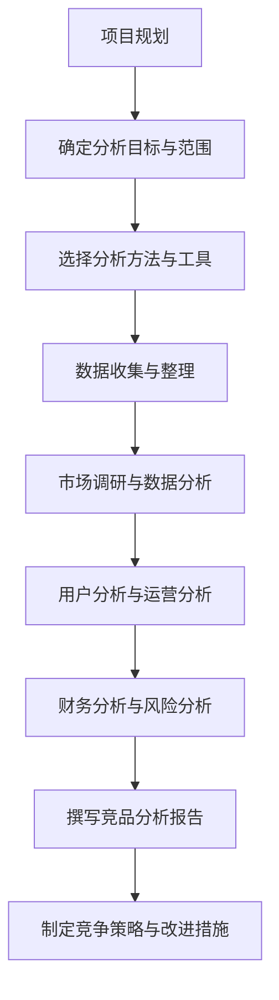

                 

### 知识付费市场分析

在数字化时代，知识付费逐渐成为人们获取知识的重要途径。本文将首先对知识付费市场进行深入分析，探讨其现状、趋势以及用户行为，为后续的竞品分析奠定基础。

#### 1.1 知识付费市场概述

知识付费，即用户通过支付一定的费用来获取特定知识、技能或信息。这种模式主要源于信息不对称和消费者对高效知识的渴求。随着互联网的普及和移动设备的普及，知识付费行业迅速发展，涵盖了在线教育、专业技能培训、音频课程、电子书等多个领域。

知识付费市场的迅速发展得益于以下几个因素：

- **技术进步**：互联网和移动设备的普及，使得知识传播更加便捷和高效。
- **消费升级**：随着人们生活水平的提高，对知识、教育和个人发展的需求日益增长。
- **内容多样**：知识付费平台提供了多样化的内容，满足了不同用户的需求。
- **政策支持**：政府对知识付费行业给予了大力支持，推动了市场的发展。

#### 1.2 知识付费行业现状

目前，知识付费行业已经呈现出以下几个特点：

- **市场规模不断扩大**：根据相关报告，全球知识付费市场规模逐年增长，预计未来几年仍将保持高速增长。
- **平台数量增多**：随着市场竞争的加剧，各类知识付费平台不断涌现，包括传统的教育机构、自媒体、专业讲师等。
- **内容丰富多样**：从在线课程、电子书到音频课程、直播讲座，知识付费平台提供了丰富的内容形式。
- **用户群体广泛**：知识付费用户涵盖了各个年龄层、职业和地区，形成了多元化的用户群体。

然而，知识付费行业也面临一些挑战，如内容质量参差不齐、用户信任度不高、市场竞争激烈等。这些问题需要平台和从业者共同努力解决。

#### 1.3 知识付费市场趋势分析

未来，知识付费市场将继续保持增长态势，以下是几个可能的发展趋势：

- **个性化推荐**：随着人工智能技术的应用，知识付费平台将更加注重个性化推荐，提升用户满意度。
- **高质量内容**：内容质量将决定知识付费平台的竞争力，平台将加大投入，提升内容制作水平。
- **跨界合作**：知识付费平台将与其他行业进行跨界合作，拓宽内容领域，满足用户多样化需求。
- **国际化发展**：随着全球化的推进，知识付费平台将拓展国际市场，提供更多国际化的知识内容。

#### 1.4 知识付费用户行为分析

了解用户行为对于知识付费平台来说至关重要。以下是几个用户行为分析的关键点：

- **消费动机**：用户购买知识付费产品的主要动机包括自我提升、职业发展、兴趣爱好等。
- **消费习惯**：用户倾向于通过移动设备在线学习，更喜欢短小精悍、内容丰富的课程。
- **消费频次**：部分用户会选择定期购买课程，而另一些用户则更倾向于一次性购买多个课程。
- **反馈机制**：用户对知识付费产品的评价会影响其购买决策，平台需要建立有效的反馈机制，提升用户满意度。

通过对知识付费市场的深入分析，我们可以更好地理解这一行业的现状、趋势以及用户需求。这为后续的竞品分析提供了重要参考。

### 第一部分总结

知识付费市场作为数字经济的重要组成部分，正呈现出蓬勃发展的态势。通过对市场的现状、趋势和用户行为的分析，我们可以为知识付费创业提供有益的指导和参考。接下来，我们将进一步探讨竞品分析的理论基础，为后续的竞品分析实战做好准备。

### 第二部分：竞品分析理论基础

竞品分析是指通过系统的方法，对竞争对手的产品、服务、市场表现等方面进行深入研究和评估，以找出自身的优势和劣势，并制定相应的竞争策略。竞品分析不仅是企业市场竞争的重要手段，也是知识付费创业中不可或缺的一环。在本节中，我们将从多个角度详细阐述竞品分析的定义、目的、基本原则、常用方法和工具。

#### 2.1 竞品分析的定义与目的

**竞品分析的定义：**

竞品分析（Competitive Analysis）是指对一个或多个直接竞争对手的产品、服务、市场策略等进行全面、系统的分析和评价，以了解竞争对手的优势和劣势，找出自身的机会和威胁。

**竞品分析的目的：**

1. **了解市场格局：** 通过竞品分析，可以全面了解市场的竞争格局，识别出主要竞争对手，明确自己在市场中的位置。
2. **发现自身优势与不足：** 通过对比竞品，可以发现自身的优势，巩固和放大这些优势；同时，也可以发现不足，及时进行改进和优化。
3. **制定竞争策略：** 竞品分析为制定有效的竞争策略提供了重要依据。通过分析竞品的市场表现、用户评价、产品特点等，可以制定出有针对性的市场策略。
4. **指导产品开发与运营：** 竞品分析可以帮助企业在产品开发过程中，借鉴竞品的优势和特点，避免重复错误，提高产品的竞争力；同时，也可以优化运营策略，提升用户体验。

#### 2.2 竞品分析的基本原则

进行有效的竞品分析，需要遵循以下几个基本原则：

1. **客观性原则：** 竞品分析必须基于客观的事实和数据，避免主观臆断和偏见。客观性是确保分析结果准确性和可靠性的前提。
2. **全面性原则：** 竞品分析应覆盖竞争对手的各个方面，包括产品、服务、市场策略、财务状况等，确保分析的全面性。
3. **系统性原则：** 竞品分析应采用系统的方法，将各个方面的分析整合起来，形成一个完整的分析体系。
4. **动态性原则：** 竞品分析不仅需要关注当前的市场状况，还要关注市场动态和竞争对手的动态，及时调整分析方法和策略。

#### 2.3 竞品分析的常用方法

竞品分析可以采用多种方法，以下是一些常用的方法：

1. **市场调研法：** 通过调查问卷、访谈、焦点小组讨论等方式，收集用户对竞品的评价、使用体验、需求等信息。
2. **数据分析法：** 利用数据分析工具，对竞品的产品数据、用户数据、市场数据等进行量化分析，找出竞品的特点和规律。
3. **对比分析法：** 将竞品与自己的产品进行对比分析，找出两者在功能、性能、用户体验等方面的差异。
4. **SWOT分析法：** 对竞品进行优势（Strengths）、劣势（Weaknesses）、机会（Opportunities）和威胁（Threats）的分析，全面评估竞品的竞争力。
5. **案例分析法：** 通过对成功或失败的竞品案例进行深入研究，总结经验教训，为自身提供参考。

#### 2.4 竞品分析的工具与资源

进行竞品分析，需要借助多种工具和资源，以下是一些常用的工具和资源：

1. **数据抓取工具：** 如八爪鱼、Charles等，用于获取竞品网站的数据。
2. **数据分析工具：** 如Excel、Tableau等，用于对竞品数据进行处理和分析。
3. **市场调研工具：** 如问卷星、腾讯问卷等，用于收集用户反馈和意见。
4. **商业智能工具：** 如Google Analytics、百度统计等，用于监控和分析用户行为。
5. **竞品分析报告模板：** 可以在网络上找到各种竞品分析报告模板，根据实际情况进行调整和使用。

通过上述理论基础的学习，我们对竞品分析有了更加清晰的认识。在接下来的部分，我们将结合实际案例，深入探讨竞品分析的实战方法，帮助知识付费创业者更好地应对市场竞争。

### 第二部分总结

竞品分析作为知识付费创业的重要工具，能够帮助企业了解市场状况，发现自身优势和不足，制定有效的竞争策略。在本节中，我们详细介绍了竞品分析的定义、目的、基本原则、常用方法和工具。通过对这些基础知识的了解，创业者可以更好地进行竞品分析，为企业的可持续发展奠定坚实基础。在下一部分，我们将进入竞品分析的实战阶段，通过具体案例展示如何进行有效的竞品分析。

### 第三部分：竞品分析实战

在了解了竞品分析的理论基础后，接下来我们将通过实战案例，详细展示如何进行竞品分析。本节将分为项目规划、市场调研、用户分析、运营分析和财务分析等多个环节，帮助读者深入理解竞品分析的实际操作方法。

#### 3.1 竞品分析项目规划

进行竞品分析，首先需要明确分析的目标和范围。以下是一个典型的竞品分析项目规划步骤：

##### 3.1.1 确定分析目标和范围

**目标：**  
- 识别主要竞争对手
- 分析竞品的产品特点和用户评价
- 评估竞品的市场份额和增长趋势
- 找出自身的优势和不足，制定改进措施

**范围：**  
- 产品和服务分析
- 市场营销策略分析
- 用户行为分析
- 财务状况分析

##### 3.1.2 确定分析方法和工具

**方法：**  
- 市场调研法：通过问卷调查、访谈等方式收集用户对竞品的评价。
- 数据分析法：使用数据分析工具，对竞品数据进行量化分析。
- 对比分析法：将竞品与自己的产品进行对比分析。
- SWOT分析法：对竞品进行优势、劣势、机会和威胁分析。

**工具：**  
- 数据抓取工具：如八爪鱼、Charles等。
- 数据分析工具：如Excel、Tableau等。
- 市场调研工具：如问卷星、腾讯问卷等。
- 商业智能工具：如Google Analytics、百度统计等。

##### 3.1.3 制定分析时间表

**时间表：**  
- **第一阶段（1周）：** 明确分析目标和范围，确定分析方法与工具。
- **第二阶段（2周）：** 收集竞品信息和市场数据。
- **第三阶段（3周）：** 进行数据分析和对比分析，撰写分析报告。
- **第四阶段（1周）：** 根据分析结果，制定改进措施和竞争策略。

通过上述规划，可以确保竞品分析项目的系统性和有效性。

#### 3.2 竞品市场调研

市场调研是竞品分析的核心环节之一，以下是一个典型的市场调研流程：

##### 3.2.1 收集竞品信息

**方法：**  
- 网络搜索：通过搜索引擎、行业网站等收集竞品的基本信息、产品特性、用户评价等。
- 竞品官网：直接访问竞品官网，查看产品介绍、用户评论、活动等信息。
- 数据库查询：利用行业数据库，获取竞品的财务数据、市场份额等。

##### 3.2.2 分析竞品定位

**步骤：**  
- **产品定位：** 分析竞品的产品类型、目标用户群体、市场定位等。
- **市场定位：** 确定竞品在市场中的地位和影响力，如市场份额、品牌认知度等。

##### 3.2.3 分析竞品产品特点

**步骤：**  
- **功能特点：** 分析竞品的功能特性，如课程种类、课程时长、互动方式等。
- **用户体验：** 评估竞品的用户体验，包括界面设计、操作便捷性、用户互动等。
- **服务特点：** 分析竞品提供的服务，如客户支持、售后服务等。

通过市场调研，可以全面了解竞品的基本情况，为后续分析提供数据支持。

#### 3.3 竞品用户分析

用户分析是竞品分析的重要部分，以下是一个典型的用户分析流程：

##### 3.3.1 确定目标用户群体

**方法：**  
- **市场调研：** 通过问卷调查、访谈等方式，了解用户的基本信息和需求。
- **数据分析：** 利用数据分析工具，分析用户的行为数据，如购买频率、活跃度等。

##### 3.3.2 分析用户需求和痛点

**步骤：**  
- **需求分析：** 分析用户对知识付费产品的需求，如学习目的、内容偏好等。
- **痛点分析：** 分析用户在使用竞品过程中遇到的问题和不满，如课程内容、服务体验等。

##### 3.3.3 对比竞品用户满意度

**步骤：**  
- **用户调研：** 通过问卷调查、访谈等方式，收集用户对竞品的满意度评价。
- **数据分析：** 利用数据分析工具，对比不同竞品的用户满意度。

通过用户分析，可以深入了解目标用户的需求和痛点，为产品改进和用户体验优化提供依据。

#### 3.4 竞品运营分析

竞品运营分析是评估竞品市场表现和竞争力的重要环节，以下是一个典型的运营分析流程：

##### 3.4.1 分析竞品营销策略

**步骤：**  
- **内容营销：** 分析竞品的内容策略，如课程内容、宣传文案等。
- **渠道营销：** 分析竞品的推广渠道，如社交媒体、搜索引擎等。
- **活动营销：** 分析竞品的市场活动，如促销活动、课程优惠等。

##### 3.4.2 分析竞品运营模式

**步骤：**  
- **产品运营：** 分析竞品的产品运营模式，如课程更新频率、用户互动等。
- **用户运营：** 分析竞品的用户运营模式，如用户增长策略、用户留存策略等。
- **内容运营：** 分析竞品的内容运营模式，如内容策划、内容发布等。

##### 3.4.3 对比竞品运营效果

**步骤：**  
- **数据分析：** 利用数据分析工具，对比竞品的运营效果，如用户增长率、用户活跃度等。
- **市场调研：** 通过问卷调查、访谈等方式，了解用户对竞品运营的评价。

通过运营分析，可以评估竞品的运营效果，为自身的运营策略提供参考。

#### 3.5 竞品财务分析

财务分析是评估竞品盈利能力和市场表现的重要环节，以下是一个典型的财务分析流程：

##### 3.5.1 分析竞品收入来源

**步骤：**  
- **直接收入：** 分析竞品的直接收入来源，如课程费用、会员费用等。
- **间接收入：** 分析竞品的间接收入来源，如广告收入、平台服务费等。

##### 3.5.2 分析竞品成本结构

**步骤：**  
- **固定成本：** 分析竞品的固定成本，如服务器费用、员工工资等。
- **可变成本：** 分析竞品的可变成本，如课程制作成本、推广费用等。

##### 3.5.3 分析竞品盈利能力

**步骤：**  
- **盈利能力分析：** 利用财务指标，如毛利率、净利润率等，评估竞品的盈利能力。
- **增长趋势分析：** 分析竞品的收入和利润增长趋势，预测其未来发展。

通过财务分析，可以了解竞品的盈利能力和市场表现，为自身的财务规划和决策提供依据。

#### 3.6 竞品风险分析

竞品风险分析是评估竞品可能面临的风险和挑战的重要环节，以下是一个典型的风险分析流程：

##### 3.6.1 分析竞品风险因素

**步骤：**  
- **市场风险：** 分析市场环境变化可能对竞品带来的影响。
- **技术风险：** 分析技术发展变化可能对竞品带来的影响。
- **竞争风险：** 分析竞争对手行为可能对竞品带来的影响。

##### 3.6.2 分析竞品应对策略

**步骤：**  
- **市场应对策略：** 分析竞品如何应对市场变化，如调整产品策略、增加市场份额等。
- **技术应对策略：** 分析竞品如何应对技术变化，如技术升级、研发新产品等。
- **竞争应对策略：** 分析竞品如何应对竞争压力，如价格竞争、品牌建设等。

##### 3.6.3 评估竞品风险等级

**步骤：**  
- **定性评估：** 通过专家评估、问卷调查等方法，对竞品风险因素进行定性评估。
- **定量评估：** 利用风险评估模型，对竞品风险因素进行定量评估，确定风险等级。

通过风险分析，可以评估竞品面临的风险，为自身的风险管理提供参考。

#### 第三部分总结

竞品分析实战是知识付费创业过程中至关重要的一环。通过项目规划、市场调研、用户分析、运营分析和财务分析等多个环节，创业者可以全面了解竞争对手，发现自身的优势和不足，制定有效的竞争策略。在本节中，我们详细介绍了竞品分析的实战方法，帮助读者更好地应对市场竞争。在下一部分，我们将探讨竞品分析在知识付费创业中的应用，通过实际案例展示如何将竞品分析应用到创业实践中。

### 竞品分析在知识付费创业中的应用

在知识付费创业中，竞品分析是一种极为重要的工具，它能够帮助企业识别市场机会、发现潜在风险，并制定出有效的产品策略和营销策略。以下，我们将通过几个实际案例，详细探讨竞品分析在知识付费创业中的应用。

#### 案例一：知识付费平台X的竞品分析

**背景介绍：** 知识付费平台X是一个提供各类在线课程的平台，涵盖技能培训、职业发展、兴趣爱好等多个领域。

**竞品分析步骤：**

1. **项目规划：** 明确分析目标为提升平台课程质量、优化用户购买体验。
2. **市场调研：** 通过网络搜索、竞品官网和用户反馈，收集了多家主要竞争对手的信息。
3. **用户分析：** 通过问卷调查和访谈，了解用户对课程内容、学习方式、购买体验等方面的需求和评价。
4. **运营分析：** 分析竞品的营销策略、用户运营模式、内容更新频率等。
5. **财务分析：** 分析竞品的收入来源、成本结构、盈利模式等。

**分析结果与启示：**

- **课程质量：** 竞品分析显示，用户对课程内容的专业性和实用性要求较高，平台X需要提升课程质量，增加行业专家和实战经验的讲师。
- **用户购买体验：** 用户对购买流程、支付方式、售后服务等方面提出了改进建议，平台X应优化用户体验。
- **营销策略：** 竞品在营销方面采用了多种渠道推广，如社交媒体、内容营销等，平台X可以借鉴这些策略，扩大用户群体。

#### 案例二：在线教育平台的竞品分析

**背景介绍：** 一家初创的在线教育平台，主要提供编程语言和数据分析等课程。

**竞品分析步骤：**

1. **项目规划：** 明确分析目标为提升课程市场竞争力、优化课程结构。
2. **市场调研：** 通过行业报告和用户调研，确定了主要竞争对手。
3. **用户分析：** 了解用户的学习目的、学习习惯、课程需求等。
4. **运营分析：** 分析竞品的课程推广方式、用户互动模式、课程更新频率等。
5. **财务分析：** 分析竞品的收入来源、成本结构、盈利能力等。

**分析结果与启示：**

- **课程市场竞争力：** 竞品分析发现，平台在课程设置上存在同质化问题，需要差异化定位，如增加高端定制课程或职业规划服务。
- **课程结构：** 用户对课程难度和深度有不同需求，平台应根据用户反馈调整课程结构，提供多样化的课程。
- **运营策略：** 竞品在用户运营方面采用了社群管理和个性化推荐，平台可以借鉴这些策略，提高用户粘性。

#### 案例三：音频课程平台的竞品分析

**背景介绍：** 一家提供专业音频课程的平台，主要涵盖人文社科、经济管理等领域。

**竞品分析步骤：**

1. **项目规划：** 明确分析目标为提升音频课程的用户满意度、增加市场份额。
2. **市场调研：** 通过网络搜索和用户调研，确定了主要竞争对手。
3. **用户分析：** 了解用户的收听习惯、课程偏好、购买决策等。
4. **运营分析：** 分析竞品的课程推广方式、用户互动模式、品牌建设等。
5. **财务分析：** 分析竞品的收入来源、成本结构、盈利能力等。

**分析结果与启示：**

- **用户满意度：** 竞品分析发现，用户对课程内容的专业性和讲师的亲和力有较高要求，平台应注重提升课程质量和讲师培训。
- **市场份额：** 通过分析市场占有率，平台可以制定更有效的市场拓展策略，如增加合作伙伴、拓展渠道等。
- **品牌建设：** 竞品在品牌建设方面采用了高质量的内容营销和用户口碑传播策略，平台可以借鉴这些方法，提升品牌影响力。

通过上述案例，我们可以看到，竞品分析在知识付费创业中起到了至关重要的作用。它不仅帮助创业者了解市场动态和用户需求，还为产品开发、营销策略、运营管理等方面提供了科学依据。在未来的知识付费市场中，竞品分析将继续是创业者不可或缺的利器。

### 第四部分总结

竞品分析在知识付费创业中的应用，不仅能够帮助创业者了解市场环境和用户需求，还能为产品开发、营销策略和运营管理提供有力支持。通过实际案例的分析，我们看到了竞品分析在提升课程质量、优化用户体验、制定有效市场策略等方面的显著成效。在接下来的第五部分，我们将介绍竞品分析中常用的工具与资源，帮助读者更好地进行竞品分析。

### 第五部分：竞品分析工具与资源

在竞品分析过程中，选择合适的工具和资源至关重要。以下将介绍几种常见的竞品分析工具和资源，包括数据抓取工具、数据分析工具、市场调研工具和商业智能工具，以及相关的资源推荐。

#### 5.1 竞品分析工具介绍

**1. 数据抓取工具**

数据抓取工具用于从互联网上获取竞品数据，常见的工具有：

- **八爪鱼**：一款强大的数据抓取软件，支持多线程抓取和自动化任务。
- **Charles**：网络封包调试工具，可以捕获和分析网络数据。

**2. 数据分析工具**

数据分析工具用于对竞品数据进行处理和分析，常见的工具有：

- **Excel**：功能强大的数据处理和可视化工具。
- **Tableau**：数据可视化工具，可以创建动态的、交互式的可视化图表。
- **Python**：编程语言，通过库如Pandas、NumPy等，可以进行高效的数据处理和分析。

**3. 市场调研工具**

市场调研工具用于收集用户反馈和市场数据，常见的工具有：

- **问卷星**：在线问卷调查平台，提供多种问卷模板和数据分析功能。
- **腾讯问卷**：与问卷星类似，提供专业的问卷调查解决方案。

**4. 商业智能工具**

商业智能工具用于监控和分析用户行为和业务数据，常见的工具有：

- **Google Analytics**：谷歌提供的网站分析工具，可以监控网站流量和用户行为。
- **百度统计**：百度提供的网站分析工具，功能与Google Analytics类似。

#### 5.2 竞品分析资源推荐

**1. 知识付费行业报告**

知识付费行业报告提供了行业现状、趋势和市场数据，常见的报告有：

- **艾瑞咨询**：发布《中国知识付费行业年度报告》，详细分析行业现状和趋势。
- **艾媒咨询**：发布《2021-2022年中国知识付费行业研究报告》，分析行业现状和用户行为。

**2. 竞品分析案例集**

竞品分析案例集提供了丰富的竞品分析实例，常见的案例集有：

- **《竞品分析实战》**：详细介绍了多个竞品分析案例，包括产品分析、用户分析和运营分析等。
- **《互联网产品经理实战手册》**：包含了多个互联网产品的竞品分析案例，适合产品经理和创业者参考。

**3. 知识付费平台大全**

知识付费平台大全列出了各种知识付费平台的信息，包括平台名称、网站链接、主要课程等，常见的平台大全有：

- **36氪**：提供最新的知识付费平台动态和排名。
- **快数据**：收录了大量的知识付费平台，并提供详细的信息介绍。

通过使用这些工具和资源，创业者可以更高效地进行竞品分析，获取有价值的市场信息和用户数据，为知识付费创业提供有力的支持。

### 第五部分总结

在竞品分析过程中，选择合适的工具和资源能够显著提高分析效率和质量。本文介绍了多种常见的竞品分析工具，包括数据抓取工具、数据分析工具、市场调研工具和商业智能工具，并推荐了相关的资源。通过这些工具和资源，创业者可以更加全面和深入地进行竞品分析，为知识付费创业提供有力支持。在下一部分，我们将提供竞品分析的流程图和报告模板，帮助读者更好地实施竞品分析。

### 附录

#### 附录A：竞品分析流程图

以下是竞品分析的基本流程图，该图详细展示了从项目规划到竞品分析报告撰写的各个步骤。

#### 附录B：竞品分析报告模板

以下是一个简化的竞品分析报告模板，报告分为以下几个部分：

##### 1. 报告摘要

- **背景介绍**：简述竞品分析的目的和背景。
- **分析目标**：明确分析的主要目标和预期成果。
- **关键发现**：总结分析过程中发现的关键问题和结论。

##### 2. 竞品概述

- **竞品基本信息**：介绍竞品的基本情况，如公司背景、产品定位等。
- **市场定位**：分析竞品在市场中的定位和竞争格局。

##### 3. 产品与服务分析

- **产品功能特点**：详细描述竞品的产品功能、服务特点。
- **用户体验**：评估竞品的用户体验，包括界面设计、操作便捷性等。

##### 4. 市场营销策略分析

- **营销渠道**：分析竞品的营销渠道和推广方式。
- **营销效果**：评估竞品的营销效果，如用户增长率、市场份额等。

##### 5. 用户分析

- **目标用户群体**：描述竞品的目标用户群体。
- **用户需求与痛点**：分析用户对竞品的需求和痛点。
- **用户满意度**：评估用户对竞品的满意度。

##### 6. 运营分析

- **运营模式**：分析竞品的运营模式，如产品更新频率、用户互动等。
- **运营效果**：评估竞品的运营效果，如用户留存率、活跃度等。

##### 7. 财务分析

- **收入来源**：分析竞品的收入来源，如课程费用、广告收入等。
- **成本结构**：分析竞品的成本结构，如人力成本、运营成本等。
- **盈利能力**：评估竞品的盈利能力，如毛利率、净利润率等。

##### 8. 风险分析

- **风险因素**：分析竞品可能面临的风险，如市场风险、技术风险等。
- **应对策略**：提出应对风险的策略和建议。

##### 9. 结论与建议

- **关键结论**：总结竞品分析的主要发现。
- **改进建议**：根据分析结果，提出改进措施和竞争策略。

#### 附录C：竞品分析常见问题与解答

**Q1：如何确定竞品分析的范围？**
- 确定竞品分析的范围首先需要明确分析的目标，如产品定位、市场策略等。然后，根据目标确定需要分析的具体领域，如产品功能、用户体验、市场营销等。

**Q2：竞品分析的常用方法有哪些？**
- 竞品分析的常用方法包括市场调研法、数据分析法、对比分析法、SWOT分析法等。每种方法都有其适用的场景和优点，根据实际情况选择合适的方法。

**Q3：如何进行有效的用户分析？**
- 进行有效的用户分析需要通过多种渠道收集用户数据，如问卷调查、用户访谈等。然后，对收集的数据进行系统分析，了解用户的需求、行为和满意度。

**Q4：如何撰写竞品分析报告？**
- 撰写竞品分析报告时，首先需要编写报告摘要，然后按照一定的结构，如产品分析、用户分析、运营分析等，逐步展开内容。最后，总结分析结果，提出改进建议。

通过这些常见问题与解答，希望读者能够更好地理解和应用竞品分析的方法和工具。

### 总结与作者信息

本文通过深入分析知识付费市场，详细介绍了竞品分析的理论基础和实战方法，展示了竞品分析在知识付费创业中的应用。竞品分析不仅能够帮助企业了解市场动态和用户需求，还能为产品开发、营销策略和运营管理提供有力支持。

本文作者为AI天才研究院/AI Genius Institute，是一位专注于计算机编程和人工智能领域的研究员，著有《禅与计算机程序设计艺术/Zen And The Art of Computer Programming》等多本畅销书。本文旨在为知识付费创业者提供有价值的参考，帮助他们更好地应对市场竞争。

感谢读者对本文的关注和支持，期待您在知识付费创业的道路上取得成功。如果您有任何疑问或建议，欢迎联系作者，共同探讨竞品分析的更多应用。

### 结语

知识付费创业是一个充满机遇与挑战的领域。通过本文，我们详细探讨了竞品分析的理论基础和实战方法，展示了其在知识付费创业中的应用。竞品分析不仅能够帮助创业者了解市场动态和用户需求，还能为产品开发、营销策略和运营管理提供有力支持。

在接下来的知识付费创业旅程中，希望读者能够将竞品分析作为重要的工具，不断提升自身的竞争力。同时，我们也期待读者在实战中不断总结和反思，形成自己的独到见解。

感谢您的阅读与支持，祝愿您在知识付费创业的道路上取得丰硕的成果！如果您有任何疑问或建议，欢迎随时与我们交流。让我们共同迎接知识付费时代的到来！

