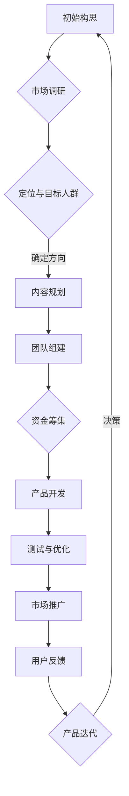

                 

**第1章：知识付费行业概述**

知识付费，作为一种新型的商业模式，在信息爆炸的时代背景下应运而生。它不仅改变了传统的内容消费模式，也为创业者提供了丰富的商业机会。在这一章中，我们将从多个维度对知识付费行业进行概述，包括行业背景、现状、主要模式以及参与者等，从而为后续的风险管理分析打下基础。

### 1.1 知识付费行业背景

#### 1.1.1 知识付费行业的发展历程

知识付费行业的发展历程可以追溯到20世纪末的互联网普及时期。当时，互联网巨头如Google、Amazon和eBay等通过在线平台，开始将用户购买行为数字化，开启了知识付费的先河。随着互联网技术的不断发展，尤其是移动互联网的普及，知识付费逐渐成为一种主流的商业模式。

2010年后，随着中国移动互联网的快速发展，知识付费市场开始崛起。知乎、得到、喜马拉雅等平台纷纷涌现，将知识付费与内容消费相结合，为用户提供个性化、高质量的知识服务。这一时期，知识付费逐渐从C2C（用户到用户）模式发展到C2B（用户到商家）模式，实现了商业模式的创新。

#### 1.1.2 知识付费行业现状与市场规模

目前，知识付费已成为互联网经济的重要组成部分。根据相关数据显示，2019年中国知识付费市场规模已超过2000亿元人民币，预计未来几年还将保持高速增长。知识付费领域的用户群体也在不断扩大，从最初的少数科技爱好者、职场精英，逐步扩展到广大普通消费者。

知识付费行业的主要模式包括平台型、内容型、服务型等。其中，平台型模式以知乎、得到等为代表，通过搭建知识分享和交易的平台，为内容生产者和消费者提供高效的连接。内容型模式以喜马拉雅、樊登读书会等为代表，通过提供专业内容，满足用户的学习需求。服务型模式则以极客时间、混沌大学等为代表，通过提供专业服务和培训，提升用户的职业技能。

#### 1.1.3 知识付费行业的主要模式

1. **平台型模式**：以知乎、得到等平台为代表，通过构建一个知识分享和交易的平台，为内容生产者和消费者提供高效的连接。平台型模式的主要特点是：

    - **开放性**：平台开放给所有的内容生产者和消费者，实现知识的共享和传播。
    - **规模化**：通过聚集大量的用户和内容，实现规模效应，提高平台的价值。
    - **多元化**：平台不仅提供知识付费服务，还涉足电商、社交等多个领域，实现多元化收入。

2. **内容型模式**：以喜马拉雅、樊登读书会等平台为代表，通过提供专业的内容服务，满足用户的学习需求。内容型模式的主要特点是：

    - **专业性**：平台提供的内容通常具有较高的专业性和权威性，满足用户的专业学习需求。
    - **多样化**：平台提供多种类型的内容，包括音频、视频、文字等，满足不同用户的需求。
    - **订阅制**：用户通过订阅服务，获得长期的内容更新，提高用户粘性。

3. **服务型模式**：以极客时间、混沌大学等平台为代表，通过提供专业服务和培训，提升用户的职业技能。服务型模式的主要特点是：

    - **定制化**：平台提供定制化的服务和培训，满足用户个性化的学习需求。
    - **实战性**：平台注重实战教学，通过案例分析和实际操作，提升用户的实战能力。
    - **社区化**：平台建立社区，促进用户之间的交流和合作，提高学习效果。

### 1.2 知识付费行业参与者

知识付费行业的参与者主要包括平台方、内容生产者、用户等。

#### 1.2.1 平台方

平台方是知识付费行业的核心，其主要职责是搭建和运营知识分享和交易的平台，为内容生产者和消费者提供高效的连接。平台方的核心能力包括：

- **技术能力**：平台方需要具备强大的技术能力，包括平台建设、数据分析和安全保障等，以保证平台的稳定运行。
- **内容运营能力**：平台方需要具备优秀的运营能力，包括内容筛选、推荐算法、用户互动等，以提高用户满意度和粘性。
- **商业模式设计能力**：平台方需要具备创新和设计能力，以构建可持续的商业模式，实现盈利。

#### 1.2.2 内容生产者

内容生产者是知识付费行业的重要参与者，他们通过创作和提供专业的内容，满足用户的学习需求。内容生产者的核心能力包括：

- **专业能力**：内容生产者需要具备深厚的专业知识和经验，以保证内容的质量和权威性。
- **创作能力**：内容生产者需要具备良好的创作能力，包括选题策划、内容编辑、多媒体制作等，以提高内容的吸引力和传播力。
- **用户洞察能力**：内容生产者需要具备对用户需求的敏锐洞察，以便创作出符合用户期望的内容。

#### 1.2.3 用户

用户是知识付费行业的最终受益者，他们通过购买和消费知识付费服务，提升自身的知识和技能。用户的核心需求包括：

- **知识获取**：用户希望通过知识付费服务，获取专业知识和技能，提升自身的职业竞争力。
- **时间节约**：用户希望通过高效的知识付费服务，节省学习时间和成本，提高学习效率。
- **个性化服务**：用户希望获得个性化的服务，包括定制化的内容推荐、专业的学习指导等，以满足个性化的学习需求。

### 1.3 知识付费行业的挑战与机遇

#### 1.3.1 行业挑战

知识付费行业面临着多方面的挑战：

- **内容质量**：知识付费市场内容繁多，如何保证内容质量，满足用户需求，是一个重要挑战。
- **版权保护**：知识付费行业的版权问题较为复杂，如何保护内容创作者的权益，同时保障用户的合法权益，是一个重要问题。
- **用户隐私**：随着用户对隐私保护的重视，知识付费平台如何保障用户的隐私安全，也是一个挑战。
- **市场竞争**：知识付费市场竞争激烈，如何实现差异化竞争，提高用户粘性，是一个重要问题。

#### 1.3.2 行业机遇

知识付费行业也面临着多方面的机遇：

- **用户需求增长**：随着社会的发展和人们生活水平的提高，对知识的需求也在不断增加，这为知识付费行业提供了广阔的市场空间。
- **技术进步**：人工智能、大数据、区块链等技术的进步，为知识付费行业提供了更多的发展机会，如智能推荐、版权保护、付费转化等。
- **政策支持**：政府对知识付费行业的支持力度不断加大，如税收优惠、知识产权保护等，这为知识付费行业的健康发展提供了良好的外部环境。
- **跨界合作**：知识付费行业与其他行业的跨界合作，如教育、电商、医疗等，有望实现资源共享、互利共赢。

#### 1.3.3 创业者在知识付费行业的切入点

对于创业者来说，知识付费行业提供了丰富的商业机会。以下是一些可能的切入点：

- **专业领域深耕**：选择某个专业领域，提供深度、高质量的内容服务，建立专业品牌。
- **垂直细分市场**：针对特定的用户群体，如职场人士、学生、创业者等，提供定制化的知识服务。
- **技术创新**：利用人工智能、大数据等技术，提供智能推荐、个性化服务等，提高用户体验。
- **内容电商**：将知识付费与电商相结合，提供知识付费产品的一站式购买服务。

**总结**

知识付费行业作为一个新兴的行业，正面临着前所未有的发展机遇。创业者可以通过深入了解行业背景、现状、参与者以及面临的挑战和机遇，找到合适的切入点，实现创业梦想。在下一章中，我们将对知识付费行业中的风险管理进行深入分析，帮助创业者更好地应对各种风险，确保创业项目的成功。

## 1.1 知识付费行业背景

知识付费，作为信息时代下的一种新型商业模式，其发展历程可谓跌宕起伏，充满了创新与挑战。要深入了解知识付费行业，我们首先要从其发展历程入手，理解这一行业如何从无到有，逐渐成为互联网经济中的重要组成部分。

### 1.1.1 知识付费行业的发展历程

知识付费的起源可以追溯到互联网普及的早期阶段。当时，互联网作为新兴的信息传播渠道，开始改变人们获取和传递知识的方式。在这个时期，一些早期的互联网平台如Google、Amazon和eBay等，通过线上交易模式，使得用户可以购买和交换知识产品，这为知识付费的雏形奠定了基础。

进入21世纪后，随着移动互联网的快速发展，知识付费行业迎来了第一次爆发式增长。2010年左右，中国的移动互联网用户数量迅速增加，智能手机的普及使得人们可以随时随地获取和消费知识。这一时期，知乎、得到、喜马拉雅等平台应运而生，通过互联网技术，将知识付费模式推向了大众视野。

知乎作为一个知识分享平台，通过用户生成内容和社区互动，实现了知识的生产和传播。知乎Live的推出，更是将知识付费从线上讨论延伸到了线下互动，用户可以通过付费的形式，参与到专业领域的深度讨论中。这种模式不仅为用户提供了价值，也为内容创作者带来了收益。

与此同时，得到App凭借其独特的知识服务模式，迅速在市场上站稳了脚跟。得到App主打精品课程，通过邀请各领域的专家进行讲授，将高质量的知识内容呈现给用户。这种订阅制的模式，使得用户可以按照自己的需求，选择合适的内容进行学习。得到的成功，标志着知识付费行业进入了一个新的发展阶段。

喜马拉雅则是另一个典型的知识付费平台，其通过音频内容，为用户提供了丰富的学习资源。喜马拉雅平台上，用户可以免费收听大量的音频课程，也可以通过付费购买更高质量的内容。这种多样化的内容模式，满足了不同用户的需求，进一步推动了知识付费行业的发展。

除了这些头部平台外，还有许多垂直领域的小型平台也在不断涌现。例如，极客时间专注于IT技术领域，混沌大学专注于企业管理培训，这些平台通过深耕某一专业领域，为用户提供了专业、深度的内容服务。

### 1.1.2 知识付费行业现状与市场规模

目前，知识付费行业已经发展成为一个庞大的市场，其市场规模和用户数量都在不断增长。根据相关数据显示，2019年中国的知识付费市场规模已经超过2000亿元人民币，预计未来几年仍将保持高速增长。这一数据充分展示了知识付费行业在互联网经济中的重要地位。

在用户群体方面，知识付费用户主要分布在一线城市和二线城市，其中，职场人士、学生和创业者是主要的消费群体。职场人士希望通过知识付费提升职业技能和职业竞争力，学生希望通过学习专业知识充实自己的知识体系，创业者则希望通过获取市场前沿的知识来指导自己的创业实践。

知识付费行业的主要模式包括平台型、内容型和服务型。平台型模式以知乎、得到等为代表，通过搭建知识分享和交易的平台，为内容生产者和消费者提供高效的连接。内容型模式以喜马拉雅、樊登读书会等为代表，通过提供专业的内容服务，满足用户的学习需求。服务型模式以极客时间、混沌大学等为代表，通过提供专业服务和培训，提升用户的职业技能。

在内容形式方面，知识付费平台提供了多样化的学习资源，包括音频、视频、文字等多种形式。用户可以根据自己的需求和偏好，选择适合自己的学习方式。同时，随着技术的进步，知识付费平台也在不断探索新的内容形式，如虚拟现实（VR）和增强现实（AR）等，以提高用户的学习体验。

### 1.1.3 知识付费行业的主要模式

1. **平台型模式**：平台型模式是知识付费行业中最常见的模式之一。以知乎、得到等平台为代表，平台型模式通过搭建一个知识分享和交易的平台，为内容生产者和消费者提供连接。平台型模式的主要特点是：

    - **开放性**：平台开放给所有的内容生产者和消费者，实现知识的共享和传播。
    - **规模化**：通过聚集大量的用户和内容，实现规模效应，提高平台的价值。
    - **多元化**：平台不仅提供知识付费服务，还涉足电商、社交等多个领域，实现多元化收入。

2. **内容型模式**：内容型模式以喜马拉雅、樊登读书会等平台为代表，通过提供专业的内容服务，满足用户的学习需求。内容型模式的主要特点是：

    - **专业性**：平台提供的内容通常具有较高的专业性和权威性，满足用户的专业学习需求。
    - **多样化**：平台提供多种类型的内容，包括音频、视频、文字等，满足不同用户的需求。
    - **订阅制**：用户通过订阅服务，获得长期的内容更新，提高用户粘性。

3. **服务型模式**：服务型模式以极客时间、混沌大学等平台为代表，通过提供专业服务和培训，提升用户的职业技能。服务型模式的主要特点是：

    - **定制化**：平台提供定制化的服务和培训，满足用户个性化的学习需求。
    - **实战性**：平台注重实战教学，通过案例分析和实际操作，提升用户的实战能力。
    - **社区化**：平台建立社区，促进用户之间的交流和合作，提高学习效果。

### 1.2 知识付费行业参与者

知识付费行业的参与者主要包括平台方、内容生产者、用户等。这些参与者共同构成了知识付费行业的生态体系，各自扮演着重要的角色。

#### 1.2.1 平台方

平台方是知识付费行业的核心，他们负责搭建和运营知识分享和交易的平台，为内容生产者和消费者提供连接。平台方的核心职责包括：

1. **技术保障**：平台方需要具备强大的技术能力，包括平台建设、数据分析和安全保障等，以保证平台的稳定运行和用户数据的安全。
2. **内容运营**：平台方需要具备优秀的运营能力，包括内容筛选、推荐算法、用户互动等，以提高用户满意度和粘性。
3. **商业模式设计**：平台方需要具备创新的商业模式设计能力，以实现平台的盈利和可持续发展。

目前，知识付费平台的技术架构主要包括以下几个方面：

1. **前端技术**：前端技术主要负责用户界面的展示和交互，常用的技术包括HTML、CSS、JavaScript等。
2. **后端技术**：后端技术主要负责处理用户请求、数据存储和业务逻辑，常用的技术包括Java、Python、Node.js等。
3. **数据库技术**：数据库技术主要负责存储和管理用户数据、内容数据等，常用的技术包括MySQL、MongoDB、Redis等。
4. **推荐算法**：推荐算法负责为用户推荐感兴趣的内容，常用的算法包括协同过滤、基于内容的推荐等。

#### 1.2.2 内容生产者

内容生产者是知识付费行业的另一个重要参与者，他们通过创作和提供专业的内容，满足用户的学习需求。内容生产者的核心职责包括：

1. **内容创作**：内容生产者需要具备优秀的创作能力，包括选题策划、内容编辑、多媒体制作等，以保证内容的质量和吸引力。
2. **专业能力**：内容生产者需要具备深厚的专业知识和经验，以保证内容的专业性和权威性。
3. **用户洞察**：内容生产者需要具备对用户需求的敏锐洞察，以便创作出符合用户期望的内容。

内容生产者的收入来源主要包括以下几个方面：

1. **平台分成**：内容生产者通过在平台发布内容，获得平台分成收入。
2. **付费订阅**：内容生产者通过推出付费订阅服务，直接从用户那里获取收入。
3. **广告收入**：内容生产者可以通过广告收入增加自己的收益。

#### 1.2.3 用户

用户是知识付费行业的最终受益者，他们通过购买和消费知识付费服务，提升自身的知识和技能。用户的核心需求包括：

1. **知识获取**：用户希望通过知识付费服务，获取专业知识和技能，提升自身的职业竞争力。
2. **时间节约**：用户希望通过高效的知识付费服务，节省学习时间和成本，提高学习效率。
3. **个性化服务**：用户希望获得个性化的服务，包括定制化的内容推荐、专业的学习指导等，以满足个性化的学习需求。

用户的消费行为和支付方式也在不断变化。目前，用户主要通过以下几种方式购买知识付费服务：

1. **一次性购买**：用户一次性购买特定内容，如音频、视频等。
2. **订阅服务**：用户通过订阅服务，获得长期的内容更新，如得到App的订阅服务。
3. **按需付费**：用户根据需要，按需购买特定内容或服务。

### 1.3 知识付费行业的挑战与机遇

#### 1.3.1 行业挑战

知识付费行业在快速发展的同时，也面临着多方面的挑战：

1. **内容质量**：随着知识付费市场的不断扩大，内容质量成为了用户关注的重点。如何保证内容的质量，满足用户需求，是一个重要的挑战。
2. **版权保护**：知识付费行业涉及大量的内容创作，版权问题尤为突出。如何保护内容创作者的权益，同时保障用户的合法权益，是一个重要问题。
3. **用户隐私**：随着用户对隐私保护的重视，知识付费平台如何保障用户的隐私安全，也是一个挑战。
4. **市场竞争**：知识付费市场竞争激烈，如何实现差异化竞争，提高用户粘性，是一个重要问题。

#### 1.3.2 行业机遇

知识付费行业也面临着多方面的机遇：

1. **用户需求增长**：随着社会的发展和人们生活水平的提高，对知识的需求也在不断增加，这为知识付费行业提供了广阔的市场空间。
2. **技术进步**：人工智能、大数据、区块链等技术的进步，为知识付费行业提供了更多的发展机会，如智能推荐、版权保护、付费转化等。
3. **政策支持**：政府对知识付费行业的支持力度不断加大，如税收优惠、知识产权保护等，这为知识付费行业的健康发展提供了良好的外部环境。
4. **跨界合作**：知识付费行业与其他行业的跨界合作，如教育、电商、医疗等，有望实现资源共享、互利共赢。

#### 1.3.3 创业者在知识付费行业的切入点

对于创业者来说，知识付费行业提供了丰富的商业机会。以下是一些可能的切入点：

1. **专业领域深耕**：选择某个专业领域，提供深度、高质量的内容服务，建立专业品牌。
2. **垂直细分市场**：针对特定的用户群体，如职场人士、学生、创业者等，提供定制化的知识服务。
3. **技术创新**：利用人工智能、大数据等技术，提供智能推荐、个性化服务等，提高用户体验。
4. **内容电商**：将知识付费与电商相结合，提供知识付费产品的一站式购买服务。

**总结**

知识付费行业作为一个新兴的行业，正面临着前所未有的发展机遇。创业者可以通过深入了解行业背景、现状、参与者以及面临的挑战和机遇，找到合适的切入点，实现创业梦想。在下一章中，我们将对知识付费行业中的风险管理进行深入分析，帮助创业者更好地应对各种风险，确保创业项目的成功。

## 1.2 风险管理的定义与重要性

### 2.1.1 风险管理的概念

风险管理是一种系统性的方法，用于识别、评估和应对可能影响组织目标实现的不确定性事件。它不仅仅是一种应对危机的措施，更是一种预防性策略，旨在通过提前规划和准备，减少风险事件发生的概率和影响。

风险管理的核心概念包括以下几个方面：

1. **风险识别**：识别可能对组织产生负面影响的事件或情境。
2. **风险评估**：对识别出的风险进行定量或定性的评估，以确定其严重程度和发生的可能性。
3. **风险应对**：制定和实施策略，以减轻或规避风险。
4. **风险监控**：持续监控风险状况，确保应对措施的有效性，并根据新出现的情况进行调整。

### 2.1.2 风险管理的目标

风险管理的目标主要包括以下几个方面：

1. **减少损失**：通过识别和应对潜在风险，降低组织因风险事件可能遭受的损失。
2. **保障目标实现**：确保组织的目标和战略不受风险事件的影响，实现长期可持续发展。
3. **提高决策质量**：通过系统化的风险管理，提高决策的科学性和准确性，减少因信息不全或不确定性导致的错误决策。
4. **增加信任与透明度**：通过有效的风险管理，增强利益相关者的信任，提高组织的透明度。

### 2.1.3 风险管理的必要性

在知识付费创业中，风险管理的重要性不言而喻。以下是几个关键原因：

1. **不确定性**：知识付费创业面临诸多不确定性，包括市场需求、用户行为、内容质量等。有效的风险管理可以帮助创业者预见和应对这些不确定性。
2. **资源优化**：通过风险管理，创业者可以更合理地分配资源，避免因风险事件而导致的资源浪费。
3. **战略制定**：风险管理是战略制定的重要组成部分。只有全面了解潜在风险，才能制定出有效的战略规划。
4. **合规要求**：知识付费行业涉及众多法律法规，如版权法、用户隐私保护法等。风险管理有助于确保组织在法律框架内运营。
5. **品牌保护**：有效的风险管理有助于保护品牌声誉，避免因风险事件导致的负面宣传和损失。

### 2.1.4 风险管理的基本流程

风险管理的基本流程包括以下几个步骤：

1. **风险识别**：通过调研、访谈、文献分析等方法，识别组织可能面临的风险。
2. **风险评估**：对识别出的风险进行评估，包括其严重程度、发生概率等。
3. **风险应对**：根据风险评估结果，制定和实施风险应对策略，如规避、减轻、转移等。
4. **风险监控**：持续监控风险状况，确保应对措施的有效性，并根据新出现的情况进行调整。
5. **记录与报告**：记录风险管理过程中的关键信息，定期向管理层和利益相关者报告风险状况和应对措施。

### 2.1.5 风险管理的方法与工具

风险管理的方法和工具多种多样，以下是一些常用的方法和工具：

1. **风险矩阵**：通过风险矩阵，可以直观地展示风险的严重程度和发生概率，帮助管理者进行风险评估。
2. **SWOT分析**：SWOT分析可以帮助组织识别自身优势、劣势、机会和威胁，从而制定相应的风险管理策略。
3. **概率影响矩阵**：概率影响矩阵结合了风险的发生概率和影响程度，用于评估风险的优先级。
4. **决策树**：决策树可以帮助组织在不同风险情境下，选择最优的应对策略。
5. **风险管理软件**：如Risk Management、Qualys等，这些软件提供了风险识别、评估和监控的功能，提高了风险管理的效率和准确性。

通过上述方法和工具，创业者可以更全面、系统地识别和应对知识付费创业中的风险，确保创业项目的成功。

### 2.2 风险识别与评估

#### 2.2.1 风险识别方法

风险识别是风险管理的第一步，其目标是全面识别出可能影响知识付费创业成功的各种风险。以下是几种常用的风险识别方法：

1. **头脑风暴法**：通过集体讨论，让团队成员自由表达对风险的看法，从而识别出潜在的风险。
2. **德尔菲法**：通过多轮问卷调查，逐步收敛专家的意见，从而确定风险。
3. **SWOT分析法**：通过分析组织内部的优势（Strengths）、劣势（Weaknesses）、机会（Opportunities）和威胁（Threats），识别潜在的风险。
4. **专家访谈法**：通过与行业专家进行一对一访谈，获取其对风险的专业判断。
5. **历史数据分析**：通过分析历史数据，识别出过去曾经出现过的风险。

#### 2.2.2 风险评估指标

风险评估是风险管理的核心环节，其目标是确定风险的严重程度和发生的可能性，为风险应对提供依据。以下是几种常用的风险评估指标：

1. **风险严重程度**：评估风险对组织目标实现的可能影响程度。通常使用0-10的评分标准，分数越高，风险越严重。
2. **风险发生概率**：评估风险发生的可能性。同样使用0-10的评分标准，分数越高，风险发生的概率越大。
3. **风险影响评分**：将风险严重程度和发生概率相结合，计算风险的影响评分。常用的计算方法有矩阵法和评分法。
4. **风险暴露度**：评估组织面临的风险程度，通过计算风险的概率和影响乘积来得出。
5. **经济影响评分**：评估风险对组织财务状况的可能影响，通常使用财务指标如损失概率、损失幅度等。

#### 2.2.3 风险评估流程

风险评估的流程通常包括以下几个步骤：

1. **确定评估对象**：明确评估的范围和对象，如具体的业务流程、产品或服务等。
2. **数据收集**：通过问卷调查、访谈、历史数据等方式收集与风险相关的信息。
3. **风险评估**：根据收集到的数据，使用评估指标和方法对风险进行评估。
4. **风险排序**：将评估出的风险按照严重程度和发生概率进行排序，确定优先级。
5. **制定应对策略**：根据风险评估结果，制定相应的风险应对策略。
6. **监控和调整**：持续监控风险状况，根据新的信息和变化，调整风险评估和应对策略。

通过以上流程，创业者可以更科学、系统地识别和评估知识付费创业中的风险，为创业项目的成功提供有力保障。

### 2.3 风险应对策略

#### 2.3.1 风险规避策略

风险规避策略旨在通过避免或消除风险源，从而完全消除风险。这是一种消极的风险应对策略，通常在风险概率和影响都非常高时使用。以下是几种常见的风险规避策略：

1. **不参与高风险项目**：避免投资或参与那些潜在风险过高且难以控制的项目。
2. **更换供应商**：如果某个供应商存在潜在风险，可以选择更换为更可靠的供应商。
3. **调整业务方向**：如果市场环境或技术发展导致项目风险过高，可以调整业务方向，避免风险。
4. **减少投资规模**：通过减少投资规模，降低风险事件对组织的影响。

#### 2.3.2 风险减少策略

风险减少策略通过降低风险概率或减少风险事件发生后的损失，从而降低整体风险。这是一种较为积极的风险应对策略，适用于大部分可控制的风险。以下是几种常见的风险减少策略：

1. **紧急演练和预防措施**：通过定期进行紧急演练和采取预防措施，减少风险事件发生的概率。
2. **保险和担保**：通过购买保险或提供担保，转移部分风险，降低财务损失。
3. **技术升级和维护**：定期升级和维护技术设备，减少故障和安全事故的发生。
4. **员工培训和激励**：通过培训和激励，提高员工的风险意识和应对能力，降低操作风险。

#### 2.3.3 风险接受策略

风险接受策略是在风险事件发生时，组织选择承担部分或全部损失。这是一种较为保守的风险应对策略，适用于风险概率较低或风险事件发生后影响较小的风险。以下是几种常见的风险接受策略：

1. **风险容忍度**：设定组织可以承受的风险范围，超出此范围的风险将采取其他应对措施。
2. **风险保留**：将风险保留在组织内部，通过内部风险管理机制进行控制。
3. **风险转移**：通过合同、协议等方式，将风险转移给第三方，如签订风险承担合同或购买保险。
4. **风险自留**：对于一些小额、低频率的风险，组织可以选择自留，并制定相应的风险应对计划。

#### 2.3.4 风险转移策略

风险转移策略通过将风险转移给第三方，从而减少组织自身的风险负担。这是一种常见的风险管理策略，适用于无法完全消除或降低的风险。以下是几种常见的风险转移策略：

1. **保险**：通过购买保险，将风险转移给保险公司，从而降低财务风险。
2. **外包**：将部分业务或职能外包给其他公司，从而将相关风险转移给外包方。
3. **合同**：通过签订合同，将特定风险转移给合同对方，如承包合同、租赁合同等。
4. **合作伙伴关系**：建立合作伙伴关系，共同分担和应对风险，从而实现风险转移。

通过上述风险应对策略，创业者可以更全面地管理知识付费创业中的各种风险，确保创业项目的顺利推进和成功。

### 3.1 创业初期风险管理

#### 3.1.1 初创团队风险管理

在知识付费创业的初期，团队风险管理是至关重要的一环。一个高效、和谐的团队可以为创业项目提供坚实的支持，而团队管理不善则可能导致项目失败。以下是创业初期团队风险管理的几个关键方面：

1. **团队组建策略**：创业者需要根据项目需求和团队发展阶段，制定科学的团队组建策略。初期团队通常包括核心技术人员、市场营销人员、产品经理等。在人员选拔上，应注重专业能力与团队协作能力的平衡。

2. **角色明确与职责划分**：在团队组建后，明确每个成员的角色和职责，确保团队成员了解自己的工作内容和预期目标。这有助于提高团队工作效率，减少因职责不明导致的冲突和误解。

3. **团队沟通机制**：建立有效的团队沟通机制，确保信息流畅、及时。定期召开团队会议、利用即时通讯工具和项目管理软件，都是维护团队沟通的有效方式。

4. **团队成员激励**：通过合理的激励机制，如绩效奖励、股权激励等，激发团队成员的积极性和创造力。同时，关注团队成员的个人发展和职业规划，帮助他们实现自我提升。

5. **团队文化建设**：塑造积极向上的团队文化，如鼓励创新、尊重知识、注重团队协作等，有助于提高团队的凝聚力和战斗力。

#### 3.1.2 创业资金风险管理

创业资金管理是知识付费创业初期的另一大关键。有效的资金管理不仅能够确保项目的正常运转，还能为未来的发展提供保障。以下是创业资金风险管理的几个方面：

1. **资金筹集策略**：创业者需要根据项目需求和市场情况，制定合适的资金筹集策略。常见的资金来源包括自有资金、天使投资、风险投资、银行贷款等。在筹集资金时，要充分考虑资金成本和还款压力。

2. **资金预算管理**：制定详细的资金预算计划，明确每一笔资金的用途，严格控制成本。通过定期审查预算执行情况，及时调整资金使用计划，确保资金使用的高效和合理。

3. **资金流动性管理**：保持足够的资金流动性，以应对可能出现的突发事件和市场变化。合理配置流动资金和长期资金，确保在资金需求高峰期能够及时调配资金。

4. **风险准备金**：设立风险准备金，用于应对不可预见的资金需求。风险准备金可以来源于公司净利润或专项投资回报，以便在需要时提供财务支持。

5. **财务审计与合规性**：定期进行财务审计，确保公司财务状况的真实性和合规性。遵守相关法律法规，避免因财务问题引发的法律风险。

#### 3.1.3 产品与市场风险管理

在知识付费创业初期，产品与市场风险管理至关重要。以下是一些关键方面：

1. **市场需求分析**：深入分析市场需求，了解目标用户的需求和痛点，为产品开发提供依据。通过市场调研、用户访谈、竞争对手分析等方法，获取有价值的市场信息。

2. **产品定位与规划**：明确产品的市场定位，制定清晰的产品规划。产品定位应考虑用户需求、市场趋势和竞争对手情况，确保产品具有市场竞争力。

3. **产品开发与迭代**：制定科学的开发计划，确保产品按时上线。在产品开发过程中，注重用户反馈，及时调整产品功能和设计，实现快速迭代。

4. **市场推广策略**：制定有效的市场推广策略，提高产品知名度和用户转化率。市场推广策略应包括品牌建设、内容营销、社交媒体推广等多种手段。

5. **用户关系管理**：建立良好的用户关系，提高用户满意度和忠诚度。通过用户反馈、客户服务、用户社区等方式，与用户保持密切互动，了解用户需求和意见，持续优化产品和服务。

通过以上风险管理措施，创业者可以更好地应对知识付费创业初期的各种挑战，确保创业项目的顺利推进和成功。

### 3.2 内容生产风险管理

在知识付费创业中，内容生产风险管理是确保项目成功的关键环节。内容质量直接关系到用户的满意度和平台的声誉，因此，对内容生产过程进行严格的管理和控制至关重要。以下是内容生产风险管理的几个关键方面：

#### 3.2.1 内容质量风险管理

内容质量是知识付费的核心，直接关系到用户对平台的信任和满意度。以下是几种常见的内容质量风险管理方法：

1. **内容审核机制**：建立完善的审核机制，对上传的内容进行严格审查。审核过程应包括内容真实性、专业性和合规性等方面的检查。

   ```mermaid
   graph TD
   A[内容提交] --> B{审核标准}
   B --> C{人工审核}
   C --> D{内容发布}
   D --> E{用户反馈}
   E --> F{内容更新}
   ```

2. **质量评估体系**：建立质量评估体系，对已发布的内容进行定期评估，确保内容始终保持高质量。评估标准可以包括内容的专业性、准确性、完整性、用户互动情况等。

3. **用户反馈机制**：建立用户反馈机制，收集用户对内容的评价和意见。通过分析用户反馈，发现内容存在的问题，及时进行调整和优化。

4. **专业培训与认证**：对内容生产者进行专业培训和认证，确保他们具备足够的专业知识和能力。通过定期培训，提高内容生产者的内容创作水平。

#### 3.2.2 内容版权风险管理

内容版权问题在知识付费行业中尤为突出，版权纠纷不仅会影响平台的声誉，还可能导致严重的法律风险。以下是几种常见的内容版权风险管理方法：

1. **版权审核**：在内容发布前，对内容的版权进行严格审核，确保内容的合法来源。版权审核应包括内容来源、版权授权等方面的检查。

2. **版权声明**：在平台和相关内容中明确版权声明，告知用户内容的版权信息，减少版权纠纷的风险。

3. **版权保护技术**：利用数字版权管理（DRM）等技术手段，对内容进行加密和保护，防止未经授权的传播和使用。

4. **法律顾问**：聘请专业的法律顾问，对版权问题提供法律咨询和维权服务，确保平台在版权方面合规运营。

#### 3.2.3 内容审核与合规风险管理

内容审核与合规风险管理旨在确保平台上的内容符合法律法规和道德规范，维护平台的良好声誉。以下是几种常见的内容审核与合规风险管理方法：

1. **合规政策制定**：制定严格的内容审核和合规政策，明确内容发布的标准和规范。

2. **审核流程优化**：优化内容审核流程，提高审核效率，确保内容及时发布。审核流程可以包括初步筛选、人工审核、复审等多个环节。

3. **技术手段辅助**：利用人工智能和大数据技术，对内容进行自动化审核，提高审核的准确性和效率。

4. **用户举报机制**：建立用户举报机制，鼓励用户举报违规内容。通过用户举报，及时发现和处理违规内容。

5. **法律合规审查**：定期进行法律合规审查，确保平台运营符合相关法律法规的要求。

通过以上内容生产风险管理方法，创业者可以有效地控制内容生产过程中的各种风险，确保知识付费项目的顺利推进和长期发展。

### 3.3 用户风险管理

在知识付费创业中，用户风险管理至关重要，因为用户是知识付费服务的核心。有效的用户风险管理能够确保用户体验，维护平台的声誉，并促进业务的持续增长。以下是用户风险管理的几个关键方面：

#### 3.3.1 用户行为风险管理

用户行为风险管理旨在监控和应对用户在平台上可能出现的异常行为，如欺诈、滥用、恶意评论等。以下是几种用户行为风险管理方法：

1. **行为分析工具**：利用大数据和机器学习技术，建立用户行为分析模型，实时监控用户的操作行为，识别潜在的风险。

   ```mermaid
   graph TD
   A[用户操作] --> B{行为分析模型}
   B --> C{风险识别}
   C --> D{风险预警}
   D --> E{风险应对}
   ```

2. **用户画像**：通过收集和分析用户的行为数据，构建用户画像，了解用户的行为特征和偏好，从而更好地进行风险预防和干预。

3. **用户反馈机制**：建立用户反馈渠道，鼓励用户举报违规行为，同时收集用户对平台服务的意见和建议，及时进行改进。

4. **行为限制策略**：制定合理的行为限制策略，如限制用户发言频率、内容发布数量等，防止恶意用户对平台造成影响。

#### 3.3.2 用户隐私风险管理

用户隐私风险管理是知识付费创业中的重中之重，因为用户隐私保护是法律要求，也是用户对平台的基本期望。以下是几种用户隐私风险管理方法：

1. **隐私政策**：制定明确的隐私政策，告知用户其个人信息的使用方式和保护措施，增强用户的信任。

2. **数据加密**：对用户数据进行加密存储和传输，确保用户隐私不被泄露。

3. **权限管理**：实施严格的权限管理机制，确保只有经过授权的人员才能访问用户敏感数据。

4. **安全审计**：定期进行安全审计，检查数据保护措施的有效性，及时发现和修复安全漏洞。

5. **用户数据匿名化**：在分析用户数据时，对敏感信息进行匿名化处理，减少数据泄露的风险。

#### 3.3.3 用户权益保护风险管理

保护用户权益是知识付费平台的重要责任，有效的用户权益保护风险管理能够提高用户满意度，减少用户投诉和纠纷。以下是几种用户权益保护风险管理方法：

1. **服务协议**：制定详细的服务协议，明确用户和平台的权利义务，减少纠纷发生的可能性。

2. **投诉处理机制**：建立高效的投诉处理机制，及时响应和处理用户的投诉和问题，确保用户权益得到维护。

3. **用户教育**：通过用户指南、FAQ、在线帮助等方式，提高用户的法律意识和自我保护能力。

4. **法律援助**：提供法律援助服务，帮助用户解决法律纠纷，维护其合法权益。

5. **诚信体系建设**：建立诚信体系，对违规行为进行记录和惩罚，维护平台公平、公正的运营环境。

通过上述用户风险管理方法，创业者可以有效地保护用户权益，提升用户体验，为知识付费创业项目的成功提供坚实保障。

### 3.4 营销与推广风险管理

在知识付费创业中，营销与推广是吸引用户、提升品牌知名度的重要手段。然而，不当的营销和推广行为可能会带来法律风险、财务风险和品牌风险。因此，有效的营销与推广风险管理至关重要。以下是营销与推广风险管理的几个关键方面：

#### 3.4.1 广告与推广合规性风险管理

广告与推广的合规性风险管理旨在确保广告内容合法、真实，不误导用户。以下是一些具体的方法：

1. **广告审查制度**：建立广告审查制度，对所有广告内容进行审查，确保其符合相关法律法规的要求。

   ```mermaid
   graph TD
   A[广告创建] --> B{审查制度}
   B --> C{内容合规性审查}
   C --> D{发布批准}
   D --> E{监控与更新}
   ```

2. **合规培训**：对营销团队进行合规培训，提高其法律意识和合规操作能力。

3. **第三方审核**：邀请第三方机构对广告内容进行审核，确保广告的合规性。

4. **投诉处理**：建立投诉处理机制，及时处理用户对广告的投诉，并根据投诉情况调整广告策略。

#### 3.4.2 用户获取成本风险管理

用户获取成本（Customer Acquisition Cost, CAC）是衡量营销效率的重要指标。有效的用户获取成本风险管理有助于降低成本，提高营销ROI。以下是一些具体的方法：

1. **数据分析**：通过数据分析，了解不同渠道的用户获取成本，优化营销策略。

   ```mermaid
   graph TD
   A[数据收集] --> B{数据分析}
   B --> C{优化渠道选择}
   C --> D{成本控制}
   ```

2. **营销预算管理**：制定合理的营销预算，并根据预算进行成本控制。

3. **渠道优化**：根据用户获取成本和用户价值，优化营销渠道选择，降低无效成本。

4. **效果跟踪**：对营销活动进行效果跟踪，及时发现和解决成本过高的问题。

#### 3.4.3 品牌形象风险管理

品牌形象是知识付费平台的重要资产，不当的营销行为可能会损害品牌形象。以下是一些品牌形象风险管理的具体方法：

1. **品牌定位**：明确品牌定位，确保营销内容和品牌形象一致。

   ```mermaid
   graph TD
   A[品牌定位] --> B{内容一致性}
   B --> C{营销策略}
   ```

2. **品牌监控**：建立品牌监控机制，实时跟踪品牌在社交媒体、新闻等渠道上的表现，及时应对负面信息。

3. **危机管理**：制定危机管理计划，应对可能出现的品牌危机，如负面报道、用户投诉等。

4. **用户反馈**：积极收集用户反馈，了解用户对品牌的看法，及时调整营销策略。

通过上述营销与推广风险管理方法，创业者可以确保营销活动的合规性，有效控制用户获取成本，维护品牌形象，为知识付费创业项目的成功奠定坚实基础。

### 3.5 财务风险管理

财务风险管理是知识付费创业中不可或缺的一环，它直接关系到企业的生存与发展。有效的财务风险管理能够帮助企业在快速变化的市场环境中保持稳定，避免因资金流动不畅或财务问题导致的经营风险。以下是财务风险管理的一些关键方面：

#### 3.5.1 成本控制风险管理

成本控制是财务风险管理的基础。有效的成本控制能够帮助企业降低运营成本，提高盈利能力。以下是几种成本控制风险管理的方法：

1. **预算管理**：制定详细的预算计划，并严格按预算执行。通过定期审查预算执行情况，及时调整预算，确保成本控制在合理范围内。

   ```mermaid
   graph TD
   A[预算制定] --> B{预算执行}
   B --> C{定期审查}
   C --> D{调整预算}
   ```

2. **成本分析**：通过成本分析，识别成本中的不合理部分，寻找降低成本的途径。定期进行成本分析，及时发现问题并采取改进措施。

3. **成本分摊**：合理分摊各项成本，确保各业务部门或产品线的成本负担公平合理。

4. **成本控制培训**：对员工进行成本控制培训，提高员工对成本控制的认识和意识。

#### 3.5.2 资金流动性风险管理

资金流动性是企业保持正常运营的关键，有效的资金流动性风险管理能够确保企业在任何情况下都能满足资金需求。以下是几种资金流动性风险管理的方法：

1. **现金流管理**：建立有效的现金流管理机制，实时监控现金流入和流出，确保资金流动性。

   ```mermaid
   graph TD
   A[现金流预测] --> B{现金流监控}
   B --> C{资金调度}
   ```

2. **资金储备**：建立合理的资金储备，以应对可能出现的资金短缺情况。

3. **多渠道融资**：通过多渠道融资，确保企业有足够的资金来源，降低资金流动性风险。

4. **资金流动分析**：定期进行资金流动分析，识别资金流动中的问题，并及时采取措施进行改进。

#### 3.5.3 财务风险管理

财务风险管理旨在确保企业的财务状况健康，避免因财务问题导致的企业危机。以下是几种财务风险管理的方法：

1. **财务审计**：定期进行财务审计，确保财务报告的真实性和准确性，发现潜在问题并及时解决。

   ```mermaid
   graph TD
   A[财务审计] --> B{审计报告}
   B --> C{问题整改}
   ```

2. **风险控制策略**：制定全面的财务风险控制策略，包括风险识别、评估、应对和监控。

3. **内部控制机制**：建立有效的内部控制机制，确保财务活动的合规性和安全性。

4. **财务风险管理培训**：对财务人员进行风险管理培训，提高其风险识别和应对能力。

通过上述财务风险管理方法，创业者可以有效地控制成本、确保资金流动性、维护财务健康，从而为知识付费创业项目的成功提供有力保障。

### 4.1 知识付费创业成功案例分析

知识付费创业的成功案例为我们提供了宝贵的经验和启示。以下将详细分析两个成功的案例：知乎Live和得到App，探讨其成功的原因以及创业者在知识付费领域可以借鉴的经验。

#### 4.1.1 案例一：知乎Live

**知乎Live** 是知乎推出的一个付费直播互动产品，旨在为用户提供高质量的实时知识分享和交流机会。自2016年上线以来，知乎Live迅速积累了大量的用户和内容生产者，成为知识付费领域的领军者。

**成功原因**：

1. **高质量内容**：知乎Live强调内容质量，通过严格的审核机制，确保上线的内容具有专业性和权威性。知乎平台上的用户本身就具备高质量的内容生产能力，这为知乎Live提供了丰富的优质内容来源。

2. **用户互动**：知乎Live不仅提供内容，还注重用户互动。用户可以在直播过程中提问、互动，与讲师进行实时交流，这种互动性大大提升了用户的学习体验。

3. **品牌信任**：知乎作为一个知识分享平台，已经建立了强大的品牌信任。用户对知乎平台的信任，使得他们更愿意为知乎Live上的内容付费。

**借鉴经验**：

- **注重内容质量**：创业者应确保平台上的内容具有高质量和专业性，这是赢得用户信任的关键。
- **提升用户互动**：通过提供用户互动功能，如评论、问答等，增强用户参与感，提升用户体验。
- **品牌建设**：建立强大的品牌信任，为用户提供高质量的服务和内容，是知识付费成功的基础。

#### 4.1.2 案例二：得到App

**得到App** 是一家提供高质量知识服务的平台，通过邀请各领域的专家进行讲授，为用户提供多样化的知识产品。自成立以来，得到App迅速积累了大量用户，成为知识付费领域的佼佼者。

**成功原因**：

1. **专业讲师资源**：得到App拥有丰富的讲师资源，这些讲师都是各领域的专家，能够提供高质量的内容。得到App通过与专家合作，确保了内容的权威性和专业性。

2. **订阅制模式**：得到App采用订阅制模式，用户通过订阅服务，获得长期的内容更新。这种模式不仅提高了用户粘性，也实现了持续的收入来源。

3. **内容多样化**：得到App提供多种类型的内容，包括音频、视频、文字等，满足不同用户的学习需求。

**借鉴经验**：

- **建立专业讲师团队**：创业者应努力建立一支专业的讲师团队，确保内容的专业性和权威性。
- **探索多样化的内容形式**：根据用户需求，提供多样化的内容形式，满足不同用户的学习偏好。
- **采用订阅制模式**：通过订阅制模式，提高用户粘性，实现持续的收入来源。

### 4.1.3 总结

知乎Live和得到App的成功，为我们提供了宝贵的创业经验。以下是一些关键的借鉴点：

- **高质量内容**：确保平台上的内容具有高质量和专业性。
- **用户互动**：提供用户互动功能，增强用户体验。
- **专业讲师资源**：建立专业的讲师团队，提供高质量的内容。
- **多样化内容形式**：提供多样化的内容形式，满足不同用户的需求。
- **品牌建设**：建立强大的品牌信任，为用户提供高质量的服务和内容。

通过借鉴这些成功经验，创业者在知识付费领域中可以更好地规划自己的创业路径，提高创业成功率。

### 4.2 知识付费创业失败案例分析

在知识付费创业领域，尽管有许多成功的案例，但也有不少失败的案例。以下将分析两个典型的失败案例：知室和路米，探讨其失败的原因以及创业者在避免类似失败时可以吸取的教训。

#### 4.2.1 案例一：知室

**知室** 是一家提供专业职场技能培训的在线教育平台，成立于2016年。然而，尽管初期得到了一定的关注，知室最终在2018年宣布关闭。以下是知室失败的主要原因：

**失败原因**：

1. **内容质量不高**：知室在内容质量上存在较大问题，许多课程内容陈旧、缺乏实用性和专业性，导致用户满意度低。

2. **市场竞争激烈**：知识付费行业竞争异常激烈，新平台如雨后春笋般涌现，而知室未能有效区分自己与竞争对手的差异，缺乏竞争力。

3. **营销策略不当**：知室在营销上投入不足，缺乏有效的推广策略，导致用户基础薄弱。

4. **资金链断裂**：由于收入不佳，知室最终面临资金链断裂的风险，不得不关闭。

**教训**：

- **确保内容质量**：创业者应高度重视内容质量，确保课程内容具有实用性和专业性，以满足用户需求。
- **差异化竞争**：在竞争激烈的市场中，创业者应寻找独特的卖点，打造差异化竞争策略。
- **有效的营销策略**：通过有效的营销策略，提高品牌知名度和用户转化率。
- **稳健的财务规划**：创业者应制定稳健的财务规划，确保资金链的稳定。

#### 4.2.2 案例二：路米

**路米** 是一家提供在线心理咨询服务和心理健康课程的平台，成立于2017年。然而，路米在运营两年后，因种种问题宣布关闭。以下是路米失败的主要原因：

**失败原因**：

1. **隐私保护不足**：路米在用户隐私保护方面存在严重不足，导致用户信息泄露，引发了信任危机。

2. **服务质量不稳定**：路米在心理咨询服务上存在质量问题，部分咨询师的专业能力和服务质量无法保障，影响了用户体验。

3. **市场竞争压力**：心理健康领域竞争激烈，路米在产品和服务上未能有效突出优势，难以吸引和留住用户。

4. **资金短缺**：由于运营成本高、用户增长缓慢，路米最终面临资金短缺问题，无法继续运营。

**教训**：

- **加强隐私保护**：创业者应高度重视用户隐私保护，建立完善的安全体系，确保用户信息安全。
- **保障服务质量**：提供高质量的服务，确保用户体验，建立良好的用户口碑。
- **有效的市场定位**：在竞争激烈的市场中，创业者应明确自己的市场定位，提供具有竞争力的产品和服务。
- **稳健的财务规划**：合理规划财务，确保资金链的稳定，避免因资金短缺导致的运营问题。

### 4.2.3 总结

知室和路米的失败案例，为我们提供了宝贵的教训。以下是一些关键点：

- **内容质量**：确保内容质量是赢得用户信任的关键。
- **隐私保护**：加强用户隐私保护，建立信任。
- **服务质量**：提供高质量的服务，提升用户体验。
- **差异化竞争**：在激烈的市场竞争中，寻找差异化优势。
- **财务规划**：制定稳健的财务规划，确保资金链的稳定。

通过吸取这些教训，创业者在知识付费领域可以避免类似的失败，提高创业成功率。

### 5.1 风险管理策略制定

风险管理策略制定是知识付费创业中的关键环节。一个科学、合理、全面的策略不仅能帮助创业者识别和应对潜在风险，还能提高企业的抗风险能力和市场竞争力。以下是风险管理策略制定的详细步骤和注意事项。

#### 5.1.1 风险管理策略框架

风险管理策略的制定需要建立在一个系统性的框架基础上。以下是一个常见的管理策略框架：

1. **风险识别**：通过头脑风暴、专家访谈、SWOT分析等方法，全面识别出企业可能面临的各种风险。
2. **风险评估**：对识别出的风险进行评估，确定其发生的概率和可能造成的影响。
3. **风险排序**：根据风险评估结果，将风险按照优先级进行排序，确定需要优先应对的风险。
4. **风险应对策略制定**：根据风险排序结果，制定相应的风险应对策略，包括规避、减轻、转移和接受等。
5. **风险监控**：建立风险监控机制，持续监控风险状况，确保风险应对策略的有效性。
6. **定期评审**：定期对风险管理策略进行评审，根据实际情况进行调整和优化。

#### 5.1.2 风险管理策略制定流程

风险管理策略的制定通常遵循以下流程：

1. **初始调研**：通过访谈、问卷调查、文献分析等方法，收集与风险相关的信息，为后续的风险识别和评估提供基础。
2. **风险识别**：基于调研结果，利用头脑风暴、专家访谈等方法，识别出企业可能面临的各种风险。
3. **风险评估**：对识别出的风险进行定量和定性评估，确定其发生的概率和可能造成的影响。
4. **风险排序**：根据风险评估结果，将风险按照优先级进行排序，确定需要优先应对的风险。
5. **风险应对策略制定**：根据风险排序结果，制定相应的风险应对策略，明确具体措施和责任人。
6. **风险监控机制建立**：建立风险监控机制，确保风险应对策略的有效执行，及时发现新出现的风险。
7. **定期评审与调整**：定期对风险管理策略进行评审，根据实际情况进行调整和优化，确保其持续有效性。

#### 5.1.3 风险管理策略评估与调整

风险管理策略的评估与调整是确保其有效性的关键。以下是几个关键步骤：

1. **策略实施情况评估**：定期评估风险管理策略的实施情况，检查各项措施是否得到有效执行，风险是否得到有效控制。
2. **风险变化监测**：持续监测外部环境和内部运营情况的变化，及时发现新出现或变化的风险。
3. **策略调整**：根据评估结果和风险变化情况，对风险管理策略进行必要的调整，确保其与实际情况相符。
4. **内部沟通与培训**：定期组织内部沟通与培训，确保所有相关人员对风险管理策略和措施有清晰的理解和认识。
5. **外部反馈收集**：收集外部利益相关者（如客户、合作伙伴等）的反馈，了解他们对风险管理策略的看法和建议，为策略优化提供参考。

通过以上风险管理策略的制定、评估与调整，创业者可以更有效地识别、评估和应对知识付费创业中的各种风险，确保创业项目的顺利推进和成功。

### 5.2 风险管理实践

风险管理不仅仅是一个理论框架，它需要在实际操作中得以落实。在知识付费创业中，有效的风险管理实践是确保企业稳定发展的关键。以下我们将详细介绍风险管理流程的优化、常用工具与方法，以及具体的风险管理案例分享。

#### 5.2.1 风险管理流程优化

优化风险管理流程是提高风险管理效率和质量的关键。以下是几个优化风险管理流程的建议：

1. **流程标准化**：建立标准化的风险管理流程，明确每一步骤的职责和任务，确保流程的可操作性和一致性。

   ```mermaid
   graph TD
   A[风险识别] --> B{风险评估}
   B --> C{风险应对}
   C --> D{风险监控}
   D --> E{流程反馈}
   ```

2. **自动化工具应用**：引入自动化工具，如风险管理软件、流程管理软件等，提高流程的执行效率。

3. **定期评审**：定期对风险管理流程进行评审，发现并解决流程中的瓶颈和问题，持续优化流程。

4. **团队协作**：通过团队协作，确保风险管理流程的顺畅执行。利用项目管理工具，如JIRA、Trello等，实现跨部门协作。

5. **持续改进**：鼓励团队成员提出改进建议，持续优化风险管理流程。

#### 5.2.2 风险管理工具与方法

在风险管理过程中，使用合适的工具和方法可以大大提高风险管理的效率和准确性。以下是几种常用的风险管理工具与方法：

1. **风险矩阵**：风险矩阵是一种常用的风险评估工具，用于评估风险的严重程度和发生概率。通过风险矩阵，可以直观地展示风险的优先级。

   ```mermaid
   graph TD
   A{风险因素} --> B{严重程度}
   B --> C{发生概率}
   C --> D{风险评分}
   ```

2. **SWOT分析**：SWOT分析是一种战略规划工具，用于分析企业的优势、劣势、机会和威胁。通过SWOT分析，可以帮助企业识别潜在的风险。

   ```mermaid
   graph TD
   A{优势} --> B{劣势}
   B --> C{机会}
   C --> D{威胁}
   ```

3. **概率影响矩阵**：概率影响矩阵结合了风险的概率和影响，用于评估风险的优先级。通过概率影响矩阵，可以更准确地确定哪些风险需要优先应对。

   ```mermaid
   graph TD
   A{风险因素} --> B{概率评分}
   B --> C{影响评分}
   C --> D{风险评分}
   ```

4. **决策树**：决策树是一种用于分析决策过程和评估不同决策路径的模型。通过决策树，可以系统地分析风险并制定最优的应对策略。

   ```mermaid
   graph TD
   A{决策节点} --> B{风险因素}
   B --> C{风险结果}
   C --> D{应对策略}
   ```

5. **风险管理软件**：如Risk Management、Qualys等软件，提供了风险识别、评估和监控的功能，提高了风险管理的效率和准确性。

#### 5.2.3 风险管理案例分享

以下是一个知识付费创业中的风险管理案例分享，旨在展示风险管理在实际操作中的应用。

**案例背景**：

某知识付费创业公司，致力于提供专业职场技能培训，主要包括线上课程和直播互动。在创业初期，公司面临诸多风险，包括内容质量风险、市场竞争风险、用户隐私风险等。

**风险管理实践**：

1. **风险识别**：通过头脑风暴和专家访谈，公司识别出以下主要风险：

   - **内容质量风险**：课程内容陈旧、缺乏实用性。
   - **市场竞争风险**：同质化竞争激烈。
   - **用户隐私风险**：用户数据保护不足。

2. **风险评估**：使用风险矩阵和概率影响矩阵，公司对这些风险进行了评估，确定其严重程度和发生概率。结果显示，内容质量风险和市场竞争风险是最需要优先应对的风险。

3. **风险应对策略制定**：

   - **内容质量风险**：公司决定加强课程内容审核，引入专业讲师，提高课程的专业性和实用性。同时，通过用户反馈机制，不断优化课程内容和教学方式。
   - **市场竞争风险**：公司制定差异化竞争策略，通过提供定制化的培训服务，满足不同用户的需求。此外，加大市场推广力度，提高品牌知名度。

4. **风险监控**：公司建立风险监控机制，定期对风险状况进行评估和调整。通过自动化工具，实时监控用户行为和课程反馈，及时识别和应对潜在风险。

5. **效果评估**：经过一段时间的风险管理实践，公司内容质量和用户满意度显著提高，市场竞争风险得到有效控制。用户隐私保护措施得到进一步加强，用户信任度显著提升。

**总结**：

通过以上风险管理实践，公司成功应对了初期面临的各种风险，确保了业务的稳定发展。这个案例展示了有效的风险管理如何帮助知识付费创业公司克服挑战，实现持续增长。

### 5.3 风险管理与创业成功

风险管理在创业成功中扮演着至关重要的角色。一个成功的创业项目，不仅需要有创新的想法和高效的执行，更需要科学的决策和全面的风险管理。以下将从三个方面探讨风险管理对创业成功的影响，以及创业者如何做好风险管理。

#### 5.3.1 风险管理对创业成功的影响

1. **降低失败概率**：风险管理能够帮助创业者识别和评估潜在的威胁，提前制定应对策略，从而降低项目失败的概率。

2. **提高决策质量**：通过系统化的风险评估和应对策略制定，创业者能够更全面、客观地了解项目的风险状况，提高决策的科学性和准确性。

3. **保障资源有效利用**：风险管理能够帮助创业者合理分配资源，避免因风险事件导致的资源浪费，提高资源利用效率。

4. **维护品牌声誉**：有效的风险管理能够降低风险事件对企业声誉的负面影响，维护品牌形象，增强用户信任。

5. **提高抗风险能力**：通过持续的风险监控和调整，企业能够不断提高其抗风险能力，适应市场的变化和不确定性。

#### 5.3.2 创业者如何做好风险管理

1. **建立风险管理框架**：创业者应首先建立一套完整的风险管理框架，包括风险识别、风险评估、风险应对和风险监控等环节。

2. **定期进行风险评估**：创业者需要定期对项目进行风险评估，识别潜在风险，评估其严重程度和发生概率，确保风险在可控范围内。

3. **制定应对策略**：根据风险评估结果，创业者应制定具体的应对策略，包括风险规避、风险减少、风险转移和风险接受等。

4. **持续监控和调整**：建立风险监控机制，持续跟踪风险状况，及时发现新出现或变化的风险，并调整应对策略。

5. **培养风险管理文化**：创业者应培养团队的风险管理意识，营造积极的风险管理文化，确保每位员工都认识到风险管理的重要性。

6. **利用风险管理工具**：创业者可以借助风险管理工具，如风险矩阵、SWOT分析、决策树等，提高风险管理的效率和准确性。

7. **外部咨询和合作**：创业者可以借助外部专业机构或专家的意见，提高风险管理的能力和水平。

#### 5.3.3 风险管理未来趋势

1. **数字化风险管理**：随着人工智能、大数据、区块链等技术的发展，数字化风险管理将成为趋势。通过数字化工具，创业者可以更高效地识别、评估和应对风险。

2. **个性化风险管理**：未来的风险管理将更加注重个性化，根据不同企业和项目的特点，制定定制化的风险管理策略。

3. **可持续发展风险管理**：随着社会和环境的关注日益增加，创业者将更加注重可持续发展，风险管理将包括环境保护、社会责任等方面。

4. **全球风险管理**：随着全球化的推进，创业者需要具备全球视野，应对跨国经营中的风险，如法律、文化、政治等。

通过以上措施和趋势，创业者可以更好地应对创业过程中的各种风险，提高创业成功的可能性。

## 附录 A：相关法律法规与政策

### A.1 风险管理相关法律法规

风险管理在知识付费创业中具有重要的法律意义，以下是几个关键法律法规：

1. **《中华人民共和国合同法》**：规定了合同的订立、履行、变更、解除等法律程序，对创业者制定和执行风险管理策略提供了法律依据。

2. **《中华人民共和国知识产权法》**：包括专利法、著作权法、商标法等，保护了知识付费创业中的知识产权，有助于创业者防范版权风险。

3. **《中华人民共和国网络安全法》**：明确了网络运营者的安全保护义务，对用户隐私保护提供了法律保障。

4. **《中华人民共和国消费者权益保护法》**：规定了消费者的合法权益，创业者需确保其产品和服务符合法律规定，避免法律纠纷。

5. **《中华人民共和国公司法》**：规范了公司的设立、组织结构和经营活动，创业者需遵循公司法的要求，确保企业合法运营。

### A.2 政府部门相关政策

政府出台的多项政策对知识付费创业提供了支持和指导，以下是几个关键政策：

1. **《国务院关于新形势下加快知识产权强国建设的若干意见》**：提出了加强知识产权保护、促进知识产权交易运用等政策措施，有助于创业者保护其知识产权。

2. **《关于进一步激发 Vere 企业活力的指导意见》**：鼓励企业创新，提供了税收优惠、融资支持等政策措施，有助于创业者缓解资金压力。

3. **《互联网+教育行动计划》**：明确了互联网+教育的目标和路径，为知识付费创业提供了发展方向和政策支持。

4. **《网络安全审查办法》**：规定了网络安全审查的标准和程序，对知识付费创业中的网络安全提供了保障。

5. **《创新创业教育行动计划》**：提出了加强创新创业教育、培育创新创业人才等措施，有助于创业者提升其创新能力。

通过了解和遵循相关法律法规与政策，创业者可以更好地应对知识付费创业中的法律风险，保障企业的合规运营和可持续发展。

## 附录 B：知识付费创业参考资源

### B.1 创业者必备书籍

1. **《创业维艰》（The Hard Thing About Hard Things）**：作者本·霍洛维茨，分享了他作为创业者的经验和教训，为创业者提供了实用的指导。
2. **《精益创业》（The Lean Startup）**：作者埃里克·莱斯，介绍了精益创业方法，帮助创业者快速迭代产品，降低失败风险。
3. **《创业融资》（Raising Capital）**：作者史蒂文·博克，详细介绍了创业融资的各种渠道和技巧，对创业者筹集资金具有指导意义。
4. **《创业英雄们》（The Startup of You）**：作者雷德·霍夫曼，探讨了如何利用个人网络和资源实现创业成功。
5. **《创业的艺术》（The Art of Startup）**：作者凯特·温丝莱特，通过案例分析，探讨了创业过程中的关键决策和策略。

### B.2 行业报告与数据

1. **《中国知识付费行业年度报告》**：该报告提供了知识付费行业的市场规模、用户画像、主要平台分析等详细数据，为创业者提供了行业趋势和洞察。
2. **《互联网发展趋势报告》**：该报告分析了互联网行业的发展趋势，包括电子商务、在线教育、移动互联网等领域，对知识付费创业提供了重要参考。
3. **《中国消费者报告》**：该报告提供了消费者的消费习惯、偏好和需求分析，帮助创业者了解目标用户群体的特点和需求。
4. **《知识付费市场研究报告》**：该报告详细分析了知识付费市场的规模、增长速度、主要平台和用户行为等，为创业者提供了市场分析和策略建议。

### B.3 创业社区与社群

1. **知乎**：知乎是一个内容分享和知识交流平台，创业者可以在这里获取行业资讯、交流经验和学习知识。
2. **得到App**：得到App不仅提供了丰富的知识产品，还建立了创业者社区，用户可以在这里学习、交流和获取创业指导。
3. **创业邦**：创业邦是一个专注于创业者和创业企业的社区，提供了创业培训、投融资对接、市场推广等服务。
4. **脉脉**：脉脉是一个职业社交平台，创业者可以在这里建立人脉、寻找合作伙伴，获取创业资源和机会。
5. **36氪**：36氪是一个创业报道和投资服务平台，提供了丰富的创业资讯、投融资信息和行业分析，对创业者具有重要的参考价值。

通过参考这些书籍、报告和社区，创业者可以更好地了解行业动态、学习成功经验、获取创业资源，从而提高创业成功率。

## 附录 C：风险管理相关术语解释

### C.1 风险管理术语表

1. **风险识别**：通过系统的方法，识别出可能对组织目标实现构成威胁的事件或情境。
2. **风险评估**：对识别出的风险进行定性或定量评估，确定其严重程度和发生概率。
3. **风险应对**：根据风险评估结果，制定和实施策略，以减轻或规避风险。
4. **风险监控**：持续监控风险状况，确保应对措施的有效性，并根据新出现的情况进行调整。
5. **风险矩阵**：一种常用的风险评估工具，用于评估风险的严重程度和发生概率。
6. **概率影响矩阵**：结合了风险的概率和影响，用于评估风险的优先级。
7. **决策树**：一种用于分析决策过程和评估不同决策路径的模型。
8. **风险管理策略**：根据风险评估结果，制定的具体应对措施和行动方案。
9. **风险容忍度**：组织可以承受的风险程度，通常用百分比表示。

### C.2 常见风险管理模型介绍

1. **定量风险管理模型**：基于数学模型和数据分析，通过定量方法评估风险的概率和影响。常见的模型包括概率模型、统计模型和蒙特卡洛模拟等。

2. **定性风险管理模型**：基于专家经验和直觉，对风险进行定性分析。常见的模型包括专家评估法、SWOT分析和逻辑树分析等。

3. **组合风险管理模型**：结合定性和定量方法，综合评估风险。常见的模型包括定性与定量结合的评估方法，如风险矩阵、概率影响矩阵等。

4. **全面风险管理（ERM）模型**：一种全面的风险管理框架，包括风险评估、风险应对、风险监控和风险管理策略等环节。常见的模型包括COSO ERM框架、ERM框架等。

通过了解和运用这些风险管理模型，创业者可以更科学、系统地识别、评估和应对知识付费创业中的各种风险。

## 附录 D：知识付费创业流程图

以下是一个简化的知识付费创业流程图，用于展示从初始构思到产品上线及后续运营的主要步骤。



**详细说明：**

1. **初始构思**：创业者产生创业想法，通常是基于市场需求、个人兴趣或专业知识等。
2. **市场调研**：对目标市场进行调研，了解潜在用户的需求、竞争对手和市场规模等信息。
3. **定位与目标人群**：根据市场调研结果，确定产品定位和目标用户群体。
4. **内容规划**：根据目标人群的需求，规划内容主题、形式和结构。
5. **团队组建**：组建创业团队，包括技术人员、市场人员、内容创作者等。
6. **资金筹集**：通过多种途径筹集创业资金，如天使投资、风险投资、银行贷款等。
7. **产品开发**：开发产品原型，包括设计、开发、测试等环节。
8. **测试与优化**：在产品上线前，进行内部测试和用户测试，发现和修复问题。
9. **市场推广**：制定并执行市场推广策略，提高产品知名度和用户转化率。
10. **用户反馈**：收集用户反馈，了解产品优缺点，为产品迭代提供参考。
11. **产品迭代**：根据用户反馈和市场需求，不断优化和迭代产品。
12. **决策**：根据市场反馈和运营数据，进行战略调整和决策。

通过这个流程图，创业者可以更清晰地规划知识付费创业的每一步，确保项目的顺利推进。

