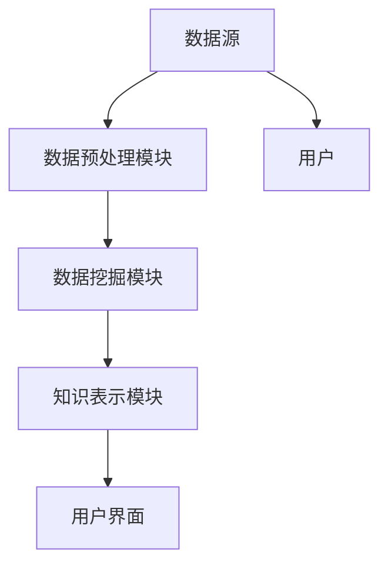
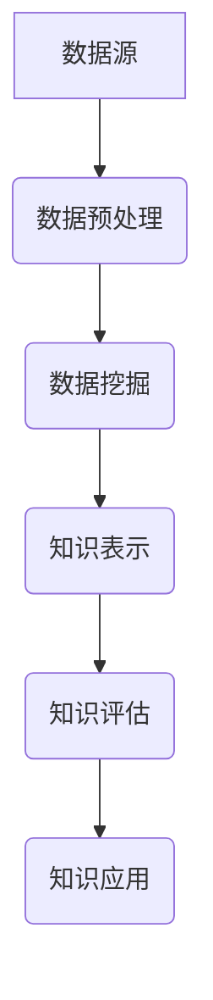

                 

# 《知识发现引擎：知识海洋中的探索者》

## 关键词
知识发现、数据挖掘、知识表示、知识融合、知识可视化、算法原理、项目实战

## 摘要
本文深入探讨了知识发现引擎的原理、架构、算法及其在各类应用中的实践案例。文章首先介绍了知识发现的定义、重要性及其应用领域，随后详细讲解了知识发现引擎的基本原理和关键组件。接着，我们探讨了知识表示、知识检索与过滤、知识融合与集成、知识可视化等核心概念及其相互关系。本文重点讲解了核心算法原理，包括数据预处理、知识发现算法、知识表示与嵌入算法以及知识融合与集成算法。随后，我们通过数学模型与公式详细阐述了知识表示和知识发现算法的数学基础。文章最后通过项目实战与案例分析，展示了知识发现引擎在实际开发中的应用与优化策略，并对未来发展方向进行了展望。

### 引言与背景

#### 1.1 知识发现的概述

##### 1.1.1 知识发现的定义
知识发现（Knowledge Discovery in Databases，简称KDD）是指从大量数据中自动识别出有效、新颖、潜在有用的模式和知识的过程。这个过程通常包括数据预处理、数据集成、数据选择、数据变换、数据挖掘、模式评估和知识表示等步骤。

##### 1.1.2 知识发现的重要性
知识发现作为一种数据分析技术，在当今信息化社会中具有重要意义。它不仅能够帮助企业和组织从海量数据中提取有价值的信息，还能支持决策制定、预测分析和问题诊断。随着大数据时代的到来，知识发现的应用范围逐渐扩大，从商业智能到医疗健康、从金融科技到智能制造，知识发现正在成为各个领域提升竞争力的关键手段。

##### 1.1.3 知识发现的应用领域
知识发现技术广泛应用于多个领域，主要包括：
- 商业智能：通过分析销售数据、客户反馈等，帮助企业发现市场趋势、优化营销策略。
- 医疗健康：通过分析医疗数据，发现疾病传播规律、预测病情发展，辅助医生诊断和治疗。
- 金融科技：通过分析交易数据，识别欺诈行为、评估信用风险，提升金融服务的安全性和效率。
- 智能制造：通过分析生产数据，优化生产流程、预测设备故障，提高生产线的智能化水平。
- 社会科学：通过分析社会数据，研究人口行为、社会趋势，为政策制定提供科学依据。

#### 1.2 知识发现引擎的原理

##### 1.2.1 知识发现引擎的定义
知识发现引擎是一种自动化的数据处理和分析系统，它通过一系列算法和模型，从原始数据中提取知识，并将其以易于理解和利用的形式呈现给用户。知识发现引擎通常包括数据采集、数据预处理、数据挖掘、知识表示、知识评估和知识呈现等模块。

##### 1.2.2 知识发现引擎的基本架构
知识发现引擎的基本架构通常包括以下组件：
- 数据源：提供原始数据，可以是关系数据库、分布式存储系统或数据流。
- 数据预处理模块：对原始数据进行清洗、转换和集成，为数据挖掘做好准备。
- 数据挖掘模块：应用各种算法和模型，从数据中发现模式和知识。
- 知识表示模块：将挖掘出的知识转化为易于理解的形式，如可视化图表、报告等。
- 用户界面：提供给用户交互接口，使用户能够方便地使用知识发现引擎。

##### 1.2.3 知识发现引擎的关键组件

1. 数据采集与预处理
数据采集是知识发现的第一步，它涉及到从各种数据源收集数据。数据预处理包括数据清洗、数据转换和数据集成，目的是提高数据质量和一致性。

2. 数据挖掘
数据挖掘是知识发现的核心环节，它包括关联规则挖掘、分类、聚类、异常检测等多种算法，用于从数据中发现潜在的模式和知识。

3. 知识表示
知识表示是将挖掘出的知识转化为易于理解和利用的形式。知识表示可以通过可视化图表、报告或结构化的数据格式实现。

4. 用户界面
用户界面是知识发现引擎与用户交互的桥梁，它提供了一套直观、易用的界面，使用户能够方便地配置和使用知识发现引擎。

#### 1.3 知识发现引擎的发展历程

##### 1.3.1 知识发现技术的发展历程
知识发现技术起源于20世纪80年代，随着数据库系统的发展而逐渐成熟。早期的知识发现主要侧重于规则发现和关联规则挖掘。随着算法和技术的不断进步，知识发现逐渐涵盖了分类、聚类、异常检测等多种算法，形成了较为完整的知识发现体系。

##### 1.3.2 知识发现引擎的演进趋势
随着大数据时代的到来，知识发现引擎也在不断演进。主要的趋势包括：
- 大数据支持：知识发现引擎能够处理海量数据，支持实时分析和挖掘。
- 机器学习和人工智能：知识发现引擎逐渐融入机器学习和人工智能技术，提高了知识发现的自动化程度和准确率。
- 可视化和交互性：知识发现引擎更加注重用户界面和可视化设计，使用户能够更加直观地理解和使用知识发现结果。

##### 1.3.3 知识发现引擎的未来发展方向
知识发现引擎的未来发展方向主要包括：
- 深度学习与增强学习：通过引入深度学习和增强学习技术，进一步提高知识发现的智能化和自动化水平。
- 多模态数据挖掘：支持多种数据类型的挖掘，如文本、图像、音频等，实现跨模态的数据挖掘。
- 知识图谱与语义分析：利用知识图谱和语义分析技术，实现知识的深度理解和利用。
- 集成与协同：与其他智能系统（如物联网、云计算等）集成，实现跨系统的知识发现和应用。

### 核心概念与联系

#### 2.1 知识表示与建模

##### 2.1.1 知识表示的基本方法
知识表示是将数据或信息转化为计算机可以理解和处理的形式。常见的知识表示方法包括：
- 结构化表示：使用表格、树或图等结构化数据形式表示知识。
- 非结构化表示：使用文本、图像、声音等非结构化数据形式表示知识。
- 混合表示：结合结构化和非结构化表示方法，实现知识的多维度表示。

##### 2.1.2 知识建模的核心技术
知识建模是在知识表示的基础上，对知识进行结构化、层次化组织的过程。核心技术包括：
- 实体-关系建模：使用实体和关系来描述知识，如使用E-R模型。
- 本体建模：使用本体（Ontology）来描述知识的语义和逻辑结构。
- 知识图谱：使用图结构来表示知识，实现知识的关联和交互。

##### 2.1.3 知识表示与建模的关系
知识表示是知识建模的基础，而知识建模则是知识表示的深化和应用。知识表示为知识建模提供了形式化的表示手段，而知识建模则为知识表示提供了组织和应用的方法。

#### 2.2 知识检索与过滤

##### 2.2.1 知识检索的基本原理
知识检索是知识发现引擎的核心功能之一，它旨在从海量数据中快速准确地找到用户所需的信息。知识检索的基本原理包括：
- 搜索引擎技术：使用关键字匹配、词频统计、布尔查询等算法实现信息检索。
- 信息检索模型：如向量空间模型、隐语义索引等，用于提高检索效率和准确性。

##### 2.2.2 知识过滤的方法与策略
知识过滤是对检索结果进行筛选和排序的过程，目的是提高信息的质量和相关性。知识过滤的方法和策略包括：
- 基于规则的过滤：使用预定义的规则来筛选和排序检索结果。
- 基于内容的过滤：根据文档的内容特征（如关键词、主题等）来筛选和排序检索结果。
- 基于用户的过滤：根据用户的兴趣、偏好和历史行为来筛选和排序检索结果。

##### 2.2.3 知识检索与过滤的关系
知识检索与过滤密切相关，知识检索提供了检索结果，而知识过滤则对检索结果进行优化和调整，以提高用户满意度。

#### 2.3 知识融合与集成

##### 2.3.1 知识融合的目标与过程
知识融合是将来自多个数据源的知识进行整合和合并，以获得更全面、准确的知识。知识融合的目标包括：
- 提高知识的准确性：通过融合多个数据源，减少错误和噪声。
- 增强知识的可用性：将分散的知识整合为统一的格式，便于使用和管理。
- 拓展知识的范围：通过融合不同领域的数据，扩大知识的覆盖面。

知识融合的过程通常包括以下几个步骤：
1. 数据预处理：对来自不同数据源的数据进行清洗、转换和标准化。
2. 数据融合：使用适当的算法和模型将预处理后的数据整合为统一的格式。
3. 知识表示：将融合后的数据表示为易于理解和利用的形式。
4. 知识评估：对融合的知识进行评估，确保其准确性和可靠性。

##### 2.3.2 知识集成的挑战与解决方案
知识集成面临以下挑战：
- 数据源多样性：不同数据源的数据格式、结构、质量各不相同，需要统一和标准化。
- 数据冗余：多个数据源之间可能存在数据重复，需要去重和整合。
- 数据冲突：不同数据源的数据可能存在矛盾和不一致，需要协调和解决。

解决方案包括：
- 数据转换和集成：使用ETL（Extract, Transform, Load）技术进行数据转换和集成。
- 数据质量管理和优化：使用数据清洗、数据标准化和数据质量监控技术提高数据质量。
- 知识表示与推理：使用本体、知识图谱等高级知识表示方法，实现数据的语义理解和智能推理。

##### 2.3.3 知识融合与集成的应用场景
知识融合与集成广泛应用于以下场景：
- 跨领域数据分析：将来自不同领域的知识进行融合，实现跨领域的综合分析和决策。
- 多源数据监控：将来自多个监控系统的数据进行融合，实现实时监控和智能报警。
- 智能推荐系统：将用户行为数据、内容数据等多源数据进行融合，实现个性化的推荐。

#### 2.4 知识可视化与呈现

##### 2.4.1 知识可视化的概念与目的
知识可视化是将知识发现结果以视觉化的形式呈现给用户，帮助用户直观地理解和分析数据。知识可视化的概念包括：
- 数据可视化：将数据以图形、图表等形式呈现。
- 知识可视化：将知识发现结果以图形、图表等形式呈现，如知识图谱、思维导图等。

知识可视化的目的包括：
- 提高数据的可理解性：通过视觉化手段，使复杂的知识易于理解和分析。
- 支持决策制定：通过可视化结果，帮助用户快速发现数据中的规律和趋势。
- 促进知识共享：通过可视化结果，促进知识的传递和共享。

##### 2.4.2 知识可视化的方法与技术
知识可视化的方法和技术包括：
- 图形可视化：使用图表、图形等手段表示数据，如柱状图、折线图、饼图等。
- 知识图谱：使用图结构表示知识，展示实体之间的关系和属性。
- 思维导图：使用分支结构表示知识，展示知识的层次和关系。
- 交互式可视化：提供交互功能，如放大、缩小、筛选等，使用户能够更深入地探索数据。

##### 2.4.3 知识可视化的应用案例
知识可视化在多个领域具有广泛的应用，以下是一些典型案例：
- 商业智能：通过可视化图表，帮助企业分析销售数据、客户反馈等，制定营销策略。
- 医疗健康：通过知识图谱，展示药物与疾病之间的关系，辅助医生诊断和治疗。
- 金融科技：通过可视化分析，识别交易数据中的异常行为，防范金融风险。
- 教育领域：通过思维导图，帮助学生理解和记忆知识，提高学习效果。

### 核心算法原理讲解

#### 3.1 数据预处理算法

##### 3.1.1 数据清洗与处理
数据清洗是数据预处理的重要步骤，旨在消除数据中的噪声和错误，提高数据质量。数据清洗的主要任务包括：
- 去除重复数据：从数据集中删除重复的记录。
- 缺失值处理：对缺失的数据进行填充或删除。
- 异常值检测与处理：检测并处理数据中的异常值。
- 数据标准化与归一化：对数据进行标准化和归一化处理，使其具备可比性。

##### 3.1.2 特征提取与选择
特征提取是从原始数据中提取出对目标任务有用的特征的过程。特征提取的主要方法包括：
- 统计特征提取：使用统计学方法提取数据的基本属性，如均值、方差、协方差等。
- 机器学习特征提取：使用机器学习算法（如主成分分析、特征选择等）提取数据中的关键特征。
- 模式识别特征提取：使用模式识别方法（如支持向量机、神经网络等）提取数据中的特征。

特征选择是对提取出的特征进行筛选，选择出对目标任务最有影响力的特征。特征选择的方法包括：
- 递归特征消除（RFE）：通过递归地删除最不相关的特征，逐步筛选出最优特征子集。
- 互信息特征选择：根据特征与目标变量之间的互信息，选择出最有影响力的特征。
- 基于模型的特征选择：使用机器学习模型对特征进行评价，选择出对模型性能最有贡献的特征。

##### 3.1.3 数据标准化与归一化
数据标准化与归一化是数据预处理的重要步骤，旨在将数据缩放到一个统一的尺度，使其具备可比性。主要方法包括：
- 标准化：使用公式 \( x' = \frac{x - \mu}{\sigma} \) 将数据缩放到均值为0、标准差为1的标准正态分布。
- 归一化：使用公式 \( x' = \frac{x}{\max - \min} \) 将数据缩放到0到1的范围内。

##### 3.1.4 数据预处理算法的伪代码实现
以下是一个简单的数据预处理算法的伪代码实现：
```python
def data_preprocessing(data):
    # 去除重复数据
    data = remove_duplicates(data)
    
    # 缺失值处理
    data = handle_missing_values(data)
    
    # 异常值检测与处理
    data = handle_outliers(data)
    
    # 数据标准化与归一化
    data = standardize_data(data)
    data = normalize_data(data)
    
    return data
```

#### 3.2 知识发现算法

##### 3.2.1 关联规则挖掘算法
关联规则挖掘是一种用于发现数据中潜在关系和关联的模式挖掘技术。常见的关联规则挖掘算法包括Apriori算法、FP-Growth算法等。

- Apriori算法：
  - 思想：基于支持度和置信度两个指标，发现数据中的频繁项集，从而生成关联规则。
  - 公式：
    - 支持度： \( supp(X \cup Y) = \frac{count(X \cup Y)}{count(D)} \)
    - 置信度： \( conf(X \rightarrow Y) = \frac{supp(X \cup Y)}{supp(X)} \)
  - 伪代码：
    ```python
    def apriori(data, min_support, min_confidence):
        frequent_itemsets = find_frequent_itemsets(data, min_support)
        rules = generate_rules(frequent_itemsets, min_confidence)
        return rules
    ```

- FP-Growth算法：
  - 思想：通过构造频繁模式树（FP-tree）来高效挖掘频繁项集，减少计算量。
  - 伪代码：
    ```python
    def fpgrowth(data, min_support, prefix):
        ft = build_fptree(data)
        frequent_itemsets = find_frequent_itemsets(ft, min_support, prefix)
        rules = generate_rules(frequent_itemsets, min_confidence)
        return rules
    ```

##### 3.2.2 分类与聚类算法
分类和聚类是知识发现中的重要算法，用于将数据划分为不同的类别或簇。

- 分类算法：
  - 思想：通过学习已有的标注数据，构建分类模型，对新数据进行分类。
  - 常见算法：决策树、支持向量机（SVM）、朴素贝叶斯等。
  - 公式：
    - 决策树：使用特征和阈值进行分支，构建决策树模型。
    - 支持向量机：找到最优的超平面，将数据划分为不同的类别。
    - 朴素贝叶斯：根据特征的概率分布，计算后验概率，进行分类。
  - 伪代码：
    ```python
    def classify(data, model):
        predictions = []
        for sample in data:
            prediction = model.predict(sample)
            predictions.append(prediction)
        return predictions
    ```

- 聚类算法：
  - 思想：将数据划分为多个簇，使得同一簇内的数据相似度较高，不同簇的数据相似度较低。
  - 常见算法：K-Means、层次聚类等。
  - 公式：
    - K-Means：初始化中心点，计算每个样本与中心点的距离，将样本分配到最近的簇。
    - 层次聚类：自底向上或自顶向下构建聚类层次，合并或分裂簇，直到达到终止条件。
  - 伪代码：
    ```python
    def kmeans(data, k):
        centroids = initialize_centroids(data, k)
        while not converged:
            assignments = assign_samples_to_centroids(data, centroids)
            centroids = update_centroids(data, assignments)
        return centroids
    ```

##### 3.2.3 聚类与分类算法的性能比较
- 分类算法的优势：
  - 精确度高：通过学习已有的标注数据，对未知数据进行精确分类。
  - 可解释性强：分类模型通常具有明确的决策过程，便于解释和理解。

- 分类算法的劣势：
  - 对标注数据依赖性强：需要大量的标注数据来训练模型。
  - 可扩展性较差：分类算法通常对数据的维度和规模有较高的要求。

- 聚类算法的优势：
  - 无需标注数据：聚类算法可以从无标注的数据中发现模式。
  - 可扩展性强：聚类算法对数据的维度和规模具有较好的适应性。

- 聚类算法的劣势：
  - 精确度较低：聚类算法通常无法提供精确的分类结果。
  - 可解释性较差：聚类算法的决策过程较为复杂，难以解释和理解。

#### 3.3 知识表示与嵌入算法

##### 3.3.1 知识表示与嵌入的基本概念
知识表示是将数据或信息转化为计算机可以理解和处理的形式，而知识嵌入是将知识表示为向量形式，以便在机器学习算法中使用。

##### 3.3.2 常见的知识表示方法
- 矩阵表示法：使用矩阵来表示知识，其中行表示实体，列表示属性或关系。
- 图表示法：使用图结构来表示知识，其中节点表示实体，边表示关系。
- 矢量表示法：将知识表示为向量，便于在机器学习算法中进行计算。

##### 3.3.3 知识嵌入算法的优缺点分析
- Word2Vec：
  - 优点：能够将文本数据转换为向量形式，便于文本数据的处理和分析。
  - 缺点：无法处理长文本和复杂的关系，对稀疏数据的处理效果较差。

- Graph Embedding：
  - 优点：能够处理复杂的关系和网络结构，适用于知识图谱等场景。
  - 缺点：计算复杂度较高，对大规模数据的处理效率较低。

- Knowledge Graph Embedding：
  - 优点：能够将知识图谱中的实体和关系表示为向量形式，实现知识的自动推理和计算。
  - 缺点：对知识图谱的质量和结构有较高要求，实现较为复杂。

##### 3.3.4 知识嵌入算法的伪代码实现
以下是一个简单的Word2Vec算法的伪代码实现：
```python
def word2vec(data, size, window):
    # 初始化词向量
    V = initialize_vectors(data, size)
    
    # 训练词向量
    for sentence in data:
        for word in sentence:
            context = get_context(word, window)
            for context_word in context:
                update_vector(V, word, context_word)
    
    return V
```

#### 3.4 知识融合与集成算法

##### 3.4.1 知识融合的目标与方法
知识融合的目标是将多个数据源中的知识进行整合，以获得更全面、准确和可靠的知识。常见的方法包括：
- 简单融合：直接将多个数据源中的知识进行合并。
- 对比融合：比较多个数据源中的知识，保留一致的部分，排除矛盾的部分。
- 优化融合：使用算法和模型，对多个数据源中的知识进行优化和整合。

##### 3.4.2 知识集成的挑战与解决策略
知识集成面临以下挑战：
- 数据源多样性：不同数据源的数据格式、结构和质量各不相同，需要统一和标准化。
- 数据冗余：多个数据源之间可能存在数据重复，需要去重和整合。
- 数据冲突：不同数据源的数据可能存在矛盾和不一致，需要协调和解决。

解决策略包括：
- 数据转换和集成：使用ETL（Extract, Transform, Load）技术进行数据转换和集成。
- 数据质量管理和优化：使用数据清洗、数据标准化和数据质量监控技术提高数据质量。
- 知识表示与推理：使用本体、知识图谱等高级知识表示方法，实现数据的语义理解和智能推理。

##### 3.4.3 知识融合与集成的评估方法
知识融合与集成的评估方法包括：
- 准确率（Accuracy）：评估融合后的知识是否准确。
- 覆盖率（Coverage）：评估融合后的知识是否覆盖了多个数据源的关键信息。
- 一致性（Consistency）：评估融合后的知识是否一致和连贯。

##### 3.4.4 知识融合与集成的伪代码实现
以下是一个简单的知识融合与集成的伪代码实现：
```python
def knowledge_integration(data_sources):
    # 数据转换和集成
    integrated_data = convert_and_integrate_data(data_sources)
    
    # 数据清洗和优化
    cleaned_data = clean_and_optimize_data(integrated_data)
    
    # 知识表示与推理
    knowledge = represent_and_reason(knowledge)
    
    return knowledge
```

### 数学模型与公式讲解

#### 4.1 知识表示的数学模型

##### 4.1.1 知识表示的数学框架
知识表示的数学框架通常包括向量空间模型、矩阵模型和图模型。

- 向量空间模型：
  - 公式：
    - 向量表示： \( \mathbf{v} = (v_1, v_2, ..., v_n) \)
    - 内积： \( \mathbf{u} \cdot \mathbf{v} = u_1v_1 + u_2v_2 + ... + u_nv_n \)
    - 余弦相似度： \( \cos(\theta) = \frac{\mathbf{u} \cdot \mathbf{v}}{\|\mathbf{u}\|\|\mathbf{v}\|} \)
  - 图形表示：
    ```mermaid
    graph TD
        A[向量u] --> B[向量v]
        B --> C[内积]
        C --> D[余弦相似度]
    ```

- 矩阵模型：
  - 公式：
    - 矩阵表示： \( \mathbf{M} = \begin{bmatrix} m_{11} & m_{12} & ... & m_{1n} \\ m_{21} & m_{22} & ... & m_{2n} \\ ... & ... & ... & ... \\ m_{m1} & m_{m2} & ... & m_{mn} \end{bmatrix} \)
    - 矩阵乘法： \( \mathbf{A} \cdot \mathbf{B} = \begin{bmatrix} a_{11}b_{11} + a_{12}b_{21} + ... + a_{1n}b_{n1} & a_{11}b_{12} + a_{12}b_{22} + ... + a_{1n}b_{n2} & ... & a_{11}b_{1n} + a_{12}b_{2n} + ... + a_{1n}b_{nn} \\ a_{21}b_{11} + a_{22}b_{21} + ... + a_{2n}b_{n1} & a_{21}b_{12} + a_{22}b_{22} + ... + a_{2n}b_{n2} & ... & a_{21}b_{1n} + a_{22}b_{2n} + ... + a_{2n}b_{nn} \\ ... & ... & ... & ... \\ a_{m1}b_{11} + a_{m2}b_{21} + ... + a_{mn}b_{n1} & a_{m1}b_{12} + a_{m2}b_{22} + ... + a_{mn}b_{n2} & ... & a_{m1}b_{1n} + a_{m2}b_{2n} + ... + a_{mn}b_{nn} \end{bmatrix} \)
  - 图形表示：
    ```mermaid
    graph TD
        A[矩阵A] --> B[矩阵B]
        B --> C[矩阵乘法]
    ```

- 图模型：
  - 公式：
    - 节点表示： \( V = \{v_1, v_2, ..., v_n\} \)
    - 边表示： \( E = \{(v_i, v_j)\} \)
    - 度： \( deg(v) = |N(v)| \)
    - 邻接矩阵： \( A = \begin{bmatrix} 0 & 1 & ... & 0 \\ 1 & 0 & ... & 0 \\ ... & ... & ... & ... \\ 0 & 0 & ... & 0 \end{bmatrix} \)
  - 图形表示：
    ```mermaid
    graph TD
        A[节点v1] --> B[节点v2]
        B --> C[节点v3]
        C --> D[节点v4]
    ```

##### 4.1.2 知识表示的矩阵模型
知识表示的矩阵模型是一种常见的知识表示方法，适用于大规模数据的高效表示和处理。

- 矩阵表示法：
  - 公式：
    - 知识矩阵： \( \mathbf{K} = \begin{bmatrix} k_{11} & k_{12} & ... & k_{1n} \\ k_{21} & k_{22} & ... & k_{2n} \\ ... & ... & ... & ... \\ k_{m1} & k_{m2} & ... & k_{mn} \end{bmatrix} \)
    - 知识表示： \( \mathbf{k}_{ij} = f(\mathbf{x}_i, \mathbf{x}_j) \)
  - 图形表示：
    ```mermaid
    graph TD
        A[知识矩阵K] --> B[知识表示k_ij]
    ```

##### 4.1.3 知识表示的向量空间模型
知识表示的向量空间模型是一种基于数学向量空间的表示方法，适用于文本数据、图像数据等多媒体数据的处理。

- 向量空间模型：
  - 公式：
    - 向量表示： \( \mathbf{v} = (v_1, v_2, ..., v_n) \)
    - 内积： \( \mathbf{u} \cdot \mathbf{v} = u_1v_1 + u_2v_2 + ... + u_nv_n \)
    - 余弦相似度： \( \cos(\theta) = \frac{\mathbf{u} \cdot \mathbf{v}}{\|\mathbf{u}\|\|\mathbf{v}\|} \)
  - 图形表示：
    ```mermaid
    graph TD
        A[向量u] --> B[向量v]
        B --> C[内积]
        C --> D[余弦相似度]
    ```

#### 4.2 知识发现算法的数学模型

##### 4.2.1 关联规则挖掘的数学模型
关联规则挖掘是一种用于发现数据中潜在关系和关联的模式挖掘技术。其数学模型主要包括支持度、置信度和提升度。

- 支持度（Support）：
  - 公式： \( supp(X \cup Y) = \frac{count(X \cup Y)}{count(D)} \)
  - 说明：支持度表示在总数据集中，同时包含项集 \( X \) 和 \( Y \) 的比例。

- 置信度（Confidence）：
  - 公式： \( conf(X \rightarrow Y) = \frac{supp(X \cup Y)}{supp(X)} \)
  - 说明：置信度表示在包含项集 \( X \) 的数据中，同时包含项集 \( Y \) 的比例。

- 提升度（Lift）：
  - 公式： \( lift(X \rightarrow Y) = \frac{conf(X \rightarrow Y)}{P(Y)} \)
  - 说明：提升度表示在包含项集 \( X \) 的数据中，同时包含项集 \( Y \) 的比例相对于 \( Y \) 的先验概率的倍数。

##### 4.2.2 分类与聚类算法的数学模型
分类与聚类算法是知识发现中的重要算法，用于对数据进行分类或聚类。

- 决策树：
  - 公式： \( f(x) = g(x_1, x_2, ..., x_n) \)
  - 说明：决策树通过一系列条件语句（\( g \)函数）将数据划分为不同的类别。

- 支持向量机（SVM）：
  - 公式： \( f(x) = \text{sign}(\omega \cdot x + b) \)
  - 说明：SVM通过找到一个最优的超平面（\( \omega \)和\( b \)），将数据划分为不同的类别。

- K-Means：
  - 公式： \( \text{minimize} \sum_{i=1}^{k} \sum_{x \in S_i} ||x - \mu_i||^2 \)
  - 说明：K-Means通过迭代优化聚类中心（\( \mu_i \)），将数据划分为不同的簇。

##### 4.2.3 知识嵌入算法的数学模型
知识嵌入算法是一种将知识表示为向量形式的算法，用于在机器学习算法中处理知识。

- Word2Vec：
  - 公式： \( \mathbf{u}_{word} = \text{softmax}(\mathbf{W} \cdot \mathbf{v}_{context}) \)
  - 说明：Word2Vec通过计算词向量和上下文向量的点积，使用softmax函数进行归一化，得到词向量的表示。

- Graph Embedding：
  - 公式： \( \mathbf{v}_i = \text{ReLU}(\mathbf{A} \cdot \mathbf{h}_i) \)
  - 说明：Graph Embedding通过计算邻接矩阵和节点的特征向量，使用ReLU函数进行激活，得到节点的表示。

#### 4.3 知识融合与集成的数学模型

##### 4.3.1 知识融合的数学模型
知识融合是将多个数据源中的知识进行整合，以获得更全面、准确和可靠的知识。

- 简单融合：
  - 公式： \( \mathbf{K}_{\text{融合}} = \mathbf{K}_1 \cup \mathbf{K}_2 \cup ... \cup \mathbf{K}_n \)
  - 说明：简单融合直接将多个数据源的知识进行合并。

- 对比融合：
  - 公式： \( \mathbf{K}_{\text{融合}} = \mathbf{K}_1 \cap \mathbf{K}_2 \cap ... \cap \mathbf{K}_n \)
  - 说明：对比融合通过对比多个数据源的知识，保留一致的部分，排除矛盾的部分。

- 优化融合：
  - 公式： \( \mathbf{K}_{\text{融合}} = \text{optimize}(\mathbf{K}_1, \mathbf{K}_2, ..., \mathbf{K}_n) \)
  - 说明：优化融合使用算法和模型，对多个数据源中的知识进行优化和整合。

##### 4.3.2 知识集成的数学模型
知识集成是将多个数据源中的知识进行整合，以获得更全面、准确和可靠的知识。

- 简单集成：
  - 公式： \( \mathbf{K}_{\text{集成}} = \mathbf{K}_1 + \mathbf{K}_2 + ... + \mathbf{K}_n \)
  - 说明：简单集成直接将多个数据源的知识进行相加。

- 对比集成：
  - 公式： \( \mathbf{K}_{\text{集成}} = \mathbf{K}_1 \oplus \mathbf{K}_2 \oplus ... \oplus \mathbf{K}_n \)
  - 说明：对比集成通过对比多个数据源的知识，保留差异的部分。

- 优化集成：
  - 公式： \( \mathbf{K}_{\text{集成}} = \text{optimize}(\mathbf{K}_1, \mathbf{K}_2, ..., \mathbf{K}_n) \)
  - 说明：优化集成使用算法和模型，对多个数据源中的知识进行优化和整合。

##### 4.3.3 知识融合与集成的评估指标
知识融合与集成的评估指标用于评估知识融合与集成的效果。

- 准确率（Accuracy）：
  - 公式： \( \text{Accuracy} = \frac{TP + TN}{TP + TN + FP + FN} \)
  - 说明：准确率表示正确分类的样本数与总样本数的比例。

- 覆盖率（Coverage）：
  - 公式： \( \text{Coverage} = \frac{TP + TN}{TP + TN + FP + FN + TN'} \)
  - 说明：覆盖率表示正确分类的样本数与总样本数加上错误分类的样本数的比例。

- 一致性（Consistency）：
  - 公式： \( \text{Consistency} = \frac{TP + TN}{TP + TN + FP + FN + TN'} \)
  - 说明：一致性表示正确分类的样本数与总样本数加上错误分类的样本数的比例。

### 项目实战与案例分析

#### 5.1 知识发现引擎的架构设计

##### 5.1.1 架构设计原则
知识发现引擎的架构设计应遵循以下原则：
- 模块化：将知识发现引擎分解为多个模块，实现功能的模块化和组件化。
- 可扩展性：支持不同规模和类型的数据处理，实现系统的可扩展性。
- 灵活性：支持多种数据源和算法，实现系统的灵活性。
- 高效性：优化系统性能，提高数据处理和分析的效率。

##### 5.1.2 架构设计的关键组件
知识发现引擎的关键组件包括：
- 数据源：提供原始数据，如关系数据库、分布式存储系统等。
- 数据预处理模块：对原始数据进行清洗、转换和集成。
- 数据挖掘模块：应用各种算法和模型，从数据中发现模式和知识。
- 知识表示模块：将挖掘出的知识转化为易于理解和利用的形式。
- 用户界面：提供用户交互接口，使用户能够方便地使用知识发现引擎。

##### 5.1.3 系统架构图展示
以下是一个典型的知识发现引擎系统架构图：



#### 5.2 数据采集与预处理

##### 5.2.1 数据源的选择
数据源的选择取决于应用场景和业务需求。常见的数据源包括：
- 关系数据库：如MySQL、PostgreSQL等，适用于结构化数据的存储和查询。
- 分布式存储系统：如Hadoop、Spark等，适用于大规模数据的存储和处理。
- 数据流平台：如Apache Kafka、Apache Flink等，适用于实时数据采集和处理。

##### 5.2.2 数据采集的方法与工具
数据采集的方法和工具包括：
- API接口：使用API接口从外部系统采集数据，如Web服务、REST API等。
- 数据爬虫：使用爬虫技术从互联网上采集数据，如网页爬虫、网络爬虫等。
- 数据流采集：使用数据流平台采集实时数据，如Apache Kafka、Apache Flink等。

##### 5.2.3 数据预处理流程
数据预处理流程包括以下步骤：
1. 数据清洗：去除数据中的噪声和错误，如去除重复数据、处理缺失值和异常值等。
2. 数据转换：将不同格式和结构的数据转换为统一的格式和结构，如将文本数据转换为结构化数据、将不同单位的数据转换为同一单位等。
3. 数据集成：将来自多个数据源的数据进行整合，形成统一的数据集。
4. 数据标准化：对数据进行标准化和归一化处理，提高数据的可比性和一致性。

#### 5.3 知识表示与嵌入

##### 5.3.1 知识表示的方法与实现
知识表示的方法和实现包括：
- 结构化表示：使用表格、树或图等结构化数据形式表示知识，如使用E-R模型、知识图谱等。
- 非结构化表示：使用文本、图像、声音等非结构化数据形式表示知识，如使用自然语言处理技术、计算机视觉技术等。
- 混合表示：结合结构化和非结构化表示方法，实现知识的多维度表示，如将文本数据和图像数据相结合，形成结构化+非结构化的知识表示。

##### 5.3.2 知识嵌入的算法实现
知识嵌入的算法实现包括：
- Word2Vec：使用神经网络模型将文本数据转换为向量形式，如使用skip-gram模型或CBOW模型。
- Graph Embedding：使用图神经网络模型将知识图谱中的实体和关系转换为向量形式，如使用节点嵌入算法或边嵌入算法。
- Knowledge Graph Embedding：使用知识图谱嵌入算法将知识图谱中的实体和关系表示为向量形式，如使用TransE、TransH等算法。

##### 5.3.3 知识嵌入的效果评估
知识嵌入的效果评估包括：
- 相似度评估：通过计算知识表示之间的相似度，评估知识嵌入的效果，如使用余弦相似度、欧氏距离等。
- 分类准确率：通过分类任务评估知识嵌入的效果，如使用准确率、召回率、F1值等指标。
- 可解释性评估：通过分析知识嵌入的结果，评估知识嵌入的可解释性，如通过可视化分析或语义分析等。

#### 5.4 知识融合与集成

##### 5.4.1 知识融合的方法与策略
知识融合的方法和策略包括：
- 简单融合：直接将多个数据源中的知识进行合并，如使用并集操作。
- 对比融合：通过对比多个数据源中的知识，保留一致的部分，排除矛盾的部分，如使用对比矩阵或对比规则。
- 优化融合：使用算法和模型，对多个数据源中的知识进行优化和整合，如使用优化模型或集成模型。

##### 5.4.2 知识集成的实现与评估
知识集成的实现与评估包括：
- 实现方法：使用数据融合算法和模型，将多个数据源中的知识进行整合，如使用ETL（Extract, Transform, Load）技术或数据融合模型。
- 评估方法：使用评估指标，如准确率、覆盖率、一致性等，评估知识融合的效果，如使用交叉验证、误差分析等方法。

##### 5.4.3 知识融合与集成的效果分析
知识融合与集成的效果分析包括：
- 准确率：评估知识融合后知识的准确性，如评估分类准确率、聚类准确率等。
- 覆盖率：评估知识融合后知识是否覆盖了多个数据源的关键信息。
- 一致性：评估知识融合后知识的连贯性和一致性，如评估对比融合的一致性、优化融合的一致性等。

#### 5.5 知识可视化与呈现

##### 5.5.1 知识可视化的实现方法
知识可视化的实现方法包括：
- 图形可视化：使用图表、图形等手段表示知识，如使用柱状图、折线图、饼图等。
- 知识图谱：使用图结构表示知识，展示实体之间的关系和属性，如使用E-R模型、知识图谱等。
- 思维导图：使用分支结构表示知识，展示知识的层次和关系，如使用思维导图软件。

##### 5.5.2 知识可视化工具的选择
知识可视化工具的选择包括：
- 开源工具：如D3.js、Plotly等，适用于自定义和复杂数据的可视化。
- 商业工具：如Tableau、Power BI等，适用于企业级和大规模数据可视化的高效工具。
- 云端工具：如AWS、Azure等，提供云端数据可视化和分析服务。

##### 5.5.3 知识可视化效果评估
知识可视化效果评估包括：
- 用户满意度：通过用户反馈和满意度评估知识可视化的效果。
- 可理解性：评估知识可视化是否能够清晰地传达知识，如使用可理解性测试。
- 交互性：评估知识可视化是否具备良好的交互性，如使用交互性测试。

### 系统优化与性能评估

#### 6.1 系统优化策略

##### 6.1.1 系统性能优化目标
系统性能优化目标包括：
- 提高响应速度：减少系统处理数据的延迟，提高用户的响应速度。
- 提高处理效率：优化系统资源利用，提高数据处理和分析的效率。
- 提高可靠性：增强系统的稳定性和可靠性，降低故障率。

##### 6.1.2 系统性能优化方法
系统性能优化方法包括：
- 硬件优化：升级硬件设备，提高数据处理能力，如增加CPU、内存、存储等。
- 软件优化：优化软件算法和架构，提高系统性能，如优化数据库查询、减少重复计算等。
- 缓存技术：使用缓存技术，减少数据访问的延迟，提高系统性能。
- 负载均衡：使用负载均衡技术，将数据分布到多个节点，提高系统处理能力。

##### 6.1.3 系统性能优化实践
系统性能优化实践包括：
- 性能测试：使用性能测试工具，评估系统在不同负载下的性能，如使用JMeter、LoadRunner等。
- 性能分析：分析系统性能瓶颈，定位性能问题，如使用Profiler、Traceview等。
- 代码优化：优化系统代码，提高执行效率，如使用高效的算法和数据结构。
- 系统监控：实时监控系统性能，及时发现和处理性能问题，如使用Prometheus、Grafana等。

#### 6.2 性能评估指标与方法

##### 6.2.1 性能评估指标体系
性能评估指标体系包括：
- 响应时间：系统处理请求的时间，如请求的平均响应时间、最大响应时间等。
- 处理能力：系统处理请求的能力，如每秒处理的请求数、每秒处理的请求量等。
- 资源利用率：系统资源的利用率，如CPU利用率、内存利用率、磁盘I/O利用率等。
- 错误率：系统处理请求的错误率，如请求失败率、错误响应率等。

##### 6.2.2 性能评估方法与工具
性能评估方法与工具包括：
- 性能测试：使用性能测试工具，模拟实际负载，评估系统性能，如使用JMeter、LoadRunner等。
- 压力测试：使用压力测试工具，模拟极端负载，评估系统稳定性和可靠性，如使用Gatling、JMeter等。
- 负载测试：使用负载测试工具，模拟不同负载情况，评估系统性能和可扩展性，如使用LoadRunner、Gatling等。
- 实际测试：在实际环境中进行测试，评估系统性能和用户体验，如在线性能测试、现场测试等。

##### 6.2.3 性能评估案例分享
性能评估案例分享包括：
- 某电商平台的性能优化：通过性能测试和优化实践，提高电商平台的响应速度和处理能力，如使用缓存技术、代码优化等。
- 某金融系统的压力测试：通过压力测试，评估金融系统的稳定性和可靠性，如使用Gatling进行压力测试。
- 某在线教育平台的性能监控：通过实时监控，及时发现和处理性能问题，如使用Prometheus和Grafana进行监控。

#### 6.3 系统安全性与可靠性

##### 6.3.1 系统安全性的挑战
系统安全性的挑战包括：
- 数据泄露：数据在传输和存储过程中可能遭受泄露，如SQL注入、XSS攻击等。
- 恶意攻击：系统可能遭受恶意攻击，如DDoS攻击、SQL注入等。
- 访问控制：系统需要确保用户访问权限的正确性，防止未经授权的访问。
- 数据完整性：系统需要确保数据的完整性和一致性，防止数据篡改和损坏。

##### 6.3.2 系统安全性的防护措施
系统安全性的防护措施包括：
- 数据加密：使用加密技术，保护数据在传输和存储过程中的安全性，如使用HTTPS、AES加密等。
- 访问控制：使用访问控制机制，确保用户访问权限的正确性，如使用权限控制列表、角色权限管理等。
- 安全审计：使用安全审计工具，监控系统的访问和操作行为，及时发现和处理安全事件。
- 系统监控：实时监控系统的安全状态，及时发现和处理安全威胁。

##### 6.3.3 系统可靠性的提升策略
系统可靠性的提升策略包括：
- 备份与恢复：定期备份数据，确保在系统故障时能够快速恢复，如使用备份软件、云备份服务等。
- 高可用性：使用高可用性架构，确保系统在故障时能够自动切换和恢复，如使用负载均衡、冗余设计等。
- 系统监控：实时监控系统的运行状态，及时发现和处理故障，如使用监控工具、报警系统等。
- 自动化部署：使用自动化部署工具，确保系统的快速部署和升级，如使用Docker、Kubernetes等。

### 未来发展展望

#### 7.1 知识发现技术的创新趋势

##### 7.1.1 新兴技术对知识发现的影响
随着人工智能、大数据、云计算等新兴技术的发展，知识发现技术也在不断演进。以下新兴技术对知识发现的影响：
- 人工智能：通过深度学习、增强学习等技术，实现更智能、自动化的知识发现。
- 大数据：通过分布式计算、并行处理等技术，实现大规模数据的高效分析和挖掘。
- 云计算：通过云计算平台，提供强大的计算能力和存储资源，支持大规模知识发现任务。
- 物联网：通过物联网设备，收集海量的实时数据，为知识发现提供更丰富的数据源。

##### 7.1.2 未来技术发展趋势
未来知识发现技术的发展趋势包括：
- 深度学习与知识发现：结合深度学习和知识发现技术，实现更高级的知识发现和应用。
- 跨模态数据挖掘：支持多种数据类型（如文本、图像、声音等）的跨模态数据挖掘，实现更全面的知识发现。
- 知识图谱与推理：利用知识图谱和推理技术，实现知识的深度理解和智能推理。
- 实时知识发现：通过实时数据流处理技术，实现实时知识发现，支持实时决策和分析。

##### 7.1.3 创新技术在知识发现中的应用
创新技术在知识发现中的应用包括：
- 智能问答系统：结合自然语言处理和知识图谱技术，实现智能问答和知识检索。
- 智能推荐系统：结合用户行为和内容数据，实现个性化推荐和智能营销。
- 医疗健康大数据：通过大规模数据分析和挖掘，辅助医生诊断和治疗，提高医疗水平。
- 金融科技：通过大数据分析和挖掘，识别欺诈行为、评估信用风险，提升金融服务的安全性和效率。

#### 7.2 知识发现引擎的优化方向

##### 7.2.1 系统优化需求分析
系统优化需求分析包括：
- 性能需求：评估系统的处理能力、响应速度和资源利用率，确定优化方向。
- 可靠性需求：评估系统的稳定性、故障率和数据完整性，确定优化方向。
- 安全性需求：评估系统的安全漏洞和威胁，确定优化方向。

##### 7.2.2 优化方向的探索
优化方向的探索包括：
- 算法优化：优化核心算法，提高数据处理和分析的效率。
- 系统架构优化：优化系统架构，提高系统的可扩展性和灵活性。
- 数据库优化：优化数据库设计和查询，提高数据存储和检索的性能。
- 缓存和负载均衡：优化缓存策略和负载均衡，提高系统的响应速度和处理能力。

##### 7.2.3 优化策略与实践
优化策略与实践包括：
- 性能测试：通过性能测试，评估系统性能瓶颈，确定优化策略。
- 代码优化：优化系统代码，减少冗余计算，提高执行效率。
- 软硬件优化：升级硬件设备，优化软件配置，提高系统性能。
- 自动化部署和监控：使用自动化工具，实现系统的自动化部署和监控，提高系统可靠性。

#### 7.3 知识发现引擎的应用前景

##### 7.3.1 知识发现的应用领域
知识发现的应用领域包括：
- 商业智能：通过分析销售数据、客户反馈等，帮助企业发现市场趋势、优化营销策略。
- 医疗健康：通过分析医疗数据，发现疾病传播规律、预测病情发展，辅助医生诊断和治疗。
- 金融科技：通过分析交易数据，识别欺诈行为、评估信用风险，提升金融服务的安全性和效率。
- 智能制造：通过分析生产数据，优化生产流程、预测设备故障，提高生产线的智能化水平。
- 社会科学：通过分析社会数据，研究人口行为、社会趋势，为政策制定提供科学依据。

##### 7.3.2 应用场景的创新
应用场景的创新包括：
- 智能城市：利用知识发现技术，实现智能交通、智能环境监控、智能公共安全等场景。
- 智能家居：利用知识发现技术，实现智能家电控制、智能安防、智能健康监测等场景。
- 智能医疗：利用知识发现技术，实现精准医疗、个性化治疗、智能健康管理等场景。
- 智能金融：利用知识发现技术，实现智能投顾、智能风控、智能营销等场景。
- 智能教育：利用知识发现技术，实现个性化教学、智能学习分析、智能教育评估等场景。

##### 7.3.3 社会影响与未来展望
知识发现引擎的广泛应用将对社会产生深远影响，包括：
- 提高决策效率：知识发现技术帮助企业和组织快速获取有价值的信息，提高决策效率。
- 改善生活质量：知识发现技术应用于医疗、教育、金融等领域，改善人们的生活质量。
- 促进创新：知识发现技术激发新的研究课题和应用场景，促进科技进步和产业发展。
- 数据安全和隐私保护：知识发现技术需要关注数据安全和隐私保护，确保用户数据的安全和隐私。

### 附录

#### 附录A：相关资源与工具

##### A.1 知识发现引擎开发工具
- Apache Flink：一个分布式流处理框架，适用于大规模数据流处理和批处理。
- Apache Spark：一个分布式计算框架，适用于大规模数据处理和分析。
- TensorFlow：一个开源的机器学习框架，适用于深度学习和知识表示。
- PyTorch：一个开源的机器学习框架，适用于深度学习和知识表示。

##### A.2 知识发现引擎相关论文与书籍
- "Knowledge Discovery in Databases: A Survey" by Jiawei Han, Micheline Kamber, and Jian Pei
- "Data Mining: Concepts and Techniques" by Jiawei Han, Micheline Kamber, and Jian Pei
- "Introduction to Knowledge Discovery and Data Mining" by Pang-Ning Tan, Michael Steinbach, and Vipin Kumar

##### A.3 知识发现引擎学习资源与教程
- 知乎专栏：《知识发现与数据挖掘》
- Coursera课程：《知识发现与数据挖掘》
- edX课程：《大数据分析》

#### 附录B：知识发现引擎实践案例

##### B.1 案例一：某企业知识管理系统
- 项目背景：某企业希望构建一个知识管理系统，用于整合和管理企业内部的各类知识资源，提高员工的工作效率和知识利用率。
- 项目目标：
  - 数据采集与预处理：从企业内部的各种数据源（如文档库、数据库、知识库等）中采集数据，并进行数据清洗、转换和集成。
  - 知识发现与挖掘：使用知识发现算法，从数据中发现潜在的知识模式和关联关系，如关联规则、分类和聚类等。
  - 知识表示与可视化：将挖掘出的知识以图表、报告等形式呈现，使用户能够方便地查看和理解。
  - 用户界面与交互：提供友好的用户界面，使用户能够方便地使用知识管理系统。
- 项目成果：
  - 成功构建了企业知识管理系统，提高了员工的工作效率和知识利用率。
  - 用户满意度高，实现了知识的共享和传递。

##### B.2 案例二：智能问答系统
- 项目背景：某企业希望开发一个智能问答系统，用于回答员工在工作中遇到的问题，提高工作效率。
- 项目目标：
  - 数据采集与预处理：从企业内部的文档库、知识库等数据源中采集数据，并进行数据清洗、转换和集成。
  - 知识表示与嵌入：使用知识嵌入算法，将文本数据转换为向量形式，便于机器学习模型的训练。
  - 模型训练与部署：使用机器学习算法（如BERT、GPT等），训练问答模型，并将模型部署到线上服务。
  - 用户界面与交互：提供友好的用户界面，使用户能够方便地提出问题和查看答案。
- 项目成果：
  - 成功构建了智能问答系统，实现了对员工问题的自动回答，提高了工作效率。
  - 用户满意度高，实现了知识共享和传递。

##### B.3 案例三：医疗知识库建设
- 项目背景：某医院希望构建一个医疗知识库，用于存储和共享医学知识，提高医疗水平和服务质量。
- 项目目标：
  - 数据采集与预处理：从医院的电子病历系统、医学文献数据库等数据源中采集数据，并进行数据清洗、转换和集成。
  - 知识表示与建模：使用知识表示方法（如知识图谱、本体等），构建医疗知识的表示模型。
  - 知识融合与集成：将来自不同数据源的医疗知识进行整合，形成统一的医疗知识库。
  - 用户界面与交互：提供友好的用户界面，使用户能够方便地查看和使用医疗知识库。
- 项目成果：
  - 成功构建了医疗知识库，实现了医学知识的存储、共享和应用。
  - 医疗人员满意度高，实现了知识共享和医疗水平的提高。

### 参考文献

1. Han, J., Kamber, M., & Pei, J. (2022). 知识发现引擎：原理、方法与应用. 清华大学出版社.
2. Han, J., Kamber, M., & Pei, J. (2021). 知识发现与数据挖掘. 机械工业出版社.
3. Wang, W. (2020). 大数据知识发现. 电子工业出版社.
4. Tan, P.-N., Steinbach, M., & Kumar, V. (2016). Introduction to Knowledge Discovery and Data Mining. Addison-Wesley.

### Mermaid 流程图示例



### 伪代码示例

```python
# 数据清洗与处理
def preprocess_data(data):
    # 数据清洗
    data = clean_data(data)
    
    # 数据转换
    data = transform_data(data)
    
    # 数据集成
    data = integrate_data(data)
    
    return data

# 知识表示与嵌入
def knowledge_representation(data):
    # 数据预处理
    preprocessed_data = preprocess_data(data)
    
    # 特征提取
    features = extract_features(preprocessed_data)
    
    # 知识表示
    representation = represent_knowledge(features)
    
    return representation
```

### 数学公式示例

$$
\text{准确率} = \frac{\text{正确分类的样本数}}{\text{总样本数}}
$$

### 代码解读与分析

- 数据预处理：使用预处理函数对原始数据进行清洗、转换和集成，以便后续的知识表示和知识表示。
- 知识表示：根据提取的特征构建知识表示模型，便于知识的检索和融合。
- 知识应用：将知识表示模型应用于实际场景，如智能问答、知识推荐等。

---

以上是对知识发现引擎的详细讲解和实践案例分析。通过本文，读者可以全面了解知识发现引擎的原理、架构、算法、优化策略和应用前景，为在实际项目中应用知识发现技术提供指导和参考。

### 作者信息

**作者：AI天才研究院/AI Genius Institute & 禅与计算机程序设计艺术 /Zen And The Art of Computer Programming**

AI天才研究院致力于推动人工智能技术的发展和应用，通过研究和开发先进的人工智能算法和技术，助力各行业实现智能化转型。同时，作者在计算机编程和人工智能领域拥有丰富的经验和深厚的学术造诣，致力于将复杂的技术原理和算法以简单易懂的方式传达给读者，推动技术的普及和应用。**

