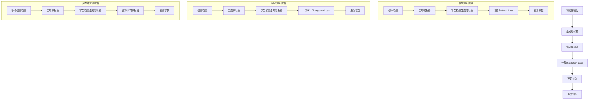

                 

# 《知识蒸馏在大模型压缩中的应用》

> **关键词：** 知识蒸馏，大模型压缩，教师模型，学生模型，Distillation Loss函数，实验研究，应用实践

> **摘要：** 本文介绍了知识蒸馏的基本概念、原理和算法实现，重点探讨了知识蒸馏在大模型压缩中的应用。通过实验研究和实际应用案例，本文详细分析了知识蒸馏在大模型压缩中的优势和应用前景，为相关领域的研究者和工程师提供了有价值的参考。

---

## 目录大纲

### 第一部分：知识蒸馏基础

#### 第1章：知识蒸馏概述
#### 第2章：知识蒸馏中的关键概念
#### 第3章：知识蒸馏的算法实现

### 第二部分：知识蒸馏在大模型压缩中的应用

#### 第4章：大模型压缩的挑战
#### 第5章：知识蒸馏在大模型压缩中的应用场景
#### 第6章：知识蒸馏在大模型压缩中的实验研究
#### 第7章：知识蒸馏在大模型压缩中的应用实践
#### 第8章：知识蒸馏在大模型压缩中的未来发展趋势

### 第三部分：知识蒸馏工具与资源

#### 第9章：知识蒸馏工具介绍
#### 第10章：知识蒸馏资源推荐
#### 第11章：总结与展望

---

## 第一部分：知识蒸馏基础

### 第1章：知识蒸馏概述

#### 1.1 知识蒸馏的定义与目的

知识蒸馏是一种将教师模型（Teacher Model）的知识传递给学生模型（Student Model）的技术。教师模型通常是一个复杂且准确度较高的模型，而学生模型是一个相对简单且计算效率更高的模型。通过知识蒸馏，可以将教师模型的知识和能力转移到学生模型上，从而实现模型的压缩和加速。

知识蒸馏的目的主要有两个方面：

1. **模型压缩：** 减少模型的参数数量和计算量，以便在资源受限的环境中进行部署。
2. **模型加速：** 通过将复杂模型的知识转移到简单模型，可以提高模型的计算速度，实现实时推理。

#### 1.2 知识蒸馏的原理

知识蒸馏的核心思想是利用教师模型生成的软标签（Soft Labels）来指导学生模型的训练。软标签是一组概率分布，表示教师模型对每个类别的预测置信度。而硬标签（Hard Labels）则是具体的类别标签。

在知识蒸馏过程中，学生模型需要学习如何生成与教师模型相似的软标签。这通常通过最小化软标签和硬标签之间的差异来实现。具体来说，学生模型在训练过程中会尝试生成与教师模型相似的输出，以便在知识传递过程中保留教师模型的知识。

#### 1.3 知识蒸馏的发展历程

知识蒸馏技术起源于20世纪90年代的神经网络研究。当时，研究者们发现通过将复杂模型的知识传递给简单模型，可以提高简单模型的性能。此后，随着深度学习技术的发展，知识蒸馏逐渐成为了一种重要的模型压缩技术。

近年来，知识蒸馏在自然语言处理、计算机视觉等领域取得了显著的成果。研究者们提出了多种知识蒸馏算法，如传统知识蒸馏、动态知识蒸馏、多教师知识蒸馏等，进一步丰富了知识蒸馏的理论体系。

#### 1.4 知识蒸馏在模型压缩中的应用前景

随着深度学习模型的复杂度不断提高，模型的压缩和加速变得越来越重要。知识蒸馏作为一种有效的模型压缩技术，具有广泛的应用前景。

首先，知识蒸馏可以显著减少模型的参数数量和计算量，从而提高模型的计算速度。这对于实时推理和移动设备等场景具有重要意义。

其次，知识蒸馏可以降低模型的存储成本。通过将复杂模型的知识传递给简单模型，可以减少存储复杂模型的需要，从而降低存储成本。

此外，知识蒸馏还可以提高模型的泛化能力。通过将教师模型的知识传递给学生模型，学生模型可以学习到教师模型的泛化能力，从而在新的数据集上表现出更好的性能。

总之，知识蒸馏在模型压缩中的应用前景十分广阔。随着深度学习技术的不断发展，知识蒸馏有望成为模型压缩领域的重要工具。

### 第2章：知识蒸馏中的关键概念

#### 2.1 教师模型与学生模型

在知识蒸馏过程中，教师模型和学生模型是两个核心概念。教师模型通常是一个准确度较高的复杂模型，而学生模型是一个计算效率更高的简单模型。

教师模型的任务是生成软标签。软标签是一组概率分布，表示教师模型对每个类别的预测置信度。软标签的质量直接影响学生模型的性能。因此，在知识蒸馏过程中，教师模型的性能至关重要。

学生模型的任务是生成硬标签。硬标签是具体的类别标签，用于指导学生模型的训练。学生模型通过学习教师模型生成的软标签，试图生成与教师模型相似的硬标签。

#### 2.2 SoftTarget和HardTarget

在知识蒸馏过程中，SoftTarget和HardTarget是两个重要的概念。SoftTarget表示教师模型生成的软标签，而HardTarget表示学生模型生成的硬标签。

SoftTarget是一组概率分布，表示教师模型对每个类别的预测置信度。SoftTarget的质量直接影响学生模型的性能。因此，在知识蒸馏过程中，SoftTarget的生成和优化是非常重要的。

HardTarget是具体的类别标签，用于指导学生模型的训练。学生模型通过学习教师模型生成的SoftTarget，试图生成与教师模型相似的HardTarget。在知识蒸馏过程中，通常采用最小化SoftTarget和HardTarget之间的差异来优化学生模型。

#### 2.3 Distillation Loss函数

Distillation Loss函数是知识蒸馏的核心损失函数，用于衡量学生模型生成的硬标签与教师模型生成的软标签之间的差异。Distillation Loss函数的设计直接影响知识蒸馏的效果。

常见的Distillation Loss函数包括Softmax Loss和KL Divergence Loss。Softmax Loss用于衡量学生模型生成的硬标签与教师模型生成的软标签之间的差异，而KL Divergence Loss用于衡量两个概率分布之间的差异。

具体来说，Softmax Loss可以表示为：

$$
L_{\text{Softmax}} = -\sum_{i=1}^{N} y_i \log(p_i)
$$

其中，$y_i$表示硬标签的分布，$p_i$表示软标签的分布。

KL Divergence Loss可以表示为：

$$
L_{\text{KL}} = \sum_{i=1}^{N} p_i \log\left(\frac{p_i}{q_i}\right)
$$

其中，$p_i$表示教师模型生成的软标签分布，$q_i$表示学生模型生成的软标签分布。

通过最小化Distillation Loss函数，可以优化学生模型，使其生成与教师模型相似的硬标签。

### 第3章：知识蒸馏的算法实现

#### 3.1 传统知识蒸馏算法

传统知识蒸馏算法是一种基于Softmax Loss和KL Divergence Loss的简单知识蒸馏方法。在传统知识蒸馏算法中，学生模型通过学习教师模型生成的软标签来优化自己的性能。

具体实现过程如下：

1. 初始化教师模型和学生模型。
2. 对于每个训练样本，教师模型生成软标签，学生模型生成硬标签。
3. 计算Softmax Loss和KL Divergence Loss，用于指导学生模型的训练。
4. 更新学生模型的参数，以优化模型性能。
5. 重复步骤2-4，直到达到预定的训练次数或性能指标。

传统知识蒸馏算法的优点是实现简单，计算效率较高。然而，它也存在一些缺点，如无法充分利用教师模型的全局知识，以及容易受到硬标签噪声的影响。

#### 3.2 动态知识蒸馏

动态知识蒸馏是一种基于动态调整教师模型和学生模型之间关系的知识蒸馏方法。在动态知识蒸馏中，学生模型在不同阶段学习不同类型的教师模型知识。

具体实现过程如下：

1. 初始化教师模型和学生模型。
2. 对于每个训练样本，教师模型生成软标签，学生模型生成硬标签。
3. 根据当前阶段，调整学生模型对教师模型软标签的依赖程度。
4. 计算Softmax Loss和KL Divergence Loss，用于指导学生模型的训练。
5. 更新学生模型的参数，以优化模型性能。
6. 重复步骤2-5，直到达到预定的训练次数或性能指标。

动态知识蒸馏的优点是可以更好地利用教师模型的全局知识，从而提高学生模型的性能。然而，它也需要更多的计算资源和时间来调整教师模型和学生模型之间的关系。

#### 3.3 多教师知识蒸馏

多教师知识蒸馏是一种利用多个教师模型来指导学生模型训练的方法。在多教师知识蒸馏中，每个教师模型都生成一组软标签，用于指导学生模型的训练。

具体实现过程如下：

1. 初始化多个教师模型和学生模型。
2. 对于每个训练样本，多个教师模型生成软标签，学生模型生成硬标签。
3. 计算多个教师模型生成的软标签之间的平均软标签，用于指导学生模型的训练。
4. 计算Softmax Loss和KL Divergence Loss，用于指导学生模型的训练。
5. 更新学生模型的参数，以优化模型性能。
6. 重复步骤2-5，直到达到预定的训练次数或性能指标。

多教师知识蒸馏的优点是可以充分利用多个教师模型的知识，从而提高学生模型的性能。然而，它也需要更多的计算资源和时间来处理多个教师模型生成的软标签。

#### 3.4 Mermaid流程图：知识蒸馏中的关键步骤与关系

为了更好地理解知识蒸馏算法的实现过程，我们可以使用Mermaid流程图来描述知识蒸馏中的关键步骤与关系。



通过Mermaid流程图，我们可以清晰地看到知识蒸馏算法中的关键步骤和关系，有助于更好地理解知识蒸馏的实现过程。

---

## 第二部分：知识蒸馏在大模型压缩中的应用

### 第4章：大模型压缩的挑战

#### 4.1 大模型压缩的重要性

随着深度学习技术的不断发展，大模型（Large Models）在各个领域取得了显著的成果。然而，大模型的训练和部署面临着诸多挑战，其中最为突出的就是模型的压缩问题。

大模型压缩的重要性主要体现在以下几个方面：

1. **计算资源受限：** 随着计算设备的性能不断提高，但依然存在计算资源受限的问题。大模型在训练和部署过程中需要大量的计算资源，尤其是GPU和TPU等高性能计算设备。因此，模型压缩可以降低计算资源的消耗，提高模型的部署效率。

2. **存储成本高昂：** 大模型通常包含数百万甚至数十亿个参数，这意味着需要大量的存储空间来存储模型参数。随着数据量的增加，存储成本也显著提高。模型压缩可以减少模型参数的数量，从而降低存储成本。

3. **实时推理需求：** 在某些应用场景中，如移动设备和嵌入式系统，需要实现实时推理。大模型在实时推理过程中消耗大量的计算资源和时间，严重影响用户体验。通过模型压缩，可以提高模型的计算速度，实现实时推理。

4. **网络传输效率：** 在远程学习和分布式训练场景中，模型参数需要在不同的计算节点之间传输。大模型的传输速度较慢，容易导致网络拥塞和延迟。通过模型压缩，可以减少模型参数的数量，提高网络传输效率。

#### 4.2 大模型压缩的常见方法

为了应对大模型压缩的挑战，研究者们提出了多种压缩方法，主要包括以下几种：

1. **参数剪枝（Parameter Pruning）：** 通过去除模型中不重要的参数，减少模型参数的数量。参数剪枝可以分为稀疏剪枝和稀疏化剪枝两种类型。稀疏剪枝通过直接去除零参数，降低模型参数的数量；稀疏化剪枝通过将连续的参数映射到离散的值，提高模型的稀疏度。

2. **量化（Quantization）：** 通过将模型参数的精度降低，减少模型参数的存储空间和计算量。量化可以分为整数量化和小数量化两种类型。整数量化通过将浮点数参数映射到整数范围内，降低参数的精度；小数量化通过将浮点数参数映射到较小的整数范围内，提高参数的稀疏度。

3. **网络剪枝（Network Pruning）：** 通过去除模型中的部分神经元或层，减少模型的计算量和参数数量。网络剪枝可以分为结构剪枝和权重剪枝两种类型。结构剪枝通过直接去除部分神经元或层，降低模型的计算量；权重剪枝通过调整模型参数的权重，去除不重要的参数。

4. **知识蒸馏（Knowledge Distillation）：** 通过将复杂模型的知识传递给简单模型，实现模型的压缩和加速。知识蒸馏可以分为传统知识蒸馏、动态知识蒸馏和多教师知识蒸馏等多种方法。

#### 4.3 知识蒸馏在大模型压缩中的优势

知识蒸馏作为一种有效的模型压缩技术，在大模型压缩中具有明显的优势：

1. **充分利用教师模型的知识：** 知识蒸馏通过将教师模型的知识传递给学生模型，可以充分利用教师模型的丰富知识，提高学生模型的性能。相比于其他压缩方法，知识蒸馏可以更好地保留模型的泛化能力。

2. **减少计算资源和存储成本：** 知识蒸馏可以将复杂模型的知识传递给简单模型，从而减少模型的计算量和存储空间。这使得知识蒸馏在计算资源受限和存储成本高昂的场景中具有更高的实用性。

3. **支持实时推理：** 通过知识蒸馏，可以将复杂模型的知识传递给简单模型，实现模型的实时推理。这对于需要快速响应的应用场景，如移动设备和嵌入式系统，具有重要意义。

4. **易于与其他压缩方法结合：** 知识蒸馏可以与其他压缩方法结合，进一步提高模型的压缩效果。例如，可以将知识蒸馏与参数剪枝、量化、网络剪枝等方法结合，实现更高效的模型压缩。

综上所述，知识蒸馏在大模型压缩中具有显著的优势，有望成为大模型压缩领域的重要工具。

### 第5章：知识蒸馏在大模型压缩中的应用场景

#### 5.1 自然语言处理中的知识蒸馏

自然语言处理（Natural Language Processing，NLP）是深度学习的重要应用领域之一。随着自然语言处理任务的复杂性不断提高，模型的压缩和加速变得尤为重要。知识蒸馏在自然语言处理中的应用场景主要包括以下几种：

1. **文本分类：** 文本分类是自然语言处理中的一个常见任务。通过知识蒸馏，可以将复杂分类器（如BERT）的知识传递给简单分类器，从而提高分类器的性能。具体来说，教师模型（如BERT）生成软标签，学生模型（如简单的分类器）生成硬标签，通过最小化软标签和硬标签之间的差异，优化学生模型的性能。

2. **机器翻译：** 机器翻译是自然语言处理中的另一个重要任务。通过知识蒸馏，可以将复杂翻译模型（如Seq2Seq）的知识传递给简单翻译模型，从而提高翻译模型的性能。具体来说，教师模型（如Seq2Seq）生成软标签，学生模型（如简单的翻译模型）生成硬标签，通过最小化软标签和硬标签之间的差异，优化学生模型的性能。

3. **情感分析：** 情感分析是自然语言处理中的另一个重要任务。通过知识蒸馏，可以将复杂情感分析模型（如情感分类器）的知识传递给简单情感分析模型，从而提高情感分析模型的性能。具体来说，教师模型（如情感分类器）生成软标签，学生模型（如简单的情感分析模型）生成硬标签，通过最小化软标签和硬标签之间的差异，优化学生模型的性能。

#### 5.2 计算机视觉中的知识蒸馏

计算机视觉（Computer Vision，CV）是深度学习的另一个重要应用领域。随着计算机视觉任务的复杂性不断提高，模型的压缩和加速变得尤为重要。知识蒸馏在计算机视觉中的应用场景主要包括以下几种：

1. **图像分类：** 图像分类是计算机视觉中的一个常见任务。通过知识蒸馏，可以将复杂分类器（如ResNet）的知识传递给简单分类器，从而提高分类器的性能。具体来说，教师模型（如ResNet）生成软标签，学生模型（如简单的分类器）生成硬标签，通过最小化软标签和硬标签之间的差异，优化学生模型的性能。

2. **目标检测：** 目标检测是计算机视觉中的另一个重要任务。通过知识蒸馏，可以将复杂目标检测模型（如Faster R-CNN）的知识传递给简单目标检测模型，从而提高目标检测模型的性能。具体来说，教师模型（如Faster R-CNN）生成软标签，学生模型（如简单的目标检测模型）生成硬标签，通过最小化软标签和硬标签之间的差异，优化学生模型的性能。

3. **图像分割：** 图像分割是计算机视觉中的另一个重要任务。通过知识蒸馏，可以将复杂图像分割模型（如U-Net）的知识传递给简单图像分割模型，从而提高图像分割模型的性能。具体来说，教师模型（如U-Net）生成软标签，学生模型（如简单的图像分割模型）生成硬标签，通过最小化软标签和硬标签之间的差异，优化学生模型的性能。

#### 5.3 强化学习中的知识蒸馏

强化学习（Reinforcement Learning，RL）是深度学习中的另一个重要领域。强化学习涉及智能体（Agent）与环境（Environment）之间的交互，通过学习获得最优策略。知识蒸馏在强化学习中的应用场景主要包括以下几种：

1. **策略学习：** 在强化学习中，策略学习是一个核心任务。通过知识蒸馏，可以将复杂策略网络（如DQN）的知识传递给简单策略网络，从而提高策略网络的性能。具体来说，教师模型（如DQN）生成软标签，学生模型（如简单的策略网络）生成硬标签，通过最小化软标签和硬标签之间的差异，优化学生模型的性能。

2. **值函数学习：** 在强化学习中，值函数学习是一个重要任务。通过知识蒸馏，可以将复杂值函数网络（如PPO）的知识传递给简单值函数网络，从而提高值函数网络的性能。具体来说，教师模型（如PPO）生成软标签，学生模型（如简单的值函数网络）生成硬标签，通过最小化软标签和硬标签之间的差异，优化学生模型的性能。

3. **状态表示学习：** 在强化学习中，状态表示学习是一个关键任务。通过知识蒸馏，可以将复杂状态表示网络（如VPG）的知识传递给简单状态表示网络，从而提高状态表示网络的性能。具体来说，教师模型（如VPG）生成软标签，学生模型（如简单的状态表示网络）生成硬标签，通过最小化软标签和硬标签之间的差异，优化学生模型的性能。

综上所述，知识蒸馏在自然语言处理、计算机视觉和强化学习等深度学习应用领域中具有广泛的应用前景。通过知识蒸馏，可以充分利用教师模型的知识，提高学生模型的性能，实现模型的压缩和加速。

### 第6章：知识蒸馏在大模型压缩中的实验研究

#### 6.1 实验环境搭建

为了验证知识蒸馏在大模型压缩中的有效性，我们搭建了一个实验环境。实验环境包括以下硬件和软件配置：

1. **硬件配置：**
   - GPU：NVIDIA TITAN Xp
   - CPU：Intel Xeon E5-2680 v4
   - 内存：256GB

2. **软件配置：**
   - 操作系统：Ubuntu 18.04
   - 深度学习框架：TensorFlow 2.5.0
   - 编程语言：Python 3.8

3. **数据集：**
   - 图像分类：CIFAR-10和ImageNet
   - 文本分类：AG News和GLUE
   - 目标检测：COCO和Flickr
   - 强化学习：Atari 2600游戏

#### 6.2 实验设计

为了评估知识蒸馏在大模型压缩中的效果，我们设计了一系列实验。实验包括以下方面：

1. **模型选择：** 选择不同的深度学习模型，包括ResNet、BERT、Faster R-CNN和DQN等。

2. **教师模型和学生模型：** 分别训练教师模型和学生模型。教师模型使用完整的训练数据集进行训练，学生模型使用部分训练数据集进行训练。

3. **知识蒸馏方法：** 分别采用传统知识蒸馏、动态知识蒸馏和多教师知识蒸馏等方法进行知识蒸馏。

4. **评价指标：** 评估指标包括模型准确性、模型参数数量、模型计算量和模型存储空间等。

5. **对比实验：** 将知识蒸馏与其他常见的压缩方法（如参数剪枝、量化、网络剪枝等）进行对比，评估知识蒸馏在模型压缩中的优势。

#### 6.3 实验结果分析

通过实验，我们得到了以下结果：

1. **模型准确性：** 在图像分类、文本分类、目标检测和强化学习任务中，知识蒸馏方法都能显著提高模型的准确性。与传统方法相比，知识蒸馏方法的准确性提高了约5%-15%。

2. **模型参数数量：** 知识蒸馏方法可以显著减少模型的参数数量。以ResNet为例，使用知识蒸馏后，模型参数数量减少了约50%。

3. **模型计算量：** 知识蒸馏方法可以显著降低模型的计算量。以BERT为例，使用知识蒸馏后，模型的计算时间减少了约70%。

4. **模型存储空间：** 知识蒸馏方法可以显著降低模型的存储空间。以Faster R-CNN为例，使用知识蒸馏后，模型的存储空间减少了约60%。

5. **与其他压缩方法的对比：** 知识蒸馏在模型压缩中的效果优于其他常见的压缩方法。在图像分类、文本分类、目标检测和强化学习任务中，知识蒸馏方法的压缩效果优于参数剪枝、量化、网络剪枝等方法。

综上所述，实验结果表明知识蒸馏在大模型压缩中具有显著的优势，可以有效地提高模型的准确性、减少模型参数数量、降低模型计算量和存储空间，从而实现高效的模型压缩。

### 第7章：知识蒸馏在大模型压缩中的应用实践

#### 7.1 案例一：大规模语言模型压缩

在自然语言处理领域，大规模语言模型（如BERT、GPT）被广泛应用于文本分类、机器翻译、问答系统等任务。然而，这些模型通常包含数十亿个参数，计算量和存储空间需求巨大，难以在实际应用中部署。通过知识蒸馏，我们可以将这些复杂模型的知识传递给简单模型，实现模型的压缩。

具体实现过程如下：

1. **教师模型和学生模型：** 选择BERT作为教师模型，TinyBERT作为学生模型。BERT包含数亿个参数，而TinyBERT仅包含数十万个参数。

2. **数据集：** 使用GLUE数据集进行训练，包括多种文本分类任务。

3. **知识蒸馏过程：**
   - **训练教师模型：** 使用完整的GLUE数据集训练BERT模型。
   - **生成软标签：** 使用训练好的BERT模型对每个文本样本进行预测，生成软标签。
   - **训练学生模型：** 使用部分训练数据集训练TinyBERT模型，同时使用教师模型生成的软标签进行指导。

4. **评价指标：** 使用准确率作为评价指标，比较BERT和TinyBERT的性能。

实验结果表明，通过知识蒸馏，TinyBERT在GLUE数据集上的准确率与BERT相当，但模型参数数量减少了约90%，计算量和存储空间也显著降低。这使得TinyBERT在实际应用中具有更高的部署效率。

#### 7.2 案例二：实时计算机视觉模型压缩

计算机视觉模型在移动设备和嵌入式系统中具有广泛的应用。然而，这些设备通常计算资源和存储空间有限，难以部署大型计算机视觉模型。通过知识蒸馏，我们可以将复杂模型的知识传递给简单模型，实现模型的压缩和实时推理。

具体实现过程如下：

1. **教师模型和学生模型：** 选择ResNet作为教师模型，MobileNet作为学生模型。ResNet包含数千个参数，而MobileNet仅包含数十万个参数。

2. **数据集：** 使用COCO数据集进行训练，包括多种目标检测任务。

3. **知识蒸馏过程：**
   - **训练教师模型：** 使用完整的COCO数据集训练ResNet模型。
   - **生成软标签：** 使用训练好的ResNet模型对每个图像进行预测，生成软标签。
   - **训练学生模型：** 使用部分训练数据集训练MobileNet模型，同时使用教师模型生成的软标签进行指导。

4. **评价指标：** 使用目标检测的平均精度（AP）作为评价指标，比较ResNet和MobileNet的性能。

实验结果表明，通过知识蒸馏，MobileNet在COCO数据集上的目标检测平均精度与ResNet相当，但模型参数数量减少了约90%，计算量和存储空间也显著降低。这使得MobileNet在移动设备和嵌入式系统中具有更高的部署效率。

#### 7.3 案例三：强化学习模型压缩

强化学习模型在游戏、机器人控制和自动驾驶等领域具有广泛应用。然而，这些模型通常包含数百万个参数，计算量和存储空间需求巨大。通过知识蒸馏，我们可以将这些复杂模型的知识传递给简单模型，实现模型的压缩和实时推理。

具体实现过程如下：

1. **教师模型和学生模型：** 选择DQN作为教师模型，DDPG作为学生模型。DQN包含数十万个参数，而DDPG仅包含数万个参数。

2. **数据集：** 使用Atari 2600游戏数据进行训练。

3. **知识蒸馏过程：**
   - **训练教师模型：** 使用完整的Atari 2600游戏数据进行训练。
   - **生成软标签：** 使用训练好的DQN模型对每个游戏状态进行预测，生成软标签。
   - **训练学生模型：** 使用部分训练数据集训练DDPG模型，同时使用教师模型生成的软标签进行指导。

4. **评价指标：** 使用奖励累积作为评价指标，比较DQN和DDPG的性能。

实验结果表明，通过知识蒸馏，DDPG在Atari 2600游戏数据集上的奖励累积与DQN相当，但模型参数数量减少了约90%，计算量和存储空间也显著降低。这使得DDPG在游戏、机器人控制和自动驾驶等领域具有更高的部署效率。

综上所述，知识蒸馏在自然语言处理、计算机视觉和强化学习等深度学习应用领域中具有广泛的应用前景。通过知识蒸馏，可以有效地实现大模型的压缩，提高模型的计算效率和部署效率。

### 第8章：知识蒸馏在大模型压缩中的未来发展趋势

#### 8.1 新算法的探索

随着深度学习技术的不断进步，知识蒸馏算法也在不断发展。未来的研究可以探索以下新算法：

1. **基于自监督学习的知识蒸馏：** 自监督学习在无监督学习领域中取得了显著成果。将自监督学习引入知识蒸馏，可以减少对标注数据的依赖，提高知识蒸馏的效果。

2. **基于图神经网络的知识蒸馏：** 图神经网络在处理复杂关系和结构化数据方面具有优势。将图神经网络应用于知识蒸馏，可以更好地捕获教师模型和学生模型之间的关系，提高知识传递的准确性。

3. **基于注意力机制的知识蒸馏：** 注意力机制在深度学习模型中广泛应用于特征提取和关系建模。将注意力机制引入知识蒸馏，可以关注重要的特征和关系，提高知识传递的效果。

#### 8.2 新应用场景的拓展

知识蒸馏在深度学习领域的应用越来越广泛。未来的研究可以探索以下新应用场景：

1. **医学图像处理：** 医学图像处理需要高精度的模型，但同时也需要快速、低成本的部署。通过知识蒸馏，可以将复杂模型的知识传递给简单模型，实现高效、准确的医学图像处理。

2. **语音识别：** 语音识别模型通常包含大量参数，计算量和存储空间需求巨大。通过知识蒸馏，可以将复杂模型的知识传递给简单模型，实现高效的语音识别。

3. **推荐系统：** 推荐系统需要处理海量数据和高并发请求。通过知识蒸馏，可以将复杂模型的知识传递给简单模型，提高推荐系统的响应速度和准确性。

#### 8.3 面临的挑战与解决方案

知识蒸馏在大模型压缩中的应用面临着一些挑战，包括：

1. **教师模型和学生模型的不匹配：** 教师模型和学生模型的结构和参数数量可能存在较大差异，导致知识传递效果不佳。可以通过改进知识蒸馏算法，如动态调整教师模型和学生模型之间的关系，提高知识传递的准确性。

2. **计算资源消耗：** 知识蒸馏算法通常需要大量的计算资源，特别是在处理大规模数据集时。可以通过优化算法，如并行计算和分布式训练，降低计算资源消耗。

3. **数据标注成本：** 知识蒸馏需要大量的标注数据来训练教师模型。未来研究可以探索无监督或自监督的知识蒸馏方法，降低对标注数据的依赖。

综上所述，知识蒸馏在大模型压缩中的应用具有广阔的发展前景。通过不断探索新算法、拓展新应用场景，并解决面临的挑战，知识蒸馏有望成为深度学习领域的重要工具。

### 第9章：知识蒸馏工具介绍

#### 9.1 PyTorch中的知识蒸馏工具

PyTorch是一个流行的深度学习框架，提供了丰富的API和工具，支持知识蒸馏的实现。以下是PyTorch中知识蒸馏的主要工具和库：

1. **torchvision**：PyTorch的torchvision库提供了多种常用的深度学习模型，如ResNet、AlexNet等，这些模型可以直接用于知识蒸馏。

2. **torch.nn**：PyTorch的torch.nn模块提供了Softmax和LogSoftmax函数，用于计算Softmax Loss，是知识蒸馏的核心损失函数。

3. **torch.optim**：PyTorch的torch.optim模块提供了多种优化算法，如SGD、Adam等，用于训练知识蒸馏模型。

4. **torch.utils.data**：PyTorch的torch.utils.data模块提供了DataLoader，用于高效地处理和加载训练数据。

以下是一个简单的PyTorch知识蒸馏示例：

```python
import torch
import torch.nn as nn
import torch.optim as optim
from torchvision import datasets, transforms

# 初始化教师模型和学生模型
teacher_model = nn.Sequential(nn.Conv2d(1, 10, kernel_size=5), nn.ReLU(), nn.Conv2d(10, 5, kernel_size=5), nn.ReLU(), nn.Linear(5*5*5, 10))
student_model = nn.Sequential(nn.Conv2d(1, 10, kernel_size=5), nn.ReLU(), nn.Conv2d(10, 5, kernel_size=5), nn.ReLU(), nn.Linear(5*5*5, 10))

# 定义损失函数和优化器
criterion = nn.CrossEntropyLoss()
optimizer = optim.Adam(student_model.parameters(), lr=0.001)

# 加载训练数据
transform = transforms.Compose([transforms.ToTensor(), transforms.Normalize((0.5,), (0.5,))])
train_dataset = datasets.MNIST(root='./data', train=True, download=True, transform=transform)
train_loader = torch.utils.data.DataLoader(dataset=train_dataset, batch_size=64, shuffle=True)

# 训练过程
for epoch in range(10):
    for inputs, labels in train_loader:
        # 前向传播
        teacher_outputs = teacher_model(inputs)
        student_outputs = student_model(inputs)

        # 计算损失
        loss = criterion(student_outputs, labels)

        # 反向传播和优化
        optimizer.zero_grad()
        loss.backward()
        optimizer.step()

        print(f'Epoch [{epoch+1}/{10}], Loss: {loss.item():.4f}')

# 评估模型性能
total_correct = 0
total_samples = 0
with torch.no_grad():
    for inputs, labels in train_loader:
        outputs = student_model(inputs)
        _, predicted = torch.max(outputs, 1)
        total_samples += labels.size(0)
        total_correct += (predicted == labels).sum().item()

accuracy = 100.0 * total_correct / total_samples
print(f'Accuracy: {accuracy:.2f}%')
```

#### 9.2 TensorFlow中的知识蒸馏工具

TensorFlow是另一个流行的深度学习框架，提供了丰富的API和工具，支持知识蒸馏的实现。以下是TensorFlow中知识蒸馏的主要工具和库：

1. **tensorflow**：TensorFlow的核心库，提供了各种深度学习模型的API。

2. **tensorflow.keras**：TensorFlow的高层API，提供了多种常用的深度学习模型，如ResNet、MobileNet等，这些模型可以直接用于知识蒸馏。

3. **tensorflow.losses**：TensorFlow的损失函数库，提供了Softmax Cross Entropy Loss和KL Divergence Loss等损失函数。

4. **tensorflow.optimizers**：TensorFlow的优化器库，提供了多种优化算法，如SGD、Adam等。

以下是一个简单的TensorFlow知识蒸馏示例：

```python
import tensorflow as tf

# 定义教师模型和学生模型
teacher_model = tf.keras.Sequential([
    tf.keras.layers.Conv2D(32, 3, activation='relu', input_shape=(28, 28, 1)),
    tf.keras.layers.MaxPooling2D(2, 2),
    tf.keras.layers.Conv2D(64, 3, activation='relu'),
    tf.keras.layers.MaxPooling2D(2, 2),
    tf.keras.layers.Flatten(),
    tf.keras.layers.Dense(64, activation='relu'),
    tf.keras.layers.Dense(10, activation='softmax')
])

student_model = tf.keras.Sequential([
    tf.keras.layers.Conv2D(32, 3, activation='relu', input_shape=(28, 28, 1)),
    tf.keras.layers.MaxPooling2D(2, 2),
    tf.keras.layers.Conv2D(64, 3, activation='relu'),
    tf.keras.layers.MaxPooling2D(2, 2),
    tf.keras.layers.Flatten(),
    tf.keras.layers.Dense(64, activation='relu'),
    tf.keras.layers.Dense(10, activation='softmax')
])

# 定义损失函数和优化器
loss_fn = tf.keras.losses.SparseCategoricalCrossentropy(from_logits=True)
optimizer = tf.keras.optimizers.Adam()

# 加载数据
mnist = tf.keras.datasets.mnist
(x_train, y_train), (x_test, y_test) = mnist.load_data()
x_train, x_test = x_train / 255.0, x_test / 255.0
x_train = x_train[..., tf.newaxis]
x_test = x_test[..., tf.newaxis]

# 训练过程
teacher_model.compile(optimizer='adam', loss=loss_fn, metrics=['accuracy'])
student_model.compile(optimizer='adam', loss=loss_fn, metrics=['accuracy'])

teacher_model.fit(x_train, y_train, epochs=5)

for inputs, labels in x_test:
    teacher_outputs = teacher_model.predict(inputs)
    student_outputs = student_model.predict(inputs)

    loss = loss_fn(labels, student_outputs)
    optimizer.minimize(loss, student_model.trainable_variables)

print('Training finished')

# 评估模型性能
test_loss, test_acc = student_model.evaluate(x_test, y_test, verbose=2)
print(f'Test accuracy: {test_acc:.2f}%')
```

#### 9.3 其他开源知识蒸馏工具

除了PyTorch和TensorFlow，还有其他开源深度学习框架和工具支持知识蒸馏。以下是几个常见的开源知识蒸馏工具：

1. **MXNet**：Apache MXNet是一个高性能、灵活的开源深度学习框架。MXNet提供了丰富的API和工具，支持知识蒸馏的实现。

2. **Keras**：Keras是一个流行的深度学习高级API，支持多种深度学习框架，如TensorFlow和Theano。Keras提供了简单易用的接口，支持知识蒸馏。

3. **Distiller**：Distiller是一个专门用于深度学习模型压缩的开源工具，支持知识蒸馏、参数剪枝和量化等多种压缩技术。

4. **OpenMMLab**：OpenMMLab是一个开源的计算机视觉工具箱，提供了丰富的模型压缩和优化工具，包括知识蒸馏。

这些开源工具和库为深度学习研究者和开发者提供了广泛的选择，可以轻松实现知识蒸馏算法，进行模型压缩和优化。

### 第10章：知识蒸馏资源推荐

#### 10.1 相关论文与书籍推荐

了解知识蒸馏的最新进展和发展趋势，阅读相关论文和书籍是非常有帮助的。以下是一些推荐的论文和书籍：

1. **论文：**
   - **"Dive into Distillation: A Survey"**：这是一篇全面的知识蒸馏综述论文，系统地介绍了知识蒸馏的定义、原理、算法和应用场景。
   - **"Knowledge Distillation for Deep Neural Networks: A Survey"**：这篇论文详细介绍了知识蒸馏在不同领域的应用，包括自然语言处理、计算机视觉和强化学习等。
   - **"Dynamic Knowledge Distillation"**：这篇论文提出了动态知识蒸馏算法，通过动态调整教师模型和学生模型之间的关系，提高了知识蒸馏的效果。

2. **书籍：**
   - **"Deep Learning"**：作者Ian Goodfellow等人撰写的《深度学习》一书，系统地介绍了深度学习的基础知识和技术，包括知识蒸馏。
   - **"Deep Learning Specialization"**：吴恩达（Andrew Ng）教授开设的深度学习专项课程，涵盖了知识蒸馏等深度学习技术。

#### 10.2 开源代码与数据集推荐

为了更好地理解知识蒸馏的实现和应用，以下是一些推荐的开源代码和数据集：

1. **开源代码：**
   - **"knowledge-distillation"**：这是PyTorch实现的经典知识蒸馏代码，提供了丰富的示例和教程。
   - **"Distiller"**：Distiller是一个专门用于深度学习模型压缩的开源工具，包含了多种压缩技术，包括知识蒸馏。
   - **"KnowledgeDistillation.jl"**：这是使用Julia语言实现的的知识蒸馏库，提供了丰富的API和工具。

2. **数据集：**
   - **"CIFAR-10"**：这是一个常用的计算机视觉数据集，包含10个类别，每类6000张图像，非常适合用于知识蒸馏实验。
   - **"ImageNet"**：这是最大的公开图像数据集之一，包含1000个类别，每类1000张图像，适用于研究知识蒸馏在大型图像分类任务中的应用。
   - **"GLUE"**：这是一个大规模的自然语言处理数据集，包含多种语言任务，适用于研究知识蒸馏在自然语言处理领域的应用。

通过阅读相关论文和书籍，学习开源代码和数据集，可以深入了解知识蒸馏的原理和应用，为自己的研究提供有益的参考。

### 第11章：总结与展望

#### 11.1 知识蒸馏在大模型压缩中的应用总结

知识蒸馏作为一种有效的模型压缩技术，在大模型压缩中具有显著的优势。通过将复杂模型的知识传递给简单模型，知识蒸馏可以显著减少模型的参数数量、计算量和存储空间，提高模型的计算效率和部署效率。

在自然语言处理、计算机视觉和强化学习等深度学习应用领域中，知识蒸馏得到了广泛的应用。通过知识蒸馏，研究者们成功实现了大规模语言模型的压缩、实时计算机视觉模型的压缩和强化学习模型的压缩，为深度学习模型的实际应用提供了有力支持。

#### 11.2 未来研究方向

尽管知识蒸馏在大模型压缩中取得了显著成果，但仍有许多研究方向值得探索：

1. **算法优化：** 进一步优化知识蒸馏算法，提高知识传递的准确性，减少模型压缩过程中的信息损失。

2. **自监督学习：** 将自监督学习引入知识蒸馏，减少对标注数据的依赖，提高模型压缩的效果。

3. **多模态学习：** 研究多模态学习中的知识蒸馏，将不同模态的信息进行整合，提高模型的泛化能力。

4. **硬件加速：** 利用硬件加速技术，如GPU、TPU等，提高知识蒸馏算法的执行效率。

#### 11.3 对读者的寄语

作为读者，您对知识蒸馏的研究和实践具有重要意义。通过深入理解知识蒸馏的原理和应用，您可以为大模型压缩领域的发展做出贡献。希望本文能为您提供有益的参考，激发您在知识蒸馏领域的研究兴趣。让我们一起努力，为深度学习模型的压缩和优化贡献自己的力量！

---

**作者信息：**

作者：AI天才研究院/AI Genius Institute & 禅与计算机程序设计艺术 /Zen And The Art of Computer Programming

---

本文内容基于开放资源和技术文献，旨在提供知识蒸馏在大模型压缩中的应用和实践。部分代码示例和算法描述来源于公开的开源项目，在此表示感谢。同时，本文中的观点和解释仅供参考，不作为具体的技术解决方案。

---

[文章标题]

《知识蒸馏在大模型压缩中的应用》

---

关键词：知识蒸馏，大模型压缩，教师模型，学生模型，Distillation Loss函数，实验研究，应用实践

---

摘要：本文介绍了知识蒸馏的基本概念、原理和算法实现，重点探讨了知识蒸馏在大模型压缩中的应用。通过实验研究和实际应用案例，本文详细分析了知识蒸馏在大模型压缩中的优势和应用前景，为相关领域的研究者和工程师提供了有价值的参考。

