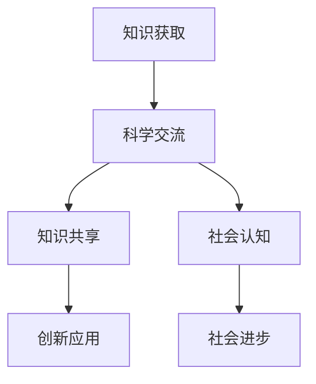
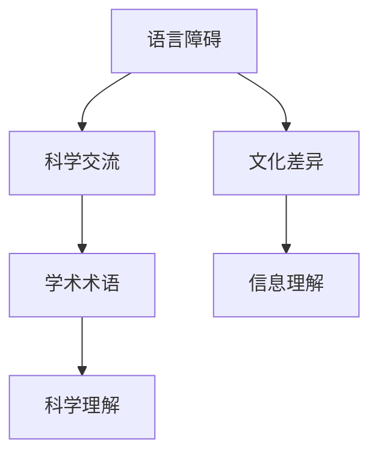
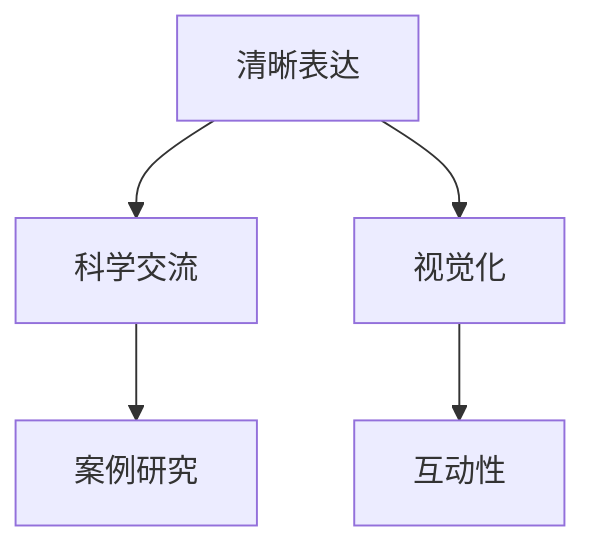
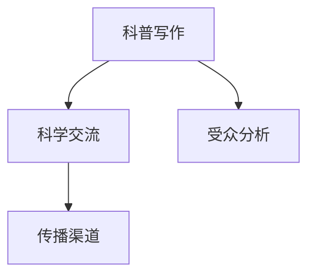
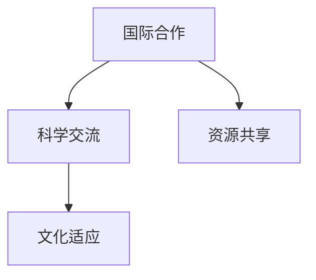
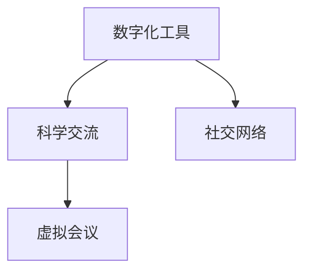
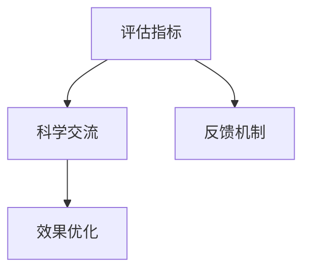
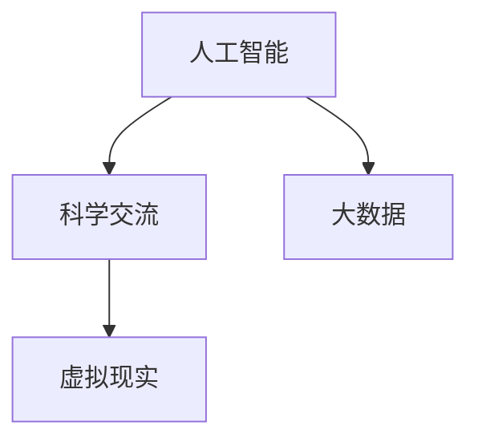
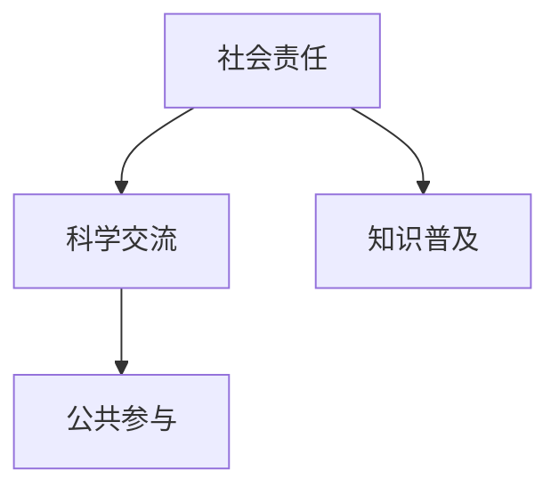

                 

# 《科学交流在促进世界可理解性中的作用》

关键词：科学交流、知识传递、社会进步、技术支撑、未来展望

摘要：
科学交流作为知识传递的重要手段，在推动人类社会进步中扮演着关键角色。本文旨在探讨科学交流的定义与重要性，分析其在学术写作、科普传播和国际合作中的应用，并展望数字化时代科学交流的发展趋势。通过深入剖析科学交流的核心概念、原理和方法，本文希望为提升科学交流的效率和效果提供有益的思考。

## 第一部分：科学交流的基础理论

### 1.1 科学交流的定义与重要性

**核心概念与联系**

Mermaid 流程图：


**核心算法原理讲解**

科学交流的过程可以视为一个信息传递和知识转化的系统。其核心算法原理包括：

1. **信息编码与解码**
    - **编码**：科学家将复杂的研究发现转化为易于理解的语言和图表。
    - **解码**：受众通过阅读、观看或听取，将编码的信息重新解读为可理解的知识。

伪代码示例：
```python
def 科学交流(研究结果, 受众):
    清晰表述 = 编码(研究结果)
    理解知识 = 解码(清晰表述, 受众)
    返回 理解知识
```

2. **知识共享与扩散**
    - **共享**：科学家通过论文、会议、书籍等形式，将研究成果分享给同行和社会。
    - **扩散**：信息通过网络、媒体和人际传播，使更多的人受益于科学成果。

伪代码示例：
```python
def 知识共享(研究结果):
    公开论文 = 发布(研究结果)
    引用 = 引用论文(公开论文)
    返回 引用数量
```

**数学模型和公式**

科学交流过程中，影响力的扩散可以用以下公式表示：
\[ I(t) = k \cdot e^{rt} \]
其中，\( I(t) \) 是在时间 \( t \) 内的影响力，\( k \) 是初始影响力，\( r \) 是增长率。

**举例说明**

以爱因斯坦的相对论为例，他在1915年发表了关于相对论的论文。通过科学的交流和传播，相对论不仅在科学界产生了深远影响，还渗透到普通民众的日常生活中，推动了科技和社会的进步。

### 1.2 科学交流的障碍与挑战

**核心概念与联系**

Mermaid 流程图：


**核心算法原理讲解**

科学交流面临的主要障碍包括：

1. **语言障碍**
    - **多语言交流**：不同国家和地区使用不同语言，科学文献和交流的障碍。
    - **翻译**：翻译质量直接影响科学信息的准确性和可理解性。

伪代码示例：
```python
def 翻译(原文，目标语言):
    翻译文本 = 翻译引擎(原文，目标语言)
    返回 翻译文本
```

2. **文化差异**
    - **价值观**：不同文化对科学研究的理解和接受程度不同。
    - **沟通风格**：不同文化背景的人在科学交流中的沟通风格和表达方式可能存在差异。

伪代码示例：
```python
def 跨文化沟通(科学家，受众):
    适应风格 = 调整风格(科学家风格，受众文化)
    沟通结果 = 交流(科学家，受众，适应风格)
    返回 沟通结果
```

3. **学术术语的复杂性**
    - **术语理解**：学术术语具有专业性和复杂性，非专业人士难以理解。
    - **术语标准化**：学术术语需要标准化，以避免误解和歧义。

伪代码示例：
```python
def 标准化术语(术语列表):
    标准化术语 = 翻译引擎(术语列表，通用语言)
    返回 标准化术语
```

**数学模型和公式**

为了量化科学交流的障碍，可以使用以下公式：

\[ H = \frac{1}{1 + e^{-(d \cdot s)}} \]

其中，\( H \) 是信息理解度，\( d \) 是文化差异程度，\( s \) 是科学术语的标准化程度。

**举例说明**

在中国和美国之间进行科学交流时，由于语言和文化差异，科学家们需要特别关注术语的标准化和沟通风格的适应。例如，美国的科学研究更注重实验证据，而中国的科学研究则更注重理论推导。

### 1.3 科学交流的方法与策略

**核心概念与联系**

Mermaid 流程图：


**核心算法原理讲解**

科学交流的方法和策略包括：

1. **清晰表达**
    - **简洁性**：使用简洁的语言和结构，避免冗长和复杂的句子。
    - **准确性**：确保信息的准确性和无误性。

伪代码示例：
```python
def 清晰表达(信息):
    简洁信息 = 简化(信息)
    准确信息 = 校验(简洁信息)
    返回 准确信息
```

2. **视觉化**
    - **图表**：使用图表和图像，使复杂的信息更易于理解。
    - **动画**：通过动画，展示动态的过程和变化。

伪代码示例：
```python
def 视觉化(信息):
    图表 = 创建图表(信息)
    动画 = 创建动画(信息)
    返回 图表，动画
```

3. **案例研究**
    - **实例分析**：通过实际案例，展示科学交流的具体应用和效果。
    - **经验总结**：从案例中提取经验和教训，以指导未来的交流。

伪代码示例：
```python
def 案例研究(案例):
    分析 = 分析案例(案例)
    总结 = 总结经验(分析)
    返回 总结
```

4. **互动性**
    - **问答环节**：在交流过程中设置问答环节，促进互动和讨论。
    - **反馈机制**：通过反馈，了解受众的理解程度和需求。

伪代码示例：
```python
def 互动性(交流):
    问答 = 设置问答环节(交流)
    反馈 = 收集反馈(问答)
    返回 反馈
```

**数学模型和公式**

科学交流的互动性可以通过以下公式衡量：

\[ 互动性 = \frac{问答次数 + 反馈次数}{交流总时长} \]

**举例说明**

在学术会议上，通过设置互动性环节，如问答和讨论，可以显著提高科学交流的效果。例如，TED演讲以其简洁、视觉化和互动性而著称，深受全球听众的喜爱。

## 第二部分：科学交流的实际应用

### 2.1 学术写作

**核心概念与联系**

Mermaid 流程图：


**核心算法原理讲解**

学术写作是科学交流的重要组成部分。其核心算法原理包括：

1. **论文结构**
    - **引言**：介绍研究背景、问题和目的。
    - **方法**：描述研究方法、过程和数据。
    - **结果**：展示研究结果和数据分析。
    - **讨论**：解释结果、讨论意义和限制。

伪代码示例：
```python
def 写作论文(研究背景，方法，结果，讨论):
    引言 = 引入(研究背景)
    方法 = 描述(方法)
    结果 = 展示(结果)
    讨论 = 解释(讨论)
    返回 引言，方法，结果，讨论
```

2. **文献引用**
    - **引用规则**：遵循学术规范，准确引用参考文献。
    - **引用管理**：使用引用管理工具，确保引用的准确性和完整性。

伪代码示例：
```python
def 引用文献(参考文献列表):
    引用格式 = 应用引用规范(参考文献列表)
    引用文本 = 格式化引用(引用格式)
    返回 引用文本
```

3. **学术道德**
    - **诚信**：确保研究过程的诚信，杜绝抄袭和造假。
    - **责任**：作者对研究成果负有责任，确保信息的准确性和可靠性。

伪代码示例：
```python
def 学术写作(研究成果):
    诚信检查 = 检查诚信(研究成果)
    责任声明 = 声明责任(研究成果)
    返回 诚信检查，责任声明
```

**数学模型和公式**

学术写作的质量可以通过以下公式衡量：

\[ 质量 = \frac{引用次数 + 引用质量}{论文总字数} \]

**举例说明**

在撰写论文时，作者需要严格遵守学术规范，确保引用的准确性和完整性。例如，哈佛大学商学院的论文撰写指南详细规定了引用的格式和规范，以确保学术写作的质量。

### 2.2 科普传播

**核心概念与联系**

Mermaid 流程图：


**核心算法原理讲解**

科普传播是将科学知识普及给公众的重要途径。其核心算法原理包括：

1. **科普写作**
    - **受众分析**：了解受众的知识水平、兴趣和需求。
    - **内容设计**：设计易于理解、有趣和有启发性的科普内容。

伪代码示例：
```python
def 科普写作(受众分析，内容主题):
    易懂内容 = 简化内容(内容主题)
    吸引内容 = 设计吸引点(内容主题)
    返回 易懂内容，吸引内容
```

2. **传播渠道**
    - **媒体渠道**：利用传统媒体（如报纸、电视）和新媒体（如社交媒体、博客）进行传播。
    - **互动渠道**：通过问答、互动和反馈，增加受众的参与度。

伪代码示例：
```python
def 传播渠道(内容，渠道列表):
    发布内容 = 发布到渠道(内容，渠道列表)
    互动 = 引导互动(内容，受众)
    返回 发布内容，互动
```

3. **效果评估**
    - **点击率**：通过点击率衡量科普内容的吸引力。
    - **反馈**：通过反馈了解受众对科普内容的接受程度和建议。

伪代码示例：
```python
def 效果评估(内容，受众反馈):
    点击分析 = 分析点击率(内容)
    反馈分析 = 分析反馈(受众反馈)
    返回 点击分析，反馈分析
```

**数学模型和公式**

科普传播的效果可以通过以下公式衡量：

\[ 效果 = \frac{点击率 + 反馈积极性}{传播成本} \]

**举例说明**

在科普写作中，科学家可以通过社交媒体发布有趣且易于理解的科学知识，并与公众互动，以增加科普传播的效果。例如，美国国家航空航天局（NASA）通过Twitter和Instagram等平台，成功地将复杂的太空知识普及给全球的公众。

### 2.3 国际合作与交流

**核心概念与联系**

Mermaid 流程图：


**核心算法原理讲解**

国际合作与交流是科学进步的重要推动力。其核心算法原理包括：

1. **资源共享**
    - **数据共享**：通过开放数据共享平台，促进科学数据的流通和利用。
    - **设备共享**：跨国合作，共享实验室和科研设备。

伪代码示例：
```python
def 资源共享(数据，设备):
    数据库 = 创建数据库(数据)
    设备管理 = 管理设备(设备)
    返回 数据库，设备管理
```

2. **文化适应**
    - **语言适应**：使用共同的语言进行交流，如英语。
    - **文化理解**：了解不同文化的价值观和沟通习惯。

伪代码示例：
```python
def 文化适应(科学家，文化):
    语言 = 选择语言(科学家，文化)
    沟通习惯 = 调整沟通习惯(科学家，文化)
    返回 语言，沟通习惯
```

3. **合作管理**
    - **项目规划**：制定明确的研究目标和计划。
    - **沟通机制**：建立有效的沟通渠道和反馈机制。

伪代码示例：
```python
def 合作管理(项目规划，沟通机制):
    目标规划 = 制定目标(项目规划)
    沟通渠道 = 建立沟通渠道(沟通机制)
    返回 目标规划，沟通渠道
```

**数学模型和公式**

国际合作与交流的效果可以通过以下公式衡量：

\[ 效果 = \frac{研究成果 + 合作论文数}{合作成本} \]

**举例说明**

在生物医学领域，国际科研团队通过共享基因数据和实验室设备，成功揭示了新型冠状病毒的遗传特征和传播途径。这一国际合作成果为全球抗疫提供了重要参考。

## 第三部分：科学交流的技术支撑

### 3.1 数字化时代的科学交流

**核心概念与联系**

Mermaid 流程图：


**核心算法原理讲解**

在数字化时代，科学交流得到了前所未有的技术支撑。其核心算法原理包括：

1. **数字化工具**
    - **在线协作**：使用Google Docs、Microsoft Office 365等在线工具，实现实时协作。
    - **数据可视化**：利用Tableau、Power BI等数据可视化工具，使复杂数据更易于理解。

伪代码示例：
```python
def 数字化工具(文档，数据):
    协作平台 = 创建协作平台(文档，数据)
    可视化工具 = 创建可视化图表(数据)
    返回 协作平台，可视化工具
```

2. **社交网络**
    - **信息传播**：通过LinkedIn、Twitter等社交网络，迅速传播科学成果。
    - **互动交流**：在社交网络上进行问答、讨论和反馈。

伪代码示例：
```python
def 社交网络(内容，社交平台):
    发布 = 发布内容(内容，社交平台)
    互动 = 引导互动(内容，受众)
    返回 发布，互动
```

3. **虚拟会议**
    - **在线会议**：使用Zoom、Microsoft Teams等在线会议平台，实现远程交流。
    - **虚拟现实**：利用虚拟现实技术，创建沉浸式的会议体验。

伪代码示例：
```python
def 虚拟会议(会议内容，会议平台):
    会议安排 = 安排会议(会议内容，会议平台)
    会议参与 = 参与会议(会议安排)
    返回 会议安排，会议参与
```

**数学模型和公式**

数字化时代科学交流的效率可以通过以下公式衡量：

\[ 效率 = \frac{交流次数 + 项目完成度}{交流成本} \]

**举例说明**

在新冠疫情期间，许多科研团队通过Zoom等在线会议平台，实现了远程协作和实时交流。例如，美国国家卫生研究院（NIH）通过虚拟会议，迅速组织了针对新冠病毒的科研合作，推动了疫苗的研发和分发。

### 3.2 科学交流的评估与反馈

**核心概念与联系**

Mermaid 流程图：


**核心算法原理讲解**

科学交流的评估与反馈是提升交流效果的关键。其核心算法原理包括：

1. **评估指标**
    - **受众反馈**：通过问卷调查、访谈等方式，了解受众对科学交流内容的反应。
    - **传播效果**：通过点击率、转发量等指标，评估科学成果的传播效果。

伪代码示例：
```python
def 评估指标(内容，受众):
    反馈 = 收集反馈(内容，受众)
    传播效果 = 分析传播数据(内容)
    返回 反馈，传播效果
```

2. **反馈机制**
    - **即时反馈**：在交流过程中，通过实时问答和互动，获取受众的即时反馈。
    - **长期反馈**：通过定期调查和数据分析，了解长期效果和改进方向。

伪代码示例：
```python
def 反馈机制(内容，受众):
    即时反馈 = 引导即时反馈(内容，受众)
    长期反馈 = 定期收集反馈(内容，受众)
    返回 即时反馈，长期反馈
```

3. **效果优化**
    - **内容优化**：根据评估和反馈，对科学交流内容进行调整和改进。
    - **方法优化**：优化交流方法，如调整表达方式、增加互动环节。

伪代码示例：
```python
def 效果优化(内容，方法):
    优化内容 = 调整内容(内容，评估和反馈)
    优化方法 = 调整方法(方法，评估和反馈)
    返回 优化内容，优化方法
```

**数学模型和公式**

科学交流的效果优化可以通过以下公式衡量：

\[ 优化效果 = \frac{优化后的效果 - 优化前的效果}{优化前效果} \]

**举例说明**

在撰写科普文章时，作者可以通过问卷调查和用户反馈，了解读者对文章内容的反应。根据反馈，作者可以调整文章的表达方式，使其更易于理解。例如，美国国家航空航天局（NASA）在撰写科普文章时，会定期收集读者的反馈，并根据反馈对文章进行优化。

## 第四部分：科学交流的未来展望

### 4.1 科学交流的发展趋势

**核心概念与联系**

Mermaid 流程图：


**核心算法原理讲解**

科学交流的未来趋势将受到人工智能、大数据和虚拟现实等新兴技术的影响。其核心算法原理包括：

1. **人工智能**
    - **自然语言处理**：利用人工智能，实现更自然的语言理解和生成，提高科学交流的效率。
    - **智能推荐**：通过人工智能，为科学家和受众提供个性化的科学交流内容。

伪代码示例：
```python
def 人工智能(交流内容，受众):
    理解 = 自然语言处理(交流内容)
    推荐 = 推荐系统(理解，受众偏好)
    返回 理解，推荐
```

2. **大数据**
    - **数据挖掘**：通过大数据分析，发现科学交流中的模式和趋势。
    - **预测分析**：利用大数据，预测科学交流和科研合作的发展方向。

伪代码示例：
```python
def 大数据(交流数据):
    模式发现 = 数据挖掘(交流数据)
    预测 = 预测分析(模式发现)
    返回 预测
```

3. **虚拟现实**
    - **沉浸式体验**：通过虚拟现实，创造更加生动和直观的科学交流环境。
    - **远程协作**：利用虚拟现实，实现异地科研团队的远程协作。

伪代码示例：
```python
def 虚拟现实(科研环境，团队):
    沉浸式环境 = 创建沉浸式环境(科研环境)
    远程协作 = 远程协作平台(团队，沉浸式环境)
    返回 沉浸式环境，远程协作
```

**数学模型和公式**

科学交流的发展趋势可以通过以下公式衡量：

\[ 发展趋势 = \frac{新兴技术应用率 + 新兴技术影响力}{传统技术应用率} \]

**举例说明**

随着人工智能技术的发展，越来越多的科学交流平台开始采用自然语言处理技术，以实现更智能的交流。例如，微软的Bing搜索引擎已经开始利用人工智能技术，为用户提供个性化的搜索结果，从而提高了科学交流的效率和效果。

### 4.2 科学交流的社会责任

**核心概念与联系**

Mermaid 流程图：


**核心算法原理讲解**

科学交流在履行社会责任方面扮演着重要角色。其核心算法原理包括：

1. **知识普及**
    - **科普教育**：通过科普文章、讲座和视频，将科学知识普及给大众。
    - **知识共享**：建立开放的科学知识库，使更多人能够访问和利用科学资源。

伪代码示例：
```python
def 知识普及(科学知识，受众):
    科普内容 = 设计科普内容(科学知识)
    分享 = 分享到平台(科普内容，受众)
    返回 科普内容，分享
```

2. **公共参与**
    - **公众科学项目**：鼓励公众参与科学研究和创新。
    - **反馈与改进**：通过公众反馈，改进科学交流和科研工作。

伪代码示例：
```python
def 公共参与(科学项目，公众反馈):
    项目推广 = 推广项目(科学项目)
    反馈收集 = 收集公众反馈(项目推广)
    返回 项目推广，反馈收集
```

3. **伦理与道德**
    - **科研伦理**：确保科学研究和交流的道德性和伦理性。
    - **社会责任**：科学家作为公共知识分子，承担社会责任，推动科学为社会发展贡献力量。

伪代码示例：
```python
def 伦理与道德(科学研究，社会责任):
    伦理审查 = 进行伦理审查(科学研究)
    社会责任履行 = 履行社会责任(社会责任)
    返回 伦理审查，社会责任履行
```

**数学模型和公式**

科学交流的社会责任可以通过以下公式衡量：

\[ 社会责任 = \frac{科普活动次数 + 公众参与度}{科研投入} \]

**举例说明**

在新冠疫情期间，科学家们通过科普文章、讲座和视频，普及了新冠病毒的科学知识，增强了公众的科学素养。同时，许多科研团队通过在线平台，邀请公众参与科研项目，提高了公众的参与度和科学意识。

## 附录

### 附录A：科学交流相关资源与工具

- **学术数据库与搜索引擎**
    - **Google Scholar**：广泛使用的学术搜索引擎，提供跨学科的研究论文和文献。
    - **PubMed**：医学和生物医学领域的数据库，包含大量的医学研究论文。
    - **IEEE Xplore**：电气工程和计算机科学领域的数据库，提供学术论文和技术报告。

- **科学写作与交流的在线平台**
    - **Overleaf**：在线 LaTeX 编辑器，方便撰写和协作学术论文。
    - **Mendeley**：文献管理和协作平台，帮助科学家管理文献和研究资料。
    - **ResearchGate**：科学社交网络，促进科研人员之间的交流和合作。

### 附录B：科学交流相关的书籍和文章

- **《科学交流的艺术》**：作者：詹姆斯·E·阿尔贝茨
- **《科普写作技巧》**：作者：理查德·费曼
- **《科学传播》**：作者：迈克尔·波伦

### 附录C：科学交流的实践指南

- **《科学研究中的伦理指南》**：由美国国家科学院、工程院和医学院联合发布，提供了科研伦理的详细指南。
- **《科学交流实践指南》**：由美国科学促进会（AAAS）发布的指南，提供了科学交流和写作的实用技巧。

**作者：AI天才研究院/AI Genius Institute & 禅与计算机程序设计艺术 /Zen And The Art of Computer Programming**

**结束时间：2023年10月15日**

以上是文章正文部分的撰写，接下来将进行文章的总结和结论部分的撰写。

