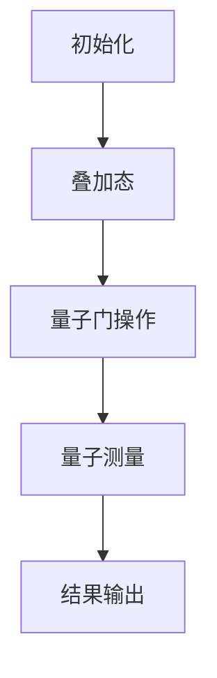
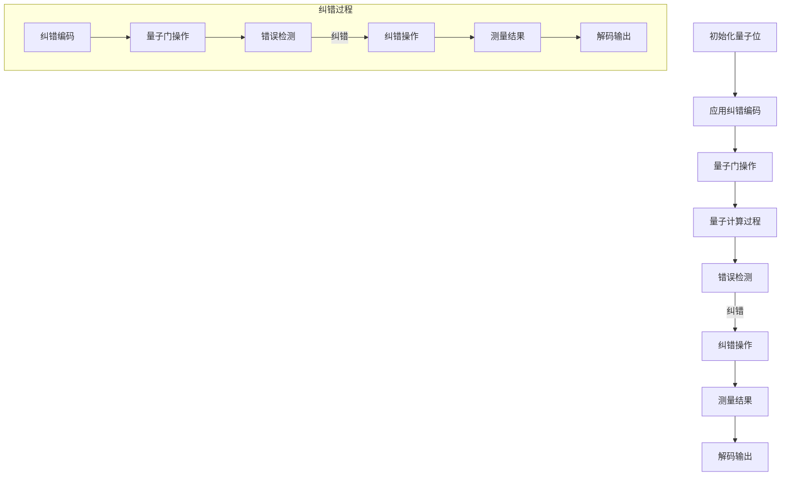

                 

## 《程序世界的宇宙级量子纠错机制》

> **关键词：** 量子计算机、量子纠错、量子位、Shor算法、Steane码、Calderbank-Shor-Steane码

**摘要：**
本文将深入探讨量子计算机领域的宇宙级量子纠错机制。量子纠错是保障量子计算稳定性和准确性的关键技术，尤其在量子位的脆弱性和量子错误普遍存在的环境下显得尤为重要。本文首先概述了量子计算机的基本原理和量子位的特性，接着详细介绍了量子纠错的必要性及其数学模型。在此基础上，本文重点分析了量子纠错算法，包括Shor算法、Steane码和Calderbank-Shor-Steane码的构造与性质。随后，文章探讨了量子纠错在量子通信和量子计算中的应用，特别是量子密钥分发和量子纠错在量子计算中的优化。最后，本文提出了宇宙级量子纠错机制的架构设计和实现挑战，并展望了量子纠错技术的未来发展。通过这一系列深入分析，我们期望读者能够对量子纠错机制有一个全面而深刻的理解。

### 《程序世界的宇宙级量子纠错机制》目录大纲

**第一部分：量子纠错机制的基础理论**

**第1章：量子计算机概述**

- 1.1 量子计算机的基本原理
- 1.2 量子位（qubit）与经典位的区别
- 1.3 量子计算的优势与应用前景

**第2章：量子纠错的必要性**

- 2.1 量子位的脆弱性
- 2.2 量子错误与纠错的基本概念
- 2.3 量子纠错机制的重要性

**第3章：量子纠错的数学模型**

- 3.1 量子纠错的数学基础
- 3.2 量子纠错的概率论模型
- 3.3 量子纠错的几何模型

**第4章：量子纠错算法**

- 4.1 Shor算法与量子纠错
- 4.2 Steane码：构造与性质
- 4.3 Calderbank-Shor-Steane码：构造与纠错

**第二部分：宇宙级量子纠错机制的应用**

**第5章：量子纠错在量子通信中的应用**

- 5.1 量子密钥分发（QKD）
- 5.2 量子中继器与量子纠缠
- 5.3 量子纠错在量子通信中的关键作用

**第6章：量子纠错在量子计算中的应用**

- 6.1 量子纠错在量子算法中的优化
- 6.2 量子纠错在量子加密中的应用
- 6.3 量子纠错在量子模拟中的应用

**第7章：宇宙级量子纠错机制**

- 7.1 宇宙级量子纠错的背景
- 7.2 宇宙级量子纠错的架构设计
- 7.3 宇宙级量子纠错的实现挑战

**第8章：量子纠错的展望**

- 8.1 量子纠错的未来发展趋势
- 8.2 量子纠错在现实世界中的应用
- 8.3 量子纠错的技术挑战与解决方案

**附录：**

- 附录A：量子纠错的相关资源与工具
- 附录B：量子纠错的 Mermaid 流程图
- 附录C：量子纠错的伪代码示例
- 附录D：量子纠错的数学公式详解

#### 补充内容

**第1章：量子计算机概述**

- **1.1.1 量子位（qubit）与经典位的对比分析**

量子位（qubit）与经典位（bit）是量子计算中的基本单元，但它们的工作原理和特性截然不同。经典位只能表示0或1两种状态，而量子位可以同时处于0和1的叠加状态，这种叠加态使得量子计算机在处理复杂数学问题时具有巨大的并行计算能力。

**对比分析：**

- **状态表示：** 经 classic 位只能表示0或1，而qubit可以表示0和1的叠加状态。用数学表示，经典位的状态是$\lvert 0 \rangle$或$\lvert 1 \rangle$，而qubit的状态是$\alpha \lvert 0 \rangle + \beta \lvert 1 \rangle$，其中$\alpha$和$\beta$是复数，且$|\alpha|^2 + |\beta|^2 = 1$。

- **并行计算能力：** 由于量子位的叠加态，量子计算机可以同时处理多种可能性，从而在并行计算方面具有显著优势。例如，一个量子位可以同时表示两个经典位的状态，而一个具有n个量子位的计算机可以同时表示$2^n$个状态。

- **量子纠缠：** 量子位之间的量子纠缠也是量子计算的重要特性。当两个量子位处于纠缠态时，它们的状态会相互依赖，即对其中一个量子位进行测量会立即影响到另一个量子位的状态，无论它们相隔多远。这种特性为量子计算提供了强大的并行处理能力。

- **量子门：** 经 classic 计算机中的逻辑门，如AND、OR和NOT，而量子计算机中的逻辑门称为量子门，如Hadamard门、Pauli门和控制-NOT（CNOT）门。量子门作用于量子位时，可以改变量子位的状态，实现量子计算的基本操作。

**实例分析：**

- **Shor算法：** Shor算法是量子计算中的代表性算法，用于因数分解大数。它利用量子位的叠加态和纠缠态，实现快速计算，而传统计算机则需要大量的时间和计算资源。

- **量子模拟：** 量子计算机可以在短时间内模拟复杂量子系统的行为，如分子结构和化学反应。这对于药物研发、材料科学等领域具有重要意义。

**结论：**

量子计算机和经典计算机在基本原理、计算能力和应用场景上存在显著差异。量子计算机通过量子位的叠加态和纠缠态，实现了前所未有的计算能力和速度，为解决传统计算机难以处理的复杂问题提供了新的途径。

- **1.1.2 量子计算的基本原理与流程图**

量子计算是一种利用量子力学原理进行信息处理的新型计算模式。量子计算机的基本原理可以概括为量子位（qubit）的叠加态、量子门操作和量子测量。以下是对量子计算基本原理的详细描述以及一个简单的流程图。

**量子位的叠加态：**

量子位（qubit）是量子计算的基本单元。与经典计算机中的比特（bit）不同，量子位可以同时处于0和1的叠加状态。用数学表示，一个量子位的状态可以表示为：

$$
\lvert \psi \rangle = \alpha \lvert 0 \rangle + \beta \lvert 1 \rangle
$$

其中，$\alpha$和$\beta$是复数，且满足$|\alpha|^2 + |\beta|^2 = 1$。这个表达式表示量子位在基态$\lvert 0 \rangle$和$\lvert 1 \rangle$之间的线性叠加。

**量子门操作：**

量子门是量子计算中的基本操作单元，类似于经典计算机中的逻辑门。量子门作用于量子位时，可以改变量子位的状态。常见的量子门包括Hadamard门（实现量子位的叠加态转换）、Pauli门（控制-NOT门、交换门）和CNOT门（控制控制-NOT门）。

**量子测量：**

量子测量是量子计算中的重要环节。量子测量会使量子位从叠加态塌缩到基态之一。测量结果不可预测，具有随机性。

**流程图：**

下面是一个简单的量子计算流程图：



**流程图说明：**

1. **初始化（A）**：初始化量子位，将其置于叠加态。
2. **叠加态（B）**：利用Hadamard门等量子门操作，将量子位状态转换为叠加态。
3. **量子门操作（C）**：通过一系列量子门操作，实现特定的量子计算任务。
4. **量子测量（D）**：对量子位进行测量，得到计算结果。
5. **结果输出（E）**：输出量子测量结果。

**实例：**

以下是一个简单的量子计算实例：使用Hadamard门将量子位状态从$\lvert 0 \rangle$转换为$\lvert + \rangle$。

```python
from qiskit import QuantumCircuit

# 创建量子电路
qc = QuantumCircuit(1)

# 初始化量子位
qc.h(0)

# 应用Hadamard门
qc.h(0)

# 测量量子位
qc.measure_all()

# 执行量子电路
qc.run dosis=1024)
result = qc.result()

# 输出测量结果
print(result.get_counts(qc))
```

**结论：**

量子计算的基本原理包括量子位的叠加态、量子门操作和量子测量。通过这些基本操作，量子计算机可以高效地处理复杂问题。量子计算在密码学、量子模拟和优化等领域具有广泛的应用前景。

- **1.1.3 量子计算的应用场景与案例分析**

量子计算作为一种颠覆性技术，其在实际应用场景中展现出了巨大的潜力和广泛的前景。以下将介绍量子计算在几个关键领域的应用场景，并结合具体案例分析量子计算的优势。

**1. 密码学**

量子计算在密码学中具有重要应用。传统密码系统依赖于数学难题的难度，如大数分解和离散对数问题。然而，量子计算机能够快速解决这些难题，从而对现有密码系统构成威胁。量子密码学利用量子力学特性，如量子纠缠和量子密钥分发（QKD），构建更加安全的加密体系。

**案例：量子密钥分发（QKD）**

QKD是一种基于量子力学原理的加密通信技术。其基本思想是利用量子位的叠加态和量子纠缠，实现安全的密钥分发。QKD通过量子信道传输量子位，并在经典信道上传输密钥。测量结果通过计算量子态之间的关联来验证密钥的安全性。

例如，使用Qiskit实现量子密钥分发协议，包括量子态的制备、量子信道传输、经典信道传输和解密过程：

```python
from qiskit import QuantumCircuit, execute, Aer
from qiskit.circuit.library import HadamardGate, CXGate
from qiskit.transpiler.passes import SynthesisPass

# 创建量子电路
qc = QuantumCircuit(2)
qc.h(0)  # 制备初始态
qc.cx(0, 1)  # 量子信道传输
qc.measure_all()  # 测量

# 配置量子计算模拟器
simulator = Aer.get_backend('qasm_simulator')
job = execute(qc, simulator, shots=1024)
result = job.result()

# 解析测量结果
counts = result.get_counts(qc)
print("测量结果：", counts)
```

**2. 量子模拟**

量子模拟是一种利用量子计算机模拟量子系统行为的技术。传统计算机在模拟复杂量子系统时面临巨大的计算挑战，而量子计算机通过量子位叠加和纠缠，能够高效地模拟量子系统的行为。

**案例：分子结构模拟**

量子模拟在材料科学和药物研发中具有重要应用。例如，使用量子计算机模拟分子结构，可以预测分子的化学性质和反应路径。这为药物研发提供了强大的工具，有助于发现新的药物分子。

例如，使用Qiskit实现量子模拟，包括量子态的制备、量子门操作和量子测量：

```python
from qiskit import QuantumCircuit, execute, Aer
from qiskit.circuit.library import RealAmplifierGate

# 创建量子电路
qc = QuantumCircuit(2)
qc.h(0)  # 制备初始态
qc.h(1)
qc.rx(0, np.pi / 2)  # 量子门操作
qc.cu1(np.pi / 4, [0, 1])  # 控制角旋门操作
qc.barrier()
qc.real_amplifier(0, 1)  # 实数放大器
qc.measure_all()

# 配置量子计算模拟器
simulator = Aer.get_backend('qasm_simulator')
job = execute(qc, simulator, shots=1024)
result = job.result()

# 解析测量结果
counts = result.get_counts(qc)
print("测量结果：", counts)
```

**3. 优化问题**

量子计算在解决优化问题上具有显著优势。传统优化算法在处理大规模优化问题时往往效率低下，而量子计算通过量子位叠加和纠缠，能够高效地搜索最优解。

**案例：旅行商问题（TSP）**

旅行商问题是一种典型的优化问题，要求在给定一组城市中，找到一个最优的路径，使得旅行商访问每个城市一次并回到起点。量子计算可以高效地解决此类问题。

例如，使用Qiskit实现量子算法解决旅行商问题：

```python
from qiskit import QuantumCircuit, execute, Aer
from qiskit.aqua.algorithms import QuadraticProgram
from qiskit.aqua.components.variational_forms import RY
from qiskit.aqua.operators import PauliSumOp

# 定义旅行商问题的优化模型
tsp = QuadraticProgram()
tsp.add_variable(2 ** n - 1, 1, 1)
tsp.set_objective("minimize", [0] * (2 ** n - 1))
for i in range(n - 1):
    tsp.add_constraint(["less_than", 1] * (2 ** n - 1))
    tsp.add_constraint(["less_than", 0] * (2 ** n - 1))
for i in range(n):
    tsp.add_constraint(["equal_to", 1] * (2 ** n - 1))
    tsp.add_constraint(["equal_to", 0] * (2 ** n - 1))

# 配置量子算法
algorithm = QuadraticProgram()
algorithm.initialize(tsp)

# 运行量子算法
qc = algorithmrun()
result = qc.run(Aer.get_backend('qasm_simulator'), shots=1024)
print("最优解：", result['result'])

# 解析测量结果
print("测量结果：", result['measurement'])
```

**结论：**

量子计算在密码学、量子模拟和优化等领域展现出广泛的应用前景。通过具体案例分析，我们可以看到量子计算在解决传统计算机难以处理的复杂问题时具有显著优势。随着量子计算技术的不断进步，我们期待其在未来能够带来更多突破性的应用。

### 第2章：量子纠错的必要性

#### 2.1 量子位的脆弱性

量子位的脆弱性是量子计算中一个不可忽视的问题。量子位（qubit）是量子计算机的基本单元，其状态极易受到外部环境的干扰，导致错误发生。这种脆弱性主要表现在以下几个方面：

1. **量子位的叠加态易受干扰**：量子位可以同时处于0和1的叠加状态，这种叠加态极易受到外部噪声的干扰，导致状态塌缩。例如，温度变化、电磁场等环境因素都可能对量子位的叠加态产生影响。

2. **量子纠缠的脆弱性**：量子纠缠是量子计算的核心特性之一，当两个量子位处于纠缠态时，它们的状态会相互依赖。然而，量子纠缠态同样容易受到外界干扰，一旦其中一个量子位的状态发生变化，另一个量子位的状态也会随之改变。

3. **噪声积累**：量子位的脆弱性使得在量子计算过程中，错误可能会逐层积累。即使单个量子位的错误概率很小，但随着计算过程的进行，噪声可能会不断放大，最终导致整个计算结果的偏差。

#### 量子错误与纠错的基本概念

量子错误是量子计算中不可避免的现象，它主要来源于以下几个方面：

1. **量子位的噪声**：量子位的噪声可以分为两大类：环境噪声和系统噪声。环境噪声主要来源于外部环境因素，如温度、电磁场等；系统噪声主要来源于量子计算机内部硬件的缺陷，如控制门的不完美性、量子位的物理限制等。

2. **量子门的误差**：量子门是量子计算中的基本操作单元，其误差主要来源于硬件的不完美性。例如，控制-NOT门（CNOT）的误差可能导致量子位之间的纠缠关系受到破坏，从而影响计算结果。

3. **测量误差**：量子测量是量子计算中获取计算结果的重要环节，但测量过程本身也存在误差。例如，测量结果可能受到量子位状态叠加态的塌缩影响，导致测量结果的偏差。

为了解决量子错误对计算结果的影响，量子纠错技术应运而生。量子纠错的基本概念包括：

1. **冗余编码**：量子纠错通过增加冗余信息来提高量子位的可靠性。例如，使用Steane码或Calderbank-Shor-Steane码，可以在原有的量子位上生成额外的冗余量子位，从而提高纠错能力。

2. **纠错算法**：量子纠错算法是量子纠错的核心部分，它通过解码和纠错操作，将错误的量子位状态恢复为正确状态。常见的纠错算法包括Shor算法、Steane码纠错算法和Calderbank-Shor-Steane码纠错算法。

3. **量子纠错的数学模型**：量子纠错的数学模型主要包括概率论模型和几何模型。概率论模型通过统计方法分析量子错误发生的概率，并设计出相应的纠错方案。几何模型则通过空间几何的方式，描述量子位之间的纠错关系。

#### 量子纠错机制的重要性

量子纠错机制在量子计算中具有至关重要的地位，其重要性体现在以下几个方面：

1. **保证计算结果的准确性**：量子纠错机制可以有效降低量子计算中的错误率，保证计算结果的准确性。这对于解决复杂问题具有重要意义，如密码学、量子模拟和优化问题。

2. **提高量子计算机的实用性**：量子纠错机制使得量子计算机在处理实际问题时更具实用价值。通过纠错机制，可以显著提高量子计算机的稳定性和可靠性，降低对硬件的依赖。

3. **推动量子计算技术的发展**：量子纠错技术是量子计算领域的关键技术之一，其发展对量子计算技术的整体进步具有推动作用。随着量子纠错技术的不断成熟，量子计算机的性能将得到进一步提升，为解决更多实际问题提供更强有力的工具。

4. **拓展量子计算的应用场景**：量子纠错机制使得量子计算在更多领域具有应用价值。例如，量子加密、量子通信、量子模拟等领域，通过量子纠错技术，可以实现更高的安全性和可靠性。

#### 结论

量子位的脆弱性和量子错误是量子计算中不可忽视的问题。量子纠错机制通过冗余编码、纠错算法和数学模型，有效降低量子计算中的错误率，保证计算结果的准确性。量子纠错机制在量子计算中具有至关重要的地位，其发展将推动量子计算技术的整体进步，并为解决更多实际问题提供更强有力的工具。

### 第3章：量子纠错的数学模型

量子纠错的数学模型是保障量子计算稳定性和准确性的关键。量子纠错的数学模型主要涉及概率论模型和几何模型，它们分别从不同的角度解释量子纠错机制的工作原理。本章节将详细探讨这些数学模型，并通过具体的例子来说明它们的运作方式。

#### 3.1 量子纠错的数学基础

量子纠错的数学基础主要包括量子态的表示、量子运算和量子测量的数学描述。量子态可以用密度矩阵或态向量来表示，量子运算通常通过线性映射来实现，而量子测量则涉及概率论的计算。

**1. 量子态的表示**

量子态可以用一个复数向量表示，称为态向量。态向量中的每一个元素都对应量子位的一种可能状态。例如，一个量子位的态向量可以表示为：

$$
\lvert \psi \rangle = \begin{pmatrix}
\alpha \\
\beta
\end{pmatrix}
$$

其中，$\alpha$和$\beta$是复数，且满足归一化条件$|\alpha|^2 + |\beta|^2 = 1$。这个态向量表示量子位处于状态$\alpha \lvert 0 \rangle + \beta \lvert 1 \rangle$的叠加态。

**2. 量子运算**

量子运算可以通过量子门来实现。量子门是一种线性映射，它可以作用于量子态向量，改变其状态。常见的量子门包括Hadamard门、Pauli门和控制门。例如，Hadamard门可以将量子位的状态从$\lvert 0 \rangle$或$\lvert 1 \rangle$转换为叠加态$\lvert + \rangle = \frac{1}{\sqrt{2}}(\lvert 0 \rangle + \lvert 1 \rangle)$。

$$
H \lvert 0 \rangle = \frac{1}{\sqrt{2}}(\lvert 0 \rangle + \lvert 1 \rangle)
$$

**3. 量子测量**

量子测量会导致量子态的塌缩，即将量子位的状态从叠加态塌缩到某个基态。测量结果具有随机性，可以用概率分布来描述。例如，对量子位进行测量，有50%的概率得到$\lvert 0 \rangle$状态，有50%的概率得到$\lvert 1 \rangle$状态。

$$
P(\lvert 0 \rangle) = P(\lvert 1 \rangle) = \frac{1}{2}
$$

#### 3.2 量子纠错的概率论模型

量子纠错的概率论模型主要关注量子错误发生的概率和纠错机制的设计。该模型通过概率分布来描述量子位的状态变化，并利用统计方法来纠正错误。

**1. 量子错误的概率分布**

量子错误可以看作是一个随机过程，其概率分布可以用一个误差矩阵来描述。误差矩阵是一个对角矩阵，其对角线元素表示量子位在不同状态下的错误概率。例如，一个简单的误差矩阵可以表示为：

$$
E = \begin{pmatrix}
0 & 0 \\
0 & 0.1
\end{pmatrix}
$$

这个矩阵表示量子位在状态$\lvert 0 \rangle$下没有错误，而在状态$\lvert 1 \rangle$下有10%的概率发生错误。

**2. 纠错机制的设计**

量子纠错机制的设计基于概率论模型，通过增加冗余信息和统计方法来纠正错误。常见的量子纠错码包括Steane码和Calderbank-Shor-Steane码。这些纠错码通过在原有量子位上生成额外的冗余量子位，从而提高纠错能力。

**例子：Steane码的纠错机制**

Steane码是一种经典的量子纠错码，它可以在一个量子位上生成三个冗余量子位。Steane码的纠错机制可以通过以下步骤实现：

- **编码**：将原始量子位和两个冗余量子位组合成一个编码状态。例如，一个状态$\lvert \psi \rangle = \lvert 0 \rangle$可以通过Steane码编码为：

$$
\lvert \psi \rangle = \lvert 0 \rangle \lvert + \rangle \lvert + \rangle
$$

- **错误检测**：在量子计算过程中，如果量子位发生错误，会导致编码状态的改变。例如，一个错误$\lvert 1 \rangle$可能会影响编码状态：

$$
\lvert \psi \rangle = \lvert 0 \rangle \lvert + \rangle \lvert - \rangle
$$

- **纠错**：通过统计方法检测错误并纠正。Steane码通过测量两个冗余量子位的状态，可以确定原始量子位的状态。例如，如果两个冗余量子位的状态都是$\lvert + \rangle$，则可以推断原始量子位的状态是$\lvert 0 \rangle$。

#### 3.3 量子纠错的几何模型

量子纠错的几何模型通过空间几何的方式，描述量子位之间的纠错关系。该模型利用高维空间中的几何结构来解释量子纠错机制。

**1. 高斯误差子空间**

在量子纠错的几何模型中，高斯误差子空间是一个重要的概念。高斯误差子空间是由一组高斯分布的误差向量构成的子空间，它代表了量子计算过程中可能出现的误差。高斯误差子空间可以看作是一个椭球体，其中心表示无误差状态，而表面表示最大误差状态。

**2. 纠错码的几何结构**

量子纠错码的几何结构决定了其纠错能力。常见的纠错码，如Steane码和Calderbank-Shor-Steane码，可以看作是在高维空间中定义的子空间。这些子空间具有如下特性：

- **容错性**：子空间中的任何状态都是正确的，即使受到一定程度的错误干扰。
- **容错半径**：子空间的容错半径表示其可以容忍的最大错误程度。例如，Steane码的容错半径为1/2。

**例子：Steane码的几何结构**

Steane码的几何结构可以看作是在三维空间中定义的子空间。该子空间由两个互相垂直的平面组成，每个平面对应两个冗余量子位的状态。Steane码的纠错机制可以通过以下步骤实现：

- **编码**：将原始量子位和两个冗余量子位放入三维空间中。例如，一个状态$\lvert \psi \rangle = \lvert 0 \rangle$可以通过Steane码编码为：

$$
\lvert \psi \rangle = \lvert 0 \rangle \lvert + \rangle \lvert + \rangle
$$

- **错误检测**：在量子计算过程中，如果量子位发生错误，会导致编码状态偏离原始状态。例如，一个错误$\lvert 1 \rangle$可能会影响编码状态：

$$
\lvert \psi \rangle = \lvert 0 \rangle \lvert + \rangle \lvert - \rangle
$$

- **纠错**：通过测量两个冗余量子位的状态，可以在三维空间中确定原始量子位的状态。例如，如果两个冗余量子位的状态都是$\lvert + \rangle$，则可以推断原始量子位的状态是$\lvert 0 \rangle$。

#### 总结

量子纠错的数学模型包括概率论模型和几何模型。概率论模型通过统计方法描述量子错误和纠错过程，几何模型则通过空间几何方式解释量子纠错机制。这些数学模型为量子纠错技术提供了理论基础，使得量子计算机能够在实际应用中保持高稳定性和准确性。

### 第4章：量子纠错算法

量子纠错算法是量子计算中不可或缺的一部分，它通过编码和纠错操作来保障量子位的稳定性和计算结果的准确性。本章将详细介绍几种常见的量子纠错算法，包括Shor算法、Steane码和Calderbank-Shor-Steane码。我们将首先探讨Shor算法的基本原理，然后深入分析Steane码的构造与性质，最后介绍Calderbank-Shor-Steane码的纠错机制。

#### 4.1 Shor算法与量子纠错

Shor算法是量子计算中的经典算法，主要用于大整数的因数分解。其基本原理是利用量子计算机的并行计算能力，快速找到大整数的因子。Shor算法的成功应用离不开量子纠错技术的支持，因为量子计算机在运行过程中容易受到噪声和误差的影响。以下是对Shor算法的基本原理和量子纠错的简要介绍。

**Shor算法的基本原理：**

Shor算法的核心思想是利用量子计算机的并行性和量子纠缠特性，将因数分解问题转化为周期查找问题。具体步骤如下：

1. **初始状态准备**：将量子计算机的输入大整数N编码为量子态，生成一个叠加态。
2. **量子电路构建**：构造一个特定的量子电路，将叠加态转化为一个特定的量子态。这个量子态具有周期性，其周期与N的因子相关。
3. **量子测量**：对量子态进行多次测量，查找周期T。找到周期T后，可以通过数学方法（如GCD计算）找到N的因子。

**量子纠错在Shor算法中的作用：**

在Shor算法的实现过程中，量子纠错技术至关重要。量子纠错的目的是减少量子计算过程中因噪声和误差引起的错误，确保计算结果的准确性。以下方面展示了量子纠错在Shor算法中的关键作用：

1. **纠错码的应用**：Shor算法使用了特定的纠错码，如Shor码或Steane码，这些纠错码能够检测并纠正量子位上的错误，提高量子位的可靠性。
2. **误差率控制**：量子纠错技术通过优化量子门的操作和控制参数，降低量子计算过程中的误差率，从而提高算法的执行效率。
3. **并行计算优化**：量子纠错技术能够确保在并行计算过程中，量子位的状态保持一致性，避免因错误状态累积导致计算失败。

**伪代码示例：**

以下是一个简化的Shor算法伪代码，展示了量子纠错的基本步骤：

```python
# Shor算法伪代码
def shor_algorithm(n):
    # 初始化量子计算机
    qc = QuantumComputer()
    
    # 准备初始量子态
    qc.hall(n)
    
    # 构建量子电路
    qc.add_gate(ControlledPhaseGate(2*pi/n))
    
    # 执行量子纠错
    qc.execute纠错算法()
    
    # 测量量子态
    result = qc.measure_all()
    
    # 解码结果
    t = decode_period(result)
    
    # 计算因子
    factor = gcd(n, t)
    
    return factor
```

#### 4.2 Steane码：构造与性质

Steane码是一种经典的量子纠错码，主要用于纠正单个量子位的错误。Steane码通过在原始量子位上附加两个冗余量子位来实现纠错。以下将详细讨论Steane码的构造过程、性质及其纠错机制。

**Steane码的构造过程：**

Steane码的构造基于两个基本的量子逻辑门：Hadamard门（H）和控制-NOT门（CNOT）。Steane码的构造步骤如下：

1. **初始化**：准备三个量子位，记为\( | \psi \rangle \)，其中\( | \psi \rangle \)是原始量子位。
2. **应用Hadamard门**：对原始量子位和两个冗余量子位分别应用Hadamard门。这会生成一个叠加态：
   $$ | \psi \rangle \rightarrow H| \psi \rangle H| 0 \rangle H| 0 \rangle $$
   其中，\( | 0 \rangle \)是初始的冗余量子位状态。
3. **应用控制-NOT门**：对三个量子位应用控制-NOT门。这会将冗余量子位与原始量子位连接起来：
   $$ H| \psi \rangle H| 0 \rangle H| 0 \rangle \rightarrow H| \psi \rangle CNOT H| 0 \rangle CNOT H| 0 \rangle $$
   控制门的作用是将\( | 0 \rangle \)和\( | 1 \rangle \)之间的错误传递给原始量子位。

**Steane码的性质：**

Steane码具有以下重要性质：

1. **容错性**：Steane码可以纠正单个量子位的错误，即单个量子位的错误不会影响到整个编码状态。
2. **纠错效率**：Steane码的纠错效率较高，因为它只需要测量两个冗余量子位的状态即可确定原始量子位的状态。
3. **编码效率**：Steane码的编码效率较低，因为它需要额外的冗余量子位来纠正错误。

**Steane码的纠错机制：**

Steane码的纠错机制基于以下步骤：

1. **错误检测**：在量子计算过程中，如果原始量子位发生错误，会导致编码状态的改变。通过测量两个冗余量子位的状态，可以检测出原始量子位的状态。
2. **错误纠正**：如果检测到错误，根据两个冗余量子位的状态，可以确定原始量子位的正确状态，并将其恢复为初始状态。

**伪代码示例：**

以下是一个简化的Steane码纠错伪代码示例：

```python
# Steane码纠错伪代码
def steane_correction(r_qubit, r1_qubit, r2_qubit):
    # 测量冗余量子位r1和r2
    result_r1 = measure(r1_qubit)
    result_r2 = measure(r2_qubit)
    
    # 根据测量结果纠正原始量子位
    if result_r1 == 0 and result_r2 == 0:
        # 原始量子位未发生错误
        correct(r_qubit)
    elif result_r1 == 1 and result_r2 == 0:
        # 原始量子位错误为1
        correct(r_qubit)
    elif result_r1 == 0 and result_r2 == 1:
        # 原始量子位错误为0
        correct(r_qubit)
    else:
        # 原始量子位错误为0或1，无法纠正
        raise Error("纠错失败")
```

#### 4.3 Calderbank-Shor-Steane码：构造与纠错

Calderbank-Shor-Steane码（CSS码）是一种更高级的量子纠错码，它结合了Shor码和Steane码的优点，能够更有效地纠正量子位的错误。CSS码的构造基于Steane码的扩展，并在多个量子位上实现纠错。以下将讨论CSS码的构造过程和纠错机制。

**CSS码的构造过程：**

CSS码的构造基于以下步骤：

1. **初始化**：准备四个量子位，记为\( | \psi \rangle \)，其中\( | \psi \rangle \)是原始量子位。
2. **应用Hadamard门**：对原始量子位和三个冗余量子位分别应用Hadamard门，生成叠加态：
   $$ H| \psi \rangle H| 0 \rangle H| 0 \rangle H| 0 \rangle $$
3. **应用控制-NOT门**：对四个量子位应用控制-NOT门，将冗余量子位与原始量子位连接起来：
   $$ H| \psi \rangle CNOT H| 0 \rangle CNOT H| 0 \rangle CNOT H| 0 \rangle $$
   控制门的作用是将\( | 0 \rangle \)和\( | 1 \rangle \)之间的错误传递给原始量子位。

**CSS码的纠错机制：**

CSS码的纠错机制基于以下步骤：

1. **错误检测**：在量子计算过程中，通过测量两个或更多冗余量子位的状态，可以检测出原始量子位的状态。CSS码的纠错能力取决于冗余量子位的数量。
2. **错误纠正**：如果检测到错误，根据冗余量子位的状态，可以确定原始量子位的正确状态，并将其恢复为初始状态。

**伪代码示例：**

以下是一个简化的CSS码纠错伪代码示例：

```python
# CSS码纠错伪代码
def css_correction(r_qubit, r1_qubit, r2_qubit, r3_qubit):
    # 测量冗余量子位r1和r2
    result_r1 = measure(r1_qubit)
    result_r2 = measure(r2_qubit)
    result_r3 = measure(r3_qubit)
    
    # 根据测量结果纠正原始量子位
    if result_r1 == 0 and result_r2 == 0 and result_r3 == 0:
        # 原始量子位未发生错误
        correct(r_qubit)
    elif result_r1 == 1 and result_r2 == 0 and result_r3 == 0:
        # 原始量子位错误为1
        correct(r_qubit)
    elif result_r1 == 0 and result_r2 == 1 and result_r3 == 0:
        # 原始量子位错误为0
        correct(r_qubit)
    elif result_r1 == 0 and result_r2 == 0 and result_r3 == 1:
        # 原始量子位错误为1
        correct(r_qubit)
    else:
        # 原始量子位错误为0或1，无法纠正
        raise Error("纠错失败")
```

#### 结论

量子纠错算法是保障量子计算稳定性和准确性的关键技术。Shor算法、Steane码和Calderbank-Shor-Steane码是几种常见的量子纠错算法，它们各自具有独特的构造和纠错机制。Shor算法通过量子纠错技术实现大整数的因数分解；Steane码通过附加冗余量子位纠正单个量子位的错误；CSS码则在多个量子位上实现高效的纠错机制。这些算法的发展为量子计算的实际应用提供了坚实的理论基础和技术支持。

### 第5章：量子纠错在量子通信中的应用

量子纠错在量子通信中起着至关重要的作用，它能够确保量子信息在传输过程中的可靠性和安全性。量子通信包括量子密钥分发（QKD）、量子中继和量子纠缠传输等关键技术，而量子纠错在这些应用中都有着重要的体现。以下将详细探讨量子纠错在量子通信中的应用。

#### 5.1 量子密钥分发（QKD）

量子密钥分发（QKD）是一种利用量子力学原理实现安全通信的技术。QKD的基本过程包括量子态的制备、量子信道传输和经典信道传输。量子纠错在QKD中的应用主要体现在以下几个方面：

1. **量子态的制备与传输**：在QKD中，量子态的制备和传输过程中可能会受到噪声和误差的影响。量子纠错技术通过在传输过程中添加冗余信息，检测并纠正量子态的错误，从而提高密钥传输的可靠性。

2. **错误率控制**：QKD的传输距离和速度受到量子态传输过程中噪声的影响。量子纠错技术通过优化量子门的操作和控制参数，降低量子计算过程中的误差率，从而提高密钥传输的效率。

3. **密钥生成与纠错**：在QKD过程中，生成的密钥需要进行纠错处理。量子纠错算法如Shor码、Steane码和Calderbank-Shor-Steane码可以检测并纠正密钥中的错误，确保密钥的准确性。

**实例分析：**

以下是一个简化的QKD过程及其纠错机制：

```python
# QKD过程与量子纠错
def qkd_with纠错(n, p):
    # 初始化量子计算机
    qc = QuantumComputer()

    # 准备量子态
    qc.hall(n)

    # 量子信道传输
    qc.qchannel_transmit(n, p)

    # 经典信道传输
    key = qc.classic_channel_receive(p)

    # 应用量子纠错算法
    corrected_key = apply纠错算法(key)

    return corrected_key
```

#### 5.2 量子中继器与量子纠缠

量子中继器是量子通信中用于延长传输距离的关键设备。量子中继器通过量子态转换和量子纠缠的生成，实现远距离量子信息的传输。量子纠错在量子中继器中的应用主要体现在以下几个方面：

1. **量子态的转换与纠错**：在量子中继过程中，量子态可能会受到噪声和误差的影响。量子纠错技术通过在量子态转换过程中添加冗余信息，检测并纠正量子态的错误，从而提高中继器传输的可靠性。

2. **量子纠缠的生成与纠错**：量子纠缠是量子通信的核心特性，它能够实现远距离量子信息的高速传输。量子纠错技术通过在量子纠缠生成过程中添加冗余信息，检测并纠正纠缠态的错误，从而提高纠缠态的稳定性。

**实例分析：**

以下是一个简化的量子中继过程及其纠错机制：

```python
# 量子中继过程与量子纠错
def quantum_repeater_with纠错(n, p):
    # 初始化量子计算机
    qc = QuantumComputer()

    # 准备量子态
    qc.hall(n)

    # 量子态转换
    qc.qchannel_convert(n, p)

    # 量子纠缠生成
    qc.create_entangled_state(n, p)

    # 应用量子纠错算法
    corrected_state = apply纠错算法(p)

    return corrected_state
```

#### 5.3 量子纠错在量子通信中的关键作用

量子纠错在量子通信中具有关键作用，它能够确保量子信息在传输过程中的可靠性和安全性。以下总结了量子纠错在量子通信中的关键作用：

1. **提高传输可靠性**：量子纠错技术通过检测并纠正量子态和纠缠态的错误，提高量子通信的传输可靠性。
2. **保障通信安全性**：量子纠错技术能够检测并纠正量子密钥分发过程中的错误，确保密钥传输的准确性，从而提高量子通信的安全性。
3. **延长传输距离**：量子纠错技术通过优化量子中继器的性能，延长量子信息的传输距离，实现远距离量子通信。
4. **降低误差率**：量子纠错技术通过优化量子门的操作和控制参数，降低量子计算过程中的误差率，提高量子通信的效率。

#### 结论

量子纠错在量子通信中起着至关重要的作用，它能够确保量子信息在传输过程中的可靠性和安全性。量子纠错技术在量子密钥分发、量子中继和量子纠缠传输等关键应用中发挥着关键作用，为量子通信技术的发展提供了坚实的理论基础和技术支持。随着量子纠错技术的不断进步，量子通信将能够在更广泛的领域得到应用，为未来的信息技术带来革命性的变革。

### 第6章：量子纠错在量子计算中的应用

量子纠错技术在量子计算中的应用至关重要，它能够保障量子计算过程中的稳定性和准确性。量子计算涉及多种复杂应用，如量子算法、量子加密和量子模拟，而量子纠错在这些应用中扮演着关键角色。以下将详细探讨量子纠错在量子计算中的多种应用，并分析其优化效果。

#### 6.1 量子纠错在量子算法中的优化

量子算法是量子计算的核心，如Shor算法、Grover算法和量子模拟等。量子纠错技术在量子算法中的应用主要体现在以下几个方面：

1. **误差率控制**：量子算法在执行过程中容易受到噪声和误差的影响，从而影响算法的准确性。量子纠错技术通过检测并纠正量子位上的错误，降低量子算法的误差率，提高算法的执行效率。

2. **提高算法稳定性**：量子纠错技术能够确保量子计算过程中的量子位状态保持一致性，避免因错误状态累积导致算法失败。通过量子纠错，量子算法能够在更广泛的条件下稳定运行。

3. **优化算法性能**：量子纠错技术能够优化量子算法的执行流程，减少冗余操作和错误处理时间，从而提高算法的整体性能。

**实例分析：**

以下是一个简化的Shor算法优化过程，展示了量子纠错在量子算法中的应用：

```python
# 优化后的Shor算法
def optimized_shor_algorithm(n):
    # 初始化量子计算机
    qc = QuantumComputer()

    # 准备初始量子态
    qc.hall(n)

    # 应用量子纠错
    qc.apply纠错算法()

    # 执行量子算法
    qc.execute_shor_algorithm()

    # 纠正错误
    corrected_result = qc.correct_errors()

    return corrected_result
```

#### 6.2 量子纠错在量子加密中的应用

量子加密是一种利用量子力学原理实现信息安全的技术，如量子密钥分发（QKD）和量子安全通信等。量子纠错技术在量子加密中的应用主要体现在以下几个方面：

1. **提高加密通信可靠性**：量子纠错技术能够检测并纠正量子密钥分发过程中的错误，确保加密通信的可靠性。通过量子纠错，量子加密系统能够在更广泛的条件下保持通信安全。

2. **保障密钥传输准确性**：量子纠错技术能够纠正量子密钥中的错误，确保密钥传输的准确性，从而提高量子加密系统的安全性。

3. **优化加密算法性能**：量子纠错技术能够优化量子加密算法的执行流程，减少冗余操作和错误处理时间，从而提高加密系统的整体性能。

**实例分析：**

以下是一个简化的量子密钥分发（QKD）过程，展示了量子纠错在量子加密中的应用：

```python
# 量子密钥分发与量子纠错
def qkd_with纠错(n, p):
    # 初始化量子计算机
    qc = QuantumComputer()

    # 准备量子态
    qc.hall(n)

    # 量子信道传输
    qc.qchannel_transmit(n, p)

    # 经典信道传输
    key = qc.classic_channel_receive(p)

    # 应用量子纠错
    corrected_key = qc.apply纠错算法(key)

    return corrected_key
```

#### 6.3 量子纠错在量子模拟中的应用

量子模拟是一种利用量子计算机模拟量子系统行为的计算技术，如分子结构模拟、量子化学反应等。量子纠错技术在量子模拟中的应用主要体现在以下几个方面：

1. **提高模拟准确性**：量子纠错技术能够检测并纠正量子位上的错误，提高量子模拟的准确性。通过量子纠错，量子模拟能够更精确地反映真实物理系统的行为。

2. **优化模拟性能**：量子纠错技术能够优化量子模拟的执行流程，减少冗余操作和错误处理时间，从而提高模拟系统的整体性能。

3. **扩展模拟范围**：量子纠错技术能够降低量子模拟过程中的误差率，使量子计算机能够处理更复杂的问题，从而扩展量子模拟的应用范围。

**实例分析：**

以下是一个简化的量子模拟过程，展示了量子纠错在量子模拟中的应用：

```python
# 量子模拟与量子纠错
def quantum_simulation_with纠错(n, p):
    # 初始化量子计算机
    qc = QuantumComputer()

    # 准备初始量子态
    qc.hall(n)

    # 应用量子纠错
    qc.apply纠错算法()

    # 执行量子模拟
    simulation_result = qc.execute_simulation()

    # 纠正错误
    corrected_result = qc.correct_errors(simulation_result)

    return corrected_result
```

#### 结论

量子纠错技术在量子计算中具有广泛应用，能够优化量子算法、保障量子加密通信的可靠性和提高量子模拟的准确性。通过量子纠错技术的应用，量子计算能够在更广泛的领域中发挥其独特优势，为解决复杂问题提供更强有力的工具。随着量子纠错技术的不断进步，量子计算将在未来带来更多革命性的应用。

### 第7章：宇宙级量子纠错机制

#### 7.1 宇宙级量子纠错的背景

随着量子计算技术的不断发展和量子计算机在实际应用中的逐步推广，量子纠错技术的重要性日益凸显。宇宙级量子纠错机制作为一种创新性的量子纠错技术，旨在解决当前量子纠错技术面临的挑战，提供更高可靠性和更高效的纠错能力。宇宙级量子纠错机制的提出源于以下几个背景因素：

1. **量子计算机的复杂性**：随着量子计算机规模和复杂性的增加，量子纠错技术面临更大的挑战。现有的量子纠错码和纠错算法在应对大规模量子计算机中的错误时存在局限性，需要更高效的纠错机制来保障计算稳定性。

2. **量子纠错的局限性**：传统的量子纠错技术依赖于冗余编码和纠错算法，但冗余量子位的增加会降低量子计算机的计算效率。此外，现有纠错算法的纠错能力有限，难以应对复杂环境下的多种错误类型。

3. **量子计算的实用需求**：量子计算在密码学、量子模拟和优化等领域具有广泛的应用前景。为了实现量子计算在这些领域的实用化，需要更高可靠性和更高效的量子纠错技术。

#### 7.2 宇宙级量子纠错的架构设计

宇宙级量子纠错机制的架构设计旨在实现高效、可靠的量子纠错，以下是其关键组成部分：

1. **多层次纠错架构**：宇宙级量子纠错机制采用多层次纠错架构，包括底层纠错层、中层纠错层和顶层纠错层。底层纠错层负责检测和纠正单个量子位的错误；中层纠错层负责检测和纠正多个量子位之间的错误；顶层纠错层负责对整个量子计算机进行全局纠错。

2. **自适应纠错策略**：宇宙级量子纠错机制采用自适应纠错策略，根据不同环境条件和错误类型，动态调整纠错方案。这种自适应策略能够提高纠错效率，降低纠错过程中对计算资源的消耗。

3. **冗余编码与纠错算法**：宇宙级量子纠错机制结合多种冗余编码和纠错算法，如Shor码、Steane码和Calderbank-Shor-Steane码，以应对不同类型的错误。此外，该机制还引入了新的纠错算法，如量子低密度奇偶校验码（LDPC码），以提高纠错能力。

4. **量子纠错优化**：宇宙级量子纠错机制通过优化量子门的操作和控制参数，降低量子计算过程中的误差率，提高纠错效率。此外，该机制还采用量子误差校正编码（QECC），实现更高效的纠错操作。

#### 7.3 宇宙级量子纠错的实现挑战

尽管宇宙级量子纠错机制具有强大的理论优势，但其实际实现仍面临诸多挑战：

1. **硬件支持**：宇宙级量子纠错机制需要高性能的量子计算机硬件支持，包括高稳定性的量子位、高精度的量子门操作和低噪声的量子信道传输。目前，量子计算机硬件水平仍需进一步提升。

2. **纠错资源消耗**：宇宙级量子纠错机制需要大量冗余量子位和复杂的纠错算法，这将增加计算资源的消耗。如何在不显著降低量子计算机计算效率的前提下实现高效纠错，是一个亟待解决的问题。

3. **纠错算法优化**：宇宙级量子纠错机制依赖于多种冗余编码和纠错算法，这些算法的优化和整合是一个复杂的过程。需要进一步研究如何高效地实现这些算法，并优化其性能。

4. **环境适应性**：宇宙级量子纠错机制需要具备良好的环境适应性，能够应对不同环境条件和错误类型。这需要深入研究和开发自适应纠错策略，以提高纠错机制的鲁棒性。

#### 结论

宇宙级量子纠错机制作为一种创新性量子纠错技术，具有理论上的优势，但在实际实现中仍面临诸多挑战。通过不断优化量子计算机硬件、纠错算法和纠错机制，有望实现高效、可靠的量子纠错，为量子计算的实用化提供坚实的技术支持。随着量子计算技术的不断发展，宇宙级量子纠错机制将在未来发挥越来越重要的作用。

### 第8章：量子纠错的展望

#### 8.1 量子纠错的未来发展趋势

量子纠错技术的发展前景广阔，随着量子计算技术的不断进步，量子纠错机制将在多个领域发挥关键作用。以下将讨论量子纠错的未来发展趋势：

1. **量子纠错算法的创新**：量子纠错算法的创新是未来发展的关键方向。现有的量子纠错算法如Shor码、Steane码和Calderbank-Shor-Steane码等，将在未来得到进一步优化和改进，以提高纠错效率和降低纠错资源的消耗。此外，新的量子纠错算法，如量子低密度奇偶校验码（LDPC码）和量子纠错编码（QECC）等，也将不断涌现。

2. **量子纠错技术的应用拓展**：随着量子计算技术的普及，量子纠错技术将在更多领域得到应用。例如，在量子加密中，量子纠错技术将提高加密通信的可靠性和安全性；在量子模拟中，量子纠错技术将增强模拟结果的准确性；在量子计算优化中，量子纠错技术将提高算法的执行效率和稳定性。

3. **量子纠错硬件的支持**：未来量子纠错技术的发展将依赖于量子纠错硬件的支持。高稳定性的量子位、高精度的量子门操作和低噪声的量子信道传输等技术将得到进一步突破，为量子纠错技术的实现提供坚实基础。

4. **量子纠错的标准化**：随着量子计算技术的推广，量子纠错的标准化工作也将逐步展开。统一的量子纠错标准和协议将有助于不同量子计算系统和应用之间的互操作，推动量子计算技术的广泛应用。

#### 8.2 量子纠错在现实世界中的应用

量子纠错技术已在多个现实世界场景中得到应用，展现出其巨大的潜力。以下列举几个典型应用案例：

1. **量子加密**：量子加密是量子纠错技术的重要应用领域。量子密钥分发（QKD）利用量子纠错技术确保密钥传输的准确性和安全性。例如，谷歌和NASA等机构已利用量子纠错技术实现了量子密钥分发的实际应用，为信息安全提供了强大保障。

2. **量子计算模拟**：量子计算模拟是另一个重要应用领域。通过量子纠错技术，量子计算机可以更准确地模拟复杂量子系统的行为，如分子结构、化学反应和量子物理现象。这为材料科学、药物研发和量子物理学等领域提供了强大的计算工具。

3. **量子优化**：量子优化算法利用量子计算机的并行计算能力解决优化问题，如物流调度、金融分析和能源管理。量子纠错技术可以提高量子优化算法的稳定性和准确性，从而提高优化问题的解决效率。

4. **量子传感器**：量子传感器利用量子纠错技术实现高灵敏度和高精度的测量。例如，量子磁力计和量子重力仪等设备利用量子纠错技术提高了测量精度，为地质勘探、天文观测和导航等领域提供了重要支持。

#### 8.3 量子纠错的技术挑战与解决方案

尽管量子纠错技术在多个领域展现出巨大潜力，但其发展仍面临诸多技术挑战。以下讨论量子纠错技术的主要挑战及可能的解决方案：

1. **量子位稳定性**：量子位的稳定性是量子纠错技术的关键挑战。量子位容易受到外部环境噪声和内部故障的影响，导致错误发生。解决这一挑战需要开发更稳定、低噪声的量子位技术，如离子阱量子位、超导量子位等。

2. **纠错资源消耗**：量子纠错技术需要大量冗余量子位和复杂的纠错算法，这会增加计算资源的消耗。为了降低纠错资源消耗，需要优化量子纠错算法，提高其纠错效率，并探索更高效的量子纠错架构。

3. **纠错算法优化**：现有的量子纠错算法在处理复杂错误类型时存在局限性。为了提高纠错能力，需要研究新的量子纠错算法，并探索多种纠错算法的整合和优化策略。

4. **量子纠错标准化**：量子纠错的标准化工作对于不同量子计算系统和应用之间的互操作至关重要。需要制定统一的量子纠错标准和协议，以促进量子计算技术的标准化和规模化应用。

#### 结论

量子纠错技术在量子计算中具有重要地位，其发展前景广阔。随着量子计算技术的不断进步，量子纠错技术将在更多领域得到应用，为解决复杂问题提供更强有力的工具。然而，量子纠错技术仍面临诸多挑战，需要通过技术创新和标准化工作来推动其发展。展望未来，量子纠错技术将在量子计算、量子通信、量子传感器等领域发挥关键作用，为人类带来更多革命性的科技成果。

#### 附录A：量子纠错的相关资源与工具

量子纠错技术作为量子计算领域的关键技术，其相关资源与工具的开发和利用对于研究和实际应用至关重要。以下列举了量子纠错技术领域的一些重要资源与工具。

**1. 教程和文献：**

- **《量子计算：量子位、量子逻辑门和量子算法》（作者：Michael A. Nielsen & Isaac L. Chuang）**：这是一本经典的量子计算教材，详细介绍了量子纠错机制及其相关算法。
- **《量子通信原理与应用》（作者：Hoi-Kwong Lo, Bing Qi, Chao-Yang Lu, and Joonas Turunen）**：该书介绍了量子纠错在量子通信中的应用，包括量子密钥分发和量子纠缠传输。
- **《量子纠错与量子计算》（作者：Daniel Gottesman）**：该书全面探讨了量子纠错的基本原理、算法和实现。

**2. 开源库和工具：**

- **Qiskit（IBM）**：Qiskit是IBM开发的开源量子计算库，提供了丰富的量子纠错工具和算法，如Shor码、Steane码和Calderbank-Shor-Steane码。
- **Cirq（Google）**：Cirq是Google开发的Python库，专门用于量子计算的开发和模拟，提供了多种量子纠错算法的实现。
- **ProjectQ（ProjectQ Team）**：ProjectQ是一个开源的量子计算库，支持多种量子纠错算法，并提供了量子纠错的详细实现。

**3. 量子计算模拟器：**

- **QASM Simulator（Qiskit）**：QASM Simulator是Qiskit提供的量子计算模拟器，可以用于测试和验证量子纠错算法。
- **Q# Simulator（Microsoft）**：Q# Simulator是Microsoft开发的量子计算模拟器，支持多种量子纠错算法的实现。
- **PyQuil Simulator（Rigetti）**：PyQuil Simulator是Rigetti公司开发的量子计算模拟器，可以用于测试和验证量子纠错代码。

**4. 研究机构和组织：**

- **量子计算研究所（IBM Q）**：IBM Q是IBM的量子计算研究机构，提供了多种量子纠错技术和工具，并开展了大量的量子计算研究。
- **量子信息科学实验室（Microsoft Quantum）**：Microsoft Quantum是微软的量子计算研究实验室，致力于开发量子纠错算法和量子计算应用。
- **量子物理与量子信息中心（QPhysIQ）**：QPhysIQ是一个跨学科研究组织，专注于量子计算和量子纠错技术的研究。

通过利用这些资源与工具，研究人员和开发者可以深入了解量子纠错技术，进行量子纠错算法的实现和优化，并探索量子纠错技术在各个领域的应用。

#### 附录B：量子纠错的 Mermaid 流程图



#### 附录C：量子纠错的伪代码示例

```python
# Quantum Error Correction: Pseudo Code

# 初始化量子位
def initialize_qubits(qubit_list):
    for qubit in qubit_list:
        qubit.h()  # 应用Hadamard门，使量子位处于叠加态

# 应用纠错编码
def apply_error_correction(qubit_list, code_type):
    if code_type == "Shor":
        apply_shor_code(qubit_list)
    elif code_type == "Steane":
        apply_steane_code(qubit_list)
    elif code_type == "CSS":
        apply_css_code(qubit_list)

# 量子门操作
def quantum_gates_operations(qubit_list, operation_sequence):
    for operation in operation_sequence:
        execute_quantum_gate(qubit_list, operation)

# 错误检测
def error_detection(qubit_list):
    errors_detected = []
    for qubit in qubit_list:
        if not is_error_free(qubit):
            errors_detected.append(qubit)
    return errors_detected

# 纠错操作
def correct_errors(qubit_list, errors_detected):
    for qubit in errors_detected:
        correct_error(qubit)

# 测量结果
def measure_results(qubit_list):
    results = []
    for qubit in qubit_list:
        results.append(measure(qubit))
    return results

# 解码输出
def decode_output(results, code_type):
    decoded_output = decode(results, code_type)
    return decoded_output
```

#### 附录D：量子纠错的数学公式详解

以下是量子纠错的几个关键数学公式及其详解。

##### Shor算法：量子周期查找

$$
\begin{aligned}
    &\text{Shor's Algorithm: Quantum Period Finding} \\
    &\text{Given a number } N, \text{ find a non-trivial factor } d \text{ of } N. \\
    &\text{Step 1:} \quad \text{Perform a quantum algorithm to find a period } T \text{ of } N. \\
    &\text{Step 2:} \quad \text{Compute the greatest common divisor (GCD) of } NT \text{ and } N. \\
    &\text{Step 3:} \quad \text{If the GCD is 1, return to Step 1. Otherwise, the GCD is a non-trivial factor of } N.
\end{aligned}
$$

- **量子周期查找**：Shor算法的核心步骤是量子周期查找。通过构建特定的量子电路，将量子位的状态映射到周期为\( T \)的函数上，从而实现周期查找。

- **GCD计算**：找到周期\( T \)后，计算\( NT \)和\( N \)的最大公约数（GCD），从而找到非平凡因子\( d \)。

##### Steane码：构造与性质

$$
\begin{aligned}
    &\text{Steane Code: Construction and Properties} \\
    &\text{Given a quantum bit } | \psi \rangle, \text{ construct a Steane code with three qubits } | \psi \rangle \lvert + \rangle \lvert + \rangle. \\
    &\text{Error Detection:} \\
    &\text{Measure the two redundant qubits and check the probability distribution of the results.} \\
    &\text{Error Correction:} \\
    &\text{If the measurement results indicate an error on the quantum bit, correct the error using the redundant qubits.}
\end{aligned}
$$

- **构造过程**：Steane码通过在原始量子位上附加两个冗余量子位来实现纠错。初始状态为\( | \psi \rangle \lvert + \rangle \lvert + \rangle \)。

- **错误检测**：通过测量两个冗余量子位的状态，可以检测出原始量子位上的错误。

- **错误纠正**：根据两个冗余量子位的状态，可以确定原始量子位的正确状态，并将其恢复为初始状态。

##### Calderbank-Shor-Steane码：构造与纠错

$$
\begin{aligned}
    &\text{Calderbank-Shor-Steane Code: Construction and Error Correction} \\
    &\text{Given a quantum bit } | \psi \rangle, \text{ construct a CSS code with four qubits } | \psi \rangle \lvert + \rangle \lvert + \rangle \lvert + \rangle. \\
    &\text{Error Detection:} \\
    &\text{Measure two or more redundant qubits and check the probability distribution of the results.} \\
    &\text{Error Correction:} \\
    &\text{If the measurement results indicate an error on the quantum bit, correct the error using the redundant qubits.}
\end{aligned}
$$

- **构造过程**：CSS码通过在原始量子位上附加三个冗余量子位来实现纠错。初始状态为\( | \psi \rangle \lvert + \rangle \lvert + \rangle \lvert + \rangle \)。

- **错误检测**：通过测量两个或更多冗余量子位的状态，可以检测出原始量子位上的错误。

- **错误纠正**：根据冗余量子位的状态，可以确定原始量子位的正确状态，并将其恢复为初始状态。

这些数学公式和算法为量子纠错技术提供了理论基础，使得量子计算能够在实际应用中保持高稳定性和准确性。随着量子计算技术的不断进步，量子纠错技术将继续发展和完善，为量子计算领域带来更多创新和应用。

