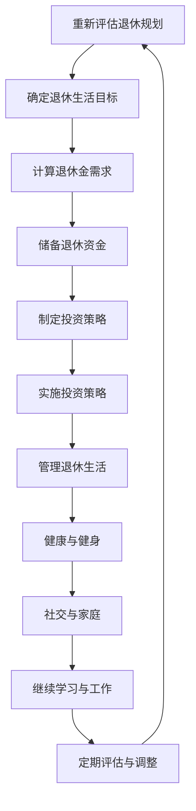
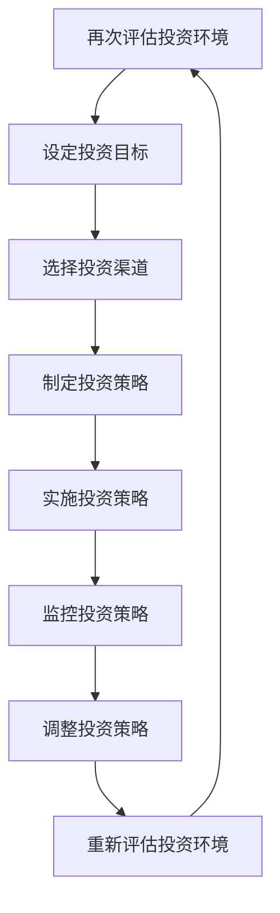

                 

### 第一部分：退休规划基础知识

#### 第1章：了解退休规划的重要性

**1.1 退休规划的基本概念**

退休规划，顾名思义，就是为退休后的生活做准备。它不仅关系到退休时的经济状况，还涵盖了健康、社交、精神等多方面的内容。退休规划不仅仅是财务问题，更是一种生活方式的提前设计和安排。

对于程序员而言，退休规划显得尤为重要。首先，程序员的职业特点决定了他们的收入相对较高，但也伴随着较大的职业风险和年龄压力。一旦技术更新换代，程序员可能面临失业或收入下降的风险。因此，提前进行退休规划，确保经济独立和财务安全，是他们必须面对的问题。

**1.2 退休规划的重要性**

退休规划的重要性主要体现在以下几个方面：

1. **财务安全**：通过合理的退休规划，可以确保在退休后依然有稳定的收入来源，避免经济困境。
2. **生活质量**：提前规划退休生活，可以更好地安排日常活动，确保生活质量。
3. **职业转型**：退休前的工作经验和技能可以为转型提供基础，使过渡更加顺利。
4. **精神满足**：退休后的生活不仅仅是为了生存，更是为了追求精神的满足和生活的乐趣。

**1.3 程序员退休规划的特殊性**

程序员的退休规划具有以下几个特殊性：

1. **技术更新快**：计算机技术更新迅速，程序员需要不断学习新技能，以适应行业变化。
2. **职业风险高**：年龄较大时，程序员面临失业或收入下降的风险。
3. **财务压力**：由于薪资较高，退休后的财务压力相对较大，需要更早进行财务储备。
4. **工作方式多样**：程序员退休后可以选择继续工作或全职家庭主妇，这要求他们在退休前就要明确退休后的生活方式。

在下一章中，我们将进一步探讨退休收入的来源，帮助程序员理解如何在退休后依然保持经济独立。通过详细的财务分析和收入规划，我们可以为退休生活打下坚实的基础。

#### 第2章：退休收入来源

**2.1 退休收入概述**

退休收入是指在退休后通过各种途径获取的财务收入，这些收入能够帮助退休人员维持基本生活，享受更好的生活质量。退休收入的主要来源包括以下几个方面：

1. **养老保险**：养老保险是退休收入的主要组成部分，通常由国家或企业提供。养老保险根据缴纳年限和缴纳金额计算，为退休人员提供基本生活保障。
2. **医疗保险**：医疗保险是退休后的重要保障，它可以帮助退休人员支付医疗费用，减轻因病带来的经济负担。
3. **个人储蓄和投资收益**：个人储蓄和投资收益是退休收入的补充部分。通过合理储蓄和投资，可以增加退休收入，提高生活质量。
4. **商业保险**：商业保险是一种自愿投保的保险产品，可以为退休人员提供额外的保障，如意外险、重疾险等。
5. **房地产收益**：如果退休人员拥有房产，可以通过出租或出售房产获取收益。

**2.2 养老保险与医疗保险**

**养老保险**：

养老保险是国家为了保障老年人的基本生活而设立的一种社会保险制度。根据中国的养老保险制度，养老保险分为两部分：基本养老保险和个人养老保险。

1. **基本养老保险**：由国家统一缴纳，退休后按月领取。缴纳年限越长，领取金额越高。
2. **个人养老保险**：由个人自愿缴纳，退休后根据缴纳金额和年限计算收益。

**医疗保险**：

医疗保险是保障退休人员医疗费用的重要途径。中国的医疗保险制度主要包括基本医疗保险和大病保险。

1. **基本医疗保险**：由国家或企业缴纳，退休人员可享受基本医疗保障。
2. **大病保险**：针对重大疾病提供额外保障，减轻退休人员医疗费用负担。

**2.3 其他收入来源（如商业保险、投资收益等）**

除了养老保险和医疗保险，商业保险和投资收益也是退休收入的重要来源。

**商业保险**：

商业保险是一种自愿投保的保险产品，可以为退休人员提供意外险、重疾险等保障。购买商业保险可以根据个人需求和经济能力进行选择。

**投资收益**：

投资收益是通过投资股票、基金、债券、房地产等获取的财务收入。合理投资可以帮助退休人员增加收入，提高生活质量。

1. **股票投资**：股票投资具有较高的风险和收益，适合有一定风险承受能力的退休人员。
2. **基金投资**：基金投资较为稳健，适合风险承受能力较低的退休人员。
3. **债券投资**：债券投资收益稳定，适合对风险较为敏感的退休人员。
4. **房地产投资**：房地产投资可以提供稳定的租金收益，同时具有一定的资产保值功能。

在下一章中，我们将探讨如何制定退休生活规划，帮助程序员合理安排退休后的生活。通过明确退休生活目标、选择生活方式和进行费用估算与预算管理，我们可以为退休生活奠定坚实的基础。

#### 第3章：退休生活规划

**3.1 制定退休生活目标**

退休生活规划的第一步是明确退休生活目标。这些目标不仅包括财务目标，还涵盖健康、社交、精神和职业等方面的内容。

**财务目标**：

1. **基本生活保障**：确保退休后有足够的资金来支付日常生活费用，如房租、食品、医疗等。
2. **紧急备用金**：设置紧急备用金，以应对突发事件，如疾病、意外等。
3. **娱乐和旅游**：规划退休后的娱乐和旅游活动，提高生活质量。

**健康目标**：

1. **保持身体健康**：通过定期体检、健康饮食和适量运动，保持身体健康。
2. **预防疾病**：通过接种疫苗、定期筛查等方式预防疾病。
3. **心理健康**：保持积极的心态，寻求心理支持和咨询服务。

**社交目标**：

1. **家庭和睦**：维护家庭关系，定期与家人团聚。
2. **社交活动**：参加社区活动，结交新朋友，丰富社交生活。
3. **志愿服务**：参与志愿服务，为社会做出贡献。

**精神目标**：

1. **学习新技能**：通过学习新技能，保持大脑活力。
2. **阅读和写作**：阅读有益的书籍，进行写作创作。
3. **精神寄托**：通过宗教信仰或精神寄托，寻求精神满足。

**3.2 退休生活方式的选择**

退休生活方式的选择因人而异，主要取决于个人的兴趣爱好、经济状况和健康状况。

**居家退休**：

居家退休是指退休后继续生活在自己家中，享受家庭温暖。这种生活方式适合喜欢家庭生活、经济条件较好的退休人员。

**社区退休**：

社区退休是指退休后选择居住在社区，享受社区提供的各种服务和设施。社区退休适合喜欢社交活动、希望有更多生活选择的退休人员。

**旅游退休**：

旅游退休是指退休后选择不断旅行，体验不同地区的文化和风景。这种生活方式适合热爱旅行、有足够经济基础的退休人员。

**3.3 费用估算与预算管理**

退休生活规划的关键是合理估算退休后的生活费用，并进行预算管理。

**费用估算**：

1. **基本生活费用**：包括房租、食品、水电气费用等。
2. **医疗费用**：包括基本医疗费用、保险报销后的自付部分等。
3. **娱乐和旅游费用**：包括旅游、娱乐活动等费用。
4. **其他费用**：包括家庭维修、交通费用等。

**预算管理**：

1. **制定预算**：根据估算的生活费用，制定合理的预算计划。
2. **跟踪支出**：定期记录和审查支出情况，确保在预算范围内。
3. **调整预算**：根据实际情况和收入变化，适时调整预算。

通过制定退休生活目标、选择合适的退休生活方式，并进行费用估算与预算管理，程序员可以为退休生活奠定坚实的基础。在下一章中，我们将进一步探讨如何进行退休前的财务准备，确保退休后的经济安全。

### 第4章：退休前的财务准备

**4.1 资金储备的目标设定**

退休前的财务准备首先需要设定一个明确的资金储备目标。这个目标应当基于个人的退休生活目标和预期的生活水平。以下是一些设定资金储备目标的关键步骤：

1. **估算退休生活费用**：根据上一章节的讨论，详细估算退休后的各项生活费用，包括基本生活费用、医疗费用、娱乐和旅游费用等。
2. **确定退休年龄**：明确计划退休的年龄，以便计算所需的储备资金。
3. **设定资金储备目标**：根据估算的生活费用和退休年龄，设定一个合理的资金储备目标。例如，可以设定一个总储备金额或每月储备金额的目标。

**4.2 投资渠道选择**

选择合适的投资渠道是实现资金储备目标的关键。以下是一些常见的投资渠道及其特点：

1. **储蓄账户**：储蓄账户是一种风险较低、流动性较好的投资方式，适合资金储备的初期阶段。储蓄账户通常提供固定的利率，但收益较低。
2. **股票投资**：股票投资是一种高风险、高收益的投资方式。通过投资股票，可以获得公司的股息和股票价格的上涨收益。然而，股票市场的波动性较大，需要投资者具备一定的风险承受能力。
3. **债券投资**：债券投资是一种风险较低、收益相对稳定的投资方式。债券通常提供固定的利率，风险相对较低，适合风险承受能力较低的投资者。
4. **基金投资**：基金投资是一种通过投资组合分散风险的简便投资方式。投资者可以通过购买基金来投资于多种资产，如股票、债券、房地产等。基金投资通常由专业的基金经理进行管理，但需要支付一定的管理费用。
5. **房地产投资**：房地产投资可以通过购买房产或房地产信托基金来实现。房地产投资通常提供稳定的租金收益，并具有一定的资产保值功能。然而，房地产投资涉及较高的初始投资成本和流动性风险。

在选择投资渠道时，应综合考虑个人的风险承受能力、投资目标和时间范围等因素。

**4.3 投资策略制定**

制定有效的投资策略是实现资金储备目标的关键。以下是一些制定投资策略的关键步骤：

1. **资产配置**：根据个人的风险承受能力和投资目标，合理配置资产。例如，可以将一部分资金投资于低风险的储蓄账户和债券，另一部分资金投资于高风险的股票和基金。
2. **分散投资**：通过投资于不同的资产类别和行业，分散投资风险。避免将所有资金集中于某一类资产或某一行业，以降低投资组合的整体风险。
3. **定期评估和调整**：定期评估投资组合的表现和风险，并根据市场状况和个人的生活变化进行调整。例如，在市场波动较大时，可以适当降低高风险资产的比例，增加低风险资产的比重。
4. **长期投资**：投资是一项长期的过程，应避免频繁的买卖操作。长期投资可以降低交易成本和情绪波动，有利于实现投资目标。

通过设定资金储备目标、选择合适的投资渠道和制定有效的投资策略，程序员可以为退休前的财务准备打下坚实的基础。在下一章中，我们将进一步探讨如何计算和分配退休金，确保退休后的经济安全。

#### 第5章：退休金计算与分配

**5.1 退休金计算方法**

退休金计算是退休规划的核心环节，它直接关系到退休后的生活质量。以下是几种常见的退休金计算方法：

1. **基本养老保险计算**：

   基本养老保险的计算公式为：
   $$
   退休金 = 基础养老金 + 个人账户养老金 + 过渡性养老金
   $$
   其中，基础养老金是根据参保人员的社会平均工资和缴费年限计算的；个人账户养老金是根据个人账户累计金额除以预期寿命计算的；过渡性养老金则是为了平衡不同年龄段退休人员的养老金水平。

2. **企业年金计算**：

   企业年金是指企业为员工提供的补充养老保险。企业年金的计算公式为：
   $$
   企业年金 = 个人账户累积金额 × 年金领取比例
   $$
   年金领取比例通常由企业年金计划确定。

3. **商业保险计算**：

   商业保险的退休金计算通常根据保险合同的条款进行。例如，养老保险合同通常会规定一个固定的养老金金额，或者根据投保金额和利率计算养老金。

**5.2 退休金分配策略**

退休金的合理分配对于确保退休后的生活质量至关重要。以下是一些常见的退休金分配策略：

1. **阶梯式分配**：

   阶梯式分配是指根据退休后的生活阶段，合理分配退休金。例如，可以将退休金分为以下几个部分：

   - **基本生活费用**：用于支付日常生活中的必需品，如食品、房租、医疗等。
   - **应急备用金**：设置一定的应急备用金，以应对突发事件。
   - **娱乐和旅游**：用于退休后的娱乐和旅游活动，提高生活质量。
   - **遗产规划**：如果退休人员有子女或其他继承人，可以将部分退休金用于遗产规划。

2. **定期调整**：

   由于通货膨胀和生活水平的变化，退休金需要定期进行调整。例如，可以根据社会平均工资的增长率或生活费用指数进行调整。

3. **灵活分配**：

   在退休金分配过程中，应保持一定的灵活性，以应对不同情况。例如，如果退休后的收入超出预期，可以适当减少投资回报部分，增加娱乐和旅游支出。

**5.3 提前规划与调整策略**

提前规划和定期调整是实现退休金合理分配的关键。以下是一些建议：

1. **提前规划**：

   - **制定详细退休规划**：在退休前，制定详细的退休规划，包括退休金需求、资金储备、投资策略等。
   - **预留应急资金**：在退休前，预留一定的应急资金，以应对突发事件。
   - **定期评估和调整**：每年或每两年对退休规划进行评估和调整，确保规划与实际情况相符。

2. **调整策略**：

   - **根据实际情况调整**：根据退休后的生活状况和收入变化，调整退休金分配策略。
   - **多元化投资**：通过多元化投资，降低投资风险，确保退休金的安全和收益。
   - **保持灵活应变**：保持对市场变化的敏感，及时调整投资策略，以应对不同的市场环境。

通过合理的退休金计算方法和科学的退休金分配策略，程序员可以确保退休后的生活质量。在退休前，提前规划和定期调整是实现这一目标的关键。在下一章中，我们将探讨退休后的生活管理，帮助程序员在退休后保持健康、丰富社交生活和持续学习。

### 第6章：债务管理

**6.1 债务的种类与影响**

退休前，合理管理债务对于退休后的财务安全至关重要。债务可以分为以下几类：

1. **住房贷款**：大多数程序员在职业生涯中都会承担住房贷款，这是最常见的债务类型。随着房价的上涨，住房贷款金额也不断上升。
2. **汽车贷款**：一些程序员可能会在购车时选择贷款，这种债务相对较小，但也会影响退休后的现金流。
3. **信用卡债务**：由于消费需求和生活压力，部分程序员可能会积累信用卡债务，这种债务通常具有高利率。
4. **教育贷款**：如果程序员在职业生涯中承担了子女的教育贷款，这部分债务也需要在退休前考虑。

这些债务会对退休生活产生多方面的影响：

- **现金流压力**：债务需要定期偿还，特别是住房贷款和信用卡债务，可能会给退休后的生活带来较大的现金流压力。
- **生活质量**：高额的债务可能会导致生活质量下降，尤其是在医疗和娱乐等非必需开支方面。
- **投资能力**：高额的债务会限制投资能力，因为大部分收入可能需要用于偿还债务。

**6.2 债务偿还策略**

为了确保退休后的财务安全，需要制定合理的债务偿还策略。以下是一些有效的债务偿还策略：

1. **优先偿还高利率债务**：信用卡债务通常具有最高的利率，因此应优先偿还这部分债务。通过减少信用卡债务，可以降低整体债务成本。
2. **阶梯式偿还**：对于不同类型的债务，可以采用阶梯式偿还策略。例如，可以先将大部分收入用于偿还住房贷款，而在收入较为宽裕时，再逐步偿还其他债务。
3. **利用收入增长**：如果退休前的收入有所增长，可以考虑增加每月的还款额，以减少总债务。
4. **避免新增债务**：在退休前，应避免新增债务，特别是高利率的债务，以确保退休后的生活质量。

**6.3 零负债退休目标**

为了实现零负债退休，需要采取以下措施：

1. **提前规划**：在退休前几年，开始制定详细的债务偿还计划，并按照计划逐步偿还债务。
2. **增加储蓄**：在偿还债务的同时，增加储蓄，以应对退休后的生活费用。
3. **优化投资**：通过合理的投资策略，确保退休前的收入和投资收益，为偿还债务提供支持。
4. **定期评估**：定期评估债务偿还计划的执行情况，并根据实际情况进行调整。

通过合理管理债务，制定有效的偿还策略，程序员可以实现零负债退休，确保退休后的财务安全和高质量的生活。在下一章中，我们将探讨退休后的健康与健身，帮助程序员保持身体和心理的活力。

### 第7章：健康与健身

**7.1 退休后的健康关注**

退休后，身体健康成为许多老年人最关心的问题。为了保持良好的健康状况，退休人员需要关注以下几个方面：

**1. 定期体检**：

定期体检是发现早期疾病和健康问题的最佳方式。通过体检，可以及时发现潜在的健康问题，并采取相应的预防和治疗措施。退休人员应每年进行一次全面的体检，重点检查心血管疾病、糖尿病、高血压等常见疾病。

**2. 健康饮食**：

健康饮食是保持身体健康的基础。退休人员应遵循均衡饮食原则，摄入足够的蛋白质、维生素和矿物质。建议多食用新鲜蔬菜、水果、全谷物和低脂肪肉类，减少盐分和糖分的摄入。此外，应保持适量的水分摄入，避免过量饮酒。

**3. 适量运动**：

适量运动有助于提高心肺功能、增强肌肉力量、改善骨密度和降低疾病风险。退休人员应根据自己的健康状况选择合适的运动方式，如散步、瑜伽、太极拳等。每周至少进行150分钟的中等强度运动，或75分钟的高强度运动。

**4. 心理健康**：

退休后，心理健康同样重要。由于生活方式的变化，一些老年人可能会出现孤独感、焦虑或抑郁等心理问题。为了保持心理健康，退休人员可以通过参加社交活动、与家人和朋友保持联系、参与志愿服务等方式来缓解压力和孤独感。

**7.2 健身计划与实施**

为了保持身体健康，退休人员可以制定一个全面的健身计划。以下是一个简单的健身计划示例：

**1. 每周安排**：

- **周一、周三、周五**：散步或快走，每次30-60分钟。
- **周二、周四**：瑜伽或太极拳，每次30-45分钟。
- **周六、周日**：轻松活动，如园艺、打牌或与朋友聚会。

**2. 运动步骤**：

- **热身**：开始运动前，进行5-10分钟的热身运动，如慢跑或跳绳。
- **主体运动**：进行30-60分钟的主要运动，根据身体状况调整运动强度。
- **拉伸**：运动后，进行5-10分钟的拉伸运动，以缓解肌肉紧张。

**3. 注意事项**：

- **适应身体**：在开始新的运动计划时，应逐渐增加运动强度和持续时间，以适应身体。
- **保持一致性**：定期进行运动，保持运动计划的连续性，以获得最佳效果。
- **监测健康状况**：在运动过程中，应监测自己的健康状况，如心率、呼吸等，确保运动安全。

**7.3 养生知识学习与实践**

学习养生知识是退休后保持健康的重要手段。以下是一些实用的养生知识：

**1. 中医养生**：

- **五禽戏**：模仿虎、鹿、熊、猿、鸟五种动物的动作，有助于增强体质和预防疾病。
- **八段锦**：一种简单有效的保健功法，有助于调节身体机能、增强免疫力。

**2. 食疗养生**：

- **五色饮食**：根据中医理论，五色（红、黄、白、绿、黑）食物分别对应五脏（心、脾、肺、肝、肾），适量摄入五色食物有助于调理身体。
- **药膳**：通过合理搭配药材和食物，制作药膳可以起到养生和治疗疾病的作用。

通过关注退休后的健康、制定合理的健身计划和积极学习养生知识，退休人员可以保持良好的身体健康和心理健康，享受高质量的退休生活。在下一章中，我们将探讨退休后的社交与家庭，帮助退休人员建立丰富的社交生活和维护良好的家庭关系。

### 第8章：社交与家庭

**8.1 社交活动参与**

退休后，参与社交活动对于维持心理健康和生活质量至关重要。以下是一些有益的社交活动：

**1. 社区活动**：

- **义工活动**：参与社区义工活动，如环保、教育、慈善等，可以结识志同道合的朋友，同时为社会做出贡献。
- **兴趣小组**：加入社区的兴趣小组，如读书会、摄影俱乐部、舞蹈队等，与同好交流，丰富退休生活。
- **文体活动**：参加社区的体育比赛、舞蹈表演、音乐会等活动，享受文化艺术的熏陶。

**2. 志愿者服务**：

- **志愿服务**：参与志愿服务，如助老服务、环保宣传、社区巡逻等，既能锻炼身体，又能提高自信心和满足感。
- **公益活动**：参加公益活动，如义卖、捐赠、筹款等，帮助需要帮助的人群，同时提升自己的社会价值。

**3. 网络社交**：

- **线上社交**：通过社交媒体、论坛、兴趣群组等网络平台，与朋友和同好保持联系，分享生活经验和心得。
- **线上活动**：参与线上讲座、培训、讨论等活动，拓展知识面，丰富退休生活。

**8.2 家庭关系维护**

家庭是退休后的重要支持系统，维护良好的家庭关系对于退休生活至关重要。以下是一些建议：

**1. 家庭聚会**：

- **定期聚会**：与家人定期举行家庭聚会，分享彼此的生活经历和心情，增进亲情。
- **家庭活动**：组织家庭活动，如旅行、户外运动、家庭聚餐等，增强家庭凝聚力。

**2. 沟通与支持**：

- **积极沟通**：保持与家人的积极沟通，分享生活中的喜怒哀乐，避免误解和隔阂。
- **情感支持**：在家人遇到困难时，给予情感支持，共同面对问题，增强家庭的情感联系。

**3. 相互尊重**：

- **尊重个人空间**：尊重家人的个人空间和隐私，避免过度干涉。
- **尊重生活习惯**：尊重家人的生活习惯和兴趣爱好，互相包容和理解。

**8.3 精神生活丰富**

退休后的精神生活同样重要，以下是一些建议：

**1. 学习与阅读**：

- **终身学习**：参加老年大学、在线课程等，学习新知识，保持大脑活跃。
- **阅读书籍**：阅读有益的书籍，如历史、哲学、文学等，丰富精神世界。

**2. 兴趣爱好**：

- **培养兴趣**：根据个人兴趣培养爱好，如绘画、音乐、书法等，提升生活品质。
- **参与活动**：加入兴趣小组或俱乐部，与他人分享兴趣，结交新朋友。

**3. 心理健康**：

- **心理咨询**：定期进行心理咨询，缓解心理压力，保持心理健康。
- **精神寄托**：通过宗教信仰或精神寄托，寻求精神满足和心灵慰藉。

通过积极参与社交活动、维护良好的家庭关系和丰富精神生活，退休人员可以享受充实、快乐和健康的退休生活。在下一章中，我们将探讨退休后的工作与继续学习，帮助退休人员实现自我价值和社会参与。

### 第9章：退休后的工作与继续学习

**9.1 退休后工作的可能性**

退休并不意味着完全停止工作。许多退休人员在退休后仍然选择继续工作，这不仅是经济需求，也是个人兴趣和社会角色的延续。以下是一些退休后继续工作的可能性：

**1. 兼职工作**：

- **技术工作**：许多程序员在退休后选择继续从事技术工作，如顾问、讲师或软件开发等。
- **咨询服务**：退休人员可以利用自己的专业知识和经验，提供咨询服务，如IT咨询、项目管理等。
- **社区服务**：在社区中，退休人员可以参与社区中心的志愿服务，如编程培训、技术支持等。

**2. 创业**：

- **创办企业**：有创业精神的退休人员可以选择创办自己的企业，将自己的专业知识转化为实际业务。
- **加盟连锁**：加盟一些成熟的连锁品牌，利用退休积累的资金和经验，实现创业梦想。

**3. 志愿者工作**：

- **非营利组织**：退休人员可以加入非营利组织，如科技公益组织、慈善机构等，为社会做出贡献。
- **教育领域**：退休教师在退休后可以选择继续在教育领域工作，如参与教育研究、培训年轻教师等。

**9.2 学习新技能与知识**

退休后，继续学习新技能和知识是保持大脑活力、提升自身价值的重要途径。以下是一些建议：

**1. 在线学习**：

- **开放课程**：通过在线平台，如Coursera、edX等，参加各种开放课程，学习新知识。
- **技能培训**：参加在线技能培训，如编程、数据分析、人工智能等，提升专业技能。

**2. 图书馆与社区学院**：

- **图书馆**：利用当地图书馆的资源，阅读书籍、参加讲座、参加兴趣小组。
- **社区学院**：社区学院提供各种课程，从艺术到科学，退休人员可以根据自己的兴趣选择课程。

**3. 专业协会**：

- **专业协会**：加入专业协会，参加会议、研讨会等，与同行交流，获取最新行业信息。

**9.3 时间管理与自我提升**

退休后的时间管理对于确保工作和学习的效率至关重要。以下是一些建议：

**1. 制定计划**：

- **年度计划**：每年制定一个详细的年度计划，包括工作、学习、休闲和社交活动。
- **每日计划**：每天制定一个具体的计划，包括工作和学习任务，以及休息和娱乐时间。

**2. 优先级管理**：

- **确定优先级**：将任务根据重要性和紧急性进行排序，优先完成重要且紧急的任务。
- **灵活调整**：根据实际情况和优先级调整计划，确保计划的可执行性。

**3. 自我监督**：

- **时间记录**：记录每天的时间使用情况，分析时间管理的效果，找出改进之处。
- **反馈与调整**：定期进行自我评估，获取反馈，根据反馈调整计划，提高效率。

通过继续工作、学习新技能和有效管理时间，退休人员可以保持积极的生活态度，实现自我价值，并为社会继续做出贡献。在下一章中，我们将提供一些退休规划工具与资源，帮助程序员更好地进行退休规划。

### 附录A：退休规划工具与资源

**A.1 退休规划工具介绍**

为了帮助程序员更好地进行退休规划，以下是一些常用的退休规划工具：

1. **退休规划计算器**：退休规划计算器是一个在线工具，可以输入个人信息、退休目标和生活费用等，计算出实现退休目标所需的资金储备金额。例如，[Microsoft Retirement Planner](https://www.microsoft.com/retirement-planner) 和 [AARP Retirement Calculator](https://www.aarp.org/retirement-planning/retirement-calculator/) 是两款常用的退休规划计算器。

2. **个人财务管理软件**：个人财务管理软件可以帮助程序员跟踪收入、支出和投资情况，从而更好地管理财务。例如，[Quicken](https://www.quicken.com/) 和 [Mint](https://www.mint.com/) 是两款功能强大的个人财务管理软件。

3. **投资组合跟踪工具**：投资组合跟踪工具可以帮助程序员监控投资组合的表现和风险。例如，[Personal Capital](https://www.personalcapital.com/) 和 [Yahoo Finance](https://finance.yahoo.com/) 提供了详细的投资组合跟踪功能。

**A.2 常用退休规划网站和应用程序**

以下是一些常用的退休规划网站和应用程序：

1. **AARP**（美国退休人员协会）：[https://www.aarp.org/](https://www.aarp.org/)
   - 提供各种退休相关资源和信息，包括退休计划、健康和福利、社交活动等。

2. **Social Security Administration**（美国社会保障管理局）：[https://www.ssa.gov/](https://www.ssa.gov/)
   - 提供关于社会保障福利的信息，帮助用户计算退休金和医疗福利。

3. **Forbes**（福布斯）：[https://www.forbes.com/](https://www.forbes.com/)
   - 提供退休规划、投资策略和财务建议等财经信息。

4. **Financial Planning Association**（财务规划协会）：[https://www.fpa.org/](https://www.fpa.org/)
   - 提供财务规划资源、专业财务规划师信息和退休规划指南。

5. **Mint**（个人财务管理应用程序）：[https://www.mint.com/](https://www.mint.com/)
   - 提供个人财务管理功能，包括预算设定、支出跟踪和投资组合监控。

**A.3 退休规划相关的书籍和文章推荐**

以下是一些有助于进行退休规划的书籍和文章：

1. **《退休规划：实现财务自由的指南》**（"Retire Secure! 3rd Edition: A Practical Approach to Creating a Secure Financial Future"）
   - 作者：Ric Edelman
   - 简介：这本书提供了详细的退休规划指南，包括退休金计算、投资策略和预算管理。

2. **《财务自由之路》**（"The Total Money Makeover: A Proven Plan for Financial Fitness")
   - 作者：Dave Ramsey
   - 简介：这本书提供了实现财务自由的方法，包括债务管理、储蓄和投资策略。

3. **《退休规划：如何做好退休财务规划》**（"How to Retire Happy, Wild, and Free")
   - 作者：Ernie J. Zelinski
   - 简介：这本书强调了退休规划的乐趣和自由，提供了实用的建议和策略。

4. **《福布斯投资指南：退休金如何最大化收益》**（"Forbes Guide to the Top Investments for Your Retirement: How to Get the Most from Your 401(k), IRA, and More")
   - 作者：Michael M. persons
   - 简介：这本书提供了关于如何最大化退休金收益的投资指南。

通过使用这些退休规划工具和资源，程序员可以更好地了解退休规划的关键要素，制定出符合个人需求的退休计划。在下一章中，我们将提供一些具体的Mermaid流程图，以帮助程序员更直观地理解和实施退休规划。

### 附录B：Mermaid 流程图

#### 退休规划流程图

以下是一个简要的退休规划流程图，它展示了从了解退休规划重要性到退休后生活管理的整体流程。



#### 投资策略流程图

以下是投资策略流程图，它展示了从评估投资环境到实施和监控投资策略的详细步骤。



通过这些流程图，程序员可以更清晰地了解退休规划和投资策略的实施步骤，确保退休计划的合理性和投资策略的有效性。

### 附录C：核心算法原理讲解

#### 投资收益率计算伪代码

以下是一个计算投资收益率的伪代码示例，该算法用于计算投资组合在一段时间内的总收益率。

```plaintext
function calculate_yield_rate(principal, income, expenses, period):
    total_income = income - expenses
    total_yield = (total_income / principal) * 100
    annual_yield_rate = total_yield / period
    return annual_yield_rate
```

#### 投资组合优化算法伪代码

以下是一个简单的投资组合优化算法伪代码，该算法用于优化投资组合的预期收益率和风险。

```plaintext
function optimize_portfolio(investment_assets, expected_returns, cov_matrix):
    n = length(investment_assets)
    max_yield = 0
    best_weights = []

    for each combination of weights in all possible combinations of weights:
        weight_vector = generate_weight_vector(weights)
        portfolio_return = calculate_portfolio_return(weight_vector, expected_returns)
        portfolio_risk = calculate_portfolio_risk(weight_vector, cov_matrix)

        if portfolio_return > max_yield:
            max_yield = portfolio_return
            best_weights = weight_vector

    return best_weights, max_yield
```

其中，`generate_weight_vector` 函数用于生成权重向量，`calculate_portfolio_return` 函数用于计算投资组合的预期收益率，`calculate_portfolio_risk` 函数用于计算投资组合的风险。

### 附录D：数学模型和公式

#### 退休金计算公式

以下是一个用于计算退休金的数学模型，该模型考虑了个人账户余额、缴纳年限和基础养老金等因素。

$$
P = P_b + P_a + P_t
$$

其中：
- \( P \) 是退休金总额；
- \( P_b \) 是基础养老金；
- \( P_a \) 是个人账户养老金；
- \( P_t \) 是过渡性养老金。

#### 投资回报率公式

以下是一个用于计算投资回报率的公式，该公式适用于定期投资的回报计算。

$$
R = \left( \frac{FV}{PV} \right)^{\frac{1}{n}} - 1
$$

其中：
- \( R \) 是投资回报率；
- \( FV \) 是投资期末价值；
- \( PV \) 是投资期初价值；
- \( n \) 是投资期限（以年为单位）。

### 附录E：项目实战

#### 退休规划代码实现

以下是一个简单的Python代码示例，用于实现一个基本的退休规划计算器。该代码允许用户输入退休金需求和投资策略，然后计算出实现目标所需的资金储备。

```python
import numpy as np

def retirement_plan(principal, yield_rate, period, monthly_income, monthly_expenses):
    total_income = monthly_income * period
    total_expenses = monthly_expenses * period
    total_yield = (total_income - total_expenses) * yield_rate
    required_principal = (total_yield / principal) * 100
    return required_principal

# 示例参数
principal = 100000  # 初始投资本金
yield_rate = 0.05  # 投资收益率（5%）
period = 30  # 退休年限
monthly_income = 3000  # 每月收入
monthly_expenses = 2000  # 每月支出

# 计算退休规划所需本金
required_principal = retirement_plan(principal, yield_rate, period, monthly_income, monthly_expenses)
print(f"为实现退休目标，需要储备的本金为：{required_principal}元")
```

#### 投资组合模拟代码实现

以下是一个Python代码示例，用于模拟一个简单的投资组合。该代码随机生成多个投资组合，并计算每个组合的预期收益率和风险，以展示投资组合优化的过程。

```python
import numpy as np

def simulate_portfolio(n_assets, expected_returns, cov_matrix):
    n = len(expected_returns)
    portfolio_returns = np.zeros((n_assets, n))
    portfolio_risks = np.zeros((n_assets, n))

    for i in range(n_assets):
        weights = np.random.rand(n)
        weights /= np.sum(weights)
        portfolio_returns[i] = np.dot(weights, expected_returns)
        portfolio_risks[i] = np.sqrt(np.dot(weights.T, np.dot(cov_matrix, weights)))

    return portfolio_returns, portfolio_risks

# 示例参数
n_assets = 3  # 投资资产数量
expected_returns = np.array([0.12, 0.08, 0.06])  # 预期收益率
cov_matrix = np.array([[0.04, 0.02, 0.01], [0.02, 0.05, 0.03], [0.01, 0.03, 0.02]])  # 协方差矩阵

# 模拟投资组合
portfolio_returns, portfolio_risks = simulate_portfolio(n_assets, expected_returns, cov_matrix)

# 输出投资组合结果
print("预期收益率：")
print(portfolio_returns)
print("\n风险水平：")
print(portfolio_risks)
```

#### 代码解读与分析

在上面的代码中，`retirement_plan` 函数用于计算实现退休目标所需的资金储备。用户需要输入初始投资本金（`principal`）、投资收益率（`yield_rate`）、退休年限（`period`）、每月收入（`monthly_income`）和每月支出（`monthly_expenses`）。

`simulate_portfolio` 函数用于模拟多个投资组合，计算每个组合的预期收益率和风险。函数首先生成随机权重向量，然后使用这些权重计算每个组合的预期收益率和风险。

通过这两个函数，程序员可以模拟不同的退休规划和投资组合，以便选择最优的方案。在实际应用中，可以根据具体情况进行参数调整和扩展，以提高代码的实用性和灵活性。通过这些代码示例，程序员可以更好地理解和实践退休规划与投资组合优化的方法。

### 总结与展望

本文详细探讨了程序员的退休规划，从基础概念到具体实施步骤，全方位为程序员提供了一套完整的退休规划指南。退休规划不仅是财务问题，更是生活品质的保障。对于程序员而言，提前规划退休生活，确保经济独立和财务安全尤为重要。

在文章中，我们首先介绍了退休规划的基础知识，包括退休规划的基本概念、退休收入来源和退休生活规划。接着，我们深入探讨了如何进行退休前的财务准备，包括资金储备目标设定、投资渠道选择和投资策略制定。随后，我们介绍了退休后的生活管理，包括健康与健身、社交与家庭以及继续学习与工作的重要性。

本文还通过具体的代码示例和算法原理讲解，帮助程序员理解退休规划和投资组合优化的实际应用。附录部分提供了详细的退休规划工具、Mermaid流程图和数学模型，以便程序员更好地理解和实施退休规划。

最后，我们总结了文章的核心观点，强调退休规划的重要性，并展望了未来的发展方向。随着技术的进步和社会的变化，退休规划也需要不断更新和优化。程序员应保持对退休规划的关注，持续学习和调整规划，以确保退休后的生活品质和幸福感。

作者信息：

作者：AI天才研究院/AI Genius Institute & 禅与计算机程序设计艺术 /Zen And The Art of Computer Programming

感谢您的阅读，希望本文能为您的退休规划提供有益的启示。祝愿每一位程序员都能享受一个充实、快乐和健康的退休生活。

