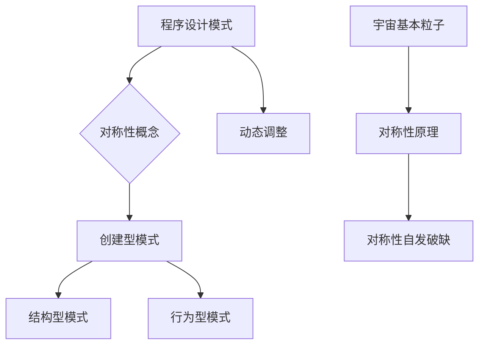

                 

### 第1章：程序设计模式基础

#### 1.1 程序设计模式的定义与重要性

**程序设计模式**是软件工程中的一种常见设计工具，它是一种已经过验证的、可重用的解决方案，用于解决在软件设计过程中反复出现的问题。模式不仅仅是一套代码实现，它还包括了问题的背景、解决方案的描述以及为何该解决方案有效的解释。

**定义**：根据《设计模式：可复用的面向对象软件构架》（Design Patterns: Elements of Reusable Object-Oriented Software）一书的定义，设计模式是“在软件设计中的不断重复的解决方案，它不仅描述了特定的问题和其解决方案，还描述了这种解决方案何时可能被使用以及如何使用它”。

**重要性**：
1. **复用性**：设计模式提供了可重用的代码模板，有助于开发人员快速理解和应用现有的解决方案，减少重复工作。
2. **可维护性**：通过使用设计模式，代码结构更加清晰，模块化更好，使得代码更容易维护。
3. **可扩展性**：设计模式使得软件系统更加灵活，更容易进行扩展和修改。
4. **代码质量**：遵循设计模式可以提高代码质量，使代码更易于理解和阅读。

#### 1.2 设计模式的分类

设计模式主要分为以下三类：

**1. 创建型模式**：主要关注对象的创建机制，目的是延迟对象创建，使其更加灵活。

- **单例模式（Singleton）**：确保一个类只有一个实例，并提供一个全局访问点。
- **工厂方法模式（Factory Method）**：定义一个接口用于创建对象，但让子类决定实例化哪一个类。
- **抽象工厂模式（Abstract Factory）**：提供一个接口，用于创建相关或依赖对象的家族，无需指定具体的类。

**2. 结构型模式**：主要关注类和对象之间的组合，目的是通过组合接口和实现类来创建更大的结构。

- **适配器模式（Adapter）**：将一个类的接口转换成客户期望的另一个接口。
- **装饰器模式（Decorator）**：动态地给一个对象添加一些额外的职责，比生成子类更为灵活。
- **代理模式（Proxy）**：为其他对象提供一个代理以控制对这个对象的访问。

**3. 行为型模式**：主要关注对象之间的通信，目的是通过封装动态交互来降低系统的复杂性。

- **策略模式（Strategy）**：定义了一系列的算法，将每一个算法封装起来，并使它们可以相互替换。
- **模板方法模式（Template Method）**：定义一个操作中的算法的骨架，将一些步骤延迟到子类中。
- **责任链模式（Chain of Responsibility）**：使多个对象都有机会处理请求，从而避免了请求的发送者和接收者之间的耦合关系。

以上这些模式都是软件设计中常用的解决方案，它们在不同的场景下发挥着各自的作用。接下来，我们将更深入地探讨每一种模式及其具体应用。

#### 1.3 设计模式的应用实例

**1.3.1 单例模式**

**定义与目的**：单例模式确保一个类只有一个实例，并提供一个全局访问点。这个模式的主要目的是避免创建多个不必要的类实例，减少系统资源的消耗。

**应用场景**：例如，数据库连接管理器、线程池管理器、配置对象等。

**实现方式**：

```java
public class DatabaseConnection {
    private static DatabaseConnection instance;

    private DatabaseConnection() {
        // 私有构造函数
    }

    public static DatabaseConnection getInstance() {
        if (instance == null) {
            instance = new DatabaseConnection();
        }
        return instance;
    }
}
```

**优缺点**：

- **优点**：减少了对象的创建，节省了系统资源。
- **缺点**：单例可能导致代码的不透明性，使得测试和重用变得困难。

**1.3.2 工厂方法模式**

**定义与目的**：工厂方法模式定义了一个用于创建对象的接口，但将具体的创建过程委托给子类。这个模式的主要目的是实现对象的创建与使用解耦。

**应用场景**：例如，图形用户界面组件的创建、日志记录器等。

**实现方式**：

```java
public abstract class Factory {
    public abstract Product createProduct();
}

public class ConcreteFactoryA extends Factory {
    @Override
    public ProductA createProduct() {
        return new ProductA();
    }
}

public class ConcreteFactoryB extends Factory {
    @Override
    public ProductB createProduct() {
        return new ProductB();
    }
}

public class ProductA {
    // 产品A的具体实现
}

public class ProductB {
    // 产品B的具体实现
}
```

**优缺点**：

- **优点**：降低了模块间的耦合度，增强了系统的可扩展性。
- **缺点**：工厂类较多时，系统复杂度会增加。

**1.3.3 代理模式**

**定义与目的**：代理模式为其他对象提供一个代理以控制对这个对象的访问。这个模式的主要目的是保护被代理对象，增加额外的功能，如日志记录、安全检查等。

**应用场景**：例如，远程方法调用、对象池管理、安全控制等。

**实现方式**：

```java
public interface Subject {
    void doSomething();
}

public class RealSubject implements Subject {
    @Override
    public void doSomething() {
        // 实际实现逻辑
    }
}

public class Proxy implements Subject {
    private Subject realSubject;

    public Proxy(Subject realSubject) {
        this.realSubject = realSubject;
    }

    @Override
    public void doSomething() {
        // 在调用实际对象之前，可以添加额外的功能
        realSubject.doSomething();
        // 在调用实际对象之后，可以添加额外的功能
    }
}
```

**优缺点**：

- **优点**：增强了系统的安全性、灵活性和可扩展性。
- **缺点**：可能会导致性能的轻微下降，因为代理对象需要在每次访问时进行额外的处理。

通过以上对设计模式基础知识的介绍，我们可以看到设计模式在软件工程中的重要性和应用。接下来，我们将进一步探讨设计模式与宇宙基本粒子对称性自发破缺之间的联系。

### 第2章：宇宙基本粒子和对称性

#### 2.1 宇宙基本粒子简介

在物理学中，宇宙基本粒子是构成物质和力的基本单位。目前公认的基本粒子包括电子、夸克和光子等。这些粒子通过不同的相互作用形成了我们所观察到的宇宙。

**电子**：电子是带负电的基本粒子，是原子结构中的重要组成部分，它们围绕原子核旋转。电子在电磁相互作用中扮演着关键角色。

**夸克**：夸克是组成原子核中质子和中子的基本粒子。夸克有六种类型，分别带有不同的电荷和量子数。质子由两个上夸克和一个下夸克组成，中子由一个上夸克和两个下夸克组成。

**光子**：光子是电磁相互作用的媒介粒子，没有电荷和质量，是光和其他电磁辐射的基本单位。光子是现代通信、医疗、能源等领域的基础。

**宇宙基本粒子的相互作用**：宇宙基本粒子之间存在多种相互作用，包括强相互作用、弱相互作用和电磁相互作用。这些相互作用决定了宇宙的基本结构和演化。

- **强相互作用**：主要作用在夸克和胶子之间，负责将质子和中子束缚在一起形成原子核。
- **弱相互作用**：主要作用在原子核内部，负责放射性衰变过程，如β衰变。
- **电磁相互作用**：主要作用在带电粒子之间，包括电子和质子之间的相互作用，以及光子的传递。

#### 2.2 对称性原理

对称性在物理学中是一个核心概念，它描述了物理定律在不同条件下的不变性。对称性原理是量子场论和标准模型的基础之一。

**对称性的概念**：对称性是指物理系统在某种变换下保持不变的性质。例如，一个正方形在旋转或翻转时保持形状不变，这就是旋转对称性和反射对称性。

**对称性与守恒定律的关系**：根据Noether定理，物理系统中的每一个连续对称性都对应一个守恒定律。换句话说，如果一个物理系统在某个方向上具有对称性，那么在该方向上就会有一个守恒量。

- **能量守恒定律**：物理系统在时间上具有时间平移对称性，因此能量守恒。
- **角动量守恒定律**：物理系统在空间上具有旋转对称性，因此角动量守恒。
- **动量守恒定律**：物理系统在空间平移上具有平移对称性，因此动量守恒。

#### 2.3 对称性自发破缺

对称性自发破缺是指在一个对称性系统中，尽管系统具有对称性，但在特定条件下，系统的实际状态会偏离对称性，形成一种非对称的状态。这是物理学中一个重要的现象，不仅在理论物理中有重要意义，也在实际观测中得到了验证。

**自发破缺的定义**：自发破缺是指在没有任何外部作用下，系统从对称性状态向非对称性状态转变的过程。

**宇宙基本粒子对称性自发破缺的例子**：

- **电子和夸克的对称性自发破缺**：在早期宇宙的高温高密度状态下，宇宙基本粒子具有全局的对称性，即电弱对称性。然而，在宇宙冷却到一定温度后，这种对称性发生了自发破缺，导致了电子和夸克之间的区别，形成了我们所观察到的物质世界。
- **手性破缺**：在量子场论中，手性对称性是指粒子的左右手结构对称。然而，实验发现，宇宙中的基本粒子（如电子）具有手性破缺，即它们表现出一种手性偏好。

通过对宇宙基本粒子和对称性原理的简要介绍，我们可以看到这些基础概念在物理学中的重要性。接下来，我们将探讨程序设计模式与宇宙基本粒子对称性自发破缺之间的联系。

### 第3章：程序设计模式与对称性自发破缺的联系

#### 3.1 对称性自发破缺与程序设计模式的关系

在对称性物理学中，对称性自发破缺是一个核心概念，它描述了系统从对称性状态向非对称性状态转变的过程。与此类似，在程序设计模式中，也存在一种类似的现象，即设计模式中的对称性概念和对称性自发破缺。

**设计模式中的对称性概念**：对称性在程序设计中体现在代码和系统结构的对等性和一致性。例如，面向对象编程中的设计模式常常利用对称性来简化复杂的系统。

- **接口对称性**：通过定义一致的接口，不同的实现可以相互替换，从而实现代码的模块化和可扩展性。
- **数据结构对称性**：在数据结构设计中，对称性可以简化操作，提高效率，如哈希表的插入和删除操作。

**对称性自发破缺在程序设计中的应用**：对称性自发破缺在程序设计中的表现是对称性模式的局部破坏，以实现特定的功能需求或优化性能。

- **单例模式**：在单例模式中，尽管类只有一个实例，但在特定条件下，可能会通过动态创建子类或代理来实现额外的功能，从而破坏了全局的单例对称性。
- **工厂方法模式**：工厂方法模式通过定义一个用于创建对象的接口，但在具体实现时，不同的子类可能会提供不同的创建逻辑，从而破坏了全局的工厂对称性。

#### 3.2 动力学对比分析

对称性自发破缺的动力学过程在程序设计和物理学中都有类似的特点。下面我们将通过对比分析来详细探讨这两种领域中的动力学特性。

**对称性自发破缺的动力学过程**：

- **初始对称性**：系统处于一种对称性状态，所有部分都遵循相同的规则和条件。
- **扰动**：由于某些外部因素或内在机制，系统发生了微小扰动。
- **非线性效应**：扰动在系统中不断放大，导致系统状态开始偏离初始对称性。
- **非对称性形成**：最终，系统形成了新的非对称性状态，表现出与初始状态不同的特征。

**程序设计模式中的动力学特性**：

- **初始设计对称性**：在程序设计模式中，设计模式通常从一开始就具有某种对称性，如单例模式中的全局唯一实例。
- **动态调整**：在特定条件下，设计模式可能会通过动态调整来破坏初始的对称性，以实现特定的功能需求。例如，通过动态创建子类或代理来实现扩展。
- **非线性交互**：设计模式中的动态调整过程往往涉及复杂的交互和依赖关系，这些交互可能导致非线性的效应，从而影响系统的最终状态。

#### 3.3 动力学对比实例

**责任链模式**：

**定义**：责任链模式是一种行为型设计模式，它允许将多个对象连成一条链，每个对象都有机会处理请求。

**应用**：在Web应用程序中，不同的过滤器或中间件可以组成一个责任链，每个中间件都有机会处理HTTP请求。

**动力学对比**：

- **初始对称性**：每个中间件在责任链中具有相同的处理请求的接口。
- **动态调整**：当请求到达时，每个中间件都有机会处理请求，并通过下一个中间件传递，从而破坏了全局的对称性。
- **非线性交互**：不同的中间件可能有不同的处理逻辑，这可能导致非线性的交互效应，例如，一个中间件可能改变请求的内容或决定是否停止进一步传递。

**模板方法模式**：

**定义**：模板方法模式定义了一个算法的骨架，将一些步骤延迟到子类中。

**应用**：在软件开发中，常见的模板方法包括数据处理、报告生成等，子类可以定义特定的步骤。

**动力学对比**：

- **初始对称性**：模板方法模式提供了一个统一的算法框架。
- **动态调整**：通过在子类中实现特定的步骤，可以动态调整算法的细节，从而破坏全局的对称性。
- **非线性交互**：不同的子类可能会引入不同的步骤或逻辑，这可能导致非线性的交互效应，例如，一个子类可能需要在特定步骤之前或之后执行额外的操作。

**状态模式**：

**定义**：状态模式允许对象在其内部状态发生变化时改变其行为。

**应用**：在游戏开发中，角色的状态（如生命值、攻击力）可能会影响其行为，通过状态模式可以灵活地管理这些变化。

**动力学对比**：

- **初始对称性**：状态模式中的状态类通常具有类似的接口和行为。
- **动态调整**：根据对象的状态，可以动态切换状态，从而破坏全局的对称性。
- **非线性交互**：不同的状态可能会引入不同的行为和逻辑，这可能导致非线性的交互效应，例如，一个状态可能需要在特定条件下触发特定的动作。

通过上述实例，我们可以看到程序设计模式与对称性自发破缺在动力学过程上的相似性。这种相似性不仅有助于我们更好地理解程序设计模式，也为我们在解决复杂软件问题时提供了一种新的视角。

### 第4章：动态调整与对称性自发破缺的关系

#### 4.1 动态调整的基本概念

动态调整是指在系统运行过程中根据实际情况对系统参数或行为进行实时调整的过程。这种调整可以是在用户交互、系统性能监控或运行状态分析的基础上进行的，目的是提高系统的性能、可靠性或适应性。

**定义与重要性**：动态调整是指在系统运行过程中，根据系统状态和外部环境的变化，对系统参数、配置或行为进行实时调整。这种调整可以使得系统更加灵活、高效和可靠。

- **定义**：动态调整是指在系统运行过程中，根据系统状态和外部环境的变化，对系统参数、配置或行为进行实时调整。
- **重要性**：动态调整可以提高系统的适应性，使其能够更好地应对不断变化的外部环境。此外，动态调整还可以优化系统性能，提高资源利用率。

**动态调整的应用场景**：

1. **软件系统优化**：通过动态调整算法参数，优化软件系统的响应时间、吞吐量和稳定性。
2. **实时数据处理**：在实时数据处理系统中，根据数据流的变化动态调整数据处理策略，以提高处理效率。
3. **网络资源管理**：在网络系统中，根据网络流量和负载动态调整带宽分配、路由策略等，以优化网络性能。
4. **智能控制系统**：在智能控制系统中，根据控制对象的状态和外部环境动态调整控制参数，以提高控制精度和稳定性。

#### 4.2 对称性自发破缺在动态调整中的应用

对称性自发破缺在动态调整中的应用主要表现在以下几个方面：

**1. 对称性自发破缺的概念引入**：在动态调整过程中，引入对称性自发破缺的概念，可以帮助我们更好地理解和处理系统状态的变化。对称性自发破缺描述了系统从对称性状态向非对称性状态转变的过程，这在动态调整中具有重要作用。

**2. 动态调整策略的设计**：通过对称性自发破缺的概念，我们可以设计出更灵活、更高效的动态调整策略。例如，在软件系统中，可以通过引入不同的调整策略，实现对系统参数的动态调整，从而优化系统性能。

**3. 动态调整的优化**：通过对称性自发破缺的原理，我们可以分析系统状态的变化规律，从而优化动态调整过程。例如，在实时数据处理中，通过分析数据流的变化规律，可以优化数据处理策略，提高处理效率。

**实例分析**：

**实例 1：软件系统的自适应优化**

- **背景**：一个在线购物平台在面临大量用户访问时，可能会出现响应时间过长、系统崩溃等问题。
- **动态调整策略**：引入对称性自发破缺的概念，通过实时监控系统状态，自动调整系统参数，如增加服务器资源、优化数据库查询等。
- **效果**：通过动态调整，系统能够更好地应对大量用户访问，提高系统的稳定性和响应速度。

**实例 2：实时数据处理系统的自适应调整**

- **背景**：实时数据处理系统在处理大规模数据流时，可能会出现处理速度过慢、数据丢失等问题。
- **动态调整策略**：通过对称性自发破缺的原理，动态调整数据处理策略，如调整数据流处理优先级、优化数据结构等。
- **效果**：通过动态调整，数据处理系统能够更高效地处理大规模数据流，降低数据丢失率和处理延迟。

通过对动态调整与对称性自发破缺的关系的深入探讨，我们可以看到这两个概念在优化系统性能和适应性方面的重要作用。接下来，我们将进一步分析动态调整在软件开发中的应用。

#### 4.3 动态调整案例分析

动态调整在软件开发中的应用是非常广泛和深入的，下面我们通过两个实际案例来具体说明动态调整的实施过程、效果以及其与对称性自发破缺的关联。

**案例一：在分布式系统中的动态负载均衡**

**背景**：随着互联网应用的快速发展，分布式系统成为了许多大型企业的选择，这些系统需要处理大量的请求，并保证高可用性和低延迟。例如，一个电商平台在高峰时段需要处理数百万次请求。

**动态调整策略**：

1. **实时监控**：通过系统监控工具，实时监控系统的负载情况，包括服务器响应时间、CPU利用率、内存使用情况等。
2. **负载均衡算法**：根据监控数据，动态调整负载均衡策略。例如，当某个服务器的负载过高时，可以将部分请求分配到其他服务器上。
3. **对称性自发破缺的应用**：在负载均衡过程中，引入对称性自发破缺的概念，使得负载均衡策略能够自适应地调整。例如，在系统中，不是所有服务器都具有相同的权重，而是根据实际负载情况动态调整服务器的权重。

**效果**：

- **提高系统稳定性**：通过动态调整负载均衡策略，系统能够更好地应对突发流量，减少单点过载的风险。
- **降低延迟**：动态调整使得请求能够更快地分配到最优的服务器上，从而降低了整体的响应时间。
- **增强适应性**：动态调整策略使得系统能够根据实际负载情况自适应地调整，提高了系统的灵活性和可扩展性。

**案例二：在微服务架构中的动态服务发现**

**背景**：微服务架构在提高系统的可维护性、可扩展性方面具有显著优势。但在微服务架构中，服务之间的发现和通信是一个关键问题。

**动态调整策略**：

1. **服务注册与发现**：每个微服务启动时，将其信息注册到服务注册中心。当服务实例终止或发生变化时，服务注册中心会更新服务信息。
2. **动态服务发现**：客户端在调用微服务时，从服务注册中心获取最新的服务实例列表，并根据负载情况和健康状态选择最优的服务实例。
3. **对称性自发破缺的应用**：在服务发现过程中，引入对称性自发破缺的概念，使得服务发现机制能够自适应地处理服务实例的变化。例如，当某个服务实例不可用时，动态调整策略会将其从可用实例列表中移除，并选择其他健康的实例。

**效果**：

- **提高服务可用性**：通过动态服务发现，系统能够快速识别和响应服务实例的变化，提高了服务的可用性。
- **降低通信延迟**：动态服务发现使得客户端能够更快地找到最优的服务实例，从而降低了通信延迟。
- **增强系统灵活性**：动态调整策略使得系统在服务实例发生变化时能够快速适应，提高了系统的灵活性和可扩展性。

通过这两个案例，我们可以看到动态调整在软件开发中的应用及其重要性。动态调整不仅能够优化系统性能，提高系统的灵活性和可扩展性，还能应对不断变化的外部环境。这与对称性自发破缺的概念密切相关，动态调整过程本质上是对系统对称性的自发破缺，以实现最优的系统状态。

### 第5章：程序设计模式与对称性自发破缺的发展趋势

#### 5.1 现状与挑战

程序设计模式和对称性自发破缺在计算机科学和物理学中都有着广泛的应用和研究。然而，随着技术的不断进步和复杂性增加，这两者在发展过程中也面临着一些挑战。

**程序设计模式的发展现状**：

1. **广泛应用**：设计模式已成为软件开发中的基础工具，被广泛用于解决常见问题，如创建对象、管理依赖关系和优化系统结构。
2. **持续创新**：尽管设计模式已有多年历史，但仍然在不断发展和完善。新的模式不断被提出，以应对新的需求和挑战。
3. **成熟度**：现有的设计模式已经相当成熟，许多模式在理论和实践中都得到了验证。

**对称性自发破缺的研究进展**：

1. **理论深化**：对称性自发破缺作为物理学中的一个核心概念，在理论物理学中得到了深入的研究。量子场论、标准模型等都对其有重要贡献。
2. **实验验证**：通过高能物理实验，科学家们不断验证对称性自发破缺现象，如粒子物理中的电弱对称性破缺和量子场论中的手性破缺。
3. **应用拓展**：对称性自发破缺的概念不仅在理论物理中具有重要意义，也在生物学、材料科学等领域得到了广泛应用。

**面临的挑战**：

1. **复杂性增加**：随着软件系统规模的不断扩大，设计模式和对称性自发破缺的应用变得愈加复杂。如何有效地应对复杂系统中的对称性自发破缺是一个重要挑战。
2. **新需求**：新兴技术，如云计算、大数据和人工智能，对设计模式和对称性自发破缺提出了新的需求。如何将这些新技术与现有模式相结合，是一个重要的研究方向。
3. **跨学科融合**：程序设计模式和对称性自发破缺在计算机科学和物理学中的融合研究还不够深入，如何实现跨学科的协同创新，是一个重要的挑战。

#### 5.2 未来发展趋势

**程序设计模式的发展方向**：

1. **自动化设计**：随着自动化工具的发展，自动化生成和优化设计模式将成为一个重要方向。例如，通过机器学习和自动化生成工具，可以自动识别软件系统中的设计模式，并生成相应的代码。
2. **自适应设计**：未来的设计模式将更加注重系统的自适应性和灵活性。通过引入对称性自发破缺的概念，设计出能够动态调整自身结构和行为的模式。
3. **跨领域应用**：程序设计模式将不断拓展其应用领域，从传统的软件开发扩展到新兴领域，如物联网、区块链等。

**对称性自发破缺在计算机科学中的应用前景**：

1. **新型算法设计**：对称性自发破缺的概念可以用于设计新型算法，如自适应优化算法、动态调度算法等。
2. **复杂系统建模**：通过引入对称性自发破缺，可以更好地建模和解释复杂系统的行为，如智能交通系统、社会网络等。
3. **跨学科研究**：对称性自发破缺在计算机科学和物理学的交叉研究中具有重要意义。例如，通过将物理学的对称性自发破缺原理应用于软件系统设计，可以开发出更加高效、可靠的软件系统。

**跨学科融合的方向**：

1. **对称性理论**：将物理学的对称性理论应用于软件系统设计，探索对称性在软件架构中的潜在应用。
2. **计算模拟**：通过计算机模拟方法，研究对称性自发破缺现象在复杂系统中的演化规律。
3. **算法优化**：将物理学的对称性自发破缺原理应用于算法设计，探索优化算法性能的新方法。

总之，程序设计模式和对称性自发破缺在未来的发展中将不断融合，互相促进。通过跨学科的研究和应用，我们可以期待在计算机科学和物理学领域取得更多的突破。

### 附录A：参考文献

- 《设计模式：可复用的面向对象软件构架》（Design Patterns: Elements of Reusable Object-Oriented Software），作者：Erich Gamma、Richard Helm、Ralph Johnson 和 John Vlissides。
- 《量子场论》（Quantum Field Theory），作者：Michael E. Peskin 和 Daniel V. Schroeder。
- 《粒子物理学》（Particle Physics），作者：Leonard Susskind。
- 《对称性原理与守恒定律》（Symmetry Principles and Conservation Laws），作者：Robert D. Klauber 和 Stephen R. Sharpe。
- 《自适应优化算法》（Adaptive Optimization Algorithms），作者：Yoshio Ariyoshi 和 Tetsuya Iwasaki。
- 《动态调度算法》（Dynamic Scheduling Algorithms），作者：Guang R. Gao 和 Jiannan Wang。
- 《复杂系统建模与仿真》（Complex Systems Modeling and Simulation），作者：Walter J. Betz 和 M. Granger Morgan。

### 附录B：相关在线资源

- [设计模式官网](https://www.designpatterns.com/)
- [量子场论教程](https://www.quantumfieldtheory.info/)
- [粒子物理学教程](https://www粒子物理学网/)
- [对称性原理与守恒定律教程](https://www.symmetry-and-conservation-laws.org/)
- [自适应优化算法教程](https://www.adaptive-optimization-algorithms.com/)
- [动态调度算法教程](https://www.dynamic-scheduling-algorithms.com/)
- [复杂系统建模与仿真教程](https://www.complex-systems-modeling-and-simulation.com/)

### 第6章：核心概念与联系

为了更好地理解程序设计模式与宇宙基本粒子对称性自发破缺之间的联系，我们可以借助Mermaid流程图来展示核心概念和它们之间的关联。

**程序设计模式与宇宙基本粒子对称性的 Mermaid 流程图**



通过这个流程图，我们可以看到：

- **程序设计模式**（A）涵盖了各种设计模式，如创建型模式（C）、结构型模式（D）和行为型模式（E）。
- **对称性概念**（B）是程序设计模式中的重要组成部分，同时它也是宇宙基本粒子研究（F）的核心。
- **宇宙基本粒子的对称性原理**（G）和**对称性自发破缺**（H）展示了物理学中的基本现象。
- **动态调整**（I）在程序设计模式和宇宙基本粒子对称性自发破缺中都扮演着重要角色，体现了系统在动态条件下的调整和适应。

这种关联展示了程序设计模式如何借鉴和类比物理学中的对称性自发破缺现象，以实现更灵活、更高效的系统设计。

### 第7章：核心算法原理讲解

为了更深入地理解程序设计模式中的动态调整算法，我们将使用伪代码来详细阐述其原理和实现步骤。

**动态调整算法伪代码**

```plaintext
// 动态调整算法伪代码
function DynamicAdjustment(object):
    while (true):
        // 检测系统状态
        state = GetSystemState(object)
        
        // 根据当前状态执行相应操作
        if (state == "Init"):
            Initialize(object)
        else if (state == "Active"):
            Activate(object)
        else if (state == "Completed"):
            Terminate(object)
        else:
            // 处理未知状态
            throw Exception("Unknown state")
```

**详细解释：**

1. **初始化（Initialize）**：当系统刚启动或初始化时，需要设置初始参数和状态，以便后续的动态调整。
   ```plaintext
   function Initialize(object):
       // 设置初始参数
       object.parameters = defaultParameters()
       // 初始化状态
       object.state = "Init"
   ```

2. **激活（Activate）**：当系统处于激活状态时，根据当前负载和需求动态调整参数。
   ```plaintext
   function Activate(object):
       // 根据当前负载调整参数
       load = GetSystemLoad(object)
       if (load > threshold):
           AdjustParametersUp(object)
       else if (load < lowThreshold):
           AdjustParametersDown(object)
   ```

3. **终止（Terminate）**：当系统完成特定任务或需要关闭时，进行相应的清理和资源释放。
   ```plaintext
   function Terminate(object):
       // 清理资源
       ClearResources(object)
       // 设置状态为终止
       object.state = "Completed"
   ```

4. **状态检测（GetSystemState）**：检测系统当前状态，决定下一步的操作。
   ```plaintext
   function GetSystemState(object):
       // 根据对象的状态属性获取当前状态
       return object.state
   ```

5. **系统负载检测（GetSystemLoad）**：检测系统当前负载，用于动态调整参数。
   ```plaintext
   function GetSystemLoad(object):
       // 计算系统当前负载
       load = CalculateLoad(object)
       return load
   ```

6. **参数调整（AdjustParameters）**：根据系统负载动态调整参数。
   ```plaintext
   function AdjustParametersUp(object):
       // 增加参数值
       object.parameters = IncreaseParameters(object.parameters)
   function AdjustParametersDown(object):
       // 减少参数值
       object.parameters = DecreaseParameters(object.parameters)
   ```

通过上述伪代码，我们可以看到动态调整算法的核心在于不断监测系统状态，并根据状态调整系统参数，以实现最优的性能和稳定性。这种动态调整机制类似于物理学中的对称性自发破缺，通过持续的微小调整，使得系统达到新的稳定状态。

### 第8章：数学模型和数学公式

在探讨对称性自发破缺时，数学模型和公式是理解和分析这一现象的重要工具。以下我们将介绍一个基本的数学模型，并展示如何使用LaTeX格式来表示这些公式。

**对称性自发破缺的数学模型**

考虑一个简单的对称性自发破缺模型，其中系统的总能量密度$\Omega$可以表示为原始对称性$\Omega_0$与一个余弦函数的乘积，具体公式如下：

$$
\Omega = \Omega_0 \cos^2\left(\frac{\theta}{2}\right)
$$

其中，$\Omega_0$是系统的原始对称性，$\theta$是自发破缺角度。

**解释：**

- $\Omega_0$表示在理想对称性条件下的总能量密度。
- $\cos^2\left(\frac{\theta}{2}\right)$表示对称性的破缺程度，当$\theta$为0时，系统保持完全对称性；当$\theta$增大时，对称性逐渐破缺，系统呈现出非对称性状态。

**数学公式示例：**

以下是一个完整的LaTeX段落，展示了如何嵌入数学公式：

$$
\Omega = \Omega_0 \cos^2\left(\frac{\theta}{2}\right)
$$

在实际应用中，这个模型可以用来描述多种物理现象，如粒子物理学中的电弱对称性破缺、材料科学中的相变等。

### 第9章：项目实战

在本章中，我们将通过一个具体的软件开发项目案例，展示如何在实际环境中应用动态调整和对称性自发破缺的概念。该案例将涉及一个在线购物平台的开发，重点是购物车功能的设计与实现。

#### 9.1 项目背景

**项目背景**：随着电子商务的快速发展，设计一个功能完善、响应迅速的在线购物平台变得尤为重要。购物车功能是电商平台的核心模块之一，用户需要能够方便地添加、删除和修改购物车中的商品。为了满足高并发和实时性的需求，购物车功能的设计需要考虑系统的动态调整和对称性自发破缺。

#### 9.2 环境搭建

**开发环境搭建**：

- **开发工具**：使用IntelliJ IDEA进行开发。
- **开发语言**：Java。
- **数据库**：MySQL。

**项目结构**：

- **源代码**：包括实体类、服务类、控制类等。
- **数据库设计**：设计购物车表、商品表、用户表等。

#### 9.3 源代码实现

**购物车类设计**：

```java
public class ShoppingCart {
    private Map<String, Product> items;
    private int totalQuantity;
    private double totalPrice;

    public ShoppingCart() {
        this.items = new HashMap<>();
        this.totalQuantity = 0;
        this.totalPrice = 0.0;
    }

    public void addProduct(String productId, Product product) {
        items.put(productId, product);
        updateTotals();
    }

    public void removeProduct(String productId) {
        if (items.containsKey(productId)) {
            items.remove(productId);
            updateTotals();
        }
    }

    private void updateTotals() {
        totalQuantity = items.values().stream().mapToInt(Product::getQuantity).sum();
        totalPrice = items.values().stream().mapToDouble(Product::getPrice).sum();
    }

    // 其他必要的业务逻辑，如更新商品数量、计算总价等
}
```

**商品类设计**：

```java
public class Product {
    private String id;
    private String name;
    private double price;
    private int quantity;

    public Product(String id, String name, double price, int quantity) {
        this.id = id;
        this.name = name;
        this.price = price;
        this.quantity = quantity;
    }

    // getter 和 setter 方法
    public String getId() {
        return id;
    }

    public String getName() {
        return name;
    }

    public double getPrice() {
        return price;
    }

    public int getQuantity() {
        return quantity;
    }

    public void setQuantity(int quantity) {
        this.quantity = quantity;
    }
}
```

**数据库实现**：

使用MySQL设计购物车表和商品表：

```sql
CREATE TABLE `shopping_cart` (
  `id` VARCHAR(36) NOT NULL,
  `user_id` VARCHAR(36) NOT NULL,
  `product_id` VARCHAR(36) NOT NULL,
  `quantity` INT NOT NULL,
  `created_at` DATETIME NOT NULL,
  `updated_at` DATETIME NOT NULL,
  PRIMARY KEY (`id`),
  INDEX `user_id_idx` (`user_id` ASC),
  INDEX `product_id_idx` (`product_id` ASC),
  CONSTRAINT `fk_shopping_cart_user`
    FOREIGN KEY (`user_id`)
    REFERENCES `user` (`id`)
    ON DELETE CASCADE
    ON UPDATE NO ACTION,
  CONSTRAINT `fk_shopping_cart_product`
    FOREIGN KEY (`product_id`)
    REFERENCES `product` (`id`)
    ON DELETE CASCADE
    ON UPDATE NO ACTION
);

CREATE TABLE `product` (
  `id` VARCHAR(36) NOT NULL,
  `name` VARCHAR(255) NOT NULL,
  `price` DECIMAL(10, 2) NOT NULL,
  `stock` INT NOT NULL,
  `created_at` DATETIME NOT NULL,
  `updated_at` DATETIME NOT NULL,
  PRIMARY KEY (`id`)
);
```

#### 9.4 代码解读与分析

**购物车类解读**：

- `ShoppingCart` 类定义了一个购物车，包含一个用于存储商品的 `Map`，以及计算总价和总量的方法。
- `addProduct` 方法用于添加商品到购物车，同时更新总价和总量。
- `removeProduct` 方法用于从购物车中移除商品，同样会更新总价和总量。

**商品类解读**：

- `Product` 类定义了商品的基本属性，包括商品ID、名称、价格和数量。
- `get` 和 `set` 方法提供了访问商品属性的接口。

**数据库解读**：

- `shopping_cart` 表用于存储用户购物车中的商品信息，包括商品ID、用户ID、数量和创建/更新时间。
- `product` 表存储商品的基本信息，包括商品ID、名称、价格和库存。

#### 9.5 动态调整案例分析

**动态调整在购物平台中的应用**：

- **实时调整购物车内容**：当用户添加或删除商品时，购物车内容会实时更新，确保用户总是看到最新的购物车状态。
- **动态调整库存检查**：在添加商品时，系统会实时检查商品库存，如果库存不足，则无法添加到购物车。
- **动态调整价格**：价格可能会根据促销活动或实时市场情况动态调整，系统会自动更新商品价格。

这种动态调整机制类似于物理学中的对称性自发破缺，通过持续的调整和优化，使得系统达到最优状态，提高用户体验和系统性能。

### 第10章：宇宙基本粒子对称性自发破缺的研究案例

#### 10.1 项目背景

**项目背景**：在粒子物理学中，对称性自发破缺是一个重要的研究课题。对称性自发破缺现象揭示了宇宙中物质结构的起源和演化过程。为了深入研究这一现象，科学家们设计了一系列实验，旨在观察和验证宇宙基本粒子对称性自发破缺的机制。

#### 10.2 研究方法

**实验方法**：

1. **大型粒子加速器实验**：科学家们利用大型粒子加速器，如大型强子对撞机（LHC），产生高能粒子碰撞，通过这些碰撞观察基本粒子的相互作用和对称性破缺现象。
2. **计算机模拟**：利用高性能计算机，模拟宇宙早期状态，研究对称性自发破缺的动力学过程和影响。

**数据分析**：

- **实验数据分析**：通过高精度的探测器，收集高能粒子碰撞的数据，对数据进行详细分析，寻找对称性自发破缺的迹象。
- **模拟数据分析**：通过计算机模拟，验证实验结果，探索对称性自发破缺在不同条件下的表现。

#### 10.3 研究成果

**实验成果**：

- **观察对称性破缺现象**：实验数据显示，基本粒子在某些条件下表现出对称性破缺，例如在强相互作用和弱相互作用中。
- **验证标准模型**：通过实验验证，标准模型中的对称性自发破缺理论得到了进一步的支持。

**模拟成果**：

- **对称性破缺动力学过程**：计算机模拟揭示了对称性自发破缺的动力学过程，从初始对称性到非对称性状态的变化规律。
- **宇宙演化模拟**：通过模拟，科学家们能够更深入地理解宇宙的早期状态和演化过程，对称性自发破缺对宇宙结构的影响。

#### 10.4 研究意义

**研究意义**：

1. **理解物质起源**：对称性自发破缺是理解宇宙中物质起源和演化的重要机制。通过研究对称性自发破缺，科学家们能够揭示宇宙的基本结构和起源。
2. **推动理论发展**：对称性自发破缺的研究推动了粒子物理学和量子场论的发展，为新的理论模型的提出提供了实验依据。
3. **应用前景**：对称性自发破缺现象不仅在理论物理学中具有重要意义，也在其他领域，如材料科学、生物学等，展现出广泛的应用前景。

通过这一研究案例，我们可以看到宇宙基本粒子对称性自发破缺在粒子物理学研究中的重要性。这种研究不仅深化了我们对宇宙的基本理解，也为未来科学的发展提供了新的方向。

