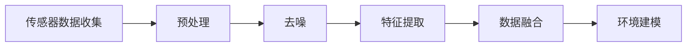
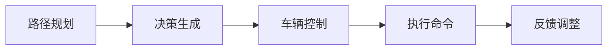

                 

### 第1章：端到端自动驾驶概述

> **关键词**：端到端自动驾驶，全路况适应性，环境感知，路径规划，控制算法，传感器融合，安全与伦理

**摘要**：
本章节将探讨端到端自动驾驶技术的定义、发展历程及其面临的挑战与机遇。我们还将详细解析自动驾驶系统的架构，包括传感器融合、数据处理单元以及决策模块。此外，本文还将讨论自动驾驶环境感知与建模技术，以及路径规划与控制的核心算法。通过这些基础知识的梳理，为后续章节的深入探讨打下坚实的基础。

---

#### 1.1 端到端自动驾驶的定义与背景

**定义**：端到端自动驾驶是指从传感器输入到决策执行的全过程都在一个系统中完成，无需人为干预。这包括感知、决策、控制和行动等所有环节。

**背景**：随着人工智能技术的进步，自动驾驶技术正逐渐从实验室走向实际应用。自动驾驶不仅能提高交通安全性和效率，还能减少交通事故，缓解交通拥堵问题。

自动驾驶的发展可以分为以下几个阶段：

- **初级阶段**：基于规则的自动驾驶系统，如自动车道保持。
- **中级阶段**：融合传感器数据，实现部分自动驾驶功能，如自动停车。
- **高级阶段**：全自动驾驶，无需人为干预。

#### 1.2 端到端自动驾驶的发展历程

端到端自动驾驶技术的发展历程可以分为以下几个阶段：

1. **感知阶段**：使用雷达、激光雷达（LiDAR）、摄像头等传感器收集道路信息。
2. **数据处理阶段**：对传感器数据进行预处理、去噪和特征提取。
3. **决策阶段**：通过路径规划算法和车辆控制算法，制定行驶策略。
4. **执行阶段**：将决策转化为实际操作，控制车辆的运动。

#### 1.3 端到端自动驾驶的挑战与机遇

**挑战**：

1. **天气、路况等不确定性因素**：自动驾驶系统需要应对各种复杂的天气和路况条件。
2. **遵守交通法规和伦理问题**：自动驾驶系统需要在遵守交通法规的前提下，处理复杂的伦理问题，如交通事故责任归属。
3. **高度集成的系统复杂度**：自动驾驶系统需要集成多种传感器、处理器和执行器，系统复杂度较高。

**机遇**：

1. **提高交通安全性和效率**：自动驾驶系统可以减少人为驾驶导致的交通事故，提高交通运行效率。
2. **改善交通拥堵问题**：自动驾驶系统可以通过优化交通流，减少拥堵。
3. **降低运营成本**：自动驾驶系统可以降低人力成本，提高运营效率。

通过上述分析，我们可以看到端到端自动驾驶技术虽然在技术上面临诸多挑战，但其在提高交通安全、效率和降低运营成本等方面具有巨大潜力。接下来，我们将进一步探讨自动驾驶系统的架构和技术细节。

---

以上内容是第1章的概述，包括端到端自动驾驶的定义与背景、发展历程以及面临的挑战与机遇。接下来，我们将详细解析自动驾驶系统的架构，包括传感器融合、数据处理单元以及决策模块。敬请期待后续章节的内容。

### 第2章：自动驾驶系统架构

自动驾驶系统的核心在于其架构的设计，这决定了系统能否高效、安全地运行。本章节将深入探讨自动驾驶系统的总体架构，以及其关键组成部分：传感器融合、数据处理单元和决策模块。

#### 2.1 系统总体架构

一个完整的自动驾驶系统可以分为以下几个关键部分：

1. **传感器融合**：传感器是自动驾驶系统的“眼睛和耳朵”，负责收集外部环境的信息。常用的传感器包括雷达、激光雷达（LiDAR）、摄像头等。
2. **数据处理单元**：数据处理单元负责对传感器数据进行预处理、去噪和特征提取，从而提取有用的环境信息。
3. **决策模块**：决策模块根据处理后的环境信息，生成驾驶策略，并控制车辆执行相应的动作。

下面我们将分别介绍这三个关键部分。

#### 2.2 传感器技术

**雷达**：雷达（Radio Detection and Ranging）是一种常用的传感器，主要用于短距离、高精度的物体检测。雷达通过发射和接收无线电波，测量反射回来的时间差和频率变化，从而确定物体的位置、速度和距离。雷达在自动驾驶系统中主要用于检测前方车辆和障碍物。

**激光雷达（LiDAR）**：激光雷达通过发射激光束并测量激光束反射回来所需的时间，从而构建周围环境的点云模型。LiDAR具有长距离、高分辨率的优势，能够提供详细的周围环境信息，是自动驾驶系统中不可或缺的传感器。

**摄像头**：摄像头用于环境感知和识别，可以通过图像处理技术识别道路标志、行人、车辆等。摄像头具有实时性强、数据丰富的优点，但其在光线较差或天气条件恶劣时效果会下降。

#### 2.3 数据处理与融合

**数据处理**：数据处理单元负责对传感器数据进行预处理、去噪和特征提取。预处理包括去除噪声、校正传感器误差等；去噪包括滤波、插值等；特征提取则是从原始数据中提取有用的信息，如物体的形状、大小、速度等。

**数据融合**：由于不同传感器具有不同的优势和局限性，数据融合技术可以将多个传感器的数据整合起来，提高系统精度和可靠性。常见的融合方法包括加权平均、贝叶斯滤波、卡尔曼滤波等。

下面是数据处理与融合的一个简化的Mermaid流程图：



#### 2.4 决策模块

**路径规划**：路径规划是自动驾驶系统中的一个核心问题，旨在为车辆规划出一条从起点到终点的最优路径。常见的路径规划算法包括基于规则的方法（如A*算法）、基于学习的算法（如深度强化学习）等。

**车辆控制**：车辆控制模块根据路径规划的结果，生成车辆的运动控制策略，包括加速、减速、转向等操作。常见的控制算法包括PID控制、模型预测控制（Model Predictive Control, MPC）等。

**决策执行**：决策执行模块将决策模块生成的控制命令转化为具体的执行动作，如激活电机、调整转向等。

决策模块的执行过程可以简化为以下Mermaid流程图：



通过上述分析，我们可以看到自动驾驶系统的架构设计需要考虑多个方面，包括传感器技术、数据处理与融合、决策模块等。这些关键部分的相互作用，决定了自动驾驶系统的性能和可靠性。接下来，我们将进一步探讨环境感知与建模技术，为自动驾驶系统提供更精准的环境信息。

### 第3章：环境感知与建模

环境感知是自动驾驶系统的基础，其质量直接影响到系统的安全性和效率。本章将详细介绍环境感知与建模的技术，包括静态物体识别、动态物体识别、3D建模与2D建模以及实时数据处理。

#### 3.1 环境感知

环境感知技术主要负责收集和解析车辆周围环境的信息，包括道路、交通标志、车辆、行人和其他障碍物等。环境感知的准确性和实时性对于自动驾驶系统的运行至关重要。

**静态物体识别**：静态物体识别技术用于识别道路上的静态物体，如道路标志、车道线、交通信号灯等。这些物体在自动驾驶系统中起着重要的参考作用。常见的静态物体识别方法包括：

- **基于图像处理的方法**：通过边缘检测、形状识别等技术，从摄像头图像中提取道路标志和车道线。
- **基于深度学习的方法**：使用卷积神经网络（CNN）等深度学习模型，从图像中自动学习特征，实现物体识别。

**动态物体识别**：动态物体识别技术用于识别和跟踪车辆、行人等移动目标。这些动态物体是自动驾驶系统中最具挑战性的部分。常见的动态物体识别方法包括：

- **基于雷达的方法**：通过雷达测距和速度信息，识别车辆和行人的位置和运动状态。
- **基于视觉的方法**：使用摄像头捕捉目标图像，通过目标检测和跟踪算法，识别并跟踪动态物体。

#### 3.2 建模技术

建模技术是将环境感知得到的信息转化为系统的输入，以便进行路径规划和决策。建模技术可以分为3D建模和2D建模两种。

**3D建模**：3D建模技术使用激光雷达（LiDAR）或摄像头等传感器，收集周围环境的点云数据，构建三维环境模型。3D建模的优点是能够提供详细的环境信息，有助于自动驾驶系统进行精确的路径规划和决策。常见的3D建模方法包括：

- **基于点云的建模方法**：通过点云数据，使用三维重建算法，构建环境的三维模型。
- **基于深度学习的方法**：使用深度学习模型，直接从传感器数据中学习三维环境特征。

**2D建模**：2D建模技术使用摄像头等传感器，构建环境的二维平面模型。2D建模的优点是计算成本低、实时性强，适合在资源受限的环境中应用。常见的2D建模方法包括：

- **基于图像处理的方法**：通过图像处理算法，提取道路标志、车道线等信息，构建二维环境模型。
- **基于深度学习的方法**：使用卷积神经网络（CNN）等深度学习模型，从图像中自动学习特征，构建二维环境模型。

#### 3.3 实时数据处理

实时数据处理是环境感知与建模的核心环节，其目标是高效、准确地处理大量传感器数据，并提供实时、准确的环境信息。实时数据处理的关键在于算法的高效性和系统设计的优化。

**高效算法**：为了实现实时数据处理，需要采用高效的数据处理算法，如：

- **并行处理**：利用多核处理器，实现数据的并行处理，提高处理速度。
- **缓存技术**：使用缓存技术，减少数据的重复处理，提高数据处理效率。

**低延迟**：在实时数据处理中，延迟是一个关键指标。为了降低延迟，可以采用以下策略：

- **数据压缩**：对传感器数据进行压缩，减少传输和处理的延迟。
- **预处理**：在传感器数据传输到数据处理单元之前，进行预处理，减少数据处理时间。

#### 3.4 环境感知与建模技术的综合应用

在实际应用中，环境感知与建模技术需要综合多种方法，以满足不同场景的需求。例如，在城市交通环境中，可以使用摄像头进行静态物体识别和2D建模，同时使用雷达进行动态物体识别和3D建模。在高速公路环境中，可以使用雷达进行长距离物体识别和3D建模，使用摄像头进行近距离物体识别和2D建模。

通过综合应用环境感知与建模技术，自动驾驶系统可以实现对复杂环境的精确感知和建模，为路径规划和决策提供可靠的基础。

综上所述，环境感知与建模技术在自动驾驶系统中起着至关重要的作用。通过高效的算法和优化的系统设计，可以实现实时、准确的环境感知和建模，为自动驾驶系统提供关键的支持。接下来，我们将进一步探讨路径规划与控制，为自动驾驶系统实现全天候全路况适应性奠定基础。

### 第4章：路径规划与控制

路径规划与控制是自动驾驶系统的核心，它决定了车辆如何在复杂环境中安全、高效地行驶。本章将深入探讨路径规划与控制的方法，包括路径规划算法、车辆控制算法和实时决策。

#### 4.1 路径规划

路径规划是指为自动驾驶车辆生成一条从起点到终点的最优行驶路径。路径规划的目标是保证车辆在遵守交通规则和避免碰撞的同时，以最快的速度到达目的地。路径规划算法可以分为基于规则的方法和基于学习的方法。

**基于规则的方法**：基于规则的方法通过预先定义的规则和约束条件来生成路径。常见的算法包括A*算法和Dijkstra算法。A*算法是一种启发式搜索算法，通过估算总路径代价（起点到终点的距离加上从起点到当前位置的代价）来选择下一个前进节点，从而找到最优路径。Dijkstra算法则是一种无向图的单源最短路径算法，适用于路径代价较小的场景。

以下是一个简化的A*算法的伪代码：

```markdown
function A*(start, goal):
    openSet = set containing start
    gScore[start] = 0
    fScore[start] = heuristic(start, goal)
    while openSet is not empty:
        current = node in openSet with the lowest fScore[] value
        if current == goal:
            return reconstruct_path(current)
        openSet.remove(current)
        for each neighbor of current:
            tentative_gScore = gScore[current] + dist(current, neighbor)
            if tentative_gScore < gScore[neighbor]:
                cameFrom[neighbor] = current
                gScore[neighbor] = tentative_gScore
                fScore[neighbor] = gScore[neighbor] + heuristic(neighbor, goal)
    return failure
```

**基于学习的方法**：基于学习的方法通过机器学习算法，从大量数据中学习路径规划策略。深度强化学习（Deep Reinforcement Learning, DRL）是一种常用的方法，它通过模拟自动驾驶场景，训练模型来生成最优路径。DRL算法的核心是价值函数和策略函数，通过迭代更新策略，使车辆能够适应复杂环境。

以下是一个简化的深度强化学习路径规划算法的伪代码：

```markdown
function DRL_path Planning(environment, reward_function):
    initialize agent with a deep neural network
    for each episode:
        state = environment.reset()
        while not done:
            action = agent.select_action(state)
            next_state, reward, done = environment.step(action)
            agent.learn_from_experience(state, action, reward, next_state, done)
            state = next_state
        update the environment with the learned policy
    return the learned policy
```

#### 4.2 车辆控制

车辆控制是指根据路径规划结果，生成控制命令，控制车辆的加速、减速和转向等动作。车辆控制算法可以分为基于模型的方法和基于数据驱动的方法。

**基于模型的方法**：基于模型的方法通过数学模型描述车辆的动力学特性，生成控制命令。常见的控制算法包括PID控制、模糊控制和模型预测控制（Model Predictive Control, MPC）。PID控制是一种经典的控制算法，通过比例、积分和微分三个环节调整控制输出，使系统达到稳定状态。MPC则是一种优化控制方法，通过预测系统未来状态，并优化控制输入，使系统达到最优状态。

以下是一个简化的PID控制算法的伪代码：

```markdown
function PID	control(desired_speed, current_speed):
    error = desired_speed - current_speed
    integral = integral + error
    derivative = error - previous_error
    output = Kp * error + Ki * integral + Kd * derivative
    previous_error = error
    return output
```

**基于数据驱动的方法**：基于数据驱动的方法通过收集实际驾驶数据，训练控制模型，生成控制命令。这种方法不需要建立复杂的数学模型，但需要大量数据来训练模型。深度神经网络（Deep Neural Network, DNN）是一种常用的数据驱动控制方法，它通过学习大量驾驶数据，生成控制策略。

以下是一个简化的深度神经网络控制算法的伪代码：

```markdown
function DNN_control(state):
    input = preprocess(state)
    action = DNN_model.predict(input)
    return action
```

#### 4.3 实时决策

实时决策是指自动驾驶系统在运行过程中，根据环境变化和路径规划结果，实时调整行驶策略。实时决策需要考虑多个因素，包括交通状况、道路条件、安全距离等。

**动态规划**：动态规划（Dynamic Programming, DP）是一种常用的实时决策方法，它通过迭代计算，实时更新车辆的最优路径。动态规划的核心是状态转移方程，通过比较不同路径的代价，选择最优路径。

以下是一个简化的动态规划算法的伪代码：

```markdown
function Dynamic_Programming(start, goal):
    V[goal] = 0
    for each state s:
        V[s] = infinity
        for each action a:
            next_state = execute_action(s, a)
            cost = compute_cost(s, a, next_state)
            V[s] = min(V[s], V[next_state] + cost)
    return optimal_path
```

**多目标优化**：多目标优化（Multi-Objective Optimization, MOO）是一种考虑多个目标的优化方法，它通过平衡速度、安全、能耗等因素，生成最优行驶策略。多目标优化通常使用遗传算法（Genetic Algorithm, GA）等启发式算法来求解。

以下是一个简化的多目标优化算法的伪代码：

```markdown
function Multi-Objective_Optimization(objectives, constraints):
    initialize population
    while not convergence:
        evaluate fitness of population
        select parents based on fitness
        crossover and mutate to generate offspring
        apply constraints to offspring
        update population
    return best solution
```

通过上述方法，自动驾驶系统可以在实时环境中，根据路径规划和环境变化，生成最优的行驶策略，实现全天候全路况适应性。接下来，我们将进一步探讨自动驾驶系统的全天候适应性，包括天气适应性和路况适应性。

### 第5章：全天候适应性

自动驾驶系统的全天候适应性是其实现广泛应用的关键。本章将探讨自动驾驶系统在不同天气和路况条件下的适应性，包括雨雪天气、雾天、城市路况和高速公路行驶，以及非结构化道路的适应性。

#### 5.1 天气适应性

天气变化对自动驾驶系统的感知和决策产生显著影响。以下是一些关键因素及其适应性策略：

**雨雪天气**：在雨雪天气条件下，路面湿滑，能见度降低，这对自动驾驶系统的稳定性和安全性提出了更高的要求。为了应对雨雪天气，系统可以采取以下策略：

- **传感器数据滤波**：在雨雪天气中，雷达和激光雷达的反射信号可能受到噪声干扰，需要采用滤波算法（如卡尔曼滤波）来去除噪声，提高数据精度。
- **视觉传感器辅助**：在雨雪天气下，摄像头图像可能会变得模糊，需要结合其他传感器数据（如雷达）来提高环境感知的可靠性。
- **控制策略调整**：在雨雪天气下，自动驾驶系统可能需要调整控制策略，如降低车速、增加跟车距离，以应对路面湿滑和能见度下降的情况。

**雾天**：雾天条件下，能见度极低，视觉传感器几乎无法工作，这对自动驾驶系统提出了极大的挑战。为了应对雾天，系统可以采取以下策略：

- **雷达增强**：在雾天条件下，雷达成为主要的感知手段。自动驾驶系统可以依赖雷达来检测前方障碍物，并进行避障。
- **多传感器融合**：通过融合摄像头、雷达和激光雷达的数据，可以提高环境感知的准确性，弥补单一传感器的不足。
- **自动驾驶禁用**：在极端雾天条件下，系统可能需要切换到手动驾驶模式，以确保安全。

#### 5.2 路况适应性

路况条件对自动驾驶系统的稳定性和效率有着重要影响。以下是一些关键因素及其适应性策略：

**城市路况**：城市路况复杂，交通流量大，交通信号灯和行人较多。为了应对城市路况，系统可以采取以下策略：

- **交通规则遵守**：自动驾驶系统需要遵守交通信号灯和行人规则，确保行驶安全。
- **动态路径规划**：在城市路况下，系统需要实时调整路径规划，以应对突发状况，如拥堵、事故等。
- **避让策略**：系统需要具备避让行人、非机动车和其他车辆的能力，以确保交通的流畅和安全。

**高速公路**：在高速公路上，车辆通常以较高速度行驶，路况相对简单。为了在高速公路上高效行驶，系统可以采取以下策略：

- **能量管理**：自动驾驶系统需要优化能量消耗，如通过调整车速、启动再生制动等方式，降低油耗。
- **车道保持**：在高速公路上，系统需要保持车道居中，避免因高速行驶时的侧风影响导致偏离车道。
- **超车策略**：在高速公路上，系统需要根据前方车辆的速度和位置，选择合适的时机进行超车，以提高行驶效率。

**非结构化道路**：非结构化道路（如乡村道路、崎岖山路等）通常缺乏清晰的标志和车道线。为了在非结构化道路上行驶，系统可以采取以下策略：

- **SLAM技术**：同时定位与地图构建（Simultaneous Localization and Mapping, SLAM）技术可以帮助系统在无清晰标志的路况下，建立周围环境的三维地图，实现自主导航。
- **地形适应**：系统需要能够适应不同地形，如爬坡、通过沟壑等。
- **冗余传感器**：使用多种传感器（如雷达、激光雷达、摄像头等），以提高环境感知的准确性和可靠性。

通过上述策略，自动驾驶系统可以在不同天气和路况条件下，实现全天候全路况适应性，确保安全和高效地行驶。接下来，我们将探讨自动驾驶系统的安全与伦理问题。

### 第6章：安全与伦理

随着自动驾驶技术的快速发展，其安全性和伦理问题日益受到关注。本章将探讨自动驾驶系统的安全性保障和伦理问题，包括冗余设计、容错机制、驾驶责任归属和隐私保护。

#### 6.1 安全性保障

**冗余设计**：冗余设计是保障自动驾驶系统安全性的重要手段。通过引入冗余传感器、计算单元和执行器，可以在一个组件失效时，由其他组件接管功能，确保系统稳定运行。

- **传感器冗余**：例如，同时使用雷达、激光雷达和摄像头，提高环境感知的可靠性。
- **计算单元冗余**：例如，使用多台计算机并行处理数据，提高决策和控制的可靠性。
- **执行器冗余**：例如，使用多套制动系统、转向系统等，确保车辆运动控制的可靠性。

**容错机制**：自动驾驶系统需要具备容错机制，以应对故障和异常情况。容错机制包括：

- **故障检测**：实时检测系统的各项指标，及时发现异常。
- **故障诊断**：在故障发生时，系统自动诊断故障原因。
- **故障恢复**：在故障发生时，系统自动切换到备用功能，确保系统的连续运行。

**安全评估与测试**：在自动驾驶系统开发和部署前，需要进行全面的安全评估和测试，包括：

- **模拟测试**：在虚拟环境中模拟各种场景，测试系统的响应和性能。
- **实车测试**：在真实道路上进行测试，验证系统的稳定性和安全性。
- **安全评审**：组织专家对系统进行评审，确保其符合安全标准。

#### 6.2 伦理问题

**驾驶责任归属**：自动驾驶技术的发展引发了驾驶责任归属的争议。在发生交通事故时，如何确定责任归属是一个关键问题。以下是一些可能的解决方案：

- **明确责任划分**：在法律层面明确自动驾驶车辆、制造商和运营商的责任范围，确保事故责任明确。
- **保险制度**：建立完善的保险制度，为自动驾驶事故提供经济保障。
- **责任共担**：自动驾驶系统制造商、运营商和用户共同承担一定的责任。

**隐私保护**：自动驾驶系统在运行过程中，会收集大量的车辆、道路和环境数据。如何保护用户隐私成为了一个重要问题。以下是一些隐私保护措施：

- **数据匿名化**：对收集到的数据进行匿名化处理，避免个人身份信息泄露。
- **数据加密**：对数据进行加密处理，确保数据在传输和存储过程中的安全性。
- **隐私政策**：制定明确的隐私政策，告知用户数据收集、使用和共享的方式，并尊重用户的选择权。

**道德决策**：自动驾驶系统在面临道德困境时，如遇到不可避免的事故，需要做出道德决策。以下是一些可能的解决方案：

- **预定义规则**：在系统设计时，明确各种情况下的决策规则，如牺牲非重要人员以保护重要人员。
- **用户选择**：允许用户在购车时选择系统的道德决策模式，如选择保守或激进的决策策略。
- **社会共识**：通过广泛的社会讨论，形成关于自动驾驶系统道德决策的共识，确保系统的公平性和合理性。

通过上述措施，自动驾驶系统可以在确保安全的同时，解决伦理问题，为社会带来更广泛的福祉。接下来，我们将探讨实际项目中的自动驾驶系统应用。

### 第7章：项目实战与案例分析

自动驾驶技术的发展离不开实际项目的实践和验证。本章节将介绍几个具有代表性的自动驾驶项目，分析其中的技术难点和解决方案，并通过具体代码解读，展示自动驾驶系统的实际应用。

#### 7.1 实际项目介绍

自动驾驶项目的实施通常涉及多个阶段，包括传感器安装、数据收集、模型训练、系统测试和部署。以下是一些典型的项目案例：

**案例1：Waymo自动驾驶项目**

Waymo是谷歌旗下的自动驾驶公司，其自动驾驶项目覆盖了从感知、决策到控制的整个流程。Waymo使用多种传感器，如雷达、激光雷达和摄像头，进行环境感知，并采用深度强化学习算法进行路径规划和控制。

**案例2：特斯拉Autopilot项目**

特斯拉的Autopilot自动驾驶系统是另一个知名的项目。Autopilot利用摄像头和雷达进行环境感知，采用视觉感知和深度学习算法进行路径规划和控制。

**案例3：NVIDIA Drive项目**

NVIDIA的Drive自动驾驶平台是面向汽车制造商的自动驾驶解决方案。Drive平台集成了多种传感器和计算单元，提供从感知、决策到控制的一体化解决方案。

#### 7.2 案例分析

**案例1：Waymo自动驾驶项目**

Waymo项目在技术实现上面临多个挑战：

- **传感器融合**：Waymo使用多种传感器进行环境感知，需要解决传感器数据融合的问题，提高系统精度和可靠性。
- **模型训练**：由于自动驾驶系统需要应对复杂的交通环境，模型训练数据量大，训练时间较长。

**解决方案**：

- **多传感器融合**：Waymo采用先进的传感器融合算法，如卡尔曼滤波和贝叶斯滤波，将不同传感器的数据融合起来，提高环境感知的准确性。
- **分布式训练**：Waymo使用分布式训练技术，将模型训练任务分布到多个计算节点上，提高训练效率。

**代码解读**：

以下是一个简化的Waymo传感器融合代码示例：

```python
import numpy as np

def sensor_fusion(lidar_data, radar_data, camera_data):
    # 对雷达数据进行滤波处理
    filtered_radar_data = kalman_filter(radar_data)
    # 对摄像头数据进行特征提取
    features = extract_features(camera_data)
    # 融合多传感器数据
    fused_data = np.concatenate((filtered_radar_data, features))
    # 使用贝叶斯滤波进行数据融合
    fused_data = bayesian_filter(fused_data)
    return fused_data

def kalman_filter(data):
    # 雷达数据滤波处理
    # ...
    return filtered_data

def extract_features(data):
    # 摄像头数据特征提取
    # ...
    return features

def bayesian_filter(data):
    # 贝叶斯滤波处理
    # ...
    return fused_data
```

**案例2：特斯拉Autopilot项目**

特斯拉Autopilot项目在实现上面临以下挑战：

- **实时性**：自动驾驶系统需要在实时环境中高效运行，对计算速度和延迟要求较高。
- **安全性和可靠性**：自动驾驶系统需要在各种路况下确保行驶安全。

**解决方案**：

- **硬件优化**：特斯拉使用高性能计算硬件，如NVIDIA GPU，提高计算速度和效率。
- **冗余设计**：特斯拉采用冗余传感器和计算单元，提高系统的可靠性和安全性。

**代码解读**：

以下是一个简化的特斯拉Autopilot路径规划代码示例：

```python
def path_planning(current_position, destination):
    # 使用A*算法进行路径规划
    path = a_star_search(current_position, destination)
    # 对路径进行平滑处理
    smoothed_path = smooth_path(path)
    return smoothed_path

def a_star_search(start, goal):
    # A*算法实现
    # ...
    return path

def smooth_path(path):
    # 路径平滑处理
    # ...
    return smoothed_path
```

**案例3：NVIDIA Drive项目**

NVIDIA Drive项目面临以下挑战：

- **系统集成**：需要集成多种传感器和计算单元，实现高效的数据处理和决策控制。
- **车辆控制**：需要实现复杂的车辆控制策略，保证车辆的稳定行驶。

**解决方案**：

- **分布式计算**：NVIDIA Drive采用分布式计算架构，将计算任务分布到多个计算节点上，提高计算效率和可靠性。
- **模型预测控制**：NVIDIA Drive使用模型预测控制（MPC）算法，实现车辆的精准控制。

**代码解读**：

以下是一个简化的NVIDIA Drive模型预测控制代码示例：

```python
def model_predictive_control(current_state, reference_path):
    # 模型预测控制实现
    # ...
    control_signals = mpc_controller(current_state, reference_path)
    return control_signals

def mpc_controller(current_state, reference_path):
    # 模型预测控制算法实现
    # ...
    return control_signals
```

通过上述案例分析和代码解读，我们可以看到自动驾驶项目在实施过程中面临多种技术挑战，通过合理的设计和优化，可以解决这些问题，实现自动驾驶系统的安全、高效运行。

### 第8章：未来展望与发展趋势

随着人工智能技术的不断进步，自动驾驶技术正迎来新的发展机遇。本章将探讨未来自动驾驶技术的发展趋势，包括新型传感器、新型算法、法规与政策以及社会影响。

#### 8.1 技术发展

**新型传感器**：未来自动驾驶系统将采用更先进、更高效的传感器。例如，基于人工智能的传感器，如视觉传感器和雷达，将能够实现更精确的环境感知。此外，多模态传感器融合技术也将得到广泛应用，通过融合多种传感器数据，提高系统的整体感知能力。

**新型算法**：随着深度学习、强化学习等机器学习算法的发展，自动驾驶系统将采用更高效的路径规划和控制算法。例如，基于深度强化学习的路径规划算法，能够自适应复杂交通环境，提高行驶安全性和效率。同时，分布式计算和边缘计算技术的应用，将使自动驾驶系统的实时性和可靠性得到显著提升。

**高级辅助驾驶系统（ADAS）**：未来，高级辅助驾驶系统（ADAS）将逐渐普及，实现更多的自动驾驶功能，如自动泊车、自动驾驶车道保持、自动紧急制动等。这些功能将进一步提升驾驶安全性和舒适性。

#### 8.2 法规与政策

**国际法规**：随着自动驾驶技术的快速发展，各国纷纷出台相应的法规和政策，以规范自动驾驶的发展。例如，欧盟委员会发布了《自动驾驶车辆法规框架》，美国联邦公路安全管理局（NHTSA）发布了《自动驾驶车辆安全法规》。

**国内政策**：我国也在积极推进自动驾驶技术的发展，出台了一系列政策。例如，《智能网联汽车道路测试管理规范（试行）》和《智能网联汽车道路测试安全管理要求》等，为自动驾驶技术的测试和验证提供了规范。

**法规挑战**：尽管法规和政策为自动驾驶技术的发展提供了支持，但同时也带来了一些挑战。例如，如何在确保安全的前提下，放宽对自动驾驶系统的测试和验证限制，如何确定驾驶责任归属等，都是需要解决的问题。

#### 8.3 社会影响

**交通安全**：自动驾驶技术有望显著降低交通事故发生率，提高交通安全。通过实时监测和反应，自动驾驶系统能够避免人为驾驶中的疲劳驾驶、酒驾等行为，减少交通事故。

**经济发展**：自动驾驶技术的普及将带来巨大的经济利益。首先，自动驾驶技术将提高交通运输效率，降低物流成本。其次，自动驾驶汽车将改变汽车租赁和共享出行模式，为消费者提供更便捷、经济的出行服务。

**就业变化**：随着自动驾驶技术的发展，传统驾驶岗位将面临失业风险。然而，自动驾驶技术的发展也将创造新的就业机会，如自动驾驶系统的维护、开发和测试等。

**社会伦理**：自动驾驶技术引发了一系列伦理问题，如自动驾驶责任归属、隐私保护等。这些问题需要通过广泛的社会讨论和立法来解决，确保自动驾驶技术能够公平、公正地造福人类社会。

通过上述分析，我们可以看到，自动驾驶技术在未来将迎来更多的发展机遇和挑战。只有通过技术创新、法规完善和社会合作，才能实现自动驾驶技术的广泛应用，为人类社会带来更美好的未来。

### 附录

在本章附录中，我们将提供一些实用的工具与资源，以及一些核心算法原理与伪代码，以便读者更深入地理解和学习端到端自动驾驶技术。

#### 附录A：常用工具与资源

**开发工具**：

1. **传感器数据采集与处理工具**：例如MATLAB、Python等。
2. **深度学习框架**：如TensorFlow、PyTorch、Keras等。
3. **路径规划与控制算法工具**：如ROS（Robot Operating System）、CARLA（Open Urban Driving Simulation Environment）等。

**学习资源**：

1. **在线课程**：Coursera、Udacity、edX等平台提供了许多关于自动驾驶的在线课程。
2. **技术博客与论文**：许多知名技术博客和学术期刊（如IEEE、ACM等）发表了大量关于自动驾驶的论文和技术文章。
3. **开源项目**：GitHub、GitLab等平台上有很多自动驾驶的开源项目和代码库，供开发者学习和参考。

#### 附录B：Mermaid 流程图

**传感器数据流程图**：


#### 附录C：核心算法原理与伪代码

**路径规划算法**：以下是一个简化的A*算法的伪代码：

```markdown
function A*(start, goal):
    openSet = set containing start
    gScore[start] = 0
    fScore[start] = heuristic(start, goal)
    while openSet is not empty:
        current = node in openSet with the lowest fScore[] value
        if current == goal:
            return reconstruct_path(current)
        openSet.remove(current)
        for each neighbor of current:
            tentative_gScore = gScore[current] + dist(current, neighbor)
            if tentative_gScore < gScore[neighbor]:
                cameFrom[neighbor] = current
                gScore[neighbor] = tentative_gScore
                fScore[neighbor] = gScore[neighbor] + heuristic(neighbor, goal)
    return failure
```

**车辆控制算法**：以下是一个简化的PID控制算法的伪代码：

```python
def PID_control(desired_speed, current_speed):
    error = desired_speed - current_speed
    integral = integral + error
    derivative = error - previous_error
    output = Kp * error + Ki * integral + Kd * derivative
    previous_error = error
    return output
```

**深度学习算法**：以下是一个简化的深度神经网络控制算法的伪代码：

```python
def DNN_control(state):
    input = preprocess(state)
    action = DNN_model.predict(input)
    return action
```

通过这些工具与资源，以及核心算法原理与伪代码，读者可以更深入地了解端到端自动驾驶技术，为自己的研究和工作提供指导。希望这个附录对读者有所帮助。

