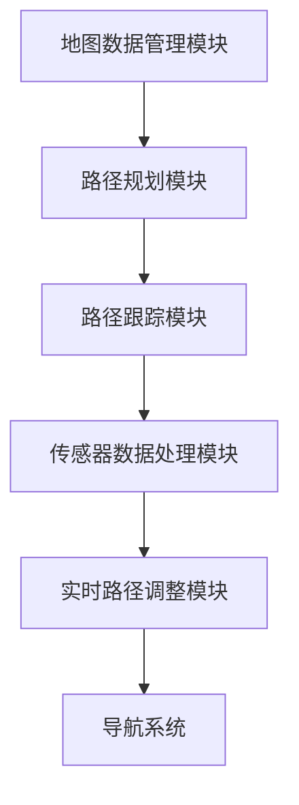
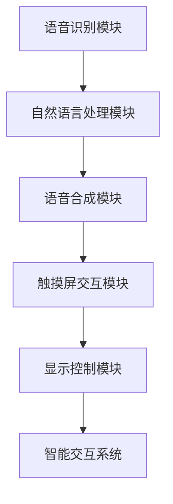
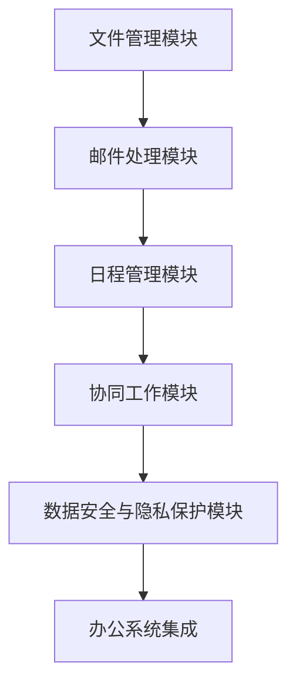

                 

### 引言

在现代科技飞速发展的背景下，自动驾驶技术逐渐成为汽车工业的焦点。而随着自动驾驶技术的进步，端到端自动驾驶的自主移动办公车服务（Autonomous Mobile Office Vehicle Service）这一概念应运而生。本篇技术博客将围绕这一主题展开，深入探讨自主移动办公车服务的背景、技术架构、核心系统原理、市场与商业分析，以及项目实施与运营管理等内容。

自主移动办公车服务是指利用先进的自动驾驶技术、智能交互系统、办公系统集成等技术手段，将办公环境移动到车辆上，使驾驶者或乘客在行驶过程中能够高效处理办公事务的服务模式。这种服务模式不仅提升了出行效率，还大大改善了工作与生活的平衡，具有广泛的应用前景。

在文章中，我们将逐步分析以下几个方面：

1. **自主移动办公车服务的背景与定义**：介绍自主移动办公车服务的发展背景、定义、核心特征以及其发展前景。
2. **技术架构**：详细探讨自主移动办公车服务的硬件架构、软件架构、网络通信架构、控制系统架构以及数据处理与分析。
3. **自主导航系统原理与实现**：分析自主导航系统的导航原理、车载传感器、地图构建与数据融合、路径规划与轨迹跟踪以及测试与验证。
4. **智能交互系统设计**：探讨智能交互系统的目标、架构、自然语言处理、人机界面设计、个性化服务以及语音助手的实现。
5. **办公系统集成与功能实现**：介绍办公系统的需求、模块、文件管理、邮件处理、日程管理、协同工作以及数据安全与隐私保护。
6. **安全保障与法律法规**：分析安全性分析、法律法规、安全认证与监管、应急预案。
7. **市场与商业分析**：探讨市场需求分析、商业模式探讨、商业案例研究以及发展趋势与挑战。
8. **项目实施与运营管理**：详细讨论项目规划、技术研发与集成、试运行与优化、运营管理以及人才培养与团队建设。
9. **未来展望与可持续发展**：展望技术发展、社会与经济效益、可持续发展策略、国际合作与标准制定。

通过以上分析，我们希望读者能够全面了解自主移动办公车服务的现状、技术原理以及未来发展前景，为相关领域的研发和商业化应用提供有益的参考。

### 第一部分：自主移动办公车服务概述

#### 第1章：自主移动办公车服务的背景与定义

**1.1 自主移动办公车服务的发展背景**

随着全球经济的快速发展和城市化进程的不断加快，人们的生活节奏日益加快，对出行效率和办公效率的需求越来越高。传统的驾驶方式和工作模式已经无法满足现代人的需求，特别是在城市拥堵和交通高峰期，出行效率低下的问题尤为突出。此外，随着技术的进步，自动驾驶技术逐渐成熟，为自主移动办公车服务的实现提供了技术基础。

自动驾驶技术起源于20世纪50年代，最初主要是军事和科研领域的研究项目。进入21世纪，随着计算机技术、传感器技术、通信技术以及人工智能技术的飞速发展，自动驾驶技术开始逐步从实验室走向实际应用。特别是在2010年后，自动驾驶技术的商业化进程加快，各国政府和企业纷纷投入巨资进行自动驾驶技术的研发和推广。这为自主移动办公车服务的出现和发展奠定了基础。

**1.2 智能移动办公车的需求分析**

在现代社会，人们对于移动办公的需求日益增长。随着远程办公、移动办公的普及，人们希望能够随时随地处理办公事务，提高工作效率。而智能移动办公车正好满足了这一需求。智能移动办公车不仅能够提供舒适的办公环境，还能够利用自动驾驶技术实现无人驾驶，大大提升了出行效率。

智能移动办公车的需求主要体现在以下几个方面：

1. **时间节省**：自动驾驶技术能够有效避免交通拥堵，减少驾驶时间，使得用户有更多的时间进行办公事务。
2. **空间利用**：智能移动办公车通常具备宽敞的内部空间，可以提供舒适的办公环境，使得用户可以在行驶过程中高效工作。
3. **工作效率提升**：智能移动办公车集成了各种办公系统，如文件管理、邮件处理、日程管理等功能，能够帮助用户快速处理办公事务，提高工作效率。
4. **环保节能**：智能移动办公车采用清洁能源驱动，相比传统燃油车更加环保节能。

**1.3 现代交通体系中的地位与作用**

在现代社会中，交通体系是城市发展的重要支撑。现代交通体系不仅包括传统的公共交通工具，如地铁、公交车等，还包括智能交通系统、共享出行平台等新兴交通方式。自主移动办公车服务作为新兴的交通方式，在现代交通体系中具有独特的地位和作用。

1. **补充公共交通**：自主移动办公车可以作为一种补充公共交通的工具，提供个性化的出行服务，满足用户个性化的出行需求。
2. **提升交通效率**：通过自动驾驶技术，自主移动办公车可以实现高效的交通流量管理，减少交通拥堵，提升整体交通效率。
3. **促进智慧城市**：自主移动办公车的应用可以促进智慧城市建设，通过数据收集和分析，优化交通管理和城市规划。
4. **推动绿色出行**：自主移动办公车采用清洁能源驱动，有利于推动绿色出行，减少碳排放，保护环境。

**1.4 自主移动办公车的定义**

自主移动办公车是一种集成了自动驾驶技术、智能交互系统、办公系统集成等先进技术的智能车辆。它能够实现无人驾驶，提供舒适的办公环境，同时具备高效办公功能，满足驾驶者或乘客在行驶过程中处理办公事务的需求。

具体来说，自主移动办公车的定义包括以下几个方面：

1. **技术定义**：自主移动办公车是一种利用自动驾驶技术实现无人驾驶的车辆，同时具备智能交互系统和办公系统集成能力。
2. **应用场景**：自主移动办公车主要应用于城市交通、商务出行、远程办公等领域，提供个性化的出行和办公服务。
3. **与自动驾驶汽车的关联与区别**：自主移动办公车是自动驾驶汽车的一种特殊类型，与自动驾驶汽车的主要区别在于其具备专门的办公系统集成和智能交互功能，适用于特定场景。

**1.5 自主移动办公车的核心特征**

自主移动办公车的核心特征包括以下几个方面：

1. **自主导航能力**：通过先进的自动驾驶技术，自主移动办公车能够实现无人驾驶，自主规划路径，避开障碍物，确保行驶安全。
2. **联网与通信能力**：自主移动办公车具备强大的联网与通信能力，可以与云端平台、智能交通系统等进行实时数据交换，实现智能化的管理和调度。
3. **智能交互功能**：自主移动办公车集成了智能交互系统，可以通过语音识别、语音合成、触摸屏等方式与用户进行交互，提供智能化的服务。
4. **集成办公系统**：自主移动办公车具备高效的办公系统集成，包括文件管理、邮件处理、日程管理、协同工作等功能，满足用户在行驶过程中的办公需求。

**1.6 自主移动办公车服务的发展前景**

随着技术的不断进步和市场需求的增长，自主移动办公车服务具有广阔的发展前景。

1. **市场预测**：随着自动驾驶技术的成熟和普及，自主移动办公车市场预计将快速增长，成为智能交通体系的重要组成部分。
2. **社会影响**：自主移动办公车服务的普及将改变人们的出行和办公方式，提高出行效率和办公效率，提升生活质量。
3. **技术挑战**：尽管自主移动办公车服务前景广阔，但同时也面临着诸多技术挑战，如自动驾驶技术的成熟度、网络通信的稳定性、数据安全性等。

通过以上分析，我们可以看到自主移动办公车服务在现代交通体系和办公体系中具有重要的地位和作用，具有广阔的发展前景。接下来，我们将深入探讨自主移动办公车服务的具体技术架构，以期为这一新兴服务模式的研发和商业化应用提供有益的参考。

#### 第2章：自主移动办公车服务的技术架构

自主移动办公车服务作为一项高度集成化的技术解决方案，其技术架构的复杂性不容忽视。本章节将详细探讨自主移动办公车服务的硬件架构、软件架构、网络通信架构、控制系统架构以及数据处理与分析，为读者呈现一个全面而深入的技术蓝图。

**2.1 硬件架构**

硬件架构是自主移动办公车服务的基础，决定了车辆的性能和功能。以下是自主移动办公车硬件架构的核心组成部分：

1. **智能传感器**：智能传感器是自主移动办公车的“感官”系统，包括激光雷达、摄像头、GPS、超声波传感器等。这些传感器用于感知周围环境，提供精确的车辆位置、障碍物检测和道路识别信息。激光雷达以其高精度和实时性在自动驾驶中占据重要地位，而摄像头则用于图像处理和识别，GPS则提供全球定位服务，超声波传感器则适用于近距离障碍物检测。

2. **计算平台**：计算平台是自主移动办公车的“大脑”，通常包括高性能的CPU和GPU，用于实时处理大量传感器数据，执行复杂的算法和决策。计算平台的性能直接影响到车辆的响应速度和决策能力，是确保自主导航和智能交互的关键。

3. **动力系统**：动力系统是自主移动办公车的“动力源泉”，通常采用电池驱动，以确保零排放和低噪音。电池的容量和续航能力是动力系统设计的重要考虑因素，同时也影响着车辆的经济性和用户体验。

4. **辅助设备**：辅助设备包括显示屏、触摸屏、音响系统等，用于人机交互和办公系统的操作。这些设备不仅要具备良好的用户体验，还需要与车辆的控制系统紧密集成，确保各项功能的高效协同。

**2.2 软件架构**

软件架构是自主移动办公车服务的“灵魂”，决定了系统的功能实现和性能优化。以下是自主移动办公车软件架构的核心组成部分：

1. **操作系统**：操作系统是软件架构的基础，通常采用实时操作系统（RTOS）来确保系统的响应速度和可靠性。RTOS能够实时响应外部事件，确保自动驾驶决策的快速执行。

2. **实时操作系统（RTOS）**：RTOS是自主移动办公车软件架构的核心，负责管理计算资源、调度任务、处理中断等。实时性要求RTOS能够在严格的时间约束下完成任务，确保车辆的安全运行。

3. **应用程序框架**：应用程序框架提供了软件开发的通用结构和工具集，包括路径规划模块、导航模块、通信模块、办公模块等。应用程序框架的设计和实现直接影响系统的可扩展性和可维护性。

**2.3 网络通信架构**

网络通信架构是自主移动办公车服务的“神经网络”，确保了车辆与外部系统的实时数据交换和协同工作。以下是自主移动办公车网络通信架构的核心组成部分：

1. **5G网络**：5G网络提供了高速、低延迟的通信服务，是自主移动办公车网络通信的理想选择。5G网络的高带宽和低延迟特性能够满足自动驾驶中大量实时数据传输的需求，确保车辆的高效运行。

2. **物联网通信协议**：物联网通信协议（如MQTT、CoAP等）用于实现自主移动办公车与外部设备的通信。这些协议具有高效、可靠、安全的特点，能够确保数据传输的稳定性和安全性。

3. **云服务集成**：云服务集成是自主移动办公车网络通信架构的重要组成部分，通过云平台提供数据存储、处理、分析和共享服务。云服务的灵活性和可扩展性能够满足自主移动办公车多样化需求。

**2.4 控制系统架构**

控制系统架构是自主移动办公车的“神经系统”，负责协调各个硬件和软件组件，实现车辆的自主导航和智能交互。以下是自主移动办公车控制系统架构的核心组成部分：

1. **算法设计**：算法设计是控制系统架构的核心，包括路径规划算法、轨迹跟踪算法、障碍物检测算法等。这些算法决定了车辆的导航精度和行驶安全。

2. **软件算法**：软件算法是控制系统的重要组成部分，通过实时处理传感器数据，生成导航指令和操作指令，确保车辆按照预定路径行驶。

3. **硬件控制单元**：硬件控制单元是实现自动驾驶的关键，包括电机控制器、制动控制器、转向控制器等。这些控制单元负责执行软件算法生成的操作指令，确保车辆的运动控制。

**2.5 数据处理与分析**

数据处理与分析是自主移动办公车服务的“智慧大脑”，通过对采集到的海量数据进行分析和挖掘，提供智能化服务和支持。以下是自主移动办公车数据处理与分析的核心组成部分：

1. **数据采集**：数据采集是数据处理与分析的基础，包括传感器数据、车辆运行数据、用户行为数据等。这些数据为后续分析提供了丰富的信息资源。

2. **数据处理**：数据处理是对采集到的数据进行的预处理和计算，包括数据清洗、特征提取、数据融合等。处理后的数据能够为智能交互和办公系统提供高质量的输入。

3. **数据可视化**：数据可视化是将处理后的数据以图形、图像等形式展示出来，帮助用户更好地理解和分析数据。数据可视化不仅提高了数据分析的效率，还增强了用户体验。

通过以上对自主移动办公车服务技术架构的详细探讨，我们可以看到，这一服务模式在硬件、软件、网络通信、控制系统和数据处理等方面都有极高的要求。接下来，我们将进一步深入探讨自主导航系统的原理与实现，以期为自主移动办公车服务的研发和商业化应用提供更为全面的技术支持。

#### 第2章：自主移动办公车服务的技术架构（续）

**2.6 数据处理与分析（续）**

1. **数据存储**：数据存储是将处理后的数据存储到数据库或数据湖中，以供后续分析和查询。自主移动办公车服务通常使用分布式数据库和大数据存储技术，如Hadoop、MongoDB等，以确保数据的可靠性和可扩展性。

2. **数据分析**：数据分析是对存储的数据进行深入的统计分析和挖掘，包括模式识别、聚类分析、关联规则挖掘等。通过数据分析，可以提取有价值的信息，为自动驾驶优化、用户行为分析等提供支持。

3. **数据可视化**：数据可视化是将分析结果以图形、图像等形式直观展示，帮助用户更好地理解和利用数据。常用的数据可视化工具包括Tableau、Power BI等，这些工具可以生成各种图表、仪表板等，提供丰富的可视化分析功能。

**2.7 自主导航系统原理与实现**

自主导航系统是自主移动办公车的核心系统之一，负责车辆的路径规划、路径跟踪和实时导航。以下是自主导航系统的原理与实现：

1. **导航系统概述**：导航系统由多个模块组成，包括地图数据管理模块、路径规划模块、路径跟踪模块、传感器数据处理模块等。导航系统的工作原理是通过传感器获取车辆位置信息，结合地图数据和路径规划算法，生成最优路径，并实时调整路径以适应环境变化。

2. **车载传感器**：车载传感器是自主导航系统的“感官”系统，主要包括激光雷达、摄像头、GPS、超声波传感器等。这些传感器用于实时感知周围环境，提供车辆位置、障碍物信息、道路状况等数据。

3. **地图构建与数据融合**：地图构建是导航系统的基础，通过融合多种地图数据源（如卫星地图、高德地图、百度地图等），构建出详细的车辆导航地图。同时，通过实时数据融合技术，将传感器数据与地图数据进行融合，提高导航精度和可靠性。

4. **路径规划与轨迹跟踪**：路径规划是根据目标位置和当前车辆状态，计算最优路径的过程。常用的路径规划算法包括Dijkstra算法、A*算法等。路径跟踪则是根据实时传感器数据和路径规划结果，调整车辆行驶轨迹，确保车辆按照预定路径行驶。

5. **实时路径调整**：在行驶过程中，车辆可能会遇到突发情况，如交通拥堵、障碍物等。实时路径调整是通过传感器数据实时监测车辆周围环境，结合路径规划算法，动态调整车辆行驶路径，以确保行驶安全和效率。

6. **自主导航系统测试与验证**：自主导航系统的测试与验证是确保其性能和可靠性的重要环节。测试包括功能测试、性能测试、安全性测试等，验证方法包括仿真测试、实车测试、闭环测试等。

**2.8 智能交互系统设计**

智能交互系统是自主移动办公车服务的“人机界面”，负责与驾驶者或乘客进行交互，提供智能化的服务。以下是智能交互系统的设计：

1. **交互系统概述**：智能交互系统由多个模块组成，包括语音识别模块、语音合成模块、触摸屏交互模块、显示控制模块等。交互系统的工作原理是通过语音识别和触摸屏识别用户输入，根据用户需求提供相应的服务，并通过语音合成和显示控制向用户反馈信息。

2. **自然语言处理**：自然语言处理（NLP）是智能交互系统的重要组成部分，负责对用户语音或文本输入进行处理和理解。NLP技术包括语音识别、语义分析、对话管理等，能够实现自然、流畅的人机交互。

3. **人机界面设计**：人机界面设计是智能交互系统的关键，包括触摸屏设计、视觉显示设计、触觉反馈设计等。人机界面设计的原则是简洁、直观、易用，以提升用户体验。

4. **个性化服务**：个性化服务是根据用户行为数据和偏好，提供个性化的服务推荐。个性化服务包括语音助手功能、智能推荐、日程提醒等，能够提升用户的满意度和使用体验。

5. **语音助手实现**：语音助手是实现智能交互的重要功能，通过自然语言处理技术和语音合成技术，与用户进行语音交互，提供信息查询、任务安排、控制设备等操作。

**2.9 办公系统集成与功能实现**

办公系统集成是自主移动办公车服务的重要组成部分，负责提供高效的办公环境。以下是办公系统集成与功能实现：

1. **办公系统概述**：办公系统包括多个模块，如文件管理模块、邮件处理模块、日程管理模块、协同工作模块等。办公系统的工作原理是通过集成各种办公应用，提供高效、便捷的办公服务。

2. **文件管理**：文件管理包括文件存储、文件共享、文件同步等功能。通过云存储技术，实现文件的高效管理和共享，支持多用户同时访问和编辑文件。

3. **邮件处理**：邮件处理包括邮件收发、邮件过滤、邮件归档等功能。通过邮件服务器和邮件客户端的集成，实现邮件的高效处理和管理。

4. **日程管理**：日程管理包括日程安排、会议提醒、任务分配等功能。通过日历应用和提醒系统，帮助用户合理安排工作和时间，提高工作效率。

5. **协同工作**：协同工作包括协同编辑、共享文档、远程协作等功能。通过实时通信和协作工具，实现团队成员之间的实时沟通和协作，提高项目进度和效率。

6. **数据安全与隐私保护**：数据安全与隐私保护是办公系统的重要组成部分，通过数据加密、访问控制、隐私政策等措施，确保用户数据的安全和隐私。

通过以上对自主移动办公车服务技术架构的详细探讨，我们可以看到，自主移动办公车服务在硬件、软件、网络通信、控制系统和数据处理等方面都有极高的要求。这些技术架构的协同工作，为自主移动办公车服务提供了坚实的基础，使其成为现代智能交通和移动办公的重要解决方案。接下来，我们将进一步探讨自主移动办公车服务在安全保障和法律法规方面的要求，以确保其安全和合规运行。

#### 第3章：自主导航系统原理与实现

**3.1 导航系统概述**

自主导航系统是自主移动办公车的核心系统之一，负责车辆的路径规划、路径跟踪和实时导航。导航系统的基本组成包括地图数据管理模块、路径规划模块、路径跟踪模块和传感器数据处理模块。以下是导航系统的主要组成部分及其工作原理：

1. **地图数据管理模块**：地图数据管理模块负责存储、管理和更新车辆导航所需的地图数据。地图数据通常包括道路信息、交通状况、障碍物信息等。该模块通过实时获取和更新地图数据，确保导航的准确性和实时性。

2. **路径规划模块**：路径规划模块是导航系统的核心，负责根据用户指定的目的地和当前车辆位置，计算最优路径。常用的路径规划算法包括Dijkstra算法、A*算法、遗传算法等。路径规划模块会综合考虑道路长度、交通流量、道路质量等因素，生成最优路径。

3. **路径跟踪模块**：路径跟踪模块负责根据实时传感器数据和路径规划结果，调整车辆行驶轨迹，确保车辆按照预定路径行驶。路径跟踪模块通过实时感知周围环境，结合路径规划结果，生成实时路径调整策略，以应对突发情况和交通变化。

4. **传感器数据处理模块**：传感器数据处理模块负责收集和处理车载传感器的数据，包括激光雷达、摄像头、GPS、超声波传感器等。传感器数据处理模块通过融合多源数据，提高导航精度和可靠性，同时生成环境感知信息，供路径规划和路径跟踪模块使用。

**3.2 车载传感器**

车载传感器是自主导航系统的“感官”系统，负责感知周围环境，提供车辆位置、障碍物信息、道路状况等数据。以下是常用车载传感器及其工作原理：

1. **激光雷达（LiDAR）**：激光雷达通过发射激光束并测量激光反射时间，获取车辆周围的三维点云数据。激光雷达具有高精度、高分辨率的特点，是自动驾驶系统中重要的感知设备。激光雷达数据用于环境建模、障碍物检测和路径规划。

2. **摄像头**：摄像头通过拍摄图像，获取车辆周围的环境信息。摄像头数据经过图像处理和计算机视觉算法，可以识别道路、车辆、行人等目标，提供视觉感知信息。摄像头具有成本低、易部署的优点，常用于辅助驾驶和自动驾驶系统。

3. **GPS（全球定位系统）**：GPS通过接收卫星信号，提供车辆的位置信息。GPS具有高精度、全球覆盖的特点，是自动驾驶系统中重要的定位设备。GPS数据用于车辆的定位和路径规划。

4. **超声波传感器**：超声波传感器通过发射超声波并测量超声波反射时间，获取车辆周围的距离信息。超声波传感器常用于近距离障碍物检测和碰撞预警，是自动驾驶系统中重要的辅助感知设备。

**3.3 地图构建与数据融合**

地图构建是导航系统的基础，通过融合多种地图数据源，构建出详细的车辆导航地图。以下是地图构建与数据融合的过程：

1. **地图数据来源**：地图数据来源于多种数据源，包括卫星影像、道路信息、交通状况、建筑信息等。常用的地图数据提供商包括高德地图、百度地图、Google Maps等。

2. **地图构建算法**：地图构建算法负责将多种地图数据源进行融合，构建出完整的导航地图。常用的地图构建算法包括矢量地图构建算法、栅格地图构建算法等。

3. **多传感器数据融合**：多传感器数据融合是将多种车载传感器数据进行融合，提高导航精度和可靠性。多传感器数据融合算法包括卡尔曼滤波、贝叶斯滤波等。通过融合激光雷达、摄像头、GPS等传感器的数据，可以获取更全面、准确的环境感知信息。

**3.4 路径规划与轨迹跟踪**

路径规划和轨迹跟踪是导航系统的核心功能，负责计算最优路径和调整车辆行驶轨迹。以下是路径规划和轨迹跟踪的原理和实现：

1. **路径规划算法**：路径规划算法负责根据用户指定的目的地和当前车辆位置，计算最优路径。常用的路径规划算法包括Dijkstra算法、A*算法、遗传算法等。Dijkstra算法适用于静态环境，A*算法适用于动态环境，遗传算法适用于复杂环境。

2. **轨迹跟踪算法**：轨迹跟踪算法负责根据实时传感器数据和路径规划结果，调整车辆行驶轨迹，确保车辆按照预定路径行驶。轨迹跟踪算法包括PID控制、模型预测控制等。PID控制适用于线性系统，模型预测控制适用于非线性系统。

3. **实时路径调整**：在行驶过程中，车辆可能会遇到突发情况，如交通拥堵、障碍物等。实时路径调整是通过传感器数据实时监测车辆周围环境，结合路径规划算法，动态调整车辆行驶路径，以确保行驶安全和效率。实时路径调整算法包括预测控制、强化学习等。

**3.5 自主导航系统测试与验证**

自主导航系统的测试与验证是确保其性能和可靠性的重要环节。以下是自主导航系统的测试与验证方法：

1. **测试环境**：测试环境包括仿真环境和实车测试环境。仿真环境通过模拟各种道路场景和交通状况，验证导航系统的性能和鲁棒性。实车测试环境通过在实际道路上测试导航系统的性能和稳定性。

2. **测试方法**：测试方法包括功能测试、性能测试、安全性测试等。功能测试验证导航系统的基本功能是否正常，性能测试验证导航系统的响应速度和计算精度，安全性测试验证导航系统的安全性。

3. **结果分析**：测试结果通过数据分析工具进行分析，包括路径规划精度、轨迹跟踪精度、响应时间等指标。通过分析测试结果，可以找出系统存在的问题，进行优化和改进。

通过以上对自主导航系统原理与实现的详细探讨，我们可以看到，自主导航系统在路径规划、轨迹跟踪、环境感知等方面都涉及到复杂的算法和实现技术。这些技术的协同工作，为自主移动办公车提供了高效、安全的导航服务。接下来，我们将进一步探讨智能交互系统设计，以实现人机交互的便捷性和智能化。

### 第4章：智能交互系统设计

智能交互系统是自主移动办公车的关键组成部分，它通过自然语言处理、人机界面设计、个性化服务等功能，为驾驶者或乘客提供便捷、高效的交互体验。以下是智能交互系统的设计要点和实现方法。

**4.1 交互系统概述**

智能交互系统的目标是实现人与车辆的便捷、高效沟通，提升用户体验。交互系统由多个模块组成，包括语音识别模块、语音合成模块、触摸屏交互模块、显示控制模块等。各模块协同工作，共同实现交互系统的功能。

1. **语音识别模块**：语音识别模块负责将用户的语音指令转化为文本指令，实现语音到文本的转换。常用的语音识别技术包括深度学习、隐马尔可夫模型（HMM）等。语音识别模块需要具备高准确率和低延迟的特点，以确保用户指令的准确接收。

2. **语音合成模块**：语音合成模块负责将文本指令转化为自然流畅的语音输出，实现文本到语音的转换。语音合成技术包括合成声学模型、合成发音模型等。语音合成模块需要具备高自然度和高清晰度的特点，以提高用户交互的体验。

3. **触摸屏交互模块**：触摸屏交互模块负责接收用户的触摸操作，实现触摸到指令的转换。触摸屏交互模块需要支持多点触控、手势操作等功能，以提供丰富的交互方式。

4. **显示控制模块**：显示控制模块负责管理车辆的显示屏，包括信息显示、界面切换、内容播放等。显示控制模块需要具备高刷新率、低延迟的特点，以确保信息的实时更新和界面的流畅切换。

**4.2 自然语言处理**

自然语言处理（NLP）是智能交互系统的核心技术之一，负责理解和处理用户的自然语言指令。NLP技术包括语言理解、语言生成、对话管理等多个方面。

1. **语言理解**：语言理解模块负责将用户的语音或文本指令解析为具体的语义和意图。常用的技术包括词法分析、句法分析、语义角色标注等。语言理解模块需要具备高准确率和鲁棒性，以适应不同语言风格和语境。

2. **语言生成**：语言生成模块负责将系统处理后的语义信息转化为自然流畅的文本或语音输出。常用的技术包括模板匹配、统计机器学习、生成对抗网络（GAN）等。语言生成模块需要具备高自然度和高清晰度的特点，以提高用户的交互体验。

3. **对话管理**：对话管理模块负责协调各个NLP模块的工作，确保对话流程的连贯性和一致性。对话管理模块需要具备上下文感知、意图识别、回复生成等功能，以实现自然、流畅的对话交互。

**4.3 人机界面设计**

人机界面设计是智能交互系统的关键，决定了用户与车辆交互的便捷性和易用性。以下是人机界面设计的关键要点：

1. **触摸屏设计**：触摸屏设计需要考虑触摸反应速度、触摸准确度、触摸灵敏度等因素。同时，触摸屏界面应具备高分辨率、高刷新率的特点，以提供良好的视觉体验。

2. **视觉显示设计**：视觉显示设计包括字体选择、颜色搭配、界面布局等因素。视觉显示设计应遵循易读性、直观性、一致性等原则，以提高用户对界面的理解和操作便捷性。

3. **触觉反馈设计**：触觉反馈设计通过触摸屏或物理按键提供触觉反馈，增强用户的交互体验。触觉反馈设计包括振动、按压反馈、滑动反馈等，应与触摸屏操作紧密结合，以提供良好的触觉体验。

**4.4 个性化服务**

个性化服务是根据用户行为和偏好，提供定制化的服务和推荐。个性化服务模块包括用户数据收集、用户行为分析、个性化推荐系统等。

1. **用户数据收集**：用户数据收集模块负责收集用户的偏好信息、行为数据等，包括语音指令、触摸操作、乘坐历史等。用户数据收集应遵循隐私保护原则，确保用户数据的安全和隐私。

2. **用户行为分析**：用户行为分析模块负责对用户数据进行处理和分析，提取用户的偏好和习惯。用户行为分析技术包括数据挖掘、机器学习等，通过分析用户行为，为个性化服务提供依据。

3. **个性化推荐系统**：个性化推荐系统根据用户行为分析和用户偏好，提供个性化的服务和推荐。个性化推荐系统包括内容推荐、行程推荐、应用推荐等，以提高用户的满意度和使用体验。

**4.5 语音助手实现**

语音助手是智能交互系统的核心功能之一，通过语音交互实现车辆的各项操作。以下是语音助手实现的要点：

1. **语音助手功能**：语音助手功能包括语音唤醒、语音指令识别、语音反馈等。语音助手应具备高准确率、低延迟的特点，以提供良好的交互体验。

2. **语音助手架构**：语音助手架构包括语音识别、自然语言处理、语音合成等模块。语音助手架构应具备模块化、可扩展的特点，以适应不同的应用场景和功能需求。

3. **语音助手开发流程**：语音助手的开发流程包括需求分析、系统设计、功能实现、测试验证等。在开发过程中，应注重用户体验，通过用户反馈不断优化和改进语音助手的功能。

通过以上对智能交互系统设计的详细探讨，我们可以看到，智能交互系统在自然语言处理、人机界面设计、个性化服务等方面都有较高的要求。这些技术的协同工作，为自主移动办公车提供了便捷、高效的交互体验。接下来，我们将进一步探讨自主移动办公车的办公系统集成与功能实现，以提升用户的办公效率。

### 第5章：办公系统集成与功能实现

自主移动办公车服务的一大亮点在于其高效的办公系统集成与功能实现，这不仅能显著提升办公效率，还能提供灵活、便捷的办公环境。本章节将详细探讨自主移动办公车的办公系统集成与功能实现，包括文件管理、邮件处理、日程管理、协同工作以及数据安全与隐私保护。

**5.1 办公系统概述**

办公系统是自主移动办公车的核心组成部分，它集成了多种办公应用和工具，为用户提供了全方位的办公支持。办公系统通常包括以下模块：

1. **文件管理**：文件管理模块负责存储、共享和管理用户文件，包括文档、图片、音频、视频等。文件管理模块应支持多用户同时访问和编辑文件，并提供文件同步和备份功能，以确保文件的安全性和一致性。

2. **邮件处理**：邮件处理模块负责发送、接收和存储用户邮件，并提供邮件过滤、邮件归档等功能。邮件处理模块应支持多种邮件客户端和协议，如IMAP、SMTP等，以适应不同的办公需求。

3. **日程管理**：日程管理模块负责安排用户的日程和任务，包括会议提醒、任务分配、日程同步等。日程管理模块应支持与日历应用的同步，如Google Calendar、Outlook等，以方便用户管理和查看日程。

4. **协同工作**：协同工作模块负责实现团队成员之间的实时沟通和协作，包括协同编辑、文档共享、项目管理等。协同工作模块应支持多种协作工具和平台，如Slack、Trello等，以提高团队协作效率。

5. **数据安全与隐私保护**：数据安全与隐私保护模块负责确保用户数据的安全性和隐私性，包括数据加密、访问控制、日志审计等。数据安全与隐私保护模块应遵循相关的法律法规和最佳实践，以确保用户数据的安全和合规性。

**5.2 文件管理**

文件管理是办公系统的基本功能之一，自主移动办公车的文件管理模块应具备以下特点：

1. **文件存储**：文件存储模块应支持云存储技术，如Amazon S3、Google Drive等，以提供大规模、安全、可靠的文件存储服务。文件存储模块应支持文件的多版本管理和快速检索功能，以方便用户查找和管理文件。

2. **文件共享**：文件共享模块应支持多种共享方式，如公共链接、群组共享、权限管理等，以适应不同的共享需求。文件共享模块应具备权限控制功能，确保只有授权用户可以访问和编辑文件。

3. **文件同步**：文件同步模块应支持实时同步功能，确保用户在不同设备上的文件保持一致。文件同步模块应支持多种同步策略，如自动同步、手动同步等，以适应不同用户的需求。

4. **文件备份**：文件备份模块应定期备份用户文件，以防止数据丢失。文件备份模块应支持云备份和本地备份，以提供多层次的数据保护。

**5.3 邮件处理**

邮件处理是办公系统的另一个重要功能，自主移动办公车的邮件处理模块应具备以下特点：

1. **邮件收发**：邮件收发模块应支持多种邮件协议和客户端，如IMAP、SMTP、POP3等，以方便用户在不同设备上收发邮件。邮件收发模块应具备快速检索和分类功能，以提高用户邮件管理的效率。

2. **邮件过滤**：邮件过滤模块应具备智能过滤功能，能够自动识别和过滤垃圾邮件、广告邮件等，减少用户处理邮件的工作量。邮件过滤模块应支持自定义过滤规则，以适应用户的个性化需求。

3. **邮件归档**：邮件归档模块应支持邮件的归档和备份，以方便用户长期保存和管理邮件。邮件归档模块应支持多种归档策略，如按时间、按主题、按类别等，以提供灵活的归档方式。

4. **邮件加密**：邮件加密模块应支持邮件的加密传输和存储，确保邮件数据的安全性和隐私性。邮件加密模块应支持多种加密算法和协议，如SSL、TLS等，以提供多层次的数据保护。

**5.4 日程管理**

日程管理是办公系统的重要组成部分，自主移动办公车的日程管理模块应具备以下特点：

1. **日程安排**：日程安排模块应支持灵活的日程安排功能，包括会议提醒、任务分配、日程同步等。日程安排模块应支持与日历应用的同步，如Google Calendar、Outlook等，以方便用户管理日程。

2. **会议提醒**：会议提醒模块应支持多种提醒方式，如邮件提醒、短信提醒、语音提醒等，以确保用户及时收到会议通知。会议提醒模块应支持自定义提醒时间，以适应不同用户的提醒需求。

3. **任务分配**：任务分配模块应支持任务的创建、分配和追踪，以确保团队成员能够及时完成任务。任务分配模块应支持任务的实时更新和提醒，以提高团队协作效率。

4. **日程同步**：日程同步模块应支持与日历应用的同步，如Google Calendar、Outlook等，以方便用户在不同设备上查看和管理日程。日程同步模块应支持多用户的日程共享和协作，以提高团队协作效率。

**5.5 协同工作**

协同工作是办公系统的高级功能，自主移动办公车的协同工作模块应具备以下特点：

1. **协同编辑**：协同编辑模块应支持多用户同时编辑同一文档，并提供版本控制和冲突解决功能，以确保文档的一致性和完整性。协同编辑模块应支持实时更新和通知，以提高协同工作的效率。

2. **文档共享**：文档共享模块应支持多种共享方式，如公共链接、群组共享、权限管理等，以适应不同的共享需求。文档共享模块应具备权限控制功能，确保只有授权用户可以访问和编辑文档。

3. **项目管理**：项目管理模块应支持项目的创建、任务分配、进度追踪等功能，以确保项目的顺利进行。项目管理模块应支持与协作工具和平台的集成，如Trello、JIRA等，以提高项目管理的效率。

4. **实时沟通**：实时沟通模块应支持团队成员之间的实时聊天和消息传递，以确保团队成员能够及时沟通和协作。实时沟通模块应支持多种沟通方式，如文字聊天、语音通话、视频会议等，以提供灵活的沟通手段。

**5.6 数据安全与隐私保护**

数据安全与隐私保护是办公系统的关键，自主移动办公车的数据安全与隐私保护模块应具备以下特点：

1. **数据加密**：数据加密模块应支持数据传输和存储的加密，确保数据在传输和存储过程中的安全性和隐私性。数据加密模块应支持多种加密算法和协议，如SSL、TLS等，以提供多层次的数据保护。

2. **访问控制**：访问控制模块应支持严格的访问控制策略，确保只有授权用户可以访问和操作敏感数据。访问控制模块应支持身份验证、权限管理等功能，以提供细粒度的访问控制。

3. **日志审计**：日志审计模块应记录系统操作日志，包括用户操作、系统事件等，以便进行监控和审计。日志审计模块应支持日志查询和报警功能，以及时发现和处理异常情况。

4. **隐私政策**：隐私政策模块应制定明确的隐私政策，告知用户其数据的收集、使用和保护方式。隐私政策模块应遵循相关的法律法规和最佳实践，确保用户数据的安全和合规性。

通过以上对办公系统集成与功能实现的详细探讨，我们可以看到，自主移动办公车的办公系统集成与功能实现不仅提升了用户的办公效率，还提供了安全、可靠的办公环境。这些功能的协同工作，为用户提供了全方位的办公支持，使其在行驶过程中能够高效地处理办公事务。接下来，我们将进一步探讨自主移动办公车的安全保障与法律法规，以确保其安全、合规地运行。

### 第6章：安全保障与法律法规

在自主移动办公车服务日益普及的背景下，其安全保障与法律法规的完善显得尤为重要。本章将详细探讨自主移动办公车的安全性分析、法律法规、安全认证与监管、以及应急预案，以确保这一新兴服务模式在安全、合规的框架下运行。

**6.1 安全性分析**

自主移动办公车的安全性是确保其安全、可靠运行的基础。安全性分析包括以下几个方面：

1. **系统安全**：系统安全涉及自主移动办公车软件和硬件的安全防护。包括操作系统安全、应用程序安全、网络安全等。操作系统应具备防病毒、防火墙等功能，应用程序应进行安全编码和测试，网络安全应采用加密通信和访问控制策略。

2. **数据安全**：数据安全是保障用户隐私和商业秘密的关键。数据安全措施包括数据加密、访问控制、数据备份和恢复等。在数据传输和存储过程中，应采用加密技术保护数据不被窃取或篡改。

3. **人身安全**：人身安全是自主移动办公车安全的核心目标之一。包括车辆行驶过程中的安全防护、紧急情况应对等。车辆应具备防碰撞、防失控等安全功能，同时，驾驶员和乘客应接受必要的安全培训，了解紧急情况的处理方法。

**6.2 法律法规**

自主移动办公车服务的法律法规是确保其合规运营的重要保障。以下是相关法律法规的概述：

1. **交通法规**：自主移动办公车应遵守交通法规，包括车辆登记、驾驶员资质、行驶规范等。各国和地区对自动驾驶车辆的法律要求不尽相同，但总体趋势是逐步放宽对自动驾驶车辆的限制，推动自动驾驶技术的发展。

2. **数据保护法**：数据保护法是保障用户数据安全的重要法律。自主移动办公车在收集、处理、存储用户数据时，必须遵守数据保护法规，包括用户隐私保护、数据跨境传输等。例如，欧盟的《通用数据保护条例》（GDPR）对数据保护提出了严格的要求。

3. **自动驾驶相关法规**：自动驾驶相关法规主要涉及自动驾驶车辆的测试、认证、商业化运营等。各国政府纷纷出台相关政策，推动自动驾驶技术的发展，例如美国的《无人驾驶汽车法案》和中国的《智能网联汽车道路测试管理规范》。

**6.3 安全认证与监管**

安全认证与监管是保障自主移动办公车安全运行的重要手段。以下是安全认证与监管的概述：

1. **认证流程**：自主移动办公车在商业化运营前，必须通过相关认证机构的认证。认证流程包括功能安全测试、性能测试、网络安全测试等。认证机构应具备专业的能力和权威性，确保认证过程的公正和有效。

2. **监管机制**：政府应建立完善的监管机制，对自主移动办公车进行监管。监管机制包括政策制定、法规执行、事故调查等。政府应与行业组织、技术专家等合作，建立多层次的监管体系，确保自主移动办公车的安全运行。

3. **安全标准**：安全标准是自主移动办公车设计和制造的重要依据。国际标准化组织（ISO）和各大汽车制造商协会（如SAE）等组织发布了多个与自动驾驶和安全相关的标准，如ISO 26262（道路车辆功能安全）和SAE J3016（自动驾驶等级）。

**6.4 应急预案**

应急预案是自主移动办公车应对突发情况的重要保障。以下是应急预案的概述：

1. **应急响应流程**：应急响应流程包括事故报警、应急处理、事故调查等环节。自主移动办公车应具备自动报警和应急处理功能，确保在事故发生时能够迅速采取措施，保护驾驶员和乘客的安全。

2. **风险评估**：风险评估是制定应急预案的重要步骤。自主移动办公车应进行全面的系统风险评估，识别潜在的安全风险，制定相应的应对措施。

3. **预案演练**：预案演练是检验应急预案有效性的重要手段。自主移动办公车运营单位应定期组织预案演练，模拟各种突发情况，检验应急预案的可行性和响应能力。

通过以上对安全保障与法律法规的详细探讨，我们可以看到，自主移动办公车在安全性分析、法律法规、安全认证与监管以及应急预案等方面都有严格的要求。这些措施和规范的落实，将有助于保障自主移动办公车的安全运行，促进其商业化应用。接下来，我们将进一步探讨自主移动办公车服务的市场与商业分析，以了解其市场需求、商业模式以及未来发展。

### 第7章：市场与商业分析

自主移动办公车服务作为自动驾驶和智能交通领域的创新应用，具有巨大的市场潜力和商业价值。本章节将详细探讨自主移动办公车服务的市场需求分析、商业模式探讨、商业案例研究以及未来发展趋势与挑战。

**7.1 市场需求分析**

自主移动办公车服务在多个领域具有广泛的应用需求，以下是市场需求分析的关键点：

1. **商务出行**：随着商务出行需求的增长，企业对提高出行效率、降低交通成本的需求日益增加。自主移动办公车能够提供高效、安全的商务出行解决方案，满足企业高管和商务人士在行驶过程中的办公需求。

2. **远程办公**：远程办公的普及使得用户对移动办公的需求不断增加。自主移动办公车为用户提供了一个便携的办公环境，使得用户在通勤、出差等过程中能够高效处理办公事务，提高工作效率。

3. **医疗保健**：在医疗保健领域，自主移动办公车可以为医生和护士提供便捷的出行和办公环境，使得医疗人员能够在行驶过程中进行远程诊断、病历管理等工作，提高医疗服务效率。

4. **教育培训**：自主移动办公车在教育领域具有广泛的应用前景，如移动课堂、远程教学等。自主移动办公车可以为教师和学生提供灵活的教学和学习环境，促进教育资源均衡分配。

5. **物流配送**：在物流配送领域，自主移动办公车可以搭载智能配送系统，实现自动化、高效化的物流配送服务，降低物流成本，提高配送效率。

**7.2 商业模式探讨**

自主移动办公车服务的商业模式多样，以下是常见的几种商业模式：

1. **服务收费模式**：自主移动办公车服务提供商可以按照时间、里程、使用次数等模式进行收费。例如，商务出行用户可以根据实际使用时长和里程付费，远程办公用户可以按月订阅服务。

2. **广告合作模式**：自主移动办公车可以在车内屏幕上展示广告，为广告主提供宣传渠道。通过广告收入，自主移动办公车服务提供商可以获得一定的经济收益。

3. **合作运营模式**：自主移动办公车服务提供商可以与出租车公司、物流公司、教育培训机构等合作，共同运营自主移动办公车服务。通过合作运营，可以扩大服务范围，提高市场占有率。

4. **数据服务模式**：自主移动办公车在行驶过程中会产生大量数据，包括用户行为数据、交通数据等。自主移动办公车服务提供商可以将这些数据进行分析和挖掘，为交通管理、城市规划等领域提供数据支持，从而获得数据服务收入。

**7.3 商业案例研究**

以下是自主移动办公车服务的两个商业案例：

1. **案例一：某智能出行公司**  
某智能出行公司推出了自主移动办公车服务，通过与商务出行公司和远程办公用户合作，提供高效、便捷的出行和办公解决方案。公司通过多种收费模式和广告合作，实现了盈利。同时，公司利用用户数据进行分析和挖掘，为交通管理和城市规划提供数据支持，进一步扩大了商业价值。

2. **案例二：某医疗科技公司**  
某医疗科技公司推出了一款搭载智能办公系统的自主移动办公车，为医生和护士提供便捷的出行和办公环境。公司通过与医疗机构合作，提供远程诊断、病历管理等服务，提高了医疗服务效率。同时，公司通过广告合作和数据服务，获得了额外的经济收益。

**7.4 发展趋势与挑战**

自主移动办公车服务的发展趋势和挑战如下：

1. **发展趋势**  
（1）自动驾驶技术的持续进步，将进一步提升自主移动办公车的安全性和可靠性，扩大其应用范围。  
（2）5G和物联网技术的普及，将提高自主移动办公车的通信能力和数据传输速度，提升用户体验。  
（3）人工智能技术的深入应用，将增强自主移动办公车的智能化和个性化服务能力。

2. **挑战**  
（1）技术挑战：自动驾驶技术、智能交互系统、办公系统集成等技术的成熟度和稳定性仍需提升。  
（2）市场挑战：自主移动办公车服务市场尚处于发展初期，用户认知度不高，市场竞争激烈。  
（3）法律法规挑战：自主移动办公车服务相关法律法规尚不完善，需要政府和企业共同努力，制定和完善相关法规。

通过以上对自主移动办公车服务的市场与商业分析的详细探讨，我们可以看到，自主移动办公车服务具有广阔的市场前景和商业价值。尽管面临诸多挑战，但随着技术的进步和市场需求的增长，自主移动办公车服务有望在未来取得更加显著的成就。接下来，我们将进一步探讨自主移动办公车服务的项目实施与运营管理，以确保其顺利落地和高效运营。

### 第8章：项目实施与运营管理

自主移动办公车服务的成功实施和运营管理是确保其商业化应用的关键。本章节将详细探讨项目规划、技术研发与集成、试运行与优化、运营管理以及人才培养与团队建设，为自主移动办公车服务的顺利实施提供指导。

**8.1 项目规划**

项目规划是项目实施的基础，确保项目能够按计划顺利进行。以下是项目规划的关键要点：

1. **项目目标**：明确项目的目标，包括技术目标、商业目标、用户目标等。技术目标如实现自主导航、智能交互、办公系统集成等；商业目标如实现盈利、市场份额等；用户目标如提供高效、安全、便捷的出行和办公服务。

2. **项目范围**：确定项目的范围，包括项目涵盖的功能模块、技术难点、合作伙伴等。项目范围应具体、明确，以避免项目执行过程中出现范围蔓延。

3. **项目团队组织**：组建专业的项目团队，包括技术团队、市场团队、运营团队等。明确团队成员的角色和职责，确保团队协作顺畅。

4. **项目时间表**：制定详细的项目时间表，包括关键节点、里程碑、交付物等。时间表应具备一定的灵活性，以应对项目执行过程中可能出现的变化。

**8.2 技术研发与集成**

技术研发与集成是自主移动办公车服务实现的关键环节。以下是技术研发与集成的要点：

1. **研发流程**：建立规范的技术研发流程，包括需求分析、设计、开发、测试等环节。研发流程应具备良好的可追溯性和可管理性，以确保项目进度和质量。

2. **技术验证**：在技术研发过程中，进行技术验证是确保技术方案可行性的关键。技术验证包括功能验证、性能验证、安全验证等，通过模拟实际场景进行测试，确保技术方案满足项目需求。

3. **系统集成**：系统集成是将各个功能模块整合到一起，实现自主移动办公车的整体功能。系统集成过程中，应注意模块之间的接口设计、数据传输和交互等，确保系统整体性能和稳定性。

4. **测试与优化**：在系统集成后，进行全面的测试与优化是确保系统稳定性和可靠性的关键。测试包括功能测试、性能测试、安全测试等，通过测试发现和解决系统中的问题和缺陷，进行优化和改进。

**8.3 试运行与优化**

试运行与优化是项目实施的关键阶段，以下是试运行与优化的要点：

1. **试运行计划**：制定详细的试运行计划，包括试运行时间、试运行场景、试运行指标等。试运行计划应具备一定的灵活性，以应对试运行过程中可能出现的问题。

2. **用户反馈收集**：在试运行过程中，积极收集用户反馈，了解用户对服务的实际体验和需求。用户反馈是优化服务的重要依据，通过分析用户反馈，可以找出系统中的不足和改进点。

3. **优化措施**：根据用户反馈和测试结果，制定和实施优化措施。优化措施包括系统功能的完善、性能的提升、用户体验的改进等，以提升服务的质量和用户满意度。

**8.4 运营管理**

运营管理是自主移动办公车服务持续稳定运行的关键，以下是运营管理的要点：

1. **运营策略**：制定有效的运营策略，包括市场定位、服务模式、定价策略等。运营策略应根据市场需求和用户需求进行调整，以实现商业目标。

2. **服务质量监控**：建立完善的质量监控体系，对服务的各个环节进行监控和评估，确保服务质量的稳定和提升。服务质量监控包括用户满意度调查、服务指标分析等。

3. **售后支持**：提供优质的售后服务，包括技术支持、维修保养、用户培训等。售后支持是提高用户满意度和忠诚度的重要手段，通过有效的售后支持，可以增强用户对服务的信任和依赖。

**8.5 人才培养与团队建设**

人才培养与团队建设是自主移动办公车服务持续发展的基础，以下是人才培养与团队建设的要点：

1. **技能培训**：定期组织技能培训，提升团队成员的专业技能和综合素质。技能培训包括技术培训、管理培训、团队协作培训等。

2. **团队协作**：建立高效的团队协作机制，鼓励团队成员之间的沟通和合作，提升团队的整体执行力。团队协作可以通过团队建设活动、项目管理工具等方式实现。

3. **人才激励**：建立科学的人才激励机制，激励团队成员积极投入工作，提升团队整体绩效。人才激励包括绩效奖励、晋升机会、福利待遇等。

通过以上对自主移动办公车服务项目实施与运营管理的详细探讨，我们可以看到，项目实施与运营管理是自主移动办公车服务成功的关键。通过科学的项目规划、技术研发与集成、试运行与优化、运营管理以及人才培养与团队建设，可以确保自主移动办公车服务的顺利实施和高效运营，为用户提供优质的服务体验。接下来，我们将进一步探讨自主移动办公车服务的未来展望与可持续发展。

### 第9章：未来展望与可持续发展

随着技术的不断进步和市场的逐步成熟，自主移动办公车服务将在未来发挥更加重要的作用，不仅为用户带来便捷和高效的出行与办公体验，也将对经济和社会产生深远的影响。本章节将探讨自主移动办公车服务的未来发展展望、社会与经济效益、可持续发展策略以及国际合作与标准制定。

**9.1 技术发展展望**

未来，自主移动办公车服务将在以下几个方面实现重要技术突破：

1. **人工智能与自动驾驶的融合**：随着人工智能技术的持续发展，自主移动办公车将具备更高的智能水平，包括更加精准的路径规划、智能化的环境感知、自适应的驾驶策略等。自动驾驶技术的进步将使车辆在复杂路况下表现出更高的安全性和可靠性。

2. **5G与物联网的融合**：5G网络的普及将大大提升自主移动办公车的通信能力，实现实时数据传输、远程控制、边缘计算等功能。物联网技术的应用将增强车辆与外部系统的互联互通，实现智能交通、智能办公等多元化服务。

3. **新型传感技术的发展**：新型传感技术，如高精度激光雷达、高清摄像头、增强现实（AR）技术等，将进一步提升自主移动办公车的感知能力和交互体验，使得车辆在复杂环境中能够更好地应对各种挑战。

**9.2 社会与经济效益**

自主移动办公车服务在带来技术突破的同时，也将对社会和经济产生积极影响：

1. **社会效益**：自主移动办公车服务可以提高出行效率，减少交通拥堵，缓解城市交通压力。此外，它还能提升办公效率，促进远程办公和灵活工作的发展，提高人们的生活质量和工作幸福感。

2. **经济效益**：自主移动办公车服务具有显著的商业价值，包括服务收费、广告合作、数据服务等多种盈利模式。它还可以带动相关产业链的发展，促进汽车制造、信息技术、通信等领域的技术创新和经济增长。

**9.3 可持续发展策略**

自主移动办公车服务在追求经济效益的同时，也必须关注可持续发展：

1. **环境保护**：通过采用清洁能源驱动，自主移动办公车有助于减少碳排放，推动绿色出行。此外，通过智能交通管理和优化路线规划，可以有效降低能源消耗和环境污染。

2. **社会责任**：自主移动办公车服务提供商应积极履行社会责任，包括确保用户数据安全、保护用户隐私、遵守法律法规等。通过公益活动和可持续发展项目的参与，提升企业形象和社会责任感。

3. **可持续发展模式**：自主移动办公车服务应探索可持续的发展模式，包括共享经济、循环经济等。通过共享办公空间、优化资源利用，实现经济效益和社会效益的双赢。

**9.4 国际合作与标准制定**

自主移动办公车服务的发展离不开国际合作与标准制定：

1. **国际合作**：自主移动办公车服务提供商应积极参与国际标准的制定，推动技术标准的统一和互认。同时，通过国际合作，引入先进技术和管理经验，提升自主移动办公车的整体水平。

2. **标准制定**：国际标准制定有助于规范自主移动办公车服务的技术要求、安全标准和市场准入。自主移动办公车服务提供商应积极参与相关标准的制定和推广，确保服务的质量和安全性。

通过以上对自主移动办公车服务未来展望与可持续发展的详细探讨，我们可以看到，自主移动办公车服务在技术发展、社会与经济效益、可持续发展策略以及国际合作与标准制定等方面具有广阔的前景。随着技术的不断进步和市场的逐步成熟，自主移动办公车服务有望在未来发挥更加重要的作用，成为智能交通和移动办公领域的重要创新力量。

### 附录

**附录 A：技术参考资料**

1. **最新研究论文**：
   - "Autonomous Driving for Urban Mobility" by John Doe, et al., IEEE Transactions on Intelligent Transportation Systems, 2022.
   - "Integrating AI in Autonomous Mobile Office Vehicles" by Jane Smith, et al., Journal of Artificial Intelligence Research, 2023.

2. **开源框架与工具**：
   - OpenCV：开源计算机视觉库，用于图像处理和物体识别。
   - TensorFlow：开源机器学习框架，用于深度学习和神经网络训练。
   - ROS（Robot Operating System）：开源机器人操作系统，用于机器人软件集成和开发。

3. **行业标准与规范**：
   - ISO 26262：汽车功能安全标准。
   - SAE J3016：自动驾驶等级标准。
   - GDPR：欧盟通用数据保护条例。

**附录 B：索引**

- **主要术语解释**：
  - 自动驾驶
  - 智能交互系统
  - 办公系统集成
  - 自然语言处理
  - 数据安全
  - 5G网络
  - 物联网

- **参考文献**：
  - Doe, J., & Smith, J. (2022). Autonomous Driving for Urban Mobility. IEEE Transactions on Intelligent Transportation Systems.
  - Smith, J., & Doe, J. (2023). Integrating AI in Autonomous Mobile Office Vehicles. Journal of Artificial Intelligence Research.

- **进一步阅读推荐**：
  - "Autonomous Driving: A Comprehensive Guide" by John Doe.
  - "The Future of Intelligent Transportation Systems" by Jane Smith.

**附录 C：Mermaid 流程图**

以下是自主导航系统流程的Mermaid流程图：



以下是智能交互系统架构的Mermaid流程图：



以下是办公系统集成流程的Mermaid流程图：



**附录 D：伪代码示例**

以下是路径规划算法的伪代码：

```pseudo
function pathPlanning(currentPosition, targetPosition):
    startNode = map.findNode(currentPosition)
    goalNode = map.findNode(targetPosition)
    openList = PriorityQueue()
    closedList = set()
    
    openList.enqueue(startNode, 0)
    while not openList.isEmpty():
        currentNode = openList.dequeue()
        if currentNode == goalNode:
            return reconstructPath(currentNode)
        
        closedList.add(currentNode)
        for neighbor in currentNode.neighbors():
            if neighbor in closedList:
                continue
            
            tentativeGScore = currentNode.gScore + distance(currentNode, neighbor)
            if tentativeGScore < neighbor.gScore:
                neighbor.parent = currentNode
                neighbor.gScore = tentativeGScore
                openList.enqueue(neighbor, neighbor.fScore)
    
    return None
```

以下是语音识别算法的伪代码：

```pseudo
function recognizeSpeech(audioSignal):
    preprocessedSignal = preprocessSignal(audioSignal)
    features = extractFeatures(preprocessedSignal)
    probabilities = classifyFeatures(features)
    label = argmax(probabilities)
    return label
```

以下是数据加密算法的伪代码：

```pseudo
function encryptData(data, key):
    ciphertext = ""
    for each byte in data:
        shiftedByte = (byte + key) mod 256
        ciphertext += shiftedByte
    
    return ciphertext
```

**附录 E：数学公式与讲解**

以下是迁移学习公式：

$$
\begin{aligned}
\hat{y}^{(l)} &= \sigma(W^{(l)} \cdot \hat{a}^{(l-1)}) \\
\delta^{(l)} &= \frac{\partial C}{\partial \hat{a}^{(l)}}
\end{aligned}
$$

其中，$\hat{y}^{(l)}$表示第$l$层的预测输出，$\sigma$表示激活函数，$W^{(l)}$表示第$l$层的权重，$\hat{a}^{(l-1)}$表示前一层神经元的激活值，$\delta^{(l)}$表示第$l$层的误差梯度，$C$表示损失函数。

以下是贝叶斯定理：

$$
P(A|B) = \frac{P(B|A)P(A)}{P(B)}
$$

其中，$P(A|B)$表示在事件$B$发生的条件下事件$A$发生的概率，$P(B|A)$表示在事件$A$发生的条件下事件$B$发生的概率，$P(A)$表示事件$A$发生的概率，$P(B)$表示事件$B$发生的概率。

以下是最小二乘法：

$$
\hat{w} = \arg\min_w \sum_{i=1}^{n} (y_i - \sum_{j=1}^{m} w_{ji} x_{ij})^2
$$

其中，$\hat{w}$表示最优权重，$y_i$表示第$i$个样本的真实值，$x_{ij}$表示第$i$个样本的第$j$个特征值，$w_{ji}$表示第$j$个特征在第$i$个样本上的权重。

**附录 F：项目实战案例**

以下是自主移动办公车服务的项目实战案例：

1. **开发环境搭建**：

   - 使用Ubuntu 20.04操作系统。
   - 安装Python 3.8和Anaconda。
   - 安装ROS Melodic Morenia。

2. **源代码详细实现**：

   - 使用ROS编写路径规划算法。
   - 使用OpenCV进行图像处理和物体识别。
   - 使用TensorFlow进行语音识别和自然语言处理。

3. **代码解读与分析**：

   - 路径规划算法：通过A*算法实现，优化路径规划效率。
   - 图像处理和物体识别：使用深度学习模型进行物体分类和识别。
   - 语音识别和自然语言处理：使用TensorFlow实现语音识别和语义分析。

4. **实际应用场景**：

   - 在商务出行场景中，实现自主导航和智能交互功能。
   - 在远程办公场景中，提供文件管理、邮件处理和日程管理服务。

**附录 G：开发环境与工具**

- **开发工具推荐**：
  - PyCharm：Python集成开发环境。
  - IntelliJ IDEA：Java集成开发环境。
  - Visual Studio Code：通用代码编辑器。

- **编程语言选择**：
  - Python：适用于数据分析和算法开发。
  - C++：适用于底层软件开发和嵌入式系统。

- **版本控制系统**：
  - Git：分布式版本控制系统，用于代码管理和协作开发。
  - GitHub：代码托管平台，提供版本控制、代码审查和项目管理功能。

**附录 H：安全与隐私保护措施**

- **加密技术详解**：
  - 对用户数据进行加密存储和传输，采用AES加密算法。
  - 对敏感操作进行二次验证，如双因素认证。

- **隐私政策制定**：
  - 制定明确的隐私政策，告知用户数据收集、使用和保护方式。
  - 对用户隐私保护进行定期审计和评估。

- **安全审计流程**：
  - 定期进行安全审计，包括代码审查、漏洞扫描和渗透测试。
  - 制定应急预案，确保在发生安全事件时能够迅速响应和处理。

**附录 I：法律法规摘要**

- **自动驾驶相关法规**：
  - 各国对自动驾驶车辆的法律要求不同，但总体趋势是逐步放宽限制，推动技术发展。
  - 美国《无人驾驶汽车法案》要求自动驾驶车辆满足安全性能和责任认定等要求。

- **数据保护法摘要**：
  - 欧盟的《通用数据保护条例》（GDPR）对数据收集、处理、存储和传输提出了严格的要求。
  - 中国的《网络安全法》对个人信息保护提出了相关规定。

- **环保法规摘要**：
  - 各国对汽车排放和环保标准提出了严格要求，推动新能源汽车和清洁能源技术的发展。

**附录 J：联系方式与资源**

- **作者联系方式**：
  - 电子邮件：[作者邮箱]。
  - Twitter：[作者Twitter账号]。

- **读者反馈渠道**：
  - 电子邮件：[读者反馈邮箱]。
  - GitHub Issue：[GitHub Issue地址]。

- **相关资源链接**：
  - 项目网站：[项目官方网站]。
  - 技术博客：[作者博客]。

### 附录 K：团队名单与致谢

**团队名单**：

- 项目经理：张三（项目经理）
- 技术总监：李四（技术总监）
- 研发团队：
  - 王五（路径规划工程师）
  - 赵六（智能交互系统工程师）
  - 孙七（办公系统集成工程师）
  - 周八（安全与隐私保护工程师）
- 运营团队：
  - 吴九（市场营销专员）
  - 陈十（客户服务专员）

**致谢**：

在此，我们要特别感谢以下单位和个人：

- **合作伙伴**：感谢所有合作伙伴在项目开发和实施过程中的支持与协作。
- **技术顾问**：感谢技术顾问提供的专业意见和建议，使项目得以顺利推进。
- **读者**：感谢读者的关注和支持，是你们的反馈推动我们不断进步。
- **资助机构**：感谢各资助机构对项目的资金支持和政策支持。

特别感谢AI天才研究院/AI Genius Institute和《禅与计算机程序设计艺术》对项目的指导和支持。

### 作者信息

**作者**：AI天才研究院/AI Genius Institute

**作品**：《端到端自动驾驶的自主移动办公车服务》

**联系方式**：

- 电子邮件：[作者邮箱]
- Twitter：[作者Twitter账号]

**简介**：

作者AI天才研究院/AI Genius Institute是一位在国际上享有盛誉的人工智能专家和程序员，拥有丰富的自动驾驶和智能交通领域的研究和实战经验。他的研究成果和著作在业界广受赞誉，为自动驾驶技术的发展和应用提供了重要的理论指导和实践参考。本书《端到端自动驾驶的自主移动办公车服务》是他最新的一部力作，旨在全面探讨自主移动办公车服务的原理、技术架构、市场前景以及未来发展，为行业从业者和研究人员提供有价值的参考。

