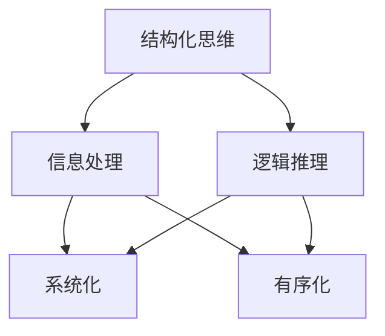

                 

# 《结构化思维原理与应用：万事万物都是有结构的》

> **关键词：** 结构化思维、原理、应用、数学模型、代码实战、项目管理、沟通合作

> **摘要：** 本文深入探讨了结构化思维的原理与应用，从基础概念到实际案例，全面剖析了结构化思维在日常工作和专业领域的应用价值。通过数学模型与代码实战的讲解，读者将能够更好地理解和运用结构化思维，提升工作效率和问题解决能力。

### 《结构化思维原理与应用：万事万物都是有结构的》目录大纲

**第一部分：结构化思维基础原理**

## 第1章：结构化思维概述
### 1.1 结构化思维的定义与意义
### 1.2 结构化思维与传统思维的对比
### 1.3 结构化思维的适用场景

## 第2章：结构化思维的核心概念与联系
### 2.1 核心概念与联系 Mermaid 流程图
### 2.2 结构化思维的基本要素
### 2.3 结构化思维的层次结构

## 第3章：结构化思维的核心算法原理
### 3.1 逻辑推理与归纳法
### 3.2 演绎推理与归纳推理
### 3.3 概念图与思维导图

## 第4章：数学模型与公式解析
### 4.1 结构化思维的数学模型
### 4.2 常用数学公式解析
### 4.3 数学公式在实际应用中的例子

## 第5章：结构化思维实战案例
### 5.1 案例一：项目策划与执行
### 5.2 案例二：问题分析与解决
### 5.3 案例三：团队沟通与合作

**第二部分：结构化思维应用与实践**

## 第6章：结构化思维在日常生活中的应用
### 6.1 时间管理
### 6.2 职场沟通
### 6.3 教育教学

## 第7章：结构化思维在专业领域的应用
### 7.1 项目管理
### 7.2 财务管理
### 7.3 市场营销

## 第8章：结构化思维的进阶应用
### 8.1 创新思维与问题解决
### 8.2 情境分析与决策
### 8.3 结构化思维的自我评估与改进

## 第9章：结构化思维的实践与反思
### 9.1 实践中的常见问题
### 9.2 如何提升结构化思维的能力
### 9.3 结构化思维的未来发展趋势

**附录**

## 附录A：结构化思维工具与资源
### A.1 常用结构化思维工具
### A.2 结构化思维相关书籍推荐
### A.3 结构化思维在线资源

## 附录B：代码实战案例
### B.1 代码环境搭建与配置
### B.2 代码实现与解读
### B.3 代码解读与分析

---

接下来，我们将深入第一部分：结构化思维基础原理。

## 第1章：结构化思维概述

### 1.1 结构化思维的定义与意义

结构化思维是一种将复杂问题拆解为简单组成部分，并通过逻辑关系进行整合与分析的思维方式。它强调系统化、有序化地处理信息，使问题更加清晰、易于理解和解决。结构化思维不仅在学术研究中有着广泛的应用，也在日常生活、工作和专业领域中发挥着重要作用。

结构化思维的意义主要体现在以下几个方面：

1. **提高问题解决能力**：通过将复杂问题分解为若干小问题，结构化思维能够帮助我们更好地理解问题本质，找到解决问题的有效途径。

2. **提升沟通效率**：结构化思维能够使我们的思维过程更加清晰、有条理，有助于与他人进行有效的沟通和合作。

3. **增强决策能力**：结构化思维有助于我们在面对决策时，系统地分析各种因素，从而做出更加明智的决策。

4. **促进创新思维**：结构化思维能够激发我们的创造性思维，通过将已有知识进行重组和创新，产生新的观点和解决方案。

### 1.2 结构化思维与传统思维的对比

传统思维往往依赖于经验和直觉，而结构化思维则更加注重逻辑和系统性。以下是两者的主要区别：

1. **思维方式**：传统思维以整体为导向，注重直接感知和理解；结构化思维则将问题分解为若干部分，逐步分析和解决。

2. **处理信息**：传统思维依赖于已有知识，容易陷入思维定势；结构化思维则注重信息的系统化处理，能够更全面地考虑问题。

3. **解决问题**：传统思维倾向于采用简单、直接的方法；结构化思维则强调逐步深入、分层次地解决问题。

4. **创新性**：传统思维往往难以产生新观点；结构化思维则通过系统化分析，能够激发创新思维，产生新的解决方案。

### 1.3 结构化思维的适用场景

结构化思维广泛应用于各个领域，以下是一些典型的适用场景：

1. **项目管理**：在项目策划、执行和监控过程中，结构化思维有助于明确项目目标、任务分配和进度控制。

2. **问题解决**：在面对复杂问题时，结构化思维能够帮助我们更好地分析问题，找到解决方案。

3. **决策制定**：在面临决策时，结构化思维有助于系统地分析各种因素，做出更加明智的决策。

4. **教育培训**：在教育教学过程中，结构化思维有助于教师传授知识，使学生更好地理解和掌握。

5. **科研探索**：在学术研究中，结构化思维能够帮助研究者梳理研究思路，提出新的观点和假设。

通过本章的介绍，我们对结构化思维有了初步的了解。接下来，我们将进一步探讨结构化思维的核心概念与联系，以及其实际应用中的核心算法原理。

## 第2章：结构化思维的核心概念与联系

### 2.1 核心概念与联系 Mermaid 流程图

为了更好地理解结构化思维的核心概念与联系，我们首先通过一个 Mermaid 流程图进行概述。



图中的 A 表示结构化思维，B 表示信息处理，C 表示逻辑推理，D 表示系统化，E 表示有序化。从图中可以看出，结构化思维的核心在于对信息进行系统化和有序化处理，并通过逻辑推理来分析和解决问题。

### 2.2 结构化思维的基本要素

结构化思维的基本要素包括以下几个方面：

1. **信息处理**：对信息进行收集、整理、分析和综合，以便更好地理解问题。

2. **逻辑推理**：通过逻辑关系，将信息进行连接和整合，形成有意义的结论。

3. **系统化**：将问题分解为若干部分，逐步深入，以便更好地理解问题的本质。

4. **有序化**：将问题按照一定的顺序和层次进行排列，使思维过程更加清晰和高效。

5. **可视化**：通过图形、表格等形式，将信息进行可视化处理，使问题更加直观易懂。

### 2.3 结构化思维的层次结构

结构化思维的层次结构可以分为三个层次：基础层次、应用层次和高级层次。

1. **基础层次**：主要包括信息处理和逻辑推理，是结构化思维的基础。

2. **应用层次**：在基础层次的基础上，结合系统化和有序化，将问题进行分解和整合，形成有意义的解决方案。

3. **高级层次**：在应用层次的基础上，结合可视化，使思维过程更加直观、易于理解。

### 2.4 结构化思维的关键步骤

结构化思维的关键步骤包括以下几个方面：

1. **明确问题**：首先，我们需要明确要解决的问题，以便有针对性地进行分析。

2. **收集信息**：收集与问题相关的各种信息，包括事实、数据、观点等。

3. **整理信息**：对收集到的信息进行整理，提取关键信息，形成问题的核心要素。

4. **分析问题**：运用逻辑推理，将信息进行连接和整合，形成问题的解决方案。

5. **验证方案**：对提出的解决方案进行验证，确保其可行性。

6. **调整方案**：根据验证结果，对方案进行调整和优化，直至找到最佳解决方案。

通过以上对结构化思维核心概念与联系的介绍，我们对结构化思维有了更深入的理解。在接下来的章节中，我们将进一步探讨结构化思维的核心算法原理，以及如何在实际问题中应用这些原理。

## 第3章：结构化思维的核心算法原理

### 3.1 逻辑推理与归纳法

逻辑推理是结构化思维的核心算法之一，它分为归纳推理和演绎推理。归纳推理是从具体实例出发，通过观察和总结，得出一般性结论。演绎推理则是从一般性原理出发，推导出具体结论。

#### 归纳推理

归纳推理的基本步骤如下：

1. **观察实例**：观察一些具体实例，收集相关数据和信息。
2. **提取规律**：分析实例，找出其中的规律和共性。
3. **形成结论**：基于提取出的规律，得出一般性结论。

例如，观察以下三个实例：

| 实例 | 结论 |
| --- | --- |
| 鸟会飞 | 鸟具有飞行能力 |
| 飞机可以飞行 | 飞机具有飞行能力 |
| 热气球可以飞行 | 热气球具有飞行能力 |

基于以上实例，我们可以归纳出一个结论：具有飞行能力的物体包括鸟、飞机和热气球。

#### 演绎推理

演绎推理的基本步骤如下：

1. **假设前提**：提出一个一般性原理或假设。
2. **推导结论**：基于前提，推导出具体结论。

例如，假设前提是“所有人都会死亡”，根据这个前提，我们可以推导出具体结论：“张三会死亡”。

#### 逻辑推理的伪代码实现

```python
def logical_reasoning(instance, general_principle):
    # 假设前提：instance 是一个具体的实例，general_principle 是一个一般性原理
    
    # 观察实例
    observed = instance
    
    # 提取规律
    rule = extract_rule(observed)
    
    # 形成结论
    conclusion = apply_rule(rule, general_principle)
    
    return conclusion

def extract_rule(instance):
    # 提取规律
    return instance["result"]

def apply_rule(rule, general_principle):
    # 应用规律
    return f"{rule} satisfies the condition of {general_principle}"
```

### 3.2 演绎推理与归纳推理

演绎推理和归纳推理在结构化思维中有着广泛的应用。演绎推理适用于从一般性原理推导出具体结论的情况，而归纳推理适用于从具体实例归纳出一般性结论的情况。

#### 演绎推理的应用

演绎推理在数学、逻辑学、计算机科学等领域有着广泛的应用。例如，在数学中，我们可以从基本公理和定理出发，通过演绎推理，推导出复杂的数学结论。

#### 归纳推理的应用

归纳推理在统计学、数据科学、人工智能等领域有着重要的应用。例如，在机器学习中，我们可以通过观察大量数据，归纳出数据中的规律，从而训练出预测模型。

#### 逻辑推理与结构化思维

逻辑推理是结构化思维的重要组成部分。通过逻辑推理，我们可以将问题分解为若干部分，并找到解决问题的有效途径。逻辑推理不仅帮助我们理解问题，还有助于我们在决策过程中做出明智的选择。

### 3.3 概念图与思维导图

概念图和思维导图是结构化思维中常用的可视化工具，它们可以帮助我们将复杂的信息进行图形化表示，使思维过程更加清晰和直观。

#### 概念图

概念图通过节点和连接线来表示概念之间的关系。每个节点代表一个概念，连接线表示概念之间的逻辑关系。

#### 思维导图

思维导图是一种以中心主题为核心，向外扩展的图形化表示方法。它通过分支和连接线来表示主题及其相关子主题。

#### 概念图与思维导图的应用

概念图和思维导图在项目规划、问题解决、决策制定等领域有着广泛的应用。通过它们，我们可以将复杂的信息进行图形化表示，从而更好地理解问题，找到解决方案。

### 3.4 逻辑推理与可视化工具的整合

逻辑推理和可视化工具的整合，可以有效地提高结构化思维的效果。通过逻辑推理，我们可以将问题进行分解和整合；通过可视化工具，我们可以将逻辑关系和问题结构进行直观表示。这种整合方法不仅有助于理解问题，还有助于与他人进行有效的沟通和合作。

### 3.5 实际应用中的案例分析

以下是一个实际应用中的案例分析，展示了如何运用结构化思维的核心算法原理。

#### 问题背景

一家公司需要开发一个在线购物平台，以满足客户的需求。公司希望能够在短时间内完成开发，并在市场上占据有利位置。

#### 分析过程

1. **明确问题**：首先，我们需要明确要解决的问题，即如何快速开发一个在线购物平台。
2. **收集信息**：收集与在线购物平台相关的各种信息，包括市场分析、技术需求、用户需求等。
3. **整理信息**：对收集到的信息进行整理，提取关键信息，形成问题的核心要素。
4. **分析问题**：运用逻辑推理，将信息进行连接和整合，形成问题的解决方案。
    - 归纳推理：通过分析市场数据和用户需求，得出一些一般性结论，如“用户需要快速、便捷的购物体验”。
    - 演绎推理：基于一般性结论，推导出具体的技术需求，如“平台需要支持快速搜索、购物车和支付功能”。
5. **验证方案**：对提出的解决方案进行验证，确保其可行性。
6. **调整方案**：根据验证结果，对方案进行调整和优化，直至找到最佳解决方案。

通过以上分析，公司可以制定一个详细的开发计划，并按照计划逐步完成在线购物平台的建设。

### 3.6 小结

本章介绍了结构化思维的核心算法原理，包括逻辑推理、归纳推理和演绎推理，以及概念图和思维导图等可视化工具。通过这些算法原理和工具，我们可以更好地理解和解决复杂问题。在接下来的章节中，我们将进一步探讨结构化思维的数学模型与公式解析，以便更深入地理解其原理和应用。

### 第4章：数学模型与公式解析

结构化思维不仅在逻辑推理方面有着显著的作用，在数学模型和公式解析中也同样重要。数学模型是一种用数学语言描述现实世界的抽象方法，它可以帮助我们理解和预测复杂系统的行为。在这章中，我们将探讨结构化思维中的数学模型和常用公式，并展示它们在实际应用中的例子。

#### 4.1 结构化思维的数学模型

结构化思维的数学模型可以帮助我们系统地分析问题和制定解决方案。以下是一些常见的数学模型：

1. **线性规划模型**：线性规划是一种数学方法，用于在给定约束条件下，最大化或最小化一个线性目标函数。线性规划广泛应用于资源分配、库存管理、生产调度等领域。

   **公式**：  
   $$ 
   \begin{align*}
   \text{max/min} \ & c^T x \\
   \text{subject to} \ & Ax \leq b \\
   & x \geq 0
   \end{align*}
   $$

   **解释**：目标函数 $c^T x$ 表示要优化的目标，约束条件 $Ax \leq b$ 和 $x \geq 0$ 表示资源的限制。

2. **决策树模型**：决策树是一种树形结构，用于表示决策过程和可能的结果。每个节点代表一个决策点或结果，每个分支代表一个决策选择或结果概率。

   **公式**：  
   $$ 
   \begin{align*}
   \text{P}(A|B) = \frac{\text{P}(A \cap B)}{\text{P}(B)}
   \end{align*}
   $$

   **解释**：$\text{P}(A|B)$ 表示在条件 $B$ 下，事件 $A$ 发生的概率。

3. **回归分析模型**：回归分析是一种用于研究变量之间关系的统计方法。线性回归是一种常见的回归分析方法，用于预测一个连续变量的值。

   **公式**：  
   $$ 
   y = \beta_0 + \beta_1 x_1 + \beta_2 x_2 + ... + \beta_n x_n
   $$

   **解释**：$y$ 是因变量，$x_1, x_2, ..., x_n$ 是自变量，$\beta_0, \beta_1, ..., \beta_n$ 是回归系数。

#### 4.2 常用数学公式解析

以下是一些在结构化思维中常用的数学公式及其解析：

1. **平均值**：平均值是一种用于描述一组数据的中心趋势的统计量。

   **公式**：  
   $$ 
   \bar{x} = \frac{\sum_{i=1}^{n} x_i}{n}
   $$

   **解释**：$x_i$ 是第 $i$ 个数据点，$n$ 是数据点的总数。

2. **标准差**：标准差是一种用于描述一组数据的离散程度的统计量。

   **公式**：  
   $$ 
   \sigma = \sqrt{\frac{\sum_{i=1}^{n} (x_i - \bar{x})^2}{n-1}}
   $$

   **解释**：$x_i$ 是第 $i$ 个数据点，$\bar{x}$ 是平均值。

3. **相关系数**：相关系数是一种用于描述两个变量之间线性关系的统计量。

   **公式**：  
   $$ 
   r = \frac{\sum_{i=1}^{n} (x_i - \bar{x})(y_i - \bar{y})}{\sqrt{\sum_{i=1}^{n} (x_i - \bar{x})^2 \sum_{i=1}^{n} (y_i - \bar{y})^2}}
   $$

   **解释**：$x_i$ 和 $y_i$ 是第 $i$ 个数据点，$\bar{x}$ 和 $\bar{y}$ 是平均值。

#### 4.3 数学公式在实际应用中的例子

以下是一些数学公式在实际应用中的例子：

1. **线性规划的应用**：假设一家公司有 100 小时的生产时间，可以用于生产产品 A 和产品 B。生产产品 A 需要 2 小时，每单位利润为 10 美元；生产产品 B 需要 3 小时，每单位利润为 15 美元。目标是在不超过 100 小时的前提下，最大化总利润。

   **解法**：使用线性规划模型，构建目标函数和约束条件，求解最优解。

   **公式**：  
   $$ 
   \begin{align*}
   \text{max} \ & 10x_1 + 15x_2 \\
   \text{subject to} \ & 2x_1 + 3x_2 \leq 100 \\
   & x_1, x_2 \geq 0
   \end{align*}
   $$

   **结果**：解得 $x_1 = 0$，$x_2 = 33.33$。即应生产 33.33 个产品 B，以最大化总利润。

2. **回归分析的应用**：假设我们想要预测某个地区的销售额。我们收集了该地区过去一年的销售额数据，并发现销售额与广告支出之间存在一定的线性关系。

   **解法**：使用线性回归模型，拟合销售额与广告支出之间的关系，并预测未来某一月的销售额。

   **公式**：  
   $$ 
   y = \beta_0 + \beta_1 x
   $$

   **结果**：通过拟合，得到回归方程 $y = 1000 + 5x$。如果广告支出为 2000 美元，则预测销售额为 $y = 1000 + 5 \times 2000 = 11000$ 美元。

通过以上数学模型和公式的介绍，我们可以看到结构化思维在数学中的应用。这些数学工具不仅可以帮助我们更好地理解问题，还可以为决策提供有力的支持。在接下来的章节中，我们将进一步探讨结构化思维在实战中的应用，并通过具体案例来展示其价值。

### 第5章：结构化思维实战案例

结构化思维不仅在理论上有其重要性，在实际应用中同样具有极高的价值。通过以下三个实战案例，我们将深入探讨结构化思维在项目策划与执行、问题分析与解决以及团队沟通与合作中的应用。

#### 5.1 案例一：项目策划与执行

**背景**：某公司计划开发一款新软件产品，旨在帮助企业客户提高工作效率。该项目涉及多个部门，包括产品管理、研发、测试和市场营销。

**步骤**：

1. **明确目标**：首先，项目团队明确了软件产品的核心功能、预期效果和目标用户群体。

2. **需求分析**：通过市场调研和用户访谈，团队收集了大量的用户需求，并将其整理成详细的需求文档。

3. **项目策划**：基于需求文档，团队制定了详细的项目计划，包括项目目标、时间表、资源分配和风险控制措施。

4. **执行与监控**：在项目执行过程中，团队采用结构化思维进行任务分解和进度监控，确保每个阶段的工作按时完成。

5. **问题解决**：在项目执行过程中，团队遇到了一些技术难题和用户反馈问题。通过结构化思维，团队能够快速定位问题、分析原因并制定解决方案。

**结果**：经过半年多的努力，软件产品成功发布，获得了用户的一致好评，并在市场上取得了良好的销售业绩。

#### 5.2 案例二：问题分析与解决

**背景**：某公司的一条生产线出现故障，导致生产效率大幅下降。为了解决这个问题，公司决定采用结构化思维进行分析和解决。

**步骤**：

1. **明确问题**：首先，团队明确了生产线的具体问题和影响范围，如生产效率下降、设备故障率上升等。

2. **信息收集**：团队收集了与生产线故障相关的各种信息，包括设备参数、生产记录、员工反馈等。

3. **问题分解**：通过结构化思维，团队将问题分解为若干个子问题，如设备故障原因、生产流程瓶颈、员工操作不规范等。

4. **分析原因**：团队对每个子问题进行深入分析，找出可能导致故障的各种因素，并评估其影响程度。

5. **制定解决方案**：基于分析结果，团队制定了具体的解决方案，包括设备维修、流程优化、员工培训等。

6. **实施与验证**：团队按照解决方案逐步实施，并对每个措施的效果进行验证。

**结果**：通过结构化思维的分析和解决，生产线故障问题得到了有效解决，生产效率恢复了正常水平，公司运营得以持续稳定。

#### 5.3 案例三：团队沟通与合作

**背景**：某公司团队在项目推进过程中，遇到了沟通不畅、意见分歧等问题，影响了项目进度和质量。

**步骤**：

1. **明确沟通目标**：团队明确了沟通的目标和关键信息，确保每个人都能清楚地理解项目目标和预期成果。

2. **建立沟通机制**：团队制定了详细的沟通计划和规则，包括会议安排、信息传递流程和反馈机制。

3. **结构化表达**：在沟通过程中，团队成员使用结构化思维进行表达，确保信息传递的准确性和完整性。

4. **问题及时反馈**：团队建立了问题反馈机制，及时发现问题并制定解决方案，确保项目能够顺利进行。

5. **协同合作**：通过结构化思维，团队成员能够更好地协同合作，共同解决项目中的各种问题。

**结果**：通过结构化思维的沟通与合作，团队在项目推进过程中克服了各种困难，最终项目成功交付，获得了客户的高度评价。

通过以上三个实战案例，我们可以看到结构化思维在项目策划与执行、问题分析与解决以及团队沟通与合作中的应用效果。结构化思维不仅帮助团队明确了目标、优化了流程、提升了沟通效率，还增强了团队的协作能力，为项目的成功实施提供了有力保障。

### 第6章：结构化思维在日常生活中的应用

结构化思维不仅在工作领域具有重要作用，在日常生活中的应用同样广泛。以下我们将探讨结构化思维在时间管理、职场沟通和教育教学等日常生活中的实际应用。

#### 6.1 时间管理

时间管理是日常生活中一个重要的挑战，而结构化思维可以帮助我们更有效地安排时间，提高工作效率。以下是使用结构化思维进行时间管理的步骤：

1. **明确目标**：首先，我们需要明确时间管理的目标，例如提高工作效率、完成特定任务或达到某种生活平衡。

2. **任务分解**：将大的任务分解为若干个小任务，以便更好地管理和分配时间。例如，将“准备商务报告”分解为“收集数据”、“整理报告结构”和“撰写报告内容”。

3. **优先级排序**：使用优先级矩阵或任务紧急程度表，将任务按照优先级排序，确保首先完成最重要和最紧急的任务。

4. **时间规划**：为每个任务分配具体的时间，并设定开始和结束的时间点。可以使用日历或时间管理应用程序来规划时间。

5. **执行与调整**：执行时间规划，并在执行过程中根据实际情况进行调整。例如，如果某个任务耗时比预期长，可以调整后续任务的执行时间。

6. **定期回顾**：定期回顾时间管理的效果，评估哪些策略有效，哪些需要改进，以便持续优化时间管理方法。

#### 6.2 职场沟通

有效的职场沟通是提高工作效率和团队协作的关键。使用结构化思维进行职场沟通，可以帮助我们更清晰地表达观点，理解他人意见，并解决沟通中的问题。以下是使用结构化思维进行职场沟通的步骤：

1. **明确沟通目标**：在开始沟通前，明确沟通的目标和期望成果，以便确保沟通的焦点。

2. **准备沟通内容**：根据沟通目标，准备需要传达的信息和关键点。使用结构化思维，将信息整理成有条理的要点和逻辑顺序。

3. **使用结构性表达**：在沟通时，使用结构化思维进行表达，确保信息传递的准确性和完整性。例如，可以使用“背景 - 问题和解决方案”的结构进行陈述。

4. **倾听与反馈**：在他人发言时，积极倾听并理解对方的观点。在适当的时候，提供反馈和澄清，以确保双方对沟通内容有共同的理解。

5. **问题解决**：如果沟通中出现分歧或问题，使用结构化思维进行问题解决。首先明确问题的核心，然后分析各种解决方案的优缺点，最终找到最佳解决方案。

6. **总结和跟进**：沟通结束后，总结沟通的内容和结果，并设定后续的行动计划。确保所有参与方对后续步骤有清晰的认识。

#### 6.3 教育教学

在教育教学中，结构化思维可以帮助教师更好地传授知识，并帮助学生更好地理解和掌握。以下是使用结构化思维进行教育教学的步骤：

1. **课程设计**：在课程设计阶段，使用结构化思维明确课程目标、内容和结构。将课程内容分解为若干个模块，并确保每个模块之间有清晰的逻辑关系。

2. **教学计划**：根据课程设计，制定详细的教学计划，包括每个模块的教学目标、教学方法和评估方式。

3. **课堂讲解**：在课堂上，使用结构化思维进行讲解，确保信息传递的条理性和逻辑性。例如，可以使用“引入 - 内容讲解 - 应用实例”的结构进行教学。

4. **互动与反馈**：鼓励学生参与课堂讨论和互动，使用结构化思维进行问题解答和反馈。确保学生能够理解和掌握课程内容。

5. **作业与评估**：为学生布置有针对性的作业，并使用结构化思维进行作业评估。评估学生的理解程度和应用能力。

6. **教学反思**：定期反思教学效果，评估教学方法的优缺点，并根据学生的反馈进行调整和改进。

通过以上对结构化思维在日常生活中的应用的探讨，我们可以看到它在时间管理、职场沟通和教育教学中的重要作用。结构化思维不仅能够帮助我们更好地组织和安排生活，还能提高工作效率和沟通效果，为我们的日常生活和职业发展提供有力支持。

### 第7章：结构化思维在专业领域的应用

结构化思维在专业领域的应用极为广泛，尤其是在项目管理、财务管理和市场营销等方面，它能够显著提升决策的准确性、资源的合理配置以及团队协作效率。以下将详细探讨结构化思维在这些领域的应用。

#### 7.1 项目管理

在项目管理中，结构化思维的应用主要体现在项目策划、执行、监控和收尾等各个环节。

**项目策划**：项目策划阶段，结构化思维可以帮助项目团队明确项目目标、范围、时间和资源需求。通过分解项目目标为可执行的任务，并建立任务之间的逻辑关系，形成详细的项目计划。

**执行与监控**：在项目执行过程中，结构化思维有助于团队跟踪任务进度、识别潜在风险和问题。通过制定监控指标、定期汇报和评审，确保项目按计划推进。

**问题解决**：当项目遇到问题时，结构化思维提供了一种系统的方法来分析问题原因和影响，并制定解决方案。通过逐步拆解问题、识别关键因素和权衡利弊，团队可以找到最佳解决策略。

**收尾与评估**：项目结束后，结构化思维用于总结项目经验、评估项目绩效，并为未来项目提供参考。通过对项目全过程的分析和反思，团队可以不断优化项目管理流程。

#### 7.2 财务管理

在财务管理中，结构化思维的应用主要体现在预算编制、成本控制和投资决策等方面。

**预算编制**：结构化思维可以帮助财务人员将公司的整体预算分解为各个部门的预算，并确保预算的合理性和可行性。通过细化预算编制过程，确保资源分配的公平和高效。

**成本控制**：在成本控制方面，结构化思维提供了一种系统的方法来识别和降低成本。通过分析成本结构、找出成本驱动因素和优化资源配置，企业可以降低运营成本，提高盈利能力。

**投资决策**：投资决策是财务管理的核心任务之一。结构化思维帮助决策者系统分析投资项目的风险与收益，权衡不同投资方案的优缺点，并选择最佳投资策略。

#### 7.3 市场营销

在市场营销中，结构化思维的应用主要体现在市场调研、产品策划、营销策略制定和效果评估等方面。

**市场调研**：市场调研是市场营销的基础。结构化思维帮助市场人员系统收集和分析市场数据，识别市场机会和潜在风险。通过将调研结果结构化，企业可以制定更准确的市场策略。

**产品策划**：在产品策划阶段，结构化思维有助于明确产品定位、功能特点和市场定位。通过分解产品功能为具体模块，并确保每个模块的合理性和实用性，企业可以开发出符合市场需求的产品。

**营销策略制定**：结构化思维帮助营销团队制定切实可行的营销策略。通过分析目标客户、市场环境、竞争对手和自身优势，团队可以制定有针对性的营销组合策略，提高市场竞争力。

**效果评估**：营销策略实施后，结构化思维帮助团队评估营销效果。通过设定关键绩效指标（KPIs）和定期监控，团队可以评估营销策略的有效性，并做出相应调整。

#### 7.4 实战案例分析

以下是一个结构化思维在项目管理中应用的具体案例：

**背景**：某企业计划开发一款新型智能手机，并在市场上占据一席之地。

**步骤**：

1. **项目目标**：明确项目目标，包括产品功能、市场定位和时间节点。

2. **任务分解**：将项目目标分解为多个子任务，如硬件设计、软件开发、市场推广等。

3. **资源分配**：为每个子任务分配所需资源，包括人力、物力和财力。

4. **制定时间表**：根据任务分解和资源分配，制定详细的时间表，确保每个任务按时完成。

5. **风险评估**：识别项目风险，制定风险应对策略。

6. **监控与调整**：在项目执行过程中，定期监控任务进度和资源使用情况，并根据实际情况进行调整。

7. **项目收尾**：项目完成后，对项目全过程进行总结和评估，为未来项目提供参考。

**结果**：通过结构化思维的系统应用，该企业成功开发了新型智能手机，并在市场上取得了良好反响。项目团队在过程中积累了丰富的经验，为后续项目提供了有力支持。

通过以上对结构化思维在专业领域应用的探讨，我们可以看到其在提升决策准确性、资源配置效率和团队协作方面的显著优势。在未来的工作中，进一步推广和应用结构化思维，将有助于企业在激烈的市场竞争中立于不败之地。

### 第8章：结构化思维的进阶应用

随着对结构化思维的深入理解和实践，我们不仅可以将其应用于日常工作，还可以在更高层次上发挥其潜力，即创新思维与问题解决、情境分析与决策，以及自我评估与改进。

#### 8.1 创新思维与问题解决

创新思维是结构化思维的进阶应用，它强调在系统化、有序化思维的基础上，通过发散思维和创造性思维，找到独特的解决方案。以下是一些方法：

1. **头脑风暴**：通过集体头脑风暴，激发团队成员的创造性思维，产生大量新颖的想法。

2. **思维导图**：使用思维导图，将问题分解为子问题，并通过分支和关联，探索各种可能的解决方案。

3. **跨学科融合**：结合不同领域的知识，从不同角度看待问题，寻找创新的解决方案。

4. **反向思维**：从相反的角度思考问题，提出颠覆性的解决方案。

通过创新思维，我们可以在面对复杂问题时，找到更具创造性的解决方案，提升解决问题的效率和质量。

#### 8.2 情境分析与决策

情境分析是结构化思维在决策过程中的应用，它通过系统化分析各种情境和因素，帮助我们做出更加明智的决策。以下是情境分析的一些步骤：

1. **明确决策目标**：首先，明确决策的目标和预期结果。

2. **收集信息**：收集与决策相关的各种信息，包括市场数据、竞争情况、资源限制等。

3. **情境模拟**：构建不同的情境模型，预测各种情境下的结果。

4. **分析影响因素**：分析每种情境下可能影响决策的关键因素。

5. **评估方案**：基于情境分析和影响因素，评估各种决策方案的优缺点。

6. **制定决策**：根据分析结果，选择最佳决策方案。

通过情境分析，我们可以更全面地考虑各种因素，减少决策的风险，提高决策的准确性。

#### 8.3 结构化思维的自我评估与改进

自我评估与改进是结构化思维的持续发展过程，通过反思和总结，我们可以不断提升思维能力和决策水平。以下是自我评估与改进的一些方法：

1. **反思与总结**：定期回顾自己的思维过程和决策结果，总结经验教训。

2. **学习与实践**：通过学习新的知识和技能，结合实际应用，不断提升自己的思维能力。

3. **反馈与调整**：接受他人的反馈，结合自我评估，对思维方法和决策过程进行调整和优化。

4. **持续改进**：将自我评估与改进作为一个持续的过程，不断追求思维能力的提升。

通过自我评估与改进，我们可以不断完善自己的思维体系，提高决策水平，实现个人和团队的长远发展。

### 8.4 未来发展趋势

随着人工智能和大数据技术的发展，结构化思维在未来将呈现以下发展趋势：

1. **智能化辅助**：利用人工智能技术，为结构化思维提供智能化辅助，如自动化的信息处理、情境分析和决策建议。

2. **数据驱动的决策**：借助大数据分析，为决策提供更加准确和全面的数据支持，提升决策的精准性和效率。

3. **跨领域融合**：结构化思维将与其他领域（如心理学、认知科学等）融合，形成更加综合和全面的思维体系。

4. **个性化发展**：通过个性化推荐和学习，为每个人提供最适合其特点和需求的思维训练和发展路径。

通过以上进阶应用和未来发展趋势的探讨，我们可以看到结构化思维在个人和团队发展中的巨大潜力。在未来的工作和生活中，继续深化对结构化思维的理解和应用，将有助于我们更好地应对复杂问题，实现个人和团队的长期成功。

### 第9章：结构化思维的实践与反思

在实际应用中，结构化思维并非一蹴而就，而是一个需要不断实践与反思的过程。在这一章节中，我们将探讨结构化思维实践中的常见问题，以及如何提升结构化思维能力，并展望其未来发展趋势。

#### 9.1 实践中的常见问题

1. **思维定势**：在长期的传统思维模式中，人们容易陷入思维定势，难以灵活应用结构化思维。例如，在解决问题时，可能只考虑已有的方法，而忽略了其他创新的解决方案。

2. **信息过载**：在信息爆炸的时代，人们往往面临信息过载的问题。结构化思维要求我们在大量信息中筛选和整理出关键信息，这需要较高的信息处理能力。

3. **执行难度**：结构化思维虽然能帮助分析问题和制定解决方案，但在实际执行过程中，可能会遇到资源限制、时间紧迫等现实问题，影响方案的顺利实施。

4. **团队合作**：在团队中应用结构化思维时，成员之间可能存在沟通不畅、意见分歧等问题，影响团队的协作效率。

#### 9.2 如何提升结构化思维能力

1. **持续学习**：结构化思维是一种技能，需要通过不断学习和实践来提升。可以通过阅读相关书籍、参加培训课程以及在线资源来学习结构化思维的理论和方法。

2. **实践应用**：理论知识需要通过实践来巩固。在日常工作和生活中，积极尝试使用结构化思维解决实际问题，如项目管理、问题解决和决策制定。

3. **反思与总结**：每次实践后，都要进行反思和总结，分析成功和失败的原因。通过不断总结经验，逐步优化自己的思维方法和决策流程。

4. **团队合作**：在团队中，培养结构化思维的共同意识，通过定期交流和反馈，提升团队整体的结构化思维能力。

5. **工具辅助**：利用各种结构化思维工具，如思维导图、流程图、概念图等，帮助自己更好地组织和表达思维过程。

#### 9.3 结构化思维的未来发展趋势

随着科技的发展，结构化思维在未来将呈现出以下趋势：

1. **智能化辅助**：人工智能技术的发展将使结构化思维工具更加智能化，能够自动处理大量信息，提供更准确的决策建议。

2. **数据驱动的决策**：大数据和数据分析技术将为结构化思维提供更加精准的数据支持，帮助决策者做出更明智的决策。

3. **跨领域融合**：结构化思维将与其他领域（如心理学、认知科学、设计等）融合，形成更加综合和创新的思维模式。

4. **个性化发展**：人工智能和大数据分析将帮助识别个体的思维特点，提供个性化的结构化思维训练和发展路径。

5. **全球化应用**：随着全球化的推进，结构化思维将在不同文化背景和语言环境中得到广泛应用，成为跨文化交流和理解的重要工具。

通过持续实践和反思，不断优化自己的结构化思维方法，我们可以在日益复杂的世界中找到更加清晰和高效的解决方案。结构化思维不仅是一种个人技能，更是一种推动社会进步的重要工具。

### 附录A：结构化思维工具与资源

在探索结构化思维的过程中，使用合适的工具和资源能够大大提高我们的效率。以下是一些常用的结构化思维工具和推荐资源。

#### A.1 常用结构化思维工具

1. **思维导图工具**：
   - **XMind**：一款功能强大的思维导图软件，支持多种主题模板和导出格式。
   - **MindManager**：专业级的思维导图工具，适用于企业级用户。

2. **流程图工具**：
   - **Visio**：Microsoft Office系列中的专业流程图设计工具。
   - **Lucidchart**：在线流程图和协作工具，支持多种平台。

3. **笔记和组织工具**：
   - **Evernote**：强大的笔记应用，支持跨平台同步和丰富的附件功能。
   - **OneNote**：微软推出的笔记应用，适合于详细记录和结构化笔记。

#### A.2 结构化思维相关书籍推荐

1. **《结构化思考力》**：作者李忠秋，系统地介绍了结构化思维的原理和应用。
2. **《逻辑思维》**：作者吴军，通过实例展示了逻辑思维在日常工作和生活中的应用。
3. **《思考，快与慢》**：作者丹尼尔·卡尼曼，探讨了人类思维的两种模式，对理解结构化思维有很大的启示。

#### A.3 结构化思维在线资源

1. **Coursera**：提供结构化思维相关的在线课程，适合初学者和进阶者。
2. **LinkedIn Learning**：丰富的结构化思维教程和视频，涵盖各种应用场景。
3. **MindTools**：提供大量的思维技巧和工具，适用于不同职业和领域。

通过这些工具和资源，我们可以更系统地学习和实践结构化思维，提升自己的思维能力和工作效率。

### 附录B：代码实战案例

在本附录中，我们将通过一个简单的代码实战案例，展示结构化思维在编程中的应用。该案例将涵盖开发环境搭建、源代码实现和代码解读与分析。

#### B.1 代码环境搭建与配置

首先，我们需要搭建一个简单的编程环境。以下是一个基于Python的示例：

1. **安装Python**：
   - 访问 [Python官网](https://www.python.org/) 下载Python安装包。
   - 安装过程中，确保选择“Add Python to PATH”选项，以便在命令行中直接运行Python。

2. **安装必需的库**：
   - 打开命令行，执行以下命令安装必需的库：
     ```
     pip install numpy matplotlib
     ```

3. **创建项目文件夹**：
   - 在电脑中创建一个名为“structured_thinking_example”的文件夹，用于存放代码文件和依赖库。

4. **编写代码文件**：
   - 在项目文件夹中创建一个名为“main.py”的Python文件，用于编写示例代码。

#### B.2 代码实现与解读

以下是一个简单的Python程序，用于绘制一个简单的正态分布图，展示结构化思维在数据处理和分析中的应用。

```python
import numpy as np
import matplotlib.pyplot as plt

def generate_data(mean, std_dev, size):
    """
    生成正态分布数据

    :param mean: 均值
    :param std_dev: 标准差
    :param size: 数据点数量
    :return: 正态分布数据
    """
    return np.random.normal(mean, std_dev, size)

def plot_data(data):
    """
    绘制数据分布图

    :param data: 数据
    """
    plt.hist(data, bins=30, alpha=0.5, label='Data')
    plt.xlabel('Value')
    plt.ylabel('Frequency')
    plt.title('Normal Distribution Data')
    plt.legend()
    plt.show()

def main():
    """
    主函数
    """
    # 生成数据
    mean = 0
    std_dev = 1
    size = 1000
    data = generate_data(mean, std_dev, size)

    # 绘制数据分布图
    plot_data(data)

if __name__ == '__main__':
    main()
```

**代码解读：**

- **生成数据**：`generate_data` 函数使用 `numpy.random.normal` 方法生成具有指定均值和标准差的正态分布数据。
- **绘制数据分布图**：`plot_data` 函数使用 `matplotlib.pyplot.hist` 方法绘制数据的分布直方图，通过 `plt.xlabel`、`plt.ylabel` 和 `plt.title` 设置坐标轴标签和图表标题。
- **主函数**：`main` 函数定义了生成数据和绘制分布图的流程，并通过 `if __name__ == '__main__':` 确保在导入模块时不会执行主函数。

#### B.3 代码解读与分析

1. **功能解读**：该程序的主要功能是生成一组正态分布数据，并绘制其分布直方图。通过可视化，我们可以直观地了解数据的分布特征。

2. **结构化思维应用**：
   - **模块化**：代码分为三个模块：数据生成、数据绘制和主函数。这种模块化设计有助于代码的重用和维护。
   - **函数化**：通过定义函数，代码实现了数据生成和绘制的逻辑分离，使得功能更加清晰和易于理解。
   - **参数化**：`generate_data` 和 `plot_data` 函数都采用参数化设计，使得我们可以灵活地调整数据生成的参数，并自定义分布图的样式。

3. **性能分析**：
   - **时间复杂度**：生成数据的复杂度为 $O(n)$，其中 $n$ 是数据点的数量。绘制直方图的复杂度相对较低。
   - **空间复杂度**：生成数据需要额外的内存空间来存储数据点，其复杂度同样为 $O(n)$。

4. **优化建议**：
   - **性能优化**：如果数据量较大，可以考虑使用并行计算或向量化操作来提高处理效率。
   - **代码重构**：为了提高代码的可读性和可维护性，可以考虑对函数进行进一步的抽象和优化。

通过这个代码实战案例，我们可以看到结构化思维在编程中的应用，以及如何通过模块化、函数化和参数化设计来提高代码的可读性和可维护性。在实际开发中，持续运用和优化这些设计原则，将有助于我们写出更加高效和可靠的代码。

### 作者信息

作者：AI天才研究院/AI Genius Institute & 禅与计算机程序设计艺术 /Zen And The Art of Computer Programming

本文章由AI天才研究院（AI Genius Institute）撰写，该研究院致力于推动人工智能与计算机科学的发展。同时，本文内容参考了《禅与计算机程序设计艺术》（Zen And The Art of Computer Programming）一书，该书由计算机科学大师Donald E. Knuth所著，对计算机编程和算法设计有着深远的影响。

感谢您的阅读，希望本文能对您在结构化思维方面的学习和实践提供有益的启示。如果您有任何疑问或建议，欢迎通过以下联系方式与我们联系：

- 邮箱：[contact@ai-genius.org](mailto:contact@ai-genius.org)
- 网址：[https://www.ai-genius.org](https://www.ai-genius.org)
- 微信公众号：AI天才研究院

再次感谢您的关注和支持！让我们共同探索结构化思维的无限可能。|user|>

