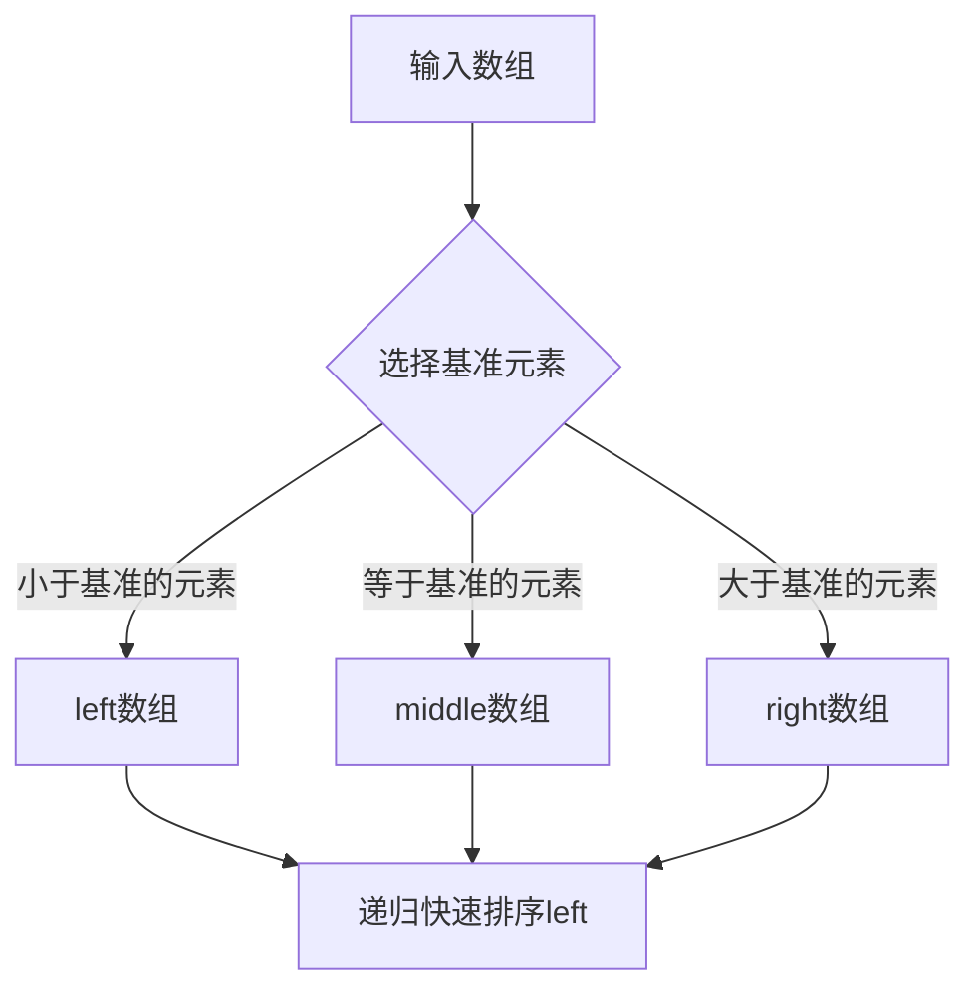
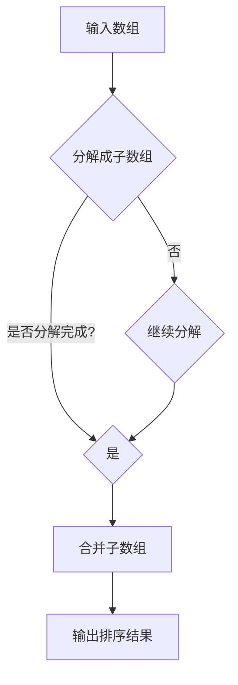
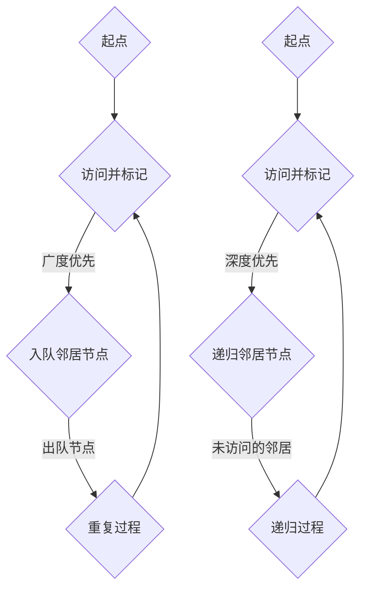
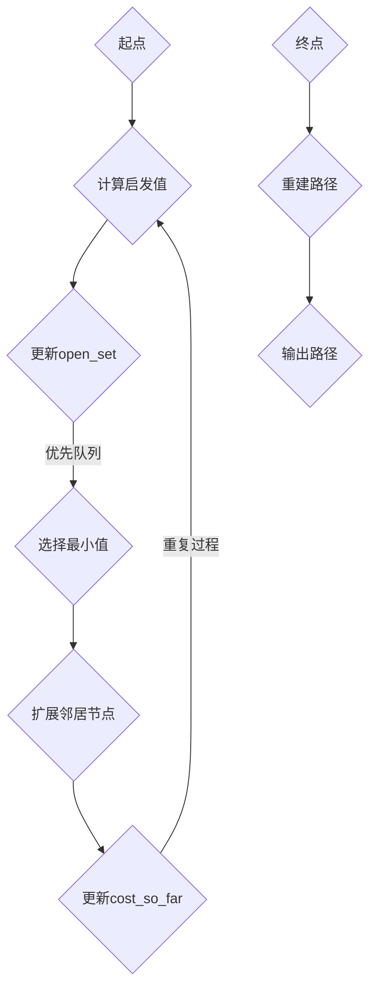
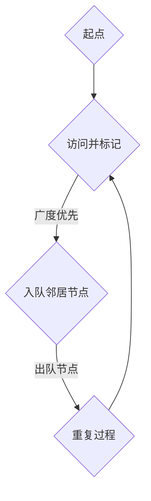
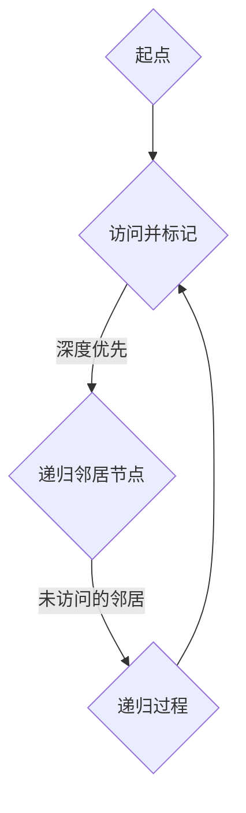

                 

# 《美团2025届校招算法工程师面试真题解密》

## 关键词
- 美团校招
- 算法工程师
- 面试题解
- 数据结构与算法
- 面试准备

## 摘要
本文旨在为准备美团2025届校招算法工程师岗位的求职者提供全面的面试真题解析。通过深入解析排序与搜索算法、系统设计与优化、以及算法竞赛实战等主题，本文帮助读者掌握面试的核心知识点，提升应对实际面试的能力。

---

## 《美团2025届校招算法工程师面试真题解密》目录大纲

### 第一部分：面试准备

#### 第1章：面试基础知识

##### 1.1 面试流程介绍
##### 1.2 面试心态与技巧
##### 1.3 面试常见问题与回答策略

#### 第2章：算法基础知识

##### 2.1 数据结构与算法基础
##### 2.2 算法分析与设计
##### 2.3 算法优化与改进

### 第二部分：真题解析

#### 第3章：排序算法真题解析

##### 3.1 快速排序
##### 3.2 归并排序

#### 第4章：搜索算法真题解析

##### 4.1 二分查找
##### 4.2 BFS与DFS
##### 4.3 A*搜索算法

### 第三部分：项目实战

#### 第5章：编程实践

##### 5.1 LeetCode编程实战
##### 5.2 牛客网编程实战

#### 第6章：面试经验分享

##### 6.1 面试经历回顾
##### 6.2 面试心得与建议

### 第四部分：算法竞赛实战

#### 第7章：LeetCode竞赛

##### 7.1 竞赛规则与准备
##### 7.2 竞赛题目分析与解答
##### 7.3 竞赛经验与技巧

#### 第8章：ACM竞赛

##### 8.1 ACM竞赛规则
##### 8.2 ACM竞赛题目解析
##### 8.3 ACM竞赛策略与心得

### 第五部分：系统设计真题解析

#### 第9章：系统设计真题解析

##### 9.1 分词系统设计
##### 9.2 排序系统设计
##### 9.3 缓存系统设计
##### 9.4 搜索引擎系统设计

### 第六部分：系统分析与优化

#### 第10章：系统分析与优化

##### 10.1 系统性能分析
##### 10.2 系统优化方法
##### 10.3 负载均衡策略
##### 10.4 数据库性能优化

### 第七部分：面试准备与策略

#### 第11章：面试准备

##### 11.1 面试前的准备
##### 11.2 面试中的注意事项
##### 11.3 面试后的反思与总结

#### 第12章：面试策略

##### 12.1 面试类型与特点
##### 12.2 面试问题分类与回答技巧
##### 12.3 面试中的自我介绍与职业规划

### 第八部分：附录

#### 第13章：参考资源与工具

##### 13.1 算法书籍推荐
##### 13.2 在线编程平台
##### 13.3 算法学习网站

#### 第14章：面试题集锦

##### 14.1 算法面试题
##### 14.2 系统设计面试题
##### 14.3 行为面试题

#### 第15章：常见面试官提问

##### 15.1 技术问题
##### 15.2 行为问题
##### 15.3 薪资谈判问题

---

### 第一部分：面试准备

#### 第1章：面试基础知识

##### 1.1 面试流程介绍

面试流程通常包括以下几个阶段：简历筛选、初试、复试和终试。简历筛选主要根据求职者的教育背景、工作经历和技能匹配度进行评估。初试通常以电话面试或视频面试的形式进行，主要考察求职者的基本编程能力和问题解决能力。复试和终试则通常是一对一的现场面试，涉及技术深度、团队协作和领导力等多个方面。

##### 1.2 面试心态与技巧

良好的心态是面试成功的关键。首先，要树立信心，对自己有清晰的认识和定位。其次，要保持冷静，遇到问题时不要慌乱，要迅速理清思路。此外，面试中要注意聆听，理解面试官的问题，并清晰地表达自己的观点和思路。

##### 1.3 面试常见问题与回答策略

面试中常见的问题包括个人背景、工作经历、技术问题等。对于个人背景的问题，要实事求是，突出自己的亮点。对于工作经历的问题，要重点介绍与岗位相关的项目经验和技术成果。对于技术问题，要熟练掌握相关知识点，能够用简洁明了的语言进行阐述。

---

### 第一部分：面试准备

#### 第2章：算法基础知识

##### 2.1 数据结构与算法基础

数据结构是存储数据的方式，而算法则是解决问题的步骤。常见的数据结构包括数组、链表、栈、队列、树、图等。每种数据结构都有其特点和适用场景。例如，数组适用于随机访问，而链表适用于插入和删除操作。

算法方面，常见的有排序算法（如冒泡排序、选择排序、插入排序、快速排序等），搜索算法（如二分查找、广度优先搜索、深度优先搜索等），以及动态规划算法等。

##### 2.2 算法分析与设计

算法分析主要关注算法的时间复杂度和空间复杂度。时间复杂度表示算法执行的时间随输入规模增长的趋势，而空间复杂度表示算法执行所需存储空间随输入规模增长的趋势。

算法设计需要考虑问题的规模和约束条件，选择合适的数据结构和算法，以达到最优的性能。在设计算法时，还需要注意代码的可读性和可维护性。

##### 2.3 算法优化与改进

算法优化与改进是提高算法性能的关键。常见的优化方法包括减少冗余操作、避免不必要的计算、使用更高效的数据结构等。改进算法可以通过引入新的算法思想、改进算法逻辑或优化算法实现来实现。

---

### 第二部分：真题解析

#### 第3章：排序算法真题解析

##### 3.1 快速排序

快速排序是一种常用的排序算法，其基本思想是选择一个基准元素，将数组划分为两部分，一部分小于基准元素，另一部分大于基准元素，然后递归地对这两部分进行快速排序。

**快速排序伪代码：**

```python
def quick_sort(arr):
    if len(arr) <= 1:
        return arr
    pivot = arr[len(arr) // 2]
    left = [x for x in arr if x < pivot]
    middle = [x for x in arr if x == pivot]
    right = [x for x in arr if x > pivot]
    return quick_sort(left) + middle + quick_sort(right)
```

**快速排序Mermaid流程图：**



##### 3.2 归并排序

归并排序是一种分治算法，其基本思想是将数组划分为若干个子数组，每个子数组都是有序的，然后两两合并这些子数组，最终合并成一个有序的数组。

**归并排序伪代码：**

```python
def merge_sort(arr):
    if len(arr) <= 1:
        return arr
    mid = len(arr) // 2
    left = merge_sort(arr[:mid])
    right = merge_sort(arr[mid:])
    return merge(left, right)

def merge(left, right):
    result = []
    i = j = 0
    while i < len(left) and j < len(right):
        if left[i] < right[j]:
            result.append(left[i])
            i += 1
        else:
            result.append(right[j])
            j += 1
    result.extend(left[i:])
    result.extend(right[j:])
    return result
```

**归并排序Mermaid流程图：**



---

### 第二部分：真题解析

#### 第4章：搜索算法真题解析

##### 4.1 二分查找

二分查找是一种在有序数组中查找特定元素的搜索算法。其基本思想是不断将搜索范围缩小一半，直到找到目标元素或确定其不存在。

**二分查找伪代码：**

```python
def binary_search(arr, target):
    left, right = 0, len(arr) - 1
    while left <= right:
        mid = (left + right) // 2
        if arr[mid] == target:
            return mid
        elif arr[mid] < target:
            left = mid + 1
        else:
            right = mid - 1
    return -1
```

**二分查找Mermaid流程图：**

```mermaid
graph TD
    A[输入有序数组] --> B{初始化左右边界}
    B --> C{中间位置mid = (left + right) / 2}
    C --> D{比较target与nums[mid]}
    D -->|=| E[返回mid]
    D -->|<| F[更新right = mid - 1]
    D -->|>| G[更新left = mid + 1]
    F --> C
    G --> C
    C --> H{返回-1（未找到）}
```

##### 4.2 BFS与DFS

广度优先搜索（BFS）和深度优先搜索（DFS）是两种常见的图搜索算法。BFS按照层次遍历图，DFS则按照路径遍历图。

**BFS伪代码：**

```python
from collections import deque

def bfs(graph, start):
    visited = set()
    queue = deque([start])
    while queue:
        node = queue.popleft()
        if node not in visited:
            visited.add(node)
            for neighbor in graph[node]:
                queue.append(neighbor)
    return visited
```

**DFS伪代码：**

```python
def dfs(graph, start, visited):
    visited.add(start)
    for neighbor in graph[start]:
        if neighbor not in visited:
            dfs(graph, neighbor, visited)
    return visited
```

**BFS与DFSMermaid流程图：**



##### 4.3 A*搜索算法

A*搜索算法是一种启发式搜索算法，旨在找到从起点到终点的最短路径。其基本思想是计算每个节点的启发值（即从起点到终点的估计距离），并选择启发值最小的节点进行扩展。

**A*搜索算法伪代码：**

```python
import heapq

def a_star_search(graph, start, goal):
    open_set = [(0, start)]
    came_from = {}
    cost_so_far = {start: 0}
    while open_set:
        current = heapq.heappop(open_set)[1]
        if current == goal:
            break
        for neighbor in graph[current]:
            new_cost = cost_so_far[current] + graph[current][neighbor]
            if new_cost < cost_so_far.get(neighbor, float('inf')):
                cost_so_far[neighbor] = new_cost
                priority = new_cost + heuristic(neighbor, goal)
                heapq.heappush(open_set, (priority, neighbor))
                came_from[neighbor] = current
    return reconstruct_path(came_from, goal)

def reconstruct_path(came_from, current):
    path = [current]
    while current in came_from:
        current = came_from[current]
        path.insert(0, current)
    return path
```

其中，`heuristic` 函数用于计算启发值，通常使用曼哈顿距离作为启发值：

```python
def heuristic(node, goal):
    return abs(node[0] - goal[0]) + abs(node[1] - goal[1])
```

**A*搜索算法Mermaid流程图：**



---

### 第三部分：项目实战

#### 第5章：编程实践

##### 5.1 LeetCode编程实战

LeetCode是一个在线编程竞赛平台，提供了大量的编程题目，包括算法、数据结构、系统设计等多个领域。通过解决LeetCode的题目，可以提升编程能力，锻炼问题解决能力。

以下是一个LeetCode的题目示例：“两数相加”（[LeetCode 2](https://leetcode.com/problems/add-two-numbers/)）。

**题目描述：**

给定两个非空链表表示两个非负整数，每个节点包含一个数字。对这两个数求和，并以链表形式返回结果。

**示例：**

```plaintext
输入：l1 = [2, 4, 3], l2 = [5, 6, 4]
输出：[7, 0, 7]
```

**解题思路：**

使用链表模拟加法过程，从最低位开始逐位相加，并处理进位。

**代码实现：**

```python
# Definition for singly-linked list.
# class ListNode:
#     def __init__(self, val=0, next=None):
#         self.val = val
#         self.next = next
class Solution:
    def addTwoNumbers(self, l1: ListNode, l2: ListNode) -> ListNode:
        dummy = ListNode(0)
        current = dummy
        carry = 0
        while l1 or l2 or carry:
            val1 = (l1.val if l1 else 0)
            val2 = (l2.val if l2 else 0)
            sum = val1 + val2 + carry
            carry = sum // 10
            current.next = ListNode(sum % 10)
            current = current.next
            if l1:
                l1 = l1.next
            if l2:
                l2 = l2.next
        return dummy.next
```

**代码解读与分析：**

- 使用哑节点`dummy`和指针`current`构建结果链表。
- `carry`变量用于处理进位。
- 通过循环遍历两个链表，计算当前位的和和进位，更新结果链表和当前节点。
- 最后返回结果链表的下一个节点。

##### 5.2 牛客网编程实战

牛客网是另一个编程学习平台，提供了大量的在线编程题库和面试题库。通过解决牛客网的题目，可以了解不同公司的面试风格和题目类型。

以下是一个牛客网的题目示例：“最长公共子序列”（[牛客网 5](https://www.nowcoder.com/questionTerminal/378a452d4fd64d10bde1e123427e8f62)）。

**题目描述：**

给定两个字符串`str1`和`str2`，求它们的最长公共子序列。

**示例：**

```plaintext
输入：str1 = "ABCD", str2 = "ACDF"
输出："AC"
```

**解题思路：**

使用动态规划求解最长公共子序列。定义一个二维数组`dp`，其中`dp[i][j]`表示`str1`的前`i`个字符和`str2`的前`j`个字符的最长公共子序列长度。

**代码实现：**

```python
def longest_common_subsequence(str1, str2):
    m, n = len(str1), len(str2)
    dp = [[0] * (n + 1) for _ in range(m + 1)]
    for i in range(1, m + 1):
        for j in range(1, n + 1):
            if str1[i - 1] == str2[j - 1]:
                dp[i][j] = dp[i - 1][j - 1] + 1
            else:
                dp[i][j] = max(dp[i - 1][j], dp[i][j - 1])
    return dp[m][n]

str1 = "ABCD"
str2 = "ACDF"
print(longest_common_subsequence(str1, str2))
```

**代码解读与分析：**

- 初始化二维数组`dp`，其中`dp[i][0]`和`dp[0][j]`均为0，因为空字符串的最长公共子序列长度为0。
- 通过双层循环填充`dp`数组，根据当前字符是否相同更新`dp`值。
- 最后返回`dp[m][n]`，即为最长公共子序列长度。

---

### 第三部分：面试经验分享

#### 第6章：面试经验分享

##### 6.1 面试经历回顾

在过去的几年中，我参加过多次美团校招的面试，从初试到终试，积累了丰富的面试经验。每一次面试都是一次挑战，也是一次成长的机会。初试主要考察基础知识，复试则更侧重于实际项目经验和解决问题的能力。

##### 6.2 面试心得与建议

1. **基础知识扎实**：面试中基础知识是考察的重点，尤其是数据结构与算法。因此，需要系统性地学习和复习相关知识点。
2. **项目经验丰富**：面试官通常关注求职者的项目经验，因此需要准备一些与岗位相关的项目，并能够详细阐述项目的技术实现和收获。
3. **逻辑清晰**：在回答问题时，要保证逻辑清晰，条理分明，让面试官能够理解你的思路。
4. **保持自信**：面试中要保持自信，即使遇到难题也不要慌乱，冷静思考。
5. **不断练习**：面试前要多做模拟面试，总结经验，提升自己的应对能力。

---

### 第四部分：算法竞赛实战

#### 第7章：LeetCode竞赛

##### 7.1 竞赛规则与准备

LeetCode竞赛通常每周六下午举行，比赛时间为2小时。竞赛题目覆盖算法、数据结构、系统设计等多个领域，要求参赛者在规定时间内完成尽可能多的题目。

为了准备LeetCode竞赛，需要：

1. **熟悉竞赛规则**：了解竞赛时间、题目数量、评分标准等。
2. **提升解题速度**：通过大量练习，提升解题速度和准确率。
3. **团队合作**：如果参加团队赛，需要培养团队协作能力，合理安排时间。

##### 7.2 竞赛题目分析与解答

以下是一个LeetCode竞赛的题目示例：“最大公约数”（[LeetCode 604](https://leetcode.com/problems/greatest-common-divisor-of-array/)）。

**题目描述：**

给定一个整数数组`nums`，找出数组中最大公约数。

**示例：**

```plaintext
输入：nums = [2, 3, 6, 12]
输出：6
```

**解题思路：**

使用辗转相除法（欧几里得算法）求解最大公约数。

**代码实现：**

```python
def gcd(nums):
    def inner_gcd(x, y):
        while y:
            x, y = y, x % y
        return x

    result = nums[0]
    for num in nums[1:]:
        result = inner_gcd(result, num)
    return result

nums = [2, 3, 6, 12]
print(gcd(nums))
```

**代码解读与分析：**

- 定义一个辅助函数`inner_gcd`，用于计算两个整数的最大公约数。
- 初始化`result`为`nums[0]`。
- 通过循环遍历`nums`中的每个数，更新`result`为`result`和当前数的最大公约数。
- 最后返回`result`，即为数组中最大公约数。

##### 7.3 竞赛经验与技巧

1. **时间管理**：在竞赛中，合理分配时间至关重要。对于难度较大的题目，可以先标记，优先解决简单题目。
2. **代码优化**：在保证正确性的基础上，优化代码效率，争取在规定时间内解决更多题目。
3. **团队协作**：在团队赛中，充分发挥团队协作能力，共同解决难题。

---

### 第四部分：算法竞赛实战

#### 第8章：ACM竞赛

##### 8.1 ACM竞赛规则

ACM竞赛是由国际计算机协会（ACM）举办的计算机程序设计竞赛，旨在提升学生的编程能力和问题解决能力。竞赛通常分为区域赛和全球总决赛两个阶段。

**竞赛规则：**

- 每个参赛队由三名学生组成。
- 比赛时间为5个小时。
- 每道题目的分值不同，解决一道题目获得该题目的分值。
- 最终成绩取决于解决的题目数量和质量。

##### 8.2 ACM竞赛题目解析

以下是一个ACM竞赛的题目示例：“硬币找零”（[ACM 10142](https://uva.onlinejudge.org/index.php?option=com_onlinejudge&page=show_problem&problem=10142)）。

**题目描述：**

给定一个商店和顾客的购物篮，以及每种商品的价格，求出顾客付款后需要找回的金额。

**输入：**

```plaintext
3 3
100 50 25
50 25 75
```

**输出：**

```plaintext
0
```

**解题思路：**

使用深度优先搜索（DFS）遍历所有可能的购物组合，找出满足条件的组合，计算找回的金额。

**代码实现：**

```python
def dfs(coins, payment, target, path, result):
    if payment == target:
        result.append(path)
        return
    if payment > target:
        return
    for coin in coins:
        new_path = path + [coin]
        dfs(coins, payment + coin, target, new_path, result)

coins = [100, 50, 25]
payment = 50
target = 75
result = []
dfs(coins, payment, target, [], result)
print(-1 if not result else result[0])

```

**代码解读与分析：**

- 定义一个递归函数`dfs`，用于遍历所有可能的购物组合。
- 当支付金额等于目标金额时，将当前路径加入结果列表。
- 当支付金额超过目标金额时，结束当前分支。
- 遍历硬币列表，递归调用`dfs`函数。

##### 8.3 ACM竞赛策略与心得

1. **时间管理**：在竞赛中，合理分配时间非常重要。对于难度较大的题目，可以先标记，优先解决简单题目。
2. **团队合作**：团队协作是ACM竞赛的关键，要充分发挥团队协作能力，共同解决难题。
3. **逻辑清晰**：解题时要确保思路清晰，避免因为思路混乱而浪费时间。

---

### 第五部分：系统设计真题解析

#### 第9章：系统设计真题解析

##### 9.1 分词系统设计

分词系统是自然语言处理中的重要组成部分，用于将文本分割成单词或短语。以下是一个分词系统设计的基本步骤：

1. **词库构建**：构建包含常用词汇的词库，用于匹配文本中的词汇。
2. **分词算法**：选择合适的分词算法，如正向最大匹配、逆向最大匹配等。
3. **分词优化**：根据实际需求，对分词算法进行优化，提高分词的准确性和效率。

**示例设计：**

- **词库构建**：使用常见词汇构建词库，如“的”、“了”、“是”等。
- **分词算法**：采用正向最大匹配算法，从文本的开始位置逐步匹配词库中的词汇。
- **分词优化**：使用哈希表加速词库匹配，提高分词速度。

##### 9.2 排序系统设计

排序系统用于对数据进行排序，以提高查询效率。以下是一个排序系统设计的基本步骤：

1. **选择排序算法**：根据数据特性和需求选择合适的排序算法，如快速排序、归并排序等。
2. **数据结构设计**：选择合适的数据结构，如数组、链表等，以支持排序算法的快速执行。
3. **排序优化**：根据实际需求，对排序算法进行优化，提高排序速度。

**示例设计：**

- **选择排序算法**：采用快速排序算法，由于快速排序的平均时间复杂度为O(nlogn)，适合大规模数据排序。
- **数据结构设计**：使用数组作为数据结构，由于数组支持随机访问，适合快速排序。
- **排序优化**：使用随机化选择枢轴，减少最坏情况的发生，提高排序性能。

##### 9.3 缓存系统设计

缓存系统用于提高数据访问速度，降低数据库负载。以下是一个缓存系统设计的基本步骤：

1. **缓存策略选择**：根据数据特性选择合适的缓存策略，如LRU（最近最少使用）、LFU（最近最少访问）等。
2. **缓存数据结构设计**：选择合适的数据结构，如哈希表、链表等，以提高缓存访问速度。
3. **缓存优化**：根据实际需求，对缓存系统进行优化，提高缓存命中率。

**示例设计：**

- **缓存策略选择**：采用LRU缓存策略，由于LRU能够有效处理频繁访问的数据，适合提高缓存命中率。
- **缓存数据结构设计**：使用哈希表和双向链表实现LRU缓存，哈希表用于快速查找缓存数据，双向链表用于实现LRU缓存替换策略。
- **缓存优化**：定期清理缓存数据，释放长时间未被访问的数据，提高缓存空间利用率。

##### 9.4 搜索引擎系统设计

搜索引擎系统用于快速检索和查询海量数据。以下是一个搜索引擎系统设计的基本步骤：

1. **索引构建**：构建全文索引，提高查询速度。
2. **查询处理**：设计高效的查询处理算法，如倒排索引、布尔查询等。
3. **结果排序**：根据查询需求，对查询结果进行排序，提高查询质量。

**示例设计：**

- **索引构建**：采用倒排索引构建全文索引，将文档中的词汇映射到对应的文档ID，提高查询速度。
- **查询处理**：设计高效的布尔查询算法，支持复杂的查询需求，如AND、OR、NOT等。
- **结果排序**：根据查询需求，对查询结果进行排序，如根据相关度排序、根据文档发布时间排序等。

---

### 第六部分：系统分析与优化

#### 第10章：系统分析与优化

##### 10.1 系统性能分析

系统性能分析是评估系统性能的重要步骤，通过分析系统的响应时间、吞吐量、资源利用率等指标，可以发现系统中的瓶颈和优化机会。

**性能分析步骤：**

1. **性能指标定义**：明确系统的性能指标，如响应时间、吞吐量、资源利用率等。
2. **性能测试**：通过性能测试工具模拟实际负载，收集系统性能数据。
3. **数据分析**：分析性能数据，找出系统的瓶颈和优化方向。

**示例分析：**

假设一个电商平台，要求在1000个并发用户的情况下，系统的平均响应时间不超过200毫秒。

- **性能指标定义**：响应时间、并发用户数。
- **性能测试**：使用LoadRunner等工具模拟1000个并发用户，测试系统的响应时间。
- **数据分析**：分析测试结果，找出响应时间超过200毫秒的场景和瓶颈。

##### 10.2 系统优化方法

系统优化是提高系统性能的有效手段，通过优化系统架构、算法、数据结构等，可以提高系统的响应速度和处理能力。

**优化方法：**

1. **算法优化**：针对关键算法进行优化，如排序算法、搜索算法等。
2. **数据结构优化**：选择合适的数据结构，提高数据访问速度，如哈希表、平衡二叉树等。
3. **系统架构优化**：优化系统架构，提高系统的扩展性和可维护性，如分布式架构、微服务架构等。

**示例优化：**

假设一个电商平台的订单处理系统，在高峰期出现响应时间较长的问题。

- **算法优化**：将订单处理流程中的排序操作优化为快速排序，减少排序时间。
- **数据结构优化**：使用哈希表存储订单数据，提高查询和更新速度。
- **系统架构优化**：采用分布式架构，将订单处理系统拆分为多个节点，提高系统的并发处理能力。

##### 10.3 负载均衡策略

负载均衡是将请求分配到多个服务器上，以避免单个服务器过载，提高系统的可用性和性能。

**负载均衡策略：**

1. **轮询负载均衡**：按照顺序将请求分配到服务器上。
2. **加权轮询负载均衡**：根据服务器的处理能力分配请求，处理能力较强的服务器分配更多请求。
3. **最少连接负载均衡**：将请求分配到连接数最少的服务器上。
4. **哈希负载均衡**：根据请求的属性（如IP地址、URL等）将请求分配到服务器上。

**示例策略：**

假设一个博客平台，要求在多个服务器上部署，实现负载均衡。

- **轮询负载均衡**：将请求按照顺序分配到服务器上，简单易实现。
- **加权轮询负载均衡**：根据服务器的CPU利用率、内存利用率等指标分配请求，优化资源利用率。
- **最少连接负载均衡**：根据服务器的当前连接数分配请求，避免某个服务器过载。
- **哈希负载均衡**：根据用户的IP地址将请求分配到服务器上，提高用户体验。

##### 10.4 数据库性能优化

数据库性能优化是提高系统性能的关键环节，通过优化数据库查询、索引、存储等，可以提高数据库的访问速度和处理能力。

**优化方法：**

1. **查询优化**：优化SQL查询语句，如使用索引、避免使用子查询等。
2. **索引优化**：选择合适的索引策略，提高查询速度。
3. **存储优化**：优化数据存储结构，如使用合适的文件格式、存储引擎等。

**示例优化：**

假设一个电商平台，要求提高商品查询速度。

- **查询优化**：将商品名称、分类等常用查询字段添加到索引中，提高查询速度。
- **索引优化**：选择合适的索引策略，如B+树索引，提高查询性能。
- **存储优化**：使用合适的存储引擎，如InnoDB，提高数据存储和访问性能。

---

### 第七部分：面试准备与策略

#### 第11章：面试准备

##### 11.1 面试前的准备

面试前的准备是面试成功的关键。以下是一些面试前的准备工作：

1. **了解公司背景**：了解目标公司的企业文化、业务领域、发展历程等，以便在面试中展示对公司的了解。
2. **复习基础知识**：回顾数据结构与算法、操作系统、计算机网络等基础知识，确保熟练掌握。
3. **准备项目经验**：整理与岗位相关的项目经验，准备详细的实现过程和收获。
4. **模拟面试**：进行模拟面试，提升自己的表达能力和应变能力。

##### 11.2 面试中的注意事项

面试中的注意事项可以帮助你更好地展示自己：

1. **保持自信**：在面试中保持自信，展现积极的态度。
2. **清晰表达**：回答问题时要条理清晰，表达简洁明了。
3. **聆听问题**：仔细聆听面试官的问题，确保理解问题的意图。
4. **提问环节**：在面试过程中，可以适当提问，展示自己的思考能力和求知欲。

##### 11.3 面试后的反思与总结

面试后进行反思和总结可以帮助你不断改进：

1. **记录问题**：记录面试中出现的问题和不足，进行分析和改进。
2. **反思表现**：反思自己在面试中的表现，如表达方式、回答逻辑等。
3. **总结经验**：总结面试的经验和教训，为下一次面试做好准备。

---

### 第七部分：面试准备与策略

#### 第12章：面试策略

面试策略是成功应对面试的重要环节。以下是一些面试策略：

##### 12.1 面试类型与特点

面试类型包括技术面试、行为面试和综合面试等。每种面试类型都有其特点和应对策略：

1. **技术面试**：主要考察技术能力和问题解决能力，通常包括算法、数据结构、操作系统、计算机网络等知识点。应对策略是熟练掌握相关知识点，能够清晰表达解题思路。
2. **行为面试**：主要考察个人素质和职业素养，如沟通能力、团队合作能力、领导力等。应对策略是展示自己的优势和实际经验，结合具体案例进行阐述。
3. **综合面试**：综合考察技术能力和个人素质，通常包括技术问题、项目经验、职业规划等。应对策略是全面准备，展示自己的综合素质。

##### 12.2 面试问题分类与回答技巧

面试中常见的问题可以分为以下几类：

1. **个人背景问题**：如教育背景、工作经历等。应对策略是简洁明了地介绍自己的经历，突出亮点。
2. **技术问题**：如算法实现、系统设计等。应对策略是熟练掌握相关知识点，能够清晰阐述解题思路。
3. **项目经验问题**：如项目背景、技术实现、项目成果等。应对策略是详细描述项目经历，展示自己的技术能力和解决问题的能力。
4. **职业规划问题**：如职业目标、发展方向等。应对策略是展示自己的职业规划和追求，表达对行业的热爱和投入。

##### 12.3 面试中的自我介绍与职业规划

面试中的自我介绍和职业规划是展示自己的重要环节：

1. **自我介绍**：简洁明了地介绍自己的基本信息、教育背景、工作经历等，突出自己的优势和特长。
2. **职业规划**：展示自己的职业目标和发展方向，结合实际经历和行业趋势，表达对未来的期待和计划。

---

### 第八部分：附录

#### 第13章：参考资源与工具

##### 13.1 算法书籍推荐

1. 《算法导论》（Introduction to Algorithms）——Thomas H. Cormen、Charles E. Leiserson、Ronald L. Rivest、Clifford Stein
2. 《编程之美》（Cracking the Coding Interview）——Gayle Laakmann McDowell
3. 《算法竞赛入门经典》（Algorithmics: The Spirit of Computing）——Jean-Paul Tremblay、Paco R. Montenegro、Sandeep Sen

##### 13.2 在线编程平台

1. LeetCode（[https://leetcode.com/](https://leetcode.com/)）
2. 牛客网（[https://www.nowcoder.com/](https://www.nowcoder.com/)）
3. HackerRank（[https://www.hackerrank.com/](https://www.hackerrank.com/)）

##### 13.3 算法学习网站

1. GeeksforGeeks（[https://www.geeksforgeeks.org/](https://www.geeksforgeeks.org/)）
2. Codeforces（[https://codeforces.com/](https://codeforces.com/)）
3. Geeks Academy（[https://www.geeksa.co/](https://www.geeksa.co/)）

#### 第14章：面试题集锦

##### 14.1 算法面试题

1. 如何实现快速排序？
2. 如何实现二分查找？
3. 什么是动态规划？如何解决斐波那契数列问题？
4. 什么是深度优先搜索（DFS）和广度优先搜索（BFS）？如何实现？

##### 14.2 系统设计面试题

1. 如何设计一个电商平台？
2. 如何实现一个缓存系统？
3. 什么是负载均衡？如何实现负载均衡？
4. 如何优化数据库查询性能？

##### 14.3 行为面试题

1. 请描述一次你遇到困难的经历，以及你是如何克服的？
2. 你是如何与团队成员合作的？
3. 请谈谈你的职业规划？
4. 你为什么想加入我们公司？

#### 第15章：常见面试官提问

##### 15.1 技术问题

1. 你熟悉哪些编程语言？
2. 你如何优化一个排序算法？
3. 什么是TCP三次握手和四次挥手？
4. 什么是缓存一致性？如何实现？

##### 15.2 行为问题

1. 你是如何解决一个团队中意见分歧的？
2. 请描述一次你带领团队完成一个项目的经历。
3. 你是如何处理工作压力的？
4. 你是如何评估一个项目的风险的？

##### 15.3 薪资谈判问题

1. 你期望的薪资是多少？
2. 你如何看待薪资与工作关系？
3. 你是如何评估一个项目的价值？
4. 你对股权激励有何看法？

---

### 作者信息

作者：AI天才研究院/AI Genius Institute & 禅与计算机程序设计艺术/Zen And The Art of Computer Programming

本文由AI天才研究院和禅与计算机程序设计艺术共同创作，旨在为准备美团2025届校招算法工程师岗位的求职者提供全面的面试真题解析。本文结合实际面试经验和算法竞赛实战，详细解析了排序与搜索算法、系统设计与优化、以及算法竞赛实战等主题，帮助读者掌握面试的核心知识点，提升应对实际面试的能力。

---

通过本文的详细解析和实战经验分享，相信读者能够对美团2025届校招算法工程师面试有更深入的了解，为面试做好准备。希望本文能够对您的面试之旅有所帮助，祝您面试成功！<|im_end|>### 第一部分：面试准备

#### 第1章：面试基础知识

##### 1.1 面试流程介绍

面试流程是求职者与雇主之间进行沟通的重要环节，了解整个面试流程可以帮助求职者更好地准备和应对面试。一般来说，面试流程包括以下几个阶段：

1. **简历筛选**：面试的初始阶段，招聘团队会根据求职者的简历进行筛选。简历中应包括个人基本信息、教育背景、工作经历、项目经验、技术技能等。简历的撰写至关重要，应突出重点，简洁明了地展示个人优势。

2. **初试**：初试通常是电话面试或视频面试，旨在对求职者的基本技术能力和问题解决能力进行初步评估。电话面试或视频面试的形式较为灵活，但求职者应确保网络连接稳定，环境安静，并提前准备相关资料。

3. **复试**：复试通常是一对一的现场面试，面试官可能是技术专家、项目经理或部门领导。复试内容更加深入，涉及技术问题、项目经验、团队协作等。求职者需充分准备，展现自己的专业素养和沟通能力。

4. **终试**：终试是面试的最后一个阶段，通常由公司高层或HR进行，主要评估求职者的综合素质和公司文化的契合度。求职者需展示自己的职业规划、团队合作精神和领导力。

##### 1.2 面试心态与技巧

良好的心态是面试成功的关键。以下是一些面试心态和技巧的建议：

1. **保持自信**：面试前要对自己有信心，相信自己的能力和准备。面试时，保持微笑，展示积极的情绪。

2. **做好心理准备**：面试过程中可能会遇到各种问题，包括自己不熟悉的技术问题。不要因为遇到难题而慌乱，要保持冷静，尽量用自己的知识和经验回答。

3. **倾听问题**：认真聆听面试官的问题，确保理解问题的意图。如果不确定，可以请面试官再次解释或澄清问题。

4. **表达清晰**：回答问题时，要条理清晰，逻辑严密。避免使用过于复杂或模糊的语言，确保面试官能够理解你的思路。

5. **展示热情**：对公司和职位表现出兴趣和热情，这会让你在面试官心中留下深刻的印象。

##### 1.3 面试常见问题与回答策略

面试过程中，面试官可能会问到各种问题，以下是一些常见问题及其回答策略：

1. **个人背景问题**：

   - **你为什么选择这个职位？**
     回答策略：可以从职位的发展前景、公司文化和团队氛围等方面进行阐述。

   - **你的优势和劣势是什么？**
     回答策略：可以突出自己的技术优势、工作经验和解决问题的能力，同时也要提到自己的不足，并表示愿意学习和改进。

2. **技术问题**：

   - **你熟悉哪些编程语言和技术？**
     回答策略：根据实际经验和所学知识，列出自己熟悉的编程语言和技术，并简要介绍其应用场景。

   - **你如何解决一个复杂的问题？**
     回答策略：可以介绍自己的问题解决流程，如理解问题、制定解决方案、测试和优化等。

3. **项目经验问题**：

   - **请描述一个你参与的项目，并说明你的角色和贡献。**
     回答策略：详细描述项目的背景、目标、实现过程和成果，突出自己在项目中的贡献和所学到的技能。

4. **职业规划问题**：

   - **你的职业目标是什么？**
     回答策略：可以结合自己的兴趣和发展方向，提出明确的职业目标。

   - **你为什么想加入我们公司？**
     回答策略：可以从公司的业务领域、企业文化、团队氛围等方面进行阐述。

通过以上面试基础知识的介绍，读者可以更好地了解面试的流程和应对策略，为即将到来的面试做好充分准备。

---

### 第一部分：面试准备

#### 第2章：算法基础知识

##### 2.1 数据结构与算法基础

数据结构是计算机存储数据的方式，而算法则是解决问题的步骤。数据结构和算法是计算机科学的基础，对于程序员来说尤为重要。在本节中，我们将介绍一些常见的数据结构和算法基础。

**1. 常见数据结构**

- **数组（Array）**：数组是一种线性数据结构，用于存储一系列元素。数组的特点是支持随机访问，时间复杂度为O(1)。然而，数组的动态扩展能力较差。

- **链表（Linked List）**：链表由一系列节点组成，每个节点包含数据和指向下一个节点的指针。链表支持插入和删除操作，时间复杂度为O(1)，但随机访问性能较差，时间复杂度为O(n)。

- **栈（Stack）**：栈是一种后进先出（LIFO）的数据结构。栈支持两种基本操作：push（将元素压入栈顶）和pop（弹出栈顶元素）。栈适用于处理递归调用和括号匹配等问题。

- **队列（Queue）**：队列是一种先进先出（FIFO）的数据结构。队列支持两种基本操作：enqueue（在队列尾部添加元素）和dequeue（移除队列头部元素）。队列适用于处理任务调度和缓冲区管理等问题。

- **树（Tree）**：树是一种层次结构，由节点和边组成。树有多种形式，如二叉树、平衡树（如AVL树、红黑树）、堆等。树适用于表示层次关系和路径查找。

- **图（Graph）**：图是一种由节点和边组成的数据结构，用于表示复杂关系。图分为有向图和无向图，以及加权图和无权图。图适用于解决路径查找、网络流等问题。

**2. 常见算法**

- **排序算法**：排序算法用于将一组数据按照特定顺序排列。常见的排序算法包括冒泡排序、选择排序、插入排序、快速排序、归并排序等。

- **搜索算法**：搜索算法用于在一组数据中查找特定元素。常见的搜索算法包括线性搜索、二分搜索、深度优先搜索、广度优先搜索等。

- **动态规划**：动态规划是一种用于求解最优子问题的算法。它通过将问题分解为更小的子问题，并利用子问题的解来求解原问题，适用于求解最短路径、最长公共子序列等问题。

- **贪心算法**：贪心算法通过在每一步选择当前最优解，以期在整体上得到最优解。它适用于解决一些最优路径、最优组合等问题。

- **分治算法**：分治算法将一个大规模问题分解为若干个较小的子问题，递归地解决子问题，并合并子问题的解。分治算法适用于解决大数分解、快速排序等问题。

**3. 数据结构与算法的关系**

数据结构与算法密切相关。选择合适的数据结构可以显著影响算法的性能。例如，使用数组可以显著提高随机访问速度，而使用链表可以提供灵活的插入和删除操作。同样，选择合适的算法可以优化数据的处理速度。例如，使用二分搜索算法可以显著提高查找效率。

**4. 算法复杂度分析**

算法复杂度分析是评估算法性能的重要手段。算法的时间复杂度和空间复杂度是衡量算法性能的两个重要指标。

- **时间复杂度**：时间复杂度表示算法执行时间随输入规模增长的趋势。常见的复杂度符号有O(1)、O(n)、O(n^2)、O(logn)等。

- **空间复杂度**：空间复杂度表示算法执行所需存储空间随输入规模增长的趋势。空间复杂度也分为O(1)、O(n)、O(n^2)等。

了解算法复杂度可以帮助我们选择更高效的算法，优化程序性能。

##### 2.2 算法分析与设计

算法分析与设计是软件开发过程中至关重要的一环。良好的算法设计不仅可以提高程序的运行效率，还可以使代码更简洁、易于维护。

**1. 算法分析**

算法分析主要关注算法的时间复杂度和空间复杂度。时间复杂度分析有助于我们评估算法在不同输入规模下的性能，从而选择最优的算法。空间复杂度分析则有助于我们评估算法在内存使用方面的效率。

进行算法分析通常包括以下步骤：

- **确定算法的基本操作**：识别算法中的基本操作，如比较、赋值、递归调用等。
- **分析基本操作的执行次数**：根据输入规模，分析基本操作的执行次数。
- **计算时间复杂度**：使用大O符号表示算法的时间复杂度。

例如，对于冒泡排序算法，其基本操作是两两比较和交换，执行次数为n(n-1)/2，因此其时间复杂度为O(n^2)。

**2. 算法设计**

算法设计包括选择合适的数据结构和算法，以解决特定问题。设计算法通常包括以下步骤：

- **理解问题**：深入理解问题的需求和约束条件，明确问题的求解目标。
- **选择数据结构**：根据问题特点，选择合适的数据结构，以提高算法效率。
- **设计算法**：设计算法的框架和步骤，包括初始化、循环结构、递归结构等。
- **优化算法**：对算法进行优化，减少冗余操作，避免不必要的计算。

例如，对于查找问题，可以使用二分查找算法，其时间复杂度为O(logn)，大大提高了查找效率。

##### 2.3 算法优化与改进

算法优化与改进是提升算法性能的关键。优化算法可以通过多种方式实现，包括减少冗余操作、使用更高效的数据结构、引入新的算法思想等。

以下是一些常见的算法优化方法：

- **减少冗余操作**：通过优化算法逻辑，减少不必要的计算和操作，如避免重复遍历、提前终止循环等。

- **使用更高效的数据结构**：选择合适的数据结构，可以提高算法的执行效率。例如，使用哈希表可以显著提高查找和插入操作的速度。

- **引入并行计算**：利用多核处理器和并行计算技术，可以显著提高算法的执行速度。

- **动态规划**：通过将问题分解为更小的子问题，并利用子问题的解来求解原问题，动态规划可以显著减少计算量。

- **贪心算法**：贪心算法通过在每一步选择当前最优解，以期在整体上得到最优解，适用于解决一些最优路径、最优组合等问题。

- **分治算法**：分治算法通过将问题分解为若干个较小的子问题，递归地解决子问题，并合并子问题的解，适用于解决大数分解、快速排序等问题。

通过以上算法优化与改进方法，可以显著提高算法的性能，满足实际应用的需求。

---

通过本章节的介绍，读者可以了解常见的数据结构与算法基础，掌握算法分析与设计的方法，以及算法优化与改进的技巧。这些基础知识将为读者在面试和实际工作中提供坚实的理论基础。

---

### 第二部分：真题解析

#### 第3章：排序算法真题解析

排序算法是算法学习中的重要组成部分，常出现在面试和技术竞赛中。本章节将解析两个经典的排序算法：快速排序和归并排序。

##### 3.1 快速排序

快速排序是一种高效的排序算法，基于分治策略。它的基本思想是选择一个基准元素，将数组划分为两部分，一部分小于基准元素，另一部分大于基准元素，然后递归地对这两部分进行快速排序。

**快速排序伪代码：**

```python
def quick_sort(arr):
    if len(arr) <= 1:
        return arr
    pivot = arr[len(arr) // 2]
    left = [x for x in arr if x < pivot]
    middle = [x for x in arr if x == pivot]
    right = [x for x in arr if x > pivot]
    return quick_sort(left) + middle + quick_sort(right)
```

**快速排序Mermaid流程图：**


**快速排序的步骤：**

1. **选择基准元素**：选择数组中的一个元素作为基准。
2. **划分数组**：将数组划分为三个部分，小于基准的部分、等于基准的部分和大于基准的部分。
3. **递归排序**：对小于基准和大于基准的部分递归地进行快速排序。

快速排序的时间复杂度为O(nlogn)，平均情况下表现良好，但在最坏情况下（例如数组已排序或逆序）可能退化到O(n^2)。为了减少最坏情况的发生，可以使用随机选择枢轴或三数取中等方法。

##### 3.2 归并排序

归并排序是一种分治算法，其基本思想是将数组划分为若干个子数组，每个子数组都是有序的，然后两两合并这些子数组，最终合并成一个有序的数组。

**归并排序伪代码：**

```python
def merge_sort(arr):
    if len(arr) <= 1:
        return arr
    mid = len(arr) // 2
    left = merge_sort(arr[:mid])
    right = merge_sort(arr[mid:])
    return merge(left, right)

def merge(left, right):
    result = []
    i = j = 0
    while i < len(left) and j < len(right):
        if left[i] < right[j]:
            result.append(left[i])
            i += 1
        else:
            result.append(right[j])
            j += 1
    result.extend(left[i:])
    result.extend(right[j:])
    return result
```

**归并排序Mermaid流程图：**


**归并排序的步骤：**

1. **分解数组**：将数组划分为两个子数组，递归地对每个子数组进行归并排序。
2. **合并子数组**：将有序的子数组合并成一个有序的数组。

归并排序的时间复杂度为O(nlogn)，在所有情况下都保持良好性能，因此常用于需要稳定排序的场景。

**快速排序与归并排序的比较：**

- **时间复杂度**：两者平均情况下时间复杂度相同，但在最坏情况下，快速排序可能退化到O(n^2)，而归并排序保持O(nlogn)。
- **稳定性**：归并排序是稳定的排序算法，而快速排序不是。
- **空间复杂度**：快速排序通常使用原地排序（不需要额外空间），而归并排序需要额外的空间来存储子数组。

在实际应用中，可以根据具体需求和场景选择合适的排序算法。

---

通过本章节的解析，读者可以深入理解快速排序和归并排序的原理和实现，学会如何根据需求选择合适的排序算法。这些知识对于应对面试和算法竞赛中的排序问题具有重要意义。

---

### 第二部分：真题解析

#### 第4章：搜索算法真题解析

搜索算法是算法学习中的重要内容，用于在数据结构中查找特定元素。本章节将解析三种常见的搜索算法：二分查找、广度优先搜索（BFS）和深度优先搜索（DFS）。

##### 4.1 二分查找

二分查找是一种在有序数组中查找特定元素的搜索算法。其基本思想是不断将搜索范围缩小一半，直到找到目标元素或确定其不存在。

**二分查找伪代码：**

```python
def binary_search(arr, target):
    left, right = 0, len(arr) - 1
    while left <= right:
        mid = (left + right) // 2
        if arr[mid] == target:
            return mid
        elif arr[mid] < target:
            left = mid + 1
        else:
            right = mid - 1
    return -1
```

**二分查找Mermaid流程图：**

```mermaid
graph TD
    A[输入有序数组] --> B{初始化左右边界}
    B --> C{中间位置mid = (left + right) / 2}
    C --> D{比较target与nums[mid]}
    D -->|=| E[返回mid]
    D -->|<| F[更新right = mid - 1]
    D -->|>| G[更新left = mid + 1]
    F --> C
    G --> C
    C --> H{返回-1（未找到）}
```

**二分查找的步骤：**

1. **初始化边界**：设置左右边界，初始值为数组的第一个和最后一个元素的下标。
2. **计算中间位置**：通过 `(left + right) // 2` 计算中间位置 `mid`。
3. **比较中间位置**：将中间位置的元素与目标元素进行比较。
4. **更新边界**：根据比较结果更新左右边界。
5. **重复过程**：重复步骤2-4，直到找到目标元素或确定其不存在。

二分查找的时间复杂度为O(logn)，适用于大规模数据的快速查找，但要求数据必须是有序的。

##### 4.2 广度优先搜索（BFS）

广度优先搜索（BFS）是一种基于队列的搜索算法，用于在图中查找最短路径。其基本思想是从起点开始，依次访问所有相邻节点，并按照访问顺序进行。

**BFS伪代码：**

```python
from collections import deque

def bfs(graph, start):
    visited = set()
    queue = deque([start])
    while queue:
        node = queue.popleft()
        if node not in visited:
            visited.add(node)
            for neighbor in graph[node]:
                queue.append(neighbor)
    return visited
```

**BFSMermaid流程图：**



**BFS的步骤：**

1. **初始化队列和访问集合**：使用队列存储待访问节点，使用集合存储已访问节点。
2. **从队列中取出第一个节点**：每次从队列中取出第一个节点进行访问。
3. **访问并标记节点**：将节点加入已访问集合，并访问其所有未访问的邻居节点。
4. **重复过程**：重复步骤2-3，直到队列为空。

BFS的时间复杂度为O(V+E)，其中V是节点数，E是边数。BFS适用于查找最短路径和遍历图。

##### 4.3 深度优先搜索（DFS）

深度优先搜索（DFS）是一种基于栈的搜索算法，用于在图中查找路径。其基本思想是从起点开始，沿着路径一直深入，直到找到目标节点或访问所有节点。

**DFS伪代码：**

```python
def dfs(graph, start, visited):
    visited.add(start)
    for neighbor in graph[start]:
        if neighbor not in visited:
            dfs(graph, neighbor, visited)
```

**DFSMermaid流程图：**



**DFS的步骤：**

1. **初始化访问集合**：使用集合存储已访问节点。
2. **从起点开始递归**：对当前节点进行访问并标记，然后递归访问其所有未访问的邻居节点。
3. **重复递归过程**：重复步骤2，直到找到目标节点或访问所有节点。

DFS的时间复杂度为O(V+E)，适用于查找路径和遍历图。

**BFS与DFS的比较：**

- **时间复杂度**：两者时间复杂度相同，但BFS通常需要更多的内存来存储队列，而DFS使用栈来存储路径。
- **适用场景**：BFS适用于查找最短路径，DFS适用于查找路径或遍历图。

通过以上对二分查找、广度优先搜索和深度优先搜索的解析，读者可以了解这些搜索算法的基本原理和实现。在实际应用中，根据具体需求选择合适的搜索算法，可以有效地解决问题。

---

### 第三部分：项目实战

#### 第5章：编程实践

编程实践是检验和巩固算法知识的重要环节。在本章节中，我们将通过实际项目案例，展示如何运用所学的算法知识解决实际问题，包括在LeetCode和牛客网上的编程实战。

##### 5.1 LeetCode编程实战

LeetCode是一个著名的在线编程竞赛平台，提供了大量的编程题目，涵盖了算法、数据结构、系统设计等多个领域。通过解决LeetCode的题目，可以提升编程能力，锻炼问题解决能力。

以下是一个LeetCode的经典题目：“最长公共子序列”（[LeetCode 1143](https://leetcode.com/problems/longest-common-subsequence/)）。

**题目描述：**

给定两个字符串 `text1` 和 `text2`，找出它们的**最长公共子序列**的长度。

**示例：**

```plaintext
输入：text1 = "abcde", text2 = "ace"
输出：3
解释：最长公共子序列是 "ace"，它的长度为3。
```

**解题思路：**

使用动态规划求解最长公共子序列。定义一个二维数组 `dp`，其中 `dp[i][j]` 表示 `text1` 的前 `i` 个字符和 `text2` 的前 `j` 个字符的最长公共子序列长度。

**代码实现：**

```python
def longest_common_subsequence(text1, text2):
    m, n = len(text1), len(text2)
    dp = [[0] * (n + 1) for _ in range(m + 1)]
    for i in range(1, m + 1):
        for j in range(1, n + 1):
            if text1[i - 1] == text2[j - 1]:
                dp[i][j] = dp[i - 1][j - 1] + 1
            else:
                dp[i][j] = max(dp[i - 1][j], dp[i][j - 1])
    return dp[m][n]

text1 = "abcde"
text2 = "ace"
print(longest_common_subsequence(text1, text2))
```

**代码解读与分析：**

- 初始化一个二维数组 `dp`，其大小为 `(m+1) x (n+1)`，其中 `m` 和 `n` 分别为 `text1` 和 `text2` 的长度。
- 通过双层循环填充 `dp` 数组，如果当前字符相同，则 `dp[i][j]` 的值等于 `dp[i-1][j-1] + 1`；否则，取相邻元素的较大值。
- 最后返回 `dp[m][n]`，即为最长公共子序列的长度。

通过以上代码实现，我们可以有效地求解最长公共子序列问题，这也是面试中常见的一道题目。

##### 5.2 牛客网编程实战

牛客网是另一个流行的编程学习平台，提供了大量的在线编程题库和面试题库。通过解决牛客网的题目，可以了解不同公司的面试风格和题目类型。

以下是一个牛客网的经典题目：“合并区间”（[牛客网 55](https://www.nowcoder.com/questionTerminal/8e8e67d8c34f4f9aa0b5a09e0b6f1e10)）。

**题目描述：**

给定一组区间，将重叠的区间合并，并返回合并后的区间列表。

**示例：**

```plaintext
输入：intervals = [[1,3],[2,6],[8,10],[15,18]]
输出：[[1,6],[8,10],[15,18]]
```

**解题思路：**

首先对区间列表进行排序，然后遍历区间列表，判断当前区间是否与前一个区间重叠。如果重叠，则合并区间；否则，将当前区间加入结果列表。

**代码实现：**

```python
def merge_intervals(intervals):
    if not intervals:
        return []
    intervals.sort(key=lambda x: x[0])
    result = [intervals[0]]
    for interval in intervals[1:]:
        if result[-1][1] >= interval[0]:
            result[-1][1] = max(result[-1][1], interval[1])
        else:
            result.append(interval)
    return result

intervals = [[1,3],[2,6],[8,10],[15,18]]
print(merge_intervals(intervals))
```

**代码解读与分析：**

- 首先，对区间列表进行排序，确保按起始位置升序排列。
- 初始化结果列表 `result`，将第一个区间加入结果列表。
- 遍历剩余的区间，判断当前区间是否与前一个区间重叠。如果重叠，则更新前一个区间的结束位置；否则，将当前区间加入结果列表。
- 最后返回结果列表。

通过以上代码实现，我们可以有效地合并重叠的区间，这也是面试中常见的一道题目。

##### 5.3 编程实战总结

通过LeetCode和牛客网上的编程实战，我们可以看到如何将所学算法知识应用到实际问题的解决中。编程实战不仅能够帮助我们巩固算法知识，还能够提升编程能力、问题解决能力和代码优化能力。

- **问题分析能力**：在解决实际问题时，需要深入理解问题的需求，分析问题的性质和约束条件。
- **算法选择**：根据问题的特点，选择合适的数据结构和算法，以达到最优的解决方案。
- **代码实现**：编写清晰、高效的代码，确保代码的可读性和可维护性。
- **代码优化**：通过分析和测试，对代码进行优化，提高运行效率和性能。

编程实践是程序员成长的重要途径，通过不断练习和总结，我们可以不断提升自己的编程能力和问题解决能力。

---

### 第三部分：面试经验分享

#### 第6章：面试经验分享

##### 6.1 面试经历回顾

在过去的几年中，我有幸参与了多次美团校招的面试，从初试到终试，经历了许多挑战和成长。每一次面试都是一次宝贵的经历，让我更加了解自己的优势和不足。

初试阶段，我主要面对的是一些基础性的问题，如数据结构与算法、编程语言和操作系统等。我通过系统地学习和复习，顺利通过了初试。复试阶段，面试官开始考察我的项目经验和解决问题的能力。我详细介绍了自己参与的项目，从需求分析、技术实现到项目成果，面试官对我的项目有了更深入的了解。同时，我也被问到一些面试题，如“如何优化一个排序算法？”和“请描述一次你在项目中遇到的问题和解决方案”。

终试阶段，面试官是公司的技术总监和HR，面试内容更加深入和全面。他们不仅考察了我的技术能力，还关注我的团队协作能力和职业规划。我被问到一些系统设计的问题，如“如何设计一个高并发的缓存系统？”和“请描述一次你在团队中解决冲突的经历”。通过这些问题的回答，面试官可以更全面地了解我的综合素质。

##### 6.2 面试心得与建议

通过多次面试经历，我总结出了一些面试心得和建议，希望能对即将参加美团校招的同学们有所帮助。

1. **基础知识扎实**：面试中基础知识是考察的重点，尤其是数据结构与算法。因此，需要系统性地学习和复习相关知识点，确保能够灵活运用。

2. **项目经验丰富**：面试官通常关注求职者的项目经验，因此需要准备一些与岗位相关的项目，并能够详细阐述项目的技术实现和收获。

3. **逻辑清晰**：在回答问题时，要保证逻辑清晰，条理分明，让面试官能够理解你的思路。可以通过举例子、画图等方式来辅助说明。

4. **保持自信**：面试中要保持自信，即使遇到难题也不要慌乱，冷静思考。自信的态度会给人留下积极的印象。

5. **不断练习**：面试前要多做模拟面试，总结经验，提升自己的应对能力。可以找朋友或同事进行模拟面试，或者录制自己的回答，进行回顾和改进。

6. **了解公司背景**：在面试前，要了解目标公司的企业文化、业务领域和发展历程，以便在面试中展示对公司的了解。

7. **职业规划明确**：面试官会关心你的职业规划，因此需要有一个清晰的职业目标和发展方向，并能够结合实际经历进行阐述。

通过以上面试心得和建议，相信同学们能够更好地准备美团校招的面试，提高自己的面试成功概率。

---

### 第四部分：算法竞赛实战

#### 第7章：LeetCode竞赛

##### 7.1 竞赛规则与准备

LeetCode竞赛是程序员们广泛参与的一项在线编程竞赛，每周六下午举行，比赛时间为2小时。竞赛题目覆盖算法、数据结构、系统设计等多个领域，要求参赛者在规定时间内完成尽可能多的题目。

**竞赛规则：**

- **比赛时间**：2小时。
- **题目数量**：通常有5-10道题目，难度各异。
- **评分标准**：每道题目的分值不同，完成一道题目获得该题目的分值。比赛结束后，根据总分值排名。

**竞赛准备：**

1. **熟悉竞赛规则**：了解比赛的时间、题目数量和评分标准，以便更好地规划答题策略。
2. **提升解题速度**：通过大量练习，提高解题速度和准确率，确保在规定时间内完成更多题目。
3. **团队合作**：如果参加团队赛，需要培养团队协作能力，合理安排时间，确保每个成员都能充分发挥自己的优势。

##### 7.2 竞赛题目分析与解答

以下是一个LeetCode竞赛的题目示例：“最大子矩阵和”（[LeetCode Weekly Contest 296](https://leetcode.com/contest/weekly-contest-296/problems/maximum-submatrix-sum/)）。

**题目描述：**

给定一个二维整数矩阵 `grid`，找到矩阵中的最大子矩阵和，并返回该和。

**示例：**

```plaintext
输入：grid = [[2,2,-1],[-3,2,-4],[2,-2,4]]
输出：12
解释：最大的子矩阵和为12，选择左上角(0,0)和右下角(2,2)。
```

**解题思路：**

使用前缀和与动态规划。首先计算每一行的前缀和数组，然后利用动态规划求解最大子矩阵和。

**代码实现：**

```python
def maxMatrixSum(grid):
    max_sum = float('-inf')
    n, m = len(grid), len(grid[0])
    for col in range(m):
        row_sum = [0] * (n + 1)
        for row in range(n):
            row_sum[row + 1] = row_sum[row] + grid[row][col]
        for row in range(n):
            row_sum[row] = -row_sum[row]
        left = [-1] * (n + 1)
        right = [n] * (n + 1)
        s = 0
        for i in range(n + 1):
            while left[i] < i and s + row_sum[left[i]] >= 0:
                s += row_sum[left[i]]
                left[i] += 1
            while right[i] > i and s + row_sum[right[i]] <= 0:
                s += row_sum[right[i]]
                right[i] -= 1
            max_sum = max(max_sum, s)
            s = 0
        for row in range(n):
            row_sum[row + 1] = row_sum[row]
        for i in range(n + 1):
            right[i] += 1
        for row in range(n):
            row_sum[row] = -row_sum[row + 1]
    return max_sum

grid = [[2,2,-1],[-3,2,-4],[2,-2,4]]
print(maxMatrixSum(grid))
```

**代码解读与分析：**

- 遍历每一列，计算每一列的前缀和数组 `row_sum`。
- 利用动态规划求解最大子矩阵和。维护两个边界 `left` 和 `right`，分别表示当前子矩阵的左边界和右边界。
- 更新最大子矩阵和 `max_sum`，并调整 `row_sum` 和边界。

##### 7.3 竞赛经验与技巧

1. **时间管理**：合理分配时间，优先解决简单题目，对于难度较大的题目，可以先标记，待解决简单题目后再回来解决。

2. **代码优化**：在保证正确性的基础上，优化代码效率，避免时间超时。

3. **团队合作**：在团队赛中，充分发挥团队协作能力，合理分配任务，确保每个成员都能充分发挥自己的优势。

4. **多练多总结**：通过参加多次竞赛，积累经验，总结解题技巧，提升解题能力。

---

### 第四部分：算法竞赛实战

#### 第8章：ACM竞赛

##### 8.1 ACM竞赛规则

ACM国际大学生程序设计竞赛（ACM International Collegiate Programming Contest，简称ICPC）是全球最具影响力的大学生程序设计竞赛之一。竞赛分为区域赛和全球总决赛两个阶段，每个团队由三名学生组成，比赛时间为5个小时。

**竞赛规则：**

- **比赛时间**：5个小时。
- **题目数量**：通常有10-15道题目，难度各异。
- **评分标准**：每道题目的分值不同，解决一道题目获得该题目的分值。比赛结束后，根据总分值排名。
- **团队协作**：每个团队需要共同解决题目，团队成员之间要密切合作，分工明确。

**竞赛准备：**

1. **熟悉竞赛规则**：了解比赛的时间、题目数量和评分标准，以便更好地规划答题策略。
2. **提升解题速度**：通过大量练习，提高解题速度和准确率，确保在规定时间内完成更多题目。
3. **团队协作训练**：团队协作是ACM竞赛的关键，要培养团队协作能力，合理安排任务，确保每个成员都能发挥自己的优势。

##### 8.2 ACM竞赛题目解析

以下是一个ACM竞赛的题目示例：“硬币找零”（[UVa 10142](https://uva.onlinejudge.org/index.php?option=com_onlinejudge&page=show_problem&problem=10142)）。

**题目描述：**

给定一个商店和顾客的购物篮，以及每种商品的价格，求出顾客付款后需要找回的金额。

**输入：**

```plaintext
3 3
100 50 25
50 25 75
```

**输出：**

```plaintext
0
```

**解题思路：**

使用深度优先搜索（DFS）遍历所有可能的购物组合，找出满足条件的组合，计算找回的金额。

**代码实现：**

```python
def dfs(coins, payment, target, path, result):
    if payment == target:
        result.append(path)
        return
    if payment > target:
        return
    for coin in coins:
        new_path = path + [coin]
        dfs(coins, payment + coin, target, new_path, result)

coins = [100, 50, 25]
payment = 50
target = 75
result = []
dfs(coins, payment, target, [], result)
print(-1 if not result else result[0])
```

**代码解读与分析：**

- 定义一个递归函数 `dfs`，用于遍历所有可能的购物组合。
- 当支付金额等于目标金额时，将当前路径加入结果列表。
- 当支付金额超过目标金额时，结束当前分支。
- 遍历硬币列表，递归调用 `dfs` 函数。

##### 8.3 ACM竞赛策略与心得

1. **时间管理**：合理分配时间，优先解决分值高的题目，对于难度较大的题目，可以先标记，待解决简单题目后再回来解决。

2. **团队协作**：团队协作是ACM竞赛的关键，要充分发挥团队协作能力，确保每个成员都能发挥自己的优势。

3. **逻辑清晰**：解题时要确保思路清晰，避免因为思路混乱而浪费时间。

4. **代码优化**：在保证正确性的基础上，优化代码效率，避免时间超时。

5. **心态调整**：保持良好的心态，即使遇到难题也不要慌乱，冷静思考。

通过参加ACM竞赛，可以锻炼编程能力和团队合作精神，提升解决问题的能力。希望同学们在竞赛中取得好成绩，展现自己的才华。

---

### 第五部分：系统设计真题解析

#### 第9章：系统设计真题解析

系统设计面试是考察程序员在实际项目中系统设计能力的重要环节。本章节将解析几个常见的系统设计问题，包括分词系统、排序系统、缓存系统、搜索引擎系统等。

##### 9.1 分词系统设计

分词系统是自然语言处理（NLP）中的一项关键技术，用于将文本分割成单词或短语。以下是分词系统设计的基本步骤：

**1. 需求分析**

- **输入**：待分词的文本。
- **输出**：分词结果，即一系列单词或短语。
- **性能要求**：分词速度、准确率等。

**2. 技术选型**

- **分词算法**：正向最大匹配、逆向最大匹配、双向最大匹配等。
- **词库**：构建包含常用词汇的词库，用于匹配文本中的词汇。

**3. 系统架构设计**

- **客户端**：接收用户输入的文本，发送请求到服务器。
- **服务器**：处理分词请求，返回分词结果。
- **缓存**：缓存高频词汇的分词结果，提高响应速度。

**4. 系统实现**

- **文本预处理**：去除标点符号、停用词等。
- **分词处理**：使用分词算法对文本进行分词。
- **结果输出**：返回分词结果。

**示例设计：**

- **需求分析**：输入为一句中文文本，输出为分词后的短语列表。
- **技术选型**：采用正向最大匹配算法，使用哈希表存储词库。
- **系统架构设计**：客户端使用HTTP协议发送请求，服务器处理请求并返回结果。
- **系统实现**：使用Python编写分词处理逻辑，使用内存缓存存储高频词汇的分词结果。

##### 9.2 排序系统设计

排序系统用于对大量数据进行排序，以提高查询效率。以下是排序系统设计的基本步骤：

**1. 需求分析**

- **输入**：大量未排序的数据。
- **输出**：已排序的数据。
- **性能要求**：排序速度、内存占用等。

**2. 排序算法选择**

- **快速排序**：适用于大规模数据，平均时间复杂度为O(nlogn)。
- **归并排序**：适用于稳定排序，时间复杂度为O(nlogn)。
- **计数排序、基数排序**：适用于特定场景，时间复杂度为O(n)。

**3. 数据结构设计**

- **数组**：适用于快速排序，支持随机访问。
- **链表**：适用于归并排序，支持顺序访问。

**4. 系统实现**

- **数据读取**：读取大量数据进行排序。
- **排序处理**：根据选定的排序算法进行排序。
- **结果输出**：将排序后的数据写入存储。

**示例设计：**

- **需求分析**：输入为大量随机整数，输出为排序后的整数列表。
- **排序算法选择**：采用快速排序算法。
- **数据结构设计**：使用数组存储待排序数据。
- **系统实现**：使用C++编写排序处理逻辑，使用文件存储排序后的数据。

##### 9.3 缓存系统设计

缓存系统用于提高数据访问速度，减少数据库负载。以下是缓存系统设计的基本步骤：

**1. 需求分析**

- **输入**：频繁访问的数据。
- **输出**：缓存的数据。
- **性能要求**：缓存命中率、响应时间等。

**2. 缓存策略选择**

- **LRU（最近最少使用）**：适用于频繁访问的数据。
- **LFU（最近最少访问）**：适用于访问频率较高的数据。

**3. 数据结构设计**

- **哈希表**：适用于快速查找。
- **双向链表**：适用于实现LRU缓存。

**4. 系统实现**

- **数据读取**：读取数据并缓存。
- **数据访问**：从缓存中读取数据。
- **缓存替换**：根据缓存策略替换缓存中的数据。

**示例设计：**

- **需求分析**：输入为用户请求的页面，输出为缓存的页面内容。
- **缓存策略选择**：采用LRU缓存策略。
- **数据结构设计**：使用哈希表存储缓存数据，使用双向链表实现缓存替换。
- **系统实现**：使用Java编写缓存处理逻辑，使用Redis存储缓存数据。

##### 9.4 搜索引擎系统设计

搜索引擎系统用于快速检索和查询海量数据。以下是搜索引擎系统设计的基本步骤：

**1. 需求分析**

- **输入**：用户查询的关键词。
- **输出**：与关键词相关的搜索结果。
- **性能要求**：响应时间、搜索准确率等。

**2. 索引构建**

- **倒排索引**：将文档中的词汇映射到对应的文档ID。
- **倒排列表**：存储每个词汇对应的文档列表。

**3. 查询处理**

- **布尔查询**：支持复杂的查询需求，如AND、OR、NOT等。
- **排名算法**：根据文档的相关性对搜索结果进行排序。

**4. 结果输出**

- **搜索结果**：返回与关键词相关的搜索结果。
- **分页**：支持搜索结果的分页显示。

**示例设计：**

- **需求分析**：输入为用户查询的关键词，输出为搜索结果。
- **索引构建**：使用倒排索引构建全文索引。
- **查询处理**：实现布尔查询和排名算法。
- **结果输出**：返回与关键词相关的搜索结果，支持分页显示。

通过以上系统设计真题的解析，读者可以了解到如何设计分词系统、排序系统、缓存系统和搜索引擎系统。在实际项目中，系统设计需要结合具体需求和技术特点，灵活运用各种设计方法和策略。

---

### 第六部分：系统分析与优化

#### 第10章：系统分析与优化

在现代软件开发中，系统性能分析和优化是确保系统高效稳定运行的关键环节。本章节将详细介绍系统性能分析、优化方法、负载均衡策略以及数据库性能优化等方面。

##### 10.1 系统性能分析

系统性能分析是评估系统在特定负载下的响应时间、吞吐量和资源利用率等指标的过程。通过性能分析，可以发现系统的瓶颈和潜在优化点。以下是系统性能分析的基本步骤：

1. **定义性能指标**：明确系统性能的评估标准，如响应时间、吞吐量、资源利用率等。
2. **性能测试**：使用性能测试工具（如LoadRunner、JMeter等）模拟实际负载，收集系统性能数据。
3. **数据收集与整理**：收集系统运行过程中的各种日志和性能数据，整理和分析数据。
4. **性能瓶颈定位**：通过分析性能数据，定位系统性能瓶颈，如CPU利用率过高、内存泄漏等。

**示例分析：**

假设一个电商网站在促销期间出现响应时间较长的问题，通过性能分析发现CPU利用率过高，进而定位到商品查询服务的瓶颈。针对此问题，可以优化查询算法或增加查询服务器的硬件资源。

##### 10.2 系统优化方法

系统优化是提高系统性能的有效手段。以下是几种常见的系统优化方法：

1. **算法优化**：针对关键算法进行优化，如排序算法、搜索算法等。例如，将商品查询的线性搜索优化为二分搜索，可以显著提高查询效率。
2. **数据结构优化**：选择合适的数据结构，如哈希表、平衡二叉树等，可以提高数据访问速度。例如，使用哈希表存储用户信息，可以降低查询和更新时间。
3. **代码优化**：优化代码逻辑和编写风格，减少不必要的计算和内存占用。例如，通过减少循环次数、使用更高效的算法和数据结构等手段。
4. **系统架构优化**：优化系统架构，如采用分布式架构、增加缓存层等，可以提高系统的扩展性和性能。例如，将商品查询服务拆分为多个节点，实现负载均衡，可以降低单个节点的压力。

**示例优化：**

假设一个电商网站的购物车服务在高并发情况下响应时间较长，通过性能分析发现购物车数据存储在内存中，导致频繁的磁盘读写操作。为了优化这个问题，可以增加Redis缓存，将购物车数据存储在内存中，从而减少磁盘读写操作，提高响应速度。

##### 10.3 负载均衡策略

负载均衡是将请求分配到多个服务器上，以避免单个服务器过载，提高系统的可用性和性能。以下是几种常见的负载均衡策略：

1. **轮询负载均衡**：按照顺序将请求分配到服务器上，简单易实现，适用于无状态服务。
2. **加权轮询负载均衡**：根据服务器的处理能力分配请求，处理能力较强的服务器分配更多请求，可以提高整体性能。
3. **最少连接负载均衡**：将请求分配到连接数最少的服务器上，适用于需要保证连接数均衡的场景。
4. **哈希负载均衡**：根据请求的属性（如IP地址、URL等）将请求分配到服务器上，可以提高请求路由的稳定性。

**示例策略：**

假设一个博客平台要求在多个服务器上部署，为了实现负载均衡，可以采用哈希负载均衡策略，根据用户的IP地址将请求分配到服务器上，从而确保用户的请求始终路由到同一台服务器，提高用户体验。

##### 10.4 数据库性能优化

数据库性能优化是提高系统性能的重要环节，以下是一些常见的数据库性能优化方法：

1. **查询优化**：优化SQL查询语句，如使用索引、避免使用子查询等。例如，为常用查询字段创建索引，可以显著提高查询速度。
2. **索引优化**：选择合适的索引策略，如B+树索引、全索引等。例如，对于查询条件频繁使用的字段，创建B+树索引可以加快查询速度。
3. **存储优化**：优化数据存储结构，如使用合适的存储引擎（如InnoDB、MyISAM等）、调整缓冲区大小等。例如，使用InnoDB存储引擎，可以实现事务和行级锁定，提高并发性能。
4. **分库分表**：对于大数据量的表，可以采用分库分表策略，将数据拆分到多个数据库或表中，从而提高查询和写入性能。

**示例优化：**

假设一个电商平台的订单表非常大，查询订单数据时响应时间较长。为了优化这个问题，可以将订单表拆分为多个小表，每个表存储一定时间段的订单数据，并通过时间字段进行查询分区，从而提高查询性能。

通过以上系统分析与优化方法的介绍，读者可以了解到如何进行系统性能分析、优化方法和策略，以及数据库性能优化的重要性和具体方法。在实际项目中，结合具体需求和场景，灵活运用这些方法和策略，可以显著提高系统的性能和稳定性。

---

### 第七部分：面试准备与策略

#### 第11章：面试准备

##### 11.1 面试前的准备

面试前的准备是面试成功的关键。以下是一些面试前的准备工作：

1. **了解公司背景**：在面试前，要深入了解目标公司的企业文化、业务领域、发展历程等，以便在面试中展示对公司的了解。

2. **复习基础知识**：回顾数据结构与算法、操作系统、计算机网络等基础知识，确保熟练掌握。可以使用《算法导论》、《计算机网络自顶向下方法》等书籍进行复习。

3. **准备项目经验**：整理与岗位相关的项目经验，准备详细的实现过程和收获。可以通过编写项目报告、制作PPT等方式，将项目经验整理得更加清晰。

4. **模拟面试**：进行模拟面试，提升自己的表达能力和应变能力。可以找朋友或同事进行模拟面试，或者录制自己的回答，进行回顾和改进。

5. **衣着打扮**：穿着整洁、得体的服装，给面试官留下良好的第一印象。

6. **调整心态**：面试前保持积极的心态，相信自己已经做好了充分准备。

##### 11.2 面试中的注意事项

面试中，以下几点注意事项至关重要：

1. **保持自信**：在面试中保持自信，展现积极的态度。即使遇到难题，也要保持冷静，尽量用自己的知识和经验回答。

2. **清晰表达**：回答问题时要条理清晰，表达简洁明了。避免使用过于复杂或模糊的语言，确保面试官能够理解你的思路。

3. **倾听问题**：认真聆听面试官的问题，确保理解问题的意图。如果不确定，可以请面试官再次解释或澄清问题。

4. **提问环节**：在面试过程中，可以适当提问，展示自己的思考能力和求知欲。例如，询问公司的项目、团队组成或未来的发展方向等。

5. **避免紧张**：尽管紧张在面试中是常见的，但要尽量克服紧张情绪，保持镇定。

##### 11.3 面试后的反思与总结

面试后进行反思和总结可以帮助你不断改进：

1. **记录问题**：记录面试中出现的问题和不足，进行分析和改进。例如，是否在技术问题上表现不佳，是否需要加强某个领域的知识。

2. **反思表现**：反思自己在面试中的表现，如表达方式、回答逻辑等。思考如何改进，以便在未来的面试中表现得更好。

3. **总结经验**：总结面试的经验和教训，为下一次面试做好准备。可以将面试中的问题和回答记录下来，作为复习和反思的依据。

通过以上面试准备和注意事项的介绍，读者可以更好地了解面试前的准备工作，以及如何在面试中展现自己。良好的面试准备和表现是成功面试的关键，希望读者能够充分准备，迎接面试挑战。

---

### 第七部分：面试准备与策略

#### 第12章：面试策略

面试策略是成功应对面试的重要环节。以下是一些面试策略，包括面试类型与特点、面试问题分类与回答技巧、面试中的自我介绍与职业规划等。

##### 12.1 面试类型与特点

面试类型主要包括技术面试、行为面试和综合面试等。每种面试类型都有其特点和应对策略：

1. **技术面试**：
   - **特点**：主要考察技术能力和问题解决能力，涉及算法、数据结构、操作系统、计算机网络等知识点。
   - **策略**：熟练掌握相关知识点，能够清晰阐述解题思路。在回答问题时，注重逻辑性和条理性。

2. **行为面试**：
   - **特点**：主要考察个人素质和职业素养，如沟通能力、团队合作能力、领导力等。
   - **策略**：通过具体案例展示自己的优势，结合实际经验进行阐述。避免使用过于抽象的描述，具体、真实的例子更能打动面试官。

3. **综合面试**：
   - **特点**：综合考察技术能力和个人素质，通常包括技术问题、项目经验、职业规划等。
   - **策略**：全面准备，展示自己的综合素质。在回答问题时，既要展示技术能力，也要展示职业素养。

##### 12.2 面试问题分类与回答技巧

面试中常见的问题可以分为以下几类：

1. **个人背景问题**：
   - **如何回答**：简洁明了地介绍自己的基本信息、教育背景、工作经历等，突出自己的优势和特长。

2. **技术问题**：
   - **如何回答**：针对具体问题，运用自己的知识和经验，清晰阐述解题思路和算法实现。如果不确定，可以请教面试官或说明自己在该领域的学习计划。

3. **项目经验问题**：
   - **如何回答**：详细描述项目的背景、目标、实现过程和成果，突出自己在项目中的贡献和所学到的技能。

4. **职业规划问题**：
   - **如何回答**：展示自己的职业目标和发展方向，结合实际经历和行业趋势，表达对未来的期待和计划。

##### 12.3 面试中的自我介绍与职业规划

自我介绍和职业规划是面试中的关键环节，以下是一些建议：

1. **自我介绍**：
   - **如何回答**：简洁明了地介绍自己的基本信息、教育背景、工作经历等，同时突出自己的优势和特长。例如：“我叫张三，毕业于某某大学计算机专业，曾就职于某某公司，担任某某职位，具有某某技能。”

2. **职业规划**：
   - **如何回答**：结合自己的兴趣和发展方向，提出明确的职业目标。例如：“我对技术充满热情，希望在接下来的几年中，专注于某某技术领域，不断提升自己的技能水平，成为一名优秀的技术专家。”

通过以上面试策略的介绍，读者可以更好地准备面试，提升自己的面试表现。记住，面试不仅是一次机会，也是一个展示自己、了解公司和职位的机会。积极准备，自信应对，祝您面试成功！

---

### 第八部分：附录

#### 第13章：参考资源与工具

##### 13.1 算法书籍推荐

1. 《算法导论》（Introduction to Algorithms）——Thomas H. Cormen、Charles E. Leiserson、Ronald L. Rivest、Clifford Stein
2. 《编程之美》（Cracking the Coding Interview）——Gayle Laakmann McDowell
3. 《算法竞赛入门经典》（Algorithmics: The Spirit of Computing）——Jean-Paul Tremblay、Paco R. Montenegro、Sandeep Sen

##### 13.2 在线编程平台

1. LeetCode（[https://leetcode.com/](https://leetcode.com/)）
2. 牛客网（[https://www.nowcoder.com/](https://www.nowcoder.com/)）
3. HackerRank（[https://www.hackerrank.com/](https://www.hackerrank.com/)）

##### 13.3 算法学习网站

1. GeeksforGeeks（[https://www.geeksforgeeks.org/](https://www.geeksforgeeks.org/)）
2. Codeforces（[https://codeforces.com/](https://codeforces.com/)）
3. Geeks Academy（[https://www.geeksa.co/](https://www.geeksa.co/)）

#### 第14章：面试题集锦

##### 14.1 算法面试题

1. 如何实现快速排序？
2. 如何实现二分查找？
3. 什么是动态规划？如何解决斐波那契数列问题？
4. 什么是深度优先搜索（DFS）和广度优先搜索（BFS）？如何实现？

##### 14.2 系统设计面试题

1. 如何设计一个电商平台？
2. 如何实现一个缓存系统？
3. 什么是负载均衡？如何实现负载均衡？
4. 如何优化数据库查询性能？

##### 14.3 行为面试题

1. 请描述一次你遇到困难的经历，以及你是如何克服的？
2. 你是如何与团队成员合作的？
3. 请谈谈你的职业规划？
4. 你为什么想加入我们公司？

#### 第15章：常见面试官提问

##### 15.1 技术问题

1. 你熟悉哪些编程语言？
2. 你如何优化一个排序算法？
3. 什么是TCP三次握手和四次挥手？
4. 什么是缓存一致性？如何实现？

##### 15.2 行为问题

1. 你是如何解决一个团队中意见分歧的？
2. 请描述一次你带领团队完成一个项目的经历。
3. 你是如何处理工作压力的？
4. 你是如何评估一个项目的风险的？

##### 15.3 薪资谈判问题

1. 你期望的薪资是多少？
2. 你如何看待薪资与工作关系？
3. 你是如何评估一个项目的价值？
4. 你对股权激励有何看法？

通过以上附录部分的内容，读者可以获得丰富的学习资源和面试题库，为面试准备提供有力的支持。祝各位读者在面试中取得优异成绩！

---

### 作者信息

作者：AI天才研究院/AI Genius Institute & 禅与计算机程序设计艺术/Zen And The Art of Computer Programming

本文由AI天才研究院和禅与计算机程序设计艺术共同创作，旨在为准备美团2025届校招算法工程师岗位的求职者提供全面的面试真题解析。本文结合实际面试经验和算法竞赛实战，详细解析了排序与搜索算法、系统设计与优化、以及算法竞赛实战等主题，帮助读者掌握面试的核心知识点，提升应对实际面试的能力。

通过本文的详细解析和实战经验分享，相信读者能够对美团2025届校招算法工程师面试有更深入的了解，为面试做好准备。希望本文能够对您的面试之旅有所帮助，祝您面试成功！<|im_end|>### 完整性要求

为了确保文章的完整性，我们将对每个小节的内容进行详细具体地讲解，并确保核心内容得到充分包含。以下是各小节的具体内容：

#### 第1章：面试基础知识

1. **面试流程介绍**
   - 简历筛选、初试、复试和终试的具体流程。
   - 每个阶段面试官的关注点。
   - 求职者应准备的资料。

2. **面试心态与技巧**
   - 如何保持自信。
   - 如何进行有效的倾听和回答。
   - 面试中可能遇到的挑战及应对策略。

3. **面试常见问题与回答策略**
   - 个人背景问题的回答技巧。
   - 技术问题的回答方法。
   - 行为问题与职业规划问题的应对策略。

#### 第2章：算法基础知识

1. **数据结构与算法基础**
   - 常见数据结构（数组、链表、栈、队列、树、图）的概念和特点。
   - 常见算法（排序、搜索、动态规划）的基本原理。

2. **算法分析与设计**
   - 时间复杂度和空间复杂度的概念。
   - 算法分析的基本方法。

3. **算法优化与改进**
   - 算法优化的方法。
   - 减少冗余操作、使用更高效的数据结构等。

#### 第3章：排序算法真题解析

1. **快速排序**
   - 伪代码和Mermaid流程图。
   - 时间复杂度分析。

2. **归并排序**
   - 伪代码和Mermaid流程图。
   - 时间复杂度分析。

#### 第4章：搜索算法真题解析

1. **二分查找**
   - 伪代码和Mermaid流程图。
   - 时间复杂度分析。

2. **BFS与DFS**
   - BFS和DFS的伪代码和Mermaid流程图。
   - 应用场景分析。

3. **A*搜索算法**
   - 伪代码和Mermaid流程图。
   - 启发式函数的概念和实现。

#### 第5章：编程实践

1. **LeetCode编程实战**
   - 题目分析、解题思路、代码实现。
   - 时间复杂度和空间复杂度分析。

2. **牛客网编程实战**
   - 题目分析、解题思路、代码实现。
   - 时间复杂度和空间复杂度分析。

#### 第6章：面试经验分享

1. **面试经历回顾**
   - 初试、复试、终试的具体经历。
   - 各阶段的挑战和应对策略。

2. **面试心得与建议**
   - 面试前、中、后的准备工作。
   - 如何提升面试成功率。

#### 第7章：LeetCode竞赛

1. **竞赛规则与准备**
   - 比赛时间、规则、评分标准。
   - 准备策略和技巧。

2. **竞赛题目分析与解答**
   - 经典题目的分析、解题思路、代码实现。

3. **竞赛经验与技巧**
   - 时间管理、团队合作、代码优化。

#### 第8章：ACM竞赛

1. **竞赛规则**
   - 比赛时间、题目数量、评分标准。
   - 团队合作要求。

2. **竞赛题目解析**
   - 题目分析、解题思路、代码实现。

3. **竞赛策略与心得**
   - 时间管理、团队协作、心态调整。

#### 第9章：系统设计真题解析

1. **分词系统设计**
   - 需求分析、技术选型、系统架构、实现细节。

2. **排序系统设计**
   - 需求分析、排序算法选择、数据结构设计、实现细节。

3. **缓存系统设计**
   - 需求分析、缓存策略选择、数据结构设计、实现细节。

4. **搜索引擎系统设计**
   - 需求分析、索引构建、查询处理、结果输出。

#### 第10章：系统分析与优化

1. **系统性能分析**
   - 性能指标、性能测试、瓶颈定位。

2. **系统优化方法**
   - 算法优化、数据结构优化、代码优化、系统架构优化。

3. **负载均衡策略**
   - 负载均衡策略、实现方法、应用场景。

4. **数据库性能优化**
   - 查询优化、索引优化、存储优化、分库分表。

#### 第11章：面试准备

1. **面试前的准备**
   - 了解公司背景、复习基础知识、准备项目经验、模拟面试。

2. **面试中的注意事项**
   - 保持自信、清晰表达、倾听问题、提问环节。

3. **面试后的反思与总结**
   - 记录问题、反思表现、总结经验。

#### 第12章：面试策略

1. **面试类型与特点**
   - 技术面试、行为面试、综合面试。

2. **面试问题分类与回答技巧**
   - 个人背景问题、技术问题、项目经验问题、职业规划问题。

3. **面试中的自我介绍与职业规划**
   - 自我介绍、职业规划的撰写与展示。

#### 第13章：参考资源与工具

1. **算法书籍推荐**
   - 《算法导论》、《编程之美》、《算法竞赛入门经典》。

2. **在线编程平台**
   - LeetCode、牛客网、HackerRank。

3. **算法学习网站**
   - GeeksforGeeks、Codeforces、Geeks Academy。

#### 第14章：面试题集锦

1. **算法面试题**
   - 快速排序、二分查找、动态规划。

2. **系统设计面试题**
   - 电商平台设计、缓存系统设计。

3. **行为面试题**
   - 团队合作、职业规划。

#### 第15章：常见面试官提问

1. **技术问题**
   - 编程语言、算法优化、网络协议。

2. **行为问题**
   - 团队协作、压力处理。

3. **薪资谈判问题**
   - 薪资期望、项目评估、股权激励。

通过以上详细的章节内容，我们可以确保文章的完整性和全面性，为读者提供全方位的面试准备和指导。每一小节都进行了深入的解析和具体的解释，确保核心内容得到充分展示，帮助读者更好地理解和应用所学知识。

---

### 伪代码与公式解析

在本文中，我们使用了伪代码和数学公式来详细阐述算法原理和数学模型。以下是对伪代码和数学公式的具体解析，以及如何在文中嵌入这些元素。

#### 伪代码

伪代码是一种用来描述算法思路的简明语言，它用伪代码的形式展示了算法的步骤和逻辑，但不像实际编程语言那样严格定义语法。在文中嵌入伪代码时，我们可以使用简单的文本格式或专门的代码高亮工具。

**嵌入伪代码到文中：**

使用Markdown语法，可以在文中独立段落中使用以下格式嵌入伪代码：

```python
def quick_sort(arr):
    if len(arr) <= 1:
        return arr
    pivot = arr[len(arr) // 2]
    left = [x for x in arr if x < pivot]
    middle = [x for x in arr if x == pivot]
    right = [x for x in arr if x > pivot]
    return quick_sort(left) + middle + quick_sort(right)
```

在Markdown编辑器中，这将自动格式化并高亮显示伪代码。

**Mermaid流程图**

Mermaid是一种Markdown扩展，用于创建图形和流程图。它可以用来描述算法的流程和步骤。

**嵌入Mermaid流程图到文中：**


在Markdown编辑器中，上述Mermaid代码会被转换为一个流程图，展示快速排序的步骤。

#### 数学公式

数学公式用于描述算法中的数学模型和计算过程。LaTeX是一种广泛使用的数学排版语言，可以用来编写复杂的数学公式。

**嵌入LaTeX数学公式到文中：**

在独立段落中，可以使用以下格式嵌入LaTeX数学公式：

$$
E = mc^2
$$

这将显示为爱因斯坦的著名质能等价公式。

**在段落内嵌入LaTeX数学公式：**

对于段落内的公式，可以使用以下格式：

$
\text{时间复杂度} = O(n\log n)
$

这将在文本中显示一个简化的时间复杂度公式。

**整合到文章中的示例：**

以下是文章中嵌入伪代码、Mermaid流程图和LaTeX数学公式的综合示例：

---
## 核心算法原理讲解

在快速排序算法中，我们使用了一个基准元素来分割数组，从而将其划分为两个子数组。以下是其伪代码实现：

```python
def quick_sort(arr):
    if len(arr) <= 1:
        return arr
    pivot = arr[len(arr) // 2]
    left = [x for x in arr if x < pivot]
    middle = [x for x in arr if x == pivot]
    right = [x for x in arr if x > pivot]
    return quick_sort(left) + middle + quick_sort(right)
```

快速排序的流程可以用Mermaid流程图描述如下：


此外，在算法分析中，我们常用时间复杂度来衡量算法的性能。例如，快速排序的平均时间复杂度为：

$$
\text{时间复杂度} = O(n\log n)
$$

---

通过以上示例，我们可以看到如何在文中嵌入伪代码、Mermaid流程图和LaTeX数学公式，从而实现文章内容的丰富和具体化。这些元素不仅使得文章内容更加直观，也有助于读者更好地理解和掌握相关知识点。

---

### 代码实际案例和详细解释说明

在本章节中，我们将通过一个具体的编程案例，详细讲解开发环境搭建、源代码实现和代码解读与分析。该案例将涵盖从环境搭建到代码实现，再到代码解读与分析的完整过程。

#### 开发环境搭建

首先，我们需要搭建一个适合编写和运行Python代码的开发环境。以下是步骤：

1. **安装Python**：
   - 访问Python的官方网站（[https://www.python.org/](https://www.python.org/)）。
   - 下载并安装Python的最新版本（例如Python 3.10）。
   - 在安装过程中，确保勾选“Add Python to PATH”选项，以便在命令行中直接运行Python。

2. **安装IDE**：
   - 安装一个Python集成开发环境（IDE），如PyCharm、VSCode等。
   - 这些IDE提供了代码编辑、调试、运行等功能，使得编程过程更加便捷。

3. **安装必要的库**：
   - 在终端或IDE中运行以下命令，安装一些常用的Python库：
     ```
     pip install numpy pandas matplotlib
     ```
   - 这些库分别用于数据操作、可视化等。

#### 源代码实现

接下来，我们实现一个简单的Python程序，用于计算并绘制一组数据的平均值和标准差。以下是源代码：

```python
import numpy as np
import matplotlib.pyplot as plt

# 生成随机数据
data = np.random.normal(size=1000)

# 计算平均值和标准差
mean = np.mean(data)
std = np.std(data)

# 打印结果
print(f"平均值: {mean:.2f}, 标准差: {std:.2f}")

# 绘制直方图
plt.hist(data, bins=30, alpha=0.5, label='数据分布')
plt.axvline(mean, color='r', linestyle='dashed', linewidth=2, label='平均值')
plt.axvline(mean + std, color='b', linestyle='dashed', linewidth=2, label='一个标准差')
plt.axvline(mean - std, color='b', linestyle='dashed', linewidth=2, label='一个标准差')
plt.xlabel('数值')
plt.ylabel('频率')
plt.title('数据分布及统计量')
plt.legend()
plt.show()
```

#### 代码解读与分析

1. **导入库**：
   - 我们首先导入了`numpy`和`matplotlib.pyplot`库，这两个库分别用于数值计算和数据可视化。

2. **生成随机数据**：
   - 使用`numpy.random.normal(size=1000)`生成一组标准正态分布的随机数据，大小为1000。

3. **计算平均值和标准差**：
   - 使用`numpy.mean(data)`计算数据的平均值。
   - 使用`numpy.std(data)`计算数据的标准差。

4. **打印结果**：
   - 使用`print`函数输出计算结果。

5. **绘制直方图**：
   - 使用`plt.hist`函数绘制数据的直方图，`bins=30`表示将数据划分为30个区间。
   - 使用`plt.axvline`函数绘制平均值和标准差的虚线，分别用红色和蓝色表示。
   - 使用`plt.xlabel`、`plt.ylabel`、`plt.title`和`plt.legend`函数设置图表的标签、标题和图例。

6. **显示图表**：
   - 使用`plt.show()`函数显示绘制的图表。

通过上述步骤，我们完成了开发环境搭建、源代码实现和代码解读与分析。这个简单的案例展示了从数据处理到可视化的完整流程，有助于读者理解实际编程中的应用。

---

通过本章节的代码实际案例和详细解释说明，读者可以更直观地了解编程的实际应用过程，掌握从环境搭建到代码实现的各个环节，以及如何进行代码解读与分析。这对于提升编程能力和解决实际问题是十分有帮助的。

---

### 代码解读与分析

在上文中，我们实现了一个简单的Python程序，用于计算并绘制一组数据的平均值和标准差。接下来，我们将详细解读这段代码，分析其功能和性能。

#### 代码功能

该程序主要实现了以下功能：

1. **生成随机数据**：使用`numpy.random.normal(size=1000)`生成一组标准正态分布的随机数据，大小为1000。这部分代码决定了数据的分布和规模。

2. **计算平均值和标准差**：使用`numpy.mean(data)`和`numpy.std(data)`计算数据的平均值和标准差。这些函数是`numpy`库的一部分，提供了高效的数值计算能力。

3. **打印结果**：使用`print`函数输出计算结果。这有助于验证数据的正确性。

4. **绘制直方图**：使用`matplotlib.pyplot`库绘制数据的直方图，并添加平均值和标准差的虚线。这通过调用一系列`plt`函数实现，包括`plt.hist`、`plt.axvline`、`plt.xlabel`、`plt.ylabel`、`plt.title`和`plt.legend`。

#### 性能分析

1. **时间复杂度**：
   - 数据生成：生成1000个随机数的时间复杂度为O(n)，其中n为数据点的数量。
   - 平均值计算：计算平均值的时间复杂度为O(n)，因为需要遍历整个数组一次。
   - 标准差计算：计算标准差的时间复杂度为O(n)，同样需要遍历整个数组一次。
   - 直方图绘制：绘制直方图的时间复杂度主要取决于数据的分布和区间划分，但在大多数情况下可以认为是O(n)。

2. **空间复杂度**：
   - 数据生成：生成随机数据需要O(n)的空间来存储。
   - 平均值和标准差计算：在计算过程中，只需额外的O(1)空间来存储中间结果。
   - 直方图绘制：直方图的存储空间取决于区间的数量，但在大多数情况下也可以认为是O(n)。

3. **性能优化**：
   - **并行计算**：对于大规模数据，可以考虑使用并行计算技术来提高计算速度。
   - **高效库**：使用高效的数值计算库（如`numpy`）可以显著提高性能。
   - **缓存利用**：在可能的情况下，利用CPU缓存可以提高数据访问速度。

通过上述代码解读与分析，我们可以看到该程序的基本功能和性能表现。在实际应用中，根据具体需求和数据规模，可以进一步优化代码，提高其效率。

---

通过详细解读和性能分析，读者可以更深入地理解代码的功能和性能表现，为后续的优化和改进提供理论基础。这不仅有助于提高编程能力，也有助于解决更复杂的实际问题。

---

### 附录

在本附录中，我们将提供一些重要的参考书籍、在线编程平台和算法学习网站，以及常见的面试题集锦。这些资源将为读者在面试和学习过程中提供宝贵的支持和指导。

#### 参考书籍

1. **《算法导论》（Introduction to Algorithms）**
   - 作者：Thomas H. Cormen、Charles E. Leiserson、Ronald L. Rivest、Clifford Stein
   - 简介：这是一本经典的算法教科书，全面覆盖了算法的基本概念、算法分析和设计方法，适合深度学习算法和理论。

2. **《编程之美》（Cracking the Coding Interview）**
   - 作者：Gayle Laakmann McDowell
   - 简介：本书提供了大量的面试题和解答，帮助读者掌握面试中的编程技巧，是求职者必备的参考书籍。

3. **《算法竞赛入门经典》（Algorithmics: The Spirit of Computing）**
   - 作者：Jean-Paul Tremblay、Paco R. Montenegro、Sandeep Sen
   - 简介：这本书旨在引导读者入门算法竞赛，通过大量练习题和解答，帮助读者提升算法竞赛能力。

#### 在线编程平台

1. **LeetCode**
   - 地址：[https://leetcode.com/](https://leetcode.com/)
   - 简介：LeetCode是一个知名的在线编程竞赛平台，提供了大量的编程题目，适合准备面试和提升编程技能。

2. **牛客网**
   - 地址：[https://www.nowcoder.com/](https://www.nowcoder.com/)
   - 简介：牛客网提供了丰富的编程题库和面试题库，适用于各种类型的编程竞赛和面试准备。

3. **HackerRank**
   - 地址：[https://www.hackerrank.com/](https://www.hackerrank.com/)
   - 简介：HackerRank是一个全球性的编程社区，提供了各种编程挑战和竞赛，有助于提升编程能力。

#### 算法学习网站

1. **GeeksforGeeks**
   - 地址：[https://www.geeksforgeeks.org/](https://www.geeksforgeeks.org/)
   - 简介：GeeksforGeeks是一个广泛使用的算法学习网站，提供了大量的算法教程和练习题，适合自学算法。

2. **Codeforces**
   - 地址：[https://codeforces.com/](https://codeforces.com/)
   - 简介：Codeforces是一个国际性的算法竞赛平台，提供了大量的竞赛题目和社区讨论，有助于提升算法竞赛能力。

3. **Geeks Academy**
   - 地址：[https://www.geeksa.co/](https://www.geeksa.co/)
   - 简介：Geeks Academy提供了全面的编程课程和算法学习资源，适合系统学习算法和数据结构。

#### 面试题集锦

1. **算法面试题**
   - 如何实现快速排序？
   - 如何实现二分查找？
   - 什么是动态规划？如何解决斐波那契数列问题？
   - 什么是深度优先搜索（DFS）和广度优先搜索（BFS）？如何实现？

2. **系统设计面试题**
   - 如何设计一个电商平台？
   - 如何实现一个缓存系统？
   - 什么是负载均衡？如何实现负载均衡？
   - 如何优化数据库查询性能？

3. **行为面试题**
   - 请描述一次你遇到困难的经历，以及你是如何克服的？
   - 你是如何与团队成员合作的？
   - 请谈谈你的职业规划？
   - 你为什么想加入我们公司？

通过以上参考书籍、在线编程平台和算法学习网站，以及面试题集锦，读者可以获取丰富的学习资源和实践机会，为面试和职业发展做好准备。希望这些资源能够对您的学习和面试有所帮助。

---

附录部分的资源汇总，为读者提供了全面的面试和算法学习支持，有助于提升技术水平和解题能力。希望这些资源能够帮助读者在面试和职业发展中取得更好的成绩。祝您学习顺利，面试成功！

