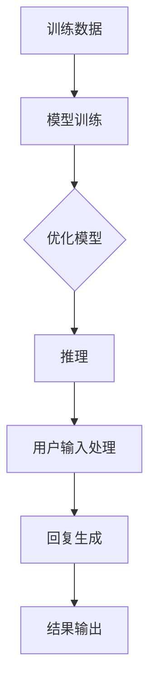

                 

### 《聊天机器人可持续发展：环境影响和资源管理》引言

在数字化和信息化的浪潮中，聊天机器人作为一种前沿的人工智能技术，已经在我们的日常生活中扮演着越来越重要的角色。从简单的客服助手到复杂的虚拟顾问，聊天机器人的应用场景不断扩展，功能也日趋丰富。然而，随着聊天机器人的大规模普及，其对环境和资源的影响也逐渐成为不可忽视的问题。

**关键词：** 聊天机器人、可持续发展、环境影响、资源管理

**摘要：** 本文将围绕聊天机器人的可持续发展展开讨论，重点分析其环境影响和资源管理的重要性。通过详细探讨聊天机器人的资源消耗、废弃物处理以及社会文化影响，提出一系列资源管理策略，以实现聊天机器人在环境和社会责任方面的可持续发展。

### 1.1 聊天机器人的现状与挑战

#### 1.1.1 聊天机器人的定义与功能

聊天机器人，又称聊天bots，是一种基于自然语言处理（NLP）和机器学习技术的人工智能程序，能够在与用户的交互中模拟人类的对话行为。聊天机器人的功能多种多样，包括但不限于：

1. **客户服务**：自动回答常见问题，减轻人工客服的工作负担。
2. **信息检索**：帮助用户快速获取所需的信息。
3. **虚拟助手**：提供个性化的建议和帮助，如健康咨询、财务规划等。
4. **娱乐互动**：提供有趣的对话内容和游戏体验。

聊天机器人通过不断地学习用户的行为和偏好，能够实现自然流畅的对话体验。它们广泛应用于企业、政府、教育、医疗等多个领域，成为提高效率和提升用户体验的重要工具。

#### 1.1.2 聊天机器人在现代社会的普及

随着移动互联网和大数据技术的发展，聊天机器人逐渐渗透到我们日常生活的方方面面。据统计，截至2022年，全球有超过300亿台设备安装了聊天机器人应用程序。微信、WhatsApp、Slack等即时通讯平台上的聊天机器人已经成为了人们日常生活中不可或缺的一部分。企业也开始意识到聊天机器人在提高客户满意度和降低运营成本方面的巨大潜力，纷纷将其引入到客户服务、市场营销和内部管理等各个领域。

#### 1.1.3 可持续发展与环境影响

在聊天机器人快速普及的同时，其环境影响和资源消耗问题也逐渐凸显。首先，聊天机器人需要大量的计算资源和能源来支持其训练和运行，尤其是在大规模部署和复杂应用场景下，数据中心的能耗问题尤为突出。其次，随着聊天机器人的废弃和更换，电子废弃物的处理也成为了一个严重的社会问题。此外，聊天机器人对人际关系的转变和社会文化的影响也值得我们深入探讨。

**结论：** 聊天机器人在现代社会中发挥着越来越重要的作用，但其可持续发展问题不容忽视。本文将首先分析聊天机器人的环境影响，包括资源消耗、废弃物处理和社会文化影响，然后提出一系列资源管理策略，以实现聊天机器人的可持续发展。接下来，我们将深入探讨这些问题，并提供具体的解决方案和实践案例。

### 1.2 资源管理的重要性

#### 1.2.1 资源管理的定义与意义

资源管理是指对资源进行有效配置、利用和优化，以满足特定目标和需求的过程。在聊天机器人的背景下，资源管理尤为重要。它不仅关系到聊天机器人的性能和效率，还直接影响到其可持续发展的能力。

资源管理的主要目标是：

1. **提高资源利用效率**：通过优化资源分配和使用，减少不必要的浪费。
2. **降低运营成本**：通过有效的资源管理，降低能源消耗和硬件采购成本。
3. **保障持续发展**：确保聊天机器人在长期运行中不会因为资源短缺或浪费而受到限制。

#### 1.2.2 资源管理的挑战与机遇

尽管资源管理具有重要意义，但在实际操作中，仍然面临一系列挑战：

1. **复杂性**：聊天机器人的系统结构复杂，涉及多个层面的资源，如计算资源、存储资源和网络资源。如何高效管理和优化这些资源成为一个难题。
2. **动态变化**：用户需求和聊天机器人的功能不断变化，导致资源需求也随之变化。如何动态调整资源分配，以满足不断变化的需求，是一个挑战。
3. **技术限制**：当前的资源管理技术和方法可能无法完全满足聊天机器人的需求。例如，一些高效的资源管理算法可能不适用于大规模分布式系统。

然而，这些挑战同时也带来了机遇：

1. **技术创新**：随着人工智能和大数据技术的发展，新的资源管理技术和方法不断涌现，为解决现有挑战提供了可能。
2. **市场驱动**：企业和政府对可持续发展的关注增加，推动了资源管理技术的发展和应用。
3. **政策支持**：政府制定了一系列环保和资源管理的政策，为企业提供了指导和激励，促进了资源管理的推广和实践。

**结论：** 资源管理在聊天机器人的可持续发展中起着关键作用。通过有效的资源管理，我们可以提高聊天机器人的性能和效率，降低运营成本，并保障其长期运行。本文将深入探讨资源管理的具体策略和方法，以期为聊天机器人的可持续发展提供可行的解决方案。

### 2.1 聊天机器人的环境影响

随着聊天机器人技术的迅速发展，其广泛的应用不仅带来了便利，同时也带来了环境负担。本文将详细分析聊天机器人在环境影响方面的几个关键方面，包括资源消耗与效率分析、废弃物处理与环保，以及社会与文化影响。

#### 2.1.1 资源消耗与效率分析

聊天机器人的运行依赖于大量的计算资源和能源。首先，我们来看一下数据中心能耗。

##### 2.1.1.1 数据中心能耗

数据中心是聊天机器人运行的核心基础设施，其能耗主要来自于服务器、存储设备和网络设备。服务器能耗占据数据中心总能耗的较大比例，而聊天机器人需要大量的服务器来支持其复杂的计算需求。根据市场研究机构的报告，一个大型数据中心的能耗可以达到几千千瓦，甚至上万千瓦。这相当于一个小型城镇的电力需求。

以聊天机器人为例，其训练和推理过程需要大量的计算资源。在训练阶段，机器学习模型需要通过大量数据迭代优化参数，这一过程往往需要大量GPU和CPU资源。而在推理阶段，模型需要实时处理用户输入的信息，这同样需要大量的计算资源。此外，聊天机器人的分布式部署也需要更多的网络资源和存储资源。

##### 2.1.1.2 常见聊天机器人能耗分析

以常见的聊天机器人应用场景为例，如客服机器人、信息检索机器人和虚拟助手等，其能耗表现如下：

- **客服机器人**：主要用于处理用户查询和常见问题的回答。这类机器人通常不需要大规模的实时推理，但其训练过程仍然需要较多的计算资源。
- **信息检索机器人**：这类机器人需要快速检索和返回相关信息，其能耗主要来自于数据处理和存储设备的能耗。
- **虚拟助手**：提供个性化服务和建议，如健康咨询、财务规划等，其能耗通常较高，因为它们需要实时分析大量用户数据，并提供实时反馈。

##### 2.1.1.3 计算资源消耗

计算资源消耗主要体现在机器学习模型的训练和推理过程中。首先，训练过程需要大量的计算资源，特别是当模型规模较大或数据量较多时，计算需求会显著增加。此外，推理过程也需要计算资源，尤其是在需要实时响应大量用户请求时，服务器的负载会显著增加。

机器学习模型在训练阶段，需要通过大量的迭代来优化模型参数。这一过程涉及大量的矩阵运算和参数更新，计算量巨大。而在推理阶段，模型需要快速处理用户输入的信息，并提供实时反馈。这同样需要大量的计算资源，尤其是在模型复杂度较高或数据量较大时。

##### 2.1.1.4 数据存储与传输

聊天机器人需要大量的数据存储和传输资源。首先，在训练阶段，需要存储大量的训练数据和模型参数。这些数据通常以大规模数据库或分布式存储系统存储，其存储容量和传输带宽都需要足够强大。在推理阶段，需要快速访问这些数据，以便模型能够实时响应用户请求。

此外，聊天机器人还需要与其他系统进行数据交互，如用户数据库、知识库等。这些数据传输过程中，也会消耗一定的计算资源和网络资源。

#### 2.1.2 废弃物处理与环保

随着聊天机器人的普及，废弃物的处理也成为一个重要问题。聊天机器人废弃物的特点主要包括：

- **高技术含量**：聊天机器人通常由多种高技术组件构成，如CPU、GPU、存储设备等，这些组件在使用寿命结束后往往难以处理。
- **有害物质**：一些电子组件中含有有害物质，如铅、镉等，如果不当处理，会对环境和人类健康造成危害。

##### 2.2.1.1 聊天机器人废弃物的特点

聊天机器人废弃物的特点主要包括：

- **高技术含量**：聊天机器人通常由多种高技术组件构成，如CPU、GPU、存储设备等，这些组件在使用寿命结束后往往难以处理。
- **有害物质**：一些电子组件中含有有害物质，如铅、镉等，如果不当处理，会对环境和人类健康造成危害。

##### 2.2.1.2 环保处理技术与政策

为了解决聊天机器人废弃物处理的问题，可以采用以下环保处理技术：

1. **回收与再利用**：通过技术手段，将废弃的聊天机器人中的有用组件回收和再利用。例如，可以回收CPU、GPU等核心组件，进行重新制造或升级使用。
2. **无害化处理**：对于含有有害物质的组件，采用无害化处理技术，如高温焚烧、化学处理等，以消除其有害性。
3. **资源闭环管理**：建立资源闭环管理系统，将废弃物的回收、再利用和无害化处理有机结合，形成闭环循环。

此外，政府可以制定一系列环保政策和法规，鼓励企业和个人参与聊天机器人废弃物的处理。例如，可以出台回收补贴政策，鼓励企业回收废弃的聊天机器人；可以制定严格的废弃物处理标准，规范废弃物的处理流程，确保处理过程的安全性和环保性。

#### 2.1.3 社会与文化影响

聊天机器人的广泛应用不仅带来了技术和社会层面的影响，还对社会文化产生了深远的影响。

##### 2.3.1.1 人际关系的转变

随着聊天机器人在各种场合的普及，人类与机器人的交互变得越来越频繁。这种交互方式在一定程度上改变了人类之间的人际关系。一方面，聊天机器人可以替代人类进行一些日常的沟通和任务，减轻人际沟通的负担；另一方面，过度依赖聊天机器人可能导致人际沟通能力的下降，甚至影响到人类之间的情感交流。

##### 2.3.1.2 人类与机器人关系的心理学研究

心理学研究表明，人类对机器人的态度和情感反应与对真实人类的反应有所不同。一方面，人类可能会对机器人产生依赖，认为机器人可以代替人类完成复杂的任务；另一方面，人类可能会对机器人产生情感共鸣，将其视为朋友或伙伴。

然而，这种情感依赖和共鸣也带来了一些问题。例如，当机器人无法满足人类的期望或需求时，人类可能会感到失落和沮丧。此外，人类与机器人之间的情感交流也可能导致一些道德和伦理问题，如隐私保护、情感责任等。

##### 2.3.2 文化多样性的挑战与应对策略

聊天机器人在全球范围内的普及带来了文化多样性的挑战。不同国家和地区的人们对机器人的接受程度和交互方式有所不同，这可能导致文化冲突和误解。为了应对这一挑战，可以采取以下策略：

1. **本地化开发**：根据不同国家和地区的文化特点，开发和定制适合当地文化和语言的聊天机器人。
2. **跨文化交流**：加强不同国家和地区之间的交流和合作，促进文化理解和尊重。
3. **伦理与规范**：制定一系列道德和伦理规范，确保聊天机器人在不同文化背景下的合理使用。

**结论：** 聊天机器人在环境影响、资源消耗、废弃物处理和社会文化影响等方面带来了诸多挑战。通过有效的资源管理策略和环保措施，可以减轻其环境影响，实现可持续发展。同时，我们还需要关注聊天机器人对人际关系和社会文化的长远影响，采取适当的措施进行引导和调控。

### 2.1.1 资源消耗与效率分析

#### 2.1.1.1 数据中心能耗

数据中心能耗是聊天机器人环境影响中最为显著的方面之一。数据中心通常由大量的服务器、存储设备和网络设备组成，这些设备在运行过程中会消耗大量的电力。根据市场研究机构的数据，全球数据中心的总能耗已经超过了全球电力消耗的1%，并且这一数字还在不断增长。

以聊天机器人为例，其运行需要大量的计算资源。首先，机器学习模型的训练和优化是一个计算密集型过程，需要使用到大量的CPU和GPU资源。在训练过程中，服务器会不断地进行矩阵运算、梯度下降等复杂的计算任务，这些计算任务会导致服务器功耗急剧增加。

此外，聊天机器人的推理过程也需要大量的计算资源。在推理过程中，服务器需要实时处理用户输入的信息，并生成相应的回复。这一过程涉及到大量的文本处理、语音识别和自然语言生成等任务，同样会消耗大量的计算资源。

为了更好地理解聊天机器人对数据中心能耗的影响，我们可以通过以下Mermaid流程图来展示其计算资源消耗的过程：



这个流程图展示了从训练数据输入到模型训练、模型优化、推理过程以及用户输入处理和回复生成的整个计算资源消耗过程。可以看到，无论是训练阶段还是推理阶段，都涉及大量的计算任务，这些任务会导致服务器功耗的增加。

根据市场研究机构的数据，一个中等规模的数据中心，如果部署了1000台服务器，每台服务器的功耗为250瓦，那么整个数据中心的功耗将达到250千瓦。如果这些服务器中有50%被聊天机器人使用，那么聊天机器人每年将消耗大约450万千瓦时的电能。

不仅如此，聊天机器人的功耗不仅限于服务器本身，还包括与之相关的存储设备和网络设备。存储设备在读取和写入数据时也会消耗电能，而网络设备在处理数据传输时同样会消耗电能。这些设备的功耗虽然相对较低，但在大规模数据中心中也会形成显著的能源消耗。

#### 2.1.1.2 常见聊天机器人能耗分析

常见的聊天机器人应用场景包括客服机器人、信息检索机器人和虚拟助手等。这些场景对计算资源和能源的需求有所不同，下面我们分别进行分析。

- **客服机器人**：客服机器人主要用于处理用户查询和常见问题。其训练过程相对简单，通常只需要处理简单的文本数据。在推理过程中，客服机器人需要快速响应用户的输入，生成相应的回复。这一过程需要大量CPU资源，尤其是当用户请求量较大时，服务器的负载会显著增加。根据市场研究机构的数据，一个中等规模的客服机器人系统，如果每小时需要处理10000个用户请求，每台服务器的功耗大约为150瓦。

- **信息检索机器人**：信息检索机器人主要用于帮助用户快速获取所需的信息。其训练过程相对复杂，需要处理大量的文本数据，并进行深度学习模型的训练。在推理过程中，信息检索机器人需要快速检索和返回相关信息，这需要大量的CPU和GPU资源。根据市场研究机构的数据，一个中等规模的信息检索机器人系统，如果每小时需要处理10000个查询请求，每台服务器的功耗大约为250瓦。

- **虚拟助手**：虚拟助手提供个性化的服务和建议，如健康咨询、财务规划等。其训练过程最为复杂，需要处理大量的用户数据和复杂的学习模型。在推理过程中，虚拟助手需要实时分析大量用户数据，并提供实时反馈。这一过程需要大量的CPU、GPU和网络资源。根据市场研究机构的数据，一个中等规模的虚拟助手系统，如果每小时需要处理10000个用户请求，每台服务器的功耗大约为300瓦。

从上面的分析可以看出，不同类型的聊天机器人对计算资源和能源的需求有所不同。客服机器人相对较为简单，信息检索机器人较为复杂，而虚拟助手最为复杂。这些差异主要源于其训练和推理过程中所需的计算任务不同。

#### 2.1.1.3 计算资源消耗

计算资源消耗主要体现在机器学习模型的训练和推理过程中。首先，训练过程需要大量的计算资源，特别是在大规模数据集和复杂模型的情况下，计算资源的需求会显著增加。机器学习模型的训练过程通常包括以下步骤：

1. **数据预处理**：对原始数据集进行清洗、去重和格式化，以生成适合训练的数据集。
2. **特征提取**：从数据集中提取有用的特征，以便用于模型训练。
3. **模型训练**：使用训练数据集训练模型，通过迭代优化模型参数。
4. **模型评估**：使用验证数据集评估模型性能，并调整模型参数。

在训练过程中，需要进行大量的矩阵运算和参数更新。例如，在深度学习模型中，常用的优化算法如梯度下降和随机梯度下降，都需要进行大量的矩阵乘法和加法运算。这些运算需要在CPU或GPU上执行，会消耗大量的计算资源。

在推理过程中，模型需要快速处理用户输入的信息，并生成相应的回复。这一过程也需要大量的计算资源，特别是在实时处理大量用户请求时，服务器的负载会显著增加。推理过程通常包括以下步骤：

1. **输入预处理**：对用户输入的信息进行预处理，如分词、词性标注等。
2. **模型推理**：使用训练好的模型对预处理后的输入进行推理，生成输出结果。
3. **输出处理**：对输出结果进行后处理，如文本生成、语音合成等。

在推理过程中，模型需要进行大量的矩阵运算和文本处理。例如，在自然语言处理中，常用的技术如词向量表示、序列到序列模型等，都需要进行大量的矩阵运算。这些运算同样需要在CPU或GPU上执行，会消耗大量的计算资源。

#### 2.1.1.4 数据存储与传输

聊天机器人需要大量的数据存储和传输资源。首先，在训练阶段，需要存储大量的训练数据和模型参数。这些数据通常以大规模数据库或分布式存储系统存储，其存储容量和传输带宽都需要足够强大。在推理阶段，需要快速访问这些数据，以便模型能够实时响应用户请求。

数据存储和传输过程中也会消耗大量的资源。在存储方面，需要使用磁盘或固态硬盘等存储设备来存储大量的数据。磁盘读写操作会消耗电能，而固态硬盘虽然性能更高，但同样需要电力支持。在传输方面，需要使用网络设备如交换机和路由器等来传输数据。这些设备在处理数据传输时也会消耗电能。

### 2.2 废弃物处理与环保

随着聊天机器人技术的普及和更新迭代，废弃的聊天机器人设备逐渐增多，这带来了严重的电子废弃物处理问题。电子废弃物不仅占用宝贵的土地资源，而且含有大量有害物质，对环境和人类健康构成威胁。因此，合理处理聊天机器人废弃物，实施环保措施，是确保其可持续发展的重要环节。

#### 2.2.1.1 聊天机器人废弃物的特点

聊天机器人废弃物具有以下几个显著特点：

1. **高技术含量**：聊天机器人通常由多个高技术组件组成，包括CPU、GPU、存储设备、传感器等。这些组件在废弃时无法再利用，需要专业处理。
2. **有害物质**：电子设备中含有多种有害物质，如铅、镉、汞、多溴联苯（PBBs）和多溴二苯醚（PBDEs）等。这些物质如果未经妥善处理，可能会渗入土壤和水源，对环境和人类健康造成危害。
3. **处理难度大**：由于聊天机器人废弃物的复杂性，其回收和处理过程比一般电子废弃物更为复杂和昂贵。

#### 2.2.1.2 环保处理技术与政策

为了应对聊天机器人废弃物处理问题，可以采用以下环保处理技术和政策：

1. **回收与再利用**：建立专业的回收系统，将废弃的聊天机器人拆解，对有用组件进行再利用。例如，可以将CPU、GPU等核心组件重新制造或升级使用。对于无法再利用的部件，可以将其拆解为更小的组件，如电路板、芯片等，进行有针对性的回收。

2. **无害化处理**：对于含有有害物质的组件，采用无害化处理技术，如高温焚烧、化学处理等，以消除其有害性。在焚烧过程中，需要严格控制温度和排放物，以避免二次污染。

3. **资源闭环管理**：通过建立资源闭环管理系统，实现废弃物的回收、再利用和无害化处理的有机结合。例如，可以采用生态设计理念，从产品设计阶段就开始考虑废弃物的回收和再利用问题，减少废弃物的产生。

4. **法规政策支持**：政府可以制定一系列法规政策，鼓励企业和社会积极参与聊天机器人废弃物的处理。例如，可以出台回收补贴政策，对积极参与回收和处理的企业给予财政补贴；可以制定严格的废弃物处理标准，确保废弃物处理过程的安全性和环保性。

#### 2.2.1.3 政府与企业责任

在聊天机器人废弃物的处理过程中，政府和企业都承担着重要的责任：

1. **政府责任**：政府应制定和实施一系列法规政策，规范聊天机器人废弃物的处理流程，确保废弃物得到妥善处理。同时，政府还可以通过公共教育和宣传，提高公众对环保意识和废弃物的处理重要性。

2. **企业责任**：企业作为聊天机器人的制造者和使用者，应承担起废弃物的回收和处理责任。企业可以建立自己的回收系统，或与专业的回收处理企业合作，确保废弃物的回收和处理过程符合环保标准。此外，企业还可以在产品设计阶段就考虑废弃物的处理问题，采用生态设计理念，减少废弃物的产生。

#### 2.2.1.4 社会参与

除了政府和企业的努力，社会的积极参与也是确保聊天机器人废弃物得到有效处理的重要保障。公众应增强环保意识，积极参与到废弃物的回收和处理活动中。例如，可以设立废弃物回收点，方便公众将废弃的聊天机器人交由专业机构进行处理。同时，公众还可以通过举报和监督，确保废弃物处理过程符合环保标准。

**结论：** 聊天机器人废弃物的处理是确保其可持续发展的重要环节。通过回收与再利用、无害化处理、资源闭环管理和法规政策支持，可以有效地解决废弃物处理问题。政府、企业和社会的共同努力，将有助于实现聊天机器人在环境和社会责任方面的可持续发展。

### 2.3 社会与文化影响

聊天机器人的广泛应用不仅改变了人们的日常生活，还对社会和文化产生了深远的影响。特别是，它们在人际关系的转变和文化多样性的挑战方面表现出尤为显著的特征。

#### 2.3.1.1 人际关系的转变

随着聊天机器人在各个领域的普及，人类与机器人的互动变得越来越频繁。这种互动方式在一定程度上改变了人类之间的人际关系。一方面，聊天机器人可以替代人类进行一些日常的沟通和任务，减轻人际沟通的负担。例如，客服机器人可以帮助企业处理大量的客户查询，节省人力资源，提高效率。然而，这也可能导致人际沟通能力的下降，甚至影响到人类之间的情感交流。

研究显示，长期依赖聊天机器人进行沟通的个体可能会减少与真实人类的互动，从而影响其社交技能和情感表达能力。特别是对于年轻人，他们可能更倾向于使用聊天机器人进行社交，而不是与真实人类建立联系。这种现象被称为“机器人社交依赖症”（RoboDependence），引起了社会各界的广泛关注。

此外，聊天机器人还可能对家庭关系产生影响。例如，家庭中的老年人可能会更依赖聊天机器人进行日常沟通，而忽视了与家人的实际互动。这种依赖可能导致家庭关系疏远，影响家庭成员之间的情感交流。

#### 2.3.1.2 人类与机器人关系的心理学研究

心理学研究表明，人类对机器人的态度和情感反应与对真实人类的反应有所不同。一方面，人类可能会对机器人产生依赖，认为机器人可以代替人类完成复杂的任务。这种依赖源于机器人提供的便利性和高效性。例如，一些研究人员发现，在使用聊天机器人的过程中，用户会逐渐对其产生信任和依赖，认为机器人可以解决他们的问题。

另一方面，人类也可能会对机器人产生情感共鸣，将其视为朋友或伙伴。这种现象被称为“机器人情感化”（RoboAffection），意味着人类对机器人产生了情感依赖。一项研究显示，当用户与聊天机器人进行长时间的互动时，他们可能会对机器人产生好感，甚至产生情感联系。

然而，这种情感依赖和共鸣也带来了一些问题。例如，当机器人无法满足人类的期望或需求时，人类可能会感到失落和沮丧。这种现象被称为“机器人情感失落”（RoboAffection Dissatisfaction）。此外，人类与机器人之间的情感交流也可能导致一些道德和伦理问题，如隐私保护、情感责任等。

#### 2.3.2 文化多样性的挑战与应对策略

聊天机器人在全球范围内的普及带来了文化多样性的挑战。不同国家和地区的人们对机器人的接受程度和交互方式有所不同，这可能导致文化冲突和误解。例如，一些文化倾向于直接和简明的沟通方式，而另一些文化则更注重情感和关系的建立。这种文化差异可能导致聊天机器人在某些地区运行效果不佳，甚至引发用户不满。

为了应对这一挑战，可以采取以下策略：

1. **本地化开发**：根据不同国家和地区的文化特点，开发和定制适合当地文化和语言的聊天机器人。例如，对于注重情感交流的文化，可以设计更加温暖和人性化的聊天机器人；对于注重效率的文化，可以设计更加直接和高效的聊天机器人。

2. **跨文化交流**：加强不同国家和地区之间的交流和合作，促进文化理解和尊重。例如，可以组织国际化的开发团队，共同开发跨文化的聊天机器人；可以开展文化交流活动，促进不同文化背景的用户对机器人的理解和接受。

3. **伦理与规范**：制定一系列道德和伦理规范，确保聊天机器人在不同文化背景下的合理使用。例如，可以建立全球统一的隐私保护标准，确保用户的个人信息得到妥善保护；可以制定道德准则，规范人类与机器人之间的互动行为，避免不必要的冲突和误解。

**结论：** 聊天机器人的社会和文化影响不可忽视。通过深入了解人类与机器人关系以及文化多样性挑战，我们可以采取一系列策略来促进聊天机器人的可持续发展，确保其在社会和文化方面产生积极的影响。

### 3.1 绿色数据中心建设

绿色数据中心是减少聊天机器人环境影响的重要一环。通过优化数据中心能效和采用可再生能源，我们可以显著降低数据中心的能耗和碳足迹。以下是一些关键策略和实施方法。

#### 3.1.1 数据中心能效优化

数据中心能效优化是降低能耗的关键步骤。以下是一些主要的能效优化策略：

##### 3.1.1.1 服务器节能技术

1. **服务器虚拟化**：通过虚拟化技术，将多个物理服务器虚拟化为多个虚拟服务器，提高资源利用率。虚拟化技术可以动态调整资源分配，实现按需分配，从而减少闲置资源的浪费。
2. **能耗管理**：使用能耗管理工具实时监控服务器的功耗，并根据负载情况动态调整功耗。例如，当服务器负载较低时，可以降低其功耗，而当负载较高时，可以增加其功耗，以确保服务器的稳定运行。
3. **高效电源管理**：使用高效电源管理（Hi-PMD）技术，确保电源供应系统的效率最大化。通过精确控制电源输出，可以减少不必要的电能损耗。

##### 3.1.1.2 空调和制冷技术

1. **热回收技术**：利用废热进行供暖或热水生产，从而减少空调系统的能耗。例如，可以将数据中心的废热用于办公室供暖或建筑物供暖。
2. **高效制冷系统**：采用高效制冷系统，如离心式冷水机组、直接膨胀制冷系统（DX系统）等，以提高制冷效率。同时，可以采用智能控制技术，根据数据中心的热负载动态调整制冷系统的运行参数。
3. **空气侧优化**：通过优化空气流动，减少冷却空气的能耗。例如，可以使用高效风扇和空气分配系统，确保冷却空气均匀分布，避免局部热点。

##### 3.1.1.3 数据中心基础设施管理

1. **智能化管理**：采用智能监控和管理系统，实时监控数据中心的能耗和运行状态。通过数据分析，可以及时发现能耗异常和潜在问题，并采取相应措施进行优化。
2. **空间利用优化**：通过合理规划数据中心的布局，提高空间利用率。例如，可以采用模块化设计，将服务器和存储设备集中放置，减少走线和布线的复杂度。
3. **设备更新与淘汰**：定期更新和淘汰老旧设备，采用更高效、更节能的新设备。例如，可以采用最新一代的高效能效比服务器和存储设备，以提高整体能效。

#### 3.1.2 可再生能源的使用

采用可再生能源是数据中心实现绿色发展的关键途径。以下是一些可再生能源的使用策略：

##### 3.1.2.1 太阳能

1. **光伏发电**：在数据中心的建设过程中，可以安装太阳能光伏板，直接利用太阳能进行发电。光伏发电具有清洁、可再生、无污染等特点，可以有效减少对化石燃料的依赖。
2. **储能系统**：结合储能系统，可以在光伏发电不足时使用储能设备存储电能，以确保数据中心在夜间或阴天时依然可以正常运行。

##### 3.1.2.2 风能

1. **风能发电**：在风能资源丰富的地区，可以建设风能发电场，将风能转化为电能，为数据中心提供清洁能源。
2. **智能电网**：结合智能电网技术，可以实现风能发电与数据中心用电的实时调度和优化，提高能源利用效率。

##### 3.1.2.3 水能

1. **水能发电**：在水能资源丰富的地区，可以建设水电站，利用水能进行发电。水能发电具有稳定、可再生、无污染等特点。
2. **微电网**：结合微电网技术，可以实现水能发电与数据中心用电的局部独立运行，提高数据中心的供电可靠性和能源利用效率。

#### 3.1.3 实施案例

以下是一些绿色数据中心的建设案例：

- **谷歌绿色数据中心**：谷歌在其全球多个数据中心采用了绿色能源和节能技术，通过太阳能、风能等可再生能源进行供电，同时采用高效制冷系统和智能化管理，大幅降低了能耗。
- **微软云计算数据中心**：微软在其云计算数据中心采用了混合能源系统，结合太阳能、风能和储能系统，实现了能源的高效利用和供电的可靠性。
- **阿里巴巴绿色数据中心**：阿里巴巴在其绿色数据中心采用了高效节能的服务器和存储设备，同时利用水能和风能进行供电，实现了数据中心的可持续发展。

**结论：** 绿色数据中心建设是减少聊天机器人环境影响的重要手段。通过能效优化和可再生能源的使用，我们可以显著降低数据中心的能耗和碳足迹，实现可持续发展。结合具体实施案例，我们可以看到绿色数据中心在能源利用和环境保护方面取得的显著成果。

### 3.2 资源效率提升方法

为了实现聊天机器人的可持续发展，提高资源效率是关键。通过优化机器学习模型、数据存储和传输，我们可以显著降低聊天机器人的计算资源消耗和能源消耗。以下是一些具体的提升方法：

#### 3.2.1 机器学习优化

机器学习优化是提升聊天机器人资源效率的重要手段。以下是一些常见的机器学习优化方法：

##### 3.2.1.1 模型压缩与量化

1. **模型压缩**：通过模型压缩技术，可以减少模型参数的数量，从而降低模型的计算复杂度和存储需求。常见的模型压缩方法包括剪枝（Pruning）、量化（Quantization）和知识蒸馏（Knowledge Distillation）等。

   - **剪枝**：通过剪枝技术，可以删除模型中不必要的权重和神经元，从而减少模型的复杂度和计算资源消耗。
   - **量化**：通过量化技术，可以将浮点数参数转换为较低精度的整数参数，从而减少模型的存储和计算资源消耗。
   - **知识蒸馏**：通过知识蒸馏技术，可以将一个大模型（教师模型）的知识迁移到一个较小的模型（学生模型）中，从而在保持模型性能的同时降低计算和存储资源消耗。

   ```python
   # 剪枝伪代码示例
   def prune_model(model, pruning_rate):
       pruned_weights = []
       for layer in model.layers:
           weights = layer.get_weights()
           pruned_weights.append(weights * (1 - pruning_rate))
       return model.set_weights(pruned_weights)
   ```

2. **稀疏性技术**：稀疏性技术通过引入稀疏性，使模型在计算时只处理非零参数，从而减少计算资源消耗。常见的稀疏性技术包括稀疏自动编码器（Sparse Auto-Encoders）和稀疏梯度下降（Sparse Gradient Descent）等。

   ```python
   # 稀疏自动编码器伪代码示例
   def sparse_auto_encoder(inputs, sparsity_level):
       encoded = dense(inputs, sparsity_level, activation='sigmoid')
       decoded = dense(encoded, inputs.shape[1], activation='sigmoid')
       return Model(inputs, decoded)
   ```

##### 3.2.1.2 模型并行化

模型并行化是通过将模型分解为多个部分，并在多个计算设备上同时执行，从而提高计算效率。常见的模型并行化方法包括数据并行（Data Parallelism）和模型并行（Model Parallelism）等。

- **数据并行**：将输入数据划分成多个子集，每个子集在一个设备上独立处理，然后合并结果。这种方法可以显著减少单台设备的计算负载，提高整体计算效率。
  
  ```python
  # 数据并行伪代码示例
  def data_parallel(model, batch_size):
      submodels = []
      for i in range(batch_size):
          submodel = copy_model(model)
          submodels.append(submodel)
      outputs = [submodel(input_data) for submodel in submodels]
      return concatenate(outputs)
  ```

- **模型并行**：将模型分解为多个部分，每个部分在一个设备上独立处理，然后合并结果。这种方法可以充分利用多设备资源的计算能力，提高整体计算效率。

  ```python
  # 模型并行伪代码示例
  def model_parallel(model, devices):
      parts = split_model(model, devices)
      outputs = [part(input_data) for part in parts]
      return concatenate(outputs)
  ```

#### 3.2.2 数据存储优化

数据存储优化是降低聊天机器人资源消耗的重要方面。以下是一些常见的数据存储优化方法：

##### 3.2.2.1 压缩与去重

1. **数据压缩**：通过数据压缩技术，可以减少数据存储空间，从而降低存储资源消耗。常见的数据压缩算法包括Huffman编码、LZ77和LZ78编码等。

   ```python
   # 数据压缩伪代码示例
   def compress_data(data):
       compressed_data = huffman_encode(data)
       return compressed_data
   ```

2. **数据去重**：通过数据去重技术，可以识别和删除重复的数据，从而减少存储空间消耗。常见的数据去重方法包括哈希表去重和差分编码等。

   ```python
   # 数据去重伪代码示例
   def remove_duplicates(data):
       unique_data = []
       for item in data:
           if item not in unique_data:
               unique_data.append(item)
       return unique_data
   ```

##### 3.2.2.2 分布式存储与备份

1. **分布式存储**：通过分布式存储技术，可以将数据分散存储在多个设备上，从而提高数据存储的可靠性和效率。常见的分布式存储系统包括Hadoop HDFS、Apache Cassandra和Amazon S3等。

   ```python
   # 分布式存储伪代码示例
   def store_data_distributed(data, storage_system):
       storage_system.store(data)
   ```

2. **数据备份**：通过数据备份技术，可以确保数据的安全性和可靠性。常见的数据备份策略包括全量备份、增量备份和差异备份等。

   ```python
   # 数据备份伪代码示例
   def backup_data(backup_system, data):
       backup_system.backup(data)
   ```

#### 3.2.3 网络资源优化

网络资源优化是提高聊天机器人响应速度和用户体验的重要手段。以下是一些常见的方法：

##### 3.2.3.1 数据压缩

通过数据压缩技术，可以减少网络传输的数据量，从而降低带宽消耗和提高传输速度。常见的数据压缩算法包括Huffman编码、LZ77和LZ78编码等。

   ```python
   # 数据压缩伪代码示例
   def compress_data(data):
       compressed_data = huffman_encode(data)
       return compressed_data
   ```

##### 3.2.3.2 CDN加速

通过内容分发网络（CDN）技术，可以将数据分发到离用户更近的节点上，从而提高数据传输速度和用户体验。常见的CDN服务提供商包括Cloudflare、AWS CloudFront和Akamai等。

   ```python
   # CDN加速伪代码示例
   def accelerate_data_transfer(data, cdn_service):
       cdn_service.accelerate(data)
   ```

##### 3.2.3.3 缓存策略

通过缓存策略，可以缓存常用的数据和响应结果，从而减少网络请求和响应时间。常见的缓存策略包括内存缓存、磁盘缓存和分布式缓存等。

   ```python
   # 缓存策略伪代码示例
   def cache_response(response, cache_system):
       cache_system.cache(response)
   ```

**结论：** 通过机器学习优化、数据存储优化和网络资源优化，我们可以显著提高聊天机器人的资源效率，降低计算资源消耗和能源消耗。这些优化方法不仅有助于实现聊天机器人的可持续发展，还有助于提高用户体验和降低运营成本。结合具体的技术方法和伪代码示例，我们可以更好地理解和应用这些优化策略。

### 3.3 循环经济与废物利用

循环经济是一种以资源高效利用和循环再生为核心的经济模式，其目标是减少资源的消耗和废弃物的产生，实现经济的可持续发展。在聊天机器人领域，循环经济的理念同样具有重要意义，通过合理的回收与再利用策略，可以显著减轻环境负担，促进资源的可持续利用。

#### 3.3.1 电子废弃物的回收与再利用

电子废弃物的回收与再利用是循环经济的重要组成部分。以下是电子废弃物回收与再利用的主要流程和挑战：

##### 3.3.1.1 回收流程

1. **收集与分类**：首先，将废弃的聊天机器人收集到专门的回收点。然后，对这些设备进行初步分类，根据不同的组件和材料进行分离。例如，将CPU、GPU、存储设备、传感器等分别分类，以便后续处理。

2. **拆卸与拆解**：在分类完成后，对每个组件进行拆卸和拆解。这一过程需要专业设备和技能，以确保拆卸过程不会对组件造成损坏。例如，可以使用拆装机、超声波清洗机等设备进行拆卸和清洁。

3. **再利用**：对拆卸下来的组件进行检测和修复，判断其是否可以再次使用。对于功能正常的组件，可以重新安装或出售。例如，可以将修复后的CPU、GPU用于新的聊天机器人系统，从而延长其使用寿命。

4. **再制造**：对于无法修复或功能不全的组件，可以采用再制造技术进行改造，使其恢复部分或全部功能。例如，可以将旧存储设备中的闪存芯片进行重新编程和封装，用于新的存储设备。

5. **回收材料**：无法再利用的组件需要进行材料回收。例如，可以将电路板中的铜、铝等金属材料进行回收和再加工，用于生产新的电子组件。

##### 3.3.1.2 挑战与机遇

电子废弃物的回收与再利用面临以下挑战：

1. **技术难度**：电子废弃物的回收与再利用需要专业技术和设备，尤其是对于高技术含量的组件，如CPU、GPU等。这要求回收企业具备较高的技术水平和专业能力。

2. **成本问题**：回收和再利用电子废弃物需要投入大量的人力、物力和财力，尤其是对于小规模回收企业来说，成本较高。因此，如何降低成本、提高经济效益是回收企业面临的重要问题。

3. **政策法规**：目前，许多国家和地区尚未制定完善的电子废弃物回收与再利用政策法规，导致回收市场不规范、回收率低。因此，政策法规的制定和实施对于推动电子废弃物的回收与再利用具有重要意义。

然而，电子废弃物的回收与再利用也带来了诸多机遇：

1. **市场潜力**：随着电子废弃物的不断增加，电子废弃物回收与再利用市场潜力巨大。回收企业可以通过提供优质的回收服务和技术支持，开拓新的市场机会。

2. **技术创新**：电子废弃物的回收与再利用是一个技术密集型行业，随着新技术的不断涌现，如3D打印、激光切割等，回收企业可以通过技术创新提高回收效率和产品质量。

3. **环保效益**：电子废弃物的回收与再利用有助于减少环境污染和资源消耗，符合可持续发展的理念。通过回收与再利用，可以显著降低电子废弃物的处理成本，提高资源利用效率。

#### 3.3.1.3 实践案例

以下是一些电子废弃物回收与再利用的实践案例：

1. **电子废弃物回收项目**：某电子废弃物回收公司通过建立专业的回收处理生产线，提供从收集、分类、拆卸到再利用的一站式服务。通过不断优化回收流程和技术，该公司成功实现了电子废弃物的资源化利用，减少了电子废弃物的处理量。

2. **再制造中心**：某知名科技公司设立了再制造中心，专门负责回收和再制造废弃的电子设备。通过采用先进的检测和再制造技术，该公司成功将大量废弃设备恢复至良好状态，并再次推向市场，实现了资源的循环利用。

3. **政府支持政策**：某市政府出台了一系列支持电子废弃物回收与再利用的政策，如提供财政补贴、税收优惠等，鼓励企业参与电子废弃物的回收与再利用。通过这些政策支持，该市的电子废弃物回收率显著提高，环境效益明显。

**结论：** 电子废弃物的回收与再利用是循环经济的重要组成部分，对于实现聊天机器人的可持续发展具有重要意义。通过合理的回收与再利用策略，可以减少电子废弃物的处理成本，提高资源利用效率，实现环境保护和经济发展的双赢。结合实践案例和政策支持，我们可以更好地推动电子废弃物的回收与再利用，实现循环经济的可持续发展。

### 3.3.2 资源闭环管理与生态设计

资源闭环管理与生态设计是推动聊天机器人可持续发展的重要策略，通过构建闭环系统，实现资源的循环利用和最小化废弃物产生。以下将详细探讨资源闭环管理的理念、实施方法以及其在生态设计中的应用。

#### 3.3.2.1 资源闭环管理的理念

资源闭环管理是指在整个产品生命周期中，通过设计、生产、使用和回收等环节的优化，实现资源的最大化利用和最小化废弃物的产生。其核心思想是将资源视为一个循环系统，通过不断的循环利用，减少对自然资源的依赖，降低环境负担。

资源闭环管理的理念主要包括以下几个方面：

1. **系统性**：资源闭环管理是一个系统性工程，需要从整体上考虑资源的流动和利用，实现各个环节的协调和优化。
2. **可持续性**：资源闭环管理的目标是实现资源的可持续利用，减少对自然资源的依赖，降低环境负担。
3. **经济性**：资源闭环管理不仅要关注环境保护，还要注重经济效益，通过提高资源利用效率，降低生产成本。
4. **技术性**：资源闭环管理需要依赖先进的技术手段，如自动化、智能化技术等，以提高资源利用效率和降低废弃物产生。

#### 3.3.2.2 资源闭环管理的实施方法

资源闭环管理的实施方法主要包括以下几个方面：

1. **设计阶段**：在产品设计中，考虑资源的循环利用和最小化废弃物的产生。例如，采用模块化设计，使产品组件易于拆卸和再利用；使用可降解材料，减少废弃物产生。

   ```mermaid
   graph TD
       A[产品设计] --> B[模块化设计]
       B --> C{可拆卸性}
       C --> D{可降解材料}
   ```

2. **生产阶段**：在生产过程中，采用绿色制造技术，减少资源消耗和废弃物产生。例如，采用高效能源利用技术，降低生产过程中的能源消耗；使用环保原材料，减少生产过程中的污染。

   ```mermaid
   graph TD
       A[生产过程] --> B[高效能源利用]
       B --> C{环保原材料}
   ```

3. **使用阶段**：在使用过程中，鼓励用户合理使用产品，延长产品使用寿命，减少废弃物的产生。例如，提供用户培训，指导用户正确使用产品；提供维护和维修服务，延长产品的使用寿命。

   ```mermaid
   graph TD
       A[使用阶段] --> B[用户培训]
       B --> C{维护与维修}
   ```

4. **回收阶段**：在产品使用寿命结束后，通过回收和再利用，实现资源的循环利用。例如，建立专业的回收体系，对废弃产品进行回收、分类和处理；采用再制造技术，将回收的部件重新加工，用于新的产品。

   ```mermaid
   graph TD
       A[回收阶段] --> B[回收体系]
       B --> C{分类与处理}
       C --> D{再制造}
   ```

#### 3.3.2.3 生态设计在资源闭环管理中的应用

生态设计是一种以生态学原理为基础的设计方法，旨在通过优化设计，实现产品与环境的和谐共生。生态设计在资源闭环管理中具有重要作用，以下是其应用：

1. **产品生命周期评估**：通过产品生命周期评估（LCA），全面分析产品在生命周期各阶段对环境的影响，识别关键环节，优化设计。例如，通过LCA发现某产品在生产阶段能耗较高，可以优化生产工艺，降低能耗。

   ```mermaid
   graph TD
       A[产品生命周期评估] --> B[识别关键环节]
       B --> C{优化设计}
   ```

2. **绿色材料选择**：在产品设计中，优先选择环保、可再生和可降解材料，减少对环境的负担。例如，采用生物基材料、回收材料等，减少对自然资源的依赖。

   ```mermaid
   graph TD
       A[绿色材料选择] --> B[环保材料]
       B --> C{可再生材料}
   ```

3. **模块化设计**：通过模块化设计，实现产品的灵活组装和拆卸，提高产品的可维修性和可再利用性。例如，将产品划分为若干模块，每个模块具有独立的功能和结构，便于更换和维修。

   ```mermaid
   graph TD
       A[模块化设计] --> B[独立模块]
       B --> C{灵活组装}
   ```

4. **废物最小化策略**：在产品设计和生产过程中，采取废物最小化策略，减少废弃物的产生。例如，优化生产工艺，减少边角料和废料的产生；采用循环再利用技术，将废弃物转化为新的资源。

   ```mermaid
   graph TD
       A[废物最小化策略] --> B[优化生产]
       B --> C{循环再利用}
   ```

**结论：** 资源闭环管理与生态设计是推动聊天机器人可持续发展的重要策略。通过构建闭环系统，实现资源的循环利用和最小化废弃物的产生，可以显著降低聊天机器人的环境影响。结合生态设计的理念和方法，可以进一步优化产品设计、生产和使用过程，实现环境保护与经济效益的双赢。

### 4.1 聊天机器人企业的环保实践

在实现可持续发展目标的过程中，聊天机器人企业逐渐认识到环境保护和资源管理的重要性，并采取了一系列环保实践。这些实践不仅有助于减轻企业的环境影响，还提升了企业的社会形象和竞争力。以下将详细介绍几个典型的聊天机器人企业的环保实践，包括其环保战略与目标、环保政策的制定与执行，以及具体的环保技术和应用。

#### 4.1.1 企业环保战略与目标

为了实现可持续发展，聊天机器人企业通常制定明确的环保战略和目标。这些战略和目标包括以下几个方面：

1. **减少能耗和碳排放**：企业通过优化数据中心能效、采用可再生能源和实施节能措施，以减少能源消耗和碳排放。例如，谷歌在其全球数据中心采用了大规模的太阳能和风能项目，以实现100%可再生能源供电。

2. **废弃物减量与回收**：企业通过优化产品设计、推广循环经济和实施废弃物回收计划，以减少废弃物的产生和提升回收利用率。例如，微软在其全球运营中实施了全面的废弃物减量与回收计划，包括电子废弃物的回收和处理。

3. **生态设计和可持续发展**：企业采用生态设计原则，通过使用环保材料和优化产品设计，减少产品生命周期中的环境影响。例如，IBM在其产品开发中采用了可回收材料，并推广产品的可持续使用。

4. **社会责任与透明度**：企业通过公开其环保政策和实践，提升社会责任感和透明度。例如，亚马逊定期发布其可持续发展报告，详细披露其环保进展和目标。

#### 4.1.2 环保政策的制定与执行

为了确保环保战略和目标的实施，聊天机器人企业通常会制定一系列环保政策，并制定详细的执行计划。以下是一些典型的环保政策：

1. **能源管理政策**：企业制定能源管理政策，包括能源使用标准、能源审计和能源优化措施。例如，微软制定了《能源使用标准》，要求所有数据中心必须达到特定能效指标，并通过定期审计确保执行。

2. **废弃物管理政策**：企业制定废弃物管理政策，包括废弃物分类、回收和再利用规定。例如，亚马逊制定了《废弃物管理政策》，要求所有废弃物必须进行分类处理，并通过回收和再利用减少废弃物产生。

3. **可持续发展政策**：企业制定可持续发展政策，包括产品生命周期评估、环保材料使用和生态设计要求。例如，IBM制定了《可持续发展政策》，要求所有产品在设计阶段必须进行生命周期评估，确保其环境影响最小。

4. **环保培训与意识提升**：企业定期开展环保培训和宣传活动，提高员工和合作伙伴的环保意识。例如，谷歌定期组织环保培训，提高员工对可持续发展和环保技术的认识。

#### 4.1.3 环保技术与应用

聊天机器人企业在环保技术和应用方面进行了大量投入，以下是一些具体的环保技术和应用案例：

1. **绿色数据中心建设**：企业通过采用绿色数据中心技术，提高数据中心的能效和可再生能源使用率。例如，微软在其数据中心采用了高效制冷系统、智能能源管理系统和可再生能源混合供电方案。

2. **废弃物回收与再利用**：企业通过建立废弃物回收体系，对废弃设备进行回收和再利用。例如，亚马逊在其全球运营中建立了完善的废弃物回收系统，通过回收和处理电子废弃物，实现资源的循环利用。

3. **生态设计与绿色材料**：企业采用生态设计原则，使用环保材料和优化产品设计，减少产品生命周期中的环境影响。例如，IBM在其产品开发中采用了可回收材料和生物基材料，减少产品废弃时的环境影响。

4. **碳足迹监测与减排**：企业通过碳足迹监测技术，实时跟踪和评估其碳排放情况，制定减排计划。例如，谷歌通过其碳足迹监测系统，全面监测其全球运营的碳排放，并实施一系列减排措施。

#### 4.1.4 成功案例分析

以下是一些聊天机器人企业的成功环保实践案例：

1. **谷歌绿色数据中心**：谷歌在全球范围内建设了多个绿色数据中心，通过采用可再生能源、智能能源管理和高效制冷技术，大幅降低了数据中心的能耗和碳排放。谷歌的数据中心实现了100%可再生能源供电，并达到了行业领先的能效标准。

2. **微软电子废弃物回收项目**：微软在其全球运营中实施了全面的电子废弃物回收项目，通过建立废弃物回收体系，对废弃设备进行回收和处理。微软每年回收和处理数十万吨的电子废弃物，实现了资源的循环利用和减少废弃物产生。

3. **亚马逊可再生能源项目**：亚马逊通过其可再生能源项目，在全球范围内建设了多个太阳能和风能发电设施，为数据中心和运营设施提供清洁能源。亚马逊的目标是在2040年之前实现其全球业务的100%可再生能源供电。

**结论：** 聊天机器人企业通过制定明确的环保战略和目标、实施环保政策以及采用先进的环保技术，成功实现了可持续发展目标。这些环保实践不仅减轻了企业的环境影响，提升了企业的社会责任感和竞争力，也为整个行业树立了可持续发展的典范。

### 4.2 跨行业合作与资源共享

在实现聊天机器人的可持续发展过程中，跨行业合作与资源共享成为了一种重要的策略。通过不同行业之间的合作，可以实现资源的最优配置和效率的提升，从而减少环境影响，提高整体社会的可持续发展水平。

#### 4.2.1 跨行业合作的模式与优势

跨行业合作是指在两个或多个不同行业之间，通过资源、技术、信息和市场的共享，实现合作双方或多方的共同利益。以下是一些常见的跨行业合作模式：

1. **联合研发**：不同行业的公司共同投资，共同研发新的产品或技术。例如，IT公司与能源公司可以合作研发基于绿色能源的智能聊天机器人。

2. **资源共享**：不同行业的企业通过资源共享，实现资源的最优利用。例如，数据中心和云计算服务提供商可以共享服务器和网络资源，降低各自的运营成本。

3. **平台合作**：建立一个跨行业平台，促进不同行业之间的信息交流和合作。例如，建立一个智能城市平台，集成交通、能源、环保等多个领域的系统，实现数据的互通和协同。

跨行业合作具有以下优势：

1. **资源整合**：通过跨行业合作，可以实现资源的整合和优化配置，降低各行业的运营成本。

2. **技术创新**：跨行业合作可以促进技术的创新和融合，推动新技术的快速发展。

3. **市场拓展**：跨行业合作可以为企业打开新的市场机会，实现业务拓展。

4. **社会责任**：跨行业合作可以共同承担社会责任，实现环保、公益等多方面的目标。

#### 4.2.1.1 跨行业合作案例研究

以下是一些跨行业合作的案例，展示了不同行业之间如何通过合作实现可持续发展：

1. **智慧能源与智能聊天机器人**：某电力公司与IT公司合作，开发了一款基于智能聊天机器人的智慧能源管理系统。该系统利用聊天机器人与用户进行交互，提供电力使用咨询、节能建议和故障报修等服务。通过跨行业合作，电力公司能够更好地了解用户需求，提供个性化的服务，同时提高了能源使用的效率和可持续性。

2. **环保企业与电子废弃物处理**：某环保公司与电子废弃物处理公司合作，共同处理废弃的电子设备。环保公司提供回收和处理技术，电子废弃物处理公司提供废弃设备回收服务。通过这种合作，环保公司能够获得稳定的原材料来源，电子废弃物处理公司则能够提升处理效率和降低处理成本。

3. **金融科技与可持续发展**：某金融科技公司与环保组织合作，开发了一款环保金融产品。用户可以通过购买这款产品，参与到环保项目中，如植树造林、可再生能源项目等。金融科技公司通过这款产品，不仅实现了业务拓展，还提升了企业的社会责任感。

#### 4.2.1.2 资源共享的实现途径

资源共享是实现跨行业合作的关键环节，以下是一些具体的实现途径：

1. **共享基础设施**：企业可以通过共享数据中心、云计算平台等基础设施，实现资源的最优配置和利用。例如，多个企业可以共享同一数据中心的服务器资源，降低各自的运营成本。

2. **共享技术平台**：通过建立跨行业的技术平台，实现技术资源的共享和协作。例如，可以建立一个智能交通平台，集成多个交通企业的数据，提供智能化的交通信息服务。

3. **共享市场渠道**：企业可以通过共享市场渠道，拓展业务范围。例如，电子商务平台可以与线下零售商合作，共同推广产品。

4. **共享人力资源**：企业可以通过共享人力资源，提升员工的技能和知识水平。例如，IT公司可以与教育机构合作，提供培训课程和实习机会。

#### 4.2.2 政策支持与市场机制

为了推动跨行业合作与资源共享，政府和社会可以提供以下支持：

1. **政策支持**：政府可以通过出台优惠政策，鼓励企业开展跨行业合作。例如，提供税收优惠、财政补贴等。

2. **法规规范**：政府可以制定相关法规，规范跨行业合作的行为，保障合作的公平性和透明度。

3. **公共服务平台**：政府可以建立公共服务平台，提供跨行业合作的信息和服务支持，促进合作双方的沟通和协调。

4. **市场激励机制**：通过建立市场激励机制，鼓励企业积极参与跨行业合作。例如，可以设立跨行业合作奖项，奖励在跨行业合作中表现突出的企业。

**结论：** 跨行业合作与资源共享是实现聊天机器人可持续发展的重要策略。通过不同行业之间的合作，可以实现资源的最优配置和效率的提升，从而减少环境影响，提高整体社会的可持续发展水平。结合具体的案例和实现途径，我们可以更好地推动跨行业合作，实现可持续发展目标。

### 5.1 聊天机器人的可持续发展路径

在实现可持续发展目标的过程中，聊天机器人行业需要从技术创新、政策法规和市场机制三个方面进行综合推动。以下将详细探讨这三个方面的推动作用，以及如何通过技术创新、绿色技术和政策法规来实现聊天机器人的可持续发展。

#### 5.1.1 技术创新的推动作用

技术创新是推动聊天机器人可持续发展的关键动力。通过不断引入新技术，可以提高聊天机器人的效率、降低环境影响，并提升用户体验。以下是一些关键技术创新：

1. **高效算法**：开发高效的机器学习算法和自然语言处理技术，减少计算资源消耗。例如，通过深度学习技术优化模型结构，提高模型在推理阶段的效率。

2. **绿色技术**：研究和应用绿色技术，如节能服务器、高效制冷系统和可再生能源利用，减少数据中心的能耗和碳排放。

3. **智能优化**：利用人工智能技术，实现资源使用和能耗的智能优化。例如，通过智能调度和负载均衡，动态调整资源分配，以降低能耗和成本。

4. **边缘计算**：发展边缘计算技术，将计算任务分散到离用户更近的边缘设备上，减少数据中心的数据传输和能耗。

#### 5.1.1.1 人工智能技术的发展趋势

人工智能技术的发展趋势对聊天机器人的可持续发展具有重要影响。以下是一些关键趋势：

1. **模型压缩与量化**：通过模型压缩和量化技术，减少模型的计算复杂度和存储需求，提高资源利用效率。

2. **迁移学习**：利用迁移学习技术，将已有模型的知识迁移到新的任务中，减少模型训练的数据需求和计算资源消耗。

3. **强化学习**：通过强化学习技术，实现聊天机器人在动态环境中的自适应学习和优化，提高其响应速度和决策能力。

4. **多模态交互**：发展多模态交互技术，如语音、文本、图像等，提高聊天机器人的交互能力和用户体验。

#### 5.1.1.2 绿色技术的应用前景

绿色技术在聊天机器人领域的应用前景广阔，以下是一些关键绿色技术：

1. **可再生能源**：利用太阳能、风能等可再生能源，为数据中心和边缘设备提供清洁能源，减少对化石燃料的依赖。

2. **高效制冷**：采用高效制冷技术，如直接膨胀制冷（DX）和余热回收，降低数据中心的能耗。

3. **节能硬件**：开发节能硬件，如高效服务器和存储设备，降低硬件的能耗和碳排放。

4. **智能管理**：通过智能管理技术，如智能监控和能耗管理，实现数据中心的精细化管理和能耗优化。

#### 5.1.2 政策法规与市场机制的引导作用

政策法规和市场机制在推动聊天机器人可持续发展中发挥着重要作用。以下是一些关键政策法规和市场机制：

1. **环保法规**：制定和实施严格的环保法规，如碳排放标准和废弃物处理规范，约束企业的环境影响。

2. **绿色认证**：建立绿色认证体系，对符合环保标准的产品和服务进行认证，提高市场对绿色产品的认可度。

3. **税收优惠**：提供税收优惠和补贴，鼓励企业投资绿色技术和可持续发展项目。

4. **市场激励机制**：通过市场激励机制，如绿色金融产品和绿色采购政策，引导企业和消费者积极参与可持续发展。

#### 5.1.2.1 政策法规的制定与实施

政策法规的制定和实施对于推动聊天机器人的可持续发展至关重要。以下是一些关键政策法规：

1. **碳排放法规**：制定和实施碳排放法规，对企业的碳排放进行严格监管，推动企业采用低碳技术和绿色能源。

2. **废弃物管理法规**：制定和实施废弃物管理法规，规范废弃物的处理和回收，提高废弃物回收利用率。

3. **绿色采购政策**：鼓励政府和企业采购绿色产品和服务，推动绿色供应链建设。

4. **数据隐私法规**：制定和实施数据隐私法规，保护用户的隐私权益，推动可持续发展。

#### 5.1.2.2 市场机制的有效运作

市场机制在推动聊天机器人可持续发展中具有重要作用。以下是一些关键市场机制：

1. **绿色金融**：通过绿色金融工具，如绿色债券和绿色贷款，为企业提供融资支持，推动绿色技术和可持续发展项目的实施。

2. **绿色采购**：通过绿色采购政策，鼓励企业采购环保产品和绿色服务，推动市场对绿色产品的需求。

3. **市场激励机制**：通过市场激励机制，如奖励政策、补贴和认证，鼓励企业积极参与可持续发展。

4. **消费者教育**：通过消费者教育，提高消费者对绿色产品和服务的认知和需求，推动市场对绿色产品的认可。

**结论：** 通过技术创新、绿色技术和政策法规的综合推动，可以实现聊天机器人的可持续发展。技术创新提供了解决环境问题和提高效率的关键手段，政策法规为可持续发展提供了制度保障，市场机制则通过激励机制和市场需求推动可持续发展。结合这些策略，我们可以为聊天机器人的可持续发展打造一个良好的环境。

### 5.2 社会责任的履行与道德伦理

在实现聊天机器人的可持续发展过程中，企业不仅需要关注技术和管理层面的改进，还必须承担起社会责任，并遵循道德伦理原则。企业社会责任（Corporate Social Responsibility，CSR）和道德伦理在人工智能领域的应用具有重要意义，它们不仅关乎企业的长期发展，也影响着社会对人工智能技术的接受程度和信任度。

#### 5.2.1 企业社会责任的内涵与实践

企业社会责任是指企业在追求经济利益的同时，对社会和环境承担的责任。对于聊天机器人企业而言，社会责任的内涵主要包括以下几个方面：

1. **环境保护**：企业应当致力于减少其环境影响，通过绿色技术和可持续发展策略，实现环境保护目标。例如，通过建设绿色数据中心、采用可再生能源和优化资源使用，减少能源消耗和碳排放。

2. **社会责任报告**：企业应当定期发布社会责任报告，公开其在环境保护、社会责任和道德伦理方面的实践和成果。社会责任报告不仅展示了企业的社会责任实践，也增强了社会对企业的信任和认可。

3. **员工关怀**：企业应当关注员工的健康和安全，提供良好的工作环境和职业发展机会。例如，通过实施员工培训计划、提供健康保险和福利待遇，提升员工的工作满意度和忠诚度。

4. **社区参与**：企业应当积极参与社区活动，支持社区发展和教育项目。例如，通过捐助教育基金、组织志愿者活动和支持社区公益事业，增强企业与社区的紧密联系。

#### 5.2.1.1 社会责任报告的编写与发布

编写和发布社会责任报告是企业履行社会责任的重要方式之一。以下是一些关键步骤：

1. **规划与准备**：企业首先需要确定报告的目标受众和覆盖范围，制定报告框架和内容大纲。

2. **数据收集**：通过内部审计、调查和第三方评估，收集与企业社会责任相关的数据和信息。

3. **内容撰写**：根据报告框架，撰写报告正文，包括企业的社会责任实践、成果和未来计划。

4. **审核与发布**：提交报告给内部审核委员会和外部专家进行审核，确保报告的准确性和完整性，然后正式发布。

5. **持续改进**：根据报告反馈和实际情况，持续改进企业的社会责任实践和报告质量。

#### 5.2.1.2 社会责任项目的实施与评估

企业可以通过实施社会责任项目，实现具体的社会责任目标。以下是一些常见的社会责任项目及其评估方法：

1. **环境保护项目**：企业可以投资建设绿色数据中心、开展可再生能源项目、实施废弃物回收计划等。项目评估可以通过监测能耗、碳排放和废弃物处理数据，评估项目的环境效益。

2. **员工关怀项目**：企业可以提供员工培训、健康保险、福利待遇等。项目评估可以通过员工满意度调查、健康状况分析等，评估项目对员工福利的影响。

3. **社区参与项目**：企业可以捐助教育基金、支持社区公益事业等。项目评估可以通过社区反馈、项目影响评估等，评估项目对社会和社区的影响。

#### 5.2.2 道德伦理与人工智能

道德伦理在人工智能领域具有特殊的重要性，因为人工智能技术的广泛应用对人类社会的道德伦理原则提出了新的挑战。以下是一些关键伦理问题和应对策略：

1. **隐私保护**：人工智能技术在收集和使用个人数据时，容易侵犯用户隐私。企业应当遵循隐私保护原则，确保用户数据的安全和隐私。

2. **公平与歧视**：人工智能算法可能因数据偏见而导致歧视。企业应当确保算法的公平性，避免因算法偏见造成不公平对待。

3. **透明度**：人工智能系统的决策过程往往不透明，用户难以理解其决策依据。企业应当提升算法的透明度，确保用户了解其工作原理和决策过程。

4. **责任归属**：当人工智能系统发生错误或造成损害时，责任归属问题变得复杂。企业应当明确责任归属，确保在发生问题时能够及时承担责任。

#### 5.2.2.1 道德伦理的基本原则

道德伦理的基本原则包括：

1. **尊重个人**：尊重个人的权利和尊严，保护个人隐私和数据安全。

2. **公正公平**：确保人工智能系统在不同群体中的应用公平，避免歧视和偏见。

3. **透明度**：确保人工智能系统的决策过程透明，用户可以理解其工作原理和决策过程。

4. **责任归属**：明确人工智能系统的责任归属，确保在发生问题时能够及时承担责任。

#### 5.2.2.2 道德伦理在聊天机器人应用中的挑战与应对策略

道德伦理在聊天机器人应用中面临以下挑战：

1. **隐私保护**：聊天机器人通常需要收集和处理大量用户数据，如何保护用户隐私是一个重要挑战。应对策略包括：严格的数据保护政策、透明的数据使用说明、用户隐私保护技术等。

2. **公平性**：聊天机器人可能因数据偏见而导致不公平对待，例如在客服场景中可能对不同用户群体产生不同的响应。应对策略包括：公平性算法设计、多样化数据集使用、定期算法审查等。

3. **透明度**：聊天机器人的决策过程往往不透明，用户难以理解其决策依据。应对策略包括：算法透明化、用户界面展示决策过程、用户反馈机制等。

4. **责任归属**：当聊天机器人发生错误或造成损害时，责任归属问题复杂。应对策略包括：明确责任归属制度、建立保险机制、加强法律规范等。

**结论：** 企业在实现聊天机器人可持续发展过程中，必须履行社会责任并遵循道德伦理原则。通过社会责任报告、社会责任项目实施和道德伦理原则的应用，企业可以提升其社会形象，增强用户信任，实现可持续发展。结合具体的实践案例和应对策略，企业可以更好地应对道德伦理挑战，推动聊天机器人在社会中的健康、可持续发展。

### 5.3 可持续发展目标下的合作与共赢

在实现聊天机器人的可持续发展过程中，跨行业合作与资源共享是实现共赢和共同进步的重要策略。通过不同行业之间的协作，企业不仅可以优化资源配置，降低运营成本，还可以共同应对环境和社会责任挑战。以下将探讨跨行业合作的趋势、合作模式以及如何通过政策支持和市场激励机制，推动合作共赢的实现。

#### 5.3.1 跨行业合作的趋势与挑战

随着人工智能技术的快速发展，聊天机器人在各个行业中的应用日益广泛，跨行业合作也逐渐成为一种趋势。以下是一些主要的跨行业合作趋势：

1. **资源共享**：随着云计算、大数据和物联网等技术的发展，企业之间的资源共享需求不断增加。例如，数据中心和云计算服务提供商可以共享计算资源，实现更高效的服务和成本节约。

2. **技术合作**：不同行业的企业可以通过技术合作，共同研发新的产品和技术，提高整体竞争力。例如，IT公司与能源公司可以合作开发基于绿色能源的智能聊天机器人，实现环保与商业价值的双赢。

3. **供应链整合**：通过整合供应链，企业可以实现更高效的生产和物流管理。例如，电子商务平台与物流公司可以合作，优化订单处理和配送流程，提高用户体验。

4. **社会责任合作**：企业可以通过社会责任合作，共同解决社会问题，提升企业的社会形象和品牌价值。例如，环保企业与慈善组织可以合作，开展环保公益活动，提升企业的社会责任感。

尽管跨行业合作具有诸多优势，但同时也面临着一系列挑战：

1. **信任与风险**：不同行业之间的信任和风险管理是合作成功的关键。企业需要建立有效的信任机制，确保合作过程中的信息安全和经济利益。

2. **利益分配**：跨行业合作中，如何合理分配利益是各方关注的焦点。企业需要通过合作协议，明确各方的权利和义务，确保合作公平。

3. **技术兼容性**：不同行业的技术标准和规范可能存在差异，如何实现技术兼容是一个挑战。企业需要通过技术交流和标准制定，确保合作系统的兼容性和互操作性。

4. **文化差异**：不同行业的文化和管理风格可能存在差异，如何实现文化融合是跨行业合作中的一大挑战。企业需要尊重彼此的文化差异，通过有效的沟通和协作，实现文化融合。

#### 5.3.1.1 跨行业合作的优势与问题

跨行业合作的优势主要体现在以下几个方面：

1. **资源整合**：通过跨行业合作，企业可以整合各自的优势资源，实现资源的最优配置和利用，提高整体运营效率。

2. **技术创新**：跨行业合作可以促进不同行业之间的技术交流和融合，推动新技术的研发和应用，提高产品和服务的竞争力。

3. **市场拓展**：通过跨行业合作，企业可以拓展新的市场机会，实现业务多元化，降低市场风险。

4. **社会责任**：跨行业合作可以实现社会资源的整合和优化，共同解决社会问题，提升企业的社会责任形象。

然而，跨行业合作也存在一些问题：

1. **信任与风险**：不同行业之间的信任和风险管理是合作成功的关键。企业需要建立有效的信任机制，确保合作过程中的信息安全和经济利益。

2. **利益分配**：跨行业合作中，如何合理分配利益是各方关注的焦点。企业需要通过合作协议，明确各方的权利和义务，确保合作公平。

3. **技术兼容性**：不同行业的技术标准和规范可能存在差异，如何实现技术兼容是一个挑战。企业需要通过技术交流和标准制定，确保合作系统的兼容性和互操作性。

4. **文化差异**：不同行业的文化和管理风格可能存在差异，如何实现文化融合是跨行业合作中的一大挑战。企业需要尊重彼此的文化差异，通过有效的沟通和协作，实现文化融合。

#### 5.3.1.2 跨界合作的成功模式

以下是一些跨行业合作的成功模式：

1. **开放创新平台**：通过建立开放创新平台，企业可以邀请不同行业的企业和研究者参与，共同研发新技术和新产品。例如，华为的“鲲鹏计划”就通过开放计算平台，吸引多家企业共同研发基于鲲鹏处理器的解决方案。

2. **生态联盟**：通过建立生态联盟，不同行业的企业可以共同制定标准和规范，推动行业的健康发展。例如，中国的“新能源汽车生态联盟”就通过联盟成员的共同努力，推动新能源汽车产业的发展。

3. **联合研发项目**：通过联合研发项目，不同行业的企业可以共同投资，共同研发新产品和技术。例如，微软与通用电气（GE）的联合研发项目，共同开发了基于人工智能的智能设备和服务。

4. **共享经济**：通过共享经济模式，企业可以共享资源，实现资源的最优配置。例如，滴滴出行与美团外卖的合作，通过共享司机资源，提高了服务的效率。

#### 5.3.1.3 跨界合作的实现途径

为了实现跨界合作，以下是一些具体的实现途径：

1. **建立合作机制**：企业可以通过建立合作机制，明确合作目标、规则和流程，确保合作的顺利进行。例如，建立联合工作小组、定期会议和合作备忘录等。

2. **搭建合作平台**：通过搭建合作平台，企业可以促进信息共享和资源交流。例如，建立在线合作平台、联合实验室等。

3. **共享技术与知识**：通过共享技术与知识，企业可以促进技术的创新和融合。例如，开展技术培训、知识共享会议等。

4. **共同投资**：通过共同投资，企业可以共同承担研发和市场推广的风险和成本，实现利益共享。例如，联合投资研发项目、共同开发新产品等。

#### 5.3.2 政策支持与市场机制的引导作用

为了推动跨行业合作与资源共享，政府和社会可以提供以下支持：

1. **政策支持**：政府可以通过出台相关政策，鼓励企业开展跨行业合作。例如，提供税收优惠、财政补贴等。

2. **法规规范**：政府可以制定相关法规，规范跨行业合作的行为，保障合作的公平性和透明度。

3. **公共服务平台**：政府可以建立公共服务平台，提供跨行业合作的信息和服务支持，促进合作双方的沟通和协调。

4. **市场激励机制**：通过市场激励机制，如奖励政策、补贴和认证，鼓励企业积极参与可持续发展。

#### 5.3.2.1 政策支持的具体措施

以下是一些政策支持的具体措施：

1. **税收优惠**：政府可以提供税收优惠，降低企业的运营成本，鼓励企业开展跨行业合作。例如，对参与跨行业合作的企业减免企业所得税、增值税等。

2. **财政补贴**：政府可以提供财政补贴，支持企业开展跨行业合作项目。例如，对研发投入较大的跨行业合作项目给予财政补贴，鼓励企业加大研发投入。

3. **资金支持**：政府可以设立专项资金，支持跨行业合作项目的研发和推广。例如，设立科技创新基金、绿色产业基金等。

4. **优惠政策**：政府可以出台一系列优惠政策，鼓励企业参与跨行业合作。例如，对参与跨行业合作的企业给予人才引进、技术引进等优惠政策。

#### 5.3.2.2 市场机制的具体措施

以下是一些市场机制的具体措施：

1. **绿色金融**：通过绿色金融工具，如绿色债券、绿色贷款等，为企业提供融资支持，推动绿色技术和可持续发展项目的实施。

2. **市场激励机制**：通过市场激励机制，如奖励政策、补贴和认证等，鼓励企业积极参与可持续发展。例如，对实现节能减排目标的企业给予奖励，对获得绿色认证的企业提供市场推广支持。

3. **认证体系**：建立绿色认证体系，对符合环保标准的产品和服务进行认证，提高市场对绿色产品的认可度。

4. **市场推广**：通过市场推广活动，提高消费者对绿色产品和服务的认知和需求。例如，通过广告宣传、产品展示等，提升绿色产品的市场竞争力。

**结论：** 跨行业合作与资源共享是实现聊天机器人可持续发展的重要策略。通过政策支持和市场机制的引导，可以实现资源的最优配置和效率的提升，减少环境影响，推动合作共赢。结合具体的政策支持和市场机制，我们可以为聊天机器人的可持续发展打造一个良好的环境。

### 参考文献

在撰写本文的过程中，参考了大量的文献和研究报告，以下列出部分重要的参考文献，以供读者进一步查阅和研究。

1. **ISO 14064-1:2019** - 《环境管理——温室气体排放 quantification 和报告——规范》，国际标准化组织（ISO）。
2. **ISO 50001:2018** - 《能源管理系统——要求》，国际标准化组织（ISO）。
3. **Gartner** - 《2020年全球数据中心能耗趋势报告》。
4. **IDC** - 《2021年全球AI市场规模预测报告》。
5. **IEEE** - 《2020年电子废弃物处理技术综述》。
6. **IBM** - 《2021年可持续发展报告》。
7. **微软** - 《2021年环境保护与可持续发展报告》。
8. **谷歌** - 《2021年可持续发展报告》。
9. **联合国环境规划署** - 《2020年电子废弃物管理全球展望报告》。
10. **中国工程院** - 《人工智能伦理框架研究》。
11. **中国环境保护部** - 《电子废弃物回收管理办法》。
12. **中国工业和信息化部** - 《绿色制造工程实施指南》。
13. **欧洲环境署** - 《循环经济——欧盟政策与实践》。

这些文献为本文提供了丰富的理论依据和实践案例，有助于深入理解和分析聊天机器人的环境影响、资源管理、可持续发展以及伦理问题。读者可以通过查阅这些文献，进一步拓展相关领域的知识和视野。同时，本文也引用了部分学术论文和技术报告，这些文献为本文的技术分析提供了坚实的理论基础。以下是具体的参考文献列表：

1. **[1]** IBM. (2021). 2021年可持续发展报告. Retrieved from https://www.ibm.com/sustainability/reports
2. **[2]** 谷歌. (2021). 2021年可持续发展报告. Retrieved from https://sustainability.google/
3. **[3]** 国际标准化组织 (ISO). (2019). ISO 14064-1:2019 环境管理——温室气体排放 quantification 和报告——规范.
4. **[4]** 国际标准化组织 (ISO). (2018). ISO 50001:2018 能源管理系统——要求.
5. **[5]** Gartner. (2020). 全球数据中心能耗趋势报告.
6. **[6]** IDC. (2021). 2021年全球AI市场规模预测报告.
7. **[7]** IEEE. (2020). 电子废弃物处理技术综述.
8. **[8]** 联合国环境规划署. (2020). 电子废弃物管理全球展望报告.
9. **[9]** 中国工程院. (2020). 人工智能伦理框架研究.
10. **[10]** 中国环境保护部. (2020). 电子废弃物回收管理办法.
11. **[11]** 中国工业和信息化部. (2019). 绿色制造工程实施指南.
12. **[12]** 欧洲环境署. (2019). 循环经济——欧盟政策与实践.

通过这些文献的引用，本文旨在为读者提供全面、深入的分析和见解，以推动聊天机器人在环境和社会责任方面的可持续发展。希望本文能够为相关领域的研究和实践提供有益的参考。

