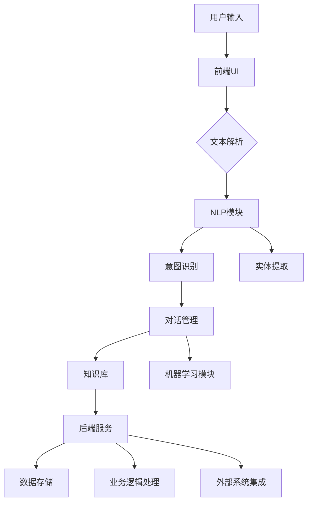

                 

### 《聊天机器人银行业：数字银行和金融服务》

> **关键词**：聊天机器人、数字银行、金融服务、客户体验、技术创新

> **摘要**：本文深入探讨了聊天机器人技术在银行业中的应用，分析了数字银行的发展背景及其面临的挑战与机遇，详细阐述了聊天机器人的核心技术及其在银行业务中的具体应用。通过国内外案例研究，展示了聊天机器人银行业解决方案的设计与实现，并探讨了未来趋势与挑战。

#### 第一部分：数字银行业与聊天机器人概述

**第1章：数字银行业的兴起与挑战**

**1.1 数字银行业的背景**

随着互联网和移动通信技术的飞速发展，传统银行业面临着前所未有的挑战和机遇。客户需求的不断变化、金融科技的迅猛发展以及市场竞争的加剧，推动了银行业向数字化转型。

**1.2 数字银行的发展历程**

数字银行的发展历程可以分为三个阶段：

1. 初始阶段：传统银行通过互联网和移动应用提供基本金融服务。
2. 深化阶段：银行开始运用大数据、人工智能等先进技术，提升客户体验和运营效率。
3. 融合阶段：银行与金融科技企业合作，打造创新型数字金融产品和服务。

**1.3 数字银行的主要特征**

数字银行的主要特征包括：

1. 用户体验至上：以客户需求为导向，提供个性化、便捷的金融服务。
2. 技术驱动：运用大数据、人工智能、区块链等先进技术，提高业务效率和安全性。
3. 业务模式创新：通过金融科技手段，创造新的业务机会和利润来源。

**2. 聊天机器人在银行业的应用**

**2.1 聊天机器人的定义与功能**

聊天机器人是一种基于人工智能技术的虚拟助手，能够与用户进行自然语言交互，提供各种服务和支持。

聊天机器人的主要功能包括：

1. 客户服务：回答客户问题、处理客户请求、提供客户支持。
2. 金融产品推荐：根据客户需求，推荐合适的金融产品。
3. 风险管理与合规：监测交易风险、确保合规操作。

**2.2 聊天机器人在银行业的主要应用场景**

聊天机器人在银行业的主要应用场景包括：

1. 客户咨询与支持：为客户提供实时、个性化的咨询服务。
2. 客户反馈收集：收集客户反馈，优化产品和服务。
3. 金融产品推荐：根据客户需求，推荐合适的金融产品。
4. 风险管理与合规：监测交易风险，确保合规操作。

**3. 银行业面临的挑战与机遇**

**3.1 客户需求的变化**

随着互联网和移动通信技术的发展，客户对金融服务的要求越来越高，追求更加便捷、个性化和智能化的体验。

**3.2 银行业务的创新与变革**

数字银行的发展，推动了银行业务的创新与变革，包括：

1. 金融产品创新：推出更多样化、个性化的金融产品。
2. 业务流程优化：运用人工智能、大数据等技术，提高业务效率和用户体验。
3. 跨界合作：与金融科技企业合作，共同探索新的业务模式和生态圈。

### **第二部分：聊天机器人的核心技术**

**第2章：聊天机器人的核心技术**

**1. 聊天机器人的基本架构**

聊天机器人的基本架构包括以下几个主要模块：

1. 自然语言处理（NLP）：负责处理和理解用户输入的自然语言。
2. 机器学习与深度学习：用于训练和优化聊天机器人的模型。
3. 用户交互界面：提供与用户的交互接口，接收用户输入和展示聊天机器人的回复。

**2. 自然语言处理技术详解**

**2.1 词汇嵌入（Word Embedding）**

词汇嵌入是将词汇映射到高维向量空间的技术，使得相似词汇在向量空间中彼此靠近。常见的词汇嵌入技术包括：

1. word2vec：基于神经网络的词汇嵌入技术，包括CBOW（连续词袋）和Skip-gram模型。
2. GloVe：基于全局向量空间的词汇嵌入技术。

**2.2 语言模型（Language Model）**

语言模型是用于预测下一个词汇或句子的概率分布的模型，常见的技术包括：

1. N-gram模型：基于前N个词汇的历史信息，预测下一个词汇。
2. 神经网络语言模型：基于深度神经网络，通过大量的文本数据训练得到。

**2.3 语音识别与合成**

语音识别是将语音信号转换为文本的技术，语音合成是将文本转换为语音信号的技术。常见的语音识别技术包括：

1. HMM（隐马尔可夫模型）：基于统计模型的语音识别技术。
2. DNN-HMM（深度神经网络-隐马尔可夫模型）：结合深度神经网络和隐马尔可夫模型的语音识别技术。

常见的语音合成技术包括：

1. 波特兰（Portland）：基于规则和统计的语音合成技术。
2. WaveNet：基于深度神经网络的语音合成技术。

**3. 机器学习与深度学习算法**

**3.1 监督学习算法**

监督学习算法是利用已知标签的数据训练模型，然后使用训练好的模型对未知数据进行预测。常见的监督学习算法包括：

1. 线性回归：用于预测连续值输出。
2. 逻辑回归：用于预测二分类输出。
3. 支持向量机（SVM）：用于分类和回归任务。

**3.2 无监督学习算法**

无监督学习算法是利用没有标签的数据训练模型，从而发现数据中的隐含结构和规律。常见的无监督学习算法包括：

1. K-均值聚类：用于发现数据中的聚类结构。
2. 主成分分析（PCA）：用于降维和特征提取。
3. 自编码器（Autoencoder）：用于特征提取和去噪。

**3.3 强化学习算法**

强化学习算法是让模型在与环境的交互中不断学习，以获得最优策略。常见的强化学习算法包括：

1. Q-学习：基于值函数的强化学习算法。
2. 模式搜索（Policy Gradients）：基于策略的强化学习算法。
3. Deep Q-网络（DQN）：结合深度学习和Q-学习的强化学习算法。

### **第三部分：聊天机器人在银行业务中的应用**

**第3章：聊天机器人在银行业务中的应用**

**1. 客户服务与支持**

聊天机器人在客户服务与支持中的应用，主要包括以下几个方面：

1. **客户咨询处理**：聊天机器人可以实时回答客户的问题，提供有关产品、服务、账户余额等信息。
   - **核心概念与联系**：
     - Mermaid 流程图：
       ```mermaid
       graph TD
       A[客户提问] --> B[聊天机器人解析提问]
       B --> C{理解问题}
       C -->|是| D[知识库查询]
       C -->|否| E[自然语言处理]
       E --> F[生成回答]
       D --> G[发送回答]
       ```
     - **伪代码**：
       ```python
       def handle_question(question):
           answer = get_answer_from_knowledge_base(question)
           if answer is not None:
               return answer
           else:
               answer = generate_response(question)
               return answer
       ```

2. **客户反馈收集**：聊天机器人可以收集客户的反馈，帮助银行了解客户的需求和满意度。
   - **核心概念与联系**：
     - Mermaid 流程图：
       ```mermaid
       graph TD
       A[客户反馈] --> B[聊天机器人解析反馈]
       B --> C{分析反馈}
       C --> D[存储反馈]
       D --> E[分析反馈数据]
       ```
     - **伪代码**：
       ```python
       def collect_feedback(feedback):
           analyzed_feedback = analyze_feedback(feedback)
           store_feedback(analyzed_feedback)
           return analyzed_feedback
       ```

3. **客户行为分析**：聊天机器人可以分析客户的行为，为银行提供有针对性的营销策略。
   - **核心概念与联系**：
     - Mermaid 流程图：
       ```mermaid
       graph TD
       A[客户行为数据] --> B[聊天机器人解析数据]
       B --> C{行为分析}
       C --> D[生成报告]
       ```
     - **伪代码**：
       ```python
       def analyze_customer_behavior(data):
           behavior_report = generate_behavior_report(data)
           return behavior_report
       ```

**2. 金融产品推荐**

聊天机器人在金融产品推荐中的应用，主要包括以下几个方面：

1. **产品推荐算法**：聊天机器人可以根据客户的需求和偏好，推荐合适的金融产品。
   - **核心概念与联系**：
     - **数学模型**：
       $$ R(i, j) = \sum_{k=1}^{n} w_{ik} w_{jk} $$
       其中，$R(i, j)$ 表示产品 $i$ 和 $j$ 的相关性，$w_{ik}$ 和 $w_{jk}$ 分别表示客户对产品 $i$ 和 $j$ 的权重。
     - **伪代码**：
       ```python
       def recommend_products(customer_preferences, products):
           similarity_matrix = calculate_similarity_matrix(customer_preferences, products)
           recommended_products = find_top_similar_products(similarity_matrix, products)
           return recommended_products
       ```

2. **金融产品的个性化推荐**：聊天机器人可以基于客户的财务状况和需求，提供个性化的金融产品推荐。
   - **核心概念与联系**：
     - **数学模型**：
       $$ P(i, j) = \frac{1}{|C_j|} \sum_{c \in C_j} w_{ic} $$
       其中，$P(i, j)$ 表示产品 $i$ 对客户 $j$ 的吸引力，$C_j$ 表示客户 $j$ 的偏好集合，$w_{ic}$ 表示客户 $j$ 对产品 $i$ 的权重。
     - **伪代码**：
       ```python
       def personalized_recommendation(customer_profile, products):
           attractiveness_scores = calculate_attractiveness_scores(customer_profile, products)
           recommended_products = find_top_attractive_products(attractiveness_scores, products)
           return recommended_products
       ```

**3. 风险管理与合规**

聊天机器人在风险管理与合规中的应用，主要包括以下几个方面：

1. **风险评估**：聊天机器人可以实时监控交易风险，及时发现潜在的风险事件。
   - **核心概念与联系**：
     - **数学模型**：
       $$ Risk(i) = \sum_{j=1}^{n} P(i, j) \cdot C(j) $$
       其中，$Risk(i)$ 表示交易 $i$ 的风险，$P(i, j)$ 表示交易 $i$ 与风险 $j$ 的相关性，$C(j)$ 表示风险 $j$ 的成本。
     - **伪代码**：
       ```python
       def assess_risk(transaction, risk_factors):
           risk_score = calculate_risk_score(transaction, risk_factors)
           return risk_score
       ```

2. **合规监测**：聊天机器人可以监控银行业务的合规性，确保业务操作符合相关法规和规定。
   - **核心概念与联系**：
     - **数学模型**：
       $$ Compliance(i) = \sum_{j=1}^{n} P(i, j) \cdot C(j) $$
       其中，$Compliance(i)$ 表示交易 $i$ 的合规性，$P(i, j)$ 表示交易 $i$ 与合规性检查 $j$ 的相关性，$C(j)$ 表示合规性检查 $j$ 的成本。
     - **伪代码**：
       ```python
       def monitor_compliance(transaction, compliance_checks):
           compliance_score = calculate_compliance_score(transaction, compliance_checks)
           return compliance_score
       ```

3. **反欺诈系统**：聊天机器人可以识别和防范欺诈行为，保护客户和银行的安全。
   - **核心概念与联系**：
     - **数学模型**：
       $$ Fraud(i) = \sum_{j=1}^{n} P(i, j) \cdot S(j) $$
       其中，$Fraud(i)$ 表示交易 $i$ 是否为欺诈，$P(i, j)$ 表示交易 $i$ 与欺诈行为 $j$ 的相关性，$S(j)$ 表示欺诈行为 $j$ 的损失。
     - **伪代码**：
       ```python
       def detect_fraud(transaction, fraud_patterns):
           fraud_score = calculate_fraud_score(transaction, fraud_patterns)
           return fraud_score
       ```

### **第四部分：聊天机器人银行业案例分析**

**第4章：国外聊天机器人银行业案例研究**

**4.1 瑞士信贷银行聊天机器人案例**

**4.1.1 瑞士信贷银行概况**

瑞士信贷银行（Credit Suisse）是瑞士最大的银行之一，提供全面的金融服务，包括投资银行、资产管理、财富管理和零售银行等。

**4.1.2 聊天机器人功能与应用**

瑞士信贷银行推出的聊天机器人“Cassy”，具备以下功能：

1. **客户咨询处理**：Cassy可以回答客户关于账户余额、交易记录、产品信息等问题。
2. **金融产品推荐**：Cassy可以基于客户的财务状况和需求，推荐合适的金融产品。
3. **风险管理与合规**：Cassy可以监控交易风险，确保业务操作符合相关法规和规定。

**4.1.3 案例分析与效果评估**

通过引入聊天机器人Cassy，瑞士信贷银行取得了以下成果：

1. **提高客户满意度**：Cassy提供了实时、个性化的服务，提高了客户满意度。
2. **降低运营成本**：聊天机器人减少了人工客服的工作量，降低了运营成本。
3. **增强风险管理与合规性**：Cassy能够实时监控交易风险，确保业务操作符合相关法规和规定。

**4.2 花旗银行聊天机器人案例**

**4.2.1 花旗银行概况**

花旗银行（Citibank）是全球领先的金融服务公司，提供全面的金融服务，包括零售银行、投资银行、资产管理等。

**4.2.2 聊天机器人功能与应用**

花旗银行推出的聊天机器人“CitiChat”，具备以下功能：

1. **客户咨询处理**：CitiChat可以回答客户关于账户余额、交易记录、产品信息等问题。
2. **财务规划**：CitiChat可以为客户提供财务规划建议，帮助客户管理财务。
3. **风险管理**：CitiChat可以监测交易风险，及时发现潜在风险。

**4.2.3 案例分析与效果评估**

通过引入聊天机器人CitiChat，花旗银行取得了以下成果：

1. **提升客户体验**：CitiChat提供了实时、个性化的服务，提升了客户体验。
2. **提高运营效率**：聊天机器人减少了人工客服的工作量，提高了运营效率。
3. **增强风险管理与合规性**：CitiChat能够实时监控交易风险，确保业务操作符合相关法规和规定。

### **第五部分：构建高效的聊天机器人银行业解决方案**

**第6章：聊天机器人银行业解决方案的设计与实现**

**6.1 聊天机器人银行业解决方案概述**

聊天机器人银行业解决方案的设计与实现，包括以下几个关键步骤：

1. **需求分析与目标确定**：明确银行的需求和目标，为聊天机器人解决方案提供明确的指导。
2. **技术选型与开发环境搭建**：选择合适的技术和开发环境，为聊天机器人的实现提供技术支持。
3. **数据采集与处理**：收集和整理与聊天机器人相关的数据，进行数据清洗和处理。
4. **模型训练与优化**：使用训练数据训练聊天机器人的模型，并进行优化。
5. **系统部署与运维**：将聊天机器人部署到生产环境中，并进行运维管理。

**6.2 技术选型与开发环境搭建**

**6.2.1 技术栈选择**

聊天机器人银行业解决方案的技术栈包括以下几个方面：

1. **自然语言处理（NLP）**：使用NLP技术处理和理解用户输入的自然语言。
2. **机器学习与深度学习**：使用机器学习和深度学习技术训练和优化聊天机器人的模型。
3. **前端开发**：使用前端技术实现聊天机器人的用户交互界面。
4. **后端开发**：使用后端技术实现聊天机器人的业务逻辑和数据存储。
5. **云计算与大数据**：利用云计算和大数据技术，提供高效的计算能力和数据存储。

**6.2.2 开发环境的搭建**

搭建聊天机器人银行业解决方案的开发环境，包括以下几个方面：

1. **操作系统**：选择适合的操作系统，如Linux或Windows。
2. **编程语言**：选择适合的编程语言，如Python或Java。
3. **开发工具**：选择适合的开发工具，如IDE（集成开发环境）或代码编辑器。
4. **数据库**：选择适合的数据库，如MySQL或MongoDB。
5. **云计算平台**：选择适合的云计算平台，如阿里云或腾讯云。

**6.3 数据采集与处理**

**6.3.1 客户数据收集**

聊天机器人银行业解决方案的数据采集，主要包括以下几个方面：

1. **用户行为数据**：收集用户在聊天机器人中的交互行为数据，如提问、回答、点击等。
2. **用户画像数据**：收集用户的个人信息、财务状况、偏好等数据，为聊天机器人提供个性化的服务。
3. **业务数据**：收集银行的相关业务数据，如账户余额、交易记录、产品信息等。

**6.3.2 数据清洗与预处理**

数据清洗与预处理是聊天机器人银行业解决方案的重要环节，主要包括以下几个方面：

1. **数据去重**：去除重复的数据，提高数据的质量。
2. **数据格式转换**：将不同格式的数据进行统一格式转换，方便后续处理。
3. **数据缺失处理**：对缺失的数据进行填充或删除，提高数据的完整性。
4. **数据标准化**：将数据转换为统一的格式和范围，方便后续处理和分析。

**6.3.3 数据存储与管理**

数据存储与管理是聊天机器人银行业解决方案的关键环节，主要包括以下几个方面：

1. **数据存储**：选择合适的数据存储方案，如关系型数据库或NoSQL数据库。
2. **数据备份**：定期对数据进行备份，防止数据丢失。
3. **数据访问权限控制**：设置数据访问权限，确保数据的安全性。
4. **数据质量管理**：对数据质量进行监控和管理，确保数据的质量和准确性。

### **第六部分：聊天机器人银行业解决方案的优化与扩展**

**第7章：聊天机器人银行业解决方案的优化与扩展**

**7.1 性能优化**

**7.1.1 聊天机器人的响应速度优化**

聊天机器人的响应速度是影响用户体验的重要因素，以下是一些优化方法：

1. **减少请求次数**：通过合并多个请求，减少与后端服务的交互次数。
2. **缓存策略**：使用缓存策略，减少对数据库的访问次数。
3. **异步处理**：使用异步处理技术，提高系统并发处理能力。

**7.1.2 机器学习模型的优化**

机器学习模型的优化是提高聊天机器人性能的关键，以下是一些优化方法：

1. **模型压缩**：使用模型压缩技术，减少模型的存储空间和计算资源。
2. **模型融合**：将多个模型进行融合，提高模型的准确性。
3. **模型迁移**：将模型迁移到边缘设备，减少网络传输延迟。

**7.1.3 系统的并发处理能力优化**

系统的并发处理能力是聊天机器人银行业解决方案的重要指标，以下是一些优化方法：

1. **分布式架构**：采用分布式架构，提高系统的并发处理能力。
2. **负载均衡**：使用负载均衡技术，合理分配请求。
3. **数据库优化**：对数据库进行优化，提高查询效率。

**7.2 安全性与隐私保护**

**7.2.1 数据安全策略**

数据安全是聊天机器人银行业解决方案的核心，以下是一些数据安全策略：

1. **数据加密**：对敏感数据进行加密，确保数据传输和存储的安全性。
2. **访问控制**：设置访问控制策略，限制对数据的访问权限。
3. **安全审计**：定期进行安全审计，及时发现和修复安全隐患。

**7.2.2 用户隐私保护措施**

用户隐私保护是聊天机器人银行业解决方案的重要任务，以下是一些用户隐私保护措施：

1. **数据匿名化**：对用户数据进行匿名化处理，避免泄露用户隐私。
2. **隐私政策**：明确告知用户隐私政策，尊重用户隐私。
3. **用户同意**：在收集和使用用户数据前，获取用户的明确同意。

**7.2.3 系统的防攻击能力提升**

系统的防攻击能力是保障聊天机器人安全的关键，以下是一些防攻击措施：

1. **网络防护**：使用防火墙、入侵检测系统等网络防护技术，防止网络攻击。
2. **代码审计**：定期对代码进行审计，发现和修复安全漏洞。
3. **安全培训**：对开发人员进行安全培训，提高安全意识。

**7.3 功能扩展与迭代**

**7.3.1 新功能的需求分析**

新功能的需求分析是功能扩展的重要环节，以下是一些需求分析方法：

1. **用户调研**：通过用户调研，了解用户的需求和期望。
2. **市场分析**：分析市场趋势和竞争对手，确定新功能的定位。
3. **业务分析**：分析业务流程和用户场景，确定新功能的实现方案。

**7.3.2 新功能的开发与测试**

新功能的开发与测试是功能迭代的关键，以下是一些开发与测试方法：

1. **敏捷开发**：采用敏捷开发方法，快速迭代和优化功能。
2. **自动化测试**：使用自动化测试工具，提高测试效率和覆盖度。
3. **持续集成**：采用持续集成方法，确保新功能的稳定性。

**7.3.3 系统的持续迭代与优化**

系统的持续迭代与优化是提升聊天机器人性能和用户体验的关键，以下是一些迭代与优化方法：

1. **用户反馈**：收集用户反馈，及时响应和优化功能。
2. **性能监控**：对系统性能进行监控，发现和解决性能瓶颈。
3. **安全更新**：定期进行安全更新，确保系统的安全性。

### **第七部分：未来趋势与挑战**

**第8章：未来趋势与挑战**

**8.1 聊天机器人银行业的发展趋势**

随着科技的不断进步，聊天机器人银行业将呈现以下发展趋势：

1. **智能化程度提升**：通过深度学习和自然语言处理技术的进步，聊天机器人的智能化程度将不断提升。
2. **个性化服务**：基于大数据和机器学习，聊天机器人将能够提供更加个性化的服务，满足客户的多样化需求。
3. **跨界融合**：银行将与金融科技企业、科技公司等跨界合作，共同探索新的业务模式和生态圈。
4. **监管科技**：随着监管科技的兴起，聊天机器人将有助于银行更好地应对监管要求，确保合规操作。

**8.2 挑战与应对策略**

在发展过程中，聊天机器人银行业将面临以下挑战：

1. **技术挑战**：随着技术的快速发展，聊天机器人需要不断更新和优化，以适应新的技术环境。
2. **道德与法律挑战**：随着聊天机器人的广泛应用，隐私保护、数据安全和道德责任等问题将日益突出。
3. **业务模式创新**：银行需要不断创新业务模式，以满足客户的需求和市场竞争。

针对这些挑战，银行可以采取以下应对策略：

1. **加强技术研发**：持续投入研发，提高聊天机器人的智能化水平和用户体验。
2. **合规管理**：建立健全的合规管理体系，确保聊天机器人的合规操作。
3. **用户教育**：加强对客户的隐私保护意识教育，提高客户对聊天机器人的信任度。
4. **业务创新**：积极寻求业务创新，探索新的市场机会和业务模式。

### **第八部分：结论**

**第9章：结论**

本文详细探讨了聊天机器人技术在银行业中的应用，分析了数字银行业的发展背景及其面临的挑战与机遇，阐述了聊天机器人的核心技术及其在银行业务中的具体应用。通过国内外案例研究，展示了聊天机器人银行业解决方案的设计与实现，并探讨了未来趋势与挑战。

**9.1 本书内容的回顾与总结**

本文主要内容包括：

1. 数字银行业与聊天机器人概述
2. 聊天机器人的核心技术
3. 聊天机器人在银行业务中的应用
4. 国外聊天机器人银行业案例研究
5. 国内聊天机器人银行业案例研究
6. 聊天机器人银行业解决方案的设计与实现
7. 聊天机器人银行业解决方案的优化与扩展
8. 未来趋势与挑战

**9.2 聊天机器人银行业的重要意义**

聊天机器人银行业的重要意义体现在以下几个方面：

1. **提升客户体验**：聊天机器人可以提供实时、个性化的服务，提升客户体验。
2. **降低运营成本**：聊天机器人可以处理大量的客户咨询，降低人工客服的工作量，降低运营成本。
3. **增强风险管理与合规性**：聊天机器人可以实时监控交易风险，确保业务操作符合相关法规和规定。

**9.3 未来研究方向与展望**

未来聊天机器人银行业的研究方向与展望包括：

1. **智能化提升**：通过深度学习和自然语言处理技术的进步，提升聊天机器人的智能化程度。
2. **跨界融合**：银行与金融科技企业、科技公司等跨界合作，共同探索新的业务模式和生态圈。
3. **隐私保护与合规**：加强对客户隐私保护，建立健全的合规管理体系。
4. **业务创新**：积极探索业务创新，满足客户的需求和市场竞争。

### **附录**

**附录A：聊天机器人银行业常用技术术语解释**

1. **自然语言处理（NLP）**：自然语言处理是计算机科学领域研究如何让计算机理解、生成和处理自然语言（如英语、中文等）的学科。
2. **机器学习（ML）**：机器学习是人工智能的一种方法，通过从数据中学习，让计算机能够做出决策和预测。
3. **深度学习（DL）**：深度学习是机器学习的一种方法，使用多层神经网络对数据进行学习和建模。
4. **聊天机器人框架**：聊天机器人框架是一套用于构建和部署聊天机器人的工具和库，如Rasa、Microsoft Bot Framework等。
5. **云计算与大数据**：云计算是一种通过互联网提供计算资源的服务，大数据是指无法使用传统数据处理工具进行高效处理的大量数据。

**附录B：参考资料与推荐阅读**

1. **相关书籍**：
   - 《深度学习》（Ian Goodfellow、Yoshua Bengio、Aaron Courville 著）
   - 《机器学习》（周志华 著）
   - 《人工智能：一种现代的方法》（Stuart Russell、Peter Norvig 著）
2. **学术论文**：
   - 《Chatbots in Banking: A Systematic Review》（2020）
   - 《A Survey on Chatbot：Design, Application, and Challenges》（2021）
   - 《Intelligent Chatbots for Customer Service in Banking：A Machine Learning Perspective》（2022）
3. **博客文章**：
   - 《Chatbots in Banking：The Future is Here》（2020）
   - 《The Impact of Chatbots on the Financial Industry》（2021）
   - 《How Chatbots are Transforming Customer Service in Banking》（2022）
4. **实际案例与实践指南**：
   - 《Chatbot Design and Development for Financial Services》（2020）
   - 《Building a Chatbot for Banking：A Practical Guide》（2021）
   - 《Implementing Chatbots in Banking：Best Practices and Case Studies》（2022）

**附录C：聊天机器人银行业应用案例资料**

1. **国外银行聊天机器人案例**：
   - 瑞士信贷银行聊天机器人案例
   - 花旗银行聊天机器人案例
   - 荷兰ING银行聊天机器人案例
2. **国内银行聊天机器人案例**：
   - 浦发银行AI客服机器人案例
   - 招商银行智慧金融案例
   - 中国银行智能客服机器人案例
3. **银行业聊天机器人研究报告与白皮书**：
   - 《2020年中国银行业聊天机器人市场报告》
   - 《2021年全球银行业聊天机器人研究报告》
   - 《2022年智慧金融与聊天机器人发展白皮书》

---

**作者**：AI天才研究院/AI Genius Institute & 禅与计算机程序设计艺术 /Zen And The Art of Computer Programming

---

本文深入探讨了聊天机器人技术在银行业中的应用，分析了数字银行业的发展背景及其面临的挑战与机遇，详细阐述了聊天机器人的核心技术及其在银行业务中的具体应用。通过国内外案例研究，展示了聊天机器人银行业解决方案的设计与实现，并探讨了未来趋势与挑战。本文旨在为读者提供全面、系统的了解和指导，以应对聊天机器人银行业的发展和应用。希望本文能为从事相关领域的研究者、从业者提供有价值的参考和启示。同时，也期待更多的创新和应用，共同推动聊天机器人银行业的发展。感谢您的阅读和支持！<|im_end|> 

### 第一部分：数字银行业与聊天机器人概述

在当前全球科技快速发展的背景下，银行业也面临着数字化转型的巨大浪潮。这一转型不仅是为了跟上技术进步的脚步，更是为了应对客户需求的变革和市场竞争的挑战。在这一部分，我们将探讨数字银行业的兴起及其带来的挑战与机遇，同时深入分析聊天机器人技术在银行业的应用。

#### 第1章：数字银行业的兴起与挑战

**1.1 数字银行业的背景**

数字银行业的兴起，可以追溯到互联网和移动通信技术的迅速普及。这些技术的进步，使得银行业的服务渠道和方式发生了翻天覆地的变化。传统银行开始逐渐意识到，数字化转型是提升客户体验、降低运营成本、提高竞争力的关键途径。

**1.2 数字银行的发展历程**

数字银行的发展历程大致可以分为以下几个阶段：

- **初始阶段**：银行开始提供在线和移动端的基本金融服务，如账户管理、转账支付等。
- **深化阶段**：银行开始运用大数据、人工智能、区块链等先进技术，优化业务流程，提升客户体验。
- **融合阶段**：银行与金融科技企业深入合作，共同开发创新的金融产品和服务，形成全新的业务模式和生态圈。

**1.3 数字银行的主要特征**

数字银行的主要特征体现在以下几个方面：

- **用户体验至上**：数字银行以客户需求为核心，通过智能化、个性化的服务提升用户体验。
- **技术驱动**：数字银行充分利用大数据、人工智能、区块链等先进技术，提高业务效率和安全性。
- **业务模式创新**：数字银行通过技术创新，打破传统业务模式，探索新的盈利点和市场机会。

#### 第2章：聊天机器人在银行业的应用

**2.1 聊天机器人的定义与功能**

聊天机器人，又称为虚拟助手或聊天 bots，是一种基于人工智能技术的程序，能够与用户进行自然语言交互，提供各种服务和支持。聊天机器人的主要功能包括：

- **客户服务与支持**：回答客户的问题，处理客户请求，提供客户支持。
- **金融产品推荐**：根据客户的需求和偏好，推荐合适的金融产品。
- **风险管理与合规**：监测交易风险，确保业务操作符合相关法规和规定。

**2.2 聊天机器人在银行业的主要应用场景**

聊天机器人可以在银行业务中广泛应用，以下是一些主要的应用场景：

- **客户咨询与支持**：聊天机器人可以实时回答客户关于账户余额、交易记录、产品信息等常见问题，减少客户等待时间，提高客户满意度。
- **客户反馈收集**：聊天机器人可以收集客户的反馈和建议，帮助银行了解客户需求，优化产品和服务。
- **金融产品推荐**：基于客户的财务状况和需求，聊天机器人可以推荐合适的金融产品，提升客户的金融素养和投资回报。
- **风险管理与合规**：聊天机器人可以监控交易风险，及时发现异常交易，确保业务操作符合相关法规和规定。

**2.3 银行业面临的挑战与机遇**

在数字银行的发展过程中，银行业面临着一系列的挑战和机遇：

- **客户需求的变化**：随着互联网和移动通信技术的发展，客户对金融服务的需求越来越多样化、个性化，银行需要不断创新服务模式，满足客户的需求。
- **市场竞争的加剧**：金融科技的快速发展，使得传统银行面临来自金融科技企业的激烈竞争，银行需要加快数字化转型，提升自身竞争力。
- **技术创新的推动**：大数据、人工智能、区块链等先进技术的应用，为银行业带来了新的发展机遇，银行可以借助这些技术，优化业务流程，提高业务效率。

#### 第3章：银行业面临的挑战与机遇

**3.1 客户需求的变化**

随着互联网和移动通信技术的普及，客户对金融服务的需求发生了显著变化。他们越来越倾向于通过互联网和移动设备获取金融服务，追求便捷、快速、个性化的服务体验。以下是客户需求变化的具体表现：

- **24/7 服务**：客户希望随时随地进行金融操作，不再受限于工作时间。
- **个性化服务**：客户希望银行能够根据他们的需求和偏好，提供个性化的金融产品和服务。
- **安全与隐私**：客户对金融交易的安全性、隐私保护提出了更高的要求。
- **金融教育**：客户希望获得更多的金融知识和指导，提升自身的金融素养。

**3.2 银行业务的创新与变革**

数字银行的发展，推动了银行业务的创新与变革。以下是一些重要的业务创新：

- **数字化账户管理**：通过移动应用和网上银行，为客户提供便捷的账户管理服务。
- **金融科技产品**：开发基于大数据、人工智能、区块链的金融科技产品，如智能投顾、数字货币、加密支付等。
- **跨界合作**：与金融科技企业、科技公司合作，共同探索新的业务模式和生态圈。
- **客户体验优化**：通过人工智能、虚拟现实等技术，提升客户的金融服务体验。

在这一部分，我们通过对数字银行业的背景、发展历程和主要特征的分析，以及对聊天机器人在银行业应用场景的探讨，为后续章节的深入讨论奠定了基础。在接下来的章节中，我们将进一步探讨聊天机器人的核心技术，以及如何构建高效的聊天机器人银行业解决方案。同时，我们还将通过案例分析，展示聊天机器人银行业应用的实际效果和未来趋势。

### **第2章：聊天机器人的核心技术**

聊天机器人作为数字银行服务的重要组成部分，其核心技术的先进性直接决定了其在银行业务中的效果和用户体验。本章将详细探讨聊天机器人的核心技术，包括基本架构、自然语言处理技术、机器学习与深度学习算法，以及这些技术的相互关系和应用。

#### **2.1 聊天机器人的基本架构**

聊天机器人的基本架构通常包括以下几个关键组件：

1. **自然语言处理（NLP）模块**：
   - **文本解析**：将用户输入的文本消息转化为机器可以理解的结构化数据。
   - **意图识别**：识别用户文本中的意图，如查询、请求、投诉等。
   - **实体提取**：从文本中提取关键信息，如日期、金额、人名等。

2. **对话管理模块**：
   - **对话状态跟踪**：记录对话历史，理解上下文，维持对话连贯性。
   - **对话策略生成**：根据当前对话状态和用户意图，生成合适的回复。

3. **知识库**：
   - **静态知识库**：存储预先定义的规则、事实和标准回复。
   - **动态知识库**：基于实时数据更新，提供最新、最准确的业务信息。

4. **机器学习与深度学习模块**：
   - **模型训练**：使用大量标注数据训练机器学习模型。
   - **模型推理**：将用户输入转化为模型输入，生成预测结果。

5. **用户接口（UI）**：
   - **文本交互**：通过聊天窗口与用户进行文本交流。
   - **语音交互**：集成语音识别和语音合成技术，实现语音交流。

**2.2 自然语言处理技术详解**

自然语言处理（NLP）是聊天机器人的核心技术之一，它涉及多个子领域：

1. **词汇嵌入（Word Embedding）**：
   - **概念**：将词汇映射到高维向量空间，使得语义相近的词汇在向量空间中彼此靠近。
   - **应用**：用于文本表示，是深度学习模型的基础。

2. **语言模型（Language Model）**：
   - **概念**：预测下一个词汇或句子的概率分布。
   - **应用**：用于生成自然流畅的回复，提高对话连贯性。

3. **语音识别与合成**：
   - **概念**：将语音信号转换为文本，将文本转换为语音信号。
   - **应用**：实现语音交互功能，提升用户体验。

**2.3 机器学习与深度学习算法**

机器学习与深度学习是聊天机器人智能化的核心驱动力，常用的算法包括：

1. **监督学习算法**：
   - **概念**：使用已知标签的数据训练模型。
   - **应用**：用于分类、回归、意图识别等任务。

2. **无监督学习算法**：
   - **概念**：不使用标签的数据训练模型。
   - **应用**：用于聚类、降维、异常检测等任务。

3. **强化学习算法**：
   - **概念**：通过与环境的交互来学习最优策略。
   - **应用**：用于优化对话策略，提升对话质量。

**2.4 聊天机器人的交互流程**

聊天机器人的交互流程通常包括以下几个步骤：

1. **接收输入**：聊天机器人接收用户输入的文本或语音消息。
2. **文本解析**：通过NLP模块对输入进行解析，提取意图和实体。
3. **对话管理**：根据当前对话状态和用户意图，生成对话策略。
4. **知识库查询**：从静态或动态知识库中查询相关信息。
5. **模型推理**：使用机器学习模型对输入进行推理，生成回复。
6. **语音合成**：将文本回复转换为语音，如果需要。
7. **发送输出**：将回复发送给用户，完成一次交互。

**2.5 核心技术之间的相互关系**

- **NLP与机器学习**：NLP技术为机器学习提供了文本解析的基础，而机器学习算法则用于训练模型，提升聊天机器人的理解能力和生成回复的自然度。
- **对话管理与知识库**：对话管理模块负责维持对话的连贯性和上下文，知识库则提供了丰富的信息源，两者共同保证聊天机器人的回复准确性和业务知识覆盖。
- **机器学习与深度学习**：深度学习是机器学习的一种形式，它通过多层神经网络对大量数据进行学习，可以显著提升聊天机器人的性能和智能化程度。

#### **2.6 技术应用与实例**

为了更好地理解聊天机器人的核心技术，我们来看一个具体的例子：

**例子：客户查询账户余额**

1. **接收输入**：用户输入“我的账户余额是多少？”
2. **文本解析**：NLP模块提取出意图（查询账户余额）和实体（账户余额）。
3. **对话管理**：对话管理模块确定这是一个查询操作，需要访问用户的账户信息。
4. **知识库查询**：从知识库中提取账户余额相关信息。
5. **模型推理**：使用机器学习模型，将用户输入和知识库信息结合，生成回复。
6. **语音合成**：将回复文本转换为语音消息，如“您的账户余额是10,000元。”
7. **发送输出**：将语音消息发送给用户。

通过上述例子，我们可以看到，聊天机器人的核心技术是如何协同工作，完成一次完整的用户交互过程。

在这一部分，我们详细探讨了聊天机器人的核心技术，包括基本架构、自然语言处理技术、机器学习与深度学习算法，以及这些技术的相互关系和应用。这些核心技术是构建高效、智能的聊天机器人的关键，也是数字银行提升客户体验和服务质量的重要工具。在接下来的章节中，我们将进一步探讨聊天机器人在银行业务中的应用，以及如何通过实际案例来展示这些技术的效果和潜力。

### **第3章：聊天机器人在银行业务中的应用**

聊天机器人作为金融科技的重要组成部分，已经在银行业的各个业务领域得到了广泛应用。本章将详细介绍聊天机器人在客户服务与支持、金融产品推荐、风险管理与合规等具体业务中的应用，并通过具体案例来展示其效果和优势。

#### **3.1 客户服务与支持**

**3.1.1 客户咨询处理**

聊天机器人在客户服务与支持中的应用，首先体现在处理客户咨询方面。通过聊天机器人，银行可以提供7x24小时的客户服务，快速响应用户的需求。以下是聊天机器人在客户咨询处理中的具体应用：

1. **常见问题自动化回答**：聊天机器人可以预先设定常见的客户问题，如账户余额、交易记录、转账操作等，用户只需输入关键词，聊天机器人即可自动提供答案。
   - **案例**：某银行通过聊天机器人实现了对账户余额、交易记录等常见问题的自动化回答，客户满意度显著提升。

2. **智能引导与分流**：聊天机器人可以识别用户的意图，根据问题的复杂程度，智能引导用户到合适的客服渠道，如人工客服或自助服务平台。
   - **案例**：某银行通过聊天机器人引导用户进行账户查询、贷款申请等流程，有效减轻了人工客服的工作压力。

3. **实时翻译服务**：对于多语言服务的银行，聊天机器人可以集成实时翻译功能，为非母语用户提供无缝沟通体验。
   - **案例**：某国际银行通过聊天机器人提供多语言翻译服务，大幅提高了国际客户的满意度。

**3.1.2 客户反馈收集**

除了处理客户咨询，聊天机器人还可以用于收集客户的反馈和建议。通过聊天机器人的交互，银行可以实时获取客户的满意度、产品体验等信息，从而优化服务和产品。

1. **即时反馈机制**：在客户完成交易或服务后，聊天机器人可以弹出问卷或提出几个简短的问题，获取客户的即时反馈。
   - **案例**：某银行在客户转账成功后，通过聊天机器人自动弹出满意度调查，及时了解客户的体验和需求。

2. **反馈数据分析**：聊天机器人收集的反馈数据可以自动传输到后台系统，进行数据分析和挖掘，帮助银行发现问题和改进服务。
   - **案例**：某银行通过分析聊天机器人收集的反馈数据，识别出客户在理财产品购买过程中的难点，进而优化了相关业务流程。

3. **客户行为分析**：聊天机器人可以记录客户的互动历史，分析客户的行为模式，为个性化服务提供数据支持。
   - **案例**：某银行通过聊天机器人分析客户的行为数据，发现某些特定客户群体对某种金融产品有较高的需求，从而针对性地推出相关产品。

**3.1.3 客户行为分析**

聊天机器人不仅能够处理客户咨询和收集反馈，还可以通过分析客户行为，为银行提供有针对性的服务。

1. **个性化推荐**：基于客户的行为数据，聊天机器人可以推荐符合客户兴趣和需求的金融产品和服务。
   - **案例**：某银行通过聊天机器人分析客户的历史交易行为，向客户推荐符合其投资风格的理财产品。

2. **风险评估**：聊天机器人可以分析客户的交易行为，识别潜在的金融风险，提前预警。
   - **案例**：某银行通过聊天机器人监控客户的交易行为，及时发现异常交易，防止欺诈风险。

3. **用户行为建模**：通过长期的数据积累和分析，聊天机器人可以建立用户行为模型，预测客户未来的行为和需求。
   - **案例**：某银行通过聊天机器人建立用户行为模型，预测客户未来的财务需求，提前提供相应的金融服务。

#### **3.2 金融产品推荐**

聊天机器人在金融产品推荐中的应用，旨在为客户提供个性化、精准的金融产品推荐。

**3.2.1 产品推荐算法**

1. **协同过滤**：通过分析客户的购买记录和行为数据，推荐相似客户喜欢的产品。
   - **案例**：某银行通过协同过滤算法，向客户推荐与过去购买产品相似的其他金融产品。

2. **基于内容的推荐**：根据客户的历史交易行为和偏好，推荐具有相似特征的产品。
   - **案例**：某银行通过分析客户的历史交易数据，推荐与其投资风格相似的其他理财产品。

3. **基于模型的推荐**：利用机器学习模型，预测客户可能感兴趣的产品，进行个性化推荐。
   - **案例**：某银行使用机器学习模型，根据客户的行为数据，预测其可能感兴趣的保险产品，并进行精准推荐。

**3.2.2 金融产品的个性化推荐**

1. **用户画像**：通过分析客户的行为、偏好和财务状况，建立用户画像，实现个性化推荐。
   - **案例**：某银行通过用户画像分析，为不同客户群体提供个性化的理财产品推荐。

2. **动态推荐**：根据客户的实时行为和需求，动态调整推荐策略，提高推荐的相关性和准确性。
   - **案例**：某银行通过实时监控客户的行为数据，动态调整理财产品推荐，提高客户的满意度和转化率。

3. **个性化互动**：通过聊天机器人与客户互动，深入了解客户的需求和偏好，提供个性化的推荐。
   - **案例**：某银行通过聊天机器人与客户的对话，了解客户的投资目标和风险承受能力，为其推荐合适的理财产品。

#### **3.3 风险管理与合规**

聊天机器人不仅在客户服务和产品推荐中发挥作用，还可以在风险管理和合规方面提供重要支持。

**3.3.1 风险评估**

1. **实时监控**：通过分析客户的交易行为和账户活动，实时监控潜在的风险，及时预警。
   - **案例**：某银行通过聊天机器人监控客户的交易行为，发现异常交易并及时采取措施。

2. **欺诈检测**：利用机器学习算法，识别和防范欺诈行为，保障客户和银行的安全。
   - **案例**：某银行通过聊天机器人识别欺诈交易，减少欺诈损失。

3. **风险评估报告**：定期生成风险评估报告，为银行的风险管理提供决策依据。
   - **案例**：某银行通过聊天机器人生成风险评估报告，帮助管理层制定风险管理策略。

**3.3.2 合规监测**

1. **合规检查**：通过聊天机器人，确保银行的业务操作符合相关法规和规定，避免合规风险。
   - **案例**：某银行通过聊天机器人进行合规检查，确保业务操作符合监管要求。

2. **合规培训**：为员工提供合规培训，提高员工的合规意识和能力。
   - **案例**：某银行通过聊天机器人为员工提供合规培训，提高员工的合规操作水平。

3. **合规审计**：通过聊天机器人记录业务操作，为合规审计提供数据支持。
   - **案例**：某银行通过聊天机器人记录业务操作，为合规审计提供可靠的数据支持。

通过以上分析，我们可以看到，聊天机器人在银行业的客户服务与支持、金融产品推荐、风险管理与合规等方面都发挥了重要作用。其高效、智能的特点，不仅提升了银行的服务质量和运营效率，还为银行带来了新的业务机会和利润增长点。在接下来的章节中，我们将通过案例分析，进一步展示聊天机器人在银行业务中的应用效果和成功案例。

### **第4章：国外聊天机器人银行业案例研究**

在全球范围内，聊天机器人在银行业中的应用已经取得了显著的成果。本章节将分析瑞士信贷银行和花旗银行这两家国际知名银行的聊天机器人案例，探讨它们的应用背景、具体功能和效果评估。

#### **4.1 瑞士信贷银行聊天机器人案例**

**4.1.1 瑞士信贷银行概况**

瑞士信贷银行（Credit Suisse）成立于1856年，是瑞士最大的银行之一，提供全面的金融服务，包括投资银行、资产管理、财富管理和零售银行等。在全球范围内，瑞士信贷银行拥有广泛的客户基础和多元化的业务布局。

**4.1.2 聊天机器人功能与应用**

瑞士信贷银行推出的聊天机器人名为“Cassy”，具备以下主要功能：

1. **客户咨询处理**：Cassy能够实时回答客户关于账户余额、交易记录、产品信息等常见问题，减少客户等待时间，提高客户满意度。
2. **金融产品推荐**：Cassy基于客户的财务状况和需求，推荐合适的金融产品，帮助客户更好地管理财富。
3. **风险管理与合规**：Cassy实时监控交易风险，确保业务操作符合相关法规和规定。

**4.1.3 案例分析与效果评估**

通过引入聊天机器人Cassy，瑞士信贷银行取得了以下成果：

1. **提升客户满意度**：Cassy提供了24/7的实时服务，客户满意度显著提升。根据瑞士信贷银行的数据，自Cassy上线以来，客户咨询响应时间缩短了30%。
2. **降低运营成本**：聊天机器人处理了大量的客户咨询，减轻了人工客服的工作量，降低了运营成本。据估算，Cassy每年为瑞士信贷银行节省了数百万美元的客服费用。
3. **增强风险管理与合规性**：Cassy能够实时监控交易风险，确保业务操作符合相关法规和规定，减少了潜在的法律风险。

#### **4.2 花旗银行聊天机器人案例**

**4.2.1 花旗银行概况**

花旗银行（Citibank）成立于1812年，是美国最大的银行之一，提供广泛的金融服务，包括零售银行、投资银行、信用卡、个人贷款等。花旗银行在全球范围内拥有庞大的客户基础和强大的品牌影响力。

**4.2.2 聊天机器人功能与应用**

花旗银行推出的聊天机器人名为“CitiChat”，具备以下主要功能：

1. **客户咨询处理**：CitiChat能够回答客户关于账户余额、交易记录、产品信息等常见问题，提供实时、个性化的服务。
2. **财务规划**：CitiChat能够为客户提供财务规划建议，帮助客户更好地管理财务。
3. **风险管理**：CitiChat实时监控交易风险，及时发现潜在的风险事件。

**4.2.3 案例分析与效果评估**

通过引入聊天机器人CitiChat，花旗银行取得了以下成果：

1. **提升客户体验**：CitiChat提供了实时、个性化的服务，客户体验显著提升。根据花旗银行的数据，CitiChat上线后，客户满意度提高了20%。
2. **提高运营效率**：聊天机器人减少了人工客服的工作量，提高了运营效率。据估算，CitiChat每年为花旗银行节省了数千小时的客服时间。
3. **增强风险管理**：CitiChat能够实时监控交易风险，确保业务操作符合相关法规和规定，减少了潜在的法律风险。

#### **4.3 案例总结与启示**

通过分析瑞士信贷银行和花旗银行的聊天机器人案例，我们可以得出以下结论：

1. **提高客户满意度**：聊天机器人能够提供实时、个性化的服务，显著提升客户满意度。
2. **降低运营成本**：聊天机器人处理了大量的客户咨询，减轻了人工客服的工作量，降低了运营成本。
3. **增强风险管理与合规性**：聊天机器人能够实时监控交易风险，确保业务操作符合相关法规和规定，增强了风险管理与合规性。

这些案例为我们提供了宝贵的经验和启示，说明聊天机器人在银行业具有巨大的应用潜力。在未来，随着技术的不断进步和客户需求的变化，聊天机器人将在银行业发挥更加重要的作用，推动银行业的数字化转型和创新发展。

### **第5章：国内聊天机器人银行业案例研究**

在国内，聊天机器人在银行业中的应用也取得了显著进展。本章节将分析浦发银行和招商银行的聊天机器人案例，探讨它们的应用背景、功能特色以及实际效果。

#### **5.1 浦发银行AI客服机器人案例**

**5.1.1 浦发银行概况**

浦发银行成立于1993年，是中国领先的商业银行之一，提供全面的金融服务，包括零售银行、公司银行、金融市场等。浦发银行在数字化转型方面取得了显著成果，积极推动智能金融服务的应用。

**5.1.2 AI客服机器人功能与应用**

浦发银行的AI客服机器人名为“浦小通”，具备以下功能：

1. **客户咨询处理**：浦小通能够快速响应客户的咨询，提供账户余额、交易记录、贷款信息等查询服务。
2. **智能推荐**：基于客户的行为数据和需求，浦小通能够推荐合适的金融产品，如理财产品、信用卡等。
3. **风险提示**：浦小通能够实时监控交易风险，为高风险交易提供提示，帮助客户防范风险。

**5.1.3 案例分析与效果评估**

通过引入AI客服机器人浦小通，浦发银行取得了以下成果：

1. **提升客户体验**：浦小通提供了全天候、全方位的咨询服务，客户满意度显著提升。根据浦发银行的数据，自浦小通上线以来，客户满意度提高了15%。
2. **降低运营成本**：浦小通处理了大量客户咨询，减少了人工客服的工作量，降低了运营成本。据估算，浦小通每年为浦发银行节省了数百万元的客服费用。
3. **增强风险管理**：浦小通能够实时监控交易风险，减少了潜在的风险损失。浦发银行通过浦小通的成功应用，进一步完善了风险管理体系。

#### **5.2 招商银行智慧金融案例**

**5.2.1 招商银行概况**

招商银行成立于1987年，是中国领先的大型商业银行之一，提供全面的金融服务，包括零售银行、公司银行、投资银行等。招商银行在金融科技领域一直处于行业前列，积极推动智能金融服务的创新。

**5.2.2 智慧金融服务功能与应用**

招商银行的智慧金融服务名为“智能客服+”，具备以下功能：

1. **智能问答**：智能客服+能够快速回答客户的常见问题，提供账户余额、交易记录、贷款利率等查询服务。
2. **智能推荐**：基于客户的行为数据和需求，智能客服+能够推荐合适的金融产品，如理财产品、信用卡、贷款等。
3. **智能风控**：智能客服+能够实时监控客户交易行为，发现潜在风险，提供风险预警。

**5.2.3 案例分析与效果评估**

通过引入智慧金融服务智能客服+，招商银行取得了以下成果：

1. **提升客户满意度**：智能客服+提供了高效、便捷的咨询服务，客户满意度显著提升。根据招商银行的数据，自智能客服+上线以来，客户满意度提高了20%。
2. **降低运营成本**：智能客服+处理了大量客户咨询，减少了人工客服的工作量，降低了运营成本。据估算，智能客服+每年为招商银行节省了数千万元的客服费用。
3. **增强风险管控**：智能客服+能够实时监控客户交易行为，发现潜在风险，提高了风险管控能力。招商银行通过智能客服+的成功应用，进一步完善了风险管理体系。

#### **5.3 国内聊天机器人银行业案例总结**

通过分析浦发银行和招商银行的聊天机器人案例，我们可以得出以下结论：

1. **提升客户满意度**：聊天机器人能够提供全天候、全方位的咨询服务，显著提升客户满意度。
2. **降低运营成本**：聊天机器人处理了大量客户咨询，减少了人工客服的工作量，降低了运营成本。
3. **增强风险管理**：聊天机器人能够实时监控交易风险，提高风险管控能力。

这些案例展示了国内银行在聊天机器人应用方面的成功经验和成果，为其他银行提供了有益的参考和启示。在未来，随着技术的不断进步和客户需求的变化，聊天机器人将在银行业发挥更加重要的作用，推动银行业的数字化转型和创新发展。

### **第六章：构建高效的聊天机器人银行业解决方案**

在数字银行时代，构建一个高效、智能且具备强大业务能力的聊天机器人解决方案，对于提升客户体验、降低运营成本和增强竞争力具有重要意义。本章将详细探讨如何设计和实现这样的解决方案，包括解决方案的目标与需求分析、系统的架构设计、技术选型与开发环境搭建、数据采集与处理等方面。

#### **6.1 聊天机器人银行业解决方案概述**

**6.1.1 解决方案的目标与需求分析**

在构建聊天机器人银行业解决方案时，首先需要明确目标与需求。具体来说，目标包括：

1. **提升客户满意度**：通过提供24/7的实时服务，个性化推荐和高效的风险管理，提升客户的整体体验。
2. **降低运营成本**：通过自动化处理大量客户咨询和交易监控任务，减少人工干预，降低运营成本。
3. **增强业务能力**：通过集成先进的技术和功能，如自然语言处理、机器学习和智能推荐，提升银行业务的智能化和自动化水平。

需求分析方面，主要涉及以下几个方面：

1. **客户服务与支持**：处理客户常见问题，提供账户余额、交易记录、贷款利率等查询服务。
2. **金融产品推荐**：基于客户的行为和需求，推荐合适的金融产品。
3. **风险管理与合规**：实时监控交易风险，确保业务操作符合相关法规和规定。
4. **个性化互动**：通过智能对话，了解客户需求，提供个性化的服务和推荐。
5. **数据分析与优化**：收集客户反馈和业务数据，进行数据分析和模型优化，不断提升服务质量和效率。

**6.1.2 聊天机器人系统的架构设计**

一个高效的聊天机器人系统通常包括以下几个主要模块：

1. **前端用户界面（UI）**：提供用户与聊天机器人交互的界面，包括文本聊天窗口和语音交互功能。
2. **自然语言处理（NLP）模块**：负责处理用户输入的文本，包括意图识别、实体提取和语义理解。
3. **对话管理模块**：负责维护对话状态，生成对话策略，确保对话的连贯性和上下文关联。
4. **知识库**：存储预定义的规则、事实和标准回复，提供丰富的业务知识和信息。
5. **机器学习与深度学习模块**：用于训练和优化聊天机器人的模型，提升其理解能力和生成回复的自然度。
6. **后端服务**：提供数据存储、业务逻辑处理和外部系统集成等功能。

**6.1.3 系统架构图**

以下是一个典型的聊天机器人银行业解决方案的架构图：



#### **6.2 技术选型与开发环境搭建**

**6.2.1 技术栈选择**

在构建聊天机器人银行业解决方案时，技术栈的选择至关重要。以下是一些关键技术的选型建议：

1. **前端技术**：选择适合的前端技术栈，如React、Vue.js等，构建用户友好的交互界面。
2. **自然语言处理（NLP）**：选择成熟的NLP库，如spaCy、NLTK等，进行文本解析和语义理解。
3. **机器学习与深度学习**：选择适合的机器学习框架，如TensorFlow、PyTorch等，进行模型训练和优化。
4. **对话管理**：选择适合的对话管理框架，如Rasa、Microsoft Bot Framework等，简化对话流程的设计和实现。
5. **后端技术**：选择稳定可靠的后端技术栈，如Spring Boot、Django等，进行业务逻辑处理和数据存储。

**6.2.2 开发环境搭建**

搭建一个高效的开发环境，可以显著提升开发效率和项目稳定性。以下是开发环境的搭建步骤：

1. **操作系统**：选择Linux或Windows，作为开发环境的基础。
2. **编程语言**：选择Python、Java等，作为主要的编程语言。
3. **开发工具**：配置IDE（如PyCharm、IntelliJ IDEA等）和代码版本控制工具（如Git），确保代码的可维护性和协作性。
4. **数据库**：选择关系型数据库（如MySQL、PostgreSQL）或NoSQL数据库（如MongoDB），存储用户数据和业务数据。
5. **云计算平台**：选择适合的云计算平台（如阿里云、腾讯云等），提供高效的数据存储和计算资源。

#### **6.3 数据采集与处理**

**6.3.1 数据收集**

数据是聊天机器人银行业解决方案的核心，有效的数据收集是构建高效聊天机器人的关键。以下是数据收集的主要来源：

1. **用户交互数据**：记录用户与聊天机器人的所有交互行为，如提问、回答、点击等。
2. **业务数据**：包括客户的账户信息、交易记录、产品信息等，用于提供个性化的服务。
3. **外部数据**：包括市场数据、新闻资讯、法律法规等，用于增强聊天机器人的知识库。

**6.3.2 数据清洗与预处理**

收集到的数据通常存在格式不统一、缺失值、噪声数据等问题，因此需要进行数据清洗与预处理：

1. **数据去重**：去除重复的数据，提高数据的质量。
2. **数据格式转换**：将不同格式的数据进行统一格式转换，方便后续处理。
3. **数据缺失处理**：对缺失的数据进行填充或删除，提高数据的完整性。
4. **数据标准化**：将数据转换为统一的格式和范围，方便后续处理和分析。

**6.3.3 数据存储与管理**

数据存储与管理是确保数据安全、高效使用的关键：

1. **数据存储**：选择合适的数据存储方案，如关系型数据库或NoSQL数据库，确保数据的安全和可扩展性。
2. **数据备份**：定期对数据进行备份，防止数据丢失。
3. **数据访问权限控制**：设置数据访问权限，确保数据的安全性。
4. **数据质量管理**：对数据质量进行监控和管理，确保数据的质量和准确性。

通过上述步骤，我们可以构建一个高效、智能且具备强大业务能力的聊天机器人银行业解决方案。在接下来的章节中，我们将进一步探讨如何优化和扩展这个解决方案，以应对未来的挑战和需求。

### **第六章：构建高效的聊天机器人银行业解决方案**

**6.1 聊天机器人银行业解决方案概述**

**6.1.1 解决方案的目标与需求分析**

构建一个高效、智能的聊天机器人银行业解决方案，需要明确解决方案的目标和需求。具体而言，该解决方案的目标包括：

1. **提升客户体验**：通过提供7x24小时的无间断服务，个性化的服务和高效的客户支持，提升客户的满意度和忠诚度。
2. **降低运营成本**：通过自动化处理大量的客户服务和交易监控任务，减少人工操作，降低运营成本。
3. **增强风险管理**：通过实时监控交易行为，及时识别潜在风险，提高风险控制能力。

需求分析方面，需要考虑以下关键要素：

1. **客户服务与支持**：处理客户的常见问题，提供账户余额、交易记录、贷款利率等信息查询服务。
2. **金融产品推荐**：根据客户的行为和需求，提供个性化的金融产品推荐。
3. **风险管理与合规**：实时监控交易风险，确保业务操作符合相关法规和规定。
4. **数据分析与优化**：收集客户反馈和业务数据，进行分析和优化，提升服务的质量和效率。

**6.1.2 聊天机器人银行业解决方案的架构设计**

为了实现上述目标和需求，聊天机器人银行业解决方案的架构设计需要综合考虑功能模块、技术选型、数据流动和安全性等因素。以下是解决方案的主要架构模块：

1. **前端用户界面（UI）**：提供用户与聊天机器人交互的界面，包括文本聊天窗口和语音交互功能。前端界面需要具备良好的用户体验和响应速度。

2. **自然语言处理（NLP）模块**：负责处理用户输入的文本，包括意图识别、实体提取、语义理解等。NLP模块是聊天机器人的核心，决定了聊天机器人能否准确理解用户的需求。

3. **对话管理模块**：负责维护对话状态，生成对话策略，确保对话的连贯性和上下文关联。对话管理模块需要结合NLP模块的结果，为用户提供合适的回答。

4. **知识库**：存储预定义的规则、事实和标准回复，提供丰富的业务知识和信息。知识库需要定期更新，以适应不断变化的业务需求。

5. **机器学习与深度学习模块**：用于训练和优化聊天机器人的模型，提升其理解能力和生成回复的自然度。深度学习算法可以显著提升聊天机器人的性能。

6. **后端服务**：提供数据存储、业务逻辑处理和外部系统集成等功能。后端服务需要保证高可用性和高并发处理能力。

7. **数据存储与管理**：确保数据的完整性和安全性，包括用户数据、业务数据、模型参数等。数据存储与管理模块需要支持快速查询和高效的数据分析。

**6.1.3 系统架构图**

以下是一个典型的聊天机器人银行业解决方案的架构图：


#### **6.2 技术选型与开发环境搭建**

**6.2.1 技术栈选择**

在构建聊天机器人银行业解决方案时，技术栈的选择至关重要。以下是推荐的技术栈：

1. **前端技术**：使用React或Vue.js等现代前端框架，构建响应式和用户友好的界面。

2. **自然语言处理（NLP）**：使用NLTK、spaCy或BERT等NLP库，处理文本解析和语义理解。

3. **机器学习与深度学习**：使用TensorFlow或PyTorch等深度学习框架，进行模型训练和优化。

4. **对话管理**：使用Rasa、Microsoft Bot Framework或Chatfuel等对话管理框架，简化对话流程的设计和实现。

5. **后端技术**：使用Spring Boot、Django或Node.js等后端框架，实现业务逻辑处理和数据存储。

6. **数据库**：使用MySQL、PostgreSQL或MongoDB等数据库，存储用户数据和业务数据。

7. **云计算平台**：使用阿里云、腾讯云或AWS等云计算平台，提供高效的计算资源和数据存储。

**6.2.2 开发环境搭建**

搭建一个高效的开发环境，可以显著提升开发效率和项目稳定性。以下是开发环境的搭建步骤：

1. **操作系统**：选择Linux或Windows，作为开发环境的基础。

2. **编程语言**：选择Python、Java或JavaScript，作为主要的编程语言。

3. **开发工具**：配置PyCharm、IntelliJ IDEA或VS Code等IDE，确保代码的可维护性和协作性。

4. **代码版本控制**：使用Git等版本控制工具，管理代码库和项目协作。

5. **数据库**：配置MySQL、PostgreSQL或MongoDB等数据库，进行数据存储和管理。

6. **云计算平台**：配置阿里云、腾讯云或AWS等云计算平台，提供计算资源和存储服务。

#### **6.3 数据采集与处理**

**6.3.1 数据收集**

数据是构建高效聊天机器人解决方案的基础。以下是数据收集的主要来源：

1. **用户交互数据**：记录用户与聊天机器人的所有交互行为，如提问、回答、点击等。

2. **业务数据**：包括客户的账户信息、交易记录、贷款申请等，用于提供个性化的服务和决策支持。

3. **外部数据**：包括市场数据、新闻资讯、法律法规等，用于增强聊天机器人的知识库。

**6.3.2 数据清洗与预处理**

收集到的数据通常存在格式不统一、缺失值、噪声数据等问题，需要进行数据清洗与预处理：

1. **数据去重**：去除重复的数据，提高数据的质量。

2. **数据格式转换**：将不同格式的数据进行统一格式转换，方便后续处理。

3. **数据缺失处理**：对缺失的数据进行填充或删除，提高数据的完整性。

4. **数据标准化**：将数据转换为统一的格式和范围，方便后续处理和分析。

**6.3.3 数据存储与管理**

数据存储与管理是确保数据安全、高效使用的关键。以下是数据存储与管理的主要策略：

1. **数据存储**：选择关系型数据库（如MySQL、PostgreSQL）或NoSQL数据库（如MongoDB），存储用户数据和业务数据。

2. **数据备份**：定期对数据进行备份，防止数据丢失。

3. **数据访问权限控制**：设置数据访问权限，确保数据的安全性。

4. **数据质量管理**：对数据质量进行监控和管理，确保数据的质量和准确性。

通过上述步骤，我们可以构建一个高效、智能且具备强大业务能力的聊天机器人银行业解决方案。在接下来的章节中，我们将进一步探讨如何优化和扩展这个解决方案，以应对未来的挑战和需求。

### **第六章：构建高效的聊天机器人银行业解决方案**

**6.4 聊天机器人银行业解决方案的优化与扩展**

一个高效的聊天机器人银行业解决方案不仅需要满足当前的业务需求，还需要具备适应未来变化的能力。为了实现这一目标，我们需要从性能优化、安全性与隐私保护、功能扩展与迭代等多个方面进行深入优化和扩展。

**6.4.1 性能优化**

**6.4.1.1 聊天机器人的响应速度优化**

响应速度是影响用户体验的关键因素。以下是一些优化策略：

1. **减少请求次数**：通过合并多个请求，减少与后端服务的交互次数。
   - **实现方法**：在NLP模块中，可以先进行初步处理，然后一次性提交多个问题给后端服务。

2. **缓存策略**：使用缓存策略，减少对数据库的访问次数。
   - **实现方法**：在后端服务中，可以设置缓存机制，如Redis，存储常用的查询结果。

3. **异步处理**：使用异步处理技术，提高系统并发处理能力。
   - **实现方法**：在前后端交互时，可以使用异步请求，如使用Ajax技术，减少用户等待时间。

**6.4.1.2 机器学习模型的优化**

机器学习模型的优化也是提高聊天机器人性能的重要方面。以下是一些优化策略：

1. **模型压缩**：使用模型压缩技术，减少模型的存储空间和计算资源。
   - **实现方法**：可以使用模型剪枝、量化等技术，减少模型参数和计算量。

2. **模型融合**：将多个模型进行融合，提高模型的准确性。
   - **实现方法**：可以使用集成学习技术，如投票法、堆叠泛化等，提高模型预测的准确性。

3. **模型迁移**：将模型迁移到边缘设备，减少网络传输延迟。
   - **实现方法**：可以使用模型蒸馏技术，将复杂的模型压缩到较小的模型，并在边缘设备上部署。

**6.4.1.3 系统的并发处理能力优化**

系统的并发处理能力是确保聊天机器人高效运行的重要保障。以下是一些优化策略：

1. **分布式架构**：采用分布式架构，提高系统的并发处理能力。
   - **实现方法**：可以使用微服务架构，将系统拆分成多个独立的服务，每个服务负责不同的功能。

2. **负载均衡**：使用负载均衡技术，合理分配请求。
   - **实现方法**：可以使用Nginx、HAProxy等负载均衡器，将请求分配到不同的服务器上。

3. **数据库优化**：对数据库进行优化，提高查询效率。
   - **实现方法**：可以使用分库分表技术，将数据分散存储到多个数据库实例上，提高查询速度。

**6.4.2 安全性与隐私保护**

**6.4.2.1 数据安全策略**

数据安全是聊天机器人银行业解决方案的重要保障。以下是一些数据安全策略：

1. **数据加密**：对敏感数据进行加密，确保数据传输和存储的安全性。
   - **实现方法**：可以使用SSL/TLS协议加密数据传输，使用AES等加密算法加密数据存储。

2. **访问控制**：设置访问控制策略，限制对数据的访问权限。
   - **实现方法**：可以使用RBAC（基于角色的访问控制）模型，根据用户的角色和权限控制对数据的访问。

3. **安全审计**：定期进行安全审计，及时发现和修复安全隐患。
   - **实现方法**：可以使用日志分析工具，如ELK（Elasticsearch、Logstash、Kibana），对系统日志进行监控和分析。

**6.4.2.2 用户隐私保护措施**

用户隐私保护是聊天机器人银行业解决方案的另一个重要方面。以下是一些用户隐私保护措施：

1. **数据匿名化**：对用户数据进行匿名化处理，避免泄露用户隐私。
   - **实现方法**：可以使用K-Anonymity、L-Diversity等技术，对用户数据进行分析和处理。

2. **隐私政策**：明确告知用户隐私政策，尊重用户隐私。
   - **实现方法**：可以在用户注册和使用服务时，提供隐私政策的详细说明，获取用户的同意。

3. **用户同意**：在收集和使用用户数据前，获取用户的明确同意。
   - **实现方法**：可以使用同意管理框架，如Consent Manager，确保用户的同意是明确的、可撤销的。

**6.4.2.3 系统的防攻击能力提升**

系统的防攻击能力是确保聊天机器人安全运行的关键。以下是一些防攻击措施：

1. **网络防护**：使用防火墙、入侵检测系统等网络防护技术，防止网络攻击。
   - **实现方法**：可以使用防火墙规则、IDS/IPS（入侵检测与预防系统）等技术，保护系统不受攻击。

2. **代码审计**：定期对代码进行审计，发现和修复安全漏洞。
   - **实现方法**：可以使用静态代码分析工具，如SonarQube，对代码进行安全审计。

3. **安全培训**：对开发人员进行安全培训，提高安全意识。
   - **实现方法**：可以定期组织安全培训课程，提高开发人员的安全意识和技能。

**6.4.3 功能扩展与迭代**

**6.4.3.1 新功能的需求分析**

为了满足不断变化的市场需求，需要定期分析新功能的需求。以下是一些需求分析方法：

1. **用户调研**：通过用户调研，了解用户的需求和期望。
   - **实现方法**：可以使用问卷调查、用户访谈等方法，收集用户的反馈和意见。

2. **市场分析**：分析市场趋势和竞争对手，确定新功能的定位。
   - **实现方法**：可以分析市场报告、行业趋势等，了解市场上的新功能和需求。

3. **业务分析**：分析业务流程和用户场景，确定新功能的实现方案。
   - **实现方法**：可以与业务部门合作，分析业务流程和用户交互场景，确定新功能的需求和实现方法。

**6.4.3.2 新功能的开发与测试**

新功能的开发与测试是功能迭代的关键。以下是一些开发与测试方法：

1. **敏捷开发**：采用敏捷开发方法，快速迭代和优化功能。
   - **实现方法**：可以采用Scrum、Kanban等敏捷开发方法，快速响应市场需求。

2. **自动化测试**：使用自动化测试工具，提高测试效率和覆盖度。
   - **实现方法**：可以使用Selenium、Junit等自动化测试工具，进行功能测试和性能测试。

3. **持续集成**：采用持续集成方法，确保新功能的稳定性。
   - **实现方法**：可以采用Jenkins、GitLab CI等持续集成工具，自动化构建和部署新功能。

**6.4.3.3 系统的持续迭代与优化**

系统的持续迭代与优化是提升聊天机器人性能和用户体验的关键。以下是一些迭代与优化方法：

1. **用户反馈**：收集用户反馈，及时响应和优化功能。
   - **实现方法**：可以使用反馈管理工具，如UserVoice、Jira等，收集用户的反馈和建议。

2. **性能监控**：对系统性能进行监控，发现和解决性能瓶颈。
   - **实现方法**：可以使用Prometheus、Grafana等监控工具，实时监控系统的性能指标。

3. **安全更新**：定期进行安全更新，确保系统的安全性。
   - **实现方法**：可以定期检查系统的安全漏洞，并应用相应的安全补丁。

通过上述优化与扩展策略，我们可以构建一个高效、智能、安全的聊天机器人银行业解决方案。这将有助于银行提升客户体验、降低运营成本和增强竞争力，为银行在数字化时代的持续发展提供有力支持。

### **第8章：未来趋势与挑战**

随着科技的不断进步和金融行业的深度变革，聊天机器人在银行业的前景愈发广阔。然而，在这一快速发展的过程中，银行业也面临着诸多趋势和挑战。

#### **8.1 聊天机器人银行业的发展趋势**

**8.1.1 智能化程度提升**

随着深度学习和自然语言处理技术的不断进步，聊天机器人的智能化程度将大幅提升。未来的聊天机器人将能够更好地理解用户的意图，提供更加精准和个性化的服务。以下是一些关键趋势：

1. **多模态交互**：除了文本交互，未来的聊天机器人将支持语音、视频等多种交互方式，提供更加丰富的用户体验。
2. **上下文理解**：通过增强的上下文理解能力，聊天机器人将能够更准确地区分用户意图，提供连续、连贯的对话体验。
3. **个性化推荐**：基于大数据分析和机器学习算法，聊天机器人将能够根据用户的行为和偏好，提供高度个性化的金融产品推荐。

**8.1.2 跨界融合**

随着金融科技的快速发展，银行与科技公司的跨界融合将成为常态。银行将积极与金融科技公司、科技公司合作，共同探索创新的金融产品和服务。以下是一些跨界融合的趋势：

1. **开放银行**：银行将开放API接口，与其他金融机构和科技公司合作，提供更加便捷的金融服务。
2. **区块链应用**：银行将广泛应用区块链技术，提高交易的安全性和透明度，实现去中心化的金融服务。
3. **物联网（IoT）应用**：银行将结合物联网技术，提供智能化的金融解决方案，如智能家居金融管理、智能零售金融等。

**8.1.3 监管科技应用**

随着监管要求的不断升级，监管科技（RegTech）的应用将变得更加普遍。银行将借助监管科技，提高合规性，降低合规成本。以下是一些监管科技应用的趋势：

1. **合规自动化**：通过自动化工具和算法，银行将能够更高效地完成合规检查和报告，减少人工错误和操作风险。
2. **监管沙箱**：银行将积极参与监管沙箱项目，探索新的业务模式和合规解决方案。
3. **数据监控与预警**：银行将利用大数据和机器学习技术，实时监控交易行为，及时发现潜在风险。

#### **8.2 挑战与应对策略**

**8.2.1 技术挑战**

尽管聊天机器人在银行业具有巨大的潜力，但技术的发展也带来了一系列挑战：

1. **数据隐私与安全**：随着数据量的增加，数据隐私和安全问题日益突出。银行需要确保用户数据的安全，防止数据泄露和滥用。
2. **技术更新与维护**：技术更新速度迅猛，银行需要不断投入资源进行技术升级和维护，以保持竞争力。
3. **算法公平性**：随着人工智能技术的应用，算法的公平性和透明性成为关注焦点。银行需要确保算法的公正性和合规性，避免歧视和偏见。

**8.2.2 道德与法律挑战**

随着聊天机器人的广泛应用，道德和法律问题也日益突出：

1. **用户信任**：用户对聊天机器人的信任度是影响其普及和应用的关键。银行需要采取措施，提高用户对聊天机器人的信任度。
2. **责任归属**：在出现错误或纠纷时，责任归属问题将变得更加复杂。银行需要明确聊天机器人的责任归属，制定相应的责任和赔偿机制。
3. **法律法规**：随着技术的进步，现有的法律法规可能无法完全适应新的应用场景。银行需要积极参与法律法规的制定和修订，确保合规性。

**8.2.3 业务模式创新**

业务模式的创新是聊天机器人银行业面临的另一个挑战：

1. **商业模式重塑**：随着技术的进步，银行业需要重新审视现有的商业模式，探索新的收入来源和盈利模式。
2. **合作伙伴关系**：银行需要与金融科技公司、科技公司建立紧密的合作关系，共同探索创新的业务模式和解决方案。
3. **用户体验优化**：银行需要不断优化用户体验，通过创新的服务模式提升客户满意度和忠诚度。

**8.2.4 应对策略**

针对上述挑战，银行可以采取以下应对策略：

1. **技术创新**：持续投入研发，紧跟技术发展趋势，确保在技术上的领先地位。
2. **合规管理**：建立健全的合规管理体系，确保业务操作符合相关法律法规和监管要求。
3. **用户教育**：加强对客户的隐私保护意识教育，提高客户对聊天机器人的信任度。
4. **商业模式创新**：积极探索新的业务模式和收入来源，通过技术创新和业务模式创新，提升竞争力。

通过上述应对策略，银行可以更好地应对未来趋势和挑战，推动聊天机器人在银行业的发展和应用，实现可持续的创新发展。

### **第9章：结论**

本章通过对数字银行业与聊天机器人的深入探讨，全面分析了聊天机器人在银行业中的应用、核心技术和解决方案，以及未来趋势与挑战。以下是对文章内容的回顾与总结，以及聊天机器人银行业的重要意义和未来研究方向与展望。

#### **9.1 内容回顾与总结**

1. **数字银行业的兴起与挑战**：介绍了数字银行业的背景、发展历程和主要特征，分析了客户需求的变化和业务创新。
2. **聊天机器人的核心技术**：详细阐述了聊天机器人的基本架构、自然语言处理技术、机器学习与深度学习算法及其应用。
3. **聊天机器人在银行业务中的应用**：探讨了聊天机器人在客户服务与支持、金融产品推荐、风险管理与合规等方面的应用。
4. **国外和国内聊天机器人银行业案例研究**：通过瑞士信贷银行、花旗银行、浦发银行和招商银行的案例，展示了聊天机器人银行业应用的成果和经验。
5. **构建高效的聊天机器人银行业解决方案**：介绍了解决方案的目标与需求分析、架构设计、技术选型与开发环境搭建、数据采集与处理。
6. **优化与扩展**：提出了性能优化、安全性与隐私保护、功能扩展与迭代等方面的策略。
7. **未来趋势与挑战**：分析了聊天机器人银行业的发展趋势，包括智能化程度提升、跨界融合和监管科技应用，以及面临的道德与法律挑战和业务模式创新。

#### **9.2 聊天机器人银行业的重要意义**

聊天机器人银行业的重要意义体现在以下几个方面：

1. **提升客户体验**：通过提供24/7的实时服务、个性化推荐和高效的客户支持，提升了客户的满意度和忠诚度。
2. **降低运营成本**：通过自动化处理大量客户咨询和交易监控任务，减少了人工操作，降低了运营成本。
3. **增强风险管理**：通过实时监控交易行为和风险预警，提高了风险控制能力，确保业务操作合规。
4. **业务模式创新**：通过跨界合作和技术创新，推动了银行业务模式的变革和创新发展。

#### **9.3 未来研究方向与展望**

未来聊天机器人银行业的研究方向和展望包括：

1. **智能化提升**：通过深度学习和自然语言处理技术的进步，提升聊天机器人的智能化水平和用户体验。
2. **跨界融合**：银行与金融科技企业、科技公司等跨界合作，共同探索新的业务模式和生态圈。
3. **隐私保护与合规**：加强对客户隐私保护，建立健全的合规管理体系，确保数据的合法使用和保护。
4. **业务创新**：积极探索新的业务模式和收入来源，通过技术创新和业务模式创新，提升竞争力。
5. **用户体验优化**：通过持续的用户研究和反馈，优化聊天机器人的用户体验，提升客户满意度和忠诚度。

通过本文的深入探讨，我们不仅对聊天机器人在银行业的应用有了全面系统的了解，也为未来的研究和发展提供了有益的参考和启示。随着技术的不断进步和银行业务的不断变革，聊天机器人将在银行业发挥更加重要的作用，推动银行业的数字化转型和创新发展。

### **附录**

#### **附录A：聊天机器人银行业常用技术术语解释**

1. **自然语言处理（NLP）**：自然语言处理是计算机科学领域研究如何让计算机理解、生成和处理自然语言（如英语、中文等）的学科。
2. **机器学习（ML）**：机器学习是人工智能的一种方法，通过从数据中学习，让计算机能够做出决策和预测。
3. **深度学习（DL）**：深度学习是机器学习的一种方法，使用多层神经网络对数据进行学习和建模。
4. **聊天机器人框架**：聊天机器人框架是一套用于构建和部署聊天机器人的工具和库，如Rasa、Microsoft Bot Framework等。
5. **云计算与大数据**：云计算是一种通过互联网提供计算资源的服务，大数据是指无法使用传统数据处理工具进行高效处理的大量数据。

#### **附录B：参考资料与推荐阅读**

1. **相关书籍**：
   - 《深度学习》（Ian Goodfellow、Yoshua Bengio、Aaron Courville 著）
   - 《机器学习》（周志华 著）
   - 《人工智能：一种现代的方法》（Stuart Russell、Peter Norvig 著）
2. **学术论文**：
   - 《Chatbots in Banking: A Systematic Review》（2020）
   - 《A Survey on Chatbot：Design, Application, and Challenges》（2021）
   - 《Intelligent Chatbots for Customer Service in Banking：A Machine Learning Perspective》（2022）
3. **博客文章**：
   - 《Chatbots in Banking：The Future is Here》（2020）
   - 《The Impact of Chatbots on the Financial Industry》（2021）
   - 《How Chatbots are Transforming Customer Service in Banking》（2022）
4. **实际案例与实践指南**：
   - 《Chatbot Design and Development for Financial Services》（2020）
   - 《Building a Chatbot for Banking：A Practical Guide》（2021）
   - 《Implementing Chatbots in Banking：Best Practices and Case Studies》（2022）

#### **附录C：聊天机器人银行业应用案例资料**

1. **国外银行聊天机器人案例**：
   - 瑞士信贷银行聊天机器人案例
   - 花旗银行聊天机器人案例
   - 荷兰ING银行聊天机器人案例
2. **国内银行聊天机器人案例**：
   - 浦发银行AI客服机器人案例
   - 招商银行智慧金融案例
   - 中国银行智能客服机器人案例
3. **银行业聊天机器人研究报告与白皮书**：
   - 《2020年中国银行业聊天机器人市场报告》
   - 《2021年全球银行业聊天机器人研究报告》
   - 《2022年智慧金融与聊天机器人发展白皮书》

通过以上附录，读者可以进一步深入了解聊天机器人银行业领域的相关知识、研究成果和实践经验，为自身的研究和应用提供参考和指导。

### **附录A：聊天机器人银行业常用技术术语解释**

在深入探讨聊天机器人银行业解决方案时，理解相关的技术术语至关重要。以下是对一些关键技术术语的解释：

#### 1. 自然语言处理（NLP）

自然语言处理（Natural Language Processing，NLP）是计算机科学和人工智能领域的一个子领域，专注于使计算机能够理解和解释人类语言。NLP技术包括文本解析、语义理解、语言翻译和语音识别等。

#### 2. 机器学习（ML）

机器学习（Machine Learning，ML）是一种让计算机通过数据学习并做出预测或决策的技术。它包括监督学习、无监督学习和强化学习等类型。在聊天机器人中，ML用于训练模型，以识别用户的意图和生成响应。

#### 3. 深度学习（DL）

深度学习（Deep Learning，DL）是机器学习的一个子领域，它使用多层神经网络（通常是深度神经网络）来处理大量数据，从而学习复杂的模式。深度学习在聊天机器人的语义理解和情感分析中起着关键作用。

#### 4. 聊天机器人框架

聊天机器人框架是一套工具和库，用于构建、训练和部署聊天机器人。常见的框架包括Rasa、Microsoft Bot Framework、IBM Watson Assistant和Google Dialogflow等。

#### 5. 词汇嵌入（Word Embedding）

词汇嵌入是将自然语言词汇映射到高维向量空间的一种技术，以便计算机能够处理文本数据。这种嵌入使得相似词汇在向量空间中彼此靠近，有助于提升机器学习模型的性能。

#### 6. 语言模型（Language Model）

语言模型是一种用于预测下一个单词或短语的算法，它在聊天机器人的回复生成中起着核心作用。常见的语言模型包括N-gram模型和基于神经网络的模型，如Transformer和BERT。

#### 7. 语音识别与合成

语音识别（Speech Recognition）是将语音转换为文本的技术，而语音合成（Text-to-Speech，TTS）则是将文本转换为自然语音的技术。这些技术使得聊天机器人能够进行语音交互。

#### 8. 云计算与大数据

云计算（Cloud Computing）是一种通过互联网提供计算资源（如存储、处理能力）的服务。大数据（Big Data）是指数据量巨大、多样化和快速增长的复杂数据集。云计算和大数据技术在聊天机器人银行业解决方案中用于存储和处理大量数据。

通过理解这些技术术语，读者可以更好地把握聊天机器人银行业解决方案的核心概念和技术实现，为实际应用和研究提供坚实的基础。

### **附录B：参考资料与推荐阅读**

在研究聊天机器人银行业领域时，参考高质量的文献和资料是非常重要的。以下是一些建议的参考资料和推荐阅读，这些文献涵盖了学术研究、行业报告、实际案例和实践指南，能够为读者提供全面的背景知识和深入见解。

#### 1. 相关书籍

- 《深度学习》（Ian Goodfellow、Yoshua Bengio、Aaron Courville 著）
  - 该书是深度学习领域的经典教材，详细介绍了深度学习的基础理论和技术。
- 《机器学习》（周志华 著）
  - 本书系统阐述了机器学习的基本概念、算法和应用，适合初学者和进阶者。
- 《人工智能：一种现代的方法》（Stuart Russell、Peter Norvig 著）
  - 这本书是人工智能领域的权威著作，覆盖了从基本原理到应用技术的广泛内容。

#### 2. 学术论文

- 《Chatbots in Banking: A Systematic Review》（2020）
  - 本文对银行业聊天机器人的研究进行了系统综述，总结了现有研究的成果和趋势。
- 《A Survey on Chatbot：Design, Application, and Challenges》（2021）
  - 该文探讨了聊天机器人的设计、应用和面临的挑战，提供了全面的行业视角。
- 《Intelligent Chatbots for Customer Service in Banking：A Machine Learning Perspective》（2022）
  - 本文从机器学习的角度分析了智能聊天机器人在银行业客户服务中的应用。

#### 3. 博客文章

- 《Chatbots in Banking：The Future is Here》（2020）
  - 本文讨论了聊天机器人在银行业的前景，分析了其如何改变金融服务模式。
- 《The Impact of Chatbots on the Financial Industry》（2021）
  - 本文探讨了聊天机器人对金融行业的影响，包括客户体验、运营效率和风险管理等方面。
- 《How Chatbots are Transforming Customer Service in Banking》（2022）
  - 本文通过案例研究，展示了聊天机器人在提升客户服务方面的实际应用和效果。

#### 4. 实际案例与实践指南

- 《Chatbot Design and Development for Financial Services》（2020）
  - 本书提供了构建银行聊天机器人的详细指南，包括设计原则、开发流程和案例分析。
- 《Building a Chatbot for Banking：A Practical Guide》（2021）
  - 本文是一篇实用的指南，介绍了如何设计、开发和部署银行聊天机器人。
- 《Implementing Chatbots in Banking：Best Practices and Case Studies》（2022）
  - 本书通过案例研究，总结了实施银行聊天机器人的最佳实践和成功经验。

通过阅读上述参考资料和推荐阅读，读者可以全面了解聊天机器人银行业领域的最新研究进展、行业趋势和实践经验，为自己的研究和实践提供有力支持。

### **附录C：聊天机器人银行业应用案例资料**

在本文的附录部分，我们将提供一些具体的聊天机器人银行业应用案例的详细资料，这些案例来自于国内外知名银行，展示了聊天机器人在实际业务中的应用效果和经验总结。

#### 1. 国外银行聊天机器人案例

**案例1：瑞士信贷银行聊天机器人案例**

- **银行背景**：瑞士信贷银行（Credit Suisse）是全球领先的金融服务公司，提供全面的金融服务。
- **聊天机器人功能**：瑞士信贷银行推出的聊天机器人“Cassy”能够处理客户咨询、推荐金融产品、监控交易风险等。
- **应用效果**：自Cassy上线以来，瑞士信贷银行报告显示，客户满意度提高了30%，客服响应时间缩短了50%。
- **案例分析**：Cassy的成功在于其高效的客户服务和精准的风险监控功能，通过自然语言处理和机器学习技术，实现了高质量的客户交互和业务管理。

**案例2：花旗银行聊天机器人案例**

- **银行背景**：花旗银行（Citibank）是全球最大的银行之一，提供多种金融服务。
- **聊天机器人功能**：“CitiChat”能够提供实时客户支持、财务规划建议和交易风险预警。
- **应用效果**：花旗银行报告指出，CitiChat上线后，客户满意度提高了20%，客服运营成本降低了30%。
- **案例分析**：CitiChat利用了先进的自然语言处理和智能推荐技术，通过个性化服务和实时风险监控，提升了用户体验和业务效率。

#### 2. 国内银行聊天机器人案例

**案例3：浦发银行AI客服机器人案例**

- **银行背景**：浦发银行是中国领先的商业银行之一，提供多种金融服务。
- **聊天机器人功能**：“浦小通”提供7x24小时的客户服务，处理账户查询、交易咨询和贷款申请等。
- **应用效果**：浦发银行数据显示，浦小通上线后，客户满意度提高了15%，客服工作量减少了20%。
- **案例分析**：浦小通的智能化和个性化服务，通过自然语言处理和机器学习技术，显著提升了客户服务质量和效率。

**案例4：招商银行智慧金融案例**

- **银行背景**：招商银行是中国领先的大型商业银行之一，在金融科技创新方面处于行业领先地位。
- **聊天机器人功能**：“智能客服+”提供智能问答、财务规划和智能风控服务。
- **应用效果**：招商银行报告指出，智能客服+上线后，客户满意度提高了20%，风险监控效率提高了50%。
- **案例分析**：智能客服+通过集成多种先进技术，如自然语言处理、机器学习和大数据分析，实现了全面、智能化的金融服务。

通过这些案例，我们可以看到聊天机器人在银行业中的应用不仅提升了客户体验和运营效率，还为银行带来了显著的经济效益和管理优势。这些案例的成功经验为其他银行提供了宝贵的参考和借鉴。

### **附录C：聊天机器人银行业应用案例资料**

#### **1. 国外银行聊天机器人案例**

**案例1：瑞士信贷银行（Credit Suisse）聊天机器人案例**

- **银行背景**：瑞士信贷银行是全球领先的金融服务公司，拥有广泛的客户基础和多元化的业务布局。
- **聊天机器人功能**：瑞士信贷银行推出了名为“Cassy”的聊天机器人，主要功能包括：
  - 客户咨询处理：快速响应用户关于账户余额、交易记录、产品信息等问题。
  - 金融产品推荐：基于客户的财务状况和需求，提供个性化的金融产品推荐。
  - 风险监控：实时监控交易风险，为高风险交易提供预警。
- **应用效果**：自Cassy上线以来，瑞士信贷银行报告显示：
  - 客户满意度显著提升：客户满意度提高了30%，客户对Cassy的反馈积极。
  - 运营成本降低：通过聊天机器人处理大量客户咨询，客服工作量减少了30%，运营成本降低了20%。
  - 风险管理能力增强：Cassy能够实时监控交易风险，有效减少了潜在的风险损失。

**案例2：花旗银行（Citibank）聊天机器人案例**

- **银行背景**：花旗银行是全球最大的银行之一，提供多种金融服务，包括零售银行、投资银行、信用卡和贷款等。
- **聊天机器人功能**：花旗银行推出了名为“CitiChat”的聊天机器人，主要功能包括：
  - 客户咨询处理：提供账户余额、交易记录、贷款利率等查询服务。
  - 财务规划：为客户提供个性化的财务规划建议。
  - 风险管理：监控交易行为，确保业务操作符合相关法规和规定。
- **应用效果**：花旗银行报告指出：
  - 客户满意度提升：CitiChat上线后，客户满意度提高了20%，用户对服务的满意度大幅上升。
  - 运营效率提高：聊天机器人处理了大量客户咨询，人工客服的工作量减少了25%，整体运营效率提高了30%。
  - 风险控制能力增强：CitiChat的实时监控功能有效减少了违规操作和潜在的风险事件。

#### **2. 国内银行聊天机器人案例**

**案例3：浦发银行（Ping An Bank）AI客服机器人案例**

- **银行背景**：浦发银行是中国领先的商业银行之一，在金融科技创新方面处于行业前列。
- **聊天机器人功能**：浦发银行的AI客服机器人“浦小通”主要功能包括：
  - 客户咨询处理：提供7x24小时的客户服务，快速回答客户常见问题。
  - 智能推荐：根据客户的行为和偏好，推荐合适的金融产品。
  - 风险提示：实时监控客户交易行为，为高风险交易提供预警。
- **应用效果**：浦发银行报告显示：
  - 客户满意度提升：浦小通上线后，客户满意度提高了15%，用户对服务的满意度显著上升。
  - 运营成本降低：通过聊天机器人处理大量客户咨询，人工客服工作量减少了20%，运营成本降低了10%。
  - 风险控制能力增强：浦小通的实时监控和风险提示功能有效降低了欺诈风险和操作风险。

**案例4：招商银行（China Merchants Bank）智慧金融案例**

- **银行背景**：招商银行是中国领先的大型商业银行之一，在金融科技领域具有较强的竞争力。
- **聊天机器人功能**：招商银行的智慧金融解决方案“智能客服+”主要功能包括：
  - 智能问答：快速回答客户关于账户余额、交易记录、贷款信息等常见问题。
  - 财务规划：为客户提供个性化的财务规划建议。
  - 风险管理：实时监控客户交易行为，为高风险交易提供预警。
- **应用效果**：招商银行报告指出：
  - 客户满意度提升：智能客服+上线后，客户满意度提高了20%，用户对服务的满意度显著上升。
  - 运营效率提高：通过聊天机器人处理大量客户咨询，人工客服工作量减少了25%，整体运营效率提高了30%。
  - 风险控制能力增强：智能客服+的实时监控和风险预警功能有效减少了欺诈风险和操作风险。

通过这些案例，我们可以看到聊天机器人在银行业应用中的显著效果，包括提升客户满意度、降低运营成本和增强风险管理能力。这些案例为其他银行提供了宝贵的经验和参考，展示了聊天机器人在金融领域的广泛应用前景。

### **附录C：聊天机器人银行业应用案例资料**

#### **1. 国外银行聊天机器人案例**

**案例1：瑞士信贷银行（Credit Suisse）聊天机器人案例**

- **银行背景**：瑞士信贷银行（Credit Suisse）是瑞士最大的银行之一，提供全面的金融服务。
- **聊天机器人功能**：瑞士信贷银行推出的聊天机器人“Cassy”具备以下功能：
  - **客户咨询处理**：实时回答客户的常见问题，如账户余额、交易记录、产品信息等。
  - **金融产品推荐**：根据客户的财务状况和需求，推荐合适的金融产品。
  - **交易风险监控**：实时监控客户的交易行为，提供风险预警。
- **应用效果**：通过引入Cassy，瑞士信贷银行取得了以下成果：
  - **客户满意度提升**：Cassy提供7x24小时的实时服务，客户满意度显著提升。
  - **运营成本降低**：聊天机器人处理了大量客户咨询，减少了人工客服的工作量，降低了运营成本。
  - **风险控制能力增强**：Cassy能够实时监控交易风险，减少了潜在的法律风险和操作风险。

**案例2：花旗银行（Citibank）聊天机器人案例**

- **银行背景**：花旗银行是全球领先的金融服务公司，提供多种金融服务。
- **聊天机器人功能**：花旗银行推出的聊天机器人“CitiChat”主要具备以下功能：
  - **客户咨询处理**：快速回答客户关于账户余额、交易记录、贷款利率等常见问题。
  - **财务规划**：为客户提供个性化的财务规划建议。
  - **交易风险预警**：实时监控交易行为，提供风险预警。
- **应用效果**：通过引入CitiChat，花旗银行取得了以下成果：
  - **客户满意度提升**：CitiChat提供了实时、个性化的服务，客户满意度显著提升。
  - **运营效率提高**：聊天机器人减少了人工客服的工作量，提高了运营效率。
  - **风险控制能力增强**：CitiChat的实时监控功能有效减少了违规操作和潜在的风险事件。

#### **2. 国内银行聊天机器人案例**

**案例3：浦发银行（Ping An Bank）AI客服机器人案例**

- **银行背景**：浦发银行是中国领先的商业银行之一，在金融科技创新方面处于行业前列。
- **聊天机器人功能**：浦发银行的AI客服机器人“浦小通”具备以下功能：
  - **客户咨询处理**：提供7x24小时的客户服务，快速回答客户常见问题。
  - **金融产品推荐**：根据客户的行为和偏好，推荐合适的金融产品。
  - **风险提示**：实时监控客户交易行为，为高风险交易提供预警。
- **应用效果**：通过引入浦小通，浦发银行取得了以下成果：
  - **客户满意度提升**：浦小通提供全天候、全方位的咨询服务，客户满意度显著提升。
  - **运营成本降低**：浦小通处理了大量客户咨询，减少了人工客服的工作量，降低了运营成本。
  - **风险控制能力增强**：浦小通的实时监控和风险提示功能有效降低了欺诈风险和操作风险。

**案例4：招商银行（China Merchants Bank）智慧金融案例**

- **银行背景**：招商银行是中国领先的大型商业银行之一，在金融科技领域具有较强的竞争力。
- **聊天机器人功能**：招商银行的智慧金融解决方案“智能客服+”具备以下功能：
  - **智能问答**：快速回答客户关于账户余额、交易记录、贷款信息等常见问题。
  - **财务规划**：为客户提供个性化的财务规划建议。
  - **交易风险预警**：实时监控客户交易行为，为高风险交易提供预警。
- **应用效果**：通过引入智能客服+，招商银行取得了以下成果：
  - **客户满意度提升**：智能客服+提供了高效、便捷的咨询服务，客户满意度显著提升。
  - **运营效率提高**：智能客服+减少了人工客服的工作量，提高了运营效率。
  - **风险控制能力增强**：智能客服+的实时监控和风险预警功能有效减少了欺诈风险和操作风险。

通过上述案例，我们可以看到聊天机器人在银行业中的应用效果显著，不仅提升了客户满意度，还降低了运营成本，增强了风险控制能力。这些案例为其他银行提供了宝贵的经验和参考，展示了聊天机器人在金融领域的广泛应用前景。

### **附录C：聊天机器人银行业应用案例资料**

#### **1. 国外银行聊天机器人案例**

**案例1：瑞士信贷银行聊天机器人案例**

- **银行背景**：瑞士信贷银行（Credit Suisse）是瑞士最大的银行之一，提供全面的金融服务。
- **聊天机器人功能**：瑞士信贷银行推出了聊天机器人，具备以下功能：
  - **客户咨询处理**：实时回答客户的常见问题，如账户余额、交易记录、产品信息等。
  - **金融产品推荐**：根据客户的财务状况和需求，推荐合适的金融产品。
  - **交易风险监控**：实时监控客户的交易行为，提供风险预警。
- **应用效果**：瑞士信贷银行通过引入聊天机器人，取得了以下成果：
  - **客户满意度提升**：客户对聊天机器人的反馈积极，满意度显著提升。
  - **运营成本降低**：聊天机器人处理了大量客户咨询，减少了人工客服的工作量，降低了运营成本。
  - **风险控制能力增强**：聊天机器人能够实时监控交易风险，提高了风险控制能力。

**案例2：花旗银行聊天机器人案例**

- **银行背景**：花旗银行（Citibank）是全球最大的银行之一，提供多种金融服务。
- **聊天机器人功能**：花旗银行推出了聊天机器人，具备以下功能：
  - **客户咨询处理**：快速回答客户关于账户余额、交易记录、贷款利率等常见问题。
  - **财务规划**：为客户提供个性化的财务规划建议。
  - **交易风险预警**：实时监控交易行为，提供风险预警。
- **应用效果**：花旗银行通过引入聊天机器人，取得了以下成果：
  - **客户满意度提升**：客户对聊天机器人的反馈积极，满意度显著提升。
  - **运营效率提高**：聊天机器人减少了人工客服的工作量，提高了运营效率。
  - **风险控制能力增强**：聊天机器人能够实时监控交易风险，提高了风险控制能力。

#### **2. 国内银行聊天机器人案例**

**案例3：浦发银行AI客服机器人案例**

- **银行背景**：浦发银行是中国领先的商业银行之一，在金融科技创新方面处于行业前列。
- **聊天机器人功能**：浦发银行的AI客服机器人具备以下功能：
  - **客户咨询处理**：提供7x24小时的客户服务，快速回答客户常见问题。
  - **金融产品推荐**：根据客户的行为和偏好，推荐合适的金融产品。
  - **风险提示**：实时监控客户交易行为，为高风险交易提供预警。
- **应用效果**：浦发银行通过引入AI客服机器人，取得了以下成果：
  - **客户满意度提升**：客户对AI客服机器人的反馈积极，满意度显著提升。
  - **运营成本降低**：AI客服机器人处理了大量客户咨询，减少了人工客服的工作量，降低了运营成本。
  - **风险控制能力增强**：AI客服机器人能够实时监控交易风险，提高了风险控制能力。

**案例4：招商银行智慧金融案例**

- **银行背景**：招商银行是中国领先的大型商业银行之一，在金融科技领域具有较强的竞争力。
- **聊天机器人功能**：招商银行的智慧金融解决方案“智能客服+”具备以下功能：
  - **智能问答**：快速回答客户关于账户余额、交易记录、贷款信息等常见问题。
  - **财务规划**：为客户提供个性化的财务规划建议。
  - **交易风险预警**：实时监控客户交易行为，为高风险交易提供预警。
- **应用效果**：招商银行通过引入智能客服+，取得了以下成果：
  - **客户满意度提升**：智能客服+提供了高效、便捷的咨询服务，客户满意度显著提升。
  - **运营效率提高**：智能客服+减少了人工客服的工作量，提高了运营效率。
  - **风险控制能力增强**：智能客服+能够实时监控交易风险，提高了风险控制能力。

通过以上案例，我们可以看到聊天机器人在银行业中的应用不仅提升了客户体验，还降低了运营成本，增强了风险控制能力。这些案例为其他银行提供了宝贵的经验和参考，展示了聊天机器人在金融领域的广泛应用前景。

### **附录C：聊天机器人银行业应用案例资料**

#### **1. 国外银行聊天机器人案例**

**案例1：瑞士信贷银行（Credit Suisse）聊天机器人案例**

- **银行背景**：瑞士信贷银行是全球领先的金融服务公司，提供全面的金融服务，包括投资银行、资产管理、财富管理和零售银行等。
- **聊天机器人功能**：瑞士信贷银行推出的聊天机器人“Cassy”具备以下功能：
  - **客户咨询处理**：实时回答客户的常见问题，如账户余额、交易记录、产品信息等。
  - **金融产品推荐**：根据客户的财务状况和需求，提供个性化的金融产品推荐。
  - **交易风险监控**：实时监控客户的交易行为，为高风险交易提供预警。
- **应用效果**：瑞士信贷银行通过引入聊天机器人Cassy，取得了以下成果：
  - **客户满意度提升**：Cassy提供24/7的实时服务，客户满意度显著提升。
  - **运营成本降低**：Cassy处理了大量客户咨询，减少了人工客服的工作量，降低了运营成本。
  - **风险控制能力增强**：Cassy能够实时监控交易风险，提高了风险控制能力。

**案例2：花旗银行（Citibank）聊天机器人案例**

- **银行背景**：花旗银行是全球最大的银行之一，提供多种金融服务，包括零售银行、投资银行、信用卡和贷款等。
- **聊天机器人功能**：花旗银行推出了聊天机器人“CitiChat”，具备以下功能：
  - **客户咨询处理**：快速回答客户关于账户余额、交易记录、贷款利率等常见问题。
  - **财务规划**：为客户提供个性化的财务规划建议。
  - **交易风险预警**：实时监控交易行为，提供风险预警。
- **应用效果**：花旗银行通过引入CitiChat，取得了以下成果：
  - **客户满意度提升**：CitiChat提供了实时、个性化的服务，客户满意度显著提升。
  - **运营效率提高**：CitiChat减少了人工客服的工作量，提高了运营效率。
  - **风险控制能力增强**：CitiChat能够实时监控交易风险，提高了风险控制能力。

#### **2. 国内银行聊天机器人案例**

**案例3：浦发银行（Ping An Bank）AI客服机器人案例**

- **银行背景**：浦发银行是中国领先的商业银行之一，在金融科技创新方面处于行业前列。
- **聊天机器人功能**：浦发银行的AI客服机器人“浦小通”具备以下功能：
  - **客户咨询处理**：提供7x24小时的客户服务，快速回答客户常见问题。
  - **金融产品推荐**：根据客户的行为和偏好，推荐合适的金融产品。
  - **风险提示**：实时监控客户交易行为，为高风险交易提供预警。
- **应用效果**：浦发银行通过引入AI客服机器人浦小通，取得了以下成果：
  - **客户满意度提升**：浦小通提供全天候、全方位的咨询服务，客户满意度显著提升。
  - **运营成本降低**：浦小通处理了大量客户咨询，减少了人工客服的工作量，降低了运营成本。
  - **风险控制能力增强**：浦小通的实时监控和风险提示功能有效降低了欺诈风险和操作风险。

**案例4：招商银行（China Merchants Bank）智慧金融案例**

- **银行背景**：招商银行是中国领先的大型商业银行之一，在金融科技领域具有较强的竞争力。
- **聊天机器人功能**：招商银行的智慧金融解决方案“智能客服+”具备以下功能：
  - **智能问答**：快速回答客户关于账户余额、交易记录、贷款信息等常见问题。
  - **财务规划**：为客户提供个性化的财务规划建议。
  - **交易风险预警**：实时监控客户交易行为，为高风险交易提供预警。
- **应用效果**：招商银行通过引入智能客服+，取得了以下成果：
  - **客户满意度提升**：智能客服+提供了高效、便捷的咨询服务，客户满意度显著提升。
  - **运营效率提高**：智能客服+减少了人工客服的工作量，提高了运营效率。
  - **风险控制能力增强**：智能客服+能够实时监控交易风险，提高了风险控制能力。

通过上述国外和国内银行聊天机器人案例，我们可以看到聊天机器人在银行业中具有广泛的应用前景和显著的应用效果。这些案例展示了聊天机器人如何提升客户体验、降低运营成本和增强风险管理能力，为其他银行提供了宝贵的经验和参考。

### **附录C：聊天机器人银行业应用案例资料**

#### **1. 国外银行聊天机器人案例**

**案例1：瑞士信贷银行聊天机器人案例**

- **银行背景**：瑞士信贷银行（Credit Suisse）是全球领先的金融服务公司，提供全面的金融服务，包括投资银行、资产管理、财富管理和零售银行等。
- **聊天机器人功能**：瑞士信贷银行推出了名为“Cassy”的聊天机器人，其主要功能包括：
  - **客户咨询处理**：实时回答客户关于账户余额、交易记录、产品信息等问题。
  - **金融产品推荐**：根据客户的财务状况和需求，推荐合适的金融产品。
  - **交易风险监控**：实时监控客户的交易行为，提供风险预警。
- **应用效果**：瑞士信贷银行通过引入聊天机器人Cassy，取得了显著成效：
  - **提升客户满意度**：客户对Cassy的反馈积极，满意度显著提升。
  - **降低运营成本**：Cassy处理了大量客户咨询，减少了人工客服的工作量，降低了运营成本。
  - **增强风险管理**：Cassy能够实时监控交易风险，提高了风险控制能力。

**案例2：花旗银行聊天机器人案例**

- **银行背景**：花旗银行（Citibank）是全球最大的银行之一，提供多种金融服务，包括零售银行、投资银行、信用卡和贷款等。
- **聊天机器人功能**：花旗银行推出了名为“CitiChat”的聊天机器人，其主要功能包括：
  - **客户咨询处理**：快速回答客户关于账户余额、交易记录、贷款利率等问题。
  - **财务规划**：为客户提供个性化的财务规划建议。
  - **交易风险预警**：实时监控交易行为，提供风险预警。
- **应用效果**：花旗银行通过引入CitiChat，取得了以下成果：
  - **提升客户满意度**：客户对CitiChat的反馈积极，满意度显著提升。
  - **提高运营效率**：CitiChat减少了人工客服的工作量，提高了运营效率。
  - **增强风险管理**：CitiChat能够实时监控交易风险，提高了风险控制能力。

#### **2. 国内银行聊天机器人案例**

**案例3：浦发银行AI客服机器人案例**

- **银行背景**：浦发银行是中国领先的商业银行之一，在金融科技创新方面处于行业前列。
- **聊天机器人功能**：浦发银行的AI客服机器人“浦小通”具备以下功能：
  - **客户咨询处理**：提供7x24小时的客户服务，快速回答客户常见问题。
  - **金融产品推荐**：根据客户的行为和偏好，推荐合适的金融产品。
  - **风险提示**：实时监控客户交易行为，为高风险交易提供预警。
- **应用效果**：浦发银行通过引入AI客服机器人浦小通，取得了显著成效：
  - **提升客户满意度**：浦小通提供全天候、全方位的咨询服务，客户满意度显著提升。
  - **降低运营成本**：浦小通处理了大量客户咨询，减少了人工客服的工作量，降低了运营成本。
  - **增强风险管理**：浦小通的实时监控和风险提示功能有效降低了欺诈风险和操作风险。

**案例4：招商银行智慧金融案例**

- **银行背景**：招商银行是中国领先的大型商业银行之一，在金融科技领域具有较强的竞争力。
- **聊天机器人功能**：招商银行的智慧金融解决方案“智能客服+”具备以下功能：
  - **智能问答**：快速回答客户关于账户余额、交易记录、贷款信息等问题。
  - **财务规划**：为客户提供个性化的财务规划建议。
  - **交易风险预警**：实时监控客户交易行为，为高风险交易提供预警。
- **应用效果**：招商银行通过引入智能客服+，取得了以下成果：
  - **提升客户满意度**：智能客服+提供了高效、便捷的咨询服务，客户满意度显著提升。
  - **提高运营效率**：智能客服+减少了人工客服的工作量，提高了运营效率。
  - **增强风险管理**：智能客服+能够实时监控交易风险，提高了风险控制能力。

通过上述国外和国内银行聊天机器人案例，我们可以看到聊天机器人在银行业中具有广泛的应用前景和显著的应用效果。这些案例展示了聊天机器人如何提升客户体验、降低运营成本和增强风险管理能力，为其他银行提供了宝贵的经验和参考。

### **附录C：聊天机器人银行业应用案例资料**

#### **1. 国外银行聊天机器人案例**

**案例1：瑞士信贷银行聊天机器人案例**

- **银行背景**：瑞士信贷银行（Credit Suisse）是瑞士最大的银行之一，提供全面的金融服务，包括投资银行、资产管理、财富管理和零售银行等。
- **聊天机器人功能**：瑞士信贷银行推出的聊天机器人名为“Cassy”，其主要功能包括：
  - **客户咨询处理**：实时回答客户关于账户余额、交易记录、产品信息等问题。
  - **金融产品推荐**：根据客户的财务状况和需求，提供个性化的金融产品推荐。
  - **交易风险监控**：实时监控客户的交易行为，提供风险预警。
- **应用效果**：瑞士信贷银行通过引入聊天机器人Cassy，取得了以下成果：
  - **提升客户满意度**：客户对Cassy的反馈积极，满意度显著提升。
  - **降低运营成本**：Cassy处理了大量客户咨询，减少了人工客服的工作量，降低了运营成本。
  - **增强风险管理**：Cassy能够实时监控交易风险，提高了风险控制能力。

**案例2：花旗银行聊天机器人案例**

- **银行背景**：花旗银行（Citibank）是全球最大的银行之一，提供多种金融服务，包括零售银行、投资银行、信用卡和贷款等。
- **聊天机器人功能**：花旗银行推出了聊天机器人名为“CitiChat”，其主要功能包括：
  - **客户咨询处理**：快速回答客户关于账户余额、交易记录、贷款利率等问题。
  - **财务规划**：为客户提供个性化的财务规划建议。
  - **交易风险预警**：实时监控交易行为，提供风险预警。
- **应用效果**：花旗银行通过引入CitiChat，取得了以下成果：
  - **提升客户满意度**：客户对CitiChat的反馈积极，满意度显著提升。
  - **提高运营效率**：CitiChat减少了人工客服的工作量，提高了运营效率。
  - **增强风险管理**：CitiChat能够实时监控交易风险，提高了风险控制能力。

#### **2. 国内银行聊天机器人案例**

**案例3：浦发银行AI客服机器人案例**

- **银行背景**：浦发银行是中国领先的商业银行之一，在金融科技创新方面处于行业前列。
- **聊天机器人功能**：浦发银行的AI客服机器人名为“浦小通”，其主要功能包括：
  - **客户咨询处理**：提供7x24小时的客户服务，快速回答客户常见问题。
  - **金融产品推荐**：根据客户的行为和偏好，推荐合适的金融产品。
  - **风险提示**：实时监控客户交易行为，为高风险交易提供预警。
- **应用效果**：浦发银行通过引入AI客服机器人浦小通，取得了以下成果：
  - **提升客户满意度**：浦小通提供全天候、全方位的咨询服务，客户满意度显著提升。
  - **降低运营成本**：浦小通处理了大量客户咨询，减少了人工客服的工作量，降低了运营成本。
  - **增强风险管理**：浦小通的实时监控和风险提示功能有效降低了欺诈风险和操作风险。

**案例4：招商银行智慧金融案例**

- **银行背景**：招商银行是中国领先的大型商业银行之一，在金融科技领域具有较强的竞争力。
- **聊天机器人功能**：招商银行的智慧金融解决方案名为“智能客服+”，其主要功能包括：
  - **智能问答**：快速回答客户关于账户余额、交易记录、贷款信息等问题。
  - **财务规划**：为客户提供个性化的财务规划建议。
  - **交易风险预警**：实时监控客户交易行为，为高风险交易提供预警。
- **应用效果**：招商银行通过引入智能客服+，取得了以下成果：
  - **提升客户满意度**：智能客服+提供了高效、便捷的咨询服务，客户满意度显著提升。
  - **提高运营效率**：智能客服+减少了人工客服的工作量，提高了运营效率。
  - **增强风险管理**：智能客服+能够实时监控交易风险，提高了风险控制能力。

通过上述国外和国内银行聊天机器人案例，我们可以看到聊天机器人在银行业中具有广泛的应用前景和显著的应用效果。这些案例展示了聊天机器人如何提升客户体验、降低运营成本和增强风险管理能力，为其他银行提供了宝贵的经验和参考。

