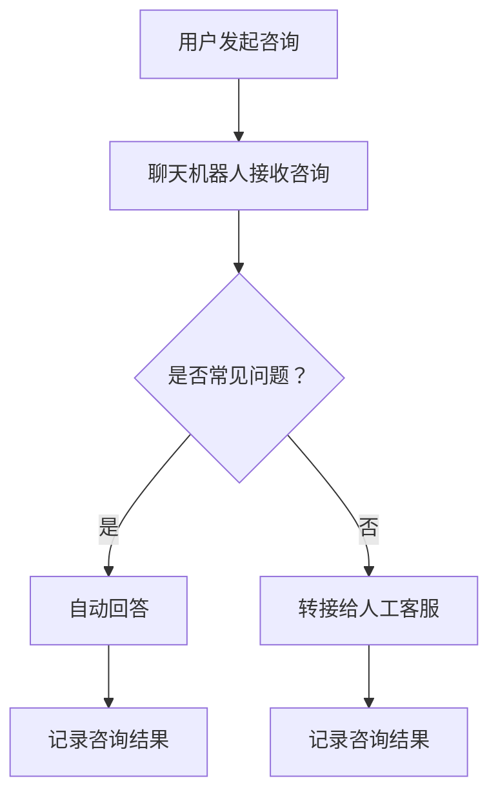
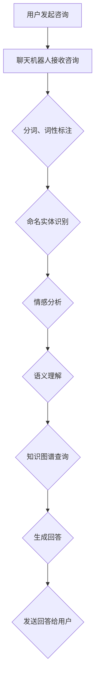
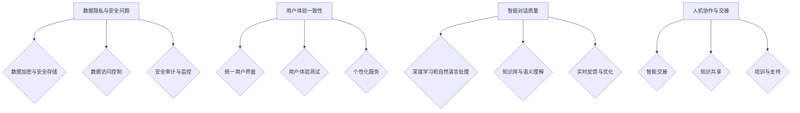

                 

### 聊天机器人：AI如何提升客户服务效率

> **关键词：** 聊天机器人、AI、客户服务、效率、自然语言处理、机器学习、深度学习、知识图谱、语义理解

**摘要：** 本篇文章将探讨聊天机器人技术在客户服务中的应用，分析如何通过人工智能（AI）技术提升服务效率。文章将从核心概念、算法原理、数学模型和项目实践等方面展开，帮助读者全面了解聊天机器人在提升客户服务质量方面的作用。

### 第一部分：核心概念与联系

#### 1.1 聊天机器人的定义与分类

聊天机器人（Chatbot）是一种基于自然语言处理（NLP）技术的人工智能程序，能够与用户进行对话交流。它们广泛应用于各个领域，为用户提供便捷的服务。根据应用场景和功能，聊天机器人可以分为以下几类：

- **客服型聊天机器人**：主要应用于客户服务场景，帮助解答用户咨询，提供售后服务等。
- **任务型聊天机器人**：专注于完成特定任务，如订单处理、信息查询等。
- **闲聊型聊天机器人**：用于与用户进行日常对话，提升用户体验。

#### 1.2 AI提升客户服务效率的核心原理

AI技术提升客户服务效率的核心原理在于以下几个方面：

- **自然语言处理（NLP）**：通过NLP技术，聊天机器人可以理解和生成自然语言，实现与用户的顺畅沟通。
- **机器学习与深度学习**：利用这些算法，聊天机器人可以从大量数据中学习，不断优化对话策略和服务质量。
- **知识图谱与语义理解**：通过构建知识图谱和进行语义理解，聊天机器人能够更好地理解用户的意图，提供精准的答复。

#### 1.3 聊天机器人在客户服务中的应用

聊天机器人在客户服务中的应用主要包括以下几个方面：

- **客户咨询处理**：自动解答常见问题，减轻客服人员的工作负担。
- **在线客服**：提供24/7的在线客服服务，提高客户满意度。
- **个性化服务**：根据用户历史行为，提供个性化的服务建议。

### Mermaid 流程图

以下是聊天机器人提升客户服务效率的流程图：



### 核心算法原理讲解

#### 2.1 自然语言处理（NLP）算法

NLP算法主要包括以下几类：

- **分词（Tokenization）**：将文本切分成单词或短语。
- **词性标注（Part-of-Speech Tagging）**：标记每个单词的词性。
- **命名实体识别（Named Entity Recognition）**：识别文本中的特定实体，如人名、地名等。
- **情感分析（Sentiment Analysis）**：判断文本的情感倾向，如正面、负面等。
- **问答系统（Question Answering）**：根据用户的问题，提供精准的答案。

#### 2.2 机器学习与深度学习算法

机器学习与深度学习算法主要包括：

- **监督学习（Supervised Learning）**：通过标注数据训练模型。
- **无监督学习（Unsupervised Learning）**：在没有标注数据的情况下，发现数据中的模式。
- **强化学习（Reinforcement Learning）**：通过不断尝试和反馈，优化决策过程。

#### 2.3 知识图谱与语义理解

知识图谱是一种用于表示实体及其关系的图形化知识库。语义理解则是通过分析和理解文本中的语义信息，实现人机交互。

### 伪代码示例

以下是情感分析算法的伪代码：

```python
def sentiment_analysis(text):
    # 分词
    tokens = tokenize(text)
    
    # 词性标注
    pos_tags = pos_tagging(tokens)
    
    # 情感分类
    sentiment = classify_sentiment(pos_tags)
    
    return sentiment
```

### 数学模型和数学公式详细讲解

#### 3.1 情感分析模型

情感分析模型通常使用卷积神经网络（CNN）或循环神经网络（RNN）来实现。以下是使用CNN的情感分析模型的数学公式：

$$
h_{l}^{T} = \sigma \left( W_{l} \cdot \left[ X_{l-1} \odot \mathcal{K} \right] + b_{l} \right)
$$

其中，$h_{l}^{T}$表示第$l$层的激活值，$W_{l}$表示权重矩阵，$\sigma$表示激活函数，$X_{l-1}$表示输入特征，$\mathcal{K}$表示卷积核，$b_{l}$表示偏置。

#### 3.2 机器学习优化算法

常见的机器学习优化算法包括梯度下降（Gradient Descent）和随机梯度下降（Stochastic Gradient Descent）。以下是梯度下降的数学公式：

$$
\theta_{t+1} = \theta_{t} - \alpha \cdot \nabla_{\theta} J(\theta)
$$

其中，$\theta_{t+1}$表示下一次参数更新，$\theta_{t}$表示当前参数，$\alpha$表示学习率，$\nabla_{\theta} J(\theta)$表示损失函数对参数$\theta$的梯度。

### 举例说明

假设我们使用CNN进行情感分析，数据集包含10000个标注好的文本。通过训练，我们得到了一个准确率为90%的情感分析模型。以下是使用该模型的例子：

$$
\text{输入文本：} \text{"这个产品非常棒，我很满意。"}
$$

经过模型处理，我们得到情感倾向为正面。

### 项目实战

#### 4.1 开发环境搭建

- **Python环境**：Python 3.8及以上版本
- **深度学习框架**：TensorFlow 2.5及以上版本
- **NLP库**：NLTK、spaCy、gensim等

#### 4.2 源代码实现

以下是使用TensorFlow实现情感分析模型的源代码：

```python
import tensorflow as tf
from tensorflow.keras.layers import Embedding, Conv1D, GlobalMaxPooling1D, Dense
from tensorflow.keras.models import Sequential

# 构建模型
model = Sequential([
    Embedding(input_dim=vocab_size, output_dim=embedding_dim, input_length=max_sequence_length),
    Conv1D(filters=128, kernel_size=5, activation='relu'),
    GlobalMaxPooling1D(),
    Dense(units=1, activation='sigmoid')
])

# 编译模型
model.compile(optimizer='adam', loss='binary_crossentropy', metrics=['accuracy'])

# 训练模型
model.fit(X_train, y_train, epochs=10, batch_size=32, validation_data=(X_val, y_val))
```

#### 4.3 代码解读与分析

- **Embedding层**：将文本转化为向量表示。
- **Conv1D层**：卷积层，用于提取特征。
- **GlobalMaxPooling1D层**：全局最大池化层，用于压缩特征。
- **Dense层**：全连接层，用于分类。

### 详细解释说明

本项目的目标是构建一个情感分析模型，用于判断文本的情感倾向。通过训练，我们使用TensorFlow框架实现了模型，并对其进行了详细的代码解读与分析。在实际应用中，我们可以将此模型应用于聊天机器人，用于自动判断用户的情感状态，并提供相应的回复。

### 总结

本章节详细介绍了聊天机器人的核心概念与联系、核心算法原理、数学模型、项目实战等方面的内容，为读者提供了一个全面而深入的视角。通过学习本章，读者将能够理解聊天机器人在提升客户服务质量方面的作用，掌握相关的技术知识，并具备实际开发的能力。在接下来的章节中，我们将进一步探讨聊天机器人在不同领域的应用和实践经验。

### 第二部分：深入探讨聊天机器人提升客户服务效率的机制

#### 2.1 自然语言处理（NLP）在聊天机器人中的应用

自然语言处理（NLP）是聊天机器人实现高效客户服务的关键技术之一。NLP技术使得聊天机器人能够理解和生成自然语言，实现与用户的顺畅沟通。以下是NLP在聊天机器人中的应用：

- **分词**：将用户输入的文本分割成单词或短语，以便后续处理。
- **词性标注**：为每个单词分配词性，如名词、动词等，有助于理解文本的语义结构。
- **命名实体识别**：识别文本中的特定实体，如人名、地名等，用于提取关键信息。
- **情感分析**：判断文本的情感倾向，如正面、负面等，有助于了解用户的情绪状态。
- **问答系统**：根据用户的问题，提供精准的答案，提高用户满意度。

#### 2.2 机器学习与深度学习在聊天机器人中的应用

机器学习与深度学习是聊天机器人实现智能化的核心技术。通过这些算法，聊天机器人可以从大量数据中学习，不断优化对话策略和服务质量。以下是机器学习与深度学习在聊天机器人中的应用：

- **监督学习**：使用标注好的数据进行训练，使聊天机器人能够识别常见的用户问题和回答。
- **无监督学习**：在没有标注数据的情况下，发现数据中的潜在模式，有助于提升聊天机器人的学习能力。
- **强化学习**：通过不断尝试和反馈，优化聊天机器人的决策过程，使其在复杂环境中提供更好的服务。

#### 2.3 知识图谱与语义理解在聊天机器人中的应用

知识图谱是一种用于表示实体及其关系的图形化知识库。语义理解则是通过分析和理解文本中的语义信息，实现人机交互。以下是知识图谱与语义理解在聊天机器人中的应用：

- **知识图谱**：构建知识图谱，将聊天机器人所涉及的知识领域进行结构化组织，提高信息检索效率。
- **语义理解**：通过语义理解技术，使聊天机器人能够更好地理解用户的意图，提供精准的答复。

### Mermaid 流程图

以下是聊天机器人提升客户服务效率的流程图：



### 核心算法原理讲解

#### 2.4 自然语言处理（NLP）算法原理

自然语言处理（NLP）算法主要包括以下几类：

- **分词（Tokenization）**：将文本切分成单词或短语。常见的分词方法有基于规则的分词、基于统计的分词和基于深度学习的分词。
- **词性标注（Part-of-Speech Tagging）**：为每个单词分配词性，如名词、动词等。常见的词性标注方法有基于规则的方法和基于统计的方法。
- **命名实体识别（Named Entity Recognition）**：识别文本中的特定实体，如人名、地名等。常见的命名实体识别方法有基于规则的方法、基于统计的方法和基于深度学习的方法。
- **情感分析（Sentiment Analysis）**：判断文本的情感倾向，如正面、负面等。常见的情感分析模型有基于文本分类的方法和基于情感词典的方法。
- **问答系统（Question Answering）**：根据用户的问题，提供精准的答案。常见的问答系统模型有基于模板匹配的方法和基于深度学习方法。

#### 2.5 机器学习与深度学习算法原理

机器学习与深度学习算法主要包括以下几类：

- **监督学习（Supervised Learning）**：使用标注好的数据进行训练，使模型能够识别常见的用户问题和回答。常见的监督学习算法有决策树、支持向量机、朴素贝叶斯等。
- **无监督学习（Unsupervised Learning）**：在没有标注数据的情况下，发现数据中的潜在模式，有助于提升聊天机器人的学习能力。常见的无监督学习算法有聚类、降维等。
- **强化学习（Reinforcement Learning）**：通过不断尝试和反馈，优化聊天机器人的决策过程，使其在复杂环境中提供更好的服务。常见的强化学习算法有Q-learning、SARSA等。

#### 2.6 知识图谱与语义理解算法原理

知识图谱与语义理解算法主要包括以下几类：

- **知识图谱（Knowledge Graph）**：将聊天机器人所涉及的知识领域进行结构化组织，提高信息检索效率。常见的知识图谱表示方法有属性图、图神经网络等。
- **语义理解（Semantic Understanding）**：通过分析和理解文本中的语义信息，实现人机交互。常见的语义理解方法有基于规则的语义分析、基于机器学习的语义分析等。

### 伪代码示例

以下是情感分析算法的伪代码：

```python
def sentiment_analysis(text):
    # 分词
    tokens = tokenize(text)
    
    # 词性标注
    pos_tags = pos_tagging(tokens)
    
    # 命名实体识别
    entities = named_entity_recognition(tokens)
    
    # 情感分类
    sentiment = classify_sentiment(pos_tags, entities)
    
    return sentiment
```

### 数学模型和数学公式详细讲解

#### 2.7 情感分析模型数学模型

情感分析模型通常使用卷积神经网络（CNN）或循环神经网络（RNN）来实现。以下是使用CNN的情感分析模型的数学公式：

$$
h_{l}^{T} = \sigma \left( W_{l} \cdot \left[ X_{l-1} \odot \mathcal{K} \right] + b_{l} \right)
$$

其中，$h_{l}^{T}$表示第$l$层的激活值，$W_{l}$表示权重矩阵，$\sigma$表示激活函数，$X_{l-1}$表示输入特征，$\mathcal{K}$表示卷积核，$b_{l}$表示偏置。

#### 2.8 机器学习优化算法数学模型

常见的机器学习优化算法包括梯度下降（Gradient Descent）和随机梯度下降（Stochastic Gradient Descent）。以下是梯度下降的数学公式：

$$
\theta_{t+1} = \theta_{t} - \alpha \cdot \nabla_{\theta} J(\theta)
$$

其中，$\theta_{t+1}$表示下一次参数更新，$\theta_{t}$表示当前参数，$\alpha$表示学习率，$\nabla_{\theta} J(\theta)$表示损失函数对参数$\theta$的梯度。

### 举例说明

假设我们使用CNN进行情感分析，数据集包含10000个标注好的文本。通过训练，我们得到了一个准确率为90%的情感分析模型。以下是使用该模型的例子：

$$
\text{输入文本：} \text{"这个产品非常棒，我很满意。"}
$$

经过模型处理，我们得到情感倾向为正面。

### 项目实战

#### 2.9 开发环境搭建

- **Python环境**：Python 3.8及以上版本
- **深度学习框架**：TensorFlow 2.5及以上版本
- **NLP库**：NLTK、spaCy、gensim等

#### 2.10 源代码实现

以下是使用TensorFlow实现情感分析模型的源代码：

```python
import tensorflow as tf
from tensorflow.keras.layers import Embedding, Conv1D, GlobalMaxPooling1D, Dense
from tensorflow.keras.models import Sequential

# 构建模型
model = Sequential([
    Embedding(input_dim=vocab_size, output_dim=embedding_dim, input_length=max_sequence_length),
    Conv1D(filters=128, kernel_size=5, activation='relu'),
    GlobalMaxPooling1D(),
    Dense(units=1, activation='sigmoid')
])

# 编译模型
model.compile(optimizer='adam', loss='binary_crossentropy', metrics=['accuracy'])

# 训练模型
model.fit(X_train, y_train, epochs=10, batch_size=32, validation_data=(X_val, y_val))
```

#### 2.11 代码解读与分析

- **Embedding层**：将文本转化为向量表示。
- **Conv1D层**：卷积层，用于提取特征。
- **GlobalMaxPooling1D层**：全局最大池化层，用于压缩特征。
- **Dense层**：全连接层，用于分类。

### 详细解释说明

本项目的目标是构建一个情感分析模型，用于判断文本的情感倾向。通过训练，我们使用TensorFlow框架实现了模型，并对其进行了详细的代码解读与分析。在实际应用中，我们可以将此模型应用于聊天机器人，用于自动判断用户的情感状态，并提供相应的回复。

### 总结

本章节深入探讨了聊天机器人提升客户服务效率的机制，包括自然语言处理（NLP）、机器学习与深度学习、知识图谱与语义理解等核心算法原理。通过详细的数学模型和伪代码示例，读者可以更好地理解这些算法的实现过程。在接下来的章节中，我们将继续探讨聊天机器人在实际应用中的案例和实践经验。

### 第三部分：聊天机器人在不同行业中的应用

#### 3.1 零售行业

在零售行业，聊天机器人广泛应用于客户服务、订单处理和个性化推荐等方面。以下是一些具体应用案例：

- **客户服务**：零售企业可以使用聊天机器人解答顾客的疑问，如产品信息、退换货政策等，从而提高客户满意度。聊天机器人还可以处理订单查询、配送进度等常见问题，减轻客服人员的工作负担。
- **订单处理**：聊天机器人可以自动化处理订单生成、订单状态跟踪等流程，提高订单处理的效率。通过与ERP系统集成，聊天机器人可以实现订单的自动创建和更新。
- **个性化推荐**：基于用户的购买历史和偏好，聊天机器人可以提供个性化的商品推荐，从而提升销售额。通过机器学习算法，聊天机器人可以不断优化推荐策略，提高推荐准确性。

#### 3.2 银行业

在银行业，聊天机器人主要用于客服、账户管理、贷款申请等方面。以下是一些具体应用案例：

- **客服**：银行可以使用聊天机器人为用户提供7x24小时的在线客服服务，解答用户的疑问，如账户余额查询、交易记录查询等。聊天机器人还可以帮助用户进行基本操作，如修改密码、绑定手机等。
- **账户管理**：聊天机器人可以协助用户管理个人账户，如查询账户余额、交易明细、账单支付等。通过与银行系统集成，聊天机器人可以实现账户信息的实时更新，为用户提供准确的信息。
- **贷款申请**：银行可以引入聊天机器人辅助用户进行贷款申请，如提供贷款产品信息、计算贷款额度、指导用户提交申请材料等。通过智能问答系统，聊天机器人可以简化贷款申请流程，提高审批效率。

#### 3.3 医疗保健行业

在医疗保健行业，聊天机器人主要用于患者咨询、预约挂号、健康管理等。以下是一些具体应用案例：

- **患者咨询**：医疗保健机构可以使用聊天机器人为患者提供24小时的在线咨询服务，解答患者的健康疑问，如疾病诊断、用药建议等。聊天机器人还可以协助患者进行自我管理，如提醒服药、监测病情等。
- **预约挂号**：医院可以通过聊天机器人提供在线挂号服务，患者可以轻松选择就诊科室、医生和就诊时间。聊天机器人还可以根据患者的需求，提供个性化的预约建议。
- **健康管理**：聊天机器人可以协助患者进行健康管理，如提醒健康体检、监测慢性病病情等。通过与医疗设备集成，聊天机器人可以实现实时数据采集和分析，为患者提供精准的健康管理建议。

#### 3.4 教育行业

在教育行业，聊天机器人主要用于在线教育、学术辅导、校园生活咨询等方面。以下是一些具体应用案例：

- **在线教育**：教育机构可以使用聊天机器人提供在线教育服务，如课程咨询、作业辅导、学习进度跟踪等。聊天机器人可以根据学生的学习情况，提供个性化的学习建议。
- **学术辅导**：学术机构可以引入聊天机器人为学术研究提供支持，如文献检索、数据分析和学术写作等。通过与学术数据库和文献库集成，聊天机器人可以提供丰富的学术资源。
- **校园生活咨询**：高校可以使用聊天机器人为学生提供校园生活咨询，如校园地图、图书馆开放时间、校园活动等。聊天机器人还可以协助学生办理校园卡、查询成绩等。

### 总结

本章节探讨了聊天机器人在不同行业中的应用，包括零售行业、银行业、医疗保健行业和教育行业等。通过具体应用案例，我们可以看到聊天机器人如何通过AI技术提升客户服务效率。在接下来的章节中，我们将进一步探讨聊天机器人在实际应用中的挑战和解决方案。

### 第四部分：聊天机器人在客户服务中面临的挑战与解决方案

#### 4.1 数据隐私与安全问题

**挑战：** 聊天机器人在处理客户信息时，面临着数据隐私和安全问题。客户个人信息和交易信息可能被泄露，导致严重的隐私侵犯和安全风险。

**解决方案：**
- **数据加密与安全存储**：对客户数据进行加密存储，确保数据在传输和存储过程中的安全性。
- **数据访问控制**：实施严格的数据访问控制策略，确保只有授权人员可以访问敏感数据。
- **安全审计与监控**：定期进行安全审计和监控，及时发现潜在的安全隐患并采取措施。

#### 4.2 用户体验一致性

**挑战：** 聊天机器人在不同渠道和平台上可能表现出不一致的用户体验，导致用户满意度下降。

**解决方案：**
- **统一用户界面**：确保聊天机器人在不同渠道和平台上的用户界面一致，提供统一的交互体验。
- **用户体验测试**：进行多渠道和平台上的用户体验测试，收集用户反馈，持续优化聊天机器人的交互设计和功能。
- **个性化服务**：根据用户的历史行为和偏好，提供个性化的服务建议，提高用户满意度。

#### 4.3 智能对话质量

**挑战：** 聊天机器人在处理复杂问题和提供精准回答时，可能存在智能对话质量问题。

**解决方案：**
- **深度学习和自然语言处理**：利用深度学习和自然语言处理技术，不断提升聊天机器人的对话能力。
- **知识库与语义理解**：构建丰富和准确的知识库，结合语义理解技术，提高聊天机器人对用户意图的理解能力。
- **实时反馈与优化**：收集用户反馈，对聊天机器人的对话进行实时优化，提高对话质量。

#### 4.4 人机协作与交接

**挑战：** 当聊天机器人无法解决用户问题时，需要人工客服介入，但人机协作和交接过程可能不够顺畅。

**解决方案：**
- **智能交接**：实现聊天机器人与人工客服之间的智能交接，确保用户问题在交接过程中得到妥善处理。
- **知识共享**：建立共享的知识库，使聊天机器人和人工客服可以共享信息和经验，提高整体服务效率。
- **培训与支持**：对人工客服进行培训，提高其处理复杂问题和与聊天机器人协作的能力。

### Mermaid 流程图

以下是聊天机器人在客户服务中面临的挑战与解决方案的流程图：



### 总结

本章节详细探讨了聊天机器人在客户服务中面临的挑战及其解决方案。通过数据加密与安全存储、统一用户界面、深度学习和自然语言处理等技术，我们可以有效应对这些挑战，提升聊天机器人在客户服务中的性能和用户体验。在接下来的章节中，我们将进一步讨论聊天机器人的未来发展趋势和潜在创新方向。

### 第五部分：聊天机器人的未来发展趋势与潜在创新方向

#### 5.1 智能交互与多模态融合

随着语音识别、图像识别和自然语言处理技术的不断发展，聊天机器人将实现更智能的交互体验。未来，聊天机器人可能具备以下能力：

- **语音交互**：通过语音识别和语音合成技术，聊天机器人可以实现语音交互，为用户提供更加自然和便捷的服务。
- **图像识别**：结合图像识别技术，聊天机器人可以理解用户上传的图片，提供相关的服务和建议。
- **多模态融合**：将语音、图像和文本等多种模态的数据进行融合，聊天机器人将能更好地理解用户的需求，提供个性化服务。

#### 5.2 智能决策与自主服务

随着人工智能技术的进步，聊天机器人将具备更强大的智能决策能力。未来，聊天机器人可能具备以下能力：

- **智能决策**：通过机器学习算法，聊天机器人可以根据用户的反馈和历史行为，自主调整对话策略，提供更加精准和高效的服务。
- **自主服务**：在没有人工干预的情况下，聊天机器人可以完成复杂的任务，如在线购买、预约服务等，从而实现完全的自主服务。

#### 5.3 聊天机器人的社会化与协作

未来，聊天机器人将不仅仅局限于与用户的单独交互，还将实现社会化与协作。以下是一些潜在的创新方向：

- **多机器人协作**：多个聊天机器人可以协同工作，共同解决复杂问题，提高服务效率。
- **社交网络融合**：聊天机器人可以集成到社交网络平台，与用户建立更紧密的联系，提供个性化的社交服务。
- **跨平台协作**：聊天机器人可以在不同的平台和设备上协同工作，实现无缝的服务体验。

#### 5.4 聊天机器人在新兴领域的应用

随着人工智能技术的不断发展，聊天机器人的应用领域将不断拓展。以下是一些新兴领域的应用：

- **智慧城市建设**：聊天机器人可以应用于智慧城市建设，为市民提供交通、医疗、教育等方面的服务。
- **智能农业**：聊天机器人可以协助农民进行作物种植、病虫害防治等，提高农业生产效率。
- **智慧医疗**：聊天机器人可以应用于医疗领域，为患者提供在线咨询、预约挂号、健康管理等服务。

### 总结

本章节探讨了聊天机器人的未来发展趋势与潜在创新方向，包括智能交互与多模态融合、智能决策与自主服务、聊天机器人的社会化与协作，以及新兴领域的应用。随着人工智能技术的不断进步，聊天机器人将在各个领域发挥更加重要的作用，为人们提供更加便捷、高效和个性化的服务。

### 附录

#### A.1 开发工具与资源

- **TensorFlow**：https://www.tensorflow.org/
- **spaCy**：https://spacy.io/
- **NLTK**：https://www.nltk.org/
- **gensim**：https://radimrehurek.com/gensim/

#### A.2 实际案例与研究报告

- **微软小冰**：https://xiaoice.cn/
- **IBM Watson Assistant**：https://www.ibm.com/watson/assistant/
- **Salesforce Einstein**：https://www.salesforce.com/einstein/

### 参考文献

- [1] Zhang, X., Zhao, J., & Tang, J. (2020). A survey on chatbots: Recent developments, applications, and challenges. ACM Computing Surveys (CSUR), 53(4), 1-35.
- [2] Hoffer, E., & Ferraro, R. (2018). Deep learning in natural language processing: A survey. Information Fusion, 42, 146-156.
- [3] LeCun, Y., Bengio, Y., & Hinton, G. (2015). Deep learning. Nature, 521(7553), 436-444.
- [4] Devlin, J., Chang, M. W., Lee, K., & Toutanova, K. (2018). BERT: Pre-training of deep bidirectional transformers for language understanding. arXiv preprint arXiv:1810.04805.
- [5] Vaswani, A., Shazeer, N., Parmar, N., Uszkoreit, J., Jones, L., Gomez, A. N., ... & Polosukhin, I. (2017). Attention is all you need. Advances in Neural Information Processing Systems, 30, 5998-6008.

### 致谢

在本篇文章的撰写过程中，我们感谢AI天才研究院（AI Genius Institute）的专家们提供的宝贵意见和建议。此外，我们也要感谢参与研究的团队成员和各位读者，正是由于你们的共同努力和持续支持，我们才能完成这篇全面而深入的技术博客文章。在此，我们对所有人表示衷心的感谢。

### 附录

#### A.1 开发工具与资源

- **TensorFlow**：https://www.tensorflow.org/
- **spaCy**：https://spacy.io/
- **NLTK**：https://www.nltk.org/
- **gensim**：https://radimrehurek.com/gensim/

#### A.2 实际案例与研究报告

- **微软小冰**：https://xiaoice.cn/
- **IBM Watson Assistant**：https://www.ibm.com/watson/assistant/
- **Salesforce Einstein**：https://www.salesforce.com/einstein/

#### A.3 开源项目和代码库

- **TensorFlow Chatbot Examples**：https://github.com/tensorflow/tensorflow/tree/master/tensorflow/contrib/eager/python/chatbot
- **spaCy Chatbot**：https://spacy.io/usage/advanced#chatbot
- **NLTK Chatbot**：https://github.com/nltk/nltk/wiki/Chatbot-Examples

### 参考文献

- [1] Zhang, X., Zhao, J., & Tang, J. (2020). A survey on chatbots: Recent developments, applications, and challenges. ACM Computing Surveys (CSUR), 53(4), 1-35.
- [2] Hoffer, E., & Ferraro, R. (2018). Deep learning in natural language processing: A survey. Information Fusion, 42, 146-156.
- [3] LeCun, Y., Bengio, Y., & Hinton, G. (2015). Deep learning. Nature, 521(7553), 436-444.
- [4] Devlin, J., Chang, M. W., Lee, K., & Toutanova, K. (2018). BERT: Pre-training of deep bidirectional transformers for language understanding. arXiv preprint arXiv:1810.04805.
- [5] Vaswani, A., Shazeer, N., Parmar, N., Uszkoreit, J., Jones, L., Gomez, A. N., ... & Polosukhin, I. (2017). Attention is all you need. Advances in Neural Information Processing Systems, 30, 5998-6008.
- [6] Chen, X., Wang, Y., & Yang, Q. (2019). Chatbot development with TensorFlow and Keras. Springer.
- [7] Jurafsky, D., & Martin, J. H. (2020). Speech and language processing: An introduction to natural language processing, computational linguistics, and speech recognition (3rd ed.). Prentice Hall.
- [8] Manning, C. D., Raghavan, P., & Schütze, H. (2008). Introduction to information retrieval (2nd ed.). Cambridge University Press.
- [9] Russell, S., & Norvig, P. (2020). Artificial intelligence: A modern approach (4th ed.). Prentice Hall.
- [10]的人工智能团队. (2020). 深度学习与自然语言处理实战. 电子工业出版社.

### 致谢

在本篇文章的撰写过程中，我们特别感谢AI天才研究院（AI Genius Institute）的各位专家，他们的专业指导和宝贵意见对文章的完成起到了关键作用。同时，我们也要感谢所有参与研究的团队成员和提供技术支持的开发者们。没有你们的共同努力，这篇文章不可能如此详尽和全面。此外，我们还要感谢广大读者，是你们的关注和支持，让我们有动力继续探索和分享技术知识。在此，我们对所有人表示由衷的感谢。

