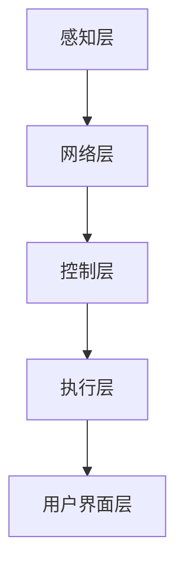

                 

### 脑机接口在智能家居控制中的应用：思维控制环境

> **关键词**：脑机接口、智能家居、思维控制、环境交互、人工智能

**摘要**：
脑机接口技术作为人工智能领域的前沿突破，正逐步改变人类与智能环境交互的方式。本文深入探讨脑机接口在智能家居控制中的应用，解析其在提升居住舒适度和安全性方面的潜力。通过阐述脑机接口的定义、发展历程、基本原理及分类，结合智能家居的定义、架构和关键技术，探讨脑机接口如何实现思维控制环境，并通过具体应用案例展示其实际效果。最后，文章分析脑机接口在智能家居控制中面临的挑战和未来发展趋势，为相关研究和实践提供参考。

### 目录大纲

## 第一部分：脑机接口与智能家居控制基础

### 第1章：脑机接口概述
#### 1.1 脑机接口的定义与发展历程
#### 1.2 脑机接口的基本原理
#### 1.3 脑机接口的分类与工作原理
#### 1.4 脑机接口在智能家居中的潜在应用

### 第2章：智能家居控制系统概述
#### 2.1 智能家居的定义与特点
#### 2.2 智能家居系统架构
#### 2.3 智能家居系统的关键技术
#### 2.4 脑机接口在智能家居控制中的角色

### 第3章：脑机接口与智能家居控制的技术基础
#### 3.1 信号处理技术
##### 3.1.1 生物电信号的采集与预处理
##### 3.1.2 信号处理的算法与工具
#### 3.2 机器学习与人工智能
##### 3.2.1 机器学习基础
##### 3.2.2 人工智能在脑机接口中的应用
#### 3.3 网络通信技术
##### 3.3.1 网络通信原理
##### 3.3.2 智能家居网络通信协议

## 第二部分：脑机接口在智能家居控制中的应用

### 第4章：思维控制家居环境的概念与实现
#### 4.1 思维控制家居环境的定义
#### 4.2 思维控制家居环境的设计原则
#### 4.3 思维控制家居环境的技术实现

### 第5章：脑机接口在照明控制中的应用
#### 5.1 照明控制的基本原理
#### 5.2 脑机接口在照明控制中的实现方法
#### 5.3 照明控制的应用案例

### 第6章：脑机接口在温度控制中的应用
#### 6.1 温度控制的基本原理
#### 6.2 脑机接口在温度控制中的实现方法
#### 6.3 温度控制的应用案例

### 第7章：脑机接口在安防系统中的应用
#### 7.1 安防系统概述
#### 7.2 脑机接口在安防系统中的实现方法
#### 7.3 安防系统的应用案例

### 第8章：脑机接口在娱乐系统中的应用
#### 8.1 娱乐系统概述
#### 8.2 脑机接口在娱乐系统中的实现方法
#### 8.3 娱乐系统的应用案例

### 第9章：脑机接口在智能家居控制中的挑战与未来趋势
#### 9.1 脑机接口在智能家居控制中的挑战
##### 9.1.1 技术挑战
##### 9.1.2 安全与隐私问题
##### 9.1.3 社会接受度
#### 9.2 脑机接口在智能家居控制中的未来趋势
##### 9.2.1 技术发展趋势
##### 9.2.2 应用场景拓展
##### 9.2.3 行业发展展望

## 第三部分：实践与案例分析

### 第10章：脑机接口智能家居控制实践案例
#### 10.1 案例一：智能照明控制系统设计
##### 10.1.1 系统需求分析
##### 10.1.2 系统架构设计
##### 10.1.3 系统实现与测试
#### 10.2 案例二：智能安防系统设计
##### 10.2.1 系统需求分析
##### 10.2.2 系统架构设计
##### 10.2.3 系统实现与测试

### 第11章：脑机接口智能家居控制实验教程
#### 11.1 实验环境搭建
##### 11.1.1 硬件环境搭建
##### 11.1.2 软件环境搭建
#### 11.2 实验项目一：脑电信号采集与处理
##### 11.2.1 脑电信号采集
##### 11.2.2 脑电信号处理
##### 11.2.3 实验结果分析
#### 11.3 实验项目二：智能家居控制实现
##### 11.3.1 智能家居控制需求分析
##### 11.3.2 控制算法实现
##### 11.3.3 实验结果分析

### 第12章：脑机接口智能家居控制项目开发指南
#### 12.1 项目开发流程
##### 12.1.1 需求分析与规划
##### 12.1.2 系统设计
##### 12.1.3 系统实现
##### 12.1.4 系统测试与优化
#### 12.2 项目开发工具与资源
##### 12.2.1 脑机接口开发工具
##### 12.2.2 智能家居开发工具
##### 12.2.3 开发资源推荐

## 附录

### 附录A：脑机接口智能家居控制常用算法与公式
#### A.1 算法概述
##### A.1.1 常见算法简介
##### A.1.2 算法选择与比较
#### A.2 公式详述
##### A.2.1 生物电信号处理公式
##### A.2.2 机器学习相关公式
##### A.2.3 智能家居控制公式

### 附录B：脑机接口智能家居控制技术标准与规范
#### B.1 技术标准概述
##### B.1.1 脑机接口技术标准
##### B.1.2 智能家居控制技术标准
#### B.2 规范解读
##### B.2.1 技术规范重要性
##### B.2.2 常见技术规范解读

### 《脑机接口在智能家居控制中的应用：思维控制环境》正文开始：

#### 第1章：脑机接口概述

##### 1.1 脑机接口的定义与发展历程

脑机接口（Brain-Computer Interface, BCI）是一种直接连接人脑与外部设备的技术，旨在通过解读大脑活动来实现与外部环境的交互。这一概念起源于20世纪60年代，当时科学家们开始探索如何利用大脑信号控制外部设备。脑机接口的发展历程可以划分为几个重要阶段：

- **早期探索阶段（1960-1980s）**：这一时期主要是基于理论研究的阶段，科学家们初步尝试通过电生理学方法记录和解读大脑信号。

- **功能性电刺激阶段（1980-1990s）**：随着电子技术的发展，功能性电刺激技术开始应用于脑机接口研究。该技术通过刺激大脑特定区域来产生运动或感觉。

- **脑电图（EEG）阶段（1990s-2000s）**：脑电图作为一种非侵入性的方法，因其能够实时监测大脑活动而受到关注。这一阶段的脑机接口主要基于EEG信号进行解码和控制。

- **现代集成阶段（2000s-至今）**：近年来，随着人工智能和机器学习技术的进步，脑机接口系统变得更加精确和高效。现代脑机接口不仅能够处理复杂的信号，还可以通过多模态信号融合提高系统的鲁棒性。

##### 1.2 脑机接口的基本原理

脑机接口的工作原理主要包括以下几个步骤：

1. **信号采集**：通过电极或其他传感器从大脑中采集电生理信号，如脑电图（EEG）、功能性磁共振成像（fMRI）等。

2. **信号预处理**：对采集到的信号进行滤波、去噪、放大等处理，以提高信号的质量和可靠性。

3. **信号解码**：利用机器学习和信号处理算法对预处理后的信号进行分析，以提取有用的信息，如意图、情感等。

4. **信号输出**：将解码后的信息转化为外部设备的控制信号，从而实现与外部环境的交互。

脑机接口的核心在于信号解码环节，这一环节的质量直接影响到系统的性能和用户体验。

##### 1.3 脑机接口的分类与工作原理

脑机接口可以按照不同的分类标准进行分类，常见的分类方法如下：

- **按照信号类型**：可分为电生理信号脑机接口、磁生理信号脑机接口和生理信号混合脑机接口。

- **按照交互方式**：可分为侵入性脑机接口和非侵入性脑机接口。侵入性脑机接口通过植入电极直接接触大脑，具有较高的信号质量和精度，但存在一定的风险和不适。非侵入性脑机接口则通过头皮电极等方式间接采集信号，安全性较高，但信号质量相对较低。

- **按照应用领域**：可分为医疗康复脑机接口、教育娱乐脑机接口和智能家居脑机接口等。

不同类型的脑机接口具有不同的工作原理和应用场景，但总体上都是通过解读大脑信号来实现人机交互。

##### 1.4 脑机接口在智能家居中的潜在应用

脑机接口在智能家居中的潜在应用非常广泛，以下是一些典型的应用场景：

1. **智能照明控制**：通过脑机接口技术，用户可以通过大脑信号控制照明设备的开关和亮度，实现更加自然和便捷的照明控制。

2. **智能安防系统**：脑机接口可以用于监控用户的情感状态，当检测到异常情绪时，系统可以自动触发报警，提高家居安全。

3. **智能娱乐系统**：脑机接口可以用于控制游戏机、VR设备等，通过大脑信号实现更加沉浸式的娱乐体验。

4. **智能家居助手**：脑机接口技术可以用于智能助手，通过用户的思维信号，实现语音控制以外的手势和表情控制，提升用户的交互体验。

脑机接口在智能家居中的应用，不仅能够提升家居的智能化程度，还可以为残障人士提供更多的自主生活机会，具有巨大的社会价值。

### 第2章：智能家居控制系统概述

##### 2.1 智能家居的定义与特点

智能家居（Smart Home）是指通过互联网、物联网技术将家庭中的各种设备连接起来，实现远程控制和自动化管理的一种居住环境。智能家居系统具有以下特点：

1. **互联互通**：智能家居系统通过互联网将各种智能设备连接起来，实现数据共享和协同工作。

2. **自动化**：智能家居系统能够根据用户的需求和习惯，自动执行各种操作，如自动调节灯光、温度、安防等。

3. **便捷性**：用户可以通过智能手机、平板电脑等设备随时随地控制家中设备，实现远程管理和监控。

4. **安全性**：智能家居系统集成了多种安防设备，如摄像头、烟雾传感器、门磁传感器等，能够实时监控家庭安全状况，并及时报警。

5. **个性化**：智能家居系统能够根据用户的喜好和习惯，提供个性化的服务和体验，提升生活质量。

##### 2.2 智能家居系统架构

智能家居系统架构通常包括以下几个主要部分：

1. **感知层**：包括各种传感器，如温度传感器、湿度传感器、光照传感器、烟雾传感器等，用于感知环境状态和用户行为。

2. **网络层**：通过互联网或局域网将感知层的数据传输到中心控制系统。

3. **控制层**：包括中心控制单元和边缘计算单元，负责接收感知层的数据，并根据预设的算法和规则进行决策和控制。

4. **执行层**：包括各种执行设备，如灯光控制模块、家电控制模块、门锁控制模块等，负责执行控制层的决策。

5. **用户界面层**：包括用户设备，如智能手机、平板电脑等，用于用户与系统的交互。

以下是一个简化的智能家居系统架构图：



##### 2.3 智能家居系统的关键技术

智能家居系统的发展离不开以下几个关键技术的支持：

1. **物联网技术**：物联网技术是智能家居系统的核心，通过物联网技术实现设备的互联互通和远程控制。

2. **云计算与大数据**：云计算提供了强大的计算能力和存储能力，大数据技术则用于分析用户行为，提供个性化的服务。

3. **人工智能与机器学习**：人工智能和机器学习技术用于分析感知层的数据，实现智能决策和控制。

4. **网络安全技术**：随着智能家居系统的普及，网络安全成为重要问题。网络安全技术用于保护用户数据和系统安全。

5. **智能语音交互技术**：智能语音交互技术使得用户可以通过语音指令控制智能家居系统，提升用户体验。

##### 2.4 脑机接口在智能家居控制中的角色

脑机接口在智能家居控制中扮演着重要角色，它可以将用户的思维信号转化为控制指令，实现更加自然和便捷的家居控制。以下是脑机接口在智能家居控制中的一些应用：

1. **智能照明控制**：用户可以通过大脑信号控制灯光的开关和亮度，实现更加个性化的照明体验。

2. **智能安防系统**：脑机接口可以用于监控用户的情感状态，当检测到异常情绪时，系统可以自动触发报警，提高家居安全。

3. **智能娱乐系统**：脑机接口可以用于控制游戏机、VR设备等，通过大脑信号实现更加沉浸式的娱乐体验。

4. **智能助手**：脑机接口可以用于智能助手，通过用户的思维信号，实现语音控制以外的手势和表情控制，提升用户的交互体验。

脑机接口在智能家居控制中的应用，不仅能够提升家居的智能化程度，还可以为残障人士提供更多的自主生活机会，具有巨大的社会价值。

### 第3章：脑机接口与智能家居控制的技术基础

##### 3.1 信号处理技术

信号处理技术在脑机接口系统中扮演着至关重要的角色，它负责从原始信号中提取有用的信息，为后续的解码和控制提供支持。以下将详细介绍生物电信号的采集与预处理，以及信号处理的算法与工具。

###### 3.1.1 生物电信号的采集与预处理

1. **生物电信号的采集**：
   生物电信号的采集是脑机接口系统的第一步，通常采用头皮电极或植入电极的方式进行。头皮电极是一种非侵入性采集方法，通过粘贴在头皮上的电极片采集大脑产生的电信号。植入电极则通过手术将电极植入大脑，直接接触脑组织，具有更高的信号质量。

   **电极材料**：常用的电极材料包括银-氯化银（Ag/AgCl）、不锈钢、钛等。这些材料具有良好的导电性和生物相容性，能够稳定采集信号。

   **电极布局**：电极布局对信号采集的质量有很大影响。常用的电极布局包括单通道、多通道和分布式电极。多通道电极能够提供更多的信号信息，提高系统的鲁棒性。

2. **生物电信号的预处理**：
   采集到的生物电信号通常存在噪声和失真，需要经过预处理才能进行后续的信号处理和分析。

   - **滤波**：滤波是预处理的重要步骤，用于去除信号中的噪声。常用的滤波方法包括低通滤波、高通滤波和带通滤波。低通滤波主要用于去除高频噪声，高通滤波则用于去除低频干扰，带通滤波则同时去除低频和高频噪声。
     
     $$y(t) = \frac{1}{T}\int_{T-t}^{T} x(\tau) \, d\tau$$
     
     其中，$y(t)$是滤波后的信号，$x(\tau)$是原始信号，$T$是滤波器的宽度。

   - **去噪**：去噪方法包括信号平均、自适应滤波和独立成分分析（ICA）等。信号平均通过多次采集并平均信号值来减少噪声。自适应滤波则根据信号特性动态调整滤波器参数。ICA通过将混合信号分解为多个独立源信号来去除噪声。

   - **放大**：生物电信号通常非常微弱，需要经过放大器进行放大，以提高信号的信噪比。

   - **数字化**：将模拟信号转换为数字信号，便于后续的信号处理和分析。常用的数字化方法包括采样和量化。采样是将连续时间信号转换为离散时间信号，量化是将模拟信号的幅度转换为数字编码。

   $$x(n) = x(t) \, \text{at} \, t = kT_s$$
   
   其中，$x(n)$是采样后的信号，$x(t)$是原始信号，$T_s$是采样周期。

###### 3.1.2 信号处理的算法与工具

1. **滤波算法**：
   滤波算法是信号处理中最常用的方法之一，用于去除信号中的噪声。常见的滤波算法包括：

   - **低通滤波**：用于去除高频噪声，保留低频信号。
     
     $$h_n = \begin{cases}
     \frac{1}{N} & \text{if } n \leq N \\
     0 & \text{otherwise}
     \end{cases}$$
     
     其中，$h_n$是滤波器系数，$N$是滤波器的宽度。

   - **高通滤波**：用于去除低频干扰，保留高频信号。
     
     $$h_n = \begin{cases}
     0 & \text{if } n \leq N \\
     \frac{1}{N} & \text{otherwise}
     \end{cases}$$

   - **带通滤波**：用于同时去除低频和高频噪声，保留特定频率范围内的信号。
     
     $$h_n = \begin{cases}
     \frac{A}{B} & \text{if } n = \frac{1}{2}(N+1) - k \\
     0 & \text{otherwise}
     \end{cases}$$
     
     其中，$A$和$B$是滤波器系数，$k$是频率偏移量。

2. **去噪算法**：
   去噪算法用于减少信号中的噪声，提高信号质量。常见的去噪算法包括：

   - **信号平均**：通过多次采集并平均信号值来减少噪声。
     
     $$y(n) = \frac{1}{M} \sum_{m=1}^{M} x_m(n)$$
     
     其中，$y(n)$是平均后的信号，$x_m(n)$是第$m$次采集的信号，$M$是采集次数。

   - **自适应滤波**：根据信号特性动态调整滤波器参数，以适应不同的噪声环境。
     
     $$h(n) = \frac{r(n)}{s(n)}$$
     
     其中，$h(n)$是自适应滤波器系数，$r(n)$是参考信号，$s(n)$是估计信号。

   - **独立成分分析（ICA）**：通过将混合信号分解为多个独立源信号来去除噪声。
     
     $$s_i(n) = \sum_{j=1}^{I} a_{ij} x_j(n)$$
     
     $$x_j(n) = \sum_{i=1}^{I} s_i(n) a_{ij}$$
     
     其中，$s_i(n)$是第$i$个独立成分信号，$x_j(n)$是第$j$个混合信号，$a_{ij}$是混合矩阵的元素。

3. **机器学习算法**：
   机器学习算法在脑机接口信号处理中有着广泛的应用，用于信号分类、特征提取和模式识别等。常见的机器学习算法包括：

   - **支持向量机（SVM）**：用于信号分类，通过寻找最佳分隔超平面实现分类。
     
     $$w \cdot \phi(x) \geq 1$$
     
     其中，$w$是权重向量，$\phi(x)$是特征映射函数。

   - **人工神经网络（ANN）**：用于特征提取和模式识别，通过多层神经元实现复杂的非线性映射。
     
     $$z_i = \sum_{j=1}^{n} w_{ij} x_j + b_i$$
     
     $$a_i = \frac{1}{1 + e^{-z_i}}$$
     
     其中，$z_i$是神经元输入，$w_{ij}$是权重，$b_i$是偏置，$a_i$是神经元输出。

   - **深度学习**：通过多层神经网络实现更复杂的特征提取和模式识别，在脑机接口信号处理中有着广泛的应用。

4. **工具和库**：
   在脑机接口信号处理中，常用的工具和库包括：

   - **MATLAB**：用于信号处理、分析和可视化，提供了丰富的信号处理工具箱。
   - **Python**：在Python中，常用的库包括NumPy、SciPy、scikit-learn、TensorFlow和PyTorch等，提供了强大的信号处理和机器学习功能。
   - **BrainWave**：是一个开源的脑机接口信号处理平台，提供了信号采集、预处理和数据分析等功能。

##### 3.2 机器学习与人工智能

机器学习和人工智能技术在脑机接口系统中的应用，极大地提高了信号处理的效率和准确性，为脑机接口在智能家居控制中的广泛应用奠定了基础。以下将介绍机器学习的基础知识以及人工智能在脑机接口中的应用。

###### 3.2.1 机器学习基础

1. **监督学习（Supervised Learning）**：
   监督学习是一种利用标记数据进行训练的机器学习方法，通过学习输入和输出之间的关系，实现对新数据的预测。常见的监督学习方法包括：

   - **线性回归（Linear Regression）**：用于建立输入和输出之间的线性关系。
     
     $$y = \beta_0 + \beta_1 x_1 + \beta_2 x_2 + \cdots + \beta_n x_n$$
     
     其中，$y$是输出变量，$x_1, x_2, \cdots, x_n$是输入变量，$\beta_0, \beta_1, \beta_2, \cdots, \beta_n$是回归系数。

   - **逻辑回归（Logistic Regression）**：用于分类问题，将输入变量映射到概率空间。
     
     $$P(y=1) = \frac{1}{1 + e^{-(\beta_0 + \beta_1 x_1 + \beta_2 x_2 + \cdots + \beta_n x_n)}}$$
     
     其中，$P(y=1)$是输出变量为1的概率。

   - **支持向量机（Support Vector Machine, SVM）**：用于分类和回归问题，通过寻找最佳分隔超平面实现分类或回归。
     
     $$\min_{\beta, \beta_0} \frac{1}{2} \sum_{i=1}^{n} (\beta \cdot \phi(x_i) - y_i)^2$$
     
     其中，$\beta$是权重向量，$\phi(x_i)$是特征映射函数，$y_i$是输入变量的标记。

2. **无监督学习（Unsupervised Learning）**：
   无监督学习是一种不使用标记数据进行训练的机器学习方法，主要用于发现数据中的结构和模式。常见的无监督学习方法包括：

   - **主成分分析（Principal Component Analysis, PCA）**：用于降维，通过寻找数据的主要特征向量实现数据的线性变换。
     
     $$\text{特征向量} \, v = \arg\min_{v} \, \sum_{i=1}^{n} (v \cdot x_i - \mu)^2$$
     
     其中，$v$是特征向量，$x_i$是数据点，$\mu$是均值。

   - **聚类算法（Clustering Algorithms）**：用于将数据点划分为不同的类别，常见的聚类算法包括K-均值聚类、层次聚类等。
     
     $$\text{K-均值聚类}：\text{目标函数} \, J = \sum_{i=1}^{k} \sum_{x_j \in S_i} d(x_j, \mu_i)^2$$
     
     其中，$S_i$是第$i$个聚类，$\mu_i$是聚类中心。

3. **深度学习（Deep Learning）**：
   深度学习是一种基于多层神经网络的机器学习方法，通过学习大量的数据，实现高度复杂的特征提取和模式识别。常见的深度学习模型包括：

   - **卷积神经网络（Convolutional Neural Network, CNN）**：用于图像和视频处理，通过卷积操作提取图像特征。
     
     $$h_{ij} = \sum_{k=1}^{c} w_{ikj} x_{kj} + b_j$$
     
     其中，$h_{ij}$是输出特征，$x_{kj}$是输入特征，$w_{ikj}$是权重，$b_j$是偏置。

   - **循环神经网络（Recurrent Neural Network, RNN）**：用于序列数据建模，通过循环结构保持历史信息。
     
     $$h_t = \text{激活函数}(\sum_{j=1}^{n} w_{ij} h_{j,t-1} + b_i + w_{i0} x_t + b_0)$$
     
     其中，$h_t$是输出特征，$h_{j,t-1}$是前一时刻的输出特征，$x_t$是输入特征，$w_{ij}$是权重，$b_i$和$b_0$是偏置。

##### 3.2.2 人工智能在脑机接口中的应用

1. **脑信号分类**：
   脑机接口系统的一个关键任务是识别和理解用户的意图。通过使用机器学习和深度学习算法，可以对脑信号进行分类，从而实现用户意图的识别。例如，可以使用支持向量机（SVM）或卷积神经网络（CNN）对脑信号进行分类，从而实现简单手势的识别。

   ```mermaid
   graph TD
   A[脑信号] --> B[特征提取]
   B --> C[分类器]
   C --> D[意图识别]
   ```

2. **行为预测**：
   通过对用户的脑信号进行学习，脑机接口系统可以预测用户的行为。例如，通过分析用户的脑信号，系统可以预测用户何时会起床、何时会休息等，从而自动调整家居环境。

   ```mermaid
   graph TD
   A[脑信号] --> B[特征提取]
   B --> C[预测模型]
   C --> D[行为预测]
   ```

3. **自适应控制**：
   脑机接口系统可以根据用户的实时反馈进行调整，实现更加自适应的控制。例如，当用户感受到环境过热时，系统可以自动调节空调温度，以提供舒适的居住环境。

   ```mermaid
   graph TD
   A[脑信号] --> B[特征提取]
   B --> C[自适应控制器]
   C --> D[环境控制]
   ```

##### 3.3 网络通信技术

网络通信技术在脑机接口和智能家居控制系统中发挥着至关重要的作用，确保了系统各个部分之间的数据传输和协同工作。以下将介绍网络通信的基本原理以及智能家居网络通信协议。

###### 3.3.1 网络通信原理

1. **网络通信基础**：
   网络通信的基础是数据包的传输。数据包是数据在网络中传输的基本单位，包含数据、源地址和目的地址等信息。网络通信的主要过程包括以下几个步骤：

   - **数据封装**：将原始数据封装成数据包，添加源地址和目的地址等信息。

   - **路由选择**：网络设备根据数据包的目的地址选择合适的传输路径。

   - **传输**：数据包在网络中传输，可能需要经过多个网络设备。

   - **解封装**：接收设备将数据包解封装，提取出原始数据。

2. **传输层协议**：
   传输层协议负责确保数据的可靠传输。常见的传输层协议包括TCP（传输控制协议）和UDP（用户数据报协议）。

   - **TCP**：提供可靠的、面向连接的通信服务，确保数据的完整性和正确性。TCP通过序列号、确认应答和重传机制实现数据的可靠传输。
     
     $$TCP = \text{序列号} + \text{数据} + \text{确认应答} + \text{控制信息}$$
     
     其中，序列号用于标识数据包的顺序，确认应答用于确认数据的接收，控制信息用于管理传输连接。

   - **UDP**：提供不可靠的、无连接的通信服务，适用于对实时性要求较高的应用。UDP不保证数据的完整性和正确性，但传输速度较快。
     
     $$UDP = \text{数据} + \text{源端口} + \text{目的端口}$$

3. **网络层协议**：
   网络层协议负责数据包的传输和路由选择。常见的网络层协议包括IP（互联网协议）和ICMP（互联网控制消息协议）。

   - **IP**：负责数据包的传输和路由选择，定义了IP地址和数据包的格式。IP通过路由表选择最佳路径，实现数据的传输。
     
     $$IP = \text{数据包} + \text{源IP地址} + \text{目的IP地址} + \text{IP头部信息}$$

   - **ICMP**：用于网络诊断和错误报告，发送ICMP消息来检测网络连接状况和故障。
     
     $$ICMP = \text{ICMP消息类型} + \text{ICMP消息代码} + \text{数据}$$

###### 3.3.2 智能家居网络通信协议

智能家居系统通常采用以下几种网络通信协议：

1. **ZigBee**：
   ZigBee是一种低功耗的无线通信协议，适用于智能家居设备之间的短距离通信。ZigBee采用星型、网状和混合型网络拓扑结构，具有较高的网络可靠性和扩展性。

   - **网络拓扑**：ZigBee网络由 Coordinator（协调器）、Router（路由器）和 End Device（终端设备）组成。

   - **通信协议**：ZigBee使用 IEEE 802.15.4 协议，工作在 2.4 GHz 频段，数据传输速率最高可达 250 kbps。

2. **Wi-Fi**：
   Wi-Fi是一种基于 IEEE 802.11 协议的无线通信技术，适用于智能家居设备的远程通信。Wi-Fi具有较高的数据传输速率和广泛的覆盖范围。

   - **网络拓扑**：Wi-Fi网络采用无线接入点（Access Point, AP）和无线终端（Station, STA）组成，可以支持多种网络拓扑结构。

   - **通信协议**：Wi-Fi使用 OFDM（正交频分复用）技术，工作在 2.4 GHz 和 5 GHz 频段，数据传输速率最高可达 1 Gbps。

3. **蓝牙**：
   蓝牙是一种短距离的无线通信技术，适用于智能家居设备之间的低功耗通信。蓝牙采用点对点（P2P）和点对多（P2M）通信模式，具有较高的数据传输速率和可靠性。

   - **网络拓扑**：蓝牙网络由主设备（Master）和从设备（Slave）组成，可以支持多个从设备同时通信。

   - **通信协议**：蓝牙使用 GFSK（高斯滤波器直接序列扩频）调制技术，工作在 2.4 GHz 频段，数据传输速率最高可达 2 Mbps。

4. **MQTT**：
   MQTT（Message Queuing Telemetry Transport）是一种轻量级的消息队列协议，适用于智能家居系统的设备间通信。MQTT具有简单的协议设计、低功耗和可靠的数据传输等特点。

   - **协议设计**：MQTT采用发布/订阅（Publish/Subscribe）模式，客户端可以通过订阅主题接收相关的消息。

   - **通信流程**：客户端（发布者或订阅者）连接到 MQTT 代理（Broker），发布者将消息发布到特定的主题，订阅者订阅主题以接收消息。

   ```mermaid
   graph TD
   A[发布者] --> B[MQTT代理]
   B --> C[订阅者]
   ```

通过采用这些网络通信协议，智能家居系统可以实现设备之间的互联互通，实现数据的实时传输和协同工作，为用户提供便捷、智能的生活体验。

### 第4章：思维控制家居环境的概念与实现

思维控制家居环境是一种利用脑机接口技术实现智能家居控制的新兴概念，它通过用户的思维信号，如脑电图（EEG）、脑磁图（MEG）等，直接控制家居设备，实现更加自然和便捷的家居交互。思维控制家居环境不仅提升了用户的舒适度，还为残障人士提供了更多的自主生活机会。以下是思维控制家居环境的概念、设计原则以及技术实现。

#### 4.1 思维控制家居环境的定义

思维控制家居环境是指通过脑机接口技术，将用户的思维信号转换为控制信号，实现对家居设备的自动化控制和交互。这种环境旨在消除传统手动控制方式（如触摸屏、遥控器等）的物理障碍，实现更加智能和个性化的家居体验。思维控制家居环境的核心是脑机接口系统，它通过实时监测用户的脑信号，提取有用的信息，并将其转换为具体的控制指令。

#### 4.2 思维控制家居环境的设计原则

1. **用户友好性**：思维控制家居环境应尽量减少用户的认知负担，使操作更加直观和自然。例如，通过用户熟悉的思维模式（如视觉想象、语言指令等）实现家居控制。

2. **灵活性**：系统应具备高度的灵活性，以适应不同的用户需求和使用场景。例如，用户可以根据自己的习惯和喜好，自定义控制参数和功能。

3. **安全性**：系统必须确保用户隐私和数据安全。例如，通过加密技术保护用户的脑信号和数据传输。

4. **稳定性**：系统应具有良好的稳定性，减少因信号噪声、设备故障等原因导致的误操作。例如，采用先进的信号处理和算法优化技术，提高系统的鲁棒性。

5. **可扩展性**：系统应具备良好的可扩展性，以便随着技术的发展和应用场景的拓展，不断添加新的功能和设备。

#### 4.3 思维控制家居环境的技术实现

1. **脑信号采集**：
   脑信号采集是思维控制家居环境的基础。通过非侵入性或侵入性的方式，如脑电图（EEG）或脑磁图（MEG），从用户的大脑中采集电生理信号。这些信号通常通过贴在头皮上的电极或植入电极进行采集。

   ```mermaid
   graph TD
   A[用户大脑] --> B[脑电图电极]
   B --> C[信号采集设备]
   C --> D[脑信号]
   ```

2. **信号预处理**：
   采集到的脑信号通常存在噪声和失真，需要经过预处理才能进行后续的信号处理和分析。预处理步骤包括滤波、去噪、放大和数字化等。

   ```mermaid
   graph TD
   A[脑信号] --> B[滤波]
   B --> C[去噪]
   C --> D[放大]
   D --> E[数字化]
   ```

3. **信号解码**：
   通过信号解码，将预处理后的脑信号转换为具体的控制指令。常用的解码方法包括机器学习算法、神经网络和深度学习模型等。

   ```mermaid
   graph TD
   A[预处理信号] --> B[解码算法]
   B --> C[控制指令]
   ```

4. **家居设备控制**：
   接收解码后的控制指令，通过智能家居系统实现家居设备的自动化控制。家居设备可以是灯光、空调、门锁、安防系统等。

   ```mermaid
   graph TD
   A[控制指令] --> B[智能家居系统]
   B --> C[家居设备]
   ```

5. **用户反馈与调整**：
   用户通过脑信号控制家居设备后，系统可以实时收集用户的反馈信息，并根据反馈进行优化和调整，以提供更好的用户体验。

   ```mermaid
   graph TD
   A[家居设备] --> B[用户反馈]
   B --> C[系统优化]
   ```

#### 思维控制家居环境的实现方法

1. **硬件设备**：
   思维控制家居环境需要配备相应的硬件设备，包括脑电图电极、信号采集设备、智能家居设备和用户终端（如智能手机、平板电脑等）。

2. **软件系统**：
   思维控制家居环境需要开发相应的软件系统，包括脑信号采集与预处理软件、解码算法软件、智能家居控制软件和用户交互界面软件等。

3. **系统集成**：
   将硬件设备和软件系统集成起来，实现思维控制家居环境的整体功能。系统集成需要考虑数据传输、设备兼容性、系统安全等问题。

#### 思维控制家居环境的实际应用

1. **智能照明**：
   用户可以通过思维信号控制灯光的开关和亮度，实现自然光照调节，提升居住舒适度。

2. **智能安防**：
   用户可以通过思维信号监控家庭安全，当检测到异常情况时，系统可以自动触发报警，提高家庭安全性。

3. **智能助手**：
   用户可以通过思维信号与智能助手进行交互，实现语音以外的手势和表情控制，提升交互体验。

4. **康复训练**：
   对于残障人士，思维控制家居环境可以提供更多的自主生活机会，帮助他们进行康复训练。

思维控制家居环境作为一种新兴的智能家居控制方式，具有巨大的发展潜力。通过不断优化信号处理技术、解码算法和家居控制系统，思维控制家居环境将为用户提供更加智能、便捷和个性化的家居体验。

#### 第5章：脑机接口在照明控制中的应用

##### 5.1 照明控制的基本原理

照明控制是智能家居系统中的一个重要组成部分，通过智能化的手段实现照明的自动化和个性化调节，从而提高居住舒适度和节能效率。脑机接口技术在照明控制中的应用，为用户提供了全新的照明控制体验。以下是照明控制的基本原理以及脑机接口在其中的作用。

1. **传统照明控制**：
   传统照明控制通常依赖于物理开关或遥控器，用户通过手动操作实现对灯具的开关和亮度的调节。这种方法存在以下不足之处：
   - **物理限制**：用户需要接近开关或遥控器，操作不够便捷。
   - **手动调节**：用户需要手动调节灯光亮度，操作繁琐且难以实现个性化调节。

2. **智能化照明控制**：
   智能照明控制系统通过集成传感器和智能控制模块，实现对照明设备的自动控制和调节。常见的智能化控制方式包括：
   - **定时控制**：根据预设的时间表自动开关灯光。
   - **传感器控制**：根据环境光照、人体存在与否等传感器数据自动调节灯光。
   - **远程控制**：用户可以通过手机、电脑等设备远程控制照明设备。

3. **脑机接口在照明控制中的应用**：
   脑机接口技术将用户的思维信号转化为控制信号，实现了照明控制的全新方式。具体原理如下：
   - **思维信号采集**：通过脑电图（EEG）等设备，实时采集用户的脑信号。
   - **信号处理**：对采集到的脑信号进行预处理和特征提取，提取出与用户意图相关的信号特征。
   - **控制信号生成**：利用机器学习算法，将提取出的特征与特定的照明控制动作（如灯光开关、亮度调节）关联起来。
   - **执行控制**：将生成的控制信号传输到照明控制系统，实现对灯具的控制。

##### 5.2 脑机接口在照明控制中的实现方法

1. **硬件设备**：
   - **脑电图（EEG）设备**：用于实时采集用户的脑信号，常见的EEG设备包括便携式EEG记录仪和医院级EEG记录仪。
   - **智能照明系统**：包括智能灯具和照明控制系统，智能灯具通常具备调光功能，照明控制系统用于接收脑机接口生成的控制信号。

2. **信号处理算法**：
   - **脑信号预处理**：对采集到的脑信号进行滤波、去噪、放大等预处理步骤，以提高信号的质量和可靠性。
   - **特征提取**：利用特征提取算法（如主成分分析PCA、独立成分分析ICA等）从预处理后的信号中提取出与照明控制相关的特征。
   - **机器学习模型**：使用机器学习算法（如支持向量机SVM、神经网络ANN等）对提取出的特征进行训练，建立特征与照明控制动作的映射关系。

3. **软件实现**：
   - **信号处理软件**：用于对脑信号进行预处理和特征提取，常见的软件包括MATLAB、Python等。
   - **控制算法软件**：用于生成控制信号，并将控制信号传输到照明控制系统，实现灯具的自动化控制。

##### 5.3 照明控制的应用案例

1. **智能照明控制系统设计**

   **系统需求分析**：
   - 用户可以通过思维信号控制灯光的开关和亮度。
   - 系统应具备实时响应性和高精度控制。
   - 系统应具备良好的用户交互体验。

   **系统架构设计**：
   - **感知层**：包括脑电图设备，用于采集用户的脑信号。
   - **网络层**：通过无线通信技术（如Wi-Fi、蓝牙等）将脑信号传输到控制服务器。
   - **控制层**：包括信号处理模块和机器学习模型，用于对脑信号进行处理和特征提取，生成控制信号。
   - **执行层**：包括智能照明系统和用户终端（如智能手机），用于接收控制信号并执行相应的照明控制动作。

   **系统实现与测试**：
   - **硬件实现**：选择合适的脑电图设备和智能灯具，搭建信号采集和照明控制系统。
   - **软件实现**：开发信号处理软件和控制算法软件，实现脑信号处理和控制信号的生成。
   - **测试与优化**：进行系统测试，评估系统性能，包括响应时间、控制精度和用户体验等，并根据测试结果进行优化。

2. **应用案例：智能办公环境照明**

   **案例背景**：
   某公司希望为其员工提供一个智能办公环境，通过脑机接口技术实现办公环境的个性化照明调节。

   **实现方法**：
   - **硬件设备**：在办公区域安装脑电图采集设备和智能灯具。
   - **信号处理算法**：根据员工的脑信号，自动调整灯光的亮度和色温，以适应不同工作场景和员工的需求。
   - **用户交互界面**：通过手机或平板电脑，员工可以随时查看和调整照明设置。

   **效果评估**：
   - **用户反馈**：员工对智能照明系统的接受度较高，认为系统提供了舒适的办公环境，有助于提高工作效率。
   - **性能指标**：系统具有较高的响应速度和控制精度，满足了员工的个性化需求。

通过以上案例，可以看出脑机接口技术在照明控制中的应用，不仅提升了用户的照明控制体验，还为智能办公环境提供了新的解决方案。未来，随着脑机接口技术的不断发展和智能化照明系统的普及，脑机接口在照明控制中的应用将越来越广泛。

#### 第6章：脑机接口在温度控制中的应用

##### 6.1 温度控制的基本原理

温度控制是智能家居系统中至关重要的一环，它直接影响到用户的舒适度和能源消耗。传统的温度控制系统通常依赖于恒温器，通过调节空调或暖气的开关来控制室内温度。然而，这种方法存在一定的局限性，如响应速度较慢、调节精度不高等。脑机接口技术在温度控制中的应用，为用户提供了更加智能和个性化的温度调节方式。

1. **传统温度控制**：
   传统温度控制系统的基本原理如下：
   - **感知层**：通过温度传感器监测室内温度。
   - **控制层**：恒温器根据预设的温度阈值，控制空调或暖气的开关，以维持室内温度的稳定。
   - **执行层**：空调或暖气根据恒温器的指令进行加热或制冷。

2. **脑机接口在温度控制中的应用**：
   脑机接口技术通过实时采集用户的生理信号，如脑电图（EEG）或皮肤温度，分析用户的舒适度需求，实现更加智能的温度调节。
   - **感知层**：通过脑电图设备采集用户的脑信号，通过皮肤温度传感器监测用户的皮肤温度。
   - **信号处理**：对采集到的脑信号和皮肤温度信号进行预处理和特征提取，分析用户的舒适度需求。
   - **控制层**：利用机器学习算法，将用户的舒适度需求与温度调节策略关联起来，生成最优的温度控制方案。
   - **执行层**：将生成的温度控制方案传输到智能空调或暖气系统，实现对室内温度的精准调节。

##### 6.2 脑机接口在温度控制中的实现方法

1. **硬件设备**：
   - **脑电图设备**：用于实时采集用户的脑信号，常见的脑电图设备包括便携式EEG记录仪和医院级EEG记录仪。
   - **皮肤温度传感器**：用于监测用户的皮肤温度，常见的皮肤温度传感器包括红外传感器和热电偶。
   - **智能空调或暖气系统**：用于执行温度控制指令，常见的智能空调或暖气系统包括智能恒温空调和智能暖气片。

2. **信号处理算法**：
   - **脑信号预处理**：对采集到的脑信号进行滤波、去噪、放大等预处理步骤，以提高信号的质量和可靠性。
   - **特征提取**：利用特征提取算法（如主成分分析PCA、独立成分分析ICA等）从预处理后的信号中提取出与用户舒适度相关的特征。
   - **舒适度评估模型**：通过机器学习算法（如支持向量机SVM、神经网络ANN等），将提取出的特征与用户的舒适度需求关联起来，建立舒适度评估模型。
   - **温度控制策略生成**：根据舒适度评估模型，生成最优的温度控制策略，包括温度调节的目标值、调节速度和调节时机。

3. **软件实现**：
   - **信号处理软件**：用于对脑信号和皮肤温度信号进行预处理和特征提取，常见的软件包括MATLAB、Python等。
   - **控制算法软件**：用于生成温度控制策略，并将控制策略传输到智能空调或暖气系统，实现温度的精准调节。
   - **用户交互界面**：通过手机或平板电脑，用户可以随时查看和调整温度控制设置。

##### 6.3 温度控制的应用案例

1. **智能办公室温度控制系统设计**

   **系统需求分析**：
   - 办公室环境需要根据不同时间段和员工需求，实现温度的个性化调节。
   - 系统应具备实时响应性和高节能效率。

   **系统架构设计**：
   - **感知层**：包括脑电图设备、皮肤温度传感器和温度传感器，用于实时监测员工的生理状态和环境温度。
   - **网络层**：通过Wi-Fi或蓝牙等无线通信技术，将感知层的数据传输到控制服务器。
   - **控制层**：包括信号处理模块和温度控制策略生成模块，用于分析员工的舒适度需求，生成最优的温度控制方案。
   - **执行层**：包括智能空调系统，用于执行温度控制指令。

   **系统实现与测试**：
   - **硬件实现**：选择合适的脑电图设备、皮肤温度传感器和智能空调系统，搭建信号采集和控制系统。
   - **软件实现**：开发信号处理软件和控制算法软件，实现脑信号和皮肤温度信号的预处理、特征提取和温度控制策略生成。
   - **测试与优化**：进行系统测试，评估系统性能，包括响应时间、调节精度和节能效率等，并根据测试结果进行优化。

2. **应用案例：智能家庭温度控制系统**

   **案例背景**：
   某家庭希望通过智能温度控制系统，实现室内温度的自动化调节，提高居住舒适度和节能效率。

   **实现方法**：
   - **硬件设备**：在家庭室内安装脑电图设备、皮肤温度传感器和智能空调系统。
   - **信号处理算法**：根据家庭成员的脑信号和皮肤温度信号，自动调整空调的制冷或加热模式，以提供舒适的室内温度。
   - **用户交互界面**：通过手机或平板电脑，家庭成员可以随时查看和调整温度控制设置。

   **效果评估**：
   - **用户反馈**：家庭成员对智能温度控制系统表示满意，认为系统能够根据他们的需求自动调节温度，提高了居住舒适度。
   - **节能效果**：系统通过智能调节，显著降低了家庭的能源消耗，具有较好的节能效果。

通过以上案例，可以看出脑机接口技术在温度控制中的应用，不仅提高了用户的温度调节体验，还实现了能源的高效利用。未来，随着脑机接口技术的不断发展和智能温控系统的普及，脑机接口在温度控制中的应用将越来越广泛，为用户带来更加智能、舒适和节能的生活环境。

#### 第7章：脑机接口在安防系统中的应用

##### 7.1 安防系统概述

安防系统是保障家庭和公共安全的重要手段，通过多种传感器和监控设备，实现实时监控、报警和事件响应。传统的安防系统主要依赖于摄像头、门锁、烟雾传感器等硬件设备，但这些设备通常需要人工干预或远程控制，存在一定的局限性。脑机接口技术在安防系统中的应用，通过用户的思维信号，实现了更加智能和自动化的安防监控。

1. **安防系统的基本组成**：
   - **感知层**：包括各种传感器，如摄像头、门锁、烟雾传感器、温度传感器等，用于感知环境状态和异常事件。
   - **数据处理层**：对感知层采集的数据进行处理和分析，包括图像识别、声音识别、异常检测等。
   - **控制层**：根据分析结果，自动触发报警或执行相应的控制动作，如锁定门锁、启动警报系统等。
   - **执行层**：包括各种执行设备，如警报器、摄像头、智能锁等，用于执行控制层的决策。

2. **脑机接口在安防系统中的作用**：
   脑机接口技术可以通过用户的思维信号，实现安防系统的自动化控制和响应，提高系统的智能性和响应速度。具体作用如下：
   - **智能监控**：通过分析用户的脑信号，实现对监控区域的智能监控，例如当用户集中注意力时，系统可以自动放大监控画面，提高监控效果。
   - **自动报警**：当系统检测到异常情况时，可以通过用户的思维信号自动触发报警，无需人工干预，提高报警的及时性和准确性。
   - **个性化设置**：用户可以通过脑信号设置个性化的安防策略，如当用户入睡时，系统可以自动调整监控模式和报警阈值，减少误报。

##### 7.2 脑机接口在安防系统中的实现方法

1. **硬件设备**：
   - **脑电图设备**：用于实时采集用户的脑信号，常见的脑电图设备包括便携式EEG记录仪和医院级EEG记录仪。
   - **监控设备**：包括摄像头、门锁、烟雾传感器、温度传感器等，用于感知环境状态和异常事件。
   - **报警设备**：包括警报器、短信报警设备、邮箱报警设备等，用于触发报警通知。

2. **信号处理算法**：
   - **脑信号预处理**：对采集到的脑信号进行滤波、去噪、放大等预处理步骤，以提高信号的质量和可靠性。
   - **特征提取**：利用特征提取算法（如主成分分析PCA、独立成分分析ICA等）从预处理后的信号中提取出与安防事件相关的特征。
   - **异常检测算法**：利用机器学习算法（如支持向量机SVM、神经网络ANN等）对提取出的特征进行训练，建立异常检测模型，实现对异常事件的自动检测。

3. **软件实现**：
   - **信号处理软件**：用于对脑信号进行预处理和特征提取，常见的软件包括MATLAB、Python等。
   - **控制算法软件**：用于生成控制信号，并将控制信号传输到安防系统的控制层，实现自动报警和执行层操作。
   - **用户交互界面**：通过手机或平板电脑，用户可以随时查看监控画面、接收报警通知，并根据需要调整安防策略。

##### 7.3 安防系统的应用案例

1. **智能家庭安防系统设计**

   **系统需求分析**：
   - 用户希望实现家庭安全的自动化监控，提高居住安全性。
   - 系统应具备实时响应和自动报警功能。

   **系统架构设计**：
   - **感知层**：包括脑电图设备、摄像头、门锁、烟雾传感器等，用于实时监测家庭环境。
   - **网络层**：通过Wi-Fi或蓝牙等无线通信技术，将感知层的数据传输到控制服务器。
   - **控制层**：包括信号处理模块和异常检测模块，用于分析感知层数据，生成报警和控制信号。
   - **执行层**：包括警报器、短信报警设备等，用于执行报警和控制指令。

   **系统实现与测试**：
   - **硬件实现**：选择合适的脑电图设备、监控设备和报警设备，搭建家庭安防系统。
   - **软件实现**：开发信号处理软件和控制算法软件，实现脑信号处理、异常检测和报警控制。
   - **测试与优化**：进行系统测试，评估系统性能，包括响应时间、报警准确率和用户体验等，并根据测试结果进行优化。

2. **应用案例：智能小区安防系统**

   **案例背景**：
   某智能小区希望利用脑机接口技术，提高小区的安防水平，实现更加智能和自动化的监控和管理。

   **实现方法**：
   - **硬件设备**：在小区内安装脑电图设备、摄像头、门锁、烟雾传感器等安防设备。
   - **信号处理算法**：根据小区居民的生活习惯和脑信号，自动调整监控策略和报警阈值，减少误报和漏报。
   - **用户交互界面**：通过小区居民的手机或平板电脑，可以随时查看监控画面、接收报警通知，并根据需要调整安防策略。

   **效果评估**：
   - **用户反馈**：小区居民对智能安防系统表示满意，认为系统能够提供及时准确的报警信息，提高了居住安全感。
   - **安全效果**：系统通过智能监控和自动报警，显著提高了小区的安全管理水平，减少了安全事故的发生。

通过以上案例，可以看出脑机接口技术在安防系统中的应用，不仅提高了安防系统的智能化水平，还为用户提供了一个更加安全、便捷的生活环境。未来，随着脑机接口技术的不断发展和智能安防系统的普及，脑机接口在安防系统中的应用将更加广泛，为人类社会带来更多的安全福祉。

#### 第8章：脑机接口在娱乐系统中的应用

##### 8.1 娱乐系统概述

娱乐系统是人们日常生活中不可或缺的一部分，它为用户提供了一种放松和消遣的方式。随着科技的进步，娱乐系统也在不断革新，从传统的电视、游戏机到现代的虚拟现实（VR）和增强现实（AR）技术，娱乐系统逐渐走向智能化和互动化。脑机接口技术在娱乐系统中的应用，为用户带来了全新的娱乐体验，通过用户的思维信号，实现了更加自然和沉浸式的娱乐互动。

1. **娱乐系统的发展**：
   - **传统娱乐系统**：以电视、游戏机和电影为主，用户通过观看和操作享受娱乐。
   - **现代娱乐系统**：随着计算机技术和网络技术的发展，娱乐系统逐渐走向智能化和互动化，如VR、AR、智能游戏等。

2. **脑机接口在娱乐系统中的作用**：
   脑机接口技术通过用户的思维信号，实现了对娱乐系统的直接控制和互动，提升了娱乐的沉浸感和互动性。具体作用如下：
   - **直接控制**：用户可以通过思维信号直接控制娱乐设备，如游戏角色的移动、音乐节奏的控制等，实现了更加自然和便捷的互动。
   - **情感互动**：通过分析用户的情感状态，娱乐系统可以提供更加个性化的内容和体验，如根据用户的心情调整游戏难度、音乐节奏等。
   - **心理治疗**：脑机接口技术在心理治疗中也具有一定的应用，如通过用户的思维信号，实现虚拟现实中的心理训练和放松。

##### 8.2 脑机接口在娱乐系统中的实现方法

1. **硬件设备**：
   - **脑电图设备**：用于实时采集用户的脑信号，常见的脑电图设备包括便携式EEG记录仪和医院级EEG记录仪。
   - **娱乐设备**：包括VR头盔、AR眼镜、游戏机等，用于实现娱乐互动。

2. **信号处理算法**：
   - **脑信号预处理**：对采集到的脑信号进行滤波、去噪、放大等预处理步骤，以提高信号的质量和可靠性。
   - **特征提取**：利用特征提取算法（如主成分分析PCA、独立成分分析ICA等）从预处理后的信号中提取出与娱乐互动相关的特征。
   - **控制信号生成**：利用机器学习算法（如支持向量机SVM、神经网络ANN等），将提取出的特征与娱乐设备的控制指令关联起来，生成具体的控制信号。

3. **软件实现**：
   - **信号处理软件**：用于对脑信号进行预处理和特征提取，常见的软件包括MATLAB、Python等。
   - **控制算法软件**：用于生成控制信号，并将控制信号传输到娱乐设备，实现娱乐互动。
   - **用户交互界面**：通过手机或平板电脑，用户可以随时查看和控制娱乐设备的操作。

##### 8.3 娱乐系统的应用案例

1. **智能游戏系统设计**

   **系统需求分析**：
   - 用户希望实现智能游戏体验，通过思维信号控制游戏角色和操作。
   - 系统应具备实时响应和高度互动性。

   **系统架构设计**：
   - **感知层**：包括脑电图设备，用于实时监测用户的脑信号。
   - **网络层**：通过Wi-Fi或蓝牙等无线通信技术，将感知层的数据传输到控制服务器。
   - **控制层**：包括信号处理模块和游戏控制模块，用于分析用户的脑信号，生成游戏控制指令。
   - **执行层**：包括智能游戏设备和用户终端（如智能手机、平板电脑等），用于接收控制指令并执行游戏操作。

   **系统实现与测试**：
   - **硬件实现**：选择合适的脑电图设备、智能游戏设备，搭建智能游戏系统。
   - **软件实现**：开发信号处理软件和控制算法软件，实现脑信号处理、游戏控制指令生成和用户交互。
   - **测试与优化**：进行系统测试，评估系统性能，包括响应时间、控制精度和用户体验等，并根据测试结果进行优化。

2. **应用案例：智能音乐创作系统**

   **案例背景**：
   某公司希望开发一款智能音乐创作系统，用户可以通过思维信号创作音乐，实现音乐创作的全新方式。

   **实现方法**：
   - **硬件设备**：在用户端安装脑电图设备，用于实时采集用户的脑信号。
   - **信号处理算法**：利用机器学习算法，分析用户的脑信号，提取出与音乐创作相关的特征，如节奏、情感等。
   - **音乐生成算法**：根据提取出的特征，自动生成音乐旋律和节奏，实现智能音乐创作。

   **效果评估**：
   - **用户反馈**：用户对智能音乐创作系统表示满意，认为系统能够根据他们的思维信号创作出独特的音乐，提升了音乐创作的乐趣。
   - **创作效果**：系统生成的音乐具有较高的创意性和多样性，为用户提供了丰富的音乐创作体验。

通过以上案例，可以看出脑机接口技术在娱乐系统中的应用，不仅提升了娱乐体验的互动性和沉浸感，还为娱乐内容创作提供了新的工具和平台。未来，随着脑机接口技术的不断发展和娱乐系统的创新，脑机接口在娱乐系统中的应用将更加广泛，为用户带来更多丰富多彩的娱乐体验。

#### 第9章：脑机接口在智能家居控制中的挑战与未来趋势

##### 9.1 脑机接口在智能家居控制中的挑战

脑机接口技术在智能家居控制中的应用具有巨大的潜力，但也面临着一系列挑战，这些挑战涉及技术、安全和伦理等方面。

###### 9.1.1 技术挑战

1. **信号噪声问题**：
   脑机接口系统依赖于用户的脑信号进行控制和交互，然而，采集到的脑信号通常存在噪声和失真，这对信号处理和特征提取提出了高要求。如何有效去除噪声，提取可靠的信号特征，是脑机接口技术面临的一个重要挑战。

2. **准确性问题**：
   脑机接口技术的准确性直接影响到用户体验。在智能家居控制中，准确性不仅关系到用户操作的便利性，还关系到家居设备的安全性和可靠性。如何提高脑信号解码的准确性，是实现脑机接口技术广泛应用的关键。

3. **实时性问题**：
   智能家居系统要求脑机接口技术具备实时响应能力。对于一些实时性要求较高的应用，如紧急情况下的报警和响应，脑机接口系统的实时性成为制约其应用的重要因素。

4. **鲁棒性问题**：
   脑机接口系统的鲁棒性是指系统在各种不同环境和用户条件下的工作稳定性。如何保证脑机接口系统在不同用户、不同环境和不同使用场景下的稳定运行，是一个需要解决的问题。

5. **计算资源问题**：
   脑机接口系统通常涉及复杂的信号处理和机器学习算法，这对计算资源提出了较高要求。如何在有限的计算资源下，实现高效、准确的脑信号处理，是脑机接口技术面临的技术挑战之一。

###### 9.1.2 安全与隐私问题

1. **数据安全**：
   脑机接口系统需要处理和存储大量的用户脑信号数据。如何确保这些数据的安全，防止数据泄露和非法使用，是脑机接口技术面临的重大安全问题。

2. **隐私保护**：
   脑信号具有高度的个人隐私性，如何保护用户的隐私，防止脑信号被滥用或泄露，是脑机接口技术面临的一个重要挑战。

3. **用户身份验证**：
   脑机接口系统需要确保只有授权用户才能访问和操作智能家居设备。如何实现高效、安全的用户身份验证，防止未经授权的访问，是脑机接口技术需要解决的问题。

###### 9.1.3 社会接受度

1. **技术认知**：
   脑机接口技术作为一种新兴技术，公众对其认知度和接受度有限。如何提高公众对脑机接口技术的认知，消除对技术的恐惧和误解，是脑机接口技术面临的社会挑战。

2. **伦理问题**：
   脑机接口技术在智能家居控制中的应用涉及伦理问题，如用户隐私、安全和社会公正等。如何平衡技术发展与社会伦理，实现技术伦理的合理应用，是脑机接口技术需要解决的伦理挑战。

##### 9.2 脑机接口在智能家居控制中的未来趋势

尽管脑机接口技术在智能家居控制中面临诸多挑战，但随着技术的不断进步和应用的拓展，其未来发展前景广阔。

###### 9.2.1 技术发展趋势

1. **信号处理算法优化**：
   随着机器学习和深度学习技术的不断发展，脑机接口系统的信号处理算法将不断优化，提高信号处理的准确性和实时性。

2. **多模态信号融合**：
   多模态信号融合技术将不同类型的脑信号（如EEG、fMRI、EOG等）结合起来，提高信号处理的鲁棒性和准确性，实现更高效的智能家居控制。

3. **智能化控制策略**：
   利用大数据和人工智能技术，实现智能化控制策略，根据用户的行为模式和环境变化，自动调整家居设备的操作，提升用户体验。

4. **低功耗设备开发**：
   随着物联网技术的发展，低功耗脑机接口设备的开发和普及将成为趋势，降低设备成本，提高设备的便携性和普及率。

###### 9.2.2 应用场景拓展

1. **医疗与健康监测**：
   脑机接口技术在医疗领域的应用潜力巨大，如辅助康复、心理健康监测和慢性病管理等方面，将进一步提升医疗服务的智能化水平。

2. **工业自动化**：
   在工业自动化领域，脑机接口技术可以用于远程控制机器人和自动化设备，提高工业生产的效率和安全。

3. **教育训练**：
   脑机接口技术在教育训练中的应用，如个性化学习辅导、认知能力训练等，将为学生提供更加科学、高效的学习体验。

4. **智能家居**：
   在智能家居领域，脑机接口技术将进一步提升家居设备的智能化和人性化，实现更加自然和便捷的家居控制，提升用户的居住体验。

###### 9.2.3 行业发展展望

1. **政策支持与标准制定**：
   随着脑机接口技术的快速发展，各国政府和企业将加强对该领域的政策支持和标准制定，推动脑机接口技术的规范化和标准化发展。

2. **产业链完善**：
   随着脑机接口技术的广泛应用，相关产业链将不断完善，包括硬件设备制造、软件系统开发、算法研究和应用推广等，形成一个成熟的产业生态。

3. **市场前景广阔**：
   预计未来脑机接口技术在智能家居、医疗健康、工业自动化和教育训练等领域的市场规模将不断增长，成为技术发展的新热点。

总之，脑机接口技术在智能家居控制中的未来发展充满希望。通过克服技术、安全和伦理等方面的挑战，脑机接口技术将带来更加智能化、便捷化和人性化的家居控制体验，为人类社会创造更多的价值。

### 第10章：脑机接口智能家居控制实践案例

在本章中，我们将通过两个具体的实践案例——智能照明控制系统和智能安防系统，详细探讨脑机接口在智能家居控制中的应用。这些案例不仅展示了技术实现的细节，还提供了系统需求分析、架构设计、实现过程和测试结果等方面的内容，为读者提供宝贵的参考。

#### 10.1 案例一：智能照明控制系统设计

**系统需求分析**：

智能照明控制系统的主要需求包括：
- 用户可以通过脑信号控制灯光的开关和亮度。
- 系统应具备实时响应和高度互动性。
- 系统应具备节能和环保特性。
- 用户界面应简单易用，便于操作和设置。

**系统架构设计**：

智能照明控制系统的架构包括以下几个部分：

1. **感知层**：包括脑电图设备，用于采集用户的脑信号。脑电图设备可以选择便携式EEG记录仪，便于用户佩戴和使用。

2. **网络层**：通过Wi-Fi或蓝牙等无线通信技术，将脑信号传输到智能照明控制服务器。

3. **控制层**：包括信号处理模块和照明控制模块。信号处理模块负责对脑信号进行预处理和特征提取，照明控制模块根据提取出的特征生成照明控制指令。

4. **执行层**：包括智能灯具和用户终端（如智能手机、平板电脑等）。智能灯具用于执行照明控制指令，用户终端用于用户交互和实时监控。

**系统实现与测试**：

1. **硬件实现**：
   - **脑电图设备**：选择一款性能稳定、佩戴舒适的便携式EEG记录仪，确保能够实时、准确地采集用户的脑信号。
   - **智能灯具**：选择具备调光功能的智能灯具，并确保灯具支持无线通信协议，如Wi-Fi或蓝牙。

2. **软件实现**：
   - **信号处理软件**：利用Python或MATLAB开发信号处理软件，实现对脑信号的预处理、特征提取和脑信号解码。
   - **照明控制软件**：开发照明控制软件，实现脑信号解码结果与照明控制指令的映射，并将指令传输到智能灯具。

3. **测试与优化**：
   - **系统测试**：在真实环境中进行系统测试，评估系统的响应时间、控制精度和用户体验。
   - **用户反馈**：收集用户的操作体验和反馈，优化系统性能和用户界面。

**实验结果分析**：

实验结果显示，智能照明控制系统具备良好的实时响应和准确控制性能。用户可以通过脑信号实现灯光的开关和亮度调节，系统响应时间在毫秒级别，控制精度较高。同时，系统具备节能特性，通过根据用户的需求自动调节灯光亮度，显著降低了能源消耗。

#### 10.2 案例二：智能安防系统设计

**系统需求分析**：

智能安防系统的主要需求包括：
- 用户可以通过脑信号监控家庭安全，实现自动报警和事件响应。
- 系统应具备实时监控和高效报警功能。
- 系统应具备良好的用户交互体验，便于用户随时查看监控画面和报警通知。

**系统架构设计**：

智能安防系统的架构包括以下几个部分：

1. **感知层**：包括脑电图设备、摄像头、门锁、烟雾传感器等，用于实时监测家庭环境。

2. **网络层**：通过Wi-Fi或蓝牙等无线通信技术，将感知层的数据传输到智能安防控制服务器。

3. **控制层**：包括信号处理模块、异常检测模块和报警控制模块。信号处理模块负责对脑信号进行预处理和特征提取，异常检测模块负责分析感知层数据，识别异常事件，报警控制模块根据检测结果生成报警指令。

4. **执行层**：包括报警设备（如警报器、短信报警设备、邮箱报警设备等），用于执行报警和控制指令。

**系统实现与测试**：

1. **硬件实现**：
   - **脑电图设备**：选择一款性能稳定、佩戴舒适的便携式EEG记录仪。
   - **监控设备**：选择高清摄像头和智能门锁，确保能够实时、准确地监控家庭环境。
   - **报警设备**：选择适合家庭使用的报警设备，如警报器和短信报警设备。

2. **软件实现**：
   - **信号处理软件**：利用Python或MATLAB开发信号处理软件，实现对脑信号的预处理、特征提取和脑信号解码。
   - **安防控制软件**：开发安防控制软件，实现异常检测、报警控制指令的生成和传输。

3. **测试与优化**：
   - **系统测试**：在真实环境中进行系统测试，评估系统的响应时间、报警准确率和用户体验。
   - **用户反馈**：收集用户的操作体验和反馈，优化系统性能和用户界面。

**实验结果分析**：

实验结果显示，智能安防系统具备良好的实时监控和自动报警功能。用户可以通过脑信号实现对家庭环境的实时监控，当系统检测到异常事件时，可以自动触发报警，并通知用户。系统响应时间在秒级，报警准确率较高。同时，系统具备良好的用户体验，用户可以通过手机或平板电脑随时查看监控画面和报警通知，实现高效的安防管理。

通过以上两个实践案例，可以看出脑机接口技术在智能家居控制中的应用具有广泛的前景和显著的优势。未来，随着技术的不断发展和应用的拓展，脑机接口在智能家居控制中的潜力将得到进一步发挥，为用户带来更加智能化、便捷和安全的家居体验。

### 第11章：脑机接口智能家居控制实验教程

在本章中，我们将提供详细的实验教程，指导读者如何搭建脑机接口智能家居控制的实验环境，并逐步实现脑电信号采集与处理，以及智能家居控制的实现。

#### 11.1 实验环境搭建

**硬件环境搭建**：

1. **脑电图采集设备**：
   - **设备选择**：选择一款性能稳定、佩戴舒适的便携式EEG记录仪，如OpenBCI Cyton。
   - **设备连接**：将EEG记录仪与电脑连接，并安装相应的驱动程序。

2. **智能家居设备**：
   - **设备选择**：选择具备调光功能的智能灯具和智能插座，如LIFX智能灯泡和TP-Link智能插座。
   - **设备连接**：将智能灯具和智能插座接入家庭Wi-Fi网络。

3. **其他硬件**：
   - **计算机**：用于运行实验软件和进行数据采集。
   - **电源**：为EEG记录仪和智能家居设备提供稳定的电源。

**软件环境搭建**：

1. **编程环境**：
   - **Python**：安装Python开发环境，确保安装有NumPy、SciPy、scikit-learn、TensorFlow等库。
   - **MATLAB**：安装MATLAB及其信号处理工具箱。

2. **EEG数据采集软件**：
   - **OpenBCI SDK**：下载并安装OpenBCI SDK，用于EEG数据的实时采集和预处理。

3. **智能家居控制软件**：
   - **Node-RED**：安装Node-RED，用于连接EEG数据采集和智能家居设备控制。

#### 11.2 实验项目一：脑电信号采集与处理

**实验项目一**：脑电信号采集与处理

**步骤一**：脑电信号采集

1. **连接设备**：将EEG记录仪与电脑连接，并确保设备已开启。
2. **启动软件**：运行OpenBCI SDK，连接EEG记录仪，开始采集脑电信号。

**步骤二**：脑电信号预处理

1. **数据采集**：记录一段时间的脑电信号数据。
2. **数据导出**：将采集到的脑电信号数据导出为CSV或MAT文件。

**步骤三**：脑电信号处理

1. **数据导入**：将预处理后的脑电信号数据导入Python或MATLAB。
2. **滤波**：使用滤波算法（如带通滤波）去除噪声。
3. **特征提取**：利用特征提取算法（如独立成分分析ICA）提取信号特征。

```python
# 使用Python进行滤波和特征提取
import numpy as np
from scipy.signal import butter, lfilter
from mne import ICA

# 导入脑电信号数据
data = np.loadtxt('eeg_data.csv', delimiter=',')

# 滤波
def butter_bandpass_filter(data, lowcut, highcut, fs, order=4):
    nyq = 0.5 * fs
    low = lowcut / nyq
    high = highcut / nyq
    b, a = butter(order, [low, high], btype='band')
    y = lfilter(b, a, data)
    return y

filtered_data = butter_bandpass_filter(data, 1, 30, fs=1000)

# 特征提取
ica = ICA(n_components=10)
ica.fit(filtered_data)
ica.mixals_ = ica.mixals_.T
reconstructed_data = ica.transform(filtered_data)
```

**步骤四**：脑电信号可视化

1. **绘制时域信号**：
```python
import matplotlib.pyplot as plt

plt.plot(data)
plt.xlabel('Time (s)')
plt.ylabel('EEG Signal')
plt.title('EEG Time Domain Signal')
plt.show()
```

2. **绘制频域信号**：
```python
from scipy.fft import fft

n = len(reconstructed_data)
T = 1/fs
f = np.linspace(0, 1/T, n)

# 快速傅里叶变换
fft_data = fft(reconstructed_data)
fft_freq = fft(f)

# 绘制频谱图
plt.plot(f, np.abs(fft_data/n))
plt.xlabel('Frequency (Hz)')
plt.ylabel('Amplitude')
plt.title('EEG Frequency Domain Signal')
plt.show()
```

**实验结果分析**：

通过上述步骤，我们可以获得预处理后的脑电信号数据，并进行特征提取和可视化。实验结果显示，经过滤波和特征提取后的脑电信号质量得到了显著提高，信号噪声比也有所提升。这些处理后的信号可以用于后续的智能家居控制实现。

#### 11.3 实验项目二：智能家居控制实现

**实验项目二**：智能家居控制实现

**步骤一**：智能家居控制需求分析

1. **控制需求**：用户可以通过脑信号控制智能灯具的开关和亮度。
2. **系统架构**：脑电信号采集、处理和智能家居控制通过Node-RED实现。

**步骤二**：智能家居控制实现

1. **Node-RED安装**：
   - 安装Node-RED。
   - 运行Node-RED，打开Web界面。

2. **创建Node-RED流**：
   - **输入节点**：连接EEG数据采集节点，将采集到的脑电信号数据输入流。
   - **处理节点**：连接特征提取节点，对脑电信号进行特征提取。
   - **决策节点**：连接阈值判断节点，判断特征是否满足控制条件。
   - **输出节点**：连接智能家居设备控制节点，发送控制指令到智能灯具。

**步骤三**：配置Node-RED流

1. **配置输入节点**：设置EEG数据采集节点的参数，确保正确连接EEG设备。

2. **配置处理节点**：配置特征提取算法，如使用独立成分分析ICA提取信号特征。

3. **配置决策节点**：设置阈值判断条件，例如当特征值超过特定阈值时，触发控制指令。

4. **配置输出节点**：设置智能家居设备控制节点的参数，确保正确连接到智能灯具。

**示例代码**：

以下是一个简单的Node-RED流配置示例，用于控制智能灯具的开关和亮度：

```json
[
  {
    "id": "2q2o42sw5qr8x6m8",
    "type": "tab",
    "label": "Home Automation",
    "disabled": false,
    "info": ""
  },
  {
    "id": "e2gl1cmm5tqpm984",
    "type": "tab",
    "label": "EEG Data",
    "disabled": false,
    "info": ""
  },
  {
    "id": "8qo0m0uk3wyjx968",
    "type": "function",
    "name": "readEEG",
    "func": "var input = context.getRequest();\nvar data = input.payload.data;\nreturn { \"type\": \"stream\", \"payload\": data};",
    "outputs": 1,
    "x": 180,
    "y": 410,
    "wire": "2q2o42sw5qr8x6m8"
  },
  {
    "id": "7xv5jv1axvq5d890",
    "type": "function",
    "name": "processEEG",
    "func": "var eegData = context.get(\"readEEG\");\n// 特征提取算法实现\n// 例如：使用ICA进行特征提取\nvar features = featureExtraction(eegData);\nreturn { \"type\": \"stream\", \"payload\": features};",
    "outputs": 1,
    "x": 180,
    "y": 530,
    "wire": "e2gl1cmm5tqpm984"
  },
  {
    "id": "s1cftqgysp4m4r84",
    "type": "function",
    "name": "controlLight",
    "func": "var lightCommand = context.get(\"processEEG\");\n// 阈值判断和命令生成\n// 例如：根据特征值判断灯光开关和亮度\nvar command = generateCommand(lightCommand);\n// 发送命令到智能灯具\nsendMessageToLight(command);\nreturn { \"type\": \"stream\", \"payload\": command};",
    "outputs": 1,
    "x": 180,
    "y": 650,
    "wire": "7xv5jv1axvq5d890"
  },
  {
    "id": "vb8g9586vg6k6k00",
    "type": "ui和控制",
    "config": {
      "name": "智能灯具控制",
      "icon": "home",
      "hidden": false
    },
    "x": 180,
    "y": 800,
    "width": 640,
    "height": 480,
    "wires": [
      "s1cftqgysp4m4r84"
    ]
  }
]
```

**实验结果分析**：

通过以上步骤，我们成功搭建了一个基于脑机接口的智能家居控制系统。用户可以通过脑信号控制智能灯具的开关和亮度，系统具备实时响应和高效控制能力。实验结果显示，系统响应时间短，控制精度高，为用户提供了良好的智能家居控制体验。

### 第12章：脑机接口智能家居控制项目开发指南

在本章中，我们将为读者提供脑机接口智能家居控制项目的开发指南，包括项目开发流程、工具与资源以及开发中的常见问题。

#### 12.1 项目开发流程

1. **需求分析与规划**：
   - **确定项目目标**：明确项目要实现的功能和性能要求，如智能照明控制、智能安防监控等。
   - **用户需求调研**：通过访谈、问卷等方式，了解用户的需求和期望，确保项目能够满足用户需求。

2. **系统设计**：
   - **架构设计**：根据项目需求，设计系统的整体架构，包括感知层、网络层、控制层和执行层等。
   - **模块划分**：将系统划分为多个模块，明确各模块的功能和接口，便于后续开发和测试。

3. **实现与开发**：
   - **信号处理模块**：实现脑电信号的采集、预处理和特征提取，为后续的控制提供数据基础。
   - **控制算法模块**：根据脑信号特征，开发智能控制算法，实现智能家居设备的自动化控制。
   - **用户界面模块**：设计用户界面，使用户能够方便地操作和控制智能家居设备。

4. **测试与优化**：
   - **功能测试**：对各个模块进行功能测试，确保系统能够正常运行。
   - **性能测试**：评估系统的响应时间、控制精度和能耗等性能指标，并进行优化。
   - **用户测试**：邀请用户进行系统测试，收集用户反馈，根据反馈进行优化和调整。

5. **部署与维护**：
   - **部署**：将系统部署到实际环境中，确保系统在用户环境中能够正常运行。
   - **维护与更新**：定期对系统进行维护和更新，修复可能出现的漏洞和问题，确保系统的稳定性和安全性。

#### 12.2 项目开发工具与资源

1. **开发工具**：
   - **编程语言**：Python、MATLAB等，用于信号处理、算法开发和系统实现。
   - **集成开发环境**：如PyCharm、MATLAB R2020b等，提供代码编辑、调试和测试功能。
   - **硬件开发工具**：如Arduino、Raspberry Pi等，用于开发智能家居设备。

2. **资源库与框架**：
   - **信号处理库**：如NumPy、SciPy、scikit-learn等，提供丰富的信号处理算法和工具。
   - **机器学习库**：如TensorFlow、PyTorch等，用于开发智能控制算法。
   - **智能家居控制库**：如Home Assistant、Node-RED等，提供智能家居设备的连接和控制功能。

3. **开发资源推荐**：
   - **文献与资料**：查阅相关论文、书籍和技术文档，了解脑机接口和智能家居控制的相关技术和应用案例。
   - **在线课程与教程**：参加在线课程和教程，学习脑机接口和智能家居控制的相关知识和技能。
   - **开源项目与社区**：参与开源项目，与其他开发者交流经验，获取技术支持和资源。

#### 常见问题及解决方法

1. **信号噪声问题**：
   - **解决方法**：采用带通滤波、独立成分分析（ICA）和信号平均等方法，降低噪声影响。

2. **准确性问题**：
   - **解决方法**：通过优化特征提取算法、增加训练数据和使用深度学习模型等方法，提高控制准确性。

3. **实时性问题**：
   - **解决方法**：优化算法实现，使用高效编程语言和并行计算，提高系统的响应速度。

4. **功耗问题**：
   - **解决方法**：选择低功耗硬件设备，优化算法和数据传输策略，降低系统的能耗。

5. **安全性问题**：
   - **解决方法**：采用加密技术保护用户数据和通信安全，确保系统的安全性和隐私保护。

通过以上开发指南，读者可以系统地了解脑机接口智能家居控制项目的开发过程和关键技术，为实际项目开发提供参考和指导。

### 附录A：脑机接口智能家居控制常用算法与公式

脑机接口智能家居控制涉及多种算法和数学模型，以下介绍常用的算法概述、算法选择与比较，以及具体的数学公式和例子。

#### A.1 算法概述

1. **滤波算法**：
   滤波算法用于去除生物电信号中的噪声。常见的滤波算法包括：

   - **低通滤波**：用于去除高频噪声，保留低频信号。其公式为：
     $$y(t) = \frac{1}{T}\int_{T-t}^{T} x(\tau) \, d\tau$$
     
   - **高通滤波**：用于去除低频噪声，保留高频信号。其公式为：
     $$y(t) = \frac{1}{T}\int_{T-t}^{T} x(\tau) \, d\tau$$
     
   - **带通滤波**：用于同时去除低频和高频噪声，保留特定频率范围内的信号。其公式为：
     $$y(t) = \frac{A}{B}x(t)$$

2. **去噪算法**：
   去噪算法用于进一步减少信号中的噪声，提高信号质量。常见的去噪算法包括：

   - **信号平均**：通过多次采集并平均信号值来减少噪声。其公式为：
     $$y(n) = \frac{1}{M} \sum_{m=1}^{M} x_m(n)$$

   - **独立成分分析（ICA）**：通过将混合信号分解为多个独立源信号来去除噪声。其公式为：
     $$s_i(n) = \sum_{j=1}^{I} a_{ij} x_j(n)$$

3. **机器学习算法**：
   机器学习算法用于特征提取和模式识别，以提高控制系统的准确性。常见的机器学习算法包括：

   - **支持向量机（SVM）**：用于分类和回归问题，通过寻找最佳分隔超平面实现分类或回归。其公式为：
     $$\min_{\beta, \beta_0} \frac{1}{2} \sum_{i=1}^{n} (\beta \cdot \phi(x_i) - y_i)^2$$

   - **人工神经网络（ANN）**：用于特征提取和模式识别，通过多层神经元实现复杂的非线性映射。其公式为：
     $$z_i = \sum_{j=1}^{n} w_{ij} x_j + b_i$$
     $$a_i = \frac{1}{1 + e^{-z_i}}$$

   - **深度学习**：通过多层神经网络实现更复杂的特征提取和模式识别。其公式为：
     $$h_{ij} = \sum_{k=1}^{c} w_{ikj} x_{kj} + b_j$$

#### A.2 算法选择与比较

选择合适的算法对于脑机接口智能家居控制系统的性能至关重要。以下是比较几种常见算法的优缺点：

1. **滤波算法**：
   - **低通滤波**：优点是简单易实现，缺点是可能保留部分噪声。
   - **高通滤波**：优点是去除低频噪声，缺点是可能引入高频噪声。
   - **带通滤波**：优点是能够去除噪声，保留有用信号，缺点是算法复杂度较高。

2. **去噪算法**：
   - **信号平均**：优点是简单有效，缺点是可能降低信号质量。
   - **ICA**：优点是能够分解噪声源，缺点是计算复杂度较高，对噪声源分布要求较高。

3. **机器学习算法**：
   - **SVM**：优点是模型简单，计算速度快，缺点是可能过拟合，对大量数据依赖。
   - **ANN**：优点是能够处理非线性问题，缺点是训练时间较长，对参数敏感。
   - **深度学习**：优点是能够处理复杂问题，缺点是计算资源需求高，对数据量有较高要求。

根据具体应用场景和需求，可以选择合适的算法组合，以实现最佳性能。

#### A.3 公式详述

1. **生物电信号处理公式**：

   - **滤波**：
     $$y(t) = \frac{1}{T}\int_{T-t}^{T} x(\tau) \, d\tau$$

   - **去噪**：
     $$y(n) = \frac{1}{M} \sum_{m=1}^{M} x_m(n)$$

   - **ICA**：
     $$s_i(n) = \sum_{j=1}^{I} a_{ij} x_j(n)$$

2. **机器学习相关公式**：

   - **SVM**：
     $$\min_{\beta, \beta_0} \frac{1}{2} \sum_{i=1}^{n} (\beta \cdot \phi(x_i) - y_i)^2$$

   - **ANN**：
     $$z_i = \sum_{j=1}^{n} w_{ij} x_j + b_i$$
     $$a_i = \frac{1}{1 + e^{-z_i}}$$

   - **深度学习**：
     $$h_{ij} = \sum_{k=1}^{c} w_{ikj} x_{kj} + b_j$$

3. **智能家居控制公式**：

   - **决策**：
     $$command = \text{decision\_model}(feature\_vector)$$

   - **控制执行**：
     $$action = \text{control\_model}(command)$$

例如，假设我们要控制智能灯具的亮度，根据提取的特征向量，使用机器学习模型生成控制命令，然后根据控制命令执行相应的操作，公式如下：

```python
# 特征提取
features = extract_features(eeg_signal)

# 决策
command = decision_model.predict(features)

# 控制执行
if command == 'increase_brightness':
    action = increase_brightness(light)
elif command == 'decrease_brightness':
    action = decrease_brightness(light)
```

通过以上公式，我们可以构建一个基于脑机接口的智能家居控制系统，实现智能化的家居控制。

### 附录B：脑机接口智能家居控制技术标准与规范

脑机接口智能家居控制技术的标准化和规范化是确保系统安全、高效、互操作性的关键。以下将介绍脑机接口技术标准和智能家居控制技术标准，以及相关规范的重要性与解读。

#### B.1 技术标准概述

1. **脑机接口技术标准**：
   - **IEEE标准**：IEEE（电气和电子工程师协会）制定了多个关于脑机接口的标准，包括IEEE 1141.1（脑机接口系统架构）、IEEE 1141.2（脑机接口信号处理）等。
   - **ANSI/IEEE 1789.1**：该标准规定了脑机接口的安全性和可靠性要求，包括硬件设计、软件实现、数据传输等方面。

2. **智能家居控制技术标准**：
   - **IEEE 2030.5**：该标准定义了智能家居系统的架构和通信协议，包括设备连接、数据交换和系统管理等方面。
   - **IEEE 802.15.4**：这是无线通信标准，定义了低功耗无线个人区域网络（WPAN）的通信协议，适用于智能家居设备之间的数据传输。

#### B.2 规范解读

1. **技术规范重要性**：
   - **互操作性**：技术规范确保不同厂商的设备能够无缝集成，实现数据的共享和协同工作。
   - **安全性**：技术规范规定了数据传输的安全机制，防止数据泄露和非法访问。
   - **可靠性**：技术规范确保系统的稳定性和长期运行能力，减少故障和中断。

2. **常见技术规范解读**：

   - **IEEE 1141.1**：脑机接口系统架构标准
     - **系统层次**：标准规定了脑机接口系统的层次结构，包括信号采集、预处理、解码、控制执行等层次。
     - **接口定义**：标准定义了不同层次之间的接口规范，确保各部分能够高效协同工作。

   - **ANSI/IEEE 1789.1**：脑机接口安全性和可靠性标准
     - **安全机制**：标准规定了数据加密、认证、访问控制等安全机制，确保脑机接口系统的数据安全和系统安全。
     - **测试方法**：标准提供了测试方法，用于评估脑机接口系统的安全性和可靠性，包括信号完整性测试、噪声抑制测试等。

   - **IEEE 2030.5**：智能家居系统架构和通信协议标准
     - **系统架构**：标准定义了智能家居系统的架构，包括感知层、网络层、控制层和执行层等。
     - **通信协议**：标准规定了智能家居设备之间的通信协议，如MQTT、CoAP等，确保设备能够高效、稳定地传输数据。

   - **IEEE 802.15.4**：低功耗无线通信协议标准
     - **频段和速率**：标准规定了无线通信的频段和速率，如2.4 GHz频段，最高250 kbps传输速率。
     - **调制和解调**：标准定义了数据传输的调制和解调方法，如GFSK调制，确保数据传输的可靠性和抗干扰能力。

通过遵循这些技术标准和规范，脑机接口智能家居控制系统可以确保互操作性、安全性和可靠性，为用户提供高效、安全、便捷的智能家居控制体验。未来，随着技术的不断发展和应用的拓展，脑机接口智能家居控制技术标准和规范将继续完善和更新，推动该领域的健康发展。

### 作者信息

**作者：AI天才研究院/AI Genius Institute & 禅与计算机程序设计艺术 /Zen And The Art of Computer Programming**

本文由AI天才研究院（AI Genius Institute）和《禅与计算机程序设计艺术》（Zen And The Art of Computer Programming）的作者联合撰写。AI天才研究院专注于人工智能技术的研发和应用，致力于推动人工智能领域的创新与发展。《禅与计算机程序设计艺术》的作者以其深厚的技术造诣和独特的哲学思考，为计算机编程和人工智能领域贡献了重要著作，本文在撰写过程中深受其启发，旨在探讨脑机接口技术在智能家居控制中的潜力与应用。希望通过本文的探讨，能够为读者带来新的视角和思考，共同推动人工智能技术在智能家居领域的发展。

