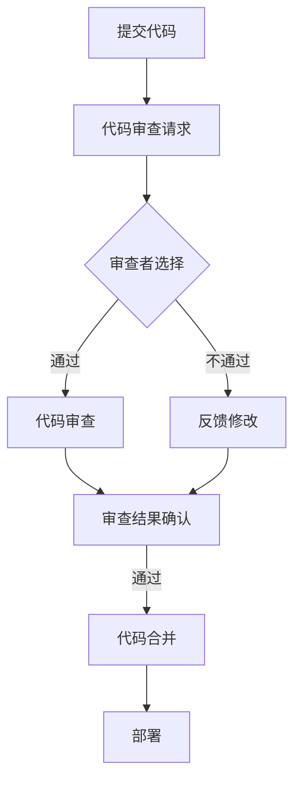

                 

### 第1章 引言

#### 1.1 书籍概述

在当今快速发展的软件开发领域，自动化代码审查与人工智能（AI）的结合已经成为提升开发效率和代码质量的关键趋势。本书旨在深入探讨这一结合的技术细节和实践应用，帮助读者理解和掌握自动化代码审查与AI技术的融合。

本书共分为八个章节，内容结构如下：

1. **引言**：介绍书籍的主题、意义和结构安排。
2. **自动化代码审查基础知识**：讲解代码审查的概念、流程和工具。
3. **AI在代码审查中的应用**：探讨AI技术在代码审查中的具体应用。
4. **AI驱动的代码质量分析**：分析代码质量评估的AI算法和应用。
5. **AI驱动的代码安全检测**：探讨代码安全检测中的AI算法和应用。
6. **AI驱动的代码风格优化**：介绍代码风格优化的AI算法和应用。
7. **自动化代码审查系统的搭建**：讲解自动化代码审查系统的开发、部署和维护。
8. **自动化代码审查与AI结合的实际应用**：分析自动化代码审查与AI结合的实践案例和未来趋势。
9. **总结与展望**：总结全书内容，展望自动化代码审查与AI结合的未来。

通过这些章节的深入讲解，读者将能够系统地了解自动化代码审查与AI技术的结合，掌握相关技术原理和实践应用，从而提升软件开发效率和代码质量。

#### 1.2 自动化代码审查与AI的结合的意义

自动化代码审查与AI技术的结合在软件开发领域具有重要的意义，主要体现在以下几个方面：

1. **提高代码质量**：自动化代码审查能够检测代码中的缺陷和潜在问题，从而提高代码的整体质量。AI技术的引入可以进一步提升审查的准确性和效率，使代码质量评估更加全面和深入。

2. **降低人力成本**：传统的代码审查通常需要大量的人力投入，而自动化代码审查与AI技术的结合可以显著降低这种人力成本。AI算法能够自动处理大量的代码审查任务，减少人工干预，提高工作效率。

3. **增强代码安全性**：代码安全检测是代码审查的重要环节。AI技术的应用可以更准确地识别代码中的安全漏洞，提前预防潜在的安全风险，从而提高软件的安全性。

4. **促进代码风格一致性**：代码风格优化是确保代码可读性和可维护性的关键。AI技术可以通过分析代码风格规范，自动修正代码风格问题，提高代码的一致性和规范性。

5. **提升开发效率**：自动化代码审查与AI技术的结合可以大大缩短代码审查的时间，使开发团队能够更快地响应需求变更，提高整体开发效率。

总之，自动化代码审查与AI技术的结合不仅能够提升代码质量、降低成本，还能增强安全性和规范性，是现代软件开发过程中不可或缺的重要手段。

#### 1.3 本书结构安排

本书共分为八个章节，每个章节都紧密围绕自动化代码审查与AI技术的结合进行深入探讨。以下是本书的结构安排和各章节的主要内容和目标：

1. **第1章 引言**：
   - **内容**：介绍书籍的主题、意义和结构安排。
   - **目标**：帮助读者了解本书的总体框架和内容。

2. **第2章 自动化代码审查基础知识**：
   - **内容**：讲解代码审查的概念、流程和工具。
   - **目标**：帮助读者建立对自动化代码审查的基础认识。

3. **第3章 AI在代码审查中的应用**：
   - **内容**：探讨AI技术在代码审查中的具体应用，如自然语言处理和机器学习模型。
   - **目标**：让读者了解AI技术在代码审查中的实际应用。

4. **第4章 AI驱动的代码质量分析**：
   - **内容**：分析代码质量评估的AI算法和应用。
   - **目标**：介绍如何利用AI技术评估代码质量。

5. **第5章 AI驱动的代码安全检测**：
   - **内容**：探讨代码安全检测中的AI算法和应用。
   - **目标**：让读者了解如何利用AI技术检测代码中的安全漏洞。

6. **第6章 AI驱动的代码风格优化**：
   - **内容**：介绍代码风格优化的AI算法和应用。
   - **目标**：帮助读者掌握如何利用AI技术优化代码风格。

7. **第7章 自动化代码审查系统的搭建**：
   - **内容**：讲解自动化代码审查系统的开发、部署和维护。
   - **目标**：指导读者如何构建和运营一个自动化代码审查系统。

8. **第8章 自动化代码审查与AI结合的实际应用**：
   - **内容**：分析自动化代码审查与AI结合的实践案例和未来趋势。
   - **目标**：提供实际应用经验和未来发展的方向。

9. **第9章 总结与展望**：
   - **内容**：总结全书内容，展望自动化代码审查与AI结合的未来。
   - **目标**：帮助读者对整个主题有一个全面的理解和未来的规划。

通过这样的结构安排，本书旨在系统地介绍自动化代码审查与AI技术的结合，帮助读者从基础知识到实际应用，逐步深入理解这一领域的核心技术和应用。

### 第2章 自动化代码审查基础知识

#### 2.1 代码审查的概念与分类

代码审查（Code Review）是一种在软件开发过程中用于提高代码质量、保证代码安全性和一致性的重要方法。它的核心目的是通过审查代码来发现潜在的错误、漏洞和不良实践，并促进开发团队之间的知识共享和协作。

**代码审查的定义：**

代码审查是一种对代码进行系统的检查和评估过程，旨在发现潜在的问题和改进代码质量。它通常由团队成员执行，以集体智慧确保代码的可靠性和可维护性。

**代码审查的分类：**

代码审查主要可以分为以下几种类型：

1. **手动代码审查（Manual Code Review）**：
   - **定义**：手动代码审查是指开发人员直接阅读代码，检查其语法、逻辑和风格。
   - **特点**：这种审查方式依赖于开发人员的经验和技能，效率较低，但能够提供更深层次的代码理解。
   - **适用场景**：适用于小规模项目或初期开发阶段，以及对代码风格和规范有严格要求的团队。

2. **自动化代码审查（Automated Code Review）**：
   - **定义**：自动化代码审查是通过工具自动执行代码检查，包括静态代码分析、单元测试等。
   - **特点**：自动化审查速度快、效率高，能够快速发现明显的代码错误，但可能忽略一些复杂的逻辑错误。
   - **适用场景**：适用于大规模项目或持续集成环境中，能够节省人力成本，提高审查效率。

3. **混合代码审查（Hybrid Code Review）**：
   - **定义**：混合代码审查结合了手动和自动化代码审查的优点，先由工具进行初步检查，再由开发人员进行细致审查。
   - **特点**：既能利用工具的高效性，又能通过手动审查提升代码质量。
   - **适用场景**：适用于各种规模和复杂度的项目，能够平衡审查效率和代码质量。

**代码审查的目的：**

1. **提高代码质量**：通过审查，可以发现代码中的错误、逻辑缺陷和风格不一致等问题，从而提高代码的整体质量。
2. **确保代码安全性**：审查可以帮助识别潜在的安全漏洞，减少代码中的安全风险。
3. **知识共享与团队协作**：代码审查是团队成员之间交流和学习的机会，能够促进知识共享和团队协作。
4. **代码规范和最佳实践**：代码审查可以帮助团队遵循统一的代码规范和最佳实践，提高代码的可读性和可维护性。

综上所述，代码审查是软件开发过程中不可或缺的一环，通过合理运用不同的审查方式，可以显著提高代码质量，确保代码的安全性和一致性。

#### 2.2 代码审查流程

代码审查流程是确保代码质量和安全性的关键步骤。一个典型的代码审查流程通常包括以下主要环节：

1. **代码提交**：
   - **定义**：代码提交是指开发人员将新编写的代码或修改后的代码提交到版本控制系统。
   - **过程**：开发人员编写代码并进行单元测试，确保代码的正确性，然后将其提交到版本库中，等待审查。

2. **代码审查请求**：
   - **定义**：代码审查请求是指团队成员向代码提交者发送的请求，要求其对提交的代码进行审查。
   - **过程**：通常由项目经理或代码提交者的上级发起审查请求，也可以通过代码审查工具自动生成。

3. **审查者选择**：
   - **定义**：审查者选择是指确定对代码进行审查的团队成员。
   - **过程**：根据项目的需求和代码的复杂度，选择具备相关技能和经验的审查者。有时也会采用多人审查机制，以提高审查的全面性和准确性。

4. **代码审查**：
   - **定义**：代码审查是指审查者对提交的代码进行仔细检查，识别潜在的缺陷、错误和不符合规范的代码。
   - **过程**：审查者阅读代码，检查代码的语法、逻辑、性能和风格等问题。可以使用代码审查工具自动检查代码中的常见问题，并通过注释或反馈形式提出改进建议。

5. **反馈与修改**：
   - **定义**：反馈与修改是指代码提交者根据审查者的反馈，对代码进行相应的修改。
   - **过程**：审查者提交反馈后，代码提交者需仔细阅读并理解反馈内容，对代码进行修改。修改后的代码需再次提交，并进入新一轮的审查流程。

6. **审查结果确认**：
   - **定义**：审查结果确认是指审查者对修改后的代码进行再次审查，确认问题是否已经解决。
   - **过程**：审查者对修改后的代码进行复检，确保所有提出的问题均已解决，且没有引入新的问题。

7. **代码合并与部署**：
   - **定义**：代码合并与部署是指将审查通过的代码合并到主分支并部署到生产环境。
   - **过程**：代码提交者将审查通过的代码合并到主分支，并进行必要的部署和测试，确保新代码能够正常运行。

**代码审查流程的优势与挑战：**

**优势：**
- 提高代码质量：通过审查流程，可以发现和修复代码中的缺陷，从而提高整体代码质量。
- 促进知识共享：审查过程促进了团队成员之间的沟通和知识共享，有助于提升团队整体技术水平。
- 规范代码风格：审查流程有助于团队遵循统一的编码规范和最佳实践，提高代码的一致性和可维护性。

**挑战：**
- 时间成本：代码审查需要耗费大量时间和人力资源，特别是在大型项目中，可能影响开发进度。
- 人力资源依赖：审查质量很大程度上依赖于审查者的经验和技能，不同审查者的标准可能存在差异。
- 负面情绪：在某些情况下，审查过程中可能产生负面情绪，影响团队成员之间的协作和士气。

**总结：**

代码审查流程是确保代码质量和安全性的关键环节，通过合理的流程设计和工具支持，可以最大程度地发挥其优势，同时克服潜在挑战，提高开发团队的协作效率和代码质量。

#### 2.3 代码审查工具概述

在自动化代码审查过程中，选择合适的工具至关重要。以下将介绍几种常见的代码审查工具，包括它们的功能、特点和适用场景，以帮助读者更好地选择适合自己项目的代码审查工具。

1. **Gerrit**
   - **功能**：Gerrit是一个基于Git的代码审查和项目管理的工具，提供了一个Web界面，支持代码的提交、审查和合并。
   - **特点**：Gerrit支持审查流程的全面管理，包括差异数据的显示、评论功能、代码审核的投票机制等。
   - **适用场景**：适合大型团队和开源项目，能够确保代码的一致性和安全性。

2. **Phabricator**
   - **功能**：Phabricator是一个开源的项目管理工具，包括任务管理、文档编写和代码审查等功能。
   - **特点**：Phabricator提供了一个统一的平台，可以集成多个项目，支持跨项目的代码审查和协作。
   - **适用场景**：适合大型企业和复杂的项目，能够提高团队协作效率。

3. **GitHub Actions**
   - **功能**：GitHub Actions是一个自动化代码审查和部署的工具，可以与GitHub仓库集成。
   - **特点**：GitHub Actions提供了丰富的集成和自动化工作流程，支持代码静态分析、单元测试和代码质量评估等。
   - **适用场景**：适合各种规模的项目，特别是与GitHub集成的工作流程，能够简化代码审查和部署过程。

4. **SonarQube**
   - **功能**：SonarQube是一个开源的代码质量管理和安全审查平台，支持多种编程语言的静态代码分析。
   - **特点**：SonarQube提供了全面的代码质量评估功能，包括代码风格检查、漏洞检测和复杂度分析等。
   - **适用场景**：适合大型项目和长期维护的项目，能够提供全面的代码质量监控和安全防护。

5. **Code Climate**
   - **功能**：Code Climate是一个专注于代码质量的平台，提供静态代码分析和代码审查服务。
   - **特点**：Code Climate提供了详细的代码质量报告和改进建议，支持多种编程语言。
   - **适用场景**：适合中小型团队和快速迭代的项目，能够快速评估代码质量并提供改进方向。

**总结：**

代码审查工具的选择应考虑项目的规模、团队协作方式和技术栈等因素。不同的工具在功能、特点和适用场景上存在差异，合理选择适合自己项目的代码审查工具，可以大大提高代码审查的效率和准确性，确保代码质量和安全性。

### 第3章 AI在代码审查中的应用

#### 3.1 AI技术简介

人工智能（Artificial Intelligence，简称AI）是计算机科学的一个分支，旨在开发能够执行通常需要人类智能的任务的机器系统。AI技术通过模拟人类思维和行为，使机器能够自主学习和决策，从而实现智能化操作。AI技术主要包括以下几种：

1. **机器学习（Machine Learning）**：
   - **定义**：机器学习是一种让计算机通过数据学习并做出决策的方法。
   - **原理**：机器学习算法通过分析大量数据，自动识别数据中的模式和规律，并利用这些模式进行预测或分类。
   - **应用**：图像识别、自然语言处理、推荐系统等。

2. **深度学习（Deep Learning）**：
   - **定义**：深度学习是机器学习的一个分支，使用神经网络（尤其是深度神经网络）进行学习和决策。
   - **原理**：深度学习通过多层神经网络处理数据，每层网络都能提取更高层次的特征，从而实现复杂任务的自动化处理。
   - **应用**：图像识别、语音识别、自动驾驶等。

3. **自然语言处理（Natural Language Processing，简称NLP）**：
   - **定义**：自然语言处理是人工智能领域的一个分支，旨在使计算机理解和生成人类自然语言。
   - **原理**：NLP通过统计方法和机器学习算法，解析文本数据，提取语义信息和模式。
   - **应用**：自动翻译、情感分析、文本分类等。

4. **计算机视觉（Computer Vision）**：
   - **定义**：计算机视觉是使计算机能够从图像或视频中理解和提取信息的技术。
   - **原理**：计算机视觉结合了图像处理、模式识别和机器学习技术，实现对图像的分析和理解。
   - **应用**：图像识别、视频监控、自动驾驶等。

通过这些技术的应用，AI能够在代码审查中发挥重要作用，提升审查的准确性和效率。

#### 3.2 自然语言处理在代码审查中的应用

自然语言处理（NLP）在代码审查中具有重要的应用价值，特别是在理解代码注释和文档方面。NLP技术能够帮助自动化代码审查工具更好地理解代码背后的意图和功能，从而提高审查的准确性和效率。

1. **代码注释理解与提取**
   - **定义**：代码注释理解与提取是指使用NLP技术分析和理解代码中的注释文本，提取关键信息。
   - **原理**：NLP技术通过文本分类、实体识别和关系提取等方法，对注释文本进行处理。例如，可以使用词性标注和句法分析技术，识别注释中的关键字和短语，提取功能描述和参数信息。
   - **应用**：自动化代码审查工具可以通过理解注释，更准确地评估代码的功能和意图，减少误报和漏报现象。

2. **代码文档生成**
   - **定义**：代码文档生成是指利用NLP技术自动生成代码的文档，包括函数说明、参数描述和功能概述等。
   - **原理**：NLP技术可以通过分析代码结构和注释，生成结构化的文档。例如，可以使用模板匹配和实体识别技术，将代码中的变量、函数和注释信息转换成文档格式。
   - **应用**：自动生成的文档可以方便开发人员快速了解代码的功能和用法，减少文档编写的工作量。

3. **注释质量评估**
   - **定义**：注释质量评估是指使用NLP技术对代码注释的质量进行评估，包括注释的完整性、准确性和一致性等。
   - **原理**：NLP技术可以通过对注释文本的语法和语义分析，评估注释的质量。例如，可以使用自然语言理解模型，判断注释是否完整、准确和符合规范。
   - **应用**：自动化代码审查工具可以使用注释质量评估，识别出需要改进的注释，提高代码的可读性和可维护性。

4. **代码缺陷定位**
   - **定义**：代码缺陷定位是指使用NLP技术定位代码中的缺陷，包括逻辑错误、语法错误和性能问题等。
   - **原理**：NLP技术可以通过对代码和注释的分析，识别代码中的潜在缺陷。例如，可以使用文本分类和模式识别技术，判断代码是否符合预期行为和规范。
   - **应用**：自动化代码审查工具可以使用代码缺陷定位，快速定位代码中的问题，提高审查效率。

总之，自然语言处理在代码审查中的应用，不仅能够提高代码审查的准确性和效率，还能提升代码的可读性和可维护性。通过NLP技术，自动化代码审查工具可以更好地理解代码，提供更全面的审查服务。

#### 3.3 机器学习模型在代码审查中的应用

机器学习模型在代码审查中具有广泛的应用，特别是在代码质量评估和代码安全检测方面。以下将详细探讨几种常见的机器学习模型及其在代码审查中的具体应用。

1. **监督学习模型**

   **定义**：监督学习模型是一种机器学习模型，其通过已有标记的数据集学习，并利用这些学习到的规律对新数据进行预测。

   **原理**：监督学习模型的核心是特征工程和模型训练。特征工程是指从数据中提取有助于预测的特征，例如，从代码中提取函数复杂度、代码长度、变量使用频率等特征。模型训练是指使用标记数据集训练模型，使其能够识别代码中的潜在问题。

   **应用**：
   - **代码质量评估**：监督学习模型可以用于评估代码的复杂度和可维护性。例如，通过分析函数复杂度、代码行数等特征，模型可以预测代码的复杂度级别，帮助开发人员识别可能需要重构的代码段。
   - **代码安全检测**：监督学习模型可以用于检测代码中的安全漏洞。例如，通过分析代码中的关键字、函数调用等特征，模型可以识别出潜在的安全漏洞，如SQL注入、跨站脚本攻击等。

2. **无监督学习模型**

   **定义**：无监督学习模型是一种机器学习模型，其在没有标记的数据集上进行学习，主要目的是发现数据中的模式或结构。

   **原理**：无监督学习模型的核心是聚类和降维。聚类是指将相似的数据点分组，以发现数据中的自然结构。降维是指通过减少数据维度，提高模型训练效率。

   **应用**：
   - **代码质量评估**：无监督学习模型可以用于识别代码中的异常模式，如代码风格不一致、函数命名不规范等。通过聚类分析，模型可以将相似的代码片段分组，帮助开发人员识别和修复这些问题。
   - **代码安全检测**：无监督学习模型可以用于发现未知的安全漏洞。例如，通过分析代码中的异常行为模式，模型可以识别出潜在的安全风险，从而提供更全面的代码安全检测。

3. **深度学习模型**

   **定义**：深度学习模型是一种基于多层神经网络的结构，其能够通过大量数据学习到复杂的特征表示。

   **原理**：深度学习模型的核心是多层神经网络，通过逐层抽象和提取数据中的特征，实现对复杂任务的自动化处理。

   **应用**：
   - **代码质量评估**：深度学习模型可以用于代码质量的全面评估，包括代码风格、复杂度和可读性等。例如，通过使用卷积神经网络（CNN）和循环神经网络（RNN），模型可以识别代码中的视觉特征和语义特征，提供更准确的代码质量评估。
   - **代码安全检测**：深度学习模型可以用于检测代码中的高级安全漏洞，如数据泄露、权限提升等。通过使用深度学习模型，开发人员可以更全面地识别潜在的安全威胁。

总之，机器学习模型在代码审查中的应用，可以显著提高代码质量和安全性。通过合理选择和应用不同的机器学习模型，自动化代码审查工具可以更准确地识别代码中的问题，提升审查效率和准确性。

### 第4章 AI驱动的代码质量分析

#### 4.1 代码质量评估指标

代码质量评估是确保软件项目成功的关键环节，而评估指标的选择和定义直接影响评估的准确性和可靠性。以下是一些常见的代码质量评估指标及其重要性：

1. **可读性（Readability）**：
   - **定义**：可读性是指代码的可理解性和易读性，即代码是否易于阅读和理解。
   - **重要性**：良好的代码可读性能够提高开发团队的协作效率，减少维护成本，增强代码的可维护性。

2. **复杂性（Complexity）**：
   - **定义**：复杂性是指代码结构的复杂程度，通常使用函数复杂度、类复杂度和方法复杂度等指标来衡量。
   - **重要性**：代码复杂性过高可能导致代码难以维护和理解，增加出错的概率。

3. **重复性（Duplication）**：
   - **定义**：重复性是指代码中的重复代码段，通常通过代码重复率（Code Duplication Rate）来衡量。
   - **重要性**：高重复性代码会增加维护成本和出错概率，降低代码的可维护性。

4. **可维护性（Maintainability）**：
   - **定义**：可维护性是指代码易于修改和扩展的程度，包括代码的灵活性和可扩展性。
   - **重要性**：良好的可维护性能够降低长期维护成本，提高开发效率和代码质量。

5. **性能（Performance）**：
   - **定义**：性能是指代码的执行效率和资源占用情况，通常通过响应时间、内存消耗和CPU利用率等指标来衡量。
   - **重要性**：良好的性能能够提高用户体验和系统稳定性，是确保软件正常运行的关键。

6. **安全性（Security）**：
   - **定义**：安全性是指代码抵御外部攻击和内部错误的能力，包括代码的漏洞检测和安全加固。
   - **重要性**：代码安全性是确保软件安全和用户隐私的关键，任何安全漏洞都可能带来严重的风险。

7. **一致性（Consistency）**：
   - **定义**：一致性是指代码在风格、命名和规范上的统一性。
   - **重要性**：一致性能够提高代码的可读性和可维护性，减少团队成员之间的误解和冲突。

通过综合运用这些评估指标，开发团队可以全面了解代码的质量状况，制定相应的改进措施，从而提升代码的整体质量和项目成功率。

#### 4.2 AI算法在代码质量分析中的应用

在代码质量分析中，AI算法的应用极大地提升了自动化和准确性。以下将介绍几种常见的AI算法及其在代码质量分析中的应用：

1. **决策树（Decision Tree）**
   - **定义**：决策树是一种常见的监督学习算法，通过一系列条件判断来分类或回归数据。
   - **原理**：决策树通过递归划分特征空间，在每个节点上选择最佳特征进行划分，直到达到某个终止条件（如最大深度或最小样本数）。
   - **应用**：在代码质量分析中，决策树可以用于分类任务，如评估代码行数的复杂度级别，通过训练数据集学习到不同代码行数对应的复杂度等级，从而预测新代码的复杂度。

2. **随机森林（Random Forest）**
   - **定义**：随机森林是一种基于决策树的集成学习方法，通过构建多个决策树，并使用投票机制来决定最终预测结果。
   - **原理**：随机森林在构建每个决策树时，从特征集合中随机选取一部分特征进行划分，从而减少过拟合现象。
   - **应用**：随机森林可以用于代码质量评估中的多分类任务，如同时评估代码的可读性、复杂性和可维护性，通过多个决策树的集成提高预测的准确性和鲁棒性。

3. **支持向量机（Support Vector Machine，SVM）**
   - **定义**：支持向量机是一种监督学习算法，通过找到最佳的超平面来分割数据。
   - **原理**：SVM通过最大化分类边界，将数据点分配到不同的类别。对于非线性问题，可以通过核函数将数据映射到高维空间。
   - **应用**：SVM可以用于代码质量分析中的非线性分类任务，如检测代码中的安全漏洞，通过将代码特征映射到高维空间，SVM能够更准确地识别不同类型的安全漏洞。

4. **神经网络（Neural Networks）**
   - **定义**：神经网络是一种模仿人脑结构和功能的计算模型，通过多层神经元实现数据的自动特征提取和模式识别。
   - **原理**：神经网络通过前向传播和反向传播算法，不断调整权重和偏置，优化网络的预测能力。
   - **应用**：神经网络可以用于代码质量分析中的复杂任务，如代码风格评估、代码缺陷预测等，通过多层神经元的结构和丰富的非线性变换，神经网络能够捕捉代码中的复杂模式和关系。

5. **聚类算法（Clustering Algorithms）**
   - **定义**：聚类算法是一种无监督学习算法，通过将相似的数据点分组，发现数据中的隐含结构。
   - **原理**：聚类算法通过优化目标函数，如最小化簇内距离和最大化簇间距离，自动划分数据点。
   - **应用**：聚类算法可以用于代码质量分析中的模式识别，如识别代码中的风格不一致问题。通过将代码行分组，聚类算法可以找出风格相似的代码段，帮助开发人员进行改进。

通过这些AI算法的应用，代码质量分析可以更加高效和准确。开发团队可以根据具体需求选择合适的算法，构建智能化的代码质量分析系统，从而提升代码的整体质量。

#### 4.3 代码质量分析案例

为了更好地理解AI在代码质量分析中的应用，以下将通过一个实际案例展示如何利用AI技术对代码质量进行评估。

**案例背景：**  
某开发团队正在开发一个大型Web应用项目，项目包括多个模块，涉及多个编程语言和框架。由于项目规模庞大，团队希望能够通过自动化手段对代码质量进行全面评估，以便及时发现和解决潜在问题。

**目标：**  
使用AI技术对代码质量进行综合评估，重点包括代码复杂性、可读性、可维护性和安全性等方面。

**步骤：**

1. **数据收集与预处理：**
   - **数据来源**：从版本控制系统（如Git）中提取代码，包括源代码文件、提交记录和注释。
   - **数据预处理**：对提取的代码进行预处理，包括去噪、去除无关信息和文本分类等。例如，将代码文本进行分词，提取关键函数、变量和关键字等。

2. **特征提取：**
   - **特征选择**：根据代码质量评估指标，选择合适的特征，如代码行数、函数复杂度、代码重复率、注释率、代码风格一致性等。
   - **特征工程**：通过统计分析、词频分析和文本分类等技术，对提取的特征进行编码和规范化，以便于后续的机器学习模型训练。

3. **模型选择与训练：**
   - **模型选择**：根据评估目标和数据特点，选择合适的机器学习模型。例如，使用随机森林模型进行多分类任务，使用神经网络进行回归任务。
   - **模型训练**：使用标记的数据集对选定的模型进行训练。例如，将已有的代码质量评估结果作为训练数据，训练模型识别代码质量问题。

4. **代码质量评估：**
   - **评估过程**：使用训练好的模型对新的代码进行质量评估。模型会根据输入的特征数据，输出代码质量评估结果，包括代码复杂性、可读性、可维护性和安全性等方面的得分。
   - **结果展示**：通过可视化工具展示评估结果，如图表、热力图等，帮助开发人员直观地了解代码质量状况。

**案例结果：**

- **代码复杂性评估**：模型能够准确识别代码中的高复杂度函数和模块，并提供改进建议，如简化代码逻辑、分解复杂函数等。
- **可读性评估**：模型能够评估代码的可读性，识别出注释不足、变量命名不规范等问题，并提出相应的改进建议。
- **可维护性评估**：模型能够分析代码的维护性，识别出潜在的维护困难点，如代码重复、函数过于复杂等，帮助开发人员优化代码结构。
- **安全性评估**：模型能够检测代码中的安全漏洞，如SQL注入、跨站脚本攻击等，并提供修复建议，提高代码的安全性。

**总结：**

通过实际案例可以看出，AI技术在代码质量分析中的应用能够显著提升代码评估的准确性和效率。开发团队可以根据评估结果，针对性地进行代码优化，提升整体项目质量，缩短开发周期。

### 第5章 AI驱动的代码安全检测

#### 5.1 代码安全检测的概念

代码安全检测是确保软件系统安全性的关键环节，它旨在识别和预防代码中的潜在安全漏洞。代码安全检测通常分为静态代码分析和动态代码分析两种方法。

**静态代码分析（Static Code Analysis）**：
- **定义**：静态代码分析是一种在不运行代码的情况下，通过分析源代码或编译后的代码来检测潜在的安全漏洞和不良代码实践。
- **原理**：静态代码分析工具会读取代码文件，检查代码中的语法、语义和结构，识别出不符合安全规范的代码段。常见的分析方法包括模式匹配、抽象语法树分析、数据流分析等。
- **优势**：静态代码分析可以在开发阶段及早发现安全漏洞，降低漏洞修复的成本，适用于大规模代码库。

**动态代码分析（Dynamic Code Analysis）**：
- **定义**：动态代码分析是一种在运行代码的过程中，通过观察程序的行为来检测潜在的安全漏洞。
- **原理**：动态代码分析工具会运行代码，监控程序的输入输出、内存使用、网络通信等行为，通过模拟攻击或自动化测试来识别安全漏洞。常见的分析方法包括模糊测试、符号执行、路径分析等。
- **优势**：动态代码分析可以检测静态分析无法发现的运行时漏洞，更接近实际应用环境，适用于实时监测和测试。

通过结合静态代码分析和动态代码分析，开发团队可以全面评估代码的安全性，提高软件系统的整体安全性。

#### 5.2 AI算法在代码安全检测中的应用

AI算法在代码安全检测中发挥着重要作用，通过引入机器学习和深度学习技术，可以显著提高检测的准确性和效率。以下介绍几种常见的AI算法及其在代码安全检测中的应用：

1. **基于机器学习的代码安全检测**

   **定义**：机器学习代码安全检测利用已有的漏洞数据训练模型，从而自动识别新的代码中的潜在漏洞。

   **原理**：
   - **特征工程**：从代码中提取特征，如函数名、变量名称、代码模式、语法结构等。
   - **模型训练**：使用标记的漏洞数据集训练机器学习模型，如支持向量机（SVM）、随机森林（Random Forest）、神经网络（Neural Networks）等。
   - **漏洞识别**：对新代码进行特征提取，将提取的特征输入训练好的模型，预测代码中是否存在漏洞。

   **应用**：
   - **漏洞分类**：机器学习模型可以用于分类任务，如识别SQL注入、跨站脚本攻击、缓冲区溢出等常见漏洞类型。
   - **漏洞预测**：通过分析代码特征，模型可以预测代码中可能存在的漏洞位置和风险等级。

2. **基于深度学习的代码安全检测**

   **定义**：深度学习代码安全检测利用多层神经网络从代码中自动提取特征，实现更高级的漏洞识别。

   **原理**：
   - **卷积神经网络（CNN）**：通过卷积层提取代码的视觉特征，如函数结构和控制流。
   - **递归神经网络（RNN）**：通过循环层处理代码的序列信息，如变量依赖和函数调用。
   - **长短时记忆网络（LSTM）**：结合了RNN的优势，能够捕捉代码中的长距离依赖关系。

   **应用**：
   - **代码漏洞检测**：深度学习模型可以自动识别复杂的代码漏洞，如未初始化的指针、内存泄漏等。
   - **异常检测**：通过监测代码的运行行为，模型可以识别出异常行为，如潜在的缓冲区溢出攻击。

3. **基于规则和机器学习的混合模型**

   **定义**：混合模型结合了传统规则和机器学习的优势，通过规则引擎和机器学习模型的协同工作，提高漏洞检测的准确性和效率。

   **原理**：
   - **规则引擎**：基于预定义的漏洞规则，快速识别常见的漏洞。
   - **机器学习模型**：通过分析复杂代码模式和上下文，补充规则引擎的不足。

   **应用**：
   - **多层次的漏洞检测**：混合模型可以同时利用规则和机器学习的优势，对代码进行全面、多层次的漏洞检测。
   - **实时漏洞监控**：通过持续监控代码的运行行为和静态分析结果，模型可以实时识别和报告新的漏洞。

通过引入AI算法，代码安全检测可以更加智能和高效。开发团队可以根据项目的具体需求，选择合适的AI算法和模型，构建一套全面的代码安全检测系统，从而提高软件系统的安全性。

#### 5.3 代码安全检测案例

为了更好地展示AI算法在代码安全检测中的应用，以下将通过一个实际案例来说明如何利用AI技术进行代码安全检测。

**案例背景：**  
某开发团队正在开发一款金融交易软件，该软件涉及大量敏感数据的处理。团队希望利用AI技术对代码进行安全检测，确保软件在开发阶段就能够识别并修复潜在的安全漏洞。

**目标：**  
使用AI技术对代码进行全面安全检测，识别出潜在的SQL注入、跨站脚本攻击、缓冲区溢出等安全漏洞。

**步骤：**

1. **数据收集与预处理：**
   - **数据来源**：从代码库中提取源代码文件，包括JavaScript、Python、C++等语言。
   - **数据预处理**：对提取的代码进行预处理，去除无关注释和空行，提取关键代码段和函数。

2. **特征提取：**
   - **特征选择**：根据常见的代码安全漏洞特征，选择合适的特征，如函数名、变量名称、关键字、语法模式等。
   - **特征工程**：对提取的特征进行编码和规范化，以便于后续的机器学习模型训练。

3. **模型选择与训练：**
   - **模型选择**：结合代码语言和漏洞类型，选择合适的机器学习模型，如随机森林、深度学习模型等。
   - **模型训练**：使用标记的漏洞数据集训练模型，模型会自动学习识别漏洞的规律和特征。

4. **代码安全检测：**
   - **检测过程**：将预处理后的代码输入训练好的模型，模型会输出代码中的潜在安全漏洞，包括漏洞类型、位置和风险等级。
   - **结果展示**：通过可视化工具展示检测结果，如图表、热力图等，帮助开发人员直观地了解代码的安全状况。

**案例结果：**

- **SQL注入检测**：模型能够识别出代码中潜在的SQL注入漏洞，如未加引号的变量、动态构造SQL语句等。
- **跨站脚本攻击检测**：模型能够检测出可能导致跨站脚本攻击的代码段，如未转义的用户输入、未处理的HTML标签等。
- **缓冲区溢出检测**：模型能够识别出可能导致缓冲区溢出的代码段，如数组越界、格式字符串漏洞等。

**总结：**

通过实际案例可以看出，AI技术在代码安全检测中的应用能够显著提升检测的准确性和效率。开发团队可以根据检测结果，及时修复代码中的安全漏洞，提高软件系统的安全性。

### 第6章 AI驱动的代码风格优化

#### 6.1 代码风格优化的概念

代码风格优化是确保代码可读性、可维护性和一致性的一项重要工作。良好的代码风格不仅可以提高代码的质量，还能减少团队成员之间的沟通障碍，提高开发效率。以下将介绍代码风格优化的相关概念：

**定义：**
代码风格优化（Code Style Optimization）是指通过对代码的语法、命名、注释等方面进行改进，使其更符合既定的编码规范和最佳实践。优化的目标是提高代码的可读性、可维护性和可扩展性。

**重要性：**
- **可读性**：良好的代码风格使得代码更加清晰易懂，方便其他开发者阅读和理解，减少误读和误解。
- **可维护性**：一致的代码风格有助于维护代码，降低后续修改的复杂度，减少维护成本。
- **一致性**：统一的代码风格有助于保持项目的一致性，避免因为个人风格差异导致代码混乱。
- **可扩展性**：良好的代码风格使得代码更容易扩展和重构，提高系统的灵活性和适应性。

**常见的代码风格问题：**
- **命名不规范**：变量、函数和类等命名不统一、不规范，影响代码的可读性。
- **代码冗长**：代码过长，导致逻辑不清晰，难以维护。
- **代码重复**：代码段重复，导致维护困难，增加出错概率。
- **注释不足**：代码注释不足，影响代码的可理解性。
- **代码格式不一致**：代码格式（如缩进、空格、括号等）不一致，影响代码的可读性。
- **函数复杂度过高**：函数过于复杂，难以理解和维护。

通过识别和解决这些常见的代码风格问题，可以显著提升代码的质量和团队的开发效率。

#### 6.2 AI算法在代码风格优化中的应用

AI算法在代码风格优化中具有显著的应用价值，通过自然语言处理（NLP）和机器学习等技术，可以自动化识别和修正代码风格问题，提高代码的一致性和可读性。以下将介绍几种常见的AI算法及其在代码风格优化中的应用：

1. **自然语言处理（NLP）算法**

   **定义**：自然语言处理是一种使计算机能够理解、生成和处理人类自然语言的技术。

   **原理**：
   - **词法分析**：将代码文本分解为单词、词组和符号等基本元素，为后续处理提供基础。
   - **语法分析**：分析代码的结构和语法规则，识别出代码中的语法错误和不规范的命名。
   - **语义分析**：理解代码的含义和上下文，识别出风格不一致的问题。

   **应用**：
   - **代码风格检测**：使用NLP算法分析代码中的命名、注释和语法，识别出不符合编码规范的问题，如命名不一致、注释缺失、语法错误等。
   - **自动修复**：基于NLP算法，可以自动修改代码中的不规范命名和注释，使其符合编码规范。

2. **机器学习算法**

   **定义**：机器学习是一种使计算机通过数据学习并做出预测或决策的技术。

   **原理**：
   - **监督学习**：使用标记的数据集训练模型，模型可以自动识别和修正代码中的风格问题。
   - **无监督学习**：在没有标记的数据集上训练模型，模型可以自动发现和修正代码中的风格不一致问题。

   **应用**：
   - **风格一致性评估**：使用监督学习算法，对代码风格进行评估，识别出不符合编码规范的问题，如函数复杂度过高、代码冗长等。
   - **自动化修复**：使用无监督学习算法，自动识别和修正代码中的不一致风格，如缩进错误、括号不匹配等。

3. **深度学习算法**

   **定义**：深度学习是一种基于多层神经网络的机器学习技术，能够自动提取数据中的复杂特征。

   **原理**：
   - **卷积神经网络（CNN）**：通过卷积层提取代码中的视觉特征，如函数结构和控制流。
   - **递归神经网络（RNN）**：通过循环层处理代码的序列信息，如变量依赖和函数调用。
   - **长短时记忆网络（LSTM）**：结合了RNN的优势，能够捕捉代码中的长距离依赖关系。

   **应用**：
   - **代码风格检测**：使用深度学习算法，可以自动检测代码中的风格问题，如命名不规范、注释缺失等。
   - **代码风格修正**：基于深度学习算法，可以自动修正代码中的风格不一致问题，如缩进、括号等。

通过引入AI算法，代码风格优化可以变得更加高效和智能化。开发团队可以根据项目需求，选择合适的AI算法和工具，自动化识别和修正代码风格问题，提高代码的整体质量。

#### 6.3 代码风格优化案例

为了更好地展示AI算法在代码风格优化中的应用，以下将通过一个实际案例来说明如何利用AI技术优化代码风格。

**案例背景：**  
某开发团队正在开发一款大型分布式系统，项目涉及多种编程语言和框架。由于团队成员众多，代码风格差异较大，导致代码库中存在许多风格不一致的问题，影响了代码的可读性和可维护性。团队希望通过AI技术自动化解决代码风格问题，提高代码的一致性和质量。

**目标：**  
使用AI技术自动化识别和修正代码中的风格不一致问题，包括命名不规范、注释缺失、代码冗长等。

**步骤：**

1. **数据收集与预处理：**
   - **数据来源**：从代码库中提取所有源代码文件，包括Java、Python、C++等。
   - **数据预处理**：对提取的代码进行预处理，去除无关注释和空行，提取关键代码段和函数。

2. **特征提取：**
   - **特征选择**：根据常见的代码风格问题，选择合适的特征，如变量命名、函数长度、注释率等。
   - **特征工程**：对提取的特征进行编码和规范化，为后续的机器学习模型训练做准备。

3. **模型选择与训练：**
   - **模型选择**：结合代码语言和风格优化目标，选择合适的机器学习模型，如随机森林、深度学习模型等。
   - **模型训练**：使用标记的代码数据集训练模型，模型会自动学习识别和修正代码风格问题的规律。

4. **代码风格优化：**
   - **优化过程**：将预处理后的代码输入训练好的模型，模型会输出代码中的风格不一致问题，并提供修正建议。
   - **结果展示**：通过可视化工具展示优化结果，如图表、热力图等，帮助开发人员直观地了解代码的优化状况。

**案例结果：**

- **命名规范修正**：模型能够自动识别不规范的变量命名，并推荐符合编码规范的命名方案。
- **注释补充**：模型能够检测缺失的注释，并提供补充注释的建议，提高代码的可读性。
- **代码简化**：模型能够识别冗长的代码段，提供简化的代码实现，提高代码的可维护性。
- **代码格式修正**：模型能够自动修正代码格式问题，如缩进不一致、括号不匹配等，提高代码的一致性。

**总结：**

通过实际案例可以看出，AI技术在代码风格优化中的应用能够显著提升代码的质量和一致性。开发团队可以根据AI算法提供的优化建议，自动化识别和修正代码风格问题，提高代码的可读性、可维护性和可扩展性。

### 第7章 自动化代码审查系统的搭建

#### 7.1 开发环境搭建

搭建自动化代码审查系统需要准备一定的开发环境，包括软件工具、硬件资源和必要的开发框架。以下将详细介绍所需的工具和步骤：

1. **选择开发工具：**
   - **版本控制系统**：如Git、Gerrit、GitLab等，用于代码管理和版本控制。
   - **代码审查工具**：如Gerrit、Phabricator、GitHub Actions等，用于代码审查流程管理。
   - **静态代码分析工具**：如SonarQube、Checkstyle、PMD等，用于代码质量分析。
   - **安全检测工具**：如OWASP ZAP、Fortify、Snyk等，用于代码安全检测。

2. **安装开发环境：**
   - **操作系统**：根据团队需求，可以选择Linux、Windows或macOS等操作系统。
   - **安装Git**：在操作系统上安装Git，用于代码的版本控制和提交。
   - **安装代码审查工具**：根据所选代码审查工具的文档，完成安装和配置。
   - **安装静态代码分析工具**：根据所选静态代码分析工具的文档，完成安装和配置。
   - **安装安全检测工具**：根据所选安全检测工具的文档，完成安装和配置。

3. **配置开发环境：**
   - **集成开发环境（IDE）**：如IntelliJ IDEA、Visual Studio Code等，用于代码编写和调试。
   - **编辑器配置**：配置代码格式化工具，如EditorConfig、Clang Format等，确保代码风格一致。
   - **CI/CD工具**：如Jenkins、GitLab CI/CD、GitHub Actions等，用于自动化构建和测试。

4. **测试开发环境：**
   - **提交代码**：在版本控制系统中提交代码，测试代码审查工具是否正常工作。
   - **执行静态代码分析**：运行静态代码分析工具，检查代码中是否存在质量问题和安全漏洞。
   - **执行安全检测**：运行安全检测工具，检查代码中是否存在潜在的安全风险。

通过以上步骤，可以搭建一个基本的自动化代码审查系统开发环境，为后续系统的设计和实现奠定基础。

#### 7.2 代码审查系统的设计与实现

构建自动化代码审查系统是一个复杂的过程，需要综合考虑系统的架构、模块设计、功能实现等多个方面。以下将详细描述代码审查系统的设计与实现过程：

1. **系统架构设计**

   **定义**：系统架构设计是指确定系统的整体结构和组成部分，以及各个部分之间的相互作用关系。

   **架构设计原则**：
   - **模块化**：将系统划分为多个模块，每个模块负责特定的功能。
   - **可扩展性**：系统应具有可扩展性，能够支持添加新功能或适应不同的项目需求。
   - **高可用性**：系统应具备高可用性，能够在出现故障时快速恢复。

   **架构组成**：
   - **前端模块**：负责用户界面的展示和交互，包括Web界面和命令行界面。
   - **后端模块**：负责处理业务逻辑和数据存储，包括代码提交、审查流程管理、质量评估和安全检测等功能。
   - **服务模块**：提供公共服务，如用户认证、权限管理、日志记录等。
   - **数据库模块**：存储代码库、用户信息、审查记录等数据。

2. **模块设计**

   **定义**：模块设计是指对系统中的每个模块进行详细设计，确定模块的功能和接口。

   **前端模块设计**：
   - **功能**：显示代码审查的请求、反馈、结果等信息，提供用户交互界面。
   - **接口**：与后端模块进行数据交互，如提交代码、获取审查结果等。

   **后端模块设计**：
   - **功能**：
     - 代码提交：接收开发人员的代码提交请求，并将其存储在版本控制系统中。
     - 审查流程管理：管理代码审查的整个流程，包括请求审查、分配审查者、审查反馈等。
     - 质量评估：使用静态代码分析工具对代码进行质量评估，识别代码中的质量问题。
     - 安全检测：使用安全检测工具对代码进行安全检测，识别潜在的安全漏洞。
   - **接口**：与前端模块进行数据交互，提供API接口供前端调用。

   **服务模块设计**：
   - **功能**：提供公共服务，如用户认证、权限管理、日志记录等。
   - **接口**：与后端模块和前端模块进行数据交互。

   **数据库模块设计**：
   - **功能**：存储代码库、用户信息、审查记录等数据。
   - **接口**：提供数据库操作接口，供后端模块进行数据访问。

3. **功能实现**

   **定义**：功能实现是指根据模块设计，具体实现每个模块的功能。

   **前端模块实现**：
   - **界面设计**：使用HTML、CSS和JavaScript设计用户界面，实现用户交互功能。
   - **数据交互**：使用AJAX或Fetch API与后端模块进行数据交互，实现实时反馈和更新。

   **后端模块实现**：
   - **代码提交**：接收前端提交的代码，通过API与版本控制系统进行交互，完成代码提交。
   - **审查流程管理**：设计审查流程管理逻辑，根据审查规则和策略，分配审查者并管理审查流程。
   - **质量评估**：调用静态代码分析工具的API，对代码进行分析和评估，生成质量报告。
   - **安全检测**：调用安全检测工具的API，对代码进行安全检测，生成安全报告。

   **服务模块实现**：
   - **用户认证**：实现用户登录、注册和权限管理功能。
   - **日志记录**：实现日志记录功能，记录系统运行过程中的重要信息。

   **数据库模块实现**：
   - **数据存储**：设计数据库架构，实现数据表的创建和查询操作。
   - **数据访问**：提供数据访问接口，供后端模块进行数据操作。

通过以上设计与实现步骤，可以构建一个功能完备、高效可靠的自动化代码审查系统。开发团队可以根据项目需求，灵活扩展系统功能，提高代码审查的效率和质量。

#### 7.3 系统部署与维护

自动化代码审查系统的部署与维护是确保其稳定运行和持续优化的重要环节。以下将详细介绍系统部署的步骤、维护策略以及常见问题的解决方法。

1. **系统部署**

   **定义**：系统部署是指将开发完成的代码审查系统安装到生产环境中，使其能够对外提供服务。

   **部署步骤**：
   - **环境准备**：根据系统需求准备服务器和网络环境，确保服务器具备足够的硬件资源和网络带宽。
   - **安装基础软件**：在服务器上安装操作系统、数据库、Web服务器等基础软件，确保其正常运行。
   - **部署代码**：将开发完成的代码审查系统上传到服务器，并通过自动化脚本或手动方式部署到服务器上。
   - **配置服务**：根据系统配置文件，配置数据库、Web服务器等服务的参数，确保服务正常运行。
   - **初始化数据**：初始化数据库，导入用户数据、项目数据等，为系统正常运行做准备。
   - **启动服务**：启动Web服务器、数据库服务等，确保系统服务正常启动并对外提供服务。

2. **维护策略**

   **定义**：系统维护是指对系统进行监控、更新和优化，确保其稳定性和高效性。

   **维护策略**：
   - **定期监控**：通过监控系统（如Nagios、Zabbix等），定期检查系统的运行状态，包括CPU、内存、磁盘使用情况等，及时发现和处理异常。
   - **备份与恢复**：定期备份数据库和系统配置文件，确保在系统出现故障时能够快速恢复。
   - **安全防护**：定期更新系统的安全补丁，防止潜在的安全威胁。同时，部署防火墙、入侵检测系统等安全措施，保障系统的安全性。
   - **性能优化**：通过性能监控工具（如New Relic、AppDynamics等），定期检查系统的性能瓶颈，优化数据库查询、代码逻辑等，提高系统性能。
   - **自动化部署**：使用自动化部署工具（如Jenkins、Docker等），实现系统的自动化部署和升级，减少人工干预，提高部署效率。

3. **常见问题与解决方法**

   **定义**：常见问题是指在系统运行过程中遇到的一些常见故障或问题，解决方法是针对这些故障或问题的处理方法。

   **常见问题**：
   - **服务无法启动**：可能由于依赖服务未启动或配置错误导致。检查依赖服务是否正常运行，确保所有配置文件正确。
   - **数据库连接失败**：可能由于数据库配置错误或网络问题导致。检查数据库服务是否正常运行，确认网络连接正常。
   - **代码审查失败**：可能由于代码质量分析工具或安全检测工具配置错误导致。检查相关工具的配置文件，确保其正确配置。
   - **性能下降**：可能由于系统资源不足或数据库查询效率低下导致。检查系统资源使用情况，优化数据库查询和系统配置。
   - **安全漏洞**：可能由于系统未及时更新安全补丁或配置不当导致。定期更新系统补丁，检查和优化系统配置。

   **解决方法**：
   - **服务无法启动**：重新启动服务或检查日志文件，查找错误信息，根据提示进行修复。
   - **数据库连接失败**：检查数据库服务是否正常启动，确保数据库配置文件正确，检查网络连接情况。
   - **代码审查失败**：检查代码质量分析工具和安全检测工具的配置文件，确保其正确配置，检查日志文件查找错误信息。
   - **性能下降**：优化数据库查询，使用索引、优化查询语句等提高查询效率，检查系统资源使用情况，调整系统配置。
   - **安全漏洞**：定期更新系统补丁，检查和修复系统配置中的安全漏洞，部署防火墙和入侵检测系统等安全措施。

通过以上部署与维护策略，开发团队可以确保自动化代码审查系统的稳定运行和持续优化，从而提升代码审查的效率和准确性。

### 第8章 自动化代码审查与AI结合的实际应用

#### 8.1 行业应用案例分析

自动化代码审查与AI技术的结合在多个行业中都取得了显著的成果。以下将介绍几个具有代表性的行业应用案例，分析其成功的关键因素和经验教训。

1. **金融行业**

   **案例背景**：某大型银行在其开发团队中引入了基于AI的自动化代码审查系统，以提升代码质量和安全性。

   **成功因素**：
   - **高安全需求**：金融行业对安全性的要求极高，自动化代码审查系统能够有效识别和修复代码中的安全漏洞。
   - **高效审查**：AI技术能够快速处理大量代码，大幅提高审查效率，缩短开发周期。
   - **持续集成**：自动化代码审查系统与银行的持续集成（CI）流程紧密集成，确保每次提交的代码都经过全面审查。

   **经验教训**：
   - **初期投入大**：引入自动化代码审查系统需要大量初期投入，包括人员培训和技术投入。
   - **适应期长**：开发团队需要时间适应新的审查流程和工具，初期可能会出现效率降低的情况。

2. **软件开发公司**

   **案例背景**：某知名软件开发公司在其多个项目中采用了AI驱动的自动化代码审查系统，以提升开发效率。

   **成功因素**：
   - **项目多样化**：该公司涉及多个不同类型的项目，自动化代码审查系统能够灵活适应不同的开发需求。
   - **质量保证**：通过AI技术，系统能够提供更全面的质量评估，识别出潜在的质量问题和安全漏洞。
   - **团队协作**：自动化代码审查系统促进了团队成员之间的协作，提高了代码的一致性和规范性。

   **经验教训**：
   - **定制化需求**：不同项目的需求差异较大，自动化代码审查系统需要具备较高的定制化能力。
   - **工具选择**：需要仔细评估和选择适合自身需求的自动化代码审查工具，确保其能够满足项目要求。

3. **汽车制造行业**

   **案例背景**：某汽车制造商在其软件开发团队中引入了基于AI的自动化代码审查系统，以提高软件质量和安全性。

   **成功因素**：
   - **复杂系统**：汽车制造行业的软件系统复杂度高，自动化代码审查系统能够高效地处理复杂的代码结构。
   - **安全性重要**：汽车软件的安全性至关重要，自动化代码审查系统能够提前识别潜在的安全风险。
   - **长期维护**：自动化代码审查系统有助于提高代码的可维护性，降低长期维护成本。

   **经验教训**：
   - **硬件资源需求**：汽车制造行业通常对硬件资源需求较高，需要确保服务器和存储设备能够满足系统运行需求。
   - **适应度问题**：自动化代码审查系统可能需要较长时间适应特定的软件开发流程和代码风格。

通过这些案例可以看出，自动化代码审查与AI技术的结合在各个行业都取得了显著成效。成功的关键因素包括高安全需求、高效审查、持续集成和团队协作。同时，引入自动化代码审查系统也需要考虑到初期投入大、适应期长和定制化需求等问题。

#### 8.2 自动化代码审查与AI结合的发展趋势

自动化代码审查与AI技术的结合正朝着更加智能化和高效化的方向快速发展，以下是该领域的发展趋势：

1. **智能化审查算法**：
   - **深度学习应用**：随着深度学习技术的进步，更多复杂的算法将被应用于代码审查，如利用深度学习模型进行代码质量评估和漏洞检测。
   - **自适应审查系统**：通过机器学习技术，审查系统将能够根据项目特点和历史数据自动调整审查策略，提供更精准的审查服务。

2. **全流程自动化**：
   - **集成化开发环境**：自动化代码审查系统将更加紧密地集成到集成开发环境（IDE）中，提供一站式的代码审查、质量评估和安全检测服务。
   - **持续集成（CI）与持续交付（CD）**：自动化代码审查系统将更好地与CI/CD流程集成，确保每次代码提交都经过全面审查，提高开发效率。

3. **跨语言支持**：
   - **多语言适配**：自动化代码审查系统将支持更多编程语言，如Python、Java、C++等，提供更全面的代码审查服务。
   - **跨框架支持**：自动化代码审查系统将能够适应不同的开发框架和工具，提高系统的通用性和灵活性。

4. **安全性与隐私保护**：
   - **更严格的安全检测**：随着安全威胁的日益增多，自动化代码审查系统将引入更严格的安全检测机制，如自动化漏洞扫描、恶意代码检测等。
   - **隐私保护**：在审查过程中，自动化代码审查系统将更加重视用户隐私保护，确保审查过程中的数据安全。

5. **云原生部署**：
   - **云端服务**：自动化代码审查系统将更多地采用云原生架构，提供云端服务，降低部署和维护成本。
   - **容器化与微服务**：自动化代码审查系统将采用容器化和微服务架构，提高系统的可扩展性和灵活性。

通过以上发展趋势，自动化代码审查与AI技术将更加智能化、自动化和高效化，为软件开发过程提供更加全面和精准的支持。

#### 8.3 自动化代码审查与AI结合的潜在挑战与解决方案

尽管自动化代码审查与AI技术的结合在提升代码质量和安全性方面具有显著优势，但在实际应用过程中仍面临一些潜在挑战。以下将分析这些挑战，并提出相应的解决方案。

1. **数据隐私和安全**

   **挑战**：自动化代码审查系统需要处理大量的代码数据，这涉及到数据隐私和安全问题。

   **解决方案**：
   - **数据加密**：对存储和传输的代码数据进行加密，确保数据在未授权情况下无法被访问。
   - **访问控制**：实施严格的访问控制策略，确保只有授权用户才能访问和修改代码数据。
   - **审计日志**：记录所有数据访问和修改日志，以便在出现问题时进行追踪和审计。

2. **算法透明性和解释性**

   **挑战**：深度学习模型在代码审查中的应用通常具有较高的准确性，但其决策过程往往不够透明，难以解释。

   **解决方案**：
   - **模型可解释性**：开发可解释的AI模型，如决策树和规则引擎，使审查过程更具透明性。
   - **可视化工具**：提供可视化工具，帮助开发人员理解模型决策过程，提高模型的解释性。
   - **透明性审计**：定期进行算法透明性审计，确保模型决策过程的合理性和合规性。

3. **工具兼容性和扩展性**

   **挑战**：不同的编程语言和框架可能需要不同的代码审查工具和算法，自动化代码审查系统需要具备高兼容性和扩展性。

   **解决方案**：
   - **多语言支持**：开发支持多种编程语言的自动化代码审查工具，提高系统的通用性。
   - **模块化设计**：采用模块化设计，灵活组合不同模块，适应不同的项目需求。
   - **插件机制**：提供插件机制，允许开发人员根据需要添加或替换特定功能模块。

4. **资源消耗和性能**

   **挑战**：自动化代码审查系统需要消耗大量的计算资源，特别是在处理大规模代码库时，可能对系统的性能产生影响。

   **解决方案**：
   - **性能优化**：对代码审查算法和系统架构进行优化，提高系统的性能和响应速度。
   - **分布式计算**：采用分布式计算架构，将代码审查任务分配到多个节点，提高系统的并行处理能力。
   - **资源监控**：实施实时资源监控，及时发现和处理性能瓶颈。

5. **人机协作**

   **挑战**：自动化代码审查系统虽然能够提高审查效率，但仍需要开发人员的参与和决策。

   **解决方案**：
   - **人机协作**：设计人机协作模式，使开发人员能够与自动化系统共同完成代码审查任务，提高审查的准确性和效率。
   - **反馈机制**：建立反馈机制，允许开发人员对自动审查结果进行修正和补充，提高系统的学习和优化能力。

通过以上解决方案，开发团队可以克服自动化代码审查与AI技术结合过程中遇到的挑战，实现更高效、更准确的代码审查过程。

### 第9章 总结与展望

#### 9.1 本书总结

本书系统地介绍了自动化代码审查与AI技术的结合，内容涵盖了从基础知识到实际应用的各个方面。主要内容包括：

1. **自动化代码审查基础知识**：介绍了代码审查的概念、分类、流程和工具。
2. **AI技术在代码审查中的应用**：探讨了自然语言处理和机器学习模型在代码审查中的具体应用。
3. **AI驱动的代码质量分析**：分析了代码质量评估指标和AI算法的应用。
4. **AI驱动的代码安全检测**：探讨了代码安全检测的概念和AI算法的应用。
5. **AI驱动的代码风格优化**：介绍了代码风格优化的概念和AI算法的应用。
6. **自动化代码审查系统的搭建**：讲解了开发环境搭建、系统设计与实现、系统部署与维护等。
7. **自动化代码审查与AI结合的实际应用**：分析了不同行业中的案例和未来发展趋势。

通过这些内容，读者可以全面了解自动化代码审查与AI技术的结合，掌握相关技术原理和实践应用。

#### 9.2 自动化代码审查与AI结合的未来发展

自动化代码审查与AI技术的结合在软件开发领域具有广阔的应用前景。以下是该领域未来发展的几个关键方向：

1. **智能化审查算法**：随着深度学习和自然语言处理技术的发展，自动化代码审查系统将能够更加智能化地处理代码审查任务，提高审查效率和准确性。

2. **全流程自动化**：自动化代码审查系统将更加紧密地集成到开发流程中，实现全流程自动化，从代码提交到审查、质量评估和安全检测，全面提升开发效率。

3. **跨语言和跨框架支持**：自动化代码审查系统将支持更多编程语言和框架，提高系统的通用性和适应性，适应多样化的开发需求。

4. **安全性与隐私保护**：随着数据隐私和安全问题的日益突出，自动化代码审查系统将引入更严格的安全检测机制和隐私保护措施，确保审查过程中的数据安全和用户隐私。

5. **人机协作**：自动化代码审查系统将更加注重人机协作，开发人员与系统的互动将更加紧密，系统将根据开发人员的反馈进行优化，提高审查质量和效率。

6. **云原生架构**：自动化代码审查系统将采用云原生架构，提供云端服务，降低部署和维护成本，提高系统的可扩展性和灵活性。

总之，自动化代码审查与AI技术的结合将不断推动软件开发领域的变革，为开发团队带来更高的效率和更高质量的代码。未来，这一领域将继续朝着智能化、自动化和高效化的方向快速发展。开发人员应密切关注这一领域的最新动态，积极探索和掌握相关技术，为软件开发贡献更多智慧和力量。

### 附录

#### A.1 常用工具与资源

以下列出了一些在自动化代码审查与AI结合中常用到的工具和资源，供读者参考：

1. **版本控制系统**：
   - **Git**：[https://git-scm.com/](https://git-scm.com/)
   - **Gerrit**：[https://www.gerritcodereview.com/](https://www.gerritcodereview.com/)
   - **GitLab**：[https://gitlab.com/](https://gitlab.com/)

2. **代码审查工具**：
   - **Gerrit**：[https://www.gerritcodereview.com/](https://www.gerritcodereview.com/)
   - **Phabricator**：[https://www.phacility.com/](https://www.phacility.com/)
   - **GitHub Actions**：[https://docs.github.com/en/actions/learn-github-actions](https://docs.github.com/en/actions/learn-github-actions)

3. **静态代码分析工具**：
   - **SonarQube**：[https://www.sonarqube.org/](https://www.sonarqube.org/)
   - **Checkstyle**：[https://checkstyle.sourceforge.io/](https://checkstyle.sourceforge.io/)
   - **PMD**：[https://pmd.github.io/](https://pmd.github.io/)

4. **安全检测工具**：
   - **OWASP ZAP**：[https://owasp.zap.rb/](https://owasp.zap.rb/)
   - **Fortify**：[https://www.fortify.com/](https://www.fortify.com/)
   - **Snyk**：[https://snyk.io/](https://snyk.io/)

5. **深度学习框架**：
   - **TensorFlow**：[https://www.tensorflow.org/](https://www.tensorflow.org/)
   - **PyTorch**：[https://pytorch.org/](https://pytorch.org/)
   - **Keras**：[https://keras.io/](https://keras.io/)

6. **开发环境**：
   - **IntelliJ IDEA**：[https://www.jetbrains.com/idea/](https://www.jetbrains.com/idea/)
   - **Visual Studio Code**：[https://code.visualstudio.com/](https://code.visualstudio.com/)

#### A.2 Mermaid 流程图示例

以下是一个Mermaid流程图的示例，展示了代码审查的基本流程：

#### A.3 代码质量评估指标详解

以下是一些常见的代码质量评估指标及其详细解释：

1. **函数复杂度（FC）**：
   - **定义**：函数复杂度是衡量函数复杂程度的指标，通常使用循环次数、条件判断数和操作数来计算。
   - **计算公式**：FC = C + N1 * T1 + N2 * T2 + ... + Nn * Tn
   - **其中**：C为基本操作数，N1、N2、...、Nn为不同类型的操作次数，T1、T2、...、Tn为不同类型的操作权重。

2. **代码行数（CLOC）**：
   - **定义**：代码行数是衡量代码量的基本指标，通常包括行内注释和空行。
   - **计算公式**：CLOC = L1 + L2 + ... + Ln
   - **其中**：L1、L2、...、Ln为每行的代码长度。

3. **代码重复率（DR）**：
   - **定义**：代码重复率是指代码库中重复代码的比率。
   - **计算公式**：DR = (D / T) * 100%
   - **其中**：D为重复代码的数量，T为总代码数量。

4. **代码质量指数（CQI）**：
   - **定义**：代码质量指数是综合评估代码质量的一个指标，通常基于多个质量指标进行计算。
   - **计算公式**：CQI = (1 - DR) * (1 - FC) * (1 - CLOC)
   - **其中**：DR、FC和CLOC分别为代码重复率、函数复杂度和代码行数。

#### A.4 代码安全检测算法原理详解

以下是一些常见的代码安全检测算法及其原理：

1. **模式匹配（Pattern Matching）**：
   - **原理**：通过预定义的漏洞模式库，匹配代码中的潜在漏洞。
   - **优点**：实现简单，检测速度快。
   - **缺点**：可能误报和漏报，对复杂漏洞识别能力有限。

2. **静态代码分析（SAST）**：
   - **原理**：通过分析代码的结构和语义，识别潜在的漏洞。
   - **优点**：能够在代码开发阶段发现漏洞，降低修复成本。
   - **缺点**：对复杂代码结构识别能力有限，可能产生误报。

3. **动态代码分析（DAST）**：
   - **原理**：通过运行代码并监控其行为，识别潜在的漏洞。
   - **优点**：能够检测运行时漏洞，更接近实际应用环境。
   - **缺点**：需要运行代码，检测效率较低。

4. **模糊测试（Fuzz Testing）**：
   - **原理**：通过生成大量随机输入，测试代码的鲁棒性和稳定性。
   - **优点**：能够发现未知漏洞，对输入处理相关的漏洞检测效果显著。
   - **缺点**：对代码结构理解要求较高，可能产生大量误报。

5. **符号执行（Symbolic Execution）**：
   - **原理**：通过符号执行技术，模拟代码执行路径，识别潜在的漏洞。
   - **优点**：能够全面分析代码执行路径，发现潜在漏洞。
   - **缺点**：计算复杂度高，对大规模代码处理能力有限。

#### A.5 代码风格优化算法原理详解

以下是一些常见的代码风格优化算法及其原理：

1. **基于规则的代码风格优化**：
   - **原理**：根据预定义的编码规范和最佳实践，对代码进行自动化修复。
   - **优点**：实现简单，对常见代码风格问题有效。
   - **缺点**：可能对复杂风格问题处理不当，误报和漏报情况较多。

2. **基于机器学习的代码风格优化**：
   - **原理**：通过训练模型，自动识别和修正代码风格问题。
   - **优点**：能够适应多样化的风格问题，对复杂风格问题处理能力更强。
   - **缺点**：需要大量训练数据和计算资源，训练过程复杂。

3. **基于深度学习的代码风格优化**：
   - **原理**：通过多层神经网络，自动提取代码特征，修正代码风格。
   - **优点**：能够处理复杂风格问题，适应性更强。
   - **缺点**：计算复杂度高，对计算资源要求较高。

4. **代码格式化工具**：
   - **原理**：根据预定义的格式规则，对代码进行格式化。
   - **优点**：实现简单，格式化效果一致。
   - **缺点**：只能处理简单格式问题，对复杂格式问题处理能力有限。

#### A.6 自动化代码审查系统搭建指南

以下是搭建自动化代码审查系统的基本步骤和要点：

1. **需求分析**：
   - 确定系统目标和需求，包括代码审查流程、质量评估指标和安全检测要求。

2. **技术选型**：
   - 根据需求选择合适的版本控制系统、代码审查工具、静态代码分析工具和安全检测工具。

3. **开发环境搭建**：
   - 准备开发所需的基础软件和开发工具，包括Git、IDE、Web服务器等。

4. **代码审查流程设计**：
   - 设计代码提交、审查请求、代码审查、反馈修改、审查结果确认等流程。

5. **系统模块实现**：
   - 根据设计文档，实现前端模块、后端模块、服务模块和数据库模块。

6. **集成与测试**：
   - 将各模块集成到一起，进行系统测试，确保系统功能正常运行。

7. **部署与运维**：
   - 在生产环境中部署系统，定期进行系统监控和维护，确保系统稳定运行。

通过以上步骤，可以搭建一个功能完备、高效可靠的自动化代码审查系统，为开发团队提供全面的代码审查服务。

---

文章标题：自动化代码审查与AI的结合

关键词：（自动化代码审查，人工智能，代码质量，安全检测，代码风格优化）

摘要：本文系统地介绍了自动化代码审查与人工智能（AI）技术的结合，包括基础知识、AI技术应用、代码质量分析、安全检测、代码风格优化以及系统搭建和实际应用等方面。通过详细分析，展示了AI技术在提升代码审查效率、准确性和安全性方面的巨大潜力。本文旨在帮助开发人员掌握自动化代码审查与AI技术的结合，提高软件开发效率和代码质量。

