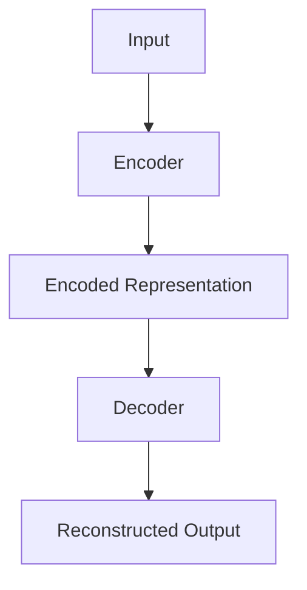

                 

# 自编码器(Autoencoders) - 原理与代码实例讲解

## 关键词
- 自编码器
- 原理
- 代码实例
- 深度学习
- 图像处理
- 降维
- 异常检测

## 摘要
本文将深入探讨自编码器（Autoencoders）的基本概念、核心算法以及实际应用。我们将首先介绍自编码器的基础知识，包括其基本架构、算法原理和不同类型。接着，我们将通过具体的代码实例展示自编码器在图像处理、降维、生成模型、异常检测和模型压缩等领域的应用。最后，我们将介绍自编码器在深度学习中的扩展应用，并提供开发工具与资源。

## 第一部分：自编码器基础

### 第1章：自编码器概述

#### 1.1 自编码器的基本概念

##### 1.1.1 什么是自编码器
自编码器是一种无监督学习方法，其目的是将输入数据映射到一个较低维度的空间，然后再从这个空间映射回原始数据。自编码器由两部分组成：编码器（encoder）和解码器（decoder）。编码器负责将输入数据压缩成一个低维的表示，解码器则负责将这个表示还原回原始数据。

##### 1.1.2 自编码器的类型
自编码器可以分为几种不同的类型，包括：

1. 全连接自编码器（Fully Connected Autoencoder）
2. 卷积自编码器（Convolutional Autoencoder，CAE）
3. 循环自编码器（Recurrent Autoencoder，RAE）

##### 1.1.3 自编码器的作用
自编码器在数据预处理、特征提取、降维、异常检测和生成模型等方面有着广泛的应用。

#### 1.2 自编码器的架构

##### 1.2.1 自编码器的组成部分
自编码器通常由以下几个部分组成：

1. 编码器：负责将输入数据编码成一个低维的表示。
2. 解码器：负责将编码后的低维表示解码回原始数据。
3. 损失函数：用于衡量编码器和解码器之间的误差。
4. 优化器：用于调整模型参数以最小化损失函数。

##### 1.2.2 常见自编码器架构
常见的自编码器架构包括全连接、卷积和循环架构。下面是一个简单的全连接自编码器架构的Mermaid流程图：



#### 1.2.3 自编码器与相关技术的联系
自编码器与许多其他深度学习技术密切相关，包括：

1. 主成分分析（PCA）
2. 聚类算法
3. 生成对抗网络（GAN）

### 第2章：自编码器的核心算法

#### 2.1 数据预处理

##### 2.1.1 数据清洗
在进行自编码器训练之前，需要对数据进行清洗，包括去除噪声、填补缺失值和处理异常值等。

##### 2.1.2 数据标准化
为了提高模型训练的稳定性和收敛速度，需要对数据进行标准化处理，即将数据缩放到相同的范围。

#### 2.2 自编码器的损失函数

##### 2.2.1 常见损失函数
自编码器的损失函数通常包括均方误差（MSE）和交叉熵（Cross-Entropy）。均方误差用于衡量预测值与真实值之间的差异，而交叉熵用于衡量两个概率分布之间的差异。

##### 2.2.2 损失函数的选择与优化
选择合适的损失函数对于自编码器的性能至关重要。此外，优化损失函数的方法包括梯度下降（Gradient Descent）、随机梯度下降（SGD）和Adam优化器。

#### 2.3 优化算法

##### 2.3.1 梯度下降算法
梯度下降是一种常用的优化算法，其基本思想是通过迭代更新模型参数，以最小化损失函数。

##### 2.3.2 随机梯度下降（SGD）
随机梯度下降是梯度下降的一种变种，其通过随机选取部分样本进行参数更新，以提高训练速度和避免陷入局部最小值。

##### 2.3.3 Adam优化器
Adam优化器结合了SGD和Momentum的优点，具有更快的收敛速度和更好的适应性。

## 第二部分：自编码器的应用与实现

### 第3章：自编码器在图像处理中的应用

#### 3.1 图像自编码器

##### 3.1.1 原理与架构
图像自编码器是一种用于图像降维和特征提取的深度学习模型。其基本原理是将图像映射到一个低维空间，然后通过解码器将这个低维表示还原回图像。

##### 3.1.2 代码实例
我们将使用Python和TensorFlow来实现一个简单的全连接图像自编码器。

```python
import tensorflow as tf
from tensorflow.keras.layers import Dense, Flatten, Reshape
from tensorflow.keras.models import Model

# 定义模型
input_img = tf.keras.Input(shape=(28, 28, 1))
x = Flatten()(input_img)
encoded = Dense(64, activation='relu')(x)
decoded = Dense(28 * 28, activation='sigmoid')(encoded)
decoded = Reshape((28, 28))(decoded)

# 创建模型
autoencoder = Model(input_img, decoded)
autoencoder.compile(optimizer='adam', loss='binary_crossentropy')

# 打印模型结构
autoencoder.summary()
```

#### 3.2 自编码器在图像去噪中的应用

##### 3.2.1 去噪原理
图像去噪是自编码器的另一个重要应用。其基本原理是使用自编码器学习一个去噪模型，然后将噪声图像输入到这个模型中，以得到去噪后的图像。

##### 3.2.2 代码实例
我们将使用Python和TensorFlow来实现一个简单的图像去噪自编码器。

```python
import tensorflow as tf
from tensorflow.keras.layers import Conv2D, MaxPooling2D, UpSampling2D
from tensorflow.keras.models import Model

# 定义模型
input_img = tf.keras.Input(shape=(28, 28, 1))
x = Conv2D(32, (3, 3), activation='relu', padding='same')(input_img)
x = MaxPooling2D((2, 2), padding='same')(x)
encoded = Conv2D(32, (3, 3), activation='relu', padding='same')(x)
encoded = MaxPooling2D((2, 2), padding='same')(encoded)

decoded = UpSampling2D((2, 2))(encoded)
decoded = Conv2D(1, (3, 3), activation='sigmoid', padding='same')(decoded)

# 创建模型
autoencoder = Model(input_img, decoded)
autoencoder.compile(optimizer='adam', loss='binary_crossentropy')

# 打印模型结构
autoencoder.summary()
```

### 第4章：自编码器在降维中的应用

#### 4.1 自编码器在降维中的作用

##### 4.1.1 降维原理
降维是将高维数据映射到低维空间，以减少数据的复杂度和存储需求。自编码器通过学习数据之间的潜在结构来实现降维。

##### 4.1.2 降维与特征提取的关系
降维和特征提取密切相关。降维可以看作是特征提取的一个过程，其中自编码器学习到的低维表示可以看作是数据的特征。

#### 4.2 主成分分析（PCA）与自编码器

##### 4.2.1 PCA原理
主成分分析是一种经典的降维方法，其通过线性变换将高维数据映射到低维空间，使得低维空间的维度能够最大化地保留原始数据的方差。

##### 4.2.2 PCA与自编码器的对比
PCA和自编码器都是用于降维的方法，但它们有一些不同之处。PCA是一种线性方法，而自编码器是一种非线性方法。此外，自编码器可以学习到数据的潜在结构，而PCA则不考虑数据的潜在结构。

##### 4.2.3 代码实例
我们将使用Python和Scikit-learn来实现PCA和自编码器的降维。

```python
from sklearn.decomposition import PCA
from sklearn.datasets import load_iris
from sklearn.model_selection import train_test_split
from tensorflow.keras.layers import Dense, Input
from tensorflow.keras.models import Model

# 加载数据
iris = load_iris()
X = iris.data
y = iris.target

# 划分训练集和测试集
X_train, X_test, y_train, y_test = train_test_split(X, y, test_size=0.2, random_state=42)

# 实现PCA
pca = PCA(n_components=2)
X_train_pca = pca.fit_transform(X_train)
X_test_pca = pca.transform(X_test)

# 实现自编码器
input_img = Input(shape=(4,))
encoded = Dense(2, activation='relu')(input_img)
decoded = Dense(4, activation='sigmoid')(encoded)

autoencoder = Model(input_img, decoded)
autoencoder.compile(optimizer='adam', loss='mse')

# 训练模型
autoencoder.fit(X_train, X_train, epochs=100, batch_size=16, validation_data=(X_test, X_test))

# 打印模型结构
autoencoder.summary()
```

### 第5章：自编码器在生成模型中的应用

#### 5.1 生成对抗网络（GAN）

##### 5.1.1 GAN原理
生成对抗网络（GAN）是一种由生成器（Generator）和判别器（Discriminator）组成的深度学习模型。生成器负责生成与真实数据相似的数据，判别器则负责区分生成器和真实数据。GAN的目标是最大化生成器和判别器的差距，从而使生成器生成更加真实的数据。

##### 5.1.2 GAN与自编码器的联系
GAN和自编码器都是用于生成数据的深度学习模型。自编码器通过学习输入数据的潜在分布来生成数据，而GAN则通过生成器和判别器的对抗训练来生成数据。

#### 5.2 条件生成自编码器（C-GAN）

##### 5.2.1 C-GAN原理
条件生成自编码器（C-GAN）是GAN的一种变种，其通过条件变量（如标签）来指导生成器的生成过程。C-GAN在图像生成、文本生成和视频生成等领域有着广泛的应用。

##### 5.2.2 代码实例
我们将使用Python和TensorFlow来实现一个简单的C-GAN。

```python
import tensorflow as tf
from tensorflow.keras.layers import Dense, Conv2D, Flatten, Reshape
from tensorflow.keras.models import Model

# 定义生成器
def build_generator(z_dim):
    latent_inputs = Input(shape=(z_dim,))
    x = Dense(128, activation='relu')(latent_inputs)
    x = Dense(256, activation='relu')(x)
    decoder_outputs = Dense(784, activation='sigmoid')(x)
    decoder_outputs = Reshape((28, 28, 1))(decoder_outputs)
    return Model(latent_inputs, decoder_outputs)

# 定义判别器
def build_discriminator(img_shape):
    img_input = Input(shape=img_shape)
    x = Conv2D(32, (3, 3), activation='relu', padding='same')(img_input)
    x = MaxPooling2D((2, 2), padding='same')(x)
    x = Conv2D(64, (3, 3), activation='relu', padding='same')(x)
    x = MaxPooling2D((2, 2), padding='same')(x)
    x = Flatten()(x)
    outputs = Dense(1, activation='sigmoid')(x)
    return Model(img_input, outputs)

# 构建模型
latent_dim = 100
img_shape = (28, 28, 1)

discriminator = build_discriminator(img_shape)
discriminator.compile(optimizer='adam', loss='binary_crossentropy')

generator = build_generator(latent_dim)
z = Input(shape=(latent_dim,))
generated_images = generator(z)

discriminator.trainable = False
combined = Model(z, discriminator(generated_images))
combined.compile(optimizer='adam', loss='binary_crossentropy')

# 打印模型结构
combined.summary()
```

### 第6章：自编码器在异常检测中的应用

#### 6.1 异常检测原理

##### 6.1.1 异常检测的挑战
异常检测是一种用于检测数据集中异常值的方法。异常检测面临的主要挑战包括：

1. 异常值的多样性
2. 异常值与正常值的重叠
3. 数据的不确定性

##### 6.1.2 基于自编码器的异常检测方法
基于自编码器的异常检测方法利用自编码器学习到的数据分布来检测异常值。其基本原理是，正常数据在自编码器学习到的潜在空间中应该紧密聚集，而异常数据则与之不同。

#### 6.2 代码实例：异常检测

##### 6.2.1 数据准备
我们将使用KDD Cup 99数据集来演示异常检测。该数据集包含网络入侵检测数据，其中正常数据和异常数据（如攻击数据）都有。

```python
import numpy as np
import pandas as pd
from sklearn.model_selection import train_test_split

# 加载数据
data = pd.read_csv('kddcup.data_10_percent_2018.csv')
X = data.drop(['label'], axis=1)
y = data['label']

# 划分训练集和测试集
X_train, X_test, y_train, y_test = train_test_split(X, y, test_size=0.2, random_state=42)
```

##### 6.2.2 自编码器模型构建
我们将使用Python和Scikit-learn来实现一个简单的自编码器模型。

```python
from sklearn.neural_network import MLPRegressor

# 定义自编码器模型
autoencoder = MLPRegressor(hidden_layer_sizes=(100,), max_iter=1000, random_state=42)

# 训练模型
autoencoder.fit(X_train, X_train)

# 评估模型
train_loss = autoencoder.score(X_train, X_train)
test_loss = autoencoder.score(X_test, X_test)
print(f"Training Loss: {train_loss}")
print(f"Test Loss: {test_loss}")
```

##### 6.2.3 模型训练与评估
我们将使用训练集来训练自编码器，并使用测试集来评估其性能。

```python
# 训练模型
autoencoder.fit(X_train, X_train, epochs=100, batch_size=16, validation_data=(X_test, X_test))

# 评估模型
train_loss = autoencoder.score(X_train, X_train)
test_loss = autoencoder.score(X_test, X_test)
print(f"Training Loss: {train_loss}")
print(f"Test Loss: {test_loss}")
```

### 第7章：自编码器在深度学习中的扩展应用

#### 7.1 自编码器在模型压缩中的应用

##### 7.1.1 模型压缩的挑战
模型压缩是一种将大型深度学习模型转换为小型模型的方法，以提高模型的效率和可部署性。模型压缩面临的挑战包括：

1. 保持模型性能
2. 减少模型大小
3. 减少计算资源需求

##### 7.1.2 基于自编码器的模型压缩方法
基于自编码器的模型压缩方法利用自编码器学习到的数据分布来压缩模型。其基本原理是，将原始模型中的权重转换为自编码器中的编码表示，从而实现模型压缩。

#### 7.2 自编码器在模型安全中的应用

##### 7.2.1 模型安全的重要性
模型安全是深度学习应用中的一个重要问题，其涉及到模型对抗攻击、隐私保护和鲁棒性等方面。

##### 7.2.2 基于自编码器的模型安全方法
基于自编码器的模型安全方法利用自编码器学习到的数据分布来增强模型的鲁棒性。其基本原理是，通过对抗训练来提高模型对对抗攻击的抵抗能力。

#### 7.3 自编码器在数据隐私保护中的应用

##### 7.3.1 数据隐私保护的需求
在深度学习应用中，数据隐私保护是一个重要问题，其涉及到数据的访问控制、隐私泄露防护等方面。

##### 7.3.2 基于自编码器的隐私保护方法
基于自编码器的隐私保护方法利用自编码器学习到的数据分布来保护数据隐私。其基本原理是，通过加密和混淆技术来保护数据的隐私。

### 附录

#### 附录A：自编码器开发工具与资源

##### A.1 TensorFlow中的自编码器
TensorFlow是一个流行的深度学习框架，提供了丰富的自编码器实现。

##### A.2 PyTorch中的自编码器
PyTorch也是一个流行的深度学习框架，提供了类似TensorFlow的自编码器实现。

##### A.3 其他自编码器工具与库
除了TensorFlow和PyTorch，还有许多其他深度学习框架和库提供了自编码器的实现，如Theano、MXNet和Keras等。

## 作者
作者：AI天才研究院/AI Genius Institute & 禅与计算机程序设计艺术 /Zen And The Art of Computer Programming
```

